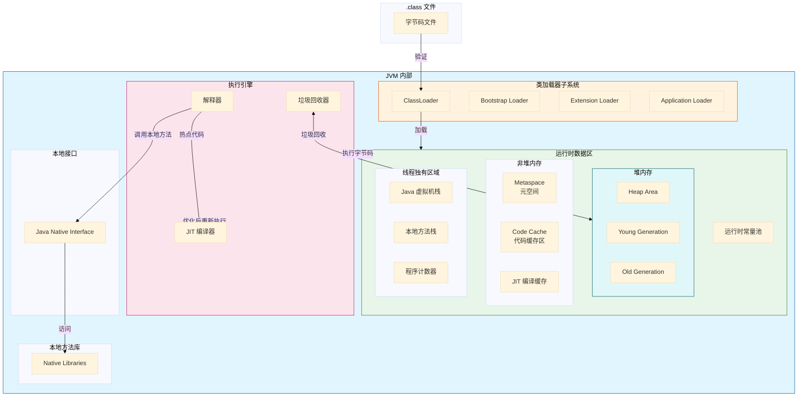
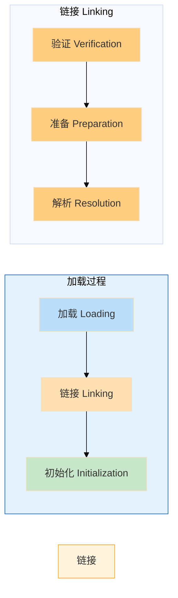
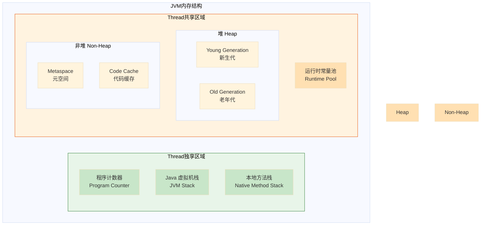
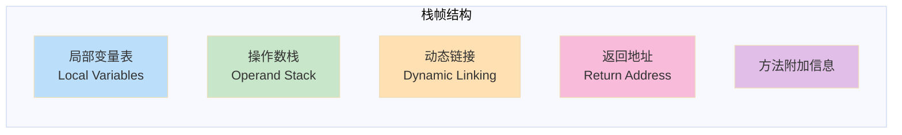
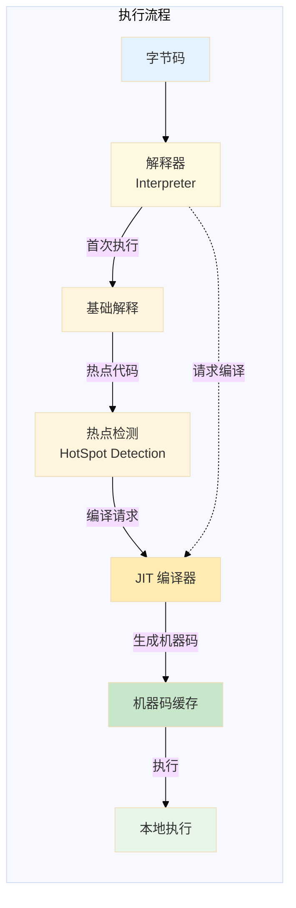
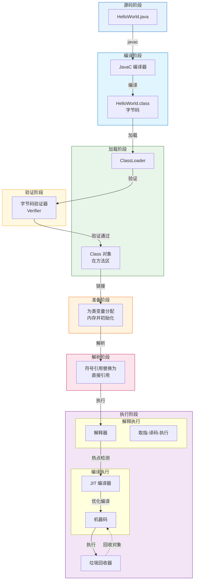
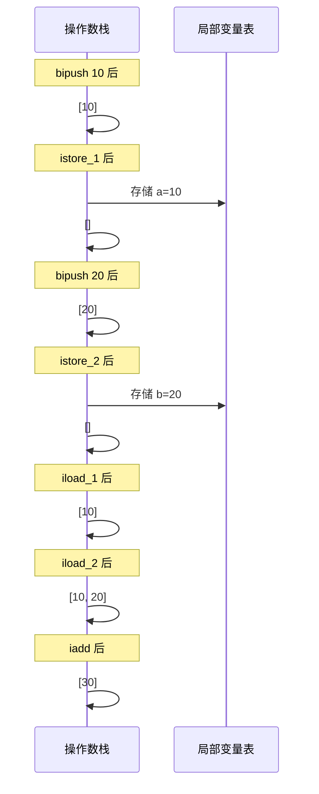
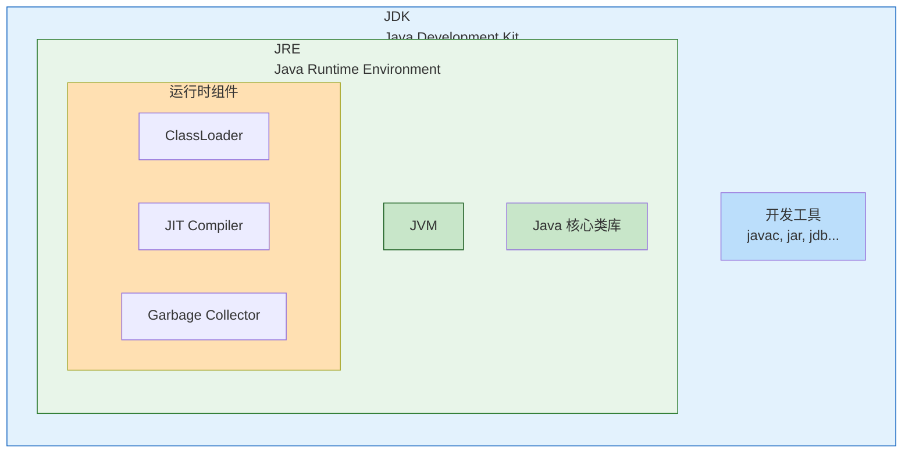
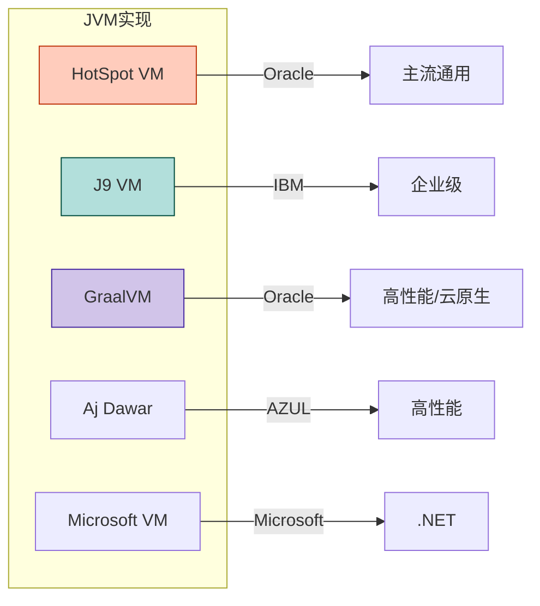
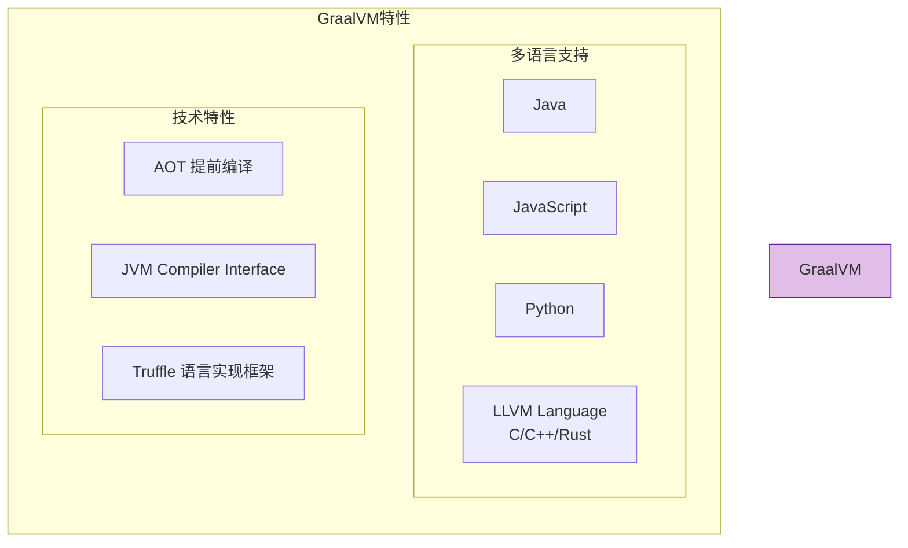

# 01 | JVM 概述与体系结构

## 1.1 JVM 简介

### 1.1.1 什么是 JVM

**JVM（Java Virtual Machine，Java 虚拟机）** 是 Java 语言的运行环境，它是 Java 实现"一次编写，到处运行"（Write Once, Run Anywhere）理念的核心。JVM 本质上是一个抽象的计算机规范，它定义了一套完整的指令集、寄存器格式、栈结构、垃圾回收机制等。

> **核心理解**：JVM 就如同一个"翻译官"，无论你的代码在哪种操作系统上运行，都只需要编译一次成字节码，然后由各平台的 JVM 负责将字节码"翻译"成对应平台能理解的机器指令。

### 1.1.2 Java 跨平台原理

Java 的跨平台特性可以通过一个生活化的比喻来理解：

```
┌─────────────────────────────────────────────────────────────┐
│                     跨平台原理图解                            │
├─────────────────────────────────────────────────────────────┤
│                                                             │
│    Java 源码 (.java)                                         │
│         │                                                   │
│         ▼ 编译                                              │
│    Java 字节码 (.class)                                     │
│         │                                                   │
│         ▼                                                   │
│    ┌─────────┐  ┌─────────┐  ┌─────────┐                   │
│    │ Windows │  │   Mac   │  │  Linux  │                   │
│    │   JVM   │  │   JVM   │  │   JVM   │                   │
│    └─────────┘  └─────────┘  └─────────┘                   │
│         │           │           │                          │
│         ▼           ▼           ▼                          │
│    Windows 指令   Mac 指令   Linux 指令                     │
│                                                             │
└─────────────────────────────────────────────────────────────┘
```

**工作原理**：
1. 程序员编写 `.java` 源文件
2. Java 编译器（`javac`）将源文件编译成平台无关的 `.class` 字节码文件
3. 各平台的 JVM 读取字节码，将指令翻译成对应操作系统的本地机器码

### 1.1.3 Java 代码示例

让我们看一个经典的 Hello World 程序：

```java
public class HelloWorld {
    public static void main(String[] args) {
        System.out.println("Hello, JVM!");
    }
}
```

对应的字节码（使用 `javap -c` 反编译）：

```asm
Compiled from "HelloWorld.java"
public class HelloWorld {
  public HelloWorld();
    Code:
       0: aload_0
       1: invokespecial #1                  // Method java/lang/Object."<init>":()V
       4: return

  public static void main(java.lang.String[]);
    Code:
       0: getstatic     #7                  // Field java/lang/System.out:Ljava/io/PrintStream;
       3: ldc           #13                 // String Hello, JVM!
       5: invokevirtual #15                 // Method java/io/PrintStream.println:(Ljava/lang/String;)V
       8: return
}
```

> **小贴士**：字节码是 JVM 的指令集，每条指令通常为 1 字节（因此称为"字节码"）。虽然有些指令带有参数，但整体大小仍然是 8 位的整数倍。

---

## 1.2 JVM 核心组件

JVM 是一个复杂的系统，由多个核心组件构成。理解这些组件及其交互方式是深入学习 JVM 的基础。

### 1.2.1 JVM 架构总览



### 1.2.2 组件详解

#### 1. 类加载器（ClassLoader）

**类加载器**负责将 `.class` 文件加载到 JVM 中，并将其转换成 `Class` 对象。



**三层类加载器**：
- **Bootstrap ClassLoader（启动类加载器）**：负责加载 `JAVA_HOME/lib` 目录中的核心类库，如 `rt.jar`、`resources.jar`
- **Extension ClassLoader（扩展类加载器）**：负责加载 `JAVA_HOME/lib/ext` 目录中的扩展类库
- **Application ClassLoader（应用类加载器）**：负责加载用户 classpath 上的类库

```java
// 查看类加载器层次结构示例
public class ClassLoaderDemo {
    public static void main(String[] args) {
        // 获取 String 类的类加载器
        ClassLoader stringLoader = String.class.getClassLoader();
        System.out.println("String 类加载器: " + stringLoader);
        // 输出: String 类加载器: null (由 Bootstrap ClassLoader 加载)

        // 获取当前类的类加载器
        ClassLoader currentLoader = ClassLoaderDemo.class.getClassLoader();
        System.out.println("当前类加载器: " + currentLoader);
        System.out.println("当前类加载器的父加载器: " + currentLoader.getParent());
    }
}
```

#### 2. 运行时数据区（Runtime Data Areas）

运行时数据区是 JVM 内存管理的核心区域，用于存储程序运行时所需的各种数据。



| 区域 | 线程独享 | 存储内容 | 异常 |
|------|----------|----------|------|
| 程序计数器 | 是 | 当前执行的字节码行号 | 无 |
| Java 虚拟机栈 | 是 | 方法调用栈帧 | StackOverflowError, OutOfMemoryError |
| 本地方法栈 | 是 | Native 方法调用栈 | StackOverflowError, OutOfMemoryError |
| 堆 | 否 | 对象实例、数组 | OutOfMemoryError |
| 元空间 | 否 | 类元信息、方法元数据 | OutOfMemoryError |
| 运行时常量池 | 否 | 符号引用、字面量 | OutOfMemoryError |

**栈帧（Stack Frame）结构**：



```java
// 局部变量表示例
public class LocalVariablesDemo {
    public int instanceMethod(int a, long b, double c, Object d) {
        // 局部变量表索引分配：
        // 0: this (非静态方法)
        // 1: a (int)
        // 2-3: b (long，占用2个槽位)
        // 4-5: c (double，占用2个槽位)
        // 6: d (对象引用)
        int result = a + (int) b;
        return result;
    }
}
```

#### 3. 执行引擎（Execution Engine）

执行引擎负责执行 Java 字节码，是 JVM 的"动力核心"。



**解释器与 JIT 编译器的区别**：

| 特性 | 解释器 | JIT 编译器 |
|------|--------|------------|
| 执行方式 | 逐行解释执行 | 编译成机器码后执行 |
| 启动速度 | 快 | 慢（需要编译时间） |
| 执行速度 | 较慢 | 快 |
| 内存开销 | 低 | 高（需要存储编译后的代码） |

#### 4. 本地接口（Native Interface）

本地接口允许 Java 代码调用本地方法（C/C++ 编写），是 Java 与外界交互的桥梁。

```java
// JNI 示例
public class NativeDemo {
    // 声明本地方法
    public native void sayHello();

    static {
        // 加载本地库
        System.loadLibrary("nativeimpl");
    }

    public static void main(String[] args) {
        new NativeDemo().sayHello();
    }
}
```

---

## 1.3 JVM 工作流程

### 1.3.1 从源码到执行的全过程



### 1.3.2 字节码执行详解

```java
// 源码
public class ByteCodeDemo {
    public static void main(String[] args) {
        int a = 10;
        int b = 20;
        int c = a + b;
        System.out.println(c);
    }
}
```

对应的字节码执行流程：

```asm
// 字节码解析
public static void main(java.lang.String[]);
  // 构建局部变量表
  0: bipush 10        // 将 byte 类型的 10 推送到操作数栈顶
  2: istore_1         // 将操作数栈顶 int 值存入局部变量表索引 1 (变量 a)
  3: bipush 20        // 将 byte 类型的 20 推送到操作数栈顶
  5: istore_2         // 将操作数栈顶 int 值存入局部变量表索引 2 (变量 b)
  // 执行加法
  6: iload_1          // 将局部变量表索引 1 的值加载到操作数栈 (a)
  7: iload_2          // 将局部变量表索引 2 的值加载到操作数栈 (b)
  8: iadd             // 弹出栈顶两个 int，相加，结果压栈
  9: istore_3         // 将结果存入局部变量表索引 3 (变量 c)
  // 输出
  10: getstatic #7    // 获取 System.out 静态字段引用
  13: iload_3         // 加载 c 的值到操作数栈
  14: invokevirtual #15 // 调用 PrintStream.println(int) 方法
  17: return          // 返回
```

**操作数栈工作示意**：



---

## 1.4 JVM 与 JRE、JDK 的关系

### 1.4.1 三者关系图



### 1.4.2 详细对比

| 组件 | 全称 | 主要内容 | 使用场景 |
|------|------|----------|----------|
| **JDK** | Java Development Kit | JRE + 开发工具 | 开发者使用，需要编译 Java 代码 |
| **JRE** | Java Runtime Environment | JVM + 核心类库 | 仅运行 Java 程序，不需要开发 |
| **JVM** | Java Virtual Machine | 虚拟机核心 | 仅提供运行时环境 |

### 1.4.3 包含关系总结

```
JDK = JRE + 开发工具（javac, jar, javadoc, jdb, javap...）
JRE = JVM + Java 核心类库（rt.jar, tools.jar...）
JVM = 类加载器 + 运行时数据区 + 执行引擎 + 本地接口
```

---

## 1.5 常见 JVM 实现

### 1.5.1 JVM 实现对比



### 1.5.2 HotSpot JVM

**HotSpot** 是目前使用最广泛的 JVM 实现，由 Oracle 官方维护。

**核心特性**：
- **热点代码探测**：通过热点代码检测技术，识别高频执行的代码并进行即时编译优化
- **方法内联**：将频繁调用的小方法直接嵌入调用处，减少方法调用开销
- **逃逸分析**：分析对象的动态作用域，优化堆分配为栈分配

```java
// 逃逸分析示例
public class EscapeAnalysisDemo {
    // 开启 -XX:+DoEscapeAnalysis 后
    // 此方法中的对象可能分配在栈上而非堆上
    public String createString() {
        StringBuilder sb = new StringBuilder();
        sb.append("Hello");
        sb.append("World");
        return sb.toString();
        // StringBuilder 不会逃逸出方法作用域
        // JVM 可以优化为栈上分配
    }
}
```

### 1.5.3 IBM J9 JVM

**J9** 是 IBM 开发的 JVM 实现，主要用于 IBM 的企业级产品。

**特点**：
- 高度模块化设计
- 优秀的启动性能
- 广泛用于 AIX、Linux 等企业环境

### 1.5.4 GraalVM

**GraalVM** 是 Oracle 推出的新一代高性能 VM，被称为"VM 领域的革新者"。

**核心优势**：


**使用场景**：
- 云原生应用（原生镜像启动快、占用内存小）
- 微服务架构
- 多语言混合编程

---

## 1.6 常见面试题

### Q1: JVM 的主要组成部分有哪些？

**参考答案**：
JVM 主要由以下四部分组成：
1. **类加载器（ClassLoader）**：负责加载 .class 文件，验证字节码安全性
2. **运行时数据区（Runtime Data Areas）**：包括堆、方法区、虚拟机栈、本地方法栈、程序计数器
3. **执行引擎（Execution Engine）**：包括解释器和 JIT 编译器，负责执行字节码
4. **本地接口（Native Interface）**：允许 Java 调用本地方法（C/C++）

### Q2: Java 是如何实现跨平台的？

**参考答案**：
Java 通过"中间字节码"机制实现跨平台。Java 源代码（.java）经过 javac 编译成平台无关的字节码（.class），然后由各平台的 JVM 将字节码翻译成对应的本地机器指令。由于各平台 JVM 的存在，开发者只需编写一次代码，即可在任何安装了 JVM 的平台上运行。

### Q3: JDK 和 JRE 的区别是什么？

**参考答案**：
- **JRE（Java Runtime Environment）**：Java 运行时环境，包含 JVM 和 Java 核心类库，用于运行已编译的 Java 程序
- **JDK（Java Development Kit）**：Java 开发工具包，包含 JRE 以及 javac、jar、javadoc 等开发工具，用于开发 Java 程序

简单来说：**JDK = JRE + 开发工具**，**JRE = JVM + 核心类库**。

---

## 本章小结

```
┌─────────────────────────────────────────────────────────────┐
│                    Chapter 01 要点回顾                        │
├─────────────────────────────────────────────────────────────┤
│                                                             │
│  1. JVM 是什么？                                              │
│     └─ Java 虚拟机，Java 跨平台运行的核心                      │
│                                                             │
│  2. JVM 核心组件：                                           │
│     ├─ 类加载器 ── 加载 .class 文件                          │
│     ├─ 运行时数据区 ── 内存管理核心                          │
│     ├─ 执行引擎 ── 字节码执行引擎                           │
│     └─ 本地接口 ── 调用本地方法的桥梁                        │
│                                                             │
│  3. JVM 工作流程：                                           │
│     源码 → 编译 → 字节码 → 加载 → 验证 → 准备 → 解析 → 执行  │
│                                                             │
│  4. JDK、JRE、JVM 关系：                                     │
│     JDK > JRE > JVM                                          │
│                                                             │
│  5. 常见 JVM 实现：                                          │
│     HotSpot（Oracle）、J9（IBM）、GraalVM（Oracle 新一代）  │
│                                                             │
└─────────────────────────────────────────────────────────────┘
```

---

> **下一章预告**：Chapter 02 将深入探讨 **类加载器子系统**，包括双亲委派模型、打破双亲委派的方式、自定义类加载器的实现等核心知识点。
