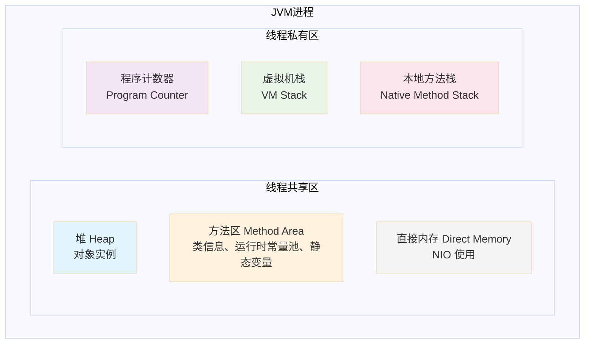
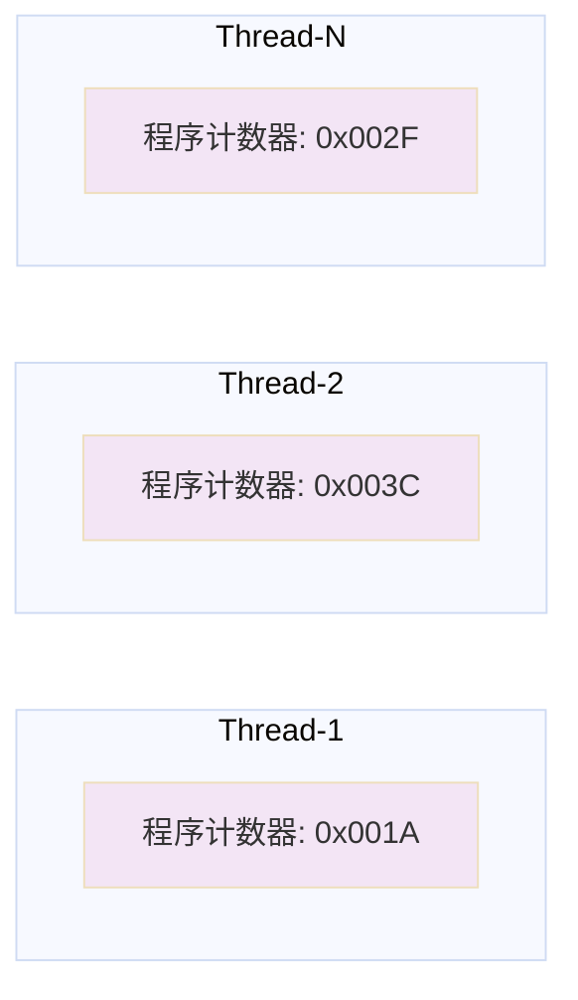
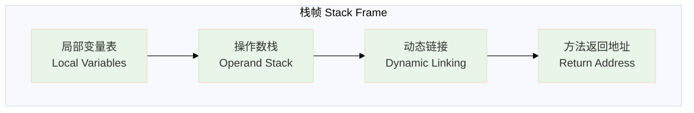
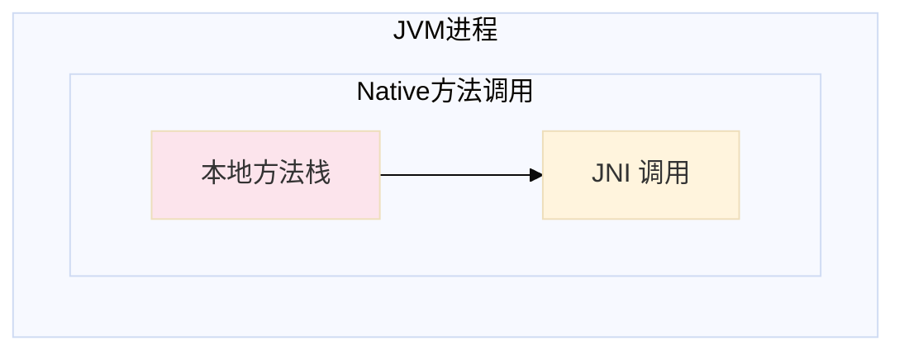
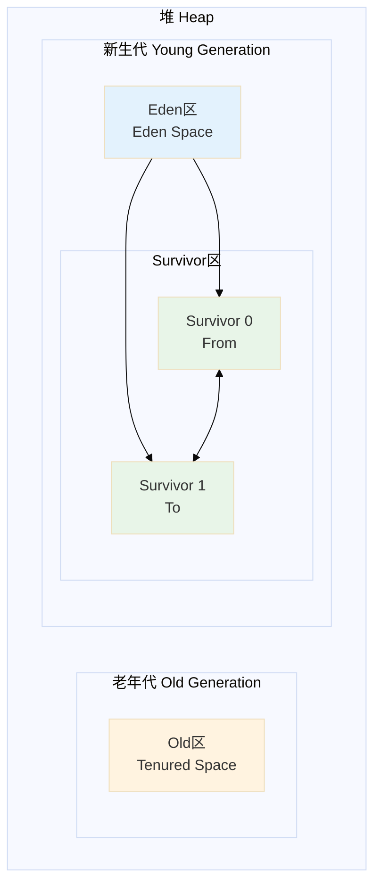
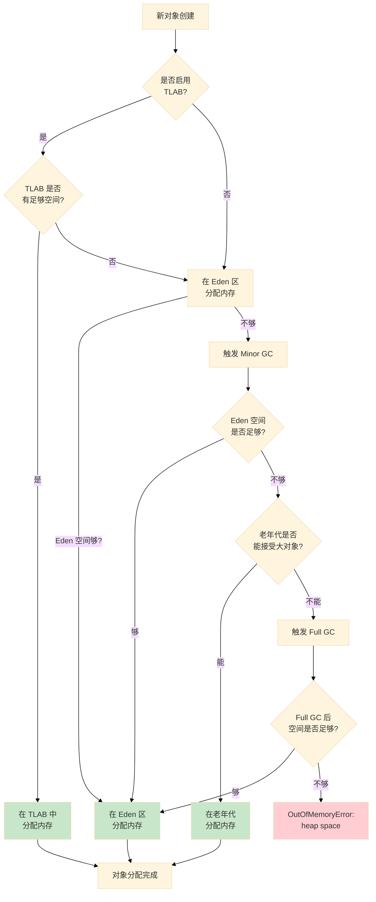
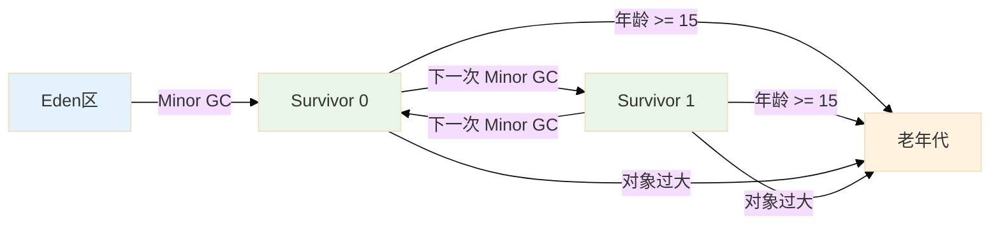
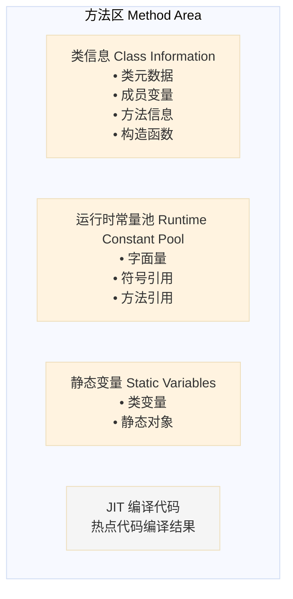
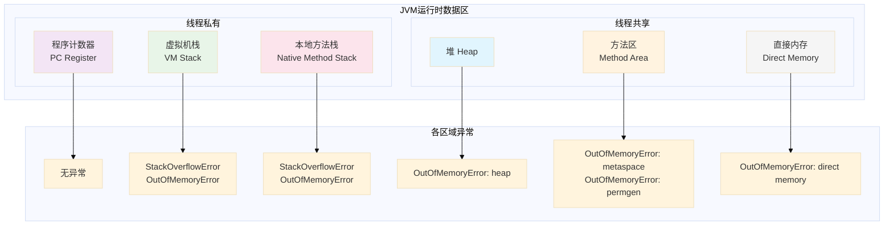

# 03 | 运行时数据区

## 概述

JVM 在运行期间会将内存划分为多个不同的区域，这些区域各有其用途和生命周期。理解运行时数据区是掌握 JVM 内存管理的基石。



---

## 1. 程序计数器（Program Counter Register）

### 1.1 作用

程序计数器是一块较小的内存空间，用于记录当前线程正在执行的**字节码指令地址**。当线程执行 Java 方法时，它记录的是正在执行的虚拟机字节码指令的地址；如果执行的是本地（Native）方法，则其值应为空（Undefined）。

### 1.2 特点

- **线程私有**：每个线程都有独立的程序计数器，各线程之间互不影响
- **唯一不会发生 OutOfMemoryError 的区域**：它的内存大小在编译期确定，且只存储一个返回值或指针

### 1.3 异常情况

程序计数器**不会**抛出任何内存溢出异常（OutOfMemoryError）。

### 1.4 图解



---

## 2. 虚拟机栈（VM Stack）

### 2.1 作用

虚拟机栈描述的是**线程执行的内存模型**：每个方法在执行时都会创建一个**栈帧（Stack Frame）**用于存储局部变量表、操作数栈、动态链接、方法返回地址等信息。

### 2.2 栈帧结构



#### 2.2.1 局部变量表

局部变量表存放的是**方法参数和方法内部定义的局部变量**，其容量以**变量槽（Slot）**为最小单位。

```java
public class LocalVariablesDemo {
    /**
     * 局部变量表示例
     * 0: this 引用
     * 1: int a
     * 2: long b (占用两个槽位)
     * 3-4: double c (占用两个槽位)
     * 5: Object reference
     */
    public void method(int a, long b, double c, Object ref) {
        int x = 10;
        String str = "Hello";
        // ...
    }
}
```

> **注意**：
> - 变量槽是 JVM 为局部变量分配内存的最小单位
> - long 和 double 类型占用 2 个槽位，其余类型（byte、short、char、int、float、reference、returnAddress）占用 1 槽位
> - 实例方法的局部变量表中，索引 0 固定存储 `this` 引用

#### 2.2.2 操作数栈

操作数栈是一个**后进先出（LIFO）栈**，用于存放操作数、中间结果或方法返回值。

```java
public class OperandStackDemo {
    /**
     * 操作数栈示例
     * 执行流程：
     * 1. bipush 10  -> 将 10 入栈
     * 2. bipush 20  -> 将 20 入栈
     * 3. iadd       -> 弹出 20 和 10，相加后结果 30 入栈
     * 4. istore_1   -> 弹出 30 存入局部变量表索引 1
     */
    public int calculate() {
        int a = 10;
        int b = 20;
        return a + b;
    }
}
```

#### 2.2.3 动态链接

每个栈帧都包含一个指向该帧所属方法的**运行时常量池**中的引用，用于支持方法调用过程中的**动态链接**。

- **符号引用**：在类加载阶段或第一次使用时转换为直接引用
- **直接引用**：指向实际内存地址的指针

#### 2.2.4 方法返回地址

方法执行完毕后，需要返回到调用该方法的位置。栈帧中保存了：

- **正常返回**：恢复调用者的局部变量表和程序计数器
- **异常返回**：通过异常处理器表确定

### 2.3 特点

- **线程私有**：生命周期与线程相同
- **数据结构**：后进先出（LIFO）栈
- **内存大小可以固定或动态扩展**：通过 `-Xss` 参数设置

### 2.4 异常情况

| 异常类型 | 触发条件 |
|----------|----------|
| `StackOverflowError` | 线程请求的栈深度超过 JVM 所允许的最大深度（递归调用） |
| `OutOfMemoryError` | JVM 栈内存无法申请到足够内存（创建大量线程） |

### 2.5 代码示例

#### 栈溢出示例（StackOverflowError）

```java
public class StackOverflowDemo {
    /**
     * 递归调用导致栈溢出
     * JVM 参数: -Xss256k (设置栈大小为 256KB)
     */
    private int count = 0;

    public void recursiveCall() {
        count++;
        recursiveCall(); // 无限递归，直到栈帧超出限制
    }

    public static void main(String[] args) {
        StackOverflowDemo demo = new StackOverflowDemo();
        try {
            demo.recursiveCall();
        } catch (StackOverflowError e) {
            System.out.println("栈深度达到: " + demo.count);
            System.out.println("触发 StackOverflowError!");
            // 栈溢出通常发生在栈深度达到数万次递归时
        }
    }
}
```

执行结果：
```
栈深度达到: 47892
触发 StackOverflowError!
```

---

## 3. 本地方法栈（Native Method Stack）

### 3.1 作用

本地方法栈与虚拟机栈类似，区别在于：

- **虚拟机栈**：为 JVM 执行 Java 字节码服务
- **本地方法栈**：为 JVM 执行**本地（Native）方法**服务

### 3.2 特点

- **线程私有**：与虚拟机栈相同的线程模型
- **实现方式**：有的 JVM 实现（如 Sun HotSpot）将两者合并
- **内存区域**：同样可以抛出 `StackOverflowError` 和 `OutOfMemoryError`

### 3.3 图解



---

## 4. 堆（Heap）

### 4.1 作用

堆是 JVM 所管理的**最大一块内存区域**，用于存放**几乎所有的对象实例和数组**。它是线程共享区域，在 JVM 启动时创建。

### 4.2 内存分区

现代 JVM 采用**分代收集算法**，将堆分为以下区域：



| 区域 | 说明 | 默认比例 |
|------|------|----------|
| Eden 区 | 新对象优先分配区域 | 8:1:1 |
| Survivor 0/1 区 |  Minor GC 后存活对象的交换区 | 各占 1/10 |
| Old 区 | 长生命周期对象或大对象 | 约 2/3 |

> **说明**：新生代与老年代的默认比例是 **1:2**（可以通过 `-XX:NewRatio` 配置）。

### 4.3 对象分配过程



### 4.4 对象晋升规则



**晋升条件**：
1. 年龄阈值达到 **MaxTenuringThreshold**（默认 15，可通过 `-XX:MaxTenuringThreshold` 设置）
2. Survivor 空间相同年龄所有对象大小的总和 **超过 Survivor 空间的一半**，年龄 >= 该年龄的对象直接进入老年代

### 4.5 特点

- **线程共享**：所有线程都访问同一堆内存
- **内存空间可以固定或扩展**：通过 `-Xms`（最小）和 `-Xmx`（最大）参数设置
- **垃圾收集的主要区域**：新生代采用 Minor GC，老年代采用 Major/Full GC

### 4.6 异常情况

| 异常类型 | 触发条件 |
|----------|----------|
| `OutOfMemoryError: Java heap space` | 堆内存无法完成对象分配，且垃圾收集后仍无法获取足够空间 |

### 4.7 代码示例

#### 堆内存溢出示例（OutOfMemoryError）

```java
import java.util.ArrayList;
import java.util.List;

public class HeapOverflowDemo {
    /**
     * 堆内存溢出示例
     * JVM 参数: -Xms20m -Xmx20m (限制堆内存为 20MB)
     */
    public static void main(String[] args) {
        List<byte[]> list = new ArrayList<>();
        int i = 0;
        try {
            while (true) {
                // 每个 byte[] 大小约 1MB
                list.add(new byte[1024 * 1024]);
                i++;
                System.out.println("已分配第 " + i + " MB");
            }
        } catch (OutOfMemoryError e) {
            System.out.println("已分配 " + i + " MB 后触发 OutOfMemoryError!");
            System.out.println("堆内存已耗尽！");
        }
    }
}
```

执行结果：
```
已分配第 1 MB
已分配第 2 MB
...
已分配第 17 MB
已分配第 18 MB
已分配第 19 MB
已分配 19 MB 后触发 OutOfMemoryError!
堆内存已耗尽！
```

---

## 5. 方法区（Method Area）

### 5.1 作用

方法区是 JVM 定义的**逻辑区域**（并非所有 JVM 实现都严格区分），用于存储以下信息：

- **类信息**：类的元数据（版本、修饰符、字段、方法等）
- **运行时常量池**：存放编译期生成的各种字面量和符号引用
- **静态变量**：类变量（与类直接相关，非实例变量）
- **即时编译器编译后的代码**：JIT 编译生成的机器码

### 5.2 组成结构



### 5.3 运行时常量池

运行时常量池是方法区的一部分，具有**动态性**：

- 编译期：存放字面量（字符串字面量、基本类型常量）和符号引用
- 运行期：支持**字符串驻留（String.intern）**、动态生成常量（如 `Class` 文件的 `CONSTANT_Dynamic`）

```java
public class RuntimeConstantPoolDemo {
    public static void main(String[] args) {
        // 字符串驻留示例
        String s1 = new String("hello");
        String s2 = new String("hello");
        String s3 = "hello";
        String s4 = "hello";

        System.out.println(s1 == s2);        // false, new 创建的对象不同
        System.out.println(s3 == s4);        // true, 字符串常量池
        System.out.println(s1 == s3);        // false, 对象 vs 常量池
        System.out.println(s1.intern() == s3); // true, intern() 返回常量池引用
    }
}
```

### 5.4 特点

- **线程共享**：与堆一样是线程共享区域
- **内存空间可以固定或扩展**：通过 `-XX:MetaspaceSize` 和 `-XX:MaxMetaspaceSize` 设置
- **垃圾收集条件较严格**：主要回收废弃常量和无用类（-Xnoclassgc 参数可关闭）

### 5.5 异常情况

| 异常类型 | 触发条件 |
|----------|----------|
| `OutOfMemoryError: Metaspace` | 元空间（方法区实现）内存不足 |
| `OutOfMemoryError: PermGen space` | 旧版 JVM 的永久代内存不足（JDK 7 及之前） |

### 5.6 代码示例

#### 方法区溢出示例

```java
import net.sf.cglib.proxy.Enhancer;
import net.sf.cglib.proxy.MethodInterceptor;
import net.sf.cglib.proxy.MethodProxy;
import java.lang.reflect.Method;

/**
 * 方法区（元空间）溢出示例
 * JVM 参数: -XX:MetaspaceSize=10m -XX:MaxMetaspaceSize=10m
 * 需要添加 cglib 依赖
 */
public class MetaspaceOverflowDemo {

    public static void main(String[] args) {
        int count = 0;
        try {
            while (true) {
                // 动态生成类来耗尽元空间
                Enhancer enhancer = new Enhancer();
                enhancer.setSuperclass(MetaspaceOverflowDemo.class);
                enhancer.setUseCache(false); // 禁用缓存，强制生成新类
                enhancer.setCallback(new MethodInterceptor() {
                    @Override
                    public Object intercept(Object obj, Method method,
                            Object[] args, MethodProxy proxy) throws Throwable {
                        return proxy.invokeSuper(obj, args);
                    }
                });
                enhancer.create();
                count++;
            }
        } catch (OutOfMemoryError e) {
            System.out.println("已生成 " + count + " 个类后触发 OutOfMemoryError!");
            System.out.println("元空间已耗尽！");
        }
    }
}
```

---

## 6. 直接内存（Direct Memory）

### 6.1 作用

直接内存是**非堆内存**，也称为**堆外内存**，通过 `java.nio.DirectByteBuffer` 进行分配。它**不受 Java 堆大小限制**，但受本机总内存限制。

### 6.2 使用场景

- **NIO 编程**：使用 Channel 和 Buffer 的 I/O 操作
- **高性能场景**：避免在 JVM 堆和本地内存之间来回复制数据
- **Socket 缓冲**：JVM 需要与操作系统共享缓冲区

### 6.3 特点

- **不属于 JVM 运行时数据区**：直接分配在物理内存中
- **通过 JVM 参数配置**：`MaxDirectMemorySize`（默认与 -Xmx 相等）
- **回收依赖 Java 对象的引用**：DirectByteBuffer 对象被 GC 时，会触发释放本地内存

### 6.4 异常情况

| 异常类型 | 触发条件 |
|----------|----------|
| `OutOfMemoryError: Direct buffer memory` | 申请的直接内存超过限制 |

### 6.5 代码示例

#### 直接内存溢出示例

```java
import java.nio.ByteBuffer;
import java.util.ArrayList;
import java.util.List;

/**
 * 直接内存溢出示例
 * JVM 参数: -Xmx100m -XX:MaxDirectMemorySize=50m
 */
public class DirectMemoryOverflowDemo {

    public static void main(String[] args) {
        List<ByteBuffer> buffers = new ArrayList<>();
        int count = 0;
        try {
            while (true) {
                // 每次分配 10MB 直接内存
                ByteBuffer buffer = ByteBuffer.allocateDirect(10 * 1024 * 1024);
                buffers.add(buffer);
                count++;
                System.out.println("已分配 " + count + " 块 10MB 直接内存");
            }
        } catch (OutOfMemoryError e) {
            System.out.println("已分配 " + count + " 块后触发 OutOfMemoryError!");
            System.out.println("直接内存已耗尽！");
        }
    }
}
```

---

## 7. 运行时数据区总结

### 7.1 完整架构图



### 7.2 区域对比

| 区域 | 线程私有/共享 | 异常类型 | JVM 参数 |
|------|--------------|----------|----------|
| 程序计数器 | 私有 | 无 | 无法设置 |
| 虚拟机栈 | 私有 | StackOverflowError, OutOfMemoryError | -Xss |
| 本地方法栈 | 私有 | StackOverflowError, OutOfMemoryError | -Xss |
| 堆 | 共享 | OutOfMemoryError: heap | -Xms, -Xmx, -Xmn |
| 方法区 | 共享 | OutOfMemoryError: metaspace/permgen | -XX:MetaspaceSize, -XX:MaxMetaspaceSize |
| 直接内存 | 共享 | OutOfMemoryError: direct memory | -XX:MaxDirectMemorySize |

### 7.3 核心要点

1. **程序计数器**：唯一不会 OOM 的区域，记录字节码执行位置
2. **虚拟机栈**：存储方法调用的栈帧，深度过深会 StackOverflow
3. **本地方法栈**：为 Native 方法服务，某些 JVM 将其与虚拟机栈合并
4. **堆**：最大内存区域，存储对象实例，是 GC 的主要工作区域
5. **方法区**：存储类信息、常量、静态变量，JDK 8+ 使用元空间替代永久代
6. **直接内存**：堆外内存，用于 NIO 高性能 I/O 操作

---

## 8. 参考文献

- 《深入理解 Java 虚拟机：JVM 高级特性与最佳实践（第3版）》- 周志明
- JVM 官方文档：https://docs.oracle.com/javase/specs/jvms/se17/html/
