# 04 | 垃圾回收机制

## 目录

- [4.1 垃圾回收概述](#41-垃圾回收概述)
- [4.2 如何识别垃圾](#42-如何识别垃圾)
- [4.3 垃圾回收算法](#43-垃圾回收算法)
- [4.4 垃圾收集器](#44-垃圾收集器)
- [4.5 GC 分类](#45-gc-分类)
- [4.6 GC 日志分析](#46-gc-日志分析)
- [4.7 实战调优建议](#47-实战调优建议)

---

## 4.1 垃圾回收概述

### 4.1.1 什么是垃圾

**垃圾（Garbage）** 是指在程序运行过程中不再被使用的对象占用的内存空间。垃圾回收（Garbage Collection，简称 GC）就是自动回收这些不再使用的内存区域的过程。

### 4.1.2 为什么需要垃圾回收

在 C/C++ 等语言中，内存管理由程序员手动完成，容易导致以下问题：

| 问题 | 描述 | 后果 |
|------|------|------|
| 野指针 | 指针指向已释放的内存 | 程序崩溃、数据损坏 |
| 内存泄漏 | 申请的内存在不使用后未释放 | 内存逐渐耗尽 |
| 重复释放 | 对同一块内存释放两次 | 程序崩溃 |

Java 通过垃圾回收机制自动管理内存，解放了程序员的双手，同时也避免了上述问题。

### 4.1.3 Java 内存回收的区域

Java 内存回收主要关注 **堆（Heap）** 和 **方法区（MetaSpace）**：

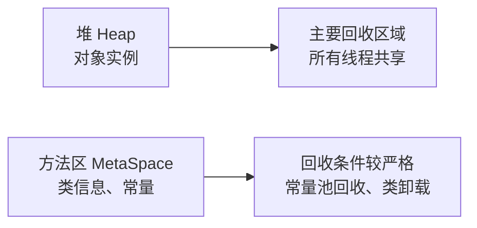

> **注意**：程序计数器、虚拟机栈、本地方法栈不需要垃圾回收，因为它们随着线程而生，随着线程而灭。

---

## 4.2 如何识别垃圾

垃圾识别主要有两种算法：**引用计数法** 和 **可达性分析法**。

### 4.2.1 引用计数法（Reference Counting）

**原理**：为每个对象维护一个计数器，记录指向该对象的引用数量。当计数器为 0 时，说明对象已不可达。

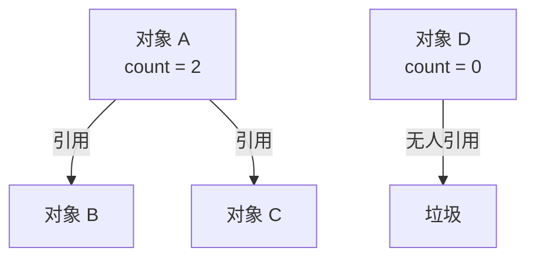

**优点**：
- 实现简单
- 回收即时的（没有延迟）

**缺点**：
- **无法解决循环引用问题**：两个对象互相引用，但已经没有任何外部引用
- **计数器维护有开销**：每次引用变更都需要更新计数器

```java
// 循环引用示例
public class CircularReference {
    CircularReference other;

    public static void main(String[] args) {
        CircularReference obj1 = new CircularReference(); // obj1 ref count = 1
        CircularReference obj2 = new CircularReference(); // obj2 ref count = 1
        obj1.other = obj2; // obj2 ref count = 2
        obj2.other = obj1; // obj1 ref count = 2
        obj1 = null; // obj1 ref count = 1
        obj2 = null; // obj2 ref count = 1
        // 虽然 obj1 和 obj2 都不可达，但引用计数都不为 0
        // 引用计数法无法回收这两个对象
    }
}
```

> **历史**：Python、Redis 等早期版本使用引用计数法（Python 仍使用，但配合其他机制解决循环引用）。

### 4.2.2 可达性分析法（Reachability Analysis）

**原理**：通过一系列 "GC Roots" 作为起点，从这些起点向下搜索，当一个对象到 GC Roots 没有任何引用链相连时，说明该对象不可达。

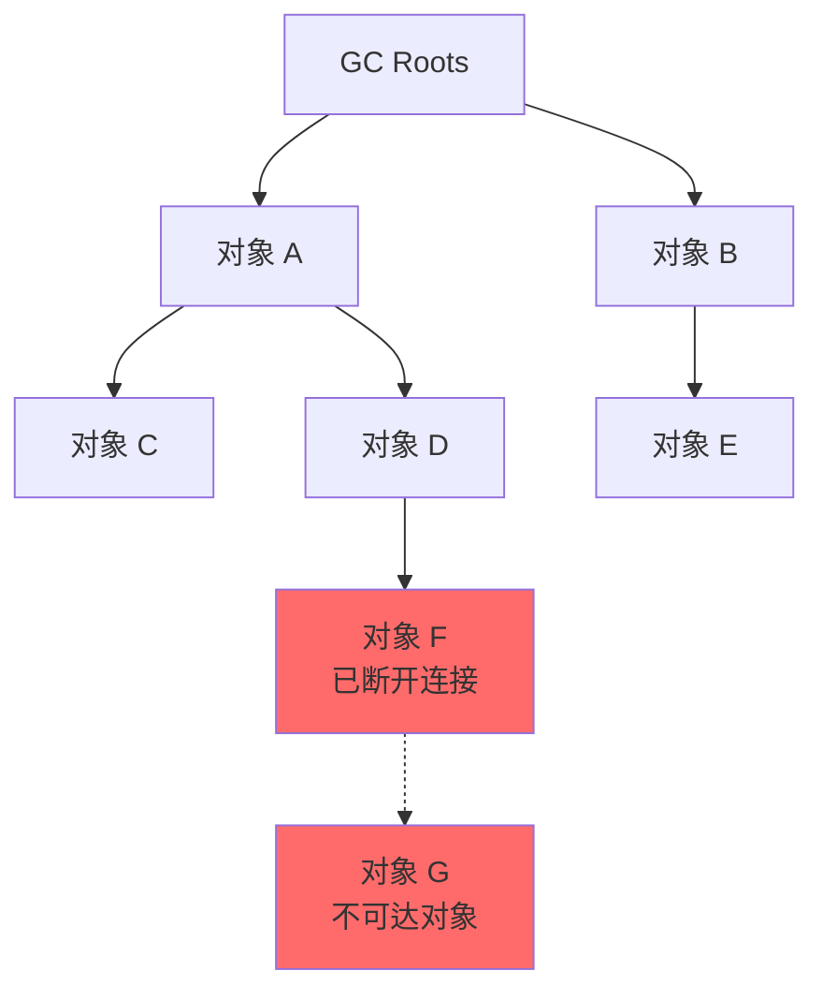

**GC Roots 包括**：

| 类型 | 说明 |
|------|------|
| 虚拟机栈（栈帧中的本地变量表） | 正在执行的方法中的局部变量 |
| 方法区中类静态属性引用的对象 | 类的静态变量 |
| 方法区中常量引用的对象 | 常量池中的常量 |
| 本地方法栈中 JNI 引用的对象 | Native 方法中的对象 |
| JVM 内部的引用 | 加载器、Class 对象等 |
| 所有 synchronized 锁住的对象 | 持有锁的对象 |

**优点**：
- 可以解决循环引用问题
- 是主流 JVM 使用的算法

**缺点**：
- 需要 Stop-The-World（暂停所有应用线程）
- GC 时需要扫描所有引用链

### 4.2.3 引用类型

Java 4 种引用类型从强到弱：

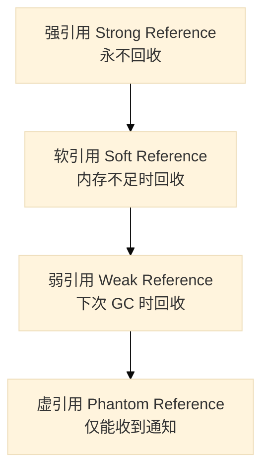

| 引用类型 | 实现类 | 回收时机 | 典型用途 |
|----------|--------|----------|----------|
| 强引用 | 普通变量赋值 | 永不回收 | 普通对象引用 |
| 软引用 | `SoftReference<T>` | 内存不足时回收 | 缓存 |
| 弱引用 | `WeakReference<T>` | 下次 GC 时回收 | 缓存、Map 键 |
| 虚引用 | `PhantomReference<T>` | 不影响回收时机 | 追踪对象回收 |

```java
import java.lang.ref.SoftReference;
import java.lang.ref.WeakReference;
import java.lang.ref.PhantomReference;
import java.lang.ref.ReferenceQueue;
import java.util.HashMap;
import java.util.Map;

public class ReferenceExample {

    // 软引用：内存敏感缓存
    public static class SoftCache {
        private Map<String, SoftReference<byte[]>> cache = new HashMap<>();

        public void put(String key, byte[] value) {
            cache.put(key, new SoftReference<>(value));
        }

        public byte[] get(String key) {
            SoftReference<byte[]> ref = cache.get(key);
            return ref != null ? ref.get() : null;
        }
    }

    // 弱引用：防止内存泄漏
    public static class WeakCache {
        private Map<String, WeakReference<byte[]>> cache = new HashMap<>();

        public void put(String key, byte[] value) {
            cache.put(key, new WeakReference<>(value));
        }

        public byte[] get(String key) {
            WeakReference<byte[]> ref = cache.get(key);
            return ref != null ? ref.get() : null;
        }
    }

    // 虚引用：跟踪对象回收
    public static class Tracker {
        public static void track() throws Exception {
            ReferenceQueue<byte[]> queue = new ReferenceQueue<>();
            byte[] data = new byte[1024];
            PhantomReference<byte[]> phantomRef = new PhantomReference<>(data, queue);

            data = null; // 断开强引用
            System.gc(); // 触发 GC

            Thread.sleep(100);
            System.out.println("PhantomReference enqueued: " + (queue.poll() != null));
        }
    }
}
```

---

## 4.3 垃圾回收算法

### 4.3.1 标记-清除算法（Mark-Sweep）

**原理**：分为"标记"和"清除"两个阶段。先标记出所有需要回收的对象，然后统一回收被标记的对象。

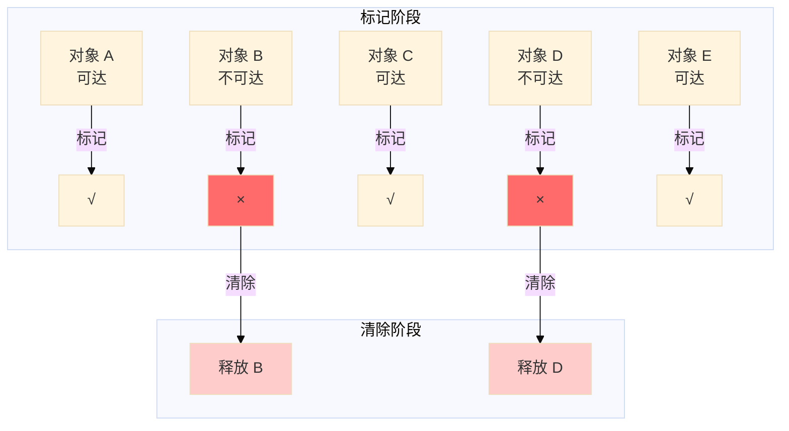

**优点**：
- 简单直接
- 不需要移动对象

**缺点**：
- **效率问题**：标记和清除两个过程效率都不高
- **空间问题**：清除后产生大量不连续内存碎片

**示意图**：

```
初始状态：        标记后：          清除后：
┌──┬──┬──┬──┐    ┌──┬──┬──┬──┐    ┌──┬──┬──┬──┐
│ A│ B│ C│ D│    │ A│ X│ C│ X│    │ A│  │ C│  │
└──┴──┴──┴──┘    └──┴──┴──┴──┘    └──┴──┴──┴──┘
 X = 标记为垃圾   A,C 为存活对象    留下内存碎片
```

**适用场景**：老年代收集（CMS 收集器早期使用）

### 4.3.2 复制算法（Copying）

**原理**：将内存划分为大小相等的两块，每次只使用一块。当这一块用完时，将存活的对象复制到另一块上，然后一次性清除这块。

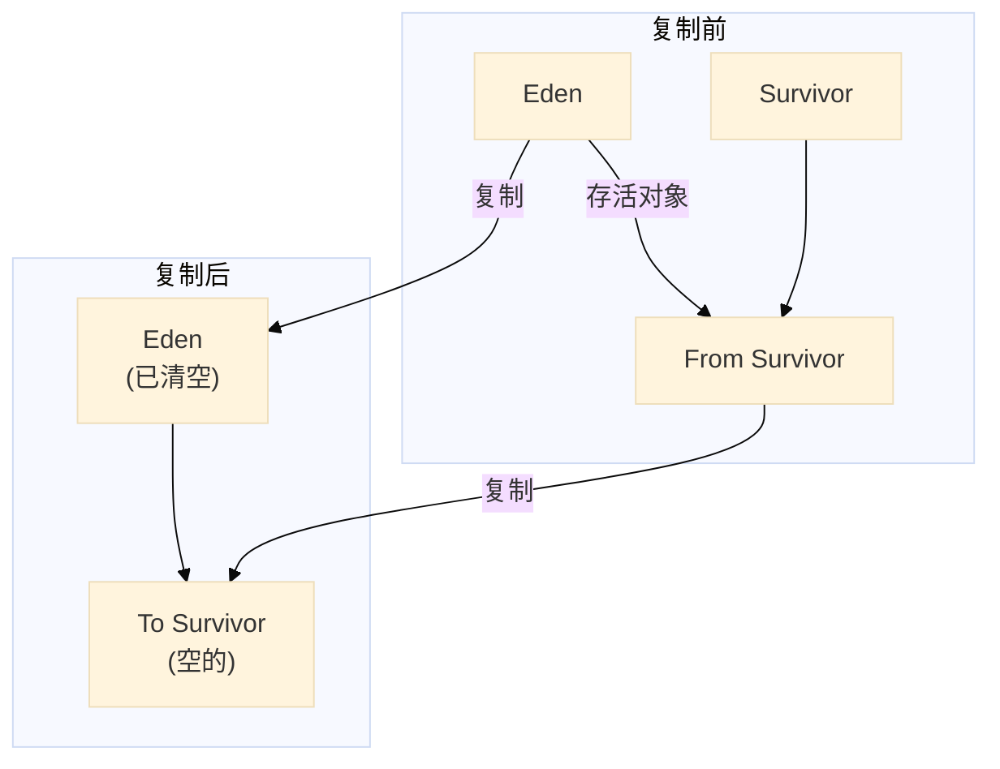

**优点**：
- 效率高（只需移动指针）
- 无内存碎片

**缺点**：
- 可用内存减半（需要两倍空间）
- 如果存活对象多，复制开销大

**示意图**：

```
初始状态：        复制后：          交换角色后：
┌─────────────┐   ┌─────────────┐   ┌─────────────┐
│    From     │   │     To      │   │    From     │
│  A  B  C    │   │   A  C      │   │  (空的)     │
│  (使用中)   │   │  (空的)     │   │  A  C       │
└─────────────┘   └─────────────┘   └─────────────┘
```

**改进**：商业 JVM 采用 Eden:Survivor:Survivor = 8:1:1 比例，将年轻代分为 Eden 区和两块 Survivor 区。

```java
// 年轻代内存布局示意
public class MemoryLayout {
    public static final int MB = 1024 * 1024;

    public static void main(String[] args) {
        // -Xms20M -Xmx20M -Xmn10M -XX:+PrintGCDetails
        // 年轻代 10M = Eden 8M + Survivor 1M + Survivor 1M
        // 老年代 10M

        for (int i = 0; i < 10; i++) {
            byte[] allocation = new byte[1024 * 1024]; // 1MB 对象
            System.out.println("分配第 " + (i + 1) + " MB");
        }
    }
}
```

**适用场景**：年轻代（对象存活率低，复制开销小）

### 4.3.3 标记-整理算法（Mark-Compact）

**原理**：先标记存活对象，然后将所有存活对象向一端移动，最后清理掉端边界以外的内存。

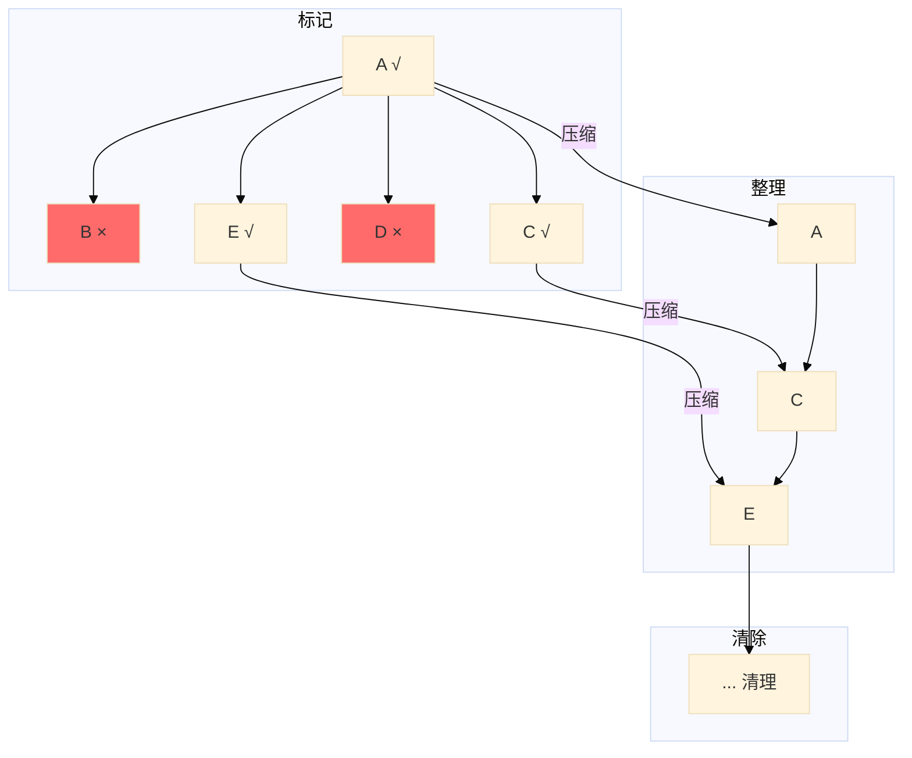

**优点**：
- 无内存碎片
- 内存利用率高

**缺点**：
- 效率相对较低（需要移动对象）
- STW 时间长

**示意图**：

```
标记前：        标记后：          整理后：          清除后：
┌──┬──┬──┬──┐  ┌──┬──┬──┬──┐  ┌──┬──┬──┬──┐  ┌──┬──┬──┬──┐
│ A│ B│ C│ D│  │ A│ X│ C│ X│  │ A│ C│  │  │  │ A│ C│  │  │
└──┴──┴──┴──┘  └──┴──┴──┴──┘  └──┴──┴──┴──┘  └──┴──┴──┴──┘
```

**适用场景**：老年代（对象存活率高，不适合复制算法）

### 4.3.4 分代收集算法（Generational Collection）

**原理**：根据对象存活周期的不同将内存划分为几块，一般分为年轻代和老年代，然后各采用适当的收集算法。

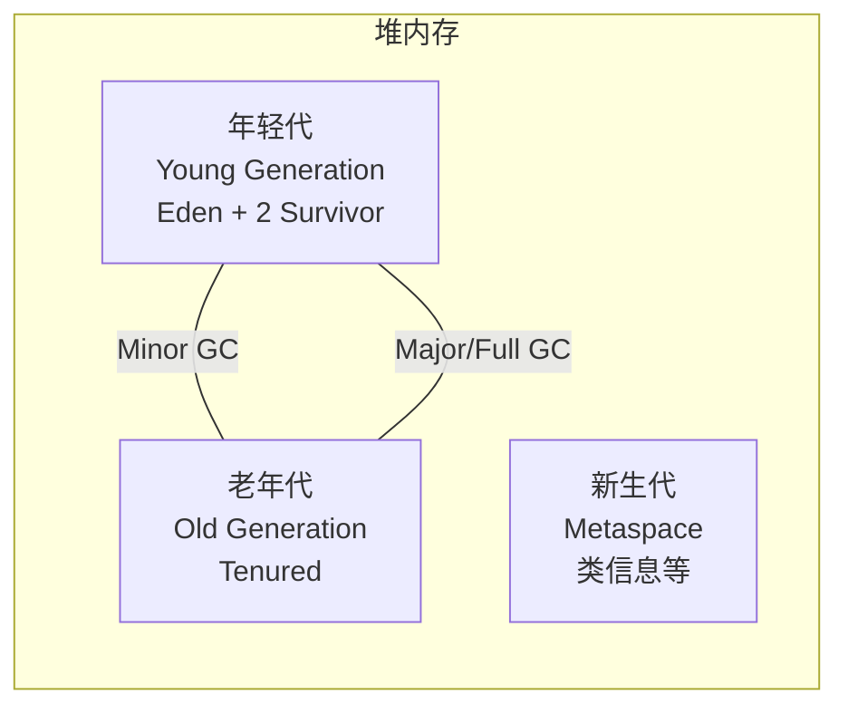

**年轻代特点**：
- 对象存活率低
- 每次 Minor GC 都有大量对象死亡
- 采用**复制算法**
- Eden:Survivor:Survivor = 8:1:1

**老年代特点**：
- 对象存活率高
- 对象存活时间长
- 采用**标记-清除**或**标记-整理**算法
- Major GC 频率低

**对象晋升流程**：

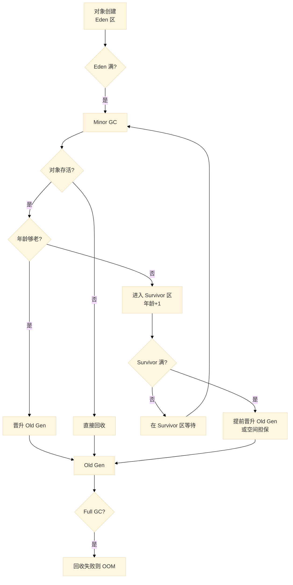

**年龄阈值**：
- `-XX:MaxTenuringThreshold`：最大晋升年龄（默认 15，CMS 是 6，G1 是 15）
- `-XX:TargetSurvivorRatio`：Survivor 区目标使用率

```java
/**
 * 对象晋升演示
 * 设置小堆内存观察对象晋升
 * VM args: -Xms60M -Xmx60M -Xmn20M -XX:+PrintGCDetails -XX:MaxTenuringThreshold=5
 */
public class ObjectPromotion {

    public static void main(String[] args) {
        // 预分配一些对象让 Survivor 区有压力
        byte[] _1MB = new byte[1024 * 1024];

        // 第一次分配 - 进入 Eden
        byte[] alloc1 = new byte[2 * 1024 * 1024]; // 2MB

        // 触发 GC 前先清理 _1MB 让出 Survivor 空间
        _1MB = null;

        // 触发 Minor GC - alloc1 活下来，进入 Survivor，年龄=1
        System.gc();

        // 继续分配
        byte[] alloc2 = new byte[2 * 1024 * 1024];
        byte[] alloc3 = new byte[2 * 1024 * 1024];
        byte[] alloc4 = new byte[2 * 1024 * 1024];

        // 再次清理
        _1MB = new byte[1024 * 1024]; // 1MB

        // 再次 GC - 检查对象年龄
        System.gc();

        System.out.println("程序运行完成");
    }
}
```

---

## 4.4 垃圾收集器

### 4.4.1 收集器关系图

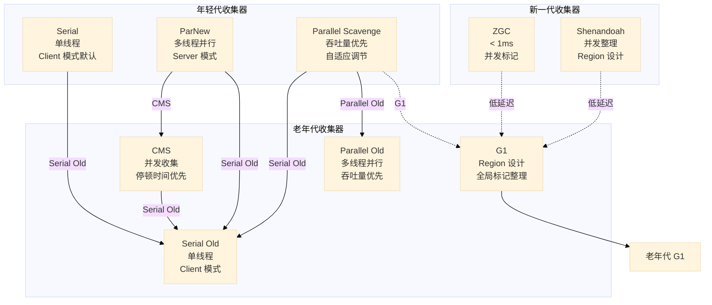

### 4.4.2 年轻代收集器

#### Serial 收集器

**特点**：
- 单线程收集
- 使用复制算法
- 会 Stop-The-World
- Client 模式默认收集器

**VM 参数**：
```
-XX:+UseSerialGC
```

```
┌─────────────────────────────────────────┐
│           Serial 收集器                  │
├─────────────────────────────────────────┤
│  单线程  |  复制算法  |  STW            │
└─────────────────────────────────────────┘
```

#### ParNew 收集器

**特点**：
- 多线程并行收集
- 使用复制算法
- 会 Stop-The-World
- Server 模式首选
- 默认线程数 = CPU 核心数

**VM 参数**：
```
-XX:+UseParNewGC
-XX:ParallelGCThreads=<线程数>
```

**与 Serial 对比**：

| 特性 | Serial | ParNew |
|------|--------|--------|
| 线程数 | 1 | 多个 |
| 停顿时间 | 较长 | 较短 |
| CPU 利用率 | 单核 | 多核 |
| 兼容性 | 所有模式 | Server 模式 |

#### Parallel Scavenge 收集器

**特点**：
- 多线程并行收集
- 吞吐量优先（`-XX:GCTimeRatio` 设置吞吐量目标）
- 自适应调节（`-XX:+UseAdaptiveSizePolicy`）
- 适合后台运算任务

**VM 参数**：
```
-XX:+UseParallelGC          # 年轻代
-XX:+UseParallelOldGC       # 老年代（配合使用）
-XX:MaxGCPauseMillis=<ms>  # 最大停顿时间目标
-XX:GCTimeRatio=<ratio>     # 吞吐量目标 (默认 99 = 99% 时间用于用户代码)
```

### 4.4.3 老年代收集器

#### Serial Old 收集器

**特点**：
- 单线程收集
- 标记-整理算法
- Client 模式默认
- 用途：
  - 与 Parallel Scavenge 配合
  - 作为 CMS 收集器的后备

#### Parallel Old 收集器

**特点**：
- 多线程并行收集
- 标记-整理算法
- 吞吐量优先

**VM 参数**：
```
-XX:+UseParallelOldGC
```

#### CMS 收集器（Concurrent Mark Sweep）

**特点**：
- 并发收集
- 停顿时间优先
- 标记-清除算法
- 4 个阶段并发执行

**收集周期**：

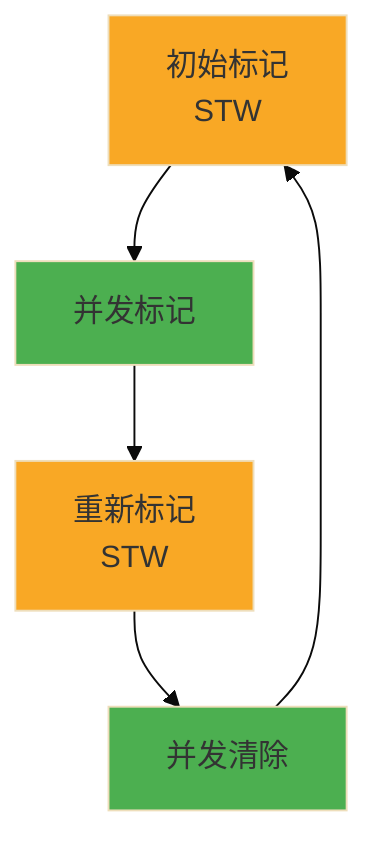

| 阶段 | 说明 | STW |
|------|------|-----|
| 初始标记 | 标记 GC Roots 直接引用的对象 | 是 |
| 并发标记 | 从 GC Roots 向下追踪 | 否 |
| 重新标记 | 修正并发标记期间变动的对象 | 是 |
| 并发清除 | 清除死亡对象 | 否 |

**优点**：
- 并发收集，停顿时间短
- 对响应时间敏感的系统适用

**缺点**：
- CPU 敏感（并发阶段占用 CPU）
- 无法处理浮动垃圾
- 产生内存碎片

**VM 参数**：
```
-XX:+UseConcMarkSweepGC
-XX:CMSInitiatingOccupancyFraction=<比例>  # 老年代使用率阈值
-XX:+UseCMSCompactAtFullCollection        # Full GC 后整理
-XX:CMSFullGCsBeforeCompaction=<次数>      # 多少次 Full GC 后整理
```

```java
/**
 * CMS 收集器演示
 * VM args: -Xms100M -Xmx100M -Xmn50M -XX:+UseConcMarkSweepGC -XX:+PrintGCDetails
 */
public class CMSDemo {

    public static void main(String[] args) {
        // 模拟产生大量对象
        for (int i = 0; i < 100; i++) {
            byte[] data = new byte[2 * 1024 * 1024]; // 2MB
            try {
                Thread.sleep(50);
            } catch (InterruptedException e) {
                e.printStackTrace();
            }
        }
    }
}
```

### 4.4.4 G1 收集器（Garbage First）

**设计思想**：
- 将堆划分为多个大小相等的 Region
- 每个 Region 可以独立作为 Eden、Survivor 或 Old 区
- 跟踪各 Region 垃圾量，优先回收垃圾最多的 Region

**Region 结构**：

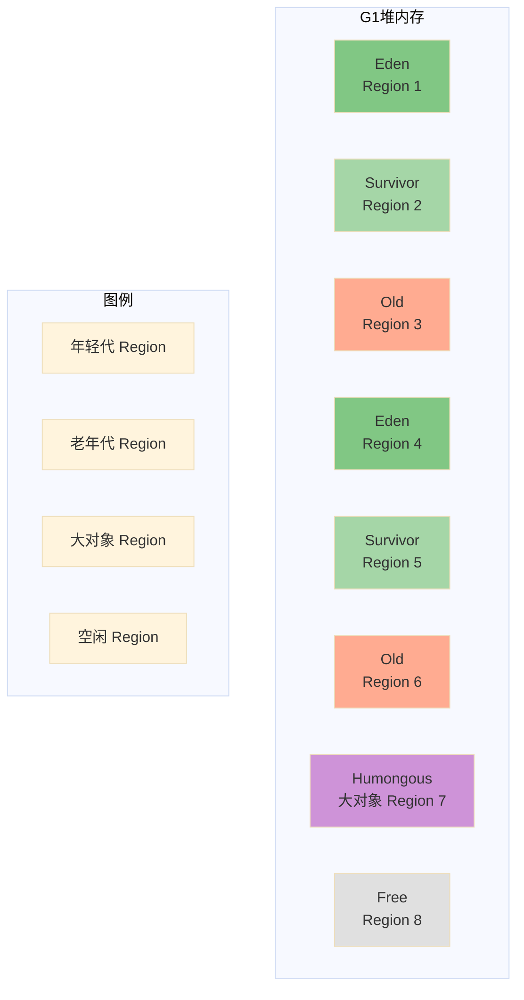

**G1 收集周期**：

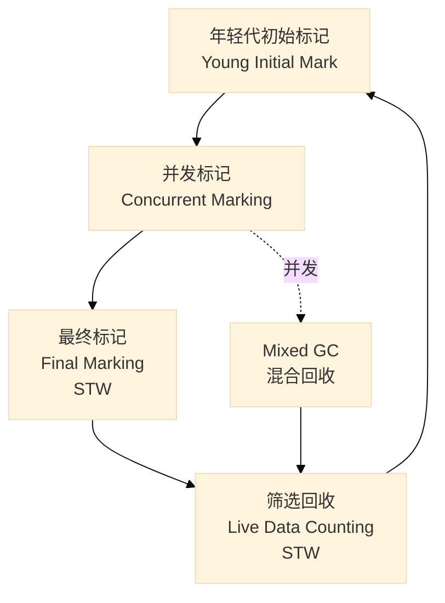

**G1 的优势**：
- 可预测停顿（`-XX:MaxGCPauseMillis`）
- 无内存碎片
- 整合多种算法
- 支持大对象（Humongous Region）

**VM 参数**：
```
-XX:+UseG1GC
-XX:MaxGCPauseMillis=<ms>        # 最大停顿时间目标
-XX:G1HeapRegionSize=<size>      # Region 大小 (1MB-32MB)
-XX:InitiatingHeapOccupancyPercent=<比例>  # 触发 Mixed GC 阈值
```

### 4.4.5 ZGC 和 Shenandoah

#### ZGC（Z Garbage Collector）

**特点**：
- 停顿时间 < 1ms（无论堆大小）
- 并发执行
- 支持 TB 级堆内存
- 着色指针技术

**VM 参数**：
```
-XX:+UseZGC
-XX:MaxGCPauseMillis=1
```

#### Shenandoah

**特点**：
- 停顿时间 < 10ms
- 并发整理
- 与 G1 类似但无分代
- Red Hat 开发

**VM 参数**：
```
-XX:+UseShenandoahGC
```

### 4.4.6 收集器对比

| 收集器 | 适用区域 | 算法 | 并发 | 停顿时间 | 吞吐量 | 目标场景 |
|--------|----------|------|------|----------|--------|----------|
| Serial | 年轻代 | 复制 | 否 | 长 | 低 | Client、单核 |
| ParNew | 年轻代 | 复制 | 否 | 较短 | 中 | 多核 Server |
| Parallel Scavenge | 年轻代 | 复制 | 否 | 较长 | 高 | 后台运算 |
| Serial Old | 老年代 | 标记-整理 | 否 | 长 | 低 | Client |
| Parallel Old | 老年代 | 标记-整理 | 否 | 较长 | 高 | 后台运算 |
| CMS | 老年代 | 标记-清除 | 是 | 短 | 中 | 响应速度优先 |
| G1 | 混合 | 标记-整理 | 是 | 可预测 | 中高 | 通用场景 |
| ZGC | 全部 | 标记-整理 | 是 | < 1ms | 高 | 低延迟 |
| Shenandoah | 全部 | 标记-整理 | 是 | < 10ms | 高 | 低延迟 |

**收集器组合**：

| 年轻代 | 老年代 | 组合效果 |
|--------|--------|----------|
| Serial | Serial Old | 最小开销，适合 Client |
| ParNew | CMS | 常用组合，低停顿 |
| Parallel Scavenge | Serial Old / Parallel Old | 吞吐量优先 |
| G1 | G1 | 统一策略，可预测停顿 |
| ZGC / Shenandoah | - | 超低延迟 |

---

## 4.5 GC 分类

### 4.5.1 Minor GC（Young GC）

**触发条件**：Eden 区空间不足

**特点**：
- 频率高
- 停顿时间短
- 只回收年轻代

**流程**：
```
Eden 满 → Minor GC → 存活对象复制到 Survivor → 年龄够了晋升老年代
```

### 4.5.2 Major GC / Full GC

#### Major GC

**触发条件**：老年代空间不足

**特点**：
- 频率低
- 停顿时间长
- 回收老年代

#### Full GC

**触发条件**：
- 老年代空间不足
- 方法区空间不足
- 调用 System.gc()
- RMI 等定时触发
- Survivor 区对象晋升但老年代空间不足

**特点**：
- 收集整个堆 + 方法区
- 停顿时间长
- 应尽量避免

**Full GC 触发场景**：

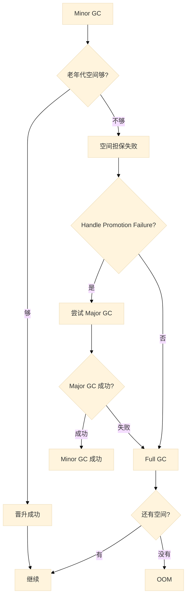

```java
/**
 * Full GC 触发场景演示
 */
public class FullGCDemo {

    // 1. 老年代空间不足 - 大对象直接进入老年代
    public static void oldGenFull() {
        // -Xms100M -Xmx100M -Xmn50M -XX:+PrintGCDetails
        byte[] largeObject = new byte[60 * 1024 * 1024]; // 60MB > Survivor 区
    }

    // 2. 晋升失败 - Survivor 区对象太多
    public static void promotionFailure() {
        // -Xms100M -Xmx100M -Xmn50M -XX:MaxTenuringThreshold=1 -XX:+PrintGCDetails
        List<byte[]> list = new ArrayList<>();
        for (int i = 0; i < 10; i++) {
            list.add(new byte[10 * 1024 * 1024]); // 10MB
        }
    }

    // 3. 方法区满 - 大量类加载
    public static void metaspaceFull() {
        // -XX:MetaspaceSize=50M -XX:MaxMetaspaceSize=50M
        // 不断创建动态类
        for (int i = 0; ; i++) {
            Class<?> clazz = new ByteArrayClassLoader().defineClass(
                "Class" + i,
                new byte[0]
            );
        }
    }

    // 4. System.gc() 调用
    public static void systemGC() {
        System.gc(); // 建议 JVM 进行 GC，不保证立即执行
    }

    static class ByteArrayClassLoader extends ClassLoader {
        public Class<?> defineClass(String name, byte[] bytecode) {
            return defineClass(name, bytecode, 0, bytecode.length);
        }
    }
}
```

---

## 4.6 GC 日志分析

### 4.6.1 GC 日志参数

| 参数 | 说明 |
|------|------|
| `-XX:+PrintGCDetails` | 打印详细 GC 信息 |
| `-XX:+PrintGCDateStamps` | 打印 GC 时间戳 |
| `-Xloggc:<file>` | 输出 GC 日志到文件 |
| `-XX:+PrintGCCause` | 打印 GC 原因（JDK 9+） |
| `-XX:+PrintTenuringDistribution` | 打印对象晋升分布 |

### 4.6.2 日志格式解读

#### Minor GC 日志

```java
// 示例代码
public class GCDemo {
    public static void main(String[] args) {
        byte[] a = new byte[2 * 1024 * 1024];
        byte[] b = new byte[2 * 1024 * 1024];
        byte[] c = new byte[2 * 1024 * 1024];
        a = null;
        System.gc();
    }
}
```

**JVM 参数**：
```
-Xms100M -Xmx100M -Xmn50M -XX:+PrintGCDetails -XX:+PrintGCDateStamps
```

**Minor GC 日志**：
```
2024-01-15T10:30:15.123+0800: [GC (Allocation Failure) 
  [DefNew: 4096K->512K(4608K), 0.0051234 secs] 
  9216K->5632K(10240K), 
  0.0052345 secs] 
  [Times: user=0.01 sys=0.00, real=0.01 secs]
```

**日志解读**：

| 字段 | 含义 |
|------|------|
| `Allocation Failure` | 触发原因：Eden 区分配失败 |
| `DefNew` | 收集器名称（Serial 年轻代） |
| `4096K->512K` | 收集前->收集后年轻代使用量 |
| `(4608K)` | 年轻代总大小 |
| `9216K->5632K` | 收集前->收集后堆使用量 |
| `(10240K)` | 堆总大小 |
| `0.0051234 secs` | 年轻代 GC 耗时 |
| `Times: user/sys/real` | 用户态/内核态/总耗时 |

#### Full GC 日志

```
2024-01-15T10:30:15.456+0800: [Full GC (Allocation Failure) 
  [CMS: 8192K->8192K(10240K), 4.5678901 secs] 
  18432K->14336K(20480K), 
  [Metaspace: 256K->256K(512K)], 
  4.5678901 secs] 
  [Times: user=10.23 sys=0.45, real=4.57 secs]
```

**日志解读**：

| 字段 | 含义 |
|------|------|
| `Full GC` | Full GC 类型 |
| `CMS` | CMS 收集器执行老年代回收 |
| `8192K->8192K(10240K)` | 老年代回收前后使用量（容量） |
| `Metaspace: 256K->256K` | 元空间信息 |
| `4.5678901 secs` | Full GC 耗时 |

#### G1 GC 日志

```
2024-01-15T10:30:15.789+0800: [GC pause (G1 Evacuation Pause) 
  (young), 0.0123456 secs]
  [Parallel Time: 10.2 ms]
    [GC Worker Start Time: 0.1 ms]
    [Ext Root Scanning: 2.3 ms]
    [Update RS: 1.5 ms]
    [Scan RS: 1.2 ms]
    [Object Copy: 3.5 ms]
    [Termination: 0.8 ms]
  [Code Root Fixup: 0.1 ms]
  [Code Root Purge: 0.0 ms]
  [Clear CT: 0.3 ms]
  [Other: 1.2 ms]
  [Evacuation Failure: 1032K->1032K(9216K)]
  [Young Regions: 15->15]
  [Surviving Regions: 2->2]
  [GC Workers: 8 threads]
  [Code Root Flushing: 0.2 ms]
  [Termination Attempts: 15]
```

### 4.6.3 GC 日志可视化工具

| 工具 | 说明 |
|------|------|
| [GCEasy](https://gceasy.io) | 在线 GC 日志分析 |
| [GCViewer](https://github.com/chewiebug/GCViewer) | 本地工具 |
| [GCPlot](https://gcplot.com) | 在线/本地 |
| JDK jstat | 命令行工具 |

```bash
# jstat 查看 GC 统计
jstat -gcutil <pid> 1000 10   # 每秒打印一次，共10次
jstat -gc <pid> 1000          # 详细 GC 信息
```

### 4.6.4 常见 GC 日志问题

**1. Allocation Failure**
```
原因：Eden 区空间不足
解决：增加年轻代大小 -Xmn
```

**2. Evacuation Failure**
```
原因：Survivor 区空间不足或对象晋升失败
解决：增加 Survivor 区或调大堆内存
```

**3. Full GC (Metadata GC)**
```
原因：元空间不足
解决：增加 MetaspaceSize -XX:MetaspaceSize=256m
```

**4. Full GC (System.gc())**
```
原因：代码调用了 System.gc()
解决：移除 System.gc() 或添加 -XX:+DisableExplicitGC
```

**5. Full GC (Allocation Failure) - promotion failed**
```
原因：对象晋升老年代失败
解决：增加老年代空间，优化对象生命周期
```

---

## 4.7 实战调优建议

### 4.7.1 GC 调优核心原则

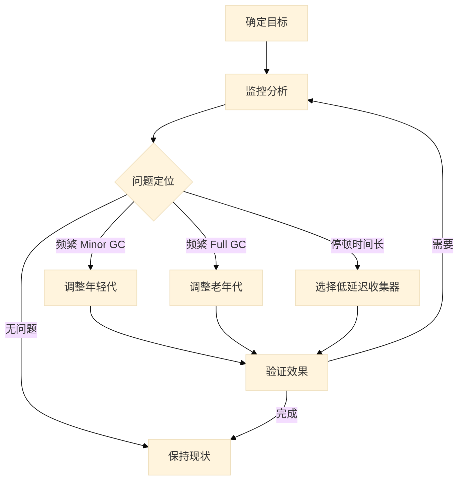

### 4.7.2 调优目标

| 目标 | 指标 | 推荐收集器 |
|------|------|------------|
| 吞吐量优先 | 高吞吐量，后台批处理 | Parallel Scavenge + Parallel Old |
| 低延迟优先 | 停顿时间 < 100ms | CMS、G1 |
| 极致低延迟 | 停顿时间 < 10ms | ZGC、Shenandoah |

### 4.7.3 常用调优参数

**堆内存设置**：
```bash
-Xms4g                 # 初始堆大小
-Xmx4g                 # 最大堆大小
-Xmn2g                 # 年轻代大小
-XX:NewRatio=2         # 老年代/年轻代比例 (2 = 2:1)
-XX:SurvivorRatio=8    # Eden/Survivor 比例 (8 = 8:1:1)
```

**GC 日志**：
```bash
-Xlog:gc*:file=gc.log  # JDK 9+ 统一日志格式
```

**G1 调优**：
```bash
-XX:MaxGCPauseMillis=200      # 目标停顿时间
-XX:G1HeapRegionSize=16M      # Region 大小
-XX:InitiatingHeapOccupancyPercent=45  # 触发 Mixed GC 阈值
```

### 4.7.4 常见场景调优

#### 场景一：频繁 Minor GC

**现象**：年轻代频繁回收，但对象很快晋升到老年代

**诊断**：
- Survivor 区太小
- 对象年龄过大才晋升

**解决方案**：
```bash
# 方案1：增加 Survivor 区
-Xmn800m -XX:SurvivorRatio=6  # SurvivorRatio 越小，Survivor 越大

# 方案2：降低对象晋升年龄
-XX:MaxTenuringThreshold=5  # 默认15

# 方案3：让对象提前晋升
-XX:TargetSurvivorRatio=90  # Survivor 区使用率超过90%时，对象会提前晋升
```

#### 场景二：频繁 Full GC

**现象**：老年代频繁回收，导致停顿时间长

**诊断**：
- 老年代空间不足
- 内存泄漏
- 产生过多大对象

**解决方案**：
```bash
# 方案1：增加老年代空间
-Xms4g -Xmx4g -Xmn1g  # 减小年轻代，增大老年代

# 方案2：使用 G1 收集器
-XX:+UseG1GC -XX:MaxGCPauseMillis=200

# 方案3：降低 CMS 触发阈值
-XX:CMSInitiatingOccupancyFraction=70  # 老年代70%时触发CMS
```

#### 场景三：停顿时间过长

**诊断**：使用高延迟收集器或参数不当

**解决方案**：
```bash
# 方案1：使用 G1
-XX:+UseG1GC -XX:MaxGCPauseMillis=100

# 方案2：使用 ZGC（Java 11+）
-XX:+UseZGC -XX:MaxGCPauseMillis=1

# 方案3：并行收集器调优
-XX:ParallelGCThreads=16  # 增加 GC 线程数
```

### 4.7.5 实战调优案例

```java
/**
 * 典型调优场景：电商秒杀系统
 *
 * 目标：低延迟，停顿 < 200ms
 * 特点：瞬时大量请求，对象生命周期短
 */
public class SeckillSystemTuning {

    // 问题：Minor GC 频繁，大量对象进入老年代
    // 原因：Survivor 区太小，对象提前晋升

    // 调优方案1：增加 Survivor 区
    // -Xms4g -Xmx4g -Xmn2g -XX:SurvivorRatio=3
    // 年轻代 2G = Eden 1.2G + Survivor 0.4G + Survivor 0.4G

    // 调优方案2：使用 G1
    // -Xms4g -Xmx4g -XX:+UseG1GC -XX:MaxGCPauseMillis=100 -XX:G1HeapRegionSize=4m

    // 调优方案3：使用 ZGC（Java 11+）
    // -Xms4g -Xmx4g -XX:+UseZGC -XX:MaxGCPauseMillis=1

    public static void main(String[] args) {
        // 模拟秒杀场景
        for (int i = 0; i < 10000; i++) {
            // 每次请求创建多个对象
            Order order = new Order(i, "user_" + i);
            // 处理订单...

            // 关键：让对象尽快成为垃圾
            order = null;

            if (i % 1000 == 0) {
                System.out.println("已处理订单: " + i);
            }
        }
    }

    static class Order {
        long orderId;
        String userId;
        long timestamp;

        Order(long orderId, String userId) {
            this.orderId = orderId;
            this.userId = userId;
            this.timestamp = System.currentTimeMillis();
        }
    }
}
```

### 4.7.6 调优检查清单

```
□ 监控指标
  □ GC 频率
  □ GC 停顿时间
  □ 内存使用率
  □ 对象晋升率

□ 基础配置
  □ 堆大小：-Xms == -Xmx
  □ 年轻代/老年代比例
  □ GC 收集器选择

□ 收集器特定调优
  □ ParNew：ParallelGCThreads
  □ CMS：CMSInitiatingOccupancyFraction
  □ G1：MaxGCPauseMillis、G1HeapRegionSize

□ 代码层面
  □ 减少临时对象创建
  □ 对象复用（对象池）
  □ 合理使用数据结构
  □ 避免大对象
```

---

## 本章小结

### 核心知识点回顾

1. **垃圾识别**：
   - 引用计数法：无法解决循环引用
   - 可达性分析：通过 GC Roots 追踪

2. **垃圾回收算法**：
   - 标记-清除：老年代，效率低，有碎片
   - 复制：年轻代，效率高，内存减半
   - 标记-整理：老年代，无碎片，效率较低

3. **分代收集**：
   - 年轻代：复制算法，对象存活率低
   - 老年代：标记-整理/标记-清除，对象存活率高

4. **收集器选择**：
   - 吞吐量：Parallel Scavenge + Parallel Old
   - 低延迟：CMS、G1、ZGC

5. **GC 调优原则**：
   - 先诊断后调优
   - 避免频繁 Full GC
   - 合理设置堆大小和分代比例

---

> 下一章：[Chapter 05: 字节码与执行引擎](./05_字节码与执行引擎.md)
