# 05 | 字节码与执行引擎

## 概述

Java 字节码是 Java 虚拟机（JVM）执行的核心中间代码形态。本章将深入探讨字节码文件的结构、字节码指令集、运行时栈帧结构、方法调用机制，以及解释器与 JIT 编译器的工作原理。

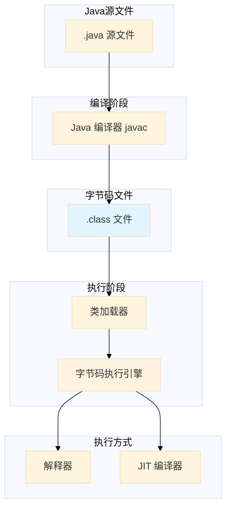

---

## 1. 字节码基础

### 1.1 字节码文件结构

`.class` 文件是 Java 编译器生成的二进制文件，包含 Java 源程序的所有信息。JVM 通过加载字节码文件来执行程序。

```mermaid
%%{init: {'theme': 'base'}}%%
flowchart TB
    subgraph ClassFile["ClassFile 文件结构"]
        direction TB
        CF1["u4 magic<br/>魔数 0xCAFEBABE"]
        CF2["u2 minor_version<br/>次版本号"]
        CF3["u2 major_version<br/>主版本号"]
        CF4["u2 constant_pool_count<br/>常量池数量"]
        CF5["constant_pool<br/>常量池"]
        CF6["u2 access_flags<br/>访问标志"]
        CF7["u2 this_class<br/>当前类索引"]
        CF8["u2 super_class<br/>父类索引"]
        CF9["u2 interfaces_count<br/>接口数量"]
        CF10["interfaces[]<br/>接口索引表"]
        CF11["u2 fields_count<br/>字段数量"]
        CF12["field_info[]<br/>字段表"]
        CF13["u2 methods_count<br/>方法数量"]
        CF14["method_info[]<br/>方法表"]
        CF15["u2 attributes_count<br/>属性数量"]
        CF16["attribute_info[]<br/>属性表"]
    end

    subgraph 常量池组成部分
        direction TB
        CP1["cp_info[0]"]
        CP2["cp_info[1]"]
        CP3["..."]
        CPn["cp_info[n]"]
    end

    ClassFile --> CF5
    ClassFile --> CF12
    ClassFile --> CF14
    ClassFile --> CF16
    CF5 --> CP1
    CF5 --> CP2
    CF5 --> CP3
    CF5 --> CPn

    style ClassFile fill:#e3f2fd,stroke:#1565c0
    style CF1 fill:#bbdefb,stroke:#1565c0
    style CF5 fill:#c8e6c9,stroke:#2e7d32
    style 常量池组成部分 fill:#fff8e1,stroke:#f9a825
```

### 1.2 字节码文件结构详解

| 名称 | 类型 | 说明 |
|------|------|------|
| magic | u4 | 魔数，固定为 `0xCAFEBABE`，用于识别 .class 文件 |
| minor_version | u2 | 次版本号 |
| major_version | u2 | 主版本号（如 52 代表 Java 8） |
| constant_pool_count | u2 | 常量池中常量数量 +1 |
| constant_pool | cp_info[] | 常量池，包含字面量和符号引用 |
| access_flags | u2 | 访问标志，标识类/接口的访问修饰符 |
| this_class | u2 | 当前类索引，指向常量池 |
| super_class | u2 | 父类索引，指向常量池 |
| interfaces_count | u2 | 实现的接口数量 |
| interfaces | u2[] | 接口索引表 |
| fields_count | u2 | 字段数量 |
| fields | field_info[] | 字段表 |
| methods_count | u2 | 方法数量 |
| methods | method_info[] | 方法表 |
| attributes_count | u2 | 属性数量 |
| attributes | attribute_info[] | 属性表 |

### 1.3 使用 javap 查看字节码结构

首先创建一个简单的 Java 类用于演示：

```java
// Person.java
public class Person {
    private String name;
    private int age;

    public Person() {}

    public Person(String name, int age) {
        this.name = name;
        this.age = age;
    }

    public String getName() {
        return name;
    }

    public void setName(String name) {
        this.name = name;
    }

    public int getAge() {
        return age;
    }

    public void setAge(int age) {
        this.age = age;
    }

    public String greet(String other) {
        return name + " says hello to " + other;
    }
}
```

使用 `javap -v` 命令查看字节码的详细信息：

```bash
javap -v Person.class
```

部分输出解析：

```
Classfile /path/to/Person.class
  Last modified 2024-01-01; size 628 bytes
  MD5 checksum d5c8b2a1f3e4c6d7e8f9a0b1c2d3e4f5
public class Person
  minor version: 0
  major version: 52
  flags: ACC_PUBLIC, ACC_SUPER
Constant pool:
  #1 = Methodref          #8.#26        // java/lang/Object."<init>":()V
  #2 = Fieldref           #7.#27        // Person.name:Ljava/lang/String;
  #3 = Fieldref           #7.#28        // Person.age:I
  #4 = String             #29           // says hello to
  #5 = Methodref          #30.#31       // java/lang/StringBuilder."<init>":()V
  #6 = Methodref          #30.#32       // java/lang/StringBuilder.append:(Ljava/lang/String;)Ljava/lang/StringBuilder;
  #7 = Methodref          #30.#33       // java/lang/StringBuilder.append:(I)Ljava/lang/StringBuilder;
  #8 = Methodref          #30.#34       // java/lang/StringBuilder.toString:()Ljava/lang/String;
;
  #9 = Class              #35           // java/lang/String
  #10 = Utf8               name
  #11 = Utf8               Ljava/lang/String;
  #12 = Utf8               age
  #13 = Utf8               I
  #14 = Utf8               <init>
  #15 = Utf8               ()V
  #16 = Utf8               Code
  #17 = Utf8               LineNumberTable
  #18 = Utf8               LocalVariableTable
  #19 = Utf8               this
  #20 = Utf8               LPerson;
  #21 = Utf8               <init>
  #22 = Utf8               (Ljava/lang/String;I)V
  #23 = Utf8               greet
  #24 = Utf8               (Ljava/lang/String;)Ljava/lang/String;
  #25 = Utf8               SourceFile
  #26 = NameAndType        #14:#15       // "<init>":()V
  #27 = NameAndType        #10:#11       // name:Ljava/lang/String;
  #28 = NameAndType        #12:#13       // age:I
  #29 = Utf8                says hello to
  #30 = Class              #36           // java/lang/StringBuilder
  #31 = NameAndType        #14:#37       // "<init>":()V
  #32 = NameAndType        #38:#39       // append:(Ljava/lang/String;)Ljava/lang/StringBuilder;
  #33 = NameAndType        #38:#40       // append:(I)Ljava/lang/StringBuilder;
  #34 = NameAndType        #41:#42       // toString:()Ljava/lang/String;
  #35 = Utf8               java/lang/String
  #36 = Utf8               java/lang/StringBuilder
  #37 = Utf8               ()V
  #38 = Utf8               append
  #39 = Utf8               (Ljava/lang/String;)Ljava/lang/StringBuilder;
  #40 = Utf8               (I)Ljava/lang/StringBuilder;
  #41 = Utf8               toString
  #42 = Utf8               ()Ljava/lang/String;
```

### 1.4 字节码版本号对照表

| 版本号 | Java 版本 |
|--------|-----------|
| 45 | Java 1.1 |
| 46 | Java 1.2 |
| 47 | Java 1.3 |
| 48 | Java 1.4 |
| 49 | Java 5 |
| 50 | Java 6 |
| 51 | Java 7 |
| 52 | Java 8 |
| 53 | Java 9 |
| 54 | Java 10 |
| 55 | Java 11 |
| 56 | Java 12 |
| 57 | Java 13 |
| 58 | Java 14 |
| 59 | Java 15 |
| 60 | Java 16 |
| 61 | Java 17 |
| 62 | Java 18 |
| 63 | Java 19 |
| 64 | Java 20 |
| 65 | Java 21 |
| 66 | Java 22 |
| 67 | Java 23 |

---

## 2. 字节码指令集

### 2.1 字节码指令概述

JVM 字节码指令由一个字节的操作码（opcode）和零或多个操作数（operand）组成。操作码表明要执行的操作，操作数提供所需的参数。

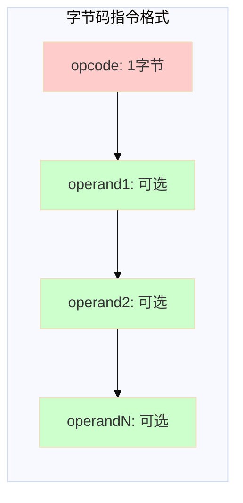

### 2.2 加载和存储指令

加载指令将局部变量表中的值压入操作数栈，存储指令将操作数栈顶的值弹出并存入局部变量表。

| 指令 | 说明 | 指令 | 说明 |
|------|------|------|------|
| `iload` | 从局部变量加载 int | `istore` | 存储 int 到局部变量 |
| `lload` | 从局部变量加载 long | `lstore` | 存储 long 到局部变量 |
| `fload` | 从局部变量加载 float | `fstore` | 存储 float 到局部变量 |
| `dload` | 从局部变量加载 double | `dstore` | 存储 double 到局部变量 |
| `aload` | 从局部变量加载 reference | `astore` | 存储 reference 到局部变量 |
| `iload_n` | 加载 int (n=0-3) | `istore_n` | 存储 int (n=0-3) |
| `aload_0` | 加载 this 引用 | `aconst_null` | 压入 null |

### 2.3 操作数栈指令

| 指令 | 说明 |
|------|------|
| `swap` | 交换栈顶两个字 |
| `dup` | 复制栈顶值 |
| `dup2` | 复制栈顶两个字（long/double） |
| `pop` | 弹出栈顶一个字 |
| `pop2` | 弹出栈顶两个字 |

### 2.4 算术指令

算术指令执行基本的数学运算。

| 指令 | 说明 | 指令 | 说明 |
|------|------|------|------|
| `iadd` | int 相加 | `isub` | int 相减 |
| `imul` | int 相乘 | `idiv` | int 相除 |
| `irem` | int 取余 | `ineg` | int 取反 |
| `ladd` | long 相加 | `lsub` | long 相减 |
| `lmul` | long 相乘 | `ldiv` | long 相除 |
| `fadd` | float 相加 | `fsub` | float 相减 |
| `fmul` | float 相乘 | `fdiv` | float 相除 |
| `dadd` | double 相加 | `dsub` | double 相减 |
| `dmul` | double 相乘 | `ddiv` | double 相除 |

### 2.5 类型转换指令

类型转换指令用于在不同数值类型之间进行转换。

```java
// 演示类型转换
public class TypeCast {
    public int intToDouble(double d) {
        return (int) d;
    }

    public double intToDouble(int i) {
        return i;
    }
}
```

对应的字节码：

```asm
// (I)D 方法的字节码
public double intToDouble(int);
  descriptor: (I)D
  flags: ACC_PUBLIC
  Code:
    stack=2, locals=2, args_size=2
    0: iload_1          // 加载局部变量 i
    1: i2d               // int 转 double
    2: dreturn           // 返回 double
```

### 2.6 对象创建与访问指令

| 指令 | 说明 |
|------|------|
| `new` | 创建新对象 |
| `newarray` | 创建基本类型数组 |
| `anewarray` | 创建引用类型数组 |
| `multianewarray` | 创建多维数组 |
| `getfield` | 获取对象字段值 |
| `putfield` | 设置对象字段值 |
| `getstatic` | 获取静态字段值 |
| `putstatic` | 设置静态字段值 |
| `arraylength` | 获取数组长度 |

### 2.7 方法调用和返回指令

| 指令 | 说明 |
|------|------|
| `invokevirtual` | 调用实例方法（虚方法分派） |
| `invokespecial` | 调用构造函数、私有方法、父类方法 |
| `invokestatic` | 调用静态方法 |
| `invokeinterface` | 调用接口方法 |
| `invokedynamic` | 调用动态链接的方法 |
| `ireturn` | 返回 int |
| `lreturn` | 返回 long |
| `freturn` | 返回 float |
| `dreturn` | 返回 double |
| `areturn` | 返回 reference |
| `return` | 返回 void |

### 2.8 控制转移指令

| 指令 | 说明 | 指令 | 说明 |
|------|------|------|------|
| `ifeq` | if equal | `ifne` | if not equal |
| `iflt` | if less than | `ifle` | if less or equal |
| `ifgt` | if greater than | `ifge` | if greater or equal |
| `ifnull` | if null | `ifnonnull` | if not null |
| `if_acmpeq` | reference equal | `if_acmpne` | reference not equal |
| `goto` | 无条件跳转 | `tableswitch` | 表 switch |
| `lookupswitch` | 查找 switch | `jsr` | 跳转至子程序 |

### 2.9 字节码执行实例

让我们详细分析一个方法的字节码执行过程：

```java
public class BytecodeDemo {
    public int calculate(int a, int b) {
        int result = a + b;
        if (result > 10) {
            result = result * 2;
        } else {
            result = result - 5;
        }
        return result;
    }
}
```

使用 `javap -c` 查看字节码：

```asm
public int calculate(int, int);
  descriptor: (II)I
  flags: ACC_PUBLIC
  Code:
    stack=2, locals=4, args_size=3
    0: iload_1           // 将局部变量 a 压入栈
    1: iload_2           // 将局部变量 b 压入栈
    2: iadd              // 弹出两个 int，相加，压入结果
    3: istore_3          // 弹出栈顶值，存入局部变量 result
    4: iload_3           // 将 result 压入栈
    5: bipush 10         // 将常量 10 压入栈
    7: ifle 14           // 弹出两个值，若 result <= 10，跳转到 14
    10: iload_3          // result > 10 分支
    11: iconst_2         // 将常量 2 压入栈
    12: imul              // 相乘
    13: istore_3          // 结果存入 result
    14: iload_3          // else 分支入口
    15: iconst_5         // 将常量 5 压入栈
    16: isub              // result - 5
    17: istore_3          // 结果存入 result
    18: iload_3          // 将 result 压入栈
    19: ireturn           // 返回 result
```

字节码执行流程图解：

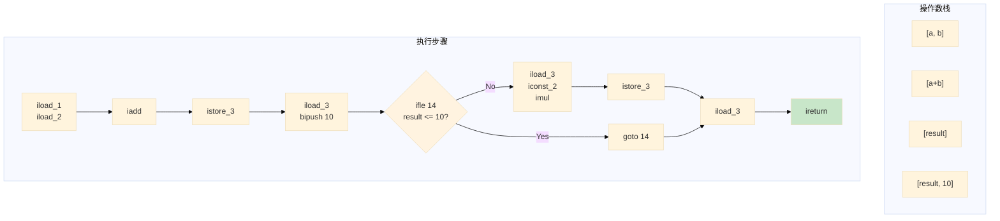

---

## 3. 运行时栈帧结构

### 3.1 栈帧概述

栈帧（Stack Frame）是 JVM 栈的基本单元，用于支持方法调用和执行。每个方法调用对应一个栈帧，栈帧包含方法执行所需的所有信息。

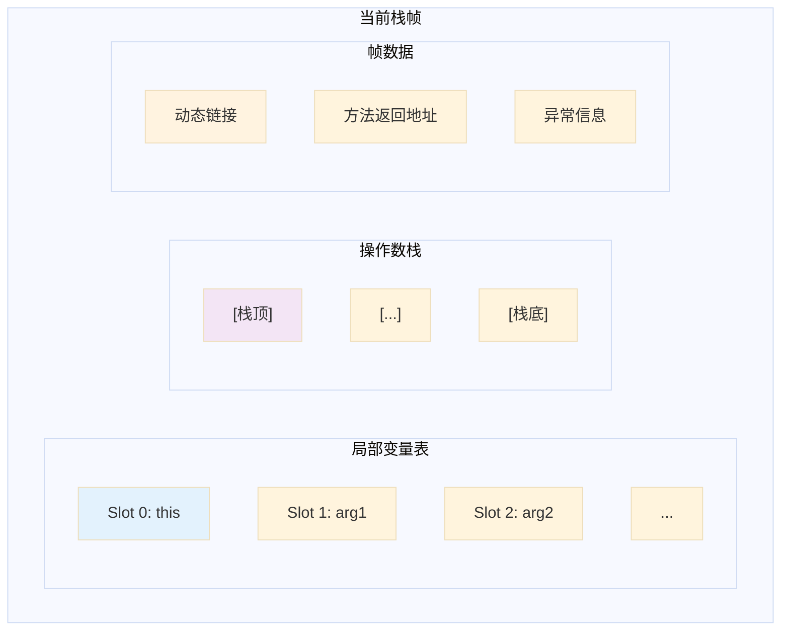

### 3.2 局部变量表

局部变量表（Local Variable Table）存储方法参数和方法内部定义的局部变量。

```java
public class LocalVarDemo {
    public int example(int a, int b) {
        int c = 10;
        int d = a + b + c;
        return d;
    }
}
```

字节码解析：

```asm
public int example(int, int);
  descriptor: (II)I
  flags: ACC_PUBLIC
  Code:
    stack=2, locals=4, args_size=3
    0: bipush 10         // 将常量 10 压入栈
    2: istore_3           // 存储到局部变量 Slot 3 (c)
    3: iload_1            // 加载 a (Slot 1)
    4: iload_2            // 加载 b (Slot 2)
    5: iadd               // a + b
    6: iload_3            // 加载 c (Slot 3)
    7: iadd               // (a + b) + c
    8: istore 4           // 存储到局部变量 Slot 4 (d)
    9: iload 4            // 加载 d
    10: ireturn            // 返回
```

局部变量表布局：

| Slot | 内容 |
|------|------|
| 0 | this (实例方法) |
| 1 | a (参数1) |
| 2 | b (参数2) |
| 3 | c (局部变量) |
| 4 | d (局部变量) |

### 3.3 操作数栈

操作数栈（Operand Stack）是一个后进先出（LIFO）栈，用于字节码指令的操作数存储和获取。

```java
public int operandStackDemo(int x) {
    return (x + 10) * 2 - 5;
}
```

执行过程：

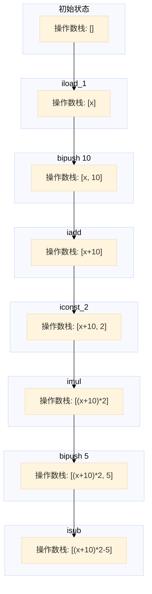

### 3.4 动态链接

每个栈帧包含一个指向常量池的引用，称为动态链接（Dynamic Linking）。这个引用用于支持方法中的符号引用在运行时被解析。

```java
public class DynamicLinkDemo {
    public void greet() {
        System.out.println("Hello");
    }
}
```

字节码中的符号引用：

```asm
Constant pool:
  #2 = Methodref          #7.#26        // DynamicLinkDemo.greet:()V
  #6 = Fieldref           #7.#27        // java/lang/System.out:Ljava/io/PrintStream;
  #7 = Class              #28           // DynamicLinkDemo

public void greet();
  descriptor: ()V
  flags: ACC_PUBLIC
  Code:
    0: getstatic     #6          // 获取 System.out
    3: ldc           #4          // 加载字符串 "Hello"
    5: invokevirtual #5          // 调用 println 方法
    8: return
```

### 3.5 方法返回地址

方法返回地址（Return Address）用于存储方法调用后的返回位置：

- **正常返回**：存储调用者的下一条指令地址
- **异常返回**：通过异常处理表确定返回地址

---

## 4. 方法调用

### 4.1 方法调用的分类

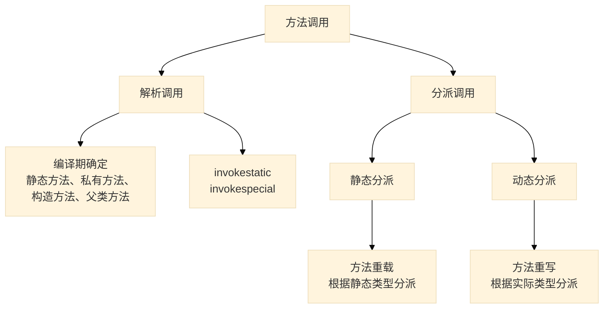

### 4.2 解析（Resolution）

解析是编译期完成的方法绑定，所有可解析的方法调用都是 **非虚方法调用**。

```java
public class ResolutionDemo {
    // 静态方法 - 解析阶段绑定
    public static void staticMethod() {
        System.out.println("Static method");
    }

    // 私有方法 - 解析阶段绑定
    private void privateMethod() {
        System.out.println("Private method");
    }

    // 构造方法 - 解析阶段绑定
    public ResolutionDemo() {
        System.out.println("Constructor");
    }

    // 父类方法 - 解析阶段绑定
    @Override
    public String toString() {
        return "ResolutionDemo";
    }
}
```

对应的字节码：

```asm
public static void staticMethod();
  descriptor: ()V
  flags: ACC_PUBLIC, ACC_STATIC
  Code:
    0: getstatic     #2          // System.out
    3: ldc           #3          // "Static method"
    5: invokevirtual #4          // PrintStream.println
    8: return

private void privateMethod();
  descriptor: ()V
  flags: ACC_PRIVATE
  Code:
    0: getstatic     #2
    3: ldc           #5          // "Private method"
    5: invokevirtual #4
    8: return
```

### 4.3 静态分派（Static Dispatch）

静态分派发生在编译期，根据 **静态类型**（声明类型）进行方法分派，主要用于方法重载（Overload）。

```java
public class StaticDispatch {
    // 父类
    static abstract class Human {}

    // 子类1
    static class Man extends Human {}

    // 子类2
    static class Woman extends Human {}

    // 重载方法 - 根据参数静态类型分派
    public void sayHello(Human guy) {
        System.out.println("Hello, Human!");
    }

    public void sayHello(Man guy) {
        System.out.println("Hello, Man!");
    }

    public void sayHello(Woman guy) {
        System.out.println("Hello, Woman!");
    }

    public static void main(String[] args) {
        Human man = new Man();       // 静态类型: Human, 实际类型: Man
        Human woman = new Woman();   // 静态类型: Human, 实际类型: Woman

        StaticDispatch dispatch = new StaticDispatch();
        dispatch.sayHello(man);      // 调用 sayHello(Human)
        dispatch.sayHello(woman);     // 调用 sayHello(Human)
    }
}
```

静态分派流程图：

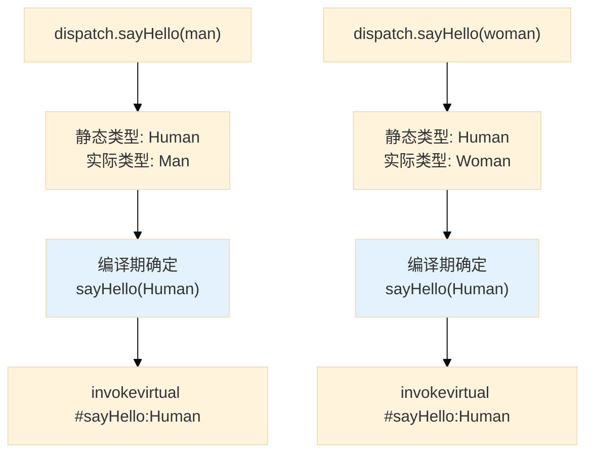

### 4.4 动态分派（Dynamic Dispatch）

动态分派发生在运行期，根据 **实际类型**（运行时类型）进行方法分派，主要用于方法重写（Override）。

```java
public class DynamicDispatch {
    static abstract class Human {
        public abstract void work();
    }

    static class Developer extends Human {
        @Override
        public void work() {
            System.out.println("Writing code");
        }
    }

    static class Designer extends Human {
        @Override
        public void work() {
            System.out.println("Designing UI");
        }
    }

    public static void main(String[] args) {
        Human dev1 = new Developer();  // 实际类型: Developer
        Human dev2 = new Designer();    // 实际类型: Designer

        dev1.work();  // 运行时调用 Developer.work()
        dev2.work();  // 运行时调用 Designer.work()
    }
}
```

字节码分析：

```asm
public static void main(java.lang.String[]);
  descriptor: ([Ljava/lang/String;)V
  flags: ACC_PUBLIC, ACC_STATIC
  Code:
    stack=2, locals=3, args_size=1
    0: new           #7          // 创建 Developer 对象
    3: dup
    4: invokespecial #9          // 调用 Developer 构造函数
    7: astore_1                // 存入局部变量 dev1
    8: new           #10         // 创建 Designer 对象
    11: dup
    12: invokespecial #12        // 调用 Designer 构造函数
    15: astore_2                // 存入局部变量 dev2
    16: aload_1                 // 加载 dev1
    17: invokevirtual #13        // 调用 Human.work() - 虚方法调用！
    20: aload_2                 // 加载 dev2
    21: invokevirtual #13        // 调用 Human.work() - 虚方法调用！
    24: return
```

动态分派流程图：

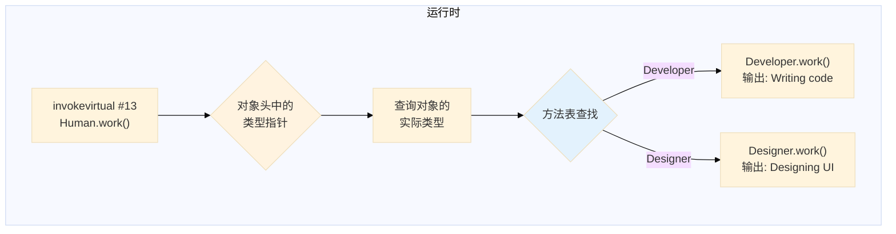

### 4.5 单分派与多分派

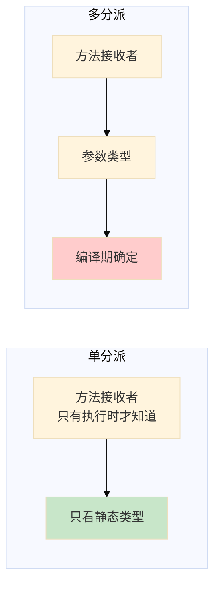

### 4.6 方法表

JVM 使用方法表（vtable）加速虚方法分派。每个类有一个方法表，存储直接继承或重写的方法引用。

```java
class Human {
    void work() {}
}

class Developer extends Human {
    void work() {}  // 重写
    void code() {}   // 新增
}
```

方法表结构：

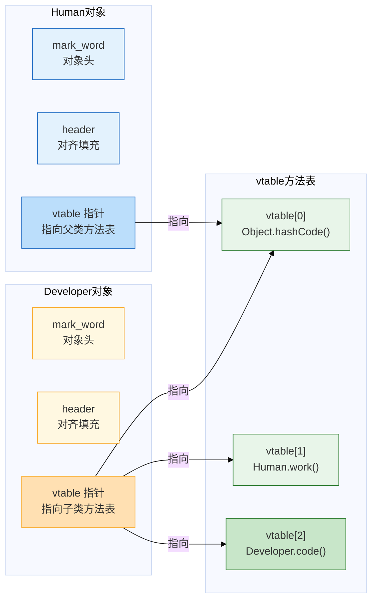

### 4.7 方法调用的字节码指令

| 指令 | 说明 | 分派方式 |
|------|------|----------|
| `invokestatic` | 调用静态方法 | 解析（静态绑定） |
| `invokespecial` | 调用私有/构造器/父类方法 | 解析（静态绑定） |
| `invokevirtual` | 调用实例方法 | 动态分派 |
| `invokeinterface` | 调用接口方法 | 动态分派 |
| `invokedynamic` | 调用动态语言特性 | 用户自定义 |

---

## 5. 解释器与 JIT 编译器

### 5.1 执行引擎概述

JVM 执行引擎负责执行字节码指令，主要有两种执行方式：

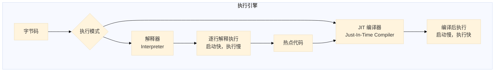

### 5.2 解释器

解释器通过读取字节码并立即执行对应的机器指令来运行程序。

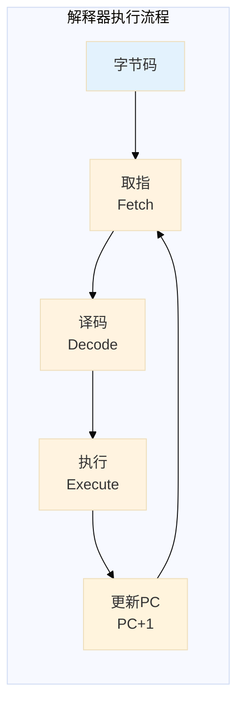

**解释器的特点：**
- 启动速度快
- 执行速度相对较慢
- 内存占用相对固定

### 5.3 JIT 编译器

JIT 编译器将热点字节码编译为本地机器码并缓存，以提高执行效率。

#### 5.3.1 热点检测

JVM 使用两种热点检测技术：

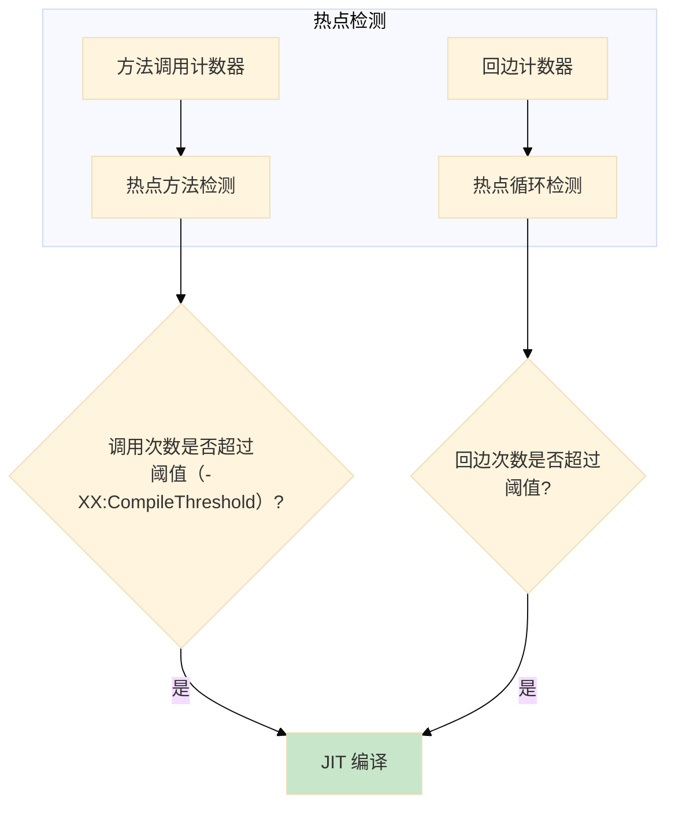

| 参数 | 说明 | 默认值 |
|------|------|--------|
| `-XX:CompileThreshold` | JIT 编译阈值 | 10000 |
| `-XX:OnStackReplacementPercentage` | OSR 比率 | 933 |
| `-XX:MaxInlineLevel` | 最大内联层级 | 15 |

#### 5.3.2 分层编译

JVM 采用分层编译策略：

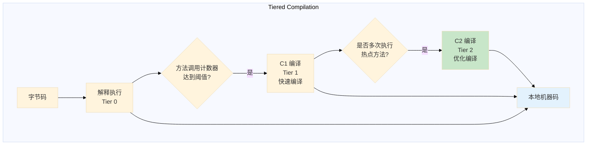

| 层次 | 名称 | 说明 |
|------|------|------|
| 0 | 解释执行 | 纯解释执行 |
| 1 | C1 编译 | 快速编译，无激进优化 |
| 2 | C1 编译 | C1 编译 + 收集执行信息 |
| 3 | C2 编译 | 激进优化编译 |

### 5.4 编译优化技术

#### 5.4.1 方法内联

方法内联（Inlining）将方法调用替换为方法体内容，减少调用开销。

```java
// 优化前
public class InlineDemo {
    public int add(int a, int b) {
        return a + b;
    }

    public int calculate() {
        return add(1, 2) + add(3, 4);
    }
}

// 优化后（等价代码）
public int calculate() {
    return 1 + 2 + 3 + 4;  // 内联后直接计算
}
```

#### 5.4.2 逃逸分析

逃逸分析（Escape Analysis）判断对象的动态作用域。

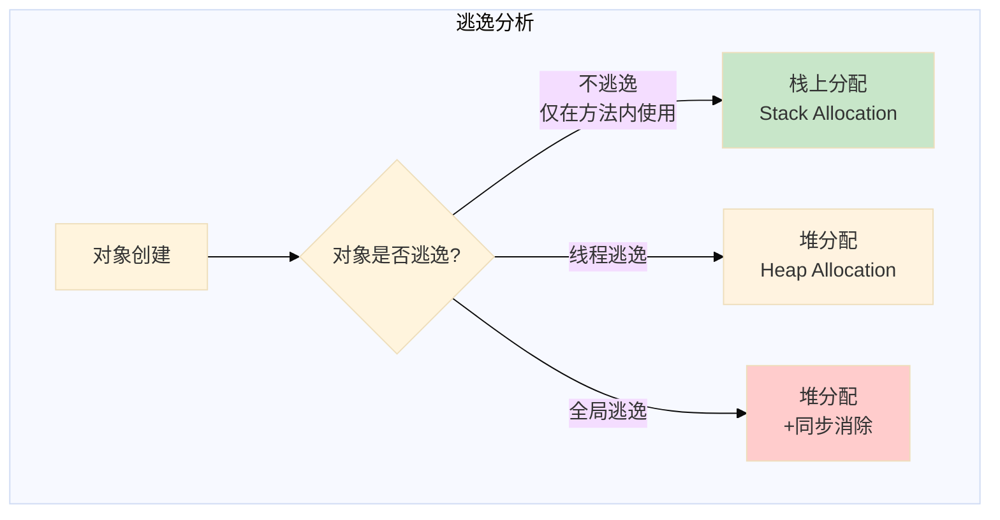

**同步消除**：如果对象不逃逸到线程外部，锁的获取和释放可以被消除。

```java
// 优化前
public synchronized void syncMethod() {
    // 同步方法
}

// 逃逸分析后 - 同步被消除
public void syncMethod() {
    // 无同步开销
}
```

#### 5.4.3 虚方法内联

虚方法内联是 JIT 编译器的重要优化技术：

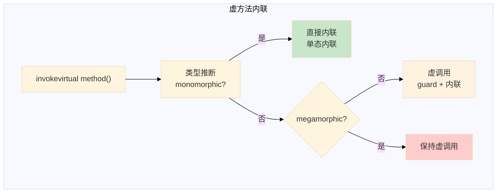

### 5.5 解释器与 JIT 编译器对比

| 特性 | 解释器 | JIT 编译器 |
|------|--------|-----------|
| 执行方式 | 逐行解释 | 编译后执行 |
| 启动速度 | 快 | 慢 |
| 执行速度 | 慢 | 快 |
| 内存占用 | 固定 | 额外编译缓存 |
| 优化能力 | 无 | 激进优化 |
| 热点适应 | 无 | 基于执行反馈 |

### 5.6 JVM 配置参数

```bash
# 指定编译阈值
java -XX:CompileThreshold=10000 MyApp

# 启用分层编译（默认开启）
java -XX:+TieredCompilation MyApp

# 禁用分层编译
java -XX:-TieredCompilation MyApp

# 查看编译日志
java -XX:+PrintCompilation MyApp

# 查看 JIT 编译决策
java -XX:+PrintCompilation -XX:+UnlockDiagnosticVMOptions -XX:+PrintInlining MyApp

# 禁用栈上分配
java -XX:-DoEscapeAnalysis MyApp

# 禁用锁粗化
java -XX:-DoEscapeAnalysis -XX:-EliminateLocks MyApp
```

---

## 6. invokedynamic 指令

### 6.1 动态方法调用

`invokedynamic` 是 Java 7 引入的指令，用于支持动态语言特性（如 Lambda 表达式、方法引用）。

```java
public class InvokeDynamicDemo {
    public static void main(String[] args) {
        // Lambda 表达式 - 编译时生成 invokedynamic
        Runnable r = () -> System.out.println("Lambda running");
        r.run();

        // 方法引用
        Function<String, Integer> parser = Integer::parseInt;
        System.out.println(parser.apply("123"));
    }
}
```

对应的字节码结构：

```asm
public static void main(java.lang.String[]);
  descriptor: ([Ljava/lang/String;)V
  flags: ACC_PUBLIC, ACC_STATIC
  Code:
    0: invokedynamic #7, 0          // Lambda
    5: astore_1
    6: aload_1
    7: invokeinterface #8, 1
    12: invokedynamic #11, 0        // 方法引用
    17: astore_2
    18: aload_2
    19: invokedynamic #13, 0       // Integer.parseInt
    24: invokevirtual #14
    27: return
```

### 6.2 Lambda 表达式实现原理

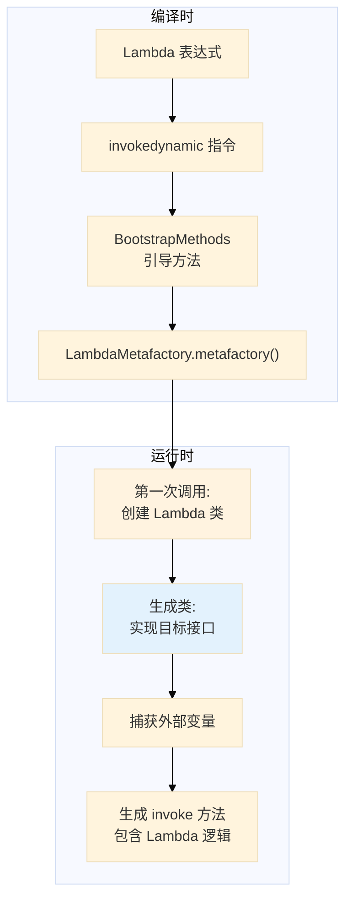

---

## 7. 实战：分析字节码

### 7.1 创建测试类

```java
// Arithmetic.java
public class Arithmetic {
    public int factorial(int n) {
        if (n <= 1) {
            return 1;
        }
        return n * factorial(n - 1);
    }

    public int sum(int[] arr) {
        int total = 0;
        for (int i = 0; i < arr.length; i++) {
            total += arr[i];
        }
        return total;
    }
}
```

### 7.2 查看字节码

```bash
javap -c -p Arithmetic.class
```

```asm
public int factorial(int);
  descriptor: (I)I
  flags: ACC_PUBLIC
  Code:
    stack=2, locals=2, args_size=2
    0: iload_1
    1: iconst_1
    2: if_icmpgt     7          // n > 1 ? 跳过返回1
    5: iconst_1
    6: ireturn
    7: iload_1
    8: iload_1
    9: iconst_1
    10: isub
    11: invokevirtual #2        // 递归调用 factorial
    14: imul
    15: ireturn

public int sum(int[]);
  descriptor: ([I)I
  flags: ACC_PUBLIC
  Code:
    stack=2, locals=4, args_size=2
    0: iconst_0
    1: istore_2                  // total = 0
    2: iconst_0
    3: istore_3                  // i = 0
    4: iload_3
    5: aload_1
    6: arraylength
    7: if_icmpge     18          // i >= arr.length ? 跳出循环
    8: iload_2
    9: aload_1
    10: iload_3
    11: iaload                   // arr[i]
    12: iadd                     // total + arr[i]
    13: istore_2                 // total = ...
    14: iinc          3, 1       // i++
    17: goto          4          // 跳转回循环开始
    18: iload_2                  // 加载 total
    19: ireturn                  // 返回 total
```

---

## 8. 总结

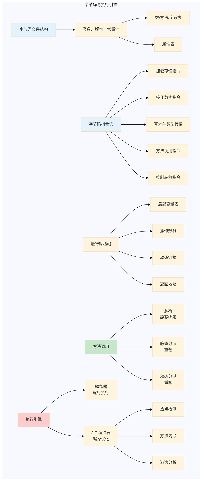

### 核心要点

1. **字节码文件结构**：以 `0xCAFEBABE` 魔数开头，包含常量池、类信息、方法表等
2. **字节码指令**：单字节操作码 + 可选操作数，200+ 条指令
3. **栈帧结构**：局部变量表 + 操作数栈 + 动态链接 + 返回地址
4. **方法分派**：
   - 静态分派：编译期确定，方法重载
   - 动态分派：运行期确定，方法重写
5. **执行引擎**：
   - 解释器：启动快，执行慢
   - JIT 编译器：热点代码编译优化
   - 分层编译：平衡启动速度和执行效率
