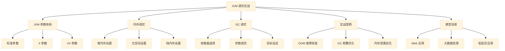
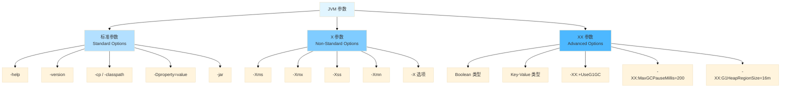
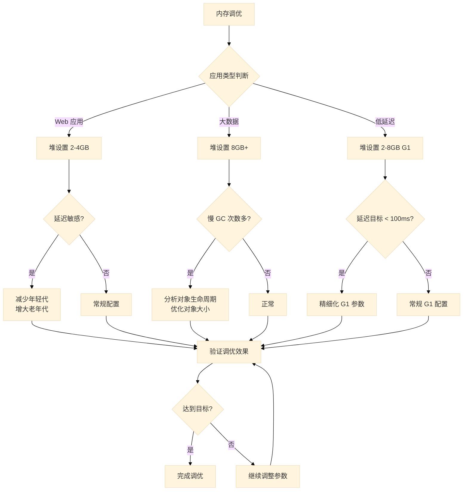
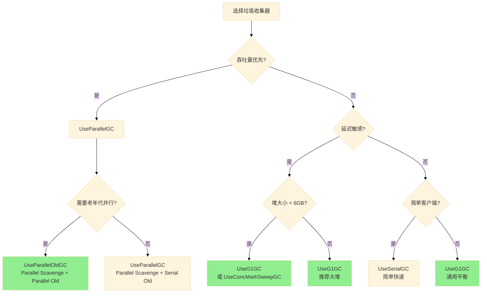
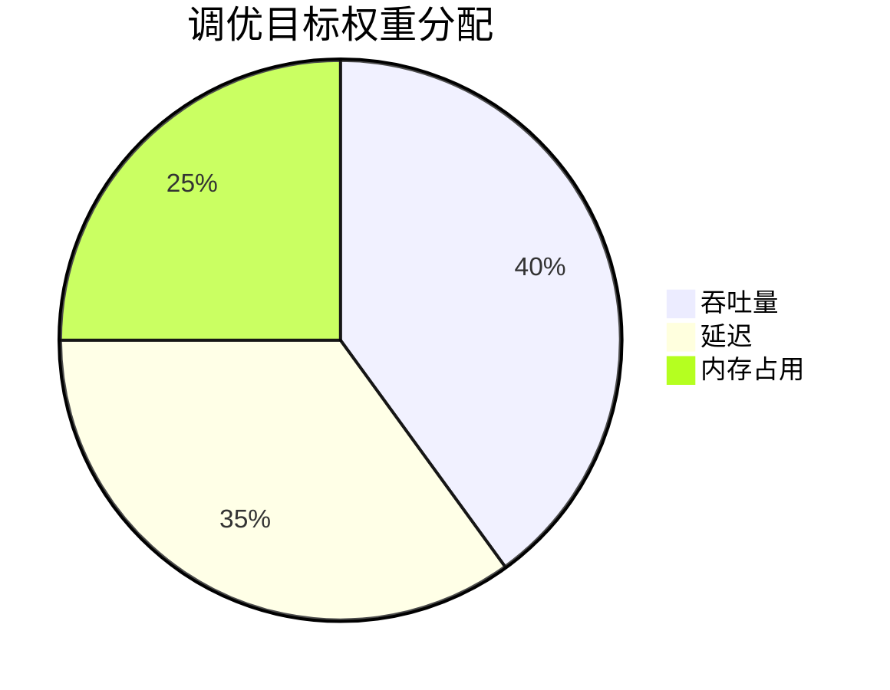
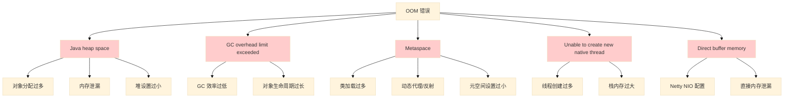
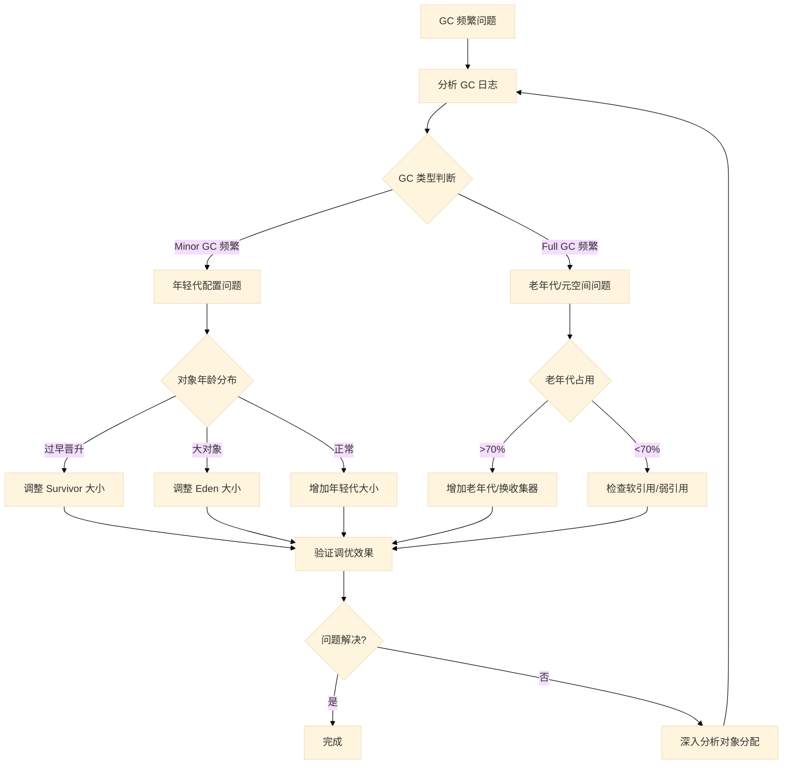
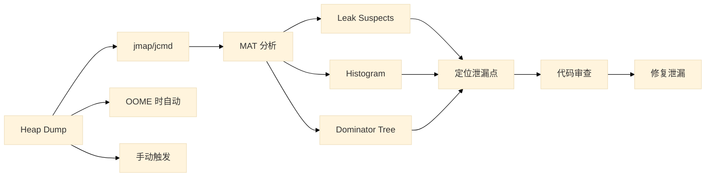
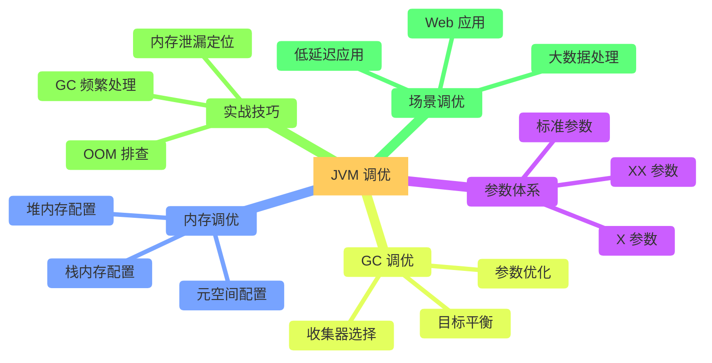
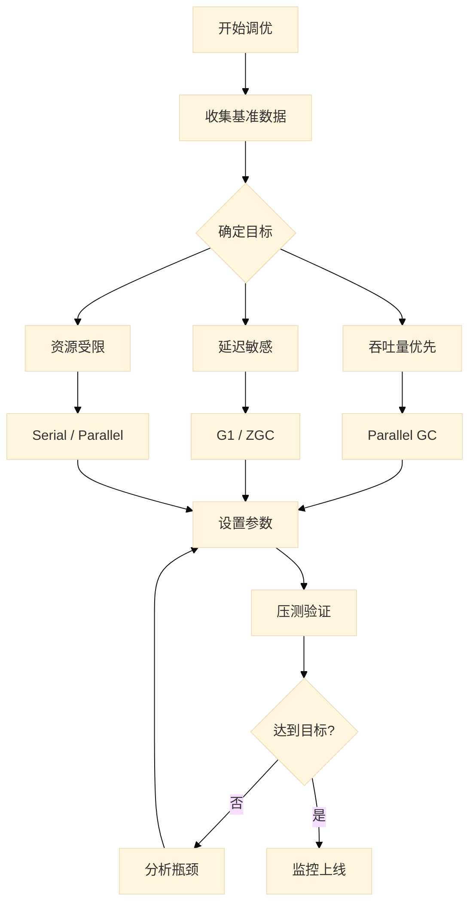

# 06 | JVM 调优实战

## 概述

JVM 调优是 Java 开发者在生产环境中必须掌握的核心技能。本章将从 JVM 参数体系入手，深入讲解内存调优、GC 调优的原理与实践，并结合实际案例帮助读者掌握问题诊断与性能优化的方法论。



---

## 1. JVM 参数体系

JVM 提供了三个层次的参数，用于控制虚拟机的运行行为。理解这些参数的分类和使用方式，是进行调优的基础。

### 1.1 参数分类层次图



### 1.2 标准参数 (Standard Options)

标准参数是所有 JVM 实现都必须支持的参数稳定性最高。

```bash
# 显示帮助信息
java -help

# 显示版本信息
java -version

# 设置类路径
java -cp /path/to/classes:/path/to/lib/* MyApp

# 设置系统属性
java -Dfile.encoding=UTF-8 -Dserver.port=8080 MyApp

# 运行 jar 包
java -jar myapp.jar
```

### 1.3 X 参数 (Non-Standard Options)

X 参数是非标准参数，不同 JVM 实现可能有差异，主要用于基本的内存配置。

```bash
# 初始堆大小
-Xms512m

# 最大堆大小
-Xmx2048m

# 线程栈大小
-Xss1m

# 年轻代大小
-Xmn256m

# 典型服务器启动脚本
java -Xms4g -Xmx4g -Xmn2g -Xss1m -jar myapp.jar
```

### 1.4 XX 参数 (Advanced Options)

XX 参数是高级参数，用于细粒度控制 JVM 行为，是调优的核心参数。

#### 1.4.1 Boolean 类型参数

```bash
# 开启某个功能
-XX:+UseG1GC

# 关闭某个功能
-XX:-UseConcMarkSweepGC
```

#### 1.4.2 Key-Value 类型参数

```bash
# 格式：-XX:<key>=<value>
-XX:MaxGCPauseMillis=200
-XX:G1HeapRegionSize=16m
-XX:NewRatio=2
```

### 1.5 常用 JVM 参数详解

#### 1.5.1 堆内存相关参数

| 参数 | 说明 | 示例 |
|------|------|------|
| `-Xms` | 初始堆大小 | `-Xms2g` |
| `-Xmx` | 最大堆大小 | `-Xmx4g` |
| `-Xmn` | 年轻代大小 | `-Xmn1g` |
| `-XX:NewSize` | 年轻代初始大小 | `-XX:NewSize=512m` |
| `-XX:MaxNewSize` | 年轻代最大大小 | `-XX:MaxNewSize=1g` |
| `-XX:NewRatio` | 年轻代与老年代比例 | `-XX:NewRatio=2` |
| `-XX:SurvivorRatio` | Eden 与 Survivor 比例 | `-XX:SurvivorRatio=8` |
| `-XX:MetaspaceSize` | 元空间初始大小 | `-XX:MetaspaceSize=256m` |
| `-XX:MaxMetaspaceSize` | 元空间最大大小 | `-XX:MaxMetaspaceSize=512m` |

#### 1.5.2 GC 相关参数

| 参数 | 说明 | 示例 |
|------|------|------|
| `-XX:+UseSerialGC` | 使用 Serial 收集器 | - |
| `-XX:+UseParallelGC` | 使用 Parallel 收集器 | - |
| `-XX:+UseParallelOldGC` | 使用 Parallel Old 收集器 | - |
| `-XX:+UseConcMarkSweepGC` | 使用 CMS 收集器 | - |
| `-XX:+UseG1GC` | 使用 G1 收集器 | - |
| `-XX:MaxGCPauseMillis` | 最大 GC 停顿时间目标 | `-XX:MaxGCPauseMillis=200` |
| `-XX:G1HeapRegionSize` | G1 区域大小 | `-XX:G1HeapRegionSize=16m` |
| `-XX:ParallelGCThreads` | Parallel GC 线程数 | `-XX:ParallelGCThreads=8` |

#### 1.5.3 调试与日志参数

| 参数 | 说明 | 示例 |
|------|------|------|
| `-XX:+PrintGCDetails` | 打印 GC 详细信息 | - |
| `-XX:+PrintGCDateStamps` | 打印 GC 时间戳 | - |
| `-Xlog:gc*` | 使用新版日志格式 | `-Xlog:gc*:file=gc.log` |
| `-XX:+HeapDumpOnOutOfMemoryError` | OOM 时导出堆 dump | - |
| `-XX:HeapDumpPath` | 堆 dump 文件路径 | `-XX:HeapDumpPath=/tmp/java.hprof` |

### 1.6 参数配置示例

```bash
# 基础配置：适用于一般 Web 应用
java -Xms2g -Xmx2g -Xmn1g -Xss512k -jar myapp.jar

# 高性能配置：追求吞吐量
java \
    -Xms4g \
    -Xmx4g \
    -Xmn2g \
    -XX:+UseParallelGC \
    -XX:+UseParallelOldGC \
    -XX:ParallelGCThreads=8 \
    -XX:+PrintGCDetails \
    -XX:+PrintGCDateStamps \
    -Xlog:gc:file=gc.log \
    -jar myapp.jar

# 低延迟配置：使用 G1
java \
    -Xms4g \
    -Xmx4g \
    -XX:+UseG1GC \
    -XX:MaxGCPauseMillis=200 \
    -XX:G1HeapRegionSize=16m \
    -XX:+HeapDumpOnOutOfMemoryError \
    -XX:HeapDumpPath=/var/log/java_oom.hprof \
    -jar myapp.jar
```

---

## 2. 内存调优

内存调优是 JVM 调优的核心内容，主要涉及堆内存、元空间和栈内存的合理配置。

### 2.1 调优决策流程图



### 2.2 堆内存设置

#### 2.2.1 核心原则

1. **初始值与最大值一致**：避免运行时调整堆大小带来的开销
2. **留足可用内存**：堆大小不应超过系统可用内存的 80%
3. **考虑实际需求**：根据应用对象分配模式选择合适的大小

#### 2.2.2 堆大小计算公式

```
年轻代大小 = 堆大小 / (1 + NewRatio)
老年代大小 = 堆大小 - 年轻代大小
Eden 大小 = 年轻代大小 / (1 + SurvivorRatio)
每个 Survivor 大小 = Eden 大小 / SurvivorRatio
```

#### 2.2.3 配置示例

```java
/**
 * 堆内存配置示例
 *
 * 场景：4核8GB服务器运行 Spring Boot 应用
 * 目标：平衡内存使用与 GC 频率
 *
 * 配置策略：
 * - 堆大小：4GB（留 4GB 给操作系统和其他用途）
 * - 年轻代：2GB（堆的 50%，NewRatio=1）
 * - 栈大小：512KB（平衡深度与内存占用）
 */
public class HeapMemoryConfig {
    public static void main(String[] args) {
        // JVM 参数：
        // -Xms4g -Xmx4g          堆初始值和最大值
        // -Xmn2g                  年轻代大小 2GB
        // -Xss512k                栈大小 512KB
        // -XX:NewRatio=1          年轻代:老年代 = 1:1
        // -XX:SurvivorRatio=8    Eden:Survivor = 8:1

        // 打印当前堆信息
        Runtime runtime = Runtime.getRuntime();
        long maxMemory = runtime.maxMemory() / (1024 * 1024);
        long totalMemory = runtime.totalMemory() / (1024 * 1024);
        long freeMemory = runtime.freeMemory() / (1024 * 1024);

        System.out.println("Max Memory: " + maxMemory + " MB");
        System.out.println("Total Memory: " + totalMemory + " MB");
        System.out.println("Free Memory: " + freeMemory + " MB");
        System.out.println("Used Memory: " + (totalMemory - freeMemory) + " MB");
    }
}
```

### 2.3 元空间设置

元空间存储类的元数据信息，与堆内存分离，使用本地内存。

#### 2.3.1 元空间参数

```bash
# 元空间初始大小
-XX:MetaspaceSize=256m

# 元空间最大大小（建议设置，防止无限扩张）
-XX:MaxMetaspaceSize=512m

# 压缩类空间（JDK 8+）
-XX:+UseCompressedClassPointers

# 类空间大小
-XX:CompressedClassSpaceSize=1g
```

#### 2.3.2 常见问题与解决方案

| 问题 | 原因 | 解决方案 |
|------|------|----------|
| MetaSpace OOM | 动态生成大量类（如 Spring CGLIB、JSF） | 增大 MaxMetaspaceSize |
| 元空间持续增长 | 类加载器泄漏 | 使用 -XX:+TraceClassLoading 排查 |
| 压缩类空间不足 | 加载类过多 | 增大 CompressedClassSpaceSize |

### 2.4 栈内存设置

栈内存配置影响方法调用深度和并发线程数。

```bash
# 默认栈大小（1MB）
-Xss1m

# 较小栈（支持更多线程）
-Xss256k

# 较大栈（支持更深递归）
-Xss2m
```

```java
/**
 * 栈内存配置示例
 *
 * 场景：需要创建大量线程的应用（如 Reactor 模型）
 * 问题：线程数受限于栈内存总量
 *
 * 计算公式：
 * 最大线程数 ≈ 可用内存 / 栈大小
 * 8GB 内存 / 256KB 栈 ≈ 32000 线程（理论上限）
 */
public class StackMemoryExample {

    /**
     * 递归计算（需要较大栈）
     */
    public static long factorial(int n) {
        if (n <= 1) return 1;
        return n * factorial(n - 1);
    }

    /**
     * 非递归实现（栈需求小）
     */
    public static long factorialIterative(int n) {
        long result = 1;
        for (int i = 2; i <= n; i++) {
            result *= i;
        }
        return result;
    }

    public static void main(String[] args) {
        // 递归版本 - 如果栈太小会StackOverflowError
        // -Xss256k 下，递归深度超过约 4000 会出问题
        System.out.println("Factorial(100) = " + factorialIterative(100));
    }
}
```

---

## 3. GC 调优

GC 调优的目标是在吞吐量、延迟和内存占用三者之间找到最佳平衡点。

### 3.1 收集器选择决策图



### 3.2 收集器对比表

| 收集器 | 算法 | 停顿时间 | 吞吐量 | 适用场景 |
|--------|------|----------|--------|----------|
| Serial | 标记-复制 | STW | 低 | 单线程、客户端 |
| ParNew | 标记-复制 | STW | 中 | 多核服务器、年轻代 |
| Parallel Scavenge | 标记-复制 | STW | 高 | 吞吐量优先场景 |
| Serial Old | 标记-整理 | STW | 低 | 单线程、老年代 |
| Parallel Old | 标记-整理 | STW | 高 | 吞吐量优先场景 |
| CMS | 标记-清除 | 最短停顿 | 高 | 延迟敏感场景 |
| G1 | 标记-整理+复制 | 可控 | 高 | 大堆、低延迟场景 |
| ZGC | 着色指针+读屏障 | <1ms | 高 | 超大堆（>16GB）、极低延迟 |
| Shenandoah | 着色指针+读屏障 | <1ms | 高 | 大堆、低延迟场景 |

### 3.3 GC 参数调优

#### 3.3.1 Parallel GC 调优

```bash
java \
    -Xms4g -Xmx4g \
    -XX:+UseParallelGC \
    -XX:+UseParallelOldGC \
    -XX:ParallelGCThreads=8 \
    -XX:MaxGCPauseMillis=500 \
    -XX:GCTimeRatio=19 \
    -XX:+UseAdaptiveSizePolicy \
    -jar myapp.jar
```

**关键参数说明**：

- `ParallelGCThreads`：GC 线程数，建议与 CPU 核心数相同
- `MaxGCPauseMillis`：最大停顿时间目标（不保证一定达到）
- `GCTimeRatio`：GC 时间与应用时间的比例，公式：`吞吐量 = 1 / (1 + GCTimeRatio)`
  - `GCTimeRatio=19` 表示 1/20 = 5% 的时间用于 GC
- `UseAdaptiveSizePolicy`：自动调整年轻代大小和 Survivor 比例

#### 3.3.2 G1 GC 调优

```bash
java \
    -Xms8g -Xmx8g \
    -XX:+UseG1GC \
    -XX:MaxGCPauseMillis=200 \
    -XX:G1HeapRegionSize=4m \
    -XX:InitiatingHeapOccupancyPercent=45 \
    -XX:G1ReservePercent=10 \
    -XX:ParallelGCThreads=8 \
    -XX:ConcGCThreads=2 \
    -jar myapp.jar
```

**G1 关键参数说明**：

| 参数 | 说明 | 建议值 |
|------|------|--------|
| `MaxGCPauseMillis` | 最大停顿时间目标 | 200-500ms |
| `G1HeapRegionSize` | 区域大小 | 1/2/4/8/16/32MB，堆的 1/2000 |
| `InitiatingHeapOccupancyPercent` | 触发 Mixed GC 的堆占用阈值 | 45% |
| `G1ReservePercent` | 预留空间比例 | 10% |
| `ParallelGCThreads` | 并行阶段 GC 线程数 | CPU 核心数的 5/8 |
| `ConcGCThreads` | 并发阶段 GC 线程数 | ParallelGCThreads 的 1/4 |

### 3.4 调优目标设定



| 应用类型 | 首要目标 | 次要目标 | 推荐收集器 |
|----------|----------|----------|------------|
| 批处理/离线计算 | 吞吐量 | 内存占用 | Parallel Old |
| Web 应用 | 延迟 | 吞吐量 | G1 / CMS |
| 实时交易 | 延迟 | 吞吐量 | ZGC / G1 |
| 大数据分析 | 吞吐量 | 延迟 | Parallel Old |
| 嵌入式系统 | 内存占用 | 延迟 | Serial |

---

## 4. 实战案例

### 4.1 OOM 故障排查

#### 4.1.1 常见 OOM 场景示意图



#### 4.1.2 OOM 案例：堆内存溢出

```java
import java.util.*;
import java.util.concurrent.TimeUnit;

/**
 * OOM 演示：堆内存溢出
 *
 * 问题场景：缓存数据无限增长，导致堆内存耗尽
 * 症状：java.lang.OutOfMemoryError: Java heap space
 */
public class OOMHeapSpace {

    // 模拟用户缓存 - 错误的无限增长实现
    private static final Map<String, UserInfo> userCache = new HashMap<>();

    public static void main(String[] args) throws Exception {
        System.out.println("Starting OOM test...");
        System.out.println("Max Memory: " + Runtime.getRuntime().maxMemory() / 1024 / 1024 + " MB");

        int count = 0;
        try {
            while (true) {
                // 不断添加缓存数据，永不清理
                String key = "user_" + count;
                userCache.put(key, new UserInfo(key, "User " + count, count));

                count++;

                // 每 10 万条打印一次
                if (count % 100000 == 0) {
                    System.out.printf("Created %,d objects, cache size: %,d%n",
                        count, userCache.size());
                    System.out.printf("Memory used: %,d MB%n",
                        (Runtime.getRuntime().totalMemory() - Runtime.getRuntime().freeMemory()) / 1024 / 1024);
                }

                // 模拟业务处理时间
                TimeUnit.NANOSECONDS.sleep(1);
            }
        } catch (OutOfMemoryError e) {
            System.out.println("OOM occurred!");
            System.out.println("Objects created: " + count);
            System.out.println("Cache size: " + userCache.size());
            System.out.println("Memory used: " +
                (Runtime.getRuntime().totalMemory() - Runtime.getRuntime().freeMemory()) / 1024 / 1024 + " MB");
            throw e;
        }
    }

    static class UserInfo {
        String id;
        String name;
        int age;
        byte[] data; // 模拟占用更多内存

        UserInfo(String id, String name, int age) {
            this.id = id;
            this.name = name;
            this.age = age;
            this.data = new byte[1024]; // 每条数据 1KB
        }
    }
}
```

**JVM 参数配置**（用于复现问题）：

```bash
# 设置小堆内存用于复现
java -Xmx256m -XX:+HeapDumpOnOutOfMemoryError -XX:HeapDumpPath=/tmp/heapdump.hprof OOMHeapSpace
```

**排查步骤**：

```bash
# 1. 查看 GC 日志
-XX:+PrintGCDetails -XX:+PrintGCDateStamps -Xlog:gc:/tmp/gc.log

# 2. 使用 jmap 查看堆 histogram
jmap -histo <pid> | head -30

# 3. 分析堆 dump 文件
jhat /tmp/heapdump.hprof
# 或使用 MAT (Memory Analyzer Tool)

# 4. 使用 jstat 监控
jstat -gcutil <pid> 1000
```

#### 4.1.3 OOM 案例：元空间溢出

```java
import org.springframework.cglib.proxy.Enhancer;
import org.springframework.cglib.proxy.MethodInterceptor;

/**
 * OOM 演示：元空间溢出
 *
 * 问题场景：动态生成大量类（使用 CGLIB）
 * 症状：java.lang.OutOfMemoryError: Metaspace
 */
public class OOMMetaspace {

    public static void main(String[] args) throws Exception {
        System.out.println("Starting Metaspace OOM test...");
        int count = 0;

        try {
            while (true) {
                // 使用 CGLIB 动态创建类
                Enhancer enhancer = new Enhancer();
                enhancer.setSuperclass(MyClass.class);
                enhancer.setCallback((MethodInterceptor) (obj, method, args2, proxy) -> {
                    System.out.println("Method called: " + method.getName());
                    return proxy.invokeSuper(obj, args2);
                });
                enhancer.create();

                count++;
                if (count % 1000 == 0) {
                    System.out.println("Created " + count + " classes");
                }
            }
        } catch (OutOfMemoryError e) {
            System.out.println("Metaspace OOM after creating " + count + " classes");
            throw e;
        }
    }

    public static class MyClass {
        public void doSomething() {
            System.out.println("Doing something...");
        }
    }
}
```

**JVM 参数配置**：

```bash
# 限制元空间大小
java -XX:MaxMetaspaceSize=128m -XX:+HeapDumpOnOutOfMemoryError OOMMetaspace
```

### 4.2 GC 频繁优化

#### 4.2.1 问题分析流程图



#### 4.2.2 GC 频繁案例分析与解决

```java
import java.util.*;
import java.util.concurrent.TimeUnit;

/**
 * GC 频繁问题演示
 *
 * 场景：短生命周期对象过多，导致 Minor GC 频繁
 */
public class GCFrequentIssue {

    public static void main(String[] args) {
        // JVM 参数：-Xms4g -Xmx4g -Xmn2g -XX:SurvivorRatio=8 -XX:+PrintGCDetails

        List<Object> holder = new ArrayList<>();

        long startTime = System.currentTimeMillis();
        int minorGCCount = 0;

        while (System.currentTimeMillis() - startTime < 60000) {
            // 模拟请求处理
            processRequest(holder);

            // 定期打印状态
            if (System.currentTimeMillis() - startTime > 0) {
                minorGCCount++;
            }
        }

        System.out.println("Test completed. Minor GC count: " + minorGCCount);
    }

    /**
     * 模拟请求处理 - 问题代码
     * 每次请求创建大量临时对象，且引用被 ArrayList 持有无法释放
     */
    private static void processRequest(List<Object> holder) {
        // 问题：这些对象应该用完即释放，但 holder 持有引用导致晋升到老年代
        for (int i = 0; i < 100; i++) {
            holder.add(new byte[1024]); // 1KB 对象
        }

        // 只保留部分引用
        if (holder.size() > 10000) {
            holder.subList(0, 5000).clear();
        }

        try {
            TimeUnit.MILLISECONDS.sleep(1);
        } catch (InterruptedException e) {
            e.printStackTrace();
        }
    }
}
```

**优化方案**：

```java
/**
 * 优化后的代码
 */
public class GCFrequentOptimized {

    public static void main(String[] args) {
        long startTime = System.currentTimeMillis();

        while (System.currentTimeMillis() - startTime < 60000) {
            processRequestOptimized();
        }

        System.out.println("Test completed with optimized code");
    }

    /**
     * 优化方法：减少临时对象，及时释放
     */
    private static void processRequestOptimized() {
        // 使用对象池复用
        byte[] buffer = getBuffer();
        try {
            // 处理逻辑
            processBuffer(buffer);
        } finally {
            releaseBuffer(buffer); // 归还到池中
        }

        try {
            TimeUnit.MILLISECONDS.sleep(1);
        } catch (InterruptedException e) {
            e.printStackTrace();
        }
    }

    // 简单对象池实现
    private static final Queue<byte[]> bufferPool = new LinkedList<>();

    private static byte[] getBuffer() {
        synchronized (bufferPool) {
            byte[] buffer = bufferPool.poll();
            return buffer != null ? buffer : new byte[1024];
        }
    }

    private static void releaseBuffer(byte[] buffer) {
        synchronized (bufferPool) {
            if (bufferPool.size() < 100) { // 限制池大小
                bufferPool.offer(buffer);
            }
        }
    }

    private static void processBuffer(byte[] buffer) {
        // 实际处理逻辑
    }
}
```

**JVM 参数调优**：

```bash
# 调整年轻代大小和 Survivor 比例
java -Xms4g -Xmx4g -Xmn3g -XX:SurvivorRatio=4 -XX:+PrintGCDetails -XX:+PrintGCDateStamps -Xlog:gc:/tmp/gc.log GCFrequentOptimized
```

### 4.3 内存泄漏定位

#### 4.3.1 内存泄漏排查流程



#### 4.3.2 内存泄漏典型案例

```java
import java.util.*;
import java.lang.ref.WeakReference;

/**
 * 内存泄漏案例：集合类泄漏
 *
 * 场景：使用静态集合存储对象引用，但从不清理
 */
public class MemoryLeakExample {

    // 泄漏点：静态集合持续增长
    private static final List<byte[]> leakCache = new ArrayList<>();

    // 可能的泄漏点：监听器未注销
    private static final List<Listener> listeners = new ArrayList<>();

    public static void main(String[] args) throws InterruptedException {
        System.out.println("Starting memory leak test...");

        // 模拟内存泄漏
        int count = 0;
        while (count < 100000) {
            // 不断向集合添加数据
            leakCache.add(new byte[1024 * 10]); // 10KB

            if (count % 10000 == 0) {
                System.out.printf("Leak cache size: %,d entries, memory: %,d MB%n",
                    leakCache.size(),
                    leakCache.size() * 10 / 1024);
            }
            count++;
        }
    }

    /**
     * 常见内存泄漏模式
     */
    public static class CommonLeakPatterns {

        // 模式1：静态集合
        private static final Map<String, Object> staticMap = new HashMap<>();

        // 模式2：未关闭的资源
        private static List<Connection> connections = new ArrayList<>();

        // 模式3：监听器未注销
        private static List<WeakReference<Listener>> weakListeners = new ArrayList<>();

        // 模式4：ThreadLocal 未清理
        private static final ThreadLocal<byte[]> threadLocal = new ThreadLocal<>();
    }
}
```

**排查命令**：

```bash
# 1. 生成堆 dump
jmap -dump:format=b,file=/tmp/heap.bin <pid>

# 2. 或使用 jcmd（推荐）
jcmd <pid> GC.heap_dump /tmp/heap.bin

# 3. 使用 MAT 分析
# 打开 MAT，导入 heap.bin
# 查看 Leak Suspects报告

# 4. 使用 jhat 分析（简单）
jhat -port 7000 /tmp/heap.bin
# 然后浏览器访问 http://localhost:7000
```

---

## 5. 典型场景调优

### 5.1 Web 应用调优

**场景特点**：
- 并发请求多，对象生命周期短
- 延迟敏感，需要快速响应
- 内存使用相对稳定

**推荐配置**：

```bash
java -server \
    -Xms2g -Xmx2g \
    -Xmn1g \
    -Xss512k \
    -XX:+UseG1GC \
    -XX:MaxGCPauseMillis=200 \
    -XX:G1HeapRegionSize=4m \
    -XX:InitiatingHeapOccupancyPercent=45 \
    -XX:+HeapDumpOnOutOfMemoryError \
    -XX:HeapDumpPath=/var/log/java_oom.hprof \
    -XX:+PrintGCDetails \
    -XX:+PrintGCDateStamps \
    -Xlog:gc:/var/log/gc.log:time,uptime,level,tags \
    -Dspring.profiles.active=production \
    -jar myapp.jar
```

**调优要点**：

| 目标 | 参数调整 |
|------|----------|
| 降低延迟 | `-XX:MaxGCPauseMillis=200`，启用 G1 |
| 稳定响应 | 堆大小固定 `-Xms=-Xmx` |
| 快速定位问题 | 开启 HeapDump 和 GC 日志 |

### 5.2 大数据处理调优

**场景特点**：
- 批处理模式，吞吐量优先
- 内存占用大
- Full GC 频率要低

**推荐配置**：

```bash
java -server \
    -Xms8g -Xmx8g \
    -Xmn4g \
    -XX:+UseParallelGC \
    -XX:+UseParallelOldGC \
    -XX:ParallelGCThreads=8 \
    -XX:MaxGCPauseMillis=1000 \
    -XX:+UseAdaptiveSizePolicy \
    -XX:NewRatio=1 \
    -XX:SurvivorRatio=4 \
    -XX:+PrintGCDetails \
    -XX:+PrintGCDateStamps \
    -Xlog:gc:/var/log/gc.log \
    -XX:+AlwaysPreTouch \
    -jar bigdata-app.jar
```

**调优要点**：

| 目标 | 参数调整 |
|------|----------|
| 高吞吐量 | Parallel GC，增大年轻代 |
| 充分利用硬件 | ParallelGCThreads = CPU 核心数 |
| 减少 Full GC | 增大堆和年轻代 |
| 预热 | `-XX:+AlwaysPreTouch` 预分配内存 |

### 5.3 低延迟应用调优

**场景特点**：
- 延迟要求极高（<100ms）
- 停顿时间必须短
- 使用 G1 或 ZGC

**推荐配置（G1）**：

```bash
java -server \
    -Xms4g -Xmx4g \
    -XX:+UseG1GC \
    -XX:MaxGCPauseMillis=50 \
    -XX:G1HeapRegionSize=4m \
    -XX:InitiatingHeapOccupancyPercent=30 \
    -XX:G1ReservePercent=15 \
    -XX:ParallelGCThreads=8 \
    -XX:ConcGCThreads=2 \
    -XX:+UnlockExperimentalVMOptions \
    -XX:G1MixedGCLiveThresholdPercent=85 \
    -XX:G1HeapWastePercent=1 \
    -XX:+HeapDumpOnOutOfMemoryError \
    -Xlog:gc*:file=/var/log/gc.log:time,uptime,level,tags \
    -jar low-latency-app.jar
```

**推荐配置（ZGC）**：

```bash
java -server \
    -Xms4g -Xmx4g \
    -XX:+UseZGC \
    -XX:MaxGCPauseMillis=10 \
    -XX:+ZCollectionInterval=60 \
    -XX:+UnlockExperimentalVMOptions \
    -XX:+AlwaysPreTouch \
    -XX:+HeapDumpOnOutOfMemoryError \
    -Xlog:gc*:file=/var/log/gc.log \
    -jar low-latency-app.jar
```

**调优要点**：

| 收集器 | 适用场景 | 关键参数 |
|--------|----------|----------|
| G1 | 6GB 以下堆，延迟 < 200ms | MaxGCPauseMillis, G1HeapRegionSize |
| ZGC | 大堆（>6GB），极低延迟 | MaxGCPauseMillis=10 |
| Shenandoah | 大堆，低延迟（无停顿） | MaxGCPauseMillis |

---

## 6. 调优工具与命令

### 6.1 常用诊断命令

| 命令 | 用途 | 示例 |
|------|------|------|
| `jps` | 查看 Java 进程 | `jps -l` |
| `jinfo` | 查看/修改 JVM 参数 | `jinfo -flags <pid>` |
| `jstat` | 监控 GC 统计 | `jstat -gcutil <pid> 1000` |
| `jmap` | 生成堆 dump | `jmap -dump:file=heap.bin <pid>` |
| `jstack` | 线程 dump | `jstack <pid>` |
| `jcmd` | 综合诊断 | `jcmd <pid> VM.version` |

### 6.2 jstat 命令示例

```bash
# 监控 GC 统计（每 1 秒输出一次）
jstat -gcutil <pid> 1000

# 输出：
# S0     S1     E      O      M     CCS    YGC     YGCT    FGC    FGCT     GCT
# 0.00  12.45  65.00  78.00  92.50  88.00  12345  123.456  12    12.345  135.801

# 监控堆使用情况
jstat -gccapacity <pid>

# 监控年轻代统计
jstat -gcnew <pid>
```

### 6.3 GC 日志分析

```bash
# 使用 gclog 分析工具
# 1. 设置日志滚动
-Xlog:gc*:file=gc.log:time,uptime,level,tags:filecount=10,filesize=10M

# 2. 分析 GC 日志
# 可使用在线工具：gceasy.io, gcplot.com
# 或本地工具：GCViewer
```

---

## 7. 总结



### 调优检查清单



---

## 参考资料

- [JVM 官方文档](https://docs.oracle.com/javase/8/docs/technotes/guides/hotspot/hs19.html)
- [G1 官方调优指南](https://docs.oracle.com/javase/8/docs/technotes/guides/vm/G1.html)
- [GC 日志分析工具](https://gceasy.io)
