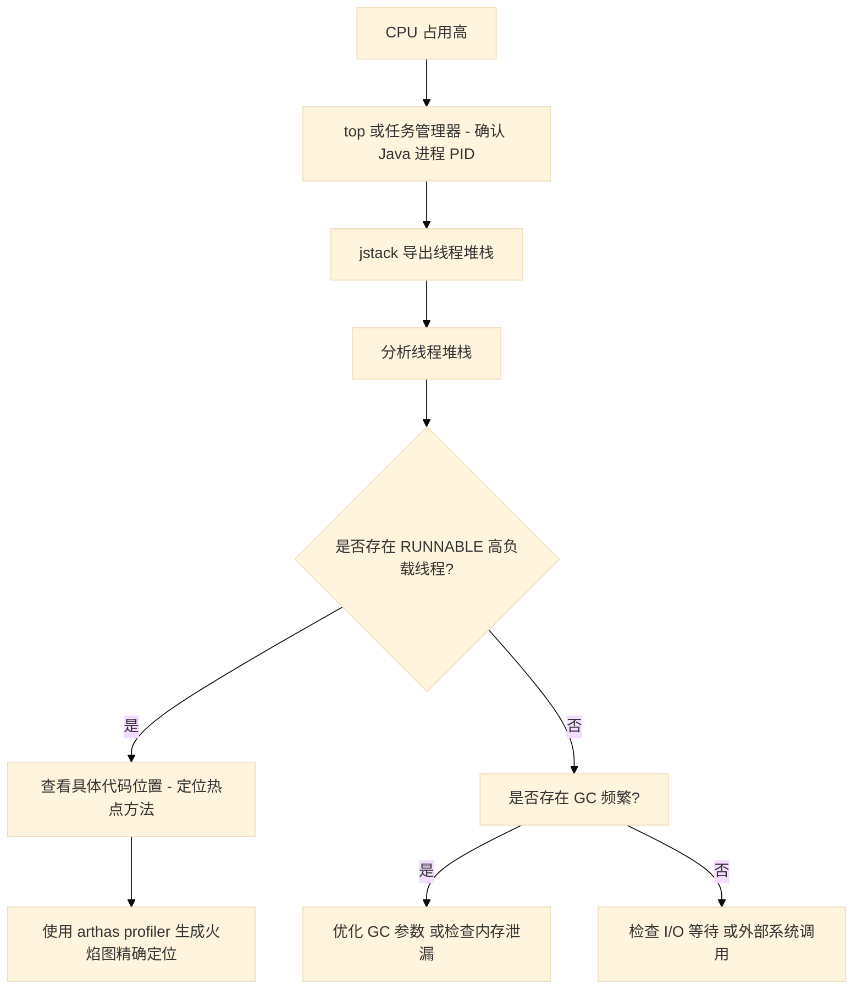
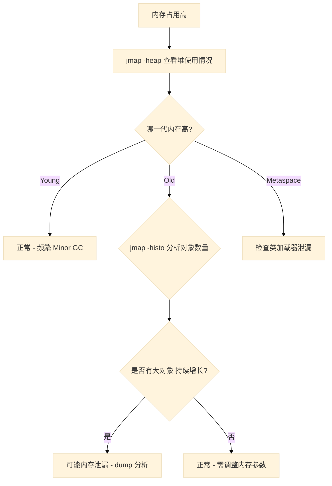
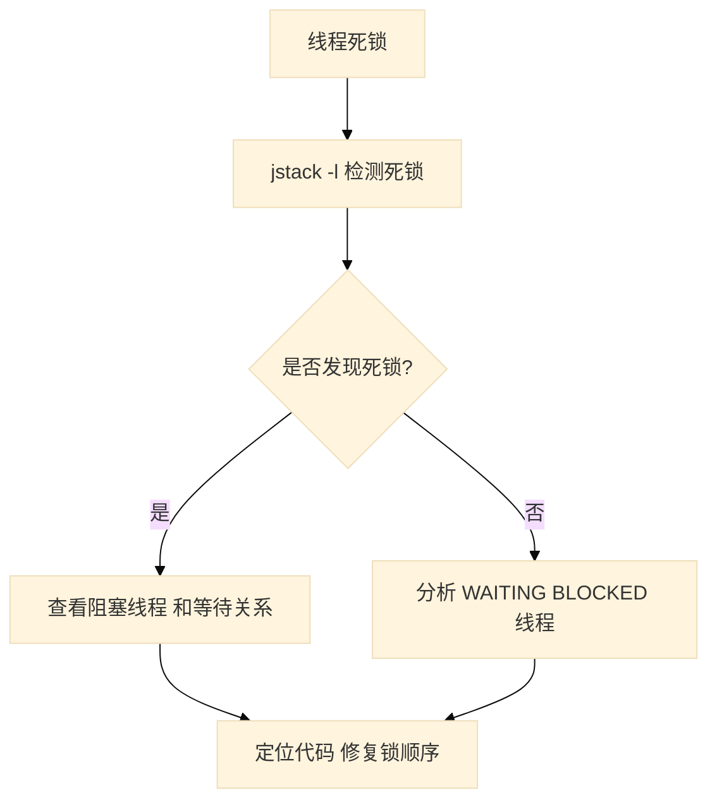
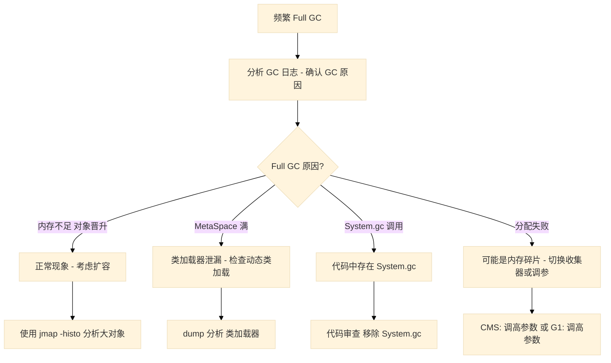
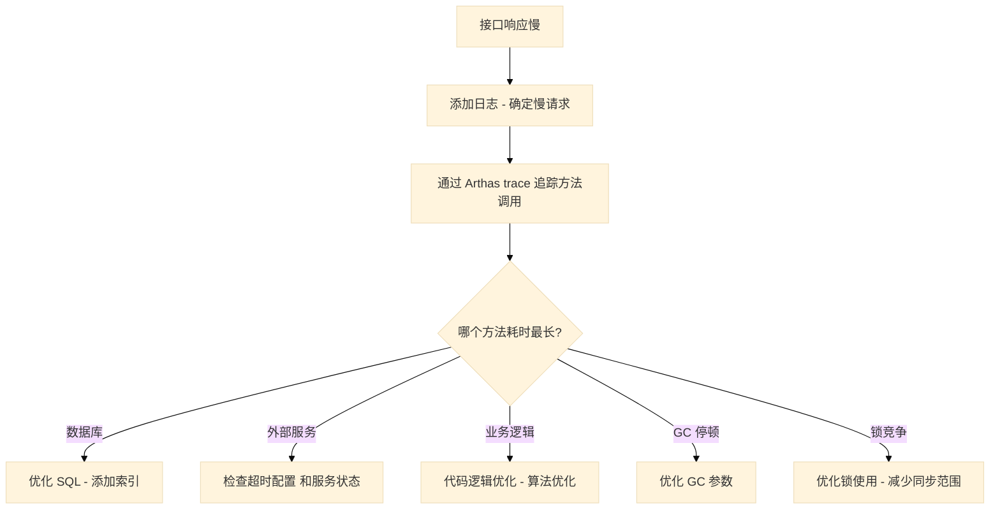
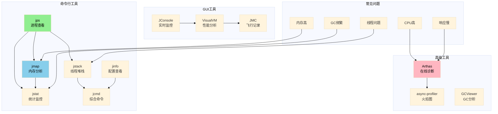

# 07 | 性能监控与故障诊断

## 概述

JVM 性能监控与故障诊断是 Java 工程师必须掌握的核心技能。本章将详细介绍各种诊断工具的使用方法，以及常见问题的排查思路和实战技巧。

---

## 7.1 诊断工具概览

### 7.1.1 命令行工具

JDK 自带了一系列命令行诊断工具，位于 `JAVA_HOME/bin` 目录下：

| 工具 | 用途 | 核心功能 |
|------|------|----------|
| `jps` | 进程状态 | 查看 Java 进程 ID 和启动类 |
| `jstat` | 统计信息 | 查看 GC、类加载、编译统计 |
| `jmap` | 内存映射 | 生成堆转储、查看内存分配 |
| `jstack` | 线程堆栈 | 导出线程堆栈、检测死锁 |
| `jinfo` | 配置信息 | 查看和修改 JVM 参数 |
| `jcmd` | 综合命令 | 多种诊断操作的组合工具 |

### 7.1.2 GUI 工具

| 工具 | 特点 | 使用场景 |
|------|------|----------|
| **JConsole** | JDK 内置，基础监控 | 实时监控内存、线程、CPU |
| **VisualVM** | 强大插件系统 | 性能分析、堆转储分析 |
| **JMC** | Java Mission Control | 飞行记录器、低开销监控 |

### 7.1.3 高级工具

| 工具 | 特点 | 官网 |
|------|------|------|
| **Arthas** | Alibaba 出品，在线诊断 | arthas.aliyun.com |
| **async-profiler** | 低开销性能分析 | github.com/jvm-profiling-tools/async-profiler |
| **GCViewer** | GC 日志分析 | github.com/chewiebug/GCViewer |

---

## 7.2 命令行工具详解

### 7.2.1 jps - 进程状态查看

**基本语法：**
```bash
jps [options] [hostid]
```

**常用选项：**
- `-l`：显示完整类名
- `-m`：显示 main 方法参数
- `-v`：显示 JVM 参数

**示例：**
```bash
# 查看所有 Java 进程
$ jps

12345 MyApplication
12346 Jps

# 查看完整类名和 JVM 参数
$ jps -lvm

12345 com.example.MyApplication -Xms512m -Xmx1024m -XX:+UseG1GC
```

### 7.2.2 jstat - 统计信息监控

**基本语法：**
```bash
jstat -<option> <vmid> [<interval> [<count>]]
```

**常用选项：**

| 选项 | 功能 |
|------|------|
| `-class` | 类加载统计 |
| `-gc` | GC 堆统计 |
| `-gccapacity` | 各区容量统计 |
| `-gcutil` | 各区使用率统计 |
| `-gcnew` | 新生代统计 |
| `-gcold` | 老年代统计 |
| `-compiler` | JIT 编译统计 |

**示例：**
```bash
# 每 1 秒输出一次 GC 统计，共 5 次
$ jstat -gcutil 12345 1000 5

  S0     S1     E      O      M     YGC     YGCT    FGC    FGCT     GCT
  0.00  65.67  54.38  45.32  94.78     23    0.456     3    0.289    0.745
  0.00  65.67  54.38  45.32  94.78     23    0.456     3    0.289    0.745
  ...

# 各列含义：
# S0/S1 - Survivor 0/1 区使用率
# E - Eden 区使用率
# O - Old 区使用率
# M - Metaspace 使用率
# YGC - Young GC 次数
# YGCT - Young GC 耗时
# FGC - Full GC 次数
# FGCT - Full GC 耗时
# GCT - 总 GC 耗时
```

### 7.2.3 jmap - 内存映射分析

**常用选项：**

| 选项 | 功能 |
|------|------|
| `-heap` | 显示堆配置和使用情况 |
| `-histo` | 显示对象统计 |
| `-dump` | 生成堆转储文件 |
| `-clstats` | 类加载器统计 |

**示例：**
```bash
# 查看堆配置和使用情况
$ jmap -heap 12345

Attaching to process ID 12345, please wait...
Debugger attached successfully.

using thread-local object allocation.
Garbage-First (G1) GC ...

Heap Configuration:
   MinHeapFreeRatio         = 40
   MaxHeapFreeRatio         = 70
   MaxHeapSize              = 1073741824 (1024.0MB)
   NewSize                  = 1363144 (1.3MB)
   MaxNewSize               = 643825664 (614.0MB)
   OldSize                  = 5452592 (5.2MB)
   ...

# 生成堆转储文件
$ jmap -dump:format=b,file=heap.hprof 12345

Dumping heap to /path/to/heap.hprof ...
Heap dump file created

# 查看对象统计（前 20 个）
$ jmap -histo 12345 | head -20

 num     #instances         #bytes  class name
----------------------------------------------
   1:         89045        8904500  [Ljava.lang.Object;
   2:         34230        4107600  java.lang.String
   3:         12345        1975200  java.util.HashMap$Node
   ...
```

### 7.2.4 jstack - 线程堆栈分析

**基本语法：**
```bash
jstack [-l] <pid>
```

**常用选项：**
- `-l`：显示锁详情（死锁检测）

**示例：**
```bash
# 导出线程堆栈
$ jstack 12345 > threaddump.txt

# 检测死锁
$ jstack -l 12345

# 线程状态说明：
# RUNNABLE - 运行中
# BLOCKED - 阻塞等待锁
# WAITING - 等待被唤醒
# TIMED_WAITING - 带超时的等待
```

**线程堆栈解读示例：**
```java
"http-nio-8080-exec-1" #42 daemon prio=5 os_prio=0 tid=0x00007f8a4c01a800
   java.lang.Thread.State: RUNNABLE
    at com.example.Service.process(Service.java:45)
    at com.example.Controller.handle(Controller.java:32)
    at sun.reflect.NativeMethodAccessorImpl.invoke0(Native Method)
    at sun.reflect.NativeMethodAccessorImpl.invoke(...)
    ...

"Common-Cleaner" #31 daemon prio=8 os_prio=0 tid=0x00007f8a49c028000
   java.lang.Thread.State: TIMED_WAITING
    at java.lang.Object.wait(Native Method)
    at java.lang.ref.ReferenceQueue.remove(ReferenceQueue.java:144)
    at java.lang.ref.ReferenceQueue.remove(ReferenceQueue.java:189)
    at java.lang.ref.Finalizer$FinalizerThread.run(...)
```

### 7.2.5 jinfo - 配置信息查看

**常用选项：**

| 选项 | 功能 |
|------|------|
| `jinfo <pid>` | 查看所有配置 |
| `jinfo -flags <pid>` | 查看所有 JVM 标志 |
| `jinfo -sysprops <pid>` | 查看系统属性 |
| `jinfo -flag <name>=<value> <pid>` | 修改参数（部分参数可在线修改）|

**示例：**
```bash
# 查看进程配置
$ jinfo 12345

# 查看特定参数
$ jinfo -flag MaxHeapSize 12345
$ jinfo -flag UseG1GC 12345

# 修改可在线修改的参数（部分 CMS/G1 参数支持）
$ jinfo -flag +PrintGCDetails 12345
```

### 7.2.6 jcmd - 综合命令工具

**常用命令：**

| 命令 | 功能 |
|------|------|
| `jcmd <pid> GC.heap_dump` | 生成堆转储 |
| `jcmd <pid> GC.run` | 手动触发 GC |
| `jcmd <pid> Thread.print` | 打印线程堆栈 |
| `jcmd <pid> VM.flags` | 查看 JVM 参数 |
| `jcmd <pid> VM.system_properties` | 查看系统属性 |
| `jcmd <pid> VM.version` | 查看 JVM 版本 |

**示例：**
```bash
# 生成堆转储
$ jcmd 12345 GC.heap_dump /tmp/heap.hprof

# 手动触发 Full GC
$ jcmd 12345 GC.run

# 查看所有可用命令
$ jcmd 12345 help
```

---

## 7.3 GUI 工具详解

### 7.3.1 JConsole

JConsole 是 JDK 内置的监控工具，启动方式：

```bash
# 方式一：命令行启动
$ jconsole

# 方式二：连接指定进程
$ jconsole 12345

# 方式三：连接远程进程
$ jconsole remote:hostname:port
```

**监控面板：**
- **内存** - 堆内存、非堆内存使用量趋势图
- **线程** - 线程数量、状态分布
- **类** - 已加载类数量
- **VM 概要** - JVM 信息、运行时间
- **MBean** - MBean 浏览器

### 7.3.2 VisualVM

VisualVM 是更强大的可视化工具，支持插件扩展：

```bash
# 启动
$ visualvm
```

**核心功能：**
- 实时 CPU 和内存监控
- 线程分析
- 堆转储和 OQL 查询
- 性能分析（Profiler）
- GC 日志分析插件

### 7.3.3 JMC - Java Mission Control

JMC 是低开销的诊断工具，支持飞行记录器：

```bash
# 启动
$ jmc
```

**特点：**
- 飞行记录器（Flight Recorder）- 零开销的持续监控
- 事件收集和分析
- 适合生产环境

---

## 7.4 高级诊断工具

### 7.4.1 Arthas

Arthas 是阿里巴巴开源的在线诊断工具，无需重启应用：

**安装和启动：**
```bash
# 下载并启动
$ java -jar arthas-boot.jar

# 或者一次性启动
$ java -jar arthas-boot.jar <pid>
```

**常用命令：**

| 命令 | 功能 |
|------|------|
| `dashboard` | 实时数据面板 |
| `thread` | 线程分析 |
| `jad` | 反编译类 |
| `watch` | 观察方法调用 |
| `trace` | 方法内部调用路径 |
| `stack` | 方法调用堆栈 |
| `tt` | 方法执行历史 |
| `profiler` | 性能分析（async-profiler） |
| `heapdump` | 堆转储 |

**示例：**
```bash
# 查看当前所有线程
$ thread

# 查看 CPU 最高的线程
$ thread -n 5

# 反编译类
$ jad com.example.MyService

# 观察方法入参和返回值
$ watch com.example.MyService myMethod "{params, returnObj}" -x 3

# 追踪方法调用链路
$ trace com.example.MyService myMethod

# 生成火焰图
$ profiler start
$ profiler stop --format html
```

### 7.4.2 async-profiler

低开销的性能分析工具，支持生成火焰图：

```bash
# CPU 分析
$ async-profiler.sh -d 30 -f profile.html <pid>

# 内存分配分析
$ async-profiler.sh -d 30 -f alloc.html -e alloc <pid>

# 锁分析
$ async-profiler.sh -d 30 -f lock.html -e lock <pid>
```

---

## 7.5 常见问题诊断流程

### 7.5.1 CPU 占用高

**诊断流程：**



**排查步骤：**

1. **确认高负载线程**
```bash
# Linux 查看 Java 进程 CPU
$ top -Hp <pid>

# 找到 CPU 最高的线程 ID（转换为 16 进制）
$ printf "%x\n" <tid>
```

2. **导出线程堆栈**
```bash
$ jstack <pid> > thread_dump.txt
```

3. **定位代码**
```bash
# 在堆栈中搜索该线程 ID
$ grep -A 50 "nid=0x<tid>" thread_dump.txt
```

### 7.5.2 内存占用高

**诊断流程：**



**排查步骤：**

1. **查看堆使用情况**
```bash
$ jmap -heap <pid>
```

2. **分析对象分布**
```bash
$ jmap -histo <pid> | head -30
```

3. **生成堆转储分析**
```bash
$ jmap -dump:format=b,file=heap.hprof <pid>
```

4. **使用 MAT 分析堆文件**
```
下载 Eclipse MAT: https://www.eclipse.org/mat/
打开 heap.hprof 文件进行分析
```

### 7.5.3 线程死锁

**诊断流程：**



**示例输出：**
```bash
$ jstack -l <pid>

Found one Java-level deadlock:
=============================

"Thread-1":
  waiting for monitor entry [0x000000076adf8000]
    (a com.example.Resource)
  at com.example.DeadLockDemo.run(DeadLockDemo.java:30)
  - blocked on <0x000000076b090c40> (a com.example.Resource)

"Thread-2":
  waiting for monitor entry [0x000000076adf8000]
    (a com.example.Resource)
  at com.example.DeadLockDemo.run(DeadLockDemo.java:50)
  - blocked on <0x000000076b090c50> (a com.example.Resource)

Java stack information for the threads listed above:
===================================================
...
```

### 7.5.4 频繁 Full GC

**诊断流程：**



**GC 日志分析：**
```bash
# 添加 GC 日志参数
-XX:+PrintGCDetails
-XX:+PrintGCDateStamps
-Xloggc:gc.log

# 使用 GCViewer 分析
$ java -jar gcviewer.jar gc.log
```

### 7.5.5 接口响应慢

**诊断流程：**



**使用 Arthas 追踪：**
```bash
# 追踪方法调用链路和耗时
$ trace com.example.Service methodName '#cost > 100'

# 观察方法调用
$ watch com.example.Service methodName '{params, returnObj, throwExp}' -x 2
```

---

## 7.6 实战案例

### 案例一：线上 OOM 故障排查

**问题现象：**
应用突然崩溃，日志显示 `java.lang.OutOfMemoryError: Java heap space`

**排查步骤：**

1. **保留现场**
```bash
# 立即导出线程堆栈
$ jstack <pid> > thread_dump_$(date +%Y%m%d_%H%M%S).txt

# 导出堆转储
$ jmap -dump:format=b,file=heap_$(date +%Y%m%d_%H%M%S).hprof <pid>
```

2. **分析 GC 日志**
```bash
$ grep "Full GC" gc.log | tail -20
# 发现 Full GC 非常频繁，且回收效果不佳
```

3. **分析堆转储**
```bash
# 使用 jhat 分析（简单场景）
$ jhat heap.hprof
# 访问 http://localhost:7000

# 使用 MAT 分析（推荐）
# 打开 MAT，加载 heap.hprof
# 使用 Dominator Tree 查找大对象
```

4. **定位根因**
```
分析结果：
- HashMap 实例占用 500MB
- 根因：缓存没有过期机制，持续增长

修复方案：
- 添加缓存大小限制
- 配置定时清理
```

### 案例二：接口超时排查

**问题现象：**
某个接口偶尔超时，平均响应时间 2s+

**排查步骤：**

1. **使用 Arthas 追踪**
```bash
$ trace com.example.OrderService createOrder '#cost > 1000' -n 5
```

2. **发现问题**
```
`---[3.245s] com.example.OrderService:createOrder
    +---[0.895s] com.example.OrderDao:queryById
    |   +---[0.890s] com.example.DBUtil:getConnection
    +---[1.850s] com.example.OrderService:process
```

3. **深入分析**
```bash
$ trace com.example.DBUtil:getConnection '#cost > 100' -n 10
```

4. **定位根因**
```
发现问题：
- 数据库连接池只有 10 个连接
- 高并发下连接等待
- getConnection 方法耗时 890ms

修复方案：
- 增加连接池大小
- 添加连接超时配置
- 优化慢查询
```

---

## 7.7 诊断工具全景图



---

## 7.8 本章小结

### 核心要点

1. **命令行工具是基础**
   - `jps` → `jstat` → `jmap` → `jstack` → `jinfo` → `jcmd`
   - 熟练使用这些工具可以解决 80% 的问题

2. **GUI 工具更直观**
   - JConsole 适合快速查看
   - VisualVM 适合深入分析
   - JMC 适合生产环境低开销监控

3. **高级工具威力大**
   - Arthas 在线诊断，无需重启
   - async-profiler 火焰图，精确定位热点

4. **诊断流程标准化**
   - 问题发现 → 数据采集 → 分析定位 → 验证修复

### 推荐工具组合

| 场景 | 推荐工具 |
|------|----------|
| 快速诊断 | jps + jstat + jstack |
| 深入分析 | VisualVM + MAT |
| 生产环境 | Arthas + GCViewer |
| 性能优化 | async-profiler + JMC |

### 调优检查清单

- [ ] 应用启动后基线数据采集（jstat、jmap）
- [ ] 定期检查 GC 日志
- [ ] 监控关键指标（内存、线程、CPU）
- [ ] 保留现场习惯（OOM 时先 dump 再重启）
- [ ] 常用命令脚本化，提高效率
