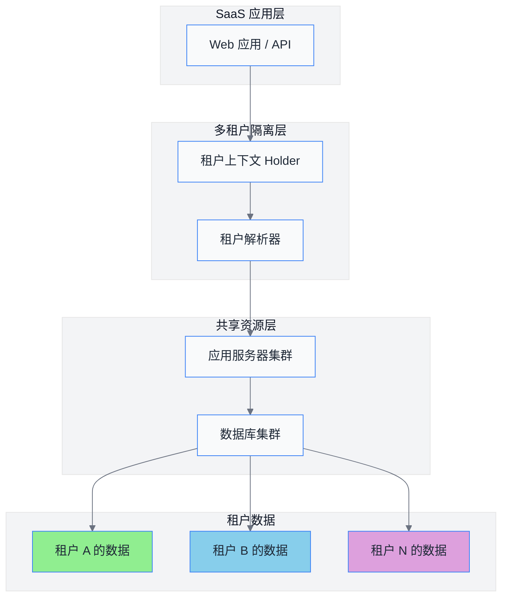
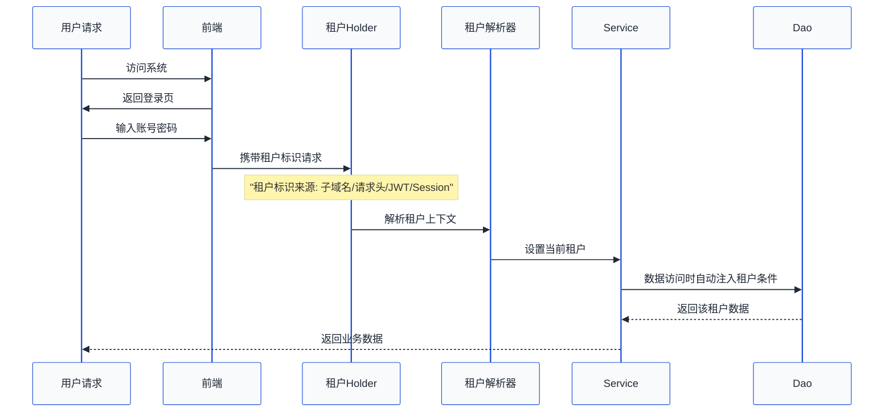
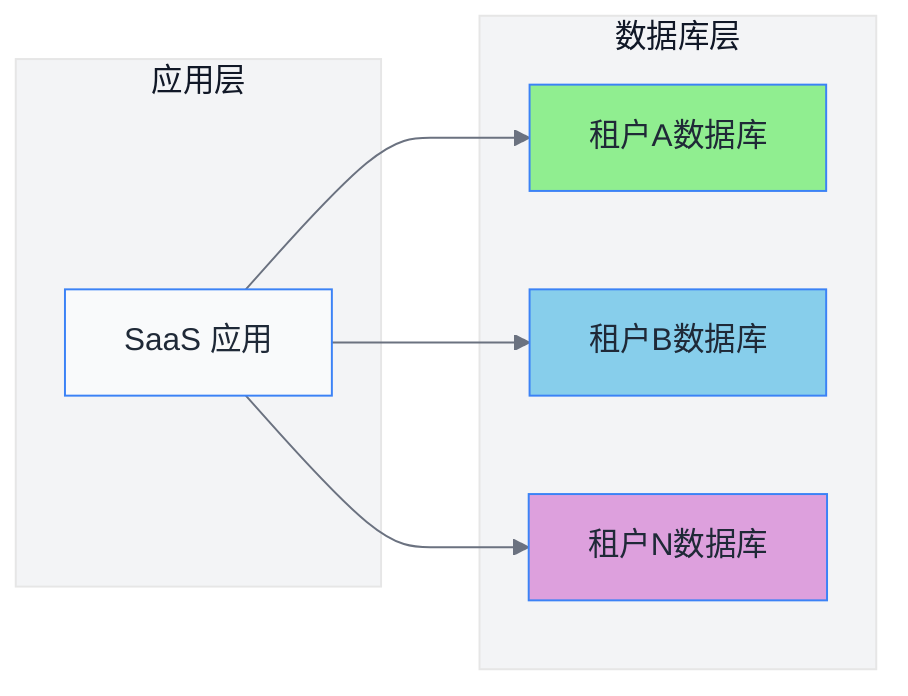
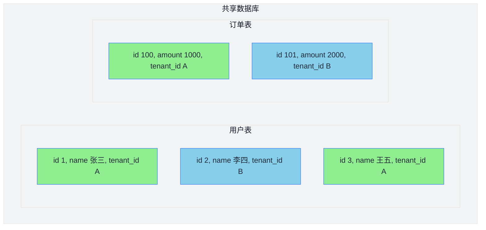
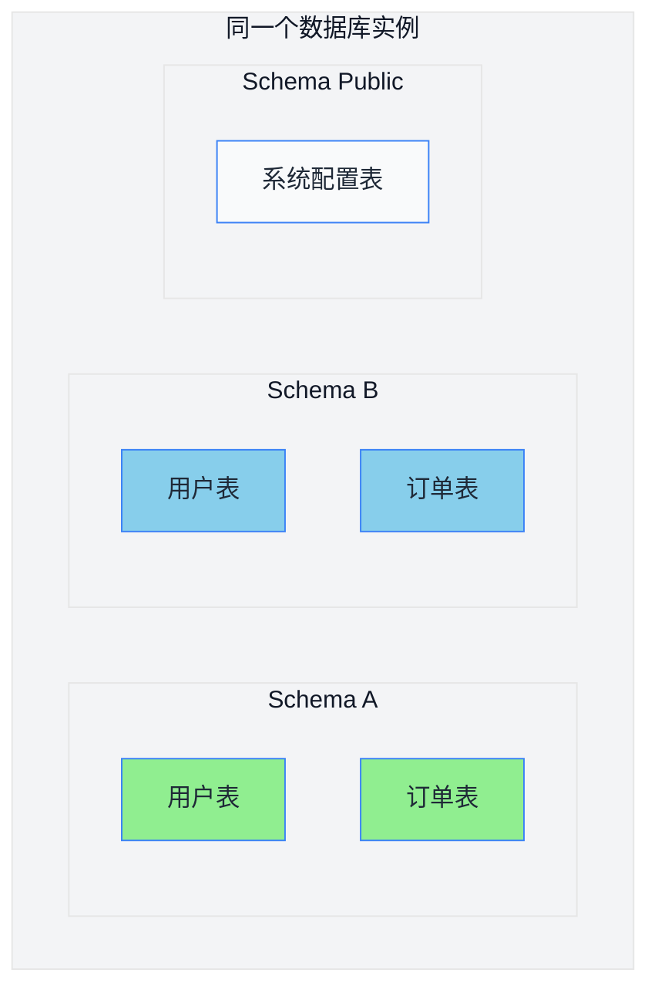
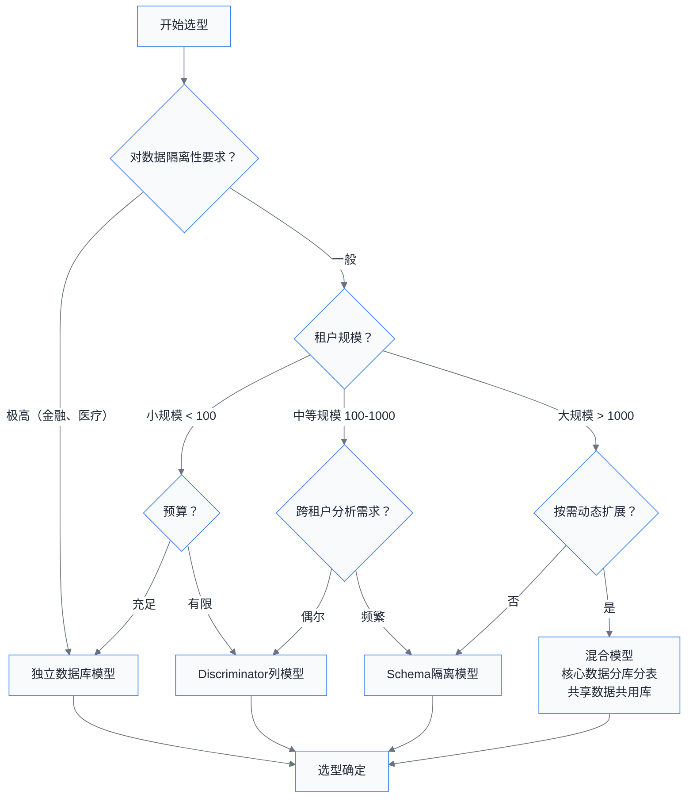

# 第01章 SaaS多租户系统概述

## 1.1 SaaS 简介

### 1.1.1 什么是 SaaS

SaaS（Software as a Service，软件即服务）是一种软件交付模式，在这种模式下，软件由服务提供商托管在云端，用户通过互联网访问和使用软件，而无需在本地安装、维护或管理软件本身。

**核心特征**：
- **云端托管**：软件运行在提供商的服务器上
- **按需使用**：用户可以随时随地通过浏览器或客户端访问
- **订阅付费**：通常按月或按年订阅收费
- **自动升级**：服务商负责软件的更新和维护

### 1.1.2 SaaS 与传统软件对比

| 对比维度 | 传统软件 | SaaS 软件 |
|---------|---------|----------|
| **部署方式** | 本地安装，部署在客户自己的服务器 | 云端部署，客户无需关心服务器 |
| **前期成本** | 高额授权费，需采购硬件 | 低订阅费，初期投入小 |
| **运维成本** | 需专业IT团队维护 | 服务商负责运维，客户零运维 |
| **扩展性** | 扩展困难，需重新采购硬件 | 弹性伸缩，一键扩容 |
| **升级维护** | 周期长，需停机更新 | 在线升级，用户无感知 |
| **访问方式** | 仅限内网或特定设备 | 任何有网络的地方均可访问 |
| **数据归属** | 数据存储在客户本地 | 数据存储在云端（需关注合规） |
| **定制化** | 可深度定制开发 | 标准化功能，少数可定制 |

### 1.1.3 SaaS 的发展历程

```
┌─────────────────────────────────────────────────────────────┐
│                      SaaS 发展历程                          │
├─────────────────────────────────────────────────────────────┤
│                                                             │
│  1999年    2003年     2008年      2013年       2018年至今    │
│    │        │          │          │             │           │
│    ▼        ▼          ▼          ▼             ▼           │
│ ┌────┐   ┌────┐     ┌────┐     ┌────┐       ┌────┐         │
│ │萌芽│───▶│探索│────▶│起步│────▶│成熟│──────▶│生态│         │
│ │期 │   │期  │     │期  │     │期  │       │期  │         │
│ └────┘   └────┘     └────┘     └────┘       └────┘         │
│                                    │                        │
│                           ┌────────┴────────┐               │
│                           │   移动优先      │               │
│                           │   智能化        │               │
│                           │   行业垂直化    │               │
│                           └─────────────────┘               │
└─────────────────────────────────────────────────────────────┘
```

---

## 1.2 多租户核心概念

### 1.2.1 什么是多租户

**多租户（Multi-Tenancy）** 是一种软件架构原则，指的是一个应用实例同时服务多个租户（Tenant），每个租户的数据和配置相互隔离，但共享底层的硬件和软件资源。

**简单理解**：就像一栋写字楼，各个公司（租户）租用不同的办公室，他们共享大楼的电梯、空调、安保等公共资源，但各自独立办公，互不干扰。

### 1.2.2 核心术语解释

| 术语 | 英文 | 解释 |
|-----|------|-----|
| **租户** | Tenant | 指向软件服务付费的组织或企业，如ABC公司 |
| **租户用户** | Tenant User | 属于某个租户的自然人，如ABC公司的员工张三 |
| **租户标识** | Tenant Id | 唯一标识租户的身份凭证，通常是一个 UUID 或数字 ID |
| **租户隔离** | Tenant Isolation | 确保不同租户之间数据互不可见的安全机制 |
| **超级管理员** | Super Admin | 系统平台的管理员，不属于任何租户 |

### 1.2.3 多租户架构示意图



### 1.2.4 租户识别与路由流程



---

## 1.3 多租户的价值

### 1.3.1 成本效益

**1. 基础设施成本**
- 多个租户共享同一套服务器资源，大幅降低硬件采购成本
- 云服务按需付费，避免资源闲置

**2. 研发成本**
- 一次开发，多个租户使用
- 统一的代码基线，降低维护复杂度
- 减少重复造轮子

**3. 运营成本**
- 统一的监控、告警、运维体系
- 批量部署、升级，效率更高
- 人力成本分摊到所有租户

```
┌────────────────────────────────────────────────────────┐
│               成本对比示意图                            │
├────────────────────────────────────────────────────────┤
│                                                        │
│  传统模式（每个租户独立部署）：                          │
│  ┌──────┐  ┌──────┐  ┌──────┐  ┌──────┐               │
│  │租户1 │  │租户2 │  │租户3 │  │租户N │  ...          │
│  │服务器│  │服务器│  │服务器│  │服务器│               │
│  └──────┘  └──────┘  └──────┘  └──────┘               │
│                                                        │
│  多租户模式（共享部署）：                                │
│  ┌──────────────────────────────────┐                 │
│  │           共享服务器集群          │                 │
│  │  ┌────┐ ┌────┐ ┌────┐ ┌────┐     │                 │
│  │  │租户1│ │租户2│ │租户3│ │租户N│  ...            │
│  │  └────┘ └────┘ └────┘ └────┘     │                 │
│  └──────────────────────────────────┘                 │
│                                                        │
│  成本节省 = N * (服务器 + 运维) - 共享成本             │
└────────────────────────────────────────────────────────┘
```

### 1.3.2 可扩展性

**1. 水平扩展**
- 当租户数量增加时，只需增加应用服务器节点
- 数据库可通过读写分离、分库分表应对数据量增长

**2. 垂直扩展**
- 租户可选不同的套餐（基础版、高级版、企业版）
- 不同套餐享受不同的资源配置

**3. 业务扩展**
- 新功能上线，所有租户同步享用
- 支持租户级别的功能开关

### 1.3.3 易维护性

| 维护场景 | 多租户优势 |
|---------|----------|
| **Bug修复** | 修复一次，全量生效，无需逐个部署 |
| **功能升级** | 统一升级，用户体验一致 |
| **安全补丁** | 统一加固，安全性更高 |
| **数据备份** | 统一备份策略，运维更简单 |
| **合规审计** | 统一日志，便于审计追踪 |

---

## 1.4 租户模型对比

### 1.4.1 模型一：独立数据库（Database per Tenant）

**原理**：每个租户拥有独立的数据库实例，完全隔离。



**代码示例**：

```java
@Service
public class TenantDataSourceService {

    @Autowired
    private DataSourceRouter dataSourceRouter;

    public void executeForTenant(String tenantId, Runnable action) {
        // 根据租户ID切换数据源
        DataSource newDataSource = tenantDataSourceMap.get(tenantId);
        DataSourceHolder.setDataSource(newDataSource);
        try {
            action.run();
        } finally {
            DataSourceHolder.clear();
        }
    }
}

// MyBatis 拦截器中使用
@Intercepts({
    @Signature(type = Executor.class, method = "query", args = {MappedStatement.class, Object.class})
})
public class TenantDataSourceInterceptor implements Interceptor {

    @Override
    public Object intercept(Invocation invocation) throws Throwable {
        String tenantId = TenantContextHolder.getTenantId();
        if (tenantId != null) {
            DataSource tenantDataSource = findDataSourceByTenant(tenantId);
            DataSource oldDataSource = DataSourceHolder.getDataSource();
            DataSourceHolder.setDataSource(tenantDataSource);
            try {
                return invocation.proceed();
            } finally {
                DataSourceHolder.setDataSource(oldDataSource);
            }
        }
        return invocation.proceed();
    }
}
```

**优点**：
- 数据完全隔离，安全性最高
- 故障互不影响，一个租户的问题不影响其他租户
- 可针对单个租户进行数据库优化
- 适合对数据安全要求高的场景（如金融、医疗）

**缺点**：
- 成本高，每个租户需要独立的数据库实例
- 运维复杂，数据库数量随租户数线性增长
- 跨租户查询困难

### 1.4.2 模型二：共享数据库 + 表隔离（Discriminator 列）

**原理**：所有租户共享同一个数据库，通过表中的 `tenant_id` 列来区分数据归属。



**代码示例**：

```java
// 1. 实体类使用租户注解
@Entity
@Table(name = "t_user")
public class User {

    @Id
    private Long id;

    private String name;

    // 租户标识列
    @Column(name = "tenant_id", nullable = false)
    private String tenantId;

    // 省略其他字段...
}

// 2. MyBatis Plus 租户插件配置
@Configuration
public class MyBatisPlusConfig {

    @Bean
    public MybatisPlusInterceptor mybatisPlusInterceptor() {
        MybatisPlusInterceptor interceptor = new MybatisPlusInterceptor();

        // 添加租户插件
        interceptor.addInnerInterceptor(new TenantLineInnerInterceptor(new TenantLineHandler() {
            @Override
            public Expression getTenantId() {
                // 从上下文获取当前租户ID
                return new StringValue(TenantContextHolder.getTenantId());
            }

            @Override
            public String getTenantIdColumn() {
                // 租户ID列名
                return "tenant_id";
            }

            @Override
            public boolean ignoreTable(String tableName) {
                // 系统表不走租户过滤（如 sys_user 超表等）
                return "sys_dict".equals(tableName);
            }
        }));

        // 分页插件
        interceptor.addInnerInterceptor(new PaginationInnerInterceptor());

        return interceptor;
    }
}

// 3. BaseMapper 自动添加租户条件
@Mapper
public interface UserMapper extends BaseMapper<User> {

    // 无需手动添加 tenant_id 条件，插件自动处理
    List<User> selectActiveUsers();
}

// 4. 手动跨租户查询（需特别授权）
@Service
public class ReportService {

    @Autowired
    private UserMapper userMapper;

    // 跨租户查询需要特殊处理
    public Map<String, Integer> getUserCountByTenant() {
        List<Map<String, Object>> result = userMapper.execute(
            "SELECT tenant_id, COUNT(*) as cnt FROM t_user GROUP BY tenant_id"
        );
        // 手动解析结果...
        return null;
    }
}
```

**优点**：
- 成本最低，资源共享
- 运维简单，数据库实例数量少
- 跨租户统计分析方便

**缺点**：
- 数据隔离性较弱，需要严格代码审查防止数据泄露
- 单个租户数据量大时可能影响其他租户性能
- 数据库热点竞争问题

### 1.4.3 模型三：Schema 隔离（Schema per Tenant）

**原理**：所有租户共享同一个数据库实例，但通过不同的 Schema（Oracle/PostgreSQL）或数据库（MySQL 中使用不同数据库）进行隔离。



**代码示例**：

```java
// 1. Schema 动态切换拦截器
@Aspect
@Component
public class SchemaRoutingAspect {

    @Around("execution(* com.sass.mapper.*.*(..))")
    public Object routeSchema(ProceedingJoinPoint point) throws Throwable {
        String tenantId = TenantContextHolder.getTenantId();
        String schema = "tenant_" + tenantId;

        // 保存原来的 schema
        String oldSchema = JdbcUtils.getCurrentSchema();
        try {
            JdbcUtils.setSchema(schema);
            return point.proceed();
        } finally {
            JdbcUtils.setSchema(oldSchema);
        }
    }
}

// 2. 多数据源配置
@Configuration
public class MultiSchemaDataSource {

    @Bean
    public DataSource dynamicDataSource() {
        DynamicDataSource dataSource = new DynamicDataSource();
        Map<Object, Object> targetDataSources = new HashMap<>();

        // 从配置中心或数据库加载所有租户的 schema 配置
        List<String> tenantIds = tenantService.getAllTenantIds();
        for (String tenantId : tenantIds) {
            DataSource ds = createDataSourceForSchema(tenantId);
            targetDataSources.put("schema_" + tenantId, ds);
        }

        dataSource.setTargetDataSources(targetDataSources);
        dataSource.setDefaultTargetDataSource(defaultDataSource);
        return dataSource;
    }
}

// 3. MyBatis XML 中动态指定 schema
<select id="selectUsers" resultType="User">
    SELECT * FROM ${tenantSchema}.t_user
    WHERE status = 1
</select>
```

**优点**：
- 隔离性中等，比 Discriminator 列强
- 可针对单个 Schema 做权限控制
- 跨租户迁移方便（导出/导入整个 Schema）

**缺点**：
- Schema 数量受数据库限制（Oracle 有数量限制）
- 跨 Schema 查询需要额外配置
- 备份恢复需要逐个 Schema 操作

### 1.4.4 三种模型综合对比

| 评估维度 | 独立数据库 | Discriminator列 | Schema隔离 |
|---------|-----------|----------------|-----------|
| **成本** | ⭐⭐⭐（高） | ⭐（最低） | ⭐⭐（中） |
| **数据隔离性** | ⭐⭐⭐⭐⭐（最强） | ⭐⭐（弱） | ⭐⭐⭐⭐（强） |
| **性能** | ⭐⭐⭐⭐⭐（最优） | ⭐⭐（一般） | ⭐⭐⭐⭐（良好） |
| **运维复杂度** | ⭐⭐⭐（高） | ⭐⭐⭐⭐⭐（最简） | ⭐⭐⭐（中） |
| **扩展性** | ⭐⭐（差） | ⭐⭐⭐⭐⭐（最优） | ⭐⭐⭐（中） |
| **跨租户查询** | ⭐⭐（困难） | ⭐⭐⭐⭐⭐（最易） | ⭐⭐⭐（需配置） |
| **故障隔离** | ⭐⭐⭐⭐⭐（最优） | ⭐⭐（差） | ⭐⭐⭐（中） |
| **适用场景** | 金融、医疗等高安全需求 | 普通企业SaaS | 中大型企业 |

### 1.4.5 选型建议



---

## 1.5 本章总结

### 1.5.1 核心知识点回顾

```
┌─────────────────────────────────────────────────────────┐
│                   第01章知识脑图                          │
├─────────────────────────────────────────────────────────┤
│                                                         │
│   SaaS多租户系统概述                                      │
│   ├── SaaS 基础                                          │
│   │   ├── SaaS 定义：软件即服务                          │
│   │   ├── 核心特征：云托管、按需用、订阅制                │
│   │   └── 与传统软件对比：成本、运维、扩展性优势          │
│   │                                                      │
│   ├── 多租户核心概念                                      │
│   │   ├── 多租户：一个实例服务多个租户                    │
│   │   ├── 租户（Tenant）：付费组织                        │
│   │   ├── 租户用户（User）：属于租户的自然人              │
│   │   └── 租户隔离：通过技术手段保证数据互不访问          │
│   │                                                      │
│   ├── 多租户价值                                          │
│   │   ├── 成本效益：资源共享，成本分摊                    │
│   │   ├── 可扩展性：弹性伸缩，灵活扩容                    │
│   │   └── 易维护性：统一运维，效率提升                    │
│   │                                                      │
│   └── 租户模型对比                                        │
│       ├── 独立数据库：隔离最强，成本最高                  │
│       ├── Discriminator列：成本最低，隔离最弱             │
│       └── Schema隔离：平衡之选                            │
│                                                         │
└─────────────────────────────────────────────────────────┘
```

### 1.5.2 关键术语表

| 术语 | 英文 | 说明 |
|-----|------|-----|
| SaaS | Software as a Service | 软件即服务 |
| 多租户 | Multi-Tenancy | 多个租户共享同一套系统资源 |
| 租户 | Tenant | 使用系统服务的客户组织 |
| 租户用户 | Tenant User | 属于租户的终端用户 |
| 租户隔离 | Tenant Isolation | 保证租户数据互不干扰的机制 |
| Discriminator | Tenant Discriminator | 用于区分租户数据的列 |
| Schema | Database Schema | 数据库对象集合 |

### 1.5.3 下一章预告

在下一章中，我们将学习：

- **Spring Boot 多租户架构设计与实现**
- 租户上下文 Holder 的设计与线程绑定
- 请求级别租户信息解析（过滤器/拦截器）
- MyBatis Plus 租户插件集成
- 租户数据权限控制实现

---

*本章完*
