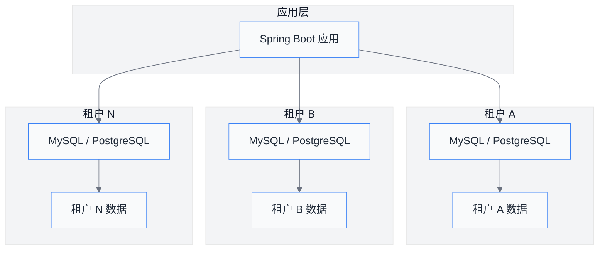
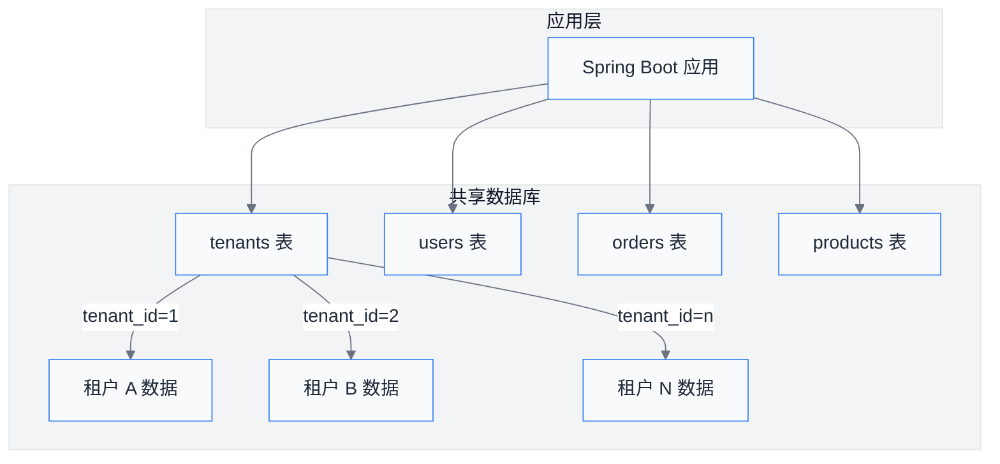
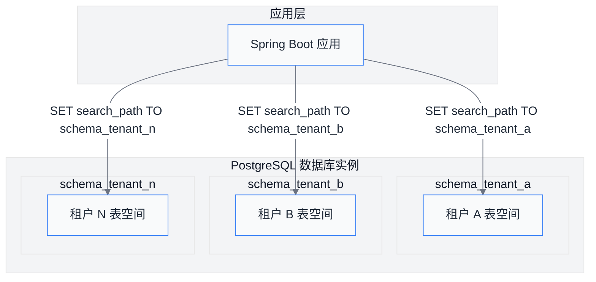
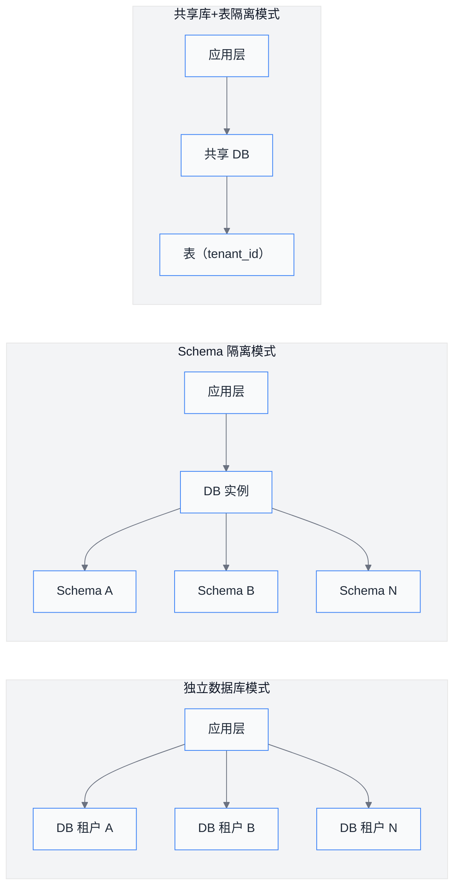
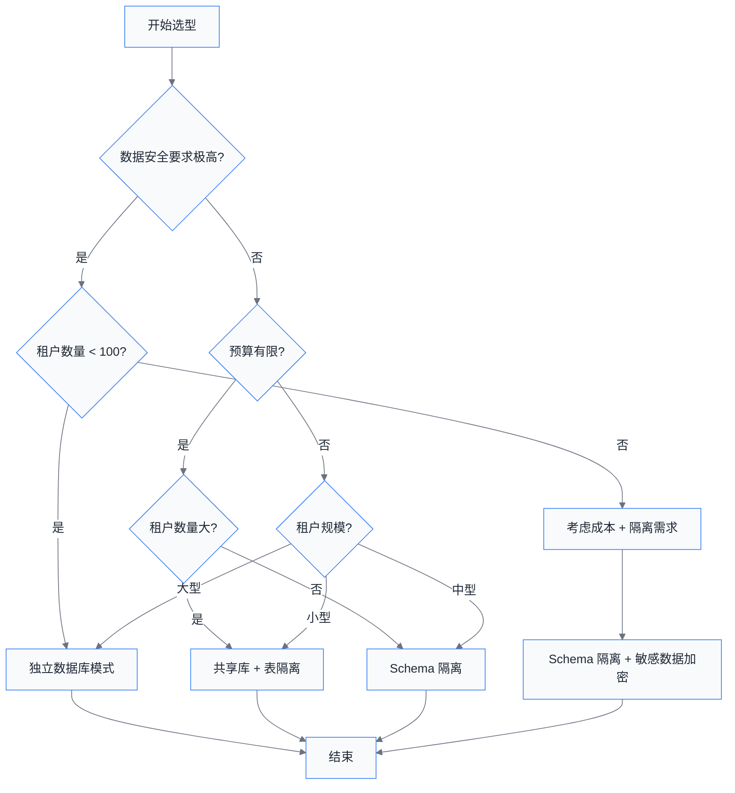

# 第02章 多租户架构模式

在设计 SaaS 多租户系统时，租户之间的数据隔离方式是最核心的架构决策之一。不同的隔离模式在**安全性**、**成本**、**性能**和**维护复杂度**之间有着不同的权衡。本章将详细介绍三种主流的多租户隔离模式，帮助你根据业务场景做出合理的技术选型。

---

## 1. 三种隔离模式详解

### 1.1 独立数据库模式（Database per Tenant）

独立数据库模式是最严格的隔离方式，每个租户拥有独立的数据库实例（MySQL、PostgreSQL 等）。

#### 架构图



#### 优点

- **完全隔离**：每个租户的数据物理上完全分开，安全性最高
- **性能优异**：独享数据库资源，不受其他租户影响
- **故障隔离**：一个租户的数据库故障不影响其他租户
- **独立备份**：可针对单个租户进行备份和恢复
- **灵活配置**：不同租户可以使用不同版本的数据库配置

#### 缺点

- **成本高昂**：每个租户需要独立的数据库服务器或云数据库实例
- **维护复杂**：数据库数量随租户线性增长，运维压力增大
- **资源利用率低**：即使租户负载很低，也需要独享整套数据库资源

#### 适用场景

- 大型企业客户（如银行、保险公司）
- 对数据安全性和隐私合规要求极高的场景（如 GDPR、医疗数据）
- 多租户规模较小（通常不超过 100 个租户）

#### 代码示例

```java
// 租户数据源路由配置
@Configuration
public class TenantDataSourceConfig {

    @Bean
    public Map<String, DataSource> dataSourceMap(TenantProperties tenantProperties) {
        Map<String, DataSource> dataSourceMap = new ConcurrentHashMap<>();

        tenantProperties.getTenants().forEach((tenantId, config) -> {
            DataSource dataSource = DataSourceBuilder.create()
                    .url(config.getJdbcUrl())
                    .username(config.getUsername())
                    .password(config.getPassword())
                    .driverClassName(config.getDriverClassName())
                    .build();
            dataSourceMap.put(tenantId, dataSource);
        });

        return dataSourceMap;
    }

    @Bean
    public TenantDataSourceRouter tenantDataSourceRouter(
            Map<String, DataSource> dataSourceMap) {
        return new TenantDataSourceRouter(dataSourceMap);
    }
}
```

```java
// 租户上下文持有者
public class TenantContext {

    private static final ThreadLocal<String> CURRENT_TENANT = new ThreadLocal<>();

    public static void setTenantId(String tenantId) {
        CURRENT_TENANT.set(tenantId);
    }

    public static String getTenantId() {
        return CURRENT_TENANT.get();
    }

    public static void clear() {
        CURRENT_TENANT.remove();
    }
}
```

---

### 1.2 共享数据库 + 表隔离模式（Shared Database, Shared Schema）

所有租户共享同一个数据库，通过 `tenant_id` 列来区分不同租户的数据。这是成本最低的隔离方案。

#### 架构图



#### 优点

- **成本最低**：只需维护一套数据库基础设施
- **资源利用率高**：所有租户共享计算和存储资源
- **运维简单**：数据库数量少，维护成本低
- **扩展性好**：易于添加新租户，租户数量可以很大

#### 缺点

- **隔离性弱**：依赖应用层严格过滤 `tenant_id`，一旦漏掉就会发生数据泄露
- **性能受限**：所有租户共享 CPU、内存、IO，高负载租户会影响其他租户
- **备份恢复复杂**：无法针对单个租户进行精细化备份
- **查询复杂度增加**：所有查询需要携带 `tenant_id` 条件

#### 适用场景

- 中小型客户
- 预算有限的早期产品
- 租户数量众多（如长尾客户）

#### 代码示例

```java
// MyBatis 租户拦截器
@Component
@InterceptorChain
public class TenantInterceptor implements Interceptor {

    @Override
    public Object intercept(Invocation invocation) throws Throwable {
        String tenantId = TenantContext.getTenantId();
        if (StringUtils.isBlank(tenantId)) {
            throw new TenantException("租户上下文未设置");
        }

        MappedStatement ms = invocation.getMappedStatement();
        if (isSelect(ms.getSqlCommandType())) {
            // SELECT 查询添加 tenant_id 条件
            addTenantCondition(invocation);
        } else {
            // INSERT/UPDATE/DELETE 自动填充 tenant_id
            setTenantId(invocation);
        }

        return invocation.proceed();
    }

    private void addTenantCondition(Invocation invocation) {
        // 在 WHERE 条件中自动拼接 AND tenant_id = ?
    }

    private void setTenantId(Invocation invocation) {
        // 在 INSERT 语句中自动填充 tenant_id 字段
    }
}
```

```java
// 租户字段注解
@Target({ElementType.TYPE, ElementType.FIELD})
@Retention(RetentionPolicy.RUNTIME)
public @interface TenantField {
}

// 实体类示例
@Entity
@Table(name = "orders")
public class Order {

    @TenantField
    private String tenantId;

    private String orderNo;
    private BigDecimal amount;
}
```

---

### 1.3 Schema 隔离模式（Schema per Tenant）

每个租户拥有独立的数据库 Schema（主要是 PostgreSQL 的特性），所有租户共享同一个数据库实例，但通过不同的 Schema 命名空间实现逻辑隔离。

#### 架构图



#### 优点

- **隔离性适中**：Schema 级别的隔离，比共享表强但比独立数据库弱
- **便于备份**：可以针对单个 Schema 进行导出和恢复
- **成本适中**：只需维护一个数据库实例，但需要多个 Schema
- **连接管理**：需要为每个租户维护独立的数据库连接

#### 缺点

- **PostgreSQL 专用**：该模式主要适用于 PostgreSQL，MySQL 不支持真正的 Schema 概念
- **连接数增加**：每个租户需要独立的数据库连接，连接数成倍增加
- **连接池复杂**：需要维护多个连接池或使用动态路由
- **跨租户查询不便**：如果需要跨租户统计，查询会比较复杂

#### 适用场景

- 中型企业客户
- 使用 PostgreSQL 作为主要数据库
- 需要较好隔离性但预算有限

#### 代码示例

```java
// PostgreSQL Schema 路由数据源
public class SchemaRoutingDataSource extends AbstractRoutingDataSource {

    @Override
    protected String determineCurrentLookupKey() {
        String tenantId = TenantContext.getTenantId();
        if (StringUtils.isBlank(tenantId)) {
            throw new TenantException("租户上下文未设置");
        }
        return "schema_" + tenantId;
    }
}
```

```java
// Schema 切换拦截器
@Component
public class SchemaInterceptor {

    @Autowired
    private DataSource dataSource;

    public void switchSchema(String tenantId) {
        Connection connection = null;
        try {
            connection = dataSource.getConnection();
            // PostgreSQL 设置 search_path
            connection.createStatement()
                    .execute("SET search_path TO schema_" + tenantId);
        } catch (SQLException e) {
            throw new RuntimeException("切换 Schema 失败", e);
        } finally {
            // 注意：实际使用中需要适当管理连接
        }
    }
}
```

---

## 2. 三种模式对比

| 特性 | 独立数据库 | 共享库+表隔离 | Schema 隔离 |
|------|-----------|--------------|-------------|
| **隔离级别** | 实例级 | 行级 | 命名空间级 |
| **数据安全性** | 最高 | 中低 | 中 |
| **运维成本** | 高 | 低 | 中 |
| **资源成本** | 高 | 低 | 中 |
| **扩展能力** | 差（<100 租户） | 强（无上限） | 中（<500 租户） |
| **故障隔离** | 完全隔离 | 无隔离 | Schema 级 |
| **备份粒度** | 数据库级 | 表级 | Schema 级 |
| **适用数据库** | 任意 | 任意 | PostgreSQL |

### 架构对比总览图



---

## 3. 技术选型建议

### 3.1 选型决策树



### 3.2 场景化选型建议

#### 场景一：企业级 SaaS 产品（如 ERP、CRM）

**推荐方案**：独立数据库模式

**原因**：
- 客户多为大型企业，对数据隔离要求极高
- 愿意为更高的安全性支付溢价
- 租户数量相对可控（通常几十到上百家）

#### 场景二：中小型企业 SaaS（如项目管理工具、协作平台）

**推荐方案**：Schema 隔离模式

**原因**：
- 租户数量中等，需要较好隔离性
- 使用 PostgreSQL 作为主数据库
- 在成本和隔离性之间取得平衡

#### 场景三：长尾客户 SaaS（如工具类 SaaS、SaaS API）

**推荐方案**：共享数据库 + 表隔离

**原因**：
- 租户数量可能成千上万
- 单个租户数据量小，安全性要求相对较低
- 需要最大化成本效益

### 3.3 渐进式演进策略

很多企业在初期选择共享库+表隔离模式，随着业务发展逐步演进：

```
第一阶段（0-1000 租户）
└── 共享库 + 表隔离（tenant_id）
    └── 成本优先，快速上线

第二阶段（1000-5000 租户）
└── 引入读写分离 + 分库分表
    └── 性能优化

第三阶段（5000+ 租户）
└── 按行业/规模拆分
    └── 高价值客户迁移到独立数据库
```

---

## 4. Spring Boot 实现概览

本书后续章节将详细讲解三种模式在 Spring Boot 中的具体实现：

### 第 3 章：共享数据库 + 表隔离实现
- 租户上下文传递（ThreadLocal + Filter/Interceptor）
- MyBatis 租户拦截器自动注入 tenant_id
- JPA/Hibernate 租户实体监听器
- 分布式环境下租户上下文传播

### 第 4 章：Schema 隔离实现
- PostgreSQL Schema 动态路由数据源
- 连接池配置与优化
- Schema 自动创建与迁移
- Flyway/Liquibase 多 Schema 管理

### 第 5 章：独立数据库实现
- 动态多数据源架构
- 连接池管理（ HikariCP 池化策略）
- 数据库按需创建与初始化
- 跨数据库查询解决方案

### 第 6 章：高级主题
- 租户数据隔离审计
- 跨租户数据聚合统计
- 租户迁移（从共享到独立）
- 多租户安全最佳实践

---

## 5. 章节总结

本章介绍了多租户系统设计中最核心的问题：数据隔离架构。我们详细讲解了三种主流隔离模式：

1. **独立数据库模式**：隔离性最强、成本最高，适合大型企业客户
2. **共享数据库 + 表隔离模式**：成本最低、扩展性最好，但隔离性较弱
3. **Schema 隔离模式**：介于两者之间，是 PostgreSQL 用户的良好选择

**核心要点**：

- 隔离模式的选择没有绝对的好坏，只有适合与否
- 需要综合考虑**安全需求**、**成本预算**、**租户规模**、**技术栈**等因素
- 初期可以选择成本优先的方案，随着业务发展逐步演进架构
- 无论选择哪种模式，**租户上下文的管理**都是实现的关键

### 思考题

1. 如果你的 SaaS 产品同时服务大型银行和小型创业公司，你会如何设计隔离策略？
2. 在共享库+表隔离模式下，如何防止 SQL 注入绕过 tenant_id 过滤？
3. 假设你需要将 1000 个共享库租户迁移到独立数据库模式，如何设计平滑迁移方案？

---

## 下章预告

第 3 章我们将深入讲解**共享数据库 + 表隔离模式**的 Spring Boot 实现，包括租户上下文的传递、MyBatis 拦截器配置、以及多租户场景下的事务管理。

---

*如果你觉得本章内容对你有帮助，欢迎在评论区分享你的疑问和心得！*
