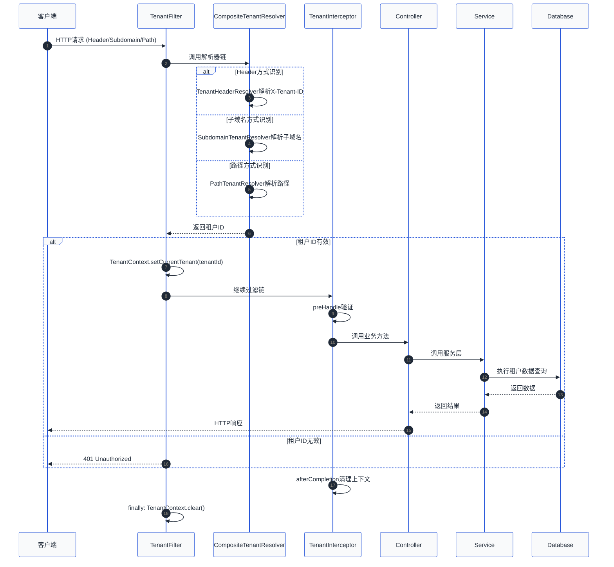
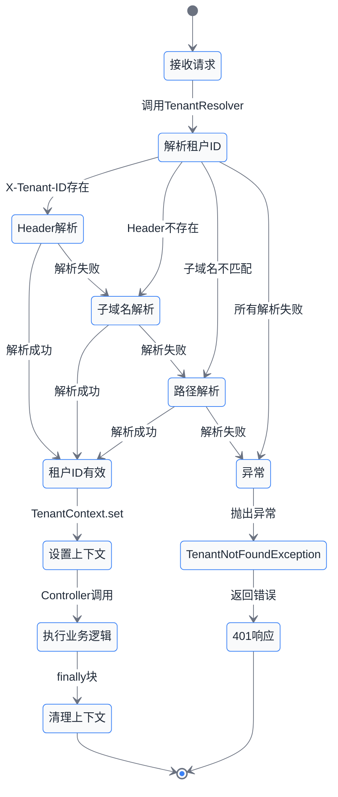

# 第03章 租户识别与请求路由

## 概述

在多租户 SaaS 系统中，租户识别与请求路由是整个架构的基础。当一个请求进入系统时，系统需要准确识别该请求属于哪个租户，然后将该请求路由到对应的租户数据隔离区域进行处理。本章将详细讲解四种主流的租户识别方式、请求路由机制，并提供完整的代码实现。

## 1. 租户识别方式

### 1.1 Header 方式

Header 方式是最常见的租户识别方案，客户端通过在请求头中添加租户标识来表明身份。

**优点**：
- 实现简单，改造成本低
- 对现有 API 友好，不影响 URL 结构
- 可以灵活组合，支持多租户标识

**缺点**：
- 依赖客户端正确传递 Header
- 需要防止伪造租户 ID

**常用 Header 名称**：
- `X-Tenant-ID`：最常用的租户标识
- `X-Tenant-Name`：租户名称
- `Authorization`：JWT Token 中可包含租户信息

**代码示例**：

```java
@Component
public class TenantHeaderResolver {

    private static final String TENANT_ID_HEADER = "X-Tenant-ID";

    /**
     * 从请求头中解析租户ID
     */
    public String resolveTenantId(HttpServletRequest request) {
        String tenantId = request.getHeader(TENANT_ID_HEADER);
        if (tenantId == null || tenantId.trim().isEmpty()) {
            // 尝试从 Authorization header 中提取
            tenantId = extractTenantFromAuth(request.getHeader("Authorization"));
        }
        return tenantId;
    }

    /**
     * 从 JWT Token 中提取租户信息
     */
    private String extractTenantFromAuth(String authorization) {
        if (authorization == null || !authorization.startsWith("Bearer ")) {
            return null;
        }
        try {
            String token = authorization.substring(7);
            // 解析 JWT token（这里省略具体的 JWT 解析逻辑）
            Claims claims = parseJwtToken(token);
            return claims.get("tenant_id", String.class);
        } catch (Exception e) {
            return null;
        }
    }

    private Claims parseJwtToken(String token) {
        // 实际项目中应使用 JJWT 或 jose4j 库解析
        throw new UnsupportedOperationException("请使用 JWT 库实现");
    }
}
```

### 1.2 子域名方式

子域名方式通过解析请求的域名来识别租户，不同租户使用不同的子域名。

**域名示例**：
- `tenant1.example.com` -> 租户 tenant1
- `tenant2.example.com` -> 租户 tenant2
- `demo.example.com` -> 租户 demo

**优点**：
- URL 更直观，便于管理和记忆
- 便于 DNS 解析和负载均衡
- 适合面向客户的 SaaS 产品

**缺点**：
- 需要配置 DNS 和 SSL 证书
- 子域名数量受限于 DNS 规范
- 不适合大量小租户场景

**代码示例**：

```java
@Component
public class SubdomainTenantResolver {

    private static final Pattern TENANT_PATTERN = Pattern.compile(
        "^([a-z0-9][a-z0-9-]*)\\.example\\.com$"
    );

    /**
     * 从子域名解析租户ID
     */
    public String resolveTenantId(HttpServletRequest request) {
        String host = request.getHeader("Host");
        if (host == null) {
            return null;
        }

        // 移除端口号
        String hostname = host.split(":")[0];

        Matcher matcher = TENANT_PATTERN.matcher(hostname.toLowerCase());
        if (matcher.matches()) {
            return matcher.group(1);
        }
        return null;
    }

    /**
     * 生成租户对应的域名
     */
    public String generateTenantDomain(String tenantId) {
        return tenantId.toLowerCase() + ".example.com";
    }
}
```

### 1.3 路径方式

路径方式将租户标识嵌入到 URL 路径中。

**URL 示例**：
- `/api/tenant1/users` -> 租户 tenant1
- `/api/tenant2/products` -> 租户 tenant2

**优点**：
- 兼容性最好，所有环境都能支持
- 便于调试和测试
- 可以支持无租户场景（公共 API）

**缺点**：
- URL 较长，不够简洁
- 需要后端正确解析路径
- 路径变化可能影响 SEO

**代码示例**：

```java
@Component
public class PathTenantResolver {

    private static final String TENANT_PATH_PREFIX = "/api/";

    /**
     * 从请求路径中解析租户ID
     */
    public String resolveTenantId(HttpServletRequest request) {
        String requestURI = request.getRequestURI();

        // 检查是否是租户 API 路径
        if (!requestURI.startsWith(TENANT_PATH_PREFIX)) {
            return null; // 公共路径，不需要租户
        }

        // 提取路径中的租户段
        // 例如: /api/tenant1/users -> tenant1
        String pathWithoutPrefix = requestURI.substring(TENANT_PATH_PREFIX.length());
        String[] segments = pathWithoutPrefix.split("/");

        if (segments.length > 0 && !segments[0].isEmpty()) {
            String potentialTenant = segments[0];
            // 验证是否为合法租户ID（避免误匹配）
            if (isValidTenantId(potentialTenant)) {
                return potentialTenant;
            }
        }
        return null;
    }

    /**
     * 验证租户ID格式
     */
    private boolean isValidTenantId(String tenantId) {
        if (tenantId == null || tenantId.isEmpty()) {
            return false;
        }
        // 租户ID应为字母、数字、下划线，4-32个字符
        return tenantId.matches("^[a-zA-Z0-9_]{4,32}$");
    }
}
```

### 1.4 Cookie/Token 方式

从客户端的 Cookie 或 JWT Token 中提取租户信息。

**适用场景**：
- 用户已登录的系统
- 使用 JWT 进行身份验证的系统
- 需要会话保持的场景

**代码示例**：

```java
@Component
public class CookieTokenTenantResolver {

    private static final String TENANT_COOKIE_NAME = "tenant_id";

    /**
     * 从 Cookie 中解析租户ID
     */
    public String resolveFromCookie(HttpServletRequest request) {
        Cookie[] cookies = request.getCookies();
        if (cookies == null) {
            return null;
        }
        for (Cookie cookie : cookies) {
            if (TENANT_COOKIE_NAME.equals(cookie.getName())) {
                return cookie.getValue();
            }
        }
        return null;
    }

    /**
     * 从 Session 中解析租户ID
     */
    public String resolveFromSession(HttpServletRequest request) {
        HttpSession session = request.getSession(false);
        if (session != null) {
            return (String) session.getAttribute("tenantId");
        }
        return null;
    }
}
```

## 2. 请求路由机制

### 2.1 整体架构

```
┌─────────────────────────────────────────────────────────────────────┐
│                        请求入口                                       │
│                     (HTTP Request)                                   │
└─────────────────────────────────────────────────────────────────────┘
                                │
                                ▼
┌─────────────────────────────────────────────────────────────────────┐
│                     TenantFilter                                    │
│  ┌─────────────────────────────────────────────────────────────┐    │
│  │ 1. 收集租户识别信息 (Header/Subdomain/Path/Cookie)            │    │
│  │ 2. 调用 TenantResolver 解析租户ID                           │    │
│  │ 3. 将租户ID 存入 TenantContext                              │    │
│  └─────────────────────────────────────────────────────────────┘    │
└─────────────────────────────────────────────────────────────────────┘
                                │
                                │ 验证通过
                                ▼
┌─────────────────────────────────────────────────────────────────────┐
│                    HandlerInterceptor                                │
│  ┌─────────────────────────────────────────────────────────────┐    │
│  │ preHandle: 前置处理                                           │    │
│  │   - 验证租户上下文是否已设置                                   │    │
│  │   - 权限检查                                                  │    │
│  │   - 日志记录                                                  │    │
│  └─────────────────────────────────────────────────────────────┘    │
└─────────────────────────────────────────────────────────────────────┘
                                │
                                ▼
┌─────────────────────────────────────────────────────────────────────┐
│                     Controller                                      │
│                  (业务逻辑处理)                                      │
└─────────────────────────────────────────────────────────────────────┘
                                │
                                ▼
┌─────────────────────────────────────────────────────────────────────┐
│                   TenantInterceptor                                  │
│  ┌─────────────────────────────────────────────────────────────┐    │
│  │ afterCompletion: 清理租户上下文                               │    │
│  │   - TenantContext.clear()                                   │    │
│  │   - 释放线程变量                                              │    │
│  └─────────────────────────────────────────────────────────────┘    │
└─────────────────────────────────────────────────────────────────────┘
```

### 2.2 租户上下文管理

租户上下文使用 ThreadLocal 来存储，确保线程安全。

```java
/**
 * 租户上下文管理器
 * 使用 ThreadLocal 确保每个线程有独立的租户信息
 */
public class TenantContext {

    private static final ThreadLocal<String> CURRENT_TENANT = new ThreadLocal<>();

    /**
     * 设置当前租户ID
     */
    public static void setCurrentTenant(String tenantId) {
        CURRENT_TENANT.set(tenantId);
    }

    /**
     * 获取当前租户ID
     */
    public static String getCurrentTenant() {
        return CURRENT_TENANT.get();
    }

    /**
     * 获取当前租户ID，如果不存在则抛出异常
     */
    public static String getRequiredTenant() {
        String tenantId = CURRENT_TENANT.get();
        if (tenantId == null || tenantId.isEmpty()) {
            throw new TenantNotFoundException("租户ID不能为空，请确保请求已正确携带租户标识");
        }
        return tenantId;
    }

    /**
     * 清除当前租户信息
     * 重要：必须在请求结束时调用，防止内存泄漏
     */
    public static void clear() {
        CURRENT_TENANT.remove();
    }

    /**
     * 检查是否有有效租户
     */
    public static boolean hasTenant() {
        String tenantId = CURRENT_TENANT.get();
        return tenantId != null && !tenantId.isEmpty();
    }
}
```

### 2.3 租户解析器接口

定义统一的租户解析器接口，支持多种解析策略。

```java
/**
 * 租户解析器接口
 */
public interface TenantResolver {

    /**
     * 解析租户ID
     * @param request HTTP 请求
     * @return 租户ID，如果无法解析则返回 null
     */
    String resolve(HttpServletRequest request);

    /**
     * 解析器的优先级，数字越小优先级越高
     */
    default int getOrder() {
        return 100;
    }

    /**
     * 是否支持当前请求
     */
    default boolean supports(HttpServletRequest request) {
        return true;
    }
}
```

### 2.4 复合租户解析器

支持多种解析方式，按优先级尝试。

```java
/**
 * 复合租户解析器
 * 按优先级尝试多种解析策略
 */
@Component
public class CompositeTenantResolver {

    private final List<TenantResolver> resolvers;

    public CompositeTenantResolver(List<TenantResolver> resolvers) {
        // 按优先级排序
        this.resolvers = resolvers.stream()
            .sorted(Comparator.comparingInt(TenantResolver::getOrder))
            .collect(Collectors.toList());
    }

    /**
     * 解析租户ID，尝试所有解析器直到成功
     */
    public String resolve(HttpServletRequest request) {
        for (TenantResolver resolver : resolvers) {
            if (resolver.supports(request)) {
                String tenantId = resolver.resolve(request);
                if (tenantId != null && !tenantId.isEmpty()) {
                    return tenantId;
                }
            }
        }
        return null;
    }
}
```

### 2.5 租户识别拦截器

使用 Spring MVC 的 HandlerInterceptor 实现请求拦截。

```java
/**
 * 租户识别拦截器
 */
@Component
public class TenantInterceptor implements HandlerInterceptor {

    private final CompositeTenantResolver tenantResolver;

    public TenantInterceptor(CompositeTenantResolver tenantResolver) {
        this.tenantResolver = tenantResolver;
    }

    @Override
    public boolean preHandle(HttpServletRequest request,
                            HttpServletResponse response,
                            Object handler) throws Exception {

        // 放行 OPTIONS 请求（跨域预检）
        if ("OPTIONS".equalsIgnoreCase(request.getMethod())) {
            return true;
        }

        // 解析租户ID
        String tenantId = tenantResolver.resolve(request);

        if (tenantId == null || tenantId.isEmpty()) {
            // 检查是否是公共API（不需要租户的接口）
            if (isPublicApi(request)) {
                return true;
            }
            throw new TenantNotFoundException(
                "无法识别租户，请检查请求是否携带有效的租户标识"
            );
        }

        // 设置租户上下文
        TenantContext.setCurrentTenant(tenantId);

        // 记录日志
        log.debug("请求路由到租户: {}, URL: {}", tenantId, request.getRequestURI());

        return true;
    }

    @Override
    public void afterCompletion(HttpServletRequest request,
                               HttpServletResponse response,
                               Object handler,
                               Exception ex) throws Exception {
        // 请求完成后清理租户上下文，防止内存泄漏
        TenantContext.clear();
    }

    /**
     * 判断是否是公共API（不需要租户标识）
     */
    private boolean isPublicApi(HttpServletRequest request) {
        String uri = request.getRequestURI();
        return uri.startsWith("/public/") ||
               uri.startsWith("/health") ||
               uri.startsWith("/actuator/");
    }
}
```

### 2.6 租户过滤器

使用 Filter 实现更底层的请求处理。

```java
/**
 * 租户识别过滤器
 * 优先级高于 Interceptor，可处理所有请求包括静态资源
 */
@Component
@Order(Ordered.HIGHEST_PRECEDENCE)
public class TenantFilter extends OncePerRequestFilter {

    private final CompositeTenantResolver tenantResolver;

    public TenantFilter(CompositeTenantResolver tenantResolver) {
        this.tenantResolver = tenantResolver;
    }

    @Override
    protected void doFilterInternal(HttpServletRequest request,
                                   HttpServletResponse response,
                                   FilterChain filterChain)
            throws ServletException, IOException {

        try {
            // 解析租户ID
            String tenantId = tenantResolver.resolve(request);

            if (tenantId != null && !tenantId.isEmpty()) {
                TenantContext.setCurrentTenant(tenantId);
                log.debug("租户上下文已设置: {}", tenantId);
            }

            // 继续执行过滤链
            filterChain.doFilter(request, response);

        } finally {
            // 确保清理租户上下文
            TenantContext.clear();
        }
    }

    @Override
    protected boolean shouldNotFilter(HttpServletRequest request) {
        // 某些路径不需要过滤
        String path = request.getRequestURI();
        return path.startsWith("/actuator/") ||
               path.startsWith("/health");
    }
}
```

### 2.7 Web MVC 配置

注册拦截器并配置拦截路径。

```java
/**
 * Web MVC 配置
 */
@Configuration
public class WebMvcConfig implements WebMvcConfigurer {

    private final TenantInterceptor tenantInterceptor;

    public WebMvcConfig(TenantInterceptor tenantInterceptor) {
        this.tenantInterceptor = tenantInterceptor;
    }

    @Override
    public void addInterceptors(InterceptorRegistry registry) {
        registry.addInterceptor(tenantInterceptor)
            .addPathPatterns("/api/**")           // 拦截 /api/** 路径
            .excludePathPatterns(                 // 排除以下路径
                "/api/public/**",
                "/api/health",
                "/api/actuator/**"
            );
    }
}
```

## 3. 异常处理

### 3.1 租户不存在异常

```java
/**
 * 租户不存在异常
 */
public class TenantNotFoundException extends RuntimeException {

    private final String tenantId;

    public TenantNotFoundException(String message) {
        super(message);
        this.tenantId = null;
    }

    public TenantNotFoundException(String message, String tenantId) {
        super(message);
        this.tenantId = tenantId;
    }

    public TenantNotFoundException(String message, Throwable cause) {
        super(message, cause);
        this.tenantId = null;
    }

    public String getTenantId() {
        return tenantId;
    }
}
```

### 3.2 租户禁用异常

```java
/**
 * 租户已被禁用
 */
public class TenantDisabledException extends RuntimeException {

    private final String tenantId;

    public TenantDisabledException(String tenantId) {
        super("租户 [" + tenantId + "] 已被禁用");
        this.tenantId = tenantId;
    }

    public String getTenantId() {
        return tenantId;
    }
}
```

### 3.3 全局异常处理器

```java
/**
 * 全局异常处理器
 */
@RestControllerAdvice
public class GlobalExceptionHandler {

    @ExceptionHandler(TenantNotFoundException.class)
    public ResponseEntity<ErrorResponse> handleTenantNotFound(TenantNotFoundException ex) {
        log.warn("租户识别失败: {}", ex.getMessage());

        ErrorResponse error = new ErrorResponse(
            "TENANT_NOT_FOUND",
            ex.getMessage(),
            System.currentTimeMillis()
        );
        return ResponseEntity.status(HttpStatus.UNAUTHORIZED).body(error);
    }

    @ExceptionHandler(TenantDisabledException.class)
    public ResponseEntity<ErrorResponse> handleTenantDisabled(TenantDisabledException ex) {
        log.warn("租户已被禁用: {}", ex.getTenantId());

        ErrorResponse error = new ErrorResponse(
            "TENANT_DISABLED",
            ex.getMessage(),
            System.currentTimeMillis()
        );
        return ResponseEntity.status(HttpStatus.FORBIDDEN).body(error);
    }

    @ExceptionHandler(Exception.class)
    public ResponseEntity<ErrorResponse> handleGeneral(Exception ex) {
        log.error("系统异常", ex);

        ErrorResponse error = new ErrorResponse(
            "INTERNAL_ERROR",
            "系统内部错误",
            System.currentTimeMillis()
        );
        return ResponseEntity.status(HttpStatus.INTERNAL_SERVER_ERROR).body(error);
    }
}

/**
 * 错误响应结构
 */
public class ErrorResponse {
    private String code;
    private String message;
    private long timestamp;

    public ErrorResponse(String code, String message, long timestamp) {
        this.code = code;
        this.message = message;
        this.timestamp = timestamp;
    }

    // getters and setters
    public String getCode() { return code; }
    public void setCode(String code) { this.code = code; }
    public String getMessage() { return message; }
    public void setMessage(String message) { this.message = message; }
    public long getTimestamp() { return timestamp; }
    public void setTimestamp(long timestamp) { this.timestamp = timestamp; }
}
```

## 4. 请求路由完整流程

### 4.1 Mermaid 时序图



### 4.2 请求路由状态图



## 5. 各识别方式对比

| 方式 | 实现复杂度 | 安全性 | 可维护性 | 适用场景 |
|------|----------|--------|----------|----------|
| Header | 低 | 中 | 高 | API 服务、微服务架构 |
| 子域名 | 中 | 高 | 中 | 面向客户的 SaaS 产品 |
| 路径 | 低 | 中 | 高 | 需要调试和测试的环境 |
| Cookie/Token | 中 | 高 | 中 | 已认证的用户系统 |

## 6. 最佳实践

### 6.1 租户识别优先级建议

建议使用以下优先级顺序：

1. **JWT Token** - 用户已认证，租户信息最可靠
2. **Header** - 明确传递，便于排查问题
3. **Cookie** - 适合 Web 前端
4. **子域名** - 适合多租户 SaaS 产品
5. **路径** - 适合内部服务和调试

### 6.2 安全性考虑

1. **防止租户ID伪造**：在 Filter 层验证租户ID的合法性
2. **防止跨租户访问**：Service 层必须通过 TenantContext 获取租户ID
3. **日志审计**：记录每个请求的租户ID，便于问题排查
4. **异常处理**：不要暴露内部实现细节给客户端

### 6.3 性能优化

1. **解析器缓存**：对于不变化的租户信息可以适当缓存
2. **减少 ThreadLocal 操作**：避免在循环中频繁调用 TenantContext
3. **异步清理**：在高并发场景下考虑异步清理上下文

## 7. 章节总结

本章详细讲解了多租户系统中的租户识别与请求路由机制：

1. **四种租户识别方式**：
   - Header 方式：简单直接，适合 API 服务
   - 子域名方式：用户体验好，适合面向客户的 SaaS
   - 路径方式：兼容性好，适合调试和测试
   - Cookie/Token 方式：适合已认证的系统

2. **请求路由核心组件**：
   - TenantContext：使用 ThreadLocal 管理租户上下文
   - TenantResolver：抽象的租户解析接口
   - CompositeTenantResolver：支持多种解析策略
   - TenantInterceptor/TenantFilter：请求拦截和处理

3. **异常处理**：
   - TenantNotFoundException：租户无法识别
   - TenantDisabledException：租户已被禁用
   - GlobalExceptionHandler：统一的错误响应

4. **关键设计原则**：
   - 使用 ThreadLocal 确保线程安全
   - 在请求结束时必须清理上下文
   - 支持多种解析策略的灵活组合
   - 统一的异常处理和错误响应

掌握这些核心概念和实现方式，将为后续的租户数据隔离和租户配置管理打下坚实基础。

## 8. 延伸阅读

- [第04章 租户数据隔离策略](./第04章%20租户数据隔离策略.md)
- [Spring Boot Filter vs Interceptor 区别](https://docs.spring.io/spring-boot/docs/current/reference/htmlsingle/#web.servlet)
- [JWT Token 结构与解析](https://jwt.io/introduction/)
