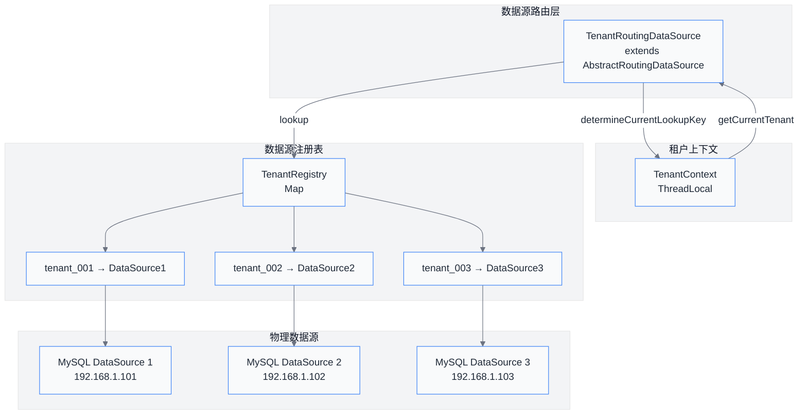
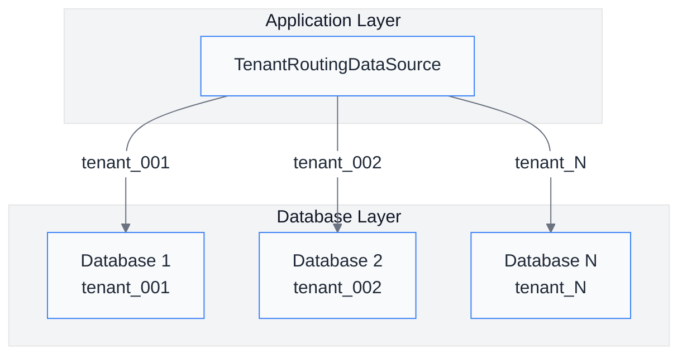
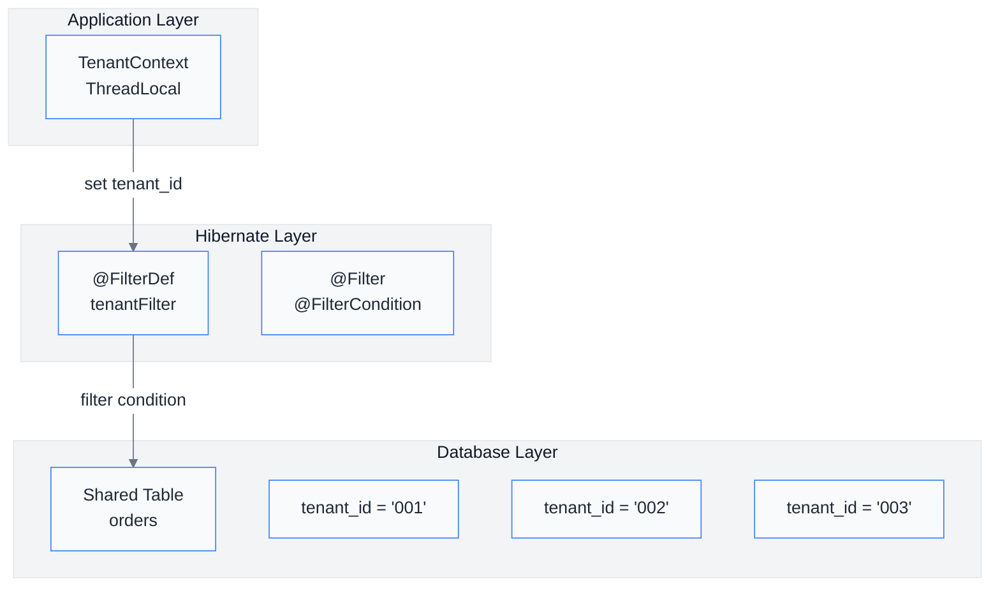
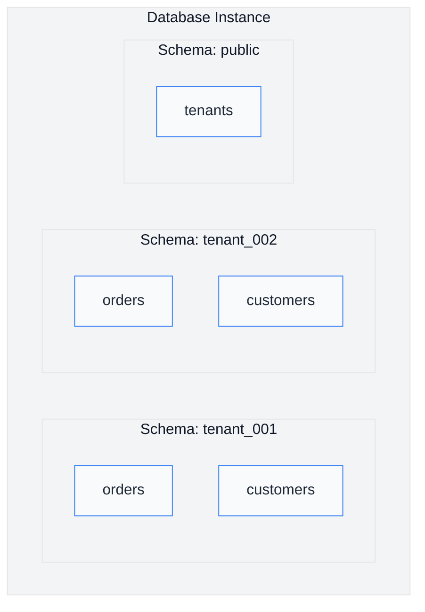

# 第04章 Spring Boot 数据库层多租户实现

## 4.1 概述

在 SaaS 多租户系统中，数据库层的多租户支持是核心技术难点之一。本章将详细介绍如何在 Spring Boot + Hibernate 环境下实现数据库层的多租户支持，包括三种主流实现方案：

- **独立数据库模式**：每个租户拥有独立的数据库实例
- **表隔离模式**：所有租户共享数据库，通过表字段区分租户数据
- **Schema 隔离模式**：多个租户共享数据库实例，但使用不同的 Schema

## 4.2 Hibernate 多租户原生支持

### 4.2.1 MultiTenancy 接口

Hibernate 5.x 版本提供了内置的多租户支持，通过 `MultiTenancy` 接口定义了三种多租户策略：

```java
public enum MultiTenancy {
    /**
     * 无多租户支持（默认）
     */
    NONE,

    /**
     * 数据库级隔离（每个租户独立数据库）
     */
    DATABASE,

    /**
     * Schema 级隔离（同一数据库中不同租户使用不同 Schema）
     */
    SCHEMA,

    /**
     * 表级隔离（通过租户标识列区分数据）
     */
    DISCRIMINATOR
}
```

### 4.2.2 配置 TENANT_IDENTIFIER

在 `application.yml` 中配置 Hibernate 多租户相关属性：

```yaml
spring:
  jpa:
    hibernate:
      multi-tenant: DATABASE  # 可选值：DATABASE, SCHEMA, DISCRIMINATOR
    properties:
      hibernate:
        tenant_identifier_resolver: com.example.config.TenantIdentifierResolverImpl
        multi_tenant_connection_provider: com.example.config.TenantConnectionProviderImpl
```

### 4.2.3 TenantIdentifierResolver 实现

`TenantIdentifierResolver` 接口负责解析当前租户标识符：

```java
/**
 * 租户标识符解析器接口
 * 用于在 Hibernate 上下文中获取和设置当前租户标识符
 */
public interface TenantIdentifierResolver {

    /**
     * 获取默认的租户标识符
     * 当无法确定租户时使用此值
     */
    String getDefaultTenantIdentifier();

    /**
     * 判断指定的实体类是否支持多租户
     */
    boolean isRootEntityTenantIdentifier(Object tenantIdentifier);

    /**
     * 从当前请求上下文中解析租户标识符
     * 通常从 ThreadLocal、Security Context 或请求头中获取
     */
    String resolveTenantIdentifier(Object sessionContext);
}
```

**ThreadLocal 上下文持有者实现**：

```java
/**
 * 租户上下文 - 使用 ThreadLocal 存储当前线程的租户信息
 */
public class TenantContext {

    private static final ThreadLocal<String> CURRENT_TENANT = new ThreadLocal<>();

    public static void setCurrentTenant(String tenantId) {
        CURRENT_TENANT.set(tenantId);
    }

    public static String getCurrentTenant() {
        return CURRENT_TENANT.get();
    }

    public static void clear() {
        CURRENT_TENANT.remove();
    }
}
```

**TenantIdentifierResolver 完整实现**：

```java
/**
 * 租户标识符解析器实现
 * 从 ThreadLocal 中获取当前租户标识符
 */
@Component
public class TenantIdentifierResolverImpl implements TenantIdentifierResolver {

    @Override
    public String getDefaultTenantIdentifier() {
        // 返回系统默认租户标识符
        return "default";
    }

    @Override
    public boolean isRootEntityTenantIdentifier(Object tenantIdentifier) {
        return tenantIdentifier != null;
    }

    @Override
    public String resolveTenantIdentifier(Object sessionContext) {
        String tenantId = TenantContext.getCurrentTenant();
        if (tenantId == null || tenantId.isEmpty()) {
            tenantId = getDefaultTenantIdentifier();
        }
        return tenantId;
    }
}
```

### 4.2.4 TenantConnectionProvider 实现

`MultiTenantConnectionProvider` 接口负责为每个租户提供数据库连接：

```java
/**
 * 多租户连接提供者接口
 * 根据租户标识符返回对应的数据库连接
 */
public interface MultiTenantConnectionProvider<T> extends ConnectionProvider {

    /**
     * 获取指定租户的数据库连接
     */
    Connection getConnection(String tenantIdentifier) throws SQLException;

    /**
     * 释放连接归还到连接池
     */
    void releaseConnection(String tenantIdentifier, Connection connection) throws SQLException;

    /**
     * 判断是否支持指定的租户标识符
     */
    boolean supportsAggressiveRelease();

    /**
     * 获取任意可用的连接（用于初始化等场景）
     */
    Connection getAnyConnection() throws SQLException;

    /**
     * 释放任意连接
     */
    void releaseAnyConnection(Connection connection) throws SQLException;

    /**
     * 判断是否支持多租户
     */
    boolean isUnwrappableAs(Class<?> unwrapType);
}
```

**基于数据源路由的实现**：

```java
/**
 * 多租户连接提供者实现
 * 委托给动态数据源路由获取连接
 */
@Component
public class TenantConnectionProviderImpl implements MultiTenantConnectionProvider<String> {

    @Autowired
    private DataSource dataSource;

    @Override
    public Connection getConnection(String tenantIdentifier) throws SQLException {
        // 设置当前租户上下文
        TenantContext.setCurrentTenant(tenantIdentifier);
        // 获取连接（数据源会根据租户上下文返回对应连接）
        return dataSource.getConnection();
    }

    @Override
    public void releaseConnection(String tenantIdentifier, Connection connection) throws SQLException {
        connection.close();
        TenantContext.clear();
    }

    @Override
    public boolean supportsAggressiveRelease() {
        return false;
    }

    @Override
    public Connection getAnyConnection() throws SQLException {
        return dataSource.getConnection();
    }

    @Override
    public void releaseAnyConnection(Connection connection) throws SQLException {
        connection.close();
    }

    @Override
    public boolean isUnwrappableAs(Class<?> unwrapType) {
        return false;
    }
}
```

## 4.3 AbstractRoutingDataSource 动态数据源

### 4.3.1 核心原理

`AbstractRoutingDataSource` 是 Spring 提供的一个抽象数据源类，它允许在运行时根据某种策略动态切换数据源。其核心是 `determineCurrentLookupKey()` 方法，该方法返回的数据源 key 用于从 `targetDataSources` Map 中查找对应的数据源。



### 4.3.2 TenantRoutingDataSource 实现

```java
/**
 * 多租户动态数据源路由
 * 继承 Spring 的 AbstractRoutingDataSource
 * 根据 TenantContext 中的当前租户标识符动态选择数据源
 */
public class TenantRoutingDataSource extends AbstractRoutingDataSource {

    /**
     * 核心方法：决定当前应使用的数据源 key
     * 该方法在每次数据库操作时被调用
     */
    @Override
    protected Object determineCurrentLookupKey() {
        String tenantId = TenantContext.getCurrentTenant();
        if (tenantId == null || tenantId.isEmpty()) {
            // 如果没有设置租户，使用默认租户
            tenantId = "default";
        }
        return tenantId;
    }
}
```

### 4.3.3 租户注册表

```java
/**
 * 租户注册表
 * 管理所有租户数据源的注册和获取
 */
@Component
public class TenantRegistry {

    private final Map<String, DataSource> tenantDataSources = new ConcurrentHashMap<>();

    /**
     * 注册租户数据源
     */
    public void registerTenant(String tenantId, DataSource dataSource) {
        tenantDataSources.put(tenantId, dataSource);
    }

    /**
     * 获取租户数据源
     */
    public DataSource getDataSource(String tenantId) {
        return tenantDataSources.get(tenantId);
    }

    /**
     * 获取所有已注册的租户 ID
     */
    public Set<String> getAllTenants() {
        return new HashSet<>(tenantDataSources.keySet());
    }

    /**
     * 移除租户数据源
     */
    public void removeTenant(String tenantId) {
        DataSource dataSource = tenantDataSources.remove(tenantId);
        if (dataSource instanceof Closeable) {
            try {
                ((Closeable) dataSource).close();
            } catch (IOException e) {
                // 忽略关闭异常
            }
        }
    }

    /**
     * 判断租户是否存在
     */
    public boolean containsTenant(String tenantId) {
        return tenantDataSources.containsKey(tenantId);
    }

    /**
     * 获取当前租户数量
     */
    public int getTenantCount() {
        return tenantDataSources.size();
    }
}
```

## 4.4 配置类完整实现

### 4.4.1 动态数据源配置

```java
/**
 * 数据源配置类
 * 配置多租户动态数据源路由
 */
@Configuration
public class DataSourceConfig {

    @Autowired
    private TenantRegistry tenantRegistry;

    @Value("${spring.datasource.default-tenant:default}")
    private String defaultTenant;

    /**
     * 主数据源（默认数据源）
     */
    @Bean
    @Primary
    public DataSource dataSource() {
        // 创建动态路由数据源
        TenantRoutingDataSource routingDataSource = new TenantRoutingDataSource();

        // 创建目标数据源映射
        Map<Object, Object> targetDataSources = new HashMap<>();

        // 注册默认数据源
        DataSource defaultDS = createDefaultDataSource();
        targetDataSources.put(defaultTenant, defaultDS);

        // 从注册表加载所有已注册的租户数据源
        for (String tenantId : tenantRegistry.getAllTenants()) {
            if (!tenantId.equals(defaultTenant)) {
                DataSource tenantDS = tenantRegistry.getDataSource(tenantId);
                if (tenantDS != null) {
                    targetDataSources.put(tenantId, tenantDS);
                }
            }
        }

        // 设置目标数据源映射
        routingDataSource.setTargetDataSources(targetDataSources);

        // 设置默认数据源
        routingDataSource.setDefaultTargetDataSource(defaultDS);

        // 设置是否懒加载未找到的数据源
        routingDataSource.setLenientFallback(false);

        return routingDataSource;
    }

    /**
     * 创建默认数据源
     */
    private DataSource createDefaultDataSource() {
        HikariConfig config = new HikariConfig();
        config.setJdbcUrl("jdbc:mysql://localhost:3306/saas_default");
        config.setUsername("saas_user");
        config.setPassword("password");
        config.setDriverClassName("com.mysql.cj.jdbc.Driver");
        config.setPoolName("DefaultHikariPool");
        config.setMaximumPoolSize(10);
        config.setMinimumIdle(5);
        config.setIdleTimeout(300000);
        config.setConnectionTimeout(20000);
        return new HikariDataSource(config);
    }

    /**
     * 为指定租户创建数据源
     */
    public DataSource createDataSourceForTenant(String tenantId) {
        HikariConfig config = new HikariConfig();
        config.setJdbcUrl(String.format("jdbc:mysql://localhost:3306/saas_%s", tenantId));
        config.setUsername("saas_user");
        config.setPassword("password");
        config.setDriverClassName("com.mysql.cj.jdbc.Driver");
        config.setPoolName(String.format("Tenant_%s_Pool", tenantId));
        config.setMaximumPoolSize(10);
        config.setMinimumIdle(2);
        config.setIdleTimeout(300000);
        config.setConnectionTimeout(20000);

        // 租户特定配置
        config.addDataSourceProperty("cachePrepStmts", "true");
        config.addDataSourceProperty("prepStmtCacheSize", "250");
        config.addDataSourceProperty("prepStmtCacheSqlLimit", "2048");

        return new HikariDataSource(config);
    }
}
```

### 4.4.2 租户数据源初始化器

```java
/**
 * 租户数据源初始化器
 * 在系统启动时初始化所有租户的数据源
 */
@Component
public class TenantDataSourceInitializer implements InitializingBean {

    @Autowired
    private TenantRegistry tenantRegistry;

    @Autowired
    private DataSourceConfig dataSourceConfig;

    @Autowired
    private TenantRepository tenantRepository;

    @Override
    public void afterPropertiesSet() throws Exception {
        // 从数据库加载所有活跃租户
        List<String> activeTenants = tenantRepository.findAllActiveTenantIds();

        // 为每个租户创建并注册数据源
        for (String tenantId : activeTenants) {
            DataSource dataSource = dataSourceConfig.createDataSourceForTenant(tenantId);
            tenantRegistry.registerTenant(tenantId, dataSource);
        }

        System.out.println(String.format("Initialized %d tenant data sources", activeTenants.size()));
    }
}
```

### 4.4.3 租户信息实体

```java
/**
 * 租户实体
 */
@Entity
@Table(name = "tenants")
public class Tenant {

    @Id
    @GeneratedValue(strategy = GenerationType.IDENTITY)
    private Long id;

    @Column(name = "tenant_id", unique = true, nullable = false)
    private String tenantId;

    @Column(name = "tenant_name")
    private String tenantName;

    @Column(name = "database_url")
    private String databaseUrl;

    @Column(name = "status")
    @Enumerated(EnumType.STRING)
    private TenantStatus status;

    @Column(name = "created_at")
    private LocalDateTime createdAt;

    @Column(name = "updated_at")
    private LocalDateTime updatedAt;

    // Getters and Setters
    public enum TenantStatus {
        ACTIVE, INACTIVE, SUSPENDED
    }
}

/**
 * 租户 Repository
 */
public interface TenantRepository extends JpaRepository<Tenant, Long> {

    List<Tenant> findByStatus(Tenant.TenantStatus status);

    @Query("SELECT t.tenantId FROM Tenant t WHERE t.status = 'ACTIVE'")
    List<String> findAllActiveTenantIds();

    Optional<Tenant> findByTenantId(String tenantId);
}
```

## 4.5 三种多租户模式实现

### 4.5.1 独立数据库模式

独立数据库模式是最完全的隔离方式，每个租户拥有独立的数据库实例。

**架构图**：



**实现要点**：

```java
/**
 * 独立数据库模式 - 租户数据源提供器
 */
@Component
public class IsolatedDatabaseTenantProvider {

    @Autowired
    private Environment environment;

    /**
     * 根据租户 ID 获取数据库配置
     */
    public DatabaseConfig getDatabaseConfig(String tenantId) {
        // 从租户配置服务获取数据库连接信息
        return new DatabaseConfig(
            String.format("jdbc:mysql://db-server-1:3306/tenant_%s", tenantId),
            "saas_user",
            "password"
        );
    }

    /**
     * 创建租户专属数据源
     */
    public DataSource createIsolatedDataSource(String tenantId) {
        DatabaseConfig config = getDatabaseConfig(tenantId);

        HikariConfig hikariConfig = new HikariConfig();
        hikariConfig.setJdbcUrl(config.getUrl());
        hikariConfig.setUsername(config.getUsername());
        hikariConfig.setPassword(config.getPassword());
        hikariConfig.setDriverClassName("com.mysql.cj.jdbc.Driver");
        hikariConfig.setPoolName(String.format("Isolated_%s_Pool", tenantId));

        return new HikariDataSource(hikariConfig);
    }

    /**
     * 创建租户数据库（初始化时调用）
     */
    public void createTenantDatabase(String tenantId) {
        // 1. 创建数据库
        // 2. 执行初始化脚本
        // 3. 注册到租户注册表
    }
}
```

**独立数据库模式的优缺点**：

| 优点 | 缺点 |
|------|------|
| 完全隔离，安全性最高 | 成本高，每个租户需要独立数据库实例 |
| 故障隔离，一个租户的问题不影响其他租户 | 管理复杂，备份、迁移工作量大 |
| 性能最好，无资源竞争 | 扩展性受限，数据库数量有上限 |
| 便于合规性要求严格的数据隔离 | 初始化新租户较慢 |

### 4.5.2 表隔离模式

表隔离模式通过在表中添加租户标识列，使用 Hibernate Filter 来过滤数据。

**架构图**：



**实体类配置**：

```java
/**
 * 表隔离模式 - 订单实体
 * 使用 Hibernate Filter 实现租户数据隔离
 */
@Entity
@Table(name = "orders")
@FilterDef(
    name = "tenantFilter",
    parameters = @ParamDef(name = "tenantId", type = String.class),
    defaultCondition = "tenant_id = :tenantId"
)
@Filter(name = "tenantFilter")
public class Order {

    @Id
    @GeneratedValue(strategy = GenerationType.IDENTITY)
    private Long id;

    @Column(name = "order_no")
    private String orderNo;

    @Column(name = "tenant_id")
    private String tenantId;

    @Column(name = "customer_name")
    private String customerName;

    @Column(name = "total_amount")
    private BigDecimal totalAmount;

    @Column(name = "status")
    private String status;

    // Getters and Setters
}
```

**租户过滤器注解**：

```java
/**
 * 租户数据过滤器
 * 自动为所有查询添加租户条件
 */
@Aspect
@Component
@Order(1)
public class TenantFilterAspect {

    @Autowired
    private SessionFactory sessionFactory;

    /**
     * 在所有 Repository 方法执行前启用租户过滤器
     */
    @Before("execution(* com.example.repository.*.*(..))")
    public void enableTenantFilter(JoinPoint joinPoint) {
        String tenantId = TenantContext.getCurrentTenant();
        if (tenantId != null && !tenantId.isEmpty()) {
            Session session = sessionFactory.getCurrentSession();
            session.enableFilter("tenantFilter")
                   .setParameter("tenantId", tenantId);
        }
    }
}
```

**基类实体（公共租户字段）**：

```java
/**
 * 租户基类
 * 所有需要租户隔离的实体继承此类
 */
@MappedSuperclass
public abstract class TenantAwareEntity {

    @Column(name = "tenant_id", nullable = false)
    private String tenantId;

    @Column(name = "created_by")
    private String createdBy;

    @Column(name = "created_at")
    private LocalDateTime createdAt;

    @Column(name = "updated_by")
    private String updatedBy;

    @Column(name = "updated_at")
    private LocalDateTime updatedAt;

    @PrePersist
    protected void onCreate() {
        if (this.tenantId == null) {
            this.tenantId = TenantContext.getCurrentTenant();
        }
        this.createdAt = LocalDateTime.now();
        this.updatedAt = LocalDateTime.now();
    }

    @PreUpdate
    protected void onUpdate() {
        this.updatedAt = LocalDateTime.now();
    }

    // Getters and Setters
}

/**
 * 订单实体继承租户基类
 */
@Entity
@Table(name = "orders")
@FilterDef(
    name = "tenantFilter",
    parameters = @ParamDef(name = "tenantId", type = String.class)
)
public class Order extends TenantAwareEntity {

    @Id
    @GeneratedValue(strategy = GenerationType.IDENTITY)
    private Long id;

    @Column(name = "order_no")
    private String orderNo;

    // 其他业务字段...
}
```

**表隔离模式的优缺点**：

| 优点 | 缺点 |
|------|------|
| 成本低，共享数据库资源 | 隔离性较弱，存在数据泄露风险 |
| 扩展性好，支持大量租户 | 查询时需要额外添加租户条件 |
| 运维简单，统一管理 | 备份恢复需要额外处理 |
| 新租户创建快速 | 统计查询可能需要特殊处理 |

### 4.5.3 Schema 隔离模式

Schema 隔离模式在同一数据库实例中为每个租户创建独立的 Schema。

**架构图**：



**Schema 隔离的数据源配置**：

```java
/**
 * Schema 隔离模式 - 数据源配置
 */
@Configuration
public class SchemaIsolationDataSourceConfig {

    @Bean
    public DataSource dataSource() {
        TenantRoutingDataSource routingDataSource = new TenantRoutingDataSource();

        Map<Object, Object> targetDataSources = new HashMap<>();

        // 为每个租户创建指向特定 Schema 的数据源
        for (String tenantId : getAllTenantIds()) {
            DataSource tenantDataSource = createSchemaDataSource(tenantId);
            targetDataSources.put(tenantId, tenantDataSource);
        }

        routingDataSource.setTargetDataSources(targetDataSources);
        routingDataSource.setDefaultTargetDataSource(createDefaultDataSource());

        return routingDataSource;
    }

    /**
     * 创建指向特定 Schema 的数据源
     */
    private DataSource createSchemaDataSource(String tenantId) {
        HikariConfig config = new HikariConfig();
        // 注意：initialSchema 参数指定默认 Schema
        config.setJdbcUrl(String.format(
            "jdbc:mysql://localhost:3306/saas_db?initialSchema=%s",
            tenantId
        ));
        config.setUsername("saas_user");
        config.setPassword("password");
        config.setDriverClassName("com.mysql.cj.jdbc.Driver");
        config.setPoolName(String.format("Schema_%s_Pool", tenantId));

        return new HikariDataSource(config);
    }

    /**
     * Hibernate 配置 - 设置默认 Schema
     */
    @Bean
    public JpaProperties jpaProperties() {
        JpaProperties properties = new JpaProperties();
        properties.setProperties(Map.of(
            "hibernate.default_schema", TenantContext.getCurrentTenant() != null
                ? TenantContext.getCurrentTenant()
                : "public"
        ));
        return properties;
    }
}
```

**Schema 切换拦截器**：

```java
/**
 * Schema 切换拦截器
 * 在执行 SQL 前动态切换 Schema
 */
@Component
public class SchemaSwitchInterceptor {

    @Autowired
    private DataSource dataSource;

    /**
     * 切换到指定租户的 Schema
     */
    public void switchToSchema(String tenantId) {
        try (Connection conn = dataSource.getConnection()) {
            // MySQL 使用 USE 语句切换数据库（相当于 Schema）
            // PostgreSQL 使用 SET search_path TO schema_name
            conn.createStatement().execute(String.format("USE `%s`", tenantId));
        } catch (SQLException e) {
            throw new RuntimeException("Failed to switch schema for tenant: " + tenantId, e);
        }
    }

    /**
     * AOP 拦截 Service 层方法，自动切换 Schema
     */
    @Aspect
    @Component
    public static class TenantSchemaAspect {

        @Around("execution(* com.example.service.*.*(..))")
        public Object switchSchema(ProceedingJoinPoint joinPoint) throws Throwable {
            String tenantId = TenantContext.getCurrentTenant();

            if (tenantId != null && !tenantId.isEmpty()) {
                // 在执行前切换 Schema
                SchemaSwitchInterceptor.switchToSchema(tenantId);
            }

            try {
                return joinPoint.proceed();
            } finally {
                // 可选：执行后切换回默认 Schema
            }
        }
    }
}
```

**Schema 隔离模式的优缺点**：

| 优点 | 缺点 |
|------|------|
| 隔离性中等，数据结构隔离 | 需要数据库管理权限创建 Schema |
| 成本适中，共享数据库实例 | Schema 数量受数据库限制 |
| 便于跨租户统计查询 | 跨租户事务处理复杂 |
| 备份恢复相对简单 | Schema 迁移需要逐个处理 |

## 4.6 完整数据流架构图

```mermaid
%%{init: {'theme': 'base', 'themeVariables': { 'primaryColor': '#3B82F6', 'primaryTextColor': '#1F2937', 'primaryBorderColor': '#1D4ED8', 'lineColor': '#6B7280', 'secondaryColor': '#DBEAFE', 'tertiaryColor': '#FFFFFF', 'background': '#FFFFFF', 'mainBkg': '#F9FAFB', 'nodeBorder': '#3B82F6', 'clusterBkg': '#F3F4F6', 'titleColor': '#111827', 'edgeLabelBackground': '#FFFFFF', 'nodeTextColor': '#1F2937'}}}%%
flowchart TB
    subgraph "Client Layer"
        R["HTTP Request<br/>Header X-Tenant-ID"]
    end

    subgraph "Web Layer"
        F["TenantFilter<br/>Filter"]
    end

    subgraph "Service Layer"
        S["Business Service"]
    end

    subgraph "Data Access Layer"
        subgraph "Tenant Routing"
            TR["TenantRoutingDataSource"]
            TC["TenantContext<br/>ThreadLocal"]
        end
        subgraph "Connection Management"
            CP["TenantConnectionProvider"]
            DR["TenantRegistry"]
        end
    end

    subgraph "Database Layer"
        D1["Database 1<br/>tenant_001"]
        D2["Database 2<br/>tenant_002"]
        D3["Database 3<br/>tenant_003"]
        DN["Default DB"]
    end

    R --> F
    F -->|1. Extract Tenant ID| TC
    F -->|2. Set to ThreadLocal| TC
    TC -->|3. Get Current Tenant| TR
    TR -->|4. Lookup DataSource| DR
    DR -->|5. Return DataSource| TR
    TR -->|6. Get Connection| CP
    CP -->|7. Return Connection| TR
    TR -->|8. Execute SQL| S
    S -->|9. Query/Update| D1|D2|D3|DN
```

## 4.7 租户上下文管理

### 4.7.1 租户上下文拦截器

```java
/**
 * 租户上下文拦截器
 * 从 HTTP 请求头中提取租户 ID 并设置到 ThreadLocal
 */
@Component
public class TenantContextInterceptor extends HandlerInterceptorAdapter {

    private static final String TENANT_HEADER = "X-Tenant-ID";
    private static final String DEFAULT_TENANT = "default";

    @Autowired
    private TenantService tenantService;

    @Override
    public boolean preHandle(HttpServletRequest request,
                            HttpServletResponse response,
                            Object handler) throws Exception {
        String tenantId = request.getHeader(TENANT_HEADER);

        // 验证租户 ID 是否有效
        if (tenantId == null || tenantId.isEmpty()) {
            tenantId = DEFAULT_TENANT;
        }

        // 检查租户是否处于活跃状态
        if (!tenantService.isTenantActive(tenantId)) {
            response.setStatus(HttpServletResponse.SC_FORBIDDEN);
            response.getWriter().write("{\"error\": \"Tenant is not active\"}");
            return false;
        }

        // 设置到 ThreadLocal
        TenantContext.setCurrentTenant(tenantId);

        return super.preHandle(request, response, handler);
    }

    @Override
    public void afterCompletion(HttpServletRequest request,
                               HttpServletResponse response,
                               Object handler,
                               Exception ex) throws Exception {
        // 请求完成后清除 ThreadLocal，防止内存泄漏
        TenantContext.clear();
        super.afterCompletion(request, response, handler, ex);
    }
}

/**
 * Web MVC 配置
 */
@Configuration
public class WebMvcConfig implements WebMvcConfigurer {

    @Autowired
    private TenantContextInterceptor tenantContextInterceptor;

    @Override
    public void addInterceptors(InterceptorRegistry registry) {
        registry.addInterceptor(tenantContextInterceptor)
                .addPathPatterns("/api/**")
                .excludePathPatterns("/api/health", "/api/public/**");
    }
}
```

### 4.7.2 租户服务

```java
/**
 * 租户服务
 */
@Service
@Transactional(readOnly = true)
public class TenantService {

    @Autowired
    private TenantRepository tenantRepository;

    @Autowired
    private TenantRegistry tenantRegistry;

    /**
     * 检查租户是否处于活跃状态
     */
    public boolean isTenantActive(String tenantId) {
        return tenantRepository.findByTenantId(tenantId)
                .map(tenant -> tenant.getStatus() == Tenant.TenantStatus.ACTIVE)
                .orElse(false);
    }

    /**
     * 获取租户信息
     */
    public Tenant getTenant(String tenantId) {
        return tenantRepository.findByTenantId(tenantId)
                .orElseThrow(() -> new TenantNotFoundException(tenantId));
    }

    /**
     * 创建新租户
     */
    @Transactional
    public Tenant createTenant(CreateTenantRequest request) {
        // 1. 创建租户记录
        Tenant tenant = new Tenant();
        tenant.setTenantId(request.getTenantId());
        tenant.setTenantName(request.getTenantName());
        tenant.setStatus(Tenant.TenantStatus.ACTIVE);
        tenant.setCreatedAt(LocalDateTime.now());

        tenant = tenantRepository.save(tenant);

        // 2. 初始化租户数据库/Schema
        initializeTenantResources(request.getTenantId());

        return tenant;
    }

    /**
     * 初始化租户资源
     */
    private void initializeTenantResources(String tenantId) {
        // 根据配置的模式初始化相应资源
        // 独立数据库模式：创建数据库
        // Schema 模式：创建 Schema
        // 表隔离模式：创建租户记录
    }

    /**
     * 停用租户
     */
    @Transactional
    public void deactivateTenant(String tenantId) {
        Tenant tenant = getTenant(tenantId);
        tenant.setStatus(Tenant.TenantStatus.INACTIVE);
        tenantRepository.save(tenant);

        // 从注册表移除数据源
        tenantRegistry.removeTenant(tenantId);
    }
}
```

### 4.7.3 请求 DTO

```java
/**
 * 创建租户请求
 */
public class CreateTenantRequest {

    @NotBlank
    @Size(min = 3, max = 50)
    @Pattern(regexp = "^[a-z0-9_]+$")
    private String tenantId;

    @NotBlank
    @Size(min = 2, max = 100)
    private String tenantName;

    @NotBlank
    @Email
    private String adminEmail;

    private String databaseType;  // ISOLATED, SCHEMA, DISCRIMINATOR

    // Getters and Setters
}

/**
 * 租户不存在异常
 */
public class TenantNotFoundException extends RuntimeException {
    public TenantNotFoundException(String tenantId) {
        super("Tenant not found: " + tenantId);
    }
}
```

## 4.8 章节总结

本章详细介绍了 Spring Boot + Hibernate 环境下数据库层多租户实现的三种主流方案：

### 核心概念回顾

1. **Hibernate MultiTenancy**
   - `MultiTenancy` 枚举定义了三种隔离级别：DATABASE、SCHEMA、DISCRIMINATOR
   - `TenantIdentifierResolver` 负责解析当前租户标识符
   - `MultiTenantConnectionProvider` 负责提供租户对应的数据库连接

2. **AbstractRoutingDataSource**
   - 通过 `determineCurrentLookupKey()` 动态选择数据源
   - 配合 `ThreadLocal` 实现的 `TenantContext` 存储租户上下文
   - `TenantRegistry` 管理所有租户数据源的注册

3. **三种隔离模式**
   - **独立数据库模式**：最高隔离级别，适合对数据安全要求高的场景
   - **表隔离模式**：成本最低，适合租户数量大、安全要求相对低的场景
   - **Schema 隔离模式**：中等隔离级别，适合需要逻辑分离但共享硬件的场景

### 技术选型建议

| 场景 | 推荐模式 | 理由 |
|------|----------|------|
| 金融、医疗等高安全要求 | 独立数据库 | 完全隔离，满足合规要求 |
| 普通企业 SaaS | Schema 隔离或表隔离 | 成本与隔离性的平衡 |
| 租户数量大（>1000） | 表隔离 | 可扩展性强 |
| 初期项目、快速迭代 | 表隔离 | 运维成本低 |

### 关键实现点

1. **ThreadLocal 模式**：确保租户上下文在请求生命周期内正确传递
2. **拦截器模式**：统一处理租户上下文，避免业务代码侵入
3. **注册表模式**：集中管理租户数据源，支持动态添加/移除租户
4. **AOP 模式**：透明处理租户过滤，业务代码无感知

### 下章预告

下一章将介绍 **Spring Boot 多租户 API 层实现**，包括：
- 租户感知控制器设计
- 多租户请求上下文传递
- 租户隔离的 Service 层实现
- 异常处理与租户错误响应
