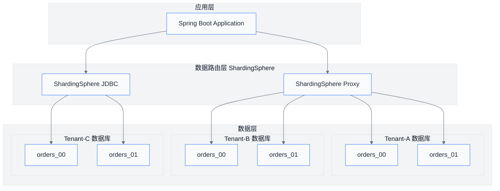
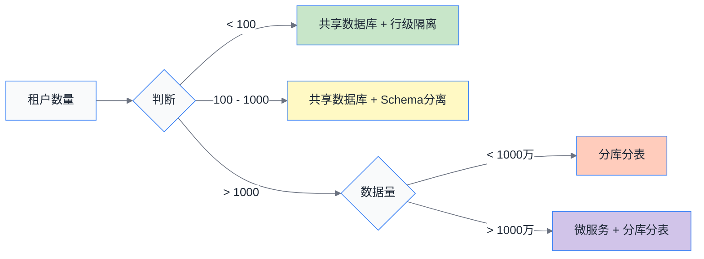

# 第05章 数据隔离策略

## 概述

在多租户 SaaS 系统中，数据隔离是核心需求之一。租户之间的数据必须严格隔离，防止数据泄露和混淆。本章将详细介绍行级隔离、列级隔离、数据访问层设计以及分库分表策略，帮助读者构建完善的多租户数据隔离体系。

---

## 1. 行级隔离（Row-Level Isolation）

行级隔离是最常用的多租户数据隔离策略，通过在每张表中添加 `tenant_id` 字段来区分不同租户的数据。

### 1.1 tenant_id 列设计

```sql
-- 租户感知表结构示例
CREATE TABLE `t_order` (
    `id` BIGINT PRIMARY KEY AUTO_INCREMENT,
    `tenant_id` VARCHAR(64) NOT NULL COMMENT '租户ID',
    `order_no` VARCHAR(64) NOT NULL COMMENT '订单号',
    `amount` DECIMAL(12,2) NOT NULL COMMENT '订单金额',
    `status` TINYINT NOT NULL DEFAULT 0 COMMENT '订单状态',
    `created_at` DATETIME NOT NULL DEFAULT CURRENT_TIMESTAMP,
    `updated_at` DATETIME NOT NULL DEFAULT CURRENT_TIMESTAMP ON UPDATE CURRENT_TIMESTAMP,
    INDEX `idx_tenant_id` (`tenant_id`),
    INDEX `idx_tenant_order` (`tenant_id`, `order_no`)
) ENGINE=InnoDB DEFAULT CHARSET=utf8mb4 COMMENT='订单表';
```

### 1.2 BaseEntity 抽象基类设计

所有租户感知实体都应该继承自 BaseEntity，BaseEntity 负责管理租户上下文和通用字段。

```java
package com.saas.tenant.entity;

import jakarta.persistence.*;
import lombok.Getter;
import lombok.Setter;
import org.springframework.data.annotation.CreatedDate;
import org.springframework.data.annotation.LastModifiedDate;
import org.springframework.data.jpa.domain.support.AuditingEntityListener;

import java.time.LocalDateTime;

/**
 * 租户感知实体的抽象基类
 * 所有属于特定租户的数据实体都应该继承此类
 */
@MappedSuperclass
@EntityListeners(AuditingEntityListener.class)
@Getter
@Setter
public abstract class BaseTenantEntity {

    /**
     * 租户ID - 必填字段，用于数据隔离
     */
    @Column(name = "tenant_id", nullable = false, length = 64)
    private String tenantId;

    /**
     * 创建时间
     */
    @CreatedDate
    @Column(name = "created_at", nullable = false, updatable = false)
    private LocalDateTime createdAt;

    /**
     * 最后修改时间
     */
    @LastModifiedDate
    @Column(name = "updated_at", nullable = false)
    private LocalDateTime updatedAt;

    /**
     * 创建人
     */
    @Column(name = "created_by", length = 64)
    private String createdBy;

    /**
     * 最后修改人
     */
    @Column(name = "updated_by", length = 64)
    private String updatedBy;

    /**
     * 逻辑删除标记
     */
    @Column(name = "deleted", nullable = false)
    private Boolean deleted = false;

    /**
     * 版本号，用于乐观锁
     */
    @Version
    @Column(name = "version")
    private Long version;
}
```

### 1.3 Hibernate @Where 注解自动过滤

使用 `@Where` 注解可以在实体类级别自动添加过滤条件，实现自动的租户数据过滤。

```java
package com.saas.tenant.entity;

import jakarta.persistence.*;
import lombok.Data;
import lombok.EqualsAndHashCode;
import org.hibernate.annotations.Where;

/**
 * 订单实体 - 使用 @Where 实现行级租户隔离
 */
@Entity
@Table(name = "t_order")
@Where(clause = "deleted = false AND tenant_id = #{currentTenantId}")
@Data
@EqualsAndHashCode(callSuper = true)
public class Order extends BaseTenantEntity {

    @Id
    @GeneratedValue(strategy = GenerationType.IDENTITY)
    private Long id;

    /**
     * 订单号
     */
    @Column(name = "order_no", nullable = false, length = 64)
    private String orderNo;

    /**
     * 订单金额
     */
    @Column(name = "amount", nullable = false, precision = 12, scale = 2)
    private java.math.BigDecimal amount;

    /**
     * 订单状态: 0-待支付, 1-已支付, 2-已完成, 3-已取消
     */
    @Column(name = "status", nullable = false)
    private Integer status;

    /**
     * 客户ID
     */
    @Column(name = "customer_id")
    private Long customerId;

    /**
     * 订单备注
     */
    @Column(name = "remark", length = 500)
    private String remark;
}
```

### 1.4 租户上下文管理

```java
package com.saas.tenant.context;

/**
 * 租户上下文 Holder
 * 使用 ThreadLocal 存储当前线程的租户信息
 */
public class TenantContext {

    private static final ThreadLocal<String> CURRENT_TENANT = new ThreadLocal<>();
    private static final ThreadLocal<String> CURRENT_USER = new ThreadLocal<>();

    public static void setTenantId(String tenantId) {
        CURRENT_TENANT.set(tenantId);
    }

    public static String getTenantId() {
        return CURRENT_TENANT.get();
    }

    public static void setUserId(String userId) {
        CURRENT_USER.set(userId);
    }

    public static String getUserId() {
        return CURRENT_USER.get();
    }

    public static void clear() {
        CURRENT_TENANT.remove();
        CURRENT_USER.remove();
    }
}
```

---

## 2. 列级隔离（Column-Level Isolation）

列级隔离用于对敏感数据进行保护，确保不同租户只能看到被授权的字段。

### 2.1 敏感字段加密

```java
package com.saas.tenant.security;

import javax.crypto.Cipher;
import javax.crypto.spec.SecretKeySpec;
import java.util.Base64;

/**
 * 数据加密工具类
 * 用于对租户敏感字段进行加密存储
 */
public class DataEncryptionUtil {

    private static final String ALGORITHM = "AES";
    private static final String TRANSFORMATION = "AES/ECB/PKCS5Padding";

    /**
     * 加密数据
     */
    public static String encrypt(String data, String secretKey) {
        try {
            SecretKeySpec key = new SecretKeySpec(secretKey.getBytes(), ALGORITHM);
            Cipher cipher = Cipher.getInstance(TRANSFORMATION);
            cipher.init(Cipher.ENCRYPT_MODE, key);
            byte[] encrypted = cipher.doFinal(data.getBytes());
            return Base64.getEncoder().encodeToString(encrypted);
        } catch (Exception e) {
            throw new RuntimeException("加密失败", e);
        }
    }

    /**
     * 解密数据
     */
    public static String decrypt(String encryptedData, String secretKey) {
        try {
            SecretKeySpec key = new SecretKeySpec(secretKey.getBytes(), ALGORITHM);
            Cipher cipher = Cipher.getInstance(TRANSFORMATION);
            cipher.init(Cipher.DECRYPT_MODE, key);
            byte[] decrypted = cipher.doFinal(Base64.getDecoder().decode(encryptedData));
            return new String(decrypted);
        } catch (Exception e) {
            throw new RuntimeException("解密失败", e);
        }
    }
}
```

### 2.2 基于租户的字段可见性

```java
package com.saas.tenant.security;

import com.saas.tenant.context.TenantContext;
import com.fasterxml.jackson.annotation.JsonIgnore;
import java.lang.annotation.ElementType;
import java.lang.annotation.Retention;
import java.lang.annotation.RetentionPolicy;
import java.lang.annotation.Target;

/**
 * 租户可见性注解
 * 标注在字段上，控制该字段对特定租户的可见性
 */
@Target(ElementType.FIELD)
@Retention(RetentionPolicy.RUNTIME)
public @interface TenantSensitive {
    /**
     * 是否对所有租户可见，默认 true
     */
    boolean visibleToAll() default true;

    /**
     * 仅对指定租户ID列表可见
     */
    String[] visibleToTenants() default {};
}
```

### 2.3 动态字段选择

```java
package com.saas.tenant.security;

import com.fasterxml.jackson.databind.ObjectMapper;
import com.fasterxml.jackson.databind.PropertyNamingStrategies;
import com.fasterxml.jackson.databind.ser.impl.SimpleBeanPropertyFilter;
import com.fasterxml.jackson.databind.ser.impl.SimpleFilterProvider;
import org.springframework.stereotype.Component;
import java.util.*;

/**
 * 动态字段过滤服务
 * 根据租户权限动态决定哪些字段可见
 */
@Component
public class DynamicFieldFilter {

    private final ObjectMapper objectMapper;

    public DynamicFieldFilter(ObjectMapper objectMapper) {
        this.objectMapper = objectMapper;
    }

    /**
     * 根据租户权限过滤对象字段
     */
    public <T> T filterFields(T object, String tenantId) {
        if (object == null) {
            return null;
        }

        // 获取对象的所有字段
        Class<?> clazz = object.getClass();
        Set<String> hiddenFields = new HashSet<>();

        // 根据业务规则确定哪些字段需要隐藏
        // 例如：某些敏感字段只对付费等级高的租户可见
        hiddenFields.add("internalNote");  // 内部备注只对运营人员可见

        // 动态添加需要隐藏的字段
        if (!"premium".equals(tenantId)) {
            hiddenFields.add("costPrice");
            hiddenFields.add("profitMargin");
        }

        // 使用 Jackson FilterProvider 进行字段过滤
        SimpleFilterProvider filterProvider = new SimpleFilterProvider();
        filterProvider.addFilter("tenantFilter",
            SimpleBeanPropertyFilter.serializeAllExcept(hiddenFields));

        try {
            String json = objectMapper.writeValueAsString(object);
            return objectMapper.readValue(json, clazz);
        } catch (Exception e) {
            throw new RuntimeException("字段过滤失败", e);
        }
    }
}
```

---

## 3. 数据访问层设计

### 3.1 抽象基础 Repository

```java
package com.saas.tenant.repository;

import com.saas.tenant.context.TenantContext;
import jakarta.persistence.EntityManager;
import jakarta.persistence.Query;
import org.springframework.data.jpa.repository.JpaRepository;
import org.springframework.data.jpa.repository.Query;
import org.springframework.data.repository.NoRepositoryBean;
import org.springframework.data.repository.query.Param;

import java.util.List;
import java.util.Optional;

/**
 * 租户感知的基础 Repository
 * 所有租户相关实体的 Repository 应该继承此接口
 *
 * @param <T> 实体类型
 * @param <ID> 主键类型
 */
@NoRepositoryBean
public interface BaseTenantRepository<T, ID> extends JpaRepository<T, ID> {

    /**
     * 根据租户ID查询所有数据
     * SpEL 表达式 #tenantEntityName 会自动替换为当前实体名
     */
    @Query("SELECT t FROM #{#tenantEntityName} t WHERE t.tenantId = :tenantId AND t.deleted = false")
    List<T> findByTenantId(@Param("tenantId") String tenantId);

    /**
     * 根据租户ID和主键查询
     */
    @Query("SELECT t FROM #{#tenantEntityName} t WHERE t.id = :id AND t.tenantId = :tenantId AND t.deleted = false")
    Optional<T> findByIdAndTenantId(@Param("id") ID id, @Param("tenantId") String tenantId);

    /**
     * 根据租户ID统计数量
     */
    @Query("SELECT COUNT(t) FROM #{#tenantEntityName} t WHERE t.tenantId = :tenantId AND t.deleted = false")
    long countByTenantId(@Param("tenantId") String tenantId);

    /**
     * 检查指定租户是否存在指定记录
     */
    @Query("SELECT CASE WHEN COUNT(t) > 0 THEN true ELSE false END FROM #{#tenantEntityName} t " +
           "WHERE t.tenantId = :tenantId AND t.deleted = false")
    boolean existsByTenantId(@Param("tenantId") String tenantId);

    /**
     * 根据租户ID删除（逻辑删除）
     */
    @Query("UPDATE #{#tenantEntityName} t SET t.deleted = true WHERE t.tenantId = :tenantId")
    void logicalDeleteByTenantId(@Param("tenantId") String tenantId);
}
```

### 3.2 Hibernate Filter 实现

```java
package com.saas.tenant.entity;

import jakarta.persistence.*;
import org.hibernate.annotations.Filter;
import org.hibernate.annotations.FilterDef;
import org.hibernate.annotations.ParamDef;

/**
 * 租户感知实体接口
 * 通过 Hibernate Filter 实现运行时租户数据过滤
 */
@FilterDef(
    name = "tenantFilter",
    parameters = @ParamDef(name = "tenantId", type = String.class),
    defaultCondition = "tenant_id = :tenantId AND deleted = false"
)
@Filter(name = "tenantFilter")
public interface TenantAwareEntity {

    @Column(name = "tenant_id", nullable = false, length = 64)
    String getTenantId();

    void setTenantId(String tenantId);

    @Column(name = "deleted", nullable = false)
    Boolean getDeleted();

    void setDeleted(Boolean deleted);
}
```

```java
package com.saas.tenant.entity;

import jakarta.persistence.*;
import lombok.Data;
import lombok.EqualsAndHashCode;
import org.hibernate.annotations.*;

/**
 * 客户实体 - 使用 Hibernate Filter 实现租户隔离
 */
@Entity
@Table(name = "t_customer")
@FilterDef(
    name = "tenantFilter",
    parameters = @ParamDef(name = "tenantId", type = String.class),
    defaultCondition = "tenant_id = :tenantId"
)
@Filter(name = "tenantFilter", condition = "tenant_id = :tenantId")
@Data
@EqualsAndHashCode(callSuper = true)
public class Customer extends BaseTenantEntity implements TenantAwareEntity {

    @Id
    @GeneratedValue(strategy = GenerationType.IDENTITY)
    private Long id;

    @Column(name = "customer_name", nullable = false, length = 100)
    private String customerName;

    @Column(name = "contact_person", length = 50)
    private String contactPerson;

    @Column(name = "phone", length = 20)
    private String phone;

    @Column(name = "email", length = 100)
    private String email;

    @Column(name = "address", length = 500)
    private String address;

    @Enumerated(EnumType.STRING)
    @Column(name = "customer_level")
    private CustomerLevel customerLevel;

    public enum CustomerLevel {
        NORMAL,    // 普通客户
        VIP,       // VIP客户
        PLATINUM   // 白金客户
    }
}
```

### 3.3 租户拦截器配置

```java
package com.saas.tenant.interceptor;

import com.saas.tenant.context.TenantContext;
import com.saas.tenant.entity.TenantAwareEntity;
import jakarta.persistence.*;
import org.aspectj.lang.ProceedingJoinPoint;
import org.aspectj.lang.annotation.Around;
import org.aspectj.lang.annotation.Aspect;
import org.hibernate.Session;
import org.springframework.stereotype.Component;

/**
 * 租户数据拦截器
 * 在执行数据库操作前自动启用租户 Filter
 */
@Aspect
@Component
public class TenantFilterInterceptor {

    @PersistenceContext
    private EntityManager entityManager;

    /**
     * 拦截所有 Repository 方法，自动启用租户 Filter
     */
    @Around("execution(* com.saas.tenant.repository.*.*(..))")
    public Object enableTenantFilter(ProceedingJoinPoint joinPoint) throws Throwable {
        String tenantId = TenantContext.getTenantId();
        if (tenantId != null) {
            Session session = entityManager.unwrap(Session.class);
            session.enableFilter("tenantFilter")
                   .setParameter("tenantId", tenantId);
        }
        return joinPoint.proceed();
    }
}
```

### 3.4 具体的订单 Repository 实现

```java
package com.saas.tenant.repository;

import com.saas.tenant.entity.Order;
import org.springframework.data.jpa.repository.JpaRepository;
import org.springframework.data.jpa.repository.Query;
import org.springframework.data.repository.query.Param;
import org.springframework.stereotype.Repository;

import java.math.BigDecimal;
import java.time.LocalDateTime;
import java.util.List;
import java.util.Optional;

/**
 * 订单 Repository
 * 继承 BaseTenantRepository，自动获得租户隔离能力
 */
@Repository
public interface OrderRepository extends BaseTenantRepository<Order, Long> {

    /**
     * 根据订单号查询（自动带上租户过滤）
     */
    Optional<Order> findByOrderNo(String orderNo);

    /**
     * 根据状态查询订单列表
     */
    List<Order> findByStatus(Integer status);

    /**
     * 查询指定时间范围内的订单
     */
    @Query("SELECT o FROM Order o WHERE o.createdAt BETWEEN :startDate AND :endDate ORDER BY o.createdAt DESC")
    List<Order> findOrdersInDateRange(
        @Param("startDate") LocalDateTime startDate,
        @Param("endDate") LocalDateTime endDate
    );

    /**
     * 统计指定租户的订单总额
     */
    @Query("SELECT COALESCE(SUM(o.amount), 0) FROM Order o WHERE o.status = :status")
    BigDecimal sumAmountByStatus(@Param("status") Integer status);

    /**
     * 查询大额订单（超过指定金额）
     */
    @Query("SELECT o FROM Order o WHERE o.amount >= :minAmount ORDER BY o.amount DESC")
    List<Order> findLargeOrders(@Param("minAmount") BigDecimal minAmount);

    /**
     * 根据客户ID查询订单
     */
    List<Order> findByCustomerId(Long customerId);

    /**
     * 批量查询订单
     */
    List<Order> findByIdIn(List<Long> ids);
}
```

---

## 4. 分库分表策略

当单表数据量达到瓶颈时，需要考虑分库分表策略来提升系统性能。

### 4.1 分库分表架构图



### 4.2 按租户分库配置（ShardingSphere）

```yaml
# ShardingSphere 分库分表配置示例
spring:
  shardingsphere:
    rules:
      sharding:
        tables:
          t_order:
            actual-data-nodes: ds_${0..2}.t_order_${0..15}
            table-strategy:
              standard:
                sharding-column: tenant_id
                sharding-algorithm-name: tenant_inline
            key-generate-strategy:
              column: id
              key-generator-name: snowflake

        sharding-algorithms:
          tenant_inline:
            type: CLASS_BASED
            props:
              strategy: STANDARD
              express: ds_${tenant_id.hashCode() % 3}
              source: ds_
```

```java
package com.saas.sharding.config;

import org.apache.shardingsphere.sharding.api.sharding.standard.PreciseShardingValue;
import org.apache.shardingsphere.sharding.api.sharding.standard.RangeShardingValue;
import org.apache.shardingsphere.sharding.api.sharding.standard.StandardShardingAlgorithm;
import java.util.Collection;
import java.util.Properties;

/**
 * 基于租户ID的分片算法实现
 */
public class TenantIdShardingAlgorithm implements StandardShardingAlgorithm<String> {

    private Properties props;

    @Override
    public void init(Properties props) {
        this.props = props;
    }

    @Override
    public String doSharding(Collection<String> availableTargetNames,
                             PreciseShardingValue<String> shardingValue) {
        String tenantId = shardingValue.getValue();
        // 根据租户ID哈希值选择数据源
        int shardingIndex = Math.abs(tenantId.hashCode()) % availableTargetNames.size();
        String suffix = shardingIndex % 3 == 0 ? "ds_0" : shardingIndex % 3 == 1 ? "ds_1" : "ds_2";
        return suffix;
    }

    @Override
    public Collection<String> doSharding(Collection<String> availableTargetNames,
                                         RangeShardingValue<String> shardingValue) {
        // 范围查询时返回所有分片
        return availableTargetNames;
    }

    @Override
    public Properties getProps() {
        return props;
    }

    @Override
    public String getType() {
        return "TENANT_ID";
    }
}
```

### 4.3 按租户分表策略

```yaml
# 按租户分表配置
spring:
  shardingsphere:
    rules:
      sharding:
        tables:
          t_order:
            # 逻辑表名 -> 实际表分布
            actual-data-nodes: ds_0.t_order_${0..15}
            table-strategy:
              standard:
                sharding-column: order_no
                sharding-algorithm-name: order_mod
            key-generate-strategy:
              column: id
              key-generator-name: snowflake

        binding-tables:
          - t_order,t_order_item

        sharding-algorithms:
          order_mod:
            type: INLINE
            props:
              algorithm-expression: t_order_${order_no.hashCode() % 16}
```

### 4.4 跨租户查询的限制

```java
package com.saas.tenant.service;

import com.saas.tenant.context.TenantContext;
import org.springframework.stereotype.Service;
import org.springframework.util.StringUtils;

/**
 * 跨租户查询服务
 * 仅管理员可用，普通租户无权访问
 */
@Service
public class CrossTenantQueryService {

    /**
     * 跨租户查询 - 需要管理员权限
     * @throws SecurityException 如果当前用户不是系统管理员
     */
    public void validateAdminAccess() {
        String currentUser = TenantContext.getUserId();
        if (!"ADMIN".equals(currentUser)) {
            throw new SecurityException("跨租户查询需要管理员权限");
        }
    }

    /**
     * 汇总查询 - 统计所有租户的数据
     * 仅用于系统级统计报表
     */
    public String aggregateAllTenantsData() {
        validateAdminAccess();
        // 实现所有租户数据汇总逻辑
        return "所有租户数据汇总结果";
    }

    /**
     * 指定租户数据查询 - 管理员可查询任意租户数据
     */
    public Object querySpecificTenantData(String targetTenantId) {
        validateAdminAccess();
        if (!StringUtils.hasText(targetTenantId)) {
            throw new IllegalArgumentException("目标租户ID不能为空");
        }
        // 实现指定租户数据查询逻辑
        return null;
    }
}
```

---

## 5. 数据隔离级别对比表

| 隔离级别 | 实现方式 | 优点 | 缺点 | 适用场景 |
|---------|---------|------|------|---------|
| **共享数据库+共享Schema** | tenant_id 字段区分 | 运维简单、成本低 | 隔离性最差、查询需注意 | 微小租户、成本敏感场景 |
| **共享数据库+独立Schema** | 不同 Schema | 隔离性较好、备份方便 | 运维复杂、成本较高 | 小型租户、快速迭代 |
| **独立数据库** | 每租户独立数据库 | 隔离性最好、性能佳 | 成本高、运维复杂 | 中大型租户、高安全需求 |
| **行级隔离** | @Where/Hibernate Filter | 开发透明、自动过滤 | 全表扫描风险 | 大多数 SaaS 应用 |
| **列级隔离** | 字段加密+可见性控制 | 敏感数据保护 | 增加复杂度 | 金融、医疗等高敏感场景 |
| **分库分表** | ShardingSphere | 突破单库性能瓶颈 | 架构复杂、跨分片查询难 | 超大规模租户系统 |

---

## 6. 数据隔离层次架构图

```mermaid
%%{init: {'theme': 'base', 'themeVariables': { 'primaryColor': '#3B82F6', 'primaryTextColor': '#1F2937', 'primaryBorderColor': '#1D4ED8', 'lineColor': '#6B7280', 'secondaryColor': '#DBEAFE', 'tertiaryColor': '#FFFFFF', 'background': '#FFFFFF', 'mainBkg': '#F9FAFB', 'nodeBorder': '#3B82F6', 'clusterBkg': '#F3F4F6', 'titleColor': '#111827', 'edgeLabelBackground': '#FFFFFF', 'nodeTextColor': '#1F2937'}}}%%
flowchart TB
    subgraph "表示层"
        R1[REST API]
        R2[GraphQL API]
        R3[WebSocket]
    end

    subgraph "服务层"
        S1[租户上下文]
        S2[权限校验]
        S3[业务逻辑]
    end

    subgraph "数据访问层"
        D1[BaseTenantRepository]
        D2[Hibernate Filter]
        D3[@Where 注解]
    end

    subgraph "数据存储层"
        DB1[数据库实例 A]
        DB2[数据库实例 B]
        DB3[数据库实例 C]
    end

    R1 --> S1
    R2 --> S1
    R3 --> S1

    S1 --> S2
    S2 --> S3

    S3 --> D1
    D1 --> D2
    D1 --> D3

    D2 --> DB1
    D2 --> DB2
    D3 --> DB1
    D3 --> DB2

    style R1 fill:#e1f5fe
    style S1 fill:#fff3e0
    style D1 fill:#e8f5e9
    style DB1 fill:#fce4ec
```

### 隔离策略选择指南



---

## 7. 章节总结

本章详细介绍了多租户 SaaS 系统中的数据隔离策略：

### 核心要点

1. **行级隔离**
   - 通过 `tenant_id` 列实现最常用的数据隔离
   - BaseEntity 抽象基类统一管理租户上下文和通用字段
   - Hibernate `@Where` 注解实现自动过滤

2. **列级隔离**
   - 敏感字段使用加密存储（如客户财务数据）
   - 基于租户权限动态控制字段可见性
   - 动态字段过滤服务实现精细化控制

3. **数据访问层设计**
   - BaseTenantRepository 提供统一的租户数据访问接口
   - Hibernate Filter 在运行时自动添加租户过滤条件
   - 租户拦截器确保所有 Repository 操作都带有租户上下文

4. **分库分表策略**
   - 按租户分库：每个租户独享数据库实例
   - 按租户分表：单库内按租户ID分表
   - 跨租户查询需要管理员权限

### 技术选型建议

| 场景 | 推荐策略 |
|------|---------|
| 初创 SaaS 平台 | 共享数据库 + 行级隔离 |
| 中型 SaaS 平台 | 重要租户独立 Schema |
| 大型 SaaS 平台 | 按租户分库 + 分表 |
| 超大规模平台 | 微服务 + 分库分表 + 读写分离 |

### 最佳实践

1. **始终使用租户上下文**：任何数据访问前必须设置租户上下文
2. **默认拒绝查询**：未设置租户上下文的查询应该被拒绝
3. **审计日志**：记录所有跨租户访问操作
4. **数据备份**：每个租户的数据应支持独立备份和恢复
5. **性能监控**：监控各租户的资源使用情况，防止资源滥用

---

下一章我们将介绍 **第06章 缓存策略**，学习如何在多租户环境下设计高效的缓存方案。
