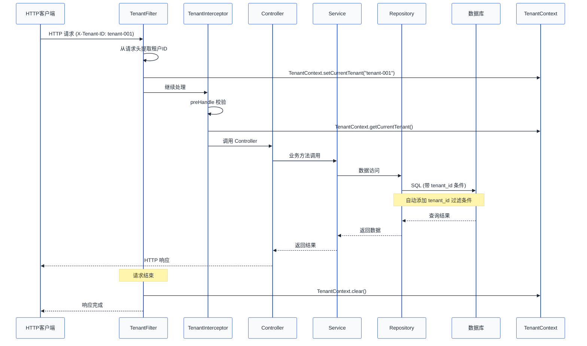

# 第06章 租户上下文管理

## 概述

在多租户系统中，租户上下文（Tenant Context）是贯穿整个请求链路的核心概念。它负责在请求的生命周期内维护当前访问的租户信息，使得无论在哪个层次、哪个组件中，都能获取到正确的租户标识。

本章将详细介绍如何设计租户上下文核心类、管理请求生命周期、实现异步任务支持，以及如何在测试中正确处理租户上下文。

---

## 6.1 TenantContext 核心类设计

### 6.1.1 为什么需要租户上下文

在多租户系统中，每一个请求都携带了租户标识（如租户ID）。这个标识需要在整个请求处理链路中传递：

```
请求 → Filter → Interceptor → Controller → Service → Repository
```

如果每个层级都手动传递租户ID，代码会变得混乱且容易出错。租户上下文通过 ThreadLocal 机制，让任何需要获取租户ID的地方都能直接访问。

### 6.1.2 核心实现

```java
package com.saas.tenant.context;

import org.springframework.stereotype.Component;

/**
 * 租户上下文 - 核心组件
 *
 * 使用 ThreadLocal 存储当前线程的租户信息
 * 确保每个线程（每个请求）都有独立的租户标识
 */
@Component
public class TenantContext {

    private static final ThreadLocal<String> CURRENT_TENANT = new ThreadLocal<>();

    /**
     * 设置当前租户ID
     *
     * @param tenantId 租户标识
     */
    public static void setCurrentTenant(String tenantId) {
        CURRENT_TENANT.set(tenantId);
    }

    /**
     * 获取当前租户ID
     *
     * @return 当前租户标识，如果未设置返回 null
     */
    public static String getCurrentTenant() {
        return CURRENT_TENANT.get();
    }

    /**
     * 清除租户上下文
     *
     * 重要：在请求结束时必须调用，防止内存泄漏
     */
    public static void clear() {
        CURRENT_TENANT.remove();
    }

    /**
     * 检查是否已设置租户上下文
     *
     * @return true 如果已设置租户上下文
     */
    public static boolean hasTenant() {
        return CURRENT_TENANT.get() != null;
    }

    /**
     * 安全获取租户ID，如果未设置则抛出异常
     *
     * @return 租户ID
     * @throws IllegalStateException 如果租户上下文未设置
     */
    public static String requireTenantId() {
        String tenantId = CURRENT_TENANT.get();
        if (tenantId == null) {
            throw new IllegalStateException("租户上下文未设置，请检查请求是否经过了租户拦截器");
        }
        return tenantId;
    }
}
```

### 6.1.3 设计要点解析

**ThreadLocal 的作用**

ThreadLocal 为每个线程提供了独立的变量副本。在 Web 应用中，每个请求由不同的线程处理，因此 ThreadLocal 完美契合了请求级别的租户隔离需求。

```
Thread-1: TenantContext.getCurrentTenant() → "tenant-001"
Thread-2: TenantContext.getCurrentTenant() → "tenant-002"
Thread-3: TenantContext.getCurrentTenant() → null
```

**内存泄漏风险**

ThreadLocal 使用不当会导致内存泄漏。当线程被回收但 ThreadLocal 的 Entry 对象仍持有对线程的引用时，会造成内存无法释放。因此必须在请求结束时调用 `clear()` 方法。

---

## 6.2 请求生命周期管理

### 6.2.1 生命周期概览

```
┌─────────────────────────────────────────────────────────────────┐
│                        HTTP 请求                                │
└─────────────────────────────────────────────────────────────────┘
                                │
                                ▼
┌─────────────────────────────────────────────────────────────────┐
│                      TenantFilter                               │
│                   (设置租户上下文)                                │
│                                                                │
│   1. 从请求头/参数获取租户ID                                      │
│   2. 调用 TenantContext.setCurrentTenant(tenantId)              │
└─────────────────────────────────────────────────────────────────┘
                                │
                                ▼
┌─────────────────────────────────────────────────────────────────┐
│                    TenantInterceptor                            │
│                 (二次校验与增强)                                  │
│                                                                │
│   1. 验证租户ID 有效性                                           │
│   2. 记录日志                                                    │
│   3. 设置其他租户相关信息                                         │
└─────────────────────────────────────────────────────────────────┘
                                │
                                ▼
┌─────────────────────────────────────────────────────────────────┐
│              Controller / Service / Repository                  │
│                  (业务逻辑处理)                                   │
│                                                                │
│   通过 TenantContext.getCurrentTenant() 获取租户信息              │
└─────────────────────────────────────────────────────────────────┘
                                │
                                ▼
┌─────────────────────────────────────────────────────────────────┐
│                      TenantFilter                               │
│                   (清理租户上下文)                                │
│                                                                │
│   调用 TenantContext.clear() 防止内存泄漏                        │
└─────────────────────────────────────────────────────────────────┘
                                │
                                ▼
┌─────────────────────────────────────────────────────────────────┐
│                        HTTP 响应                                 │
└─────────────────────────────────────────────────────────────────┘
```

### 6.2.2 TenantFilter 实现

Filter 是请求处理的最早入口，适合在这里设置租户上下文。

```java
package com.saas.tenant.filter;

import com.saas.tenant.context.TenantContext;
import jakarta.servlet.*;
import jakarta.servlet.annotation.WebFilter;
import jakarta.servlet.http.HttpServletRequest;
import org.slf4j.Logger;
import org.slf4j.LoggerFactory;
import org.springframework.core.annotation.Order;
import org.springframework.stereotype.Component;

import java.io.IOException;

/**
 * 租户上下文 Filter
 *
 * 在请求开始时设置租户上下文，在请求结束时清理
 * Order(1) 确保该 Filter 在其他 Filter 之前执行
 */
@Component
@WebFilter(urlPatterns = "/api/*")
@Order(1)
public class TenantFilter implements Filter {

    private static final Logger log = LoggerFactory.getLogger(TenantFilter.class);

    private static final String TENANT_HEADER = "X-Tenant-ID";
    private static final String DEFAULT_TENANT = "default";

    @Override
    public void doFilter(ServletRequest request, ServletResponse response, FilterChain chain)
            throws IOException, ServletException {

        HttpServletRequest httpRequest = (HttpServletRequest) request;
        String tenantId = extractTenantId(httpRequest);

        try {
            // 设置租户上下文
            TenantContext.setCurrentTenant(tenantId);
            log.debug("设置租户上下文: {}", tenantId);

            // 继续执行后续过滤器
            chain.doFilter(request, response);

        } finally {
            // 确保在请求结束时清理上下文
            TenantContext.clear();
            log.debug("清理租户上下文");
        }
    }

    /**
     * 从请求中提取租户ID
     *
     * 优先级：请求头 > 请求参数 > 默认值
     */
    private String extractTenantId(HttpServletRequest request) {
        // 1. 优先从请求头获取
        String tenantId = request.getHeader(TENANT_HEADER);
        if (tenantId != null && !tenantId.isBlank()) {
            return tenantId.trim();
        }

        // 2. 从请求参数获取
        tenantId = request.getParameter(TENANT_HEADER);
        if (tenantId != null && !tenantId.isBlank()) {
            return tenantId.trim();
        }

        // 3. 返回默认值（根据业务需求决定是否允许为空）
        return DEFAULT_TENANT;
    }
}
```

### 6.2.3 TenantInterceptor 实现

HandlerInterceptor 在 Spring MVC 层提供更细粒度的控制。

```java
package com.saas.tenant.interceptor;

import com.saas.tenant.context.TenantContext;
import jakarta.servlet.http.HttpServletRequest;
import jakarta.servlet.http.HttpServletResponse;
import org.slf4j.Logger;
import org.slf4j.LoggerFactory;
import org.springframework.lang.NonNull;
import org.springframework.stereotype.Component;
import org.springframework.web.servlet.HandlerInterceptor;

/**
 * 租户拦截器
 *
 * 在 Controller 处理之前进行租户验证和日志记录
 */
@Component
public class TenantInterceptor implements HandlerInterceptor {

    private static final Logger log = LoggerFactory.getLogger(TenantInterceptor.class);

    @Override
    public boolean preHandle(@NonNull HttpServletRequest request,
                            @NonNull HttpServletResponse response,
                            @NonNull Object handler) {

        String tenantId = TenantContext.getCurrentTenant();

        // 记录请求日志
        log.info("收到请求: {} {}, 租户: {}, URI: {}",
                request.getMethod(),
                request.getRequestURI(),
                tenantId,
                request.getQueryString());

        // 校验租户ID格式（根据业务需求）
        if (tenantId != null && !isValidTenantId(tenantId)) {
            log.warn("无效的租户ID格式: {}", tenantId);
            response.setStatus(HttpServletResponse.SC_BAD_REQUEST);
            return false;
        }

        return true;
    }

    @Override
    public void afterCompletion(@NonNull HttpServletRequest request,
                               @NonNull HttpServletResponse response,
                               @NonNull Object handler,
                               Exception ex) {

        if (ex != null) {
            log.error("请求处理异常: {} {}, 租户: {}",
                    request.getMethod(),
                    request.getRequestURI(),
                    TenantContext.getCurrentTenant(),
                    ex);
        }
    }

    /**
     * 校验租户ID格式
     */
    private boolean isValidTenantId(String tenantId) {
        // 租户ID应为字母、数字、下划线，长度 1-64
        return tenantId.matches("^[a-zA-Z0-9_]{1,64}$");
    }
}
```

### 6.2.4 Spring 配置

通过 `WebMvcConfigurer` 注册拦截器。

```java
package com.saas.tenant.config;

import com.saas.tenant.interceptor.TenantInterceptor;
import org.springframework.beans.factory.annotation.Autowired;
import org.springframework.context.annotation.Configuration;
import org.springframework.web.servlet.config.annotation.InterceptorRegistry;
import org.springframework.web.servlet.config.annotation.WebMvcConfigurer;

/**
 * 租户拦截器配置
 */
@Configuration
public class TenantInterceptorConfig implements WebMvcConfigurer {

    @Autowired
    private TenantInterceptor tenantInterceptor;

    @Override
    public void addInterceptors(InterceptorRegistry registry) {
        registry.addInterceptor(tenantInterceptor)
                .addPathPatterns("/api/**")           // 拦截 /api/** 路径
                .excludePathPatterns("/api/public/**") // 排除公开接口
                .excludePathPatterns("/api/health/**") // 排除健康检查
                .excludePathPatterns("/error");         // 排除错误页面
    }
}
```

---

## 6.3 异步任务支持

### 6.3.1 @Async 的坑

使用 `@Async` 注解的异步方法会在新的线程池线程中执行，这会导致 ThreadLocal 上下文丢失。

```java
@Service
public class AsyncOrderService {

    // 错误示例：这样获取到的 tenantId 是 null
    @Async
    public void processOrderAsync(Long orderId) {
        String tenantId = TenantContext.getCurrentTenant(); // null!
        // 业务逻辑...
    }
}
```

### 6.3.2 使用 TransmittableThreadLocal

Alibaba 的 `TransmittableThreadLocal` 可以在线程间传递上下文。

**引入依赖：**

```xml
<dependency>
    <groupId>com.alibaba</groupId>
    <artifactId>transmittable-thread-local</artifactId>
    <version>2.14.2</version>
</dependency>
```

**增强 TenantContext：**

```java
package com.saas.tenant.context;

import com.alibaba.ttl.TtlCallable;
import com.alibaba.ttl.TtlRunnable;
import org.springframework.stereotype.Component;

import java.util.concurrent.Callable;
import java.util.concurrent.ExecutorService;

/**
 * 租户上下文 - 支持异步传递
 */
@Component
public class TenantContext implements org.springframework.web.context.request.TenantContext {

    // 使用 TransmittableThreadLocal 替代 ThreadLocal
    private static final com.alibaba.ttl.TransmittableThreadLocal<String> CURRENT_TENANT =
            new com.alibaba.ttl.TransmittableThreadLocal<>();

    public static void setCurrentTenant(String tenantId) {
        CURRENT_TENANT.set(tenantId);
    }

    public static String getCurrentTenant() {
        return CURRENT_TENANT.get();
    }

    public static void clear() {
        CURRENT_TENANT.remove();
    }

    public static boolean hasTenant() {
        return CURRENT_TENANT.get() != null;
    }

    public static String requireTenantId() {
        String tenantId = CURRENT_TENANT.get();
        if (tenantId == null) {
            throw new IllegalStateException("租户上下文未设置");
        }
        return tenantId;
    }

    /**
     * 包装 Runnable，使其在执行时自动传递租户上下文
     */
    public static Runnable wrap(Runnable runnable) {
        return TtlRunnable.get(runnable);
    }

    /**
     * 包装 Callable，使其在执行时自动传递租户上下文
     */
    public static <T> Callable<T> wrap(Callable<T> callable) {
        return TtlCallable.get(callable);
    }
}
```

### 6.3.3 TaskDecorator 实现

通过自定义 TaskDecorator 在异步任务执行时自动传递租户上下文。

```java
package com.saas.tenant.config;

import com.saas.tenant.context.TenantContext;
import org.springframework.context.annotation.Bean;
import org.springframework.context.annotation.Configuration;
import org.springframework.scheduling.annotation.EnableAsync;
import org.springframework.scheduling.concurrent.ThreadPoolTaskExecutor;

import java.util.concurrent.Executor;

/**
 * 异步任务配置
 */
@Configuration
@EnableAsync
public class AsyncConfig {

    @Bean(name = "taskExecutor")
    public Executor taskExecutor() {
        ThreadPoolTaskExecutor executor = new ThreadPoolTaskExecutor();
        executor.setCorePoolSize(10);
        executor.setMaxPoolSize(50);
        executor.setQueueCapacity(100);
        executor.setThreadNamePrefix("async-");

        // 设置 TaskDecorator 传递租户上下文
        executor.setTaskDecorator(task -> {
            String tenantId = TenantContext.getCurrentTenant();
            return () -> {
                try {
                    TenantContext.setCurrentTenant(tenantId);
                    task.run();
                } finally {
                    TenantContext.clear();
                }
            };
        });

        executor.initialize();
        return executor;
    }
}
```

### 6.3.4 异步使用示例

```java
@Service
public class OrderService {

    @Async("taskExecutor")
    public void processOrderAsync(Long orderId) {
        // 现在可以正确获取租户ID了
        String tenantId = TenantContext.getCurrentTenant();
        log.info("异步处理订单: {}, 租户: {}", orderId, tenantId);
        // 业务逻辑...
    }

    // 手动传递上下文的方式
    public void executeWithTenant(Runnable task) {
        String tenantId = TenantContext.getCurrentTenant();
        CompletableFuture.runAsync(() -> {
            try {
                TenantContext.setCurrentTenant(tenantId);
                task.run();
            } finally {
                TenantContext.clear();
            }
        });
    }
}
```

---

## 6.4 单元测试中的租户上下文

### 6.4.1 Mockito 模拟 TenantContext

```java
package com.saas.tenant.service;

import com.saas.tenant.context.TenantContext;
import org.junit.jupiter.api.AfterEach;
import org.junit.jupiter.api.BeforeEach;
import org.junit.jupiter.api.Test;
import org.junit.jupiter.api.extension.ExtendWith;
import org.mockito.InjectMocks;
import org.mockito.Mock;
import org.mockito.MockedStatic;
import org.mockito.junit.jupiter.MockitoExtension;

import static org.junit.jupiter.api.Assertions.*;
import static org.mockito.Mockito.*;

@ExtendWith(MockitoExtension.class)
class OrderServiceTest {

    @InjectMocks
    private OrderService orderService;

    private MockedStatic<TenantContext> mockedTenantContext;

    @BeforeEach
    void setUp() {
        mockedTenantContext = mockStatic(TenantContext.class);
    }

    @AfterEach
    void tearDown() {
        mockedTenantContext.close();
    }

    @Test
    void createOrder_shouldIncludeTenantId() {
        // Given
        String expectedTenantId = "tenant-001";
        mockedTenantContext.when(TenantContext::getCurrentTenant)
                .thenReturn(expectedTenantId);

        // When
        Order order = orderService.createOrder(new OrderDTO());

        // Then
        assertEquals(expectedTenantId, order.getTenantId());
        mockedTenantContext.verify(TenantContext::getCurrentTenant, times(1));
    }

    @Test
    void createOrder_withoutTenant_shouldThrowException() {
        // Given
        mockedTenantContext.when(TenantContext::getCurrentTenant)
                .thenReturn(null);

        // When & Then
        assertThrows(IllegalStateException.class, () -> orderService.createOrder(new OrderDTO()));
    }
}
```

### 6.4.2 Spring Test 测试

使用 `@WithMockUser` 或自定义 SecurityContext 的方式测试。

```java
package com.saas.tenant.service;

import com.saas.tenant.context.TenantContext;
import org.junit.jupiter.api.Test;
import org.springframework.beans.factory.annotation.Autowired;
import org.springframework.boot.test.context.SpringBootTest;
import org.springframework.test.context.TestPropertySource;
import org.springframework.transaction.annotation.Transactional;

import static org.junit.jupiter.api.Assertions.*;

@SpringBootTest
@Transactional
@TestPropertySource(properties = {
    "spring.datasource.url=jdbc:h2:mem:testdb",
    "spring.datasource.driver-class-name=org.h2.Driver"
})
class TenantContextIntegrationTest {

    @Autowired
    private OrderService orderService;

    @Autowired
    private TenantContextHolder tenantContextHolder;

    @Test
    void testTenantContextPropagation() {
        // 在主线程设置租户上下文
        TenantContext.setCurrentTenant("tenant-001");

        try {
            // 验证可以获取到租户ID
            assertEquals("tenant-001", TenantContext.getCurrentTenant());

            // 调用服务层方法
            Order order = orderService.createOrder(new OrderDTO("item-001", 1));
            assertEquals("tenant-001", order.getTenantId());

        } finally {
            TenantContext.clear();
        }
    }

    @Test
    void testMultipleTenantsIsolation() throws InterruptedException {
        // 模拟多线程场景
        Thread thread1 = new Thread(() -> {
            TenantContext.setCurrentTenant("tenant-001");
            try {
                assertEquals("tenant-001", TenantContext.getCurrentTenant());
            } finally {
                TenantContext.clear();
            }
        });

        Thread thread2 = new Thread(() -> {
            TenantContext.setCurrentTenant("tenant-002");
            try {
                assertEquals("tenant-002", TenantContext.getCurrentTenant());
            } finally {
                TenantContext.clear();
            }
        });

        thread1.start();
        thread2.start();
        thread1.join();
        thread2.join();
    }
}

/**
 * 用于测试的租户上下文持有器
 */
@Component
class TenantContextHolder {
    public String getCurrentTenant() {
        return TenantContext.getCurrentTenant();
    }
}
```

### 6.4.3 使用 @Tenant 注解简化测试

```java
@Target({ElementType.METHOD, ElementType.TYPE})
@Retention(RetentionPolicy.RUNTIME)
public @interface Tenant {
    String value();
}

// 测试基类
@SpringBootTest
public abstract class BaseTenantTest {

    @Tenant("test-tenant-001")
    @Test
    void testWithTenant() {
        assertEquals("test-tenant-001", TenantContext.getCurrentTenant());
    }
}
```

---

## 6.5 完整请求生命周期流程图



---

## 6.6 章节总结

### 核心要点

1. **TenantContext 是线程级别的存储**：使用 ThreadLocal 确保每个请求线程都有独立的租户标识。

2. **请求生命周期管理**：
   - `TenantFilter`：最早拦截，设置租户上下文
   - `TenantInterceptor`：Controller 层校验和日志
   - 请求结束时必须清理 `TenantContext.clear()`

3. **异步任务需要特殊处理**：
   - `@Async` 会丢失 ThreadLocal 上下文
   - 使用 `TransmittableThreadLocal` 或 `TaskDecorator` 传递上下文

4. **测试策略**：
   - 使用 `MockedStatic` 模拟静态方法
   - 注意测试后的清理工作

### 常见问题排查

| 问题现象 | 可能原因 | 解决方案 |
|---------|---------|---------|
| 租户ID为null | Filter未执行/顺序错误 | 检查Filter的@Order注解 |
| 异步任务中获取不到租户ID | 新线程没有上下文 | 使用TtlRunnable包装或TaskDecorator |
| 内存泄漏 | 请求结束后未清理ThreadLocal | 确保在finally块中调用clear() |
| 多租户数据串了 | 上下文被意外修改 | 检查ThreadLocal的读写是否有线程安全问题 |

### 下章预告

下一章我们将介绍 **租户数据隔离策略**，包括：
- 行级隔离（Shared Database, Shared Schema）
- 列级隔离
- 库级隔离
- 租户路由的实现

---

*版权所有 © SaaS学习笔记*
