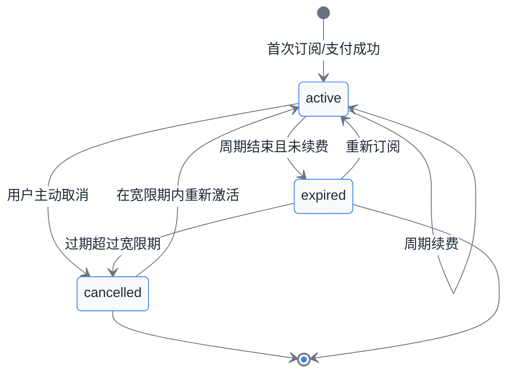
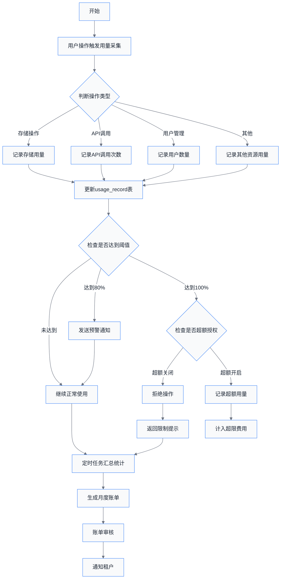
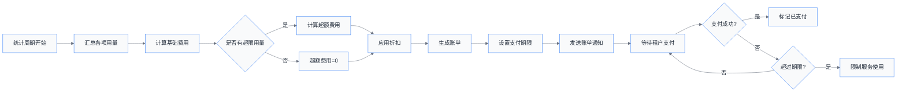

# 第09章 租户计费与订阅

## 概述

在 SaaS 多租户系统中，计费与订阅模块是实现商业化的核心组件。本章将详细介绍如何设计一个灵活、可扩展的订阅计费系统，支持多种订阅套餐、用量计费和账单管理。

## 1. 订阅模型设计

### 1.1 订阅套餐体系

一个成熟的 SaaS 系统通常需要提供多个订阅套餐，以满足不同规模用户的需求：

| 套餐名称 | 适用场景 | 典型定价 | 核心特征 |
|---------|---------|---------|---------|
| **免费版 (Free)** | 个人学习、小型项目 | 0元/月 | 基础功能，极低限制 |
| **基础版 (Basic)** | 小微团队、初创企业 | 99元/月 | 适度扩展，基础支持 |
| **专业版 (Professional)** | 成长期企业 | 399元/月 | 高级功能，优先支持 |
| **企业版 (Enterprise)** | 大型组织 | 999元/月起 | 无限扩展，专属支持 |

### 1.2 订阅周期

订阅周期决定了客户付费的频率，常见的订阅周期包括：

```java
public enum SubscriptionCycle {
    MONTHLY("月付", 1),      // 按月计费
    QUARTERLY("季付", 3),    // 按季度计费
    YEARLY("年付", 12);      // 按年计费，享受折扣

    private final String description;
    private final int months;

    SubscriptionCycle(String description, int months) {
        this.description = description;
        this.months = months;
    }
}
```

**年付优惠策略**：
- 月付：原价
- 年付：通常享受 8-9 折优惠
- 多年付：更大幅度折扣，绑定长期客户

### 1.3 订阅状态机

订阅状态管理是计费系统的核心，完整的状态流转如下：



**状态说明**：

| 状态 | 含义 | 可用功能 |
|-----|------|---------|
| `active` | 正常活跃 | 全部功能 |
| `expired` | 已过期 | 仅查看，无法使用核心功能 |
| `cancelled` | 已取消 | 无法使用，需重新订阅 |
| `pending` | 待生效 | 预约生效中 |
| `trial` | 试用中 | 试用功能，到期后自动转正式或终止 |

## 2. 数据库表设计

### 2.1 租户表 (已在第3章定义)

```sql
-- 租户基础信息表
CREATE TABLE tenant (
    id VARCHAR(36) PRIMARY KEY,
    name VARCHAR(100) NOT NULL,
    status VARCHAR(20) DEFAULT 'active',
    created_at TIMESTAMP DEFAULT CURRENT_TIMESTAMP,
    updated_at TIMESTAMP DEFAULT CURRENT_TIMESTAMP ON UPDATE CURRENT_TIMESTAMP
);
```

### 2.2 订阅表

```sql
CREATE TABLE subscription (
    id VARCHAR(36) PRIMARY KEY,
    tenant_id VARCHAR(36) NOT NULL,
    plan_type VARCHAR(50) NOT NULL COMMENT 'free, basic, professional, enterprise',
    status VARCHAR(20) DEFAULT 'active' COMMENT 'active, expired, cancelled, pending, trial',
    cycle VARCHAR(20) DEFAULT 'monthly' COMMENT 'monthly, yearly',
    start_date TIMESTAMP NOT NULL,
    end_date TIMESTAMP COMMENT 'NULL表示无限期',
    auto_renew BOOLEAN DEFAULT TRUE COMMENT '自动续费开关',
    created_at TIMESTAMP DEFAULT CURRENT_TIMESTAMP,
    updated_at TIMESTAMP DEFAULT CURRENT_TIMESTAMP ON UPDATE CURRENT_TIMESTAMP,

    INDEX idx_tenant_id (tenant_id),
    INDEX idx_status (status),
    INDEX idx_end_date (end_date),
    FOREIGN KEY (tenant_id) REFERENCES tenant(id) ON DELETE CASCADE
);
```

### 2.3 用量记录表

```sql
CREATE TABLE usage_record (
    id VARCHAR(36) PRIMARY KEY,
    tenant_id VARCHAR(36) NOT NULL,
    metric_type VARCHAR(50) NOT NULL COMMENT 'storage, api_calls, users, bandwidth',
    usage_value BIGINT DEFAULT 0 COMMENT '当前使用量',
    period_start TIMESTAMP NOT NULL COMMENT '统计周期开始',
    period_end TIMESTAMP NOT NULL COMMENT '统计周期结束',
    created_at TIMESTAMP DEFAULT CURRENT_TIMESTAMP,
    updated_at TIMESTAMP DEFAULT CURRENT_TIMESTAMP ON UPDATE CURRENT_TIMESTAMP,

    INDEX idx_tenant_metric (tenant_id, metric_type),
    INDEX idx_period (period_start, period_end),
    UNIQUE KEY uk_tenant_metric_period (tenant_id, metric_type, period_start),
    FOREIGN KEY (tenant_id) REFERENCES tenant(id) ON DELETE CASCADE
);
```

### 2.4 账单表

```sql
CREATE TABLE invoice (
    id VARCHAR(36) PRIMARY KEY,
    invoice_no VARCHAR(50) NOT NULL UNIQUE COMMENT '账单编号',
    tenant_id VARCHAR(36) NOT NULL,
    subscription_id VARCHAR(36) NOT NULL,
    billing_period_start TIMESTAMP NOT NULL COMMENT '计费周期开始',
    billing_period_end TIMESTAMP NOT NULL COMMENT '计费周期结束',
    plan_type VARCHAR(50) NOT NULL COMMENT '当时订阅的套餐',
    base_amount DECIMAL(10,2) NOT NULL COMMENT '基础金额',
    usage_amount DECIMAL(10,2) DEFAULT 0 COMMENT '用量超限费用',
    discount_amount DECIMAL(10,2) DEFAULT 0 COMMENT '折扣金额',
    total_amount DECIMAL(10,2) NOT NULL COMMENT '总金额',
    status VARCHAR(20) DEFAULT 'pending' COMMENT 'pending, paid, overdue, cancelled',
    due_date TIMESTAMP NOT NULL COMMENT '到期支付日期',
    paid_at TIMESTAMP COMMENT '实际支付时间',
    payment_method VARCHAR(20) COMMENT '支付方式',
    created_at TIMESTAMP DEFAULT CURRENT_TIMESTAMP,

    INDEX idx_tenant_id (tenant_id),
    INDEX idx_status (status),
    INDEX idx_due_date (due_date),
    FOREIGN KEY (tenant_id) REFERENCES tenant(id),
    FOREIGN KEY (subscription_id) REFERENCES subscription(id)
);
```

### 2.5 套餐限制配置表

```sql
CREATE TABLE plan_limits (
    id VARCHAR(36) PRIMARY KEY,
    plan_type VARCHAR(50) NOT NULL,
    resource_type VARCHAR(50) NOT NULL COMMENT 'storage, api_calls, users, projects',
    max_value BIGINT NOT NULL COMMENT '最大限制值，-1表示无限制',
    unit VARCHAR(20) COMMENT '单位：MB, GB, 次, 人',
    created_at TIMESTAMP DEFAULT CURRENT_TIMESTAMP,
    updated_at TIMESTAMP DEFAULT CURRENT_TIMESTAMP ON UPDATE CURRENT_TIMESTAMP,

    UNIQUE KEY uk_plan_resource (plan_type, resource_type)
);

-- 初始化套餐限制数据
INSERT INTO plan_limits (plan_type, resource_type, max_value, unit) VALUES
-- 免费版
('free', 'storage', 1024, 'MB'),           -- 1GB存储
('free', 'api_calls', 1000, '次/月'),       -- 1000次API调用
('free', 'users', 3, '人'),                 -- 最多3个用户
('free', 'projects', 5, '个'),              -- 最多5个项目
-- 基础版
('basic', 'storage', 10240, 'MB'),          -- 10GB存储
('basic', 'api_calls', 10000, '次/月'),     -- 10000次API调用
('basic', 'users', 10, '人'),               -- 最多10个用户
('basic', 'projects', 20, '个'),            -- 最多20个项目
-- 专业版
('professional', 'storage', 102400, 'MB'), -- 100GB存储
('professional', 'api_calls', 100000, '次/月'),
('professional', 'users', 50, '人'),
('professional', 'projects', 100, '个'),
-- 企业版
('enterprise', 'storage', -1, 'MB'),       -- 无限制
('enterprise', 'api_calls', -1, '次/月'),
('enterprise', 'users', -1, '人'),
('enterprise', 'projects', -1, '个');
```

## 3. 套餐限制与校验

### 3.1 核心校验服务

```java
@Service
@Slf4j
public class PlanEnforcerService {

    @Autowired
    private SubscriptionService subscriptionService;

    @Autowired
    private PlanLimitService planLimitService;

    @Autowired
    private UsageRecordService usageRecordService;

    /**
     * 检查租户是否超过套餐限制
     * @param tenantId 租户ID
     * @param resource 资源类型
     * @throws PlanLimitExceededException 当超过限制时抛出异常
     */
    public void checkLimit(String tenantId, String resource) {
        // 1. 获取租户当前有效的订阅
        Subscription sub = subscriptionService.getActiveSubscription(tenantId);
        if (sub == null) {
            throw new SubscriptionException("租户不存在有效订阅");
        }

        // 2. 获取套餐对应的资源限制
        PlanLimits limits = planLimitService.getPlanLimits(sub.getPlanType())
                .stream()
                .filter(l -> l.getResourceType().equals(resource))
                .findFirst()
                .orElse(null);

        if (limits == null) {
            log.warn("未找到套餐资源限制配置: plan={}, resource={}",
                    sub.getPlanType(), resource);
            return;
        }

        // 3. 无限制套餐直接放行
        if (limits.getMaxValue() == -1) {
            return;
        }

        // 4. 获取当前使用量
        long currentUsage = usageRecordService.getCurrentUsage(tenantId, resource);

        // 5. 校验是否超限
        if (currentUsage >= limits.getMaxValue()) {
            throw new PlanLimitExceededException(
                String.format("已达到套餐上限：当前使用 %d / 限制 %d %s",
                    currentUsage, limits.getMaxValue(), limits.getUnit())
            );
        }
    }

    /**
     * 预检查并返回可用额度
     */
    public UsageQuota checkQuota(String tenantId, String resource) {
        Subscription sub = subscriptionService.getActiveSubscription(tenantId);
        PlanLimits limits = planLimitService.getResourceLimit(sub.getPlanType(), resource);
        long currentUsage = usageRecordService.getCurrentUsage(tenantId, resource);

        long maxValue = limits.getMaxValue();
        long available = maxValue == -1 ? -1 : maxValue - currentUsage;

        return new UsageQuota(resource, currentUsage, maxValue, available, limits.getUnit());
    }
}
```

### 3.2 用量配额结果

```java
@Data
@Builder
public class UsageQuota {
    private String resource;
    private long used;
    private long max;
    private long available;
    private String unit;

    public boolean isUnlimited() {
        return max == -1;
    }

    public double getUsagePercent() {
        if (max == -1) return 0;
        return (double) used / max * 100;
    }

    public boolean isExceeded() {
        return !isUnlimited() && used >= max;
    }

    public boolean isNearLimit(double thresholdPercent) {
        if (isUnlimited()) return false;
        return getUsagePercent() >= thresholdPercent;
    }
}
```

### 3.3 用量拦截器

```java
@Component
public class UsageLimitInterceptor implements HandlerInterceptor {

    @Autowired
    private PlanEnforcerService planEnforcerService;

    @Override
    public boolean preHandle(HttpServletRequest request,
                            HttpServletResponse response,
                            Object handler) throws Exception {

        // 1. 获取租户上下文
        String tenantId = TenantContext.getCurrentTenant();
        if (tenantId == null) {
            return true; // 无租户上下文，跳过检查
        }

        // 2. 从请求路径提取资源类型
        String resource = extractResourceType(request.getRequestURI());
        if (resource == null) {
            return true;
        }

        // 3. 执行限制检查
        try {
            planEnforcerService.checkLimit(tenantId, resource);
            return true;
        } catch (PlanLimitExceededException e) {
            log.warn("租户 {} 资源 {} 超过限制", tenantId, resource);
            response.setStatus(HttpStatus.TOO_MANY_REQUESTS.value());
            response.setContentType("application/json;charset=UTF-8");
            response.getWriter().write(
                "{\"code\":429,\"message\":\"" + e.getMessage() + "\"}"
            );
            return false;
        }
    }

    private String extractResourceType(String uri) {
        if (uri.contains("/api/storage")) return "storage";
        if (uri.contains("/api/calls")) return "api_calls";
        if (uri.contains("/api/users")) return "users";
        return null;
    }
}
```

## 4. 用量计费流程

### 4.1 计费流程总览



### 4.2 用量采集服务

```java
@Service
public class UsageCollectorService {

    @Autowired
    private UsageRecordRepository usageRecordRepository;

    @Autowired
    private PlanEnforcerService planEnforcerService;

    @Autowired
    private NotificationService notificationService;

    /**
     * 记录资源使用量
     */
    @Transactional
    public void recordUsage(String tenantId, String metricType, long delta) {
        // 1. 获取或创建当月用量记录
        UsageRecord record = getOrCreateCurrentPeriodRecord(tenantId, metricType);

        // 2. 更新用量
        record.setUsageValue(record.getUsageValue() + delta);
        usageRecordRepository.save(record);

        // 3. 检查是否需要预警
        checkAndNotifyThreshold(tenantId, metricType, record.getUsageValue());
    }

    /**
     * 记录存储使用
     */
    @Transactional
    public void recordStorageUsage(String tenantId, long bytesUsed) {
        String metricType = "storage";
        UsageRecord record = getOrCreateCurrentPeriodRecord(tenantId, metricType);

        // 存储以字节为单位，转换为MB
        long mbUsed = bytesUsed / (1024 * 1024);
        record.setUsageValue(record.getUsageValue() + mbUsed);
        usageRecordRepository.save(record);

        checkAndNotifyThreshold(tenantId, metricType, record.getUsageValue());
    }

    /**
     * 记录API调用
     */
    public void recordApiCall(String tenantId) {
        recordUsage(tenantId, "api_calls", 1);
    }

    /**
     * 检查阈值并发送通知
     */
    private void checkAndNotifyThreshold(String tenantId, String metricType, long currentUsage) {
        UsageQuota quota = planEnforcerService.checkQuota(tenantId, metricType);

        if (quota.isUnlimited()) {
            return;
        }

        double usagePercent = quota.getUsagePercent();

        // 80% 预警
        if (usagePercent >= 80 && usagePercent < 100) {
            notificationService.sendQuotaWarning(tenantId, metricType,
                String.format("您的%s使用量已达 %d%%，请注意续费或升级套餐",
                    getMetricName(metricType), (int) usagePercent));
        }
        // 100% 超限
        else if (usagePercent >= 100) {
            notificationService.sendQuotaExceeded(tenantId, metricType,
                String.format("您的%s使用量已达上限，当前套餐功能受限"));
        }
    }
}
```

### 4.3 定时任务汇总

```java
@Component
public class UsageAggregationTask {

    @Autowired
    private UsageRecordRepository usageRecordRepository;

    @Autowired
    private SubscriptionService subscriptionService;

    @Autowired
    private InvoiceService invoiceService;

    /**
     * 每日凌晨执行用量汇总
     */
    @Scheduled(cron = "0 0 2 * * ?")
    public void dailyUsageAggregation() {
        log.info("开始执行每日用量汇总任务");

        List<Tenant> activeTenants = subscriptionService.getActiveTenants();

        for (Tenant tenant : activeTenants) {
            try {
                aggregateUsageForTenant(tenant.getId());
            } catch (Exception e) {
                log.error("汇总租户 {} 用量失败", tenant.getId(), e);
            }
        }

        log.info("每日用量汇总任务完成");
    }

    /**
     * 每月初生成上月账单
     */
    @Scheduled(cron = "0 0 3 1 * ?")
    public void generateMonthlyInvoices() {
        log.info("开始生成月度账单");

        LocalDate lastMonth = LocalDate.now().minusMonths(1);
        List<Tenant> activeTenants = subscriptionService.getActiveTenants();

        for (Tenant tenant : activeTenants) {
            try {
                invoiceService.generateInvoice(tenant.getId(),
                    lastMonth.withDayOfMonth(1),
                    lastMonth.withDayOfMonth(lastMonth.lengthOfMonth()));
            } catch (Exception e) {
                log.error("生成租户 {} 账单失败", tenant.getId(), e);
            }
        }

        log.info("月度账单生成完成");
    }
}
```

## 5. 计费周期与账单

### 5.1 账单生成流程



### 5.2 账单服务实现

```java
@Service
@Slf4j
public class InvoiceService {

    @Autowired
    private InvoiceRepository invoiceRepository;

    @Autowired
    private SubscriptionService subscriptionService;

    @Autowired
    private UsageRecordRepository usageRecordRepository;

    @Autowired
    private PlanLimitService planLimitService;

    @Autowired
    private PricingService pricingService;

    /**
     * 生成月度账单
     */
    @Transactional
    public Invoice generateInvoice(String tenantId,
                                   LocalDate periodStart,
                                   LocalDate periodEnd) {
        // 1. 获取租户订阅信息
        Subscription subscription = subscriptionService.getActiveSubscription(tenantId);

        // 2. 获取周期内用量汇总
        List<UsageRecord> usageRecords = usageRecordRepository
                .findByTenantIdAndPeriod(tenantId, periodStart, periodEnd);

        // 3. 计算基础费用
        Money baseAmount = pricingService.calculateBasePrice(
                subscription.getPlanType(),
                subscription.getCycle()
        );

        // 4. 计算超额费用
        Money usageAmount = calculateOverageCharges(
                tenantId,
                subscription.getPlanType(),
                usageRecords
        );

        // 5. 计算折扣
        Money discountAmount = calculateDiscount(subscription, baseAmount);

        // 6. 计算总金额
        Money totalAmount = baseAmount.plus(usageAmount).minus(discountAmount);

        // 7. 创建账单
        Invoice invoice = Invoice.builder()
                .id(UUID.randomUUID().toString())
                .invoiceNo(generateInvoiceNo())
                .tenantId(tenantId)
                .subscriptionId(subscription.getId())
                .billingPeriodStart(periodStart.atStartOfDay())
                .billingPeriodEnd(periodEnd.atTime(23, 59, 59))
                .planType(subscription.getPlanType())
                .baseAmount(baseAmount.getAmount())
                .usageAmount(usageAmount.getAmount())
                .discountAmount(discountAmount.getAmount())
                .totalAmount(totalAmount.getAmount())
                .status("pending")
                .dueDate(LocalDateTime.now().plusDays(15))
                .build();

        return invoiceRepository.save(invoice);
    }

    /**
     * 计算超额费用
     */
    private Money calculateOverageCharges(String tenantId,
                                            String planType,
                                            List<UsageRecord> usageRecords) {
        PlanLimits limits = planLimitService.getPlanLimits(planType);
        Money overageTotal = Money.zero(CurrencyUnit.of("CNY"));

        for (UsageRecord record : usageRecords) {
            PlanLimits limit = limits.stream()
                    .filter(l -> l.getResourceType().equals(record.getMetricType()))
                    .findFirst()
                    .orElse(null);

            if (limit == null || limit.getMaxValue() == -1) {
                continue; // 无限制资源不收费
            }

            if (record.getUsageValue() > limit.getMaxValue()) {
                long overage = record.getUsageValue() - limit.getMaxValue();
                Money rate = pricingService.getOverageRate(planType, record.getMetricType());
                Money overageCharge = rate.multiply(overage);
                overageTotal = overageTotal.plus(overageCharge);
            }
        }

        return overageTotal;
    }

    /**
     * 获取账单详情
     */
    public InvoiceDetail getInvoiceDetail(String invoiceId) {
        Invoice invoice = invoiceRepository.findById(invoiceId)
                .orElseThrow(() -> new InvoiceNotFoundException("账单不存在"));

        List<UsageRecord> usageRecords = usageRecordRepository
                .findByTenantIdAndPeriod(invoice.getTenantId(),
                        invoice.getBillingPeriodStart().toLocalDate(),
                        invoice.getBillingPeriodEnd().toLocalDate());

        return InvoiceDetail.builder()
                .invoice(invoice)
                .usageRecords(usageRecords)
                .planLimits(planLimitService.getPlanLimits(invoice.getPlanType()))
                .build();
    }
}
```

### 5.3 账单查询接口

```java
@RestController
@RequestMapping("/api/invoices")
@Slf4j
public class InvoiceController {

    @Autowired
    private InvoiceService invoiceService;

    /**
     * 获取租户的所有账单
     */
    @GetMapping
    public Result<Page<Invoice>> getInvoices(
            @RequestHeader("X-Tenant-Id") String tenantId,
            @RequestParam(defaultValue = "0") int page,
            @RequestParam(defaultValue = "10") int size) {

        Page<Invoice> invoices = invoiceService.getTenantInvoices(tenantId, page, size);
        return Result.success(invoices);
    }

    /**
     * 获取账单详情
     */
    @GetMapping("/{invoiceId}")
    public Result<InvoiceDetail> getInvoiceDetail(
            @RequestHeader("X-Tenant-Id") String tenantId,
            @PathVariable String invoiceId) {

        InvoiceDetail detail = invoiceService.getInvoiceDetail(invoiceId);

        // 校验账单属于当前租户
        if (!detail.getInvoice().getTenantId().equals(tenantId)) {
            throw new AccessDeniedException("无权访问此账单");
        }

        return Result.success(detail);
    }

    /**
     * 获取当前账期用量汇总
     */
    @GetMapping("/current-usage")
    public Result<UsageSummary> getCurrentUsage(
            @RequestHeader("X-Tenant-Id") String tenantId) {

        UsageSummary summary = invoiceService.getCurrentUsageSummary(tenantId);
        return Result.success(summary);
    }
}
```

## 6. 订阅管理接口

### 6.1 订阅服务

```java
@Service
@Transactional
public class SubscriptionService {

    @Autowired
    private SubscriptionRepository subscriptionRepository;

    @Autowired
    private TenantService tenantService;

    @Autowired
    private NotificationService notificationService;

    /**
     * 创建新订阅
     */
    public Subscription createSubscription(String tenantId, String planType, String cycle) {
        // 1. 检查租户是否已有活跃订阅
        Subscription existing = getActiveSubscription(tenantId);
        if (existing != null) {
            throw new SubscriptionException("租户已有活跃订阅，请先取消现有订阅");
        }

        // 2. 创建新订阅
        LocalDateTime now = LocalDateTime.now();
        LocalDateTime endDate = calculateEndDate(now, cycle);

        Subscription subscription = Subscription.builder()
                .id(UUID.randomUUID().toString())
                .tenantId(tenantId)
                .planType(planType)
                .cycle(cycle)
                .status("active")
                .startDate(now)
                .endDate(endDate)
                .autoRenew(true)
                .build();

        subscription = subscriptionRepository.save(subscription);

        // 3. 更新租户套餐信息
        tenantService.updatePlanType(tenantId, planType);

        // 4. 发送订阅成功通知
        notificationService.sendSubscriptionCreated(tenantId, planType);

        log.info("租户 {} 成功创建订阅: plan={}, cycle={}", tenantId, planType, cycle);
        return subscription;
    }

    /**
     * 取消订阅
     */
    public void cancelSubscription(String tenantId, boolean immediate) {
        Subscription subscription = getActiveSubscription(tenantId);
        if (subscription == null) {
            throw new SubscriptionException("租户没有活跃订阅");
        }

        if (immediate) {
            // 立即取消
            subscription.setStatus("cancelled");
        } else {
            // 取消自动续费，到期后失效
            subscription.setAutoRenew(false);
        }

        subscriptionRepository.save(subscription);

        log.info("租户 {} 订阅已取消: immediate={}", tenantId, immediate);
    }

    /**
     * 升级/降级套餐
     */
    public Subscription changePlan(String tenantId, String newPlanType) {
        Subscription subscription = getActiveSubscription(tenantId);
        if (subscription == null) {
            throw new SubscriptionException("租户没有活跃订阅");
        }

        String oldPlanType = subscription.getPlanType();
        subscription.setPlanType(newPlanType);
        subscriptionRepository.save(subscription);

        // 更新租户套餐
        tenantService.updatePlanType(tenantId, newPlanType);

        log.info("租户 {} 套餐变更: {} -> {}", tenantId, oldPlanType, newPlanType);
        return subscription;
    }

    /**
     * 获取当前有效订阅
     */
    public Subscription getActiveSubscription(String tenantId) {
        return subscriptionRepository
                .findByTenantIdAndStatus(tenantId, "active")
                .stream()
                .findFirst()
                .orElse(null);
    }

    /**
     * 计算订阅结束日期
     */
    private LocalDateTime calculateEndDate(LocalDateTime startDate, String cycle) {
        return switch (cycle) {
            case "monthly" -> startDate.plusMonths(1);
            case "yearly" -> startDate.plusYears(1);
            default -> throw new IllegalArgumentException("不支持的订阅周期: " + cycle);
        };
    }
}
```

### 6.2 订阅控制器

```java
@RestController
@RequestMapping("/api/subscriptions")
public class SubscriptionController {

    @Autowired
    private SubscriptionService subscriptionService;

    @Autowired
    private PlanEnforcerService planEnforcerService;

    /**
     * 获取当前订阅信息
     */
    @GetMapping("/current")
    public Result<SubscriptionVO> getCurrentSubscription(
            @RequestHeader("X-Tenant-Id") String tenantId) {

        Subscription subscription = subscriptionService.getActiveSubscription(tenantId);
        if (subscription == null) {
            return Result.success(null);
        }

        SubscriptionVO vo = toVO(subscription);
        // 附加配额信息
        vo.setQuotas(planEnforcerService.getAllQuotas(tenantId));

        return Result.success(vo);
    }

    /**
     * 创建订阅
     */
    @PostMapping
    public Result<Subscription> createSubscription(
            @RequestHeader("X-Tenant-Id") String tenantId,
            @RequestBody CreateSubscriptionRequest request) {

        Subscription subscription = subscriptionService.createSubscription(
                tenantId,
                request.getPlanType(),
                request.getCycle()
        );

        return Result.success(subscription);
    }

    /**
     * 变更套餐
     */
    @PutMapping("/plan")
    public Result<Subscription> changePlan(
            @RequestHeader("X-Tenant-Id") String tenantId,
            @RequestParam String planType) {

        Subscription subscription = subscriptionService.changePlan(tenantId, planType);
        return Result.success(subscription);
    }

    /**
     * 取消订阅
     */
    @DeleteMapping
    public Result<Void> cancelSubscription(
            @RequestHeader("X-Tenant-Id") String tenantId,
            @RequestParam(defaultValue = "false") boolean immediate) {

        subscriptionService.cancelSubscription(tenantId, immediate);
        return Result.success(null);
    }
}
```

## 7. 章节总结

本章介绍了多租户 SaaS 系统计费与订阅模块的核心设计：

### 7.1 核心要点

| 模块 | 关键设计 |
|-----|---------|
| **订阅套餐** | 支持 free/basic/professional/enterprise 多级别，周期分月付/年付 |
| **状态管理** | 完整的状态机：active → expired/cancelled，支持自动续费 |
| **用量追踪** | 实时记录存储、API调用、用户数等指标 |
| **限制校验** | 每次操作前检查配额，支持阈值预警 |
| **账单管理** | 自动生成月度账单，支持超额计费 |

### 7.2 关键技术点

1. **多租户隔离**：所有用量和账单数据通过 `tenant_id` 严格隔离
2. **事件驱动**：用量变化触发预警通知，提升用户体验
3. **定时任务**：自动化汇总统计和账单生成，减少人工干预
4. **灵活计费**：基础费用 + 超额费用的组合计费模式

### 7.3 后续扩展

在实际生产环境中，还可以进一步扩展以下功能：

- 集成第三方支付（支付宝、微信、Stripe）
- 支持退款和账单争议处理
- 添加套餐试用功能
- 实现信用额度和欠费管理
- 支持预付费和后付费混合模式

---

**相关章节**：
- [第3章 多租户架构](./第03章%20多租户架构.md) - 租户基础数据模型
- [第6章 模型集成](./第06章%20模型集成.md) - AI API调用计费
- [第16章 Spring Boot 集成](./第16章%20SpringBoot集成.md) - 支付模块整合
