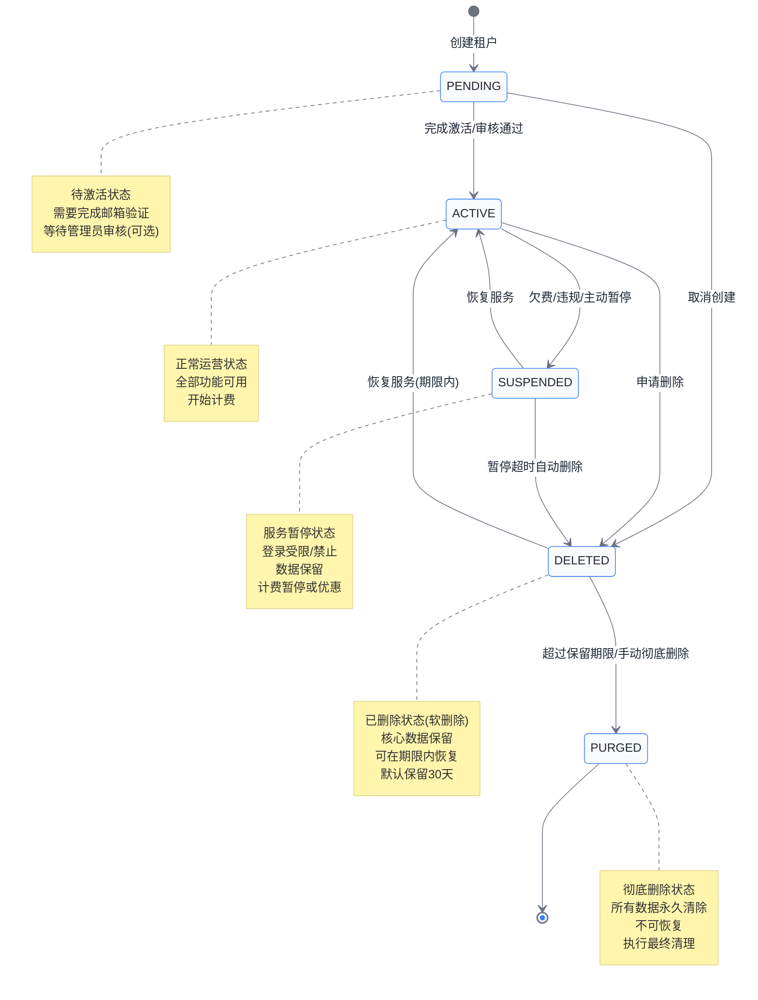

# 第10章 租户生命周期管理

## 10.1 概述

在 SaaS 多租户系统中，租户生命周期管理是核心功能之一。从租户的创建到最终的删除，每个阶段都需要精心设计和严格把控。本章将详细讲解租户从创建到删除的完整生命周期，帮助读者掌握多租户系统中租户状态管理的精髓。

租户生命周期管理不仅仅是简单地创建和删除记录，它涉及到状态流转、数据隔离、资源分配、业务连续性等多个维度的考量。一个完善的生命周期管理体系能够保障系统的稳定性、数据的安全性，同时为租户提供良好的使用体验。

本章，我们将深入探讨租户生命周期的各个阶段，剖析每个状态转换的时机、影响以及技术实现方案。通过大量的代码示例和流程图，帮助读者建立起完整的知识体系。

## 10.2 租户生命周期阶段

租户生命周期包含六个核心阶段，每个阶段都有其特定的业务含义和技术实现要求。下面我们逐一介绍：

### 10.2.1 创建（Create）

创建阶段是租户进入系统的起点。在这个阶段，系统为新租户分配唯一标识、初始化基础数据、创建独立的存储空间（针对独立数据库模式）。创建阶段完成后，租户处于"待激活"（PENDING）状态，需要通过邮箱验证等方式完成激活流程。

在创建阶段，系统会进行租户名称唯一性校验，确保不会出现重复的租户标识。同时，系统会为新租户分配默认的配置参数，创建初始的管理员账号，并发送激活邮件到管理员邮箱。

### 10.2.2 激活（Activate）

激活阶段是租户正式启用的标志。完成激活后，租户可以正常登录系统、使用各项功能。激活流程通常包括邮箱验证、手机验证、企业信息完善等步骤，具体要求取决于业务需求和安全策略。

激活阶段的完成意味着租户与平台之间建立了正式的服务关系，计费周期从此开始计算。对于需要审核的 B2B 类型业务，激活可能还需要管理员人工审批通过。

### 10.2.3 暂停（Suspend）

暂停阶段是租户服务的临时中止状态。在这种状态下，租户无法登录系统、无法使用任何功能，但所有数据都会被完整保留。暂停通常发生在租户欠费、违规操作或主动申请暂停服务等场景。

暂停期间，系统会停止计费（或者按优惠价格计费），并释放部分占用资源（如暂停非核心的后台任务）。但核心业务数据、用户数据、配置数据都会保持不变，一旦恢复即可正常使用。

### 10.2.4 恢复（Reactivate）

恢复阶段是暂停状态的逆向操作。当暂停原因被消除（如完成缴费、违规处理完毕）后，租户可以申请恢复服务。恢复后，租户的所有权限和功能都会恢复正常，计费也会重新开始。

恢复流程通常需要验证暂停原因是否已经消除。例如，对于欠费导致的暂停，需要确认账户余额充足或已完成付款；对于违规导致的暂停，需要确认违规内容已处理或申诉已通过。

### 10.2.5 删除（Delete）

删除阶段是租户数据开始清理的起点。此时采用的是软删除策略，租户记录和核心数据仍然保留在数据库中，但租户无法再登录和使用系统。删除操作通常需要经过严格的审批流程，以防止误操作或恶意删除。

删除阶段保留了数据恢复的可能性。如果租户在一定期限内（如 30 天）改变主意，可以申请恢复服务。超过期限后，系统会执行彻底删除操作，此时数据将无法恢复。

### 10.2.6 彻底删除（Purge）

彻底删除是租户生命周期的终点。在此阶段，系统会永久删除租户的所有数据，包括业务数据、文件、配置信息等。执行彻底删除后，数据将无法恢复，因此这个操作通常需要多次确认。

彻底删除前，系统会自动进行数据备份（如果配置了备份策略），并将备份数据保留一定时间后才真正删除。某些受监管行业的数据可能需要保留数年，即使租户已经彻底删除，审计日志也需要长期保存。

## 10.3 租户生命周期状态机

下面通过 Mermaid 状态图展示租户生命周期的状态转换关系：



状态转换说明：

| 当前状态 | 目标状态 | 触发条件 | 是否可逆 |
|---------|---------|---------|---------|
| PENDING | ACTIVE | 完成激活验证 | 是 |
| PENDING | DELETED | 取消创建 | 是 |
| ACTIVE | SUSPENDED | 欠费/违规/主动暂停 | 是 |
| ACTIVE | DELETED | 申请删除 | 是 |
| SUSPENDED | ACTIVE | 恢复服务 | 是 |
| SUSPENDED | DELETED | 暂停超时 | 是 |
| DELETED | ACTIVE | 期限内恢复 | 是 |
| DELETED | PURGED | 超过保留期/手动删除 | 否 |

## 10.4 租户创建流程详解

### 10.4.1 业务场景分析

租户创建是整个生命周期的起点，也是最复杂的流程之一。在创建过程中，我们需要完成多项初始化工作，包括唯一性校验、数据初始化、数据库创建（独立数据库模式）、配置生成、通知发送等。这些工作需要在一个事务中完成，确保数据一致性。

在实际业务中，租户创建可能涉及多种场景：自助注册场景下，租户通过网页填写基本信息完成注册；销售代注册场景下，由平台销售人员为客户创建租户；批量导入场景下，通过导入工具批量创建租户。不同场景的创建流程可能有所不同，但核心逻辑是一致的。

### 10.4.2 核心代码实现

下面展示租户创建的核心代码实现，包括服务层和仓储层的关键代码：

```java
/**
 * 租户服务接口
 */
public interface TenantService {

    /**
     * 创建租户
     * @param request 创建请求
     * @return 创建的租户信息
     */
    Tenant createTenant(TenantCreateRequest request);

    /**
     * 激活租户
     * @param tenantId 租户ID
     * @param activationCode 激活码
     * @return 激活后的租户
     */
    Tenant activateTenant(String tenantId, String activationCode);

    /**
     * 暂停租户
     * @param tenantId 租户ID
     * @param reason 暂停原因
     */
    void suspendTenant(String tenantId, SuspendReason reason);

    /**
     * 恢复租户
     * @param tenantId 租户ID
     * @return 恢复后的租户
     */
    Tenant reactivateTenant(String tenantId);

    /**
     * 删除租户（软删除）
     * @param tenantId 租户ID
     * @param operator 操作人
     */
    void deleteTenant(String tenantId, String operator);

    /**
     * 彻底删除租户
     * @param tenantId 租户ID
     */
    void purgeTenant(String tenantId);
}
```

```java
/**
 * 租户服务实现类
 */
@Service
@Slf4j
public class TenantServiceImpl implements TenantService {

    private final TenantRepository tenantRepository;
    private final TenantDatabaseService tenantDatabaseService;
    private final TenantConfigService tenantConfigService;
    private final NotificationService notificationService;
    private final TenantAuditLogService auditLogService;

    public TenantServiceImpl(
            TenantRepository tenantRepository,
            TenantDatabaseService tenantDatabaseService,
            TenantConfigService tenantConfigService,
            NotificationService notificationService,
            TenantAuditLogService auditLogService) {
        this.tenantRepository = tenantRepository;
        this.tenantDatabaseService = tenantDatabaseService;
        this.tenantConfigService = tenantConfigService;
        this.notificationService = notificationService;
        this.auditLogService = auditLogService;
    }

    /**
     * 创建租户完整流程
     */
    @Override
    @Transactional(rollbackFor = Exception.class)
    public Tenant createTenant(TenantCreateRequest request) {
        // 1. 验证租户名唯一性
        validateTenantNameUnique(request.getName());

        // 2. 验证域名唯一性（如果支持自定义域名）
        if (StringUtils.isNotBlank(request.getDomain())) {
            validateDomainUnique(request.getDomain());
        }

        // 3. 创建租户记录
        Tenant tenant = createTenantEntity(request);

        // 4. 初始化数据库（独立数据库模式）
        if (tenant.isSeparateDatabaseMode()) {
            tenantDatabaseService.initializeDatabase(tenant);
        }

        // 5. 创建默认配置
        tenantConfigService.createDefaultConfigs(tenant.getId());

        // 6. 创建租户管理员账号
        createTenantAdminUser(tenant, request.getAdminEmail());

        // 7. 发送激活邮件
        String activationCode = generateActivationCode(tenant);
        notificationService.sendActivationEmail(
            tenant.getAdminEmail(),
            tenant.getName(),
            activationCode
        );

        // 8. 记录审计日志
        auditLogService.logTenantCreated(tenant, request.getOperator());

        log.info("租户创建成功: id={}, name={}", tenant.getId(), tenant.getName());
        return tenant;
    }

    /**
     * 验证租户名唯一性
     */
    private void validateTenantNameUnique(String name) {
        if (tenantRepository.existsByName(name)) {
            throw new TenantAlreadyExistsException(
                "租户名称已被使用: " + name
            );
        }
    }

    /**
     * 验证域名唯一性
     */
    private void validateDomainUnique(String domain) {
        if (tenantRepository.existsByDomain(domain)) {
            throw new DomainAlreadyExistsException(
                "域名已被使用: " + domain
            );
        }
    }

    /**
     * 创建租户实体
     */
    private Tenant createTenantEntity(TenantCreateRequest request) {
        Tenant tenant = new Tenant();
        tenant.setId(UUID.randomUUID().toString());
        tenant.setName(request.getName());
        tenant.setDisplayName(request.getDisplayName());
        tenant.setDomain(request.getDomain());
        tenant.setStatus(TenantStatus.PENDING);
        tenant.setDatabaseMode(request.getDatabaseMode());
        tenant.setPlanId(request.getPlanId());
        tenant.setContactName(request.getContactName());
        tenant.setContactEmail(request.getContactEmail());
        tenant.setContactPhone(request.getContactPhone());
        tenant.setCreatedTime(LocalDateTime.now());
        tenant.setCreatedBy(request.getOperator());
        tenant.setActivationDeadline(
            LocalDateTime.now().plusDays(DEFAULT_ACTIVATION_DAYS)
        );
        return tenantRepository.save(tenant);
    }

    /**
     * 创建租户管理员用户
     */
    private void createTenantAdminUser(Tenant tenant, String adminEmail) {
        User adminUser = new User();
        adminUser.setId(UUID.randomUUID().toString());
        adminUser.setTenantId(tenant.getId());
        adminUser.setUsername(adminEmail);
        adminUser.setEmail(adminEmail);
        adminUser.setRole(UserRole.TENANT_ADMIN);
        adminUser.setStatus(UserStatus.ACTIVE);
        adminUser.setMustChangePassword(true);
        userRepository.save(adminUser);
    }

    /**
     * 生成激活码
     */
    private String generateActivationCode(Tenant tenant) {
        String code = UUID.randomUUID().toString();
        activationCodeCache.put(code, tenant.getId());
        return code;
    }
}
```

### 10.4.3 独立数据库初始化

在独立数据库模式下，每个租户拥有自己独立的数据库实例。下面展示数据库初始化的关键代码：

```java
/**
 * 租户数据库服务
 */
@Service
@Slf4j
public class TenantDatabaseService {

    private final DataSourceProperties dataSourceProperties;
    private final JdbcTemplate jdbcTemplate;

    /**
     * 为新租户初始化独立数据库
     */
    @Transactional
    public void initializeDatabase(Tenant tenant) {
        String databaseName = generateDatabaseName(tenant);

        // 1. 创建数据库
        createDatabase(databaseName);

        // 2. 创建数据库用户并授权
        createDatabaseUser(databaseName, tenant.getId());

        // 3. 获取新数据库的数据源
        DataSource newDataSource = createDataSource(databaseName);

        // 4. 执行初始化脚本
        executeInitScripts(newDataSource);

        // 5. 更新租户信息中的数据库配置
        updateTenantDatabaseConfig(tenant, databaseName);

        log.info("租户数据库初始化完成: tenantId={}, database={}",
            tenant.getId(), databaseName);
    }

    /**
     * 生成数据库名称
     */
    private String generateDatabaseName(Tenant tenant) {
        String prefix = dataSourceProperties.getDatabasePrefix();
        String env = dataSourceProperties.getEnvironment();
        return String.format("%s_%s_%s", prefix, env, tenant.getId());
    }

    /**
     * 创建数据库
     */
    private void createDatabase(String databaseName) {
        String sql = String.format(
            "CREATE DATABASE IF NOT EXISTS `%s` DEFAULT CHARACTER SET utf8mb4 COLLATE utf8mb4_unicode_ci",
            databaseName
        );
        jdbcTemplate.execute(sql);
        log.info("数据库创建成功: {}", databaseName);
    }

    /**
     * 创建数据库用户并授权
     */
    private void createDatabaseUser(String databaseName, String tenantId) {
        String username = String.format("tenant_%s", tenantId);
        String password = generateSecurePassword();

        String createUserSql = String.format(
            "CREATE USER '%s'@'%%' IDENTIFIED BY '%s'", username, password
        );
        String grantSql = String.format(
            "GRANT ALL PRIVILEGES ON `%s`.* TO '%s'@'%%'", databaseName, username
        );
        String flushSql = "FLUSH PRIVILEGES";

        jdbcTemplate.execute(createUserSql);
        jdbcTemplate.execute(grantSql);
        jdbcTemplate.execute(flushSql);

        // 保存密码加密后的信息
        saveDatabaseCredentials(tenantId, username, password);
    }

    /**
     * 执行初始化脚本
     */
    private void executeInitScripts(DataSource dataSource) {
        JdbcTemplate template = new JdbcTemplate(dataSource);

        // 读取并执行 SQL 脚本
        Resource[] scripts = new PathMatchingResourcePatternResolver()
            .getResources("classpath:tenant-init/*.sql");

        for (Resource script : scripts) {
            try {
                String sql = StreamUtils.copyToString(
                    script.getInputStream(),
                    StandardCharsets.UTF_8
                );
                for (String statement : splitSqlStatements(sql)) {
                    if (StringUtils.isNotBlank(statement)) {
                        template.execute(statement);
                    }
                }
                log.info("执行初始化脚本成功: {}", script.getFilename());
            } catch (IOException e) {
                throw new RuntimeException(
                    "执行初始化脚本失败: " + script.getFilename(), e
                );
            }
        }
    }

    /**
     * 分割 SQL 语句
     */
    private List<String> splitSqlStatements(String sql) {
        return Arrays.stream(sql.split(";"))
            .map(String::trim)
            .filter(s -> !s.startsWith("--"))
            .filter(s -> !s.isEmpty())
            .collect(Collectors.toList());
    }
}
```

### 10.4.4 创建请求与响应 DTO

```java
/**
 * 租户创建请求
 */
@Data
public class TenantCreateRequest {

    /**
     * 租户名称（唯一标识）
     */
    @NotBlank(message = "租户名称不能为空")
    @Size(min = 2, max = 50, message = "租户名称长度为2-50个字符")
    @Pattern(regexp = "^[a-z0-9][a-z0-9-]*[a-z0-9]$",
             message = "租户名称只能包含小写字母、数字和连字符，且以字母或数字开头结尾")
    private String name;

    /**
     * 租户显示名称
     */
    @NotBlank(message = "显示名称不能为空")
    @Size(max = 100, message = "显示名称最多100个字符")
    private String displayName;

    /**
     * 自定义域名（可选）
     */
    @Pattern(regexp = "^[a-z0-9]+([\\-\\.]{1}[a-z0-9]+)*\\.[a-z]{2,}$",
             message = "域名格式不正确")
    private String domain;

    /**
     * 数据库模式：SHARED-共享数据库 SEPARATE-独立数据库
     */
    @NotNull(message = "数据库模式不能为空")
    private DatabaseMode databaseMode;

    /**
     * 套餐ID
     */
    @NotBlank(message = "套餐不能为空")
    private String planId;

    /**
     * 管理员邮箱
     */
    @NotBlank(message = "管理员邮箱不能为空")
    @Email(message = "邮箱格式不正确")
    private String adminEmail;

    /**
     * 联系人姓名
     */
    private String contactName;

    /**
     * 联系人电话
     */
    @Pattern(regexp = "^1[3-9]\\d{9}$", message = "手机号格式不正确")
    private String contactPhone;

    /**
     * 操作人
     */
    private String operator;

    /**
     * 扩展配置（JSON格式）
     */
    private String extensions;
}

/**
 * 租户响应
 */
@Data
@Builder
public class TenantResponse {
    private String id;
    private String name;
    private String displayName;
    private String domain;
    private TenantStatus status;
    private DatabaseMode databaseMode;
    private String planId;
    private String contactName;
    private String contactEmail;
    private String contactPhone;
    private LocalDateTime createdTime;
    private LocalDateTime activatedTime;
    private LocalDateTime suspendedTime;
    private LocalDateTime deletedTime;
    private LocalDateTime activationDeadline;
    private Integer userCount;
    private Long storageUsage;
}
```

## 10.5 租户激活流程

### 10.5.1 激活流程说明

租户激活是连接创建和正式运营的桥梁。激活流程的设计需要考虑安全性与用户体验的平衡。常见的激活方式包括：邮箱链接激活、短信验证码激活、管理员人工审批激活等。

激活过程也是验证租户联系信息真实性的重要环节。通过激活验证，系统可以确保能够联系到租户的真实负责人，这对于后续的服务通知、账单发送等业务至关重要。

### 10.5.2 激活实现代码

```java
/**
 * 租户激活服务
 */
@Service
@Slf4j
public class TenantActivationService {

    private final TenantRepository tenantRepository;
    private final TenantActivationCache activationCodeCache;
    private final TenantStatusHistoryService statusHistoryService;

    /**
     * 通过激活码激活租户
     */
    @Transactional
    public Tenant activateByCode(String activationCode) {
        // 1. 验证激活码
        String tenantId = activationCodeCache.getTenantIdByCode(activationCode);
        if (tenantId == null) {
            throw new InvalidActivationCodeException("激活码无效或已过期");
        }

        // 2. 获取租户
        Tenant tenant = tenantRepository.findById(tenantId)
            .orElseThrow(() -> new TenantNotFoundException(tenantId));

        // 3. 检查租户状态
        if (tenant.getStatus() != TenantStatus.PENDING) {
            throw new InvalidTenantStatusException(
                "租户状态不是待激活状态，无法激活"
            );
        }

        // 4. 检查激活截止时间
        if (LocalDateTime.now().isAfter(tenant.getActivationDeadline())) {
            throw new ActivationExpiredException("激活码已过期，请联系客服");
        }

        // 5. 更新租户状态
        tenant.setStatus(TenantStatus.ACTIVE);
        tenant.setActivatedTime(LocalDateTime.now());
        tenant = tenantRepository.save(tenant);

        // 6. 清除激活码
        activationCodeCache.remove(activationCode);

        // 7. 记录状态变更历史
        statusHistoryService.recordStatusChange(
            tenantId,
            TenantStatus.PENDING,
            TenantStatus.ACTIVE,
            "activation",
            "激活码激活"
        );

        // 8. 发送欢迎邮件
        sendWelcomeEmail(tenant);

        log.info("租户激活成功: tenantId={}", tenantId);
        return tenant;
    }

    /**
     * 管理员手动激活租户（审批通过）
     */
    @Transactional
    public Tenant activateByAdmin(String tenantId, String adminUserId, String remark) {
        Tenant tenant = tenantRepository.findById(tenantId)
            .orElseThrow(() -> new TenantNotFoundException(tenantId));

        if (tenant.getStatus() != TenantStatus.PENDING) {
            throw new InvalidTenantStatusException(
                "租户状态不是待激活状态，无法激活"
            );
        }

        tenant.setStatus(TenantStatus.ACTIVE);
        tenant.setActivatedTime(LocalDateTime.now());
        tenant.setActivatedBy(adminUserId);
        tenant = tenantRepository.save(tenant);

        // 记录状态变更历史
        statusHistoryService.recordStatusChange(
            tenantId,
            TenantStatus.PENDING,
            TenantStatus.ACTIVE,
            "admin_activation",
            remark
        );

        // 发送激活通知
        sendActivationNotification(tenant);

        log.info("管理员手动激活租户: tenantId={}, adminUserId={}",
            tenantId, adminUserId);
        return tenant;
    }

    /**
     * 重新发送激活邮件
     */
    public void resendActivationEmail(String tenantId) {
        Tenant tenant = tenantRepository.findById(tenantId)
            .orElseThrow(() -> new TenantNotFoundException(tenantId));

        if (tenant.getStatus() != TenantStatus.PENDING) {
            throw new InvalidTenantStatusException("租户状态不是待激活状态");
        }

        // 生成新的激活码
        String newCode = UUID.randomUUID().toString();
        activationCodeCache.put(newCode, tenantId);

        // 发送邮件
        sendActivationEmail(tenant.getContactEmail(), tenant.getName(), newCode);

        log.info("重新发送激活邮件: tenantId={}", tenantId);
    }
}
```

## 10.6 租户暂停与恢复

### 10.6.1 暂停场景分析

租户暂停是多租户系统中的重要功能，它允许在不影响数据的前提下暂时停止服务。暂停场景主要分为以下几类：

**欠费暂停**是最常见的暂停场景。当租户账户余额不足或账单逾期时，系统会自动或手动暂停租户服务。欠费暂停通常有一个宽限期，在此期间租户仍可登录系统查看账单，但无法使用核心功能。超过宽限期后，租户将被完全暂停，无法登录。

**主动暂停**是租户因业务需求主动申请暂停服务的情况。例如，某些季节性业务在淡季可能不需要使用系统，可以申请暂停以节省费用。主动暂停通常有时间限制（如最多暂停 90 天），超过期限后系统会自动恢复服务。

**违规暂停**是因租户违反平台服务协议而受到的处罚。违规暂停可能需要人工审核后才能恢复，这是平台治理的重要手段。

**维护暂停**是由平台方发起的暂停，通常是为了进行系统升级或迁移。维护暂停会在最小影响范围内进行，并提前通知租户。

### 10.6.2 暂停实现代码

```java
/**
 * 租户暂停服务
 */
@Service
@Slf4j
public class TenantSuspendService {

    private final TenantRepository tenantRepository;
    private final TenantStatusHistoryService statusHistoryService;
    private final UserSessionService userSessionService;
    private final BillingService billingService;
    private final NotificationService notificationService;

    /**
     * 暂停租户
     */
    @Transactional
    public void suspendTenant(String tenantId, SuspendReason reason, String operator, String remark) {
        Tenant tenant = tenantRepository.findById(tenantId)
            .orElseThrow(() -> new TenantNotFoundException(tenantId));

        // 校验状态
        if (tenant.getStatus() != TenantStatus.ACTIVE) {
            throw new InvalidTenantStatusException(
                "只有激活状态的租户才能暂停"
            );
        }

        // 保存暂停前的状态（用于恢复）
        tenant.setPreviousStatus(tenant.getStatus());

        // 更新租户状态
        tenant.setStatus(TenantStatus.SUSPENDED);
        tenant.setSuspendedTime(LocalDateTime.now());
        tenant.setSuspendReason(reason);
        tenant.setSuspendRemark(remark);
        tenant.setSuspendedBy(operator);

        // 设置自动恢复时间（如果有）
        if (reason.getAutoRecoverDays() != null) {
            tenant.setScheduledReactivateTime(
                LocalDateTime.now().plusDays(reason.getAutoRecoverDays())
            );
        }

        tenant = tenantRepository.save(tenant);

        // 执行暂停相关操作
        handleSuspendActions(tenant, reason);

        // 记录状态变更
        statusHistoryService.recordStatusChange(
            tenantId,
            TenantStatus.ACTIVE,
            TenantStatus.SUSPENDED,
            reason.name(),
            remark
        );

        // 发送通知
        notificationService.sendSuspendNotification(tenant, reason);

        log.info("租户暂停成功: tenantId={}, reason={}, operator={}",
            tenantId, reason, operator);
    }

    /**
     * 执行暂停相关的操作
     */
    private void handleSuspendActions(Tenant tenant, SuspendReason reason) {
        switch (reason) {
            case ARREARS:
                // 欠费暂停：禁用用户登录
                disableAllUserLogins(tenant.getId());
                // 停止计费（切换到暂停计费）
                billingService.suspendBilling(tenant.getId());
                // 停止定时任务
                pauseScheduledJobs(tenant.getId());
                break;

            case VOLUNTARY:
                // 主动暂停：禁用用户登录
                disableAllUserLogins(tenant.getId());
                // 保留计费（按优惠价）
                billingService.applySuspendDiscount(tenant.getId());
                break;

            case VIOLATION:
                // 违规暂停：禁用所有用户并强制登出
                forceLogoutAllUsers(tenant.getId());
                disableAllUserLogins(tenant.getId());
                // 停止计费
                billingService.suspendBilling(tenant.getId());
                break;

            case MAINTENANCE:
                // 维护暂停：只强制登出，不禁用登录（恢复时可直接使用）
                forceLogoutAllUsers(tenant.getId());
                // 保留所有服务
                break;
        }
    }

    /**
     * 禁用所有用户登录
     */
    private void disableAllUserLogins(String tenantId) {
        userRepository.updateStatusByTenantId(
            tenantId,
            UserStatus.DISABLED,
            "tenant_suspended"
        );
    }

    /**
     * 强制登出所有用户
     */
    private void forceLogoutAllUsers(String tenantId) {
        userSessionService.invalidateAllSessions(tenantId);
    }

    /**
     * 暂停定时任务
     */
    private void pauseScheduledJobs(String tenantId) {
        scheduledJobService.pauseJobsForTenant(tenantId);
    }
}

/**
 * 暂停原因枚举
 */
public enum SuspendReason {

    /** 欠费 */
    ARREARS(7, "欠费暂停"),

    /** 主动暂停 */
    VOLUNTARY(90, "主动暂停"),

    /** 违规 */
    VIOLATION(0, "违规暂停"),

    /** 系统维护 */
    MAINTENANCE(0, "系统维护");

    /**
     * 自动恢复天数，0表示需要手动恢复
     */
    private final int autoRecoverDays;
    private final String description;

    SuspendReason(int autoRecoverDays, String description) {
        this.autoRecoverDays = autoRecoverDays;
        this.description = description;
    }

    public int getAutoRecoverDays() {
        return autoRecoverDays;
    }

    public String getDescription() {
        return description;
    }

    /**
     * 是否需要手动恢复
     */
    public boolean requiresManualRecovery() {
        return autoRecoverDays == 0;
    }
}
```

### 10.6.3 恢复实现代码

```java
/**
 * 租户恢复服务
 */
@Service
@Slf4j
public class TenantReactivateService {

    private final TenantRepository tenantRepository;
    private final TenantStatusHistoryService statusHistoryService;
    private final UserRepository userRepository;
    private final BillingService billingService;
    private final NotificationService notificationService;

    /**
     * 恢复租户
     */
    @Transactional
    public Tenant reactivateTenant(String tenantId, String operator, String remark) {
        Tenant tenant = tenantRepository.findById(tenantId)
            .orElseThrow(() -> new TenantNotFoundException(tenantId));

        // 校验状态
        if (tenant.getStatus() != TenantStatus.SUSPENDED) {
            throw new InvalidTenantStatusException(
                "只有暂停状态的租户才能恢复"
            );
        }

        // 根据暂停原因验证是否可以恢复
        validateCanReactivate(tenant);

        // 保存恢复前的状态
        TenantStatus previousStatus = tenant.getStatus();

        // 更新租户状态
        tenant.setStatus(TenantStatus.ACTIVE);
        tenant.setPreviousStatus(null);
        tenant.setSuspendedTime(null);
        tenant.setSuspendReason(null);
        tenant.setSuspendRemark(null);
        tenant.setSuspendedBy(null);
        tenant.setScheduledReactivateTime(null);
        tenant.setReactivatedTime(LocalDateTime.now());
        tenant.setReactivatedBy(operator);

        tenant = tenantRepository.save(tenant);

        // 执行恢复相关操作
        handleReactivateActions(tenant);

        // 记录状态变更
        statusHistoryService.recordStatusChange(
            tenantId,
            previousStatus,
            TenantStatus.ACTIVE,
            "reactivate",
            remark
        );

        // 发送恢复通知
        notificationService.sendReactivateNotification(tenant);

        log.info("租户恢复成功: tenantId={}, operator={}", tenantId, operator);
        return tenant;
    }

    /**
     * 验证是否可以恢复
     */
    private void validateCanReactivate(Tenant tenant) {
        SuspendReason reason = tenant.getSuspendReason();

        switch (reason) {
            case ARREARS:
                // 欠费暂停：验证是否已缴清欠款
                if (billingService.hasOutstandingArrears(tenant.getId())) {
                    throw new BusinessException(
                        "存在未缴清欠款，请先结清账单"
                    );
                }
                break;

            case VIOLATION:
                // 违规暂停：验证违规是否已处理
                if (!violationService.isViolationResolved(tenant.getId())) {
                    throw new BusinessException(
                        "违规事项尚未处理完成，请先完成整改"
                    );
                }
                break;

            case VOLUNTARY:
                // 主动暂停：验证是否在允许期限内
                if (tenant.getScheduledReactivateTime() != null
                        && LocalDateTime.now().isAfter(
                            tenant.getScheduledReactivateTime().plusDays(7))) {
                    throw new BusinessException(
                        "暂停期限已过，需要重新开通"
                    );
                }
                break;

            case MAINTENANCE:
                // 维护暂停：无特殊限制
                break;
        }
    }

    /**
     * 执行恢复相关的操作
     */
    private void handleReactivateActions(Tenant tenant) {
        SuspendReason previousReason = tenant.getSuspendReason();

        switch (previousReason) {
            case ARREARS:
                // 欠费恢复：启用用户登录，恢复计费
                enableUserLogins(tenant.getId());
                billingService.resumeBilling(tenant.getId());
                resumeScheduledJobs(tenant.getId());
                break;

            case VOLUNTARY:
                // 主动暂停恢复：启用用户登录，恢复计费（原优惠价可能不再适用）
                enableUserLogins(tenant.getId());
                billingService.applyNormalRate(tenant.getId());
                break;

            case VIOLATION:
                // 违规恢复：启用用户登录，恢复计费
                enableUserLogins(tenant.getId());
                billingService.resumeBilling(tenant.getId());
                resumeScheduledJobs(tenant.getId());
                break;

            case MAINTENANCE:
                // 维护暂停恢复：无特殊操作
                break;
        }
    }

    /**
     * 启用所有用户登录
     */
    private void enableUserLogins(String tenantId) {
        userRepository.updateStatusByTenantId(
            tenantId,
            UserStatus.ACTIVE,
            "tenant_reactivated"
        );
    }

    /**
     * 恢复定时任务
     */
    private void resumeScheduledJobs(String tenantId) {
        scheduledJobService.resumeJobsForTenant(tenantId);
    }
}
```

### 10.6.4 自动恢复机制

为了确保服务质量，系统需要实现定时任务来自动处理到期的恢复操作：

```java
/**
 * 租户自动恢复定时任务
 */
@Component
@Slf4j
public class TenantAutoReactivateTask {

    private final TenantRepository tenantRepository;
    private final TenantSuspendService suspendService;

    /**
     * 检查并自动恢复到期的租户
     * 每小时执行一次
     */
    @Scheduled(cron = "0 0 * * * *")
    public void checkAndAutoReactivate() {
        log.debug("开始检查需要自动恢复的租户...");

        List<Tenant> tenantsToReactivate = tenantRepository.findByScheduledReactivateTimeBefore(
            LocalDateTime.now()
        );

        for (Tenant tenant : tenantsToRepeativate) {
            try {
                // 检查是否满足恢复条件
                if (canReactivate(tenant)) {
                    suspendService.reactivateTenant(
                        tenant.getId(),
                        "SYSTEM",
                        "自动恢复：暂停期限到期"
                    );
                    log.info("自动恢复租户成功: tenantId={}", tenant.getId());
                }
            } catch (Exception e) {
                log.error("自动恢复租户失败: tenantId={}", tenant.getId(), e);
            }
        }

        log.debug("自动恢复检查完成，共处理 {} 个租户", tenantsToReactivate.size());
    }

    /**
     * 检查是否可以恢复
     */
    private boolean canReactivate(Tenant tenant) {
        // 欠费暂停需要先结清欠款
        if (tenant.getSuspendReason() == SuspendReason.ARREARS) {
            return !billingService.hasOutstandingArrears(tenant.getId());
        }
        return true;
    }
}
```

## 10.7 租户删除流程

### 10.7.1 软删除与硬删除

租户删除是生命周期管理中最敏感的操作，需要特别谨慎处理。我们采用软删除与硬删除相结合的策略，兼顾数据安全和业务灵活性。

**软删除**（Soft Delete）是指将租户状态标记为"已删除"，但保留所有数据在数据库中。这种方式的主要优点是：可以在一定期限内恢复数据；提供"后悔药"功能，防止误删；便于数据审计和追溯。软删除后，租户无法登录，但管理员可以通过后台查看和恢复数据。

**硬删除**（Hard Delete / Purge）是指物理性地删除数据库中的数据，包括租户记录、用户数据、业务数据、文件等。硬删除后，数据无法恢复。硬删除通常在软删除保留期结束后自动执行，或者由租户/管理员主动触发。

### 10.7.2 删除请求处理

```java
/**
 * 租户删除服务
 */
@Service
@Slf4j
public class TenantDeleteService {

    private final TenantRepository tenantRepository;
    private final TenantStatusHistoryService statusHistoryService;
    private final UserRepository userRepository;
    private final DataExportService dataExportService;
    private final TenantDatabaseService databaseService;
    private final NotificationService notificationService;

    /**
     * 删除租户（软删除）
     */
    @Transactional
    public void deleteTenant(String tenantId, DeleteTenantRequest request) {
        Tenant tenant = tenantRepository.findById(tenantId)
            .orElseThrow(() -> new TenantNotFoundException(tenantId));

        // 校验状态
        validateBeforeDelete(tenant);

        // 保存删除前的状态
        tenant.setPreviousStatus(tenant.getStatus());

        // 更新租户状态为已删除
        tenant.setStatus(TenantStatus.DELETED);
        tenant.setDeletedTime(LocalDateTime.now());
        tenant.setDeletedBy(request.getOperator());
        tenant.setDeleteReason(request.getReason());
        tenant.setPurgeScheduledTime(
            LocalDateTime.now().plusDays(request.getRetentionDays())
        );

        tenant = tenantRepository.save(tenant);

        // 禁用所有用户
        userRepository.updateStatusByTenantId(
            tenantId,
            UserStatus.DELETED,
            "tenant_deleted"
        );

        // 使所有会话失效
        userSessionService.invalidateAllSessions(tenantId);

        // 记录状态变更
        statusHistoryService.recordStatusChange(
            tenantId,
            tenant.getPreviousStatus(),
            TenantStatus.DELETED,
            "delete",
            request.getReason()
        );

        // 发送删除确认邮件
        sendDeleteConfirmationEmail(tenant, request.getRetentionDays());

        log.info("租户删除（软删除）成功: tenantId={}, retentionDays={}",
            tenantId, request.getRetentionDays());
    }

    /**
     * 删除前校验
     */
    private void validateBeforeDelete(Tenant tenant) {
        // 只有激活或暂停状态的租户才能删除
        if (tenant.getStatus() != TenantStatus.ACTIVE
                && tenant.getStatus() != TenantStatus.SUSPENDED) {
            throw new InvalidTenantStatusException(
                "只有激活或暂停状态的租户才能删除"
            );
        }

        // 检查是否有未完成的订单
        if (orderService.hasPendingOrders(tenant.getId())) {
            throw new BusinessException("存在未完成的订单，请先处理");
        }

        // 检查是否有未缴清的账单
        if (billingService.hasOutstandingPayments(tenant.getId())) {
            throw new BusinessException("存在未缴清的账单，请先结清");
        }
    }

    /**
     * 恢复已删除的租户
     */
    @Transactional
    public Tenant restoreTenant(String tenantId, String operator) {
        Tenant tenant = tenantRepository.findById(tenantId)
            .orElseThrow(() -> new TenantNotFoundException(tenantId));

        // 校验状态
        if (tenant.getStatus() != TenantStatus.DELETED) {
            throw new InvalidTenantStatusException(
                "只有已删除状态的租户才能恢复"
            );
        }

        // 检查是否超过恢复期限
        if (LocalDateTime.now().isAfter(tenant.getPurgeScheduledTime())) {
            throw new BusinessException(
                "已超过恢复期限，租户数据已被清除，无法恢复"
            );
        }

        // 恢复租户状态
        TenantStatus previousStatus = tenant.getPreviousStatus();
        tenant.setStatus(previousStatus != null ? previousStatus : TenantStatus.ACTIVE);
        tenant.setPreviousStatus(null);
        tenant.setDeletedTime(null);
        tenant.setDeletedBy(null);
        tenant.setDeleteReason(null);
        tenant.setPurgeScheduledTime(null);
        tenant.setRestoredTime(LocalDateTime.now());
        tenant.setRestoredBy(operator);

        tenant = tenantRepository.save(tenant);

        // 恢复用户状态
        userRepository.restoreUsersByTenantId(tenantId);

        // 记录状态变更
        statusHistoryService.recordStatusChange(
            tenantId,
            TenantStatus.DELETED,
            tenant.getStatus(),
            "restore",
            "手动恢复"
        );

        log.info("租户恢复成功: tenantId={}, operator={}", tenantId, operator);
        return tenant;
    }
}

/**
 * 删除请求
 */
@Data
public class DeleteTenantRequest {

    /**
     * 删除原因
     */
    @NotBlank(message = "删除原因不能为空")
    private String reason;

    /**
     * 操作人
     */
    @NotBlank(message = "操作人不能为空")
    private String operator;

    /**
     * 数据保留天数（默认30天）
     */
    @Min(value = 7, message = "保留天数最少7天")
    @Max(value = 90, message = "保留天数最多90天")
    private int retentionDays = 30;

    /**
     * 是否确认已了解数据无法恢复
     */
    @AssertTrue(message = "必须确认已了解数据无法恢复")
    private boolean confirmed;
}
```

### 10.7.3 彻底删除（Purge）实现

```java
/**
 * 租户彻底删除服务
 */
@Service
@Slf4j
public class TenantPurgeService {

    private final TenantRepository tenantRepository;
    private final TenantDatabaseService databaseService;
    private final FileStorageService fileStorageService;
    private final TenantStatusHistoryService statusHistoryService;
    private final BackupService backupService;
    private final NotificationService notificationService;

    /**
     * 彻底删除租户（硬删除）
     */
    @Transactional
    public void purgeTenant(String tenantId, PurgeTenantRequest request) {
        Tenant tenant = tenantRepository.findById(tenantId)
            .orElseThrow(() -> new TenantNotFoundException(tenantId));

        // 校验状态
        if (tenant.getStatus() != TenantStatus.DELETED) {
            throw new InvalidTenantStatusException(
                "只有已删除状态的租户才能彻底删除"
            );
        }

        // 校验是否超过保留期限
        if (LocalDateTime.now().isBefore(tenant.getPurgeScheduledTime())) {
            throw new BusinessException(
                "仍在数据保留期内，请等待或先恢复租户"
            );
        }

        // 执行删除前的准备工作
        preparePurge(tenant, request);

        // 执行数据删除
        executePurge(tenant);

        // 删除租户记录
        tenantRepository.delete(tenant);

        // 记录删除日志
        statusHistoryService.recordPurge(tenantId, request);

        log.info("租户彻底删除完成: tenantId={}, operator={}",
            tenantId, request.getOperator());
    }

    /**
     * 彻底删除前的准备
     */
    private void preparePurge(Tenant tenant, PurgeTenantRequest request) {
        // 1. 创建最终备份
        if (request.isCreateBackup()) {
            String backupId = backupService.createFinalBackup(tenant);
            log.info("已创建最终备份: backupId={}", backupId);
        }

        // 2. 导出关键数据（如果需要）
        if (request.isExportData()) {
            String exportUrl = dataExportService.exportTenantData(tenant);
            notificationService.sendDataExportNotification(
                tenant.getContactEmail(),
                tenant.getName(),
                exportUrl
            );
        }
    }

    /**
     * 执行数据删除
     */
    private void executePurge(Tenant tenant) {
        // 1. 删除独立数据库（如果是独立数据库模式）
        if (tenant.isSeparateDatabaseMode()) {
            databaseService.dropDatabase(tenant.getDatabaseName());
        }

        // 2. 删除租户文件存储
        fileStorageService.deleteTenantFiles(tenant.getId());

        // 3. 删除缓存数据
        cacheService.clearTenantCache(tenant.getId());

        // 4. 删除消息队列中的租户相关消息
        mqService.clearTenantMessages(tenant.getId());
    }
}

/**
 * 彻底删除请求
 */
@Data
public class PurgeTenantRequest {

    /**
     * 操作人
     */
    @NotBlank(message = "操作人不能为空")
    private String operator;

    /**
     * 确认码（用于二次确认）
     */
    @NotBlank(message = "确认码不能为空")
    private String confirmationCode;

    /**
     * 是否创建删除前备份
     */
    private boolean createBackup = true;

    /**
     * 是否导出数据
     */
    private boolean exportData = false;

    /**
     * 删除备注
     */
    private String remark;
}
```

### 10.7.4 自动清理定时任务

```java
/**
 * 租户数据清理定时任务
 */
@Component
@Slf4j
public class TenantPurgeScheduler {

    private final TenantRepository tenantRepository;
    private final TenantPurgeService purgeService;

    /**
     * 自动清理到期的租户数据
     * 每天凌晨2点执行
     */
    @Scheduled(cron = "0 0 2 * * *")
    public void autoPurgeExpiredTenants() {
        log.info("开始执行过期租户数据清理...");

        List<Tenant> expiredTenants = tenantRepository.findByStatusAndPurgeScheduledTimeBefore(
            TenantStatus.DELETED,
            LocalDateTime.now()
        );

        int successCount = 0;
        int failCount = 0;

        for (Tenant tenant : expiredTenants) {
            try {
                PurgeTenantRequest request = new PurgeTenantRequest();
                request.setOperator("SYSTEM");
                request.setConfirmationCode("AUTO_PURGE");
                request.setCreateBackup(true);
                request.setExportData(false);
                request.setRemark("自动清理：保留期到期");

                purgeService.purgeTenant(tenant.getId(), request);
                successCount++;

                log.info("自动清理租户成功: tenantId={}", tenant.getId());
            } catch (Exception e) {
                failCount++;
                log.error("自动清理租户失败: tenantId={}", tenant.getId(), e);
            }
        }

        log.info("过期租户数据清理完成: 成功={}, 失败={}", successCount, failCount);
    }

    /**
     * 清理前的安全检查提醒
     * 提前7天发送即将清理的通知
     */
    @Scheduled(cron = "0 0 9 * * *")
    public void sendPurgeWarningNotifications() {
        LocalDateTime warningTime = LocalDateTime.now().plusDays(7);

        List<Tenant> tenantsToPurge = tenantRepository
            .findByStatusAndPurgeScheduledTimeBetween(
                TenantStatus.DELETED,
                LocalDateTime.now(),
                warningTime
            );

        for (Tenant tenant : tenantsToPurge) {
            long remainingDays = ChronoUnit.DAYS.between(
                LocalDateTime.now(),
                tenant.getPurgeScheduledTime()
            );

            notificationService.sendPurgeWarningEmail(
                tenant.getContactEmail(),
                tenant.getName(),
                remainingDays
            );

            log.debug("发送清理预警: tenantId={}, 剩余 {} 天",
                tenant.getId(), remainingDays);
        }
    }
}
```

## 10.8 租户迁移

### 10.8.1 迁移场景分析

租户迁移是指将租户从一个套餐迁移到另一个套餐，或者在不同的资源配额之间调整。迁移是 SaaS 系统中常见的业务需求，主要场景包括：

**套餐升级**是最常见的迁移场景。当租户业务发展需要更多资源时，需要从入门套餐升级到高级套餐。套餐升级通常涉及存储空间、用户数量、API 调用限额等方面的提升。

**套餐降级**是套餐升级的逆向场景。当租户业务收缩或希望节省成本时，可能需要降级到更低配置的套餐。降级需要特别关注当前资源使用情况，确保不超过目标套餐的限制。

**资源调整**是在同一套餐内调整各项资源的配额。例如，增加存储空间但保持用户数量不变，或者增加用户数量但减少 API 调用限额。

### 10.8.2 迁移实现代码

```java
/**
 * 租户迁移服务
 */
@Service
@Slf4j
public class TenantMigrationService {

    private final TenantRepository tenantRepository;
    private final PlanService planService;
    private final BillingService billingService;
    private final DataMigrationService dataMigrationService;
    private final TenantStatusHistoryService statusHistoryService;

    /**
     * 迁移租户到新套餐
     */
    @Transactional
    public MigrationResult migrateTenant(String tenantId, String targetPlanId, MigrationOptions options) {
        Tenant tenant = tenantRepository.findById(tenantId)
            .orElseThrow(() -> new TenantNotFoundException(tenantId));

        Plan currentPlan = planService.getPlanById(tenant.getPlanId());
        Plan targetPlan = planService.getPlanById(targetPlanId);

        // 1. 校验迁移可行性
        validateMigration(tenant, currentPlan, targetPlan);

        // 2. 创建迁移记录
        MigrationRecord record = createMigrationRecord(
            tenant, currentPlan, targetPlan, options
        );

        // 3. 执行迁移前检查
        preMigrationCheck(tenant, currentPlan, targetPlan, options);

        // 4. 执行数据迁移（如果需要）
        if (options.isDataMigrationRequired()) {
            executeDataMigration(tenant, currentPlan, targetPlan, record);
        }

        // 5. 更新租户套餐
        updateTenantPlan(tenant, targetPlan, record);

        // 6. 处理费用调整
        handleBillingAdjustment(tenant, currentPlan, targetPlan, options);

        // 7. 完成迁移记录
        completeMigrationRecord(record);

        // 8. 发送迁移完成通知
        sendMigrationCompletionNotification(tenant, currentPlan, targetPlan);

        log.info("租户迁移成功: tenantId={}, from={}, to={}",
            tenantId, currentPlan.getId(), targetPlan.getId());

        return MigrationResult.success(record);
    }

    /**
     * 校验迁移可行性
     */
    private void validateMigration(Tenant tenant, Plan currentPlan,
                                    Plan targetPlan, MigrationOptions options) {
        // 检查租户状态
        if (tenant.getStatus() != TenantStatus.ACTIVE) {
            throw new InvalidTenantStatusException(
                "只有激活状态的租户才能迁移套餐"
            );
        }

        // 检查是否是同一套餐
        if (currentPlan.getId().equals(targetPlan.getId())) {
            throw new BusinessException("目标套餐与当前套餐相同，无需迁移");
        }

        // 降级检查：验证资源使用量是否超过目标套餐限制
        if (targetPlan.isLowerThan(currentPlan)) {
            validateDowngradeResources(tenant, targetPlan);
        }

        // 检查目标套餐是否可用
        if (!targetPlan.isAvailable()) {
            throw new BusinessException("目标套餐暂不可用");
        }
    }

    /**
     * 验证降级资源
     */
    private void validateDowngradeResources(Tenant tenant, Plan targetPlan) {
        // 检查用户数量
        long currentUserCount = userRepository.countActiveUsers(tenant.getId());
        if (currentUserCount > targetPlan.getMaxUsers()) {
            throw new BusinessException(String.format(
                "当前用户数 %d 超过目标套餐允许的最大用户数 %d，请先减少用户",
                currentUserCount, targetPlan.getMaxUsers()
            ));
        }

        // 检查存储使用量
        long currentStorageUsage = fileStorageService.getTenantStorageUsage(tenant.getId());
        if (currentStorageUsage > targetPlan.getMaxStorage()) {
            throw new BusinessException(String.format(
                "当前存储使用 %.2f GB 超过目标套餐允许的最大存储 %.2f GB，请先清理数据",
                bytesToGB(currentStorageUsage),
                bytesToGB(targetPlan.getMaxStorage())
            ));
        }
    }

    /**
     * 执行数据迁移
     */
    private void executeDataMigration(Tenant tenant, Plan currentPlan,
                                       Plan targetPlan, MigrationRecord record) {
        log.info("开始执行数据迁移: tenantId={}", tenant.getId());

        MigrationContext context = new MigrationContext();
        context.setTenantId(tenant.getId());
        context.setSourcePlan(currentPlan);
        context.setTargetPlan(targetPlan);
        context.setRecordId(record.getId());

        // 执行数据整理（如有需要）
        if (targetPlan.isLowerThan(currentPlan)) {
            // 降级时可能需要归档或删除超出限制的数据
            dataMigrationService.archiveExcessData(context);
        }

        // 执行权限调整
        dataMigrationService.adjustPermissions(context);

        // 更新迁移记录进度
        record.setProgress(50);
        migrationRecordRepository.save(record);

        log.info("数据迁移执行完成: tenantId={}", tenant.getId());
    }

    /**
     * 更新租户套餐
     */
    private void updateTenantPlan(Tenant tenant, Plan targetPlan,
                                   MigrationRecord record) {
        String oldPlanId = tenant.getPlanId();
        LocalDateTime now = LocalDateTime.now();

        // 更新租户信息
        tenant.setPlanId(targetPlan.getId());
        tenant.setPlanChangedTime(now);
        tenant.setPreviousPlanId(oldPlanId);

        // 更新套餐相关的限制配置
        tenant.setMaxUsers(targetPlan.getMaxUsers());
        tenant.setMaxStorage(targetPlan.getMaxStorage());
        tenant.setMaxApiCalls(targetPlan.getMaxApiCalls());

        // 如果降级且当前已超限，需要立即限制
        if (targetPlan.isLowerThan(planService.getPlanById(oldPlanId))) {
            enforcePlanLimits(tenant);
        }

        tenantRepository.save(tenant);

        // 记录状态变更
        statusHistoryService.recordPlanChange(
            tenant.getId(),
            oldPlanId,
            targetPlan.getId()
        );

        record.setProgress(100);
        record.setCompletedAt(now);
        migrationRecordRepository.save(record);
    }

    /**
     * 强制执行套餐限制
     */
    private void enforcePlanLimits(Tenant tenant) {
        Plan plan = planService.getPlanById(tenant.getPlanId());

        // 禁用新增用户
        userRepository.disableNewUsersForTenant(
            tenant.getId(),
            plan.getMaxUsers()
        );

        // 限制文件上传
        fileStorageService.setQuota(tenant.getId(), plan.getMaxStorage());

        // 限制 API 调用
        apiRateLimitService.setLimit(
            tenant.getId(),
            plan.getMaxApiCalls()
        );
    }

    /**
     * 处理费用调整
     */
    private void handleBillingAdjustment(Tenant tenant, Plan currentPlan,
                                          Plan targetPlan, MigrationOptions options) {
        if (options.isProrate()) {
            // 按比例计算费用
            billingService.calculateProrateAdjustment(
                tenant.getId(),
                currentPlan,
                targetPlan
            );
        } else {
            // 下次账单生效
            billingService.schedulePlanChangeForNextBilling(
                tenant.getId(),
                targetPlan
            );
        }
    }
}

/**
 * 迁移选项
 */
@Data
public class MigrationOptions {

    /**
     * 是否按比例计算费用
     */
    private boolean prorate = true;

    /**
     * 是否需要数据迁移
     */
    private boolean dataMigrationRequired = false;

    /**
     * 是否允许在迁移过程中降级
     */
    private boolean allowDowngrade = false;

    /**
     * 迁移生效时间：IMMEDIATE-立即生效 NEXT_BILLING-下次账单生效
     */
    private EffectiveTime effectiveTime = EffectiveTime.IMMEDIATE;

    public enum EffectiveTime {
        IMMEDIATE,
        NEXT_BILLING
    }
}

/**
 * 迁移结果
 */
@Data
public class MigrationResult {

    private boolean success;
    private String message;
    private MigrationRecord record;
    private Map<String, Object> details;

    public static MigrationResult success(MigrationRecord record) {
        MigrationResult result = new MigrationResult();
        result.setSuccess(true);
        result.setMessage("迁移成功");
        result.setRecord(record);
        return result;
    }

    public static MigrationResult failure(String message) {
        MigrationResult result = new MigrationResult();
        result.setSuccess(false);
        result.setMessage(message);
        return result;
    }
}
```

## 10.9 生命周期状态历史管理

为了便于审计和问题排查，系统需要完整记录租户状态的所有变更：

```java
/**
 * 租户状态历史服务
 */
@Service
@Slf4j
public class TenantStatusHistoryService {

    private final TenantStatusHistoryRepository historyRepository;

    /**
     * 记录状态变更
     */
    @Transactional
    public void recordStatusChange(String tenantId,
                                   TenantStatus fromStatus,
                                   TenantStatus toStatus,
                                   String triggerType,
                                   String remark) {
        TenantStatusHistory history = new TenantStatusHistory();
        history.setId(UUID.randomUUID().toString());
        history.setTenantId(tenantId);
        history.setFromStatus(fromStatus);
        history.setToStatus(toStatus);
        history.setTriggerType(triggerType);
        history.setRemark(remark);
        history.setChangedTime(LocalDateTime.now());

        historyRepository.save(history);
        log.debug("记录状态变更: tenantId={}, {} -> {}",
            tenantId, fromStatus, toStatus);
    }

    /**
     * 记录套餐变更
     */
    @Transactional
    public void recordPlanChange(String tenantId,
                                  String fromPlanId,
                                  String toPlanId) {
        TenantStatusHistory history = new TenantStatusHistory();
        history.setId(UUID.randomUUID().toString());
        history.setTenantId(tenantId);
        history.setFromStatus(null);
        history.setToStatus(null);
        history.setTriggerType("PLAN_CHANGE");
        history.setRemark(String.format("套餐变更: %s -> %s", fromPlanId, toPlanId));
        history.setChangedTime(LocalDateTime.now());
        history.setExtraData(String.format(
            "{\"fromPlanId\":\"%s\",\"toPlanId\":\"%s\"}",
            fromPlanId, toPlanId
        ));

        historyRepository.save(history);
    }

    /**
     * 记录彻底删除
     */
    @Transactional
    public void recordPurge(String tenantId, PurgeTenantRequest request) {
        TenantStatusHistory history = new TenantStatusHistory();
        history.setId(UUID.randomUUID().toString());
        history.setTenantId(tenantId);
        history.setFromStatus(TenantStatus.DELETED);
        history.setToStatus(TenantStatus.PURGED);
        history.setTriggerType("PURGE");
        history.setRemark(request.getRemark());
        history.setChangedTime(LocalDateTime.now());
        history.setExtraData(String.format(
            "{\"operator\":\"%s\"}",
            request.getOperator()
        ));

        historyRepository.save(history);
        log.info("记录彻底删除: tenantId={}", tenantId);
    }

    /**
     * 查询租户状态变更历史
     */
    public List<TenantStatusHistory> getStatusHistory(String tenantId) {
        return historyRepository.findByTenantIdOrderByChangedTimeDesc(tenantId);
    }
}

/**
 * 租户状态历史实体
 */
@Entity
@Table(name = "tenant_status_history")
@Data
public class TenantStatusHistory {

    @Id
    private String id;

    @Column(name = "tenant_id", nullable = false)
    private String tenantId;

    @Column(name = "from_status")
    @Enumerated(EnumType.STRING)
    private TenantStatus fromStatus;

    @Column(name = "to_status")
    @Enumerated(EnumType.STRING)
    private TenantStatus toStatus;

    @Column(name = "trigger_type", nullable = false)
    private String triggerType;

    @Column(name = "remark")
    private String remark;

    @Column(name = "changed_time", nullable = false)
    private LocalDateTime changedTime;

    @Column(name = "extra_data", columnDefinition = "TEXT")
    private String extraData;
}
```

## 10.10 章节总结

本章我们详细讲解了多租户系统中租户生命周期管理的核心内容，下面进行简要总结：

**生命周期阶段**：租户生命周期包含六个核心阶段——创建（Create）、激活（Activate）、暂停（Suspend）、恢复（Reactivate）、删除（Delete）、彻底删除（Purge）。每个阶段都有明确的业务含义和技术实现要求，阶段之间通过状态机模型进行流转。

**创建流程**：租户创建涉及唯一性校验、数据初始化、数据库创建（独立数据库模式）、配置生成、通知发送等多个步骤。创建完成后租户处于"待激活"状态，需要通过激活验证才能正式使用。

**激活流程**：激活是租户正式启用的标志，支持多种激活方式（邮箱激活、短信激活、人工审批激活）。激活过程会验证联系信息的真实性，确保后续服务通知能够送达。

**暂停与恢复**：暂停用于临时中止服务，数据会完整保留。暂停场景包括欠费暂停、主动暂停、违规暂停、维护暂停等。恢复时需要验证暂停原因是否已消除（如欠费缴清、违规整改完成）。

**删除流程**：采用软删除与硬删除相结合的策略。软删除后数据仍可恢复（默认保留30天），超过保留期后执行硬删除彻底清除数据。硬删除前通常会创建最终备份以防万一。

**租户迁移**：支持套餐升级、降级和资源调整。降级时需要验证当前资源使用量是否超过目标套餐限制，如超出需要先清理数据。

**审计追溯**：完整的生命周期管理需要详细的状态变更历史记录，便于问题排查、责任追溯和合规审计。

在实际项目中，租户生命周期管理的实现需要根据业务特点进行调整。例如，金融类业务可能需要更长的数据保留期限；B2B 类业务可能需要人工审批流程；高可用性业务可能需要更精细的暂停策略等。读者应结合自身业务需求，灵活运用本章介绍的理论和方法。

下一章我们将介绍多租户系统中的数据隔离策略，包括共享数据库共享表、共享数据库独立表、独立数据库等多种隔离方案的实现细节。
