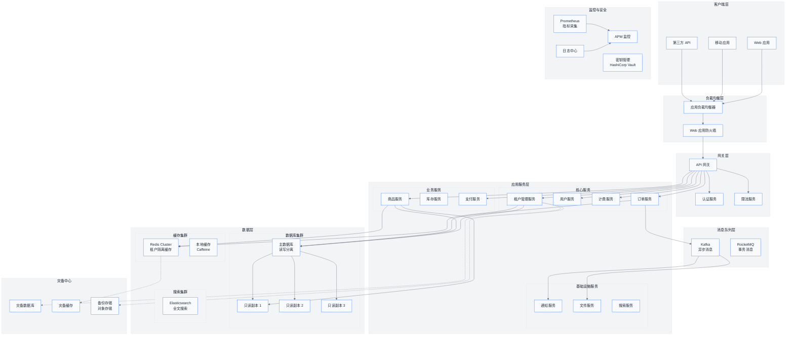
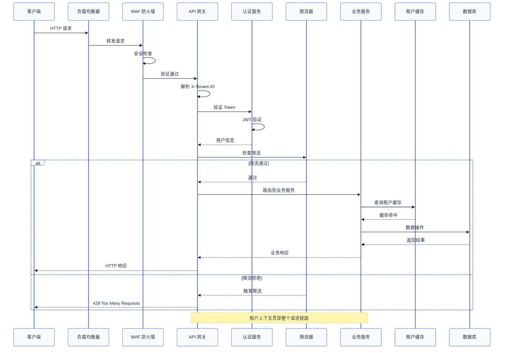
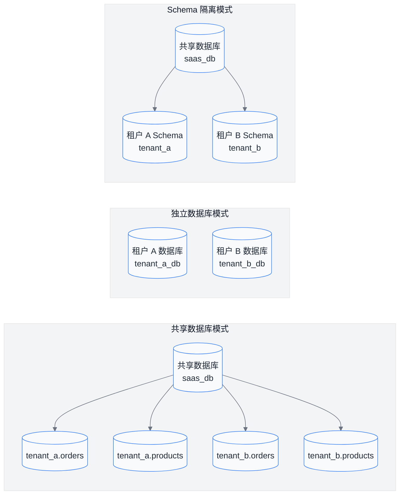
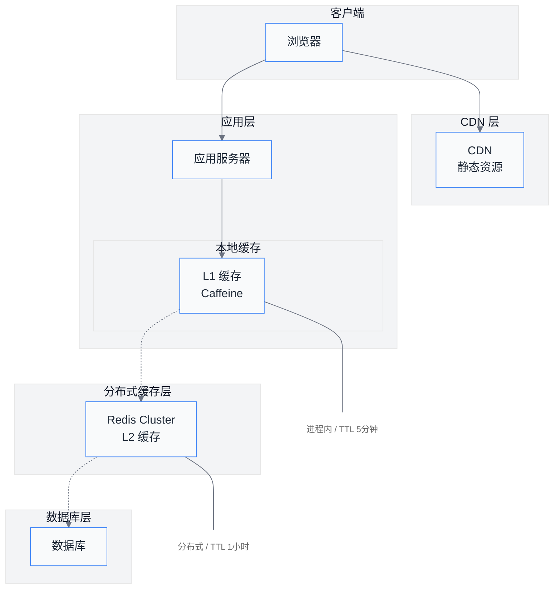
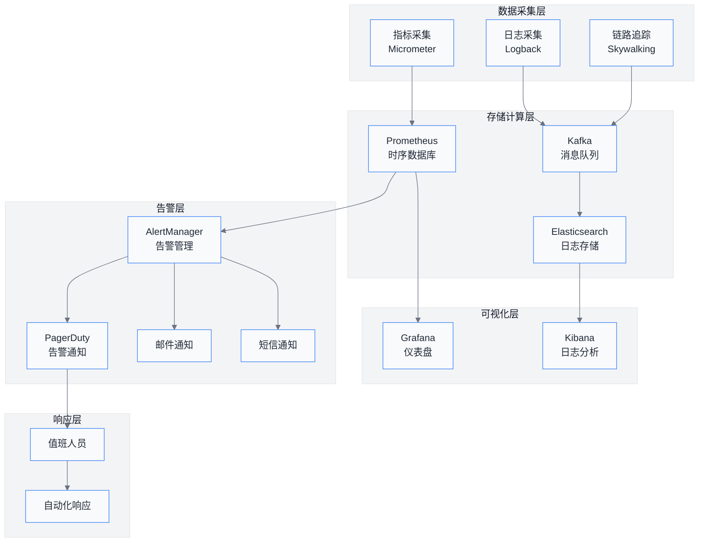

# 第11章 SaaS系统最佳实践

在前面章节中，我们已经深入探讨了 SaaS 多租户系统的核心概念、数据库设计、缓存策略、安全隔离以及租户管理功能。本章将从前人经验出发，系统性地总结 SaaS 系统在生产环境中的最佳实践，涵盖性能优化、安全加固、可扩展性设计、监控告警、灾难恢复、开发效率等多个维度。

这些最佳实践来自真实的踩坑经验总结，每一条建议背后都有惨痛的教训。希望读者在阅读后能够在设计和实现阶段就规避这些问题，而不是等到线上故障发生后才追悔莫及。

---

## 1. 性能优化

性能是 SaaS 系统的生命线。在多租户环境下，性能问题的影响会被放大——一个租户的性能问题可能影响所有租户的体验。本节将详细介绍连接池管理、缓存策略、懒加载和查询优化等关键性能优化手段。

### 1.1 连接池管理

连接池管理是多租户系统中最核心的性能话题之一。选择合适的连接池策略，直接影响系统的吞吐量、延迟和资源利用率。

**每个租户独立连接池 vs 共享连接池**

这是架构设计时必须做出的关键决策。两种方案各有优劣，适用于不同的业务场景。

独立连接池方案的优点是租户之间完全隔离，一个租户的慢查询不会影响其他租户；缺点是连接数随租户数量线性增长，当租户数量达到数百甚至数千时，数据库连接数会成为瓶颈。共享连接池方案的优点是资源利用率高，连接数可控；缺点是租户之间会相互影响，需要更精细的限流和超时控制。

```java
/**
 * 独立连接池配置示例
 * 适用于租户数量较少（<100）但对隔离性要求高的场景
 */
@Configuration
public class Tenant独立连接池Config {
    
    @Bean
    public Map<String, HikariDataSource> tenantDataSources() {
        return new ConcurrentHashMap<>();
    }
    
    @Bean
    public TenantConnectionPoolManager tenantConnectionPoolManager(
            Map<String, HikariDataSource> tenantDataSources) {
        return new TenantConnectionPoolManager(tenantDataSources);
    }
}

public class TenantConnectionPoolManager {
    private final Map<String, HikariDataSource> dataSources;
    private final int maxPoolSize = 10;
    private final int minIdle = 2;
    
    public HikariDataSource getDataSource(String tenantId) {
        return dataSources.computeIfAbsent(tenantId, this::createDataSource);
    }
    
    private HikariDataSource createDataSource(String tenantId) {
        HikariConfig config = new HikariConfig();
        config.setJdbcUrl(String.format("jdbc:mysql://%s:3306/tenant_%s", DB_HOST, tenantId));
        config.setUsername("app_user");
        config.setPassword(decryptPassword(tenantId));
        config.setMaximumPoolSize(maxPoolSize);
        config.setMinimumIdle(minIdle);
        config.setConnectionTimeout(30000);
        config.setIdleTimeout(600000);
        config.setMaxLifetime(1800000);
        config.setPoolName("Pool-Tenant-" + tenantId);
        
        return new HikariDataSource(config);
    }
    
    public void closeDataSource(String tenantId) {
        HikariDataSource ds = dataSources.remove(tenantId);
        if (ds != null) {
            ds.close();
        }
    }
}
```

```java
/**
 * 共享连接池配置示例
 * 适用于租户数量多（>100）且对资源利用率要求高的场景
 * 通过 TenantRoutingDataSource 在应用层实现租户隔离
 */
@Configuration
public class Tenant共享连接池Config {
    
    @Bean
    @Primary
    public DataSource dataSource(
            @Value("${spring.datasource.hikari.maximum-pool-size}") int maxPoolSize) {
        
        HikariDataSource dataSource = new HikariDataSource();
        dataSource.setJdbcUrl("jdbc:mysql://localhost:3306/saas_db");
        dataSource.setUsername("app_user");
        dataSource.setPassword("password");
        dataSource.setMaximumPoolSize(maxPoolSize); // 根据租户数和预期并发设置
        dataSource.setMinimumIdle(10);
        dataSource.setConnectionTimeout(30000);
        dataSource.setIdleTimeout(600000);
        dataSource.setMaxLifetime(1800000);
        dataSource.setPoolName("Pool-Shared");
        
        // 使用自定义路由数据源
        TenantRoutingDataSource routingDataSource = new TenantRoutingDataSource();
        routingDataSource.setTargetDataSources(new HashMap<>());
        routingDataSource.setDefaultTargetDataSource(dataSource);
        
        return routingDataSource;
    }
}

public class TenantRoutingDataSource extends AbstractRoutingDataSource {
    
    @Override
    protected Object determineCurrentLookupKey() {
        String tenantId = TenantContextHolder.getTenantId();
        if (tenantId == null) {
            throw new IllegalStateException("租户上下文未设置，请确保请求在 TenantFilter 中处理");
        }
        return tenantId;
    }
    
    @Override
    public Connection getConnection() throws SQLException {
        // 在获取连接前设置租户ID到 Connection 的 Attributes 中
        // 供后续拦截器使用
        Connection connection = super.getConnection();
        String tenantId = TenantContextHolder.getTenantId();
        connection.setClientInfo("TENANT_ID", tenantId);
        return connection;
    }
}
```

**连接池调优建议**

对于共享连接池，核心参数 `maximumPoolSize` 的设置需要综合考虑：数据库最大连接数除以平均单租户预期并发数，再乘以 0.8 作为安全系数。通常推荐值在 50-200 之间，具体需要根据压测结果调整。`minimumIdle` 设置为预期正常负载下的连接数，通常是 `maximumPoolSize` 的 20%-50%。`connectionTimeout` 设置为 5-10 秒，避免慢查询拖垮整个池。`idleTimeout` 和 `maxLifetime` 需要根据数据库服务器的 wait_timeout 设置来调整，通常设置为略小于数据库端的超时时间。

### 1.2 缓存策略

缓存是提升 SaaS 系统性能的关键手段。在多租户环境下，缓存策略的设计需要同时考虑效果和隔离性。

**租户级缓存 vs 全局缓存**

租户级缓存的优势是完全隔离，租户 A 的缓存不会影响租户 B，适合缓存命中率低或数据个性化强的场景。缺点是内存利用率低，大量租户时缓存总量膨胀。 全局缓存的优势是内存利用率高，共享数据只需存储一份；缺点是需要严格的缓存失效机制，否则会出现数据不一致。

```java
/**
 * 多级缓存配置示例
 * L1: 本地缓存（Guava Cache/Caffeine）
 * L2: 分布式缓存（Redis）
 */
@Configuration
public class MultiLevelCacheConfig {
    
    @Bean
    public CacheManager cacheManager(
            RedisConnectionFactory redisConnectionFactory,
            @Value("${cache.local.max-size:10000}") int localMaxSize) {
        
        // L1 本地缓存配置
        CaffeineCacheManager localCacheManager = new CaffeineCacheManager();
        localCacheManager.setCaffeine(Caffeine.newBuilder()
            .maximumSize(localMaxSize)
            .expireAfterWrite(Duration.ofMinutes(5))
            .recordStats());
        
        // L2 Redis 缓存配置
        RedisCacheManager redisCacheManager = RedisCacheManager.builder(redisConnectionFactory)
            .cacheDefaults(RedisCacheConfiguration.defaultCacheConfig()
                .entryTtl(Duration.ofHours(1))
                .serializeKeysWith(RedisSerializationPair.fromParser(new StringRedisParser()))
                .serializeValuesWith(RedisSerializationPair.fromParser(new GenericJackson2JsonRedisParser())))
            .withCacheConfiguration("tenantData", 
                RedisCacheConfiguration.defaultCacheConfig().entryTtl(Duration.ofMinutes(30)))
            .withCacheConfiguration("sharedData",
                RedisCacheConfiguration.defaultCacheConfig().entryTtl(Duration.ofHours(24)))
            .build();
        
        // 组合两级缓存
        return new CompositeCacheManager(localCacheManager, redisCacheManager);
    }
}

/**
 * 租户感知的缓存服务
 */
@Service
public class TenantCacheService {
    
    private final CacheManager cacheManager;
    
    public void put(String key, Object value, Duration ttl) {
        // 自动在 key 前加上租户前缀
        String tenantKey = buildTenantKey(key);
        Cache cache = cacheManager.getCache("tenantData");
        cache.put(tenantKey, new CachedValue(value, ttl));
    }
    
    public <T> T get(String key, Class<T> type) {
        String tenantKey = buildTenantKey(key);
        Cache cache = cacheManager.getCache("tenantData");
        CachedValue cached = cache.get(tenantKey, CachedValue.class);
        if (cached != null && !cached.isExpired()) {
            return type.cast(cached.getValue());
        }
        return null;
    }
    
    public void evict(String key) {
        String tenantKey = buildTenantKey(key);
        Cache cache = cacheManager.getCache("tenantData");
        cache.evict(tenantKey);
    }
    
    public void evictAll() {
        // 清空当前租户的所有缓存
        String tenantPattern = TenantContextHolder.getTenantId() + ":*";
        // 使用 Redis 的 SCAN 命令匹配删除
        redisTemplate.delete(redisTemplate.keys(tenantPattern));
    }
    
    private String buildTenantKey(String key) {
        return TenantContextHolder.getTenantId() + ":" + key;
    }
}

/**
 * 缓存数据包装类，包含过期时间
 */
@Data
public class CachedValue implements Serializable {
    private final Object value;
    private final long createdAt;
    private final long ttlMillis;
    
    public CachedValue(Object value, Duration ttl) {
        this.value = value;
        this.createdAt = System.currentTimeMillis();
        this.ttlMillis = ttl.toMillis();
    }
    
    public boolean isExpired() {
        return System.currentTimeMillis() - createdAt > ttlMillis;
    }
    
    public Object getValue() {
        if (isExpired()) {
            throw new IllegalStateException("缓存已过期");
        }
        return value;
    }
}
```

**缓存策略最佳实践**

缓存 key 的设计必须包含租户标识，避免不同租户之间的数据串读。热数据的缓存命中率目标应该达到 95% 以上，对于命中率低于 50% 的数据就要考虑是否值得缓存。缓存失效策略推荐使用主动失效而不是被动过期，主动失效可以结合数据库的变更日志（CDC）来实现近实时的缓存同步。 多租户场景下推荐使用租户隔离的 Redis Cluster 或 Redis Tag，开启内存限制和驱逐策略，防止单一租户占满所有缓存内存。

### 1.3 懒加载租户数据源

对于租户数量庞大但同时在线租户较少的场景，预先初始化所有租户的数据源会浪费大量资源。懒加载策略可以让系统在需要时才创建数据源连接池。

```java
/**
 * 懒加载数据源管理器
 * 只在首次访问某个租户时，才创建对应的数据源
 */
@Component
public class LazyTenantDataSourceManager {
    
    private final Map<String, HikariDataSource> activeDataSources = new ConcurrentHashMap<>();
    private final LoadingCache<String, HikariDataSource> dataSourceCache;
    private final TenantDataSourceProperties properties;
    private final PasswordEncryptionService passwordService;
    
    public LazyTenantDataSourceManager(
            TenantDataSourceProperties properties,
            PasswordEncryptionService passwordService) {
        this.properties = properties;
        this.passwordService = passwordService;
        
        // 使用 LoadingCache 实现并发控制
        this.dataSourceCache = Caffeine.newBuilder()
            .maximumSize(properties.getMaxDataSources())
            .expireAfterAccess(Duration.ofHours(properties.getIdleTimeoutHours()))
            .removalListener((tenantId, ds, cause) -> {
                if (cause == RemovalCause.EXPIRED || cause == RemovalCause.SIZE) {
                    ds.close();
                    log.info("数据源已关闭: tenantId={}, cause={}", tenantId, cause);
                }
            })
            .build(tenantId -> createDataSource(tenantId));
    }
    
    public DataSource getDataSource(String tenantId) {
        try {
            return dataSourceCache.get(tenantId);
        } catch (ExecutionException e) {
            throw new RuntimeException("获取租户数据源失败: " + tenantId, e);
        }
    }
    
    public void preloadDataSource(String tenantId) {
        // 提前预热，用于管理员在后台预览租户数据
        dataSourceCache.refresh(tenantId);
    }
    
    public void closeDataSource(String tenantId) {
        dataSourceCache.invalidate(tenantId);
        activeDataSources.remove(tenantId);
    }
    
    public int getActiveDataSourceCount() {
        return activeDataSources.size();
    }
    
    private HikariDataSource createDataSource(String tenantId) {
        TenantDatabaseConfig config = loadDatabaseConfig(tenantId);
        
        HikariConfig hikariConfig = new HikariConfig();
        hikariConfig.setJdbcUrl(buildJdbcUrl(config));
        hikariConfig.setUsername(config.getUsername());
        hikariConfig.setPassword(passwordService.decrypt(config.getEncryptedPassword()));
        hikariConfig.setMaximumPoolSize(properties.getMaxPoolSize());
        hikariConfig.setMinimumIdle(properties.getMinIdle());
        hikariConfig.setConnectionTimeout(properties.getConnectionTimeoutMs());
        hikariConfig.setIdleTimeout(properties.getIdleTimeoutMs());
        hikariConfig.setMaxLifetime(properties.getMaxLifetimeMs());
        hikariConfig.setPoolName("Pool-Lazy-" + tenantId);
        
        // 连接测试查询
        hikariConfig.setConnectionTestQuery("SELECT 1");
        
        HikariDataSource dataSource = new HikariDataSource(hikariConfig);
        activeDataSources.put(tenantId, dataSource);
        
        log.info("租户数据源创建成功: tenantId={}, url={}", tenantId, config.getHost());
        return dataSource;
    }
    
    private TenantDatabaseConfig loadDatabaseConfig(String tenantId) {
        // 从配置中心或数据库加载租户数据库配置
        return tenantConfigService.getDatabaseConfig(tenantId);
    }
    
    private String buildJdbcUrl(TenantDatabaseConfig config) {
        return String.format("jdbc:mysql://%s:%d/%s?useSSL=%s&serverTimezone=UTC",
            config.getHost(), config.getPort(), config.getDatabaseName(), config.isUseSsl());
    }
}

/**
 * 租户数据库配置
 */
@Data
public class TenantDatabaseConfig {
    private String tenantId;
    private String host;
    private int port = 3306;
    private String databaseName;
    private String username;
    private String encryptedPassword;
    private boolean useSsl = true;
    private String characterEncoding = "UTF-8";
}
```

### 1.4 查询优化

在多租户系统中，不当的查询可能跨越租户边界，导致数据泄露或性能问题。以下是几个关键的查询优化策略。

```java
/**
 * 租户感知的 MyBatis 拦截器
 * 自动在所有 SQL 中注入租户条件
 */
@Component
@InterceptorIgnore
public class TenantSqlInterceptor implements Interceptor {
    
    @Override
    public Object intercept(Invocation invocation) throws Throwable {
        String tenantId = TenantContextHolder.getTenantId();
        if (tenantId == null) {
            throw new IllegalStateException("租户上下文为空，禁止执行跨租户查询");
        }
        
        StatementHandler handler = (StatementHandler) invocation.getTarget();
        BoundSql boundSql = handler.getBoundSql();
        String originalSql = boundSql.getSql();
        
        // 检查是否已经包含租户条件
        if (!containsTenantCondition(originalSql)) {
            String modifiedSql = injectTenantCondition(originalSql, tenantId);
            Field sqlField = BoundSql.class.getDeclaredField("sql");
            sqlField.setAccessible(true);
            sqlField.set(boundSql, modifiedSql);
        }
        
        return invocation.proceed();
    }
    
    private boolean containsTenantCondition(String sql) {
        String lowerSql = sql.toLowerCase();
        return lowerSql.contains("tenant_id") || 
               lowerSql.contains("tenantid") ||
               lowerSql.contains("租户");
    }
    
    private String injectTenantCondition(String sql, String tenantId) {
        // 简单的条件注入，实际项目中需要更复杂的 SQL 解析
        String condition = "tenant_id = '" + tenantId + "'";
        
        if (sql.toLowerCase().contains("where")) {
            return sql + " AND " + condition;
        } else if (sql.toLowerCase().contains("group by")) {
            // 注入到 GROUP BY 之前
            int groupByIndex = sql.toLowerCase().indexOf("group by");
            return sql.substring(0, groupByIndex) + " WHERE " + condition + " " + sql.substring(groupByIndex);
        } else if (sql.toLowerCase().contains("order by")) {
            int orderByIndex = sql.toLowerCase().indexOf("order by");
            return sql.substring(0, orderByIndex) + " WHERE " + condition + " " + sql.substring(orderByIndex);
        } else {
            return sql + " WHERE " + condition;
        }
    }
}

/**
 * 跨租户查询检测器
 * 在测试环境和预发环境检测潜在的数据泄露风险
 */
@Component
public class CrossTenantQueryDetector {
    
    private final AtomicLong queryCount = new AtomicLong();
    private final Set<String> suspiciousQueries = ConcurrentHashMap.newKeySet();
    
    @Aspect
    @Component
    public static class QueryMonitorAspect {
        
        private final CrossTenantQueryDetector detector;
        
        public QueryMonitorAspect(CrossTenantQueryDetector detector) {
            this.detector = detector;
        }
        
        @Around("execution(* com.saas.mapper..*.*(..))")
        public Object monitorQuery(ProceedingJoinPoint joinPoint) throws Throwable {
            String tenantId = TenantContextHolder.getTenantId();
            
            // 如果没有租户上下文，记录警告
            if (tenantId == null) {
                String sql = getSqlFromJoinPoint(joinPoint);
                detector.recordSuspiciousQuery(sql);
                throw new IllegalStateException("检测到跨租户查询风险: " + sql);
            }
            
            return joinPoint.proceed();
        }
        
        private String getSqlFromJoinPoint(ProceedingJoinPoint joinPoint) {
            // 从 MyBatis Mapper 签名中提取 SQL 信息
            MethodSignature signature = (MethodSignature) joinPoint.getSignature();
            String methodName = signature.getName();
            String className = signature.getDeclaringType().getName();
            return className + "." + methodName;
        }
    }
    
    public void recordSuspiciousQuery(String query) {
        suspiciousQueries.add(query);
        log.warn("检测到跨租户查询嫌疑: {}", query);
    }
    
    public Set<String> getSuspiciousQueries() {
        return Collections.unmodifiableSet(suspiciousQueries);
    }
}
```

**查询优化最佳实践**

禁止使用动态 SQL 拼接方式构建跨租户查询，优先使用参数化查询。在数据库层面启用行级安全策略（RLS），即使应用层漏掉租户条件，数据库也会拦截。定期检查慢查询日志，识别和处理跨租户 JOIN 操作。对于大租户（数据量超过 1000 万条），考虑分库分表策略。查询结果集要做分页限制，禁止不带分页的全表查询返回。

---

## 2. 安全加固

安全性是多租户系统的基石。在共享基础设施上隔离不同租户的数据和操作，需要从多个层面进行安全加固。

### 2.1 租户 ID 不可预测

使用自增整数作为租户 ID 存在严重的安全隐患——攻击者可以轻易遍历所有租户的数据。UUID 相比之下具有不可预测性，是更安全的选择。

```java
/**
 * 租户 ID 生成策略
 * 使用 UUID 而非自增 ID
 */
public class TenantIdGenerator {
    
    /**
     * 生成 UUID 格式的租户 ID
     * 格式: xxxxxxxx-xxxx-xxxx-xxxx-xxxxxxxxxxxx
     */
    public static String generateTenantId() {
        return UUID.randomUUID().toString();
    }
    
    /**
     * 生成短格式租户 ID（URL 友好）
     */
    public static String generateShortTenantId() {
        return Base58.encode(UUID.randomUUID().toString().getBytes());
    }
    
    /**
     * 验证租户 ID 格式
     */
    public static boolean isValid(String tenantId) {
        if (tenantId == null || tenantId.isEmpty()) {
            return false;
        }
        
        // 检查是否为有效格式
        if (isUUID(tenantId)) {
            return true;
        }
        
        if (isBase58(tenantId) && tenantId.length() >= 16) {
            return true;
        }
        
        return false;
    }
    
    private static boolean isUUID(String str) {
        try {
            UUID.fromString(str);
            return true;
        } catch (IllegalArgumentException e) {
            return false;
        }
    }
    
    private static boolean isBase58(String str) {
        // Base58 字符集（不包括容易混淆的 0, O, I, l）
        return str.matches("^[123456789ABCDEFGHJKLMNPQRSTUVWXYZabcdefghijkmnopqrstuvwxyz]+$");
    }
}

/**
 * 租户注册时生成不可预测的 ID
 */
@Service
public class TenantRegistrationService {
    
    public Tenant register(String tenantName, String adminEmail) {
        // 生成唯一的租户 ID
        String tenantId = generateUniqueTenantId();
        
        Tenant tenant = new Tenant();
        tenant.setId(tenantId);
        tenant.setName(tenantName);
        tenant.setAdminEmail(adminEmail);
        tenant.setStatus(TenantStatus.PENDING);
        tenant.setCreatedAt(Instant.now());
        
        // 发送激活邮件
        sendActivationEmail(tenantId, adminEmail);
        
        return tenantRepository.save(tenant);
    }
    
    private String generateUniqueTenantId() {
        String tenantId;
        int attempts = 0;
        do {
            tenantId = TenantIdGenerator.generateShortTenantId();
            attempts++;
            if (attempts > 10) {
                throw new IllegalStateException("无法生成唯一的租户 ID");
            }
        } while (tenantRepository.existsById(tenantId));
        
        return tenantId;
    }
}
```

**租户 ID 安全最佳实践**

永远不要使用自增整数作为租户标识。如果使用数据库自增主键，在 API 响应中用 UUID 替代。URL 中不要暴露数据库主键，使用租户的唯一标识符。在日志和监控中脱敏租户 ID，只保留前几位用于问题排查。

### 2.2 数据访问自动注入租户条件

确保每一行数据访问都自动带上租户条件，是防止数据泄露的最后防线。

```java
/**
 * 租户数据访问层基类
 * 所有租户相关的 Repository 继承此类
 */
public abstract class TenantAwareRepository<T, ID> {
    
    @Autowired
    protected TenantEntityManager entityManager;
    
    @Autowired
    protected TenantContextHolder tenantContextHolder;
    
    protected abstract Class<T> getEntityClass();
    
    public Optional<T> findById(ID id) {
        String tenantId = getRequiredTenantId();
        CriteriaBuilder cb = entityManager.getCriteriaBuilder();
        CriteriaQuery<T> query = cb.createQuery(getEntityClass());
        Root<T> root = query.from(getEntityClass());
        
        Predicate conditions = cb.and(
            cb.equal(root.get("id"), id),
            cb.equal(root.get("tenantId"), tenantId)
        );
        
        return entityManager.createQuery(query.where(conditions))
            .getResultStream()
            .findFirst();
    }
    
    public List<T> findAll(Specification<T> spec) {
        String tenantId = getRequiredTenantId();
        
        Specification<T> tenantSpec = (root, query, cb) -> 
            cb.equal(root.get("tenantId"), tenantId);
        
        return entityManager.findAll(tenantSpec.and(spec));
    }
    
    public <S extends T> S save(S entity) {
        String tenantId = getRequiredTenantId();
        setTenantIdIfAbsent(entity, tenantId);
        return entityManager.save(entity);
    }
    
    public void deleteById(ID id) {
        String tenantId = getRequiredTenantId();
        T entity = findById(id)
            .orElseThrow(() -> new EntityNotFoundException("实体不存在"));
        delete(entity);
    }
    
    private String getRequiredTenantId() {
        String tenantId = tenantContextHolder.getTenantId();
        if (tenantId == null) {
            throw new IllegalStateException("租户上下文未设置");
        }
        return tenantId;
    }
    
    private void setTenantIdIfAbsent(T entity, String tenantId) {
        try {
            Method setter = entity.getClass().getMethod("setTenantId", String.class);
            Object currentValue = entity.getClass().getMethod("getTenantId").invoke(entity);
            if (currentValue == null) {
                setter.invoke(entity, tenantId);
            }
        } catch (NoSuchMethodException e) {
            // 实体没有 tenantId 字段，跳过
        } catch (Exception e) {
            throw new RuntimeException("设置租户 ID 失败", e);
        }
    }
}

/**
 * JPA 租户过滤器
 * 自动在所有查询中注入租户条件
 */
@Component
public class TenantJpaInterceptor {
    
    @PersistenceContext
    private EntityManager entityManager;
    
    @PostConstruct
    public void registerTenantFilter() {
        entityManager.getEntityManagerFactory()
            .addBeanQueryContainer(new TenantAwareQueryContainer());
    }
}

public class TenantAwareQueryContainer implements BeanQueryContainer {
    
    @Override
    public QueryHints getQueryHints(BeanQueryMetadata metadata, 
                                     OperationType operationType) {
        String tenantId = TenantContextHolder.getTenantId();
        if (tenantId == null || isSystemOperation(metadata)) {
            return QueryHints.NONE;
        }
        
        return QueryHints.of("tenant_id", tenantId);
    }
    
    private boolean isSystemOperation(BeanQueryMetadata metadata) {
        String operation = metadata.getOperation();
        return operation != null && operation.startsWith("system:");
    }
}
```

### 2.3 审计日志记录租户操作

完善的审计日志是安全合规的基础，也是问题排查的依据。

```java
/**
 * 租户操作审计服务
 */
@Service
public class TenantAuditService {
    
    private final AuditLogRepository auditLogRepository;
    private final SecurityContext securityContext;
    
    public void log(String action, String resourceType, String resourceId, 
                    Object before, Object after) {
        AuditLog log = AuditLog.builder()
            .id(UUID.randomUUID().toString())
            .tenantId(TenantContextHolder.getTenantId())
            .userId(securityContext.getCurrentUserId())
            .userName(securityContext.getCurrentUserName())
            .action(action)
            .resourceType(resourceType)
            .resourceId(resourceId)
            .beforeValue(serialize(before))
            .afterValue(serialize(after))
            .ipAddress(securityContext.getClientIp())
            .userAgent(securityContext.getUserAgent())
            .timestamp(Instant.now())
            .build();
        
        auditLogRepository.save(log);
    }
    
    public Page<AuditLog> queryLogs(String tenantId, 
                                      Instant startTime, Instant endTime,
                                      String action, String resourceType,
                                      Pageable pageable) {
        return auditLogRepository.findByTenantIdAndTimeRange(
            tenantId, startTime, endTime, action, resourceType, pageable);
    }
}

/**
 * 审计日志实体
 */
@Entity
@Table(name = "audit_logs", indexes = {
    @Index(name = "idx_audit_tenant_time", columnList = "tenant_id, timestamp"),
    @Index(name = "idx_audit_resource", columnList = "resource_type, resource_id"),
    @Index(name = "idx_audit_user", columnList = "user_id, timestamp")
})
@Data
@Builder
public class AuditLog {
    
    @Id
    private String id;
    
    @Column(nullable = false)
    private String tenantId;
    
    @Column(nullable = false)
    private String userId;
    
    private String userName;
    
    @Column(nullable = false)
    private String action;
    
    @Column(nullable = false)
    private String resourceType;
    
    private String resourceId;
    
    @Column(columnDefinition = "TEXT")
    private String beforeValue;
    
    @Column(columnDefinition = "TEXT")
    private String afterValue;
    
    private String ipAddress;
    
    private String userAgent;
    
    @Column(nullable = false)
    private Instant timestamp;
    
    // 敏感操作类型定义
    public static final String ACTION_LOGIN = "LOGIN";
    public static final String ACTION_LOGOUT = "LOGOUT";
    public static final String ACTION_CREATE = "CREATE";
    public static final String ACTION_UPDATE = "UPDATE";
    public static final String ACTION_DELETE = "DELETE";
    public static final String ACTION_EXPORT = "EXPORT";
    public static final String ACTION_IMPORT = "IMPORT";
    public static final String ACTION_PERMISSION_CHANGE = "PERMISSION_CHANGE";
    public static final String ACTION_BILLING_CHANGE = "BILLING_CHANGE";
}

/**
 * 审计日志 AOP 拦截器
 * 自动记录带有 @Audited 注解的方法
 */
@Aspect
@Component
public class AuditLogAspect {
    
    @Around("@annotation(audited)")
    public Object audit(ProceedingJoinPoint joinPoint, Audited audited) throws Throwable {
        String tenantId = TenantContextHolder.getTenantId();
        String action = audited.action();
        String resourceType = audited.resourceType();
        
        // 获取方法参数
        Object[] args = joinPoint.getArgs();
        String resourceId = extractResourceId(args, audited.resourceIdArg());
        
        Object before = null;
        if (audited.compareValues() && args.length > 0) {
            before = loadCurrentValue(resourceType, resourceId);
        }
        
        Object result = joinPoint.proceed();
        
        Object after = null;
        if (audited.compareValues()) {
            after = result;
        }
        
        // 异步记录审计日志
        auditService.logAsync(action, resourceType, resourceId, before, after);
        
        return result;
    }
}

/**
 * 审计注解
 */
@Target(ElementType.METHOD)
@Retention(RetentionPolicy.RUNTIME)
public @interface Audited {
    String action();
    String resourceType();
    String resourceIdArg() default "id";
    boolean compareValues() default false;
}
```

### 2.4 定期安全审计

安全审计应该成为常态化的工作，而不仅仅是出现问题时才进行。

```java
/**
 * 安全审计报告服务
 */
@Service
public class SecurityAuditService {
    
    @Scheduled(cron = "0 0 3 * * ?") // 每天凌晨 3 点执行
    public void generateDailySecurityReport() {
        SecurityReport report = SecurityReport.builder()
            .reportDate(LocalDate.now().minusDays(1))
            .generatedAt(Instant.now())
            .failedLoginAttempts(getFailedLoginCount())
            .suspiciousActivities(getSuspiciousActivities())
            .permissionAnomalies(getPermissionAnomalies())
            .dataAccessViolations(getDataAccessViolations())
            .build();
        
        // 发送报告给安全团队
        sendSecurityReport(report);
        
        // 存储报告
        securityReportRepository.save(report);
    }
    
    /**
     * 检测权限异常
     * 例如：普通用户短时间内访问大量租户数据
     */
    private List<PermissionAnomaly> getPermissionAnomalies() {
        Instant since = Instant.now().minus(Duration.ofHours(24));
        List<UserAccessSummary> accessSummaries = accessLogRepository
            .groupByUserAndTenant(since);
        
        return accessSummaries.stream()
            .filter(summary -> summary.getTenantCount() > THRESHOLD_TENANT_ACCESS)
            .map(summary -> PermissionAnomaly.builder()
                .userId(summary.getUserId())
                .tenantCount(summary.getTenantCount())
                .accessPatterns(summary.getAccessPatterns())
                .riskLevel(RiskLevel.HIGH)
                .build())
            .collect(Collectors.toList());
    }
    
    /**
     * 检测数据访问违规
     * 例如：租户 A 访问租户 B 的数据
     */
    private List<DataAccessViolation> getDataAccessViolations() {
        return accessViolationRepository
            .findUnresolvedViolations(Instant.now().minus(Duration.ofDays(7)));
    }
    
    /**
     * 租户数据隔离检查
     */
    @Transactional(readOnly = true)
    public IsolationCheckResult checkDataIsolation() {
        List<String> tenantIds = tenantRepository.findActiveTenantIds();
        List<IsolationIssue> issues = new ArrayList<>();
        
        for (String tenantId : tenantIds) {
            TenantContextHolder.setTenantId(tenantId);
            try {
                // 检查是否存在跨租户数据引用
                List<CrossTenantReference> references = checkCrossTenantReferences(tenantId);
                if (!references.isEmpty()) {
                    issues.add(new IsolationIssue(tenantId, references));
                }
            } finally {
                TenantContextHolder.clear();
            }
        }
        
        return new IsolationCheckResult(issues.isEmpty(), issues);
    }
}
```

**安全加固检查清单**

使用 UUID 或加密随机字符串作为租户 ID，避免可预测性。所有 API 必须在租户上下文中执行，拒绝跨租户数据访问。在数据库层启用行级安全策略（PostgreSQL RLS 或类似机制）。实现完整的审计日志，覆盖登录、数据访问、权限变更等敏感操作。定期执行安全扫描和渗透测试。实施 IP 白名单和访问频率限制。对所有管理操作实施双人审批机制。

---

## 3. 可扩展性设计

SaaS 系统的可扩展性决定了它能承载的业务规模。从租户数量预估到微服务架构，都需要提前规划。

### 3.1 租户数量预估与扩容策略

在系统设计阶段，需要预估未来 3-5 年的租户数量，并据此制定扩容策略。

```java
/**
 * 租户容量规划服务
 */
@Service
public class TenantCapacityPlanningService {
    
    /**
     * 评估当前架构的容量
     */
    public CapacityAssessment assessCapacity(CurrentArchitecture architecture) {
        int maxTenants = calculateMaxTenants(architecture);
        int currentTenants = tenantRepository.countActiveTenants();
        double utilizationRate = (double) currentTenants / maxTenants;
        
        return CapacityAssessment.builder()
            .maxTenants(maxTenants)
            .currentTenants(currentTenants)
            .availableSlots(maxTenants - currentTenants)
            .utilizationRate(utilizationRate)
            .recommendation(generateRecommendation(utilizationRate))
            .estimatedFullCapacityDate(estimateFullCapacityDate(architecture))
            .build();
    }
    
    /**
     * 根据架构类型计算最大租户数
     */
    private int calculateMaxTenants(CurrentArchitecture architecture) {
        switch (architecture.getDatabaseType()) {
            case SHARED_DATABASE:
                // 共享数据库，连接数是瓶颈
                int maxConnections = architecture.getDbMaxConnections();
                int connectionsPerTenant = architecture.getConnectionsPerTenant();
                return maxConnections / connectionsPerTenant;
                
            case DATABASE_PER_TENANT:
                // 独立数据库，受服务器资源限制
                return calculateDatabaseLimit(architecture);
                
            case HYBRID:
                // 混合模式，计算各层限制的最小值
                int dbLimit = calculateDatabaseLimit(architecture);
                int cacheLimit = architecture.getCacheMemoryMB() / CACHE_PER_TENANT_MB;
                int connectionLimit = architecture.getDbMaxConnections() / CONNECTIONS_PER_TENANT;
                return min(dbLimit, cacheLimit, connectionLimit);
                
            default:
                throw new IllegalArgumentException("未知的数据库架构类型");
        }
    }
    
    private int calculateDatabaseLimit(CurrentArchitecture architecture) {
        // 每个数据库实例最多支持约 2000 个租户
        int dbsPerServer = architecture.getDbInstancesPerServer();
        int servers = architecture.getDatabaseServers();
        return dbsPerServer * servers * MAX_TENANTS_PER_DB;
    }
    
    /**
     * 生成扩容建议
     */
    private String generateRecommendation(double utilizationRate) {
        if (utilizationRate > 0.8) {
            return "容量使用率超过 80%，建议立即扩容。当前架构最大容量即将达到，建议提前规划扩容方案。";
        } else if (utilizationRate > 0.6) {
            return "容量使用率超过 60%，建议开始评估扩容方案。预计在 3-6 个月内需要扩容。";
        } else {
            return "容量充足，当前架构可以支撑至少 12 个月的增长。建议每季度复核容量规划。";
        }
    }
    
    /**
     * 扩容策略
     */
    public ExpansionPlan createExpansionPlan(
            CapacityAssessment assessment,
            int targetTenantCount,
            int planningHorizonMonths) {
        
        List<ExpansionPhase> phases = new ArrayList<>();
        int currentCapacity = assessment.getMaxTenants();
        
        while (currentCapacity < targetTenantCount) {
            ExpansionStrategy strategy = chooseStrategy(currentCapacity, targetTenantCount);
            ExpansionPhase phase = strategy.plan(
                currentCapacity, 
                targetTenantCount,
                planningHorizonMonths);
            
            phases.add(phase);
            currentCapacity = phase.getNewCapacity();
        }
        
        return ExpansionPlan.builder()
            .phases(phases)
            .estimatedCost(calculateCost(phases))
            .riskFactors(identifyRisks(phases))
            .build();
    }
}
```

### 3.2 微服务架构下的多租户

在微服务架构中，多租户的实现需要考虑服务间的数据隔离和通信安全。

```java
/**
 * 微服务架构下的租户传播拦截器
 */
@Component
public class TenantPropagationInterceptor implements HandlerInterceptor {
    
    private final TenantContextHolder tenantContextHolder;
    
    @Override
    public boolean preHandle(HttpServletRequest request, 
                            HttpServletResponse response,
                            Object handler) throws Exception {
        
        // 从请求头中提取租户 ID
        String tenantId = request.getHeader("X-Tenant-ID");
        
        if (tenantId != null && tenantContextHolder.isValid(tenantId)) {
            tenantContextHolder.setTenantId(tenantId);
        }
        
        return true;
    }
    
    @Override
    public void afterCompletion(HttpServletRequest request,
                                HttpServletResponse response,
                                Object handler, Exception ex) {
        // 清理 ThreadLocal
        tenantContextHolder.clear();
    }
}

/**
 * Feign 客户端租户传播
 */
@Configuration
public class FeignTenantConfig {
    
    @Bean
    public RequestInterceptor tenantRequestInterceptor(TenantContextHolder tenantContextHolder) {
        return template -> {
            String tenantId = tenantContextHolder.getTenantId();
            if (tenantId != null) {
                template.header("X-Tenant-ID", tenantId);
            }
        };
    }
    
    @Bean
    public ErrorDecoder tenantErrorDecoder() {
        return (methodKey, response) -> {
            String tenantId = response.headers().get("X-Tenant-ID").stream()
                .findFirst()
                .orElse("unknown");
            
            if (response.status() == 403) {
                return new TenantAccessDeniedException(
                    "租户 " + tenantId + " 无权访问此服务");
            }
            
            if (response.status() == 404) {
                return new TenantNotFoundException(
                    "租户 " + tenantId + " 不存在或未激活");
            }
            
            return defaultErrorDecoder.decode(methodKey, response);
        };
    }
}

/**
 * 消息队列租户隔离
 */
@Component
public class TenantAwareMessageConverter implements MessageConverter {
    
    @Override
    public Message toMessage(Object object, MessageProperties properties) {
        if (object instanceof TenantAwareMessage) {
            TenantAwareMessage msg = (TenantAwareMessage) object;
            properties.setHeader("X-Tenant-ID", msg.getTenantId());
        }
        return new Message(serialize(object), properties);
    }
    
    @Override
    public Object fromMessage(Message message) {
        String tenantId = message.getMessageProperties().getHeader("X-Tenant-ID");
        if (tenantId != null) {
            TenantContextHolder.setTenantId(tenantId);
        }
        return deserialize(message.getBody());
    }
}

/**
 * 异步任务租户上下文传播
 */
@Configuration
public class TenantAwareAsyncConfig implements AsyncConfigurer {
    
    @Override
    public Executor getAsyncExecutor() {
        SimpleAsyncTaskExecutor executor = new SimpleAsyncTaskExecutor();
        executor.setTaskDecorator(new TenantAwareTaskDecorator());
        return executor;
    }
    
    @Bean
    public ThreadPoolTaskExecutor taskExecutor() {
        ThreadPoolTaskExecutor executor = new ThreadPoolTaskExecutor();
        executor.setCorePoolSize(10);
        executor.setMaxPoolSize(50);
        executor.setQueueCapacity(100);
        executor.setTaskDecorator(new TenantAwareTaskDecorator());
        executor.initialize();
        return executor;
    }
}

public class TenantAwareTaskDecorator implements TaskDecorator {
    
    @Override
    public Runnable decorate(Runnable runnable) {
        String tenantId = TenantContextHolder.getTenantId();
        String userId = TenantContextHolder.getUserId();
        
        return () -> {
            try {
                TenantContextHolder.setTenantId(tenantId);
                TenantContextHolder.setUserId(userId);
                runnable.run();
            } finally {
                TenantContextHolder.clear();
            }
        };
    }
}
```

### 3.3 读写分离与多副本

对于大型 SaaS 系统，读写分离和多副本部署是提升性能和数据可靠性的关键手段。

```java
/**
 * 租户感知的读写分离路由
 */
@Configuration
public class TenantReadWriteRoutingConfig {
    
    @Bean
    public DataSource routingDataSource(
            @Value("${db.write.url}") String writeUrl,
            @Value("${db.write.username}") String writeUser,
            @Value("${db.write.password}") String writePassword,
            @Value("${db.read.urls}") List<String> readUrls,
            @Value("${db.read.username}") String readUser,
            @Value("${db.read.password}") String readPassword) {
        
        TenantRoutingDataSource dataSource = new TenantRoutingDataSource();
        
        // 写入数据源
        HikariDataSource writeDs = createDataSource(writeUrl, writeUser, writePassword, "WritePool");
        
        // 读取数据源池（轮询使用多个只读副本）
        List<HikariDataSource> readDsList = readUrls.stream()
            .map(url -> createDataSource(url, readUser, readPassword, "ReadPool-" + readUrls.indexOf(url)))
            .collect(Collectors.toList());
        
        dataSource.setWriteDataSource(writeDs);
        dataSource.setReadDataSources(readDsList);
        dataSource.setReadStrategy(new RoundRobinReadStrategy());
        
        return dataSource;
    }
    
    private HikariDataSource createDataSource(String url, String user, String password, String poolName) {
        HikariConfig config = new HikariConfig();
        config.setJdbcUrl(url);
        config.setUsername(user);
        config.setPassword(password);
        config.setMaximumPoolSize(20);
        config.setMinimumIdle(5);
        config.setPoolName(poolName);
        return new HikariDataSource(config);
    }
}

public class TenantRoutingDataSource extends AbstractRoutingDataSource {
    
    private HikariDataSource writeDataSource;
    private List<HikariDataSource> readDataSources;
    private ReadStrategy readStrategy;
    
    @Override
    protected Object determineCurrentLookupKey() {
        if (isWriteOperation()) {
            return "WRITE";
        } else {
            // 根据策略选择读副本
            int index = readStrategy.select(readDataSources.size());
            return "READ_" + index;
        }
    }
    
    private boolean isWriteOperation() {
        // 检查当前线程是否正在执行写操作
        // 通过 SQL 分析或标记判断
        return TenantContextHolder.isWriteOperation();
    }
}

/**
 * 强制使用主库读取（对于跨租户聚合查询）
 */
public @interface ForceMasterRead {
    // 标记该查询必须使用主库
}

/**
 * 强制主库读取注解的拦截器
 */
@Aspect
@Component
public class ForceMasterReadInterceptor {
    
    @Around("@annotation(forceMasterRead)")
    public Object forceMasterRead(ProceedingJoinPoint joinPoint, 
                                   ForceMasterRead forceMasterRead) throws Throwable {
        try {
            TenantContextHolder.setForceMaster(true);
            return joinPoint.proceed();
        } finally {
            TenantContextHolder.setForceMaster(false);
        }
    }
}
```

---

## 4. 监控与告警

完善的监控和告警体系是保障 SaaS 系统稳定运行的关键。在多租户环境下，需要从租户级别进行指标监控和异常检测。

### 4.1 租户级指标监控

```java
/**
 * 租户指标收集服务
 */
@Service
public class TenantMetricsService {
    
    private final MeterRegistry meterRegistry;
    private final Map<String, TenantMetrics> tenantMetricsMap = new ConcurrentHashMap<>();
    
    /**
     * 记录租户 API 响应时间
     */
    public void recordResponseTime(String tenantId, String endpoint, long durationMs) {
        Timer timer = Timer.builder("tenant.api.response.time")
            .tag("tenant_id", tenantId)
            .tag("endpoint", endpoint)
            .register(meterRegistry);
        timer.record(durationMs, TimeUnit.MILLISECONDS);
        
        // 更新租户聚合指标
        getOrCreateTenantMetrics(tenantId).addResponseTime(endpoint, durationMs);
    }
    
    /**
     * 记录租户资源使用
     */
    public void recordResourceUsage(String tenantId, ResourceType type, double usage) {
        Gauge.builder("tenant.resource.usage", () -> usage)
            .tag("tenant_id", tenantId)
            .tag("resource_type", type.name())
            .register(meterRegistry);
    }
    
    /**
     * 记录租户请求计数
     */
    public void incrementRequestCount(String tenantId, String endpoint, String status) {
        Counter.builder("tenant.api.requests")
            .tag("tenant_id", tenantId)
            .tag("endpoint", endpoint)
            .tag("status", status)
            .register(meterRegistry)
            .increment();
    }
    
    /**
     * 获取租户健康分数
     */
    public double getTenantHealthScore(String tenantId) {
        TenantMetrics metrics = tenantMetricsMap.get(tenantId);
        if (metrics == null) {
            return 100.0;
        }
        
        // 综合计算健康分：响应时间、错误率、资源使用率
        double responseTimeScore = metrics.getResponseTimeScore(); // 0-100
        double errorRateScore = metrics.getErrorRateScore(); // 0-100
        double resourceScore = metrics.getResourceScore(); // 0-100
        
        return responseTimeScore * 0.4 + errorRateScore * 0.4 + resourceScore * 0.2;
    }
    
    private TenantMetrics getOrCreateTenantMetrics(String tenantId) {
        return tenantMetricsMap.computeIfAbsent(tenantId, TenantMetrics::new);
    }
}

@Data
public class TenantMetrics {
    private final String tenantId;
    private final Map<String, ResponseTimeStats> responseTimeByEndpoint = new ConcurrentHashMap<>();
    private final Map<String, AtomicLong> errorCountByEndpoint = new ConcurrentHashMap<>();
    private final AtomicLong totalRequests = new AtomicLong();
    
    public void addResponseTime(String endpoint, long durationMs) {
        responseTimeByEndpoint.computeIfAbsent(endpoint, k -> new ResponseTimeStats())
            .addSample(durationMs);
    }
    
    public double getResponseTimeScore() {
        double avgP99 = responseTimeByEndpoint.values().stream()
            .mapToDouble(ResponseTimeStats::getP99)
            .average()
            .orElse(0);
        
        if (avgP99 < 100) return 100;
        if (avgP99 > 5000) return 0;
        return 100 - (avgP99 - 100) / 49;
    }
    
    public double getErrorRateScore() {
        long total = totalRequests.get();
        long errors = errorCountByEndpoint.values().stream()
            .mapToLong(AtomicLong::get)
            .sum();
        
        if (total == 0) return 100;
        double errorRate = (double) errors / total;
        return Math.max(0, 100 - errorRate * 1000);
    }
    
    public double getResourceScore() {
        // 根据资源使用情况计算
        return 100;
    }
}
```

### 4.2 异常租户行为检测

```java
/**
 * 租户异常行为检测服务
 */
@Service
public class TenantAnomalyDetectionService {
    
    private final TenantMetricsService metricsService;
    private final AlertService alertService;
    
    // 异常检测规则
    private static final double RESPONSE_TIME_THRESHOLD = 3.0; // 3倍标准差
    private static final double ERROR_RATE_THRESHOLD = 0.05; // 5% 错误率
    private static final int REQUEST_COUNT_SPIKE_THRESHOLD = 10; // 10倍增长
    
    /**
     * 检测异常租户
     */
    @Scheduled(fixedRate = 60000) // 每分钟执行
    public void detectAnomalies() {
        List<String> activeTenants = getActiveTenants();
        
        for (String tenantId : activeTenants) {
            try {
                detectAnomaliesForTenant(tenantId);
            } catch (Exception e) {
                log.error("检测租户异常失败: tenantId={}", tenantId, e);
            }
        }
    }
    
    private void detectAnomaliesForTenant(String tenantId) {
        List<Anomaly> anomalies = new ArrayList<>();
        
        // 检测响应时间异常
        anomalies.addAll(detectResponseTimeAnomalies(tenantId));
        
        // 检测错误率异常
        anomalies.addAll(detectErrorRateAnomalies(tenantId));
        
        // 检测请求量异常
        anomalies.addAll(detectRequestVolumeAnomalies(tenantId));
        
        // 检测数据访问模式异常
        anomalies.addAll(detectAccessPatternAnomalies(tenantId));
        
        if (!anomalies.isEmpty()) {
            handleAnomalies(tenantId, anomalies);
        }
    }
    
    private List<Anomaly> detectResponseTimeAnomalies(String tenantId) {
        List<Anomaly> anomalies = new ArrayList<>();
        TenantMetrics metrics = getTenantMetrics(tenantId);
        
        for (Map.Entry<String, ResponseTimeStats> entry : metrics.getResponseTimeByEndpoint().entrySet()) {
            String endpoint = entry.getKey();
            ResponseTimeStats stats = entry.getValue();
            
            double zScore = calculateZScore(stats.getP99(), 
                stats.getMean(), stats.getStdDev());
            
            if (zScore > RESPONSE_TIME_THRESHOLD) {
                anomalies.add(Anomaly.builder()
                    .type(AnomalyType.RESPONSE_TIME)
                    .severity(Severity.HIGH)
                    .tenantId(tenantId)
                    .endpoint(endpoint)
                    .message(String.format("响应时间异常: P99=%dms, Z-score=%.2f", 
                        stats.getP99(), zScore))
                    .build());
            }
        }
        
        return anomalies;
    }
    
    private List<Anomaly> detectErrorRateAnomalies(String tenantId) {
        List<Anomaly> anomalies = new ArrayList<>();
        TenantMetrics metrics = getTenantMetrics(tenantId);
        
        double errorRate = metrics.getErrorRate();
        if (errorRate > ERROR_RATE_THRESHOLD) {
            anomalies.add(Anomaly.builder()
                .type(AnomalyType.ERROR_RATE)
                .severity(errorRate > 0.1 ? Severity.CRITICAL : Severity.HIGH)
                .tenantId(tenantId)
                .message(String.format("错误率异常: %.2f%%", errorRate * 100))
                .build());
        }
        
        return anomalies;
    }
    
    private List<Anomaly> detectRequestVolumeAnomalies(String tenantId) {
        List<Anomaly> anomalies = new ArrayList<>();
        
        long currentRequests = getCurrentRequestCount(tenantId);
        double avgRequests = getAverageRequestCount(tenantId);
        
        if (avgRequests > 0 && currentRequests > avgRequests * REQUEST_COUNT_SPIKE_THRESHOLD) {
            anomalies.add(Anomaly.builder()
                .type(AnomalyType.REQUEST_SPIKE)
                .severity(Severity.MEDIUM)
                .tenantId(tenantId)
                .message(String.format("请求量突增: 当前=%d, 平均=%d", currentRequests, (long)avgRequests))
                .build());
        }
        
        return anomalies;
    }
    
    private void handleAnomalies(String tenantId, List<Anomaly> anomalies) {
        // 发送告警
        for (Anomaly anomaly : anomalies) {
            alertService.sendAlert(anomaly);
        }
        
        // 执行自动缓解
        executeMitigation(tenantId, anomalies);
        
        // 记录到审计日志
        logAnomalies(tenantId, anomalies);
    }
}
```

### 4.3 SLA 监控

```java
/**
 * SLA 监控服务
 */
@Service
public class SLAMonitoringService {
    
    private final MeterRegistry meterRegistry;
    private final TenantRepository tenantRepository;
    
    /**
     * 计算租户 SLA 指标
     */
    public SLAReport generateSLAReport(String tenantId, LocalDate startDate, LocalDate endDate) {
        Instant start = startDate.atStartOfDay(ZoneOffset.UTC).toInstant();
        Instant end = endDate.plusDays(1).atStartOfDay(ZoneOffset.UTC).toInstant();
        
        double uptime = calculateUptime(tenantId, start, end);
        double availability = calculateAvailability(tenantId, start, end);
        double p99Latency = calculateP99Latency(tenantId, start, end);
        double errorRate = calculateErrorRate(tenantId, start, end);
        
        SLALevel achievedLevel = determineSLALevel(uptime, availability, p99Latency, errorRate);
        
        return SLAReport.builder()
            .tenantId(tenantId)
            .periodStart(start)
            .periodEnd(end)
            .uptime(uptime)
            .availability(availability)
            .p99LatencyMs(p99Latency)
            .errorRate(errorRate)
            .achievedLevel(achievedLevel)
            .generatedAt(Instant.now())
            .build();
    }
    
    private double calculateUptime(String tenantId, Instant start, Instant end) {
        // 计算 SLA 窗口内的在线时间百分比
        List<DowntimeEvent> downtimes = downtimeRepository.findByTenantAndPeriod(tenantId, start, end);
        
        long totalMinutes = Duration.between(start, end).toMinutes();
        long downtimeMinutes = downtimes.stream()
            .mapToLong(d -> Duration.between(d.getStartTime(), d.getEndTime()).toMinutes())
            .sum();
        
        return (double) (totalMinutes - downtimeMinutes) / totalMinutes * 100;
    }
    
    private SLALevel determineSLALevel(double uptime, double availability, 
                                        double p99Latency, double errorRate) {
        if (uptime >= 99.99 && availability >= 99.99 && p99Latency < 100 && errorRate < 0.001) {
            return SLALevel.PLATINUM;
        } else if (uptime >= 99.9 && availability >= 99.9 && p99Latency < 500 && errorRate < 0.01) {
            return SLALevel.GOLD;
        } else if (uptime >= 99.5 && availability >= 99.5 && p99Latency < 1000 && errorRate < 0.05) {
            return SLALevel.SILVER;
        } else {
            return SLALevel.BRONZE;
        }
    }
    
    /**
     * SLA 违规告警
     */
    @Scheduled(fixedRate = 300000) // 每 5 分钟检查
    public void checkSLAViolations() {
        List<String> activeTenants = tenantRepository.findActiveTenantIds();
        
        for (String tenantId : activeTenants) {
            SLAReport report = generateSLAReport(tenantId, 
                LocalDate.now().minusDays(1), LocalDate.now());
            
            if (report.getAchievedLevel().ordinal() < getContractedLevel(tenantId).ordinal()) {
                sendSLAViolationAlert(tenantId, report);
            }
        }
    }
}
```

---

## 5. 灾难恢复

灾难恢复是 SaaS 系统保障业务连续性的最后一道防线。本节将介绍租户数据备份策略、跨区域灾备和恢复演练等关键内容。

### 5.1 租户数据备份策略

```java
/**
 * 租户数据备份服务
 */
@Service
public class TenantBackupService {
    
    private final BackupStorageService backupStorage;
    private final TenantRepository tenantRepository;
    
    /**
     * 执行租户数据备份
     */
    public BackupJob startBackup(String tenantId, BackupOptions options) {
        BackupJob job = BackupJob.builder()
            .id(UUID.randomUUID().toString())
            .tenantId(tenantId)
            .status(BackupStatus.IN_PROGRESS)
            .startedAt(Instant.now())
            .options(options)
            .build();
        
        backupJobRepository.save(job);
        
        // 异步执行备份
        CompletableFuture.runAsync(() -> executeBackup(job));
        
        return job;
    }
    
    private void executeBackup(BackupJob job) {
        try {
            String tenantId = job.getTenantId();
            
            // 1. 暂停租户写入（可选，根据备份模式）
            if (job.getOptions().isConsistentBackup()) {
                pauseTenantWrites(tenantId);
            }
            
            // 2. 导出数据库
            byte[] databaseBackup = exportDatabase(tenantId, job.getOptions());
            
            // 3. 导出文件存储
            byte[] filesBackup = exportFiles(tenantId, job.getOptions());
            
            // 4. 生成备份清单
            BackupManifest manifest = generateManifest(job, databaseBackup, filesBackup);
            
            // 5. 上传到备份存储
            String backupLocation = uploadBackup(manifest, databaseBackup, filesBackup);
            
            // 6. 更新备份状态
            job.setStatus(BackupStatus.COMPLETED);
            job.setBackupLocation(backupLocation);
            job.setCompletedAt(Instant.now());
            job.setBackupSize(databaseBackup.length + filesBackup.length);
            
        } catch (Exception e) {
            job.setStatus(BackupStatus.FAILED);
            job.setErrorMessage(e.getMessage());
            log.error("备份失败: tenantId={}", job.getTenantId(), e);
        } finally {
            resumeTenantWrites(job.getTenantId());
            backupJobRepository.save(job);
        }
    }
    
    /**
     * 备份策略配置
     */
    @Bean
    public TenantBackupScheduler tenantBackupScheduler(
            TenantBackupService backupService,
            @Value("${backup.retention.days:30}") int retentionDays) {
        
        return new TenantBackupScheduler(backupService, retentionDays);
    }
}

public class TenantBackupScheduler {
    
    private final TenantBackupService backupService;
    
    /**
     * 增量备份：每小时执行
     */
    @Scheduled(cron = "0 0 * * * ?")
    public void incrementalBackup() {
        List<String> activeTenants = tenantRepository.findActiveTenantIds();
        
        for (String tenantId : activeTenants) {
            try {
                BackupOptions options = BackupOptions.builder()
                    .backupType(BackupType.INCREMENTAL)
                    .consistentBackup(false)
                    .compression(true)
                    .encryption(true)
                    .build();
                
                backupService.startBackup(tenantId, options);
            } catch (Exception e) {
                log.error("增量备份失败: tenantId={}", tenantId, e);
            }
        }
    }
    
    /**
     * 全量备份：每天凌晨 2 点执行
     */
    @Scheduled(cron = "0 0 2 * * ?")
    public void fullBackup() {
        List<String> premiumTenants = tenantRepository.findPremiumTenants();
        
        for (String tenantId : premiumTenants) {
            try {
                BackupOptions options = BackupOptions.builder()
                    .backupType(BackupType.FULL)
                    .consistentBackup(true)
                    .compression(true)
                    .encryption(true)
                    .build();
                
                backupService.startBackup(tenantId, options);
            } catch (Exception e) {
                log.error("全量备份失败: tenantId={}", tenantId, e);
            }
        }
    }
}
```

### 5.2 跨区域灾备

```java
/**
 * 跨区域灾备服务
 */
@Service
public class DisasterRecoveryService {
    
    private final BackupStorageService backupStorage;
    private final TenantDataSourceManager dataSourceManager;
    
    /**
     * 异地备份复制
     */
    @Scheduled(fixedRate = 3600000) // 每小时
    public void replicateBackupsToDRSite() {
        List<BackupJob> recentBackups = backupJobRepository
            .findCompletedBackupsAfter(Instant.now().minus(Duration.ofHours(1)));
        
        for (BackupJob backup : recentBackups) {
            try {
                replicateToDRSite(backup);
            } catch (Exception e) {
                log.error("备份复制失败: backupId={}", backup.getId(), e);
            }
        }
    }
    
    private void replicateToDRSite(BackupJob backup) {
        String primaryLocation = backup.getBackupLocation();
        String drLocation = primaryLocation.replace("primary-backup", "dr-backup");
        
        // 跨区域复制
        backupStorage.copy(primaryLocation, drLocation, 
            CopyOptions.builder()
                .parallelCopy(true)
                .verifyChecksum(true)
                .build());
        
        // 记录复制状态
        BackupReplication replication = BackupReplication.builder()
            .id(UUID.randomUUID().toString())
            .backupId(backup.getId())
            .tenantId(backup.getTenantId())
            .sourceLocation(primaryLocation)
            .targetLocation(drLocation)
            .replicatedAt(Instant.now())
            .status(ReplicationStatus.COMPLETED)
            .build();
        
        replicationRepository.save(replication);
    }
    
    /**
     * 故障切换
     */
    public FailoverResult failover(String tenantId, FailoverTarget target) {
        log.info("开始故障切换: tenantId={}, target={}", tenantId, target);
        
        // 1. 停止主站点写入
        blockPrimaryWrites(tenantId);
        
        // 2. 从 DR 站点恢复数据
        try {
            BackupJob latestBackup = findLatestBackup(tenantId, target.getRegion());
            restoreFromBackup(tenantId, latestBackup, target);
            
            // 3. 更新 DNS/路由
            updateRouting(tenantId, target);
            
            // 4. 验证数据完整性
            validateRestoredData(tenantId);
            
            return FailoverResult.builder()
                .success(true)
                .tenantId(tenantId)
                .failoverTime(Instant.now())
                .restoredFrom(latestBackup.getId())
                .build();
                
        } catch (Exception e) {
            log.error("故障切换失败: tenantId={}", tenantId, e);
            return FailoverResult.builder()
                .success(false)
                .tenantId(tenantId)
                .error(e.getMessage())
                .build();
        }
    }
}
```

### 5.3 恢复演练

```java
/**
 * 灾难恢复演练服务
 */
@Service
public class DRDrillService {
    
    private final DisasterRecoveryService drService;
    private final TenantService tenantService;
    
    /**
     * 执行定期 DR 演练
     */
    @Scheduled(cron = "0 0 4 * * SAT") // 每周六凌晨 4 点
    public void executeQuarterlyDrill() {
        log.info("开始执行季度 DR 演练");
        
        List<DrillScenario> scenarios = Arrays.asList(
            DrillScenario.DATABASE_LOSS,
            DrillScenario.FILE_SYSTEM_CORRUPTION,
            DrillScenario.FULL_REGION_FAILURE
        );
        
        for (DrillScenario scenario : scenarios) {
            executeDrillScenario(scenario);
        }
        
        generateDrillReport();
    }
    
    private void executeDrillScenario(DrillScenario scenario) {
        // 创建演练租户
        String drillTenantId = createDrillTenant();
        
        try {
            DrillExecution execution = DrillExecution.builder()
                .id(UUID.randomUUID().toString())
                .scenario(scenario)
                .tenantId(drillTenantId)
                .startedAt(Instant.now())
                .status(DrillStatus.IN_PROGRESS)
                .build();
            
            switch (scenario) {
                case DATABASE_LOSS:
                    executeDatabaseLossDrill(execution);
                    break;
                case FILE_SYSTEM_CORRUPTION:
                    executeFileCorruptionDrill(execution);
                    break;
                case FULL_REGION_FAILURE:
                    executeRegionFailureDrill(execution);
                    break;
            }
            
            execution.setStatus(DrillStatus.COMPLETED);
            execution.setCompletedAt(Instant.now());
            
        } catch (Exception e) {
            log.error("DR 演练失败: scenario={}", scenario, e);
            // 记录失败但不影响其他演练
        } finally {
            cleanupDrillTenant(drillTenantId);
        }
    }
    
    private void executeDatabaseLossDrill(DrillExecution execution) {
        String tenantId = execution.getTenantId();
        
        // 1. 模拟数据库丢失
        simulateDatabaseLoss(tenantId);
        
        // 2. 验证检测时间
        long detectionStart = System.currentTimeMillis();
        boolean detected = waitForFailureDetection(tenantId);
        long detectionTime = System.currentTimeMillis() - detectionStart;
        
        // 3. 执行恢复
        long recoveryStart = System.currentTimeMillis();
        FailoverResult result = drService.failover(tenantId, FailoverTarget.DR_SITE);
        long recoveryTime = System.currentTimeMillis() - recoveryStart;
        
        // 4. 验证数据完整性
        boolean dataIntact = verifyDataIntegrity(tenantId);
        
        execution.setDetectionTimeMs(detectionTime);
        execution.setRecoveryTimeMs(recoveryTime);
        execution.setDataIntact(dataIntact);
        execution.setSuccess(dataIntact && recoveryTime < RTO_TARGET);
    }
}
```

---

## 6. 开发效率

在多租户系统中高效地进行开发和测试，是保障交付质量的关键。本节将介绍多租户测试策略、租户模拟与隔离测试，以及 CI/CD 中的多租户考虑。

### 6.1 多租户测试策略

```java
/**
 * 多租户测试基类
 */
@SpringBootTest
@ActiveProfiles("test")
public abstract class BaseTenantIntegrationTest {
    
    @Autowired
    protected TenantTestHelper tenantHelper;
    
    @Autowired
    protected TenantDataSourceManager dataSourceManager;
    
    protected String tenantId;
    
    @BeforeEach
    void setUpTenantContext() {
        // 每个测试方法使用独立的租户
        tenantId = tenantHelper.createTestTenant();
        TenantContextHolder.setTenantId(tenantId);
    }
    
    @AfterEach
    void cleanupTenantContext() {
        TenantContextHolder.clear();
        tenantHelper.cleanupTestTenant(tenantId);
    }
    
    /**
     * 获取当前租户的数据源
     */
    protected DataSource getCurrentTenantDataSource() {
        return dataSourceManager.getDataSource(tenantId);
    }
}

/**
 * 租户测试帮助类
 */
@Component
public class TenantTestHelper {
    
    private final TenantRepository tenantRepository;
    private final DatabaseService databaseService;
    
    public String createTestTenant() {
        String tenantId = "test-" + UUID.randomUUID().toString().substring(0, 8);
        
        Tenant tenant = Tenant.builder()
            .id(tenantId)
            .name("Test Tenant " + tenantId)
            .status(TenantStatus.ACTIVE)
            .plan(TenantPlan.FREE)
            .createdAt(Instant.now())
            .build();
        
        tenantRepository.save(tenant);
        
        // 创建测试数据库（如果是独立数据库模式）
        if (isPerTenantDatabase()) {
            databaseService.createTenantDatabase(tenantId);
        }
        
        return tenantId;
    }
    
    public void cleanupTestTenant(String tenantId) {
        // 清理测试数据
        if (isPerTenantDatabase()) {
            databaseService.dropTenantDatabase(tenantId);
        } else {
            // 清理共享数据库中的租户数据
            cleanupSharedDatabaseData(tenantId);
        }
        
        tenantRepository.deleteById(tenantId);
    }
    
    /**
     * 批量创建测试租户
     */
    public List<String> createTestTenants(int count) {
        return IntStream.range(0, count)
            .mapToObj(i -> createTestTenant())
            .collect(Collectors.toList());
    }
}

/**
 * 租户感知的数据 JUnit 5 扩展
 */
@ExtendWith(TenantTestExtension.class)
@TestInstance(TestInstance.Lifecycle.PER_METHOD)
public class TenantAwareTest {
    
    @Test
    void testTenantDataIsolation() {
        String tenantA = "tenant-a";
        String tenantB = "tenant-b";
        
        // 租户 A 的数据
        TenantContextHolder.setTenantId(tenantA);
        entityA.setName("Tenant A Data");
        entityARepository.save(entityA);
        
        // 租户 B 的数据
        TenantContextHolder.setTenantId(tenantB);
        entityB.setName("Tenant B Data");
        entityBRepository.save(entityB);
        
        // 验证数据隔离
        TenantContextHolder.setTenantId(tenantA);
        assertEquals("Tenant A Data", entityARepository.findAll().get(0).getName());
        assertEquals(1, entityARepository.findAll().size());
        
        TenantContextHolder.setTenantId(tenantB);
        assertEquals("Tenant B Data", entityBRepository.findAll().get(0).getName());
        assertEquals(1, entityBRepository.findAll().size());
    }
}
```

### 6.2 租户模拟与隔离测试

```java
/**
 * 租户上下文模拟器
 */
public class TenantContextSimulator {
    
    private static final ThreadLocal<String> currentTenant = new ThreadLocal<>();
    private static final ThreadLocal<Map<String, Object>> tenantAttributes = new ThreadLocal<>();
    
    public static void setTenant(String tenantId) {
        currentTenant.set(tenantId);
        tenantAttributes.set(new HashMap<>());
    }
    
    public static String getTenant() {
        return currentTenant.get();
    }
    
    public static void setAttribute(String key, Object value) {
        tenantAttributes.get().put(key, value);
    }
    
    public static Object getAttribute(String key) {
        return tenantAttributes.get().get(key);
    }
    
    public static void clear() {
        currentTenant.remove();
        tenantAttributes.remove();
    }
    
    /**
     * 在租户上下文中执行代码
     */
    public static <T> T executeAs(String tenantId, Supplier<T> supplier) {
        try {
            setTenant(tenantId);
            return supplier.get();
        } finally {
            clear();
        }
    }
    
    public static void executeAs(String tenantId, Runnable runnable) {
        executeAs(tenantId, () -> {
            runnable.run();
            return null;
        });
    }
}

/**
 * 跨租户隔离测试
 */
@SpringBootTest
public class CrossTenantIsolationTest {
    
    @Autowired
    private EntityManager entityManager;
    
    @Test
    void testTenantACannotSeeTenantBData() {
        // 准备数据：租户 A 和租户 B 各有一些数据
        String tenantA = "tenant-a";
        String tenantB = "tenant-b";
        
        TenantContextSimulator.executeAs(tenantA, () -> {
            Product productA = new Product();
            productA.setName("Product A");
            productA.setPrice(new BigDecimal("100"));
            productA.setTenantId(tenantA);
            entityManager.persist(productA);
        });
        
        TenantContextSimulator.executeAs(tenantB, () -> {
            Product productB = new Product();
            productB.setName("Product B");
            productB.setPrice(new BigDecimal("200"));
            productB.setTenantId(tenantB);
            entityManager.persist(productB);
        });
        
        // 验证：租户 A 只能看到租户 A 的数据
        List<Product> tenantAProducts = TenantContextSimulator.executeAs(tenantA, 
            () -> entityManager.createQuery("SELECT p FROM Product p", Product.class)
                .getResultList());
        
        assertEquals(1, tenantAProducts.size());
        assertEquals("Product A", tenantAProducts.get(0).getName());
        
        // 验证：租户 B 只能看到租户 B 的数据
        List<Product> tenantBProducts = TenantContextSimulator.executeAs(tenantB,
            () -> entityManager.createQuery("SELECT p FROM Product p", Product.class)
                .getResultList());
        
        assertEquals(1, tenantBProducts.size());
        assertEquals("Product B", tenantBProducts.get(0).getName());
    }
    
    @Test
    void testMaliciousTenantIdManipulation() {
        // 测试恶意尝试跨租户访问
        String attackerTenant = "attacker";
        String victimTenant = "victim";
        
        TenantContextSimulator.executeAs(victimTenant, () -> {
            // 创建受害者数据
            Document doc = new Document();
            doc.setTitle("Confidential");
            doc.setContent("Secret data");
            doc.setTenantId(victimTenant);
            entityManager.persist(doc);
        });
        
        TenantContextSimulator.executeAs(attackerTenant, () -> {
            // 攻击者尝试通过 SQL 注入获取其他租户数据
            // 防护：确保所有查询都强制注入租户条件
            try {
                List<Document> documents = entityManager.createQuery(
                    "SELECT d FROM Document d WHERE d.title = 'Confidential'", 
                    Document.class)
                    .getResultList();
                
                assertTrue(documents.isEmpty(), 
                    "应该无法获取其他租户的数据");
            } catch (Exception e) {
                // 期望抛出异常或返回空结果
                assertTrue(true);
            }
        });
    }
}
```

### 6.3 CI/CD 中的多租户考虑

```yaml
# .github/workflows/tenant-integration-tests.yml

name: Tenant Integration Tests

on:
  push:
    branches: [main, develop]
  pull_request:
    branches: [main]

jobs:
  integration-tests:
    runs-on: ubuntu-latest
    
    services:
      mysql:
        image: mysql:8.0
        env:
          MYSQL_ROOT_PASSWORD: test
          MYSQL_DATABASE: saas_test
        ports:
          - 3306:3306
        options: >-
          --health-cmd="mysqladmin ping"
          --health-interval=10s
          --health-timeout=5s
          --health-retries=5
      
      redis:
        image: redis:7
        ports:
          - 6379:6379
    
    steps:
      - uses: actions/checkout@v3
      
      - name: Set up JDK 17
        uses: actions/setup-java@v3
        with:
          java-version: '17'
          distribution: 'temurin'
      
      - name: Build with Maven
        run: mvn clean package -DskipTests
      
      - name: Run integration tests
        run: |
          mvn test \
            -Dspring.profiles.active=test \
            -Dtenant.test.count=50 \
            -Dtenant.test.isolation=true
      
      - name: Run multi-tenant stress tests
        run: |
          mvn test \
            -Dtest=TenantStressTest \
            -Dspring.profiles.active=load-test \
            -Dtenant.stress.count=100
      
      - name: Generate test report
        if: always()
        run: |
          mvn surefire-report:report
          find . -path "*/target/surefire-reports/*.xml" -exec cat {} \;
      
      - name: Test data isolation verification
        run: |
          # 运行数据隔离测试套件
          mvn test -Dtest=DataIsolationVerificationTest
```

```java
/**
 * 多租户负载测试
 */
@LoadWith
public class TenantLoadTestConfig {
    
    @Bean
    public LoadProfile tenantLoadProfile() {
        return LoadProfile.builder("tenant-load-test")
            .totalVirtualUsers(1000)
            .rampUp(Duration.ofMinutes(5))
            .steadyState(Duration.ofMinutes(10))
            .thinkTime(Duration.ofMillis(500))
            .build();
    }
    
    @Bean
    public List<String> testTenantIds() {
        return IntStream.range(0, 100)
            .mapToObj(i -> "load-test-tenant-" + i)
            .collect(Collectors.toList());
    }
}

public class TenantLoadTest {
    
    @Test
    void testConcurrentTenantAccess(LoadTestContext context) {
        List<String> tenantIds = context.getBean(List.class, "testTenantIds");
        
        // 模拟 100 个租户同时访问
        List<CompletableFuture<Void>> futures = tenantIds.stream()
            .map(tenantId -> CompletableFuture.runAsync(() -> {
                TenantContextHolder.setTenantId(tenantId);
                try {
                    // 执行典型业务操作
                    performBusinessOperations(tenantId);
                } finally {
                    TenantContextHolder.clear();
                }
            }))
            .collect(Collectors.toList());
        
        // 等待所有任务完成
        CompletableFuture.allOf(futures.toArray(new CompletableFuture[0])).join();
    }
    
    private void performBusinessOperations(String tenantId) {
        // 模拟 CRUD 操作
        List<Product> products = productRepository.findAll();
        
        for (Product product : products) {
            product.setUpdatedAt(Instant.now());
            productRepository.save(product);
        }
    }
}
```

---

## 7. 常见问题与解决方案

本节汇总了 SaaS 多租户系统开发中最常见的问题及其解决方案，帮助开发者快速定位和解决问题。

### 7.1 ThreadLocal 内存泄漏

ThreadLocal 在多租户系统中是最常见的内存泄漏源头。当使用线程池时，ThreadLocal 变量如果未及时清理，会随着线程被复用而持续积累。

```java
/**
 * 租户上下文持有者
 */
public class TenantContextHolder {
    
    private static final ThreadLocal<String> CURRENT_TENANT = new ThreadLocal<>();
    private static final ThreadLocal<String> CURRENT_USER = new ThreadLocal<>();
    private static final ThreadLocal<Map<String, Object>> CONTEXT_ATTRIBUTES = new ThreadLocal<>();
    
    public static void setTenantId(String tenantId) {
        CURRENT_TENANT.set(tenantId);
    }
    
    public static String getTenantId() {
        return CURRENT_TENANT.get();
    }
    
    public static void setUserId(String userId) {
        CURRENT_USER.set(userId);
    }
    
    public static String getUserId() {
        return CURRENT_USER.get();
    }
    
    public static void setAttribute(String key, Object value) {
        Map<String, Object> attrs = CONTEXT_ATTRIBUTES.get();
        if (attrs == null) {
            attrs = new HashMap<>();
            CONTEXT_ATTRIBUTES.set(attrs);
        }
        attrs.put(key, value);
    }
    
    public static Object getAttribute(String key) {
        Map<String, Object> attrs = CONTEXT_ATTRIBUTES.get();
        return attrs != null ? attrs.get(key) : null;
    }
    
    /**
     * 清理 ThreadLocal
     * 必须在请求结束、线程归还池之前调用
     */
    public static void clear() {
        CURRENT_TENANT.remove();
        CURRENT_USER.remove();
        Map<String, Object> attrs = CONTEXT_ATTRIBUTES.get();
        if (attrs != null) {
            attrs.clear();
            CONTEXT_ATTRIBUTES.remove();
        }
    }
    
    /**
     * 使用 try-with-resources 确保清理
     */
    public static AutoCloseable withTenant(String tenantId) {
        setTenantId(tenantId);
        return TenantContextHolder::clear;
    }
}

/**
 * Servlet 过滤器中确保清理
 */
@Component
public class TenantContextFilter extends OncePerRequestFilter {
    
    @Override
    protected void doFilterInternal(HttpServletRequest request,
                                    HttpServletResponse response,
                                    FilterChain filterChain) 
            throws ServletException, IOException {
        try {
            // 从请求头提取租户 ID
            String tenantId = request.getHeader("X-Tenant-ID");
            if (tenantId != null) {
                TenantContextHolder.setTenantId(tenantId);
            }
            
            // 提取用户 ID（如果已认证）
            String userId = request.getHeader("X-User-ID");
            if (userId != null) {
                TenantContextHolder.setUserId(userId);
            }
            
            filterChain.doFilter(request, response);
            
        } finally {
            // 关键：无论是否成功，都必须清理 ThreadLocal
            TenantContextHolder.clear();
        }
    }
}

/**
 * 异步任务装饰器，确保清理
 */
@Configuration
public class TenantAsyncConfig {
    
    @Bean
    public TaskExecutor taskExecutor() {
        ThreadPoolTaskExecutor executor = new ThreadPoolTaskExecutor();
        executor.setCorePoolSize(10);
        executor.setMaxPoolSize(50);
        executor.setQueueCapacity(100);
        executor.setThreadNamePrefix("tenant-async-");
        
        // 设置 TaskDecorator 来传播和清理租户上下文
        executor.setTaskDecorator(task -> {
            String tenantId = TenantContextHolder.getTenantId();
            String userId = TenantContextHolder.getUserId();
            
            return () -> {
                try {
                    if (tenantId != null) {
                        TenantContextHolder.setTenantId(tenantId);
                    }
                    if (userId != null) {
                        TenantContextHolder.setUserId(userId);
                    }
                    task.run();
                } finally {
                    TenantContextHolder.clear();
                }
            };
        });
        
        executor.initialize();
        return executor;
    }
}

/**
 * 使用 @PreDestroy 验证清理
 */
@Component
public class ThreadLocalLeakDetector {
    
    private static final Map<Thread, Set<String>> danglingThreads = new ConcurrentHashMap<>();
    
    @PreDestroy
    public void detectLeaks() {
        for (Thread thread : Thread.getAllStackTraces().keySet()) {
            if (thread.getName().startsWith("tenant-async-") || 
                thread.getName().contains("HikariPool")) {
                
                Set<String> leakedKeys = new HashSet<>();
                
                // 检查关键 ThreadLocal
                try {
                    Field threadLocalsField = Thread.class.getDeclaredField("threadLocals");
                    threadLocalsField.setAccessible(true);
                    Object threadLocals = threadLocalsField.get(thread);
                    
                    // 分析 threadLocals 中的 Entry
                    Class<?> threadLocalMapClass = threadLocals.getClass();
                    Field tableField = threadLocalMapClass.getDeclaredField("table");
                    tableField.setAccessible(true);
                    Object table = tableField.get(threadLocals);
                    
                    // 遍历 table 检测泄漏
                    int length = Array.getLength(table);
                    for (int i = 0; i < length; i++) {
                        Object entry = Array.get(table, i);
                        if (entry != null) {
                            Object value = entry.getClass().getDeclaredField("value").get(entry);
                            if (value instanceof String || value instanceof Map) {
                                leakedKeys.add(value.getClass().getSimpleName());
                            }
                        }
                    }
                } catch (Exception e) {
                    log.debug("无法检测线程 {} 的 ThreadLocal 状态", thread.getName());
                }
                
                if (!leakedKeys.isEmpty()) {
                    danglingThreads.put(thread, leakedKeys);
                    log.warn("检测到潜在 ThreadLocal 泄漏: thread={}, types={}", 
                        thread.getName(), leakedKeys);
                }
            }
        }
        
        if (!danglingThreads.isEmpty()) {
            throw new IllegalStateException("检测到 " + danglingThreads.size() + 
                " 个线程存在 ThreadLocal 泄漏");
        }
    }
}
```

### 7.2 异步任务丢失租户上下文

异步任务执行时丢失租户上下文是一个常见问题，通常发生在使用 `@Async` 注解、消息队列或事件总线时。

```java
/**
 * 租户感知的异步执行器
 */
@Configuration
@EnableAsync
public class TenantAwareAsyncConfig implements AsyncConfigurer {
    
    @Override
    public Executor getAsyncExecutor() {
        ThreadPoolTaskExecutor executor = new ThreadPoolTaskExecutor();
        executor.setCorePoolSize(20);
        executor.setMaxPoolSize(100);
        executor.setQueueCapacity(500);
        executor.setThreadNamePrefix("tenant-async-");
        executor.setTaskDecorator(new TenantContextTaskDecorator());
        executor.setWaitForTasksToCompleteOnShutdown(true);
        executor.setAwaitTerminationSeconds(60);
        executor.initialize();
        
        // 注册清理钩子
        Runtime.getRuntime().addShutdownHook(new Thread(executor::shutdown));
        
        return executor;
    }
    
    @Bean
    public TaskExecutor highPriorityTaskExecutor() {
        ThreadPoolTaskExecutor executor = new ThreadPoolTaskExecutor();
        executor.setCorePoolSize(5);
        executor.setMaxPoolSize(20);
        executor.setQueueCapacity(100);
        executor.setThreadNamePrefix("tenant-async-high-");
        executor.setTaskDecorator(new TenantContextTaskDecorator());
        executor.initialize();
        return executor;
    }
}

/**
 * 租户上下文任务装饰器
 */
public class TenantContextTaskDecorator implements TaskDecorator {
    
    @Override
    public Runnable decorate(Runnable runnable) {
        // 捕获当前线程的租户上下文
        String tenantId = TenantContextHolder.getTenantId();
        String userId = TenantContextHolder.getUserId();
        Map<String, Object> attributes = copyAttributes();
        
        return () -> {
            try {
                // 在新线程中恢复上下文
                if (tenantId != null) {
                    TenantContextHolder.setTenantId(tenantId);
                }
                if (userId != null) {
                    TenantContextHolder.setUserId(userId);
                }
                if (attributes != null) {
                    attributes.forEach(TenantContextHolder::setAttribute);
                }
                
                runnable.run();
            } finally {
                TenantContextHolder.clear();
            }
        };
    }
    
    private Map<String, Object> copyAttributes() {
        Map<String, Object> attrs = TenantContextHolder.getAllAttributes();
        return attrs != null ? new HashMap<>(attrs) : null;
    }
}

/**
 * 使用示例：安全的异步方法
 */
@Service
public class TenantAwareAsyncService {
    
    @Async
    public void processInBackground(String tenantId, Long orderId) {
        try {
            TenantContextHolder.setTenantId(tenantId);
            
            // 执行异步处理
            Order order = orderRepository.findById(orderId);
            processOrder(order);
            
        } finally {
            TenantContextHolder.clear();
        }
    }
    
    // 推荐：使用显式租户 ID 参数的方法
    @Async("highPriorityTaskExecutor")
    public CompletableFuture<Result> processWithTenantId(
            String tenantId, 
            TaskRequest request) {
        
        return CompletableFuture.supplyAsync(() -> {
            TenantContextHolder.setTenantId(tenantId);
            try {
                return doProcess(request);
            } finally {
                TenantContextHolder.clear();
            }
        });
    }
}

/**
 * Spring Event 事件传播
 */
@Component
public class TenantAwareApplicationEventMulticaster 
        implements ApplicationEventMulticaster, DisposableBean {
    
    private final ApplicationEventMulticaster delegate;
    private final Map<String, Object> tenantContext = new HashMap<>();
    
    public TenantAwareApplicationEventMulticaster(
            ApplicationEventMulticaster delegate) {
        this.delegate = delegate;
    }
    
    @Override
    public void multicastEvent(ApplicationEvent event) {
        captureCurrentContext();
        delegate.multicastEvent(event);
        clearContext();
    }
    
    @Override
    public void multicastEvent(ApplicationEvent event, ResolvableType eventType) {
        captureCurrentContext();
        delegate.multicastEvent(event, eventType);
        clearContext();
    }
    
    private void captureCurrentContext() {
        tenantContext.put("tenantId", TenantContextHolder.getTenantId());
        tenantContext.put("userId", TenantContextHolder.getUserId());
    }
    
    private void clearContext() {
        tenantContext.clear();
    }
    
    @Override
    public void destroy() throws Exception {
        if (delegate instanceof DisposableBean) {
            ((DisposableBean) delegate).destroy();
        }
    }
}

/**
 * 消息队列租户上下文传播
 */
@Configuration
public class TenantMessagingConfig {
    
    @Bean
    public MessagePostProcessor tenantContextMessagePostProcessor() {
        return (message, headers) -> {
            String tenantId = TenantContextHolder.getTenantId();
            if (tenantId != null) {
                message.getMessageProperties().setHeader("X-Tenant-ID", tenantId);
            }
            String userId = TenantContextHolder.getUserId();
            if (userId != null) {
                message.getMessageProperties().setHeader("X-User-ID", userId);
            }
            return message;
        };
    }
    
    @Bean
    public Consumer<org.springframework.messaging.Message<?>> tenantContextConsumer() {
        return message -> {
            String tenantId = message.getHeaders().get("X-Tenant-ID", String.class);
            String userId = message.getHeaders().get("X-User-ID", String.class);
            
            try {
                if (tenantId != null) {
                    TenantContextHolder.setTenantId(tenantId);
                }
                if (userId != null) {
                    TenantContextHolder.setUserId(userId);
                }
                
                // 处理消息
                processMessage(message);
                
            } finally {
                TenantContextHolder.clear();
            }
        };
    }
}
```

### 7.3 数据库连接耗尽

数据库连接耗尽是生产环境中常见的严重问题，在多租户环境下更容易发生。

```java
/**
 * 数据库连接池监控与告警
 */
@Component
public class ConnectionPoolMonitor {
    
    private final MeterRegistry meterRegistry;
    private final AlertService alertService;
    
    @PostConstruct
    public void init() {
        // 监控活跃连接数
        Gauge.builder("hikari.pool.active", this, ConnectionPoolMonitor::getActiveConnections)
            .tag("pool", "primary")
            .register(meterRegistry);
        
        // 监控空闲连接数
        Gauge.builder("hikari.pool.idle", this, ConnectionPoolMonitor::getIdleConnections)
            .tag("pool", "primary")
            .register(meterRegistry);
        
        // 监控等待连接的线程数
        Gauge.builder("hikari.pool.pending", this, ConnectionPoolMonitor::getPendingThreads)
            .tag("pool", "primary")
            .register(meterRegistry);
        
        // 监控连接获取时间
        Timer.builder("hikari.pool.connection.acquire")
            .register(meterRegistry);
    }
    
    @Scheduled(fixedRate = 30000) // 每 30 秒检查
    public void checkConnectionPoolHealth() {
        HikariPool pool = getHikariPool();
        
        int activeConnections = pool.getActiveConnections();
        int maxPoolSize = pool.getMaximumPoolSize();
        int pendingThreads = pool.getThreadsAwaitingConnection();
        
        double utilizationRate = (double) activeConnections / maxPoolSize;
        
        if (utilizationRate > 0.8 || pendingThreads > 10) {
            alertService.sendAlert(Alert.builder()
                .severity(Severity.HIGH)
                .title("数据库连接池使用率过高")
                .message(String.format(
                    "活跃连接: %d/%d, 等待线程: %d, 使用率: %.1f%%",
                    activeConnections, maxPoolSize, pendingThreads, utilizationRate * 100))
                .build());
        }
        
        // 检查慢查询导致的连接占用
        detectSlowQueriesBlockingConnections(pool);
    }
    
    /**
     * 检测慢查询
     */
    private void detectSlowQueriesBlockingConnections(HikariPool pool) {
        List<PooledConnection> connections = pool.getIdleConnections();
        
        for (PooledConnection conn : connections) {
            try {
                long queryTime = conn.getLastQueryTime();
                if (queryTime > 30000) { // 超过 30 秒
                    log.warn("检测到占用连接超过 30 秒的查询: queryTime={}ms, connection={}", 
                        queryTime, conn);
                }
            } catch (Exception e) {
                // 忽略
            }
        }
    }
}

/**
 * 连接泄漏检测
 */
@Component
public class ConnectionLeakDetector {
    
    private final ConcurrentMap<Thread, ConnectionLeakInfo> leakSuspects = new ConcurrentHashMap<>();
    
    @Value("${connection.leak.threshold.ms:30000}")
    private long leakThresholdMs;
    
    @PostConstruct
    public void init() {
        // 定期检查连接泄漏
        Executors.newSingleThreadScheduledExecutor()
            .scheduleAtFixedRate(this::checkForLeaks, 10, 10, TimeUnit.SECONDS);
    }
    
    public void recordConnectionAcquisition(Thread thread, String sql) {
        leakSuspects.put(thread, new ConnectionLeakInfo(
            Instant.now(), sql, traceCallStack()));
    }
    
    public void recordConnectionRelease(Thread thread) {
        leakSuspects.remove(thread);
    }
    
    private void checkForLeaks() {
        Instant threshold = Instant.now().minus(leakThresholdMs, ChronoUnit.MILLIS);
        
        leakSuspects.entrySet().removeIf(entry -> {
            ConnectionLeakInfo info = entry.getValue();
            if (info.getStartTime().isBefore(threshold)) {
                log.error("检测到连接泄漏: thread={}, sql={}, duration={}ms, stack={}",
                    entry.getKey().getName(),
                    info.getSql(),
                    Duration.between(info.getStartTime(), Instant.now()).toMillis(),
                    info.getCallStack());
                return true; // 移除，但问题已经被记录
            }
            return false;
        });
    }
    
    private String traceCallStack() {
        StringWriter sw = new StringWriter();
        new Exception().printStackTrace(new PrintWriter(sw));
        return sw.toString();
    }
}

/**
 * 租户连接隔离器
 * 防止单一租户耗尽所有连接
 */
@Component
public class TenantConnectionLimiter {
    
    private final ConcurrentHashMap<String, AtomicInteger> tenantConnectionCount = new ConcurrentHashMap<>();
    
    @Value("${connection.limit.per.tenant:10}")
    private int maxConnectionsPerTenant;
    
    public boolean tryAcquire(String tenantId) {
        AtomicInteger count = tenantConnectionCount.computeIfAbsent(
            tenantId, k -> new AtomicInteger(0));
        
        int current = count.incrementAndGet();
        if (current > maxConnectionsPerTenant) {
            count.decrementAndGet();
            log.warn("租户 {} 超出连接限制: {}/{}", tenantId, current, maxConnectionsPerTenant);
            return false;
        }
        
        return true;
    }
    
    public void release(String tenantId) {
        AtomicInteger count = tenantConnectionCount.get(tenantId);
        if (count != null) {
            count.decrementAndGet();
        }
    }
    
    /**
     * 连接获取拦截
     */
    @Aspect
    @Component
    public static class ConnectionAcquireAspect {
        
        private final TenantConnectionLimiter limiter;
        
        public ConnectionAcquireAspect(TenantConnectionLimiter limiter) {
            this.limiter = limiter;
        }
        
        @Around("execution(* javax.sql.DataSource.getConnection(..))")
        public Object aroundGetConnection(ProceedingJoinPoint joinPoint) throws Throwable {
            String tenantId = TenantContextHolder.getTenantId();
            if (tenantId == null) {
                return joinPoint.proceed();
            }
            
            if (!limiter.tryAcquire(tenantId)) {
                throw new TooManyConnectionsException(
                    "租户 " + tenantId + " 连接数超限，请稍后重试");
            }
            
            try {
                return joinPoint.proceed();
            } finally {
                limiter.release(tenantId);
            }
        }
    }
}
```

---

## 8. Mermaid 架构图

以下是生产环境的 SaaS 多租户系统典型架构示例。

### 8.1 系统整体架构



### 8.2 租户请求处理流程



### 8.3 数据隔离架构



### 8.4 多级缓存架构



### 8.5 监控告警体系



---

## 9. 章节总结

本章系统性地梳理了 SaaS 多租户系统从开发到运维的完整最佳实践体系。

**性能优化方面**：连接池管理需要根据租户规模和隔离要求选择独立或共享策略，对于大型系统推荐共享连接池配合租户级限流；缓存策略应该采用多级缓存架构，L1 本地缓存用于高频访问，L2 Redis 分布式缓存用于跨节点共享；懒加载数据源可以显著减少资源占用，特别适合租户数量多但同时在线少的场景；所有查询都必须强制注入租户条件，禁止跨租户查询。

**安全加固方面**：租户 ID 必须使用 UUID 等不可预测的方案，避免自增 ID 带来的安全风险；数据访问层应该实现自动的租户条件注入，确保即使开发者遗漏也不会发生数据泄露；完善的审计日志是安全合规的基础，也是事后追溯的依据；定期安全审计应该成为常态化工作。

**可扩展性方面**：架构设计初期就需要评估容量，规划扩容策略；微服务架构下需要妥善处理租户上下文在服务间的传播；读写分离和多副本部署可以显著提升系统吞吐量和可用性。

**监控告警方面**：租户级指标监控是发现问题的前提，需要覆盖响应时间、错误率、资源使用等核心指标；异常行为检测可以及时发现租户级别的性能问题或攻击行为；SLA 监控确保服务质量符合合同承诺。

**灾难恢复方面**：完善的备份策略是数据安全的最后防线，需要根据租户等级制定不同的备份频率和保留周期；跨区域灾备可以在区域性故障时快速恢复服务；定期的恢复演练确保备份真正可用。

**开发效率方面**：完善的测试基础设施是质量的保障，租户隔离测试和跨租户攻击模拟应该纳入常规测试流程；CI/CD 流程中需要包含多租户相关的测试和验证。

**常见问题方面**：ThreadLocal 泄漏是生产环境中最高频的问题，必须在所有线程入口和出口处确保清理；异步任务和消息队列中的租户上下文传播需要特别处理；数据库连接耗尽问题可以通过租户级限流和连接池监控来预防。

---

## 附录：检查清单

### 上线前检查清单

- [ ] 租户 ID 使用 UUID 或不可预测的字符串
- [ ] 所有数据访问已验证包含租户条件
- [ ] ThreadLocal 在所有出口路径正确清理
- [ ] 异步任务正确传播租户上下文
- [ ] 连接池配置合理，监控已配置
- [ ] 缓存策略已实现，包含失效机制
- [ ] 审计日志记录所有敏感操作
- [ ] 监控告警已配置并验证
- [ ] 备份策略已配置并验证可恢复
- [ ] 多租户测试覆盖关键场景

### 日常运维检查清单

- [ ] 每日检查租户级性能指标
- [ ] 每周检查异常行为告警
- [ ] 每月执行安全审计
- [ ] 每季度执行灾难恢复演练
- [ ] 定期检查备份完整性
- [ ] 定期更新安全补丁
- [ ] 定期复核容量规划
