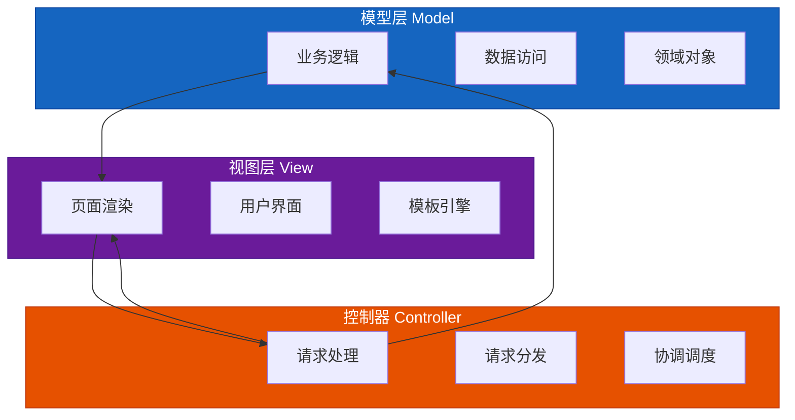
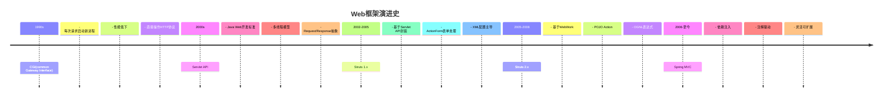
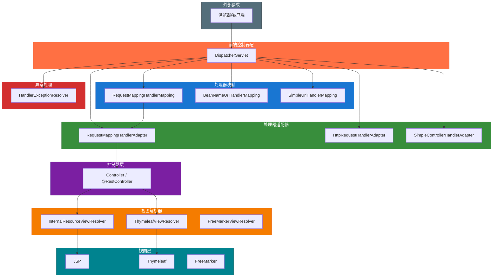
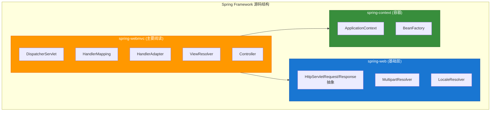
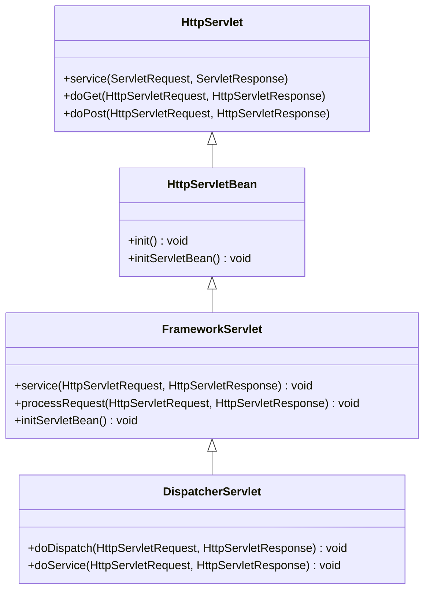
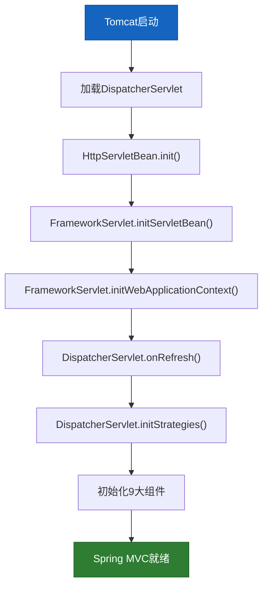

# 第1章 Spring MVC 概述与架构设计

## 1.1 MVC模式回顾与Web框架演进

### 1.1.1 MVC模式起源

MVC（Model-View-Controller）模式最早由Trygve Reenskaug于1978年提出，最初应用于Smalltalk-80图形用户界面框架。其核心思想是**分离关注点**，将应用程序分为三个核心部分：



### 1.1.2 Web框架演进历程



### 1.1.3 Spring MVC的诞生背景

Spring MVC于2002年首次发布，旨在解决当时Java Web开发中的痛点：

| 问题 | Struts解决方案 | Spring MVC解决方案 |
|------|---------------|-------------------|
| 耦合度 | Action与Servlet API紧耦合 | IoC容器管理 |
| 可测试性 | 难以单元测试 | POJO，易于测试 |
| 配置方式 | XML主导 | 注解+配置混合 |
| 灵活性和扩展性 | 扩展困难 | 组件化架构 |

---

## 1.2 Spring MVC核心组件概述

### 1.2.1 组件全景图



### 1.2.2 核心组件职责

| 组件 | 类名 | 职责描述 |
|------|------|----------|
| **DispatcherServlet** | `org.springframework.web.servlet.DispatcherServlet` | 前端控制器，统一调度请求处理 |
| **HandlerMapping** | 多种实现 | 根据URL找到对应的Handler（Controller方法） |
| **HandlerAdapter** | 多种实现 | 适配不同类型的Handler执行 |
| **HandlerExceptionResolver** | 多种实现 | 统一异常处理机制 |
| **ViewResolver** | 多种实现 | 解析视图名称，返回实际视图对象 |
| **LocaleResolver** | `org.springframework.web.servlet.LocaleResolver` | 国际化信息解析 |
| **ThemeResolver** | `org.springframework.web.servlet.ThemeResolver` | 主题样式解析 |
| **MultipartResolver** | `org.springframework.web.multipart.*` | 文件上传解析 |

### 1.2.3 Spring MVC默认组件配置

Spring MVC的默认组件配置位于 `DispatcherServlet.properties`：

```properties
# 文件位置: spring-webmvc/src/main/resources/org/springframework/web/servlet/DispatcherServlet.properties

# HandlerMapping - 请求映射
org.springframework.web.servlet.HandlerMapping=\
    org.springframework.web.servlet.handler.BeanNameUrlHandlerMapping,\
    org.springframework.web.servlet.servlet.config.annotation.HandlerMappingRegistry

# HandlerAdapter - 处理器适配器
org.springframework.web.servlet.HandlerAdapter=\
    org.springframework.web.servlet.mvc.HttpRequestHandlerAdapter,\
    org.springframework.web.servlet.mvc.SimpleControllerHandlerAdapter,\
    org.springframework.web.servlet.function.support.HandlerFunctionAdapter

# HandlerExceptionResolver - 异常处理
org.springframework.web.servlet.HandlerExceptionResolver=\
    org.springframework.web.servlet.handler.AnnotationMethodHandlerExceptionResolver,\
    org.springframework.web.servlet.mvc.method.annotation.ExceptionHandlerExceptionResolver,\
    org.springframework.web.servlet.mvc.annotation.ResponseStatusExceptionResolver,\
    org.springframework.web.servlet.mvc.support.DefaultHandlerExceptionResolver

# ViewResolver - 视图解析
org.springframework.web.servlet.ViewResolver=\
    org.springframework.web.servlet.view.InternalResourceViewResolver

# LocaleResolver - 国际化
org.springframework.web.servlet.LocaleResolver=\
    org.springframework.web.servlet.i18n.AcceptHeaderLocaleResolver

# ThemeResolver - 主题
org.springframework.web.servlet.ThemeResolver=\
    org.springframework.web.servlet.theme.ThemeResolver

# MultipartResolver - 文件上传
org.springframework.web.servlet.MultipartResolver=\
    org.springframework.web.multipart.support.StandardServletMultipartResolver
```

---

## 1.3 Spring MVC请求处理总体流程

### 1.3.1 请求处理完整流程图

```mermaid
sequenceDiagram
    participant Client as 浏览器客户端
    participant DS as DispatcherServlet
    participant HM as HandlerMapping
    participant HA as HandlerAdapter
    participant C as Controller
    participant VR as ViewResolver
    participant V as View

    Client->>+DS: HTTP请求 (GET/POST /api/users/1)

    rect rgb(21, 48, 83)
        Note over DS: 请求预处理阶段
        DS->>DS: 1. LocaleResolver解析Locale
        DS->>DS: 2. ThemeResolver解析Theme
        DS->>DS: 3. MultipartResolver检查文件上传
    end

    rect rgb(92, 51, 16)
        Note over DS,HM: 请求映射阶段
        DS->>+HM: 4. HandlerMapping查找Handler
        HM-->>-DS: HandlerExecutionChain (Handler + Interceptors)
    end

    rect rgb(20, 83, 45)
        Note over DS,HA: 处理器执行阶段
        DS->>+HA: 5. HandlerAdapter适配执行
        HA->>+C: 6. Controller业务处理
        C-->>-HA: ModelAndView
        HA-->>-DS: ModelAndView
    end

    rect rgb(88, 28, 59)
        Note over DS,VR: 视图解析阶段
        alt 视图名称不为空
            DS->>+VR: 7. ViewResolver解析视图
            VR-->>-DS: View对象
        end
    end

    rect rgb(59, 36, 101)
        Note over DS,V: 视图渲染阶段
        DS->>+V: 8. View.render()渲染视图
        V->>V: 9. 模板引擎渲染/JSON序列化
        V-->>-DS: 渲染结果
    end

    DS-->>-Client: HTTP响应 (HTML/JSON)

    rect rgb(100, 30, 30)
        Note over DS: 异常处理（如有）
        DS->>DS: HandlerExceptionResolver处理异常
    end
```



### 1.3.2 核心流程时序图

```mermaid
flowchart sequential
    subgraph Phase1["阶段一：请求接收"]
        A1["Tomcat接收HTTP请求"]
        A2["Filter链处理"]
        A3["DispatcherServlet.doDispatch()"]
    end

    subgraph Phase2["阶段二：处理器映射"]
        B1["HandlerMapping根据URL查找"]
        B2["返回HandlerExecutionChain"]
        B3["执行PreHandle拦截器"]
    end

    subgraph Phase3["阶段三：处理器执行"]
        C1["HandlerAdapter调用Handler"]
        C2["Controller执行业务逻辑"]
        C3["返回ModelAndView"]
    end

    subgraph Phase4["阶段四：视图解析"]
        D1["ViewResolver解析视图名"]
        D2["返回具体View对象"]
    end

    subgraph Phase5["阶段五：视图渲染"]
        E1["View.render()渲染"]
        E2["模型数据填充到视图"]
        E3["生成最终响应内容"]
    end

    subgraph Phase6["阶段六：请求清理"]
        F1["执行PostHandle拦截器"]
        F2["执行AfterCompletion拦截器"]
        F3["返回HTTP响应"]
    end

    Phase1 --> Phase2
    Phase2 --> Phase3
    Phase3 --> Phase4
    Phase4 --> Phase5
    Phase5 --> Phase6

    style Phase1 fill:#c62828,stroke:#b71c1c,color:#ffffff
    style Phase2 fill:#f9a825,stroke:#f57f17,color:#000000
    style Phase3 fill:#2e7d32,stroke:#1b5e20,color:#ffffff
    style Phase4 fill:#1565c0,stroke:#0d47a1,color:#ffffff
    style Phase5 fill:#7b1fa2,stroke:#4a148c,color:#ffffff
    style Phase6 fill:#4e342e,stroke:#3e2723,color:#ffffff
```

### 1.3.3 doDispatch方法核心逻辑

`DispatcherServlet.doDispatch()` 是整个请求处理的核心入口：

```java
// 源码位置: spring-webmvc/src/main/java/org/springframework/web/servlet/DispatcherServlet.java
protected void doDispatch(HttpServletRequest request, HttpServletResponse response) throws Exception {
    HttpServletRequest processedRequest = request;
    HandlerExecutionChain mappedHandler = null;
    boolean multipartRequestParsed = false;

    // 1. 获取上传请求的解析器（如果有文件上传）
    MultipartResolver multipartResolver = this.getMultipartResolver();
    if (multipartResolver != null) {
        if (multipartResolver.isMultipart(processedRequest)) {
            processedRequest = multipartResolver.resolveMultipart(processedRequest);
            multipartRequestParsed = true;
        }
    }

    // 2. 根据请求获取对应的Handler（Controller方法）
    mappedHandler = getHandler(processedRequest);
    if (mappedHandler == null) {
        noHandlerFound(processedRequest, response);
        return;
    }

    // 3. 获取处理该Handler的HandlerAdapter
    HandlerAdapter ha = getHandlerAdapter(mappedHandler.getHandler());

    // 4. 处理GET请求的Last-Modified
    String method = request.getMethod();
    if (this.getServletContext().getMinorVersion() == 1) {
        maybeSetLastModified(processedRequest, mappedHandler);
    }

    // 5. 执行拦截器的PreHandle方法
    if (!mappedHandler.applyPreHandle(processedRequest, response)) {
        return;
    }

    // 6. 实际调用Handler，返回ModelAndView
    ModelAndView mv = ha.handle(processedRequest, response, mappedHandler.getHandler());

    // 7. 执行拦截器的PostHandle方法
    mappedHandler.applyPostHandle(processedRequest, response, mv);

    // 8. 处理异常（如果有）
    processDispatchResult(processedRequest, response, mappedHandler, mv, null);

    // 9. 清理资源（如果是文件上传请求）
    if (multipartRequestParsed) {
        multipartResolver.cleanupMultipart(processedRequest);
    }
}
```

---

## 1.4 环境准备与源码阅读技巧

### 1.4.1 源码下载与导入

**步骤1：下载Spring Framework源码**

```bash
# 使用Git克隆Spring Framework仓库
git clone https://github.com/spring-projects/spring-framework.git
cd spring-framework

# 切换到6.x分支（本书基于Spring Framework 6.x）
git checkout 6.1.x
```

**步骤2：导入IDE**

推荐使用IntelliJ IDEA：

1. File -> Open -> 选择spring-framework根目录
2. 等待Gradle构建完成（约10-15分钟）
3. 找到 `spring-webmvc` 模块作为主要阅读对象

### 1.4.2 核心模块结构



### 1.4.3 源码阅读技巧

**技巧1：从入口点开始追踪**

```
推荐阅读顺序：
1. DispatcherServlet.doDispatch()  ← 入口点
2. → getHandler()                  ← HandlerMapping
3. → getHandlerAdapter()           ← HandlerAdapter
4. → ha.handle()                   ← Controller执行
5. → processDispatchResult()       ← 视图解析/异常处理
```

**技巧2：使用UML类图理解继承关系**



**技巧3：理解Spring MVC的启动初始化流程**



**技巧4：善用调试功能**

```java
// 在关键位置添加断点：
// 1. DispatcherServlet.doDispatch() - 请求入口
// 2. HandlerMapping.getHandler() - URL映射查找
// 3. HandlerAdapter.handle() - 控制器执行
// 4. View.render() - 视图渲染
```

### 1.4.4 关键源码位置速查表

| 功能 | 源码文件 | 行号范围 |
|------|----------|----------|
| DispatcherServlet入口 | `DispatcherServlet.java` | 900-1000 |
| doDispatch方法 | `DispatcherServlet.java` | ~920 |
| HandlerMapping接口 | `HandlerMapping.java` | - |
| RequestMappingHandlerMapping | `RequestMappingHandlerMapping.java` | - |
| HandlerAdapter接口 | `HandlerAdapter.java` | - |
| ViewResolver接口 | `ViewResolver.java` | - |
| 异常处理 | `HandlerExceptionResolver.java` | - |

### 1.4.5 推荐的调试练习

**练习1：追踪一个简单请求**

请求：`GET http://localhost:8080/api/users/1`

预期流程：
```
浏览器 → Tomcat → Filter → DispatcherServlet
    → HandlerMapping (RequestMappingHandlerMapping)
    → HandlerAdapter (RequestMappingHandlerAdapter)
    → @GetMapping方法
    → 返回 @ResponseBody User
    → JSON序列化
    → 响应
```

**练习2：观察文件上传请求的特殊处理**

```java
// 在MultipartResolver.multipartResolver()处设置断点
// 观察文件上传请求如何被包装为MultipartHttpServletRequest
```

---

## 本章小结

本章介绍了Spring MVC的基本概念和架构设计：

1. **MVC模式**：起源于Smalltalk，经过多年演进，Spring MVC成为Java Web开发的主流框架

2. **核心组件**：包括前端控制器(DispatcherServlet)、处理器映射(HandlerMapping)、处理器适配器(HandlerAdapter)、视图解析器(ViewResolver)等9大组件

3. **请求处理流程**：从请求接收→处理器映射→处理器执行→视图解析→视图渲染的完整链路

4. **环境准备**：掌握源码下载、IDE导入和调试技巧

下一章我们将深入分析 **DispatcherServlet** 的核心实现，理解它如何初始化以及如何分发请求。

---

**参考资料**

- Spring Framework 6.1.x 官方源码：https://github.com/spring-projects/spring-framework
- Spring MVC官方文档：https://docs.spring.io/spring-framework/reference/web/webmvc.html
