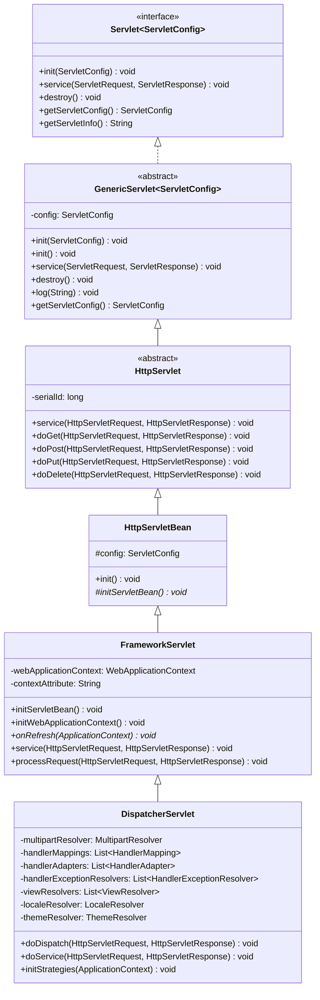
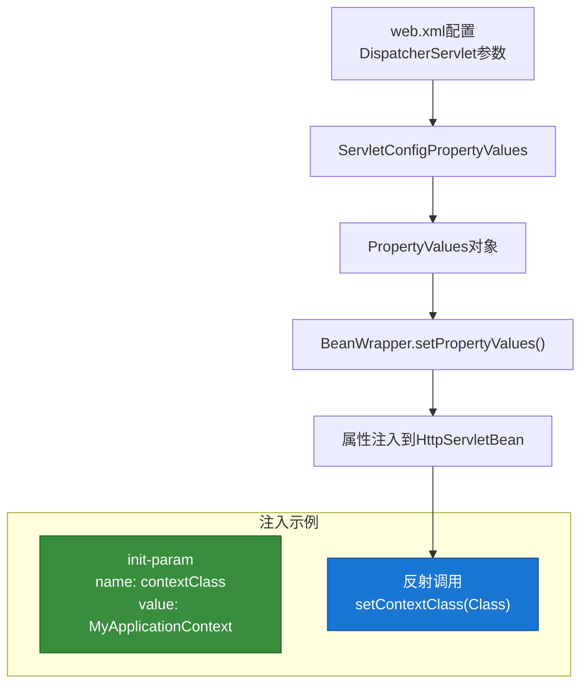
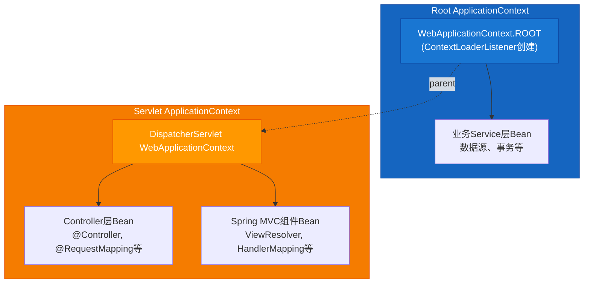
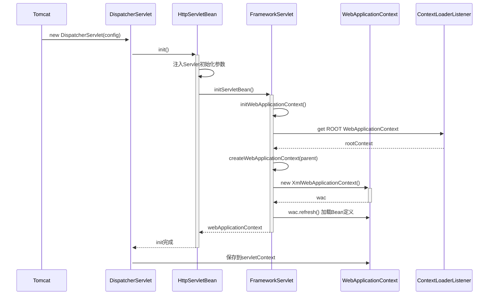
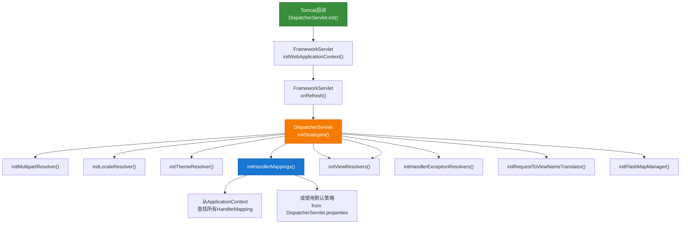
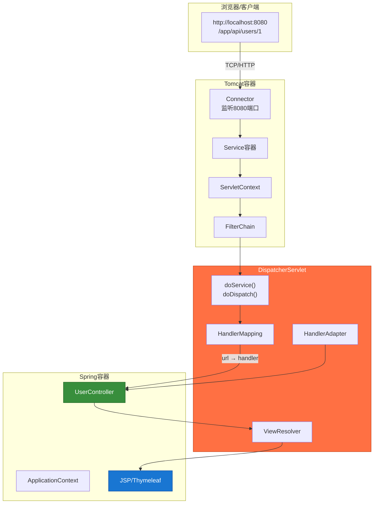
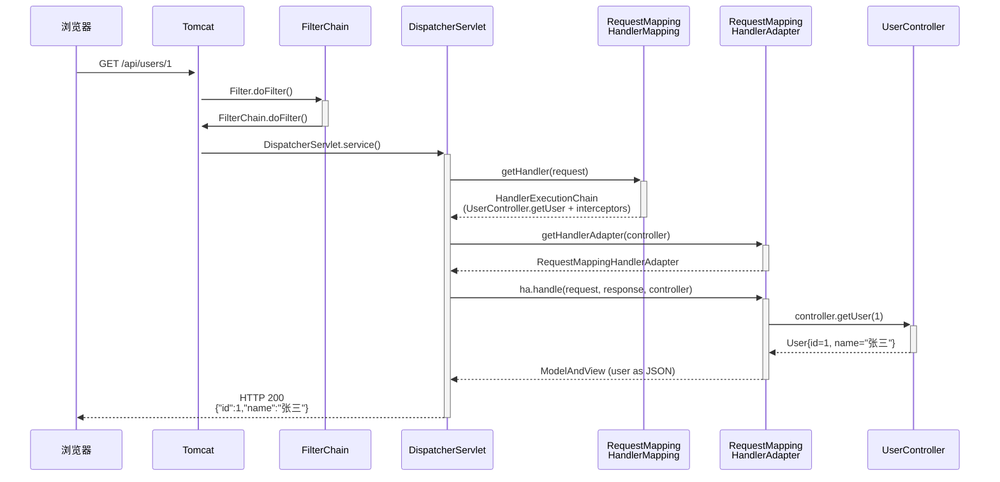
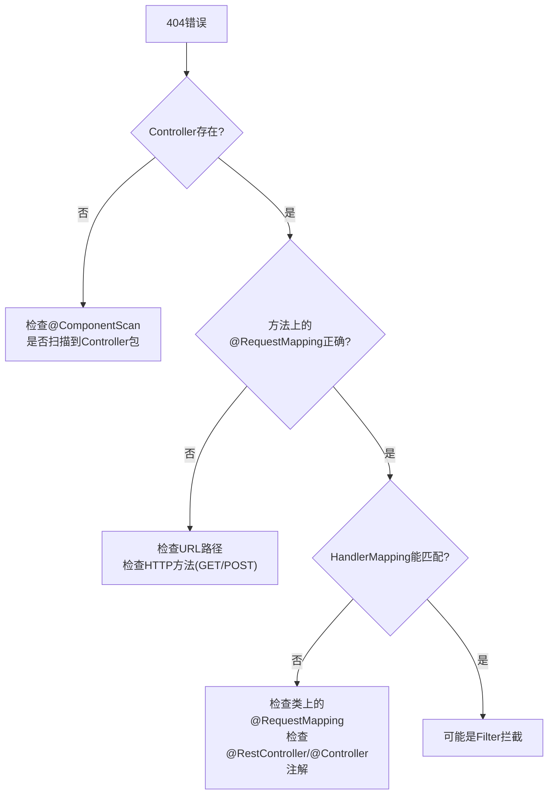

# 第2章 DispatcherServlet 核心分析

## 2.1 DispatcherServlet继承体系

### 2.1.1 类图详解



### 2.1.2 各层职责说明

| 类 | 职责 | 关键方法 |
|---|------|----------|
| **HttpServletBean** | 将Servlet初始化参数注入到Bean属性 | `init()` |
| **FrameworkServlet** | 初始化WebApplicationContext | `initWebApplicationContext()` |
| **DispatcherServlet** | 请求分发与视图解析 | `doDispatch()` |

### 2.1.3 继承体系各版本演进


---

## 2.2 HttpServletBean初始化

### 2.2.1 源码解析

`HttpServletBean` 是Spring MVC中第一个参与初始化的类，它的核心作用是**将Servlet初始化参数注入到Bean属性中**。

```java
// 源码位置: spring-web/src/main/java/org/springframework/web/servlet/HttpServletBean.java

/**
 * 覆盖init方法，在Bean属性设置完成后调用initServletBean
 */
@Override
public final void init() throws ServletException {
    // 1. 记录日志
    if (logger.isDebugEnabled()) {
        logger.debug("Initializing servlet '" + getServletName() + "'");
    }

    // 2. 获取Servlet初始化参数，放入PropertyValues
    long startTime = System.currentTimeMillis();
    try {
        // 将this.config.getInitParameterNames()和getInitParameterValues()
        // 封装成PropertyValues对象
        PropertyValues pvs = new ServletConfigPropertyValues(getServletConfig());
        // 将Bean属性值注入到当前servlet对象中
        BeanWrapper bw = PropertyAccessorFactory.forBeanPropertyAccess(this);
        // 设置ResourceLoader为当前servlet
        ResourceLoader resourceLoader = new ServletContextResourceLoader(getServletContext());
        bw.registerCustomEditor(Resource.class, new ResourceEditor(resourceLoader, getEnvironment()));
        // 触发属性注入
        initBeanWrapper(bw);
        bw.setPropertyValues(pvs, true);
    } catch (BeansException ex) {
        logger.error("Failed to set servlet properties from ServletConfig", ex);
        throw ex;
    }

    // 3. 调用子类的初始化Bean方法（模板方法模式）
    initServletBean();

    if (logger.isDebugEnabled()) {
        logger.debug("Servlet '" + getServletName() + "' configured successfully in " +
            (System.currentTimeMillis() - startTime) + " ms");
    }
}

/**
 * 模板方法，子类实现具体的初始化逻辑
 */
protected void initServletBean() throws ServletException {
    // 默认空实现
}
```

### 2.2.2 初始化参数注入机制



### 2.2.3 web.xml配置示例

```xml
<!-- web.xml 配置 -->
<servlet>
    <servlet-name>dispatcher</servlet-name>
    <servlet-class>org.springframework.web.servlet.DispatcherServlet</servlet-class>
    <init-param>
        <param-name>contextClass</param-name>
        <param-value>org.springframework.web.context.support.AnnotationConfigWebApplicationContext</param-value>
    </init-param>
    <init-param>
        <param-name>contextConfigLocation</param-name>
        <param-value>com.example.AppConfig</param-value>
    </init-param>
    <load-on-startup>1</load-on-startup>
</servlet>

<servlet-mapping>
    <servlet-name>dispatcher</servlet-name>
    <url-pattern>/</url-pattern>
</servlet-mapping>
```

### 2.2.4 注入过程详解

```java
// 源码位置: spring-beans/src/main/java/org/springframework/beans/BeanWrapper.java

// 假设我们在子类中定义了如下属性：
public class DispatcherServlet extends FrameworkServlet {
    private String contextClass;  // 对应init-param的contextClass
    private String contextConfigLocation;  // 对应init-param的contextConfigLocation
}

// HttpServletBean.init()中会执行：
bw.setPropertyValues(pvs, true);
// 等价于调用：
this.setContextClass(contextClassValue);
this.setContextConfigLocation(contextConfigLocationValue);
```

---

## 2.3 FrameworkServlet初始化

### 2.3.1 源码解析

`FrameworkServlet` 重写了 `initServletBean()` 方法，用于初始化 **WebApplicationContext**。

```java
// 源码位置: spring-web/src/main/java/org/springframework/web/servlet/FrameworkServlet.java

@Override
protected final void initServletBean() throws ServletException {
    getServletContext().log("Initializing Spring DispatcherServlet '" + getServletName() + "'");

    long startTime = System.currentTimeMillis();
    try {
        // 初始化WebApplicationContext
        this.webApplicationContext = initWebApplicationContext();
    } catch (BeansException ex) {
        getServletContext().log("Context initialization failed", ex);
        throw ex;
    }

    if (logger.isDebugEnabled()) {
        logger.debug("DispatcherServlet '" + getServletName() + "' initialization completed in " +
            (System.currentTimeMillis() - startTime) + " ms");
    }
}

/**
 * 核心方法：初始化WebApplicationContext
 */
protected WebApplicationContext initWebApplicationContext() {
    // 1. 先从ServletContext中获取父ApplicationContext（Spring容器）
    WebApplicationContext rootContext = null;
    Object wac = getServletContext().getAttribute(WebApplicationContext.ROOT_WEB_APPLICATION_CONTEXT_ATTRIBUTE);
    if (wac instanceof WebApplicationContext) {
        rootContext = (WebApplicationContext) wac;
    }

    // 2. 确定是否有专属的WebApplicationContext
    WebApplicationContext wacToUse = null;
    if (this.webApplicationContext != null) {
        // 如果构造器中已经传入（在子类构造器中可能设置）
        wacToUse = this.webApplicationContext;
        if (wacToUse instanceof ConfigurableWebApplicationContext cwc) {
            if (!cwc.isActive()) {
                if (cwc.getParent() == null) {
                    cwc.setParent(rootContext);
                }
                configureAndRefreshWebApplicationContext(cwc);
            }
        }
    }

    if (wacToUse == null) {
        // 3. 创建新的WebApplicationContext
        wacToUse = createWebApplicationContext(rootContext);
    }

    // 4. 触发刷新（加载Bean定义等）
    if (wacToUse instanceof ConfigurableWebApplicationContext cwc) {
        if (!cwc.isActive()) {
            cwc.setParent(rootContext);
            cwc.refresh();
        }
    }

    return wacToUse;
}

/**
 * 创建WebApplicationContext
 */
protected WebApplicationContext createWebApplicationContext(@Nullable WebApplicationContext parent) {
    // 获取contextClass，默认是XmlWebApplicationContext或AnnotationConfigWebApplicationContext
    Class<?> contextClass = getContextClass();
    if (!ConfigurableWebApplicationContext.class.isAssignableFrom(contextClass)) {
        throw new ApplicationContextException("...");
    }

    ConfigurableWebApplicationContext wac =
        (ConfigurableWebApplicationContext) BeanUtils.instantiateClass(contextClass);

    wac.setEnvironment(getEnvironment());
    wac.setParent(parent);
    wac.setServletContext(getServletContext());
    wac.setServletConfig(getServletConfig());
    wac.setNamespace(getNamespace());

    return wac;
}
```

### 2.3.2 WebApplicationContext层级结构



### 2.3.3 初始化流程时序图



---

## 2.4 DispatcherServlet初始化与请求分发

### 2.4.1 onRefresh方法 - 初始化入口

`DispatcherServlet` 继承 `FrameworkServlet`，重写了 `onRefresh()` 方法，作为初始化的真正入口。

```java
// 源码位置: spring-webmvc/src/main/java/org/springframework/web/servlet/DispatcherServlet.java

/**
 * 模板方法回调 - 在ApplicationContext刷新后调用
 */
@Override
protected void onRefresh(ApplicationContext context) {
    initStrategies(context);
}

/**
 * 初始化Spring MVC的9大组件
 */
protected void initStrategies(ApplicationContext context) {
    // 1. 初始化MultipartResolver（文件上传解析器）
    initMultipartResolver(context);

    // 2. 初始化LocaleResolver（国际化解析器）
    initLocaleResolver(context);

    // 3. 初始化ThemeResolver（主题解析器）
    initThemeResolver(context);

    // 4. 初始化HandlerMappings（处理器映射）
    initHandlerMappings(context);

    // 5. 初始化HandlerAdapters（处理器适配器）
    initHandlerAdapters(context);

    // 6. 初始化HandlerExceptionResolvers（异常处理）
    initHandlerExceptionResolvers(context);

    // 7. 初始化RequestToViewNameTranslator（请求转视图名）
    initRequestToViewNameTranslator(context);

    // 8. 初始化ViewResolvers（视图解析器）
    initViewResolvers(context);

    // 9. 初始化FlashMapManager（重定向数据管理）
    initFlashMapManager(context);
}
```

### 2.4.2 组件初始化详解

以下以 `initHandlerMappings` 为例展示组件初始化细节：

```java
// 源码位置: spring-webmvc/src/main/java/org/springframework/web/servlet/DispatcherServlet.java

private void initHandlerMappings(ApplicationContext context) {
    this.handlerMappings = null;

    // 1. 首先从ApplicationContext中查找所有HandlerMapping类型的Bean
    if (this.detectAllHandlerMappings) {
        Map<String, HandlerMapping> matchingBeans =
            BeanFactoryUtils.beansOfTypeIncludingAncestors(context, HandlerMapping.class, true, false);
        if (!matchingBeans.isEmpty()) {
            this.handlerMappings = new ArrayList<>(matchingBeans.values());
            // 排序（Order注解决定顺序）
            AnnotationAwareOrderComparator.sort(this.handlerMappings);
        }
    } else {
        // 2. 只从当前Context查找（不查找父Context）
        HandlerMapping hm = context.getBean(HANDLER_MAPPING_BEAN_NAME, HandlerMapping.class);
        this.handlerMappings = Collections.singletonList(hm);
    }

    // 3. 如果没有找到，使用默认策略
    if (this.handlerMappings == null) {
        this.handlerMappings = getDefaultStrategies(context, HandlerMapping.class);
    }

    if (logger.isDebugEnabled()) {
        logger.debug("Detected " + this.handlerMappings.size() + " HandlerMapping(s)");
    }
}
```

### 2.4.3 组件初始化流程图



### 2.4.4 doService方法 - 请求处理入口

```java
// 源码位置: spring-webmvc/src/main/java/org/springframework/web/servlet/DispatcherServlet.java

@Override
protected void doService(HttpServletRequest request, HttpServletResponse response) throws Exception {
    // 记录日志
    if (logger.isDebugEnabled()) {
        logger.debug("DispatcherServlet with name '" + getServletName() + "' processing " +
            request.getMethod() + " request for [" + getRequestUri(request) + "]");
    }

    // 保存原始request属性，供后续可能需要回滚的场景使用
    Map<String, Object> attributesSnapshot = null;
    if (WebUtils.isIncludeRequest(request)) {
        // 如果是include请求，保存原始属性
        attributesSnapshot = new HashMap<>();
        Enumeration<?> attrNames = request.getAttributeNames();
        while (attrNames.hasMoreElements()) {
            String name = (String) attrNames.nextElement();
            if (this.introspectHelper.isHandlerAttribute(name) ||
                name.startsWith(DEFAULT_STRATEGIES_PREFIX)) {
                attributesSnapshot.put(name, request.getAttribute(name));
            }
        }
    }

    // 设置框架相关属性
    request.setAttribute(WEB_APPLICATION_CONTEXT_ATTRIBUTE, getWebApplicationContext());
    request.setAttribute(LOCALE_RESOLVER_ATTRIBUTE, this.localeResolver);
    request.setAttribute(THEME_RESOLVER_ATTRIBUTE, this.themeResolver);
    request.setAttribute(THEME_SOURCE_ATTRIBUTE, getThemeSource());

    // 处理FlashMap（重定向数据）
    if (this.flashMapManager != null) {
        FlashMap flashMap = this.flashMapManager.getAndClear(request);
        if (flashMap != null) {
            if (logger.isDebugEnabled()) {
                logger.debug("Setting flash map attributes");
            }
            request.setAttribute(INPUT_FLASH_MAP_ATTRIBUTE, flashMap);
        }
    }

    // 调用实际的请求处理方法
    try {
        doDispatch(request, response);
    } finally {
        // 恢复原始属性（如有）
        if (attributesSnapshot != null) {
            restoreAttributes(request, attributesSnapshot);
        }
    }
}
```

---

## 2.5 实例：请求如何进入DispatcherServlet

### 2.5.1 完整请求处理流程



### 2.5.2 实际代码示例

**示例1：创建REST API**

```java
// UserController.java
@RestController
@RequestMapping("/api/users")
public class UserController {

    private final UserService userService;

    public UserController(UserService userService) {
        this.userService = userService;
    }

    @GetMapping("/{id}")
    public User getUser(@PathVariable Long id) {
        return userService.findById(id);
    }

    @PostMapping
    public ResponseEntity<User> createUser(@RequestBody @Valid User user) {
        User saved = userService.save(user);
        return ResponseEntity.created(URI.create("/api/users/" + saved.getId()))
                             .body(saved);
    }
}
```

**示例2：请求追踪**

当浏览器发送 `GET /api/users/1` 时，请求处理流程如下：



### 2.5.3 关键断点设置建议

| 断点位置 | 目的 | 观察内容 |
|---------|------|---------|
| `DispatcherServlet.doDispatch()` | 入口 | 所有请求入口 |
| `DispatcherServlet.getHandler()` | 映射查找 | HandlerMapping匹配过程 |
| `AbstractHandlerMapping.getHandler()` | 抽象映射 | URL → Handler |
| `RequestMappingHandlerAdapter.handle()` | 适配执行 | Controller方法调用 |
| `HandlerMethodReturnValueHandlerComposite.handleReturnValue()` | 返回值处理 | 返回值 → ModelAndView |
| `ViewResolver.resolveViewName()` | 视图解析 | 视图名 → View |
| `InternalResourceView.render()` | 视图渲染 | JSP渲染过程 |

### 2.5.4 调试练习：追踪用户登录请求

**场景**：用户登录请求 `POST /api/login`

```java
// LoginController.java
@RestController
@RequestMapping("/api")
public class LoginController {

    @PostMapping("/login")
    public ResponseEntity<?> login(@RequestBody LoginRequest request, HttpSession session) {
        User user = userService.authenticate(request.getUsername(), request.getPassword());
        if (user != null) {
            session.setAttribute("user", user);
            return ResponseEntity.ok(Map.of("message", "登录成功", "user", user));
        }
        return ResponseEntity.status(401).body(Map.of("message", "用户名或密码错误"));
    }
}
```

**追踪步骤**：

1. **请求入口**：`DispatcherServlet.doDispatch()` 断点 - 确认请求进入

2. **URL映射**：`RequestMappingHandlerMapping.getHandler()` 断点 - 观察如何匹配到 `LoginController.login()`

3. **参数绑定**：`RequestMappingHandlerAdapter.getMethodArgumentResolvers()` - 观察 `LoginRequest` 如何从JSON反序列化

4. **Session处理**：`HandlerMethodArgumentResolver` 处理 `HttpSession` 参数

5. **返回值处理**：`RequestMappingHandlerAdapter.handleReturnValue()` - 观察 `ResponseEntity` 如何被处理

6. **响应输出**：Jackson序列化 `User` 对象为JSON

### 2.5.5 常见问题排查

**问题1：404 Not Found**



**问题2：500 Internal Server Error**

```
排查路径：
1. DispatcherServlet.doDispatch() catch块
2. HandlerExceptionResolver处理
3. @ExceptionHandler方法
4. 查看控制台日志和断点
```

---

## 本章小结

本章深入分析了 **DispatcherServlet** 的核心实现：

1. **继承体系**：从 `Servlet` → `GenericServlet` → `HttpServlet` → `HttpServletBean` → `FrameworkServlet` → `DispatcherServlet` 的完整继承链

2. **HttpServletBean初始化**：将Servlet初始化参数注入到Bean属性中

3. **FrameworkServlet初始化**：创建和管理 `WebApplicationContext`，建立父子容器关系

4. **DispatcherServlet初始化**：通过 `onRefresh()` → `initStrategies()` 初始化Spring MVC的9大组件

5. **请求分发机制**：`doService()` → `doDispatch()` 核心流程

6. **实际案例**：通过代码示例和调试技巧，掌握请求追踪方法

下一章我们将深入分析 **HandlerMapping** 组件，理解Spring MVC如何根据URL找到对应的处理器。

---

**源码位置速查**

| 类 | 源码路径 |
|---|---------|
| DispatcherServlet | `spring-webmvc/src/main/java/org/springframework/web/servlet/DispatcherServlet.java` |
| FrameworkServlet | `spring-web/src/main/java/org/springframework/web/servlet/FrameworkServlet.java` |
| HttpServletBean | `spring-web/src/main/java/org/springframework/web/servlet/HttpServletBean.java` |
| HandlerMapping接口 | `spring-webmvc/src/main/java/org/springframework/web/servlet/HandlerMapping.java` |
| HandlerExecutionChain | `spring-webmvc/src/main/java/org/springframework/web/servlet/handler/HandlerExecutionChain.java` |

---

**参考资料**

- Spring Framework 6.1.x 源码：https://github.com/spring-projects/spring-framework
- Servlet 5.0 规范：https://jakarta.ee/specifications/servlet/5.0/
- Spring MVC官方文档：https://docs.spring.io/spring-framework/reference/web/webmvc.html
