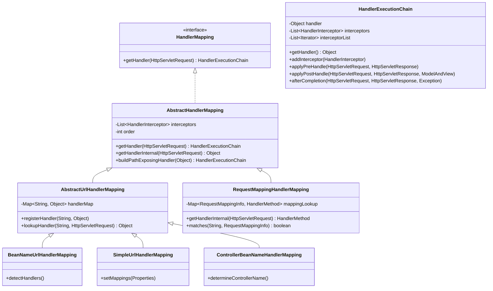
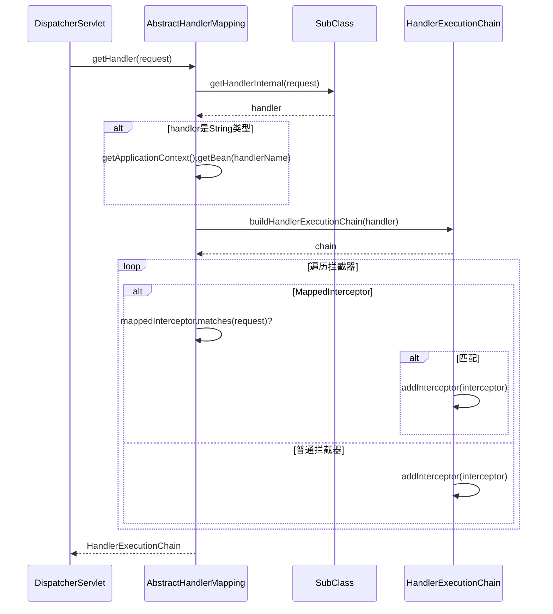
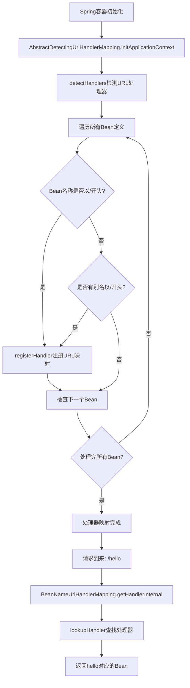
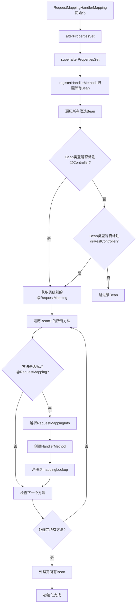
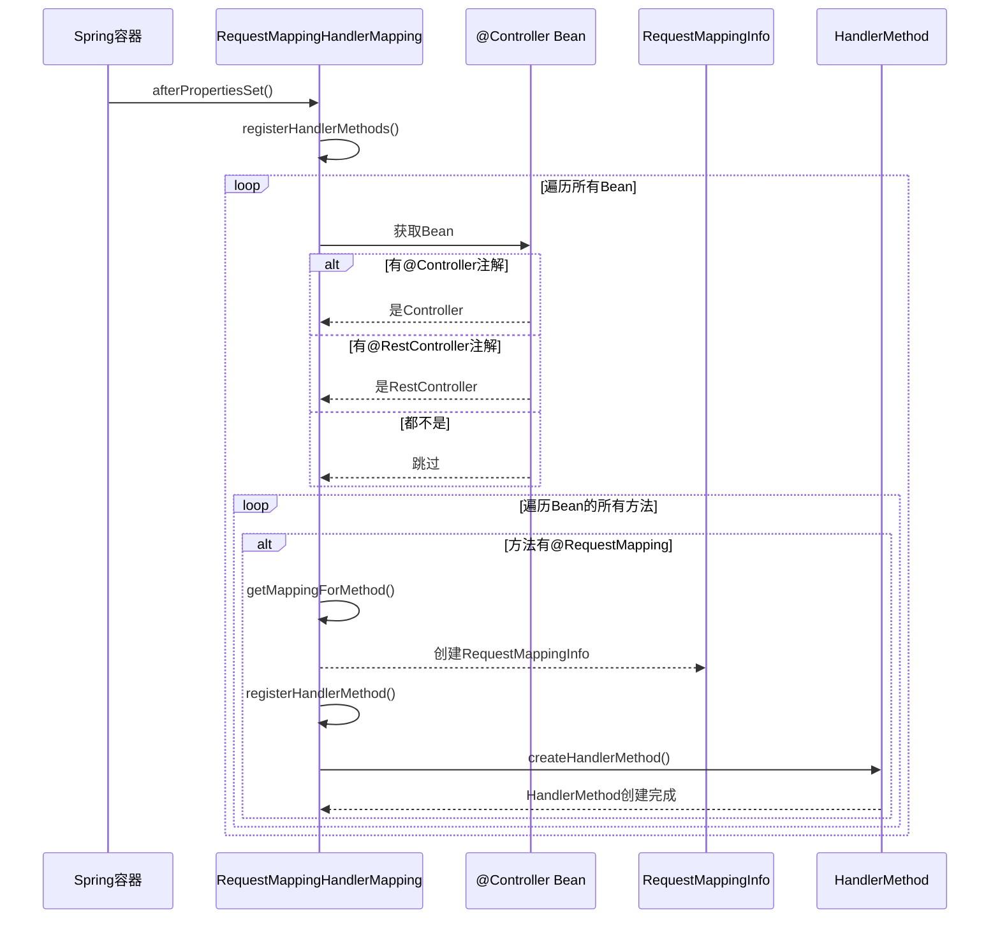
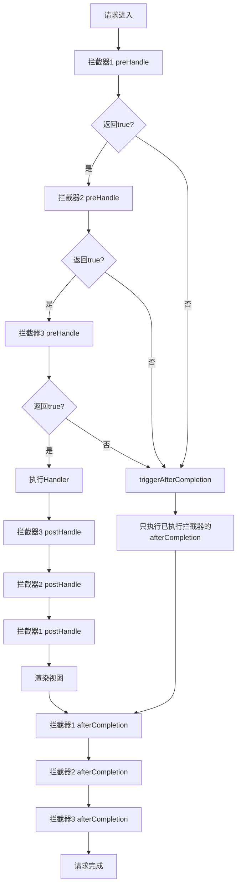
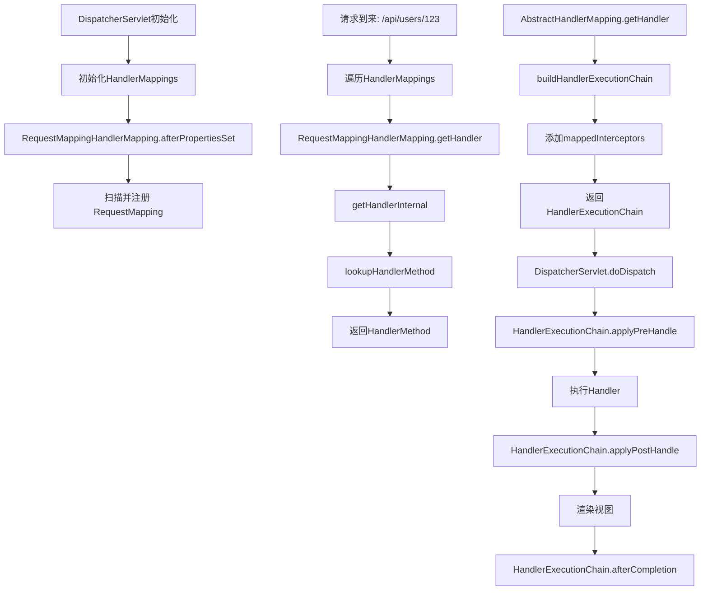

# 第3章 HandlerMapping 处理器映射

## 3.1 HandlerMapping体系结构

HandlerMapping是Spring MVC中最核心的接口之一，负责将请求路径映射到对应的处理器（Handler）。在整个请求处理链中，HandlerMapping处于最前端，决定了哪个处理器将处理当前请求。

### 3.1.1 核心接口定义

```java
public interface HandlerMapping {
    /**
     * 根据请求获取处理器执行链
     * @param request 当前HTTP请求
     * @return HandlerExecutionChain，包含处理器和拦截器列表；如果没有找到对应处理器返回null
     */
    HandlerExecutionChain getHandler(HttpServletRequest request) throws Exception;
}
```

这个接口的设计非常简洁，只定义了一个方法。返回值`HandlerExecutionChain`包含了处理器本身以及需要执行的拦截器列表。

### 3.1.2 HandlerMapping继承体系



### 3.1.3 体系结构分析

从上述继承体系可以看出，HandlerMapping的实现遵循了模板方法模式：

1. **顶层接口** `HandlerMapping`：定义了最基本的功能——根据请求获取处理器

2. **抽象基类** `AbstractHandlerMapping`：
   - 提供了拦截器的管理功能
   - 实现了`getHandler`模板方法
   - 定义了抽象方法`getHandlerInternal`供子类实现

3. **URL相关映射** `AbstractUrlHandlerMapping`：
   - 处理基于URL的映射逻辑
   - 维护`handlerMap`缓存
   - 提供`lookupHandler`方法查找处理器

4. **具体实现类**：
   - `BeanNameUrlHandlerMapping`：根据Bean名称中的URL路径进行映射
   - `RequestMappingHandlerMapping`：处理`@RequestMapping`注解的映射
   - `SimpleUrlHandlerMapping`：通过配置文件定义URL到处理器的映射

## 3.2 AbstractHandlerMapping实现分析

`AbstractHandlerMapping`是所有HandlerMapping实现的基类，它采用了模板方法模式，将处理器获取的流程固化在基类中，而将具体的查找逻辑委托给子类。

### 3.2.1 源码分析

```java
public abstract class AbstractHandlerMapping extends WebApplicationObjectSupport
        implements HandlerMapping, Ordered {

    // 拦截器列表
    private final List<HandlerInterceptor> interceptors = new ArrayList<>();
    // 拦截器缓存
    private final List<HandlerInterceptor> adaptedInterceptors = new ArrayList<>();

    // 排序顺序，值越小优先级越高
    private int order = LOWEST_PRECEDENCE;

    // 公共拦截器，会应用到所有处理器
    public void setInterceptors(HandlerInterceptor... interceptors) {
        this.interceptors.addAll(Arrays.asList(interceptors));
    }

    @Override
    protected void initApplicationContext() throws BeansException {
        // 模板方法：允许子类注册拦截器
        extendInterceptors(this.interceptors);
        // 检测并注册WebRequestInterceptor
        detectInterceptors();
    }

    // 检测并适配拦截器
    private void detectInterceptors() {
        for (HandlerInterceptor interceptor : this.interceptors) {
            if (interceptor instanceof WebRequestInterceptor) {
                // 将WebRequestInterceptor适配为HandlerInterceptor
                this.adaptedInterceptors.add(
                    new WebRequestHandlerInterceptorAdapter((WebRequestInterceptor) interceptor));
            } else {
                this.adaptedInterceptors.add(interceptor);
            }
        }
    }

    @Override
    public final HandlerExecutionChain getHandler(HttpServletRequest request) throws Exception {
        // 1. 子类实现：获取具体处理器
        Object handler = getHandlerInternal(request);
        if (handler == null) {
            return null;
        }

        // 2. 如果处理器是String类型，视为Bean名称进行查找
        if (handler instanceof String) {
            String handlerName = (String) handler;
            handler = getApplicationContext().getBean(handlerName);
        }

        // 3. 构建处理器执行链，包含拦截器
        HandlerExecutionChain chain = buildHandlerExecutionChain(handler, request);

        // 4. 应用自定义拦截器扩展点
        if (this.interceptors != null) {
            for (HandlerInterceptor interceptor : this.interceptors) {
                if (interceptor instanceof MappedInterceptor) {
                    MappedInterceptor mappedInterceptor = (MappedInterceptor) interceptor;
                    // 检查拦截器是否适用于当前路径
                    if (mappedInterceptor.matches(request)) {
                        chain.addInterceptor(mappedInterceptor.getInterceptor());
                    }
                } else {
                    chain.addInterceptor(interceptor);
                }
            }
        }

        return chain;
    }

    // 抽象方法：子类实现具体的处理器查找逻辑
    protected abstract Object getHandlerInternal(HttpServletRequest request) throws Exception;

    // 构建处理器执行链
    protected HandlerExecutionChain buildHandlerExecutionChain(
            Object handler, HttpServletRequest request) {
        if (handler instanceof HandlerExecutionChain) {
            return (HandlerExecutionChain) handler;
        }
        return new HandlerExecutionChain(handler);
    }
}
```

### 3.2.2 流程图解



### 3.2.3 关键设计点

1. **拦截器适配机制**：`AbstractHandlerMapping`能够自动将`WebRequestInterceptor`适配为`HandlerInterceptor`，这是Spring MVC早期设计的兼容性考虑。

2. **MappedInterceptor支持**：支持基于路径匹配的拦截器，只有路径匹配时才添加拦截器。

3. **模板方法模式**：`getHandlerInternal`由子类实现，体现了"算法骨架在基类，具体实现延迟到子类"的设计原则。

4. **处理器链构建**：`buildHandlerExecutionChain`方法将处理器和拦截器组装成`HandlerExecutionChain`，为后续的拦截器调用奠定基础。

## 3.3 BeanNameUrlHandlerMapping实现

`BeanNameUrlHandlerMapping`是一种简单的HandlerMapping实现，它根据Bean的名称（包含URL路径）来映射处理器。这种方式适用于小型项目或原型开发。

### 3.3.1 工作原理

`BeanNameUrlHandlerMapping`会自动检测Spring容器中所有Bean的名称，如果Bean名称以斜杠（`/`）开头，就将其注册为URL处理器。

### 3.3.2 源码分析

```java
public class BeanNameUrlHandlerMapping extends AbstractDetectingUrlHandlerMapping {

    /**
     * 检测所有候选Bean名称中的URL映射
     */
    @Override
    public void detectHandlers() throws BeansException {
        // 获取容器中所有Bean的名称
        String[] beanNames = obtainApplicationContext().getBeanDefinitionNames();

        for (String beanName : beanNames) {
            // 获取Bean的原始名称（未处理别名）
            String[] aliases = obtainApplicationContext().getAliases(beanName);

            for (String url : aliases) {
                // 如果名称以/开头，注册为URL处理器
                if (url.startsWith("/")) {
                    registerHandler(url, beanName);
                }
            }

            // 检查Bean名称本身
            if (beanName.startsWith("/")) {
                registerHandler(beanName, beanName);
            }
        }
    }
}
```

### 3.3.3 父类 AbstractDetectingUrlHandlerMapping

```java
public abstract class AbstractDetectingUrlHandlerMapping extends AbstractUrlHandlerMapping {

    @Override
    public void initApplicationContext() throws BeansException {
        // 调用子类实现的detectHandlers方法
        super.initApplicationContext();
        // 模板方法：让子类可以扩展初始化逻辑
        detectHandlers();
    }

    // 抽象方法：子类实现具体的处理器检测逻辑
    protected abstract void detectHandlers() throws BeansException;
}
```

### 3.3.4 使用示例

```java
// Spring配置类
@Configuration
public class WebConfig {

    // Bean名称以/开头，会被BeanNameUrlHandlerMapping自动注册
    @Bean("/hello")
    public String helloHandler() {
        return "Hello Controller";
    }

    @Bean("/user/*")
    public UserController userHandler() {
        return new UserController();
    }
}

// 控制器类
@Controller
public class UserController {
    // Bean名称是"userController"，不会自动映射为URL
    // 因为没有以/开头
}

@Component
public class AdminController {
    // Bean名称是"adminController"
    // 但可以手动指定名称以/开头
}
```

### 3.3.5 配置启用

默认情况下，`BeanNameUrlHandlerMapping`是启用的。如果需要显式启用：

```xml
<bean class="org.springframework.web.servlet.handler.BeanNameUrlHandlerMapping"/>
```

或在Java配置中：

```java
@Configuration
@EnableWebMvc
public class WebConfig implements WebMvcConfigurer {
    @Override
    public void configureHandlerMapping(List<HandlerMapping> handlerMappings) {
        // BeanNameUrlHandlerMapping已经默认配置
    }
}
```

### 3.3.6 流程图



## 3.4 RequestMappingHandlerMapping（核心）

`RequestMappingHandlerMapping`是Spring MVC中最重要、使用最广泛的HandlerMapping实现。它负责处理`@RequestMapping`注解，将标注了该注解的方法注册为请求处理器。

### 3.4.1 核心数据结构

`RequestMappingHandlerMapping`内部维护了两个核心的映射结构：

```java
public class RequestMappingHandlerMapping extends AbstractHandlerMethodMapping<RequestMappingInfo> {

    // 存储URL路径到处理器方法的映射
    private final Map<TypedPaths<HandlerMethod>, RequestMappingInfo> mappingLookup = new LinkedHashMap<>();

    // 存储路径模式到处理器方法的映射（用于模式匹配）
    private final Map<PathPattern, RequestMappingInfo> pathTree = new PathPatterns<>();
}
```

### 3.4.2 初始化过程



### 3.4.3 afterPropertiesSet源码分析

```java
@Override
public void afterPropertiesSet() {
    // 调用父类的初始化方法
    super.afterPropertiesSet();

    // 允许配置跨域配置
    config.setCorsConfigurations(getCorsConfigurations());
}
```

### 3.4.4 registerHandlerMethods源码分析

```java
@Override
protected void registerHandlerMethod(Object handler, Method method, RequestMappingInfo mapping) {
    // 创建HandlerMethod包装器
    HandlerMethod handlerMethod = createHandlerMethod(handler, method);

    // 验证映射的唯一性
    validateMapping(mapping, handlerMethod);

    // 存储到映射表中
    this.mappingLookup.put(mapping, handlerMethod);

    // 设置路径到方法的映射
    for (PathPattern pattern : mapping.getPatterns()) {
        this.pathTree.put(pattern, mapping);
    }

    // 存储方法名到方法的映射（用于跨控制器的方法别名查找）
    String name = getMappingForMethod(method, handler.getClass());
    if (name != null) {
        this.handleMethods.put(name, handlerMethod);
    }
}

private void validateMapping(RequestMappingInfo mapping, HandlerMethod handlerMethod) {
    // 检查是否已存在相同路径的映射
    RequestMappingInfo existing = getMappingForPath(mapping.getPaths());
    if (existing != null && existing != mapping) {
        throw new IllegalStateException(
            "Ambiguous mapping. Cannot map '" + handlerMethod + "' to " + mapping);
    }
}
```

### 3.4.5 getHandlerInternal源码分析

```java
@Override
protected HandlerMethod getHandlerInternal(HttpServletRequest request) throws Exception {
    // 1. 获取请求路径
    String lookupPath = getUrlPathHelper().getLookupPathFor(request);

    // 2. 查找最佳匹配的处理器方法
    HandlerMethod handlerMethod = lookupHandlerMethod(lookupPath, request);

    // 3. 复制一份HandlerMethod（因为原始对象可能被缓存复用）
    if (handlerMethod != null) {
        // 应用当前请求的特定属性
        handlerMethod = handlerMethod.createWithResolvedBean();
    }

    return handlerMethod;
}

protected HandlerMethod lookupHandlerMethod(String lookupPath, HttpServletRequest request)
        throws Exception {

    List<Match> matches = new ArrayList<>();

    // 1. 精确匹配查找
    RequestMappingInfo matchingInfo = mappingLookup.get(lookupPath);
    if (matchingInfo != null) {
        matches.add(new Match(matchingInfo, Collections.emptyList()));
    }

    // 2. 模式匹配查找
    if (!matches.isEmpty()) {
        // 处理路径模式（如/hello/*）
        List<TypedPaths<HandlerMethod>> typedPaths = mappingLookup.keySet().stream()
            .filter(info -> info.getPatternsCondition() != null)
            .filter(info -> info.getPatternsCondition().getPatterns()
                .contains(lookupPath))
            .map(info -> mappingLookup.get(info))
            .map(handlerMethod -> new TypedPaths<>(lookupPath, handlerMethod))
            .collect(Collectors.toList());
    }

    // 3. 选择最佳匹配
    if (!matches.isEmpty()) {
        Match bestMatch = matches.get(0);
        if (matches.size() > 1) {
            // 多个匹配时，比较路径模式的特异性
            Comparator<Match> comparator = new MatchComparator(getPathMatcher());
            matches.sort(comparator);
            bestMatch = matches.get(0);
        }

        // 应用当前请求的匹配结果到请求属性
        request.setAttribute(BEST_MATCHING_HANDLER_ATTRIBUTE, bestMatch.handlerMethod);
        request.setAttribute(BEST_MATCHING_PATTERN_ATTRIBUTE, bestMatch.mapping);

        return bestMatch.handlerMethod;
    }

    // 4. 返回404
    return null;
}
```

### 3.4.6 @RequestMapping注册流程详解



### 3.4.7 实际应用场景

#### 场景1：基础控制器

```java
@RestController
@RequestMapping("/api/users")
public class UserController {

    @GetMapping("/{id}")
    public User getUser(@PathVariable Long id) {
        return userService.findById(id);
    }

    @PostMapping
    public User createUser(@RequestBody @Valid User user) {
        return userService.save(user);
    }

    @PutMapping("/{id}")
    public User updateUser(@PathVariable Long id, @RequestBody User user) {
        user.setId(id);
        return userService.update(user);
    }

    @DeleteMapping("/{id}")
    public void deleteUser(@PathVariable Long id) {
        userService.deleteById(id);
    }
}
```

**注册结果：**
- `/api/users/{id}` GET → `getUser(Long id)`
- `/api/users` POST → `createUser(User user)`
- `/api/users/{id}` PUT → `updateUser(Long id, User user)`
- `/api/users/{id}` DELETE → `deleteUser(Long id)`

#### 场景2：类级别和方法级别的组合映射

```java
@Controller
@RequestMapping("/admin")
public class AdminController {

    @RequestMapping("/dashboard")
    public String dashboard() {
        return "dashboard";
    }

    @RequestMapping(value = "/users", method = RequestMethod.GET)
    public ModelAndView listUsers() {
        return new ModelAndView("user/list");
    }

    @RequestMapping(value = "/users", method = RequestMethod.POST)
    public String createUser(User user) {
        return "redirect:/admin/users";
    }
}
```

**注册结果：**
- `/admin/dashboard` → `dashboard()`
- `/admin/users` GET → `listUsers()`
- `/admin/users` POST → `createUser(User user)`

#### 场景3：路径变量和请求参数映射

```java
@RestController
@RequestMapping("/products")
public class ProductController {

    // 路径变量
    @GetMapping("/{category}/{id}")
    public Product getProduct(
            @PathVariable String category,
            @PathVariable Long id) {
        return productService.findByCategoryAndId(category, id);
    }

    // 请求参数条件映射
    @GetMapping(params = "action=search")
    public List<Product> searchProducts(@RequestParam String keyword) {
        return productService.search(keyword);
    }

    // 请求头条件映射
    @GetMapping(headers = "X-Custom-Header=value")
    public String customHeader() {
        return "custom";
    }

    // Content-Type条件映射
    @PostMapping(consumes = "application/json")
    public Product createFromJson(@RequestBody Product product) {
        return productService.save(product);
    }

    // Accept头条件映射
    @GetMapping(produces = "application/json")
    public Product getAsJson() {
        return new Product();
    }
}
```

### 3.4.8 RequestMappingInfo结构解析

`RequestMappingInfo`是存储映射元数据的核心类：

```java
public class RequestMappingInfo {
    // URL路径模式
    private final PatternsRequestCondition patternsCondition;

    // 请求方法条件（GET/POST/PUT/DELETE等）
    private final RequestMethodsRequestCondition methodsCondition;

    // 请求参数条件（param=value）
    private final ParamsRequestCondition paramsCondition;

    // 请求头条件（Header=value）
    private final HeadersRequestCondition headersCondition;

    // Content-Type条件
    private final ConsumesRequestCondition consumesCondition;

    // Accept头条件
    private final ProducesRequestCondition producesCondition;

    // 自定义条件
    private final CustomRequestCondition<?> customCondition;
}
```

**条件匹配优先级**（高到低）：
1. 精确路径匹配
2. 最长路径模式匹配
3. 请求方法匹配
4. 参数条件匹配
5. Header条件匹配
6. Content-Type/Accept条件匹配

## 3.5 HandlerExecutionChain构建过程

`HandlerExecutionChain`是处理器执行链的封装，它将处理器和拦截器组合在一起，提供了统一的调用接口。

### 3.5.1 源码分析

```java
public class HandlerExecutionChain {

    private final Object handler;
    private final List<HandlerInterceptor> interceptorList = new ArrayList<>();
    private int interceptorIndex = -1;

    public HandlerExecutionChain(Object handler) {
        this(handler, (HandlerInterceptor[]) null);
    }

    public HandlerExecutionChain(Object handler, HandlerInterceptor... interceptors) {
        if (handler instanceof HandlerExecutionChain) {
            HandlerExecutionChain chain = (HandlerExecutionChain) handler;
            this.handler = chain.getHandler();
            this.interceptorList.addAll(chain.interceptorList);
        } else {
            this.handler = handler;
        }
        if (interceptors != null) {
            this.interceptorList.addAll(Arrays.asList(interceptors));
        }
    }

    // 添加拦截器
    public void addInterceptor(HandlerInterceptor interceptor) {
        this.interceptorList.add(interceptor);
    }

    // 获取所有拦截器
    public List<HandlerInterceptor> getInterceptors() {
        return Collections.unmodifiableList(this.interceptorList);
    }

    // 预处理拦截器调用
    boolean applyPreHandle(HttpServletRequest request, HttpServletResponse response) throws Exception {
        for (int i = 0; i < this.interceptorList.size(); i++) {
            HandlerInterceptor interceptor = this.interceptorList.get(i);
            if (!interceptor.preHandle(request, response, this.handler)) {
                // 拦截器返回false，触发afterCompletion并返回false
                triggerAfterCompletion(request, response, null);
                return false;
            }
            this.interceptorIndex = i;
        }
        return true;
    }

    // 后处理拦截器调用
    void applyPostHandle(HttpServletRequest request, HttpServletResponse response,
            ModelAndView mv) throws Exception {
        for (int i = this.interceptorList.size() - 1; i >= 0; i--) {
            HandlerInterceptor interceptor = this.interceptorList.get(i);
            interceptor.postHandle(request, response, mv);
        }
    }

    // 请求完成后清理
    void triggerAfterCompletion(HttpServletRequest request, HttpServletResponse response,
            Exception ex) throws Exception {
        for (int i = this.interceptorIndex; i >= 0; i--) {
            HandlerInterceptor interceptor = this.interceptorList.get(i);
            try {
                interceptor.afterCompletion(request, response, this.handler, ex);
            } catch (Throwable ex2) {
                // 忽略异常，避免覆盖原始异常
            }
        }
    }

    // 异步请求完成后的调用
    void applyAfterConcurrentHandlingStarted(HttpServletRequest request,
            HttpServletResponse response) {
        for (int i = this.interceptorList.size() - 1; i >= 0; i--) {
            HandlerInterceptor interceptor = this.interceptorList.get(i);
            interceptor.afterConcurrentHandlingStarted(request, response, this.handler);
        }
    }
}
```

### 3.5.2 执行流程图

```mermaid
sequenceDiagram
    participant DispatcherServlet
    participant HandlerExecutionChain
    participant HandlerInterceptor1
    participant HandlerInterceptor2
    participant Handler

    DispatcherServlet->>HandlerExecutionChain: getHandler()

    rect rgb(20, 83, 45)
        Note over HandlerExecutionChain,HandlerInterceptor1: applyPreHandle - 预处理拦截器
        loop 正序遍历拦截器
            HandlerExecutionChain->>HandlerInterceptor1: preHandle(request, response, handler)
            HandlerInterceptor1-->>HandlerExecutionChain: true/false
            alt false
                HandlerExecutionChain->>HandlerExecutionChain: triggerAfterCompletion
                HandlerExecutionChain-->>DispatcherServlet: false
            end
        end
    end

    HandlerExecutionChain->>Handler: invoke handler

    rect rgb(59, 36, 101)
        Note over HandlerExecutionChain,HandlerInterceptor1: applyPostHandle - 后处理拦截器
        loop 逆序遍历拦截器
            HandlerExecutionChain->>HandlerInterceptor2: postHandle(request, response, mv)
            HandlerInterceptor2-->>HandlerExecutionChain: 完成
        end
    end

    rect rgb(92, 51, 16)
        Note over HandlerExecutionChain,HandlerInterceptor1: afterCompletion - 请求完成后清理
        loop 逆序遍历已执行的拦截器
            HandlerExecutionChain->>HandlerInterceptor1: afterCompletion(request, response, ex)
        end
    end

    HandlerExecutionChain-->>DispatcherServlet: HandlerExecutionChain完成
```



### 3.5.3 拦截器执行顺序详解



### 3.5.4 实际应用场景

#### 场景1：日志拦截器

```java
@Component
public class LoggingInterceptor implements HandlerInterceptor {

    @Override
    public boolean preHandle(HttpServletRequest request, HttpServletResponse response,
            Object handler) throws Exception {
        String uri = request.getRequestURI();
        String method = request.getMethod();
        long startTime = System.currentTimeMillis();

        request.setAttribute("startTime", startTime);
        log.info("请求开始: {} {}", method, uri);

        return true; // 继续处理
    }

    @Override
    public void postHandle(HttpServletRequest request, HttpServletResponse response,
            ModelAndView modelAndView) throws Exception {
        long startTime = (Long) request.getAttribute("startTime");
        long duration = System.currentTimeMillis() - startTime;

        log.info("请求处理完成，耗时: {}ms", duration);
    }

    @Override
    public void afterCompletion(HttpServletRequest request, HttpServletResponse response,
            Exception ex) throws Exception {
        if (ex != null) {
            log.error("请求处理异常", ex);
        }
    }
}
```

#### 场景2：认证检查拦截器

```java
@Component
public class AuthInterceptor implements HandlerInterceptor {

    @Autowired
    private TokenService tokenService;

    @Override
    public boolean preHandle(HttpServletRequest request, HttpServletResponse response,
            Object handler) throws Exception {
        // 忽略静态资源
        if (handler instanceof ResourceHttpRequestHandler) {
            return true;
        }

        String token = request.getHeader("Authorization");

        if (token == null || !tokenService.validateToken(token)) {
            response.setStatus(HttpServletResponse.SC_UNAUTHORIZED);
            response.getWriter().write("{\"error\": \"Unauthorized\"}");
            return false;
        }

        // 将用户信息存储到请求属性中
        User user = tokenService.getUserFromToken(token);
        request.setAttribute("currentUser", user);

        return true;
    }
}
```

#### 场景3：性能监控拦截器

```java
@Component
public class PerformanceInterceptor implements HandlerInterceptor {

    private static final Logger log = LoggerFactory.getLogger(PerformanceInterceptor.class);

    @Override
    public boolean preHandle(HttpServletRequest request, HttpServletResponse response,
            Object handler) throws Exception {
        request.setAttribute("startTime", System.nanoTime());
        return true;
    }

    @Override
    public void postHandle(HttpServletRequest request, HttpServletResponse response,
            ModelAndView modelAndView) throws Exception {
        // 只监控API请求
        if (!request.getRequestURI().startsWith("/api")) {
            return;
        }

        long startTime = (Long) request.getAttribute("startTime");
        long duration = (System.nanoTime() - startTime) / 1_000_000;

        if (duration > 1000) {
            log.warn("请求处理时间过长: {} {} - {}ms",
                request.getMethod(),
                request.getRequestURI(),
                duration);
        }
    }
}
```

### 3.5.5 拦截器链的并发安全性

`HandlerExecutionChain`的`interceptorIndex`字段用于跟踪已执行的拦截器，这确保了在`preHandle`返回false时，只有已执行的拦截器的`afterCompletion`会被调用。

```java
// 关键代码片段
boolean applyPreHandle(HttpServletRequest request, HttpServletResponse response) throws Exception {
    for (int i = 0; i < this.interceptorList.size(); i++) {
        HandlerInterceptor interceptor = this.interceptorList.get(i);
        if (!interceptor.preHandle(request, response, this.handler)) {
            // 记录最后执行成功的拦截器索引
            triggerAfterCompletion(request, response, null);
            return false;
        }
        this.interceptorIndex = i;  // 保存索引
    }
    return true;
}

void triggerAfterCompletion(HttpServletRequest request, HttpServletResponse response,
        Exception ex) throws Exception {
    // 从interceptorIndex开始逆序执行afterCompletion
    for (int i = this.interceptorIndex; i >= 0; i--) {
        HandlerInterceptor interceptor = this.interceptorList.get(i);
        interceptor.afterCompletion(request, response, this.handler, ex);
    }
}
```

### 3.5.6 与拦截器注册的完整流程



## 3.6 本章小结

本章详细分析了Spring MVC中HandlerMapping处理器映射的核心体系结构：

1. **接口设计**：HandlerMapping接口采用了策略模式和模板方法模式的结合
2. **继承体系**：从AbstractHandlerMapping到具体的RequestMappingHandlerMapping，形成了清晰的层次结构
3. **RequestMappingHandlerMapping**：作为最常用的实现，详细分析了@RequestMapping的注册和查找机制
4. **HandlerExecutionChain**：将处理器和拦截器组合成统一的执行链

关键设计模式：
- **模板方法模式**：`getHandlerInternal`由子类实现
- **适配器模式**：WebRequestInterceptor到HandlerInterceptor的适配
- **策略模式**：不同的HandlerMapping实现提供不同的映射策略

下一章我们将分析HandlerAdapter处理器适配器，了解如何调用这些映射到的处理器方法。
