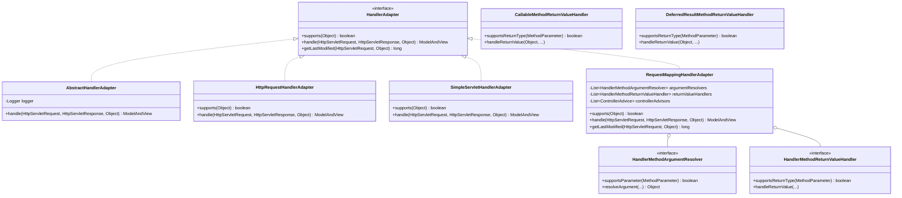
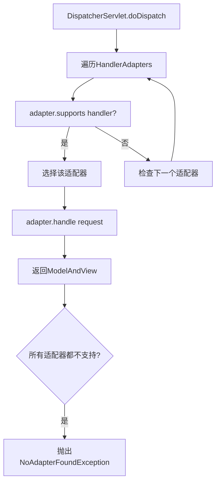
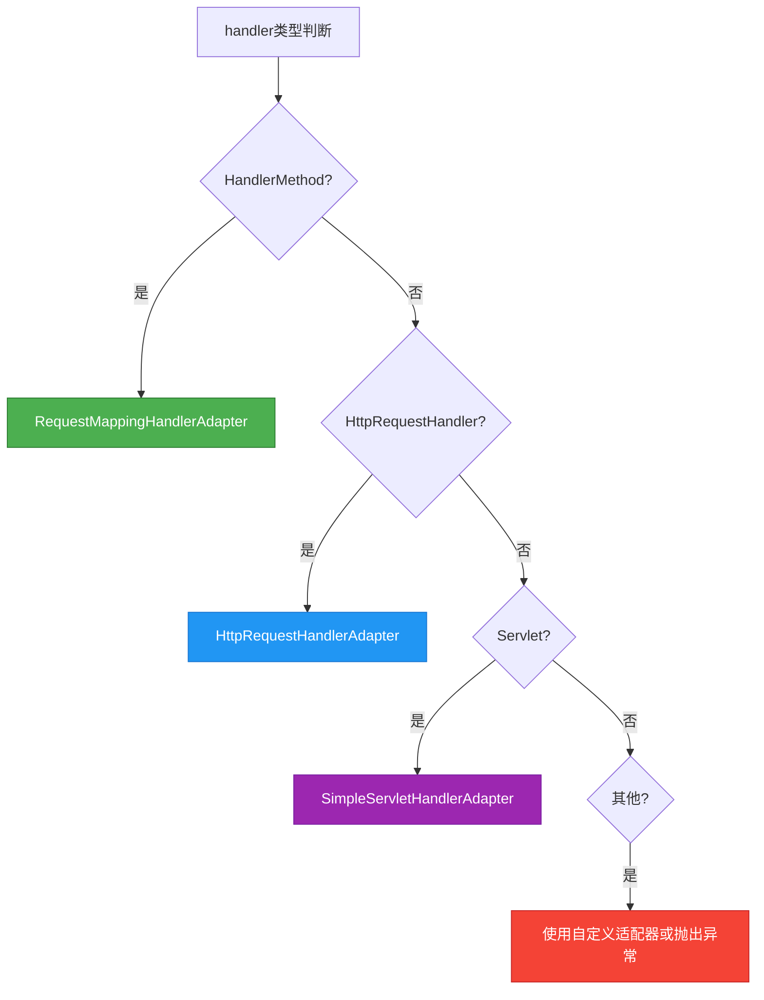
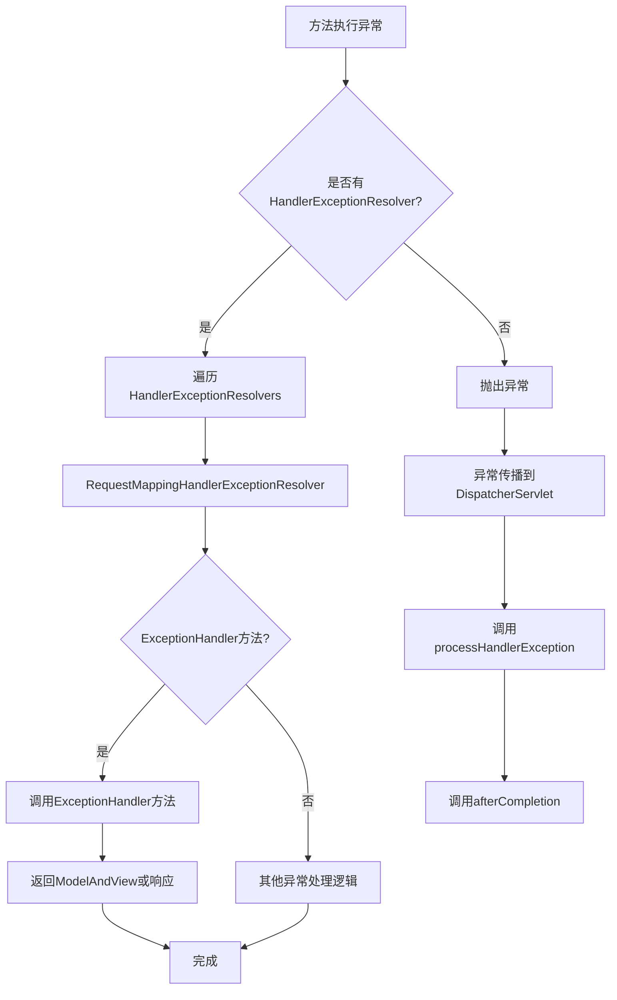

# 第4章 HandlerAdapter 处理器适配器

## 4.1 HandlerAdapter体系结构

HandlerAdapter是Spring MVC中连接HandlerMapping和具体处理器调用的桥梁。由于Spring MVC支持多种类型的处理器（Controller、Servlet、HandlerMethod等），HandlerAdapter负责屏蔽这些差异，提供统一的调用接口。

### 4.1.1 核心接口定义

```java
public interface HandlerAdapter {

    /**
     * 判断当前适配器是否支持该处理器
     * @param handler 待检查的处理器
     * @return true表示支持，false表示不支持
     */
    boolean supports(Object handler);

    /**
     * 使用当前处理器处理请求
     * @param request HTTP请求
     * @param response HTTP响应
     * @param handler 具体的处理器（由supports方法验证过）
     * @return ModelAndView，包含模型数据和视图信息
     */
    ModelAndView handle(HttpServletRequest request, HttpServletResponse response, Object handler)
            throws Exception;

    /**
     * 获取最后修改时间（用于HTTP缓存优化）
     * @since 3.0
     */
    long getLastModified(HttpServletRequest request, Object handler);
}
```

### 4.1.2 HandlerAdapter继承体系



### 4.1.3 体系结构分析

1. **顶层接口** `HandlerAdapter`：定义了适配器的标准接口
   - `supports()`：判断是否支持该处理器
   - `handle()`：执行处理器
   - `getLastModified()`：获取资源最后修改时间

2. **抽象适配器** `AbstractHandlerAdapter`：
   - 提供了通用的日志记录
   - 默认实现`getLastModified`返回-1（表示不关心）

3. **具体适配器**：
   - `HttpRequestHandlerAdapter`：处理`HttpRequestHandler`接口的实现
   - `SimpleServletHandlerAdapter`：处理`Servlet`接口的实现
   - `RequestMappingHandlerAdapter`：处理`HandlerMethod`（@RequestMapping标注的方法）

### 4.1.4 适配器选择流程



## 4.2 RequestMappingHandlerAdapter（核心）

`RequestMappingHandlerAdapter`是Spring MVC中最核心的HandlerAdapter实现，它负责调用标注了`@RequestMapping`（包括`@GetMapping`、`@PostMapping`等）注解的处理方法。

### 4.2.1 核心成员变量

```java
public class RequestMappingHandlerAdapter extends AbstractHandlerAdapter
        implements BeanFactoryAware, InitializingBean {

    // 参数解析器列表
    private List<HandlerMethodArgumentResolver> argumentResolvers;
    // 返回值处理器列表
    private List<HandlerMethodReturnValueHandler> returnValueHandlers;
    // 控制器增强器（如@ControllerAdvice）
    private List<ControllerAdvice> controllerAdvisors;

    // 参数解析器注册表
    private HandlerMethodArgumentResolverComposite argumentResolverComposite;
    // 返回值处理器组合
    private HandlerMethodReturnValueHandlerComposite returnValueHandlerComposite;

    // 是否需要通过Bean名称解析
    private boolean useExpires = false;
    private boolean useLastModified = false;

    // 并发处理管理器
    private TaskExecutor taskExecutor;

    // WebBindingInitializer
    private WebBindingInitializer webBindingInitializer;
}
```

### 4.2.2 handle方法源码分析

```java
@Override
public ModelAndView handle(HttpServletRequest request, HttpServletResponse response,
        Object handler) throws Exception {

    // 将handler转换为HandlerMethod
    HandlerMethod handlerMethod = (HandlerMethod) handler;

    // 获取或创建请求上下文
    WebRequest webRequest = new ServletWebRequest(request, response);

    // 设置HTTP缓存相关属性
    Long lastModified = getLastModified(request, handlerMethod);
    if (lastModified != null) {
        webRequest.setAttribute(RequestAttributes.SCOPE_REQUEST,
            ".LAST_MODIFIED", lastModified);
    }

    // 1. 调用所有拦截器的preHandle
    if (!handlerExecutionChain.applyPreHandle(request, response)) {
        return null;
    }

    // 2. 实际调用处理器方法
    ModelAndView mav = invokeHandlerMethod(request, response, handlerMethod);

    // 3. 调用所有拦截器的postHandle
    handlerExecutionChain.applyPostHandle(request, response, mav);

    return mav;
}
```

### 4.2.3 invokeHandlerMethod源码分析

```java
protected ModelAndView invokeHandlerMethod(HttpServletRequest request,
        HttpServletResponse response, HandlerMethod handlerMethod) throws Exception {

    // 创建WebRequest
    ServletWebRequest webRequest = new ServletWebRequest(request, response);

    // 1. 创建数据绑定工厂
    WebDataBinderFactory binderFactory = getDataBinderFactory(handlerMethod);

    // 2. 创建模型工厂
    ModelFactory modelFactory = getModelFactory(handlerMethod, binderFactory);

    // 3. 创建可调用的HandlerMethod
    ServletInvocableHandlerMethod invocableMethod = createInvocableHandlerMethod(
        handlerMethod);
    // 设置参数解析器
    invocableMethod.setHandlerMethodArgumentResolvers(argumentResolverComposite);
    // 设置返回值处理器
    invocableMethod.setHandlerMethodReturnValueHandlers(returnValueHandlerComposite);
    // 设置参数名称解析器
    invocableMethod.setParameterNameDiscoverer(parameterNameDiscoverer);

    // 4. 准备模型数据
    ModelAndViewContainer mavContainer = new ModelAndViewContainer();
    mavContainer.addAllAttributes(modelFactory.initModel(webRequest, mavContainer));

    // 5. 解析请求参数到模型
    invocableMethod.invokeAndHandle(webRequest, mavContainer);

    // 6. 获取ModelAndView
    return getModelAndView(mavContainer, handlerMethod, webRequest);
}
```

### 4.2.4 完整调用流程图

```mermaid
sequenceDiagram
    participant DispatcherServlet
    participant RequestMappingHandlerAdapter
    participant HandlerExecutionChain
    participant ServletInvocableHandlerMethod
    participant HandlerMethodArgumentResolver
    participant HandlerMethodReturnValueHandler
    participant ModelAndView

    DispatcherServlet->>RequestMappingHandlerAdapter: handle(request, response, handler)

    RequestMappingHandlerAdapter->>HandlerExecutionChain: applyPreHandle

    alt preHandle返回false
        HandlerExecutionChain-->>RequestMappingHandlerAdapter: 返回null
        RequestMappingHandlerAdapter-->>DispatcherServlet: null
    else preHandle返回true
        HandlerExecutionChain-->>RequestMappingHandlerAdapter: true
    end

    RequestMappingHandlerAdapter->>RequestMappingHandlerAdapter: invokeHandlerMethod

    rect rgb(20, 83, 45)
        Note over RequestMappingHandlerAdapter,HandlerMethodArgumentResolver: 参数解析阶段
        loop 遍历每个参数
            RequestMappingHandlerAdapter->>HandlerMethodArgumentResolver: supportsParameter?
            HandlerMethodArgumentResolver-->>RequestMappingHandlerAdapter: true/false
            alt 支持
                RequestMappingHandlerAdapter->>HandlerMethodArgumentResolver: resolveArgument
                HandlerMethodArgumentResolver-->>RequestMappingHandlerAdapter: 参数值
            end
        end
    end

    RequestMappingHandlerAdapter->>ServletInvocableHandlerMethod: invokeAndHandle

    rect rgb(59, 36, 101)
        Note over ServletInvocableHandlerMethod: 方法执行阶段
        ServletInvocableHandlerMethod->>ServletInvocableHandlerMethod: invoke
        ServletInvocableHandlerMethod-->>RequestMappingHandlerAdapter: 返回值
    end

    rect rgb(100, 30, 30)
        Note over RequestMappingHandlerAdapter,HandlerMethodReturnValueHandler: 返回值处理阶段
        loop 处理返回值
            RequestMappingHandlerAdapter->>HandlerMethodReturnValueHandler: supportsReturnType?
            HandlerMethodReturnValueHandler-->>RequestMappingHandlerAdapter: true/false
            alt 支持
                RequestMappingHandlerAdapter->>HandlerMethodReturnValueHandler: handleReturnValue
            end
        end
    end

    RequestMappingHandlerAdapter->>RequestMappingHandlerAdapter: getModelAndView

    RequestMappingHandlerAdapter->>HandlerExecutionChain: applyPostHandle

    RequestMappingHandlerAdapter-->>DispatcherServlet: ModelAndView
```



## 4.3 HandlerAdapter调用流程

### 4.3.1 DispatcherServlet中的适配器选择

```java
// DispatcherServlet.doDispatch中的核心代码
protected void doDispatch(HttpServletRequest request, HttpServletResponse response)
        throws Exception {

    HttpServletRequest processedRequest = request;
    HandlerExecutionChain mappedHandler = null;

    // 1. 获取处理器执行链
    mappedHandler = getHandler(processedRequest);
    if (mappedHandler == null) {
        noHandlerFound(processedRequest, response);
        return;
    }

    // 2. 获取处理器对应的适配器
    HandlerAdapter ha = getHandlerAdapter(mappedHandler.getHandler());

    // 3. 使用适配器调用处理器
    ModelAndView mv = ha.handle(request, response, mappedHandler.getHandler());

    // 4. 处理结果
    applyDefaultViewName(request, mv);
    mappedHandler.applyPostHandle(request, response, mv);

    // 5. 视图渲染
    processDispatchResult(request, response, mv);
}

protected HandlerAdapter getHandlerAdapter(Object handler) throws ServletException {
    for (HandlerAdapter ha : this.handlerAdapters) {
        if (ha.supports(handler)) {
            return ha;
        }
    }
    throw new ServletException("No adapter for handler [" + handler +
        "]: The DispatcherServlet needs a HandlerAdapter to handle this handler.");
}
```

### 4.3.2 三种主要适配器详解

#### HttpRequestHandlerAdapter

处理实现`HttpRequestHandler`接口的处理器：

```java
public class HttpRequestHandlerAdapter implements HandlerAdapter {

    @Override
    public boolean supports(Object handler) {
        return handler instanceof HttpRequestHandler;
    }

    @Override
    public ModelAndView handle(HttpServletRequest request,
            HttpServletResponse response, Object handler) throws Exception {

        ((HttpRequestHandler) handler).handleRequest(request, response);
        // HttpRequestHandler不返回ModelAndView
        return null;
    }

    @Override
    public long getLastModified(HttpServletRequest request, Object handler) {
        if (handler instanceof LastModified) {
            return ((LastModified) handler).getLastModified(request);
        }
        return -1;
    }
}
```

**使用示例**：

```java
@Component("/http-handler")
public class CustomHttpRequestHandler implements HttpRequestHandler {

    @Override
    public void handleRequest(HttpServletRequest request, HttpServletResponse response)
            throws ServletException, IOException {

        response.setContentType("application/json");
        response.getWriter().write("{\"message\": \"Hello from HttpRequestHandler\"}");
    }
}
```

#### SimpleServletHandlerAdapter

处理实现`Servlet`接口的处理器：

```java
public class SimpleServletHandlerAdapter implements HandlerAdapter {

    @Override
    public boolean supports(Object handler) {
        return handler instanceof Servlet;
    }

    @Override
    public ModelAndView handle(HttpServletRequest request,
            HttpServletResponse response, Object handler) throws Exception {

        ((Servlet) handler).service(request, response);
        return null;
    }
}
```

**使用示例**：

```java
@Component("/my-servlet")
public class CustomServlet implements Servlet {

    @Override
    public void init(ServletConfig config) throws ServletException {
    }

    @Override
    public ServletConfig getServletConfig() {
        return null;
    }

    @Override
    public void service(ServletRequest req, ServletResponse res)
            throws ServletException, IOException {
        HttpServletResponse response = (HttpServletResponse) res;
        response.getWriter().write("Hello from Servlet");
    }

    @Override
    public String getServletInfo() {
        return "CustomServlet";
    }

    @Override
    public void destroy() {
    }
}
```

### 4.3.3 适配器选择策略



## 4.4 ServletInvocableHandlerMethod调用链

`ServletInvocableHandlerMethod`是实际执行处理器方法的核心类，它将HTTP请求的参数绑定到方法参数，然后调用方法并处理返回值。

### 4.4.1 核心源码分析

```java
public class ServletInvocableHandlerMethod extends HandlerMethod {

    // 参数解析器组合
    private HandlerMethodArgumentResolverComposite argumentResolverComposite;
    // 返回值处理器组合
    private HandlerMethodReturnValueHandlerComposite returnValueHandlerComposite;
    // 响应状态设置器
    private ResponseStatusExceptionTypeResolver responseStatusExceptionResolver;

    /**
     * 执行方法并处理返回值
     */
    public void invokeAndHandle(ServletWebRequest webRequest,
            ModelAndViewContainer mavContainer, Object... providedArgs) throws Exception {

        // 1. 调用方法获取返回值
        Object returnValue = invokeForRequest(webRequest, mavContainer, providedArgs);

        // 2. 设置响应状态
        setResponseStatus(webRequest);

        // 3. 如果返回值为null且响应已提交，直接返回
        if (returnValue == null) {
            if (isRequestNotModified(webRequest) || hasResponseStatus() ||
                    returnValueHasBeenResponseSent()) {
                return;
            }
        } else if (StringUtils.hasText(responseReason)) {
            // 如果有响应原因说明，响应已提交
            return;
        }

        // 4. 处理返回值
        try {
            this.returnValueHandlerComposite.handleReturnValue(
                returnValue, getReturnValueType(returnValue), mavContainer);
        } catch (Exception ex) {
            throw ex;
        }
    }

    /**
     * 解析参数并调用方法
     */
    public Object invokeForRequest(ServletWebRequest request,
            ModelAndViewContainer mavContainer, Object... providedArgs) throws Exception {

        // 1. 解析方法参数
        Object[] args = getMethodArgumentValues(request, mavContainer, providedArgs);

        // 2. 调用方法
        return doInvoke(args);
    }

    /**
     * 解析方法参数值
     */
    private Object[] getMethodArgumentValues(ServletWebRequest request,
            ModelAndViewContainer mavContainer, Object... providedArgs) throws Exception {

        MethodParameter[] parameters = getMethodParameters();
        Object[] args = new Object[parameters.length];

        for (int i = 0; i < parameters.length; i++) {
            MethodParameter parameter = parameters[i];
            parameter.initParameterNameDiscovery(parameterNameDiscoverer);

            // 如果提供了参数值
            if (providedArgs != null && providedArgs.length > i) {
                args[i] = providedArgs[i];
            }
            // 尝试解析参数
            else if (!argumentResolverComposite.resolveArgument(
                    parameter, mavContainer, request, null)) {
                throw new IllegalStateException(
                    "Could not resolve parameter [" + parameter + "]");
            }
            // 获取已解析的参数值
            args[i] = argumentResolverComposite.getResolvedValue(parameter);
        }

        return args;
    }
}
```

### 4.4.2 调用链详细流程

```mermaid
sequenceDiagram
    participant Caller as 调用者
    participant ServletInvocableHandlerMethod
    participant ArgumentResolver as HandlerMethodArgumentResolver
    participant Controller as 目标方法
    participant ReturnValueHandler as HandlerMethodReturnValueHandler

    Caller->>ServletInvocableHandlerMethod: invokeAndHandle

    rect rgb(20, 83, 45)
        Note over ServletInvocableHandlerMethod: 参数解析阶段
        loop 遍历每个方法参数
            ServletInvocableHandlerMethod->>ArgumentResolver: supportsParameter?
            ArgumentResolver-->>ServletInvocableHandlerMethod: true
            ServletInvocableHandlerMethod->>ArgumentResolver: resolveArgument
            ArgumentResolver-->>ServletInvocableHandlerMethod: 参数值
        end
    end

    rect rgb(59, 36, 101)
        Note over ServletInvocableHandlerMethod: 方法调用阶段
        ServletInvocableHandlerMethod->>Controller: doInvoke(args)
        Controller-->>ServletInvocableHandlerMethod: returnValue
    end

    rect rgb(100, 30, 30)
        Note over ServletInvocableHandlerMethod: 返回值处理阶段
        ServletInvocableHandlerMethod->>ReturnValueHandler: supportsReturnType?
        ReturnValueHandler-->>ServletInvocableHandlerMethod: true
        ServletInvocableHandlerMethod->>ReturnValueHandler: handleReturnValue
        ReturnValueHandler-->>ServletInvocableHandlerMethod: void
    end

    ServletInvocableHandlerMethod-->>Caller: 完成
```



### 4.4.3 参数解析器链

Spring MVC提供了大量的参数解析器（`HandlerMethodArgumentResolver`），每种解析器负责特定类型的参数。

#### 内置参数解析器

```mermaid
classDiagram
    class HandlerMethodArgumentResolver {
        <<interface>>
        +supportsParameter(MethodParameter) boolean
        +resolveArgument(...) Object
    }

    class RequestParamMethodArgumentResolver {
        +supportsParameter(MethodParameter) boolean
        +resolveArgument(...) Object
    }

    class RequestBodyMethodArgumentResolver {
        +supportsParameter(MethodParameter) boolean
        +resolveArgument(...) Object
    }

    class PathVariableMethodArgumentResolver {
        +supportsParameter(MethodParameter) boolean
        +resolveArgument(...) Object
    }

    class ModelMethodProcessor {
        +supportsParameter(MethodParameter) boolean
        +resolveArgument(...) Object
    }

    class HttpEntityMethodProcessor {
        +supportsParameter(MethodParameter) boolean
        +resolveArgument(...) Object
    }

    class RedirectAttributesMethodArgumentResolver {
        +supportsParameter(MethodParameter) boolean
        +resolveArgument(...) Object
    }

    HandlerMethodArgumentResolver <|.. RequestParamMethodArgumentResolver
    HandlerMethodArgumentResolver <|.. RequestBodyMethodArgumentResolver
    HandlerMethodArgumentResolver <|.. PathVariableMethodArgumentResolver
    HandlerMethodArgumentResolver <|.. ModelMethodProcessor
    HandlerMethodArgumentResolver <|.. HttpEntityMethodProcessor
    HandlerMethodArgumentResolver <|.. RedirectAttributesMethodArgumentResolver
```



#### 常用参数解析器详解

| 解析器 | 支持的参数类型 | 示例 |
|--------|---------------|------|
| `@RequestParam` | 基本类型、String、多部分文件 | `String name, @RequestParam int age` |
| `@PathVariable` | 路径变量 | `@PathVariable Long id` |
| `@RequestBody` | 请求体 | `@RequestBody User user` |
| `@RequestHeader` | 请求头 | `@RequestHeader("Accept") String accept` |
| `@CookieValue` | Cookie值 | `@CookieValue("JSESSIONID") String sessionId` |
| `@ModelAttribute` | 模型属性 | `@ModelAttribute User user` |
| `@SessionAttributes` | Session属性 | 自动注入 |
| `Model/ModelMap` | 模型 | `Model model` |
| `HttpServletRequest/Response` | Servlet对象 | `HttpServletRequest request` |
| `RedirectAttributes` | 重定向属性 | `RedirectAttributes attrs` |

### 4.4.4 返回值处理器链

Spring MVC同样提供了丰富的返回值处理器（`HandlerMethodReturnValueHandler`）。

#### 内置返回值处理器

```mermaid
classDiagram
    class HandlerMethodReturnValueHandler {
        <<interface>>
        +supportsReturnType(MethodParameter) boolean
        +handleReturnValue(Object, ...)
    }

    class ModelAndViewMethodReturnValueHandler {
        +supportsReturnType(MethodParameter) boolean
        +handleReturnValue(Object, ...)
    }

    class ViewNameMethodReturnValueHandler {
        +supportsReturnType(MethodParameter) boolean
        +handleReturnValue(Object, ...)
    }

    class RequestResponseBodyMethodProcessor {
        +supportsReturnType(MethodParameter) boolean
        +handleReturnValue(Object, ...)
    }

    class DeferredResultMethodReturnValueHandler {
        +supportsReturnType(MethodParameter) boolean
        +handleReturnValue(Object, ...)
    }

    class CallableMethodReturnValueHandler {
        +supportsReturnType(MethodParameter) boolean
        +handleReturnValue(Object, ...)
    }

    class ViewMethodReturnValueHandler {
        +supportsReturnType(MethodParameter) boolean
        +handleReturnValue(Object, ...)
    }

    class MappingJackson2HttpMessageConverter {
        +writeInternal(Object, ...)
    }

    HandlerMethodReturnValueHandler <|.. ModelAndViewMethodReturnValueHandler
    HandlerMethodReturnValueHandler <|.. ViewNameMethodReturnValueHandler
    HandlerMethodReturnValueHandler <|.. RequestResponseBodyMethodProcessor
    HandlerMethodReturnValueHandler <|.. DeferredResultMethodReturnValueHandler
    HandlerMethodReturnValueHandler <|.. CallableMethodReturnValueHandler
    HandlerMethodReturnValueHandler <|.. ViewMethodReturnValueHandler
```



#### 常用返回值处理器详解

| 处理器 | 支持的返回值类型 | 处理逻辑 |
|--------|------------------|----------|
| `ModelAndViewMethodReturnValueHandler` | `ModelAndView` | 设置视图和模型 |
| `ViewNameMethodReturnValueHandler` | `String`（视图名） | 设置视图名 |
| `RequestResponseBodyMethodProcessor` | `@ResponseBody`方法 | JSON/XML序列化 |
| `@RestController`返回值 | 同上 | 通过MessageConverter转换 |
| `DeferredResultMethodReturnValueHandler` | `DeferredResult` | 异步处理 |
| `CallableMethodReturnValueHandler` | `Callable` | 异步处理 |
| `StreamingResponseBodyReturnValueHandler` | `StreamingResponseBody` | 流式响应 |

### 4.4.5 实际应用场景

#### 场景1：复杂参数绑定

```java
@RestController
@RequestMapping("/api/orders")
public class OrderController {

    @PostMapping
    public Order createOrder(
            // 请求头参数
            @RequestHeader("X-Request-Id") String requestId,
            // Cookie值
            @CookieValue(value = "session_id", required = false) String sessionId,
            // 路径变量
            @PathVariable Long userId,
            // 请求体
            @RequestBody CreateOrderRequest createRequest,
            // 查询参数
            @RequestParam(value = "priority", defaultValue = "normal") String priority,
            // 模型属性
            @ModelAttribute("user") User user,
            // Servlet API
            HttpServletRequest request) {

        Order order = new Order();
        order.setUserId(userId);
        order.setRequestId(requestId);
        order.setSessionId(sessionId);
        order.setItems(createRequest.getItems());
        order.setPriority(Priority.valueOf(priority));

        return orderService.createOrder(order);
    }
}
```

#### 场景2：异步返回值处理

```java
@RestController
@RequestMapping("/api/async")
public class AsyncController {

    // DeferredResult异步处理
    @GetMapping("/deferred")
    public DeferredResult<String> asyncDeferred() {
        DeferredResult<String> result = new DeferredResult<>(5000L);

        // 在另一个线程中设置结果
        CompletableFuture.supplyAsync(() -> {
            try {
                Thread.sleep(2000);
                return "Deferred Result";
            } catch (InterruptedException e) {
                return "Error";
            } finally {
                result.setResult("Async Result");
            }
        });

        return result;
    }

    // Callable异步处理
    @GetMapping("/callable")
    public Callable<String> asyncCallable() {
        return () -> {
            Thread.sleep(2000);
            return "Callable Result";
        };
    }
}
```

#### 场景3：多种返回值类型

```java
@Controller
@RequestMapping("/api/users")
public class UserReturnTypeController {

    // 返回ModelAndView
    @GetMapping("/view/{id}")
    public ModelAndView viewUser(@PathVariable Long id) {
        ModelAndView mav = new ModelAndView("user/view");
        mav.addObject("user", userService.findById(id));
        return mav;
    }

    // 返回视图名（String）
    @GetMapping("/list")
    public String listUsers(Model model) {
        model.addAttribute("users", userService.findAll());
        return "user/list";
    }

    // 返回@ResponseBody（JSON）
    @GetMapping("/json/{id}")
    @ResponseBody
    public User getUserJson(@PathVariable Long id) {
        return userService.findById(id);
    }

    // 返回ResponseEntity
    @GetMapping("/entity/{id}")
    public ResponseEntity<User> getUserEntity(@PathVariable Long id) {
        User user = userService.findById(id);
        if (user == null) {
            return ResponseEntity.notFound().build();
        }
        return ResponseEntity.ok(user);
    }

    // 无返回值（void）
    @PostMapping("/create")
    public void createUser(@RequestBody User user, HttpServletResponse response)
            throws IOException {
        User created = userService.save(user);
        response.setStatus(HttpServletResponse.SC_CREATED);
        response.setHeader("Location", "/api/users/" + created.getId());
    }

    // 重定向
    @PostMapping("/submit")
    public String submitForm(@ModelAttribute User user, RedirectAttributes redirectAttributes) {
        userService.save(user);
        redirectAttributes.addFlashAttribute("message", "User saved successfully!");
        return "redirect:/api/users/list";
    }
}
```

### 4.4.6 参数解析详细流程

```mermaid
sequenceDiagram
    participant Request as HTTP请求
    participant Resolver as HandlerMethodArgumentResolverComposite
    participant Resolver1 as RequestParamResolver
    participant Resolver2 as PathVariableResolver
    participant Resolver3 as RequestBodyResolver
    participant Method as HandlerMethod

    Note over Request,Method: 请求参数: /users/123?age=25&name=John

    Method->>Resolver: getMethodArgumentValues()
    Resolver->>Resolver: 遍历parameters

    rect rgb(20, 83, 45)
        Note over Resolver1: 参数1: @PathVariable Long id
        Resolver->>Resolver2: supportsParameter(PathVariable)
        Resolver2-->>Resolver: true
        Resolver->>Resolver2: resolveArgument()
        Resolver2->>Request: 从URL提取 /users/123
        Resolver2-->>Resolver: 123
    end

    rect rgb(59, 36, 101)
        Note over Resolver1: 参数2: @RequestParam String name
        Resolver->>Resolver1: supportsParameter(RequestParam)
        Resolver1-->>Resolver: true
        Resolver->>Resolver1: resolveArgument()
        Resolver1->>Request: 获取age参数
        Resolver1-->>Resolver: "John"
    end

    rect rgb(100, 30, 30)
        Note over Resolver3: 参数3: @RequestParam int age
        Resolver->>Resolver1: supportsParameter(RequestParam)
        Resolver1-->>Resolver: true
        Resolver->>Resolver1: resolveArgument()
        Resolver1->>Request: 获取age参数
        Resolver1-->>Resolver: 25
    end

    Resolver-->>Method: [123, "John", 25]
    Method->>Method: doInvoke([123, "John", 25])
```



### 4.4.7 异常处理流程



## 4.5 本章小结

本章深入分析了Spring MVC中HandlerAdapter处理器适配器的核心体系：

### 核心要点

1. **适配器模式**：HandlerAdapter通过适配器模式屏蔽了不同处理器类型的差异，提供了统一的调用接口。

2. **RequestMappingHandlerAdapter核心流程**：
   - `handle()`：入口方法，协调整个调用流程
   - `invokeHandlerMethod()`：实际调用处理器方法
   - `ServletInvocableHandlerMethod`：执行方法并处理返回值

3. **参数解析机制**：
   - `HandlerMethodArgumentResolver`接口
   - 组合模式：`HandlerMethodArgumentResolverComposite`
   - 多种内置解析器支持不同类型的参数

4. **返回值处理机制**：
   - `HandlerMethodReturnValueHandler`接口
   - 组合模式：`HandlerMethodReturnValueHandlerComposite`
   - 支持同步和异步返回值

5. **异步处理支持**：
   - `DeferredResult`异步处理
   - `Callable`异步处理
   - `StreamingResponseBody`流式响应

### 设计模式

- **适配器模式**：HandlerAdapter将不同类型的处理器适配为统一接口
- **组合模式**：参数解析器和返回值处理器都使用组合模式
- **模板方法模式**：`invokeAndHandle`定义了调用流程骨架
- **策略模式**：不同的参数解析器和返回值处理器提供不同的策略

### 后续内容

在下一章中，我们将分析**视图解析 ViewResolver**和**视图渲染 View**，了解Spring MVC如何将ModelAndView转换为最终的响应内容。
