# 第5章 控制器(Controller)执行机制

## 5.1 @Controller和@RequestMapping注解解析

### 5.1.1 注解处理机制概述

Spring MVC通过 `@Controller` 和 `@RequestMapping` 注解来建立URL路径与控制器方法之间的映射关系。这一机制的核心在于 **注解处理器的注册** 与 **请求的匹配** 两个过程。

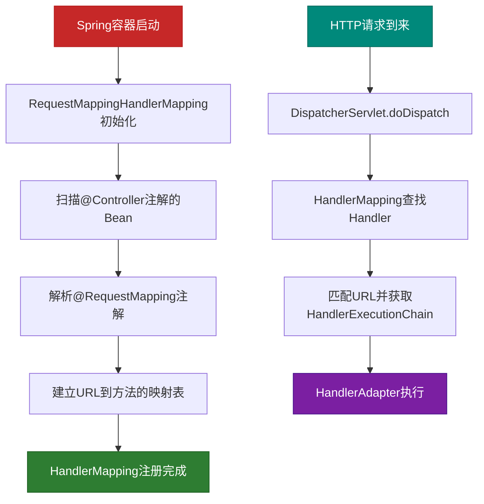

### 5.1.2 @Controller注解解析

**源码位置**：`org.springframework.stereotype.Controller`

```java
@Target({ElementType.TYPE})
@Retention(RetentionPolicy.RUNTIME)
@Documented
@Component
public @interface Controller {
    @AliasFor(annotation = Component.class)
    String value() default "";
}
```

**关键点分析**：
- `@Controller` 本身没有任何处理逻辑，它只是一个 **元注解（Meta Annotation）**
- 真正让它被纳入Spring MVC管理的是 `@Component` 注解
- Spring在扫描组件时，发现 `@Component` 注解会将其注册为Bean
- `RequestMappingHandlerMapping` 在初始化时，会筛选出所有 `@Controller` 注解的Bean

### 5.1.3 @RequestMapping注解解析

**源码位置**：`org.springframework.web.bind.annotation.RequestMapping`

```java
@Target({ElementType.TYPE, ElementType.METHOD})
@Retention(RetentionPolicy.RUNTIME)
@Documented
@Reflective
public @interface RequestMapping {
    // URL路径，支持Ant风格和路径变量
    @AliasFor("path")
    String[] value() default {};
    
    @AliasFor("value")
    String[] path() default {};
    
    // HTTP请求方法
    RequestMethod[] method() default {};
    
    // 请求参数条件
    String[] params() default {};
    
    // 请求头条件
    String[] headers() default {};
    
    // 响应内容类型
    MediaType[] consumes() default {};
    
    // 请求内容类型
    MediaType[] produces() default {};
}
```

**注解属性详解**：

| 属性 | 类型 | 说明 | 示例 |
|------|------|------|------|
| value/path | String[] | URL路径 | `@RequestMapping("/user")` |
| method | RequestMethod[] | HTTP方法 | `method = RequestMethod.GET` |
| params | String[] | 请求参数条件 | `params = "page"` |
| headers | String[] | 请求头条件 | `headers = "Content-Type=text/html"` |
| consumes | MediaType[] | 请求内容类型 | `consumes = "application/json"` |
| produces | MediaType[] | 响应内容类型 | `produces = "application/json"` |

### 5.1.4 注解处理器的初始化流程

**源码位置**：`org.springframework.web.servlet.mvc.method.annotation.RequestMappingHandlerMapping`

```mermaid
sequenceDiagram
    participant Container as Spring容器
    participant RHM as RequestMappingHandlerMapping
    participant Registry as RequestMappingInfoRegistry
    participant Context as ApplicationContext

    Container->>RHM: afterPropertiesSet()

    rect rgb(21, 48, 83)
        Note over RHM: 阶段1: 获取所有Controller
        RHM->>Context: getBeansWithAnnotation(Controller.class)
        Context-->>RHM: 所有@Controller的Bean
    end

    rect rgb(20, 83, 45)
        Note over RHM: 阶段2: 注册方法级映射
        loop 遍历每个Controller
            RHM->>RHM: introspectControllerClass()
            RHM->>RHM: detectHandlerMethods()
            RHM->>Registry: register()
        end
    end

    rect rgb(92, 51, 16)
        Note over RHM: 阶段3: 注册类级映射
        RHM->>Registry: register()
    end
```

**核心代码解析**：

```java
@Override
public void afterPropertiesSet() {
    // 1. 初始化路径匹配器
    this.config = new RequestMappingInfoHandlerMappingMappingStrategy();
    
    // 2. 调用父类方法，完成Bean扫描和注册
    super.afterPropertiesSet();
}

@Override
protected void initHandlerMethods() {
    // 获取所有Candidate组件（标注了@Controller或@RestController的类）
    for (String beanName : getCandidateBeanNames()) {
        if (!beanName.startsWith(SCOPED_TARGET_NAME_PREFIX)) {
            // 遍历处理每个Bean
            detectHandlerMethods(beanName);
        }
    }
    
    // 处理@RequestMapping属性
    handlerMethods(null, this.mappingRegistry.getHandlerMethods());
}

protected void detectHandlerMethods(Object handler) {
    Class<?> userType = handler instanceof String ?
            obtainApplicationContext().getType((String) handler) :
            handler.getClass();

    // 1. 获取用户定义的类型（可能是CGLIB代理类）
    userType = ClassUtils.getUserClass(userType);

    // 2. 获取该类型上标注的所有@RequestMapping
    Map<Method, RequestMappingInfo> mappingInfoMap = determineMappings(handler, userType);

    // 3. 为每个带@RequestMapping的方法创建ReflectiveHandlerMethod
    for (Map.Entry<Method, RequestMappingInfo> entry : mappingInfoMap.entrySet()) {
        Method method = entry.getKey();
        RequestMappingInfo mapping = entry.getValue();
        
        // 注册到mappingRegistry
        registerHandlerMethod(handler, method, mapping);
    }
}
```

### 5.1.5 请求匹配过程

当HTTP请求到达时，`RequestMappingHandlerMapping` 会根据请求信息匹配到具体的方法。

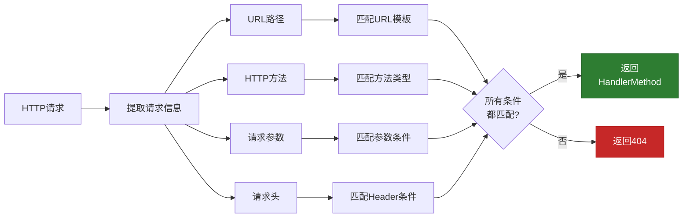

**源码位置**：`AbstractHandlerMethodMapping.MappingRegistry`

```java
public class RequestMappingInfo implements RequestCondition<Void> {
    // 存储所有映射条件
    private final PatternsRequestCondition patternsCondition;
    private final RequestMethodsRequestCondition methodsCondition;
    private final ParamsRequestCondition paramsCondition;
    private final HeadersRequestCondition headersCondition;
    private final ConsumesRequestCondition consumesCondition;
    private final ProducesRequestCondition producesCondition;
    
    // 匹配方法：检查请求是否满足所有条件
    @Override
    public RequestMappingInfo getMatchingCondition(HttpServletRequest request) {
        RequestMethodsRequestCondition methods = this.methodsCondition.getMatchingCondition(request);
        ParamsRequestCondition params = this.paramsCondition.getMatchingCondition(request);
        HeadersRequestCondition headers = this.headersCondition.getMatchingCondition(request);
        ConsumesRequestCondition consumes = this.consumesCondition.getMatchingCondition(request);
        ProducesRequestCondition produces = this.producesCondition.getMatchingCondition(request);
        
        // 如果任何条件不匹配，返回null
        if (methods == null || params == null || headers == null ||
            consumes == null || produces == null) {
            return null;
        }
        
        // 返回URL匹配的条件
        PatternsRequestCondition patterns = this.patternsCondition.getMatchingCondition(request);
        if (patterns == null) {
            return null;
        }
        
        return createInfo(patterns, methods, params, headers, consumes, produces);
    }
}
```

---

## 5.2 请求参数绑定机制

### 5.2.1 参数绑定概述

参数绑定是Spring MVC中最核心的机制之一，它将HTTP请求中的参数转换为控制器方法的参数值。

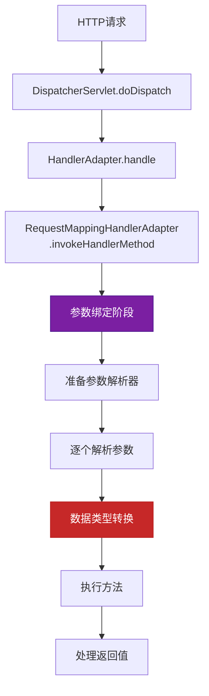

### 5.2.2 参数绑定流程源码分析

**源码位置**：`org.springframework.web.servlet.mvc.method.annotation.RequestMappingHandlerAdapter`

```java
@Override
protected ModelAndView invokeHandlerMethod(HttpServletRequest request,
        HttpServletResponse response, HandlerMethod handlerMethod) throws Exception {

    // 1. 创建WebRequest对象
    ServletWebRequest webRequest = new ServletWebRequest(request, response);

    // 2. 获取参数解析器
    HandlerMethodArgumentResolverComposite resolvers = getArgumentResolvers();

    // 3. 获取绑定器
    WebDataBinderFactory binderFactory = getDataBinderFactory(handlerMethod);

    // 4. 获取模型工厂
    ModelFactory modelFactory = getModelFactory(handlerMethod);

    // 5. 创建可调用的对象，包含完整的参数绑定信息
    ServletInvocableHandlerMethod invocableMethod = createInvocableHandlerMethod(
            handlerMethod, resolvers, binderFactory, modelFactory);

    // 6. 执行方法
    invocableMethod.invokeAndServe(webRequest);
    
    return getModelAndView(mavContainer, modelFactory, webRequest);
}
```

### 5.2.3 参数解析器体系

Spring MVC提供了大量的参数解析器来处理不同类型的参数：

```mermaid
classDiagram
    class HandlerMethodArgumentResolver {
        <<interface>>
        +supportsParameter(parameter) boolean
        +resolveArgument(parameter, mavContainer, request, binderFactory) Object
    }

    class AbstractHandlerMethodArgumentResolver {
        -resolvers List~HandlerMethodArgumentResolver~
    }

    class RequestParamMethodArgumentResolver {
        +supportsParameter(parameter) boolean
        +resolveArgument() Object
    }

    class RequestParamMapMethodArgumentResolver {
        +resolveArgument() Map
    }

    class PathVariableMethodArgumentResolver {
        +supportsParameter() boolean
        +resolveArgument() Object
    }

    class PathVariableMapMethodArgumentResolver {
        +resolveArgument() Map
    }

    class RequestBodyMethodArgumentResolver {
        +supportsParameter() boolean
        +resolveArgument() Object
    }

    class RequestHeaderMethodArgumentResolver {
        +supportsParameter() boolean
        +resolveArgument() Object
    }

    class RequestHeaderMapMethodArgumentResolver {
        +resolveArgument() Map
    }

    class CookieValueMethodArgumentResolver {
        +supportsParameter() boolean
        +resolveArgument() Object
    }

    class ModelMethodProcessor {
        +supportsParameter() boolean
        +resolveArgument() Object
    }

    class SessionAttributesMethodArgumentResolver {
        +supportsParameter() boolean
        +resolveArgument() Object
    }

    class RequestAttributeMethodArgumentResolver {
        +supportsParameter() boolean
        +resolveArgument() Object
    }

    HandlerMethodArgumentResolver <|.. RequestParamMethodArgumentResolver
    HandlerMethodArgumentResolver <|.. PathVariableMethodArgumentResolver
    HandlerMethodArgumentResolver <|.. RequestBodyMethodArgumentResolver
    HandlerMethodArgumentResolver <|.. RequestHeaderMethodArgumentResolver
    HandlerMethodArgumentResolver <|.. CookieValueMethodArgumentResolver
    HandlerMethodArgumentResolver <|.. ModelMethodProcessor
    HandlerMethodArgumentResolver <|.. RequestHeaderMapMethodArgumentResolver
    HandlerMethodArgumentResolver <|.. PathVariableMapMethodArgumentResolver

    AbstractHandlerMethodArgumentResolver <|-- RequestParamMethodArgumentResolver
    AbstractHandlerMethodArgumentResolver <|-- PathVariableMethodArgumentResolver
```

### 5.2.4 常用参数解析器详解

#### 1. @RequestParam 参数解析

**源码位置**：`org.springframework.web.servlet.mvc.method.annotation.RequestParamMethodArgumentResolver`

```java
@Override
public boolean supportsParameter(MethodParameter parameter) {
    // 检查参数是否有@RequestParam注解
    RequestParam requestParam = parameter.getParameterAnnotation(RequestParam.class);
    if (requestParam != null) {
        return true;
    }
    
    // 如果参数是Map且标注了@RequestParam
    if (parameter.getParameterType() == Map.class) {
        RequestParam annotation = parameter.getParameterAnnotation(RequestParam.class);
        return annotation != null;
    }
    
    // 对于简单类型（基本类型、String、Date等）且没有@PathVariable的情况
    // Spring会尝试自动绑定
    return false;
}

@Override
public Object resolveArgument(MethodParameter parameter, @Nullable ModelAndViewContainer mavContainer,
        HttpServletRequest request, WebDataBinderFactory binderFactory) throws Exception {
    
    // 1. 获取@RequestParam注解
    RequestParam requestParam = parameter.getParameterAnnotation(RequestParam.class);
    String paramName = requestParam.name();
    
    // 2. 如果注解没有指定参数名，从参数名获取
    if (paramName == null || paramName.isEmpty()) {
        paramName = parameter.getParameterName();
    }
    
    // 3. 从请求中获取值
    Object value = null;
    if (request.getParameterValues(paramName) != null) {
        String[] values = request.getParameterValues(paramName);
        if (values.length == 1) {
            value = values[0];
        } else {
            value = values;
        }
    }
    
    // 4. 如果参数是Map类型
    if (parameter.getParameterType() == Map.class) {
        Map<String, String[]> paramMap = request.getParameterMap();
        // 转换为String -> Object的Map
        // ...
    }
    
    // 5. 数据类型转换
    WebDataBinder binder = binderFactory.createBinder(request, null, paramName);
    value = binder.convertIfNecessary(value, parameter.getParameterType(), parameter);
    
    return value;
}
```

#### 2. @PathVariable 参数解析

**源码位置**：`org.springframework.web.servlet.mvc.method.annotation.PathVariableMethodArgumentResolver`

```java
@Override
public boolean supportsParameter(MethodParameter parameter) {
    PathVariable pathVariable = parameter.getParameterAnnotation(PathVariable.class);
    return pathVariable != null;
}

@Override
@Nullable
public Object resolveArgument(MethodParameter parameter, @Nullable ModelAndViewContainer mavContainer,
        HttpServletRequest request, WebDataBinderFactory binderFactory) throws Exception {
    
    PathVariable pathVariable = parameter.getParameterAnnotation(PathVariable.class);
    String variableName = pathVariable.name();
    
    // 获取路径变量映射表
    Map<String, String> uriTemplateVariables = (Map<String, String>)
            request.getAttribute(HandlerMapping.URI_TEMPLATE_VARIABLES_ATTRIBUTE);
    
    if (uriTemplateVariables != null) {
        String value = uriTemplateVariables.get(variableName);
        if (value != null) {
            // 数据类型转换
            WebDataBinder binder = binderFactory.createBinder(request, null, variableName);
            return binder.convertIfNecessary(value, parameter.getParameterType(), parameter);
        }
    }
    
    return null;
}
```

#### 3. @RequestBody 参数解析

**源码位置**：`org.springframework.web.servlet.mvc.method.annotation.RequestResponseBodyMethodProcessor`

```java
@Override
public boolean supportsParameter(MethodParameter parameter) {
    return parameter.hasParameterAnnotation(RequestBody.class);
}

@Override
@Nullable
public Object resolveArgument(MethodParameter parameter, @Nullable ModelAndViewContainer mavContainer,
        HttpServletRequest request, WebDataBinderFactory binderFactory) throws Exception {
    
    request = prepareRequest(request);
    
    // 获取内容类型
    MediaType contentType = request.getContentType();
    
    // 获取输入流，读取请求体
    InputStream inputStream = request.getInputStream();
    
    // 获取消息转换器
    HttpMessageConverter<?>[] converters = getMessageConverters();
    
    // 遍历转换器，找到能处理该内容类型的转换器
    for (HttpMessageConverter<?> converter : converters) {
        if (converter.canRead(parameter.getParameterType(), contentType)) {
            // 使用消息转换器读取请求体并转换
            Object body = ((HttpMessageConverter<T>) converter).read(
                    parameter.getParameterType(), new HttpInputMessage(inputStream, contentType));
            
            // 数据校验
            validateIfApplicable(parameter, body);
            
            return body;
        }
    }
    
    return null;
}
```

### 5.2.5 参数绑定完整流程图

```mermaid
sequenceDiagram
    participant HA as HandlerAdapter
    participant IR as InvocableHandlerMethod
    participant Resolver as 参数解析器
    participant Binder as WebDataBinder
    participant Converter as ConversionService

    HA->>IR: invokeAndServe(request, response)

    rect rgb(21, 48, 83)
        Note over IR: 参数绑定准备阶段
        IR->>IR: getMethodArgumentValues()
        IR->>Resolver: 获取参数解析器列表
        Resolver-->>IR: 返回解析器列表
    end

    loop 遍历每个参数
        rect rgb(20, 83, 45)
            Note over Resolver: 参数解析阶段
            IR->>Resolver: resolveArgument()
            Resolver-->>IR: 参数值
        end

        alt 需要类型转换
            rect rgb(92, 51, 16)
                Note over Binder: 类型转换阶段
                IR->>Binder: createBinder()
                Binder->>Converter: convert()
                Converter-->>Binder: 转换后的值
                Binder-->>IR: 带类型的参数值
            end
        end
    end

    IR->>IR: 执行Controller方法
    IR-->>HA: ModelAndView
```

---

## 5.3 数据类型转换与格式化

### 5.3.1 类型转换体系概述

Spring MVC需要将HTTP请求中的字符串参数转换为Java各种类型，这一过程由 ConversionService 完成。

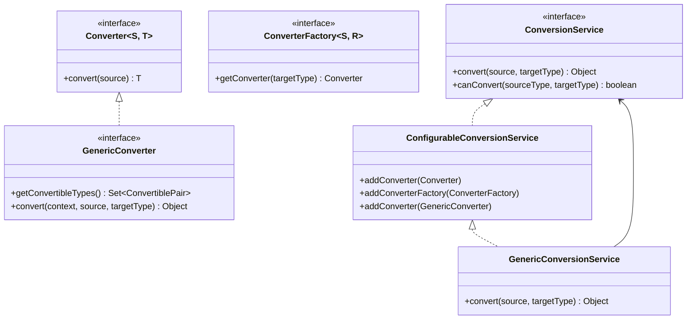

### 5.3.2 内置转换器

Spring提供了大量内置转换器来处理常见的类型转换：

```mermaid
flowchart TD
    A["ConversionService"] --> B["字符串转换"]
    A --> C["数值转换"]
    A --> D["日期时间转换"]
    A --> E["集合转换"]
    A --> F["其他转换"]
    
    B --> B1["StringToBooleanConverter"]
    B --> B2["StringToCharacterConverter"]
    B --> B3["StringToNumberConverterFactory"]
    B --> B4["StringToEnumConverterFactory"]
    
    C --> C1["NumberToNumberConverterFactory"]
    C --> C2["StringToNumberConverterFactory"]
    C --> C3["IntegerTo其他的Converter"]
    
    D --> D1["StringToDateConverter"]
    D --> D2["DateToStringConverter"]
    D --> D3["TemporalConverter"]
    
    E --> E1["CollectionToCollectionConverter"]
    E --> E2["ArrayToCollectionConverter"]
    E --> E3["CollectionToArrayConverter"]
    
    F --> F1["StringToLocaleConverter"]
    F --> F2["StringToCurrencyConverter"]
    F --> F3["StringToPropertiesConverter"]
    
    style A fill:#8e44ad,stroke:#6a1b9a,color:#ffffff
```

### 5.3.3 Converter、ConverterFactory、GenericConverter

**1. Converter - 基本转换器**

```java
// 源码位置：org.springframework.core.convert.converter.Converter
@FunctionalInterface
public interface Converter<S, T> {
    T convert(S source);
}

// 示例：自定义字符串转整数转换器
public class StringToIntegerConverter implements Converter<String, Integer> {
    @Override
    public Integer convert(String source) {
        return Integer.parseInt(source);
    }
}
```

**2. ConverterFactory - 转换器工厂**

```java
// 源码位置：org.springframework.core.convert.converter.ConverterFactory
public interface ConverterFactory<S, R> {
    <T extends R> Converter<S, T> getConverter(Class<T> targetType);
}

// 示例：StringToNumberConverterFactory
public class StringToNumberConverterFactory implements ConverterFactory<String, Number> {
    
    @Override
    public <T extends Number> Converter<String, T> getConverter(Class<T> targetType) {
        return new StringToNumber<>(targetType);
    }
    
    private static class StringToNumber<T extends Number> implements Converter<String, T> {
        private final Class<T> targetType;
        
        public StringToNumber(Class<T> targetType) {
            this.targetType = targetType;
        }
        
        @Override
        public T convert(String source) {
            if (source.isEmpty()) {
                return null;
            }
            if (targetType == Integer.class) {
                return targetType.cast(Integer.parseInt(source));
            }
            if (targetType == Long.class) {
                return targetType.cast(Long.parseLong(source));
            }
            // ... 其他类型
            throw new IllegalArgumentException("Unsupported target type: " + targetType);
        }
    }
}
```

**3. GenericConverter - 通用转换器**

```java
// 源码位置：org.springframework.core.convert.converter.GenericConverter
public interface GenericConverter {
    
    // 返回支持的转换类型对
    Set<ConvertiblePair> getConvertibleTypes();
    
    // 执行转换
    Object convert(@Nullable Object source, TypeDescriptor sourceType, 
                    TypeDescriptor targetType);
    
    // 转换类型对
    final class ConvertiblePair {
        private final Class<?> sourceType;
        private final Class<?> targetType;
        // ...
    }
}

// 示例：ObjectToStringConverter
public class ObjectToStringConverter implements GenericConverter {
    
    @Override
    public Set<ConvertiblePair> getConvertibleTypes() {
        return Collections.singleton(new ConvertiblePair(Object.class, String.class));
    }
    
    @Override
    @Nullable
    public Object convert(@Nullable Object source, TypeDescriptor sourceType,
                          TypeDescriptor targetType) {
        if (source == null) {
            return null;
        }
        return source.toString();
    }
}
```

### 5.3.4 Formatter 格式化器

**Formatter vs Converter**：

| 特性 | Converter | Formatter |
|------|-----------|-----------|
| 用途 | 通用类型转换 | 专用于Web层格式化 |
| 作用域 | 全局 | 仅Web层 |
| 国际化支持 | 不支持 | 支持 |
| parse/text | 不支持 | 支持 |
| 典型场景 | String ↔ 其他类型 | 日期、数字格式化 |

```java
// 源码位置：org.springframework.format.Formatter
public interface Formatter<T> extends Printer<T>, Parser<T> {
    // Printer: 对象转字符串
    // Parser: 字符串转对象
}

public interface Printer<T> {
    String print(T object, Locale locale);
}

public interface Parser<T> {
    T parse(String text, Locale locale) throws ParseException;
}

// 示例：自定义日期格式化器
public class DateFormatter implements Formatter<Date> {
    
    private String pattern;
    
    public DateFormatter(String pattern) {
        this.pattern = pattern;
    }
    
    @Override
    public String print(Date object, Locale locale) {
        if (object == null) {
            return "";
        }
        return new SimpleDateFormat(pattern, locale).format(object);
    }
    
    @Override
    public Date parse(String text, Locale locale) throws ParseException {
        if (text == null || text.isEmpty()) {
            return null;
        }
        return new SimpleDateFormat(pattern, locale).parse(text);
    }
}
```

### 5.3.5 PropertyEditor 转换

PropertyEditor 是 Java Bean 规范的属性编辑器，Spring 也支持用它进行类型转换（主要用于旧版兼容）。

```java
// 源码位置：java.beans.PropertyEditor
public interface PropertyEditor {
    void setAsText(String text) throws java.lang.IllegalArgumentException;
    Object getValue();
    void setValue(Object value);
    String getAsText();
}

// Spring内置的PropertyEditor实现
public class StringTrimmerEditor extends PropertyEditorSupport {
    private final boolean emptyAsNull;
    
    @Override
    public void setAsText(String text) {
        if (text == null) {
            setValue(null);
        } else {
            String trimmed = text.trim();
            if (this.emptyAsNull && trimmed.isEmpty()) {
                setValue(null);
            } else {
                setValue(trimmed);
            }
        }
    }
}
```

### 5.3.6 ConversionService 配置

```java
@Configuration
@EnableWebMvc
public class WebConfig implements WebMvcConfigurer {

    @Override
    public void addFormatters(FormatterRegistry registry) {
        // 添加自定义转换器
        registry.addConverter(new StringToUserConverter());
        
        // 添加自定义格式化器
        registry.addFormatter(new DateFormatter("yyyy-MM-dd"));
        
        // 添加转换器工厂
        registry.addConverterFactory(new StringToEnumConverterFactory());
    }
}
```

**自定义转换器示例**：

```java
// 实体类
public class User {
    private Long id;
    private String name;
    private UserType type;
}

public enum UserType {
    ADMIN, USER, GUEST
}

// 自定义转换器
public class StringToUserConverter implements Converter<String, User> {
    
    @Autowired
    private UserService userService;
    
    @Override
    public User convert(String source) {
        if (source == null || source.isEmpty()) {
            return null;
        }
        return userService.findById(Long.parseLong(source));
    }
}

// Controller中使用
@Controller
public class UserController {
    
    @GetMapping("/user")
    public String getUser(User user) {  // 自动将请求参数绑定为User对象
        // ...
    }
    
    @GetMapping("/user/detail")
    public String detail(@RequestParam("type") UserType type) {  // 自动转换枚举
        // ...
    }
}
```

---

## 5.4 数据校验

### 5.4.1 校验体系概述

Spring MVC 支持 JSR-303（Bean Validation）规范进行数据校验。

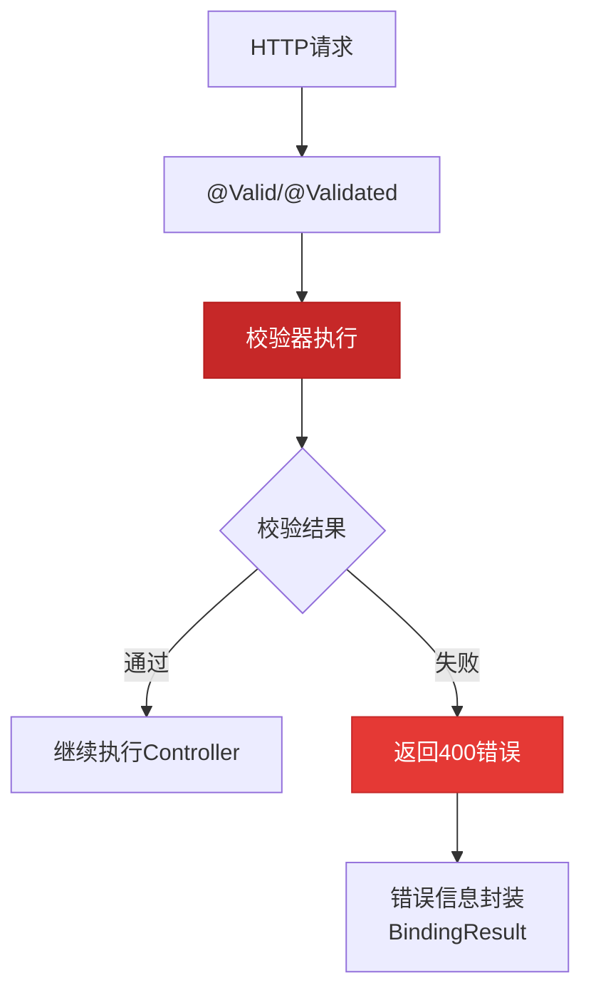

### 5.4.2 JSR-303 注解

Spring Validation 支持以下校验注解：

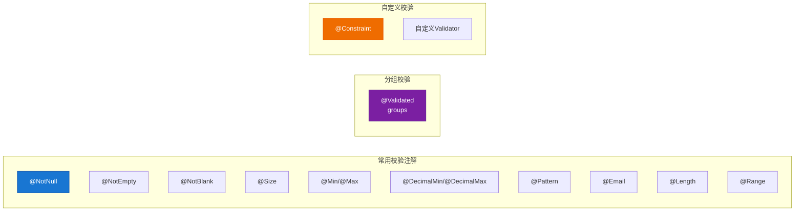

**常用校验注解详解**：

| 注解 | 作用 | 示例 |
|------|------|------|
| `@NotNull` | 不能为null | `@NotNull private String name;` |
| `@NotEmpty` | 不能为空（Collection/String） | `@NotEmpty private List<String> items;` |
| `@NotBlank` | 不能为空白字符串 | `@NotBlank private String name;` |
| `@Size` | 限定范围 | `@Size(min=2, max=20) private String name;` |
| `@Min/@Max` | 数值最小/最大值 | `@Min(0) @Max(100) private int age;` |
| `@Pattern` | 正则表达式 | `@Pattern(regexp="\\d{11}") private String phone;` |
| `@Email` | 邮箱格式 | `@Email private String email;` |
| `@Length` | 字符串长度 | `@Length(min=6, max=20) private String password;` |

### 5.4.3 @Validated vs @Valid

```java
// 区别说明
@Validated：Spring的注解，支持分组校验
@Valid：JSR-303标准注解，不支持分组

// 分组校验示例
public interface GroupA {}
public interface GroupB {}

// 实体类使用分组
public class User {
    @NotNull(groups = GroupA.class)  // 分组A必须校验
    private Long id;
    
    @NotBlank(groups = {GroupA.class, GroupB.class})  // 两个分组都要校验
    private String name;
    
    @Min(value = 0, groups = GroupB.class)  // 仅分组B校验
    private int age;
}

// Controller使用分组
@Controller
public class UserController {
    
    // 仅校验GroupA分组
    @PostMapping("/create")
    public String create(@Validated(GroupA.class) @RequestBody User user) {
        // ...
    }
    
    // 校验GroupB分组
    @PostMapping("/update")
    public String update(@Validated(GroupB.class) @RequestBody User user) {
        // ...
    }
}
```

### 5.4.4 校验源码分析

**源码位置**：`org.springframework.validation.annotation.ValidationInterceptor`

```java
@Override
public Object resolveArgument(MethodParameter parameter, @Nullable ModelAndViewContainer mavContainer,
        HttpServletRequest request, @Nullable WebDataBinderFactory binderFactory) throws Exception {
    
    // 1. 获取参数值
    Object arg = resolveArgument(parameter, mavContainer, request, binderFactory);
    
    // 2. 检查是否有@Validated或@Valid注解
    Validated validatedAnn = parameter.getParameterAnnotation(Validated.class);
    Valid validAnn = parameter.getParameterAnnotation(Valid.class);
    
    if (validatedAnn != null || validAnn != null) {
        // 3. 获取绑定结果
        WebDataBinder binder = binderFactory.createBinder(request, null, parameter.getParameterName());
        BindingResult bindingResult = binder.getBindingResult();
        
        // 4. 执行校验
        validateValue(binder, parameter, arg, validatedAnn, validAnn, bindingResult);
        
        // 5. 如果有错误，抛出异常
        if (bindingResult.hasErrors()) {
            throw new BindException(bindingResult);
        }
    }
    
    return arg;
}
```

**校验执行流程**：

```mermaid
sequenceDiagram
    participant C as Controller
    participant HA as HandlerAdapter
    participant V as Validator
    participant BV as BeanValidator
    participant BR as BindingResult

    C->>HA: @Valid User user

    rect rgb(21, 48, 83)
        Note over HA: 校验准备阶段
        HA->>HA: 获取@Valid注解
        HA->>HA: 获取校验器
    end

    rect rgb(20, 83, 45)
        Note over V: 校验执行阶段
        HA->>V: validate(user, errors)
        V->>BV: 遍历约束注解
        BV->>BV: 获取约束注解
        BV->>BV: 获取约束验证器
        BV->>V: 验证结果
    end

    rect rgb(92, 51, 16)
        Note over BR: 结果处理阶段
        V->>BR: hasErrors()
        alt 有错误
            BR-->>HA: 错误信息
            HA-->>C: 400 Bad Request
        else 无错误
            BR-->>HA: 校验通过
            HA-->>C: 继续执行
        end
    end
```

### 5.4.5 自定义校验器

**步骤1：创建约束注解**

```java
@Target({ElementType.FIELD, ElementType.PARAMETER})
@Retention(RetentionPolicy.RUNTIME)
@Constraint(validatedBy = PhoneValidator.class)
@Documented
public @interface Phone {
    String message() default "手机号格式不正确";
    Class<?>[] groups() default {};
    Class<? extends Payload>[] payload() default {};
}
```

**步骤2：实现校验器**

```java
public class PhoneValidator implements ConstraintValidator<Phone, String> {
    
    private static final Pattern PHONE_PATTERN = 
        Pattern.compile("^1[3-9]\\d{9}$");
    
    @Override
    public void initialize(Phone constraintAnnotation) {
        // 初始化，可以获取注解属性
    }
    
    @Override
    public boolean isValid(String value, ConstraintValidatorContext context) {
        if (value == null || value.isEmpty()) {
            return true;  // @NotNull处理null情况
        }
        return PHONE_PATTERN.matcher(value).matches();
    }
}
```

**步骤3：使用自定义校验**

```java
public class User {
    @NotBlank
    private String name;
    
    @Phone
    private String phone;
}

// Controller
@PostMapping("/user")
public String create(@Valid @RequestBody User user, BindingResult result) {
    if (result.hasErrors()) {
        result.getFieldErrors().forEach(e -> 
            System.out.println(e.getField() + ": " + e.getDefaultMessage()));
    }
    // ...
}
```

---

## 5.5 实例：参数绑定全过程追踪

### 5.5.1 完整流程图

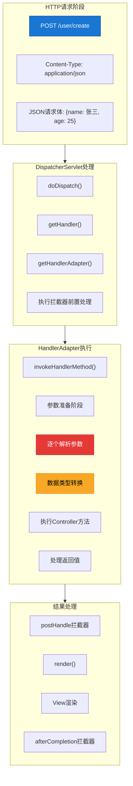

### 5.5.2 具体示例

**示例场景**：用户注册接口

```java
@Controller
@RequestMapping("/user")
public class UserController {

    @PostMapping("/register")
    public String register(
            @RequestParam("username") String username,
            @RequestParam("password") String password,
            @RequestParam("email") @Email String email,
            @RequestParam("age") @Min(0) @Max(150) Integer age,
            @RequestParam("birthday") @DateTimeFormat(pattern = "yyyy-MM-dd") Date birthday,
            @RequestParam("hobbies") List<String> hobbies,
            HttpServletRequest request,
            HttpSession session,
            Model model,
            @RequestHeader("User-Agent") String userAgent,
            @CookieValue("JSESSIONID") String sessionId) {
        
        // 参数绑定完整后执行业务逻辑
        User user = new User(username, password, email, age, birthday, hobbies);
        userService.register(user);
        
        model.addAttribute("user", user);
        return "user/success";
    }
}
```

**请求示例**：

```
POST /user/register?username=zhangsan&password=123456&email=zhangsan@example.com&age=25&birthday=1995-01-01&hobbies=reading&hobbies=sports
Headers:
  User-Agent: Mozilla/5.0
Cookie:
  JSESSIONID=ABC123
```

### 5.5.3 绑定过程详解

```mermaid
sequenceDiagram
    participant Req as HTTP请求
    participant DS as DispatcherServlet
    participant HA as RequestMappingHandlerAdapter
    participant Resolver as 参数解析器
    participant Conv as ConversionService
    participant Ctrl as UserController

    Req->>DS: POST /user/register

    DS->>HA: handle(request, response, handlerMethod)

    rect rgb(21, 48, 83)
        Note over HA: 参数绑定阶段
        HA->>HA: getMethodArgumentValues()
    end

    loop 遍历每个参数
        HA->>Resolver: resolveArgument(parameter)
        
        alt 普通参数
            Resolver->>Req: request.getParameter()
        end
        
        alt 路径参数
            Resolver->>Req: getPathVariable()
        end
        
        alt JSON请求体
            Resolver->>Conv: JSON转换为对象
        end
        
        alt 需要格式化
            Resolver->>Conv: DateFormatter转换
        end
        
        Resolver-->>HA: 参数值
    end

    HA->>Ctrl: register(username, password, email, age, birthday, hobbies, ...)
    Ctrl-->>HA: ModelAndView
    HA-->>DS: ModelAndView
```

### 5.5.4 关键断点设置

| 断点位置 | 行号 | 观察内容 |
|---------|------|---------|
| `RequestMappingHandlerAdapter.invokeHandlerMethod()` | ~900 | 开始执行方法 |
| `HandlerMethodArgumentResolverComposite.resolveArgument()` | ~150 | 参数解析入口 |
| `WebDataBinder.convertIfNecessary()` | ~400 | 类型转换 |
| `AbstractPropertyEditor.getValue()` | ~200 | PropertyEditor转换 |

### 5.5.5 Debug观察变量

```java
// 观察 request.getParameterMap()
request.getParameterMap()
// {username=[zhangsan], password=[123456], email=[zhangsan@example.com], ...}

// 观察路径变量
request.getAttribute(HandlerMapping.URI_TEMPLATE_VARIABLES_ATTRIBUTE)
// {id=123, action=edit}

// 观察请求内容类型
request.getContentType()
// application/json

// 观察视图名称
mv.getViewName()
// "user/success"

// 观察模型数据
mv.getModel()
// {user=User@1234, _csrf=CsrfToken@5678}
```

---

## 总结

本章深入分析了Spring MVC控制器的执行机制：

1. **@Controller和@RequestMapping注解解析**：通过 `RequestMappingHandlerMapping` 在容器启动时扫描并注册映射关系

2. **请求参数绑定机制**：通过 `HandlerMethodArgumentResolver` 体系处理不同类型的参数，支持 `@RequestParam`、`@PathVariable`、`@RequestBody` 等多种方式

3. **数据类型转换**：通过 `ConversionService` 提供强大的类型转换能力，支持 `Converter`、`ConverterFactory`、`GenericConverter` 和 `Formatter`

4. **数据校验**：通过 JSR-303（Bean Validation）规范实现声明式校验，支持分组校验和自定义校验器

5. **参数绑定全过程**：从HTTP请求到Controller方法执行的完整链路，涉及多个组件的协作
