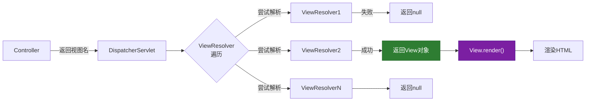
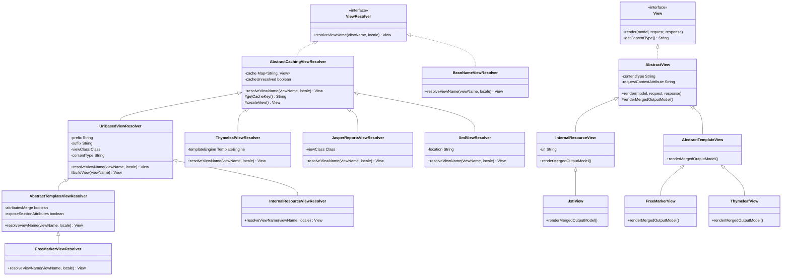
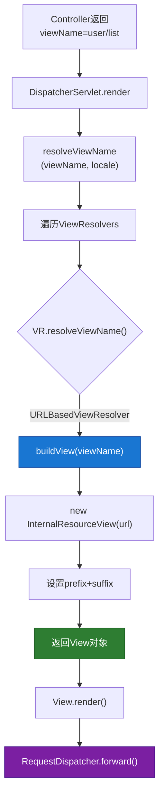
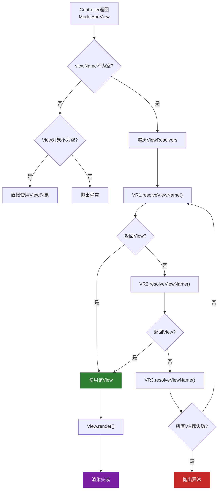
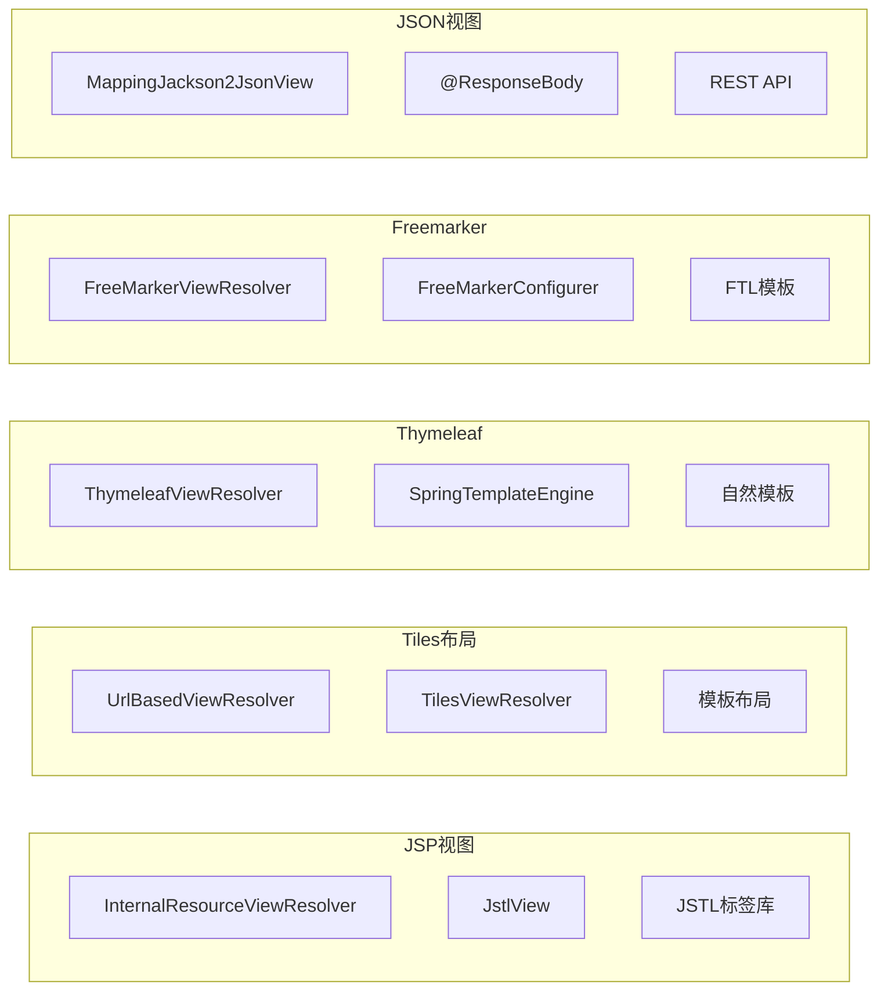
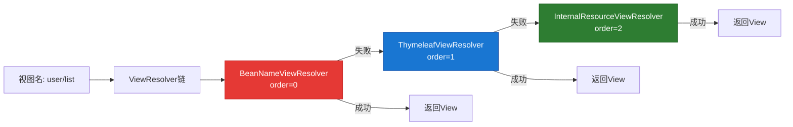
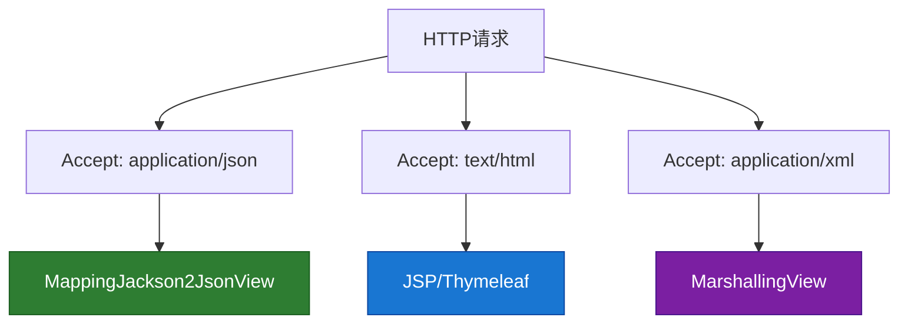
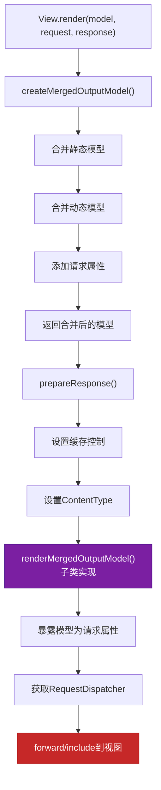
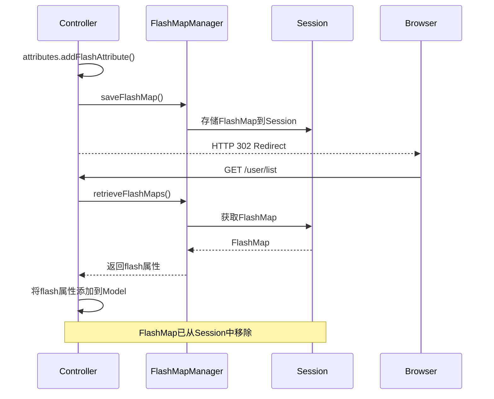

# 第6章 ViewResolver 视图解析器

## 6.1 ViewResolver体系结构

### 6.1.1 视图解析概述

ViewResolver是Spring MVC中负责将视图名称解析为具体View对象的组件。当Controller返回逻辑视图名后，DispatcherServlet会调用ViewResolver来获取实际的视图对象进行渲染。



### 6.1.2 ViewResolver接口体系



### 6.1.3 核心接口定义

**ViewResolver接口**：

```java
// 源码位置：org.springframework.web.servlet.ViewResolver
public interface ViewResolver {
    /**
     * 解析视图名称为View对象
     * @param viewName 逻辑视图名称
     * @param locale 区域信息（用于国际化）
     * @return View对象，如果无法解析返回null
     */
    @Nullable
    View resolveViewName(String viewName, Locale locale) throws Exception;
}
```

**View接口**：

```java
// 源码位置：org.springframework.web.servlet.View
public interface View {
    /**
     * 渲染视图
     * @param model 模型数据
     * @param request HttpServletRequest
     * @param response HttpServletResponse
     */
    void render(@Nullable Map<String, ?> model, HttpServletRequest request,
            HttpServletResponse response) throws Exception;

    /**
     * 获取内容类型
     */
    String getContentType();

    /**
     * 获取HTTP状态码（可选）
     */
    @Nullable
    default HttpStatus getStatus();
}
```

### 6.1.4 ViewResolver初始化

**源码位置**：`org.springframework.web.servlet.DispatcherServlet`

```java
private void initViewResolvers(ApplicationContext context) {
    this.viewResolvers = null;

    // 1. 如果设置为检测所有ViewResolver Bean
    if (this.detectAllViewResolvers) {
        // 从ApplicationContext中获取所有ViewResolver类型的Bean
        Map<String, ViewResolver> matchingBeans = BeanFactoryUtils
                .beansOfTypeIncludingAncestors(context, ViewResolver.class, true, false);
        if (!matchingBeans.isEmpty()) {
            this.viewResolvers = new ArrayList<>(matchingBeans.values());
        }
    }
    
    // 2. 如果没有找到，使用默认策略
    if (this.viewResolvers == null) {
        this.viewResolvers = getDefaultStrategies(context, ViewResolver.class);
    }

    // 3. 排序（可以通过@Order控制）
    if (this.viewResolvers != null) {
        AnnotationAwareOrderComparator.sort(this.viewResolvers);
    }
}
```

---

## 6.2 InternalResourceViewResolver实现

### 6.2.1 类结构分析

**源码位置**：`org.springframework.web.servlet.view.InternalResourceViewResolver`

```java
public class InternalResourceViewResolver extends UrlBasedViewResolver {
    
    private static final boolean jstlPresent = 
            ClassUtils.isPresent("jakarta.servlet.jsp.jstl.core.Config", 
                    InternalResourceViewResolver.class.getClassLoader());

    private final Boolean alwaysInclude;

    public InternalResourceViewResolver() {
        // 默认视图类为InternalResourceView
        setViewClass(InternalResourceView.class);
    }

    public InternalResourceViewResolver(String prefix, String suffix) {
        this();
        setPrefix(prefix);
        setSuffix(suffix);
    }

    @Override
    protected void initApplicationContext() {
        super.initApplicationContext();
        
        // 如果JSTL存在，自动使用JstlView
        if (jstlPresent && getViewClass() == InternalResourceView.class) {
            setViewClass(JstlView.class);
        }
    }
}
```

### 6.2.2 视图解析流程



### 6.2.3 配置示例

**XML配置**：

```xml
<!-- 方式1：使用默认配置 -->
<bean class="org.springframework.web.servlet.view.InternalResourceViewResolver"/>

<!-- 方式2：指定前缀后缀 -->
<bean class="org.springframework.web.servlet.view.InternalResourceViewResolver">
    <property name="prefix" value="/WEB-INF/views/"/>
    <property name="suffix" value=".jsp"/>
    <property name="order" value="1"/>
</bean>

<!-- 方式3：设置alwaysInclude（强制使用include而非forward） -->
<bean class="org.springframework.web.servlet.view.InternalResourceViewResolver">
    <property name="prefix" value="/WEB-INF/views/"/>
    <property name="suffix" value=".jsp"/>
    <property name="alwaysInclude" value="true"/>
</bean>
```

**Java配置**：

```java
@Configuration
@EnableWebMvc
public class WebMvcConfig implements WebMvcConfigurer {

    @Bean
    public InternalResourceViewResolver viewResolver() {
        InternalResourceViewResolver resolver = new InternalResourceViewResolver();
        resolver.setPrefix("/WEB-INF/views/");
        resolver.setSuffix(".jsp");
        resolver.setOrder(1);
        // resolver.setAlwaysInclude(true);
        return resolver;
    }
}
```

### 6.2.4 UrlBasedViewResolver 核心逻辑

**源码位置**：`org.springframework.web.servlet.view.UrlBasedViewResolver`

```java
@Override
protected View createView(String viewName, Locale locale) throws Exception {
    // 1. 检查是否可以解析为URL
    if (!canHandle(viewName, locale)) {
        return null;
    }

    // 2. 构建URL（添加前缀和后缀）
    String url = getPrefix() + viewName + getSuffix();

    // 3. 创建View对象
    return buildView(viewName, locale, url);
}

@Override
protected AbstractUrlBasedView buildView(String viewName, Locale locale, String url) 
        throws Exception {
    
    // 1. 调用子类实现创建具体的View
    AbstractUrlBasedView view = instantiateView();
    
    // 2. 设置URL
    view.setUrl(url);
    
    // 3. 设置内容类型
    String contentType = getContentType();
    if (contentType != null) {
        view.setContentType(contentType);
    }
    
    // 4. 设置请求上下文属性
    String requestContextAttribute = getRequestContextAttribute();
    if (requestContextAttribute != null) {
        view.setRequestContextAttribute(requestContextAttribute);
    }
    
    // 5. 其他属性设置...
    
    return view;
}

protected AbstractUrlBasedView instantiateView() {
    try {
        return getViewClass().getDeclaredConstructor().newInstance();
    } catch (Exception ex) {
        throw new BeanInstantiationException(getViewClass(), 
            "Failed to instantiate view class", ex);
    }
}
```

---

## 6.3 视图解析流程分析

### 6.3.1 完整解析流程时序图

```mermaid
sequenceDiagram
    participant C as Controller
    participant DS as DispatcherServlet
    participant HA as HandlerAdapter
    participant VR as ViewResolver
    participant V as View
    participant JSP as JSP引擎

    C->>DS: ModelAndView(viewName="user/list")

    rect rgb(21, 48, 83)
        Note over DS: 步骤1: render()入口
        DS->>DS: render(mv, request, response)
        DS->>DS: 获取Locale
    end

    rect rgb(20, 83, 45)
        Note over DS: 步骤2: 解析视图名
        alt 视图名不为空
            DS->>DS: resolveViewName()
        else 视图名为空
            DS->>DS: 使用内置View
        end
    end

    rect rgb(92, 51, 16)
        Note over DS,VR: 步骤3: 调用ViewResolver
        loop 遍历ViewResolvers
            DS->>VR: resolveViewName(viewName, locale)
            VR-->>DS: View或null
        end
    end

    rect rgb(17, 94, 89)
        Note over VR: 步骤4: InternalResourceViewResolver解析
        VR->>VR: 构建URL
        VR->>VR: 创建InternalResourceView
        VR-->>DS: InternalResourceView
    end

    rect rgb(59, 36, 101)
        Note over DS,JSP: 步骤5: 渲染视图
        DS->>V: render(model, request, response)
        V->>V: exposeModelAsRequestAttributes()
        V->>V: getRequestDispatcher()
        V->>JSP: forward(request, response)
        JSP-->>V: 渲染完成
    end

    DS-->>C: HTTP Response
```



### 6.3.2 DispatcherServlet.render()源码解析

**源码位置**：`org.springframework.web.servlet.DispatcherServlet`

```java
protected void render(ModelAndView mv, HttpServletRequest request, 
        HttpServletResponse response) throws Exception {
    
    // 1. 获取Locale（用于国际化）
    Locale locale = (mv.getLocale() != null ? mv.getLocale() :
            this.localeResolver.resolveLocale(request));
    
    // 2. 设置响应字符编码
    response.setCharacterEncoding(this.encodingProperties.getCharset());

    // 3. 确定视图对象
    View view;
    String viewName = mv.getViewName();
    
    if (viewName != null) {
        // 3.1 通过ViewResolver解析视图名
        view = resolveViewName(viewName, mv.getModelInternal(), locale, request);
        if (view == null) {
            throw new ServletException(
                "Could not resolve view with name '" + viewName + 
                "' in servlet with name '" + getServletName() + "'");
        }
    } else {
        // 3.2 直接使用View对象
        view = mv.getView();
        if (view == null) {
            throw new ServletException(
                "ModelAndView [" + mv + "] neither contains a view name nor a " +
                "View object in servlet with name '" + getServletName() + "'");
        }
    }

    // 4. 触发视图渲染
    view.render(mv.getModelInternal(), request, response);
}
```

### 6.3.3 视图解析决策流程



### 6.3.4 AbstractCachingViewResolver 缓存机制

**源码位置**：`org.springframework.web.servlet.view.AbstractCachingViewResolver`

```java
public abstract class AbstractCachingViewResolver extends ViewResolverSupport 
        implements Ordered {
    
    // 默认缓存大小
    private static final int DEFAULT_CACHE_LIMIT = 1024;
    
    // 缓存表：key = viewName + locale
    private final Map<Object, View> viewCache = new ConcurrentHashMap<>(DEFAULT_CACHE_LIMIT);
    
    // 缓存未解析的视图（防止重复尝试解析）
    private boolean cacheUnresolved = true;

    @Override
    @Nullable
    public View resolveViewName(String viewName, Locale locale) throws Exception {
        if (!canAccessCache()) {
            // 不使用缓存，直接创建
            return createView(viewName, locale);
        }

        // 1. 获取缓存key
        Object cacheKey = getCacheKey(viewName, locale);
        
        // 2. 从缓存获取
        View view = viewCache.get(cacheKey);
        
        if (view == null) {
            // 3. 缓存未命中，创建视图
            synchronized (viewCache) {
                // 双重检查
                view = viewCache.get(cacheKey);
                if (view == null) {
                    view = createView(viewName, locale);
                    
                    // 4. 缓存结果
                    if (view != null || !cacheUnresolved()) {
                        viewCache.put(cacheKey, view);
                    }
                }
            }
        }
        
        return view;
    }
    
    protected Object getCacheKey(String viewName, Locale locale) {
        return viewName + "_" + locale.toString();
    }
}
```

---

## 6.4 JSP、Tiles、Thymeleaf等视图技术

### 6.4.1 视图技术对比



| 特性 | JSP | Thymeleaf | FreeMarker | Tiles |
|------|-----|-----------|------------|-------|
| 性能 | 高 | 中 | 高 | 中 |
| 生态 | 成熟 | 活跃 | 成熟 | 成熟 |
| 模板语法 | JSTL | HTML5 | FreeMarker | XML |
| 前后端分离 | 否 | 可分离 | 否 | 否 |
| 学习曲线 | 低 | 中 | 中 | 中 |

### 6.4.2 JSP视图技术

**InternalResourceView渲染流程**：

```java
// 源码位置：org.springframework.web.servlet.view.InternalResourceView
public class InternalResourceView extends AbstractUrlBasedView {
    
    private boolean alwaysInclude = false;

    @Override
    protected void renderMergedOutputModel(Map<String, Object> model,
            HttpServletRequest request, HttpServletResponse response) throws Exception {

        // 1. 将模型数据暴露为请求属性
        exposeModelAsRequestAttributes(model, request);

        // 2. 暴露FlashMap（用于重定向后的数据传递）
        exposeFlashMap(request);

        // 3. 获取请求分发器
        String dispatcherPath = getUrl();
        RequestDispatcher rd = getRequestDispatcher(request, dispatcherPath);
        if (rd == null) {
            throw new ServletException(
                "Could not get RequestDispatcher for [" + getUrl() +
                "]: Check that the file exists and is a correct resource");
        }

        // 4. 如果配置了alwaysInclude，使用include；否则使用forward
        if (alwaysInclude || !response.isCommitted()) {
            rd.include(request, response);
        } else {
            rd.forward(request, response);
        }
    }
}
```

**JSTL支持**：

```java
// 源码位置：org.springframework.web.servlet.view.JstlView
public class JstlView extends InternalResourceView {
    
    private MessageSource messageSource;

    @Override
    protected void renderMergedOutputModel(Map<String, Object> model,
            HttpServletRequest request, HttpServletResponse response) throws Exception {
        
        // 1. 暴露JSTL的i18n资源
        exposeNestedPath(request);
        
        // 2. 设置消息源（用于fmt:message）
        if (this.messageSource != null) {
            JstlUtils.exposeLocalizationContext(request, this.messageSource);
        } else {
            JstlUtils.exposeLocalizationContext(
                    RequestContextUtils.getApplicationContext(this.getServletContext()), 
                    request);
        }
        
        // 3. 调用父类渲染
        super.renderMergedOutputModel(model, request, response);
    }
}
```

**JSP配置示例**：

```java
@Configuration
@EnableWebMvc
public class WebMvcConfig {

    @Bean
    public InternalResourceViewResolver viewResolver() {
        InternalResourceViewResolver resolver = new InternalResourceViewResolver();
        resolver.setPrefix("/WEB-INF/views/");
        resolver.setSuffix(".jsp");
        resolver.setOrder(2);
        return resolver;
    }
    
    @Bean
    public MessageSource messageSource() {
        ResourceBundleMessageSource ms = new ResourceBundleMessageSource();
        ms.setBasename("messages");
        ms.setDefaultEncoding("UTF-8");
        return ms;
    }
}
```

### 6.4.3 Tiles视图技术

Apache Tiles 是一个模板布局框架，用于创建复合视图。

**依赖配置**：

```xml
<dependency>
    <groupId>org.apache.tiles</groupId>
    <artifactId>tiles-core</artifactId>
    <version>3.0.8</version>
</dependency>
<dependency>
    <groupId>org.apache.tiles</groupId>
    <artifactId>tiles-jsp</artifactId>
    <version>3.0.8</version>
</dependency>
<dependency>
    <groupId>org.springframework</groupId>
    <artifactId>spring-tiles</artifactId>
    <version>6.1.3</version>
</dependency>
```

**Tiles配置**：

```xml
<!-- /WEB-INF/tiles/tiles-defs.xml -->
<!DOCTYPE tiles-definitions PUBLIC
       "-//Apache Software Foundation//DTD Tiles Configuration 3.0//EN"
       "http://tiles.apache.org/dtds/tiles-config_3_0.dtd">

<tiles-definitions>
    <!-- 基础模板定义 -->
    <definition name="template.main" template="/WEB-INF/tiles/layouts/main.jsp">
        <put-attribute name="header" value="/WEB-INF/tiles/templates/header.jsp"/>
        <put-attribute name="body" value=""/>
        <put-attribute name="footer" value="/WEB-INF/tiles/templates/footer.jsp"/>
    </definition>
    
    <!-- 继承基础模板 -->
    <definition name="user.list" extends="template.main">
        <put-attribute name="title" value="用户列表"/>
        <put-attribute name="body" value="/WEB-INF/views/user/list.jsp"/>
    </definition>
    
    <definition name="user.detail" extends="template.main">
        <put-attribute name="title" value="用户详情"/>
        <put-attribute name="body" value="/WEB-INF/views/user/detail.jsp"/>
    </definition>
</tiles-definitions>
```

**Tiles视图解析器配置**：

```java
@Configuration
@EnableWebMvc
public class WebMvcConfig {

    @Bean
    public TilesConfigurer tilesConfigurer() {
        TilesConfigurer configurer = new TilesConfigurer();
        configurer.setDefinitions(
            "/WEB-INF/tiles/tiles-defs.xml",
            "/WEB-INF/tiles/tiles-admin.xml"
        );
        return configurer;
    }

    @Bean
    public TilesViewResolver tilesViewResolver() {
        TilesViewResolver resolver = new TilesViewResolver();
        resolver.setOrder(1);
        return resolver;
    }
}
```

**Tiles模板示例**：

```jsp
<%-- /WEB-INF/tiles/layouts/main.jsp --%>
<%@ page contentType="text/html;charset=UTF-8" %>
<%@ taglib uri="http://tiles.apache.org/tags-tiles" prefix="t" %>
<!DOCTYPE html>
<html>
<head>
    <title><t:insertAttribute name="title"/></title>
</head>
<body>
    <header>
        <t:insertAttribute name="header"/>
    </header>
    <main>
        <t:insertAttribute name="body"/>
    </main>
    <footer>
        <t:insertAttribute name="footer"/>
    </footer>
</body>
</html>
```

### 6.4.4 Thymeleaf视图技术

Thymeleaf 是现代化的服务端Java模板引擎，支持自然模板。

**依赖配置**：

```xml
<dependency>
    <groupId>org.thymeleaf</groupId>
    <artifactId>thymeleaf-spring6</artifactId>
    <version>3.1.2.RELEASE</version>
</dependency>
```

**Thymeleaf配置**：

```java
@Configuration
@EnableWebMvc
public class ThymeleafConfig {

    @Bean
    public ServletContextTemplateResolver templateResolver() {
        ServletContextTemplateResolver resolver = new ServletContextTemplateResolver();
        resolver.setPrefix("/WEB-INF/templates/");
        resolver.setSuffix(".html");
        resolver.setTemplateMode("HTML");
        resolver.setCharacterEncoding("UTF-8");
        resolver.setCacheable(false);  // 开发环境禁用缓存
        return resolver;
    }

    @Bean
    public SpringTemplateEngine templateEngine() {
        SpringTemplateEngine engine = new SpringTemplateEngine();
        engine.setTemplateResolver(templateResolver());
        
        // 添加方言
        engine.addDialect(new SpringDialect());
        engine.addDialect(new LayoutDialect());
        
        return engine;
    }

    @Bean
    public ThymeleafViewResolver viewResolver() {
        ThymeleafViewResolver resolver = new ThymeleafViewResolver();
        resolver.setTemplateEngine(templateEngine());
        resolver.setCharacterEncoding("UTF-8");
        resolver.setOrder(1);
        return resolver;
    }
}
```

**Thymeleaf模板示例**：

```html
<!-- /WEB-INF/templates/user/list.html -->
<!DOCTYPE html>
<html xmlns:th="http://www.thymeleaf.org">
<head>
    <meta charset="UTF-8">
    <title th:text="${title}">用户列表</title>
</head>
<body>
    <h1 th:text="${title}">用户列表</h1>
    
    <table>
        <thead>
            <tr>
                <th>ID</th>
                <th>姓名</th>
                <th>邮箱</th>
            </tr>
        </thead>
        <tbody>
            <tr th:each="user : ${users}">
                <td th:text="${user.id}">1</td>
                <td th:text="${user.name}">张三</td>
                <td th:text="${user.email}">zhangsan@example.com</td>
            </tr>
        </tbody>
    </table>
</body>
</html>
```

**Thymeleaf视图渲染源码**：

```java
// 源码位置：org.thymeleaf.spring5.view.ThymeleafView
public class ThymeleafView extends AbstractTemplateView {
    
    @Override
    protected void renderMergedOutputModel(Map<String, Object> model,
            HttpServletRequest request, HttpServletResponse response) throws Exception {
        
        // 1. 准备模板上下文
        IContext context = createBindingContext(model, request);
        
        // 2. 模板名称
        String templateName = getUrl();
        
        // 3. 获取模板引擎
        SpringTemplateEngine templateEngine = getTemplateEngine();
        
        // 4. 处理模板并写入响应
        processTemplate(templateName, context, response);
    }
    
    private void processTemplate(String templateName, IContext context,
            HttpServletResponse response) throws Exception {
        
        response.setCharacterEncoding(encoding);
        
        // 调用模板引擎渲染
        templateEngine.process(templateName, context, response.getWriter());
    }
}
```

### 6.4.5 FreeMarker视图技术

**依赖配置**：

```xml
<dependency>
    <groupId>org.freemarker</groupId>
    <artifactId>freemarker</artifactId>
    <version>2.3.32</version>
</dependency>
<dependency>
    <groupId>org.springframework</groupId>
    <artifactId>spring-freemarker</artifactId>
    <version>6.1.3</version>
</dependency>
```

**FreeMarker配置**：

```java
@Configuration
@EnableWebMvc
public class FreeMarkerConfig {

    @Bean
    public FreeMarkerConfigurer freeMarkerConfigurer() {
        FreeMarkerConfigurer configurer = new FreeMarkerConfigurer();
        configurer.setTemplateLoaderPath("/WEB-INF/freemarker/");
        configurer.setDefaultEncoding("UTF-8");
        
        Properties settings = new Properties();
        settings.setProperty("auto_import", "/spring.ftl as spring");
        settings.setProperty("number_format", "0.##");
        configurer.setFreemarkerSettings(settings);
        
        return configurer;
    }

    @Bean
    public FreeMarkerViewResolver viewResolver() {
        FreeMarkerViewResolver resolver = new FreeMarkerViewResolver();
        resolver.setSuffix(".ftl");
        resolver.setContentType("text/html;charset=UTF-8");
        resolver.setOrder(1);
        return resolver;
    }
}
```

**FreeMarker模板示例**：

```freemarker
<#-- /WEB-INF/freemarker/user/list.ftl -->
<!DOCTYPE html>
<html>
<head>
    <meta charset="UTF-8">
    <title>${title}</title>
</head>
<body>
    <h1>${title}</h1>
    
    <table>
        <thead>
            <tr>
                <th>ID</th>
                <th>姓名</th>
                <th>邮箱</th>
            </tr>
        </thead>
        <tbody>
            <#list users as user>
            <tr>
                <td>${user.id}</td>
                <td>${user.name}</td>
                <td>${user.email}</td>
            </tr>
            </#list>
        </tbody>
    </table>
</body>
</html>
```

### 6.4.6 JSON视图技术

**MappingJackson2JsonView**：

```java
@Configuration
@EnableWebMvc
public class JsonViewConfig {

    @Bean
    public MappingJackson2JsonView jsonView() {
        MappingJackson2JsonView view = new MappingJackson2JsonView();
        view.setPrettyPrint(true);
        view.setContentType("application/json;charset=UTF-8");
        return view;
    }

    @Bean
    public ViewResolver jsonViewResolver() {
        return new BeanNameViewResolver();
    }
}
```

**Controller返回JSON**：

```java
@Controller
@RequestMapping("/api")
public class UserApiController {

    @GetMapping("/user/{id}")
    public ModelAndView getUser(@PathVariable Long id) {
        User user = userService.findById(id);
        return new ModelAndView("jsonView", "user", user);
    }
    
    // 或者使用@ResponseBody（更推荐）
    @GetMapping("/user/{id}/json")
    @ResponseBody
    public User getUserJson(@PathVariable Long id) {
        return userService.findById(id);
    }
}
```

---

## 6.5 多视图解析器协作

### 6.5.1 视图解析器链

Spring MVC支持配置多个ViewResolver，通过order属性控制优先级。



### 6.5.2 配置示例

```java
@Configuration
@EnableWebMvc
public class MultiViewResolverConfig {

    @Bean
    public BeanNameViewResolver beanNameViewResolver() {
        BeanNameViewResolver resolver = new BeanNameViewResolver();
        resolver.setOrder(0);  // 最高优先级
        return resolver;
    }

    @Bean
    public ThymeleafViewResolver thymeleafViewResolver() {
        ThymeleafViewResolver resolver = new ThymeleafViewResolver();
        resolver.setTemplateEngine(templateEngine());
        resolver.setOrder(1);
        return resolver;
    }

    @Bean
    public FreeMarkerViewResolver freeMarkerViewResolver() {
        FreeMarkerViewResolver resolver = new FreeMarkerViewResolver();
        resolver.setSuffix(".ftl");
        resolver.setOrder(2);
        return resolver;
    }

    @Bean
    public InternalResourceViewResolver jspViewResolver() {
        InternalResourceViewResolver resolver = new InternalResourceViewResolver();
        resolver.setPrefix("/WEB-INF/views/");
        resolver.setSuffix(".jsp");
        resolver.setOrder(3);  // 最低优先级
        return resolver;
    }
}
```

### 6.5.3 ContentNegotiatingViewResolver

ContentNegotiatingViewResolver 是特殊的视图解析器，它根据请求的Accept头决定返回哪种视图。



**配置示例**：

```java
@Configuration
@EnableWebMvc
public class ContentNegotiatingConfig {

    @Bean
    public ContentNegotiatingViewResolver viewResolver() {
        ContentNegotiatingViewResolver resolver = new ContentNegotiatingViewResolver();
        
        // 配置媒体类型
        List<MediaType> mediaTypes = new ArrayList<>();
        mediaTypes.add(MediaType.APPLICATION_JSON);
        mediaTypes.add(MediaType.TEXT_HTML);
        mediaTypes.add(MediaType.APPLICATION_XML);
        resolver.setMediaTypes(mediaTypes);
        
        // 设置默认视图
        resolver.setDefaultViews(Arrays.asList(
            new MappingJackson2JsonView(),
            new MarshallingView()
        ));
        
        return resolver;
    }
}
```

---

## 6.6 视图渲染流程详解

### 6.6.1 AbstractView.render() 流程

```java
// 源码位置：org.springframework.web.servlet.view.AbstractView
public abstract class AbstractView extends WebObject implements View {
    
    @Override
    public void render(@Nullable Map<String, ?> model, HttpServletRequest request,
            HttpServletResponse response) throws Exception {
        
        if (this.traceEnabled) {
            logger.trace("Rendering view with name '" + getBeanName() + "'" +
                    " with model " + model);
        }

        // 1. 合并模型数据
        Map<String, Object> mergedModel = createMergedOutputModel(model, request, response);

        // 2. 准备响应（设置编码等）
        prepareResponse(request, response);

        // 3. 子类实现的具体渲染逻辑
        renderMergedOutputModel(mergedModel, request, response);
    }
    
    protected Map<String, Object> createMergedOutputModel(
            Map<String, ?> model, HttpServletRequest request, HttpServletResponse response) {
        
        Map<String, Object> mergedModel = new LinkedHashMap<>();
        
        // 1. 添加静态模型（通过@ModelAttribute添加的）
        if (this.staticModel != null) {
            mergedModel.putAll(this.staticModel);
        }
        
        // 2. 添加动态模型
        if (model != null) {
            mergedModel.putAll(model);
        }
        
        // 3. 添加请求属性
        if (includeRequestAttributes) {
            HttpServletRequest requestToExpose = 
                (request instanceof ServletRequestWrappingter) ?
                ((ServletRequestWrappingter) request).getRequest() : request;
            String[] ignoredAttributes = getIgnoredRequestAttributes();
            Set<String> ignoredSet = (ignoredAttributes != null) ?
                    new HashSet<>(Arrays.asList(ignoredAttributes)) : null;
            
            Enumeration<String> paramNames = requestToExpose.getParameterNames();
            while (paramNames.hasMoreElements()) {
                String name = paramNames.nextElement();
                if (ignoredSet == null || !ignoredSet.contains(name)) {
                    mergedModel.put(name, requestToExpose.getParameter(name));
                }
            }
        }
        
        return mergedModel;
    }
    
    protected void prepareResponse(HttpServletRequest request, HttpServletResponse response) {
        // 设置缓存控制
        if (isCacheSecondsSpecified()) {
            setCacheControlAge(response);
            response.setDateHeader(HEADER_EXPIRES, cacheSeconds);
        }
        
        // 设置内容类型
        if (getContentType() != null) {
            if (response.getContentType() == null) {
                response.setContentType(getContentType());
            }
        }
    }
}
```

### 6.6.2 渲染流程图



---

## 6.7 视图重定向与转发

### 6.7.1 redirect: 前缀

Controller返回 `redirect:/path` 时，Spring会创建RedirectView进行重定向。

```java
@Controller
public class UserController {

    @PostMapping("/create")
    public String create(User user) {
        userService.save(user);
        // 重定向到列表页
        return "redirect:/user/list";
    }
    
    @PostMapping("/createWithFlash")
    public String createWithFlash(User user, RedirectAttributes attributes) {
        userService.save(user);
        // 使用flash属性，重定向后仍可访问
        attributes.addFlashAttribute("message", "创建成功");
        return "redirect:/user/list";
    }
}
```

**RedirectView渲染源码**：

```java
// 源码位置：org.springframework.web.servlet.view.RedirectView
public class RedirectView extends AbstractView {
    
    private String url;

    @Override
    protected void renderMergedOutputModel(Map<String, Object> model,
            HttpServletRequest request, HttpServletResponse response) throws Exception {
        
        // 1. 构建重定向URL
        String targetUrl = createTargetUrl(model, request, response);
        
        // 2. 保存FlashMap（用于重定向后传递数据）
        saveFlashMap(model, request, response, targetUrl);
        
        // 3. 发送重定向
        sendRedirect(targetUrl, request, response);
    }
    
    protected void sendRedirect(String targetUrl, HttpServletRequest request,
            HttpServletResponse response) throws IOException {
        
        // 使用response.sendRedirect()进行重定向
        String encodedURL = response.encodeRedirectURL(targetUrl);
        response.sendRedirect(encodedURL);
    }
}
```

### 6.7.2 forward: 前缀

Controller返回 `forward:/path` 时，Spring会进行服务器端转发。

```java
@Controller
public class UserController {

    @GetMapping("/show")
    public String show(Model model) {
        model.addAttribute("data", getData());
        // 转发到另一个控制器
        return "forward:/user/display";
    }
}
```

**转发处理源码**：

```java
// 源码位置：org.springframework.web.servlet.view.UrlBasedViewResolver
@Override
protected View createView(String viewName, Locale locale) throws Exception {
    // 检查是否是转发视图
    if (viewName.startsWith(FORWARD_URL_PREFIX)) {
        String forwardUrl = viewName.substring(FORWARD_URL_PREFIX.length());
        // 创建转发视图
        return new InternalResourceView(forwardUrl, false);  // false表示使用forward
    }
    
    // 其他情况走正常流程
    return super.createView(viewName, locale);
}
```

### 6.7.3 FlashMap机制

FlashMap用于在重定向时传递数据，数据存储在session中，重定向后自动清除。



---

## 总结

本章深入分析了Spring MVC的ViewResolver视图解析体系：

1. **ViewResolver体系结构**：包括ViewResolver和View两大接口体系，通过继承形成完整的视图解析能力

2. **InternalResourceViewResolver实现**：最常用的JSP视图解析器，通过prefix和suffix构建完整视图路径

3. **视图解析流程分析**：从DispatcherServlet.render()开始，经过ViewResolver链的遍历，最终获取View对象进行渲染

4. **多种视图技术**：支持JSP、Tiles、Thymeleaf、FreeMarker、JSON等多种视图技术，每种技术都有对应的ViewResolver和View实现

5. **多视图解析器协作**：通过order属性控制多个ViewResolver的优先级，形成视图解析器链

6. **视图渲染流程**：从AbstractView.render()开始，经过模型合并、响应准备，最终调用子类的renderMergedOutputModel()完成具体渲染

7. **重定向与转发**：通过redirect:和forward:前缀实现重定向和转发，FlashMap机制支持重定向时的数据传递
