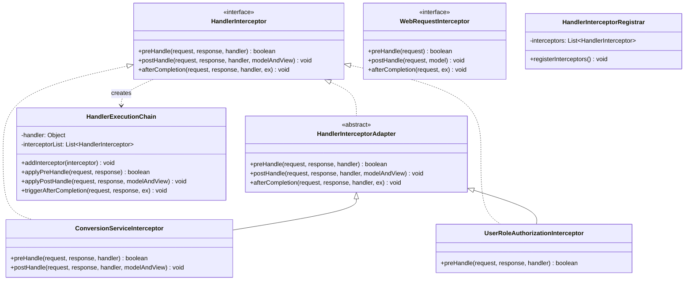
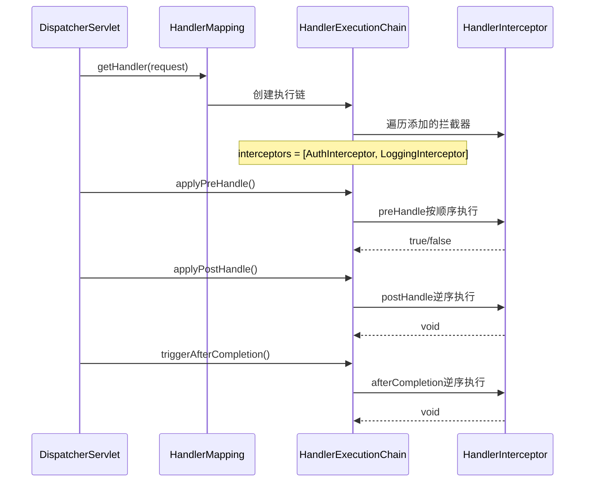
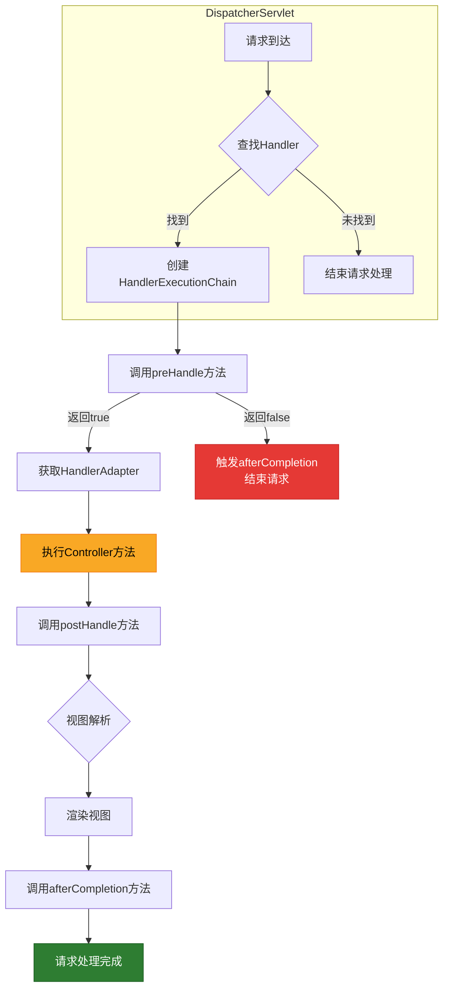
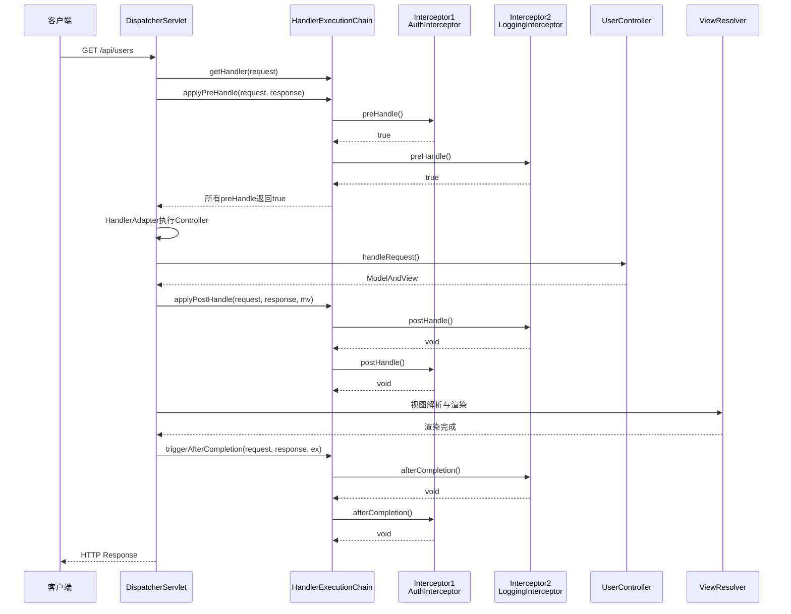
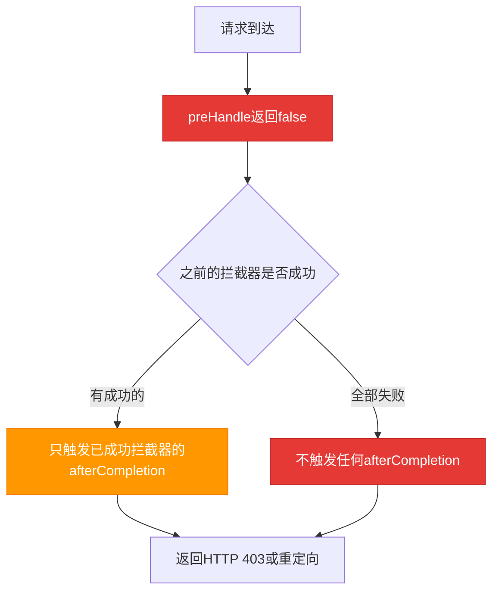
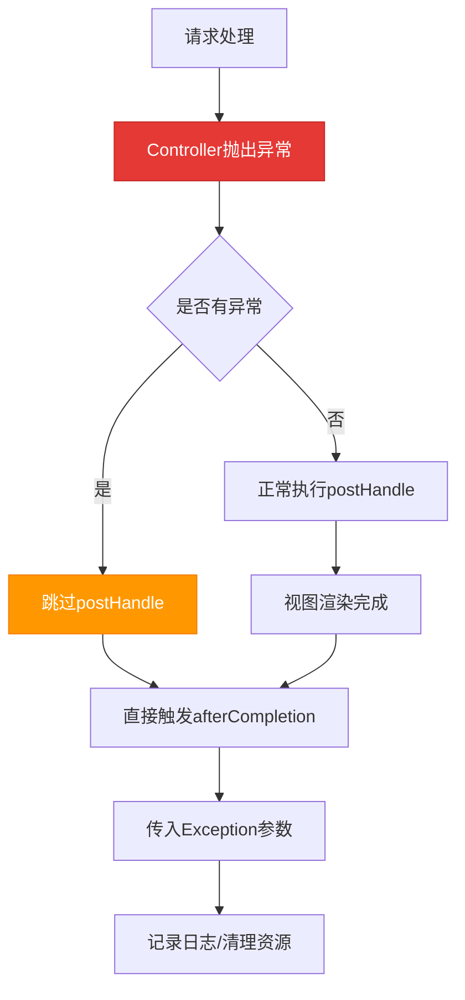
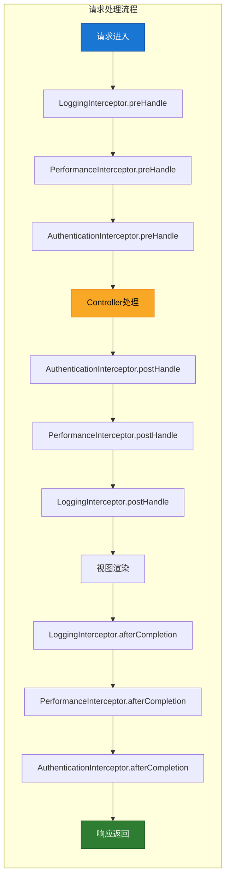

# 第7章：HandlerInterceptor 拦截器

## 7.1 HandlerInterceptor接口分析

`HandlerInterceptor` 是Spring MVC中用于拦截请求处理的核心接口，位于 `org.springframework.web.servlet` 包下。它允许开发者在请求处理的不同阶段添加自定义逻辑，如日志记录、权限检查、性能监控等。

### 7.1.1 接口定义

```java
public interface HandlerInterceptor {
    
    /**
     * 预处理方法，在控制器方法执行之前调用
     * @param request 当前HTTP请求
     * @param response 当前HTTP响应
     * @param handler 实际处理的处理器（Controller）
     * @return boolean 返回true继续执行后续处理，返回false则中断执行
     */
    boolean preHandle(HttpServletRequest request, HttpServletResponse response, 
                      Object handler) throws Exception;
    
    /**
     * 后处理方法，在控制器方法执行之后、视图渲染之前调用
     * @param request 当前HTTP请求
     * @param response 当前HTTP响应
     * @param handler 实际处理的处理器
     * @param modelAndView 控制器返回的模型和视图（如果视图已经处理则可能为null）
     */
    void postHandle(HttpServletRequest request, HttpServletResponse response, 
                    Object handler, ModelAndView modelAndView) throws Exception;
    
    /**
     * 完成处理方法，在视图渲染完成后调用，用于清理资源
     * @param request 当前HTTP请求
     * @param response 当前HTTP响应
     * @param handler 实际处理的处理器
     * @param ex 控制器方法抛出的异常（如果没有异常则为null）
     */
    void afterCompletion(HttpServletRequest request, HttpServletResponse response, 
                         Object handler, Exception ex) throws Exception;
}
```

### 7.1.2 三个方法的作用详解

#### preHandle - 前置拦截器

`preHandle` 是请求处理的第一道关卡，在Controller方法执行之前被调用。它的主要作用包括：

| 功能 | 说明 |
|------|------|
| **权限验证** | 检查用户是否已登录、是否有访问权限 |
| **性能监控** | 记录请求开始时间 |
| **请求预处理** | 修改请求参数、设置请求属性 |
| **阻止请求** | 返回`false`可以阻止后续处理流程 |

```java
@Component
public class AuthInterceptor implements HandlerInterceptor {
    
    @Override
    public boolean preHandle(HttpServletRequest request, HttpServletResponse response, 
                             Object handler) throws Exception {
        // 获取会话中的用户信息
        User user = (User) request.getSession().getAttribute("user");
        
        if (user == null) {
            // 未登录，返回false阻止后续处理
            response.sendRedirect("/login");
            return false;
        }
        
        // 记录请求开始时间
        long startTime = System.currentTimeMillis();
        request.setAttribute("startTime", startTime);
        
        return true; // 继续执行后续处理
    }
}
```

#### postHandle - 后置处理方法

`postHandle` 在Controller方法执行之后、视图渲染之前被调用。此时模型数据已经准备好，但视图还未解析。

| 功能 | 说明 |
|------|------|
| **视图数据处理** | 修改或添加模型数据 |
| **视图上下文修改** | 修改视图名称、添加共享数据 |
| **性能监控** | 记录Controller执行时间 |

```java
@Component
public class ViewDataInterceptor implements HandlerInterceptor {
    
    @Override
    public void postHandle(HttpServletRequest request, HttpServletResponse response, 
                           Object handler, ModelAndView modelAndView) throws Exception {
        if (modelAndView != null) {
            // 添加公共数据到所有视图
            modelAndView.addObject("appName", "Spring MVC Demo");
            modelAndView.addObject("currentUser", request.getSession().getAttribute("user"));
            
            // 修改视图名称
            if (modelAndView.getViewName().startsWith("redirect:")) {
                // 重定向视图不做处理
                return;
            }
            
            // 添加菜单数据
            modelAndView.addObject("menus", menuService.getMenus());
        }
    }
}
```

#### afterCompletion - 完成处理方法

`afterCompletion` 在整个请求处理完成（视图渲染完成）后调用，主要用于资源清理和异常处理。

| 功能 | 说明 |
|------|------|
| **资源清理** | 关闭数据库连接、释放锁 |
| **异常日志** | 记录请求处理中的异常 |
| **性能统计** | 计算请求总耗时 |

```java
@Component
public class CleanupInterceptor implements HandlerInterceptor {
    
    private static final Logger log = LoggerFactory.getLogger(CleanupInterceptor.class);
    
    @Override
    public void afterCompletion(HttpServletRequest request, HttpServletResponse response, 
                                Object handler, Exception ex) throws Exception {
        // 记录异常信息
        if (ex != null) {
            log.error("请求处理异常: {}, URI: {}", ex.getMessage(), request.getRequestURI(), ex);
        }
        
        // 计算请求处理时间
        Long startTime = (Long) request.getAttribute("startTime");
        if (startTime != null) {
            long duration = System.currentTimeMillis() - startTime;
            log.info("请求处理完成: {} - {}ms", request.getRequestURI(), duration);
        }
        
        // 清理ThreadLocal资源
        RequestContextHolder.clearRequestAttributes();
    }
}
```

---

## 7.2 HandlerInterceptor体系结构

### 7.2.1 类层次结构



### 7.2.2 核心组件详解

#### HandlerExecutionChain - 处理器执行链

`HandlerExecutionChain` 是拦截器执行的核心载体，它将处理器和拦截器组织在一起。

**源码位置**: `org.springframework.web.servlet.HandlerExecutionChain`

```java
public class HandlerExecutionChain {
    
    private static final Log logger = LogFactory.getLog(HandlerExecutionChain.class);
    
    private final Object handler;
    
    private final HandlerInterceptor[] interceptors;
    
    private final int interceptorIndex;
    
    // ... 构造方法和其他方法
}
```

#### 拦截器注册过程



### 7.2.3 拦截器注册方式

#### 方式一：实现WebMvcConfigurer

```java
@Configuration
public class WebConfig implements WebMvcConfigurer {
    
    @Autowired
    private AuthInterceptor authInterceptor;
    
    @Autowired
    private LoggingInterceptor loggingInterceptor;
    
    @Override
    public void addInterceptors(InterceptorRegistry registry) {
        registry.addInterceptor(authInterceptor)
                .addPathPatterns("/api/**")      // 拦截的路径
                .excludePathPatterns("/api/login", "/api/public/**"); // 排除的路径
        
        registry.addInterceptor(loggingInterceptor)
                .addPathPatterns("/**")
                .order(1); // 执行顺序，数值越小越先执行
    }
}
```

#### 方式二：直接定义拦截器注册器

```java
@Bean
public HandlerInterceptor authInterceptor() {
    return new AuthInterceptor();
}

@Bean
public HandlerInterceptorRegistrar handlerInterceptorRegistrar(
        HandlerInterceptor authInterceptor,
        HandlerInterceptor loggingInterceptor) {
    
    HandlerInterceptorRegistrar registrar = new HandlerInterceptorRegistrar();
    registrar.setInterceptors(new HandlerInterceptor[]{authInterceptor, loggingInterceptor});
    return registrar;
}
```

---

## 7.3 preHandle/postHandle/afterCompletion执行时机

### 7.3.1 完整执行流程



### 7.3.2 拦截器执行时序图



### 7.3.3 preHandle返回false时的处理流程



### 7.3.4 异常情况下的执行流程



---

## 7.4 实例：自定义拦截器实现与执行顺序分析

### 7.4.1 需求场景

创建一个完整的拦截器示例，实现以下功能：
1. **AuthenticationInterceptor** - 用户认证拦截
2. **LoggingInterceptor** - 请求日志记录
3. **PerformanceInterceptor** - 性能监控拦截

### 7.4.2 完整实现代码

#### AuthenticationInterceptor - 认证拦截器

```java
package com.example.interceptor;

import jakarta.servlet.http.HttpServletRequest;
import jakarta.servlet.http.HttpServletResponse;
import jakarta.servlet.http.HttpSession;
import org.springframework.web.servlet.HandlerInterceptor;

public class AuthenticationInterceptor implements HandlerInterceptor {
    
    private static final String[] EXCLUDE_PATHS = {
        "/login",
        "/register",
        "/static/**",
        "/public/**"
    };
    
    @Override
    public boolean preHandle(HttpServletRequest request, HttpServletResponse response, 
                             Object handler) throws Exception {
        
        String uri = request.getRequestURI();
        
        // 检查是否在排除路径中
        for (String path : EXCLUDE_PATHS) {
            if (matchPath(uri, path)) {
                return true;
            }
        }
        
        // 检查会话中的用户信息
        HttpSession session = request.getSession(false);
        if (session != null && session.getAttribute("user") != null) {
            return true;
        }
        
        // 未认证，返回401或重定向到登录页
        response.setStatus(HttpServletResponse.SC_UNAUTHORIZED);
        response.setContentType("application/json;charset=UTF-8");
        response.getWriter().write("{\"error\": \"未登录或登录已过期\"}");
        
        return false;
    }
    
    private boolean matchPath(String uri, String pattern) {
        if (pattern.endsWith("/**")) {
            String prefix = pattern.substring(0, pattern.length() - 3);
            return uri.startsWith(prefix);
        }
        return uri.equals(pattern);
    }
}
```

#### LoggingInterceptor - 日志拦截器

```java
package com.example.interceptor;

import jakarta.servlet.http.HttpServletRequest;
import jakarta.servlet.http.HttpServletResponse;
import org.slf4j.Logger;
import org.slf4j.LoggerFactory;
import org.springframework.web.servlet.HandlerInterceptor;

public class LoggingInterceptor implements HandlerInterceptor {
    
    private static final Logger log = LoggerFactory.getLogger(LoggingInterceptor.class);
    
    private static final String REQUEST_ID = "requestId";
    private static final String START_TIME = "startTime";
    
    @Override
    public boolean preHandle(HttpServletRequest request, HttpServletResponse response, 
                             Object handler) throws Exception {
        
        // 生成请求ID
        String requestId = generateRequestId();
        request.setAttribute(REQUEST_ID, requestId);
        request.setAttribute(START_TIME, System.currentTimeMillis());
        
        log.info("[{}] --> {} {} from {}", 
                 requestId,
                 request.getMethod(),
                 request.getRequestURI(),
                 getClientIP(request));
        
        return true;
    }
    
    @Override
    public void postHandle(HttpServletRequest request, HttpServletResponse response, 
                          Object handler, org.springframework.web.servlet.ModelAndView modelAndView) {
        // Controller处理完成后记录
    }
    
    @Override
    public void afterCompletion(HttpServletRequest request, HttpServletResponse response, 
                               Object handler, Exception ex) throws Exception {
        
        String requestId = (String) request.getAttribute(REQUEST_ID);
        Long startTime = (Long) request.getAttribute(START_TIME);
        
        if (startTime != null) {
            long duration = System.currentTimeMillis() - startTime;
            
            log.info("[{}] <-- {} {} - Status: {} - Duration: {}ms",
                     requestId,
                     request.getMethod(),
                     request.getRequestURI(),
                     response.getStatus(),
                     duration);
        }
        
        // 记录异常
        if (ex != null) {
            log.error("[{}] Exception during request processing", requestId, ex);
        }
    }
    
    private String generateRequestId() {
        return String.format("%08x", System.currentTimeMillis() ^ (int)(Math.random() * Integer.MAX_VALUE));
    }
    
    private String getClientIP(HttpServletRequest request) {
        String ip = request.getHeader("X-Forwarded-For");
        if (ip == null || ip.isEmpty() || "unknown".equalsIgnoreCase(ip)) {
            ip = request.getHeader("X-Real-IP");
        }
        if (ip == null || ip.isEmpty() || "unknown".equalsIgnoreCase(ip)) {
            ip = request.getRemoteAddr();
        }
        // 多级代理时取第一个IP
        if (ip != null && ip.contains(",")) {
            ip = ip.split(",")[0].trim();
        }
        return ip;
    }
}
```

#### PerformanceInterceptor - 性能监控拦截器

```java
package com.example.interceptor;

import jakarta.servlet.http.HttpServletRequest;
import jakarta.servlet.http.HttpServletResponse;
import org.springframework.web.servlet.HandlerInterceptor;

public class PerformanceInterceptor implements HandlerInterceptor {
    
    private static final String START_TIME = "perfStartTime";
    private static final String HANDLER = "perfHandler";
    
    @Override
    public boolean preHandle(HttpServletRequest request, HttpServletResponse response, 
                             Object handler) throws Exception {
        request.setAttribute(START_TIME, System.nanoTime());
        request.setAttribute(HANDLER, handler.getClass().getSimpleName());
        return true;
    }
    
    @Override
    public void postHandle(HttpServletRequest request, HttpServletResponse response, 
                           Object handler, org.springframework.web.servlet.ModelAndView modelAndView) {
        // Controller执行后、视图渲染前记录中间时间
        Long startTime = (Long) request.getAttribute(START_TIME);
        if (startTime != null) {
            long controllerTime = System.nanoTime() - startTime;
            request.setAttribute("controllerTime", controllerTime / 1_000_000.0);
        }
    }
    
    @Override
    public void afterCompletion(HttpServletRequest request, HttpServletResponse response, 
                               Object handler, Exception ex) throws Exception {
        
        Long startTime = (Long) request.getAttribute(START_TIME);
        String handlerName = (String) request.getAttribute(HANDLER);
        
        if (startTime != null) {
            long totalTime = System.nanoTime() - startTime;
            Double controllerTime = (Double) request.getAttribute("controllerTime");
            
            // 打印性能日志
            System.out.printf("Performance[%s] - Controller: %.2fms, Total: %.2fms%n",
                    handlerName,
                    controllerTime != null ? controllerTime : 0,
                    totalTime / 1_000_000.0);
        }
    }
}
```

### 7.4.3 拦截器配置类

```java
package com.example.config;

import com.example.interceptor.AuthenticationInterceptor;
import com.example.interceptor.LoggingInterceptor;
import com.example.interceptor.PerformanceInterceptor;
import org.springframework.context.annotation.Configuration;
import org.springframework.web.servlet.config.annotation.InterceptorRegistry;
import org.springframework.web.servlet.config.annotation.WebMvcConfigurer;

@Configuration
public class WebMvcConfig implements WebMvcConfigurer {
    
    @Override
    public void addInterceptors(InterceptorRegistry registry) {
        
        // 日志拦截器 - 首先执行（order越小越先执行）
        registry.addInterceptor(new LoggingInterceptor())
                .addPathPatterns("/**")
                .order(1);
        
        // 性能拦截器 - 第二执行
        registry.addInterceptor(new PerformanceInterceptor())
                .addPathPatterns("/**")
                .order(2);
        
        // 认证拦截器 - 最后执行（保护最内层资源）
        registry.addInterceptor(new AuthenticationInterceptor())
                .addPathPatterns("/api/**", "/admin/**")
                .excludePathPatterns("/api/login", "/api/public/**")
                .order(3);
    }
}
```

### 7.4.4 执行顺序分析

#### 拦截器执行顺序图



#### 顺序规则总结

| 特性 | preHandle顺序 | postHandle顺序 | afterCompletion顺序 |
|------|--------------|----------------|---------------------|
| **执行方向** | 正序（1,2,3...） | 逆序（3,2,1...） | 逆序（3,2,1...） |
| **原因** | 从外到内拦截请求 | 从内到外处理响应 | 从内到外清理资源 |
| **短路效果** | 返回false时，后续preHandle不执行 | 不受preHandle返回值影响 | 只有已执行的preHandle对应的afterCompletion会被调用 |

### 7.4.5 异常情况演示

#### preHandle返回false时的执行

```java
// 场景：用户未登录，AuthenticationInterceptor.preHandle返回false

// 执行顺序变为：
1. LoggingInterceptor.preHandle()     → true, 继续
2. PerformanceInterceptor.preHandle()  → true, 继续
3. AuthenticationInterceptor.preHandle()→ false, 停止

// afterCompletion只会执行已成功preHandle的拦截器：
1. PerformanceInterceptor.afterCompletion()  // 执行（其preHandle返回true）
2. LoggingInterceptor.afterCompletion()      // 执行（其preHandle返回true）
3. AuthenticationInterceptor.afterCompletion() // 不执行（其preHandle返回false）
```

#### Controller抛出异常时的执行

```java
// 场景：Controller处理过程中抛出异常

// 执行顺序变为：
1. LoggingInterceptor.preHandle()      → true
2. PerformanceInterceptor.preHandle()  → true  
3. AuthenticationInterceptor.preHandle()→ true
4. Controller执行 → 抛出异常！

// postHandle全部跳过，直接执行afterCompletion：
1. LoggingInterceptor.afterCompletion(ex)    // ex不为null
2. PerformanceInterceptor.afterCompletion(ex) // ex不为null
3. AuthenticationInterceptor.afterCompletion(ex) // ex不为null
```

### 7.4.6 实际应用场景

#### 场景1：API接口限流

```java
public class RateLimitInterceptor implements HandlerInterceptor {
    
    private final RateLimiter rateLimiter;
    
    public RateLimitInterceptor(RateLimiter rateLimiter) {
        this.rateLimiter = rateLimiter;
    }
    
    @Override
    public boolean preHandle(HttpServletRequest request, HttpServletResponse response, 
                             Object handler) throws Exception {
        String clientId = getClientId(request);
        
        if (!rateLimiter.tryAcquire(clientId)) {
            response.setStatus(429); // Too Many Requests
            response.getWriter().write("{\"error\": \"请求过于频繁\"}");
            return false;
        }
        return true;
    }
    
    private String getClientId(HttpServletRequest request) {
        // 优先使用用户ID，其次使用IP
        HttpSession session = request.getSession(false);
        if (session != null && session.getAttribute("userId") != null) {
            return "user:" + session.getAttribute("userId");
        }
        return "ip:" + getClientIP(request);
    }
}
```

#### 场景2：数据加载拦截器

```java
public class DataLoadingInterceptor implements HandlerInterceptor {
    
    @Override
    public void postHandle(HttpServletRequest request, HttpServletResponse response, 
                          Object handler, ModelAndView modelAndView) throws Exception {
        if (modelAndView != null && !modelAndView.getViewName().startsWith("redirect:")) {
            // 添加面包屑数据
            modelAndView.addObject("breadcrumbs", buildBreadcrumbs(request));
            
            // 添加分页信息
            if (modelAndView.getModel().containsKey("page")) {
                Page<?> page = (Page<?>) modelAndView.getModel().get("page");
                modelAndView.addObject("pagination", buildPagination(page));
            }
        }
    }
    
    private List<Breadcrumb> buildBreadcrumbs(HttpServletRequest request) {
        // 根据请求路径构建面包屑
        return Collections.emptyList();
    }
    
    private Pagination buildPagination(Page<?> page) {
        // 构建分页信息
        return new Pagination();
    }
}
```

---

## 本章小结

本章详细分析了Spring MVC中`HandlerInterceptor`拦截器的源码结构和执行流程：

1. **接口设计**：`HandlerInterceptor`包含三个方法，分别在请求处理的不同阶段被调用
2. **执行顺序**：`preHandle`正序执行，`postHandle`和`afterCompletion`逆序执行
3. **短路机制**：`preHandle`返回`false`会阻止后续处理，并跳过对应拦截器的`afterCompletion`
4. **异常处理**：`afterCompletion`是唯一能接收到Controller异常的方法

通过自定义拦截器，我们可以实现认证授权、日志记录、性能监控、数据预处理等通用功能，是Spring MVC扩展的重要方式。
