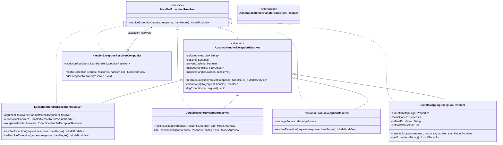
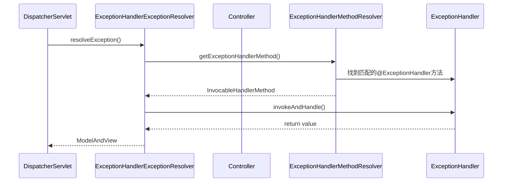
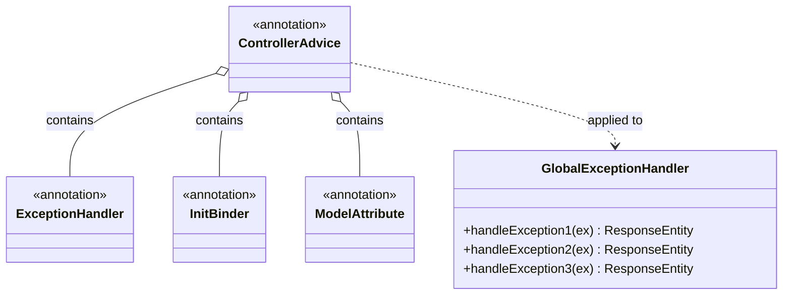
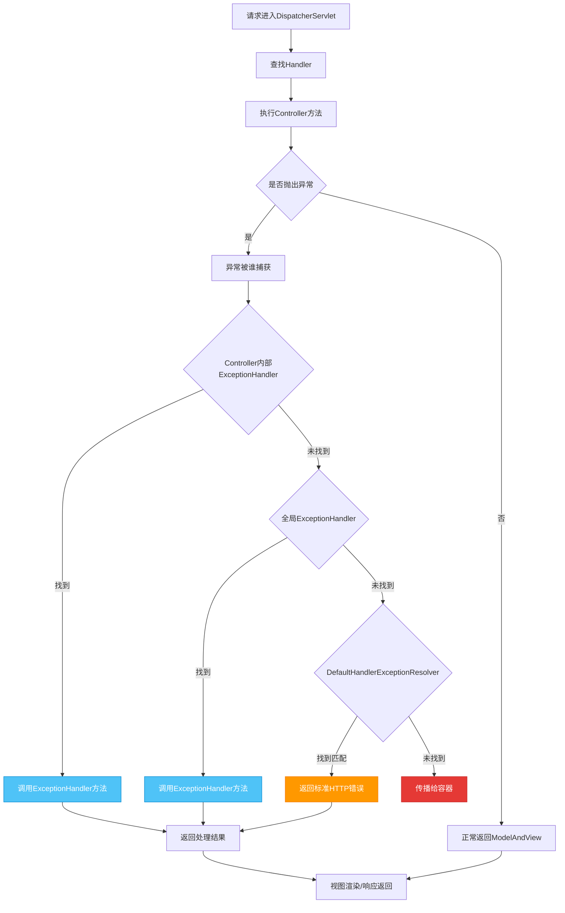
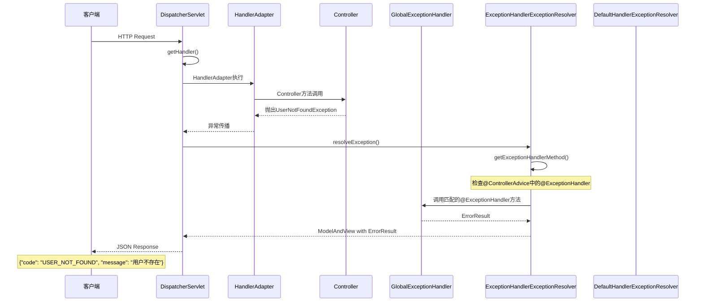
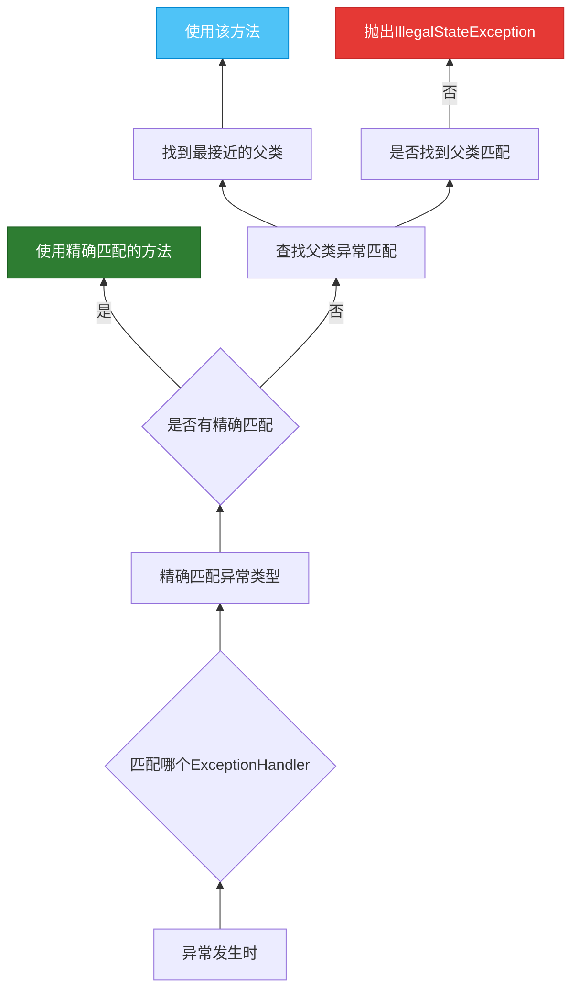

# 第8章：异常处理机制

## 8.1 HandlerExceptionResolver体系结构

Spring MVC的异常处理机制是其核心特性之一，通过`HandlerExceptionResolver`接口将异常处理与业务逻辑分离，提供了一套灵活、可扩展的异常处理体系。

### 8.1.1 核心接口定义

**源码位置**: `org.springframework.web.servlet.HandlerExceptionResolver`

```java
@FunctionalInterface
public interface HandlerExceptionResolver {
    
    /**
     * 尝试处理请求过程中发生的异常
     * @param request 当前HTTP请求
     * @param response 当前HTTP响应
     * @param handler 实际处理的处理器（可能是null）
     * @param ex 发生的异常
     * @return ModelAndView 返回一个ModelAndView用于渲染错误页面，
     *         如果异常已处理且响应已提交则返回null
     */
    @Nullable
    ModelAndView resolveException(HttpServletRequest request,
                                   HttpServletResponse response,
                                   @Nullable Object handler,
                                   Exception ex);
}
```

### 8.1.2 完整类图



### 8.1.3 HandlerExceptionResolverComposite - 组合异常解析器

`HandlerExceptionResolverComposite`是Spring MVC中用于管理多个异常解析器的容器类，类似于`HandlerMapping`的管理方式。

**源码位置**: `org.springframework.web.servlet.HandlerExceptionResolverComposite`

```java
public class HandlerExceptionResolverComposite implements HandlerExceptionResolver {
    
    private static final Log logger = LogFactory.getLog(HandlerExceptionResolverComposite.class);
    
    private final List<HandlerExceptionResolver> exceptionResolvers = new ArrayList<>();
    
    private boolean logExceptionResolvers = false;
    
    @Override
    @Nullable
    public ModelAndView resolveException(HttpServletRequest request, 
                                         HttpServletResponse response,
                                         @Nullable Object handler,
                                         Exception ex) {
        
        if (this.exceptionResolvers.isEmpty()) {
            return null;
        }
        
        ModelAndView exceptionResult = null;
        
        for (HandlerExceptionResolver resolver : this.exceptionResolvers) {
            exceptionResult = resolver.resolveException(request, response, handler, ex);
            if (exceptionResult != null) {
                // 找到能处理该异常的解析器，停止遍历
                break;
            }
        }
        
        return exceptionResult;
    }
    
    public void addExceptionResolver(HandlerExceptionResolver resolver) {
        this.exceptionResolvers.add(resolver);
    }
    
    public List<HandlerExceptionResolver> getExceptionResolvers() {
        return Collections.unmodifiableList(this.exceptionResolvers);
    }
}
```

### 8.1.4 默认异常解析器顺序

在`DispatcherServlet`中，默认注册的异常解析器顺序如下：


---

## 8.2 @ExceptionHandler注解处理

### 8.2.1 ExceptionHandlerExceptionResolver 详解

`ExceptionHandlerExceptionResolver`是Spring MVC中处理`@ExceptionHandler`注解的核心解析器，它能够将控制器方法中抛出的异常分发给标注了`@ExceptionHandler`的方法进行处理。

**源码位置**: `org.springframework.web.servlet.mvc.method.annotation.ExceptionHandlerExceptionResolver`



### 8.2.2 核心源码解析

#### ExceptionHandlerExceptionResolver构造

```java
public class ExceptionHandlerExceptionResolver extends AbstractHandlerExceptionResolver {
    
    private HandlerMethodArgumentResolverComposite argumentResolvers;
    
    private HandlerMethodReturnValueHandlerComposite returnValueHandlers;
    
    private ExceptionHandlerExceptionResolver exceptionHandlerResolver;
    
    private final Map<Class<?>, Set<Method>> exceptionHandlerCache = new ConcurrentHashMap<>(64);
    
    @Override
    public void afterPropertiesSet() {
        // 初始化参数解析器
        this.argumentResolvers = new HandlerMethodArgumentResolverComposite();
        this.argumentResolvers.addResolvers(initArgumentResolvers());
        
        // 初始化返回值处理器
        this.returnValueHandlers = new HandlerMethodReturnValueHandlerComposite();
        this.returnValueHandlers.addHandlers(initReturnValueHandlers());
        
        // 初始化异常处理器解析器
        this.exceptionHandlerResolver = createExceptionHandlerExceptionResolver();
        this.exceptionHandlerResolver.afterPropertiesSet();
    }
}
```

#### doResolveException方法

```java
@Override
@Nullable
protected ModelAndView doResolveException(HttpServletRequest request,
                                          HttpServletResponse response,
                                          @Nullable Object handler,
                                          Exception originalException) {
    
    ModelAndView modelAndView = null;
    
    try {
        // 1. 获取或创建ExceptionHandlerMethodResolver
        ExceptionHandlerMethodResolver resolver = getExceptionHandlerMethod(handler);
        
        // 2. 调用异常处理方法
        InvocableHandlerMethod exceptionHandlerMethod = 
            resolver.resolveMethod(originalException);
        
        if (exceptionHandlerMethod == null) {
            return null;
        }
        
        // 3. 准备方法调用的参数
        exceptionHandlerMethod.setDetails(getMethodDetails(request, originalException));
        
        // 4. 执行方法调用
        modelAndView = exceptionHandlerMethod.invokeForRequest(request, response, originalException);
        
    } catch (Exception invocationEx) {
        // 处理方法调用过程中的异常
        logger.error("Error resolving exception", invocationEx);
    }
    
    return modelAndView;
}
```

### 8.2.3 @ExceptionHandler使用详解

#### 基本用法

```java
@RestController
@RequestMapping("/api/users")
public class UserController {
    
    @Autowired
    private UserService userService;
    
    @GetMapping("/{id}")
    public User getUser(@PathVariable Long id) {
        return userService.findById(id);
    }
    
    // 处理UserNotFoundException
    @ExceptionHandler(UserNotFoundException.class)
    public ResponseEntity<ErrorResult> handleUserNotFound(UserNotFoundException ex) {
        ErrorResult error = new ErrorResult(
            "USER_NOT_FOUND",
            ex.getMessage(),
            HttpStatus.NOT_FOUND.value()
        );
        return ResponseEntity.status(HttpStatus.NOT_FOUND).body(error);
    }
    
    // 处理通用的Exception
    @ExceptionHandler(Exception.class)
    public ResponseEntity<ErrorResult> handleGeneral(Exception ex) {
        ErrorResult error = new ErrorResult(
            "INTERNAL_ERROR",
            "服务器内部错误",
            HttpStatus.INTERNAL_SERVER_ERROR.value()
        );
        return ResponseEntity.status(HttpStatus.INTERNAL_SERVER_ERROR).body(error);
    }
}
```

#### ErrorResult实体类

```java
public class ErrorResult {
    private String code;
    private String message;
    private int status;
    private LocalDateTime timestamp;
    private String path;
    
    // 构造方法、getter、setter省略
}
```

### 8.2.4 @ExceptionHandler方法参数解析

`@ExceptionHandler`标注的方法可以接受多种参数，Spring MVC会自动注入：

| 参数类型 | 说明 |
|---------|------|
| `Exception` | 抛出的异常对象（必须） |
| `HttpServletRequest` | 当前请求 |
| `HttpServletResponse` | 当前响应 |
| `HttpSession` | 会话对象 |
| `@PathVariable` | 路径变量 |
| `@RequestParam` | 请求参数 |
| `@RequestHeader` | 请求头 |
| `WebRequest` | Web请求对象 |
| `Locale` | 本地化信息 |
| `Model` | 模型对象 |

#### 示例

```java
@ExceptionHandler(BusinessException.class)
public ResponseEntity<ErrorResult> handleBusinessException(
        BusinessException ex,
        HttpServletRequest request,
        @RequestParam(required = false) String traceId,
        Locale locale,
        Model model) {
    
    // 使用注入的参数
    String localizedMessage = messageSource.getMessage(
        ex.getCode(), ex.getArgs(), ex.getMessage(), locale);
    
    // 添加到模型
    model.addAttribute("traceId", traceId);
    
    ErrorResult error = new ErrorResult(
        ex.getCode(),
        localizedMessage,
        HttpStatus.BAD_REQUEST.value()
    );
    error.setPath(request.getRequestURI());
    
    return ResponseEntity.badRequest().body(error);
}
```

### 8.2.5 @ExceptionHandler方法返回值

`@ExceptionHandler`方法可以返回多种类型：

| 返回类型 | 说明 |
|---------|------|
| `ModelAndView` | 模型和视图 |
| `Model` | 只返回模型数据 |
| `Map<String, Object>` | 返回Map作为模型数据 |
| `@ResponseBody` + 对象 | 直接写入响应体（JSON/XML） |
| `ResponseEntity<?>` | 完整的HTTP响应 |
| `void` | 直接写入响应 |

#### 返回ModelAndView

```java
@ExceptionHandler(ViewException.class)
public ModelAndView handleViewException(ViewException ex) {
    ModelAndView mav = new ModelAndView("error/custom");
    mav.addObject("errorMessage", ex.getMessage());
    mav.addObject("errorCode", ex.getCode());
    return mav;
}
```

#### 返回JSON（@RestController场景）

```java
@ExceptionHandler(DataValidationException.class)
@ResponseStatus(HttpStatus.BAD_REQUEST)
public ErrorResult handleValidationException(DataValidationException ex) {
    return new ErrorResult(
        "VALIDATION_ERROR",
        ex.getMessage(),
        HttpStatus.BAD_REQUEST.value()
    );
}
```

---

## 8.3 DefaultHandlerExceptionResolver标准异常处理

### 8.3.1 概述

`DefaultHandlerExceptionResolver`是Spring MVC为常见的HTTP状态码提供的默认异常映射，它处理一系列标准的Spring MVC异常，并将它们转换为相应的HTTP响应。

**源码位置**: `org.springframework.web.servlet.mvc.support.DefaultHandlerExceptionResolver`

### 8.3.2 处理的异常类型

```mermaid
classDiagram
    class DefaultHandlerExceptionResolver {
        +resolveException() ModelAndView
    }
    
    class HttpRequestMethodNotSupportedException {
        +405 Method Not Allowed
    }
    
    class HttpMediaTypeNotSupportedException {
        +415 Unsupported Media Type
    }
    
    class HttpMediaTypeNotAcceptableException {
        +406 Not Acceptable
    }
    
    class MissingPathVariableException {
        +500 Internal Server Error
    }
    
    class MissingServletRequestParameterException {
        +400 Bad Request
    }
    
    class ServletRequestBindingException {
        +400 Bad Request
    }
    
    class ConversionNotSupportedException {
        +500 Internal Server Error
    }
    
    class TypeMismatchException {
        +400 Bad Request
    }
    
    class HttpMessageNotReadableException {
        +400 Bad Request
    }
    
    class HttpMessageNotWritableException {
        +500 Internal Server Error
    }
    
    class MethodArgumentNotValidException {
        +400 Bad Request
    }
    
    class MissingServletRequestPartException {
        +400 Bad Request
    }
    
    class BindException {
        +400 Bad Request
    }
    
    DefaultHandlerExceptionResolver ..> HttpRequestMethodNotSupportedException : handles
    DefaultHandlerExceptionResolver ..> HttpMediaTypeNotSupportedException : handles
    DefaultHandlerExceptionResolver ..> MissingServletRequestParameterException : handles
    DefaultHandlerExceptionResolver ..> MethodArgumentNotValidException : handles
```



### 8.3.3 异常到HTTP状态的映射

| Spring异常 | HTTP状态 | 触发场景 |
|-----------|----------|---------|
| `HttpRequestMethodNotSupportedException` | 405 | 请求方法不支持（如POST请求用GET方法访问） |
| `HttpMediaTypeNotSupportedException` | 415 | 不支持的媒体类型 |
| `HttpMediaTypeNotAcceptableException` | 406 | 无法提供可接受的响应类型 |
| `MissingPathVariableException` | 500 | 缺少路径变量 |
| `MissingServletRequestParameterException` | 400 | 缺少请求参数 |
| `TypeMismatchException` | 400 | 类型不匹配 |
| `HttpMessageNotReadableException` | 400 | 请求体无法解析（JSON格式错误） |
| `MethodArgumentNotValidException` | 400 | 参数校验失败 |
| `HandlerMethodValidationException` | 400 | 方法参数校验失败 |
| `BindException` | 400 | 数据绑定失败 |
| `NoHandlerFoundException` | 404 | 未找到处理器（需配置） |
| `AsyncRequestTimeoutException` | 503 | 异步请求超时 |

### 8.3.4 核心源码解析

```java
public class DefaultHandlerExceptionResolver extends AbstractHandlerExceptionResolver {
    
    @Override
    @Nullable
    protected ModelAndView doResolveException(HttpServletRequest request,
                                                HttpServletResponse response,
                                                @Nullable Object handler,
                                                Exception ex) {
        try {
            // 根据异常类型分发处理
            if (ex instanceof HttpRequestMethodNotSupportedException) {
                return handleHttpRequestMethodNotSupported(
                    (HttpRequestMethodNotSupportedException) ex, request, response, handler);
            }
            
            if (ex instanceof HttpMediaTypeNotSupportedException) {
                return handleHttpMediaTypeNotSupported(
                    (HttpMediaTypeNotSupportedException) ex, request, response, handler);
            }
            
            if (ex instanceof HttpMediaTypeNotAcceptableException) {
                return handleHttpMediaTypeNotAcceptable(
                    (HttpMediaTypeNotAcceptableException) ex, request, response, handler);
            }
            
            if (ex instanceof MissingPathVariableException) {
                return handleMissingPathVariable(
                    (MissingPathVariableException) ex, request, response, handler);
            }
            
            if (ex instanceof MissingServletRequestParameterException) {
                return handleMissingServletRequestParameter(
                    (MissingServletRequestParameterException) ex, request, response, handler);
            }
            
            if (ex instanceof MethodArgumentNotValidException) {
                return handleMethodArgumentNotValid(
                    (MethodArgumentNotValidException) ex, request, response, handler);
            }
            
            // ... 其他异常类型处理
        } catch (Exception handlerEx) {
            logger.warn("Handling of [" + ex.getClass().getName() + "] resulted in Exception", handlerEx);
        }
        
        return null; // 无法处理，返回null
    }
    
    // 405 Method Not Allowed 处理
    protected ModelAndView handleHttpRequestMethodNotSupported(
            HttpRequestMethodNotSupportedException ex,
            HttpServletRequest request,
            HttpServletResponse response,
            @Nullable Object handler) throws IOException {
        
        PageInfo pageInfo = getPageInfo(request, response, handler);
        
        response.setStatus(getStatus().value());
        
        // 设置支持的HTTP方法到Allow头
        String[] supportedMethods = ex.getSupportedMethods();
        if (supportedMethods != null) {
            response.setHeader("Allow", StringUtils.arrayToDelimitedString(supportedMethods, ", "));
        }
        
        // 如果是XML请求，渲染错误视图
        if (MediaType.APPLICATION_XML.includes(request.getMediaType())) {
            return renderDefaultErrorView(request, response, getStatus(), ex, pageInfo);
        }
        
        return null; // 其他情况返回null，由其他解析器处理
    }
}
```

### 8.3.5 自定义错误响应格式

默认情况下，`DefaultHandlerExceptionResolver`会渲染一个简单的错误页面。如果需要自定义错误响应，可以覆盖相应方法：

```java
@Configuration
public class CustomDefaultExceptionResolver extends DefaultHandlerExceptionResolver {
    
    @Override
    protected ModelAndView handleHttpRequestMethodNotSupported(
            HttpRequestMethodNotSupportedException ex,
            HttpServletRequest request,
            HttpServletResponse response,
            @Nullable Object handler) throws IOException {
        
        response.setContentType("application/json;charset=UTF-8");
        response.setStatus(HttpStatus.METHOD_NOT_ALLOWED.value());
        response.setHeader("Allow", StringUtils.arrayToDelimitedString(ex.getSupportedMethods(), ", "));
        
        Map<String, Object> error = new HashMap<>();
        error.put("code", "METHOD_NOT_ALLOWED");
        error.put("message", "不支持的请求方法: " + ex.getMessage());
        error.put("supportedMethods", Arrays.asList(ex.getSupportedMethods()));
        
        response.getWriter().write(new ObjectMapper().writeValueAsString(error));
        
        return new ModelAndView(); // 空视图，表示已处理
    }
}
```

---

## 8.4 全局异常处理流程与@ControllerAdvice

### 8.4.1 @ControllerAdvice概述

`@ControllerAdvice`是Spring 3.2引入的注解，用于定义全局的异常处理器、切面和数据绑定校正器。它将`@ExceptionHandler`、`@InitBinder`和`@ModelAttribute`方法集中到一个类中管理。



### 8.4.2 全局异常处理流程



### 8.4.3 完整异常处理时序图



### 8.4.4 全局异常处理器实现

#### 基础全局异常处理器

```java
@RestControllerAdvice
public class GlobalExceptionHandler {
    
    private static final Logger log = LoggerFactory.getLogger(GlobalExceptionHandler.class);
    
    @Autowired
    private MessageSource messageSource;
    
    // 1. 处理业务异常
    @ExceptionHandler(BusinessException.class)
    @ResponseStatus(HttpStatus.BAD_REQUEST)
    public ErrorResult handleBusinessException(BusinessException ex, Locale locale) {
        String message = messageSource.getMessage(
            ex.getCode(), ex.getArgs(), ex.getMessage(), locale);
        
        return ErrorResult.builder()
                .code(ex.getCode())
                .message(message)
                .status(HttpStatus.BAD_REQUEST.value())
                .timestamp(LocalDateTime.now())
                .build();
    }
    
    // 2. 处理数据验证异常
    @ExceptionHandler(MethodArgumentNotValidException.class)
    @ResponseStatus(HttpStatus.BAD_REQUEST)
    public ErrorResult handleValidationException(MethodArgumentNotValidException ex) {
        List<FieldError> fieldErrors = ex.getBindingResult().getFieldErrors();
        
        List<ErrorResult.FieldErrorInfo> errors = fieldErrors.stream()
                .map(error -> new ErrorResult.FieldErrorInfo(
                    error.getField(),
                    error.getDefaultMessage(),
                    error.getRejectedValue()))
                .collect(Collectors.toList());
        
        return ErrorResult.builder()
                .code("VALIDATION_ERROR")
                .message("数据验证失败")
                .status(HttpStatus.BAD_REQUEST.value())
                .timestamp(LocalDateTime.now())
                .errors(errors)
                .build();
    }
    
    // 3. 处理资源不存在异常
    @ExceptionHandler(ResourceNotFoundException.class)
    @ResponseStatus(HttpStatus.NOT_FOUND)
    public ErrorResult handleResourceNotFound(ResourceNotFoundException ex) {
        return ErrorResult.builder()
                .code("RESOURCE_NOT_FOUND")
                .message(ex.getMessage())
                .status(HttpStatus.NOT_FOUND.value())
                .timestamp(LocalDateTime.now())
                .build();
    }
    
    // 4. 处理权限不足异常
    @ExceptionHandler(AccessDeniedException.class)
    @ResponseStatus(HttpStatus.FORBIDDEN)
    public ErrorResult handleAccessDenied(AccessDeniedException ex) {
        return ErrorResult.builder()
                .code("ACCESS_DENIED")
                .message("权限不足，无法访问该资源")
                .status(HttpStatus.FORBIDDEN.value())
                .timestamp(LocalDateTime.now())
                .build();
    }
    
    // 5. 处理所有未捕获的异常
    @ExceptionHandler(Exception.class)
    @ResponseStatus(HttpStatus.INTERNAL_SERVER_ERROR)
    public ErrorResult handleGenericException(Exception ex, HttpServletRequest request) {
        log.error("未处理的异常: {}", request.getRequestURI(), ex);
        
        return ErrorResult.builder()
                .code("INTERNAL_ERROR")
                .message("服务器内部错误")
                .status(HttpStatus.INTERNAL_SERVER_ERROR.value())
                .timestamp(LocalDateTime.now())
                .path(request.getRequestURI())
                .build();
    }
}
```

#### ErrorResult增强版

```java
public class ErrorResult {
    private String code;
    private String message;
    private int status;
    private LocalDateTime timestamp;
    private String path;
    private List<FieldErrorInfo> errors;
    
    @Data
    @AllArgsConstructor
    public static class FieldErrorInfo {
        private String field;
        private String message;
        private Object rejectedValue;
    }
    
    // Builder模式省略
}
```

### 8.4.5 @ControllerAdvice的多种用法

#### 按注解选择控制器

```java
// 只处理标注了@RestController的控制器
@RestControllerAdvice(annotations = RestController.class)
public class RestExceptionHandler {
    // ...
}

// 只处理标注了特定注解的控制器
@ControllerAdvice(annotations = Controller.class)
public class WebExceptionHandler {
    // ...
}
```

#### 按包名选择控制器

```java
// 只处理com.example.api包下的控制器
@ControllerAdvice(basePackages = "com.example.api")
public class ApiExceptionHandler {
    // ...
}

// 处理多个包
@ControllerAdvice(basePackages = {"com.example.api", "com.example.admin"})
public class MultiPackageExceptionHandler {
    // ...
}
```

#### 按控制器类名选择

```java
// 只处理控制器类名以Admin结尾的
@ControllerAdvice(assignableTypes = {UserController.class, ProductController.class})
public class SpecificExceptionHandler {
    // ...
}
```

### 8.4.6 异常处理优先级

当存在多个`@ExceptionHandler`方法时，选择顺序如下：



**匹配规则示例**：

```java
@ExceptionHandler(FileNotFoundException.class)  // 优先级1：精确匹配
@ExceptionHandler(IOException.class)            // 优先级2：父类匹配
@ExceptionHandler(Exception.class)              // 优先级3：通用异常
```

### 8.4.7 异常处理与响应状态码

#### @ResponseStatus注解

可以在异常类上使用`@ResponseStatus`来指定默认的HTTP状态码：

```java
@ResponseStatus(HttpStatus.NOT_FOUND)
public class ResourceNotFoundException extends RuntimeException {
    // 异常类定义
}
```

这种方式不需要`@ExceptionHandler`，由`ResponseStatusExceptionResolver`处理：

```java
@ExceptionHandler(ResourceNotFoundException.class)
public void handleResourceNotFound(ResourceNotFoundException ex, HttpServletResponse response) 
        throws IOException {
    response.sendError(HttpStatus.NOT_FOUND.value(), ex.getMessage());
}
```

#### ResponseEntityExceptionHandler

`ResponseEntityExceptionHandler`是一个便捷的基类，预定义了多种异常的处理方法：

```java
@RestControllerAdvice
public class CustomResponseEntityExceptionHandler extends ResponseEntityExceptionHandler {
    
    // 覆盖父类的方法
    @Override
    protected ResponseEntity<Object> handleMethodArgumentNotValid(
            MethodArgumentNotValidException ex,
            HttpHeaders headers,
            HttpStatus status,
            WebRequest request) {
        
        ErrorResult error = new ErrorResult("VALIDATION_ERROR", "验证失败");
        // 处理逻辑...
        
        return new ResponseEntity<>(error, HttpStatus.BAD_REQUEST);
    }
    
    // 处理MissingServletRequestParameterException
    @Override
    protected ResponseEntity<Object> handleMissingServletRequestParameter(
            MissingServletRequestParameterException ex,
            HttpHeaders headers,
            HttpStatus status,
            WebRequest request) {
        
        ErrorResult error = new ErrorResult("MISSING_PARAMETER", ex.getMessage());
        return new ResponseEntity<>(error, HttpStatus.BAD_REQUEST);
    }
}
```

### 8.4.8 配置全局异常处理

#### Spring Boot配置

```yaml
spring:
  mvc:
    throw-exception-if-no-handler-found: true  # 开启NoHandlerFoundException
  web:
    resources:
      add-mappings: false  # 关闭默认静态资源映射
```

```java
@Configuration
public class WebMvcConfig implements WebMvcConfigurer {
    
    @Override
    public void configureHandlerExceptionResolvers(List<HandlerExceptionResolver> resolvers) {
        // 添加自定义异常解析器
        resolvers.add(0, new CustomExceptionResolver());
    }
    
    @Override
    public void addInterceptors(InterceptorRegistry registry) {
        // 异常处理相关配置
    }
}
```

#### 自定义异常解析器注册

```java
@Configuration
public class ExceptionHandlerConfig {
    
    @Bean
    public HandlerExceptionResolver handlerExceptionResolver(
            List<HandlerExceptionResolver> resolvers) {
        
        // 创建组合异常解析器
        HandlerExceptionResolverComposite composite = 
            new HandlerExceptionResolverComposite();
        
        // 添加自定义解析器（优先级最高）
        composite.addExceptionResolver(new CustomExceptionResolver());
        
        // 添加注解驱动的异常解析器
        ExceptionHandlerExceptionResolver annotationResolver = 
            new ExceptionHandlerExceptionResolver();
        annotationResolver.afterPropertiesSet();
        composite.addExceptionResolver(annotationResolver);
        
        return composite;
    }
}
```

### 8.4.9 实际应用场景

#### 场景1：统一API错误响应格式

```java
@RestControllerAdvice(basePackages = "com.example.api")
public class ApiExceptionHandler {
    
    @ExceptionHandler(value = {BusinessException.class, 
                               ValidationException.class,
                               ResourceNotFoundException.class})
    public ApiResponse<Void> handleBusinessException(Exception ex) {
        return ApiResponse.error(ex.getMessage());
    }
    
    @ExceptionHandler(value = Exception.class)
    public ApiResponse<Void> handleException(Exception ex) {
        log.error("API异常", ex);
        return ApiResponse.error("系统错误");
    }
}

@Data
@AllArgsConstructor
public class ApiResponse<T> {
    private int code;
    private String message;
    private T data;
    private long timestamp;
    
    public static <T> ApiResponse<T> success(T data) {
        return new ApiResponse<>(0, "success", data, System.currentTimeMillis());
    }
    
    public static <T> ApiResponse<T> error(String message) {
        return new ApiResponse<>(-1, message, null, System.currentTimeMillis());
    }
}
```

#### 场景2：带追踪ID的错误处理

```java
@RestControllerAdvice
public class TracingExceptionHandler {
    
    private static final String TRACE_ID = "traceId";
    
    @ExceptionHandler(Exception.class)
    public ResponseEntity<ErrorResult> handleException(
            Exception ex,
            HttpServletRequest request,
            HttpServletResponse response) {
        
        // 生成或获取追踪ID
        String traceId = UUID.randomUUID().toString();
        request.setAttribute(TRACE_ID, traceId);
        
        // 记录日志
        log.error("Exception occurred. TraceId: {}", traceId, ex);
        
        // 返回错误响应
        ErrorResult error = ErrorResult.builder()
                .code("INTERNAL_ERROR")
                .message("服务器内部错误")
                .traceId(traceId)  // 返回给客户端用于排查
                .timestamp(LocalDateTime.now())
                .build();
        
        return ResponseEntity.status(HttpStatus.INTERNAL_SERVER_ERROR).body(error);
    }
}
```

#### 场景3：表单验证错误处理

```java
@RestControllerAdvice
public class ValidationExceptionHandler {
    
    @ExceptionHandler(BindException.class)
    @ResponseStatus(HttpStatus.BAD_REQUEST)
    public ErrorResult handleBindException(BindException ex) {
        Map<String, String> errors = new HashMap<>();
        
        ex.getFieldErrors().forEach(error -> 
            errors.put(error.getField(), error.getDefaultMessage()));
        
        return ErrorResult.builder()
                .code("VALIDATION_ERROR")
                .message("表单验证失败")
                .errors(errors)
                .status(HttpStatus.BAD_REQUEST.value())
                .build();
    }
    
    @ExceptionHandler(MethodArgumentNotValidException.class)
    @ResponseStatus(HttpStatus.BAD_REQUEST)
    public ErrorResult handleMethodArgumentNotValid(MethodArgumentNotValidException ex) {
        Map<String, String> errors = new HashMap<>();
        
        ex.getBindingResult().getFieldErrors().forEach(error ->
            errors.put(error.getField(), error.getDefaultMessage()));
        
        return ErrorResult.builder()
                .code("VALIDATION_ERROR")
                .message("JSON参数验证失败")
                .errors(errors)
                .status(HttpStatus.BAD_REQUEST.value())
                .build();
    }
}
```

---

## 本章小结

本章深入分析了Spring MVC的异常处理机制：

1. **HandlerExceptionResolver体系**：提供了统一的异常处理接口，支持组合多个解析器按顺序处理异常
2. **@ExceptionHandler注解**：允许在控制器或`@ControllerAdvice`类中定义异常处理方法
3. **DefaultHandlerExceptionResolver**：处理Spring MVC的标准异常，转换为相应的HTTP状态码
4. **@ControllerAdvice**：提供全局的异常处理器，支持按包名、注解、类名等方式选择性地应用到控制器

异常处理流程遵循以下优先级：
- Controller内部的`@ExceptionHandler`（最高优先级）
- `@ControllerAdvice`中的`@ExceptionHandler`
- `ResponseStatusExceptionResolver`（处理`@ResponseStatus`注解的异常）
- `DefaultHandlerExceptionResolver`（处理标准Spring MVC异常）
- 容器级别的异常处理（最低优先级）

通过合理设计异常处理策略，可以实现统一的错误响应格式、便于调试的追踪机制，以及良好的用户体验。
