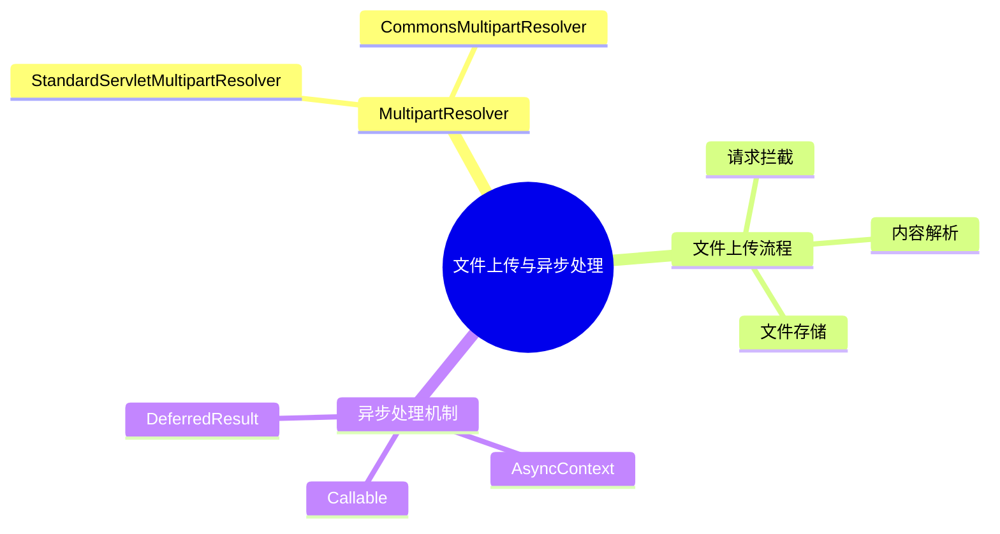
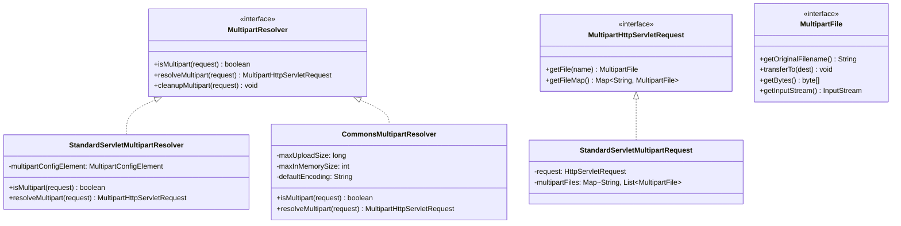
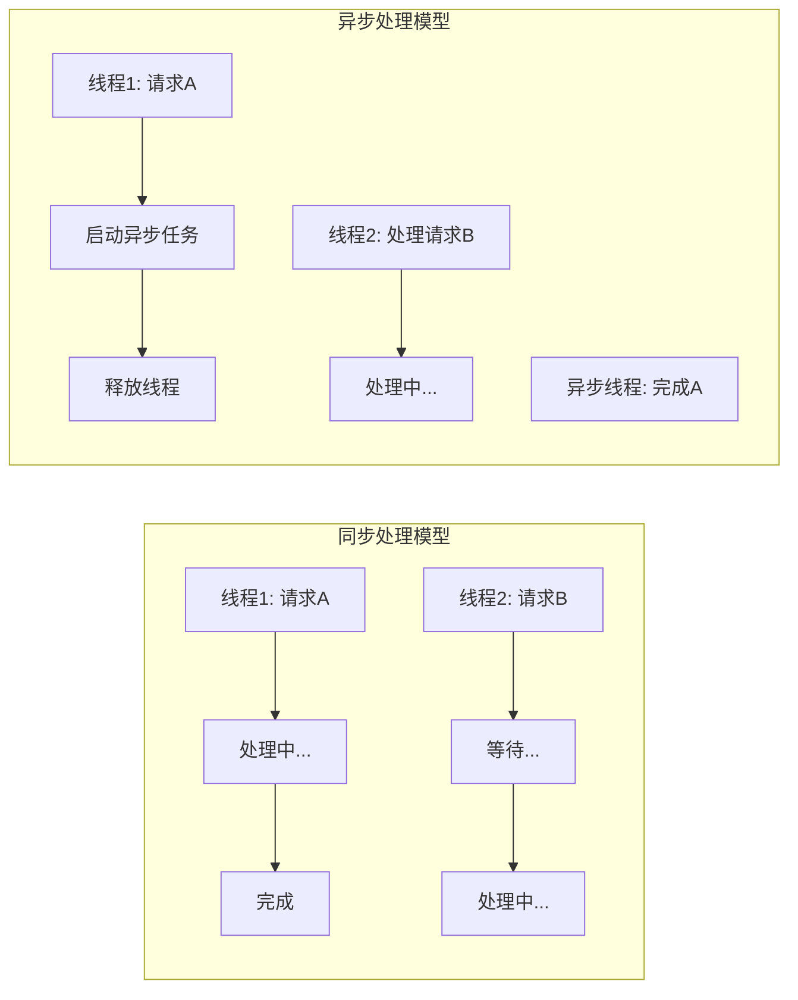
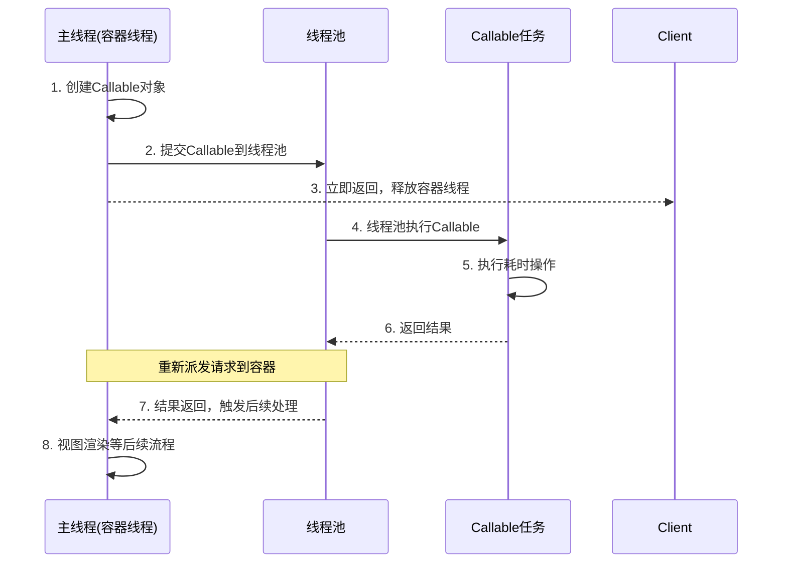
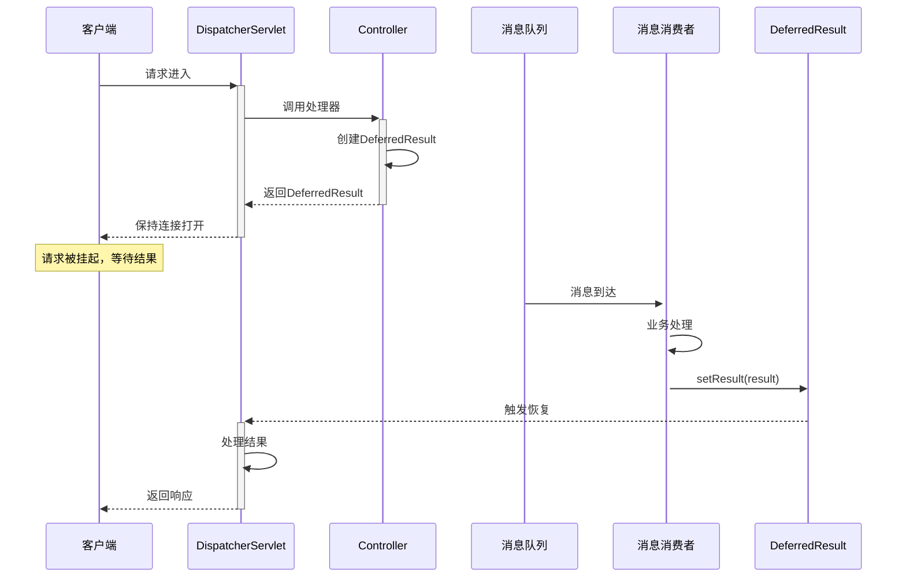
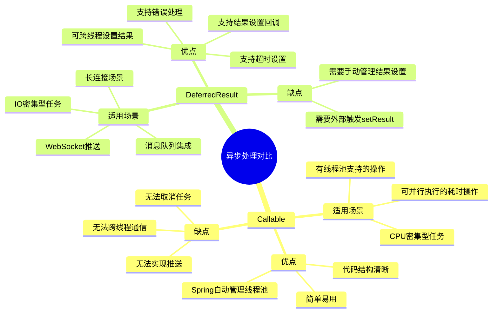
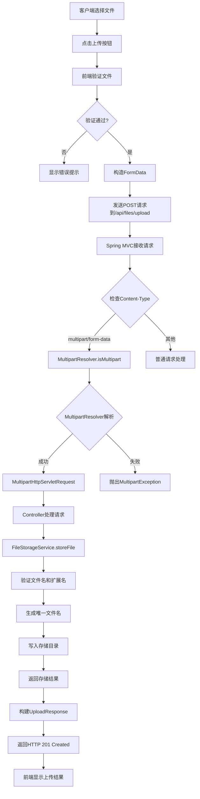

# 第9章：文件上传与异步处理

## 9.1 MultipartResolver文件上传

### 9.1.1 文件上传概述

文件上传是Web应用中常见的功能，Spring MVC提供了完善的文件上传支持。在Spring MVC中，文件上传功能主要通过`MultipartResolver`接口来实现。



### 9.1.2 MultipartResolver接口定义

`MultipartResolver`是Spring MVC中处理文件上传的核心接口，定义在`org.springframework.web.multipart`包中：

```java
// 源码路径: spring-webmvc/src/main/java/org/springframework/web/multipart
public interface MultipartResolver {

    /**
     * 判断请求是否为multipart类型
     */
    boolean isMultipart(HttpServletRequest request);

    /**
     * 将HTTP请求解析为MultipartHttpServletRequest
     */
    MultipartHttpServletRequest resolveMultipart(HttpServletRequest request)
            throws MultipartException;

    /**
     * 清理 multipart 临时文件
     */
    void cleanupMultipart(MultipartHttpServletRequest request);
}
```

### 9.1.3 StandardServletMultipartResolver实现

在Servlet 3.0+环境中，Spring MVC使用`StandardServletMultipartResolver`作为默认的`MultipartResolver`实现。

```java
// 源码路径: spring-webmvc/src/main/java/org/springframework/web/multipart/support
public class StandardServletMultipartResolver implements MultipartResolver {

    private static final String MULTIPART_CONFIG_ATTRIBUTE =
            "org.springframework.web.multipart.MultipartConfigElement";

    /**
     * 判断请求是否为multipart类型
     * 检查Content-Type是否以"multipart/"开头
     */
    @Override
    public boolean isMultipart(HttpServletRequest request) {
        String contentType = request.getContentType();
        return (contentType != null && contentType.toLowerCase().startsWith("multipart/"));
    }

    /**
     * 核心方法：解析multipart请求
     */
    @Override
    public MultipartHttpServletRequest resolveMultipart(HttpServletRequest request)
            throws MultipartException {

        // 获取Servlet 3.0的Part配置
        MultipartConfigElement config = getMultipartConfig(request);
        // 注册multipart配置到request
        request.setAttribute(MULTIPART_CONFIG_ATTRIBUTE, config);

        // 使用StandardServletMultipartRequest包装原始请求
        return new StandardServletMultipartRequest(request);
    }

    private MultipartConfigElement getMultipartConfig(HttpServletRequest request) {
        // 从servletContext获取multipart配置
    }
}
```

### 9.1.4 核心组件类图



## 9.2 文件上传流程源码分析

### 9.2.1 文件上传完整流程

```mermaid
sequenceDiagram
    participant Client as 客户端
    participant DispatcherServlet
    participant MultipartResolver
    participant Controller
    participant FileStorage

    Client->>+DispatcherServlet: POST /upload (multipart/form-data)

    rect rgb(21, 48, 83)
        Note over DispatcherServlet: DispatcherServlet.doDispatch()
        DispatcherServlet->>+MultipartResolver: checkMultipart(request)
        MultipartResolver->>MultipartResolver: isMultipart(request)?
        alt 是multipart请求
            MultipartResolver->>+MultipartResolver: resolveMultipart(request)
            MultipartResolver-->>-DispatcherServlet: MultipartHttpServletRequest
        else 非multipart请求
            MultipartResolver-->>-DispatcherServlet: 原始request
        end
    end

    DispatcherServlet->>+Controller: executeHandler(request)
    Controller->>Controller: @RequestParam("file") MultipartFile
    Controller->>+FileStorage: store(file)
    FileStorage-->>-Controller: filePath
    Controller-->>-DispatcherServlet: Response

    DispatcherServlet->>MultipartResolver: cleanupMultipart(request)
    DispatcherServlet-->>-Client: 响应结果
```



### 9.2.2 DispatcherServlet中Multipart处理

在`DispatcherServlet`的`doDispatch()`方法中，会调用`checkMultipart()`方法检查并处理multipart请求：

```java
// 源码路径: spring-webmvc/src/main/java/org/springframework/web/servlet/DispatcherServlet.java

protected void doDispatch(HttpServletRequest request, HttpServletResponse response) {
    HttpServletRequest processedRequest = request;

    // 文件上传处理入口
    processedRequest = checkMultipart(processedRequest);

    // 继续正常的请求处理...
    mv = ha.handle(processedRequest, response, mappedHandler.getHandler());
}

protected HttpServletRequest checkMultipart(HttpServletRequest request) throws MultipartException {
    // 1. 检查是否已经设置为multipart
    if (this.multipartResolver != null) {
        // 2. 调用MultipartResolver的isMultipart方法判断
        if (this.multipartResolver.isMultipart(request)) {
            // 3. 如果是multipart请求，解析为MultipartHttpServletRequest
            if (request instanceof MultipartHttpServletRequest == false) {
                return this.multipartResolver.resolveMultipart(request);
            }
        }
    }
    // 4. 返回原始request
    return request;
}
```

### 9.2.3 MultipartFile接口详解

`MultipartFile`是Spring MVC中代表上传文件的核心接口：

```java
// 源码路径: spring-webmvc/src/main/java/org/springframework/web/multipart/MultipartFile.java
public interface MultipartFile {

    /**
     * 获取原始文件名
     */
    String getOriginalFilename();

    /**
     * 获取Content-Type
     */
    String getContentType();

    /**
     * 判断文件是否为空
     */
    boolean isEmpty();

    /**
     * 获取文件大小（字节）
     */
    long getSize();

    /**
     * 获取文件字节数组
     */
    byte[] getBytes() throws IOException;

    /**
     * 获取输入流
     */
    InputStream getInputStream() throws IOException;

    /**
     * 将文件传输到目标文件
     */
    void transferTo(File dest) throws IOException;

    /**
     * 将文件传输到目标路径
     */
    default void transferTo(Path dest) throws IOException {
        // 默认实现调用Files.copy
    }
}
```

### 9.2.4 StandardServletMultipartRequest实现

`StandardServletMultipartRequest`是Servlet 3.0环境下对`MultipartHttpServletRequest`的实现：

```java
// 源码路径: spring-webmvc/src/main/java/org/springframework/web/multipart/support/StandardServletMultipartRequest.java

public class StandardServletMultipartRequest extends NativeDecorator
        implements MultipartHttpServletRequest {

    private final HttpServletRequest originalRequest;
    private final Map<String, MultipartFile> multipartFiles;

    public StandardServletMultipartRequest(HttpServletRequest request) {
        super(request);
        this.originalRequest = request;
        this.multipartFiles = new HashMap<>();

        // 初始化multipart文件映射
        Collection<String> fileNames = getFileNames();
        for (String name : fileNames) {
            List<MultipartFile> files = new ArrayList<>();
            for (Part part : getParts(name)) {
                files.add(new StandardServletMultipartFile(part));
            }
            this.multipartFiles.put(name, new CommonsMultipartFile(files));
        }
    }
}
```

## 9.3 异步请求处理机制

### 9.3.1 异步处理概述

Spring MVC的异步处理机制允许释放Servlet容器线程，让容器能够处理更多请求。当处理耗时的业务操作时，使用异步处理可以显著提高系统吞吐量。



### 9.3.2 AsyncContext核心概念

Servlet 3.0引入了`AsyncContext`作为异步处理的核心 API：

```java
// javax.servlet.AsyncContext
public interface AsyncContext {
    /**
     * 启动异步操作
     */
    public void start(Runnable runnable);

    /**
     * 获取请求对象
     */
    public ServletRequest getRequest();

    /**
     * 获取响应对象
     */
    public ServletResponse getResponse();

    /**
     * 判断是否已调用startAsync
     */
    public boolean isAsyncStarted();

    /**
     * 判断是否在异步模式
     */
    public boolean isAsyncSupported();

    /**
     * 获取异步超时时间
     */
    public long getTimeout();

    /**
     * 设置超时时间
     */
    public void setTimeout(long timeoutMilliseconds);

    /**
     * 添加异步监听器
     */
    public void addListener(AsyncListener listener);

    /**
     * 恢复处理并分发
     */
    public void dispatch();

    /**
     * 恢复处理并分发到指定路径
     */
    public void dispatch(String path);
}
```

### 9.3.3 WebAsyncManager异步管理

Spring MVC通过`WebAsyncManager`来管理异步请求的处理：

```java
// 源码路径: spring-webmvc/src/main/java/org/springframework/web/context/request/async/WebAsyncManager.java

public class WebAsyncManager {

    private static final Log logger = LogFactory.getLog(WebAsyncManager.class);

    // 存储异步任务结果的key
    public static final String WEB_ASYNC_MANAGER_ATTRIBUTE =
            WebAsyncManager.class.getName() + ".WEB_ASYNC_MANAGER";

    /**
     * 根据request获取WebAsyncManager
     */
    public static WebAsyncManager getAsyncManager(HttpServletRequest request) {
        return request.getAttribute(WEB_ASYNC_MANAGER_ATTRIBUTE, WebAsyncManager.class);
    }

    /**
     * 开启异步处理
     */
    public boolean startAsyncProcessing(Object... processingContext) {
        Assert.notNull(this.asyncTaskExecutor, "asyncTaskExecutor is required");

        // 检查是否已经开始了异步处理
        if (isConcurrentHandlingStarted()) {
            return false;
        }

        // 创建AsyncTaskExecutor包装对象
        this.asyncWebRequest.startAsync();
        this.concurrentHandlingStarted = true;

        // 将结果存储到IOC容器/请求属性中
        Object[] context = (this.asyncContext != null ?
                new Object[] {this.asyncContext} : processingContext);

        this.asyncContext.put(WEB_ASYNC_MANAGER_ATTRIBUTE, context);

        return true;
    }

    /**
     * 判断是否已经开始异步处理
     */
    public boolean isConcurrentHandlingStarted() {
        return (this.asyncWebRequest != null && this.asyncWebRequest.isAsyncStarted());
    }
}
```

### 9.3.4 异步处理时序图

```mermaid
sequenceDiagram
    participant Client as 客户端
    participant DispatcherServlet
    participant AsyncManager as WebAsyncManager
    participant TaskExecutor as TaskExecutor
    participant Controller
    participant Callable

    Client->>+DispatcherServlet: 请求进入

    DispatcherServlet->>+Controller: 调用处理器方法
    Controller->>-DispatcherServlet: 返回Callable<T>

    DispatcherServlet->>+AsyncManager: handleAsyncResults(request, response)

    rect rgb(20, 83, 45)
        Note over AsyncManager: 异步处理开始
        AsyncManager->>+TaskExecutor: submit(Callable)
        TaskExecutor-->>+Callable: 执行异步任务
        Callable-->>-TaskExecutor: 返回结果
        TaskExecutor-->>-AsyncManager: 返回结果
    end

    AsyncManager->>+DispatcherServlet: 派发完成事件

    DispatcherServlet->>DispatcherServlet: 继续doDispatch流程
    DispatcherServlet-->>-Client: 返回响应
```



## 9.4 Callable和DeferredResult异步结果

### 9.4.1 Callable异步处理

`Callable`是最简单的异步处理方式，适合将耗时操作提交到线程池执行。

#### 工作原理



#### 源码分析

在`RequestMappingHandlerAdapter`中处理Callable返回值的源码：

```java
// 源码路径: spring-webmvc/src/main/java/org/springframework/web/servlet/mvc/method/annotation/RequestMappingHandlerAdapter.java

@Override
public void handleReturnValue(Object returnValue, MethodParameter returnType,
        ModelAndViewContainer mavContainer, NativeWebRequest webRequest) throws Exception {

    // 判断返回值是否为Callable类型
    if (returnValue instanceof Callable) {
        Callable<?> callable = (Callable<?>) returnValue;

        // 获取WebAsyncManager
        WebAsyncManager asyncManager = WebAsyncUtils.getAsyncManager(webRequest);
        asyncManager.startAsyncProcessing(webRequest);

        // 设置异步任务的超时时间和拦截器
        WebAsyncTask<?> asyncTask = new WebAsyncTask<>(callable, asyncRequest, timeout,
                asyncTaskExecutor, exceptionHandlers);

        // 注册超时处理
        asyncTask.onTimeout(() -> {
            // 超时处理逻辑
        });

        // 注册完成处理
        asyncTask.onCompletion(() -> {
            // 完成后处理逻辑
        });

        // 设置异步任务
        asyncManager.startCallableProcessing(asyncTask);
        return;
    }

    // 处理其他返回值类型...
}
```

#### 使用示例

```java
@Controller
@RequestMapping("/api")
public class AsyncController {

    private static final Logger log = LoggerFactory.getLogger(AsyncController.class);

    /**
     * Callable异步处理示例
     * 适用于：将耗时操作提交到线程池，主线程立即返回
     */
    @GetMapping("/callable")
    public Callable<String> handleCallable() {
        log.info("主线程开始处理: {}", Thread.currentThread().getName());

        Callable<String> callable = () -> {
            log.info("异步线程开始: {}", Thread.currentThread().getName());

            // 模拟耗时操作
            Thread.sleep(2000);

            log.info("异步线程完成: {}", Thread.currentThread().getName());
            return "async-result";
        };

        log.info("主线程结束: {}", Thread.currentThread().getName());
        return callable;
    }
}
```

### 9.4.2 DeferredResult异步处理

`DeferredResult`适用于跨线程通信的场景，比如与消息队列配合使用。

#### 工作原理



#### 源码分析

`DeferredResult`的实现原理：

```java
// 源码路径: spring-webmvc/src/main/java/org/springframework/web/context/request/async/DeferredResult.java

public class DeferredResult<T> {

    private static final Object RESULT_NONE = new Object();

    private final Long timeout;
    private final Object timeoutResult;

    // 异步结果存储
    private volatile Object result = RESULT_NONE;

    // 完成回调列表
    private final List<DeferredResultHandler> resultHandlers;

    // 超时回调
    private Runnable timeoutCallback;

    // 完成回调
    private Runnable completionCallback;

    public DeferredResult(Long timeout) {
        this(timeout, RESULT_NONE);
    }

    public DeferredResult(Long timeout, Object timeoutResult) {
        this.timeout = timeout;
        this.timeoutResult = timeoutResult;
        this.resultHandlers = new ArrayList<>();
    }

    /**
     * 设置异步结果
     * 当结果被设置时，等待的请求将被恢复处理
     */
    public void setResult(Object result) {
        this.result = result;

        // 触发所有结果处理器
        for (DeferredResultHandler handler : this.resultHandlers) {
            handler.handleResult(this.result);
        }

        // 触发完成回调
        if (this.completionCallback != null) {
            this.completionCallback.run();
        }
    }

    /**
     * 获取结果
     * 如果结果未设置，当前线程将等待
     */
    @Nullable
    public Object getResult() {
        Object result = this.result;
        return (result != RESULT_NONE ? result : null);
    }

    /**
     * 注册超时处理
     */
    public DeferredResult<T> onTimeout(Runnable timeoutCallback) {
        this.timeoutCallback = timeoutCallback;
        return this;
    }

    /**
     * 注册完成处理
     */
    public DeferredResult<T> onCompletion(Runnable completionCallback) {
        this.completionCallback = completionCallback;
        return this;
    }
}
```

#### 使用示例

```java
@Controller
@RequestMapping("/api")
public class OrderController {

    private static final Logger log = LoggerFactory.getLogger(OrderController.class);

    // 模拟订单消息队列
    private final BlockingQueue<DeferredResult<Order>> pendingOrders = new LinkedBlockingQueue<>();

    /**
     * DeferredResult异步处理示例
     * 适用于：与消息队列配合，实现推送功能
     */
    @GetMapping("/createOrder")
    public DeferredResult<Order> createOrder(@RequestParam String productId) {
        log.info("收到创建订单请求: productId={}", productId);

        // 创建DeferredResult，设置超时时间为60秒
        DeferredResult<Order> deferredResult = new DeferredResult<>(60_000L);

        // 注册超时回调
        deferredResult.onTimeout(() -> {
            log.error("订单处理超时");
            deferredResult.setErrorResult(
                new ResponseEntity<>("订单处理超时", HttpStatus.REQUEST_TIMEOUT)
            );
        });

        // 注册完成回调
        deferredResult.onCompletion(() -> {
            log.info("订单请求处理完成");
            pendingOrders.remove(deferredResult);
        });

        // 将请求放入队列，等待异步处理
        pendingOrders.offer(deferredResult);

        // 触发订单处理（实际项目中这里是发送消息到队列）
        processOrderAsync(productId, deferredResult);

        log.info("DeferredResult已创建，等待异步处理");
        return deferredResult;
    }

    /**
     * 模拟异步处理订单
     * 实际项目中可能是消息队列的消费者
     */
    private void processOrderAsync(String productId, DeferredResult<Order> deferredResult) {
        CompletableFuture.runAsync(() -> {
            try {
                // 模拟处理时间
                Thread.sleep(3000);

                Order order = new Order(productId, "ORDER-" + System.currentTimeMillis());
                log.info("订单处理完成: {}", order);

                // 设置结果，触发请求恢复
                deferredResult.setResult(order);
            } catch (Exception e) {
                log.error("订单处理失败", e);
                deferredResult.setErrorResult(
                    new ResponseEntity<>("订单处理失败", HttpStatus.INTERNAL_SERVER_ERROR)
                );
            }
        });
    }
}
```

### 9.4.3 Callable vs DeferredResult对比



## 9.5 实例：文件上传完整实现

### 9.5.1 项目结构

```
file-upload-demo/
├── pom.xml
├── src/
│   └── main/
│       ├── java/
│       │   └── com/example/upload/
│       │       ├── FileUploadApplication.java
│       │       ├── config/
│       │       │   └── WebMvcConfig.java
│       │       ├── controller/
│       │       │   └── FileUploadController.java
│       │       ├── service/
│       │       │   └── FileStorageService.java
│       │       └── dto/
│       │           └── UploadResponse.java
│       └── resources/
│           └── application.yml
```

### 9.5.2 Maven依赖配置

```xml
<?xml version="1.0" encoding="UTF-8"?>
<project xmlns="http://maven.apache.org/POM/4.0.0"
         xmlns:xsi="http://www.w3.org/2001/XMLSchema-instance"
         xsi:schemaLocation="http://maven.apache.org/POM/4.0.0
         http://maven.apache.org/xsd/maven-4.0.0.xsd">
    <modelVersion>4.0.0</modelVersion>

    <parent>
        <groupId>org.springframework.boot</groupId>
        <artifactId>spring-boot-starter-parent</artifactId>
        <version>3.2.0</version>
    </parent>

    <groupId>com.example</groupId>
    <artifactId>file-upload-demo</artifactId>
    <version>1.0.0</version>

    <properties>
        <java.version>17</java.version>
    </properties>

    <dependencies>
        <dependency>
            <groupId>org.springframework.boot</groupId>
            <artifactId>spring-boot-starter-web</artifactId>
        </dependency>
        <dependency>
            <groupId>org.springframework.boot</groupId>
            <artifactId>spring-boot-starter-thymeleaf</artifactId>
        </dependency>
    </dependencies>
</project>
```

### 9.5.3 配置文件上传参数

```yaml
# application.yml
spring:
  servlet:
    multipart:
      enabled: true                    # 开启文件上传支持
      max-file-size: 10MB              # 单个文件最大大小
      max-request-size: 50MB           # 请求总体最大大小
      file-size-threshold: 2KB         # 内存中缓存阈值
      location: /tmp/spring-upload     # 临时文件目录

  mvc:
    static-path-pattern: /static/**
    webjars-locations: classpath:/META-INF/resources/webjars/

# 服务配置
server:
  port: 8080

# 上传配置
upload:
  base-path: /data/uploads
  allowed-extensions: jpg,jpeg,png,gif,pdf,doc,docx
  max-file-size: 10MB
```

### 9.5.4 WebMvcConfig配置类

```java
package com.example.upload.config;

import org.springframework.boot.context.properties.EnableConfigurationProperties;
import org.springframework.context.annotation.Bean;
import org.springframework.context.annotation.Configuration;
import org.springframework.web.multipart.MultipartResolver;
import org.springframework.web.multipart.support.StandardServletMultipartResolver;
import org.springframework.web.servlet.config.annotation.CorsRegistry;
import org.springframework.web.servlet.config.annotation.ResourceHandlerRegistry;
import org.springframework.web.servlet.config.annotation.WebMvcConfigurer;

import jakarta.servlet.MultipartConfigElement;
import java.nio.file.Paths;

/**
 * Web MVC配置类
 * 配置文件上传相关的MultipartResolver
 */
@Configuration
@EnableConfigurationProperties(UploadProperties.class)
public class WebMvcConfig implements WebMvcConfigurer {

    private final UploadProperties uploadProperties;

    public WebMvcConfig(UploadProperties uploadProperties) {
        this.uploadProperties = uploadProperties;
    }

    /**
     * 配置StandardServletMultipartResolver
     * 这是Servlet 3.0+环境下的标准实现
     */
    @Bean
    public MultipartResolver multipartResolver() {
        StandardServletMultipartResolver resolver = new StandardServletMultipartResolver();
        return resolver;
    }

    /**
     * 配置上传文件的临时存储位置
     */
    @Bean
    public MultipartConfigElement multipartConfigElement() {
        return new MultipartConfigElement(
            uploadProperties.getLocation(),
            uploadProperties.getMaxFileSize(),
            uploadProperties.getMaxRequestSize(),
            uploadProperties.getFileSizeThreshold()
        );
    }

    /**
     * 配置静态资源映射
     */
    @Override
    public void addResourceHandlers(ResourceHandlerRegistry registry) {
        // 映射上传文件目录到URL路径
        registry.addResourceHandler("/uploads/**")
                .addResourceLocations("file:" + uploadProperties.getBasePath() + "/");
    }

    /**
     * 配置CORS跨域
     */
    @Override
    public void addCorsMappings(CorsRegistry registry) {
        registry.addMapping("/api/**")
                .allowedOrigins("*")
                .allowedMethods("GET", "POST", "PUT", "DELETE", "OPTIONS")
                .allowedHeaders("*")
                .maxAge(3600);
    }
}
```

### 9.5.5 文件存储服务

```java
package com.example.upload.service;

import com.example.upload.config.UploadProperties;
import com.example.upload.exception.FileStorageException;
import com.example.upload.exception.InvalidFileException;
import org.springframework.core.io.Resource;
import org.springframework.core.io.UrlResource;
import org.springframework.stereotype.Service;
import org.springframework.util.StringUtils;
import org.springframework.web.multipart.MultipartFile;

import java.io.IOException;
import java.io.InputStream;
import java.net.MalformedURLException;
import java.nio.file.Files;
import java.nio.file.Path;
import java.nio.file.Paths;
import java.nio.file.StandardCopyOption;
import java.util.Arrays;
import java.util.Objects;
import java.util.UUID;

/**
 * 文件存储服务
 * 负责文件的存储、读取和删除操作
 */
@Service
public class FileStorageService {

    private final Path fileStorageLocation;
    private final UploadProperties uploadProperties;

    public FileStorageService(UploadProperties uploadProperties) {
        this.uploadProperties = uploadProperties;

        // 初始化文件存储目录
        this.fileStorageLocation = Paths.get(uploadProperties.getBasePath())
                .toAbsolutePath().normalize();

        try {
            Files.createDirectories(this.fileStorageLocation);
        } catch (IOException ex) {
            throw new FileStorageException("无法创建文件存储目录", ex);
        }
    }

    /**
     * 存储文件
     * @param file 上传的文件
     * @return 存储后的文件名
     */
    public String storeFile(MultipartFile file) {
        // 1. 验证文件名
        String originalFileName = StringUtils.cleanPath(
                Objects.requireNonNull(file.getOriginalFilename()));

        // 检查文件名是否包含非法字符
        if (originalFileName.contains("..")) {
            throw new InvalidFileException("文件名包含非法路径序列: " + originalFileName);
        }

        // 2. 验证文件扩展名
        String extension = getFileExtension(originalFileName);
        if (!isAllowedExtension(extension)) {
            throw new InvalidFileException(
                    "不支持的文件类型: " + extension + ", 允许的类型: " +
                    Arrays.toString(uploadProperties.getAllowedExtensions()));
        }

        // 3. 生成唯一文件名（避免文件名冲突）
        String uniqueFileName = UUID.randomUUID().toString() + "." + extension;

        try {
            // 4. 执行文件存储
            Path targetLocation = this.fileStorageLocation.resolve(uniqueFileName);
            try (InputStream inputStream = file.getInputStream()) {
                Files.copy(inputStream, targetLocation, StandardCopyOption.REPLACE_EXISTING);
            }

            return uniqueFileName;
        } catch (IOException ex) {
            throw new FileStorageException("存储文件失败: " + originalFileName, ex);
        }
    }

    /**
     * 加载文件为Resource
     */
    public Resource loadFileAsResource(String fileName) {
        try {
            Path filePath = this.fileStorageLocation.resolve(fileName).normalize();
            Resource resource = new UrlResource(filePath.toUri());

            if (resource.exists() && resource.isReadable()) {
                return resource;
            } else {
                throw new FileStorageException("文件不存在或无法读取: " + fileName);
            }
        } catch (MalformedURLException ex) {
            throw new FileStorageException("文件不存在: " + fileName, ex);
        }
    }

    /**
     * 删除文件
     */
    public void deleteFile(String fileName) {
        try {
            Path filePath = this.fileStorageLocation.resolve(fileName).normalize();
            Files.deleteIfExists(filePath);
        } catch (IOException ex) {
            throw new FileStorageException("删除文件失败: " + fileName, ex);
        }
    }

    /**
     * 获取文件扩展名
     */
    private String getFileExtension(String fileName) {
        int dotIndex = fileName.lastIndexOf('.');
        return (dotIndex == -1) ? "" : fileName.substring(dotIndex + 1).toLowerCase();
    }

    /**
     * 检查是否为允许的扩展名
     */
    private boolean isAllowedExtension(String extension) {
        return Arrays.asList(uploadProperties.getAllowedExtensions())
                .contains(extension.toLowerCase());
    }
}
```

### 9.5.6 文件上传控制器

```java
package com.example.upload.controller;

import com.example.upload.dto.UploadResponse;
import com.example.upload.service.FileStorageService;
import org.slf4j.Logger;
import org.slf4j.LoggerFactory;
import org.springframework.core.io.Resource;
import org.springframework.http.HttpHeaders;
import org.springframework.http.MediaType;
import org.springframework.http.ResponseEntity;
import org.springframework.web.bind.annotation.*;
import org.springframework.web.multipart.MultipartFile;
import org.springframework.web.servlet.support.ServletUriComponentsBuilder;

import java.net.URI;

/**
 * 文件上传控制器
 * 提供单文件上传、多文件上传、异步上传等功能
 */
@RestController
@RequestMapping("/api/files")
public class FileUploadController {

    private static final Logger log = LoggerFactory.getLogger(FileUploadController.class);

    private final FileStorageService fileStorageService;

    public FileUploadController(FileStorageService fileStorageService) {
        this.fileStorageService = fileStorageService;
    }

    /**
     * 单文件上传
     *
     * @param file 上传的文件
     * @return 上传结果
     */
    @PostMapping("/upload")
    public ResponseEntity<UploadResponse> uploadFile(
            @RequestParam("file") MultipartFile file) {

        log.info("收到文件上传请求: {}, 大小: {} bytes",
                file.getOriginalFilename(), file.getSize());

        // 存储文件
        String storedFileName = fileStorageService.storeFile(file);

        // 构建文件访问URL
        String fileDownloadUri = ServletUriComponentsBuilder
                .fromCurrentContextPath()
                .path("/api/files/download/")
                .path(storedFileName)
                .toUriString();

        UploadResponse response = new UploadResponse(
                storedFileName,
                file.getOriginalFilename(),
                file.getContentType(),
                file.getSize(),
                fileDownloadUri
        );

        return ResponseEntity.created(URI.create(fileDownloadUri))
                .body(response);
    }

    /**
     * 多文件上传
     */
    @PostMapping("/upload/multiple")
    public ResponseEntity<UploadResponse[]> uploadMultipleFiles(
            @RequestParam("files") MultipartFile[] files) {

        log.info("收到多文件上传请求: {} 个文件", files.length);

        UploadResponse[] responses = new UploadResponse[files.length];

        for (int i = 0; i < files.length; i++) {
            MultipartFile file = files[i];
            String storedFileName = fileStorageService.storeFile(file);

            String fileDownloadUri = ServletUriComponentsBuilder
                    .fromCurrentContextPath()
                    .path("/api/files/download/")
                    .path(storedFileName)
                    .toUriString();

            responses[i] = new UploadResponse(
                    storedFileName,
                    file.getOriginalFilename(),
                    file.getContentType(),
                    file.getSize(),
                    fileDownloadUri
            );
        }

        return ResponseEntity.ok(responses);
    }

    /**
     * 异步文件上传（使用DeferredResult）
     * 适用于大文件上传，不阻塞容器线程
     */
    @PostMapping("/upload/async")
    public DeferredResult<ResponseEntity<UploadResponse>> uploadFileAsync(
            @RequestParam("file") MultipartFile file) {

        log.info("收到异步文件上传请求: {}", file.getOriginalFilename());

        DeferredResult<ResponseEntity<UploadResponse>> deferredResult =
                new DeferredResult<>(120_000L); // 120秒超时

        // 设置超时处理
        deferredResult.onTimeout(() -> {
            log.error("异步上传超时: {}", file.getOriginalFilename());
            deferredResult.setErrorResult(
                    ResponseEntity.status(408)
                            .body(null));
        });

        // 在异步线程中处理文件上传
        Thread.ofVirtual().start(() -> {
            try {
                String storedFileName = fileStorageService.storeFile(file);

                String fileDownloadUri = ServletUriComponentsBuilder
                        .fromCurrentContextPath()
                        .path("/api/files/download/")
                        .path(storedFileName)
                        .toUriString();

                UploadResponse response = new UploadResponse(
                        storedFileName,
                        file.getOriginalFilename(),
                        file.getContentType(),
                        file.getSize(),
                        fileDownloadUri
                );

                // 设置结果
                deferredResult.setResult(
                        ResponseEntity.created(URI.create(fileDownloadUri))
                                .body(response)
                );

                log.info("异步文件上传完成: {}", storedFileName);

            } catch (Exception e) {
                log.error("异步文件上传失败", e);
                deferredResult.setErrorResult(
                        ResponseEntity.internalServerError()
                                .body(null));
            }
        });

        return deferredResult;
    }

    /**
     * 下载文件
     */
    @GetMapping("/download/{fileName:.+}")
    public ResponseEntity<Resource> downloadFile(@PathVariable String fileName) {

        log.info("收到文件下载请求: {}", fileName);

        Resource resource = fileStorageService.loadFileAsResource(fileName);

        return ResponseEntity.ok()
                .header(HttpHeaders.CONTENT_DISPOSITION,
                        "attachment; filename=\"" + resource.getFilename() + "\"")
                .contentType(MediaType.APPLICATION_OCTET_STREAM)
                .body(resource);
    }

    /**
     * 删除文件
     */
    @DeleteMapping("/{fileName:.+}")
    public ResponseEntity<Void> deleteFile(@PathVariable String fileName) {
        log.info("收到文件删除请求: {}", fileName);

        fileStorageService.deleteFile(fileName);

        return ResponseEntity.noContent().build();
    }
}
```

### 9.5.7 响应DTO

```java
package com.example.upload.dto;

import com.fasterxml.jackson.annotation.JsonInclude;

/**
 * 文件上传响应DTO
 */
@JsonInclude(JsonInclude.Include.NON_NULL)
public class UploadResponse {

    private String storedFileName;      // 存储的文件名
    private String originalFileName;    // 原始文件名
    private String contentType;         // 文件类型
    private Long size;                  // 文件大小
    private String downloadUri;          // 下载链接

    public UploadResponse() {}

    public UploadResponse(String storedFileName, String originalFileName,
                          String contentType, Long size, String downloadUri) {
        this.storedFileName = storedFileName;
        this.originalFileName = originalFileName;
        this.contentType = contentType;
        this.size = size;
        this.downloadUri = downloadUri;
    }

    // Getters and Setters
    public String getStoredFileName() { return storedFileName; }
    public void setStoredFileName(String storedFileName) { this.storedFileName = storedFileName; }

    public String getOriginalFileName() { return originalFileName; }
    public void setOriginalFileName(String originalFileName) { this.originalFileName = originalFileName; }

    public String getContentType() { return contentType; }
    public void setContentType(String contentType) { this.contentType = contentType; }

    public Long getSize() { return size; }
    public void setSize(Long size) { this.size = size; }

    public String getDownloadUri() { return downloadUri; }
    public void setDownloadUri(String downloadUri) { this.downloadUri = downloadUri; }
}
```

### 9.5.8 前端上传表单示例

```html
<!DOCTYPE html>
<html xmlns:th="http://www.thymeleaf.org">
<head>
    <meta charset="UTF-8">
    <title>文件上传示例</title>
    <style>
        .upload-container {
            max-width: 600px;
            margin: 50px auto;
            padding: 20px;
            font-family: Arial, sans-serif;
        }
        .upload-box {
            border: 2px dashed #ccc;
            padding: 40px;
            text-align: center;
            border-radius: 8px;
        }
        .upload-box:hover {
            border-color: #007bff;
        }
        input[type="file"] {
            margin: 20px 0;
        }
        .btn {
            background-color: #007bff;
            color: white;
            padding: 10px 20px;
            border: none;
            border-radius: 4px;
            cursor: pointer;
        }
        .btn:hover {
            background-color: #0056b3;
        }
        #progress {
            margin-top: 20px;
            display: none;
        }
        #result {
            margin-top: 20px;
            padding: 15px;
            border-radius: 4px;
            display: none;
        }
        .success {
            background-color: #d4edda;
            border: 1px solid #c3e6cb;
            color: #155724;
        }
        .error {
            background-color: #f8d7da;
            border: 1px solid #f5c6cb;
            color: #721c24;
        }
    </style>
</head>
<body>
    <div class="upload-container">
        <h2>Spring MVC 文件上传示例</h2>

        <div class="upload-box">
            <form id="uploadForm" enctype="multipart/form-data">
                <input type="file" id="file" name="file" accept=".jpg,.jpeg,.png,.gif,.pdf" required>

                <button type="submit" class="btn">上传文件</button>
            </form>
        </div>

        <div id="progress">
            <p>上传中... <span id="percent">0</span>%</p>
            <div style="background: #e0e0e0; height: 20px; border-radius: 10px;">
                <div id="progressBar" style="background: #007bff; height: 100%; width: 0%; border-radius: 10px; transition: width 0.3s;"></div>
            </div>
        </div>

        <div id="result"></div>
    </div>

    <script>
        const form = document.getElementById('uploadForm');
        const progressDiv = document.getElementById('progress');
        const progressBar = document.getElementById('progressBar');
        const percentSpan = document.getElementById('percent');
        const resultDiv = document.getElementById('result');

        form.addEventListener('submit', async (e) => {
            e.preventDefault();

            const fileInput = document.getElementById('file');
            const file = fileInput.files[0];
            if (!file) return;

            const formData = new FormData();
            formData.append('file', file);

            // 显示进度条
            progressDiv.style.display = 'block';
            resultDiv.style.display = 'none';
            progressBar.style.width = '0%';
            percentSpan.textContent = '0';

            try {
                const xhr = new XMLHttpRequest();

                // 监听上传进度
                xhr.upload.addEventListener('progress', (e) => {
                    if (e.lengthComputable) {
                        const percent = Math.round((e.loaded / e.total) * 100);
                        progressBar.style.width = percent + '%';
                        percentSpan.textContent = percent;
                    }
                });

                // 上传完成
                xhr.addEventListener('load', () => {
                    progressDiv.style.display = 'none';

                    if (xhr.status >= 200 && xhr.status < 300) {
                        const response = JSON.parse(xhr.responseText);
                        resultDiv.className = 'success';
                        resultDiv.innerHTML = `
                            <h3>上传成功！</h3>
                            <p>文件名: ${response.originalFileName}</p>
                            <p>大小: ${(response.size / 1024).toFixed(2)} KB</p>
                            <p><a href="${response.downloadUri}">下载文件</a></p>
                        `;
                        resultDiv.style.display = 'block';
                    } else {
                        throw new Error('上传失败');
                    }
                });

                // 上传失败
                xhr.addEventListener('error', () => {
                    progressDiv.style.display = 'none';
                    resultDiv.className = 'error';
                    resultDiv.textContent = '上传失败，请重试';
                    resultDiv.style.display = 'block';
                });

                xhr.open('POST', '/api/files/upload');
                xhr.send(formData);

            } catch (error) {
                progressDiv.style.display = 'none';
                resultDiv.className = 'error';
                resultDiv.textContent = '上传失败: ' + error.message;
                resultDiv.style.display = 'block';
            }
        });
    </script>
</body>
</html>
```

### 9.5.9 文件上传流程总结



## 本章小结

本章深入分析了Spring MVC的文件上传和异步处理机制：

1. **MultipartResolver文件上传**
   - `StandardServletMultipartResolver`是Servlet 3.0+环境下的标准实现
   - 通过`isMultipart()`判断请求类型，`resolveMultipart()`解析请求

2. **文件上传流程**
   - 请求进入DispatcherServlet，通过`checkMultipart()`检查
   - MultipartResolver解析multipart请求为`MultipartHttpServletRequest`
   - 控制器通过`@RequestParam("file") MultipartFile`获取上传文件

3. **异步处理机制**
   - `WebAsyncManager`管理异步请求的生命周期
   - `AsyncContext`基于Servlet 3.0异步API

4. **Callable vs DeferredResult**
   - Callable：适用于线程池执行的耗时任务
   - DeferredResult：适用于跨线程通信和消息队列集成场景

下一章我们将深入分析Spring MVC的完整请求处理流程，从请求进入DispatcherServlet开始，逐步解析各个组件的协作机制。
