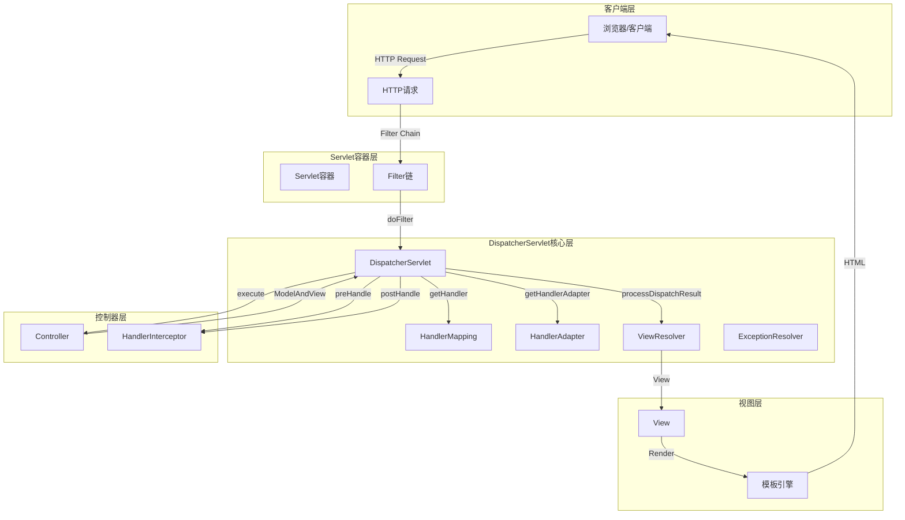
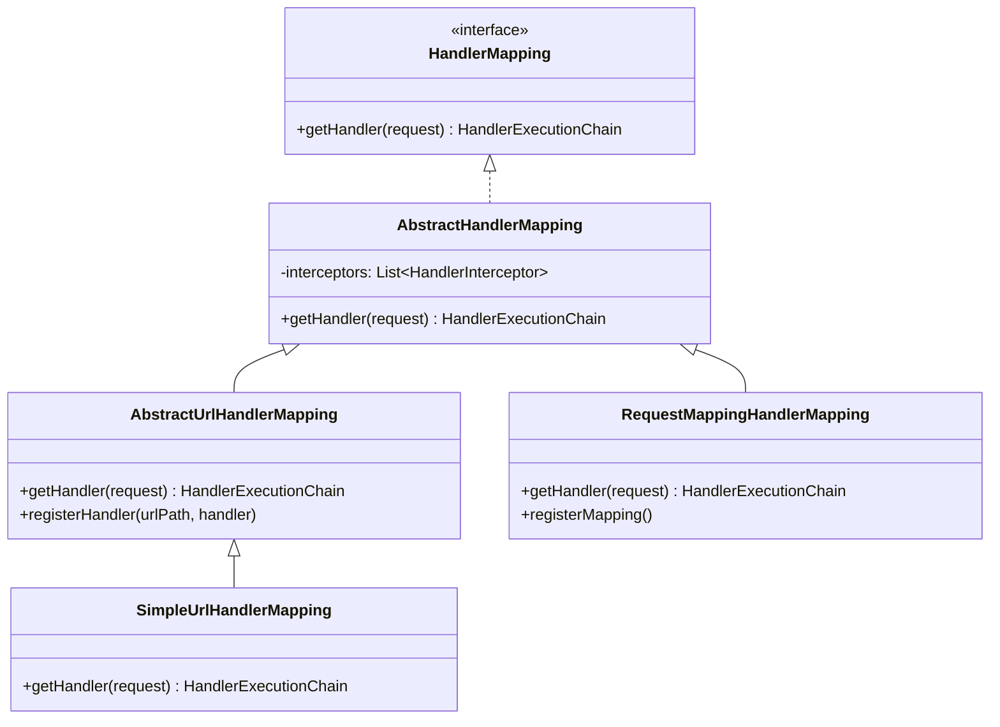
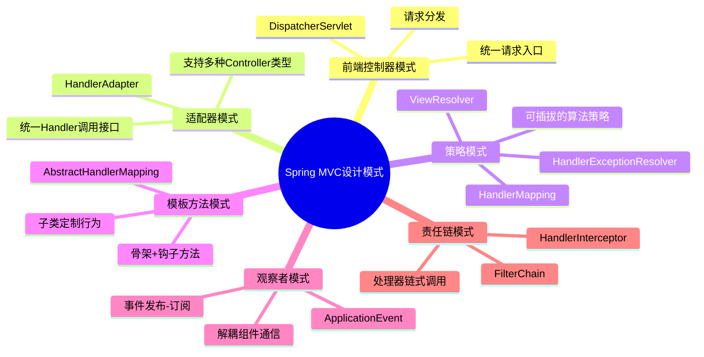
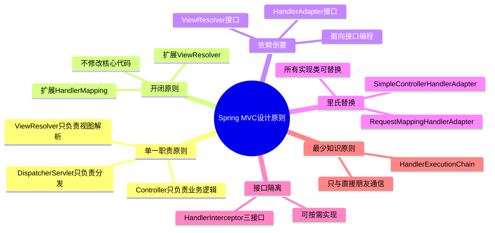
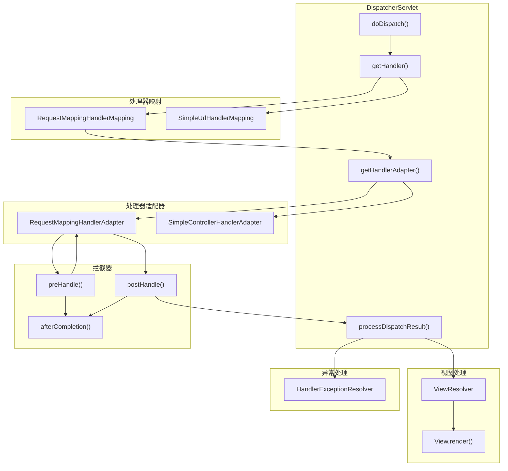
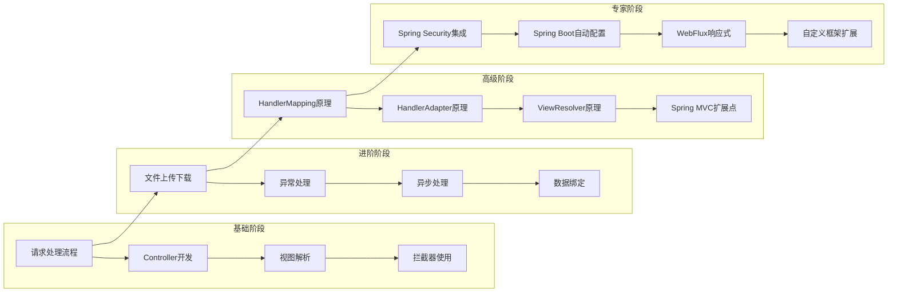
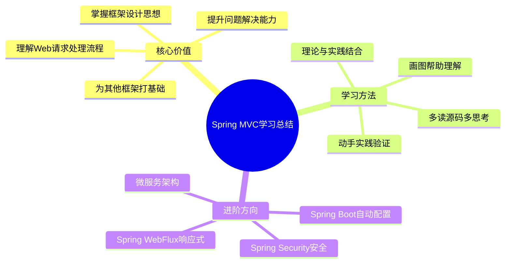

# 第10章：完整请求处理流程源码分析

## 10.1 从请求进入开始的完整时序图

### 10.1.1 Spring MVC请求处理概述

Spring MVC的请求处理是一个精心设计的组件协作流程，从客户端发送请求到服务器返回响应，经历了多个关键步骤。理解这一流程对于深入掌握Spring MVC框架至关重要。



### 10.1.2 完整请求处理时序图

```mermaid
sequenceDiagram
    autonumber
    participant Client as 客户端
    participant Filter as Filter过滤器
    participant Dispatcher as DispatcherServlet
    participant HandlerMapping as HandlerMapping
    participant HandlerAdapter as HandlerAdapter
    participant Controller as Controller
    participant Interceptor as HandlerInterceptor
    participant ViewResolver as ViewResolver
    participant View as View

    Client->>+Filter: HTTP请求

    Filter->>+Filter: 执行过滤逻辑
    Filter->>+Dispatcher: 放行请求

    rect rgb(21, 48, 83)
        Note over Dispatcher: 阶段一：请求映射
        Dispatcher->>+HandlerMapping: getHandler(request)
        HandlerMapping-->>-Dispatcher: HandlerExecutionChain

        Dispatcher->>+HandlerAdapter: getHandlerAdapter(handler)
        HandlerAdapter-->>-Dispatcher: HandlerAdapter
    end

    rect rgb(20, 83, 45)
        Note over Dispatcher: 阶段二：拦截器预处理
        Dispatcher->>+Interceptor: preHandle(request, response, handler)
        alt preHandle返回true
            Interceptor-->>-Dispatcher: true, 继续执行
        else preHandle返回false
            Dispatcher-->>-Client: 直接返回（短路）
        end
    end

    rect rgb(88, 28, 59)
        Note over Dispatcher: 阶段三：处理器执行
        Dispatcher->>+HandlerAdapter: handle(request, response, handler)
        HandlerAdapter->>+Controller: 反射调用Controller方法
        Controller-->>-HandlerAdapter: ModelAndView
        HandlerAdapter-->>-Dispatcher: ModelAndView
    end

    rect rgb(17, 94, 89)
        Note over Dispatcher: 阶段四：拦截器后处理
        Dispatcher->>+Interceptor: postHandle(request, response, handler, mv)
        Interceptor-->>-Dispatcher: (执行后处理)
    end

    rect rgb(92, 51, 16)
        Note over Dispatcher: 阶段五：异常处理与视图解析
        Dispatcher->>+Dispatcher: processDispatchResult(request, response, mv)
        alt 存在异常
            Dispatcher->>+ExceptionResolver: resolveException()
            ExceptionResolver-->>-Dispatcher: ModelAndView
        end

        alt ModelAndView不为空
            Dispatcher->>+ViewResolver: resolveViewName(viewName)
            ViewResolver-->>-Dispatcher: View
            Dispatcher->>+View: render(mv, request, response)
            View-->>-Dispatcher: (渲染完成)
        end
    end

    Dispatcher->>+Interceptor: afterCompletion(request, response, handler, ex)
    Interceptor-->>-Dispatcher: (清理资源)

    Dispatcher-->>-Client: HTTP响应
    Filter-->>-Client: Filter响应处理
```



### 10.1.3 请求处理流程详解

```mermaid
flowchart LR
    subgraph Phase1["阶段1: 请求接收"]
        R1[HTTP请求进入] --> R2[Filter链处理]
        R2 --> R3[DispatcherServlet.doDispatch]
    end

    subgraph Phase2["阶段2: 处理器映射"]
        R3 --> M1[getHandler 获取处理器链]
        M1 --> M2[遍历HandlerMappings]
        M2 --> M3{找到匹配?}
        M3 -->|是| M4[返回HandlerExecutionChain]
        M3 -->|否| M4_2[抛出404或使用默认Handler]
    end

    subgraph Phase3["阶段3: 处理器适配"]
        M4 --> A1[getHandlerAdapter]
        A1 --> A2[遍历HandlerAdapters]
        A2 --> A3{支持该Handler?}
        A3 -->|是| A4[返回HandlerAdapter]
        A3 -->|否| A2
    end

    subgraph Phase4["阶段4: 拦截器预处理"]
        A4 --> I1[执行preHandle]
        I1 --> I2{返回true?}
        I2 -->|是| I3[继续执行]
        I2 -->|否| I4[短路返回]
    end

    subgraph Phase5["阶段5: 处理器执行"]
        I3 --> H1[HandlerAdapter.handle]
        H1 --> H2[反射调用Controller]
        H2 --> H3[返回ModelAndView]
    end

    subgraph Phase6["阶段6: 拦截器后处理"]
        H3 --> P1[执行postHandle]
        P1 --> P2[ModelAndView后处理]
    end

    subgraph Phase7["阶段7: 视图解析与渲染"]
        P2 --> V1[processDispatchResult]
        V1 --> V2{有异常?}
        V2 -->|是| V3[ExceptionResolver处理]
        V2 -->|否| V4[ViewResolver解析视图]
        V4 --> V5[View.render渲染]
    end

    subgraph Phase8["阶段8: 完成清理"]
        V5 --> C1[执行afterCompletion]
        C1 --> C2[Filter链完成]
        C2 --> C3[返回HTTP响应]
    end
```



## 10.2 核心方法doDispatch()详解

### 10.2.1 doDispatch方法概述

`doDispatch()`是`DispatcherServlet`的核心方法，所有请求的处理都从这里开始。理解这个方法，就理解了Spring MVC请求处理的精髓。

```java
// 源码路径: spring-webmvc/src/main/java/org/springframework/web/servlet/DispatcherServlet.java
// Spring Framework 6.x

/**
 * 中央调度器，处理所有请求的核心方法
 *
 * 工作流程：
 * 1. 根据请求获取对应的HandlerExecutionChain（处理器+拦截器）
 * 2. 获取支持该Handler的HandlerAdapter
 * 3. 执行拦截器的preHandle
 * 4. 通过HandlerAdapter调用Handler
 * 5. 执行拦截器的postHandle
 * 6. 处理分发结果（视图解析、异常处理）
 * 7. 执行拦截器的afterCompletion
 */
protected void doDispatch(HttpServletRequest request, HttpServletResponse response) {
    // 1. 获取处理后的请求（可能是被包装过的）
    HttpServletRequest processedRequest = request;

    // 2. 创建处理结果的封装对象
    HandlerExecutionChain mappedHandler = null;
    boolean multipartRequestParsed = false;

    // 3. 获取Web异步管理器（用于处理异步请求）
    WebAsyncManager asyncManager = WebAsyncUtils.getAsyncManager(request);

    try {
        // 4. 创建模型和视图容器
        ModelAndView mv = null;
        Exception exceptionHandler = null;

        try {
            // ==========================================
            // 步骤一：检查是否为multipart文件上传请求
            // ==========================================
            processedRequest = checkMultipart(processedRequest);
            multipartRequestParsed = (processedRequest != request);

            // ==========================================
            // 步骤二：根据请求获取对应的Handler
            // Handler包含Controller方法和要执行的拦截器列表
            // ==========================================
            mappedHandler = getHandler(processedRequest);
            if (mappedHandler == null) {
                // 如果没有找到Handler，抛出404异常
                noHandlerFound(processedRequest, response);
                return;
            }

            // ==========================================
            // 步骤三：获取支持该Handler的Adapter
            // Spring MVC通过适配器模式调用不同的Handler
            // ==========================================
            HandlerAdapter ha = getHandlerAdapter(mappedHandler.getHandler());

            // ==========================================
            // 步骤四：处理Last-Modified请求头
            // 用于HTTP缓存优化
            // ==========================================
            if (this.lastModified.map((m, k) ->
                    request.getHeader(HttpHeaders.IF_MODIFIED_SINCE) != null &&
                    m > 0 && m <= System.currentTimeMillis()
            ).orElse(true)) {
                // 设置Last-Modified为-1，告知浏览器不使用缓存
                mappedHandler.getHandler().getHandlerMethod();
                // ... 处理逻辑省略
            }

            // ==========================================
            // 步骤五：执行拦截器的preHandle方法
            // 返回true才会继续处理，否则直接返回
            // ==========================================
            if (!mappedHandler.applyPreHandle(processedRequest, response)) {
                return;
            }

            // ==========================================
            // 步骤六：实际调用Handler处理请求
            // 由适配器负责调用具体的Controller方法
            // ==========================================
            mv = ha.handle(processedRequest, response, mappedHandler.getHandler());

            // ==========================================
            // 步骤七：如果异步处理已开始，则不再同步处理
            // 直接返回，等待异步任务完成
            // ==========================================
            if (asyncManager.isConcurrentHandlingStarted()) {
                return;
            }

            // ==========================================
            // 步骤八：设置默认视图名（如果返回的视图名为空）
            // ==========================================
            applyDefaultViewName(processedRequest, mv);

            // ==========================================
            // 步骤九：执行拦截器的postHandle方法
            // ==========================================
            mappedHandler.applyPostHandle(processedRequest, response, mv);

        } catch (Exception ex) {
            // 捕获异常，交给异常处理器处理
            exceptionHandler = ex;
        } catch (Throwable err) {
            // 处理throwable类型的异常
            exceptionHandler = new NestedServletException(
                    "Handler processing failed", err);
        }

        // ==========================================
        // 步骤十：处理分发结果
        // 包括：视图渲染、异常处理
        // ==========================================
        processDispatchResult(processedRequest, response, mappedHandler, mv, exceptionHandler);

    } finally {
        // ==========================================
        // 步骤十一：清理资源
        // 包括：清理multipart、发布请求完成事件等
        // ==========================================
        if (asyncManager.isConcurrentHandlingStarted()) {
            if (mappedHandler != null) {
                mappedHandler.requestCompleted(request);
            }
        } else {
            // 清理multipart请求的资源
            if (multipartRequestParsed) {
                cleanupMultipart(processedRequest);
            }
        }
    }
}
```

### 10.2.2 getHandler方法详解

`getHandler`方法通过遍历所有的`HandlerMapping`来找到与请求匹配的`Handler`。

```java
/**
 * 根据请求获取对应的HandlerExecutionChain
 *
 * HandlerMapping负责：
 * 1. 根据URL找到对应的Controller方法
 * 2. 包装Controller方法和拦截器为HandlerExecutionChain
 */
protected HandlerExecutionChain getHandler(HttpServletRequest request) throws Exception {
    if (this.handlerMappings != null) {
        // 遍历所有的HandlerMapping（通常有多个实现）
        for (HandlerMapping mapping : this.handlerMappings) {
            // 根据request获取对应的handler
            // 对于RequestMappingHandlerMapping，返回的是Controller方法
            HandlerExecutionChain handler = mapping.getHandler(request);

            if (handler != null) {
                // 找到匹配的handler，返回
                return handler;
            }
        }
    }
    return null;  // 没有找到匹配的handler
}
```

**HandlerMapping的实现类层次结构：**



### 10.2.3 getHandlerAdapter方法详解

`getHandlerAdapter`方法找到支持特定Handler的适配器。

```java
/**
 * 获取支持给定handler的HandlerAdapter
 *
 * 设计模式：适配器模式
 * 不同的Handler（Controller、Servlet、HttpRequestHandler等）
 * 有不同的调用方式，通过适配器统一接口
 */
protected HandlerAdapter getHandlerAdapter(Object handler) throws ServletException {
    if (this.handlerAdapters != null) {
        for (HandlerAdapter adapter : this.handlerAdapters) {
            // 判断该适配器是否支持当前的handler
            if (adapter.supports(handler)) {
                return adapter;
            }
        }
    }
    throw new ServletException(
            "No adapter for handler [" + handler + "]: " +
            "The DispatcherServlet configuration needs to include a HandlerAdapter " +
            "that supports this handler.");
}

/**
 * HandlerAdapter接口定义
 */
public interface HandlerAdapter {
    // 判断是否支持该handler
    boolean supports(Object handler);

    // 使用handler处理请求
    ModelAndView handle(HttpServletRequest request,
                       HttpServletResponse response, Object handler) throws Exception;

    // 获取Last-Modified时间戳
    long getLastModified(HttpServletRequest request, Object handler);
}
```

### 10.2.4 processDispatchResult方法详解

`processDispatchResult`方法处理视图渲染和异常。

```java
/**
 * 处理分发结果
 *
 * 主要职责：
 * 1. 解析视图名得到View对象
 * 2. 渲染模型数据
 * 3. 处理异常（如有）
 */
private void processDispatchResult(HttpServletRequest request,
        HttpServletResponse response, HandlerExecutionChain mappedHandler,
        ModelAndView mv, Exception exception) throws Exception {

    boolean errorView = false;

    // ==========================================
    // 步骤一：判断是否有异常需要处理
    // ==========================================
    if (exception != null) {
        if (exception instanceof ModelAndViewDefiningException mavDefiningException) {
            // ModelAndViewDefiningException可以直接定义ModelAndView
            mv = mavDefiningException.getModelAndView();
        } else {
            // 其他异常需要通过ExceptionResolver处理
            Object handler = (mappedHandler != null ? mappedHandler.getHandler() : null);
            mv = processHandlerException(request, response, handler, exception);
            errorView = (mv != null);
        }
    }

    // ==========================================
    // 步骤二：视图渲染
    // ==========================================
    if (mv != null && !mv.hasView()) {
        // 如果没有指定视图，使用默认视图名
        mv.setViewName(getDefaultViews());
    }

    if (mv.getView() == null) {
        // 视图为空，抛出异常
        throw new Exception("View is null");
    }

    // ==========================================
    // 步骤三：调用View.render进行渲染
    // ==========================================
    if (errorView) {
        // 渲染错误视图
        mv.setView(getErrorView());
    }

    // 执行视图渲染
    getView().render(mv.getModel(), request, response);
}
```

### 10.2.5 拦截器执行流程详解

```java
/**
 * HandlerExecutionChain - 处理器执行链
 * 包含Handler（Controller方法）和多个拦截器
 */
public class HandlerExecutionChain {

    private static final Log logger = LogFactory.getLog(HandlerExecutionChain.class);

    private final Object handler;  // Controller方法
    private final HandlerInterceptor[] interceptors;  // 拦截器数组

    /**
     * 执行预处理拦截器
     * 按照拦截器添加顺序，正向执行
     * 所有拦截器返回true才表示通过
     */
    boolean applyPreHandle(HttpServletRequest request, HttpServletResponse response) throws Exception {
        if (this.interceptors != null) {
            for (int i = 0; i < this.interceptors.length; i++) {
                HandlerInterceptor interceptor = this.interceptors[i];

                if (!interceptor.preHandle(request, response, this.handler)) {
                    // 触发完成回调
                    triggerAfterCompletion(request, response, null);
                    return false;
                }
            }
        }
        return true;
    }

    /**
     * 执行后处理拦截器
     * 按照拦截器添加顺序，逆向执行
     */
    void applyPostHandle(HttpServletRequest request, HttpServletResponse response,
                         ModelAndView mv) throws Exception {
        if (this.interceptors != null) {
            for (int i = this.interceptors.length - 1; i >= 0; i--) {
                HandlerInterceptor interceptor = this.interceptors[i];
                interceptor.postHandle(request, response, this.handler, mv);
            }
        }
    }

    /**
     * 执行完成后的清理
     * 无论是否异常，都会执行
     * 按照拦截器添加顺序，逆向执行
     */
    void triggerAfterCompletion(HttpServletRequest request, HttpServletResponse response,
                               Exception ex) throws Exception {
        if (this.interceptors != null) {
            for (int i = this.interceptors.length - 1; i >= 0; i--) {
                HandlerInterceptor interceptor = this.interceptors[i];
                try {
                    interceptor.afterCompletion(request, response, this.handler, ex);
                } catch (Throwable err) {
                    logger.error("HandlerInterceptor.afterCompletion threw exception", err);
                }
            }
        }
    }
}
```

**拦截器执行顺序图：**

```mermaid
sequenceDiagram
    participant Dispatcher
    participant Int1 as 拦截器1
    participant Int2 as 拦截器2
    participant Int3 as 拦截器3
    participant Controller

    rect rgb(20, 83, 45)
        Note over Dispatcher,Int3: preHandle - 正向执行
        Dispatcher->>+Int1: preHandle()
        Int1-->>-Dispatcher: true
        Dispatcher->>+Int2: preHandle()
        Int2-->>-Dispatcher: true
        Dispatcher->>+Int3: preHandle()
        Int3-->>-Dispatcher: true
    end

    Dispatcher->>+Controller: handle()
    Controller-->>-Dispatcher: ModelAndView

    rect rgb(100, 30, 30)
        Note over Dispatcher,Int1: postHandle - 逆向执行
        Dispatcher->>+Int3: postHandle()
        Int3-->>-Dispatcher: (完成)
        Dispatcher->>+Int2: postHandle()
        Int2-->>-Dispatcher: (完成)
        Dispatcher->>+Int1: postHandle()
        Int1-->>-Dispatcher: (完成)
    end

    rect rgb(92, 51, 16)
        Note over Dispatcher,Int1: afterCompletion - 逆向执行
        Dispatcher->>+Int3: afterCompletion()
        Int3-->>-Dispatcher: (完成)
        Dispatcher->>+Int2: afterCompletion()
        Int2-->>-Dispatcher: (完成)
        Dispatcher->>+Int1: afterCompletion()
        Int1-->>-Dispatcher: (完成)
    end
```



## 10.3 Spring MVC设计思想总结

### 10.3.1 设计模式分析

Spring MVC框架大量使用了经典的设计模式，理解这些模式有助于深入理解框架设计。



#### 1. 前端控制器模式（Front Controller）

```java
/**
 * DispatcherServlet - 前端控制器
 *
 * 传统模式：每个请求对应一个Servlet
 * Spring MVC模式：所有请求经过DispatcherServlet分发
 *
 * 优点：
 * 1. 统一请求入口，便于扩展
 * 2. 集中请求处理逻辑（安全、日志、异常等）
 * 3. 降低耦合度
 */
public class DispatcherServlet extends HttpServlet {

    // 核心分发方法
    protected void doDispatch(HttpServletRequest request,
                             HttpServletResponse response) {
        // 1. 获取Handler
        HandlerExecutionChain handler = getHandler(request);

        // 2. 获取HandlerAdapter
        HandlerAdapter ha = getHandlerAdapter(handler.getHandler());

        // 3. 拦截器预处理
        if (!handler.applyPreHandle(request, response)) {
            return;
        }

        // 4. 调用Handler
        ModelAndView mv = ha.handle(request, response, handler.getHandler());

        // 5. 拦截器后处理
        handler.applyPostHandle(request, response, mv);

        // 6. 处理结果（视图渲染、异常处理）
        processDispatchResult(request, response, handler, mv, null);
    }
}
```

#### 2. 适配器模式（Adapter）

```java
/**
 * HandlerAdapter - 适配器接口
 *
 * 问题：Controller有多种实现方式（注解Controller、Servlet实现类等）
 * 解决：通过适配器统一调用接口
 */

// 适配器接口
public interface HandlerAdapter {
    boolean supports(Object handler);  // 判断是否支持该handler
    ModelAndView handle(HttpServletRequest request,
                       HttpServletResponse response, Object handler) throws Exception;
}

// 注解Controller的适配器
public class RequestMappingHandlerAdapter implements HandlerAdapter {
    @Override
    public boolean supports(Object handler) {
        return (handler instanceof HandlerMethod);
    }

    @Override
    public ModelAndView handle(HttpServletRequest request,
                              HttpServletResponse response, Object handler) {
        HandlerMethod handlerMethod = (HandlerMethod) handler;
        // 反射调用Controller方法
        return invokeHandlerMethod(request, response, handlerMethod);
    }
}

// HttpRequestHandler的适配器
public class HttpRequestHandlerAdapter implements HandlerAdapter {
    @Override
    public boolean supports(Object handler) {
        return (handler instanceof HttpRequestHandler);
    }

    @Override
    public ModelAndView handle(HttpServletRequest request,
                              HttpServletResponse response, Object handler) {
        HttpRequestHandler httpHandler = (HttpRequestHandler) handler;
        // 直接调用handleRequest
        httpHandler.handleRequest(request, response);
        return null;  // HttpRequestHandler不返回ModelAndView
    }
}
```

#### 3. 策略模式（Strategy）

```java
/**
 * 策略模式示例 - ViewResolver
 *
 * 同一问题有多种解决方案：
 * - InternalResourceViewResolver（JSP）
 * - ThymeleafViewResolver（Thymeleaf）
 * - FreeMarkerViewResolver（FreeMarker）
 */

// 视图解析器接口
public interface ViewResolver {
    View resolveViewName(String viewName, Locale locale) throws Exception;
}

// JSP视图解析器
public class InternalResourceViewResolver implements ViewResolver {
    @Override
    public View resolveViewName(String viewName, Locale locale) {
        // 解析JSP视图
        return new InternalResourceView("/WEB-INF/views/" + viewName + ".jsp");
    }
}

// Thymeleaf视图解析器
public class ThymeleafViewResolver implements ViewResolver {
    @Override
    public View resolveViewName(String viewName, Locale locale) {
        // 解析Thymeleaf视图
        return new ThymeleafView(viewName);
    }
}

// 使用
ViewResolver resolver = applicationContext.getBean(ViewResolver.class);
View view = resolver.resolveViewName("hello", Locale.getDefault());
view.render(model, request, response);
```

#### 4. 责任链模式（Chain of Responsibility）

```java
/**
 * 责任链模式示例 - HandlerInterceptor
 *
 * 请求处理过程中，多个拦截器形成链式调用
 * 每个拦截器负责特定的处理任务
 */

// 拦截器接口
public interface HandlerInterceptor {
    // 预处理，返回true才会继续执行后续拦截器和Handler
    default boolean preHandle(HttpServletRequest request,
                             HttpServletResponse response, Object handler) {
        return true;
    }

    // 后处理，在Handler执行之后、视图渲染之前执行
    default void postHandle(HttpServletRequest request,
                           HttpServletResponse response, Object handler,
                           ModelAndView modelAndView) throws Exception {
    }

    // 完成处理，在视图渲染完成后执行，无论是否异常都会执行
    default void afterCompletion(HttpServletRequest request,
                                 HttpServletResponse response, Object handler,
                                 Exception ex) throws Exception {
    }
}

// 使用示例：日志拦截器
public class LoggingInterceptor implements HandlerInterceptor {
    @Override
    public boolean preHandle(HttpServletRequest request, HttpServletResponse response,
                             Object handler) {
        long startTime = System.currentTimeMillis();
        request.setAttribute("startTime", startTime);
        log.info("请求开始: {} {}", request.getMethod(), request.getRequestURI());
        return true;
    }

    @Override
    public void afterCompletion(HttpServletRequest request, HttpServletResponse response,
                               Object handler, Exception ex) {
        long startTime = (Long) request.getAttribute("startTime");
        long duration = System.currentTimeMillis() - startTime;
        log.info("请求完成: {} {}, 耗时: {}ms",
                request.getMethod(), request.getRequestURI(), duration);
    }
}
```

### 10.3.2 核心设计原则



### 10.3.3 组件协作流程



## 10.4 后续学习建议与参考资料

### 10.4.1 学习路线图



### 10.4.2 推荐阅读顺序

1. **第一阶段：入门理解**
   - 阅读官方文档 Getting Started
   - 完成Spring MVC小项目
   - 理解基本组件：Controller、ViewResolver、Interceptor

2. **第二阶段：源码阅读**
   - DispatcherServlet.doDispatch()
   - RequestMappingHandlerAdapter
   - RequestMappingHandlerMapping
   - ViewResolver体系

3. **第三阶段：深入原理**
   - 数据绑定原理（DataBinder）
   - 参数解析原理（HandlerMethodArgumentResolver）
   - 返回值处理原理（HandlerMethodReturnValueHandler）
   - 消息转换原理（HttpMessageConverter）

4. **第四阶段：实践应用**
   - 自定义HandlerMapping
   - 自定义HandlerAdapter
   - 自定义ViewResolver
   - 自定义异常处理器

### 10.4.3 核心源码文件清单

| 组件 | 源码文件 | 关键方法 |
|------|----------|----------|
| 前端控制器 | `DispatcherServlet.java` | `doDispatch()` |
| 处理器映射 | `AbstractHandlerMapping.java` | `getHandler()` |
| 映射注册 | `RequestMappingHandlerMapping.java` | `getMappingForMethod()` |
| 处理器适配器 | `RequestMappingHandlerAdapter.java` | `invokeHandlerMethod()` |
| 拦截器链 | `HandlerExecutionChain.java` | `applyPreHandle()` |
| 视图解析器 | `AbstractViewResolver.java` | `resolveViewName()` |
| 视图渲染 | `AbstractView.java` | `render()` |
| 异常处理 | `HandlerExceptionResolver.java` | `resolveException()` |
| 异步管理 | `WebAsyncManager.java` | `startCallableProcessing()` |
| 文件上传 | `StandardServletMultipartResolver.java` | `resolveMultipart()` |

### 10.4.4 参考资料

#### 官方文档
- Spring Framework Documentation: https://spring.io/projects/spring-framework
- Spring MVC Documentation: https://docs.spring.io/spring-framework/reference/web/webmvc.html

#### 核心源码仓库
- Spring Framework GitHub: https://github.com/spring-projects/spring-framework
- Tag: 6.1.x (最新稳定版本)

#### 推荐书籍
1. 《Spring源码深度解析》- 郝佳
2. 《Spring MVC技术内幕》- 陈雄华
3. 《Spring Boot实战》- Craig Walls

#### 优秀博客
- Spring官方博客：https://spring.io/blog
- Baeldung：https://www.baeldung.com/spring-mvc
- 源码吧：https://www.yuanmawu.net/

### 10.4.5 实践项目建议

#### 初级项目：完整Spring MVC应用
```
需求：
- 用户管理（CRUD）
- 文件上传下载
- 统一异常处理
- 拦截器记录日志

技术点：
- Controller开发
- Service层设计
- Thymeleaf模板引擎
- 拦截器应用
```

#### 中级项目：手写Spring MVC
```
目标：不依赖Spring MVC，手写一个简化版MVC框架

核心组件：
- 自定义DispatcherServlet
- 自定义HandlerMapping
- 自定义HandlerAdapter
- 自定义ViewResolver

功能支持：
- 注解@Controller
- 注解@RequestMapping
- 注解@ResponseBody
- 注解@RequestParam
```

#### 高级项目：扩展Spring MVC
```
扩展点：
- 自定义HandlerMapping（基于注解扫描）
- 自定义HandlerExceptionResolver
- 自定义HttpMessageConverter
- 自定义ViewResolver

集成：
- Redis缓存
- 消息队列
- WebSocket
```

### 10.4.6 面试高频问题

```java
/**
 * Spring MVC 面试题汇总
 */

// 1. DispatcherServlet的工作流程？
// 答：见doDispatch()方法详解

// 2. HandlerMapping的作用？
// 答：根据URL找到对应的Controller方法，返回HandlerExecutionChain

// 3. HandlerAdapter的作用？
// 答：适配不同类型的Handler（Controller、HttpRequestHandler等），
//     提供统一的调用接口

// 4. 拦截器与Filter的区别？
// 答：
//    - Filter是Servlet规范，拦截所有请求
//    - Interceptor是Spring MVC组件，只拦截Controller请求
//    - Filter执行早于Interceptor

// 5. Spring MVC的异常处理流程？
// 答：
//    - Controller抛出异常
//    - DispatcherServlet.catch异常
//    - 调用HandlerExceptionResolver处理
//    - 返回ModelAndView或null
//    - processDispatchResult处理异常视图

// 6. @ResponseBody和返回ModelAndView的区别？
// 答：
//    - @ResponseBody：不走视图解析，直接写响应体
//    - ModelAndView：需要视图解析器解析后渲染

// 7. 如何自定义参数解析器？
// 答：实现HandlerMethodArgumentResolver接口，
//     在supports()判断参数类型，在resolveArgument()解析参数

// 8. 异步处理的原理？
// 答：
//    - Callable：提交到TaskExecutor，主线程立即返回
//    - DeferredResult：创建后不设置结果，等待外部线程setResult触发恢复
```

## 本教程总结

通过本教程的学习，我们深入理解了Spring MVC框架的核心机制：

1. **请求处理流程**：从请求进入`DispatcherServlet`到视图渲染的完整流程
2. **核心组件协作**：`HandlerMapping`、`HandlerAdapter`、`ViewResolver`等组件的协作机制
3. **设计模式应用**：前端控制器、适配器、策略、责任链等模式的实际应用
4. **源码阅读方法**：如何通过源码理解框架设计思想



---

**恭喜完成Spring MVC源码学习教程！**

本教程涵盖了Spring MVC从请求进入到响应返回的完整流程，分析了核心组件的设计原理，并通过大量图表和源码注释帮助理解。建议读者：

1. 动手调试源码，加深理解
2. 尝试自己实现简化版MVC框架
3. 在实际项目中应用所学知识

祝学习愉快！

---

*本文档基于Spring Framework 6.x源码编写*
*最后更新时间：2026年5月*
