# 第10章 Spring 扩展点详解

## 10.1 BeanFactoryPostProcessor

### 10.1.1 接口定义和作用

`BeanFactoryPostProcessor` 是 Spring 容器生命周期中的一个重要扩展点，它允许我们在 Bean 创建之前修改 Bean 的定义信息（BeanDefinition）。

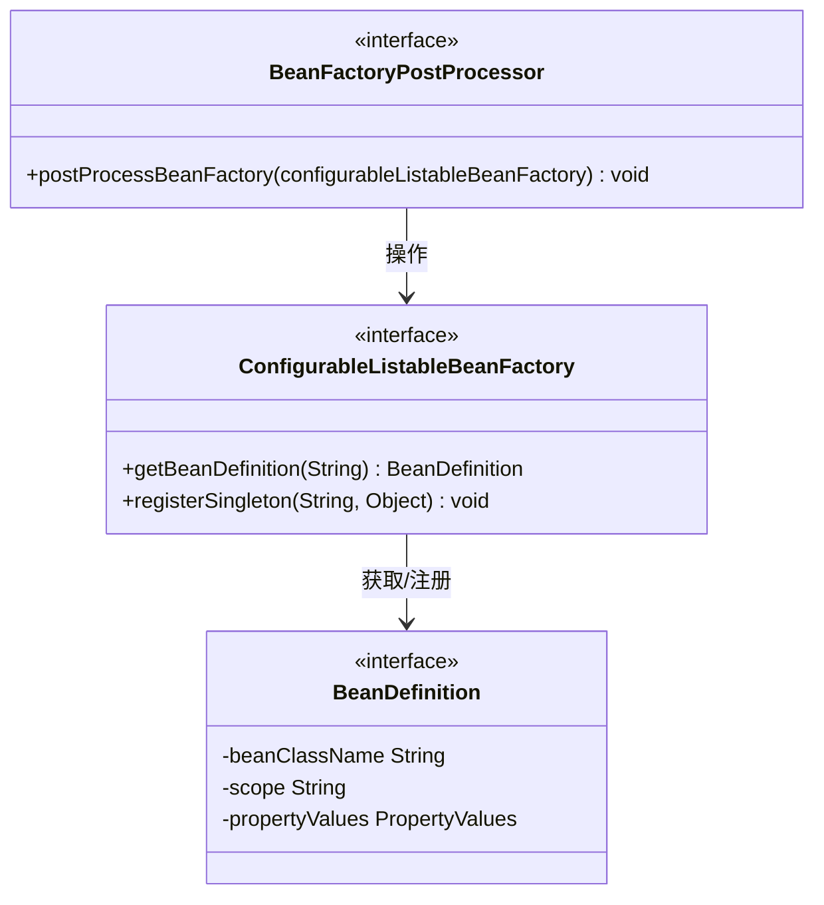

**接口定义**：

```java
@FunctionalInterface
public interface BeanFactoryPostProcessor {
    /**
     * 在 BeanFactory 标准初始化之后调用，
     * 此时所有 BeanDefinition 已被加载，但还没有任何 Bean 被实例化
     */
    void postProcessBeanFactory(ConfigurableListableBeanFactory beanFactory) throws BeansException;
}
```

### 10.1.2 执行时机

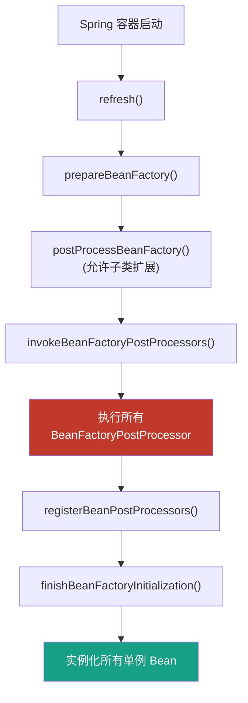

**关键点**：
- `BeanFactoryPostProcessor` 在容器刷新过程中执行
- 执行时机在所有 BeanDefinition 加载完成后，单例 Bean 实例化之前
- 可以修改 BeanDefinition 的属性，如修改属性值、添加新的 BeanDefinition 等

### 10.1.3 典型实现

#### 1. PropertySourcesPlaceholderConfigurer

**作用**：将占位符（如 `${jdbc.url}`）替换为实际配置值

**使用示例**：

```java
// 1. 配置类方式
@Configuration
public class AppConfig {
    @Bean
    public static PropertySourcesPlaceholderConfigurer propertySourcesPlaceholderConfigurer() {
        return new PropertySourcesPlaceholderConfigurer();
    }
}
```

```xml
<!-- 2. XML 配置方式 -->
<bean class="org.springframework.context.support.PropertySourcesPlaceholderConfigurer">
    <property name="locations">
        <list>
            <value>classpath:jdbc.properties</value>
        </list>
    </property>
    <property name="placeholderPrefix" value="${"/>
    <property name="placeholderSuffix" value="}"/>
</bean>
```

**jdbc.properties**：

```properties
jdbc.driver=com.mysql.cj.jdbc.Driver
jdbc.url=jdbc:mysql://localhost:3306/demo
jdbc.username=root
jdbc.password=123456
```

**使用占位符的 Bean**：

```java
public class DataSource {
    private String driver;
    private String url;
    private String username;
    private String password;

    // getters and setters
}
```

```xml
<bean id="dataSource" class="com.example.DataSource">
    <property name="driver" value="${jdbc.driver}"/>
    <property name="url" value="${jdbc.url}"/>
    <property name="username" value="${jdbc.username}"/>
    <property name="password" value="${jdbc.password}"/>
</bean>
```

#### 2. CustomEditorConfigurer

**作用**：注册自定义属性编辑器，用于将 String 类型转换为复杂类型

```java
// 1. 定义自定义编辑器
public class DatePropertyEditor extends PropertyEditorSupport {
    private final String dateFormat;

    public DatePropertyEditor(String dateFormat) {
        this.dateFormat = dateFormat;
    }

    @Override
    public void setAsText(String text) throws IllegalArgumentException {
        try {
            SimpleDateFormat sdf = new SimpleDateFormat(dateFormat);
            setValue(sdf.parse(text));
        } catch (ParseException e) {
            throw new IllegalArgumentException("Invalid date format: " + text);
        }
    }
}
```

```xml
<bean class="org.springframework.beans.factory.config.CustomEditorConfigurer">
    <property name="customEditors">
        <map>
            <entry key="java.util.Date">
                <bean class="com.example.DatePropertyEditor">
                    <constructor-arg value="yyyy-MM-dd"/>
                </bean>
            </entry>
        </map>
    </property>
</bean>
```

### 10.1.4 源码分析

**执行入口**：`AbstractApplicationContext.invokeBeanFactoryPostProcessors()`

```java
public static void invokeBeanFactoryPostProcessors(
        ConfigurableListableBeanFactory beanFactory,
        List<BeanFactoryPostProcessor> beanFactoryPostProcessors) {

    // 1. 首先执行 BeanDefinitionRegistryPostProcessor
    Set<String> processedBeans = new HashSet<>();

    if (beanFactory instanceof BeanDefinitionRegistry) {
        BeanDefinitionRegistry registry = (BeanDefinitionRegistry) beanFactory;

        List<BeanFactoryPostProcessor> regularPostProcessors = new ArrayList<>();
        List<BeanDefinitionRegistryPostProcessor> registryProcessors = new ArrayList<>();

        // 1.1 分离 BeanDefinitionRegistryPostProcessor 和普通 BeanFactoryPostProcessor
        for (BeanFactoryPostProcessor postProcessor : beanFactoryPostProcessors) {
            if (postProcessor instanceof BeanDefinitionRegistryPostProcessor) {
                BeanDefinitionRegistryPostProcessor registryProcessor =
                        (BeanDefinitionRegistryPostProcessor) postProcessor;
                registryProcessor.postProcessBeanDefinitionRegistry(registry);
                registryProcessors.add(registryProcessor);
            } else {
                regularPostProcessors.add(postProcessor);
            }
        }

        // 1.2 从容器中获取所有 BeanDefinitionRegistryPostProcessor 并排序
        do {
            // ... 排序和执行逻辑
        } while (containsBeanDefinition);

        // 1.3 执行 regularPostProcessors
        invokeBeanFactoryPostProcessors(regularPostProcessors, beanFactory);
    }
}
```

---

## 10.2 BeanPostProcessor

### 10.2.1 接口定义

`BeanPostProcessor` 是 Spring 容器中最核心的扩展点之一，它允许我们在 Bean 初始化前后进行拦截和处理。

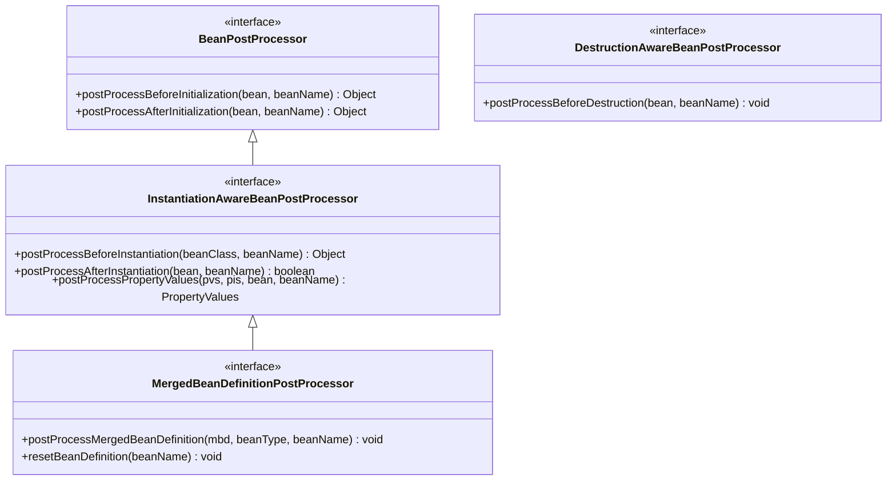

**接口定义**：

```java
public interface BeanPostProcessor {
    /**
     * 在 Bean 初始化方法（如 @PostConstruct、InitializingBean.afterPropertiesSet）之前调用
     */
    @Nullable
    default Object postProcessBeforeInitialization(Object bean, String beanName)
            throws BeansException {
        return bean;
    }

    /**
     * 在 Bean 初始化方法之后调用
     */
    @Nullable
    default Object postProcessAfterInitialization(Object bean, String beanName)
            throws BeansException {
        return bean;
    }
}
```

### 10.2.2 执行时机

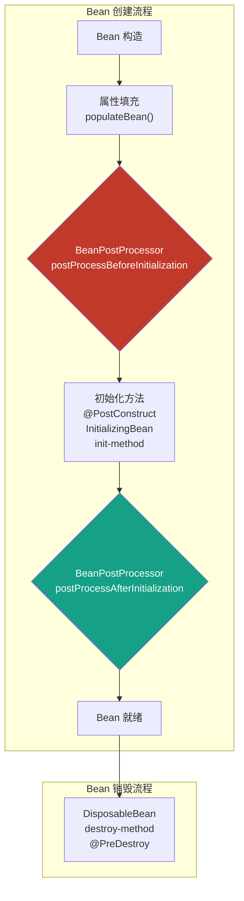

**Bean 完整生命周期**：

```
Bean 构造
    ↓
setBeanName() [如果实现 BeanNameAware]
    ↓
setBeanFactory() [如果实现 BeanFactoryAware]
    ↓
setApplicationContext() [如果实现 ApplicationContextAware]
    ↓
BeanPostProcessor.postProcessBeforeInitialization()
    ↓
@PostConstruct 方法
    ↓
InitializingBean.afterPropertiesSet()
    ↓
init-method (XML 配置的初始化方法)
    ↓
BeanPostProcessor.postProcessAfterInitialization()
    ↓
Bean 就绪状态
    ↓
@PreDestroy 方法
    ↓
DisposableBean.destroy()
    ↓
destroy-method (XML 配置的销毁方法)
    ↓
Bean 销毁
```

### 10.2.3 典型实现

#### 1. AutowiredAnnotationBeanPostProcessor

**作用**：处理 `@Autowired`、`@Value`、`@Inject` 注解的自动注入

**源码位置**：`org.springframework.beans.factory.annotation.AutowiredAnnotationBeanPostProcessor`

**处理流程**：

```java
public class AutowiredAnnotationBeanPostProcessor extends InstantiationAwareBeanPostProcessor
        implements MergedBeanDefinitionPostProcessor {

    @Override
    public PropertyValues postProcessPropertyValues(
            PropertyValues pvs, PropertyDescriptor[] pds, Object bean, String beanName) {

        // 1. 查找带有 @Autowired、@Value、@Inject 注解的成员变量和方法
        InjectionMetadata metadata = findAutowiringMetadata(beanName, bean.getClass(), pvs);

        try {
            // 2. 执行注入
            metadata.inject(bean, beanName, pvs);
        } catch (BeanCreationException ex) {
            throw ex;
        } catch (Exception ex) {
            throw new BeanCreationException(beanName, "Injection of autowired dependencies failed", ex);
        }

        return pvs;
    }
}
```

#### 2. RequiredAnnotationBeanPostProcessor

**作用**：检查带有 `@Required` 注解的属性是否已被注入（已废弃）

```java
public class RequiredAnnotationBeanPostProcessor extends AbstractAutoWireTypeProcessor {

    @Override
    public boolean postProcessAfterInstantiation(Object bean, String beanName) throws BeansException {
        // 检查 @Required 注解的属性
        return true;
    }
}
```

#### 3. ApplicationContextAwareProcessor

**作用**：为实现 `Aware` 接口的 Bean 注入相应的资源

**源码位置**：`org.springframework.context.support.ApplicationContextAwareProcessor`

```java
class ApplicationContextAwareProcessor implements BeanPostProcessor {

    private final ApplicationContext applicationContext;

    @Override
    public Object postProcessBeforeInitialization(Object bean, String beanName) throws BeansException {
        // 如果 Bean 实现了以下 Aware 接口，进行相应注入
        if (bean instanceof EnvironmentAware) {
            ((EnvironmentAware) bean).setEnvironment(applicationContext.getEnvironment());
        }
        if (bean instanceof EmbeddedValueResolverAware) {
            ((EmbeddedValueResolverAware) bean).setEmbeddedValueResolver(
                    new EmbeddedValueResolver(applicationContext.getBeanFactory()));
        }
        if (bean instanceof ResourceLoaderAware) {
            ((ResourceLoaderAware) bean).setResourceLoader(applicationContext);
        }
        if (bean instanceof ApplicationEventPublisherAware) {
            ((ApplicationEventPublisherAware) bean).setApplicationEventPublisher(applicationContext);
        }
        if (bean instanceof MessageSourceAware) {
            ((MessageSourceAware) bean).setMessageSource(applicationContext);
        }
        if (bean instanceof ApplicationContextAware) {
            ((ApplicationContextAware) bean).setApplicationContext(applicationContext);
        }
        return bean;
    }
}
```

#### 4. CommonAnnotationBeanPostProcessor

**作用**：处理 `@Resource`、`@PostConstruct`、`@PreDestroy` 注解

```java
public class CommonAnnotationBeanPostProcessor extends InstantiationAwareBeanPostProcessor {

    @Override
    public Object postProcessBeforeInitialization(Object bean, String beanName) {
        // 处理 @PostConstruct
        LifecycleMetadata metadata = findLifecycleMetadata(bean.getClass());
        try {
            metadata.invokeInitMethods(bean, beanName);
        } catch (Exception e) {
            throw new BeanCreationException(beanName, "Invocation of init method failed", e);
        }
        return super.postProcessBeforeInitialization(bean, beanName);
    }
}
```

### 10.2.4 与 BeanFactoryPostProcessor 的区别

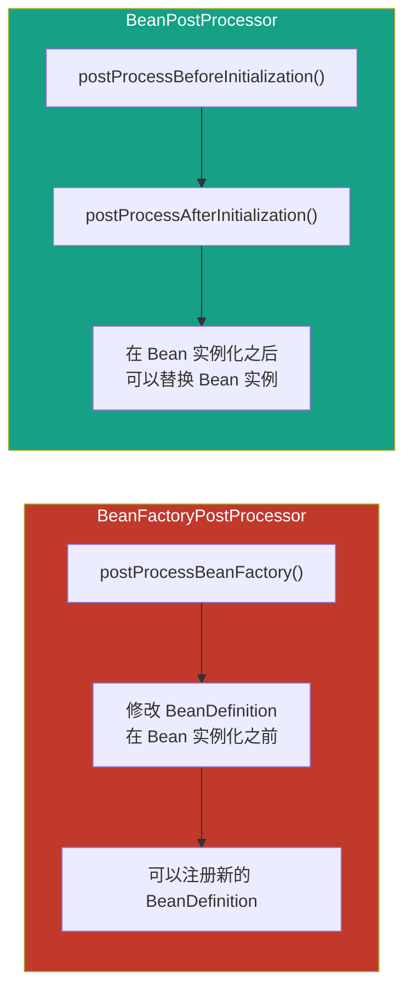

| 特性 | BeanFactoryPostProcessor | BeanPostProcessor |
|-----|-------------------------|-------------------|
| 执行时机 | BeanDefinition 加载后，Bean 实例化前 | Bean 实例化后，初始化前后 |
| 操作对象 | BeanDefinition | Bean 实例 |
| 功能 | 修改 Bean 定义信息，注册新 Bean | 替换 Bean 实例，属性注入 |
| 执行次数 | 每个类只执行一次 | 每个 Bean 实例执行一次 |
| 执行顺序 | 先于 BeanPostProcessor | 在 BeanFactoryPostProcessor 之后 |

---

## 10.3 Aware 接口家族

### 10.3.1 Aware 接口概述

`Aware` 接口是 Spring 提供的一种让 Bean 获取容器底层资源的机制。通过实现特定的 `Aware` 接口，Bean 可以在生命周期回调中被注入所需的基础设施对象。

```mermaid
classDiagram
    class Aware {
        <<marker interface>>
    }

    class BeanNameAware {
        +setBeanName(name) void
    }

    class BeanFactoryAware {
        +setBeanFactory(beanFactory) void
    }

    class ApplicationContextAware {
        +setApplicationContext(applicationContext) void
    }

    class ServletContextAware {
        +setServletContext(servletContext) void
    }

    class ServletConfigAware {
        +setServletConfig(servletConfig) void
    }

    class EnvironmentAware {
        +setEnvironment(environment) void
    }

    class ResourceLoaderAware {
        +setResourceLoader(resourceLoader) void
    }

    class MessageSourceAware {
        +setMessageSource(messageSource) void
    }

    class ApplicationEventPublisherAware {
        +setApplicationEventPublisher(applicationEventPublisher) void
    }

    Aware <|-- BeanNameAware
    Aware <|-- BeanFactoryAware
    Aware <|-- ApplicationContextAware
    Aware <|-- ServletContextAware
    Aware <|-- ServletConfigAware
    Aware <|-- EnvironmentAware
    Aware <|-- ResourceLoaderAware
    Aware <|-- MessageSourceAware
    Aware <|-- ApplicationEventPublisherAware
```

### 10.3.2 常见 Aware 接口详解

#### 1. BeanNameAware

**作用**：注入 Bean 的名称

```java
public class MyService implements BeanNameAware {

    private String beanName;

    @Override
    public void setBeanName(String name) {
        this.beanName = name;
        System.out.println("Bean 名称: " + name);
    }
}
```

#### 2. BeanFactoryAware

**作用**：注入 BeanFactory 容器

```java
public class MyService implements BeanFactoryAware {

    private BeanFactory beanFactory;

    @Override
    public void setBeanFactory(BeanFactory beanFactory) throws BeansException {
        this.beanFactory = beanFactory;
    }

    public void getBeanByFactory(String beanName) {
        Object bean = beanFactory.getBean(beanName);
        System.out.println("从 BeanFactory 获取: " + beanName);
    }
}
```

#### 3. ApplicationContextAware

**作用**：注入 ApplicationContext 容器

```java
public class MyService implements ApplicationContextAware {

    private ApplicationContext applicationContext;

    @Override
    public void setApplicationContext(ApplicationContext applicationContext) throws BeansException {
        this.applicationContext = applicationContext;
    }

    public void publishEvent() {
        applicationContext.publishEvent(new MyApplicationEvent("测试事件"));
    }

    public <T> T getBean(Class<T> clazz) {
        return applicationContext.getBean(clazz);
    }
}
```

#### 4. ServletContextAware

**作用**：注入 Web 应用的 ServletContext

```java
public class MyServletContextAware implements ServletContextAware {

    private ServletContext servletContext;

    @Override
    public void setServletContext(ServletContext servletContext) {
        this.servletContext = servletContext;
    }

    public String getRealPath(String path) {
        return servletContext.getRealPath(path);
    }
}
```

### 10.3.3 执行时机和源码位置

**执行顺序**：

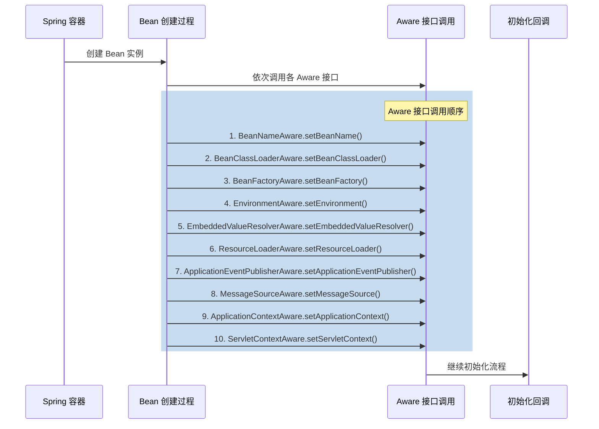

**源码位置**：`AbstractAutowireCapableBeanFactory.invokeAwareMethods()`

```java
private void invokeAwareMethods(String beanName, Object bean) {
    if (bean instanceof Aware) {
        if (bean instanceof BeanNameAware) {
            ((BeanNameAware) bean).setBeanName(beanName);
        }
        if (bean instanceof BeanClassLoaderAware) {
            ((BeanClassLoaderAware) bean).setBeanClassLoader(getBeanClassLoader());
        }
        if (bean instanceof BeanFactoryAware) {
            ((BeanFactoryAware) bean).setBeanFactory(this);
        }
    }
}
```

**ApplicationContextAwareProcessor 处理其他 Aware**：

```java
// 在 ApplicationContextAwareProcessor.postProcessBeforeInitialization() 中处理
if (bean instanceof EnvironmentAware) {
    ((EnvironmentAware) bean).setEnvironment(applicationContext.getEnvironment());
}
if (bean instanceof EmbeddedValueResolverAware) {
    ((EmbeddedValueResolverAware) bean).setEmbeddedValueResolver(
            new EmbeddedValueResolver(applicationContext.getBeanFactory()));
}
if (bean instanceof ResourceLoaderAware) {
    ((ResourceLoaderAware) bean).setResourceLoader(applicationContext);
}
// ... 其他 Aware 接口
```

### 10.3.4 为什么需要 Aware 接口

**设计目的**：

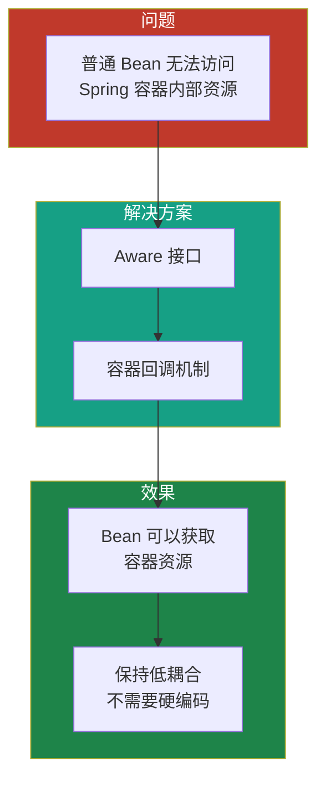

**Aware 接口的价值**：

1. **解耦**：Bean 不需要直接依赖 Spring 容器 API
2. **可测试性**：可以通过 setter 注入mock 对象
3. **单一职责**：Bean 只需要关注业务逻辑
4. **弹性**：在需要时获取容器资源，不需要时不实现

**不使用 Aware 的替代方案**：

```java
// 方案1: 直接注入（更推荐）
@Service
public class MyService {
    @Autowired
    private ApplicationContext applicationContext;
}

// 方案2: 实现 Aware 接口
@Service
public class MyService implements ApplicationContextAware {
    private ApplicationContext applicationContext;

    @Override
    public void setApplicationContext(ApplicationContext applicationContext) {
        this.applicationContext = applicationContext;
    }
}

// 方案3: 实现 ApplicationRunner（推荐用于初始化逻辑）
@Component
public class MyInitializer implements ApplicationRunner {
    @Autowired
    private ApplicationContext applicationContext;

    @Override
    public void run(ApplicationArguments args) {
        // 初始化逻辑
    }
}
```

---

## 10.4 InitializingBean 与 DisposableBean

### 10.4.1 InitializingBean 接口

**作用**：在 Bean 属性填充完成后执行初始化逻辑

```java
public interface InitializingBean {
    /**
     * 在 Bean 属性填充完成后调用
     * @throws Exception 如果初始化失败
     */
    void afterPropertiesSet() throws Exception;
}
```

**使用示例**：

```java
public class DataSource implements InitializingBean {

    private String url;
    private String username;
    private String password;

    @Override
    public void afterPropertiesSet() throws Exception {
        // 验证配置
        if (url == null || url.isEmpty()) {
            throw new IllegalStateException("数据源 URL 未配置");
        }
        // 初始化连接池等
        System.out.println("数据源初始化完成");
    }

    // setters...
}
```

### 10.4.2 DisposableBean 接口

**作用**：在 Bean 销毁前执行清理逻辑

```java
public interface DisposableBean {
    /**
     * 在 Bean 销毁前调用
     */
    void destroy() throws Exception;
}
```

**使用示例**：

```java
public class DataSource implements DisposableBean {

    private DataSource dataSource;

    @Override
    public void destroy() throws Exception {
        // 关闭连接池
        if (dataSource != null) {
            dataSource.close();
        }
        System.out.println("数据源资源已释放");
    }
}
```

### 10.4.3 @PostConstruct 和 @PreDestroy 注解

**Java EE 标准注解**（JSR-250）

```java
public class DataSource {

    private String url;

    @PostConstruct
    public void init() {
        System.out.println("@PostConstruct 初始化");
    }

    @PreDestroy
    public void cleanup() {
        System.out.println("@PreDestroy 清理");
    }
}
```

### 10.4.4 执行顺序

```mermaid
flowchart TD
    subgraph Init["初始化顺序"]
        A["属性填充完成\npopulateBean()"] --> B["BeanPostProcessor\npostProcessBeforeInitialization()"]
        B --> C["@PostConstruct"]
        C --> D["InitializingBean\nafterPropertiesSet()"]
        D --> E["init-method\nXML配置的init-method"]
        E --> F["BeanPostProcessor\npostProcessAfterInitialization()"]
    end

    subgraph Destroy["销毁顺序"]
        G["容器关闭\ndestroy()"]
        G --> H["@PreDestroy"]
        H --> I["DisposableBean\ndestroy()"]
        I --> J["destroy-method\nXML配置的destroy-method"]
    end

    style C fill:#c0392b,color:#fff
    style H fill:#922b21,color:#fff
```

**源码位置**：`AbstractAutowireCapableBeanFactory.doCreateBean()`

```java
protected Object doCreateBean(String beanName, RootBeanDefinition mbd, @Nullable Object args,
        BeanWrapper instanceWrapper) {

    // 1. 创建 Bean 实例
    Object bean = createBeanInstance(beanName, mbd, args);

    // 2. 属性填充
    populateBean(beanName, mbd, instanceWrapper);

    // 3. 初始化 Bean
    Object exposedObject = initializeBean(beanName, exposedObject, mbd);

    // 4. 注册销毁逻辑
    registerDisposableBeanIfNecessary(beanName, bean, mbd);

    return exposedObject;
}
```

**`initializeBean()` 源码**：

```java
protected Object initializeBean(String beanName, Object bean, @Nullable RootBeanDefinition mbd) {
    // 1. 调用 Aware 接口
    invokeAwareMethods(beanName, bean);

    // 2. 调用 BeanPostProcessor.postProcessBeforeInitialization()
    wrappedBean = applyBeanPostProcessorsBeforeInitialization(bean, beanName);

    // 3. 调用初始化方法
    invokeInitMethods(beanName, wrappedBean, mbd);

    // 4. 调用 BeanPostProcessor.postProcessAfterInitialization()
    wrappedBean = applyBeanPostProcessorsAfterInitialization(wrappedBean, beanName);

    return wrappedBean;
}
```

**`invokeInitMethods()` 源码**：

```java
protected void invokeInitMethods(String beanName, Object bean, RootBeanDefinition mbd)
        throws Throwable {

    // 1. 先调用 InitializingBean.afterPropertiesSet()
    boolean isInitializingBean = (bean instanceof InitializingBean);
    if (isInitializingBean) {
        ((InitializingBean) bean).afterPropertiesSet();
    }

    // 2. 再调用 init-method
    String initMethodName = mbd.getInitMethodName();
    if (StringUtils.hasLength(initMethodName) &&
            !(isInitializingBean && "afterPropertiesSet".equals(initMethodName))) {
        invokeCustomInitMethod(beanName, bean, initMethodName);
    }
}
```

---

## 10.5 BeanDefinitionRegistryPostProcessor

### 10.5.1 与 BeanFactoryPostProcessor 的区别

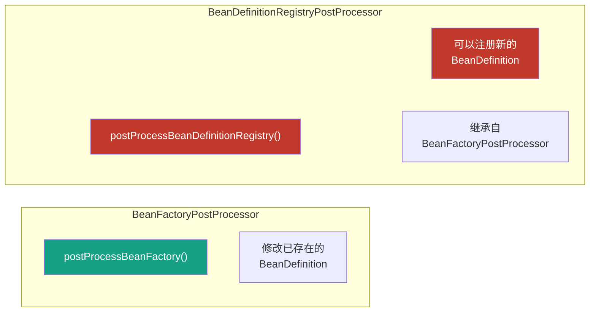

**接口定义**：

```java
public interface BeanDefinitionRegistryPostProcessor extends BeanFactoryPostProcessor {
    /**
     * 在 BeanDefinition 注册之前调用
     * 可以动态注册新的 BeanDefinition
     */
    void postProcessBeanDefinitionRegistry(BeanDefinitionRegistry registry) throws BeansException;
}
```

### 10.5.2 典型使用场景

#### 1. ComponentScan 原理

`ComponentScanAnnotationParser` 使用 `BeanDefinitionRegistryPostProcessor` 来处理 `@ComponentScan` 注解

```java
// Spring 内部使用方式
public class ConfigurationClassPostProcessor implements BeanDefinitionRegistryPostProcessor {

    @Override
    public void postProcessBeanDefinitionRegistry(BeanDefinitionRegistry registry) {
        // 扫描 @Component 注解的类
        // 注册新的 BeanDefinition
    }
}
```

#### 2. 自定义动态注册 Bean

```java
public class MyBeanDefinitionRegistryPostProcessor implements BeanDefinitionRegistryPostProcessor {

    @Override
    public void postProcessBeanDefinitionRegistry(BeanDefinitionRegistry registry)
            throws BeansException {
        // 动态注册 BeanDefinition
        AbstractBeanDefinition beanDefinition = new RootBeanDefinition();
        beanDefinition.setBeanClass(UserService.class);
        beanDefinition.setScope(BeanDefinition.SCOPE_SINGLETON);
        beanDefinition.getPropertyValues().add("name", "DynamicUser");

        registry.registerBeanDefinition("dynamicUserService", beanDefinition);
    }

    @Override
    public void postProcessBeanFactory(ConfigurableListableBeanFactory beanFactory)
            throws BeansException {
        // 可以进一步修改已注册的 BeanDefinition
    }
}
```

### 10.5.3 执行顺序

**源码位置**：`AbstractApplicationContext.invokeBeanFactoryPostProcessors()`

```java
public static void invokeBeanFactoryPostProcessors(
        ConfigurableListableBeanFactory beanFactory,
        List<BeanFactoryPostProcessor> beanFactoryPostProcessors) {

    Set<String> processedBeans = new HashSet<>();

    if (beanFactory instanceof BeanDefinitionRegistry) {
        BeanDefinitionRegistry registry = (BeanDefinitionRegistry) beanFactory;

        List<BeanDefinitionRegistryPostProcessor> registryProcessors = new ArrayList<>();
        List<BeanFactoryPostProcessor> regularProcessors = new ArrayList<>();

        // 1. 分离 BeanDefinitionRegistryPostProcessor 和普通 BeanFactoryPostProcessor
        for (BeanFactoryPostProcessor postProcessor : beanFactoryPostProcessors) {
            if (postProcessor instanceof BeanDefinitionRegistryPostProcessor) {
                registryProcessors.add((BeanDefinitionRegistryPostProcessor) postProcessor);
            } else {
                regularProcessors.add(postProcessor);
            }
        }

        // 2. 先执行所有 BeanDefinitionRegistryPostProcessor
        do {
            for (BeanDefinitionRegistryPostProcessor postProcessor : registryProcessors) {
                postProcessor.postProcessBeanDefinitionRegistry(registry);
            }
            // ... 排序逻辑
        } while (hasTypeBeenProcessed);

        // 3. 再执行所有 BeanFactoryPostProcessor
        invokeBeanFactoryPostProcessors(regularProcessors, beanFactory);
    }
}
```

**执行顺序图**：

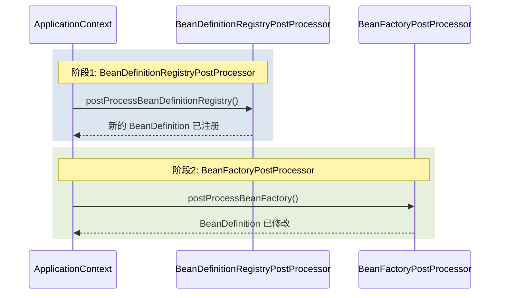

---

## 10.6 【实战】Spring 扩展点实战应用

### 10.6.1 实战：自定义 BeanFactoryPostProcessor

#### 需求场景

实现一个配置中心客户端，在应用启动时从远程配置中心获取配置，并将其注入到 Spring 环境中。

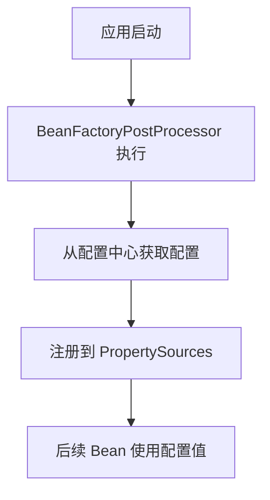

**实现代码**：

```java
/**
 * 配置中心客户端的 BeanFactoryPostProcessor 实现
 * 功能：从远程配置中心获取配置并注册到 Spring 环境
 */
public class ConfigCenterBeanFactoryPostProcessor implements BeanFactoryPostProcessor {

    private String configCenterUrl;
    private String appName;

    public ConfigCenterBeanFactoryPostProcessor(String configCenterUrl, String appName) {
        this.configCenterUrl = configCenterUrl;
        this.appName = appName;
    }

    @Override
    public void postProcessBeanFactory(ConfigurableListableBeanFactory beanFactory)
            throws BeansException {
        try {
            // 1. 模拟从配置中心获取配置
            Map<String, Object> remoteConfig = fetchConfigFromRemote();

            // 2. 创建 PropertySource
            MapPropertySource propertySource = new MapPropertySource("configCenter", remoteConfig);

            // 3. 获取 ConfigurableEnvironment
            if (beanFactory instanceof ConfigurableApplicationContext) {
                ConfigurableApplicationContext context = (ConfigurableApplicationContext) beanFactory;
                ConfigurableEnvironment environment = context.getEnvironment();

                // 4. 添加 PropertySource（优先使用远程配置）
                environment.getPropertySources().addFirst(propertySource);

                System.out.println("配置中心配置加载成功，共 " + remoteConfig.size() + " 个配置项");
            }
        } catch (Exception e) {
            throw new BeanInitializationException("配置中心连接失败", e);
        }
    }

    private Map<String, Object> fetchConfigFromRemote() {
        // 模拟远程配置返回
        Map<String, Object> config = new HashMap<>();
        config.put("config.server.url", "http://config-center:8888");
        config.put("config.app.name", appName);
        config.put("config.refresh.interval", 30000);
        return config;
    }
}
```

**配置类**：

```java
@Configuration
public class ConfigCenterConfiguration {

    @Bean
    public static ConfigCenterBeanFactoryPostProcessor configCenterBeanFactoryPostProcessor() {
        return new ConfigCenterBeanFactoryPostProcessor(
                "http://config-center:8888",
                "spring-demo"
        );
    }
}
```

**使用配置**：

```java
@Service
public class ConfigDemoService {

    @Value("${config.server.url}")
    private String serverUrl;

    @Value("${config.app.name}")
    private String appName;

    public void printConfig() {
        System.out.println("Server URL: " + serverUrl);
        System.out.println("App Name: " + appName);
    }
}
```

### 10.6.2 实战：自定义 BeanPostProcessor

#### 需求场景

实现一个性能监控 BeanPostProcessor，记录每个 Bean 方法的执行时间

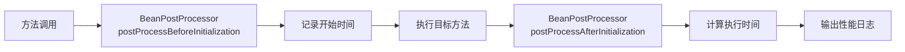

**实现代码**：

```java
/**
 * 性能监控 BeanPostProcessor
 * 为所有 Service 层 Bean 添加方法执行时间监控
 */
@Component
public class PerformanceMonitorBeanPostProcessor implements BeanPostProcessor {

    private final Map<String, Long> startTimes = new ConcurrentHashMap<>();

    @Override
    public Object postProcessBeforeInitialization(Object bean, String beanName)
            throws BeansException {
        // 只监控 Service 结尾的 Bean
        if (beanName.endsWith("Service")) {
            startTimes.put(beanName, System.currentTimeMillis());
        }
        return bean;
    }

    @Override
    public Object postProcessAfterInitialization(Object bean, String beanName)
            throws BeansException {
        if (beanName.endsWith("Service")) {
            Long startTime = startTimes.remove(beanName);
            if (startTime != null) {
                long duration = System.currentTimeMillis() - startTime;
                System.out.printf("[Performance] Bean '%s' 初始化完成，耗时: %dms%n",
                        beanName, duration);
            }
        }
        return bean;
    }
}
```

**使用 JDK 动态代理实现方法监控**：

```java
@Component
public class MethodMonitorBeanPostProcessor implements BeanPostProcessor {

    private final Map<String, Object> proxies = new ConcurrentHashMap<>();

    @Override
    public Object postProcessBeforeInitialization(Object bean, String beanName)
            throws BeansException {
        return bean;
    }

    @Override
    public Object postProcessAfterInitialization(Object bean, String beanName)
            throws BeansException {
        // 只为 Service 结尾的 Bean 创建代理
        if (beanName.endsWith("Service") && !isProxy(bean)) {
            Object proxy = createProxy(bean, beanName);
            proxies.put(beanName, proxy);
            return proxy;
        }
        return bean;
    }

    private Object createProxy(Object target, String beanName) {
        return Proxy.newProxyInstance(
                target.getClass().getClassLoader(),
                target.getClass().getInterfaces(),
                (proxy, method, args) -> {
                    String methodName = method.getName();
                    long start = System.currentTimeMillis();

                    try {
                        return method.invoke(target, args);
                    } finally {
                        long duration = System.currentTimeMillis() - start;
                        if (duration > 100) { // 只记录超过 100ms 的方法调用
                            System.out.printf("[Monitor] %s.%s() 耗时: %dms%n",
                                    beanName, methodName, duration);
                        }
                    }
                }
        );
    }

    private boolean isProxy(Object bean) {
        return Proxy.isProxyClass(bean.getClass());
    }
}
```

### 10.6.3 实战：实现 Aware 接口

#### 需求场景

实现一个动态数据源切换器，根据当前请求动态切换数据源

```java
/**
 * 数据源上下文 Holder
 */
public class DataSourceContextHolder {

    private static final ThreadLocal<String> CONTEXT = new ThreadLocal<>();

    public static void setDataSource(String dataSource) {
        CONTEXT.set(dataSource);
    }

    public static String getDataSource() {
        return CONTEXT.get();
    }

    public static void clear() {
        CONTEXT.remove();
    }
}
```

**动态数据源实现**：

```java
/**
 * 动态数据源
 * 实现 DataSourceLookupAware 接口获取数据源查找策略
 * 实现 ApplicationContextAware 接口获取容器资源
 */
public class DynamicDataSource implements DataSource, ApplicationContextAware {

    private DataSourceLookup dataSourceLookup;
    private ApplicationContext applicationContext;
    private Map<String, DataSource> dataSourceCache = new ConcurrentHashMap<>();

    @Override
    public void setApplicationContext(ApplicationContext applicationContext) throws BeansException {
        this.applicationContext = applicationContext;
    }

    public void setDataSourceLookup(DataSourceLookup dataSourceLookup) {
        this.dataSourceLookup = dataSourceLookup;
    }

    @Override
    public Connection getConnection() throws SQLException {
        String currentDs = DataSourceContextHolder.getDataSource();
        if (currentDs == null) {
            currentDs = "default";
        }
        return getDataSource(currentDs).getConnection();
    }

    @Override
    public Connection getConnection(String username, String password) throws SQLException {
        String currentDs = DataSourceContextHolder.getDataSource();
        if (currentDs == null) {
            currentDs = "default";
        }
        return getDataSource(currentDs).getConnection(username, password);
    }

    private DataSource getDataSource(String name) {
        return dataSourceCache.computeIfAbsent(name, this::lookupDataSource);
    }

    private DataSource lookupDataSource(String name) {
        // 实际应该从配置或容器中查找
        System.out.println("切换到数据源: " + name);
        return dataSourceLookup.lookup(name);
    }
}
```

**使用示例**：

```java
@Service
public class UserService {

    public void switchDataSource() {
        // 切换到从库
        DataSourceContextHolder.setDataSource("slave");
        try {
            // 查询操作
            List<User> users = userRepository.findAll();
        } finally {
            // 切回主库
            DataSourceContextHolder.setDataSource("master");
        }
    }
}
```

### 10.6.4 综合实战：实现一个完整的配置变更监听器

#### 需求场景

实现一个综合性的 Spring 扩展点应用，监听配置变更并动态更新 Bean 的属性

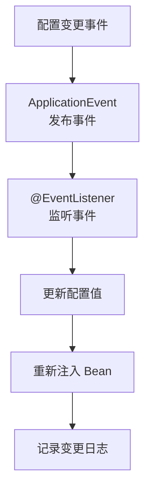

**完整实现**：

```java
// ==================== 1. 配置变更事件 ====================
public class ConfigChangeEvent extends ApplicationEvent {

    private final String key;
    private final String oldValue;
    private final String newValue;

    public ConfigChangeEvent(Object source, String key, String oldValue, String newValue) {
        super(source);
        this.key = key;
        this.oldValue = oldValue;
        this.newValue = newValue;
    }

    public String getKey() { return key; }
    public String getOldValue() { return oldValue; }
    public String getNewValue() { return newValue; }
}
```

```java
// ==================== 2. 配置变更监听器 ====================
@Component
public class ConfigChangeListener {

    @Autowired
    private ApplicationEventPublisher eventPublisher;

    @Autowired
    private ConfigurableListableBeanFactory beanFactory;

    @EventListener
    public void onConfigChange(ConfigChangeEvent event) {
        System.out.printf("[Config] 配置变更 - Key: %s, Old: %s, New: %s%n",
                event.getKey(), event.getOldValue(), event.getNewValue());

        // 重新注入相关 Bean
        refreshBeansWithConfig(event.getKey());
    }

    private void refreshBeansWithConfig(String configKey) {
        String[] beanNames = beanFactory.getBeanDefinitionNames();
        for (String beanName : beanNames) {
            RootBeanDefinition bd = (RootBeanDefinition) beanFactory.getBeanDefinition(beanName);
            if (hasConfigProperty(bd, configKey)) {
                // 重新创建 Bean
                beanFactory.destroySingleton(beanName);
                try {
                    beanFactory.getBean(beanName);
                    System.out.println("[Config] Bean '" + beanName + "' 已重新创建");
                } catch (Exception e) {
                    System.out.println("[Config] Bean '" + beanName + "' 重新创建失败: " + e.getMessage());
                }
            }
        }
    }

    private boolean hasConfigProperty(RootBeanDefinition bd, String configKey) {
        // 检查 BeanDefinition 的属性值是否包含配置键
        return true; // 简化实现
    }
}
```

```java
// ==================== 3. 配置刷新注解 ====================
@Target(ElementType.TYPE)
@Retention(RetentionPolicy.RUNTIME)
public @interface ConfigRefreshable {
    String[] configKeys() default {};
}
```

```java
// ==================== 4. 支持配置刷新的 BeanPostProcessor ====================
@Component
public class ConfigRefreshBeanPostProcessor implements BeanPostProcessor {

    @Autowired
    private ConfigurableListableBeanFactory beanFactory;

    private final Map<String, Object> originalBeans = new ConcurrentHashMap<>();

    @Override
    public Object postProcessBeforeInitialization(Object bean, String beanName) throws BeansException {
        // 缓存原始 Bean
        if (bean.getClass().isAnnotationPresent(ConfigRefreshable.class)) {
            originalBeans.put(beanName, bean);
        }
        return bean;
    }

    @Override
    public Object postProcessAfterInitialization(Object bean, String beanName) throws BeansException {
        return bean;
    }
}
```

```java
// ==================== 5. 使用示例 ====================
@ConfigRefreshable(configKeys = {"app.feature.flags", "app.cache.ttl"})
@Service
public class FeatureService {

    @Value("${app.feature.flags:default}")
    private String featureFlags;

    @Value("${app.cache.ttl:3600}")
    private int cacheTtl;

    public void applyFeatures() {
        System.out.println("Feature Flags: " + featureFlags);
        System.out.println("Cache TTL: " + cacheTtl);
    }
}
```

```java
// ==================== 6. 测试 Controller ====================
@RestController
public class ConfigController {

    @Autowired
    private ApplicationEventPublisher publisher;

    @PostMapping("/config/refresh")
    public String refreshConfig(@RequestParam String key,
                                @RequestParam String value) {
        // 发布配置变更事件
        publisher.publishEvent(new ConfigChangeEvent(this, key, "old", value));
        return "配置已刷新: " + key + " = " + value;
    }
}
```

### 10.6.5 实战总结

通过以上实战项目，我们可以看到 Spring 扩展点的强大能力：

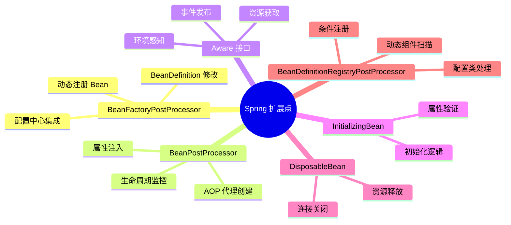

**最佳实践建议**：

1. **优先使用注解**：尽量使用 `@Autowired`、`@Value` 等注解，而非直接实现 Aware 接口
2. **注意执行顺序**：BeanFactoryPostProcessor 先于 BeanPostProcessor 执行
3. **避免过度使用**：扩展点虽然强大，但过度使用会增加系统复杂度
4. **考虑性能影响**：BeanPostProcessor 对每个 Bean 都会执行，要注意性能
5. **做好异常处理**：扩展点中的异常可能导致容器启动失败

---

## 总结

本章我们深入学习了 Spring 的核心扩展点：

1. **BeanFactoryPostProcessor**：在 Bean 实例化前修改 BeanDefinition，是配置处理的基石
2. **BeanPostProcessor**：在 Bean 初始化前后进行拦截，是 AOP、自动注入等功能的实现基础
3. **Aware 接口家族**：让 Bean 获取 Spring 容器内部资源，保持低耦合
4. **InitializingBean 与 DisposableBean**：提供 Bean 初始化和销毁的回调接口
5. **BeanDefinitionRegistryPostProcessor**：动态注册 BeanDefinition，是组件扫描的核心

这些扩展点构成了 Spring 框架的插件体系，理解它们的工作原理对于深入掌握 Spring 框架至关重要。在实际开发中，合理使用这些扩展点可以实现配置中心集成、性能监控、动态代理等高级功能。
