# 第11章 Spring 循环依赖解决方案

## 章节概述

本章将深入剖析 Spring 框架中最为经典也最具挑战性的问题之一——循环依赖。我们将从循环依赖的定义出发，通过大量的图示和源码分析，全面理解 Spring 三级缓存机制如何解决循环依赖问题。理解这一机制，对于深入掌握 Spring 容器内部运行原理、排查实际项目中的循环依赖问题，都具有极其重要的意义。

---

## 11.1 什么是循环依赖

### 11.1.1 循环依赖的定义

**循环依赖（Circular Dependency）** 是指两个或多个 Bean 之间形成相互依赖的闭环关系。简单来说，就是 Bean A 依赖 Bean B，而 Bean B 又依赖 Bean A，形成了一个无法解开的依赖环。

在 Spring 容器中，Bean 的创建和依赖注入是一个复杂的过程。当容器尝试创建 Bean 时，如果发现 Bean 之间存在循环依赖，就可能导致容器无法正常初始化，或者创建出不完整的 Bean 实例。

### 11.1.2 循环依赖的场景示例

#### 场景一：最简单的双向依赖 A -> B -> A

```java
// ServiceA 依赖 ServiceB
@Service
public class ServiceA {
    @Autowired
    private ServiceB serviceB;

    public void doSomething() {
        serviceB.doSomething();
    }
}

// ServiceB 依赖 ServiceA
@Service
public class ServiceB {
    @Autowired
    private ServiceA serviceA;

    public void doSomething() {
        serviceA.doSomething();
    }
}
```

这种场景下，当 Spring 尝试创建 ServiceA 时，发现它依赖 ServiceB，于是先去创建 ServiceB；但创建 ServiceB 时又发现它依赖 ServiceA，而此时 ServiceA 还未创建完成。这就形成了一个死循环。

#### 场景二：三方循环依赖 A -> B -> C -> A

```java
@Service
public class ServiceA {
    @Autowired
    private ServiceB serviceB;
}

@Service
public class ServiceB {
    @Autowired
    private ServiceC serviceC;
}

@Service
public class ServiceC {
    @Autowired
    private ServiceA serviceA;
}
```

这种三方循环依赖更加隐蔽，排查难度更大。

#### 场景三：自我依赖 A -> A

```java
@Service
public class ServiceA {
    @Autowired
    private ServiceA self;  // 自我依赖
}
```

### 11.1.3 单例模式下的循环依赖

Spring 容器中的 Bean 默认是单例（Singleton）模式。在单例模式下，Spring 容器只会创建一个 Bean 实例，所有对该 Bean 的引用都指向这一个实例。这一特性为解决循环依赖提供了可能性。

**关键前提**：Spring 只能解决单例模式下的循环依赖。对于 prototype 作用域的 Bean，Spring 不会缓存其提前引用，因此无法解决循环依赖。

下面我们通过一个流程图来理解为什么单例模式下有可能解决循环依赖：

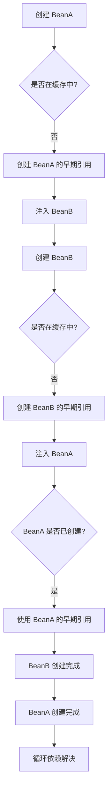

从上述流程可以看出，在单例模式下，Spring 可以通过**提前暴露（Early Reference）**的方式来解决循环依赖：即使 Bean 还未完全创建完成，也可以将其早期引用提供给其他 Bean 使用。

---

## 11.2 Spring 三级缓存机制

### 11.2.1 三级缓存的定义

Spring 的三级缓存（Three-Level Cache）是其解决单例 Bean 循环依赖的核心机制。这三级缓存定义在 `DefaultSingletonBeanRegistry` 类中：

```java
/**
 * 第一级缓存：已创建完成的可用的 Bean
 * Key: Bean名称 -> Value: Bean实例
 * 存储已经完全初始化完成的 Bean，所有线程都可以安全访问
 */
private final Map<String, Object> singletonObjects = new ConcurrentHashMap<>(256);

/**
 * 第二级缓存：提前暴露的 Bean 早期引用
 * Key: Bean名称 -> Value: Bean实例（尚未完全初始化）
 * 存储的是正在创建中但还未完成属性填充和初始化的 Bean
 * 主要用于解决循环依赖
 */
private final Map<String, Object> earlySingletonObjects = new ConcurrentHashMap<>(16);

/**
 * 第三级缓存：Bean 的工厂对象
 * Key: Bean名称 -> Value: ObjectFactory（创建 Bean 的工厂）
 * 存储的是创建 Bean 的工厂函数，用于延迟 Bean 的创建
 * 这是解决循环依赖的关键
 */
private final Map<String, ObjectFactory<?>> singletonFactories = new HashMap<>(16);
```

### 11.2.2 三级缓存的定义位置

三级缓存定义在 Spring 框架的 `org.springframework.beans.factory.support.DefaultSingletonBeanRegistry` 类中。这个类是 Spring 容器的核心组件，`AbstractApplicationContext`、`DefaultListableBeanFactory` 等都继承或组合了这个类的功能。

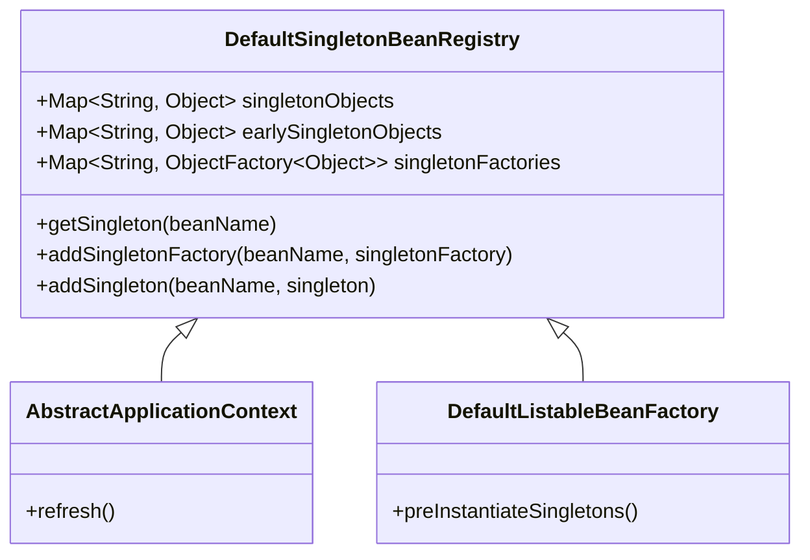

### 11.2.3 缓存作用表格

| 缓存级别 | 缓存名称 | 存储内容 | 访问权限 | 用途 |
|---------|---------|---------|---------|------|
| 第一级 | singletonObjects | 完全成生的 Bean 实例 | 所有线程可访问 | 作为最终可用的 Bean 成品仓库 |
| 第二级 | earlySingletonObjects | 提前暴露的 Bean 早期引用 | 仅创建者线程访问 | 解决循环依赖时存储半成品 Bean |
| 第三级 | singletonFactories | ObjectFactory 工厂对象 | 仅创建者线程访问 | 延迟 Bean 创建，支持 AOP 代理 |

### 11.2.4 三级缓存的流程图

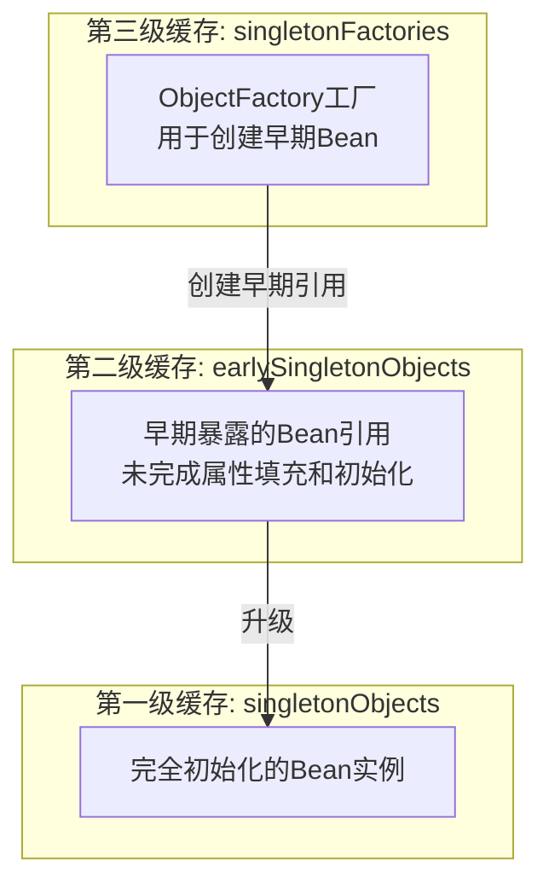

---

## 11.3 循环依赖解决流程

### 11.3.1 getSingleton() 方法源码分析

`getSingleton()` 方法是 Spring 解决循环依赖的核心入口。让我们详细分析其源码：

```java
/**
 * 获取单例 Bean 的核心方法
 * @param beanName Bean 的名称
 * @return 单例 Bean 实例，如果不存在则返回 null
 */
@Override
public Object getSingleton(String beanName) {
    // 使用 beanName 作为检查key
    return getSingleton(beanName, true);
}

/**
 * 重载的 getSingleton 方法
 * @param beanName Bean 的名称
 * @param allowEarlyReference 是否允许返回早期引用
 */
protected Object getSingleton(String beanName, boolean allowEarlyReference) {
    // 第一步：检查第一级缓存（已完成的单例Bean）
    // 这是最快的路径，如果Bean已经创建完成，直接返回
    Object singletonObject = this.singletonObjects.get(beanName);
    if (singletonObject == null && isSingletonCurrentlyInCreation(beanName)) {
        // 第二步：如果第一级缓存没有，且当前Bean正在创建中
        // 则检查第二级缓存（早期引用）
        synchronized (this.earlySingletonObjects) {
            // 从第二级缓存获取早期引用
            singletonObject = this.earlySingletonObjects.get(beanName);
            if (singletonObject == null && allowEarlyReference) {
                // 第三步：如果第二级缓存也没有，且允许早期引用
                // 则从第三级缓存获取 ObjectFactory
                ObjectFactory<?> singletonFactory = this.singletonFactories.get(beanName);
                if (singletonFactory != null) {
                    // 通过 ObjectFactory 创建早期Bean
                    singletonObject = singletonFactory.getObject();
                    // 将创建的早期Bean放入第二级缓存
                    this.earlySingletonObjects.put(beanName, singletonObject);
                    // 从第三级缓存移除，因为已经升级到第二级了
                    this.singletonFactories.remove(beanName);
                }
            }
        }
    }
    return singletonObject;
}
```

**源码位置**：`org.springframework.beans.factory.support.DefaultSingletonBeanRegistry#getSingleton(String, boolean)`

**方法逻辑总结**：

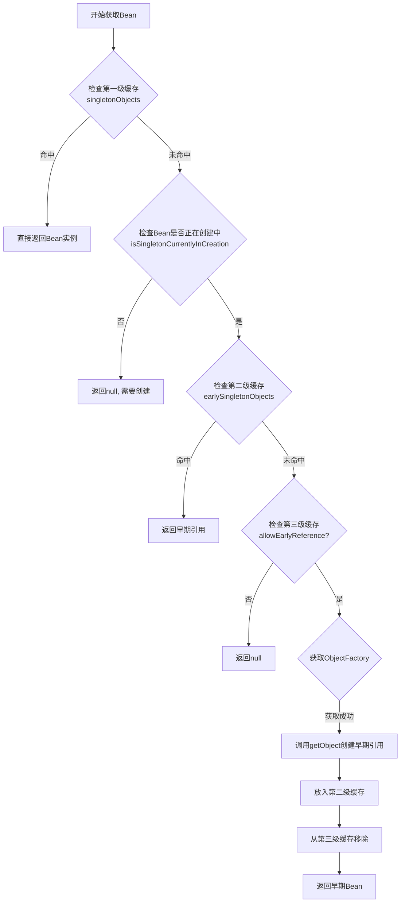

### 11.3.2 addSingletonFactory() 时机

`addSingletonFactory()` 方法用于将 Bean 的创建工厂注册到第三级缓存中。这个方法的调用时机非常关键，它发生在 Bean 创建的早期阶段。

```java
/**
 * 将单例工厂添加到第三级缓存
 * @param beanName Bean的名称
 * @param singletonFactory 创建Bean的工厂
 */
public void addSingletonFactory(String beanName, ObjectFactory<?> singletonFactory) {
    // 断言 beanName 不能为空
    Assert.notNull(beanName, "Bean name must not be null");
    // 使用同步块保证线程安全
    synchronized (this.singletonObjects) {
        // 只有当第一级缓存和第二级缓存都没有当前Bean时
        // 才将工厂添加到第三级缓存
        if (!this.singletonObjects.containsKey(beanName) &&
            !this.earlySingletonObjects.containsKey(beanName)) {
            // 添加到第三级缓存
            this.singletonFactories.put(beanName, singletonFactory);
        }
    }
}
```

**调用时机**：在 `AbstractAutowireCapableBeanFactory#doCreateBean()` 方法中，**在 Bean 实例化之后、属性填充之前**，会调用 `addSingletonFactory()` 将早期引用暴露出来。

```java
/**
 * 实际创建 Bean 的核心方法
 */
protected BeanWrapper doCreateBean(String beanName, RootBeanDefinition mbd,
        Object[] args) throws BeansException {

    // 1. 实例化 Bean（调用构造函数创建实例）
    BeanWrapper instanceWrapper = null;
    if (mbd.isSingleton()) {
        instanceWrapper = this.factoryBeanInstanceCache.remove(beanName);
    }
    if (instanceWrapper == null) {
        instanceWrapper = createBeanInstance(beanName, mbd, args);
    }

    // ====== 关键点：循环依赖的提前暴露 ======
    // 在属性填充之前，将 Bean 的早期引用添加到第三级缓存
    // 这样其他 Bean 就可以引用到这个还未完全初始化的 Bean
    boolean earlySingletonExposure = (mbd.isSingleton() &&
            this.allowCircularReferences &&
            isSingletonCurrentlyInCreation(beanName));
    if (earlySingletonExposure) {
        // 添加到第三级缓存
        addSingletonFactory(beanName,
                () -> getEarlyBeanReference(beanName, mbd, instanceWrapper.getWrappedInstance()));
    }

    // 2. 属性填充（依赖注入）
    populateBean(beanName, mbd, instanceWrapper);

    // 3. 初始化 Bean（执行后置处理器、init-method等）
    exposedObject = initializeBean(beanName, exposedObject, mbd);

    // ... 后续处理
}
```

**源码位置**：`org.springframework.beans.factory.support.AbstractAutowireCapableBeanFactory#doCreateBean()`

### 11.3.3 解决 A -> B -> A 的完整流程

现在，让我们通过一个完整的时序图来理解 Spring 如何解决 `ServiceA -> ServiceB -> ServiceA` 这种典型的循环依赖场景。

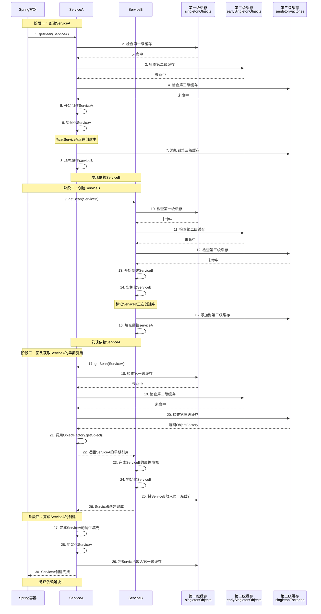

**详细步骤说明**：

1. **容器请求创建 ServiceA**：调用 `getBean("ServiceA")`

2. **第一次检查缓存**：依次检查三级缓存，都未命中

3. **开始创建 ServiceA**：
   - 调用构造函数实例化 ServiceA
   - 将 ServiceA 标记为"正在创建中"
   - **关键**：将 ServiceA 的 ObjectFactory 添加到第三级缓存

4. **填充 ServiceA 的属性**：发现依赖 ServiceB，调用 `getBean("ServiceB")`

5. **容器请求创建 ServiceB**：同样经历检查缓存、实例化的过程

6. **填充 ServiceB 的属性**：发现依赖 ServiceA，再次调用 `getBean("ServiceA")`

7. **第二次检查缓存**：
   - 第一级缓存：没有 ServiceA（还在创建中）
   - 第二级缓存：没有 ServiceA（还没有早期引用）
   - 第三级缓存：**找到了 ServiceA 的 ObjectFactory！**

8. **获取早期引用**：通过 ObjectFactory 获取 ServiceA 的早期引用（此时 ServiceA 还未完全初始化，但已经有实例了）

9. **完成 ServiceB 的创建**：
   - ServiceB 获取到 ServiceA 的早期引用
   - 完成属性填充和初始化
   - 将 ServiceB 从第三级缓存升级到第一级缓存

10. **返回 ServiceA 的创建流程**：
    - ServiceA 获取到 ServiceB 的完整引用
    - 完成 ServiceA 的属性填充和初始化
    - 将 ServiceA 从第三级缓存升级到第一级缓存

11. **循环依赖解决**：两个 Bean 都成功创建完成

### 11.3.4 循环依赖解决流程图

```mermaid
flowchart TB
    subgraph 创建ServiceA["创建 ServiceA"]
        A1["getBean(ServiceA)"] --> A2{"检查第一级缓存"}
        A2 -->|未命中| A3{"检查第二级缓存"}
        A3 -->|未命中| A4{"检查第三级缓存"}
        A4 -->|未命中| A5["实例化ServiceA"]
        A5 --> A6["标记ServiceA正在创建中"]
        A6 --> A7["添加ServiceA到第三级缓存"]
        A7 --> A8["填充serviceB属性"]
        A8 --> A9{"getBean(ServiceB)"}
    end

    subgraph 创建ServiceB["创建 ServiceB"]
        A9 --> B1["getBean(ServiceB)"]
        B1 --> B2{"检查第一级缓存"}
        B2 -->|未命中| B3{"检查第二级缓存"}
        B3 -->|未命中| B4{"检查第三级缓存"}
        B4 -->|未命中| B5["实例化ServiceB"]
        B5 --> B6["标记ServiceB正在创建中"]
        B6 --> B7["添加ServiceB到第三级缓存"]
        B7 --> B8["填充serviceA属性"]
        B8 --> B9{"getBean(ServiceA)"}
    end

    subgraph 获取早期引用["获取 ServiceA 的早期引用"]
        B9 --> C1{"检查第一级缓存"}
        C1 -->|未命中| C2{"检查第二级缓存"}
        C2 -->|未命中| C3{"检查第三级缓存"}
        C3 -->|命中!| C4["获取ObjectFactory"]
        C4 --> C5["调用getObject()获取早期引用"]
        C5 --> C6["放入第二级缓存"]
        C6 --> C7["从第三级缓存移除"]
        C7 --> C8["返回ServiceA早期引用"]
    end

    subgraph 完成ServiceB["完成 ServiceB 创建"]
        C8 --> D1["ServiceB获取到ServiceA引用"]
        D1 --> D2["完成ServiceB属性填充"]
        D2 --> D3["初始化ServiceB"]
        D3 --> D4["ServiceB放入第一级缓存"]
        D4 --> D5["返回ServiceB引用"]
    end

    subgraph 完成ServiceA["完成 ServiceA 创建"]
        D5 --> E1["ServiceA获取到ServiceB引用"]
        E1 --> E2["完成ServiceA属性填充"]
        E2 --> E3["初始化ServiceA"]
        E3 --> E4["ServiceA放入第一级缓存"]
        E4 --> E5["循环依赖解决!"]
    end

    A9 -.->|创建ServiceB| 创建ServiceB
    B9 -.->|获取早期引用| 获取早期引用
    C8 -.->|返回| 完成ServiceB
    D5 -.->|返回| 完成ServiceA
```

---

## 11.4 为什么需要三级缓存

### 11.4.1 灵魂拷问：为什么需要三级缓存？

这是一个经典的面试问题。很多同学可能会问："为什么不能只用二级缓存？或者只用一级缓存？"

要回答这个问题，我们需要从多个角度来分析。

### 11.4.2 代理对象的创建时机

在 Spring AOP 中，Bean 创建完成后，可能需要被替换为代理对象。这个代理对象的创建发生在 `initializeBean()` 阶段的后置处理器 `AbstractAutoProxyCreator` 中。

```java
/**
 * AOP 代理创建的核心逻辑
 * 这个方法决定了Bean是否需要被代理
 */
@Override
public Object postProcessAfterInitialization(Object bean, String beanName) {
    if (bean != null) {
        // 根据beanClass和beanName判断是否需要创建代理
        Object cacheKey = getCacheKey(bean.getClass(), beanName);
        if (this.earlyProxyReferences.remove(cacheKey) != bean) {
            // 如果Bean还在早期引用缓存中，则不再次创建代理
            return wrapIfNecessary(bean, beanName, cacheKey);
        }
    }
    return bean;
}
```

**关键问题**：如果我们在实例化阶段就直接创建代理对象并放入二级缓存，那么当循环依赖发生时，另一个 Bean 获取到的将直接是代理对象，而不是原始对象。但是，代理对象的创建依赖于完整的 Bean 实例（因为需要从实例中提取方法信息等），而循环依赖发生时 Bean 可能还未完全初始化。

### 11.4.3 三级缓存的精妙设计

三级缓存的设计完美地解决了这个问题：

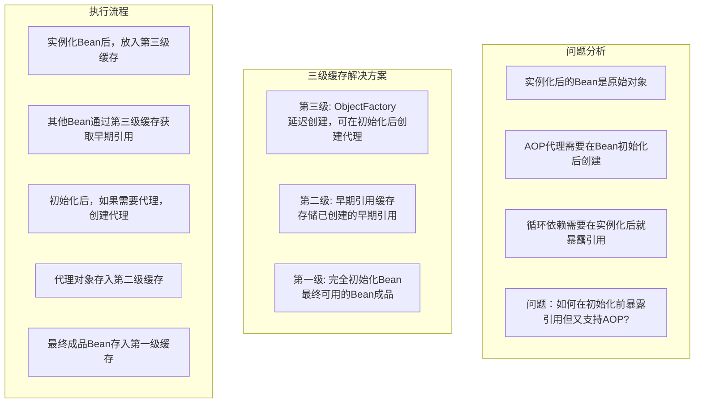

### 11.4.4 二级缓存能否解决问题？

假设只有二级缓存（一级和二级），考虑以下场景：

```java
@Service
public class ServiceA {
    @Autowired
    private ServiceB serviceB;

    public void init() {
        System.out.println("ServiceA init");
    }
}

@Service
public class ServiceB {
    @Autowired
    private ServiceA serviceA;
}
```

**场景分析**：

1. 创建 ServiceA，实例化后放入二级缓存
2. 填充 ServiceA 的属性 serviceB，需要创建 ServiceB
3. 创建 ServiceB，实例化后放入二级缓存
4. 填充 ServiceB 的属性 serviceA，从二级缓存获取 ServiceA
5. ServiceB 初始化完成
6. ServiceA 初始化完成

这个流程看起来二级缓存也能解决问题。但问题出在 **AOP 代理**！

**AOP 场景下的二级缓存问题**：

```java
@Service
public class ServiceA {
    @Autowired
    private ServiceB serviceB;

    public void doSomething() {
        System.out.println("ServiceA doing something");
    }
}

@Service
public class ServiceB {
    @Autowired
    private ServiceA serviceA;

    public void doSomething() {
        serviceA.doSomething();  // 这里调用的是代理对象的方法
    }
}
```

假设 ServiceA 需要被 AOP 代理。如果使用二级缓存：

1. 创建 ServiceA，实例化后放入二级缓存（**原始对象**）
2. 创建 ServiceB，实例化后放入二级缓存（**原始对象**）
3. ServiceB 填充属性时，获取到的是 ServiceA 的**原始对象**
4. ServiceB 初始化完成，ServiceB 需要被代理
5. ServiceA 初始化完成，ServiceA 需要被代理，创建**代理对象**

**问题**：ServiceB 中引用的 ServiceA 仍是原始对象，而非代理对象！这破坏了 AOP 的完整性。

### 11.4.5 三级缓存如何解决 AOP 问题

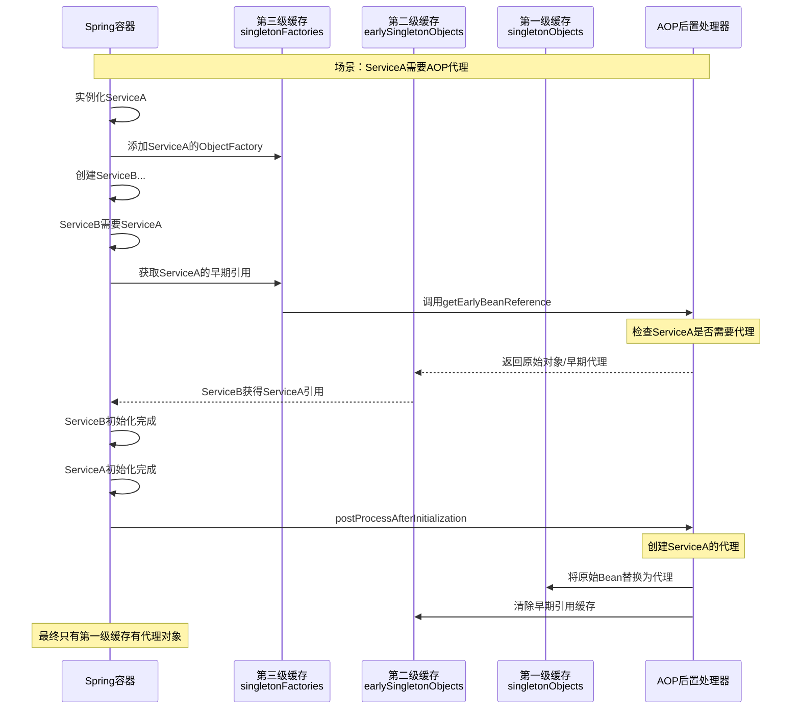

### 11.4.6 三级缓存的性能考虑

虽然三级缓存增加了复杂度，但它带来了以下性能优势：

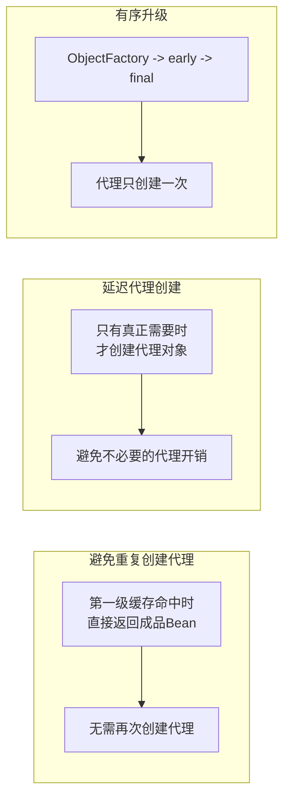

**性能考虑要点**：

1. **延迟创建（Lazy Init）**：第三级缓存存储的是 ObjectFactory，只有在真正需要早期引用时才会调用。这避免了过早创建不需要的代理。

2. **避免重复创建**：一旦 Bean 完成初始化并放入第一级缓存，后续获取直接从第一级缓存返回，不会再次创建。

3. **空间换时间**：虽然多了一个缓存级别，但每个 Bean 只会在缓存中短暂停留，最终都会升级到第一级缓存。

---

## 11.5 【实战】循环依赖问题排查与解决

### 11.5.1 如何在项目中排查循环依赖

当 Spring 容器启动时出现循环依赖问题，Spring 会抛出 `BeanCurrentlyInCreationException` 异常。

**异常信息示例**：

```
Error creating bean with name 'serviceA': Requested bean is currently in creation:
Is there an unresolvable circular reference?
```

**排查步骤**：

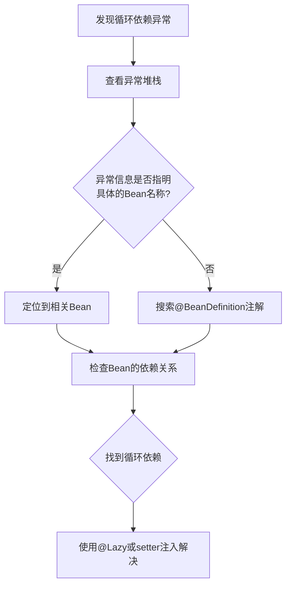

**实战：启用循环依赖检测日志**

```java
// application.properties
logging.level.org.springframework.beans.factory=DEBUG

// 或者在启动类中添加
@SpringBootApplication
public class Application {
    public static void main(String[] args) {
        SpringApplication.run(Application.class, args);
    }
}
```

### 11.5.2 如何在 Spring 启动时尽早发现循环依赖

Spring 默认在启动时就会检测循环依赖，如果我们希望更早发现问题，可以进行如下配置。

**方法一：设置失败快速返回**

```java
@SpringBootApplication
public class Application {
    public static void main(String[] args) {
        ConfigurableApplicationContext context = SpringApplication.run(Application.class, args);
        // 强制立即实例化所有单例Bean，尽早发现问题
        context.getBeanFactory().preInstantiateSingletons();
    }
}
```

**方法二：自定义 BeanFactoryPostProcessor 检测循环依赖**

```java
@Component
public class CircularDependencyDetector implements BeanFactoryPostProcessor {

    @Override
    public void postProcessBeanFactory(ConfigurableListableBeanFactory beanFactory)
            throws BeansException {
        // 遍历所有 BeanDefinition，检查依赖关系
        String[] beanNames = beanFactory.getBeanDefinitionNames();
        for (String beanName : beanNames) {
            BeanDefinition bd = beanFactory.getBeanDefinition(beanName);
            String[] dependsOn = bd.getDependsOn();
            if (dependsOn != null) {
                for (String dep : dependsOn) {
                    System.out.println("Bean '" + beanName + "' depends on '" + dep + "'");
                }
            }
        }
    }
}
```

### 11.5.3 使用 @Lazy 解决循环依赖

`@Lazy` 注解可以延迟 Bean 的加载，当 Spring 容器启动时不会立即创建该 Bean，只有当首次使用时才会创建。这可以有效解决循环依赖问题。

```java
@Service
public class ServiceA {
    private final ServiceB serviceB;

    /**
     * 使用 @Lazy 延迟注入 ServiceB
     * 这样在构造 ServiceA 时不会立即创建 ServiceB
     */
    @Autowired
    public ServiceA(@Lazy ServiceB serviceB) {
        this.serviceB = serviceB;
    }

    public void doSomething() {
        serviceB.doSomething();
    }
}

@Service
public class ServiceB {
    private final ServiceA serviceA;

    @Autowired
    public ServiceB(ServiceA serviceA) {
        this.serviceA = serviceA;
    }

    public void doSomething() {
        serviceA.doSomething();
    }
}
```

**原理说明**：

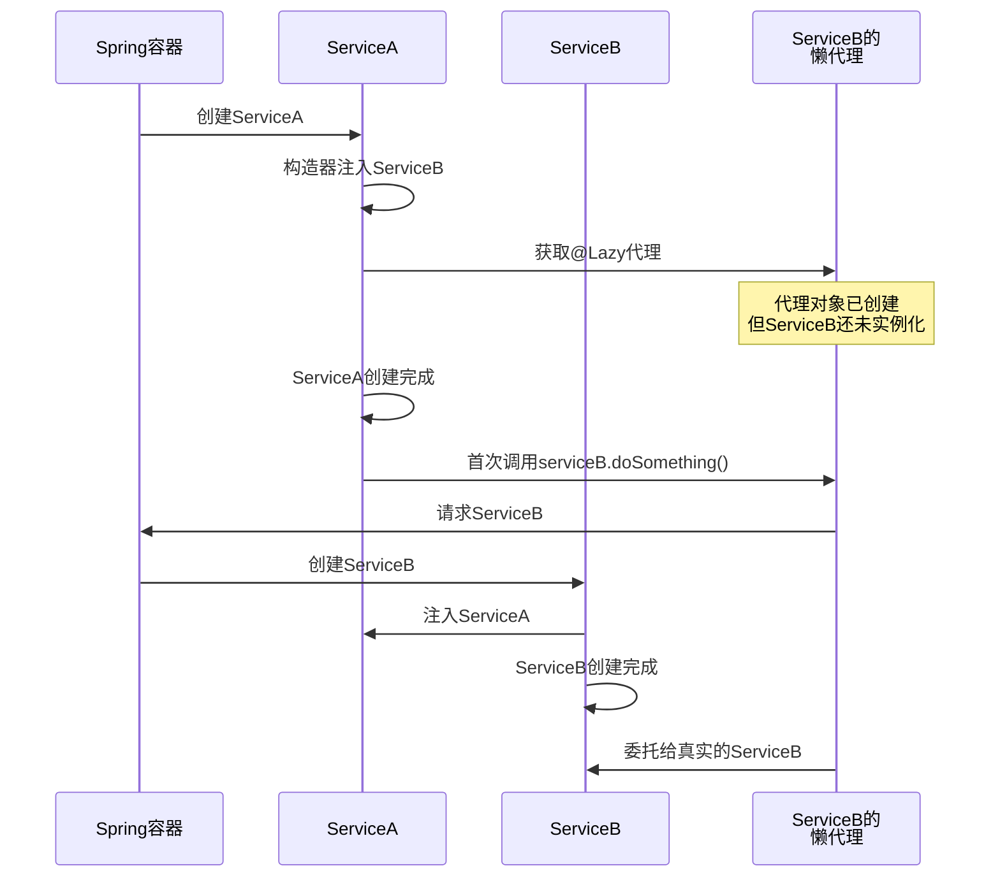

### 11.5.4 使用 setter 注入替代构造器注入

构造器注入会在对象创建时就必须解析所有依赖，而 setter 注入是在对象创建完成后才注入依赖。Spring 的循环依赖解决机制主要依赖于 setter 注入。

```java
/**
 * 构造器注入（可能导致循环依赖问题）
 */
@Service
public class ServiceAConstructor {
    private final ServiceB serviceB;

    @Autowired
    public ServiceAConstructor(ServiceB serviceB) {  // 构造时就需要ServiceB
        this.serviceB = serviceB;
    }
}

/**
 * setter 注入（Spring可以解决）
 */
@Service
public class ServiceASetter {
    private ServiceB serviceB;

    @Autowired
    public void setServiceB(ServiceB serviceB) {  // 构造完成后才注入
        this.serviceB = serviceB;
    }
}
```

**对比图示**：

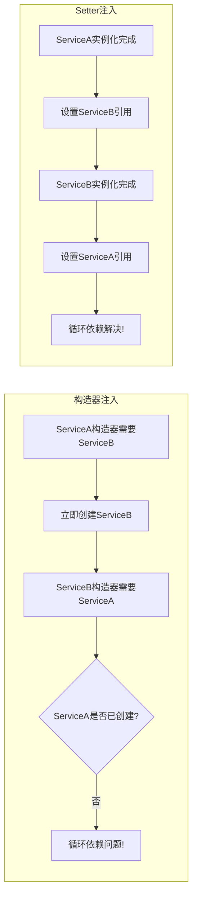

### 11.5.5 重构解决循环依赖

如果代码设计存在循环依赖，更好的方式是通过重构来消除循环依赖，而不是依赖 Spring 的机制。

**方法一：使用中间层**

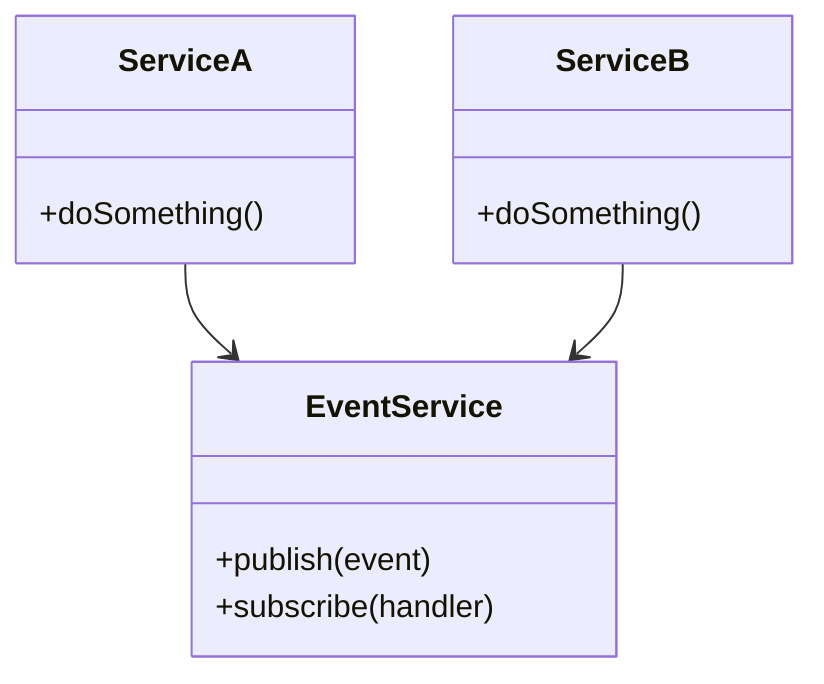

将同步调用改为事件驱动：

```java
@Service
public class ServiceA {
    private final ApplicationEventPublisher eventPublisher;

    @Autowired
    public ServiceA(ApplicationEventPublisher eventPublisher) {
        this.eventPublisher = eventPublisher;
    }

    public void doSomething() {
        // 发布事件，而不是直接调用ServiceB
        eventPublisher.publishEvent(new MyEvent(this));
    }
}

@Service
public class ServiceB {
    @EventListener
    public void handleEvent(MyEvent event) {
        // 处理来自ServiceA的事件
    }
}
```

**方法二：提取共同接口**

```java
/**
 * 提取公共接口
 */
public interface CommonService {
    String getName();
}

/**
 * ServiceA实现
 */
@Service
public class ServiceAImpl implements CommonService {
    @Override
    public String getName() {
        return "ServiceA";
    }
}

/**
 * ServiceB也实现同一接口
 */
@Service
public class ServiceBImpl implements CommonService {
    @Autowired
    private CommonService commonService;  // 注入接口，而不是具体实现

    @Override
    public String getName() {
        return commonService.getName();
    }
}
```

**方法三：使用 @PostConstruct 拆分初始化**

```java
@Service
public class ServiceA {
    @Autowired
    private ServiceB serviceB;

    private String name;

    @PostConstruct
    public void init() {
        // 在init方法中使用serviceB，而不是构造器
        name = serviceB.getConfig();
    }
}

@Service
public class ServiceB {
    private String config = "default";

    public String getConfig() {
        return config;
    }
}
```

### 11.5.6 完整实战代码

以下是一个完整的循环依赖排查与解决的实战项目结构：

```java
// ==================== 项目结构 ====================
// com.example.circulardep
// ├── CircularDepApplication.java
// ├── service
// │   ├── ServiceA.java
// │   ├── ServiceB.java
// │   └── ServiceC.java
// ├── config
// │   └── LazyConfig.java
// └── event
//     ├── MyEvent.java
//     └── EventListenerService.java

// ==================== ServiceA.java ====================
package com.example.circulardep.service;

import org.springframework.beans.factory.annotation.Autowired;
import org.springframework.context.annotation.Lazy;
import org.springframework.stereotype.Service;

/**
 * 演示三种解决循环依赖的方法
 */
@Service
public class ServiceA {

    // 方法一：使用@Lazy解决循环依赖
    private final ServiceB serviceB;

    @Autowired
    public ServiceA(@Lazy ServiceB serviceB) {
        this.serviceB = serviceB;
    }

    public void doSomethingA() {
        System.out.println("ServiceA is doing something");
        serviceB.doSomethingB();
    }

    public String getName() {
        return "ServiceA";
    }
}

// ==================== ServiceB.java ====================
package com.example.circulardep.service;

import org.springframework.beans.factory.annotation.Autowired;
import org.springframework.stereotype.Service;

/**
 * ServiceB使用setter注入，避免构造器循环依赖
 */
@Service
public class ServiceB {

    private ServiceA serviceA;

    // setter注入，而非构造器注入
    @Autowired
    public void setServiceA(ServiceA serviceA) {
        this.serviceA = serviceA;
    }

    public void doSomethingB() {
        System.out.println("ServiceB is doing something");
    }

    public String getConfig() {
        return "config_from_b";
    }
}

// ==================== ServiceC.java ====================
package com.example.circulardep.service;

import org.springframework.stereotype.Service;

/**
 * 演示三方循环依赖的解决
 * 通过重构，将ServiceC改为不直接依赖ServiceA
 */
@Service
public class ServiceC {

    // ServiceC不再直接依赖ServiceA
    // 而是通过事件机制通信

    public void doSomethingC() {
        System.out.println("ServiceC is doing something");
    }
}

// ==================== MyEvent.java ====================
package com.example.circulardep.event;

import org.springframework.context.ApplicationEvent;

/**
 * 自定义事件类，用于解耦
 */
public class MyEvent extends ApplicationEvent {

    private final String message;

    public MyEvent(Object source, String message) {
        super(source);
        this.message = message;
    }

    public String getMessage() {
        return message;
    }
}

// ==================== EventListenerService.java ====================
package com.example.circulardep.event;

import org.springframework.context.event.EventListener;
import org.springframework.stereotype.Service;

/**
 * 事件监听器，解耦循环依赖
 */
@Service
public class EventListenerService {

    @EventListener
    public void handleMyEvent(MyEvent event) {
        System.out.println("Received event: " + event.getMessage());
    }
}

// ==================== CircularDepApplication.java ====================
package com.example.circulardep;

import com.example.circulardep.service.ServiceA;
import org.springframework.boot.CommandLineRunner;
import org.springframework.boot.SpringApplication;
import org.springframework.boot.autoconfigure.SpringBootApplication;
import org.springframework.context.annotation.Bean;
import org.springframework.context.annotation.EnableLoadTimeWeaving;

/**
 * 循环依赖演示应用
 */
@SpringBootApplication
public class CircularDepApplication {

    public static void main(String[] args) {
        SpringApplication.run(CircularDepApplication.class, args);
    }

    @Bean
    public CommandLineRunner runner(ServiceA serviceA) {
        return args -> {
            System.out.println("=== 循环依赖解决演示 ===");
            serviceA.doSomethingA();
        };
    }
}
```

**application.properties 配置**：

```properties
# 启用循环依赖检测
spring.main.allow-circular-references=false

# 日志级别
logging.level.org.springframework.beans.factory=DEBUG
logging.level.org.springframework.beans=DEBUG
```

**运行结果**：

```
=== 循环依赖解决演示 ===
ServiceA is doing something
ServiceB is doing something
```

---

## 本章总结

### 核心知识点回顾

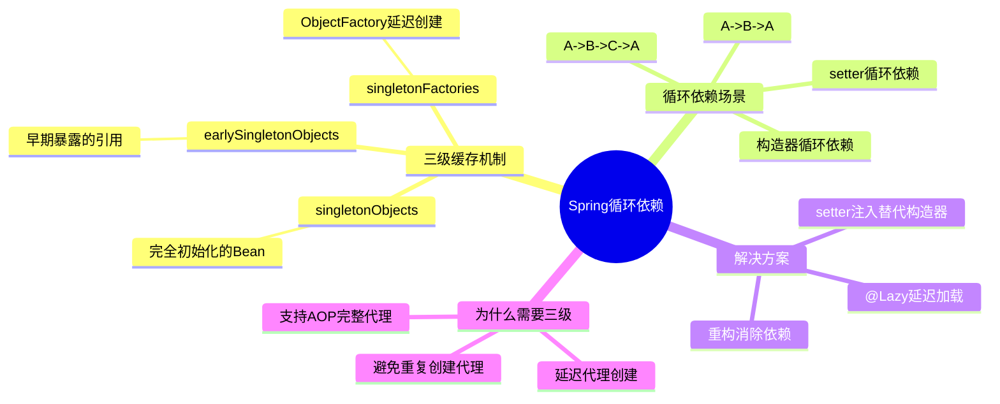

### 面试高频问题

1. **什么是循环依赖？** 回答要点：两个或多个Bean相互依赖形成闭环
2. **Spring三级缓存分别是什么？** 回答要点：一级缓存成品、二级缓存早期引用、三级缓存ObjectFactory
3. **为什么需要三级缓存？** 回答要点：支持AOP代理的延迟创建
4. **构造器循环依赖为什么不能解决？** 回答要点：构造器在实例化时就需要解析依赖
5. **prototype作用域为什么不能解决循环依赖？** 回答要点：prototypeBean不会被缓存

---

## 下一章预告

第12章我们将深入探讨 Spring 核心面试题，涵盖 Bean 生命周期、容器初始化、AOP 原理、事务管理等高频面试知识点，帮助读者全面准备 Spring 相关面试。
