# 第12章 Spring 核心面试题解析

## 章节概述

本章汇总了 Spring 面试中最常见的高频考点，每道面试题都包含详细的解答思路、参考答案和扩展问题。通过本章的学习，读者可以系统性地梳理 Spring 核心知识体系，快速掌握面试要点，提升面试成功率。

---

## 12.1 Spring Bean 生命周期面试题

### 题目

**请阐述 Spring Bean 的完整生命周期**

### 解答思路

1. 首先明确 Spring Bean 生命周期的大阶段：实例化、属性填充、初始化、销毁
2. 详细说明每个阶段涉及的关键方法和扩展点
3. 使用流程图辅助理解
4. 可以结合实际使用场景说明各个扩展点的作用

### 参考答案

Spring Bean 的完整生命周期涉及以下核心阶段：

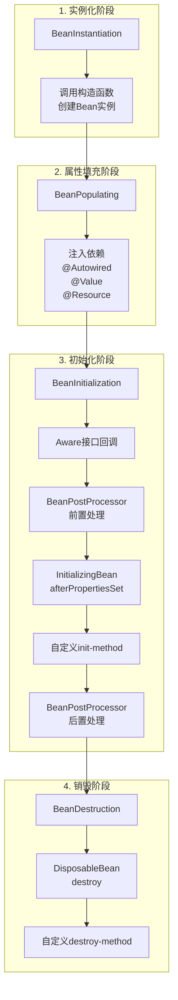

**详细阶段说明**：

#### 阶段一：实例化（Instantiation）

```java
// AbstractAutowireCapableBeanFactory#createBeanInstance()
protected BeanWrapper createBeanInstance(String beanName, RootBeanDefinition mbd,
        Object[] args) {
    // 1. 使用工厂方法创建
    if (mbd.getFactoryMethodName() != null) {
        return instantiateUsingFactoryMethod(beanName, mbd, args);
    }

    // 2. 使用构造函数自动检测创建
    boolean resolved = false;
    boolean autowireNecessary = false;
    if (args == null) {
        synchronized (mbd.constructorArgumentLock) {
            if (mbd.resolvedConstructorOrFactoryMethod != null) {
                resolved = true;
                autowireNecessary = mbd.constructorArgumentsResolved;
            }
        }
    }
    if (resolved) {
        return autowireNecessary ?
                autowireConstructor(beanName, mbd, null, args) :
                instantiateBean(beanName, mbd);
    }

    // 3. 使用构造函数创建
    Constructor<?>[] ctors = determineConstructors(beanName, mbd, args);
    return autowireNecessary ?
            autowireConstructor(beanName, mbd, ctors, args) :
            instantiateBean(beanName, mbd);
}

// 使用CGLIB或构造函数实例化Bean
protected BeanWrapper instantiateBean(String beanName, RootBeanDefinition mbd) {
    Object beanInstance;
    if (System.getSecurityManager() != null) {
        beanInstance = AccessController.doPrivileged(
                (PrivilegedAction<Object>) () ->
                    getInstantiationStrategy().instantiate(mbd, beanName, this),
                getAccessControlContext());
    } else {
        // 调用构造函数创建实例
        beanInstance = getInstantiationStrategy().instantiate(mbd, beanName, this);
    }
    BeanWrapper bw = new BeanWrapperImpl(beanInstance);
    initBeanWrapper(bw);
    return bw;
}
```

#### 阶段二：属性填充（Populate）

```java
// AbstractAutowireCapableBeanFactory#populateBean()
protected void populateBean(String beanName, RootBeanDefinition mbd, BeanWrapper bw) {
    // 1. 处理自动装配（byName/byType）
    if (mbd.getAutowireMode() == RootBeanDefinition.AUTOWIRE_BY_NAME ||
        mbd.getAutowireMode() == RootBeanDefinition.AUTOWIRE_BY_TYPE) {
        MutablePropertyValues pvs = new MutablePropertyValues(mbd.getPropertyValues());
        if (mbd.getAutowireMode() == RootBeanDefinition.AUTOWIRE_BY_NAME) {
            autowireByName(beanName, mbd, bw, pvs);
        }
        if (mbd.getAutowireMode() == RootBeanDefinition.AUTOWIRE_BY_TYPE) {
            autowireByType(beanName, mbd, bw, pvs);
        }
    }

    // 2. 处理PropertyValues（XML配置的property）
    PropertyValues pvs = mbd.getPropertyValues();

    // 3. 应用BeanPostProcessor处理
    for (BeanPostProcessor bp : getBeanPostProcessors()) {
        PropertyValues pvsToUse = bp.postProcessProperties(pvs, bw.getWrappedInstance(), beanName);
        if (pvsToUse == null) {
            return;
        }
        pvs = pvsToUse;
    }

    // 4. 注入PropertyValues到Bean实例
    applyPropertyValues(beanName, mbd, bw, pvs);
}
```

#### 阶段三：初始化（Initialization）

```java
// AbstractAutowireCapableBeanFactory#initializeBean()
protected Object initializeBean(String beanName, Object bean, RootBeanDefinition mbd) {
    // 1. 调用Aware接口
    if (bean instanceof BeanNameAware) {
        ((BeanNameAware) bean).setBeanName(beanName);
    }
    if (bean instanceof BeanClassLoaderAware) {
        ((BeanClassLoaderAware) bean).setBeanClassLoader(getBeanClassLoader());
    }
    if (bean instanceof BeanFactoryAware) {
        ((BeanFactoryAware) bean).setBeanFactory(this);
    }

    // 2. 调用BeanPostProcessor前置处理
    Object wrappedBean = bean;
    if (mbd == null || !mbd.isSynthetic()) {
        wrappedBean = applyBeanPostProcessorsBeforeInitialization(bean, beanName);
    }

    // 3. 调用初始化方法
    invokeInitMethods(beanName, wrappedBean, mbd);

    // 4. 调用BeanPostProcessor后置处理
    if (mbd == null || !mbd.isSynthetic()) {
        wrappedBean = applyBeanPostProcessorsAfterInitialization(wrappedBean, beanName);
    }

    return wrappedBean;
}

protected void invokeInitMethods(String beanName, Object bean, RootBeanDefinition mbd)
        throws Throwable {
    // 1. 调用InitializingBean.afterPropertiesSet()
    boolean isInitializingBean = (bean instanceof InitializingBean);
    if (isInitializingBean && (mbd == null ||
            !mbd.isExternallyManagedInitMethod("afterPropertiesSet"))) {
        ((InitializingBean) bean).afterPropertiesSet();
    }

    // 2. 调用自定义init-method
    if (mbd != null && bean.getClass() != NullBean.class) {
        String initMethodName = mbd.getInitMethodName();
        if (StringUtils.hasLength(initMethodName) &&
            !mbd.isExternallyManagedInitMethod(initMethodName)) {
            invokeCustomInitMethod(beanName, bean, initMethodName);
        }
    }
}
```

#### 阶段四：销毁（Destruction）

```java
// DisposableBeanAdapter#destroy()
public void destroy() {
    // 1. 调用DestructionAwareBeanPostProcessor
    for (DestructionAwareBeanPostProcessor processor : this.beanPostProcessors) {
        processor.postProcessBeforeDestruction(this.bean, this.beanName);
    }

    // 2. 调用DisposableBean.destroy()
    if (this.invokeDisposableBean) {
        ((DisposableBean) bean).destroy();
    }

    // 3. 调用自定义destroy-method
    if (this.destroyMethod != null) {
        invokeCustomDestroyMethod(this.destroyMethod);
    }
}
```

**完整生命周期流程图**：

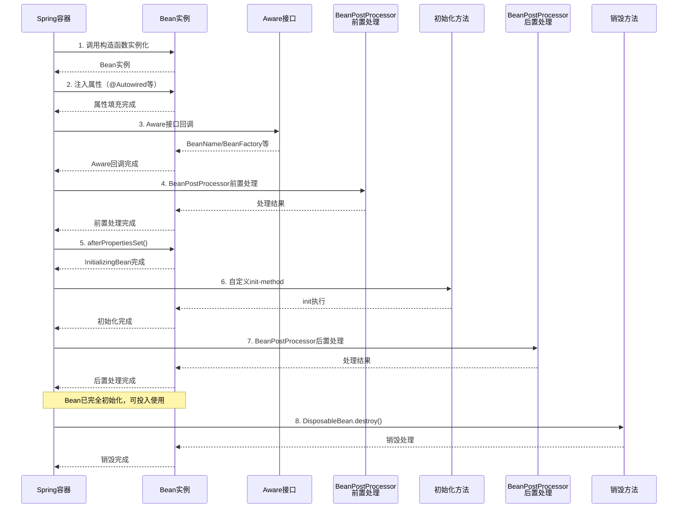

### 扩展问题

**1. BeanPostProcessor 和 InitializingBean 的区别是什么？**

| 特性 | BeanPostProcessor | InitializingBean |
|------|-------------------|------------------|
| 归属 | Spring 容器后置处理器 | Bean 本身的接口 |
| 执行时机 | 所有 Bean 都会执行 | 只有实现该接口的 Bean 才执行 |
| 应用场景 | 框架级别的通用处理，如AOP代理创建 | 业务级别的初始化逻辑 |
| 执行顺序 | 在 InitializingBean 之前执行 | 在自定义 init-method 之前执行 |

**2. @PostConstruct 和 init-method 的执行顺序是什么？**

执行顺序为：`BeanPostProcessor前置处理` -> `@PostConstruct` -> `InitializingBean.afterPropertiesSet()` -> `自定义init-method` -> `BeanPostProcessor后置处理`

---

## 12.2 Spring 容器初始化面试题

### 题目

**Spring 容器启动都做了哪些事情？请描述 refresh() 方法的执行流程**

### 解答思路

1. 明确 refresh() 是 ApplicationContext 的核心初始化方法
2. 按顺序说明每个步骤的作用
3. 重点关注 BeanFactory 的创建和 Bean 的实例化
4. 可以画出完整的流程图

### 参考答案

`refresh()` 方法是 Spring 容器初始化的核心入口，定义在 `AbstractApplicationContext` 中：

```java
// AbstractApplicationContext#refresh()
@Override
public void refresh() throws BeansException, IllegalStateException {
    synchronized (this.startupShutdownMonitor) {
        // 1. 准备刷新上下文环境
        prepareRefresh();

        // 2. 获取BeanFactory（如果是新的则创建）
        ConfigurableListableBeanFactory beanFactory = obtainFreshBeanFactory();

        // 3. 准备BeanFactory（设置类加载器、表达式解析器等）
        prepareBeanFactory(beanFactory);

        try {
            // 4. 后置处理BeanFactory（留给子类扩展）
            postProcessBeanFactory(beanFactory);

            // 5. 调用BeanFactoryPostProcessor
            invokeBeanFactoryPostProcessors(beanFactory);

            // 6. 注册BeanPostProcessor
            registerBeanPostProcessors(beanFactory);

            // 7. 初始化消息源
            initMessageSource(beanFactory);

            // 8. 初始化事件广播器
            initApplicationEventMulticaster();

            // 9. 刷新子类（留给子类扩展）
            onRefresh();

            // 10. 注册监听器
            registerListeners();

            // 11. 初始化所有非懒加载的单例Bean
            finishBeanFactoryInitialization(beanFactory);

            // 12. 完成刷新（发布ContextRefreshedEvent事件）
            finishRefresh();

        } catch (BeansException ex) {
            // 销毁已创建的单例
            destroyBeans();
            // 取消刷新
            cancelRefresh(ex);
            throw ex;
        } finally {
            // 重置反射缓存
            resetCommonCaches();
        }
    }
}
```

**各步骤详解**：

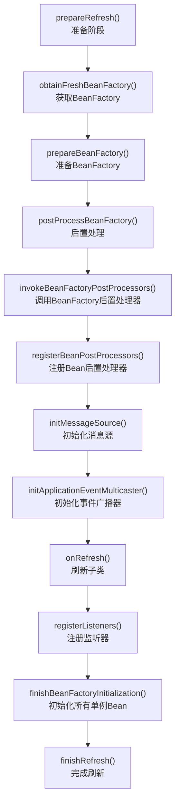

#### 1. prepareRefresh() - 准备阶段

```java
protected void prepareRefresh() {
    // 1. 设置启动时间
    this.startupDate = System.currentTimeMillis();

    // 2. 设置关闭状态为false
    this.closed.set(false);
    this.active.set(true);

    // 3. 初始化PropertySources（留给子类扩展）
    initPropertySources();

    // 4. 验证所有必需的属性
    getEnvironment().validateRequiredProperties();
}
```

#### 2. obtainFreshBeanFactory() - 获取 BeanFactory

```java
protected ConfigurableListableBeanFactory obtainFreshBeanFactory() {
    // 刷新BeanFactory
    refreshBeanFactory();
    // 返回BeanFactory
    return getBeanFactory();
}
```

#### 3. prepareBeanFactory() - 准备 BeanFactory

```java
protected void prepareBeanFactory(ConfigurableListableBeanFactory beanFactory) {
    // 设置类加载器
    beanFactory.setBeanClassLoader(getClassLoader());

    // 设置EL表达式解析器
    beanFactory.setBeanExpressionResolver(new StandardBeanExpressionResolver(beanFactory.getBeanClassLoader()));

    // 添加属性编辑器注册器
    beanFactory.addEmbeddedValueResolver(new StandardEnvironment());

    // 添加BeanPostProcessor：ApplicationContextAwareProcessor
    beanFactory.addBeanPostProcessor(new ApplicationContextAwareProcessor(this));

    // 忽略依赖注入：BeanFactory、ApplicationContext等
    beanFactory.ignoreDependencyInterface(EnvironmentAware.class);
    beanFactory.ignoreDependencyInterface(EmbeddedValueResolverAware.class);
    beanFactory.ignoreDependencyInterface(ResourceLoaderAware.class);
    beanFactory.ignoreDependencyInterface(ApplicationEventPublisherAware.class);
    beanFactory.ignoreDependencyInterface(MessageSourceAware.class);
    beanFactory.ignoreDependencyInterface(ApplicationContextAware.class);

    // 注册可解析的依赖：BeanFactory、ApplicationContext等
    beanFactory.registerResolvableDependency(BeanFactory.class, beanFactory);
    beanFactory.registerResolvableDependency(ResourceLoader.class, this);
    beanFactory.registerResolvableDependency(ApplicationEventPublisher.class, this);
    beanFactory.registerResolvableDependency(ApplicationContext.class, this);
}
```

#### 5. finishBeanFactoryInitialization() - 初始化所有单例 Bean

这是最重要的步骤之一，完成所有非懒加载单例 Bean 的创建：

```java
protected void finishBeanFactoryInitialization(ConfigurableListableBeanFactory beanFactory) {
    // 1. 初始化转换服务
    if (beanFactory.containsBean(CONVERSION_SERVICE_BEAN_NAME) &&
            beanFactory.isTypeMatch(CONVERSION_SERVICE_BEAN_NAME, ConversionService.class)) {
        beanFactory.setConversionService(
                beanFactory.getBean(CONVERSION_SERVICE_BEAN_NAME, ConversionService.class));
    }

    // 2. 添加字符串解析器
    if (!beanFactory.hasEmbeddedValueResolver()) {
        beanFactory.addEmbeddedValueResolver(strVal -> getEnvironment().resolvePlaceholders(strVal));
    }

    // 3. 初始化LoadTimeWeaver
    beanFactory.addBeanPostProcessor(new LoadTimeWeaverAwareProcessor(beanFactory));
    beanFactory.setTempClassLoader(null);

    // 4. 设置freezeConfiguration标志
    beanFactory.freezeConfiguration();

    // 5. 预实例化所有非懒加载的单例Bean
    beanFactory.preInstantiateSingletons();
}
```

### 扩展问题

**BeanFactory 和 ApplicationContext 的区别是什么？**

| 特性 | BeanFactory | ApplicationContext |
|------|-------------|-------------------|
| 初始化 | 懒加载，Bean被请求时才创建 | 启动时预实例化所有单例 |
| 功能 | 基本的IoC容器功能 | 扩展了企业级功能 |
| 自动装配 | 支持 | 支持（额外支持注解自动装配） |
| BeanPostProcessor | 需要手动注册 | 自动检测并注册 |
| 国际化 | 不支持 | 支持 |
| 事件发布 | 不支持 | 支持 |
| AOP | 需要额外配置 | 自动集成 |
| Web 应用 | XmlBeanFactory | ClassPathXmlApplicationContext |

---

## 12.3 Spring AOP 面试题

### 题目

**请描述 Spring AOP 的实现原理，Spring 如何选择使用 JDK 动态代理还是 CGLIB 代理？**

### 解答思路

1. 先说明 AOP 的核心概念：代理模式
2. 详细解释 JDK 动态代理和 CGLIB 的区别
3. 说明 Spring 如何决定使用哪种代理方式
4. 画出示意图帮助理解

### 参考答案

#### AOP 核心概念回顾

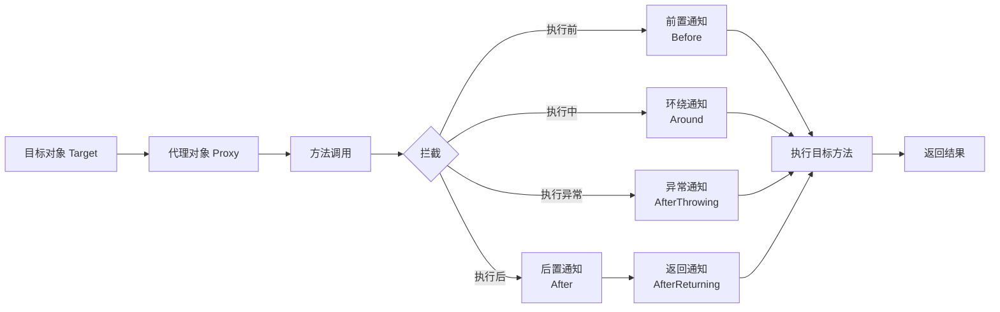

#### JDK 动态代理 vs CGLIB 代理

**JDK 动态代理**：

```java
// JDK 动态代理要求目标类实现接口
public class JdkDynamicProxy implements InvocationHandler {

    private Object target;

    public JdkDynamicProxy(Object target) {
        this.target = target;
    }

    @Override
    public Object invoke(Object proxy, Method method, Object[] args) throws Throwable {
        System.out.println("Before method: " + method.getName());
        Object result = method.invoke(target, args);
        System.out.println("After method: " + method.getName());
        return result;
    }
}

// 创建代理对象
public static void main(String[] args) {
    TargetInterface target = new TargetImpl();
    TargetInterface proxy = (TargetInterface) Proxy.newProxyInstance(
        target.getClass().getClassLoader(),
        target.getClass().getInterfaces(),
        new JdkDynamicProxy(target)
    );
    proxy.doSomething();
}
```

**CGLIB 代理**：

```java
// CGLIB 通过继承目标类创建代理
public class CglibProxy implements MethodInterceptor {

    private Object target;

    public CglibProxy(Object target) {
        this.target = target;
    }

    public Object getProxy() {
        Enhancer enhancer = new Enhancer();
        enhancer.setSuperclass(target.getClass());
        enhancer.setCallback(this);
        return enhancer.create();
    }

    @Override
    public Object intercept(Object obj, Method method, Object[] args,
                            MethodProxy proxy) throws Throwable {
        System.out.println("Before method: " + method.getName());
        Object result = proxy.invokeSuper(obj, args);
        System.out.println("After method: " + method.getName());
        return result;
    }
}

// 创建代理对象
public static void main(String[] args) {
    TargetClass target = new TargetClass();
    TargetClass proxy = (TargetClass) new CglibProxy(target).getProxy();
    proxy.doSomething();
}
```

#### 两种代理方式的对比

| 特性 | JDK 动态代理 | CGLIB 代理 |
|------|-------------|-----------|
| 实现方式 | 实现接口，通过 InvocationHandler | 继承类，通过 MethodInterceptor |
| 原理 | 反射调用目标方法 | 字节码生成，FastClass |
| 性能 | 每次反射调用 | 直接调用，无反射开销 |
| 限制 | 目标类必须实现接口 | 不能代理 final 类/final 方法 |
| 适用场景 | 业务类实现接口的情况 | 业务类没有实现接口的情况 |

#### Spring 如何选择代理方式

```java
// AbstractAutoProxyCreator#createProxy()
protected Object createProxy(Class<?> beanClass, String beanName,
        Object[] specificInterceptors, TargetSource targetSource) {

    ProxyFactory proxyFactory = new ProxyFactory();
    proxyFactory.copyFrom(this);

    // 1. 判断是否使用 JDK 代理
    if (shouldProxyTargetClass(beanClass, beanName)) {
        // 使用 CGLIB 代理
        proxyFactory.setProxyTargetClass(true);
    } else {
        // 使用 JDK 代理
        // 检查接口实现
        Class<?>[] interfaces = beanClass.getInterfaces();
        for (Class<?> ifc : interfaces) {
            proxyFactory.addInterface(ifc);
        }
    }

    // 2. 设置拦截器
    proxyFactory.setTargetSource(targetSource);
    proxyFactory.setAdvisors(advisors);

    // 3. 创建代理
    return proxyFactory.getProxy();
}

// 判断是否使用 CGLIB 的规则
protected boolean shouldProxyTargetClass(Class<?> beanClass, String beanName) {
    // 1. 如果配置了 proxy-target-class="true"，强制使用 CGLIB
    if (this.proxyTargetClass) {
        return true;
    }

    // 2. 如果目标类没有实现接口，使用 CGLIB
    return (beanClass.getInterfaces().length == 0);
}
```

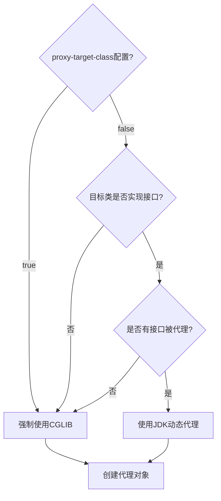

#### Spring AOP 织入（Weaving）时机

Spring AOP 支持三种织入时机：

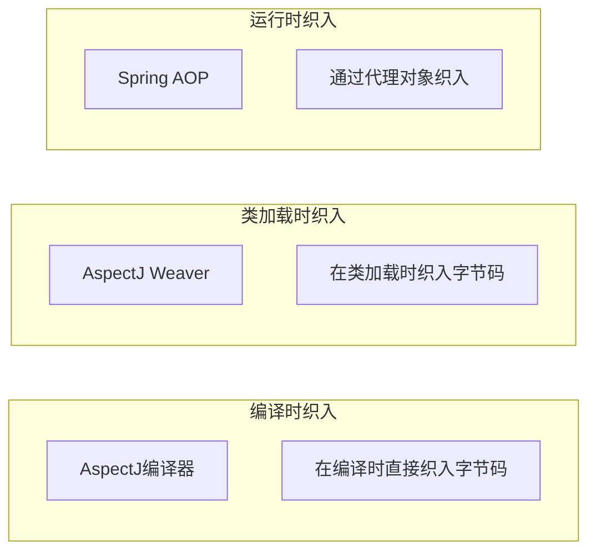

**Spring AOP 的织入流程**：

```java
// JdkDynamicAopProxy 或 CglibAopProxy
// 以 JdkDynamicAopProxy 为例
@Override
public Object invoke(Object proxy, Method method, Object[] args) throws Throwable {
    // 1. 获取方法对应的拦截器链
    List<Object> chain = this.advisorChainFactory.getInterceptorsAndDynamicInterceptionAdvice(
            this, method, targetClass);

    // 2. 如果拦截器链为空，直接调用目标方法
    if (chain.isEmpty()) {
        return method.invoke(target, args);
    }

    // 3. 创建 ReflectiveMethodInvocation 并执行
    ReflectiveMethodInvocation invocation = new ReflectiveMethodInvocation(
            proxy, target, method, args, targetClass, chain);
    return invocation.proceed();
}

// ReflectiveMethodInvocation#proceed()
@Override
public Object proceed() throws Throwable {
    // 从当前索引开始执行拦截器链
    if (this.currentInterceptorIndex < this.interceptors.size() - 1) {
        // 获取下一个拦截器
        MethodInterceptor interceptor = this.interceptors.get(++this.currentInterceptorIndex);
        return interceptor.invoke(this);
    }
    // 所有拦截器都已执行，调用目标方法
    return method.invoke(target, this.arguments);
}
```

### 扩展问题

**1. 什么是切面（Aspect）、连接点（Join Point）、切入点（Pointcut）、通知（Advice）？**

- **切面（Aspect）**：横切关注点的模块化封装，包含通知和切入点
- **连接点（Join Point）**：程序执行的某个位置，Spring AOP 中指方法调用
- **切入点（Pointcut）**：匹配连接点的表达式，决定哪些连接点会被拦截
- **通知（Advice）**：切面在特定切入点执行的动作，包括 @Before、@After、@Around 等

**2. @Around 和 @Before/@After 的区别是什么？**

| 特性 | @Around | @Before/@After |
|------|---------|---------------|
| 控制权 | 完全控制目标方法的执行 | 不能阻止目标方法执行 |
| 参数 | 可以接收 ProceedingJoinPoint | 不能直接修改参数 |
| 返回值 | 必须返回目标方法的返回值 | 自动传递返回值 |
| 异常处理 | 需要自行处理或抛出异常 | 自动处理异常传播 |

---

## 12.4 Spring 事务面试题

### 题目

**@Transactional 注解是如何工作的？哪些场景下事务会失效？**

### 解答思路

1. 解释 @Transactional 的基本原理：基于 AOP 代理
2. 说明事务的传播行为机制
3. 重点分析事务失效的各种场景及其原因
4. 给出代码示例

### 参考答案

#### @Transactional 的工作原理

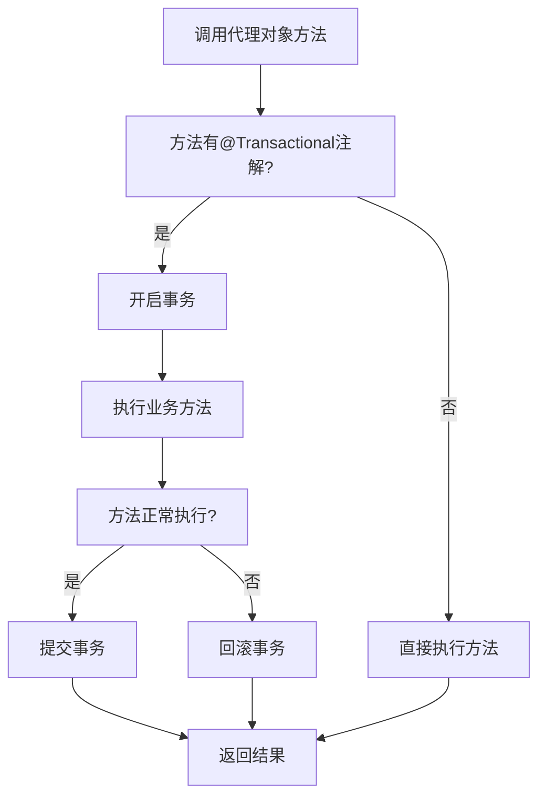

**@Transactional 基于 Spring AOP**，通过 `TransactionInterceptor` 拦截带有 `@Transactional` 注解的方法：

```java
// TransactionInterceptor#invoke()
@Override
public Object invoke(MethodInvocation invocation) throws Throwable {
    // 1. 获取目标类
    Class<?> targetClass = invocation.getThis() != null ?
            AopUtils.getTargetClass(invocation.getThis()) : null;

    // 2. 执行事务增强
    return execute(invocation.getMethod(), targetClass, invocation.getArguments());
}

protected Object execute(Method method, Class<?> targetClass, Object[] args) {
    // 1. 创建事务信息
    TransactionInfo txInfo = createTransactionIfNecessary(
            tm, txAttr, joinpointIdentification);

    Object result = null;
    try {
        // 2. 执行目标方法
        result = invocation.proceed();
    } catch (Throwable ex) {
        // 3. 异常处理：决定是否回滚
        completeTransactionAfterThrowing(txInfo, ex);
        throw ex;
    } finally {
        // 4. 清理事务信息
        cleanupTransactionInfo(txInfo);
    }

    // 5. 提交事务
    commitTransactionAfterReturning(txInfo);
    return result;
}
```

#### 事务传播行为

Spring 定义了 7 种事务传播行为：

```java
public enum Propagation {
    // 如果已存在事务，则在该事务中执行
    REQUIRED,

    // 如果已存在事务，则挂起该事务，创建新事务
    REQUIRES_NEW,

    // 支持当前事务，如果不存在则以非事务方式执行
    SUPPORTS,

    // 支持当前事务，如果不存在则抛出异常
    MANDATORY,

    // 不支持事务，如果已存在事务则挂起
    NOT_SUPPORTED,

    // 不支持事务，如果已存在事务则抛出异常
    NEVER,

    // 嵌套在已存在事务中，作为子事务
    NESTED;
}
```

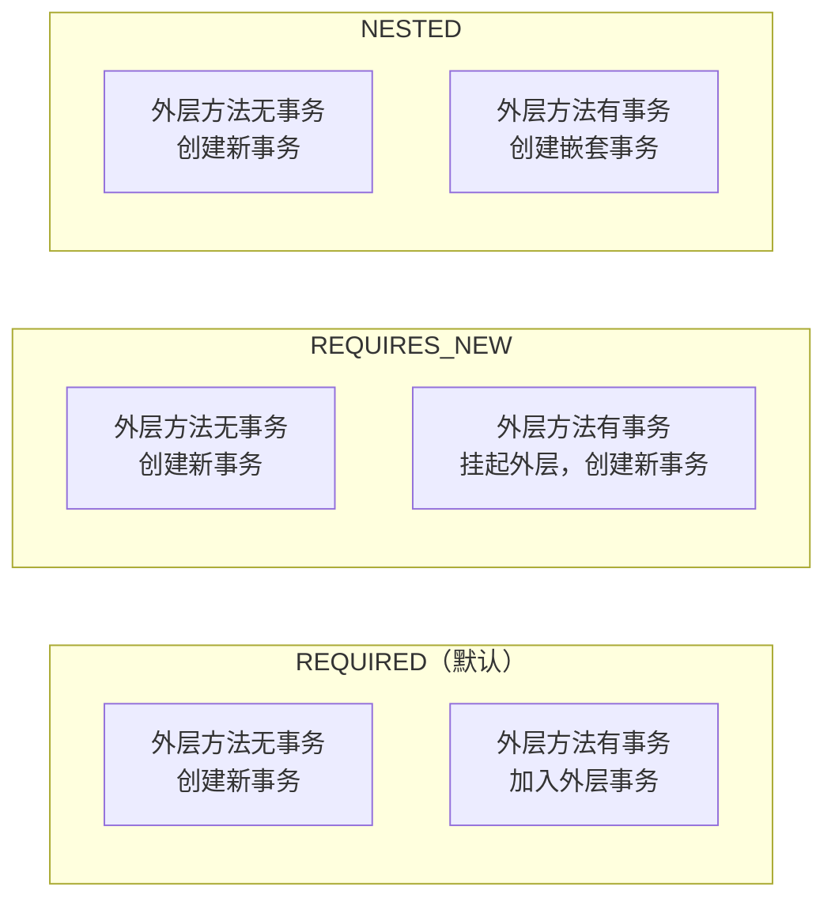

#### 事务失效的场景

**场景一：非 public 方法**

```java
@Service
public class TransactionService {

    // 失效：protected/private 方法上的 @Transactional 不会生效
    @Transactional
    protected void doSomething() {
        // 事务不会生效
    }

    // 有效：public 方法
    @Transactional
    public void doSomethingPublic() {
        // 事务正常生效
    }
}
```

原因：`Spring AOP` 代理的限制，private/protected 方法无法被子类覆盖。

**场景二：自调用（Self-Invocation）**

```java
@Service
public class TransactionService {

    @Transactional
    public void methodA() {
        // 开启事务
        methodB();  // 直接调用，不会走代理
        // 事务不会生效
    }

    @Transactional
    public void methodB() {
        // 不会开启新事务
    }
}
```

原因：同一个类中的方法调用不会经过代理对象，直接调用了目标方法。

解决方案：

```java
@Service
public class TransactionService {

    @Autowired
    private TransactionService self;  // 注入自身代理

    @Transactional
    public void methodA() {
        self.methodB();  // 通过代理调用
    }

    @Transactional
    public void methodB() {
        // 事务正常生效
    }
}
```

**场景三：异常被 catch 吞掉**

```java
@Service
public class TransactionService {

    @Transactional
    public void doSomething() {
        try {
            // 业务逻辑
            doBusiness();
        } catch (Exception e) {
            // 吞掉异常，事务不会回滚
        }
    }
}
```

原因：Spring 事务默认只在抛出 RuntimeException 和 Error 时回滚。

解决方案：

```java
@Transactional(rollbackFor = Exception.class)  // 指定回滚的异常类型
public void doSomething() {
    try {
        doBusiness();
    } catch (Exception e) {
        throw new RuntimeException(e);  // 重新抛出异常
    }
}
```

**场景四：异常类型不匹配**

```java
@Service
public class TransactionService {

    @Transactional
    public void doSomething() {
        try {
            doBusiness();
        } catch (IOException e) {  // IOException 不是 RuntimeException
            // 事务不会回滚
        }
    }
}
```

解决方案：

```java
@Transactional(rollbackFor = IOException.class)  // 指定 IOException 也回滚
public void doSomething() {
    doBusiness();
}
```

**场景五：非事务性的 bean 属性**

```java
@Service
public class TransactionService {

    @Transactional
    public void doSomething() {
        // 手动 new 的对象不在 Spring 容器管理下
        SomeService someService = new SomeService();
        someService.execute();  // 事务不会生效
    }
}
```

**场景六：数据库不支持事务**

如 MySQL 的 MyISAM 引擎不支持事务。

### 扩展问题

**1. 什么是事务的 ACID 特性？**

- **Atomic（原子性）**：事务是最小执行单位，不可分割
- **Consistency（一致性）**：事务执行前后，数据库状态保持一致
- **Isolation（隔离性）**：并发执行的事务互不干扰
- **Durability（持久性）**：事务提交后，其结果永久保存

**2. 事务隔离级别有哪些？**

| 隔离级别 | 脏读 | 不可重复读 | 幻读 |
|---------|------|-----------|------|
| READ_UNCOMMITTED | 可能 | 可能 | 可能 |
| READ_COMMITTED | 不可能 | 可能 | 可能 |
| REPEATABLE_READ | 不可能 | 不可能 | 可能 |
| SERIALIZABLE | 不可能 | 不可能 | 不可能 |

---

## 12.5 Spring 循环依赖面试题

### 题目

**Spring 是如何解决循环依赖的？为什么三级缓存可以解决循环依赖？构造器循环依赖为什么不能解决？**

### 解答思路

1. 首先说明循环依赖的概念和分类
2. 重点讲解 Spring 三级缓存机制
3. 通过源码分析说明解决流程
4. 回答构造器循环依赖不能解决的原因
5. 说明 prototype 作用域不能解决的原因

### 参考答案

#### 循环依赖的分类

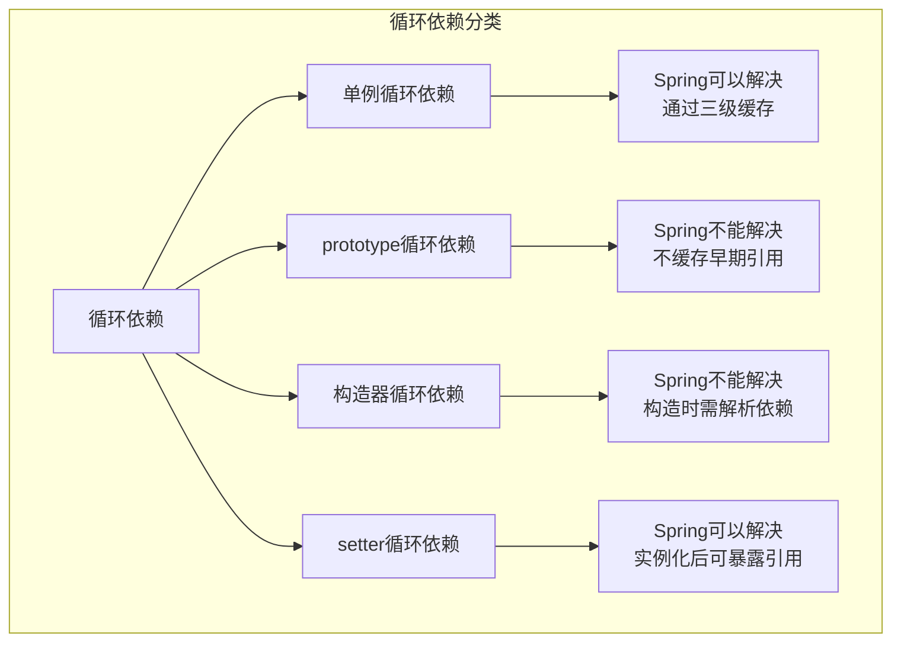

#### Spring 三级缓存详解

```java
// DefaultSingletonBeanRegistry.java
public class DefaultSingletonBeanRegistry extends SimpleAliasRegistry {

    // 第一级缓存：完全成生的Bean
    private final Map<String, Object> singletonObjects = new ConcurrentHashMap<>(256);

    // 第二级缓存：早期暴露的Bean引用
    private final Map<String, Object> earlySingletonObjects = new ConcurrentHashMap<>(16);

    // 第三级缓存：Bean工厂
    private final Map<String, ObjectFactory<?>> singletonFactories = new HashMap<>(16);
}
```

#### 三级缓存解决循环依赖的流程

以 `A -> B -> A` 循环依赖为例：

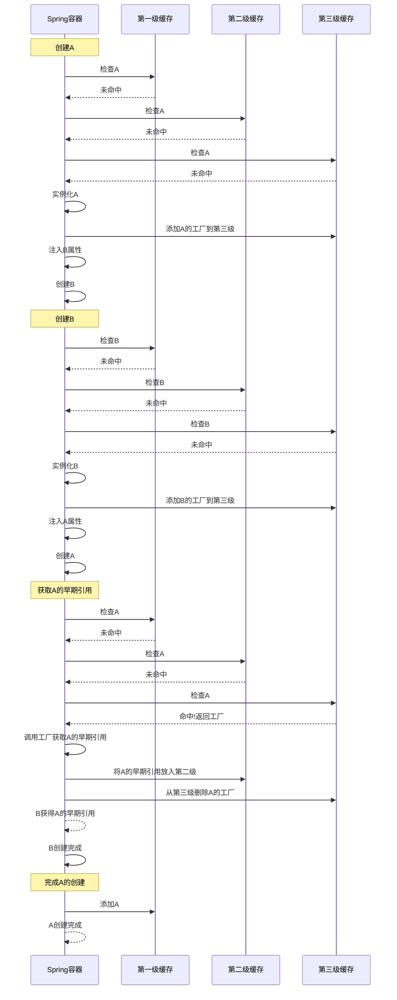

#### 构造器循环依赖为什么不能解决

构造器循环依赖发生在 Bean 实例化阶段，此时 Bean 还未创建完成，无法提前暴露引用。

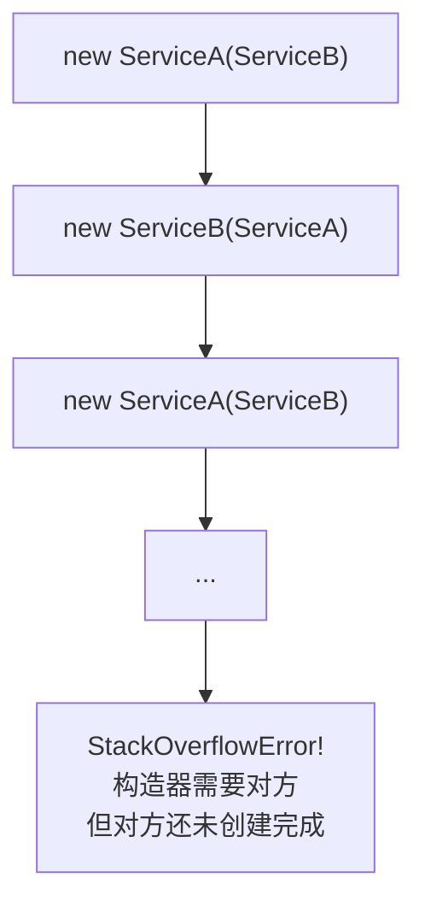

**源码证据**：

```java
// AbstractAutowireCapableBeanFactory#createBeanInstance()
protected BeanWrapper createBeanInstance(String beanName, RootBeanDefinition mbd,
        Object[] args) {
    // 在构造器执行完成之前，Bean实例还不存在
    // 因此无法提前暴露引用
    Constructor<?>[] ctors = determineConstructors(beanName, mbd, args);
    if (ctors != null) {
        // 使用构造器自动装配
        return autowireConstructor(beanName, mbd, ctors, args);
    }
    // 无参构造器
    return instantiateBean(beanName, mbd);
}
```

#### prototype 作用域为什么不能解决循环依赖

prototype Bean 不会被缓存，Spring 容器不会存储其早期引用。

```java
// AbstractBeanFactory#doGetBean()
protected <T> T doGetBean(String name, Class<T> requiredType,
        Object[] args, boolean typeCheckOnly) {

    // prototype Bean 的创建逻辑
    if (mbd.isPrototype()) {
        // 每次都创建新实例，不会缓存
        Object prototypeInstance = createBean(beanName, mbd, args);
        // ...
        return (T) prototypeInstance;
    }
}
```

因此，当创建 prototype Bean 时发现循环依赖，无法从缓存获取早期引用，导致创建失败。

### 扩展问题

**1. 二级缓存能否解决循环依赖？**

理论上二级缓存也可以解决简单的循环依赖，但存在以下问题：

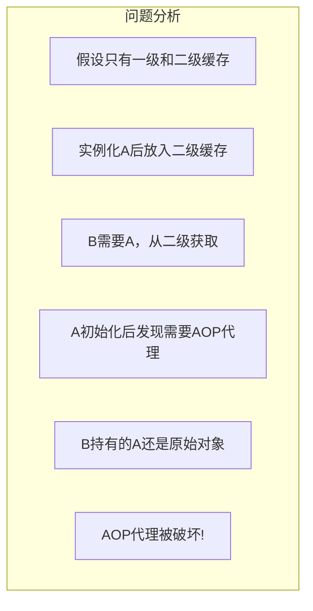

三级缓存通过 ObjectFactory 延迟了代理的创建，确保最终成品 Bean 是代理对象。

**2. @Lazy 注解解决循环依赖的原理是什么？**

@Lazy 会创建目标 Bean 的懒加载代理，在首次使用时才真正创建目标 Bean，从而打破循环。

```java
// 创建懒加载代理
@Service
public class ServiceA {
    @Autowired
    public ServiceA(@Lazy ServiceB serviceB) {
        this.serviceB = serviceB;
    }
}
```

---

## 本章总结

### 面试题速记表

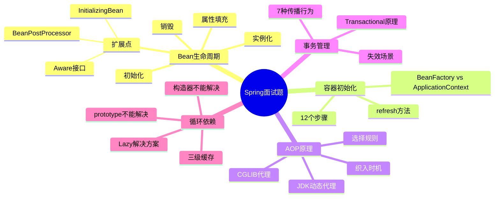

### 面试技巧总结

1. **条理清晰**：使用"第一、第二、第三"或流程图的方式组织答案
2. **深入原理**：不仅要知其然，还要知其所以然
3. **结合源码**：能够指出关键源码位置会加分
4. **实战经验**：适当结合实际项目经验说明

---

## 附录：Spring 核心面试题库

### 附加面试题

**题目1：Spring Bean 是线程安全的吗？**

解答：Spring Bean 默认是单例的，本身不是线程安全的。但如果 Bean 是无状态的（如 Service、DAO），则可以认为是线程安全的。如果 Bean 有可变状态，需要自行保证线程安全。

**题目2：Spring 框架有哪些扩展点？**

主要扩展点包括：
- BeanFactoryPostProcessor：修改 BeanDefinition
- BeanPostProcessor：修改 Bean 实例
- InitializingBean：初始化回调
- DisposableBean：销毁回调
- Aware 接口家族：获取 Spring 容器资源

**题目3：Spring 如何解决 Bean 命名冲突？**

通过 Bean 别名机制：`@Bean("name")` 或 `<bean name="beanName">`

**题目4：FactoryBean 和 BeanFactory 的区别？**

- BeanFactory：Spring 容器的核心接口，负责创建和管理 Bean
- FactoryBean：用于创建复杂 Bean 的工厂 Bean，通过 `&` 前缀获取本身而非产品

---

*本章完*
