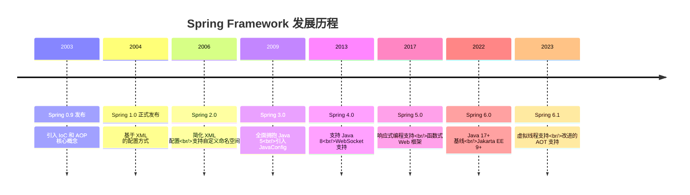
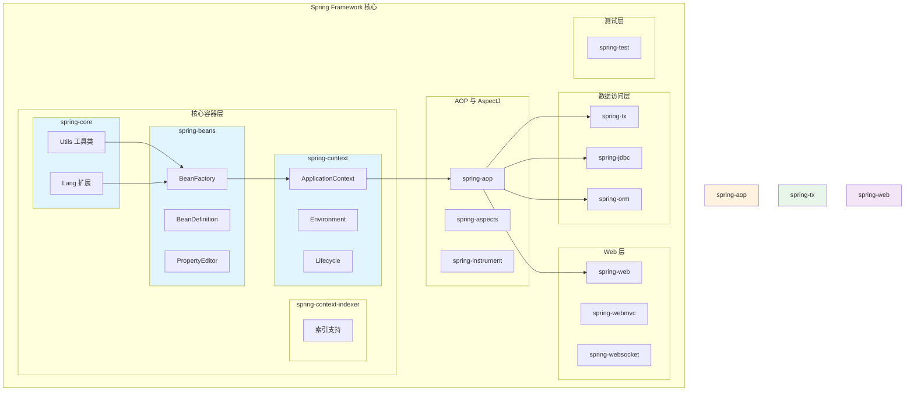
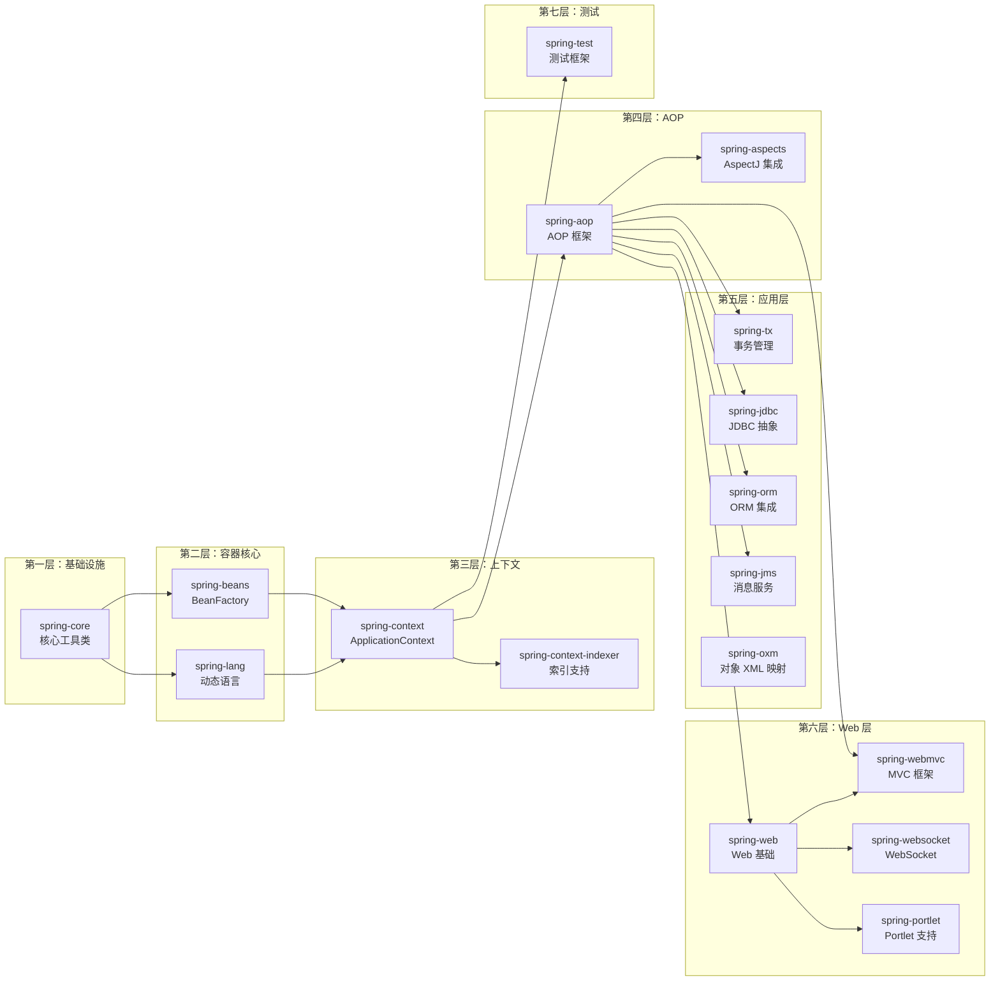
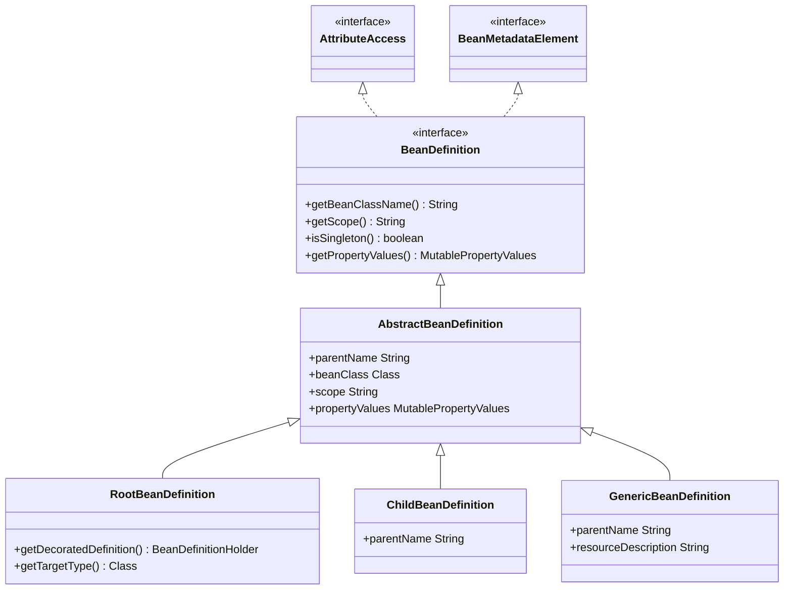
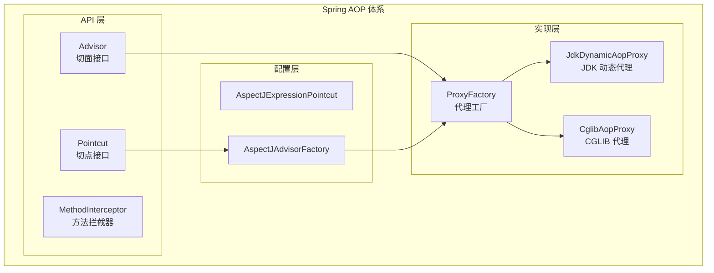
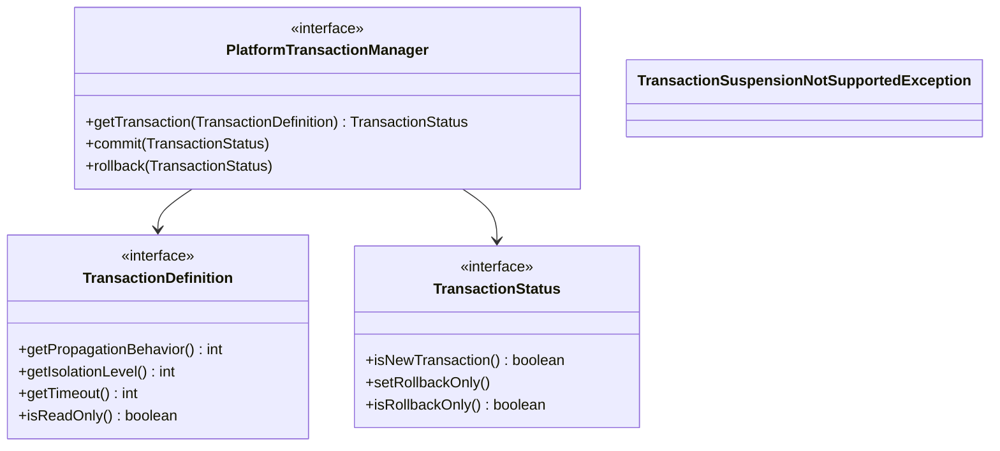
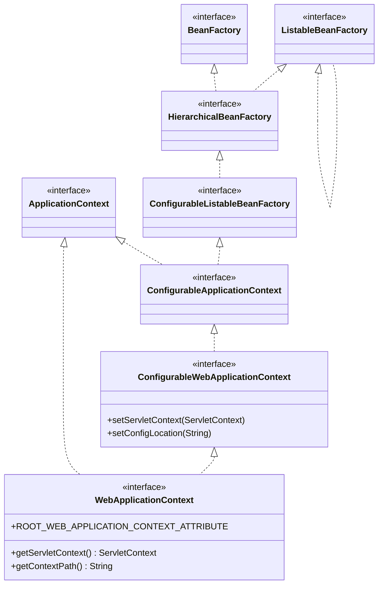
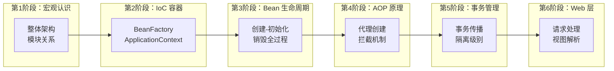

# 第1章 Spring 概述与整体架构

## 1.1 Spring 简介与发展历史

### 1.1.1 Spring 的诞生

Spring 是由 Rod Johnson 在 2002 年提出的。当时 Enterprise JavaBeans (EJB) 是企业级开发的主流标准，但 EJB 存在以下问题：

- **配置复杂**：EJB 需要编写大量的 XML 配置和接口
- **侵入性强**：组件必须继承特定的 EJB 基类
- **测试困难**：EJB 对容器有强依赖，单元测试极为不便
- **资源消耗大**：EJB 容器启动缓慢，占用资源多

Rod Johnson 在其经典著作《Expert One-on-One J2EE Design and Development》中首次提出了 Spring 的核心思想，并在 2003 年发布了 Spring Framework 0.9 版本。

### 1.1.2 Spring 版本演进



| 版本 |  发布年份  | 关键特性 |
|------|-----------|---------|
| 1.x  | 2004-2006 | IoC/DI 容器、XML 配置、AOP 基础功能 |
| 2.x  | 2006-2009 | 简化 XML 配置、自定义命名空间、JDBC 模板 |
| 2.5  | 2007-2009 | 注解驱动开发、ClassPathComponentScan |
| 3.x  | 2010-2013 | JavaConfig、REST 支持、验证框架重构 |
| 4.x  | 2013-2016 | Java 8 支持、WebSocket、消息推送 |
| 5.x  | 2017-2022 | 响应式编程、函数式风格、Kotlin 支持 |
| 6.x  | 2022-至今 | Java 17+、Jakarta EE 9+、AOT 优先 |

### 1.1.3 Spring 在 Java 开发中的地位

Spring 已经成为 Java 企业级开发的事实标准：

```
┌─────────────────────────────────────────────────────────────────┐
│                        Java 应用开发                              │
├─────────────────────────────────────────────────────────────────┤
│                                                                 │
│   ┌───────────┐  ┌───────────┐  ┌───────────┐  ┌───────────┐   │
│   │  Spring   │  │  Spring   │  │  Spring   │  │  Spring   │   │
│   │   Boot    │  │   Cloud   │  │  Security │  │    Data   │   │
│   └───────────┘  └───────────┘  └───────────┘  └───────────┘   │
│                                                                 │
│   ┌─────────────────────────────────────────────────────────┐   │
│   │              Spring Framework (核心)                     │   │
│   │   IoC/AOP  │  Context  │  Core  │  Beans  │  TX  │  WEB │   │
│   └─────────────────────────────────────────────────────────┘   │
│                                                                 │
│   ┌─────────────────────────────────────────────────────────┐   │
│   │                    JVM / Java SE                        │   │
│   └─────────────────────────────────────────────────────────┘   │
│                                                                 │
└─────────────────────────────────────────────────────────────────┘
```

**Spring 的核心价值**：

1. **简化企业开发**：通过 IoC 和 AOP 大幅简化企业级开发
2. **解耦与灵活**：通过依赖注入实现松耦合
3. **一致性强**：提供统一抽象，屏蔽底层差异
4. **生态完善**：涵盖从 Web 到数据访问的完整生态

## 1.2 Spring 整体架构图

### 1.2.1 核心架构概览

Spring Framework 采用模块化设计，核心模块相互独立，各司其职：



### 1.2.2 模块依赖关系图



## 1.3 Spring 核心模块介绍

### 1.3.1 spring-core：核心工具类

`spring-core` 是 Spring 的基础，提供框架所需的核心工具类。

**核心组件**：

```
spring-core/
├── org/springframework/util/
│   ├── StringUtils          # 字符串工具
│   ├── CollectionUtils      # 集合工具
│   ├── ClassUtils           # 类操作工具
│   ├── ReflectionUtils      # 反射工具
│   └── ResourceUtils        # 资源操作工具
├── org/springframework/core/
│   ├── CollectionFactory    # 集合工厂
│   ├── PrioritizedComparator # 优先级比较器
│   └──.annotation/          # 注解工具
└── org/springframework/cglib/
    └── proxy                 # 动态代理支持
```

**关键类解析**：

```java
// org.springframework.util.StringUtils 部分源码
public class StringUtils {

    // 判断字符串是否为空
    public static boolean hasLength(String str) {
        return (str != null && !str.isEmpty());
    }

    // 判断字符串是否有文本
    public static boolean hasText(String str) {
        return (str != null && !str.isBlank());
    }

    // 解析逗号分隔的字符串为数组
    public static String[] commaDelimitedListToStringArray(String str) {
        if (!hasLength(str)) {
            return EMPTY_STRING_ARRAY;
        }
        return String.tokenize(str, ", \t\n\r\f");
    }
}
```

**工具类使用示例**：

```java
public class CoreUtilsDemo {

    public static void main(String[] args) {
        // 字符串工具
        String str = "  hello world  ";
        System.out.println(StringUtils.hasText(str));  // true

        // 集合工具
        List<String> list = null;
        List<String> safeList = CollectionUtils.isEmpty(list) ? new ArrayList<>() : list;

        // 类操作
        Class<?> userClass = User.class;
        String shortClassName = ClassUtils.getShortName(userClass);  // "User"
    }
}
```

### 1.3.2 spring-beans：BeanFactory 和 Bean

`spring-beans` 是 Spring 的 IoC 容器核心，定义了 Bean 的创建和管理机制。

**核心组件**：

```
spring-beans/
├── org/springframework/beans/
│   ├── factory/
│   │   ├── BeanFactory      # Bean 工厂接口
│   │   ├── BeanDefinition   # Bean 定义
│   │   ├── BeanDefinitionReader # 配置文件读取
│   │   ├── config/          # 配置相关接口
│   │   └── support/         # 工厂实现支持
│   ├── property/
│   │   ├── PropertyEditor    # 属性编辑器
│   │   └── PropertyEditorsRegistrar # 编辑器注册
│   └──.annotation/
│       └── @Required, @Autowired 等注解
└── org/springframework/groovy/
    └── bean/                 # Groovy Bean 支持
```

**BeanDefinition 结构**：

```java
// BeanDefinition 接口定义了 Bean 的元信息
public interface BeanDefinition extends AttributeAccess {

    // Bean 的类名
    String getBeanClassName();

    // 作用域
    String getScope();

    // 是否单例
    boolean isSingleton();

    // 是否原型
    boolean isPrototype();

    // 工厂 bean 名称
    String getFactoryBeanName();

    // 工厂方法名
    String getFactoryMethodName();

    // 初始化方法名
    String getInitMethodName();

    // 销毁方法名
    String getDestroyMethodName();

    // 属性值
    MutablePropertyValues getPropertyValues();
}
```

**BeanDefinition 的继承体系**：



### 1.3.3 spring-context：ApplicationContext

`spring-context` 是 Spring 的应用上下文，扩展了 BeanFactory，提供更强大的企业级功能。

**核心组件**：

```
spring-context/
├── org/springframework/context/
│   ├── ApplicationContext  # 应用上下文接口
│   ├── ConfigurableApplicationContext # 可配置上下文接口
│   ├── AbstractApplicationContext # 抽象实现
│   ├── ApplicationContextInitializer # 初始化器
│   ├── ApplicationListener # 事件监听器
│   ├── ApplicationEventPublisher # 事件发布器
│   └── MessageSource # 国际化消息源
├── org/springframework/context/annotation/
│   ├── @Configuration # 配置类
│   ├── @ComponentScan # 组件扫描
│   ├── @Bean # Bean 定义
│   ├── @Profile # 环境配置
│   └── @PropertySource # 属性源
└── org/springframework/context/spel/
    └── ExpressionParser # SPEL 表达式解析
```

**ApplicationContext 核心接口**：

```java
public interface ApplicationContext extends EnvironmentCapable,
        ListableBeanFactory, HierarchicalBeanFactory,
        MessageSource, ApplicationEventPublisher,
        ResourcePatternResolver {

    // 获取应用上下文 ID
    String getId();

    // 获取应用名称
    String getApplicationName();

    // 获取父应用上下文
    ApplicationContext getParent();

    // 获取 BeanFactory
    ConfigurableListableBeanFactory getBeanFactory()
            throws IllegalStateException;
}
```

**ApplicationContext 的额外功能**：

| 功能 | 描述 |
|-----|------|
| 国际化 (i18n) | 提供 MessageSource 支持多语言 |
| 资源加载 | 通过 ResourcePatternResolver 加载各类资源 |
| 事件发布 | 通过 ApplicationEventPublisher 实现观察者模式 |
| 活跃后回调 | 通过 Lifecycle 处理启动停止 |
| 环境抽象 | 通过 Environment 管理系统环境变量和配置文件 |

### 1.3.4 spring-aop：AOP 代理

`spring-aop` 实现了 AOP (Aspect-Oriented Programming) 编程范式，是 Spring 事务管理和声明式服务的基础。

**AOP 核心概念**：

```
┌─────────────────────────────────────────────────────────────┐
│                         AOP 术语                             │
├─────────────────────────────────────────────────────────────┤
│                                                             │
│   Join Point (连接点)                                        │
│   └── 程序执行的某个位置，如方法调用、异常抛出                  │
│                                                             │
│   Pointcut (切点)                                            │
│   └── 匹配连接点的表达式，用于精准定位                        │
│                                                             │
│   Advice (通知/增强)                                         │
│   └── 切点在拦截时要执行的逻辑                               │
│       - Before: 前置通知                                     │
│       - After Returning: 返回后通知                          │
│       - After Throwing: 异常通知                            │
│       - After: 最终通知                                      │
│       - Around: 环绕通知                                     │
│                                                             │
│   Aspect (切面)                                             │
│   └── Pointcut + Advice 的组合                               │
│                                                             │
│   Weaving (织入)                                            │
│   └── 将切面应用到目标对象的过程                             │
│       - 编译时织入 (AspectJ)                                │
│       - 类加载时织入 (AspectJ)                               │
│       - 运行时织入 (Spring AOP - JDK/Dynamic Proxy)         │
│                                                             │
└─────────────────────────────────────────────────────────────┘
```

**Spring AOP 架构图**：



**Spring AOP 与 AspectJ 的关系**：

| 特性 | Spring AOP | AspectJ |
|-----|-----------|---------|
| 织入时机 | 运行时 | 编译时/加载时 |
| 代理方式 | JDK Dynamic Proxy / CGLIB | 字节码修改 |
| 切点表达 | 基于代理拦截 | full AspectJ pointcut |
| 性能 | 略低 (运行时拦截) | 更高 (编译时优化) |
| 功能 | 仅方法级别 | 字段、构造函数等 |

### 1.3.5 spring-tx：事务管理

`spring-tx` 提供了声明式和编程式事务管理能力，是 Spring 事务抽象的核心。

**事务抽象的核心接口**：



**常见事务管理器实现**：

```java
// DataSource 事务管理器
public class DataSourceTransactionManager
        extends AbstractPlatformTransactionManager
        implements ResourceTransactionManager {

    private DataSource dataSource;

    @Override
    protected Object doGetResource(Connection con) {
        // 事务资源管理
    }
}

// JPA 事务管理器
public class JpaTransactionManager
        extends AbstractPlatformTransactionManager
        implements ResourceTransactionManager, EntityManagerFactoryAccessor {

    private EntityManagerFactory entityManagerFactory;
}

// Hibernate 事务管理器
public class HibernateTransactionManager
        extends AbstractPlatformTransactionManager
        implements ResourceTransactionManager {
}
```

### 1.3.6 spring-web：Web 集成

`spring-web` 提供了 Spring 与 Web 容器集成的基础功能。

**核心组件**：

```
spring-web/
├── org/springframework/web/
│   ├── context/
│   │   └── ContextLoader          # 上下文加载器
│   ├── servlet/
│   │   └── DispatcherServlet      # 前端控制器
│   └── multipart/
│       └── MultipartResolver      # 文件上传解析器
└── org/springframework/http/
    ├── converter/                  # HTTP 消息转换器
    └── codec/                      # 编解码器
```

**WebApplicationContext 继承体系**：



## 1.4 学习 Spring 源码的意义与方法

### 1.4.1 为什么要学习 Spring 源码

```
┌─────────────────────────────────────────────────────────────┐
│                    学习 Spring 源码的价值                     │
├─────────────────────────────────────────────────────────────┤
│                                                             │
│  ┌─────────────┐    ┌─────────────┐    ┌─────────────┐    │
│  │  提升架构   │    │  问题排查   │    │  技术成长   │    │
│  │   能力      │    │   能力      │    │             │    │
│  └─────────────┘    └─────────────┘    └─────────────┘    │
│       │                  │                  │               │
│       ▼                  ▼                  ▼               │
│  ┌─────────────┐    ┌─────────────┐    ┌─────────────┐    │
│  │  设计模式   │    │  快速定位   │    │  理解底层   │    │
│  │  实践应用   │    │  框架问题   │    │  运行机制   │    │
│  └─────────────┘    └─────────────┘    └─────────────┘    │
│                                                             │
│  ┌─────────────┐    ┌─────────────┐    ┌─────────────┐    │
│  │  面试突击   │    │  源码贡献   │    │  框架定制   │    │
│  │             │    │             │    │   开发      │    │
│  └─────────────┘    └─────────────┘    └─────────────┘    │
│       │                  │                  │               │
│       ▼                  ▼                  ▼               │
│  ┌─────────────┐    ┌─────────────┐    ┌─────────────┐    │
│  │  大厂必考   │    │  参与开源   │    │  深度定制   │    │
│  │  源码理解   │    │  项目开发   │    │  框架能力   │    │
│  └─────────────┘    └─────────────┘    └─────────────┘    │
│                                                             │
└─────────────────────────────────────────────────────────────┘
```

**Spring 源码中的设计模式**：

| 设计模式 | 应用场景 |
|---------|---------|
| 单例模式 | Bean 默认作用域 |
| 工厂模式 | BeanFactory |
| 策略模式 | AOP 代理创建 |
| 模板方法 | JdbcTemplate, RestTemplate |
| 观察者模式 | 事件监听机制 |
| 装饰器模式 | HttpServletRequestWrapper |
| 代理模式 | AOP 实现 |
| 责任链模式 | HandlerInterceptor |

### 1.4.2 如何高效学习 Spring 源码

**学习路径规划**：



**推荐的学习方法**：

1. **从入口开始**：从 `ClassPathXmlApplicationContext` 或 `AnnotationConfigApplicationContext` 开始
2. **画图辅助**：用类图、时序图记录理解
3. **断点调试**：在关键方法设置断点，观察调用栈
4. **动手实现**：自己实现简化版 IoC，加深理解
5. **输出分享**：通过博客或笔记输出，加深理解

### 1.4.3 推荐的调试方法

**环境准备**：

```
1. IDE: IntelliJ IDEA (推荐) 或 Eclipse
2. JDK: 17+ (Spring 6.x 要求)
3. 构建工具: Gradle (已有构建配置)
4. Spring 源码: 从 GitHub 克隆
```

**断点调试技巧**：

```java
// 1. 在 Bean 创建关键路径设置断点
// AbstractBeanFactory#getBean()
// AbstractAutowireCapableBeanFactory#createBean()

// 2. 在 Bean 初始化路径设置断点
// BeanWrapper#setWrappedInstance()
// BeanFactory#initializeBean()

// 3. 在循环依赖检测路径设置断点
// DefaultSingletonBeanRegistry#getSingleton()
```

**核心调试类**：

| 类名 | 调试目的 |
|-----|---------|
| `DefaultListableBeanFactory` | Bean 注册与获取 |
| `AbstractBeanFactory` | Bean 创建流程 |
| `AbstractAutowireCapableBeanFactory` | 自动装配流程 |
| `CglibSubclassingInstantiateStrategy` | CGLIB 代理创建 |
| `JdkDynamicAopProxy` | JDK 动态代理创建 |
| `DataSourceTransactionManager` | 事务管理流程 |

### 1.4.4 源码阅读工具配置

**IDEA 快捷键**：

| 快捷键 | 功能 |
|-------|------|
| `Ctrl + B` | 跳转到定义 |
| `Ctrl + Alt + B` | 跳转到实现 |
| `Ctrl + Shift + B` | 跳转到类型声明 |
| `Alt + F7` | 查找所有引用 |
| `Ctrl + H` | 查看类层次结构 |
| `Ctrl + F12` | 查看文件结构 |

**推荐插件**：

- **SequenceDiagram**：生成方法调用时序图
- **ASM Bytecode Viewer**：查看字节码
- **Grep Console**：高亮日志输出

---

## 本章小结

本章介绍了 Spring Framework 的概述与整体架构：

1. **Spring 发展历史**：从 2003 年的 0.9 版本到如今的 6.x，Spring 已经成为 Java 企业级开发的事实标准
2. **整体架构**：Spring 采用模块化设计，核心模块包括 spring-core、spring-beans、spring-context、spring-aop、spring-tx、spring-web
3. **核心模块**：
   - spring-core 提供基础工具类
   - spring-beans 实现了 IoC 容器核心
   - spring-context 扩展了应用上下文
   - spring-aop 提供了面向切面编程能力
   - spring-tx 管理事务
   - spring-web 集成 Web 功能
4. **学习源码的方法**：从入口开始、画图辅助、断点调试、动手实现

下一章我们将深入学习 Spring IoC 容器与 BeanFactory 的核心原理。
