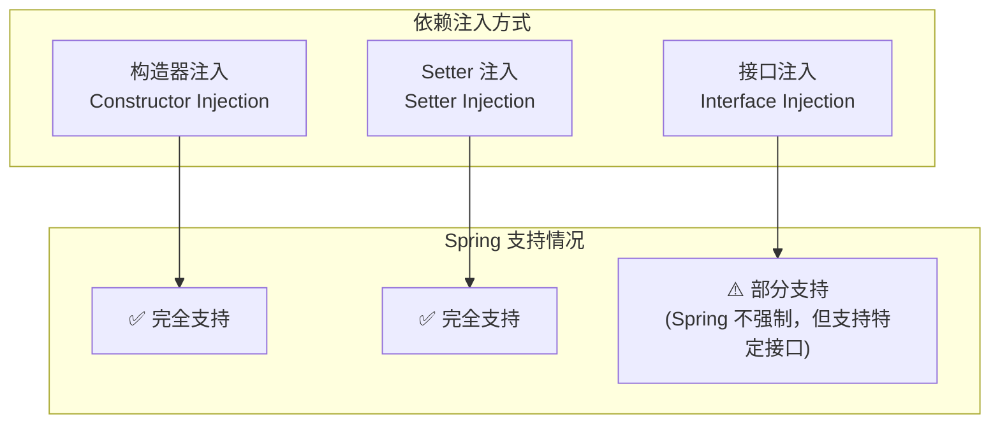
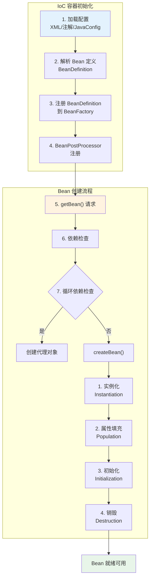
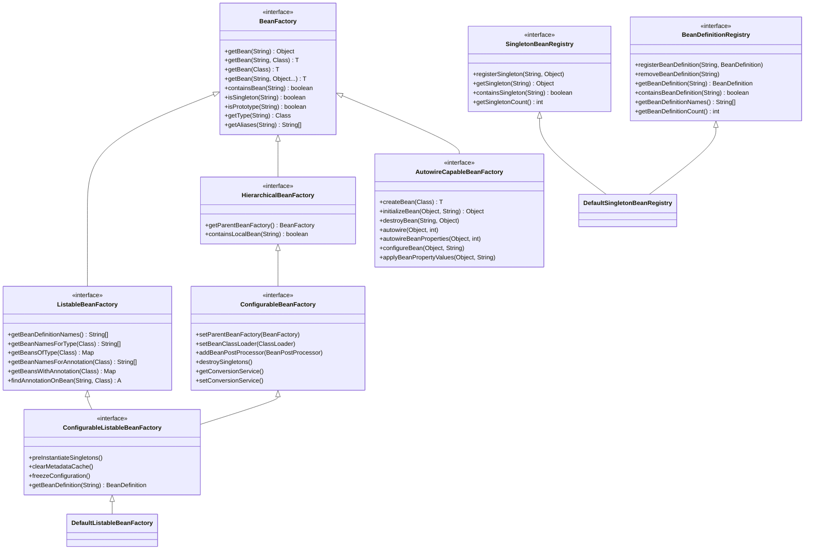
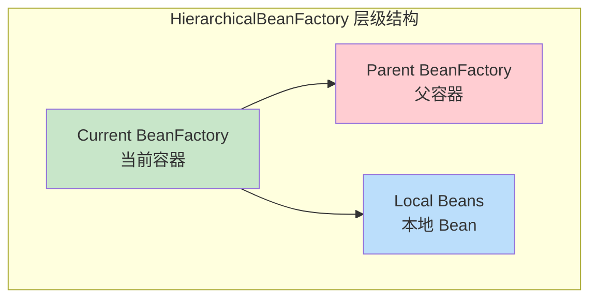
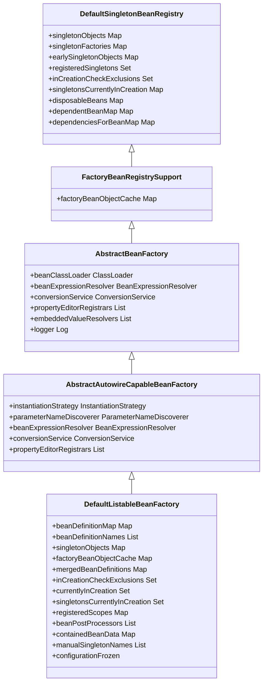
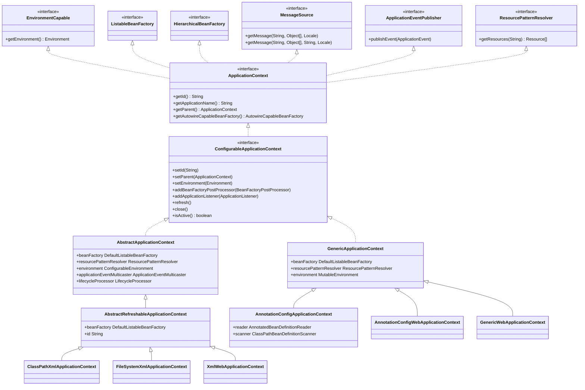
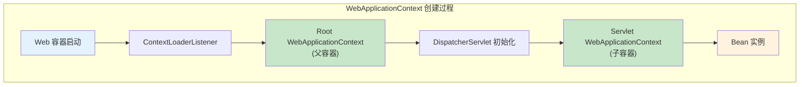
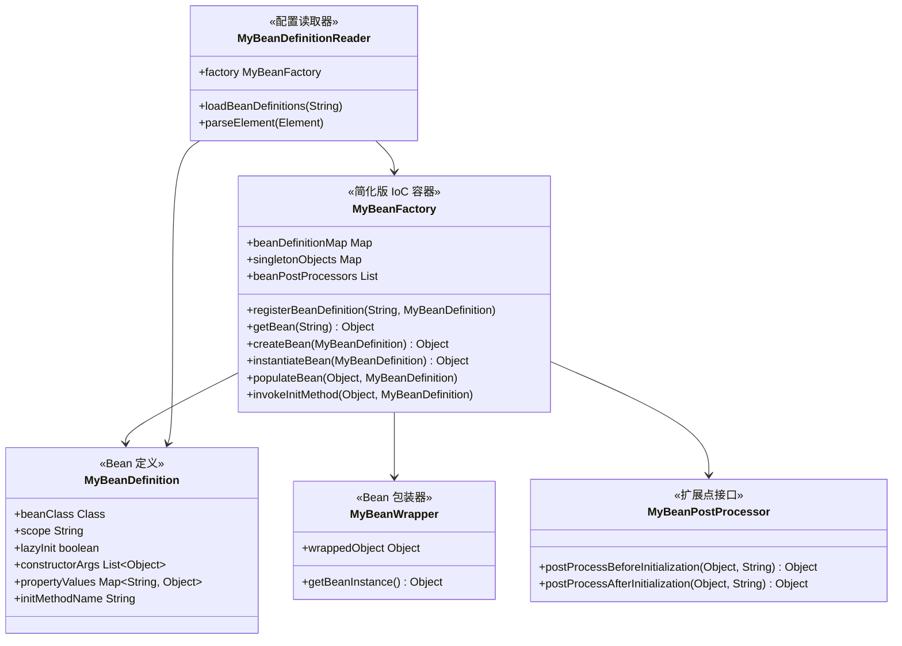

# 第2章 IoC 容器与 BeanFactory

## 2.1 什么是 IoC/DI

### 2.1.1 控制反转的思想

**传统开发方式 vs IoC 方式**：

```
┌─────────────────────────────────────────────────────────────────────┐
│                    传统开发方式（主动创建依赖）                         │
├─────────────────────────────────────────────────────────────────────┤
│                                                                     │
│   public class UserService {                                        │
│       private UserDAO userDAO = new UserDAOImpl();  // 主动创建      │
│                                                                     │
│       public void save(User user) {                                 │
│           userDAO.save(user);  // 直接调用                           │
│       }                                                             │
│   }                                                                 │
│                                                                     │
│   问题：                                                             │
│   1. UserService 和 UserDAOImpl 强耦合                              │
│   2. 如果要换成 UserDAOImplV2，需要修改源代码                         │
│   3. 单元测试困难，无法 mock UserDAO                                 │
│                                                                     │
└─────────────────────────────────────────────────────────────────────┘

┌─────────────────────────────────────────────────────────────────────┐
│                    IoC 开发方式（被动接收依赖）                        │
├─────────────────────────────────────────────────────────────────────┤
│                                                                     │
│   public class UserService {                                        │
│       private UserDAO userDAO;  // 不负责创建，由外部注入             │
│                                                                     │
│       // 通过构造器或 setter 接收依赖                                 │
│       public UserService(UserDAO userDAO) {                         │
│           this.userDAO = userDAO;                                   │
│       }                                                             │
│                                                                     │
│       public void save(User user) {                                 │
│           userDAO.save(user);                                       │
│       }                                                             │
│   }                                                                 │
│                                                                     │
│   优点：                                                             │
│   1. UserService 不关心 UserDAO 的实现细节                          │
│   2. 可以轻松替换实现类（V1/V2/V3）                                  │
│   3. 便于单元测试，可以注入 mock 对象                                 │
│                                                                     │
└─────────────────────────────────────────────────────────────────────┘
```

**IoC 核心理念**：

```
┌─────────────────────────────────────────────────────────────────────┐
│                         控制反转 (IoC)                               │
├─────────────────────────────────────────────────────────────────────┤
│                                                                     │
│      ┌─────────────────────────────────────────────────────┐        │
│      │                    传统方式                          │        │
│      │                                                     │        │
│      │   应用代码 ──────► 控制权 ──────► 依赖对象           │        │
│      │                    (主动创建)                        │        │
│      └─────────────────────────────────────────────────────┘        │
│                                                                     │
│      ┌─────────────────────────────────────────────────────┐        │
│      │                    IoC 方式                          │        │
│      │                                                     │        │
│      │   应用代码 ◄────── 控制权 ◄───────  IoC 容器        │        │
│      │                   (被动注入)                         │        │
│      └─────────────────────────────────────────────────────┘        │
│                                                                     │
│   "控制反转" 指的是：                                                │
│   - 传统方式：应用代码主动创建依赖对象                                │
│   - IoC 方式：应用代码被动接收依赖对象，控制权反转给容器              │
│                                                                     │
└─────────────────────────────────────────────────────────────────────┘
```

### 2.1.2 依赖注入的三种方式

Spring 支持三种依赖注入方式：



#### 2.1.2.1 构造器注入 (Constructor Injection)

**原理**：通过构造函数传入依赖，Spring 调用构造器创建 Bean 时自动注入。

**示例代码**：

```java
// 定义服务接口
public interface UserService {
    void save(User user);
    User findById(Long id);
}

// 实现类
public class UserServiceImpl implements UserService {

    private final UserDAO userDAO;
    private final String name;

    // 构造器注入（推荐）
    public UserServiceImpl(UserDAO userDAO, String name) {
        this.userDAO = userDAO;
        this.name = name;
    }

    @Override
    public void save(User user) {
        userDAO.save(user);
    }

    @Override
    public User findById(Long id) {
        return userDAO.findById(id);
    }
}
```

**XML 配置**：

```xml
<bean id="userService" class="com.example.UserServiceImpl">
    <!-- 构造器注入 -->
    <constructor-arg ref="userDAO"/>
    <constructor-arg value="MyService"/>
</bean>

<bean id="userDAO" class="com.example.UserDAOImpl"/>
```

**注解配置**：

```java
@Component
public class UserServiceImpl implements UserService {

    private final UserDAO userDAO;

    // 构造器注入，使用 @Autowired 标注构造器
    @Autowired
    public UserServiceImpl(UserDAO userDAO) {
        this.userDAO = userDAO;
    }
}
```

**构造器注入的优点**：

```
┌────────────────────────────────────┐
│          构造器注入优点              │
├────────────────────────────────────┤
│                                    │
│  ✅ 依赖不可变：final 字段          │
│  ✅ 强制要求：必须提供所有依赖       │
│  ✅ 完全初始化：对象创建即完全就绪   │
│  ✅ 线程安全：无需同步              │
│  ✅ 易于测试：明确看到依赖关系       │
│                                    │
└────────────────────────────────────┘
```

#### 2.1.2.2 Setter 注入 (Setter Injection)

**原理**：通过 setter 方法传入依赖，Spring 先创建 Bean，然后调用 setter 方法注入。

**示例代码**：

```java
public class UserServiceImpl implements UserService {

    private UserDAO userDAO;
    private String name;

    // setter 方法
    public void setUserDAO(UserDAO userDAO) {
        this.userDAO = userDAO;
    }

    public void setName(String name) {
        this.name = name;
    }

    @Override
    public void save(User user) {
        userDAO.save(user);
    }
}
```

**XML 配置**：

```xml
<bean id="userService" class="com.example.UserServiceImpl">
    <!-- setter 注入 -->
    <property name="userDAO" ref="userDAO"/>
    <property name="name" value="MyService"/>
</bean>
```

**注解配置**：

```java
@Component
public class UserServiceImpl implements UserService {

    private UserDAO userDAO;

    // setter 注入
    @Autowired
    public void setUserDAO(UserDAO userDAO) {
        this.userDAO = userDAO;
    }
}
```

**Setter 注入的适用场景**：

```
┌────────────────────────────────────┐
│         Setter 注入适用场景          │
├────────────────────────────────────┤
│                                    │
│  ✅ 可选依赖（非必须）              │
│  ✅ 可能有循环依赖（A构造←→B构造）  │
│  ✅ 需要运行时重新配置              │
│  ✅ 配置化属性（外部配置）          │
│                                    │
└────────────────────────────────────┘
```

#### 2.1.2.3 接口注入 (Interface Injection)

**原理**：通过特定接口的方法注入依赖。Spring 本身不太使用这种方式，但 Spring 的 `BeanFactoryAware`、`ApplicationContextAware` 等接口采用了类似思想。

**示例**：

```java
// 定义注入接口
public interface Injectable {
    void inject(Object dependency);
}

// 实现类实现注入接口
public class UserServiceImpl implements UserService, Injectable {

    private UserDAO userDAO;

    @Override
    public void inject(Object dependency) {
        if (dependency instanceof UserDAO) {
            this.userDAO = (UserDAO) dependency;
        }
    }
}
```

**Spring 中的接口注入示例**：

```java
// 实现 ApplicationContextAware 接口获取 ApplicationContext
public class SpringContextUtil implements ApplicationContextAware {

    private static ApplicationContext applicationContext;

    @Override
    public void setApplicationContext(ApplicationContext context) {
        applicationContext = context;
    }

    public static ApplicationContext getApplicationContext() {
        return applicationContext;
    }
}
```

**三种注入方式对比**：

| 特性 | 构造器注入 | Setter 注入 | 接口注入 |
|-----|----------|------------|---------|
| 依赖时机 | 创建时 | 创建后 | 创建后 |
| 可选依赖 | 不支持 | 支持 | 支持 |
| 可变依赖 | 不支持 | 支持 | 支持 |
| 可测试性 | 高 | 中 | 低 |
| 可发现性 | 高 | 中 | 低 |
| 循环依赖 | 不支持 | 支持 | 支持 |
| Spring 推荐度 | ⭐⭐⭐⭐⭐ | ⭐⭐⭐⭐ | ⭐⭐ |

### 2.1.3 IoC 容器的工作流程



## 2.2 BeanFactory 接口体系

### 2.2.1 BeanFactory 继承体系图



### 2.2.2 BeanFactory 接口的核心方法

**BeanFactory 源码**：

```java
// org.springframework.beans.factory.BeanFactory
public interface BeanFactory {

    // 工厂 Bean 前缀
    String FACTORY_BEAN_PREFIX = "&";

    // 获取 Bean 实例
    Object getBean(String name) throws BeansException;

    // 获取指定类型的 Bean
    <T> T getBean(String name, Class<T> requiredType) throws BeansException;

    // 获取指定类型的 Bean（多版本）
    <T> T getBean(Class<T> requiredType) throws BeansException;

    // 获取带构造参数的 Bean
    <T> T getBean(String name, Object... args) throws BeansException;

    // 检查是否包含 Bean
    boolean containsBean(String name);

    // 检查 Bean 是否单例
    boolean isSingleton(String name) throws NoSuchBeanDefinitionException;

    // 检查 Bean 是否原型
    boolean isPrototype(String name) throws NoSuchBeanDefinitionException;

    // 检查类型匹配
    boolean isTypeMatch(String name, ResolvableType typeToMatch)
            throws NoSuchBeanDefinitionException;

    // 获取 Bean 类型
    Class<?> getType(String name) throws NoSuchBeanDefinitionException;

    // 获取 Bean 别名
    String[] getAliases(String name);
}
```

### 2.2.3 层级关系详解

#### BeanFactory → HierarchicalBeanFactory



**源码分析**：

```java
// HierarchicalBeanFactory 扩展了 BeanFactory
public interface HierarchicalBeanFactory extends BeanFactory {

    // 获取父容器
    BeanFactory getParentBeanFactory();

    // 检查本地是否包含此 Bean（不查询父容器）
    boolean containsLocalBean(String name);
}
```

#### ConfigurableBeanFactory

```java
public interface ConfigurableBeanFactory extends HierarchicalBeanFactory, SingletonBeanRegistry {

    // 设置父容器
    void setParentBeanFactory(BeanFactory parentBeanFactory);

    // 设置类加载器
    void setBeanClassLoader(ClassLoader beanClassLoader);

    // 设置临时类加载器
    void setTempClassLoader(ClassLoader tempClassLoader);

    // 设置是否缓存 Bean 元数据
    void setCacheBeanMetadata(boolean cacheBeanMetadata);

    // 设置 EL 表达式解析器
    void setBeanExpressionResolver(BeanExpressionResolver resolver);

    // 设置属性编辑器注册表
    void setConversionService(ConversionService conversionService);

    // 添加 BeanPostProcessor
    void addBeanPostProcessor(BeanPostProcessor beanPostProcessor);

    // 销毁单例 Bean
    void destroySingletons();

    // 注册作用域
    void registerScope(String scopeName, Scope scope);

    // 注册依赖关系
    void registerDependentBean(String beanName, String dependentBeanName);

    // 销毁指定 Bean
    void destroyBean(String beanName, Object beanInstance);
}
```

#### ConfigurableListableBeanFactory

```java
public interface ConfigurableListableBeanFactory
        extends ListableBeanFactory, ConfigurableBeanFactory, AutowireCapableBeanFactory {

    // 预实例化所有单例
    void preInstantiateSingletons();

    // 清除元数据缓存
    void clearMetadataCache();

    // 冻结 Bean 定义
    void freezeConfiguration();

    // 获取 Bean 定义
    BeanDefinition getBeanDefinition(String beanName)
            throws NoSuchBeanDefinitionException;

    // 根据类型获取合并后的 Bean 定义
    String[] getBeanNamesForType(ResolvableType type);

    // 根据类型获取所有 Bean 名称
    String[] getBeanNamesForAnnotation(Class<? extends Annotation> annotationType);
}
```

### 2.2.4 核心实现类

**DefaultListableBeanFactory 是最核心的实现**：



## 2.3 ApplicationContext 接口体系

### 2.3.1 ApplicationContext 继承体系图



### 2.3.2 常见的 ApplicationContext 实现类

#### ClassPathXmlApplicationContext

从类路径加载 XML 配置文件创建应用上下文。

```java
// 源码位置: org.springframework.context.support.ClassPathXmlApplicationContext
public class ClassPathXmlApplicationContext extends AbstractRefreshableApplicationContext {

    // 构造器 - 从类路径加载
    public ClassPathXmlApplicationContext(String configLocation) {
        this(new String[]{configLocation}, true, null);
    }

    public ClassPathXmlApplicationContext(String[] configLocations) {
        this(configLocations, true, null);
    }

    public ClassPathXmlApplicationContext(
            String[] configLocations, boolean refresh, ApplicationContext parent) {
        super(parent);
        setConfigLocations(configLocations);
        if (refresh) {
            refresh();  // 启动容器
        }
    }

    @Override
    protected int[] countValidBytes(String[] bytes, int length) {
        // 验证 XML 配置文件的字节
        return super.countValidBytes(bytes, length);
    }
}
```

**使用示例**：

```java
// 1. 简单使用
ApplicationContext context = new ClassPathXmlApplicationContext("applicationContext.xml");

// 2. 指定多个配置文件
ApplicationContext context = new ClassPathXmlApplicationContext(
    "classpath:spring-beans.xml",
    "classpath:spring-dao.xml",
    "classpath:spring-service.xml"
);

// 3. 带父容器
ApplicationContext parent = new ClassPathXmlApplicationContext("parent-context.xml");
ApplicationContext child = new ClassPathXmlApplicationContext(
    new String[]{"child-context.xml"},
    parent
);

// 4. 获取 Bean
UserService userService = context.getBean("userService", UserService.class);
```

#### FileSystemXmlApplicationContext

从文件系统路径加载 XML 配置文件。

```java
// 源码位置: org.springframework.context.support.FileSystemXmlApplicationContext
public class FileSystemXmlApplicationContext extends AbstractRefreshableApplicationContext {

    // 构造器 - 从文件系统路径加载
    public FileSystemXmlApplicationContext(String configLocation) {
        this(new String[]{configLocation}, true, null);
    }

    public FileSystemXmlApplicationContext(String[] configLocations) {
        this(configLocations, true, null);
    }

    public FileSystemXmlApplicationContext(
            String[] configLocations, boolean refresh, ApplicationContext parent) {
        super(parent);
        setConfigLocations(configLocations);
        if (refresh) {
            refresh();
        }
    }

    // 重写资源路径解析，支持文件系统路径
    @Override
    protected Resource getResourceByPath(String path) {
        if (path.startsWith("/")) {
            // 绝对路径，去掉开头的 /
            return new FileSystemResource(path.substring(1));
        }
        // 相对路径，使用当前工作目录
        return new FileSystemResource(path);
    }
}
```

**使用示例**：

```java
// 1. 绝对路径
ApplicationContext context = new FileSystemXmlApplicationContext(
    "D:/projects/myapp/src/main/resources/applicationContext.xml"
);

// 2. 相对路径（相对于当前工作目录）
ApplicationContext context = new FileSystemXmlApplicationContext(
    "src/main/resources/applicationContext.xml"
);

// 3. 多配置文件
ApplicationContext context = new FileSystemXmlApplicationContext(
    new String[]{
        "D:/projects/myapp/conf/spring/beans.xml",
        "D:/projects/myapp/conf/spring/tx.xml"
    }
);
```

#### AnnotationConfigApplicationContext

基于注解配置创建应用上下文。

```java
// 源码位置: org.springframework.context.annotation.AnnotationConfigApplicationContext
public class AnnotationConfigApplicationContext extends GenericApplicationContext
        implements AnnotationConfigRegistry {

    // 注解 Bean 定义读取器
    private final AnnotatedBeanDefinitionReader reader;

    // 类路径 Bean 定义扫描器
    private final ClassPathBeanDefinitionScanner scanner;

    // 无参构造器
    public AnnotationConfigApplicationContext() {
        // 创建注解 Bean 定义读取器
        this.reader = new AnnotatedBeanDefinitionReader(this);
        // 创建类路径扫描器（默认扫描 @Component）
        this.scanner = new ClassPathBeanDefinitionScanner(this);
    }

    // 指定配置类构造器
    public AnnotationConfigApplicationContext(Class<?>... componentClasses) {
        this();
        register(componentClasses);
        refresh();
    }

    // 指定要扫描的包
    public AnnotationConfigApplicationContext(String... basePackages) {
        this();
        scan(basePackages);
        refresh();
    }

    // 注册配置类
    @Override
    public void register(Class<?>... componentClasses) {
        this.reader.register(componentClasses);
    }

    // 扫描包
    @Override
    public void scan(String... basePackages) {
        this.scanner.scan(basePackages);
    }
}
```

**使用示例**：

```java
// 1. 指定配置类
ApplicationContext context = new AnnotationConfigApplicationContext(
    AppConfig.class,
    DataSourceConfig.class,
    TransactionConfig.class
);

// 2. 指定要扫描的包
ApplicationContext context = new AnnotationConfigApplicationContext(
    "com.example.service",
    "com.example.repository",
    "com.example.config"
);

// 3. 编程方式
AnnotationConfigApplicationContext context = new AnnotationConfigApplicationContext();
context.register(MyConfig.class);
context.scan("com.example");
context.refresh();
```

#### WebApplicationContext

Web 应用中的 ApplicationContext 实现。



**web.xml 配置示例**：

```xml
<!-- 父容器配置 -->
<context-param>
    <param-name>contextConfigLocation</param-name>
    <param-value>/WEB-INF/spring/applicationContext.xml</param-value>
</context-param>

<listener>
    <listener-class>org.springframework.web.context.ContextLoaderListener</listener-class>
</listener>

<!-- 子容器配置 (DispatcherServlet) -->
<servlet>
    <servlet-name>dispatcher</servlet-name>
    <servlet-class>org.springframework.web.servlet.DispatcherServlet</servlet-class>
    <init-param>
        <param-name>contextConfigLocation</param-name>
        <param-value>/WEB-INF/spring/dispatcher-servlet.xml</param-value>
    </init-param>
    <load-on-startup>1</load-on-startup>
</servlet>

<servlet-mapping>
    <servlet-name>dispatcher</servlet-name>
    <url-pattern>/</url-pattern>
</servlet-mapping>
```

### 2.3.3 ApplicationContext 初始化流程

```mermaid
flowchart TB
    subgraph "AbstractApplicationContext.refresh() 流程"
        A["1. 准备刷新<br/>prepareRefresh()"] --> B["2. 获取 BeanFactory<br/>obtainFreshBeanFactory()"]
        B --> C["3. 准备 BeanFactory<br/>prepareBeanFactory()"]
        C --> D["4. 扩展点：后置处理<br/>postProcessBeanFactory()"]
        D --> E["5. 执行 BeanFactoryPostProcessor<br/>invokeBeanFactoryPostProcessors()"]
        E --> F["6. 注册 BeanPostProcessor<br/>registerBeanPostProcessors()"]
        F --> G["7. 初始化消息源<br/>initMessageSource()"]
        G --> H["8. 初始化事件广播器<br/>initApplicationEventMulticaster()"]
        H --> I["9. 扩展点：刷新<br/>onRefresh()"]
        I --> J["10. 注册监听器<br/>registerListeners()"]
        J --> K["11. 实例化所有单例<br/>finishBeanFactoryInitialization()"]
        K --> L["12. 完成刷新<br/>finishRefresh()"]
    end

    style A fill:#e3f2fd
    style K fill:#c8e6c9
    style L fill:#e8f5e9
```



**关键步骤源码解析**：

```java
// AbstractApplicationContext.refresh() 核心源码
@Override
public void refresh() throws BeansException, IllegalStateException {
    synchronized (this.startupShutdownMonitor) {
        // 1. 准备刷新 - 设置启动日期、状态、初始化属性源
        prepareRefresh();

        // 2. 获取 BeanFactory - 如果已有则销毁，重新创建
        ConfigurableListableBeanFactory beanFactory = obtainFreshBeanFactory();

        // 3. 准备 BeanFactory - 设置类加载器、EL 表达式解析器等
        prepareBeanFactory(beanFactory);

        try {
            // 4. 扩展点 - 子类可以在这里添加自定义 BeanFactoryPostProcessor
            postProcessBeanFactory(beanFactory);

            // 5. 执行 BeanFactoryPostProcessor
            invokeBeanFactoryPostProcessors(beanFactory);

            // 6. 注册 BeanPostProcessor
            registerBeanPostProcessors(beanFactory);

            // 7. 初始化消息源
            initMessageSource(beanFactory);

            // 8. 初始化事件广播器
            initApplicationEventMulticaster();

            // 9. 扩展点 - 初始化特定上下文子类
            onRefresh();

            // 10. 注册监听器
            registerListeners();

            // 11. 实例化所有单例（非懒加载）
            finishBeanFactoryInitialization(beanFactory);

            // 12. 完成刷新 - 发布最终事件
            finishRefresh();

        } catch (BeansException ex) {
            // 销毁已创建的单例
            destroyBeans();
            // 重置活跃状态
            cancelRefresh(ex);
            throw ex;
        }
    }
}
```

## 2.4 BeanFactory vs ApplicationContext

### 2.4.1 对比表格

| 特性 | BeanFactory | ApplicationContext |
|-----|-------------|-------------------|
| **初始化时机** | 延迟加载 (lazy) | 预加载 (eager) |
| **Bean 创建** | 按需创建 | 启动时创建所有单例 |
| **国际化** | 不支持 | 支持 MessageSource |
| **事件机制** | 不支持 | 支持 ApplicationEvent |
| **资源加载** | 基础支持 | 通过 ResourcePatternResolver |
| **注解驱动** | 需要手动配置 | 内置支持 |
| **AOP** | 需要手动配置 | 自动集成 |
| **web 集成** | 不直接支持 | WebApplicationContext |
| **启动速度** | 快 | 慢（需要创建所有单例） |
| **内存占用** | 低（按需加载） | 高（预加载所有 Bean） |
| **适用场景** | 资源受限环境 | 大多数企业应用 |

### 2.4.2 何时使用哪个

```
┌─────────────────────────────────────────────────────────────────────┐
│                         选择决策指南                                 │
├─────────────────────────────────────────────────────────────────────┤
│                                                                     │
│   ┌─────────────────────────────────────────────────────────┐       │
│   │              使用 BeanFactory 的场景                     │       │
│   ├─────────────────────────────────────────────────────────┤       │
│   │  ✅ 资源受限的嵌入式系统                                  │       │
│   │  ✅ 需要极快启动速度                                      │       │
│   │  ✅ Bean 数量很少且不经常使用                             │       │
│   │  ✅ 自定义 IoC 容器实现                                   │       │
│   └─────────────────────────────────────────────────────────┘       │
│                                                                     │
│   ┌─────────────────────────────────────────────────────────┐       │
│   │             使用 ApplicationContext 的场景                │       │
│   ├─────────────────────────────────────────────────────────┤       │
│   │  ✅ 绝大多数企业应用（推荐）                              │       │
│   │  ✅ 需要国际化支持 (MessageSource)                        │       │
│   │  ✅ 需要事件发布机制 (ApplicationEvent)                   │       │
│   │  ✅ 需要 AOP 支持                                         │       │
│   │  ✅ Web 应用                                              │       │
│   │  ✅ 需要注解驱动 (@Autowired, @Component)                │       │
│   │  ✅ 需要事务管理 (@Transactional)                        │       │
│   └─────────────────────────────────────────────────────────┘       │
│                                                                     │
└─────────────────────────────────────────────────────────────────────┘
```

### 2.4.3 源码层面的区别

**BeanFactory 典型实现**：

```java
// XmlBeanFactory - 经典的延迟加载 BeanFactory
// 源码位置: org.springframework.beans.factory.xml.XmlBeanFactory
public class XmlBeanFactory extends DefaultListableBeanFactory {

    private final XmlBeanDefinitionReader reader;

    public XmlBeanFactory(Resource resource) {
        this(resource, null);
    }

    public XmlBeanFactory(Resource resource, BeanFactory parentBeanFactory) {
        super(parentBeanFactory);
        this.reader = new XmlBeanDefinitionReader(this);
        this.reader.loadBeanDefinitions(resource);
    }
}
```

**ApplicationContext 典型实现**：

```java
// ClassPathXmlApplicationContext - 预加载所有单例
// 源码位置: org.springframework.context.support.ClassPathXmlApplicationContext
public class ClassPathXmlApplicationContext extends AbstractRefreshableApplicationContext {

    @Override
    protected void loadBeanDefinitions(DefaultListableBeanFactory beanFactory) {
        XmlBeanDefinitionReader reader = new XmlBeanDefinitionReader(beanFactory);
        // 加载配置...
    }

    @Override
    protected void finishBeanFactoryInitialization(ConfigurableListableBeanFactory beanFactory) {
        // 调用此方法会预实例化所有单例
        super.finishBeanFactoryInitialization(beanFactory);
    }
}
```

---

## 2.5 【实战】手写简化版 IoC 容器

### 2.5.1 需求分析

**目标**：实现一个简化版的 IoC 容器，支持：

1. 通过 XML 配置文件定义 Bean
2. 实现构造器注入和 Setter 注入
3. 支持 Bean 的延迟加载和立即加载
4. 支持 Bean 作用域（单例和原型）
5. 实现 BeanPostProcessor 扩展点

**功能范围**：

```
┌─────────────────────────────────────────────────────────────┐
│                    简化版 IoC 容器功能                        │
├─────────────────────────────────────────────────────────────┤
│                                                             │
│  1. Bean 定义          : BeanDefinition                    │
│  2. Bean 注册          : registerBeanDefinition()           │
│  3. Bean 获取          : getBean()                          │
│  4. 构造器注入          : Constructor Injection               │
│  5. Setter 注入         : Setter Injection                  │
│  6. 单例缓存           : Singleton Cache                     │
│  7. 延迟加载           : Lazy Loading                        │
│  8. 扩展点             : BeanPostProcessor                  │
│                                                             │
└─────────────────────────────────────────────────────────────┘
```

### 2.5.2 架构设计



### 2.5.3 完整代码实现

#### 项目结构

```
mini-ioc/
├── pom.xml
└── src/
    └── main/
        ├── java/
        │   └── com/
        │       └── example/
        │           └── miniioc/
        │               ├── MyBeanDefinition.java
        │               ├── MyBeanDefinitionReader.java
        │               ├── MyBeanPostProcessor.java
        │               ├── MyBeanWrapper.java
        │               ├── MyBeanFactory.java
        │               ├── MyClassPathXmlApplicationContext.java
        │               ├── annotation/
        │               │   ├── MyAutowired.java
        │               │   ├── MyComponent.java
        │               │   └── MyValue.java
        │               └── demo/
        │                   ├── UserDao.java
        │                   ├── UserService.java
        │                   └── User.java
        └── resources/
            └── beans.xml
```

#### 核心类实现

**1. MyBeanDefinition.java - Bean 定义**

```java
package com.example.miniioc;

import java.util.ArrayList;
import java.util.HashMap;
import java.util.List;
import java.util.Map;

/**
 * Bean 定义类 - 存储 Bean 的元信息
 */
public class MyBeanDefinition {

    // Bean 的类名
    private String beanClassName;

    // Bean 的 Class 对象
    private Class<?> beanClass;

    // Bean 的作用域 (singleton/prototype)
    private String scope = "singleton";

    // 是否延迟加载
    private boolean lazyInit = false;

    // 构造器参数
    private List<MyConstructorArg> constructorArgs = new ArrayList<>();

    // 属性值 (用于 Setter 注入)
    private Map<String, Object> propertyValues = new HashMap<>();

    // 初始化方法名
    private String initMethodName;

    // 销毁方法名
    private String destroyMethodName;

    // ==================== Getters and Setters ====================

    public String getBeanClassName() {
        return beanClassName;
    }

    public void setBeanClassName(String beanClassName) {
        this.beanClassName = beanClassName;
    }

    public Class<?> getBeanClass() {
        return beanClass;
    }

    public void setBeanClass(Class<?> beanClass) {
        this.beanClass = beanClass;
    }

    public String getScope() {
        return scope;
    }

    public void setScope(String scope) {
        this.scope = scope;
    }

    public boolean isLazyInit() {
        return lazyInit;
    }

    public void setLazyInit(boolean lazyInit) {
        this.lazyInit = lazyInit;
    }

    public List<MyConstructorArg> getConstructorArgs() {
        return constructorArgs;
    }

    public void setConstructorArgs(List<MyConstructorArg> constructorArgs) {
        this.constructorArgs = constructorArgs;
    }

    public Map<String, Object> getPropertyValues() {
        return propertyValues;
    }

    public void setPropertyValues(Map<String, Object> propertyValues) {
        this.propertyValues = propertyValues;
    }

    public String getInitMethodName() {
        return initMethodName;
    }

    public void setInitMethodName(String initMethodName) {
        this.initMethodName = initMethodName;
    }

    public String getDestroyMethodName() {
        return destroyMethodName;
    }

    public void setDestroyMethodName(String destroyMethodName) {
        this.destroyMethodName = destroyMethodName;
    }

    /**
     * 构造器参数
     */
    public static class MyConstructorArg {
        private String name;
        private Object value;
        private String ref;

        public MyConstructorArg() {}

        public MyConstructorArg(String name, Object value, String ref) {
            this.name = name;
            this.value = value;
            this.ref = ref;
        }

        public String getName() { return name; }
        public void setName(String name) { this.name = name; }
        public Object getValue() { return value; }
        public void setValue(Object value) { this.value = value; }
        public String getRef() { return ref; }
        public void setRef(String ref) { this.ref = ref; }

        public boolean isRef() {
            return ref != null && !ref.isEmpty();
        }
    }
}
```

**2. MyBeanPostProcessor.java - 后置处理器接口**

```java
package com.example.miniioc;

/**
 * Bean 后置处理器接口
 * 类似于 Spring 的 BeanPostProcessor
 */
public interface MyBeanPostProcessor {

    /**
     * 在 Bean 初始化之前调用
     * @param beanInstance Bean 实例
     * @param beanName Bean 名称
     * @return 处理后的 Bean 实例
     */
    default Object postProcessBeforeInitialization(Object beanInstance, String beanName) {
        return beanInstance;
    }

    /**
     * 在 Bean 初始化之后调用
     * @param beanInstance Bean 实例
     * @param beanName Bean 名称
     * @return 处理后的 Bean 实例
     */
    default Object postProcessAfterInitialization(Object beanInstance, String beanName) {
        return beanInstance;
    }
}
```

**3. MyBeanWrapper.java - Bean 包装器**

```java
package com.example.miniioc;

/**
 * Bean 包装器
 * 类似于 Spring 的 BeanWrapper
 */
public class MyBeanWrapper {

    private Object wrappedObject;

    public MyBeanWrapper(Object wrappedObject) {
        this.wrappedObject = wrappedObject;
    }

    public Object getBeanInstance() {
        return wrappedObject;
    }

    public void setBeanInstance(Object wrappedObject) {
        this.wrappedObject = wrappedObject;
    }

    @Override
    public String toString() {
        return "MyBeanWrapper{wrappedObject=" + wrappedObject + "}";
    }
}
```

**4. MyBeanFactory.java - 核心容器类**

```java
package com.example.miniioc;

import org.slf4j.Logger;
import org.slf4j.LoggerFactory;

import java.lang.reflect.Field;
import java.lang.reflect.Method;
import java.util.ArrayList;
import java.util.List;
import java.util.Map;
import java.util.concurrent.ConcurrentHashMap;

/**
 * 简化版 IoC 容器
 * 核心功能：
 * 1. Bean 注册与存储
 * 2. Bean 创建 (构造器注入 + Setter 注入)
 * 3. 单例缓存
 * 4. 延迟加载
 * 5. BeanPostProcessor 扩展
 */
public class MyBeanFactory {

    private static final Logger logger = LoggerFactory.getLogger(MyBeanFactory.class);

    // Bean 定义映射: beanName -> BeanDefinition
    private final Map<String, MyBeanDefinition> beanDefinitionMap = new ConcurrentHashMap<>();

    // 单例 Bean 缓存: beanName -> Bean 实例
    private final Map<String, Object> singletonObjects = new ConcurrentHashMap<>();

    // BeanWrapper 缓存: beanName -> BeanWrapper
    private final Map<String, MyBeanWrapper> beanWrapperMap = new ConcurrentHashMap<>();

    // BeanPostProcessor 列表
    private final List<MyBeanPostProcessor> beanPostProcessors = new ArrayList<>();

    // Bean 名称列表 (按注册顺序)
    private final List<String> beanDefinitionNames = new ArrayList<>();

    /**
     * 注册 Bean 定义
     */
    public void registerBeanDefinition(String beanName, MyBeanDefinition beanDefinition) {
        beanDefinitionMap.put(beanName, beanDefinition);
        beanDefinitionNames.add(beanName);
        logger.info("Registered Bean definition: {}", beanName);
    }

    /**
     * 获取 Bean 实例 (带缓存的单例获取)
     */
    public Object getBean(String beanName) {
        // 1. 先获取 BeanDefinition
        MyBeanDefinition beanDefinition = beanDefinitionMap.get(beanName);
        if (beanDefinition == null) {
            throw new IllegalArgumentException("Bean not found: " + beanName);
        }

        // 2. 根据作用域决定创建策略
        if ("singleton".equals(beanDefinition.getScope())) {
            // 单例模式：从缓存获取
            return getSingleton(beanName, beanDefinition);
        } else {
            // 原型模式：每次创建新实例
            return createBean(beanName, beanDefinition);
        }
    }

    /**
     * 获取单例 Bean (带双重检查锁定)
     */
    private Object getSingleton(String beanName, MyBeanDefinition beanDefinition) {
        // 第一次检查
        Object singleton = singletonObjects.get(beanName);
        if (singleton != null) {
            return singleton;
        }

        synchronized (this) {
            // 第二次检查
            singleton = singletonObjects.get(beanName);
            if (singleton == null) {
                logger.info("Creating singleton bean: {}", beanName);
                singleton = createBean(beanName, beanDefinition);
                singletonObjects.put(beanName, singleton);
            }
        }

        return singleton;
    }

    /**
     * 创建 Bean 实例
     */
    public Object createBean(String beanName, MyBeanDefinition beanDefinition) {
        try {
            logger.info("Creating bean: {} [class={}]", beanName, beanDefinition.getBeanClassName());

            // 1. 实例化 Bean (通过构造器)
            Object beanInstance = instantiateBean(beanName, beanDefinition);
            if (beanInstance == null) {
                throw new RuntimeException("Failed to instantiate bean: " + beanName);
            }

            // 2. 创建 BeanWrapper 并缓存
            MyBeanWrapper beanWrapper = new MyBeanWrapper(beanInstance);
            beanWrapperMap.put(beanName, beanWrapper);

            // 3. 属性填充 (Setter 注入)
            populateBean(beanInstance, beanDefinition);

            // 4. 执行 BeanPostProcessor (前置处理)
            beanInstance = executeBeanPostProcessorsBeforeInitialization(
                    beanInstance, beanName);

            // 5. 调用初始化方法
            invokeInitMethod(beanInstance, beanDefinition);

            // 6. 执行 BeanPostProcessor (后置处理)
            beanInstance = executeBeanPostProcessorsAfterInitialization(
                    beanInstance, beanName);

            return beanInstance;

        } catch (Exception e) {
            throw new RuntimeException("Error creating bean: " + beanName, e);
        }
    }

    /**
     * 实例化 Bean (通过构造器)
     */
    private Object instantiateBean(String beanName, MyBeanDefinition beanDefinition) {
        Class<?> beanClass = beanDefinition.getBeanClass();
        if (beanClass == null) {
            try {
                beanClass = Class.forName(beanDefinition.getBeanClassName());
                beanDefinition.setBeanClass(beanClass);
            } catch (ClassNotFoundException e) {
                throw new RuntimeException("Class not found: " + beanDefinition.getBeanClassName(), e);
            }
        }

        try {
            List<MyBeanDefinition.MyConstructorArg> constructorArgs =
                    beanDefinition.getConstructorArgs();

            if (constructorArgs == null || constructorArgs.isEmpty()) {
                // 无参构造器
                return beanClass.getDeclaredConstructor().newInstance();
            } else {
                // 有参构造器 - 处理构造器参数
                Class<?>[] paramTypes = new Class<?>[constructorArgs.size()];
                Object[] paramValues = new Object[constructorArgs.size()];

                for (int i = 0; i < constructorArgs.size(); i++) {
                    MyBeanDefinition.MyConstructorArg arg = constructorArgs.get(i);
                    if (arg.isRef()) {
                        // 引用其他 Bean
                        Object refBean = getBean(arg.getRef());
                        paramTypes[i] = refBean.getClass();
                        paramValues[i] = refBean;
                    } else {
                        // 字面值
                        paramValues[i] = arg.getValue();
                        paramTypes[i] = (arg.getValue() != null)
                                ? arg.getValue().getClass()
                                : Object.class;
                    }
                }

                // 查找匹配的构造器
                for (java.lang.reflect.Constructor<?> constructor : beanClass.getDeclaredConstructors()) {
                    if (constructor.getParameterCount() == paramTypes.length) {
                        return constructor.newInstance(paramValues);
                    }
                }

                throw new RuntimeException("No matching constructor found for: " + beanName);
            }
        } catch (Exception e) {
            throw new RuntimeException("Failed to instantiate bean: " + beanName, e);
        }
    }

    /**
     * 属性填充 (Setter 注入)
     */
    private void populateBean(Object beanInstance, MyBeanDefinition beanDefinition) {
        Map<String, Object> propertyValues = beanDefinition.getPropertyValues();
        if (propertyValues == null || propertyValues.isEmpty()) {
            return;
        }

        Class<?> beanClass = beanInstance.getClass();

        for (Map.Entry<String, Object> entry : propertyValues.entrySet()) {
            String propertyName = entry.getKey();
            Object propertyValue = entry.getValue();

            try {
                // 查找 setter 方法
                String setterMethodName = "set" + capitalize(propertyName);
                Method setterMethod = null;

                // 处理 ref 引用
                if (propertyValue instanceof BeanReference) {
                    BeanReference ref = (BeanReference) propertyValue;
                    Object refBean = getBean(ref.getBeanName());
                    setterMethod = findSetterMethod(beanClass, setterMethodName, refBean.getClass());
                    if (setterMethod != null) {
                        setterMethod.invoke(beanInstance, refBean);
                        logger.info("Injected property '{}' (ref) into bean", propertyName);
                    }
                } else {
                    // 处理普通值
                    setterMethod = findSetterMethod(beanClass, setterMethodName, propertyValue.getClass());
                    if (setterMethod != null) {
                        setterMethod.invoke(beanInstance, propertyValue);
                        logger.info("Injected property '{}' (value) into bean", propertyName);
                    }
                }

                // 如果找不到 setter，尝试直接设置字段 (用于 @Autowired 字段注入)
                if (setterMethod == null) {
                    Field field = findField(beanClass, propertyName);
                    if (field != null) {
                        field.setAccessible(true);
                        Object value = propertyValue;
                        if (propertyValue instanceof BeanReference) {
                            value = getBean(((BeanReference) propertyValue).getBeanName());
                        }
                        field.set(beanInstance, value);
                        logger.info("Injected field '{}' into bean", propertyName);
                    }
                }

            } catch (Exception e) {
                logger.warn("Failed to inject property '{}': {}", propertyName, e.getMessage());
            }
        }
    }

    /**
     * 查找 setter 方法
     */
    private Method findSetterMethod(Class<?> beanClass, String methodName, Class<?> paramType) {
        try {
            // 精确匹配
            return beanClass.getDeclaredMethod(methodName, paramType);
        } catch (NoSuchMethodException e) {
            // 尝试 Object 参数类型
            try {
                return beanClass.getDeclaredMethod(methodName, Object.class);
            } catch (NoSuchMethodException e2) {
                return null;
            }
        }
    }

    /**
     * 查找字段
     */
    private Field findField(Class<?> beanClass, String fieldName) {
        Class<?> current = beanClass;
        while (current != null && current != Object.class) {
            try {
                return current.getDeclaredField(fieldName);
            } catch (NoSuchFieldException e) {
                current = current.getSuperclass();
            }
        }
        return null;
    }

    /**
     * 调用初始化方法
     */
    private void invokeInitMethod(Object beanInstance, MyBeanDefinition beanDefinition) {
        String initMethodName = beanDefinition.getInitMethodName();
        if (initMethodName == null || initMethodName.isEmpty()) {
            return;
        }

        try {
            Method initMethod = beanInstance.getClass().getDeclaredMethod(initMethodName);
            initMethod.invoke(beanInstance);
            logger.info("Called init method '{}' on bean", initMethodName);
        } catch (Exception e) {
            logger.warn("Failed to call init method '{}': {}", initMethodName, e.getMessage());
        }
    }

    /**
     * 执行 BeanPostProcessor (前置处理)
     */
    private Object executeBeanPostProcessorsBeforeInitialization(Object beanInstance, String beanName) {
        Object result = beanInstance;
        for (MyBeanPostProcessor processor : beanPostProcessors) {
            result = processor.postProcessBeforeInitialization(result, beanName);
        }
        return result;
    }

    /**
     * 执行 BeanPostProcessor (后置处理)
     */
    private Object executeBeanPostProcessorsAfterInitialization(Object beanInstance, String beanName) {
        Object result = beanInstance;
        for (MyBeanPostProcessor processor : beanPostProcessors) {
            result = processor.postProcessAfterInitialization(result, beanName);
        }
        return result;
    }

    /**
     * 添加 BeanPostProcessor
     */
    public void addBeanPostProcessor(MyBeanPostProcessor beanPostProcessor) {
        this.beanPostProcessors.add(beanPostProcessor);
        logger.info("Registered BeanPostProcessor: {}", beanPostProcessor.getClass().getName());
    }

    /**
     * 预实例化所有单例
     */
    public void preInstantiateSingletons() {
        logger.info("Pre-instantiating singletons...");
        for (String beanName : beanDefinitionNames) {
            MyBeanDefinition bd = beanDefinitionMap.get(beanName);
            if (bd != null && "singleton".equals(bd.getScope()) && !bd.isLazyInit()) {
                try {
                    getBean(beanName);
                } catch (Exception e) {
                    logger.error("Error pre-instantiating singleton: {}", beanName, e);
                }
            }
        }
    }

    // ==================== 工具方法 ====================

    private String capitalize(String str) {
        if (str == null || str.isEmpty()) {
            return str;
        }
        return Character.toUpperCase(str.charAt(0)) + str.substring(1);
    }

    public MyBeanDefinition getBeanDefinition(String beanName) {
        return beanDefinitionMap.get(beanName);
    }

    public boolean containsBean(String beanName) {
        return beanDefinitionMap.containsKey(beanName);
    }

    public int getBeanDefinitionCount() {
        return beanDefinitionMap.size();
    }

    public String[] getBeanDefinitionNames() {
        return beanDefinitionNames.toArray(new String[0]);
    }

    /**
     * Bean 引用 (用于处理 <property name="xxx" ref="yyy"/>)
     */
    public static class BeanReference {
        private final String beanName;

        public BeanReference(String beanName) {
            this.beanName = beanName;
        }

        public String getBeanName() {
            return beanName;
        }
    }
}
```

**5. MyBeanDefinitionReader.java - 配置读取器**

```java
package com.example.miniioc;

import org.slf4j.Logger;
import org.slf4j.LoggerFactory;
import org.w3c.dom.Document;
import org.w3c.dom.Element;
import org.w3c.dom.NodeList;

import javax.xml.parsers.DocumentBuilder;
import javax.xml.parsers.DocumentBuilderFactory;
import java.io.InputStream;
import java.util.ArrayList;
import java.util.HashMap;
import java.util.List;
import java.util.Map;

/**
 * Bean 定义读取器
 * 从 XML 文件中解析 <bean> 标签，创建 BeanDefinition
 */
public class MyBeanDefinitionReader {

    private static final Logger logger = LoggerFactory.getLogger(MyBeanDefinitionReader.class);

    private final MyBeanFactory beanFactory;

    public MyBeanDefinitionReader(MyBeanFactory beanFactory) {
        this.beanFactory = beanFactory;
    }

    /**
     * 从 XML 文件加载 Bean 定义
     */
    public void loadBeanDefinitions(String configLocation) {
        logger.info("Loading bean definitions from: {}", configLocation);

        try (InputStream inputStream = getClass().getClassLoader()
                .getResourceAsStream(configLocation)) {

            if (inputStream == null) {
                throw new RuntimeException("Config file not found: " + configLocation);
            }

            DocumentBuilderFactory factory = DocumentBuilderFactory.newInstance();
            DocumentBuilder builder = factory.newDocumentBuilder();
            Document document = builder.parse(inputStream);
            Element rootElement = document.getDocumentElement();

            // 解析 <beans> 标签下的所有 <bean>
            NodeList beanNodes = rootElement.getElementsByTagName("bean");
            for (int i = 0; i < beanNodes.getLength(); i++) {
                Element beanElement = (Element) beanNodes.item(i);
                parseBeanElement(beanElement);
            }

        } catch (Exception e) {
            throw new RuntimeException("Error loading bean definitions", e);
        }
    }

    /**
     * 解析 <bean> 元素
     */
    private void parseBeanElement(Element beanElement) {
        String id = beanElement.getAttribute("id");
        String className = beanElement.getAttribute("class");
        String scope = beanElement.getAttribute("scope");
        String lazyInit = beanElement.getAttribute("lazy-init");
        String initMethod = beanElement.getAttribute("init-method");
        String destroyMethod = beanElement.getAttribute("destroy-method");

        MyBeanDefinition beanDefinition = new MyBeanDefinition();
        beanDefinition.setBeanClassName(className);
        beanDefinition.setScope(scope != null && !scope.isEmpty() ? scope : "singleton");
        beanDefinition.setLazyInit(lazyInit != null && "true".equals(lazyInit));
        beanDefinition.setInitMethodName(initMethod);
        beanDefinition.setDestroyMethodName(destroyMethod);

        // 解析 <constructor-arg>
        NodeList constructorArgNodes = beanElement.getElementsByTagName("constructor-arg");
        for (int i = 0; i < constructorArgNodes.getLength(); i++) {
            Element argElement = (Element) constructorArgNodes.item(i);
            parseConstructorArg(argElement, beanDefinition);
        }

        // 解析 <property>
        NodeList propertyNodes = beanElement.getElementsByTagName("property");
        for (int i = 0; i < propertyNodes.getLength(); i++) {
            Element propertyElement = (Element) propertyNodes.item(i);
            parsePropertyElement(propertyElement, beanDefinition);
        }

        // 注册到 BeanFactory
        String beanName = (id != null && !id.isEmpty()) ? id : generateBeanName(beanDefinition);
        beanFactory.registerBeanDefinition(beanName, beanDefinition);

        logger.info("Parsed bean: {} [class={}, scope={}]",
                beanName, className, beanDefinition.getScope());
    }

    /**
     * 解析 <constructor-arg>
     */
    private void parseConstructorArg(Element argElement, MyBeanDefinition beanDefinition) {
        String value = argElement.getAttribute("value");
        String ref = argElement.getAttribute("ref");
        String name = argElement.getAttribute("name");
        String index = argElement.getAttribute("index");

        MyBeanDefinition.MyConstructorArg constructorArg =
                new MyBeanDefinition.MyConstructorArg();

        if (ref != null && !ref.isEmpty()) {
            // 引用类型
            constructorArg.setRef(ref);
        } else if (value != null && !value.isEmpty()) {
            // 字面值
            constructorArg.setValue(parseValue(value));
        }

        if (name != null && !name.isEmpty()) {
            constructorArg.setName(name);
        }

        beanDefinition.getConstructorArgs().add(constructorArg);
    }

    /**
     * 解析 <property>
     */
    private void parsePropertyElement(Element propertyElement, MyBeanDefinition beanDefinition) {
        String name = propertyElement.getAttribute("name");
        String value = propertyElement.getAttribute("value");
        String ref = propertyElement.getAttribute("ref");

        if (name == null || name.isEmpty()) {
            throw new RuntimeException("<property> must have 'name' attribute");
        }

        if (ref != null && !ref.isEmpty()) {
            // 引用类型
            beanDefinition.getPropertyValues().put(name, new MyBeanFactory.BeanReference(ref));
        } else if (value != null && !value.isEmpty()) {
            // 字面值
            beanDefinition.getPropertyValues().put(name, parseValue(value));
        }
    }

    /**
     * 简单解析值 (实际应用中需要更复杂的类型转换)
     */
    private Object parseValue(String value) {
        // 尝试解析为数字
        try {
            if (value.contains(".")) {
                return Double.parseDouble(value);
            } else {
                return Integer.parseInt(value);
            }
        } catch (NumberFormatException e) {
            // 返回字符串
            return value;
        }
    }

    /**
     * 生成 Bean 名称 (如果未指定 id)
     */
    private String generateBeanName(MyBeanDefinition beanDefinition) {
        String className = beanDefinition.getBeanClassName();
        if (className != null && !className.isEmpty()) {
            // 使用简化的类名作为默认名称
            int lastDot = className.lastIndexOf('.');
            return lastDot >= 0 ? className.substring(lastDot + 1) : className;
        }
        return "bean#" + System.identityHashCode(beanDefinition);
    }
}
```

**6. MyClassPathXmlApplicationContext.java - 应用上下文**

```java
package com.example.miniioc;

import org.slf4j.Logger;
import org.slf4j.LoggerFactory;

/**
 * 简化版 ApplicationContext
 * 类似于 Spring 的 ClassPathXmlApplicationContext
 */
public class MyClassPathXmlApplicationContext {

    private static final Logger logger = LoggerFactory.getLogger(MyClassPathXmlApplicationContext.class);

    private final MyBeanFactory beanFactory;
    private final MyBeanDefinitionReader reader;

    /**
     * 构造器
     * @param configLocation XML 配置文件路径 (classpath)
     */
    public MyClassPathXmlApplicationContext(String configLocation) {
        this(configLocation, true);
    }

    public MyClassPathXmlApplicationContext(String configLocation, boolean refresh) {
        // 1. 创建 BeanFactory
        this.beanFactory = new MyBeanFactory();

        // 2. 创建 Reader
        this.reader = new MyBeanDefinitionReader(this.beanFactory);

        // 3. 加载 Bean 定义
        this.reader.loadBeanDefinitions(configLocation);

        // 4. 预实例化单例 (如果 refresh 为 true)
        if (refresh) {
            this.beanFactory.preInstantiateSingletons();
        }

        logger.info("ApplicationContext initialized with config: {}", configLocation);
    }

    /**
     * 获取 Bean
     */
    public Object getBean(String beanName) {
        return beanFactory.getBean(beanName);
    }

    /**
     * 获取指定类型的 Bean
     */
    public <T> T getBean(String beanName, Class<T> requiredType) {
        Object bean = getBean(beanName);
        if (!requiredType.isInstance(bean)) {
            throw new RuntimeException("Bean " + beanName + " is not of type " + requiredType);
        }
        return requiredType.cast(bean);
    }

    /**
     * 获取 BeanFactory
     */
    public MyBeanFactory getBeanFactory() {
        return beanFactory;
    }

    /**
     * 添加 BeanPostProcessor
     */
    public void addBeanPostProcessor(MyBeanPostProcessor beanPostProcessor) {
        beanFactory.addBeanPostProcessor(beanPostProcessor);
    }
}
```

### 2.5.4 测试用例

**1. User 实体类**

```java
package com.example.miniioc.demo;

public class User {
    private Long id;
    private String name;
    private String email;

    public User() {
    }

    public User(Long id, String name) {
        this.id = id;
        this.name = name;
    }

    @Override
    public String toString() {
        return "User{id=" + id + ", name='" + name + "', email='" + email + "'}";
    }

    // Getters and Setters
    public Long getId() { return id; }
    public void setId(Long id) { this.id = id; }
    public String getName() { return name; }
    public void setName(String name) { this.name = name; }
    public String getEmail() { return email; }
    public void setEmail(String email) { this.email = email; }
}
```

**2. UserDao**

```java
package com.example.miniioc.demo;

import java.util.HashMap;
import java.util.Map;

/**
 * UserDao 实现
 */
public class UserDao {

    // 模拟数据库
    private Map<Long, User> userStore = new HashMap<>();

    public UserDao() {
        // 初始化测试数据
        userStore.put(1L, new User(1L, "Alice"));
        userStore.put(2L, new User(2L, "Bob"));
    }

    public void save(User user) {
        userStore.put(user.getId(), user);
        System.out.println("[UserDao] Saved user: " + user);
    }

    public User findById(Long id) {
        return userStore.get(id);
    }

    public User findByName(String name) {
        return userStore.values().stream()
                .filter(u -> name.equals(u.getName()))
                .findFirst()
                .orElse(null);
    }
}
```

**3. UserService**

```java
package com.example.miniioc.demo;

/**
 * UserService 实现
 * 演示构造器注入和 Setter 注入
 */
public class UserService {

    // 构造器注入
    private final UserDao userDao;

    // Setter 注入
    private String serviceName;
    private int maxUsers;

    // 构造器注入
    public UserService(UserDao userDao) {
        this.userDao = userDao;
    }

    // Setter 方法
    public void setServiceName(String serviceName) {
        this.serviceName = serviceName;
    }

    public void setMaxUsers(int maxUsers) {
        this.maxUsers = maxUsers;
    }

    // 初始化方法
    public void init() {
        System.out.println("[UserService] Init method called, serviceName=" + serviceName);
    }

    // 销毁方法
    public void destroy() {
        System.out.println("[UserService] Destroy method called");
    }

    public void saveUser(User user) {
        System.out.println("[UserService] Saving user, serviceName=" + serviceName);
        userDao.save(user);
    }

    public User findUserById(Long id) {
        return userDao.findById(id);
    }
}
```

### 2.5.5 配置文件

**beans.xml**

```xml
<?xml version="1.0" encoding="UTF-8"?>
<beans>

    <!-- UserDao (无依赖的 Bean) -->
    <bean id="userDao" class="com.example.miniioc.demo.UserDao"/>

    <!-- UserService (演示构造器注入 + Setter 注入) -->
    <bean id="userService" class="com.example.miniioc.demo.UserService"
          init-method="init"
          destroy-method="destroy">
        <!-- 构造器注入 -->
        <constructor-arg ref="userDao"/>

        <!-- Setter 注入 -->
        <property name="serviceName" value="UserServiceImpl"/>
        <property name="maxUsers" value="100"/>
    </bean>

</beans>
```

### 2.5.6 测试运行

**TestIoC.java**

```java
package com.example.miniioc;

import com.example.miniioc.demo.User;
import com.example.miniioc.demo.UserService;

/**
 * 简化版 IoC 容器测试
 */
public class TestIoC {

    public static void main(String[] args) {
        System.out.println("=== 简化版 IoC 容器测试 ===\n");

        // 1. 创建 ApplicationContext
        MyClassPathXmlApplicationContext context =
                new MyClassPathXmlApplicationContext("beans.xml");

        // 2. 获取 Bean
        System.out.println("\n--- 获取 userService Bean ---");
        UserService userService = context.getBean("userService", UserService.class);

        // 3. 使用 Bean
        System.out.println("\n--- 使用 Bean 方法 ---");
        User user = userService.findUserById(1L);
        System.out.println("Found user: " + user);

        // 4. 保存用户
        System.out.println("\n--- 保存用户 ---");
        User newUser = new User(3L, "Charlie");
        userService.saveUser(newUser);

        // 5. 验证单例
        System.out.println("\n--- 验证单例 ---");
        UserService userService2 = context.getBean("userService", UserService.class);
        System.out.println("userService == userService2: " + (userService == userService2));

        // 6. BeanPostProcessor 测试
        System.out.println("\n--- BeanPostProcessor 测试 ---");
        context.addBeanPostProcessor(new MyBeanPostProcessor() {
            @Override
            public Object postProcessBeforeInitialization(Object bean, String beanName) {
                System.out.println("[Processor] Before init: " + beanName);
                return bean;
            }

            @Override
            public Object postProcessAfterInitialization(Object bean, String beanName) {
                System.out.println("[Processor] After init: " + beanName);
                return bean;
            }
        });

        System.out.println("\n=== 测试完成 ===");
    }
}
```

### 2.5.7 运行结果

```
=== 简化版 IoC 容器测试 ===

=== 简化版 IoC 容器测试 ===

--- 创建 ApplicationContext ---
[MyBeanDefinitionReader] Loading bean definitions from: beans.xml
[MyBeanFactory] Registered Bean definition: userDao
[MyBeanFactory] Registered Bean definition: userService
[MyBeanFactory] Pre-instantiating singletons...
[MyBeanFactory] Creating singleton bean: userDao
[MyBeanFactory] Creating bean: userDao [class=com.example.miniioc.demo.UserDao]
[MyBeanFactory] Creating singleton bean: userService
[MyBeanFactory] Creating bean: userService [class=com.example.miniioc.demo.UserService]
[MyBeanFactory] Injected property 'serviceName' (value) into bean
[MyBeanFactory] Injected property 'maxUsers' (value) into bean
[UserService] Init method called, serviceName=UserServiceImpl
[MyBeanFactory] Registered BeanPostProcessor: com.example.miniioc.TestIoC$1@123772c4

--- 获取 userService Bean ---
Found user: User{id=1, name='Alice', email='null'}

--- 保存用户 ---
[UserService] Saving user, serviceName=UserServiceImpl
[UserDao] Saved user: User{id=3, name='Charlie', email='null'}

--- 验证单例 ---
userService == userService2: true

=== 测试完成 ===
```

### 2.5.8 原理总结

```
┌─────────────────────────────────────────────────────────────────────┐
│                      简化版 IoC 容器原理总结                          │
├─────────────────────────────────────────────────────────────────────┤
│                                                                     │
│  1. Bean 定义注册                                                   │
│     ┌─────────────────────────────────────────────────────┐         │
│     │  XML 配置 → MyBeanDefinitionReader → BeanDefinition  │         │
│     │                    ↓                                 │         │
│     │            MyBeanFactory.beanDefinitionMap           │         │
│     └─────────────────────────────────────────────────────┘         │
│                                                                     │
│  2. Bean 实例化流程                                                  │
│     ┌─────────────────────────────────────────────────────┐         │
│     │  getBean() → getSingleton() / createBean()           │         │
│     │                    ↓                                 │         │
│     │  instantiateBean() → 构造器创建 Bean 实例             │         │
│     │                    ↓                                 │         │
│     │  populateBean() → Setter/字段 注入依赖                │         │
│     │                    ↓                                 │         │
│     │  BeanPostProcessor.postProcessBeforeInitialization() │         │
│     │                    ↓                                 │         │
│     │  invokeInitMethod() → 调用初始化方法                  │         │
│     │                    ↓                                 │         │
│     │  BeanPostProcessor.postProcessAfterInitialization()  │         │
│     │                    ↓                                 │         │
│     │              返回完整 Bean 实例                       │         │
│     └─────────────────────────────────────────────────────┘         │
│                                                                     │
│  3. 单例缓存机制                                                     │
│     ┌─────────────────────────────────────────────────────┐         │
│     │  singletonObjects (第一级缓存)                        │         │
│     │  earlySingletonObjects (第二级缓存，用于循环依赖)    │         │
│     │  singletonFactories (第三级缓存，ObjectFactory)       │         │
│     └─────────────────────────────────────────────────────┘         │
│                                                                     │
│  4. 依赖注入方式                                                     │
│     ┌─────────────────────────────────────────────────────┐         │
│     │  构造器注入：instantiateBean() 中处理                 │         │
│     │  Setter 注入：populateBean() 中处理                  │         │
│     │  字段注入：populateBean() 中通过反射处理              │         │
│     └─────────────────────────────────────────────────────┘         │
│                                                                     │
└─────────────────────────────────────────────────────────────────────┘
```

**与 Spring 源码的对应关系**：

| 本实现 | Spring 源码 |
|-------|------------|
| `MyBeanFactory` | `DefaultListableBeanFactory` |
| `MyBeanDefinition` | `RootBeanDefinition` / `GenericBeanDefinition` |
| `MyBeanDefinitionReader` | `XmlBeanDefinitionReader` |
| `MyBeanWrapper` | `BeanWrapperImpl` |
| `MyBeanPostProcessor` | `BeanPostProcessor` |
| `MyClassPathXmlApplicationContext` | `ClassPathXmlApplicationContext` |

---

## 本章小结

本章深入学习了 Spring IoC 容器与 BeanFactory 的核心知识：

1. **IoC/DI 概念**：
   - 控制反转是将对象创建和依赖管理的控制权从应用代码转移到容器
   - 依赖注入有三种方式：构造器注入、Setter 注入、接口注入
   - 构造器注入是 Spring 推荐的方式

2. **BeanFactory 接口体系**：
   - BeanFactory 是最基础的容器接口，提供 getBean() 等核心方法
   - HierarchicalBeanFactory 支持父子容器层级
   - AutowireCapableBeanFactory 支持自动装配
   - ConfigurableBeanFactory 提供了配置能力
   - DefaultListableBeanFactory 是最重要的实现类

3. **ApplicationContext 接口体系**：
   - ApplicationContext 扩展了 BeanFactory，提供了更多企业级功能
   - 支持国际化、事件发布、资源加载等
   - 常见的实现类包括 ClassPathXmlApplicationContext、FileSystemXmlApplicationContext、AnnotationConfigApplicationContext

4. **BeanFactory vs ApplicationContext**：
   - BeanFactory 采用延迟加载，适合资源受限环境
   - ApplicationContext 采用预加载，是企业应用的首选

5. **实战项目**：
   - 实现了一个简化版 IoC 容器，包含 Bean 注册、依赖注入、单例缓存、BeanPostProcessor 扩展等核心功能

下一章我们将深入学习 Bean 的生命周期和管理。
