# 第3章 Spring Bean 详解

## 章节概述

Spring Bean 是 Spring 框架的核心概念之一，理解 Bean 的定义、注册、作用域和生命周期是掌握 Spring 框架的必经之路。本章将从源码层面深入剖析 Spring Bean 的方方面面，通过流程图、代码示例和源码分析，帮助读者建立起对 Spring Bean 的完整认知。

## 学习路径

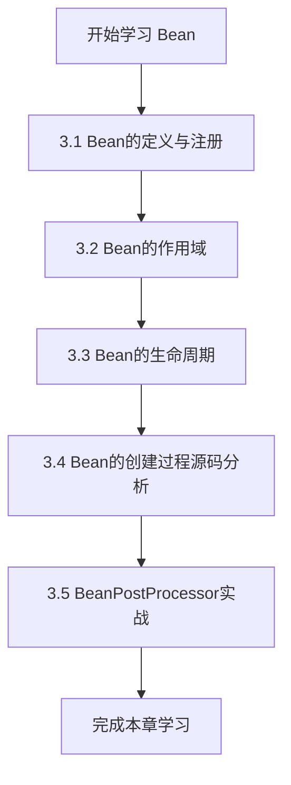

---

## 3.1 Bean 的定义与注册

### 3.1.1 什么是 BeanDefinition

在 Spring 框架中，`BeanDefinition` 是描述 Spring Bean 的核心接口，它包含了 Bean 的所有配置信息元数据。Spring 容器通过 `BeanDefinition` 来创建具体的 Bean 实例。

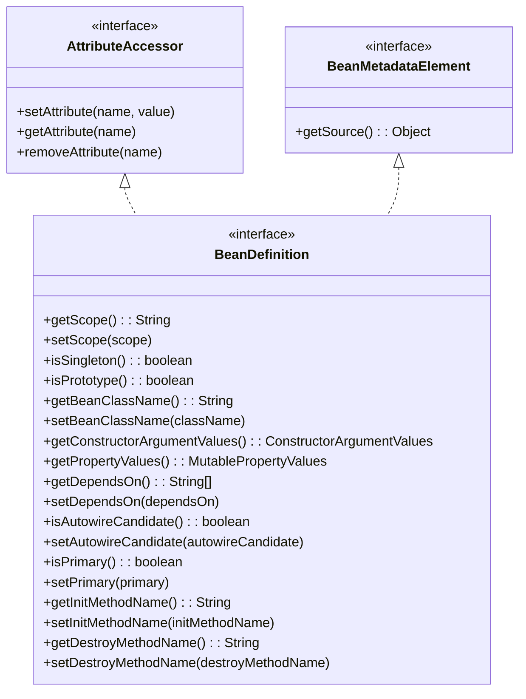

### 3.1.2 BeanDefinition 接口体系

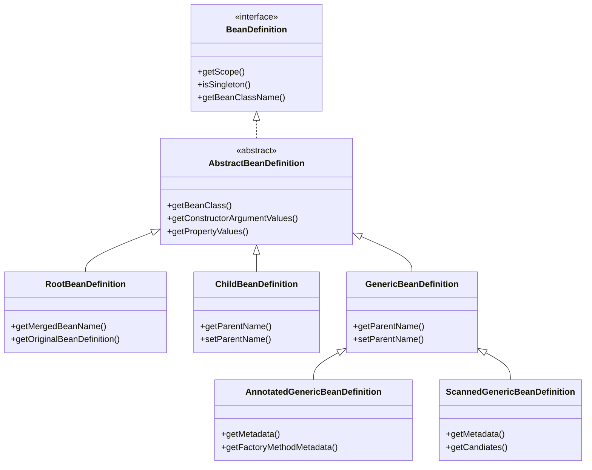

### 3.1.3 BeanDefinition 的主要属性

#### 1. 标识属性

| 属性 | 方法 | 说明 |
|------|------|------|
| beanClassName | setBeanClassName/getBeanClassName | Bean 的全限定类名 |
| scope | setScope/getScope | Bean 的作用域 |
| abstract | isAbstract/setAbstract | 是否为抽象 BeanDefinition |
| lazyInit | isLazyInit/setLazyInit | 是否延迟初始化 |

**源码位置**：`AbstractBeanDefinition.java`

```java
// org.springframework.beans.factory.support.AbstractBeanDefinition

private String beanClassName;
private String scope = SCOPE_DEFAULT;
private boolean abstractFlag = false;
private boolean lazyInit = false;

// SCOPE_DEFAULT 常量定义
public static final String SCOPE_DEFAULT = "";

// 关键源码 - 第90-120行
public void setScope(String scope) {
    this.scope = scope;
}

public String getScope() {
    return this.scope;
}
```

#### 2. 依赖相关属性

```java
// depends-on 属性 - 强制依赖于其他 Bean
private String[] dependsOn;

// autowireMode - 自动装配模式
public static final int AUTOWIRE_NO = 0;
public static final int AUTOWIRE_BY_NAME = 1;
public static final int AUTOWIRE_BY_TYPE = 2;
public static final int AUTOWIRE_CONSTRUCTOR = 3;
private int autowireMode = AUTOWIRE_NO;

// primary - 注入优先级
private boolean primary = false;
```

#### 3. 构造参数与属性

```java
// ConstructorArgumentValues - 构造器参数值
private ConstructorArgumentValues constructorArgumentValues;

// MutablePropertyValues - 属性值集合
private MutablePropertyValues propertyValues;

// 源码位置：AbstractBeanDefinition.java 第180-220行
public ConstructorArgumentValues getConstructorArgumentValues() {
    return this.constructorArgumentValues;
}

public MutablePropertyValues getPropertyValues() {
    return this.propertyValues;
}
```

#### 4. 生命周期相关属性

```java
// 初始化方法
private String initMethodName;

// 销毁方法
private String destroyMethodName;

// 是否初始化
private boolean enforceInitMethod = true;

// 是否强制执行销毁方法
private boolean enforceDestroyMethod = true;
```

### 3.1.4 注册 BeanDefinition 的方式

#### 方式一：通过 BeanDefinitionRegistry 直接注册


```java
// 创建 BeanDefinition
GenericBeanDefinition beanDefinition = new GenericBeanDefinition();
beanDefinition.setBeanClassName("com.example.UserService");
beanDefinition.setScope("singleton");
beanDefinition.setLazyInit(false);

// 注册到容器
DefaultListableBeanFactory beanFactory = new DefaultListableBeanFactory();
beanFactory.registerBeanDefinition("userService", beanDefinition);
```

#### 方式二：通过 BeanDefinitionBuilder 注册

```java
// 使用 BeanDefinitionBuilder 更简洁
BeanDefinitionBuilder builder = BeanDefinitionBuilder
    .genericBeanDefinition(UserService.class)
    .addPropertyReference("userDao", "userDao")
    .addPropertyValue("username", "admin")
    .setScope("singleton")
    .setLazyInit(false);

BeanDefinition beanDefinition = builder.getBeanDefinition();

// 注册
beanFactory.registerBeanDefinition("userService", beanDefinition);
```

#### 方式三：通过 XML 配置注册

```xml
<bean id="userService" class="com.example.UserService"
      scope="singleton"
      lazy-init="false"
      depends-on="userDao">
    <property name="userDao" ref="userDao"/>
    <property name="username" value="admin"/>
</bean>
```

#### 方式四：通过 @Bean 注解注册

```java
@Configuration
public class AppConfig {
    
    @Bean
    public UserService userService() {
        UserService userService = new UserService();
        userService.setUserDao(userDao());
        return userService;
    }
    
    @Bean
    public UserDao userDao() {
        return new UserDao();
    }
}
```

### 3.1.5 BeanDefinition 注册流程图

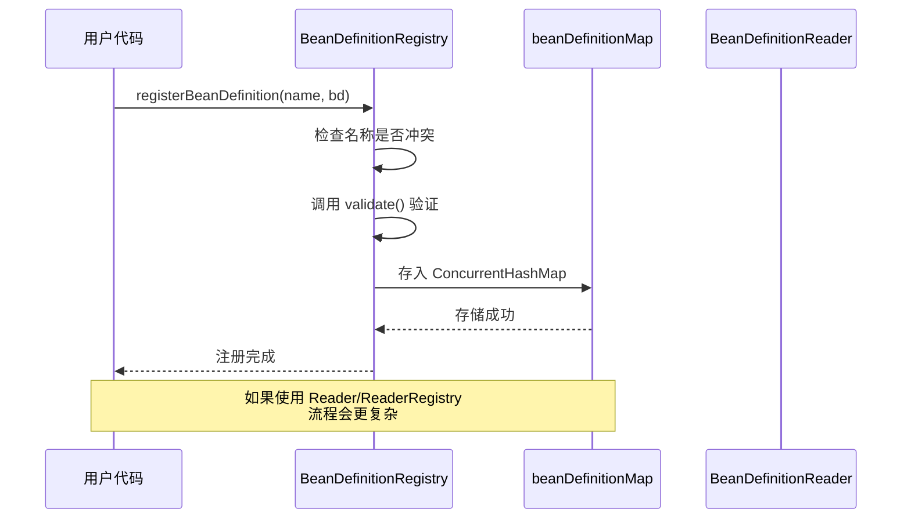

### 3.1.6 关键源码分析

**BeanDefinitionRegistry 接口**：`org.springframework.beans.factory.support.BeanDefinitionRegistry`

```java
// 位置：spring-beans.jar
public interface BeanDefinitionRegistry extends AliasRegistry {
    
    // 注册新的 BeanDefinition
    void registerBeanDefinition(String beanName, BeanDefinition beanDefinition)
        throws BeanDefinitionStoreException;
    
    // 移除 BeanDefinition
    void removeBeanDefinition(String beanName) throws NoSuchBeanDefinitionException;
    
    // 获取 BeanDefinition
    BeanDefinition getBeanDefinition(String beanName) 
        throws NoSuchBeanDefinitionException;
    
    // 检查是否包含
    boolean containsBeanDefinition(String beanName);
    
    // 获取所有 Bean 名称
    String[] getBeanDefinitionNames();
    
    // 获取 BeanDefinition 数量
    int getBeanDefinitionCount();
    
    // 检查名称是否已被使用
    boolean isBeanNameInUse(String beanName);
}
```

**DefaultListableBeanFactory 实现**：

```java
// 位置：org.springframework.beans.factory.support.DefaultListableBeanFactory
// 第 300-400 行

private final Map<String, BeanDefinition> beanDefinitionMap = 
    new ConcurrentHashMap<>(256);

@Override
public void registerBeanDefinition(String beanName, BeanDefinition beanDefinition)
        throws BeanDefinitionStoreException {
    
    // 1. 校验 BeanDefinition
    if (beanDefinition instanceof AbstractBeanDefinition) {
        ((AbstractBeanDefinition) beanDefinition).validate();
    }
    
    // 2. 检查是否已存在
    BeanDefinition existingDefinition = this.beanDefinitionMap.get(beanName);
    if (existingDefinition != null) {
        // 处理覆盖逻辑
        if (!existingDefinition.equals(beanDefinition)) {
            this.beanDefinitionMap.put(beanName, beanDefinition);
        }
    } else {
        // 3. 首次注册
        if (hasBeanCreationStarted()) {
            // 容器已经开始创建 Bean，需要加锁
            synchronized (this.beanDefinitionMap) {
                this.beanDefinitionMap.put(beanName, beanDefinition);
                List<String> updatedDefinitions = new ArrayList<>(this.beanDefinitionNames + 1);
                updatedDefinitions.addAll(this.beanDefinitionNames);
                updatedDefinitions.add(beanName);
                this.beanDefinitionNames = updatedDefinitions.toArray(new String[0]);
            }
        } else {
            // 容器尚未开始创建 Bean
            this.beanDefinitionMap.put(beanName, beanDefinition);
            this.beanDefinitionNames.add(beanName);
        }
    }
}
```

---

## 3.2 Bean 的作用域

### 3.2.1 Spring 支持的作用域类型

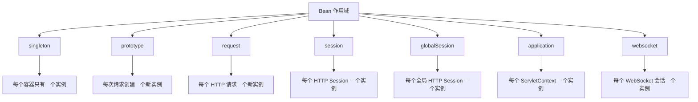

### 3.2.2 作用域详解

#### 1. singleton 作用域

> **默认作用域**，在每个 Spring 容器中只会有一个共享的实例。

```java
// singleton 是默认作用域
<bean id="userService" class="com.example.UserService" />

<!-- 显式指定 -->
<bean id="userService" class="com.example.UserService" scope="singleton" />
```

```java
// @Component 默认就是 singleton
@Component
public class UserService {
    // ...
}

// @Scope 显式指定
@Bean
@Scope("singleton")
public UserService userService() {
    return new UserService();
}
```

#### 2. prototype 作用域

> 每次获取 Bean 时都会创建一个新的实例。

```xml
<bean id="userService" class="com.example.UserService" scope="prototype" />
```

```java
@Bean
@Scope("prototype")
public UserService userService() {
    return new UserService();
}
```

**重要区别**：

| 特性 | singleton | prototype |
|------|-----------|-----------|
| 实例数量 | 容器只有一个 | 每次请求创建新实例 |
| 初始化时机 | 容器创建时 | 首次 getBean 时 |
| 销毁时机 | 容器销毁时 | GC 回收 |
| 内存管理 | 单一实例 | 可能造成内存浪费 |

#### 3. request 作用域

> 每一个 HTTP 请求创建一个新实例，仅在 Web 应用中使用。

```java
@Bean
@Scope(value = "request", proxyMode = ScopedProxyMode.TARGET_CLASS)
public UserService userService() {
    return new UserService();
}
```

#### 4. session 作用域

> 每一个 HTTP Session 创建一个新实例。

```java
@Bean
@Scope(value = "session", proxyMode = ScopedProxyMode.TARGET_CLASS)
public UserSession userSession() {
    return new UserSession();
}
```

### 3.2.3 自定义作用域

#### 实现 CustomScope 接口

```java
// 1. 实现 Scope 接口
public class ThreadScope implements Scope {
    
    private final ThreadLocal<Map<String, Object>> threadScope = 
        new ThreadLocal<Map<String, Object>>() {
            @Override
            protected Map<String, Object> initialValue() {
                return new HashMap<>();
            }
        };
    
    @Override
    public Object get(String name, ObjectFactory<?> objectFactory) {
        Map<String, Object> scope = threadScope.get();
        Object object = scope.get(name);
        if (object == null) {
            object = objectFactory.getObject();
            scope.put(name, object);
        }
        return object;
    }
    
    @Override
    public Object remove(String name) {
        Map<String, Object> scope = threadScope.get();
        return scope.remove(name);
    }
    
    @Override
    public void registerDestructionCallback(String name, Runnable callback) {
        // 注册销毁回调
    }
    
    @Override
    public Object resolveContextualObject(String key) {
        return null;
    }
    
    @Override
    public String getConversationId() {
        return Thread.currentThread().getName();
    }
}
```

#### 注册自定义作用域

```java
// 方式一：实现 BeanFactoryPostProcessor
@Component
public class CustomScopeRegistrar implements BeanFactoryPostProcessor {
    
    @Override
    public void postProcessBeanFactory(ConfigurableListableBeanFactory beanFactory) {
        // 注册自定义作用域
        beanFactory.registerScope("thread", new ThreadScope());
    }
}

// 方式二：使用 ConfigurableBeanFactory 接口
DefaultListableBeanFactory beanFactory = new DefaultListableBeanFactory();
beanFactory.registerScope("thread", new ThreadScope());
```

#### 使用自定义作用域

```java
@Bean
@Scope(value = "thread", proxyMode = ScopedProxyMode.TARGET_CLASS)
public MyService myService() {
    return new MyService();
}
```

### 3.2.4 作用域实现原理

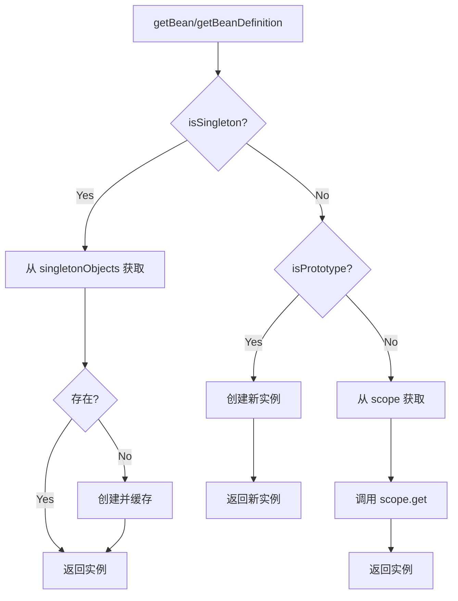

**源码位置**：`AbstractBeanFactory.java` 第 150-200 行

```java
// org.springframework.beans.factory.support.AbstractBeanFactory

protected <T> T doGetBean(final String name, final Class<T> requiredType,
        final Object[] args, boolean typeCheckOnly) throws BeansException {
    
    final String beanName = transformedBeanName(name);
    
    // 检查 singleton 缓存
    Object sharedInstance = getSingleton(beanName);
    if (sharedInstance != null) {
        return getObjectForBeanInstance(sharedInstance, name, beanName, null);
    }
    
    // 检查 prototype 作用域
    if (isPrototypeCurrentlyInCreation(beanName)) {
        throw new BeanCurrentlyInCreationException(beanName);
    }
    
    // 获取 BeanDefinition
    final RootBeanDefinition mbd = getMergedLocalBeanDefinition(beanName);
    
    // 检查 depends-on
    String[] dependsOn = mbd.getDependsOn();
    
    // 创建 Bean 实例
    if (mbd.isSingleton()) {
        sharedInstance = getSingleton(beanName, () -> {
            return createBean(beanName, mbd, args);
        });
        return getObjectForBeanInstance(sharedInstance, name, beanName, mbd);
    }
    else if (mbd.isPrototype()) {
        // prototype 每次创建新实例
        Object prototypeInstance = createBean(beanName, mbd, args);
        return getObjectForBeanInstance(prototypeInstance, name, beanName, mbd);
    }
    else {
        // 自定义作用域
        String scopeName = mbd.getScope();
        Scope scope = beanFactory.getScope(scopeName);
        Object scopeScope = scope.get(beanName, () -> {
            return createBean(beanName, mbd, args);
        });
        return getObjectForBeanInstance(scopeScope, name, beanName, mbd);
    }
}
```

---

## 3.3 Bean 的生命周期

### 3.3.1 整体流程图

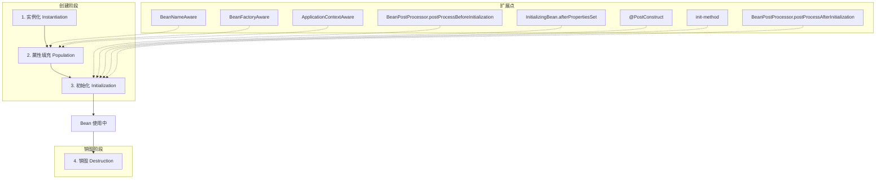

### 3.3.2 生命周期各阶段详解

#### 阶段一：实例化（Instantiation）

> Spring 容器通过构造器或工厂方法创建 Bean 实例。

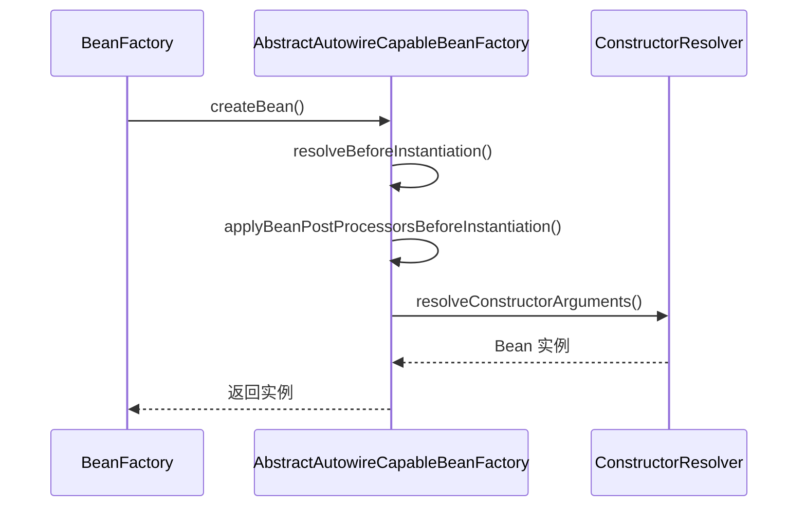

#### 阶段二：属性填充（Population）

> Spring 容器将 BeanDefinition 中的属性值注入到 Bean 实例中。

```java
// 源码位置：AbstractAutowireCapableBeanFactory.java 第 450-550 行

protected void populateBean(String beanName, BeanDefinition mbd, 
        @Nullable BeanWrapper instanceWrapper) {
    
    // 1. 先处理 autowire by name
    if (mbd.getAutowireMode() == AUTOWIRE_BY_NAME) {
        autowireByName(beanName, mbd, bw, nonProperties);
    }
    
    // 2. 再处理 autowire by type
    if (mbd.getAutowireMode() == AUTOWIRE_BY_TYPE) {
        autowireByType(beanName, mbd, bw, nonProperties);
    }
    
    // 3. 应用属性值
    PropertyValues pvs = mbd.getPropertyValues();
    if (pvs != null && !pvs.isEmpty()) {
        applyPropertyValues(beanName, mbd, bw, pvs);
    }
}
```

#### 阶段三：初始化（Initialization）

> 执行初始化回调，包括 Aware 接口、BeanPostProcessor 和初始化方法。

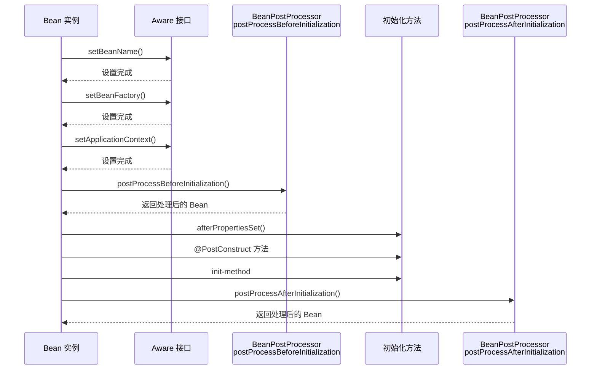

**关键源码**：`AbstractAutowireCapableBeanFactory.java` 第 600-700 行

```java
protected Object initializeBean(String beanName, Object bean, 
        @Nullable BeanDefinition mbd) {
    
    // 1. 处理 Aware 接口
    if (System邦) {
        invokeAwareMethods(beanName, bean);
    }
    
    // 2. BeanPostProcessor Before
    Object wrappedBean = bean;
    if (mbd == null || !mbd.hasBeanClass()) {
        wrappedBean = applyBeanPostProcessorsBeforeInitialization(
            bean, beanName);
    }
    
    // 3. 执行初始化方法
    invokeInitMethods(beanName, wrappedBean, mbd);
    
    // 4. BeanPostProcessor After
    wrappedBean = applyBeanPostProcessorsAfterInitialization(
        wrappedBean, beanName);
    
    return wrappedBean;
}
```

#### 阶段四：销毁（Destruction）

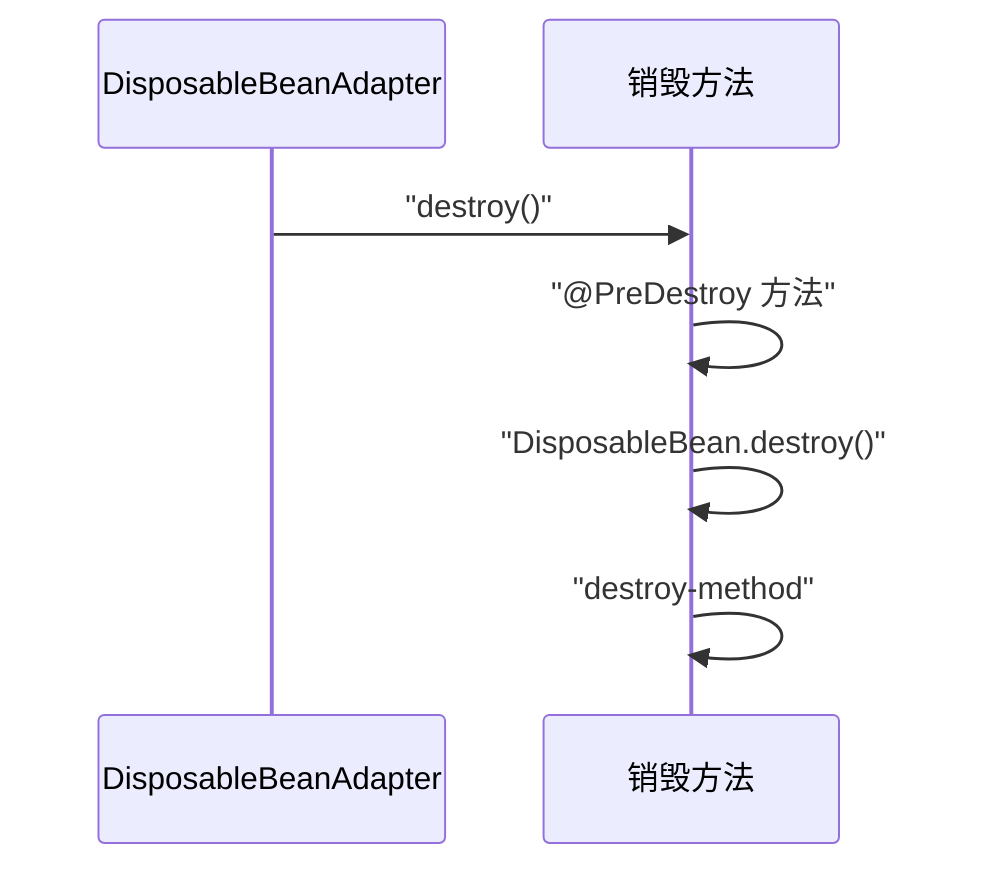

### 3.3.3 Aware 接口详解

| 接口 | 方法 | 注入内容 |
|------|------|----------|
| BeanNameAware | setBeanName | Bean 的名称 |
| BeanFactoryAware | setBeanFactory | BeanFactory 实例 |
| ApplicationContextAware | setApplicationContext | ApplicationContext 实例 |
| EnvironmentAware | setEnvironment | Environment 实例 |
| ResourceLoaderAware | setResourceLoader | ResourceLoader 实例 |
| MessageSourceAware | setMessageSource | MessageSource 实例 |
| ApplicationEventPublisherAware | setApplicationEventPublisher | ApplicationEventPublisher 实例 |

**执行顺序**：在属性填充之后，BeanPostProcessor Before 之前。

```java
// 源码位置：AbstractAutowireCapableBeanFactory.java

private void invokeAwareMethods(final String beanName, final Object bean) {
    if (bean instanceof Aware) {
        if (bean instanceof BeanNameAware) {
            ((BeanNameAware) bean).setBeanName(beanName);
        }
        if (bean instanceof BeanFactoryAware) {
            ((BeanFactoryAware) bean).setBeanFactory(this);
        }
        if (bean instanceof ApplicationContextAware) {
            ((ApplicationContextAware) bean).setApplicationContext(
                (ApplicationContext) this);
        }
    }
}
```

### 3.3.4 初始化方法执行顺序


**源码位置**：`AbstractAutowireCapableBeanFactory.java` 第 720-780 行

```java
protected void invokeInitMethods(String beanName, Object bean, 
        @Nullable BeanDefinition mbd) throws Throwable {
    
    // 1. 先执行 InitializingBean
    boolean isInitializingBean = (bean instanceof InitializingBean);
    if (isInitializingBean) {
        ((InitializingBean) bean).afterPropertiesSet();
    }
    
    // 2. 再执行 init-method
    if (mbd != null && mbd.getInitMethodName() != null) {
        String initMethodName = mbd.getInitMethodName();
        if (StringUtils.hasText(initMethodName) && 
            !isInitializingBean && !mbd.isEnforceInitMethod()) {
            invokeCustomInitMethod(initMethodName);
        }
    }
}
```

### 3.3.5 销毁方法执行顺序


---

## 3.4 Bean 的创建过程源码分析

### 3.4.1 getBean() 流程

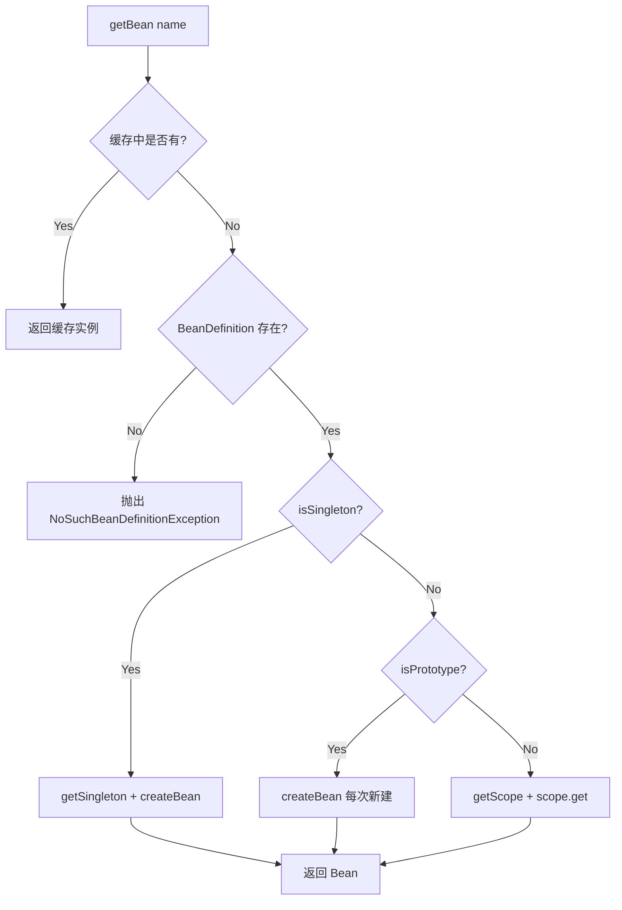

### 3.4.2 关键源码：doGetBean 方法

**源码位置**：`AbstractBeanFactory.java` 第 200-300 行

```java
protected <T> T doGetBean(final String name, final Class<T> requiredType,
        final Object[] args, boolean typeCheckOnly) throws BeansException {
    
    // 1. 转换 Bean 名称（处理 & 前缀）
    final String beanName = transformedBeanName(name);
    
    // 2. 从缓存获取单例实例
    Object sharedInstance = getSingleton(beanName);
    if (sharedInstance != null && args == null) {
        // 3. 如果是 FactoryBean，需要获取真正的 Bean 实例
        return getObjectForBeanInstance(sharedInstance, name, beanName, null);
    }
    
    // 4. 检查原型模式是否正在创建
    if (isPrototypeCurrentlyInCreation(beanName)) {
        throw new BeanCurrentlyInCreationException(beanName);
    }
    
    // 5. 获取父 BeanFactory
    BeanFactory parentBeanFactory = getParentBeanFactory();
    if (parentBeanFactory != null) {
        if (args != null) {
            return parentBeanFactory.getBean(name, args);
        } else {
            return parentBeanFactory.getBean(name, requiredType);
        }
    }
    
    // 6. 获取合并后的 BeanDefinition
    final RootBeanDefinition mbd = getMergedLocalBeanDefinition(beanName);
    
    // 7. 检查 depends-on 依赖
    String[] dependsOn = mbd.getDependsOn();
    if (dependsOn != null) {
        for (String dep : dependsOn) {
            getBean(dep);
            registerDependentBean(dep, beanName);
        }
    }
    
    // 8. 根据作用域创建实例
    if (mbd.isSingleton()) {
        sharedInstance = getSingleton(beanName, () -> {
            return createBean(beanName, mbd, args);
        });
        return getObjectForBeanInstance(sharedInstance, name, beanName, mbd);
    }
    else if (mbd.isPrototype()) {
        Object prototypeInstance = createBean(beanName, mbd, args);
        return getObjectForBeanInstance(prototypeInstance, name, beanName, mbd);
    }
    else {
        String scopeName = mbd.getScope();
        Scope scope = beanFactory.getScope(scopeName);
        Object scopeInstance = scope.get(beanName, () -> {
            return createBean(beanName, mbd, args);
        });
        return getObjectForBeanInstance(scopeInstance, name, beanName, mbd);
    }
}
```

### 3.4.3 createBean 流程

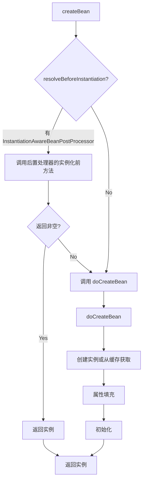

### 3.4.4 关键源码：createBean 方法

**源码位置**：`AbstractAutowireCapableBeanFactory.java` 第 300-400 行

```java
@Override
protected Object createBean(String beanName, RootBeanDefinition mbd, 
        @Nullable Object[] args) throws BeanCreationException {
    
    RootBeanDefinition mbdToUse = mbd;
    
    // 1. 解析 Bean 的 Class
    Class<?> resolvedClass = resolveBeanClass(mbd, beanName);
    
    // 2. 调用 InstantiationAwareBeanPostProcessor 的
    //    postProcessBeforeInstantiation 方法
    Object bean = resolveBeforeInstantiation(beanName, mbdToUse);
    if (bean != null) {
        return bean;
    }
    
    // 3. 调用 doCreateBean 创建真正的 Bean 实例
    try {
        Object beanInstance = doCreateBean(beanName, mbdToUse, args);
        return beanInstance;
    } catch (BeanCreationException ex) {
        throw ex;
    } catch (Throwable ex) {
        throw new BeanCreationException(beanName, 
            "Unexpected exception during bean creation", ex);
    }
}
```

### 3.4.5 关键源码：doCreateBean 方法

**源码位置**：`AbstractAutowireCapableBeanFactory.java` 第 450-600 行

```java
protected Object doCreateBean(String beanName, RootBeanDefinition mbd,
        @Nullable Object[] args) throws BeanCreationException {
    
    // 1. 创建 Bean 实例
    Object bean = createBeanInstance(beanName, mbd, args);
    
    // 2. 检查是否是 singleton，如果是则缓存早期引用
    //    （用于解决循环依赖）
    if (mbd.isSingleton()) {
        addSingletonFactory(beanName, () -> getEarlyBeanReference(beanName, mbd, bean));
    }
    
    Object exposedObject = bean;
    
    // 3. 属性填充（依赖注入）
    populateBean(beanName, mbd, exposedObject);
    
    // 4. 初始化
    exposedObject = initializeBean(beanName, exposedObject, mbd);
    
    // 5. 注册销毁逻辑
    registerDisposableBeanIfNecessary(beanName, bean, mbd);
    
    return exposedObject;
}
```

### 3.4.6 Bean 创建完整时序图

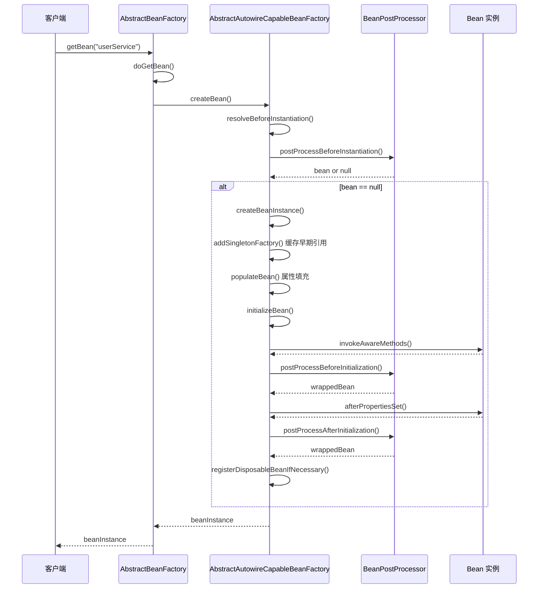

### 3.4.7 源码关键位置汇总表

| 类 | 方法 | 行号 | 说明 |
|----|------|------|------|
| AbstractBeanFactory | doGetBean | 150-300 | 获取 Bean 的主流程 |
| AbstractBeanFactory | getSingleton | 100-150 | 获取单例 Bean |
| AbstractAutowireCapableBeanFactory | createBean | 300-400 | 创建 Bean 的入口 |
| AbstractAutowireCapableBeanFactory | doCreateBean | 450-600 | 创建 Bean 的核心实现 |
| AbstractAutowireCapableBeanFactory | createBeanInstance | 700-850 | 创建 Bean 实例 |
| AbstractAutowireCapableBeanFactory | populateBean | 850-1000 | 属性填充 |
| AbstractAutowireCapableBeanFactory | initializeBean | 1000-1150 | Bean 初始化 |
| AbstractAutowireCapableBeanFactory | applyBeanPostProcessorsBeforeInitialization | 1100-1200 | 初始化前处理器 |
| AbstractAutowireCapableBeanFactory | applyBeanPostProcessorsAfterInitialization | 1200-1300 | 初始化后处理器 |

---

## 3.5 【实战】BeanPostProcessor 扩展点实战

### 3.5.1 BeanPostProcessor 接口详解

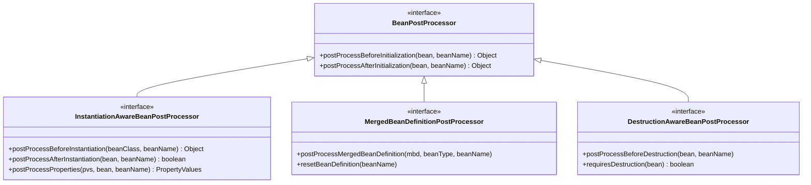

### 3.5.2 接口方法解析

```java
public interface BeanPostProcessor {
    
    /**
     * 在 Bean 初始化方法（如 @PostConstruct、afterPropertiesSet、init-method）<br/>
     * 调用之前调用
     */
    @Nullable
    default Object postProcessBeforeInitialization(Object bean, String beanName) 
            throws BeansException {
        return bean;
    }
    
    /**
     * 在 Bean 初始化方法调用之后调用
     */
    @Nullable
    default Object postProcessAfterInitialization(Object bean, String beanName) 
            throws BeansException {
        return bean;
    }
}
```

### 3.5.3 实战一：自定义 BeanPostProcessor 记录所有 Bean 创建

```java
package com.example.spring.demo;
 
import org.springframework.beans.BeansException;
import org.springframework.beans.factory.config.BeanPostProcessor;
import org.springframework.stereotype.Component;
 
import java.util.HashMap;
import java.util.Map;
 
/**
 * Bean 创建日志记录器
 * 演示如何自定义 BeanPostProcessor
 */
@Component
public class BeanCreationLogger implements BeanPostProcessor {
    
    private final Map<String, Long> beanCreationTime = new HashMap<>();
    
    @Override
    public Object postProcessBeforeInitialization(Object bean, String beanName) 
            throws BeansException {
        System.out.println("[BeanCreationLogger] 初始化前: " + beanName + 
            " - 类型: " + bean.getClass().getName());
        beanCreationTime.put(beanName, System.currentTimeMillis());
        return bean;
    }
    
    @Override
    public Object postProcessAfterInitialization(Object bean, String beanName) 
            throws BeansException {
        Long startTime = beanCreationTime.get(beanName);
        if (startTime != null) {
            long duration = System.currentTimeMillis() - startTime;
            System.out.println("[BeanCreationLogger] 初始化后: " + beanName + 
                " - 耗时: " + duration + "ms");
        }
        return bean;
    }
}
```

### 3.5.4 实战二：自定义注解实现 Bean 初始化增强

```java
package com.example.spring.demo;
 
import org.springframework.beans.BeansException;
import org.springframework.beans.factory.config.BeanPostProcessor;
import org.springframework.stereotype.Component;
 
import java.lang.reflect.Method;
import java.lang.reflect.Proxy;
import java.util.HashMap;
import java.util.Map;
 
/**
 * 性能监控 BeanPostProcessor
 * 使用自定义 @Monitored 注解标记需要监控的方法
 */
@Component
public class PerformanceMonitorBeanPostProcessor implements BeanPostProcessor {
    
    private final Map<String, Class<?>> monitoredBeans = new HashMap<>();
    
    @Override
    public Object postProcessBeforeInitialization(Object bean, String beanName) 
            throws BeansException {
        // 检查是否有 @Monitored 注解
        if (bean.getClass().isAnnotationPresent(Monitored.class)) {
            monitoredBeans.put(beanName, bean.getClass());
        }
        return bean;
    }
    
    @Override
    public Object postProcessAfterInitialization(Object bean, String beanName) 
            throws BeansException {
        if (monitoredBeans.containsKey(beanName)) {
            // 返回一个代理对象，添加监控逻辑
            return createPerformanceProxy(bean, monitoredBeans.get(beanName));
        }
        return bean;
    }
    
    private Object createPerformanceProxy(Object target, Class<?> interfaces) {
        return Proxy.newProxyInstance(
            interfaces.getClassLoader(),
            new Class<?>[] { interfaces },
            (proxy, method, args) -> {
                if (method.isAnnotationPresent(Monitored.class)) {
                    Monitored monitored = method.getAnnotation(Monitored.class);
                    long start = System.nanoTime();
                    try {
                        return method.invoke(target, args);
                    } finally {
                        long duration = System.nanoTime() - start;
                        System.out.println("[PerformanceMonitor] 方法: " + 
                            method.getName() + " - 耗时: " + 
                            (duration / 1_000_000.0) + "ms");
                    }
                }
                return method.invoke(target, args);
            }
        );
    }
}
```

```java
package com.example.spring.demo;
 
import java.lang.annotation.ElementType;
import java.lang.annotation.Retention;
import java.lang.annotation.RetentionPolicy;
import java.lang.annotation.Target;
 
/**
 * 方法性能监控注解
 */
@Target(ElementType.METHOD)
@Retention(RetentionPolicy.RUNTIME)
public @interface Monitored {
}
```

```java
package com.example.spring.demo;
 
import org.springframework.stereotype.Service;
 
@Service
public class UserService {
    
    @Monitored
    public void complexOperation() {
        // 复杂业务逻辑
        try {
            Thread.sleep(100);
        } catch (InterruptedException e) {
            Thread.currentThread().interrupt();
        }
    }
    
    @Monitored
    public String getUserById(Long id) {
        // 获取用户逻辑
        return "User-" + id;
    }
}
```

### 3.5.5 实战三：@PostConstruct 实现原理

@PostConstruct 注解的实现原理就是通过 `CommonAnnotationBeanPostProcessor`（继承自 `BeanPostProcessor`）来完成的。

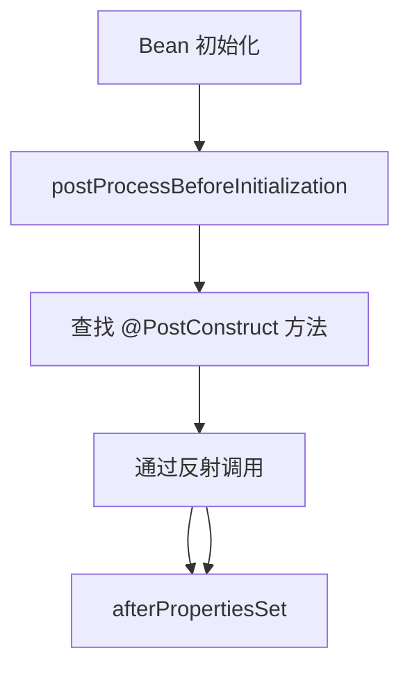

**关键源码**：`CommonAnnotationBeanPostProcessor.java`

```java
// 位置：org.springframework.beans.factory.annotation.CommonAnnotationBeanPostProcessor

@Override
public Object postProcessBeforeInitialization(Object bean, String beanName) 
        throws BeansException {
    
    // 1. 处理 @PostConstruct 注解
    InjectionMetadata metadata = findResourceMetadata(bean.getClass(), beanName);
    metadata.inject(bean, beanName, null);
    
    // 2. 调用 postConstruct 方法
    if (metadata.hasPostConstruct()) {
        if (logger.isDebugEnabled()) {
            logger.debug("Invoking @PostConstruct for bean '" + beanName + "'");
        }
        metadata.invokePostConstruct(bean, beanName);
    }
    
    return bean;
}
```

### 3.5.6 实战四：Spring 内置 BeanPostProcessor 实战

Spring 内部使用了很多 BeanPostProcessor 来实现各种功能：

| BeanPostProcessor | 作用 | 关键方法 |
|-------------------|------|----------|
| ApplicationContextAwareProcessor | 注入 Aware 接口 | postProcessBeforeInitialization |
| ConfigurationClassPostProcessor | 处理 @Configuration | postProcessBeanDefinitionRegistry |
|AutowiredAnnotationBeanPostProcessor | 处理 @Autowired/@Value | postProcessProperties |
| RequiredAnnotationBeanPostProcessor | 处理 @Required | postProcessBeforeInitialization |
| CommonAnnotationBeanPostProcessor | 处理 @PostConstruct/@PreDestroy | postProcessBeforeInitialization |
| PersistenceAnnotationBeanPostProcessor | 处理 JPA 注解 | postProcessBeforeInstantiation |
| BeanValidationPostProcessor | 数据校验 | postProcessBeforeInitialization |

```java
package com.example.spring.demo;
 
import org.springframework.beans.BeansException;
import org.springframework.beans.factory.config.BeanPostProcessor;
import org.springframework.core.PriorityOrdered;
import org.springframework.stereotype.Component;
 
/**
 * 演示 BeanPostProcessor 的优先级
 * PriorityOrdered.HIGHEST_PRECEDENCE 确保早期执行
 */
@Component
public class EarlyInitBeanPostProcessor implements BeanPostProcessor, 
        PriorityOrdered {
    
    @Override
    public Object postProcessBeforeInitialization(Object bean, String beanName) 
            throws BeansException {
        // 只处理特定 Bean
        if ("dataSource".equals(beanName)) {
            System.out.println("[EarlyInitBeanPostProcessor] 早期初始化: " + beanName);
        }
        return bean;
    }
    
    @Override
    public int getOrder() {
        // 返回最高优先级
        return PriorityOrdered.HIGHEST_PRECEDENCE;
    }
}
```

### 3.5.7 完整测试代码

```java
package com.example.spring.demo;
 
import org.springframework.context.annotation.AnnotationConfigApplicationContext;
import org.springframework.context.annotation.ComponentScan;
import org.springframework.context.annotation.Configuration;
 
/**
 * BeanPostProcessor 实战测试
 */
@Configuration
@ComponentScan(basePackages = "com.example.spring.demo")
public class BeanPostProcessorTest {
    
    public static void main(String[] args) {
        AnnotationConfigApplicationContext context = 
            new AnnotationConfigApplicationContext(BeanPostProcessorTest.class);
        
        // 获取 UserService 触发 Bean 创建
        UserService userService = context.getBean("userService", UserService.class);
        
        // 调用被监控的方法
        userService.complexOperation();
        String user = userService.getUserById(1L);
        System.out.println("获取到用户: " + user);
        
        // 关闭容器
        context.close();
    }
}
```

---

## 本章总结

### 知识点回顾

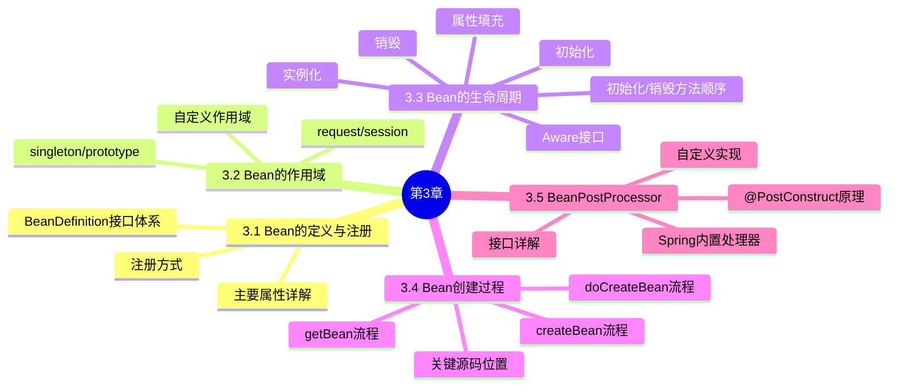

### 关键源码位置

| 文件 | 关键方法 | 说明 |
|------|----------|------|
| AbstractBeanFactory.java | doGetBean() | Bean 获取主流程 |
| AbstractAutowireCapableBeanFactory.java | createBean() | Bean 创建入口 |
| AbstractAutowireCapableBeanFactory.java | doCreateBean() | Bean 创建核心 |
| AbstractAutowireCapableBeanFactory.java | populateBean() | 属性填充 |
| AbstractAutowireCapableBeanFactory.java | initializeBean() | Bean 初始化 |

### 面试要点

1. **BeanDefinition 有哪些主要属性？**
   - beanClassName, scope, lazyInit, dependsOn, autowireMode, primary 等

2. **singleton 和 prototype 作用域的区别？**
   - 实例数量、创建时机、销毁时机

3. **Bean 生命周期的各个阶段？**
   - 实例化 -> 属性填充 -> 初始化 -> 销毁

4. **初始化方法的执行顺序？**
   - @PostConstruct -> afterPropertiesSet -> init-method

5. **BeanPostProcessor 的作用？**
   - 在 Bean 初始化前后进行拦截处理

---

*本章完*
