# 第4章 Spring 容器初始化流程

## 章节概述

Spring 容器的初始化是整个 Spring 框架的核心起点，理解这一过程对于深入掌握 Spring 框架至关重要。本章将通过详细的流程图和源码分析，带你完整理解 `refresh()` 方法的每一个步骤，理解 Spring 容器从启动到就绪的完整过程。

## 学习路径

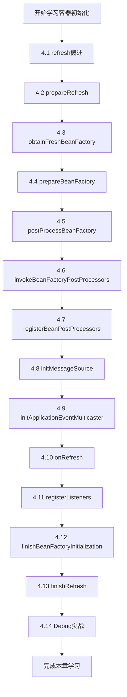

---

## 4.1 refresh() 方法概述

### 4.1.1 refresh() 在 Spring 容器中的位置

```mermaid
flowchart TB
    A[ApplicationContext 创建] --> B[refresh() 调用]
    B --> C[容器的初始化与配置]
    C --> D[容器就绪]
    
    subgraph refresh() 内部流程
        E[prepareRefresh]
        F[obtainFreshBeanFactory]
        G[prepareBeanFactory]
        H[postProcessBeanFactory]
        I[invokeBeanFactoryPostProcessors]
        J[registerBeanPostProcessors]
        K[initMessageSource]
        L[initApplicationEventMulticaster]
        M[onRefresh]
        N[registerListeners]
        O[finishBeanFactoryInitialization]
        P[finishRefresh]
    end
    
    E --> F --> G --> H --> I --> J --> K --> L --> M --> N --> O --> P
```

### 4.1.2 refresh() 方法整体流程图

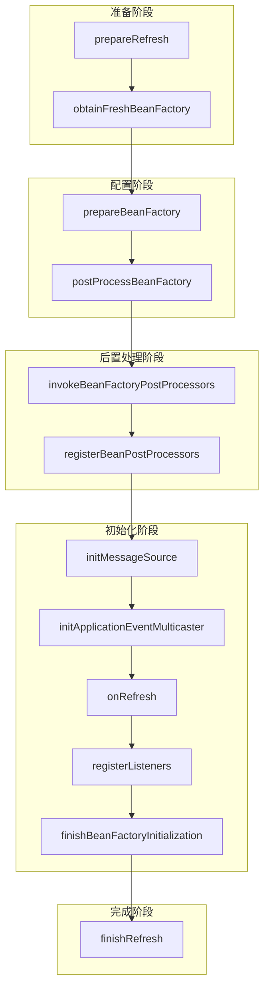

### 4.1.3 refresh() 源码概览

**源码位置**：`AbstractApplicationContext.java` 第 500-600 行

```java
// org.springframework.context.support.AbstractApplicationContext

@Override
public void refresh() throws BeansException, IllegalStateException {
    
    // 1. 准备刷新上下文环境
    prepareRefresh();
    
    // 2. 获取 BeanFactory（子类实现）
    ConfigurableListableBeanFactory beanFactory = obtainFreshBeanFactory();
    
    // 3. 准备 BeanFactory
    prepareBeanFactory(beanFactory);
    
    try {
        // 4. 子类后置处理
        postProcessBeanFactory(beanFactory);
        
        // 5. 调用 BeanFactoryPostProcessor
        invokeBeanFactoryPostProcessors(beanFactory);
        
        // 6. 注册 BeanPostProcessor
        registerBeanPostProcessors(beanFactory);
        
        // 7. 初始化消息源
        initMessageSource(beanFactory);
        
        // 8. 初始化事件广播器
        initApplicationEventMulticaster();
        
        // 9. 子类刷新
        onRefresh();
        
        // 10. 注册监听器
        registerListeners();
        
        // 11. 初始化所有非延迟加载的单例 Bean
        finishBeanFactoryInitialization(beanFactory);
        
        // 12. 完成刷新
        finishRefresh();
    } catch (BeansException ex) {
        // 销毁已创建的单例
        destroyBeans();
        cancelRefresh(ex);
        throw ex;
    } finally {
        // 重置缓存
        resetCommonCaches();
    }
}
```

### 4.1.4 refresh() 执行流程时序图

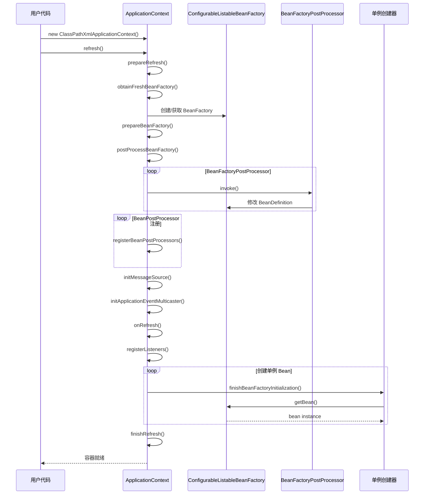

---

## 4.2 prepareRefresh() 准备阶段

### 4.2.1 方法作用

> 准备阶段的初始化工作，设置启动时间、标记容器状态、初始化属性资源等。

### 4.2.2 关键源码分析

**源码位置**：`AbstractApplicationContext.java` 第 520-560 行

```java
// org.springframework.context.support.AbstractApplicationContext

protected void prepareRefresh() {
    // 1. 记录容器启动时间
    this.startupDate = System.currentTimeMillis();
    
    // 2. 标记容器为活跃状态
    this.closed.set(false);
    this.active.set(true);
    
    // 3. 初始化属性源（留给子类扩展）
    initPropertySources();
    
    // 4. 校验必需的属性
    getEnvironment().validateRequiredProperties();
    
    // 5. 初始化早期应用事件监听器集合
    this.earlyApplicationEvents = new LinkedHashSet<>();
}
```

### 4.2.3 流程图

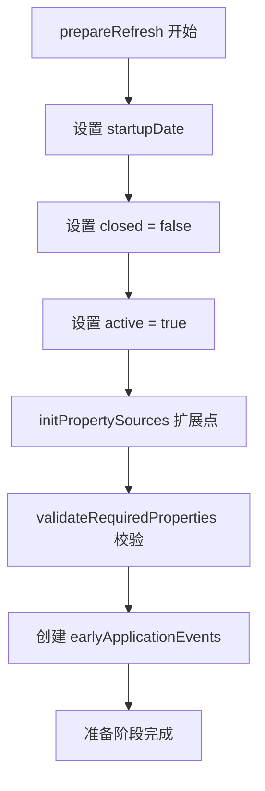

### 4.2.4 扩展点：initPropertySources()

```java
/**
 * 初始化额外的属性源
 * 子类可以重写此方法添加自定义属性源
 */
protected void initPropertySources() {
    // 默认实现为空
}

/**
 * 示例：自定义实现
 */
@Override
protected void initPropertySources() {
    // 添加自定义属性
    getEnvironment().addActiveProfile("dev");
    
    // 添加属性占位符解析
    getEnvironment().setRequiredProperties("database.url", "database.username");
}
```

---

## 4.3 obtainFreshBeanFactory() 获取 BeanFactory

### 4.3.1 方法作用

> 获取 Spring 的 BeanFactory，可能是创建新的或刷新现有的。

### 4.3.2 关键源码分析

**源码位置**：`AbstractApplicationContext.java` 第 580-610 行

```java
// org.springframework.context.support.AbstractApplicationContext

protected ConfigurableListableBeanFactory obtainFreshBeanFactory() {
    // 刷新 BeanFactory
    refreshBeanFactory();
    
    // 返回 BeanFactory
    return getBeanFactory();
}
```

**子类实现 - GenericApplicationContext**：

```java
// org.springframework.context.support.GenericApplicationContext

@Override
protected final void refreshBeanFactory() throws IllegalStateException {
    if (this.refreshException != null) {
        throw new RefreshException("...");
    }
    
    // 标记 BeanFactory 已刷新
    this.refreshed.set(true);
}
```

**子类实现 - AbstractRefreshableApplicationContext**：

```java
// org.springframework.beans.context.support.AbstractRefreshableApplicationContext

@Override
protected final void refreshBeanFactory() throws BeansException {
    // 如果已有 BeanFactory，销毁其中的 Bean
    if (hasBeanFactory()) {
        destroyBeans();
        closeBeanFactory();
    }
    
    try {
        // 创建新的 DefaultListableBeanFactory
        DefaultListableBeanFactory beanFactory = createBeanFactory();
        
        // 设置相关属性
        beanFactory.setSerializationId(getId());
        customizeBeanFactory(beanFactory);
        
        // 加载 BeanDefinition
        loadBeanDefinitions(beanFactory);
        
        // 同步设置 BeanFactory
        synchronized (this.beanFactoryMonitor) {
            this.beanFactory = beanFactory;
        }
    } catch (IOException ex) {
        throw new ApplicationContextException("...");
    }
}
```

### 4.3.3 流程图

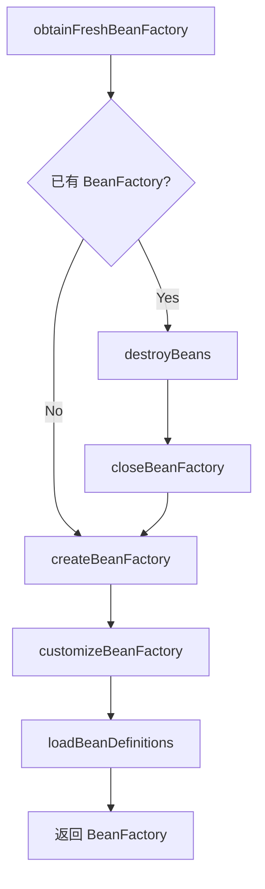

---

## 4.4 prepareBeanFactory() 准备 BeanFactory

### 4.4.1 方法作用

> 配置 BeanFactory 的基本属性，如类加载器、表达式解析器、Bean 后置处理器等。

### 4.4.2 关键源码分析

**源码位置**：`AbstractApplicationContext.java` 第 620-660 行

```java
// org.springframework.context.support.AbstractApplicationContext

protected void prepareBeanFactory(ConfigurableListableBeanFactory beanFactory) {
    
    // 1. 设置类加载器
    beanFactory.setBeanClassLoader(getClassLoader());
    
    // 2. 设置 EL 表达式解析器
    beanFactory.setBeanExpressionResolver(new StandardBeanExpressionResolver());
    
    // 3. 注册属性编辑器
    beanFactory.addPropertyEditorRegistrar(new ResourceEditorRegistrar(this));
    
    // 4. 添加 ApplicationContextAwareProcessor
    //    处理 Aware 接口回调
    beanFactory.addBeanPostProcessor(new ApplicationContextAwareProcessor(this));
    
    // 5. 忽略依赖注入的接口
    beanFactory.ignoreDependencyInterface(EnvironmentAware.class);
    beanFactory.ignoreDependencyInterface(EmbeddedValueResolverAware.class);
    beanFactory.ignoreDependencyInterface(ResourceLoaderAware.class);
    beanFactory.ignoreDependencyInterface(ApplicationEventPublisherAware.class);
    beanFactory.ignoreDependencyInterface(MessageSourceAware.class);
    beanFactory.ignoreDependencyInterface(ApplicationContextAware.class);
    
    // 6. 注册可解析的依赖
    beanFactory.registerResolvableDependency(BeanFactory.class, beanFactory);
    beanFactory.registerResolvableDependency(ResourceLoader.class, this);
    beanFactory.registerResolvableDependency(ApplicationEventPublisher.class, this);
    beanFactory.registerResolvableDependency(ApplicationContext.class, this);
    
    // 7. 添加后置处理器 - ApplicationListenerDetector
    beanFactory.addBeanPostProcessor(new ApplicationListenerDetector(this));
    
    // 8. 注册 AspectJ 相关
    if (beanFactory.containsBeanDefinition(LOAD_TIME_WEAVER_BEAN_NAME)) {
        beanFactory.addBeanPostProcessor(
            new LoadTimeWeaverAwareProcessor(beanFactory));
        beanFactory.setTempClassLoader(new ContextTypeMatchClassLoader(beanFactory.getBeanClassLoader()));
    }
    
    // 9. 注册默认环境 bean
    if (!beanFactory.containsLocalBean(ENVIRONMENT_BEAN_NAME)) {
        beanFactory.registerSingleton(ENVIRONMENT_BEAN_NAME, getEnvironment());
    }
    if (!beanFactory.containsLocalBean(SYSTEM_PROPERTIES_BEAN_NAME)) {
        beanFactory.registerSingleton(SYSTEM_PROPERTIES_BEAN_NAME, 
            getEnvironment().getSystemProperties());
    }
    if (!beanFactory.containsLocalBean(SYSTEM_ENVIRONMENT_BEAN_NAME)) {
        beanFactory.registerSingleton(SYSTEM_ENVIRONMENT_BEAN_NAME, 
            getEnvironment().getSystemEnvironment());
    }
}
```

### 4.4.3 流程图

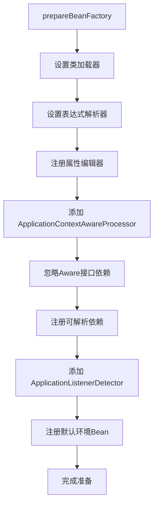

---

## 4.5 postProcessBeanFactory() 后置处理

### 4.5.1 方法作用

> 模板方法，允许子类对 BeanFactory 进行额外的后置处理。

### 4.5.2 关键源码分析

**源码位置**：`AbstractApplicationContext.java` 第 670-680 行

```java
// org.springframework.context.support.AbstractApplicationContext

protected void postProcessBeanFactory(
        ConfigurableListableBeanFactory beanFactory) {
    // 默认实现为空
    // 子类如 ServletWebServerApplicationContext 会重写此方法
}

/**
 * Servlet 上下文的实现示例
 */
@Override
protected void postProcessBeanFactory(
        ConfigurableListableBeanFactory beanFactory) {
    // 添加 Web 相关 BeanPostProcessor
    beanFactory.addBeanPostProcessor(
        new ServletRequestScopeAwareProcessor(this));
    beanFactory.ignoreDependencyInterface(ServletRequestAware.class);
    beanFactory.ignoreDependencyInterface(ServletResponseAware.class);
    beanFactory.ignoreDependencyInterface(ServletContextAware.class);
}
```

---

## 4.6 invokeBeanFactoryPostProcessors() 调用后置处理器

### 4.6.1 方法作用

> 实例化并调用所有 BeanFactoryPostProcessor（包括 BeanDefinitionRegistryPostProcessor）。

### 4.6.2 BeanFactoryPostProcessor 与 BeanDefinitionRegistryPostProcessor

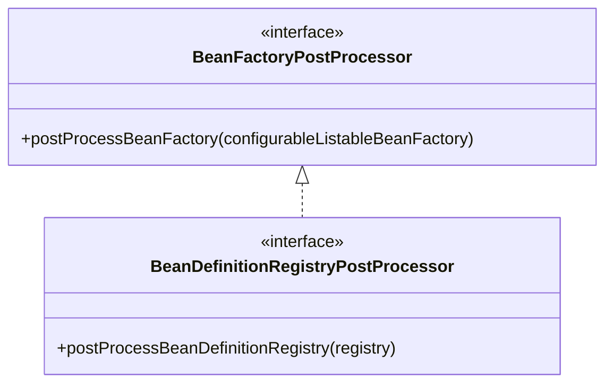

### 4.6.3 关键源码分析

**源码位置**：`PostProcessorRegistrationDelegate.java` 第 40-120 行

```java
// org.springframework.context.support.PostProcessorRegistrationDelegate

public static void invokeBeanFactoryPostProcessors(
        ConfigurableListableBeanFactory beanFactory,
        List<BeanFactoryPostProcessor> beanFactoryPostProcessors) {
    
    // 1. 处理已存在的 BeanFactoryPostProcessor
    List<BeanFactoryPostProcessor> processedBeans = new ArrayList<>();
    
    // 2. 优先处理 BeanDefinitionRegistryPostProcessor
    if (beanFactory instanceof BeanDefinitionRegistry) {
        BeanDefinitionRegistry registry = (BeanDefinitionRegistry) beanFactory;
        
        List<BeanDefinitionRegistryPostProcessor> currentRegistryProcessors = 
            new ArrayList<>();
        
        // 获取所有 BeanDefinitionRegistryPostProcessor
        String[] postProcessorNames = beanFactory.getBeanNamesForType(
            BeanDefinitionRegistryPostProcessor.class, true, false);
        
        for (String ppName : postProcessorNames) {
            if (beanFactory.containsBean(ppName)) {
                currentRegistryProcessors.add(
                    beanFactory.getBean(ppName, BeanDefinitionRegistryPostProcessor.class));
            }
        }
        
        // 排序（PriorityOrdered > Ordered > 无）
        sortPostProcessors(currentRegistryProcessors);
        
        // 调用所有 BeanDefinitionRegistryPostProcessor
        invokeBeanDefinitionRegistryPostProcessors(currentRegistryProcessors, 
            registry);
        
        // 继续处理其他 BeanFactoryPostProcessor
        processedBeans.addAll(currentRegistryProcessors);
    }
    
    // 3. 处理剩余的 BeanFactoryPostProcessor
    List<BeanFactoryPostProcessor> regularPostProcessors = 
        new ArrayList<>(beanFactoryPostProcessors);
    
    String[] postProcessorNames = beanFactory.getBeanNamesForType(
        BeanFactoryPostProcessor.class, true, false);
    
    // 按优先级排序并调用
    sortPostProcessors(regularPostProcessors);
    invokeBeanFactoryPostProcessors(regularPostProcessors, beanFactory);
}
```

### 4.6.4 流程图

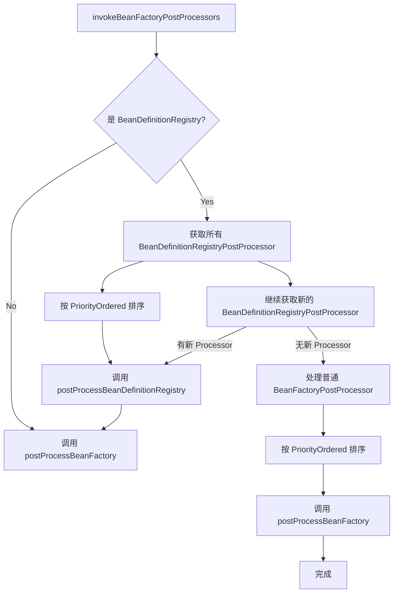

### 4.6.5 常见 BeanFactoryPostProcessor

| 处理器 | 作用 | 优先级 |
|--------|------|--------|
| ConfigurationClassPostProcessor | 处理 @Configuration 注解 | HIGHEST_PRIORITY |
| CustomAutowireConfigurer | 处理自定义 autowire 配置 | Ordered |
| CustomEditorConfigurer | 注册自定义属性编辑器 | Ordered |

---

## 4.7 registerBeanPostProcessors() 注册后置处理器

### 4.7.1 方法作用

> 注册所有的 BeanPostProcessor 到 BeanFactory，但不会调用它们。

### 4.7.2 关键源码分析

**源码位置**：`PostProcessorRegistrationDelegate.java` 第 120-200 行

```java
// org.springframework.context.support.PostProcessorRegistrationDelegate

public static void registerBeanPostProcessors(
        ConfigurableListableBeanFactory beanFactory,
        AbstractApplicationContext applicationContext) {
    
    // 1. 获取所有 BeanPostProcessor 名称
    String[] postProcessorNames = beanFactory.getBeanNamesForType(
        BeanPostProcessor.class, true, false);
    
    // 2. 计算需要注册的数量（+1 for internal）
    int beanProcessorTargetCount = beanFactory.getBeanPostProcessorCount() + 1
        + postProcessorNames.length;
    
    // 3. 添加内部处理器
    beanFactory.addBeanPostProcessor(new BeanPostProcessorChecker(beanFactory, 
        beanProcessorTargetCount));
    
    // 4. 分类处理
    List<BeanPostProcessor> priorityOrderedProcessors = new ArrayList<>();
    List<BeanPostProcessor> internalProcessors = new ArrayList<>();
    List<String> orderedNames = new ArrayList<>();
    List<String> nonOrderedNames = new ArrayList<>();
    
    for (String ppName : postProcessorNames) {
        BeanPostProcessor pp = beanFactory.getBean(ppName, BeanPostProcessor.class);
        
        if (pp instanceof PriorityOrdered) {
            priorityOrderedProcessors.add(pp);
        } else if (pp instanceof Ordered) {
            orderedNames.add(ppName);
        } else {
            nonOrderedNames.add(ppName);
        }
    }
    
    // 5. 按优先级排序并注册
    sortPostProcessors(priorityOrderedProcessors);
    registerBeanPostProcessors(beanFactory, priorityOrderedProcessors);
    
    // 6. 注册 Ordered 处理器
    List<BeanPostProcessor> orderedProcessors = new ArrayList<>();
    for (String ppName : orderedNames) {
        orderedProcessors.add(beanFactory.getBean(ppName, BeanPostProcessor.class));
    }
    sortPostProcessors(orderedProcessors);
    registerBeanPostProcessors(beanFactory, orderedProcessors);
    
    // 7. 注册无序处理器
    List<BeanPostProcessor> nonOrderedProcessors = new ArrayList<>();
    for (String ppName : nonOrderedNames) {
        nonOrderedProcessors.add(beanFactory.getBean(ppName, BeanPostProcessor.class));
    }
    registerBeanPostProcessors(beanFactory, nonOrderedProcessors);
    
    // 8. 重新注册内部处理器
    sortPostProcessors(internalProcessors);
    registerBeanPostProcessors(beanFactory, internalProcessors);
    
    // 9. 添加 ApplicationListenerDetector
    beanFactory.addBeanPostProcessor(
        new ApplicationListenerDetector(applicationContext));
}
```

### 4.7.3 流程图

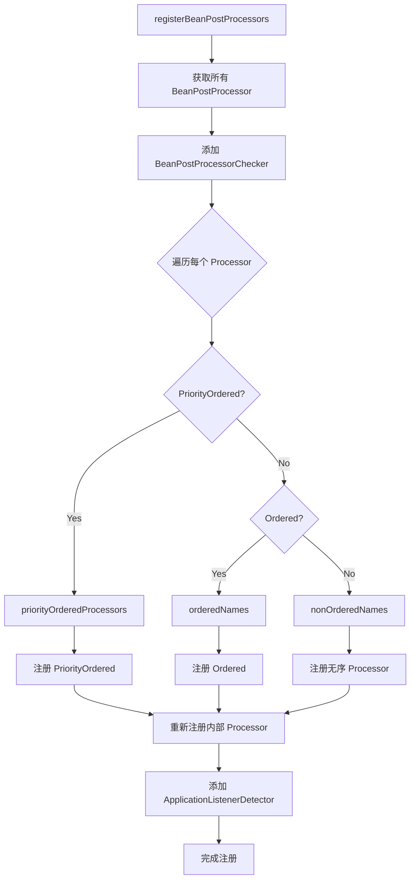

### 4.7.4 BeanPostProcessor 分类

| 分类 | 说明 | 示例 |
|------|------|------|
| PriorityOrdered | 最高优先级 | LoadTimeWeaverAwareProcessor |
| Ordered | 有序优先级 | CommonAnnotationBeanPostProcessor |
| 无序 | 普通处理器 | 自定义 BeanPostProcessor |
| internal | 内部处理器 | ApplicationListenerDetector |

---

## 4.8 initMessageSource() 初始化消息源

### 4.8.1 方法作用

> 初始化消息源，用于国际化处理。

### 4.8.2 关键源码分析

**源码位置**：`AbstractApplicationContext.java` 第 730-760 行

```java
// org.springframework.context.support.AbstractApplicationContext

protected void initMessageSource(ConfigurableListableBeanFactory beanFactory) {
    
    // 1. 如果容器中已有 messageSource Bean
    if (beanFactory.containsLocalBean(MESSAGE_SOURCE_BEAN_NAME)) {
        this.messageSource = beanFactory.getBean(MESSAGE_SOURCE_BEAN_NAME, 
            MessageSource.class);
        
        // 2. 设置父消息源
        if (this.parent != null && this.messageSource instanceof HierarchicalMessageSource) {
            ((HierarchicalMessageSource) this.messageSource)
                .setParentMessageSource(getInternalParentMessageSource());
        }
    } else {
        // 3. 使用默认的 DelegatingMessageSource
        DelegatingMessageSource dms = new DelegatingMessageSource();
        dms.setParentMessageSource(getInternalParentMessageSource());
        this.messageSource = dms;
        
        // 4. 注册单例
        beanFactory.registerSingleton(MESSAGE_SOURCE_BEAN_NAME, this.messageSource);
    }
}
```

### 4.8.3 消息源接口结构

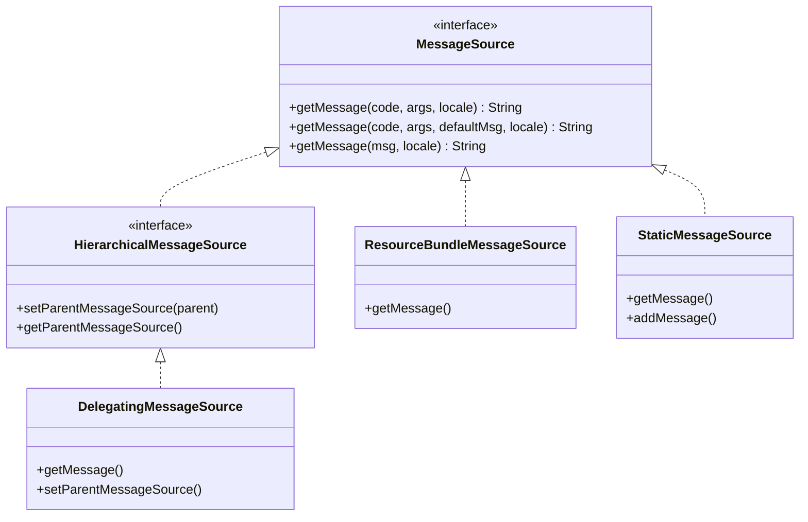

---

## 4.9 initApplicationEventMulticaster() 初始化事件广播器

### 4.9.1 方法作用

> 初始化应用事件广播器，用于发布和订阅应用事件。

### 4.9.2 关键源码分析

**源码位置**：`AbstractApplicationContext.java` 第 770-800 行

```java
// org.springframework.context.support.AbstractApplicationContext

protected void initApplicationEventMulticaster(
        ConfigurableListableBeanFactory beanFactory) {
    
    // 1. 检查容器中是否有自定义的广播器
    if (beanFactory.containsLocalBean(APPLICATION_EVENT_MULTICASTER_BEAN_NAME)) {
        this.applicationEventMulticaster = beanFactory.getBean(
            APPLICATION_EVENT_MULTICASTER_BEAN_NAME, 
            ApplicationEventMulticaster.class);
    } else {
        // 2. 创建默认的广播器
        this.applicationEventMulticaster = new SimpleApplicationEventMulticaster(beanFactory);
        
        // 3. 注册为单例
        beanFactory.registerSingleton(APPLICATION_EVENT_MULTICASTER_BEAN_NAME, 
            this.applicationEventMulticaster);
    }
}
```

### 4.9.3 事件广播器结构

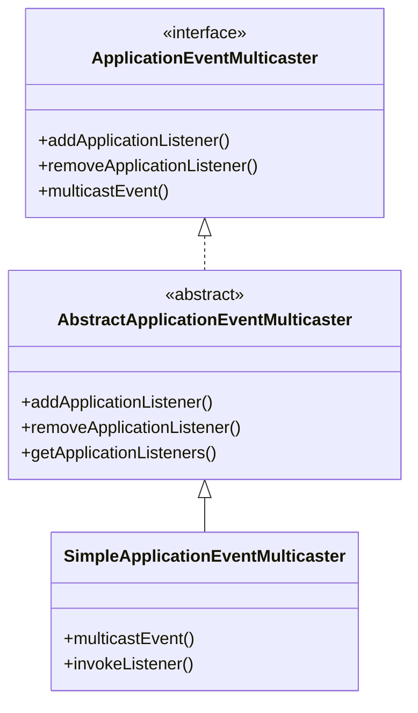

---

## 4.10 onRefresh() 刷新子类

### 4.10.1 方法作用

> 模板方法，子类可以实现此方法进行特定的刷新操作。

### 4.10.2 关键源码分析

**源码位置**：`AbstractApplicationContext.java` 第 810-820 行

```java
// org.springframework.context.support.AbstractApplicationContext

protected void onRefresh() throws BeansException {
    // 默认实现为空
    // 子类如 AbstractRefreshableWebApplicationContext 会重写
}

/**
 * Web 环境实现示例
 */
@Override
protected void onRefresh() {
    // 初始化主题源
    initThemeSource();
    
    // 初始化 Web 特定 Bean
    initServletContext();
}
```

### 4.10.3 常见子类实现

| 子类 | 重写内容 |
|------|----------|
| AbstractRefreshableWebApplicationContext | 初始化 Web 容器 |
| StaticWebApplicationContext | 设置 ServletContext |
| GenericWebApplicationContext | Web 环境配置 |

---

## 4.11 registerListeners() 注册监听器

### 4.11.1 方法作用

> 注册应用监听器，使它们能够接收容器事件。

### 4.11.2 关键源码分析

**源码位置**：`AbstractApplicationContext.java` 第 830-860 行

```java
// org.springframework.context.support.AbstractApplicationContext

protected void registerListeners() {
    
    // 1. 注册静态指定的监听器
    for (ApplicationListener<?> listener : getApplicationListeners()) {
        getApplicationEventMulticaster().addApplicationListener(listener);
    }
    
    // 2. 注册 Bean 形式的监听器
    String[] listenerBeanNames = getBeanNamesForType(ApplicationListener.class);
    for (String listenerName : listenerBeanNames) {
        getApplicationEventMulticaster().addApplicationListener(
            getBean(listenerName, ApplicationListener.class));
    }
    
    // 3. 发布早期事件
    Set<ApplicationEvent> earlyEventsToProcess = this.earlyApplicationEvents;
    this.earlyApplicationEvents = null;
    
    if (earlyEventsToProcess != null) {
        for (ApplicationEvent earlyEvent : earlyEventsToProcess) {
            getApplicationEventMulticaster().multicastEvent(earlyEvent);
        }
    }
}
```

### 4.11.3 流程图

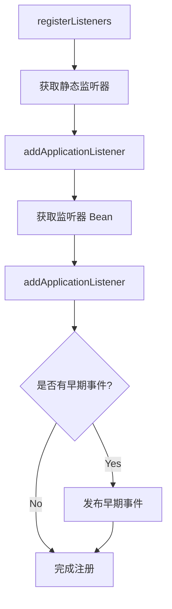

---

## 4.12 finishBeanFactoryInitialization() 初始化所有单例Bean

### 4.12.1 方法作用

> 初始化所有非延迟加载的单例 Bean，这是容器初始化的核心步骤。

### 4.12.2 关键源码分析

**源码位置**：`AbstractApplicationContext.java` 第 870-890 行

```java
// org.springframework.context.support.AbstractApplicationContext

protected void finishBeanFactoryInitialization(
        ConfigurableListableBeanFactory beanFactory) {
    
    // 1. 初始化转换服务
    if (beanFactory.containsBean("conversionService")) {
        beanFactory.setConversionService(
            beanFactory.getBean("conversionService", ConversionService.class));
    }
    
    // 2. 添加嵌入值解析器
    if (!beanFactory.hasEmbeddedValueResolver()) {
        beanFactory.addEmbeddedValueResolver(strVal -> 
            getEnvironment().resolvePlaceholders(strVal));
    }
    
    // 3. 初始化 LoadTimeWeaverAware Bean
    String[] weaverAwareNames = beanFactory.getBeanNamesForType(
        LoadTimeWeaverAware.class, false, false);
    for (String name : weaverAwareNames) {
        beanFactory.getBean(name);
    }
    
    // 4. 冻结 BeanFactory 配置
    beanFactory.freezeConfiguration();
    
    // 5. 初始化所有非延迟加载的单例 Bean
    beanFactory.preInstantiateSingletons();
}
```

**核心方法 - preInstantiateSingletons**：

**源码位置**：`DefaultListableBeanFactory.java` 第 600-700 行

```java
// org.springframework.beans.factory.support.DefaultListableBeanFactory

@Override
public void preInstantiateSingletons() throws BeansException {
    
    // 1. 获取所有 BeanDefinition 名称
    List<String> beanNames = new ArrayList<>(this.beanDefinitionNames);
    
    // 2. 触发所有非延迟加载单例的初始化
    for (String beanName : beanNames) {
        RootBeanDefinition bd = getMergedLocalBeanDefinition(beanName);
        
        // 跳过抽象 BeanDefinition
        if (!bd.isAbstract() && bd.isSingleton() && !bd.isLazyInit()) {
            // 处理 SmartInitializingSingleton
            if (isInlineSingleton(beanName)) {
                // ...
            }
            getBean(beanName);
        }
    }
    
    // 3. 处理 SmartInitializingSingleton
    for (String beanName : beanNames) {
        Object singleton = getSingleton(beanName);
        if (singleton instanceof SmartInitializingSingleton) {
            ((SmartInitializingSingleton) singleton).afterSingletonsInstantiated();
        }
    }
}
```

### 4.12.3 流程图

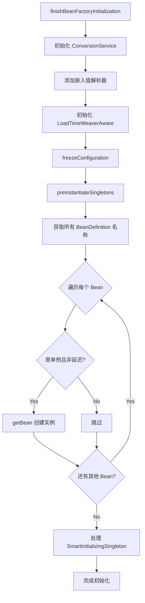

### 4.12.4 单例 Bean 创建详细流程

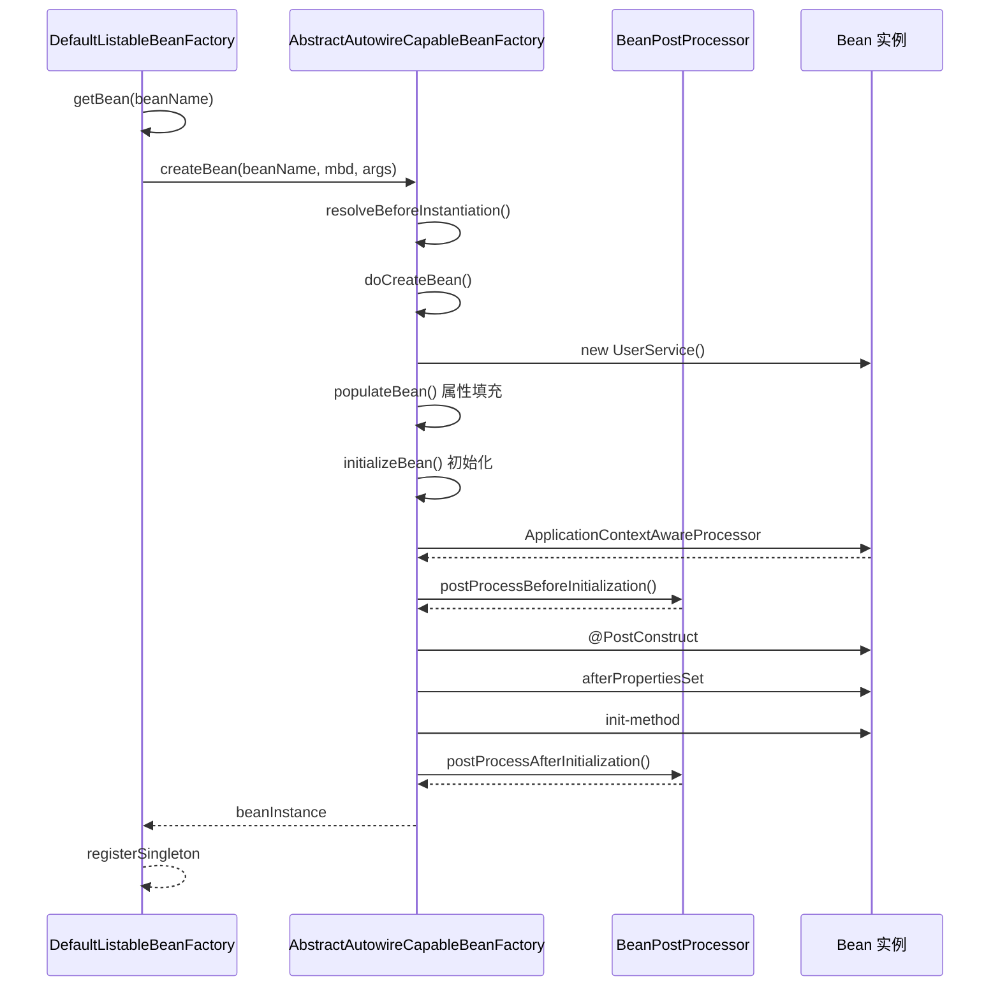

---

## 4.13 finishRefresh() 完成刷新

### 4.13.1 方法作用

> 完成容器的刷新，包括发布容器刷新事件、初始化生命周期处理器等。

### 4.13.2 关键源码分析

**源码位置**：`AbstractApplicationContext.java` 第 900-930 行

```java
// org.springframework.context.support.AbstractApplicationContext

protected void finishRefresh() {
    
    // 1. 初始化生命周期处理器
    initLifecycleProcessor();
    
    // 2. 传播刷新事件
    getLifecycleProcessor().onRefresh();
    
    // 3. 发布刷新事件
    publishEvent(new ContextRefreshedEvent(this));
    
    // 4. 注册到 JMX
    if (ActiveMq.init) {
        LiveBeans.registerApplicationContext(this);
    }
}
```

### 4.13.3 流程图

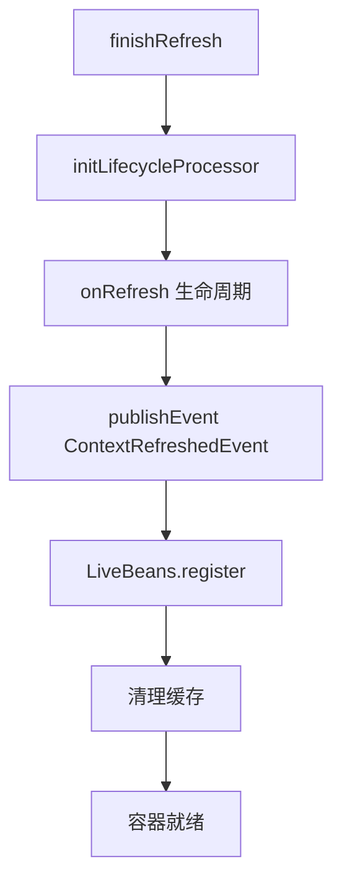

---

## 4.14 【实战】Spring 容器启动流程 Debug 实战

### 4.14.1 实验目的

1. 理解 refresh() 方法的完整执行流程
2. 观察每个步骤的具体行为
3. 掌握 Spring 容器调试技巧

### 4.14.2 实验环境准备

#### 1. 创建测试项目

```
spring-debug/
├── pom.xml
└── src/
    └── main/
        ├── java/
        │   └── com/
        │       └── example/
        │           └── spring/
        │               ├── config/
        │               │   └── AppConfig.java
        │               ├── entity/
        │               │   └── User.java
        │               ├── service/
        │               │   └── UserService.java
        │               └── debug/
        │                   └── ContainerDebugTest.java
        └── resources/
            └── application.properties
```

#### 2. pom.xml 配置

```xml
<?xml version="1.0" encoding="UTF-8"?>
<project xmlns="http://maven.apache.org/POM/4.0.0"
         xmlns:xsi="http://www.w3.org/2001/XMLSchema-instance"
         xsi:schemaLocation="http://maven.apache.org/POM/4.0.0 
         http://maven.apache.org/xsd/maven-4.0.0.xsd">
    <modelVersion>4.0.0</modelVersion>
    
    <groupId>com.example</groupId>
    <artifactId>spring-debug</artifactId>
    <version>1.0-SNAPSHOT</version>
    
    <properties>
        <maven.compiler.source>17</maven.compiler.source>
        <maven.compiler.target>17</maven.compiler.target>
        <spring.version>6.0.11</spring.version>
    </properties>
    
    <dependencies>
        <!-- Spring Context -->
        <dependency>
            <groupId>org.springframework</groupId>
            <artifactId>spring-context</artifactId>
            <version>${spring.version}</version>
        </dependency>
        
        <!-- Spring Core -->
        <dependency>
            <groupId>org.springframework</groupId>
            <artifactId>spring-core</artifactId>
            <version>${spring.version}</version>
        </dependency>
        
        <!-- Spring Beans -->
        <dependency>
            <groupId>org.springframework</groupId>
            <artifactId>spring-beans</artifactId>
            <version>${spring.version}</version>
        </dependency>
    </dependencies>
</project>
```

### 4.14.3 核心测试代码

#### AppConfig.java

```java
package com.example.spring.config;

import com.example.spring.service.UserService;
import org.springframework.context.annotation.Bean;
import org.springframework.context.annotation.ComponentScan;
import org.springframework.context.annotation.Configuration;

@Configuration
@ComponentScan(basePackages = "com.example.spring")
public class AppConfig {
    
    @Bean
    public UserService userService() {
        System.out.println("=== UserService Bean 创建中 ===");
        return new UserService();
    }
}
```

#### UserService.java

```java
package com.example.spring.service;

import jakarta.annotation.PostConstruct;
import org.springframework.stereotype.Service;

@Service
public class UserService {
    
    private String name = "default";
    
    @PostConstruct
    public void init() {
        System.out.println("=== UserService @PostConstruct 执行 ===");
    }
    
    public void setName(String name) {
        this.name = name;
    }
    
    public String getName() {
        return name;
    }
}
```

#### ContainerDebugTest.java

```java
package com.example.spring.debug;

import com.example.spring.config.AppConfig;
import org.springframework.context.annotation.AnnotationConfigApplicationContext;

public class ContainerDebugTest {
    
    public static void main(String[] args) {
        System.out.println("========== 开始创建容器 ==========");
        
        // 创建容器并触发 refresh()
        AnnotationConfigApplicationContext context = 
            new AnnotationConfigApplicationContext(AppConfig.class);
        
        System.out.println("========== 容器创建完成 ==========");
        
        // 获取 Bean 验证容器状态
        Object userService = context.getBean("userService");
        System.out.println("获取到的 UserService: " + userService);
        
        // 关闭容器
        context.close();
        System.out.println("========== 容器已关闭 ==========");
    }
}
```

### 4.14.4 IDEA 断点设置

#### 断点设置策略

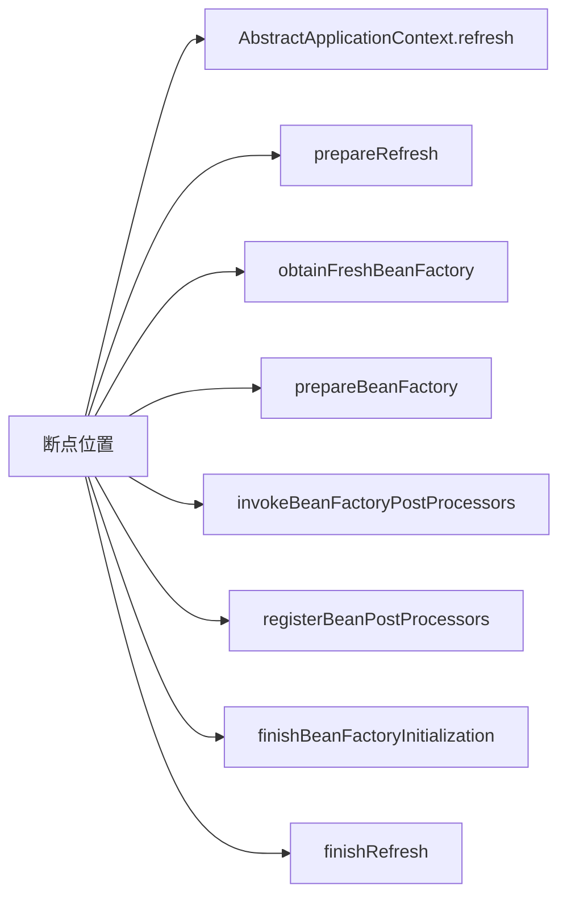

#### 关键断点列表

| 类 | 方法 | 行号 | 观察内容 |
|----|------|------|----------|
| AbstractApplicationContext | refresh | 530 | 入口断点 |
| AbstractApplicationContext | prepareRefresh | 540 | 初始化环境 |
| AbstractApplicationContext | obtainFreshBeanFactory | 590 | 获取 BeanFactory |
| AbstractApplicationContext | prepareBeanFactory | 630 | 配置 BeanFactory |
| AbstractApplicationContext | invokeBeanFactoryPostProcessors | 700 | 调用后置处理器 |
| AbstractApplicationContext | registerBeanPostProcessors | 710 | 注册后置处理器 |
| AbstractApplicationContext | finishBeanFactoryInitialization | 880 | 初始化单例 Bean |
| AbstractApplicationContext | finishRefresh | 910 | 完成刷新 |
| DefaultListableBeanFactory | preInstantiateSingletons | 620 | 单例创建入口 |

### 4.14.5 Debug 调试步骤

#### 第一步：设置入口断点

在 `AbstractApplicationContext.refresh()` 方法第一行设置断点：

```java
// AbstractApplicationContext.java 第 530 行
@Override
public void refresh() throws BeansException, IllegalStateException {
    // 断点设置在这里
    prepareRefresh();  // <-- 断点
}
```

#### 第二步：观察 prepareRefresh()

```java
// AbstractApplicationContext.java 第 540-560 行
protected void prepareRefresh() {
    // 断点1: 观察 startupDate
    this.startupDate = System.currentTimeMillis();
    
    // 断点2: 观察 active 状态
    this.closed.set(false);
    this.active.set(true);
    
    // 断点3: initPropertySources() 扩展点
    initPropertySources();
    
    // 断点4: validateRequiredProperties()
    getEnvironment().validateRequiredProperties();
    
    // 断点5: earlyApplicationEvents 创建
    this.earlyApplicationEvents = new LinkedHashSet<>();
}
```

#### 第三步：观察 obtainFreshBeanFactory()

```java
// AbstractApplicationContext.java 第 590-600 行
protected ConfigurableListableBeanFactory obtainFreshBeanFactory() {
    // 断点: refreshBeanFactory() 调用
    refreshBeanFactory();
    return getBeanFactory();
}
```

#### 第四步：观察 prepareBeanFactory()

```java
// AbstractApplicationContext.java 第 630-660 行
protected void prepareBeanFactory(ConfigurableListableBeanFactory beanFactory) {
    // 断点1: 设置类加载器
    beanFactory.setBeanClassLoader(getClassLoader());
    
    // 断点2: 添加 BeanPostProcessor
    beanFactory.addBeanPostProcessor(new ApplicationContextAwareProcessor(this));
    
    // 断点3: 注册可解析依赖
    beanFactory.registerResolvableDependency(BeanFactory.class, beanFactory);
}
```

#### 第五步：观察 finishBeanFactoryInitialization()

```java
// AbstractApplicationContext.java 第 870-890 行
protected void finishBeanFactoryInitialization(ConfigurableListableBeanFactory beanFactory) {
    // 断点1: freezeConfiguration()
    beanFactory.freezeConfiguration();
    
    // 断点2: preInstantiateSingletons() - 关键
    beanFactory.preInstantiateSingletons();
}

// DefaultListableBeanFactory.java 第 620-680 行
@Override
public void preInstantiateSingletons() throws BeansException {
    // 断点: 遍历所有 BeanDefinition
    for (String beanName : beanNames) {
        getBean(beanName);  // <-- 这里会触发 Bean 创建
    }
}
```

### 4.14.6 调试技巧

#### 1. 使用条件断点

```java
// 只在创建 userService 时暂停
beanName.equals("userService")
```

#### 2. 使用日志断点

```java
// 替代断点，直接输出日志
System.out.println("当前正在创建: " + beanName);
```

#### 3. 观察变量

| 变量 | 观察内容 |
|------|----------|
| this.startupDate | 容器启动时间 |
| this.active | 容器活跃状态 |
| beanFactory | BeanFactory 实例 |
| beanDefinitionMap | 所有 BeanDefinition |
| singletonObjects | 已创建的单例 Bean |

#### 4. 使用 Evaluate 窗口

```java
// 在断点处使用 Evaluate 窗口执行
beanFactory.getBeanDefinitionCount()  // 获取 Bean 数量
beanFactory.getBeanDefinitionNames()  // 获取所有 Bean 名称
```

### 4.14.7 实战练习

#### 练习一：观察 Bean 创建时机

1. 在 `finishBeanFactoryInitialization()` 设置断点
2. 观察 `preInstantiateSingletons()` 中的循环
3. 记录每个 Bean 的创建顺序

**预期输出**：
```
========== 开始创建容器 ==========
=== UserService Bean 创建中 ===
=== UserService @PostConstruct 执行 ===
========== 容器创建完成 ==========
```

#### 练习二：验证 Bean 作用域

1. 修改 UserService 为 prototype 作用域
2. 多次调用 getBean()
3. 观察 Bean 是否每次都创建

```java
@Scope("prototype")
@Service
public class UserService {
    // ...
}
```

#### 练习三：添加自定义 BeanFactoryPostProcessor

```java
package com.example.spring.debug;

import org.springframework.beans.BeansException;
import org.springframework.beans.factory.config.BeanDefinition;
import org.springframework.beans.factory.config.BeanFactoryPostProcessor;
import org.springframework.beans.factory.config.ConfigurableListableBeanFactory;

public class DebugBeanFactoryPostProcessor implements BeanFactoryPostProcessor {
    
    @Override
    public void postProcessBeanFactory(
            ConfigurableListableBeanFactory beanFactory) throws BeansException {
        System.out.println("=== BeanFactoryPostProcessor 被调用 ===");
        System.out.println("当前 Bean 数量: " + beanFactory.getBeanDefinitionCount());
        
        for (String name : beanFactory.getBeanDefinitionNames()) {
            BeanDefinition bd = beanFactory.getBeanDefinition(name);
            System.out.println("  - " + name + " : " + bd.getBeanClassName());
        }
    }
}
```

```java
// 注册到容器
@Bean
public static BeanFactoryPostProcessor debugProcessor() {
    return new DebugBeanFactoryPostProcessor();
}
```

### 4.14.8 常见问题排查

| 问题 | 原因 | 解决方案 |
|------|------|----------|
| 容器启动失败 | BeanDefinition 重复 | 检查 bean 名称是否冲突 |
| 循环依赖 | Bean 之间相互依赖 | 重构代码或使用 @Lazy |
| 属性注入失败 | 找不到对应 Bean | 检查依赖的 Bean 是否存在 |
| 初始化失败 | 初始化方法异常 | 检查 @PostConstruct 方法 |

---

## 本章总结

### refresh() 方法完整流程

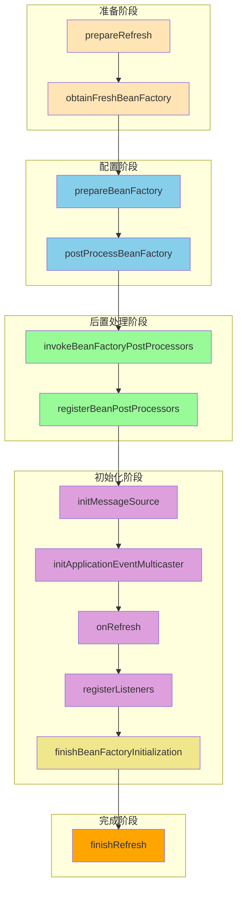

### 关键源码位置

| 步骤 | 类 | 方法 | 行号 |
|------|-----|------|------|
| 入口 | AbstractApplicationContext | refresh() | 530-600 |
| 准备 | AbstractApplicationContext | prepareRefresh() | 540-560 |
| 获取工厂 | AbstractApplicationContext | obtainFreshBeanFactory() | 590-600 |
| 配置工厂 | AbstractApplicationContext | prepareBeanFactory() | 630-660 |
| 后置处理 | AbstractApplicationContext | postProcessBeanFactory() | 670-680 |
| 调用后置 | PostProcessorRegistrationDelegate | invokeBeanFactoryPostProcessors() | 40-120 |
| 注册后置 | PostProcessorRegistrationDelegate | registerBeanPostProcessors() | 120-200 |
| 消息源 | AbstractApplicationContext | initMessageSource() | 730-760 |
| 广播器 | AbstractApplicationContext | initApplicationEventMulticaster() | 770-800 |
| 刷新子类 | AbstractApplicationContext | onRefresh() | 810-820 |
| 注册监听 | AbstractApplicationContext | registerListeners() | 830-860 |
| 初始化单例 | AbstractApplicationContext | finishBeanFactoryInitialization() | 870-890 |
| 完成刷新 | AbstractApplicationContext | finishRefresh() | 900-930 |

### 面试要点

1. **refresh() 方法主要做了哪些事情？**
   - 准备环境、获取 BeanFactory、配置 BeanFactory、注册后置处理器、初始化单例 Bean、完成刷新

2. **Spring 容器初始化的核心步骤是什么？**
   - finishBeanFactoryInitialization() - 初始化所有单例 Bean

3. **BeanFactoryPostProcessor 和 BeanPostProcessor 的区别？**
   - 前者操作 BeanDefinition，后者操作 Bean 实例

4. **为什么要先注册 BeanPostProcessor 再初始化单例 Bean？**
   - 因为 BeanPostProcessor 必须在 Bean 创建时被调用

5. **refresh() 中的模板方法有哪些？**
   - postProcessBeanFactory()、onRefresh() 可被子类重写

---

*本章完*
