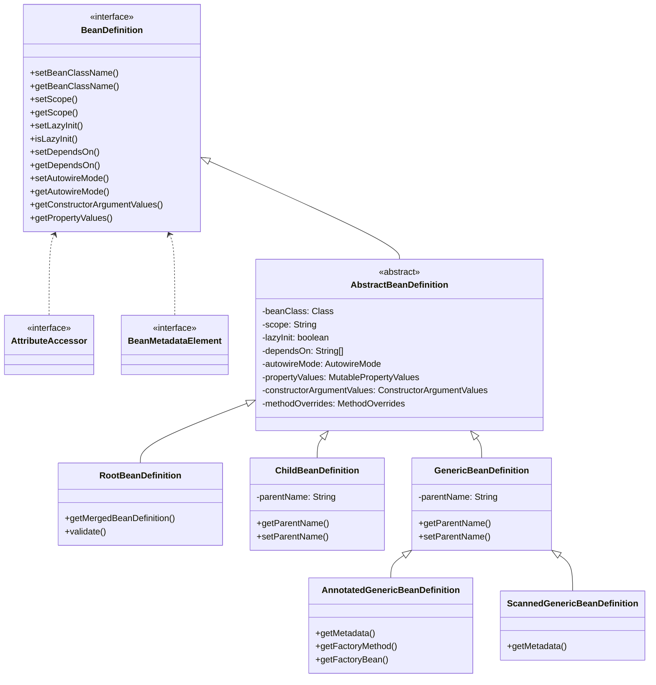
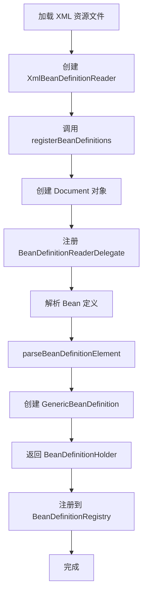
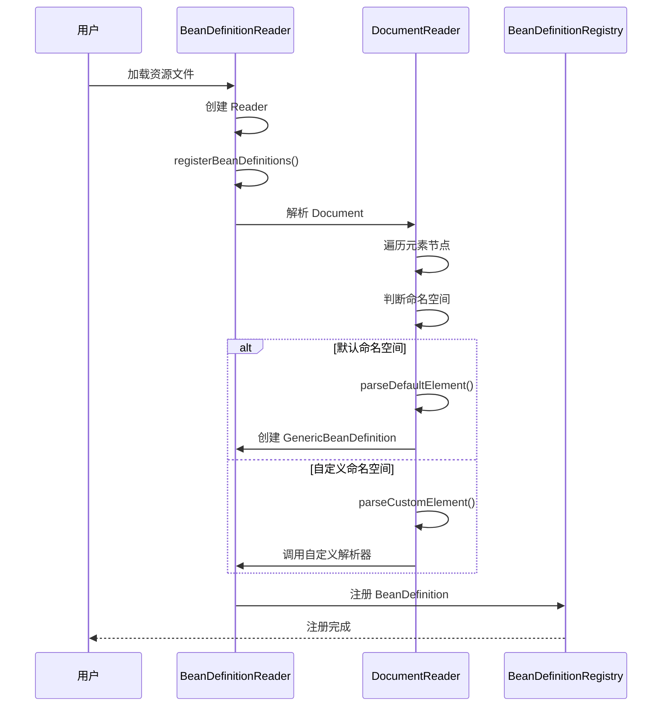
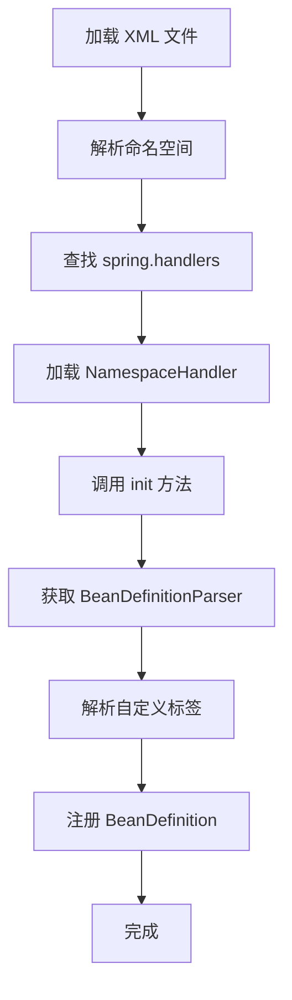

# 第5章：BeanDefinition 详解

## 5.1 BeanDefinition 体系结构

### 5.1.1 BeanDefinition 接口定义

`BeanDefinition` 是 Spring 容器中 Bean 的配置元数据抽象接口，它定义了 Bean 的各种属性信息。Spring 容器通过 `BeanDefinition` 来实例化、配置和管理 Bean。

**核心源码位置**：`org.springframework.beans.factory.config.BeanDefinition`

```java
public interface BeanDefinition extends AttributeAccessor, BeanMetadataElement {

    // 设置 Bean 的类名
    void setBeanClassName(@Nullable String beanClassName);

    // 获取 Bean 的类名
    @Nullable
    String getBeanClassName();

    // 设置 Bean 的作用域（如 singleton、prototype）
    void setScope(@Nullable String scope);

    // 获取 Bean 的作用域
    @Nullable
    String getScope();

    // 设置是否懒加载
    void setLazyInit(boolean lazyInit);

    // 获取是否懒加载
    boolean isLazyInit();

    // 设置 Bean 的依赖 Bean 名称数组
    void setDependsOn(@Nullable String... dependsOn);

    // 获取 Bean 的依赖 Bean 名称数组
    @Nullable
    String[] getDependsOn();

    // 设置是否自动装配
    void setAutowireMode(AutoTireMode autowireMode);

    // 获取自动装配模式
    AutoTireMode getAutowireMode();

    // 设置是否作为主自动装配候选者
    void setPrimary(boolean primary);

    // 获取是否作为主自动装配候选者
    boolean isPrimary();

    // 设置 FactoryBean 名称
    void setFactoryBeanName(@Nullable String factoryBeanName);

    // 获取 FactoryBean 名称
    @Nullable
    String getFactoryBeanName();

    // 设置工厂方法名
    void setFactoryMethodName(@Nullable String factoryMethodName);

    // 获取工厂方法名
    @Nullable
    String getFactoryMethodName();

    // 获取构造器参数值
    ConstructorArgumentValues getConstructorArgumentValues();

    // 获取属性值
    MutablePropertyValues getPropertyValues();

    // 获取 Bean 的角色（ROLE_APPLICATION、ROLE_SUPPORT、ROLE_INFRASTRUCTURE）
    int getRole();

    // 设置 Bean 的描述
    void setDescription(@Nullable String description);

    // 获取 Bean 的描述
    @Nullable
    String getDescription();

    // 判断是 RootBeanDefinition 还是 ChildBeanDefinition
    boolean isSynthetic();
}
```

**关键说明**：
- `AttributeAccessor`：提供元数据访问能力
- `BeanMetadataElement`：携带 Bean 的配置源对象

### 5.1.2 继承体系图



### 5.1.3 AbstractBeanDefinition

`AbstractBeanDefinition` 是 BeanDefinition 的抽象基类，实现了 BeanDefinition 接口的大部分通用功能。

**核心源码位置**：`org.springframework.beans.factory.support.AbstractBeanDefinition`

```java
public abstract class AbstractBeanDefinition extends BeanMetadataAttributeAccessor
        implements BeanDefinition, Cloneable {

    // Bean 的 Class 对象
    private volatile Object beanClass;

    // 作用域，默认为空字符串（单例）
    private String scope = "";

    // 是否懒加载
    private boolean lazyInit = false;

    // 依赖的 Bean 名称数组
    private String[] dependsOn;

    // 自动装配模式
    private AutowireMode autowireMode = Autowire.NO;

    // 是否作为主自动装配候选者
    private boolean primary = false;

    // Bean 的角色
    private int role = BeanDefinition.ROLE_APPLICATION;

    // 构造器参数值
    private ConstructorArgumentValues constructorArgumentValues;

    // 属性值
    private MutablePropertyValues propertyValues;

    // 方法覆盖
    private MethodOverrides methodOverrides;

    // 工厂 Bean 名称
    private String factoryBeanName;

    // 工厂方法名
    private String factoryMethodName;

    // 初始化方法名
    private String initMethodName;

    // 销毁方法名
    private String destroyMethodName;

    // 是否启用自动装配构造函数
    private boolean autowireConstructor = false;

    // 是否允许虚空属性
    private boolean suppressInjection = false;

    // ... 省略大量代码
}
```

### 5.1.4 RootBeanDefinition vs ChildBeanDefinition

**RootBeanDefinition**

`RootBeanDefinition` 是最常用的 BeanDefinition 实现类，代表一个没有父 Bean 的合并 Bean 定义。

```java
public class RootBeanDefinition extends AbstractBeanDefinition {

    // 存储合并后的 Bean 定义
    private BeanDefinitionHolder mergedBeanDefinition;

    // 验证 Bean 定义
    public void validate() throws BeanDefinitionValidationException {
        // 验证方法
    }

    // 获取合并后的 Bean 定义
    public RootBeanDefinition getMergedBeanDefinition() {
        return this;
    }
}
```

**ChildBeanDefinition**

`ChildBeanDefinition` 是子 Bean 定义，可以继承父 BeanDefinition 的配置。

```java
public class ChildBeanDefinition extends AbstractBeanDefinition {

    // 父 Bean 名称
    private String parentName;

    // 构造器
    public ChildBeanDefinition(String parentName) {
        this.parentName = parentName;
    }

    // 获取父名称
    public String getParentName() {
        return this.parentName;
    }

    // 设置父名称
    public void setParentName(String parentName) {
        this.parentName = parentName;
    }
}
```

**两者的区别**：

| 特性 | RootBeanDefinition | ChildBeanDefinition |
|------|-------------------|---------------------|
| 父 Bean | 无 | 有（必须指定 parentName） |
| 合并功能 | 已经是合并后的结果 | 会与父 Bean 合并 |
| 使用场景 | 独立 Bean 定义 | 继承/扩展已有 Bean |
| 优先级 | 较低 | 较高（子覆盖父） |

**合并过程源码**：`AbstractBeanDefinitionReader.getMergedBeanDefinition()`

```java
protected RootBeanDefinition getMergedBeanDefinition(
        String beanName, BeanDefinition bd, @Nullable BeanDefinition containingBd)
        throws BeanDefinitionStoreException {

    // 最终返回的是 RootBeanDefinition
    RootBeanDefinition merged = new RootBeanDefinition(bd);

    // 如果有父 Bean，进行合并
    if (bd instanceof ChildBeanDefinition childBd) {
        String parentName = childBd.getParentName();
        // 获取父 Bean 定义
        BeanDefinition parent = getBeanDefinition(parentName);
        // 递归合并父 Bean
        RootBeanDefinition parentMerged = getMergedBeanDefinition(parentName, parent, null);
        // 使用父 Bean 的属性覆盖
        merged.setParentName(parentName);
        // 合并属性
        merged.overrideFrom(parentMerged);
    } else {
        merged.setBeanClassName(bd.getBeanClassName());
    }

    // 作用域合并
    if (StringUtils.hasLength(bd.getScope())) {
        merged.setScope(bd.getScope());
    }

    return merged;
}
```

### 5.1.5 GenericBeanDefinition

`GenericBeanDefinition` 是 Spring 2.5 引入的通用 Bean 定义类，是目前推荐使用的实现。

```java
public class GenericBeanDefinition extends AbstractBeanDefinition {

    // 父 Bean 名称
    @Nullable
    private String parentName;

    public GenericBeanDefinition() {
        super();
    }

    public GenericBeanDefinition(BeanDefinition original) {
        super(original);
    }

    @Override
    @Nullable
    public String getParentName() {
        return this.parentName;
    }

    @Override
    public void setParentName(@Nullable String parentName) {
        this.parentName = parentName;
    }
}
```

**使用示例**：

```xml
<!-- XML 配置中使用 GenericBeanDefinition -->
<bean id="myService" class="com.example.MyServiceImpl">
    <property name="dependency" ref="myDependency"/>
</bean>
```

```java
// API 方式创建 GenericBeanDefinition
GenericBeanDefinition beanDefinition = new GenericBeanDefinition();
beanDefinition.setBeanClass(MyServiceImpl.class);
beanDefinition.setParentName("parentService");
beanDefinition.setLazyInit(true);
beanDefinition.getPropertyValues().add("dependency", new RuntimeBeanReference("myDependency"));
```

## 5.2 AbstractBeanDefinition 属性详解

### 5.2.1 所有属性表格整理

| 属性名 | 类型 | 默认值 | 说明 |
|--------|------|--------|------|
| beanClass | Object | null | Bean 的 Class 对象或类名字符串 |
| scope | String | "" (空字符串，表示单例) | Bean 的作用域 |
| lazyInit | boolean | false | 是否延迟初始化 |
| dependsOn | String[] | null | 依赖的 Bean 名称数组 |
| autowireMode | AutowireMode | Autowire.NO | 自动装配模式 |
| primary | boolean | false | 是否为主自动装配候选者 |
| factoryBeanName | String | null | 工厂 Bean 名称 |
| factoryMethodName | String | null | 工厂方法名 |
| initMethodName | String | null | 初始化方法名 |
| destroyMethodName | String | null | 销毁方法名 |
| constructorArgumentValues | ConstructorArgumentValues | null | 构造器参数值 |
| propertyValues | MutablePropertyValues | null | 属性值 |
| methodOverrides | MethodOverrides | null | 方法覆盖配置 |
| role | int | ROLE_APPLICATION | Bean 的角色 |
| abstract | boolean | false | 是否抽象 Bean |
| singleton | boolean | true | 是否单例（已废弃，使用 scope） |
| prototype | boolean | false | 是否原型（已废弃，使用 scope） |

### 5.2.2 核心属性详解

#### beanClass

Bean 的类信息，可以是 Class 对象或类名。

```java
// 设置方式1：使用 Class 对象
beanDefinition.setBeanClass(MyServiceImpl.class);

// 设置方式2：使用类名字符串
beanDefinition.setBeanClassName("com.example.MyServiceImpl");

// 获取方式
Class<?> clazz = (Class<?>) beanDefinition.getBeanClass();
```

#### scope

Bean 的作用域，决定 Bean 的生命周期。

```java
// 常用作用域
beanDefinition.setScope("singleton");  // 单例（默认）
beanDefinition.setScope("prototype"); // 原型（每次获取新实例）
beanDefinition.setScope("request");   // 请求（Web 环境）
beanDefinition.setScope("session");   // 会话（Web 环境）

// 获取作用域
String scope = beanDefinition.getScope();
```

#### lazyInit

控制 Bean 是否延迟初始化。

```java
// 设置为懒加载
beanDefinition.setLazyInit(true);

// 获取懒加载状态
boolean isLazy = beanDefinition.isLazyInit();
```

**懒加载说明**：
- `lazyInit=false`（默认）：容器启动时立即创建 Bean
- `lazyInit=true`：容器启动时不创建，首次访问时才创建

#### dependsOn

声明 Bean 的依赖关系，确保依赖 Bean 先创建。

```java
// 设置依赖多个 Bean
beanDefinition.setDependsOn("dataSource", "transactionManager");

// 获取依赖
String[] deps = beanDefinition.getDependsOn();
```

**示例**：

```xml
<bean id="serviceA" class="com.example.ServiceA" depends-on="dataSource"/>
<bean id="dataSource" class="com.example.DataSource"/>
```

#### autowireMode

自动装配模式，控制 Spring 如何自动装配属性。

```java
// 自动装配模式枚举
public enum AutowireMode {
    NO,                    // 不自动装配（默认）
    BY_NAME,               // 按名称自动装配
    BY_TYPE,               // 按类型自动装配
    CONSTRUCTOR             // 构造器自动装配
}

// 设置自动装配模式
beanDefinition.setAutowireMode(AutowireMode.BY_NAME);

// 获取自动装配模式
AutowireMode mode = beanDefinition.getAutowireMode();
```

**各模式详解**：

```java
// NO - 不自动装配，需要显式指定
<bean id="myService" class="com.example.MyService">
    <property name="dao" ref="myDao"/>  <!-- 显式指定 -->
</bean>

// BY_NAME - 按属性名自动装配
// 如果属性名为 "dao"，则自动查找 id="dao" 的 Bean
<bean id="myService" class="com.example.MyService" autowire="byName"/>

// BY_TYPE - 按属性类型自动装配
// 如果属性类型为 UserDao，则自动查找类型为 UserDao 的 Bean
<bean id="myService" class="com.example.MyService" autowire="byType"/>

// CONSTRUCTOR - 按构造器参数类型自动装配
<bean id="myService" class="com.example.MyService" autowire="constructor"/>
```

#### propertyValues

属性值集合，用于配置 Bean 的属性注入。

```java
// 创建属性值
MutablePropertyValues propertyValues = new MutablePropertyValues();

// 添加简单属性
propertyValues.add("username", "admin");
propertyValues.add("password", "123456");

// 添加引用其他 Bean
propertyValues.add("dataSource", new RuntimeBeanReference("dataSource"));

// 设置到 Bean 定义
beanDefinition.setPropertyValues(propertyValues);

// 获取属性值
Object value = beanDefinition.getPropertyValues().get("username");
```

#### constructorArgumentValues

构造器参数值，用于构造器注入。

```java
// 创建构造器参数值
ConstructorArgumentValues constructorArgs = new ConstructorArgumentValues();

// 添加参数值（按索引顺序）
constructorArgs.addIndexedArgumentValue(0, "第一个参数");
constructorArgs.addIndexedArgumentValue(1, "第二个参数");

// 或者添加类型匹配的参数
constructorArgs.addGenericArgumentValue("value");

// 设置到 Bean 定义
beanDefinition.setConstructorArgumentValues(constructorArgs);

// 获取参数值
ConstructorArgumentValues args = beanDefinition.getConstructorArgumentValues();
```

#### methodOverrides

方法覆盖配置，用于指定要替换的方法。

```java
// 创建方法覆盖
MethodOverrides methodOverrides = new MethodOverrides();

// 添加 Lookup 方法注入
methodOverrides.add(new LookupOverride("getService", MyService.class));

// 添加替换方法
methodOverrides.add(new ReplaceOverride("invoke", MyInterceptor.class));

// 设置到 Bean 定义
beanDefinition.setMethodOverrides(methodOverrides);
```

## 5.3 BeanDefinition 的解析过程

### 5.3.1 XmlBeanDefinitionReader 解析流程

`XmlBeanDefinitionReader` 负责从 XML 文件解析 Bean 定义。



**核心源码位置**：`org.springframework.beans.factory.xml.XmlBeanDefinitionReader`

```java
public class XmlBeanDefinitionReader extends AbstractBeanDefinitionReader {

    // 从 XML 文件注册 Bean 定义
    public int registerBeanDefinitions(Document document, @Nullable DocumentDefaultsDefinition defaults) {
        // 创建 BeanDefinitionDocumentReader
        BeanDefinitionDocumentReader documentReader = createBeanDefinitionDocumentReader();
        // 获取注册表
        BeanDefinitionRegistry registry = getBeanFactory();

        // 加载上下文环境
        int countBefore = registry.getBeanDefinitionCount();

        // 创建解析上下文
        BeanDefinitionDocumentContext context = new BeanDefinitionDocumentContext(registry);
        // 解析 Document 并注册
        documentReader.registerBeanDefinitions(document, context);

        return registry.getBeanDefinitionCount() - countBefore;
    }

    // 创建 BeanDefinitionDocumentReader
    protected BeanDefinitionDocumentReader createBeanDefinitionDocumentReader() {
        return new DefaultBeanDefinitionDocumentReader();
    }
}
```

**详细解析流程**：

```java
// DefaultBeanDefinitionDocumentReader 中的核心方法
public class DefaultBeanDefinitionDocumentReader implements BeanDefinitionDocumentReader {

    @Override
    public void registerBeanDefinitions(Document document, BeanDefinitionParsingContext context) {
        // 获取根元素
        Element root = document.getDocumentElement();

        // 核心解析方法
        doRegisterBeanDefinitions(root);
    }

    protected void doRegisterBeanDefinitions(Element root) {
        // 解析前处理
        preProcessXml(root);

        // 解析 Bean 定义
        parseBeanDefinitions(root);

        // 解析后处理
        postProcessXml(root);
    }

    // 解析所有 Bean 元素
    protected void parseBeanDefinitions(Element root) {
        NodeList nl = root.getChildNodes();
        for (int i = 0; i < nl.getLength(); i++) {
            Node node = nl.item(i);
            if (node instanceof Element) {
                Element beanElem = (Element) node;
                // 根据命名空间判断是否自定义标签
                if (isDefaultNamespace(beanElem)) {
                    // 解析标准 <bean> 标签
                    parseDefaultElement(beanElem);
                } else {
                    // 解析自定义标签（如 <context:component-scan/>）
                    parseCustomElement(beanElem);
                }
            }
        }
    }
}
```

### 5.3.2 PropertiesBeanDefinitionReader

从 Properties 文件解析 Bean 定义。

**核心源码位置**：`org.springframework.beans.factory.support.PropertiesBeanDefinitionReader`

```java
public class PropertiesBeanDefinitionReader extends AbstractBeanDefinitionReader {

    // 从 Properties 注册 Bean 定义
    public int registerBeanDefinitions(Resource resource) throws BeansException {
        try {
            InputStream is = resource.getInputStream();
            try {
                Properties props = new Properties();
                props.load(is);
                return registerBeanDefinitions(props, resource.getDescription());
            } finally {
                is.close();
            }
        } catch (IOException ex) {
            throw new BeanDefinitionStoreException(resource.getDescription(), ex);
        }
    }

    public int registerBeanDefinitions(Properties props, String resourceDescription) {
        // 创建临时注册表
        BeanDefinitionRegistry tempRegistry = new SimpleBeanDefinitionRegistry();
        int count = doRegisterBeanDefinitions(props, tempRegistry, resourceDescription);

        // 合并到主注册表
        for (String beanName : tempRegistry.getBeanDefinitionNames()) {
            ((DefaultListableBeanFactory) getBeanFactory())
                .registerBeanDefinition(beanName, tempRegistry.getBeanDefinition(beanName));
        }
        return count;
    }
}
```

**Properties 格式示例**：

```properties
# Bean 定义格式：bean.类名.属性=值
bean.Person.class=com.example.Person
bean.Person.scope=singleton
bean.Person.lazyInit=true
bean.Person.properties.username=张三
bean.Person.properties.age=25

# 构造器参数
bean.Order.class=com.example.Order
bean.Order.constructor-args[0]=参数1
bean.Order.constructor-args[1]=参数2
```

### 5.3.3 AnnotatedBeanDefinitionReader

从注解类解析 Bean 定义。

**核心源码位置**：`org.springframework.context.annotation.AnnotatedBeanDefinitionReader`

```java
public class AnnotatedBeanDefinitionReader {

    private final BeanDefinitionRegistry registry;

    private BeanNameGenerator beanNameGenerator = new AnnotationBeanNameGenerator();

    private ScopeMetadataResolver scopeMetadataResolver = new AnnotationScopeMetadataResolver();

    // 注册一个注解类为 Bean
    public void register(Class<?>... componentClasses) {
        for (Class<?> componentClass : componentClasses) {
            registerBean(componentClass);
        }
    }

    public void registerBean(Class<?> beanClass) {
        doRegisterBean(beanClass, null, null, null);
    }

    private <T> void doRegisterBean(Class<T> beanClass, @Nullable String name,
            @Nullable Class<? extends Annotation>[] qualifiers, @Nullable Supplier<T> factory) {

        // 创建 AnnotatedGenericBeanDefinition
        AnnotatedGenericBeanDefinition abd = new AnnotatedGenericBeanDefinition(beanClass);

        // 解析 Scope
        ScopeMetadata scopeMetadata = scopeMetadataResolver.resolveScopeMetadata(abd);
        abd.setScope(scopeMetadata.getScopeName());

        // 生成 Bean 名称
        String beanName = (name != null ? name : this.beanNameGenerator.generateBeanName(abd, registry));

        // 处理注解（@Lazy, @Primary, @Role 等）
        AnnotationConfigUtils.processCommonDefinitionAnnotations(abd);

        // 处理 Qualifier
        if (qualifiers != null) {
            for (Class<? extends Annotation> qualifier : qualifiers) {
                if (Primary.class == qualifier) {
                    abd.setPrimary(true);
                } else if (Lazy.class == qualifier) {
                    abd.setLazyInit(true);
                } else {
                    abd.addQualifier(new AutowireCandidateQualifier(qualifier));
                }
            }
        }

        // 注册 Bean 定义
        BeanDefinitionReaderUtils.registerBeanDefinition(
            holder, this.registry);
    }
}
```

### 5.3.4 整体解析流程图



## 5.4 【实战】自定义标签解析实战

### 5.4.1 Spring 如何解析 <bean> 标签

Spring 通过 `BeanDefinitionParserDelegate` 来解析 `<bean>` 标签。

**核心源码位置**：`org.springframework.beans.factory.xml.BeanDefinitionParserDelegate`

```java
public class BeanDefinitionParserDelegate {

    // 解析 <bean> 元素
    public BeanDefinitionHolder parseBeanDefinitionElement(Element ele) {
        return parseBeanDefinitionElement(ele, null);
    }

    public BeanDefinitionHolder parseBeanDefinitionElement(Element ele, @Nullable BeanDefinition containingBean) {
        // 解析 id 属性
        String id = ele.getAttribute(ID_ATTRIBUTE);

        // 解析 name 属性
        String nameAttr = ele.getAttribute(NAME_ATTRIBUTE);

        // 解析 class 属性
        String className = ele.getAttribute(CLASS_ATTRIBUTE);

        // 解析 parent 属性
        String parent = ele.getAttribute(PARENT_ATTRIBUTE);

        // 创建 GenericBeanDefinition
        AbstractBeanDefinition bd = createBeanDefinition(className, parent);

        // 解析其他属性（scope, lazy-init, autowire 等）
        parseBeanDefinitionAttributes(ele, className, containingBean, bd);

        // 解析 description
        bd.setDescription(DomUtils.getChildElementValueByTagName(ele, DESCRIPTION_CHILD_ELEMENT));

        // 解析 <meta> 标签
        parseMetaElements(ele, bd);

        // 解析 < lookup-method > 标签
        parseLookupOverrideSubElements(ele, bd.getMethodOverrides());

        // 解析 < replaced-method > 标签
        parseReplacedMethodSubElements(ele, bd.getMethodOverrides());

        // 解析 < constructor-arg > 标签
        parseConstructorArgElements(ele, bd);

        // 解析 < property > 标签
        parsePropertyElements(ele, bd);

        // 解析 < qualifier > 标签
        parseQualifierElements(ele, bd);

        return new BeanDefinitionHolder(bd, id, aliasesArray);
    }

    // 创建 BeanDefinition
    protected AbstractBeanDefinition createBeanDefinition(
            @Nullable String className, @Nullable String parent) {
        return BeanDefinitionReaderUtils.createBeanDefinition(
                parentName, className, null);
    }
}
```

### 5.4.2 如何自定义扩展标签

自定义扩展标签的步骤：

1. 创建 XSD 文件定义标签结构
2. 创建标签解析器
3. 创建 Handler 映射
4. 注册扩展命名空间

**步骤1：创建 XSD 文件**

```xml
<!-- META-INF/user.xsd -->
<?xml version="1.0" encoding="UTF-8"?>
<xsd:schema xmlns:xsd="http://www.w3.org/2001/XMLSchema"
    xmlns="http://www.example.com/schema/user"
    targetNamespace="http://www.example.com/schema/user">

    <xsd:element name="user">
        <xsd:complexType>
            <xsd:sequence>
                <xsd:element name="name" type="xsd:string"/>
                <xsd:element name="age" type="xsd:int"/>
            </xsd:sequence>
            <xsd:attribute name="id" type="xsd:string" use="required"/>
        </xsd:complexType>
    </xsd:element>

</xsd:schema>
```

**步骤2：创建 User 实体类**

```java
package com.example.schema;

public class User {
    private String id;
    private String name;
    private int age;

    // getters and setters
    public String getId() { return id; }
    public void setId(String id) { this.id = id; }
    public String getName() { return name; }
    public void setName(String name) { this.name = name; }
    public int getAge() { return age; }
    public void setAge(int age) { this.age = age; }

    @Override
    public String toString() {
        return "User{id='" + id + "', name='" + name + "', age=" + age + "}";
    }
}
```

**步骤3：创建 BeanDefinitionParser**

```java
package com.example.schema;

import org.springframework.beans.factory.config.BeanDefinition;
import org.springframework.beans.factory.support.BeanDefinitionRegistry;
import org.springframework.beans.factory.support.BeanDefinitionReaderUtils;
import org.springframework.beans.factory.support.RootBeanDefinition;
import org.springframework.util.StringUtils;
import org.w3c.dom.Element;

public class UserBeanDefinitionParser extends AbstractBeanDefinitionParser {

    @Override
    protected AbstractBeanDefinition parseInternal(Element element, ParserContext parserContext) {
        // 创建 Bean 定义
        RootBeanDefinition beanDefinition = new RootBeanDefinition();

        // 设置 Bean 类
        beanDefinition.setBeanClass(User.class);

        // 解析 id 属性
        String id = element.getAttribute("id");
        if (!StringUtils.hasText(id)) {
            id = element.getAttribute("name") + "-" + element.getAttribute("age");
        }

        // 解析 name 子元素
        String name = getSingleValue(element, "name");
        String age = getSingleValue(element, "age");

        // 设置属性值
        beanDefinition.getPropertyValues().add("id", id);
        beanDefinition.getPropertyValues().add("name", name);
        beanDefinition.getPropertyValues().add("age", Integer.parseInt(age));

        // 设置懒加载
        beanDefinition.setLazyInit(false);

        // 注册 Bean 定义
        String beanName = BeanDefinitionReaderUtils.generateBeanName(beanDefinition, parserContext.getRegistry());
        parserContext.getRegistry().registerBeanDefinition(beanName, beanDefinition);

        return beanDefinition;
    }

    private String getSingleValue(Element element, String tagName) {
        return element.getElementsByTagNameNS("http://www.example.com/schema/user", tagName).item(0).getTextContent();
    }
}
```

**步骤4：创建 NamespaceHandler**

```java
package com.example.schema;

import org.springframework.beans.factory.xml.NamespaceHandlerSupport;

public class UserNamespaceHandler extends NamespaceHandlerSupport {

    @Override
    public void init() {
        // 注册 <user> 标签的解析器
        registerBeanDefinitionParser("user", new UserBeanDefinitionParser());
    }
}
```

**步骤5：创建 spring.handlers**

在 `META-INF/spring.handlers` 文件中：

```properties
http\://www.example.com/schema/user=com.example.schema.UserNamespaceHandler
```

**步骤6：创建 spring.schemas**

在 `META-INF/spring.schemas` 文件中：

```properties
http\://www.example.com/schema/user.xsd=META-INF/user.xsd
```

### 5.4.3 完整实战代码

**完整项目结构**：

```
src/
├── main/
│   ├── java/
│   │   └── com/example/schema/
│   │       ├── User.java
│   │       ├── UserBeanDefinitionParser.java
│   │       └── UserNamespaceHandler.java
│   └── resources/
│       ├── META-INF/
│       │   ├── user.xsd
│       │   ├── spring.handlers
│       │   └── spring.schemas
│       └── applicationContext.xml
```

**applicationContext.xml 使用自定义标签**：

```xml
<?xml version="1.0" encoding="UTF-8"?>
<beans xmlns="http://www.springframework.org/schema/beans"
       xmlns:xsi="http://www.w3.org/2001/XMLSchema-instance"
       xmlns:user="http://www.example.com/schema/user"
       xsi:schemaLocation="
           http://www.springframework.org/schema/beans
           http://www.springframework.org/schema/beans/spring-beans.xsd
           http://www.example.com/schema/user
           http://www.example.com/schema/user.xsd">

    <!-- 使用自定义标签 -->
    <user:user id="user1">
        <user:name>张三</user:name>
        <user:age>25</user:age>
    </user:user>

    <user:user id="user2">
        <user:name>李四</user:name>
        <user:age>30</user:age>
    </user:user>

</beans>
```

**测试类**：

```java
package com.example;

import com.example.schema.User;
import org.springframework.context.ApplicationContext;
import org.springframework.context.support.ClassPathXmlApplicationContext;

public class CustomNamespaceTest {

    public static void main(String[] args) {
        ApplicationContext context = new ClassPathXmlApplicationContext("applicationContext.xml");

        User user1 = context.getBean("user1", User.class);
        System.out.println("User1: " + user1);

        User user2 = context.getBean("user2", User.class);
        System.out.println("User2: " + user2);
    }
}
```

**运行结果**：

```
User1: User{id='user1', name='张三', age=25}
User2: User{id='user2', name='李四', age=30}
```

**关键源码位置**：

- 标签解析入口：`org.springframework.beans.factory.xml.NamespaceHandlerResolver`
- 自定义命名空间注册：`org.springframework.beans.factory.xml.NamespaceHandlerSupport#registerBeanDefinitionParser`
- 解析流程图：



**Spring 内置扩展标签示例**：

| 命名空间 | 标签 | 解析器类 |
|---------|------|---------|
| context | component-scan | ComponentScanBeanDefinitionParser |
| context | property-placeholder | PropertyPlaceholderBeanDefinitionParser |
| tx | annotation-driven | AnnotationDrivenBeanDefinitionParser |
| aop | config | ConfigBeanDefinitionParser |
