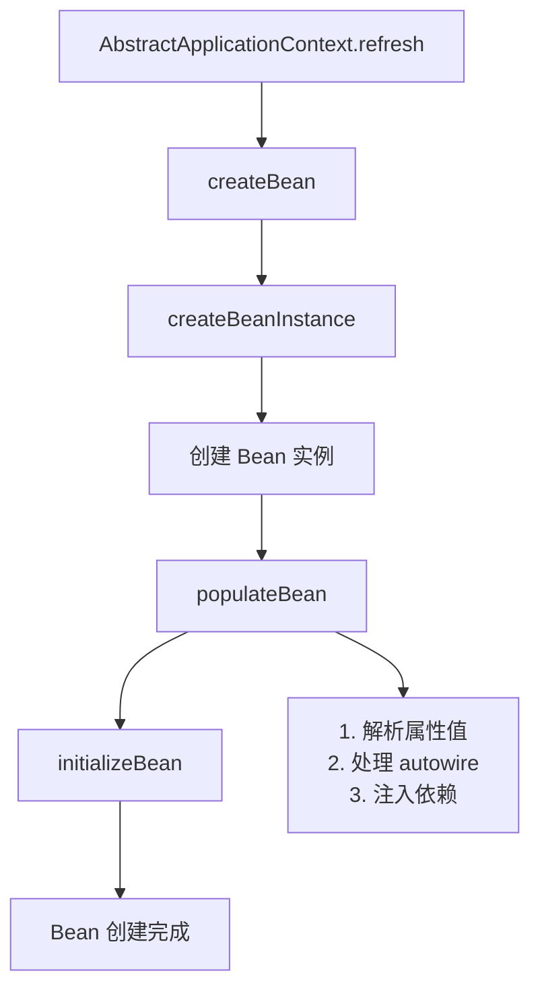
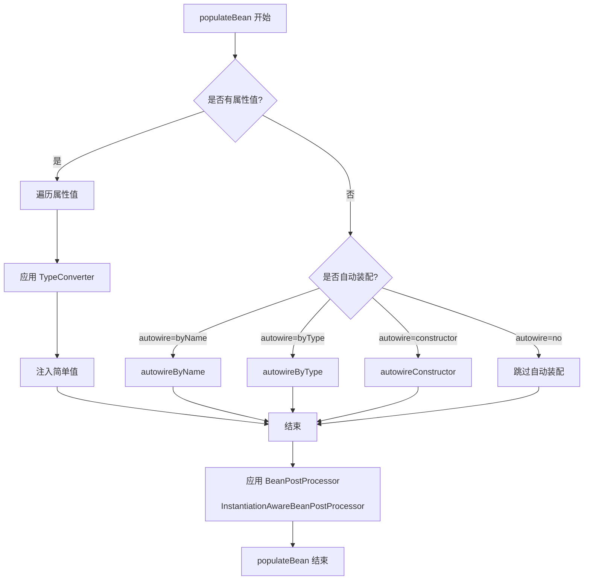
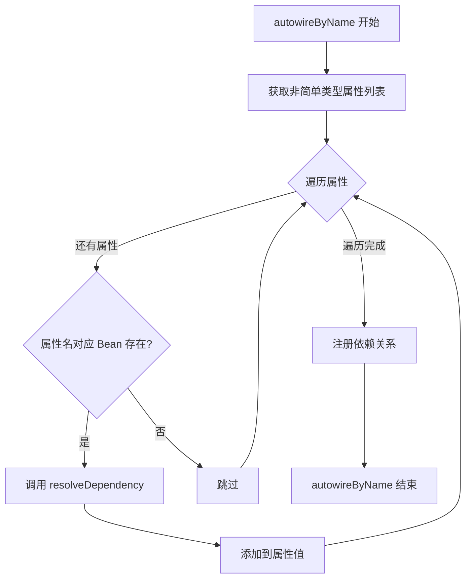
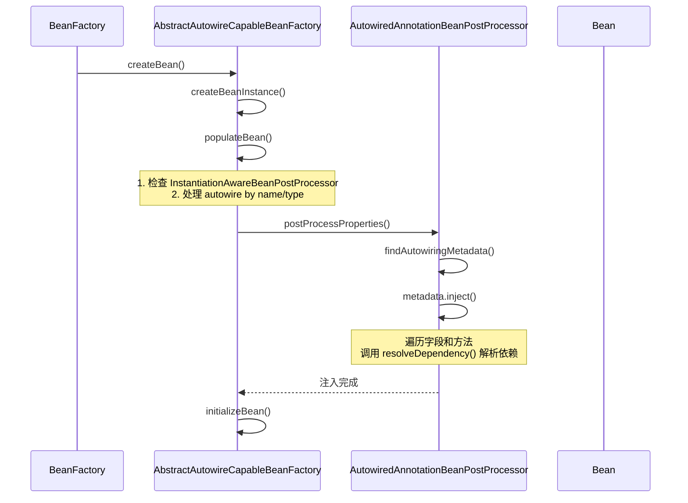
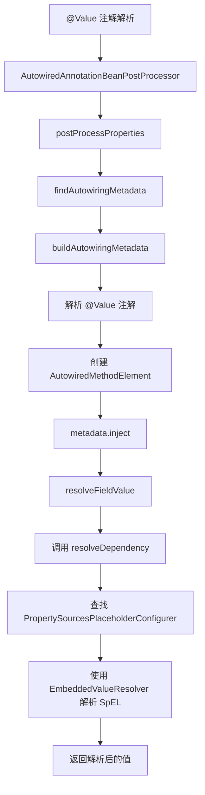
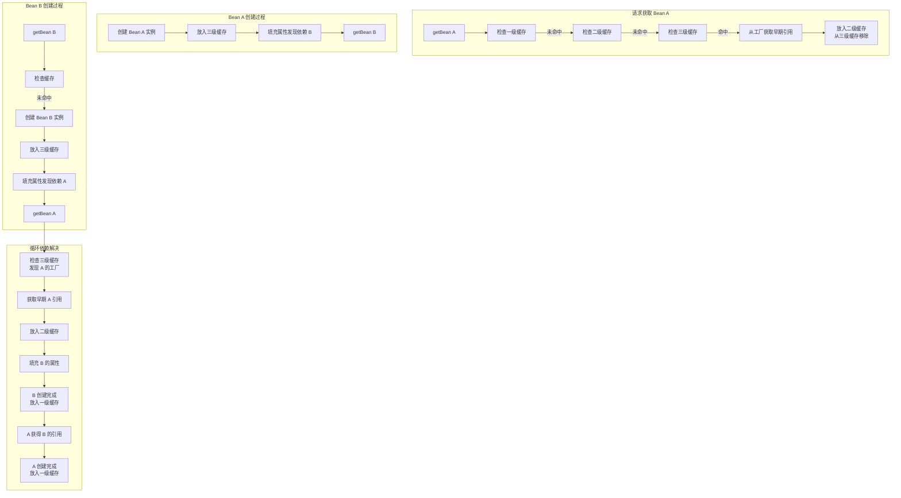
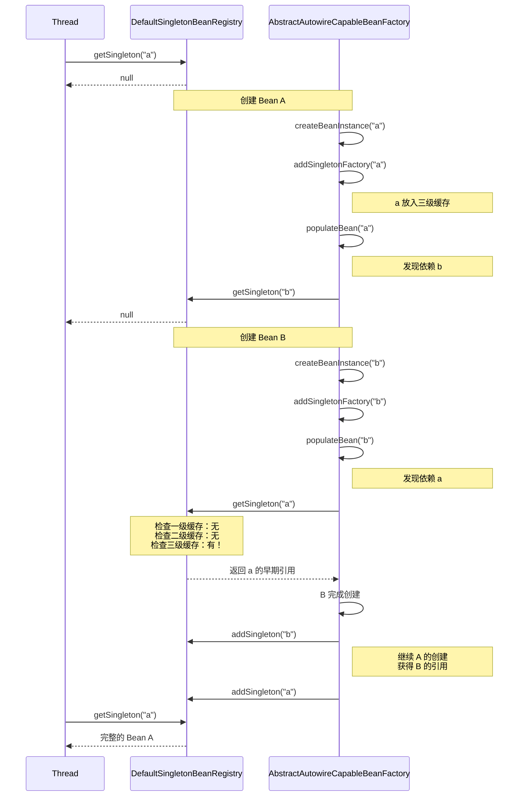

# 第6章：依赖注入详解

## 6.1 populateBean() 方法分析

### 6.1.1 populateBean() 在 Bean 创建流程中的位置

`populateBean()` 是 Spring 容器创建 Bean 的核心方法之一，位于 Bean 创建生命周期的早期阶段。

**Bean 创建完整流程**：



**核心源码位置**：`org.springframework.beans.factory.support.AbstractAutowireCapableBeanFactory`

```java
public abstract class AbstractAutowireCapableBeanFactory extends AbstractBeanFactory
        implements AutowireCapableBeanFactory {

    // 创建 Bean 的核心方法
    @Override
    protected Object createBean(String beanName, RootBeanDefinition mbd, @Nullable Object[] args) {
        // 1. 解析 Bean 类
        Class<?> resolvedClass = resolveBeanClass(mbd, beanName);

        // 2. 创建 Bean 实例
        Object bean = createBeanInstance(beanName, mbd, args);

        // 3. 合并 Bean 定义
        RootBeanDefinition mergedBeanDefinition = getMergedBeanDefinition(beanName, mbd, bean);

        // 4. 【关键】填充 Bean 属性（依赖注入发生在这里）
        populateBean(beanName, mergedBeanDefinition, bean);

        // 5. 初始化 Bean
        bean = initializeBean(beanName, bean, mergedBeanDefinition);

        return bean;
    }

    // 填充 Bean 属性
    protected void populateBean(String beanName, RootBeanDefinition mbd, @Nullable Object bean) {
        // 详细实现见下一节
    }
}
```

### 6.1.2 populateBean() 方法内部流程图



### 6.1.3 源码分析

```java
protected void populateBean(String beanName, RootBeanDefinition mbd, @Nullable Object bean) {
    // 1. 获取属性值
    PropertyValues pvs = mbd.getPropertyValues();

    // 2. 继续处理前检查
    if (pvs == null && hasInstantiationAwareBeanPostProcessors()) {
        return;
    }

    // 3. 检查是否跳过 InstantiationAwareBeanPostProcessor
    if (hasInstantiationAwareBeanPostProcessors()) {
        for (InstantiationAwareBeanPostProcessor pp : getBeanPostProcessors()) {
            if (pp instanceof InstantiationAwareBeanPostProcessor iapp) {
                // 允许 post-process 属性值
                // 如果返回 false，跳过属性填充
                if (!iapp.postProcessPropertiesBeforeInstantiation(
                        bean.getClass(), beanName)) {
                    continue;
                }
                // 处理属性值
                pvs = iapp.postProcessPropertyValues(pvs, bw.getPropertyValues(),
                        bean.getWrappedInstance(), beanName);
                if (pvs == null) {
                    return;
                }
            }
        }
    }

    // 4. 处理自动装配
    if (mbd.getDependencyCheck() != DEFINED) {
        int resolvedAutowireMode = mbd.getResolvedAutowireMode();
        if (resolvedAutowireMode == AUTOWIRE_BY_NAME || resolvedAutowireMode == AUTOWIRE_BY_TYPE) {
            MutablePropertyValues mpvs = new MutablePropertyValues(pvs);
            // autowire by name
            if (resolvedAutowireMode == AUTOWIRE_BY_NAME) {
                autowireByName(beanName, mbd, bw, mpvs);
            }
            // autowire by type
            if (resolvedAutowireMode == AUTOWIRE_BY_TYPE) {
                autowireByType(beanName, mbd, bw, mpvs);
            }
            pvs = mpvs;
        }
    }

    // 5. 应用 BeanPostProcessor（后处理）
    for (BeanPostProcessor bp : getBeanPostProcessors()) {
        if (bp instanceof InstantiationAwareBeanPostProcessor iapp) {
            // 【关键】这里会调用 @Autowired 等注解的处理
            pvs = iapp.postProcessProperties(pvs, bw.getWrappedInstance(), beanName);
            if (pvs == null) {
                return;
            }
        }
    }

    // 6. 应用属性值到 Bean 实例
    applyPropertyValues(beanName, mbd, bw, pvs);
}
```

## 6.2 autowireByName / autowireByType

### 6.2.1 autowireByName 实现原理

`autowireByName` 根据属性名称自动查找同名的 Bean 进行注入。

```java
// 核心源码位置：AbstractAutowireCapableBeanFactory
protected void autowireByName(
        String beanName, AbstractBeanDefinition mbd, BeanWrapper bw,
        MutablePropertyValues pvs) {

    // 获取需要自动装配的属性（排除简单类型）
    String[] propertyNames = unsatisfiedNonSimpleProperties(mbd, bw);

    for (String propertyName : propertyNames) {
        // 检查容器中是否存在同名 Bean
        if (containsBean(propertyName)) {
            // 递归获取 Bean（可能触发依赖 Bean 的创建）
            Object autowiredBean = resolveDependency(
                    new DependencyDescriptor(propertyName, null), beanName);

            // 添加到属性值
            pvs.add(propertyName, autowiredBean);

            // 记录依赖关系
            registerDependentBean(propertyName, beanName);
        }
    }
}

// 检查属性是否满足自动装配条件
protected String[] unsatisfiedNonSimpleProperties(AbstractBeanDefinition mbd, BeanWrapper bw) {
    List<String> result = new ArrayList<>();

    // 遍历 Bean 的属性
    for (PropertyDescriptor pd : BeanIntrospector.getBeanInfo(bw.getWrappedClass()).getPropertyDescriptors()) {
        // 排除简单类型（String, Number, Date 等）
        if (isExcludedFromDependencyInjection(pd) ||
            !bd.isWritableProperty(pd) ||
            !bd.isReadableProperty(pd)) {
            continue;
        }

        // 检查属性值是否已设置
        if (bd.getPropertyValues().contains(pd.getName())) {
            continue;
        }

        // 检查是否有可写的非简单类型属性
        if (isRequired(pd) || !AutoResolvableType.of(pd.getPropertyType()).isSimple()) {
            result.add(pd.getName());
        }
    }

    return result.toArray(new String[0]);
}
```

**流程图**：



### 6.2.2 autowireByType 实现原理

`autowireByType` 根据属性类型自动查找兼容类型的 Bean 进行注入。

```java
protected void autowireByType(
        String beanName, AbstractBeanDefinition mbd, BeanWrapper bw,
        MutablePropertyValues pvs) {

    // 创建类型转换器
    TypeConverter typeConverter = getCustomTypeConverter();

    // 获取 BeanFactory 用于解析依赖
    BeanFactory fieldFactory = getBeanFactory();

    // 获取需要自动装配的属性列表
    String[] propertyNames = unsatisfiedNonSimpleProperties(mbd, bw);

    for (String propertyName : propertyNames) {
        try {
            // 获取属性描述符
            PropertyDescriptor pd = bw.getPropertyDescriptor(propertyName);

            // 跳过只读属性或没有 setter 的属性
            if (pd.getWriteMethod() == null) {
                continue;
            }

            // 获取属性类型
            Class<?> autowiredType = pd.getPropertyType();

            // 解析依赖（处理 @Qualifier 注解）
            Object autowiredBean = resolveDependency(
                    new DependencyDescriptor(pd, propertyName, autowiredType, null, true),
                    beanName);

            if (autowiredBean != null) {
                pvs.add(propertyName, autowiredBean);
                registerDependentBean(propertyName, beanName);
            }
        } catch (BeansException ex) {
            throw new UnsatisfiedDependencyException(
                    mbd.getResourceDescription(), beanName, propertyName, ex);
        }
    }
}
```

### 6.2.3 qualifiers 的处理

当存在多个相同类型的 Bean 时，使用 `@Qualifier` 注解来指定具体要注入的 Bean。

```java
// 处理 @Qualifier 的核心逻辑
public Object resolveDependency(DependencyDescriptor descriptor, String beanName,
        @Nullable Set<String> autowiredBeanNames, @Nullable TypeConverter typeConverter) {

    // 解析 @Qualifier 注解
    Object result = findMatchingValue(
            new QualifierTypeFilter(DirectFieldBindingResult.class, false),
            descriptor, beanName);

    if (result != null) {
        return result;
    }

    // 尝试按类型查找
    Map<String, Object> matchingBeans = findAutowireCandidates(
            beanName, descriptor.getDependencyType(), descriptor);

    if (matchingBeans.isEmpty()) {
        // 如果没找到且 required=true，抛出异常
        if (descriptor.isRequired()) {
            raiseNoMatchingBeanFound(descriptor.getDependencyType(), descriptor.getPropertyType());
        }
        return null;
    }

    // 如果找到多个候选者
    if (matchingBeans.size() > 1) {
        // 确定要注入的 Bean
        String primaryBeanName = determineAutowireCandidate(matchingBeans, descriptor);
        if (primaryBeanName != null) {
            return matchingBeans.get(primaryBeanName);
        }

        // 无法确定唯一候选者，抛出异常
        throw new NoUniqueBeanDefinitionException(
                descriptor.getDependencyType(), matchingBeans.keySet());
    }

    // 只有一个候选者
    Map.Entry<String, Object> entry = matchingBeans.entrySet().iterator().next();
    return entry.getValue();
}

// 确定自动装配的候选者
protected String determineAutowireCandidate(
        Map<String, Object> candidateBeans, DependencyDescriptor descriptor) {

    Class<?> requiredType = descriptor.getDependencyType();

    // 1. 优先查找 @Primary 标记的 Bean
    String primaryCandidate = findPrimaryCandidate(candidateBeans, requiredType);
    if (primaryCandidate != null) {
        return primaryCandidate;
    }

    // 2. 查找优先级最高的 Bean（@Priority）
    String priorityCandidate = findHighestPriorityCandidate(candidateBeans, requiredType);
    if (priorityCandidate != null) {
        return priorityCandidate;
    }

    // 3. 使用 @Qualifier 指定的名字
    String qualifier = descriptor.getAnnotationAttributes(Qualifier.class.getName())
            .getString("value");
    if (StringUtils.hasText(qualifier)) {
        return candidateBeans.keySet().stream()
                .filter(name -> name.equals(qualifier))
                .findFirst()
                .orElse(null);
    }

    return null;
}
```

## 6.3 @Autowired 注入原理

### 6.3.1 AutowiredAnnotationBeanPostProcessor

`AutowiredAnnotationBeanPostProcessor` 是处理 `@Autowired` 注解的后置处理器。

**核心源码位置**：`org.springframework.beans.factory.annotation.AutowiredAnnotationBeanPostProcessor`

```java
public class AutowiredAnnotationBeanPostProcessor extends InstantiationAwareBeanPostProcessor
        implements MergedBeanDefinitionPostProcessor {

    // 存储需要处理的注解类型
    private final Set<Class<? extends Annotation>> autowiredAnnotationTypes = new LinkedHashSet<>();

    public AutowiredAnnotationBeanPostProcessor() {
        // 添加 @Autowired 注解
        this.autowiredAnnotationTypes.add(Autowired.class);

        // 添加 @Value 注解
        this.autowiredAnnotationTypes.add(Value.class);

        // 添加 JSR-330 的 @Inject 注解（如果存在）
        try {
            this.autowiredAnnotationTypes.add((Class<? extends Annotation>)
                    ClassUtils.forName("javax.inject.Inject", getClass().getClassLoader()));
        } catch (ClassNotFoundException ex) {
            // JSR-330 不可用
        }
    }

    @Override
    public void postProcessMergedBeanDefinition(RootBeanDefinition beanDefinition,
            Class<?> beanType, String beanName) {
        // 查找带有 @Autowired 注解的元信息
        InjectionMetadata metadata = findAutowiringMetadata(beanName, beanType, null);
        metadata.checkConfigMembers(beanDefinition);
    }

    @Override
    public PropertyValues postProcessProperties(PropertyValues pvs, Object bean, String beanName) {
        // 【关键】注入依赖
        InjectionMetadata metadata = findAutowiringMetadata(beanName, bean.getClass(), pvs);
        metadata.inject(bean, beanName, null);
        return pvs;
    }

    // 查找自动装配的元信息
    private InjectionMetadata findAutowiringMetadata(String beanName, Class<?> clazz,
            @Nullable PropertyValues pvs) {
        // 使用缓存避免重复解析
        String cacheKey = (StringUtils.hasLength(beanName) ? beanName : clazz.getName());
        InjectionMetadata metadata = this.injectionMetadataCache.get(cacheKey);

        if (InjectionMetadata.needsRefresh(metadata, clazz)) {
            synchronized (this.injectionMetadataCache) {
                metadata = this.injectionMetadataCache.get(cacheKey);
                if (InjectionMetadata.needsRefresh(metadata, clazz)) {
                    // 解析注解
                    metadata = buildAutowiringMetadata(clazz);
                    this.injectionMetadataCache.put(cacheKey, metadata);
                }
            }
        }
        return metadata;
    }

    // 解析类上的 @Autowired 注解
    private InjectionMetadata buildAutowiringMetadata(final Class<?> clazz) {
        List<InjectionMetadata.InjectedElement> elements = new ArrayList<>();

        Class<?> targetClass = clazz;

        do {
            List<InjectionMetadata.InjectedElement> currElements = new ArrayList<>();

            // 遍历字段
            for (Field field : targetClass.getDeclaredFields()) {
                Annotation ann = findAutowiredAnnotation(field);
                if (ann != null) {
                    // 跳过静态字段
                    if (Modifier.isStatic(field.getModifiers())) {
                        continue;
                    }

                    boolean required = (ann instanceof Autowired a) ? a.required() : true;
                    currElements.add(new AutowiredFieldElement(field, required));
                }
            }

            // 遍历方法
            for (Method method : targetClass.getDeclaredMethods()) {
                Annotation ann = findAutowiredAnnotation(method);
                if (ann != null) {
                    // 跳过静态方法
                    if (Modifier.isStatic(method.getModifiers())) {
                        continue;
                    }

                    boolean required = (ann instanceof Autowired a) ? a.required() : true;
                    currElements.add(new AutowiredMethodElement(method, required));
                }
            }

            elements.addAll(0, currElements);
            targetClass = targetClass.getSuperclass();
        } while (targetClass != null && targetClass != Object.class);

        return new InjectionMetadata(clazz, elements);
    }
}
```

### 6.3.2 注入时机

@Autowired 的注入发生在 Bean 生命周期的属性填充阶段。



### 6.3.3 查找候选者的过程

```java
// AutowiredFieldElement 的注入方法
private class AutowiredFieldElement extends InjectionMetadata.InjectedElement {

    @Override
    protected void inject(Object bean, String beanName, PropertyValues pvs) throws Throwable {
        Field field = (Field) this.member;

        // 获取要注入的值
        Object value = resolveFieldValue(field, bean, beanName);

        // 反射设置字段值
        ReflectionUtils.makeAccessible(field);
        field.set(bean, value);
    }

    private Object resolveFieldValue(Field field, Object bean, String beanName) {
        // 创建依赖描述符
        DependencyDescriptor descriptor = new DependencyDescriptor(field, this.required);

        // 增加当前Bean的依赖层级
        descriptor.setContainingClass(bean.getClass());

        // 解析依赖
        Object result = beanFactory.resolveDependency(descriptor, beanName);

        return result;
    }
}
```

## 6.4 @Value 注入原理

### 6.4.1 @Value 处理流程

`@Value` 注解用于注入外部配置值，支持 SpEL 表达式。

```java
// @Value 注解定义
@Target({ElementType.FIELD, ElementType.METHOD, ElementType.PARAMETER, ElementType.ANNOTATION_TYPE})
@Retention(RetentionPolicy.RUNTIME)
public @interface Value {
    // SpEL 表达式或普通字符串
    String value();
}
```

**处理流程图**：



### 6.4.2 Spel 表达式解析

```java
// 使用 SpEL 解析 @Value 注解
public Object resolveDependency(DependencyDescriptor descriptor, String beanName) {
    if (this.enableValueResolution != null && !this.enableValueResolution) {
        return null;
    }

    // 创建嵌入式值解析器
    EmbeddedValueResolver embeddedValueResolver = new EmbeddedValueResolver(this.beanFactory);

    // 获取 @Value 注解的值
    String value = resolveEmbeddedValue(descriptor.getAnnotationAttributes(Value.class.getName())
            .getString("value"));

    // 解析 SpEL 表达式
    Object result = embeddedValueResolver.resolveStringValue(value);

    // 类型转换
    if (result != null && this.conversionService.canConvert(
            result.getClass(), descriptor.getDependencyType())) {
        result = this.conversionService.convert(result, descriptor.getDependencyType());
    }

    return result;
}

// EmbeddedValueResolver 实现
public class EmbeddedValueResolver implements BeanExpressionResolver {

    private final ConfigurableBeanFactory beanFactory;

    public String resolveStringValue(String value) {
        // 检查是否是 SpEL 表达式
        if (StringUtils.hasText(value) && value.startsWith("#{") && value.endsWith("}")) {
            // 解析 SpEL
            return beanFactory.evaluateBeanDefinitionString(value, null);
        }

        // 解析 ${...} 占位符
        return resolvePlaceholder(value);
    }
}
```

### 6.4.3 PropertySourcesPlaceholderConfigurer

用于处理 `${}` 占位符的 Bean 后置处理器。

```java
// PropertySourcesPlaceholderConfigurer 的核心方法
public class PropertySourcesPlaceholderConfigurer extends PlaceholderConfigurerSupport {

    @Override
    public void postProcessBeanFactory(ConfigurableListableBeanFactory beanFactory) throws BeansException {
        // 加载属性源
        MutablePropertySources propertySources = new MutablePropertySources();
        Iterator<PropertySource<?>> iterator = this.propertySources.iterator();
        while (iterator.hasNext()) {
            propertySources.addLast(iterator.next());
        }

        // 如果使用系统属性，添加到最前面
        if (this.searchSystemEnvironment) {
            propertySources.addLast(new PropertySource<>("environment", System.getenv()) {});
        }

        // 创建属性解析器
        PropertySourcesPropertyResolver resolver = new PropertySourcesPropertyResolver(propertySources);

        // 处理所有 Bean 定义中的占位符
        for (String beanDefinitionName : beanFactory.getBeanDefinitionNames()) {
            BeanDefinition bd = beanFactory.getBeanDefinition(beanDefinitionName);
            processProperties(beanFactory, bd, resolver);
        }
    }

    // 处理 Bean 定义中的属性占位符
    protected void processProperties(ConfigurableListableBeanFactory bf, BeanDefinition bd,
            PropertySourcesPropertyResolver resolver) {

        // 遍历属性值
        for (PropertyValue pv : ((AbstractBeanDefinition) bd).getPropertyValues().getPropertyValueList()) {
            Object value = pv.getValue();
            if (value instanceof String strValue) {
                // 解析占位符
                String resolved = resolver.resolvePlaceholders(strValue);
                ((AbstractBeanDefinition) bd).getPropertyValues().add(pv.getName(), resolved);
            }
        }
    }
}
```

**@Value 使用示例**：

```java
@Component
public class DataSourceConfig {

    // 注入普通字符串
    @Value("jdbc:mysql://localhost:3306/test")
    private String url;

    // 注入系统属性
    @Value("${user.home}")
    private String userHome;

    // 注入配置文件属性
    @Value("${db.username}")
    private String username;

    // 注入 SpEL 表达式
    @Value("#{T(System).currentTimeMillis()}")
    private long timestamp;

    // 注入计算结果
    @Value("#{1 + 2}")
    private int calculated;

    // 注入 Bean 属性
    @Value("#{dataSource.url}")
    private String dsUrl;

    // 注入默认值
    @Value("${db.password:defaultPassword}")
    private String password;
}
```

## 6.5 循环依赖问题与解决

### 6.5.1 什么是循环依赖

循环依赖是指两个或多个 Bean 之间相互依赖，形成闭环。

**示例场景**：

```java
// 场景1：构造器循环依赖
@Service
public class A {
    private final B b;
    public A(B b) { this.b = b; }
}

@Service
public class B {
    private final A a;
    public B(A a) { this.a = a; }
}

// 场景2：setter 循环依赖
@Service
public class A {
    private B b;
    public void setB(B b) { this.b = b; }
}

@Service
public class B {
    private A a;
    public void setA(A a) { this.a = a; }
}
```

### 6.5.2 构造器循环依赖

构造器循环依赖无法解决，Spring 启动时会抛出 `BeanCurrentlyInCreationException`。

```java
// 模拟构造器循环依赖检测
protected void throwIfCurrentlyCreating(String beanName) {
    // 检查是否正在创建中
    if (isCurrentlyInCreation(beanName)) {
        throw new BeanCurrentlyInCreationException(beanName);
    }
}

// isCurrentlyInCreation 检查
public boolean isCurrentlyInCreation(String beanName) {
    return this.createdBeans.contains(beanName);
}
```

**异常信息**：

```
Error creating bean 'A': Requested bean is currently in creation: Is there an unresolvable circular reference?
```

### 6.5.3 setter 循环依赖

setter 循环依赖可以通过三级缓存机制解决。

```java
// 三级缓存
/** 第一级缓存：完整 Bean */
private final Map<String, Object> singletonObjects = new ConcurrentHashMap<>(256);

/** 第二级缓存：提前暴露的 Bean（未完成属性填充） */
private final Map<String, Object> earlySingletonObjects = new ConcurrentHashMap<>(16);

/** 第三级缓存：Bean 工厂（用于创建早期引用） */
private final Map<String, ObjectFactory<?>> singletonFactories = new ConcurrentHashMap<>(16);
```

### 6.5.4 prototype 循环依赖

prototype 作用域的 Bean 不支持循环依赖解决，因为每次获取都会创建新实例。

```java
// prototype 作用域获取 Bean
@Override
public Object getBean(String name) {
    Object prototypeInstance = createBean(name);
    // prototype 不会缓存，每次都是新实例
    return prototypeInstance;
}

// 如果存在 prototype 循环依赖，调用 getBean 时会创建新的实例
// 但原 Bean 还未创建完成，导致循环依赖无法解决
```

## 6.6 【实战】循环依赖解决方案实战

### 6.6.1 三级缓存机制详解

**三级缓存工作流程图**：



### 6.6.2 三级缓存源码分析

**核心源码位置**：`org.springframework.beans.factory.support.DefaultSingletonBeanRegistry`

```java
public class DefaultSingletonBeanRegistry extends SimpleAliasRegistry {

    // 第一级缓存：已经完成创建的 Bean（可直接使用）
    private final Map<String, Object> singletonObjects = new ConcurrentHashMap<>(256);

    // 第二级缓存：提前暴露的 Bean（属性还未填充完成）
    private final Map<String, Object> earlySingletonObjects = new ConcurrentHashMap<>(16);

    // 第三级缓存：Bean 工厂（用于创建早期引用）
    private final Map<String, ObjectFactory<?>> singletonFactories = new ConcurrentHashMap<>(16);

    // 获取单例 Bean
    @Override
    public Object getSingleton(String beanName) {
        return getSingleton(beanName, true);
    }

    protected Object getSingleton(String beanName, boolean allowEarlyReference) {
        // 1. 检查第一级缓存
        Object singletonObject = this.singletonObjects.get(beanName);
        if (singletonObject == null && isSingletonCurrentlyInCreation(beanName)) {
            // 2. 检查第二级缓存
            synchronized (this.singletonObjects) {
                singletonObject = this.earlySingletonObjects.get(beanName);
                if (singletonObject == null && allowEarlyReference) {
                    // 3. 检查第三级缓存
                    ObjectFactory<?> singletonFactory = this.singletonFactories.get(beanName);
                    if (singletonFactory != null) {
                        // 从工厂获取早期引用
                        singletonObject = singletonFactory.getObject();
                        // 移动到第二级缓存
                        this.earlySingletonObjects.put(beanName, singletonObject);
                        // 从第三级缓存移除
                        this.singletonFactories.remove(beanName);
                    }
                }
            }
        }
        return singletonObject;
    }

    // 注册单例 Bean
    protected void addSingleton(String beanName, Object singletonObject) {
        synchronized (this.singletonObjects) {
            // 放入第一级缓存
            this.singletonObjects.put(beanName, singletonObject);
            // 从其他缓存移除
            this.earlySingletonObjects.remove(beanName);
            this.singletonFactories.remove(beanName);
        }
    }

    // 注册单例工厂（用于解决循环依赖）
    protected void addSingletonFactory(String beanName, ObjectFactory<?> singletonFactory) {
        synchronized (this.singletonObjects) {
            // 如果还未在第一级缓存中
            if (!this.singletonObjects.containsKey(beanName)) {
                // 放入第三级缓存
                this.singletonFactories.put(beanName, singletonFactory);
            }
        }
    }
}
```

### 6.6.3 解决流程源码分析

```java
// AbstractAutowireCapableBeanFactory.createBean()
protected Object createBean(String beanName, RootBeanDefinition mbd, @Nullable Object[] args) {
    // 1. 解析 Bean 类
    Class<?> resolvedClass = resolveBeanClass(mbd, beanName);

    // 2. 创建 Bean 实例（尚未填充属性）
    Object bean = createBeanInstance(beanName, mbd, args);

    // 3. 【关键】在 populateBean 之前，将工厂加入第三级缓存
    // 这样其他 Bean 可以获取到早期引用
    addSingletonFactory(beanName, () -> getEarlyBeanReference(beanName, mbd, bean));

    // 4. 填充 Bean 属性（依赖注入）
    populateBean(beanName, mbd, bean);

    // 5. 初始化 Bean
    bean = initializeBean(beanName, bean, mbd);

    return bean;
}

// 获取早期引用的回调
protected Object getEarlyBeanReference(String beanName, RootBeanDefinition mbd, Object bean) {
    Object exposedBean = bean;

    // 如果Bean定义包含代理，使用代理替换
    if (mbd.hasInstantiationAwareBeanPostProcessors()) {
        for (BeanPostProcessor bp : getBeanPostProcessors()) {
            if (bp instanceof SmartInstantiationAwareBeanPostProcessor sip) {
                exposedBean = sip.getEarlyBeanReference(exposedBean, beanName);
            }
        }
    }

    return exposedBean;
}
```

**循环依赖解决完整流程**：



### 6.6.4 实战：如何打破循环依赖

**场景描述**：

```java
@Service
public class AService {
    private BService bService;

    @Autowired
    public void setbService(BService bService) {
        this.bService = bService;
    }
}

@Service
public class BService {
    private AService aService;

    @Autowired
    public void setaService(AService aService) {
        this.aService = aService;
    }
}
```

**方案1：使用 @Lazy 注解延迟加载**

```java
@Service
public class AService {
    private BService bService;

    @Autowired
    public void setbService(@Lazy BService bService) {
        this.bService = bService;
    }
}
```

**方案2：使用 @PostConstruct 初始化**

```java
@Service
public class AService {
    private BService bService;

    @Autowired
    public void setbService(BService bService) {
        this.bService = bService;
    }

    @PostConstruct
    public void init() {
        // 使用 bService 进行初始化
    }
}
```

**方案3：使用 Setter 注入代替构造器注入**

```java
@Service
public class AService {
    private BService bService;

    @Autowired
    public void setbService(BService bService) {
        this.bService = bService;
    }
}
```

**方案4：自定义 BeanPostProcessor 打破循环**

```java
@Component
public class CircularDependencyBreaker implements BeanPostProcessor {

    @Override
    public Object postProcessBeforeInitialization(Object bean, String beanName) throws BeansException {
        // 在初始化前处理循环依赖
        if (bean instanceof AService) {
            // 手动设置依赖
        }
        return bean;
    }
}
```

**方案5：使用 ObjectProvider 延迟获取**

```java
@Service
public class AService {
    private ObjectProvider<BService> bServiceProvider;

    @Autowired
    public void setbServiceProvider(ObjectProvider<BService> bServiceProvider) {
        this.bServiceProvider = bServiceProvider;
    }

    public void doSomething() {
        // 延迟获取
        BService bService = bServiceProvider.getIfAvailable();
    }
}
```

**方案6：重构代码消除循环依赖**

```java
// 将共享逻辑提取到第三方服务
@Service
public class CommonService {
    // 公共逻辑
}

@Service
public class AService {
    private CommonService commonService;

    @Autowired
    public void setCommonService(CommonService commonService) {
        this.commonService = commonService;
    }
}

@Service
public class BService {
    private CommonService commonService;

    @Autowired
    public void setCommonService(CommonService commonService) {
        this.commonService = commonService;
    }
}
```

### 6.6.5 三级缓存各层级职责总结

| 缓存层级 | 名称 | 存储内容 | 访问条件 | 用途 |
|---------|------|---------|---------|------|
| 第一级 | singletonObjects | 完整 Bean | 无限制 | Bean 的正式存储 |
| 第二级 | earlySingletonObjects | 早期暴露的 Bean | 已放入三级缓存 | 解决循环依赖 |
| 第三级 | singletonFactories | Bean 工厂 | allowEarlyReference=true | 创建早期引用 |

**为什么需要三级缓存**：

1. **第一级缓存**：`singletonObjects` 直接存储完整 Bean，访问速度最快
2. **第二级缓存**：`earlySingletonObjects` 存储未属性填充的 Bean，用于打破循环依赖
3. **第三级缓存**：`singletonFactories` 存储工厂方法，支持创建代理对象

这样设计是为了在解决循环依赖的同时，支持 AOP 代理的生成。
