# 第7章 Spring AOP 原理

## 章节概述

AOP（Aspect Oriented Programming，面向切面编程）是 Spring 框架的核心特性之一，它通过预编译方式和运行期动态代理实现程序功能的统一维护。本章将深入剖析 Spring AOP 的实现原理，从核心概念到源码实现，帮助读者彻底理解 AOP 的本质。

```
flowchart LR
    subgraph AOP核心概念
        J[Joinpoint 连接点]
        P[Pointcut 切点]
        A[Advice 通知]
        As[Aspect 切面]
        W[Weaving 织入]
    end
    
    subgraph 代理实现
        JD[JDK动态代理]
        CG[CGLIB代理]
        PF[ProxyFactory]
    end
    
    subgraph 执行流程
        RI[ReflectiveMethodInvocation]
        IC[InterceptorChain 拦截器链]
    end
    
    J --> P --> A --> As
    JD --> PF
    CG --> PF
    PF --> RI
    RI --> IC
```

---

## 7.1 AOP 核心概念

### 7.1.1 AOP 专业术语详解

#### Joinpoint（连接点）

**定义**：程序执行的某个特定位置，如方法调用前、方法调用后、方法抛出异常等。

**在 Spring AOP 中**：连接点始终是指向**方法执行**，因为 Spring 只支持方法级别的连接点。

```java
// 以下都是 Joinpoint 的示例
public class UserService {
    
    // 连接点：方法执行
    public void addUser(User user) {
        // 方法体
    }
    
    // 连接点：方法执行前（这是 Pointcut 可以匹配的位置）
    public User getUserById(Long id) {
        return userDao.findById(id);
    }
}
```

#### Pointcut（切点）

**定义**：用于匹配连接点的谓词表达式，决定了通知应该在哪里执行。

**关键特性**：
- 切点是通过表达式或注解匹配连接点的机制
- 一个切点可以匹配多个连接点
- Spring 使用 `Pointcut` 接口来表示切点

```java
// Pointcut 接口定义
public interface Pointcut {
    // 类过滤器：匹配哪些类
    ClassFilter getClassFilter();
    // 方法匹配器：匹配哪些方法
    MethodMatcher getMethodMatcher();
}
```

#### Advice（通知/增强）

**定义**：切面在特定连接点执行的动作，包含要执行的代码。

**通知类型**：

| 通知类型 | 执行时机 | 接口 |
|---------|---------|------|
| @Before | 方法执行前 | MethodBeforeAdvice |
| @After | 方法执行后（无论是否异常） | FinallyAdvice |
| @AfterReturning | 方法正常返回后 | AfterReturningAdvice |
| @AfterThrowing | 方法抛出异常后 | ThrowsAdvice |
| @Around | 方法执行前后都可以控制 | MethodInterceptor |

```java
// 通知的继承体系
public interface MethodBeforeAdvice extends BeforeAdvice {
    void before(Method method, Object[] args, Object target) throws Throwable;
}

public interface AfterReturningAdvice extends AfterAdvice {
    void afterReturning(Object returnValue, Method method, Object[] args, Object target) throws Throwable;
}

public interface MethodInterceptor extends Interceptor {
    Object invoke(MethodInvocation invocation) throws Throwable;
}
```

#### Aspect（切面）

**定义**：切面是切点和通知的组合，定义了"在何处"（Pointcut）"做什么"（Advice）。

```java
// 切面 = 切点 + 通知
@Aspect
@Component
public class LoggingAspect {
    
    // 切点表达式：匹配 com.example.service 包下所有类的所有方法
    @Pointcut("execution(* com.example.service.*.*(..))")
    public void servicePointcut() {}
    
    // 通知：方法执行前记录日志
    @Before("servicePointcut()")
    public void before(JoinPoint joinPoint) {
        String methodName = joinPoint.getSignature().getName();
        System.out.println("执行方法前：" + methodName);
    }
    
    // 通知：方法返回后记录日志
    @AfterReturning(pointcut = "servicePointcut()", returning = "result")
    public void afterReturning(JoinPoint joinPoint, Object result) {
        String methodName = joinPoint.getSignature().getName();
        System.out.println("方法返回后：" + methodName + "，结果：" + result);
    }
}
```

#### Weaving（织入）

**定义**：将切面与目标对象关联起来，生成代理对象的过程。

**织入时机**：
- **编译时织入**（Compile-time weaving）：需要特殊的编译器，如 AspectJ 的 ajc 编译器
- **类加载时织入**（Load-time weaving, LTW）：使用 Java agent 在类加载时织入
- **运行时织入**（Runtime weaving）：Spring AOP 采用的方式，通过动态代理实现

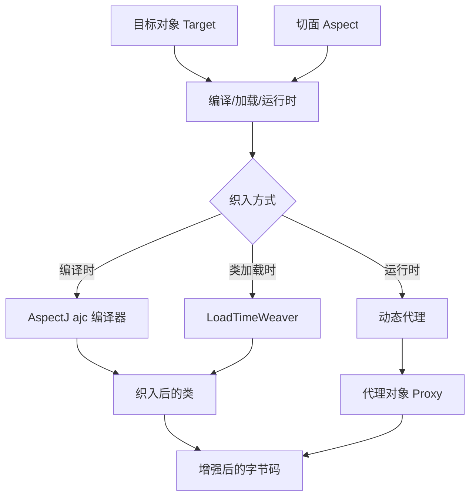

### 7.1.2 概念对应关系图

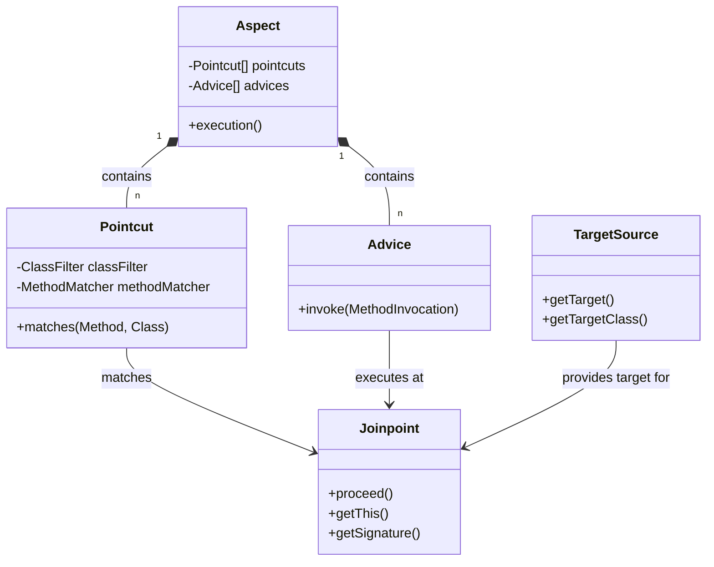

### 7.1.3 Spring AOP vs AspectJ

| 特性 | Spring AOP | AspectJ |
|-----|------------|---------|
| **织入时机** | 运行时 | 编译时/类加载时 |
| **代理方式** | 动态代理/JDK动态代理、CGLIB | 字节码编辑 |
| **切入点** | 方法级别 | 字段、构造函数 |
| **功能** | 有限，只支持方法执行 | 完全AOP支持 |
| **性能** | 每次调用创建代理（可缓存） | 编译时织入，无运行时开销 |
| **配置复杂度** | 简单 | 复杂，需要 AspectJ 编译器或 LTW |
| **依赖** | 只需 Spring | 需要 ajc 编译器或织入代理 |

**Spring AOP 的局限性**：
- 只能拦截方法执行，不能拦截字段访问
- 只能作用于 Spring 管理的 Bean
- 不支持构造方法调用

---

## 7.2 静态代理与动态代理

### 7.2.1 静态代理概念和代码实现

**静态代理**是指在**编译时**已经确定代理类与目标类的关系，代理类的字节码在程序运行前就已经存在。

```java
// ==================== 静态代理实现 ====================

// 1. 定义接口
public interface UserService {
    void addUser(String name);
    User getUserById(Long id);
}

// 2. 目标对象（真实对象）
public class UserServiceImpl implements UserService {
    
    @Override
    public void addUser(String name) {
        System.out.println("添加用户：" + name);
        // 模拟业务逻辑
        try {
            Thread.sleep(100);
        } catch (InterruptedException e) {
            e.printStackTrace();
        }
    }
    
    @Override
    public User getUserById(Long id) {
        System.out.println("查询用户 ID：" + id);
        return new User(id, "用户" + id);
    }
}

// 3. 静态代理类
public class UserServiceStaticProxy implements UserService {
    
    // 持有目标对象的引用
    private UserService target;
    
    public UserServiceStaticProxy(UserService target) {
        this.target = target;
    }
    
    @Override
    public void addUser(String name) {
        System.out.println("[代理] 方法开始执行 - addUser");
        long startTime = System.currentTimeMillis();
        
        try {
            // 调用目标对象的方法
            target.addUser(name);
        } finally {
            long endTime = System.currentTimeMillis();
            System.out.println("[代理] 方法执行结束，耗时：" + (endTime - startTime) + "ms");
        }
    }
    
    @Override
    public User getUserById(Long id) {
        System.out.println("[代理] 方法开始执行 - getUserById");
        long startTime = System.currentTimeMillis();
        
        try {
            User result = target.getUserById(id);
            System.out.println("[代理] 方法执行结束");
            return result;
        } finally {
            long endTime = System.currentTimeMillis();
            System.out.println("[代理] 方法执行结束，耗时：" + (endTime - startTime) + "ms");
        }
    }
}

// 4. 客户端使用
public class StaticProxyTest {
    public static void main(String[] args) {
        // 创建目标对象
        UserService target = new UserServiceImpl();
        
        // 创建代理对象，将目标对象注入
        UserService proxy = new UserServiceStaticProxy(target);
        
        // 调用代理对象的方法
        proxy.addUser("张三");
        proxy.getUserById(1L);
    }
}
```

**输出结果**：
```
[代理] 方法开始执行 - addUser
添加用户：张三
[代理] 方法执行结束，耗时：101ms
[代理] 方法开始执行 - getUserById
查询用户 ID：1
[代理] 方法执行结束
[代理] 方法执行结束，耗时：2ms
```

### 7.2.2 静态代理的缺点

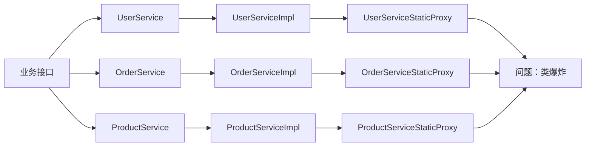

**静态代理的主要问题**：

| 问题 | 描述 |
|-----|------|
| **类爆炸** | 每个真实对象都需要一个代理类，当接口或实现类增多时，代理类数量急剧膨胀 |
| **代码重复** | 每个代理类都要重复编写相似的逻辑（如日志、事务） |
| **维护困难** | 当接口变更时，所有代理类都需要同步修改 |
| **无法统一管理** | 无法批量为所有服务添加代理逻辑 |

```java
// 静态代理的问题示例：每个接口都需要一个代理类

// UserService 的代理
public class UserServiceStaticProxy implements UserService { ... }

// OrderService 的代理
public class OrderServiceStaticProxy implements OrderService { ... }

// ProductService 的代理
public class ProductServiceStaticProxy implements ProductService { ... }

// 如果有 100 个服务，就需要 100 个代理类！
```

### 7.2.3 动态代理的优势

**动态代理**是在运行时通过反射机制动态生成代理类，无需手动编写代理类。

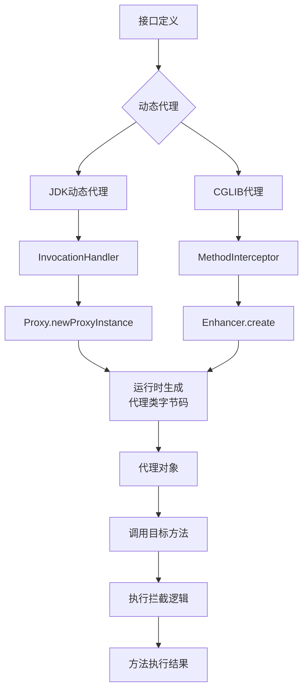

**动态代理的优势**：

| 特性 | 静态代理 | 动态代理 |
|-----|---------|---------|
| **代码量** | 每个类都需要单独编写 | 一个处理器处理所有类 |
| **灵活性** | 编译时固定 | 运行时可配置 |
| **扩展性** | 需要修改源码 | 通过反射动态扩展 |
| **性能** | 无额外开销 | 首次创建有开销 |
| **维护性** | 难以维护 | 统一管理拦截逻辑 |

---

## 7.3 JDK 动态代理实现

### 7.3.1 InvocationHandler 接口

JDK 动态代理的核心是 `InvocationHandler` 接口和 `Proxy.newProxyInstance()` 方法。

```java
// InvocationHandler 接口定义
public interface InvocationHandler {
    
    /**
     * @param proxy  代理对象本身（很少使用）
     * @param method 被调用的目标方法
     * @param args   方法参数
     * @return 方法执行结果
     * @throws Throwable 允许抛出异常
     */
    Object invoke(Object proxy, Method method, Object[] args) throws Throwable;
}
```

### 7.3.2 Proxy.newProxyInstance() 原理

```java
// Proxy.newProxyInstance 源码原理
public class Proxy implements java.io.Serializable {
    
    // 代理类的缓存（类加载器 + 接口列表 -> 代理类）
    private static final WeakCache<ClassLoader, Class<?>[], Class<?>>
        proxyClassCache = new WeakCache<>();
    
    public static Object newProxyInstance(ClassLoader loader,
                                          Class<?>[] interfaces,
                                          InvocationHandler h) {
        // 1. 检查 InvocationHandler 不能为 null
        Objects.requireNonNull(h);
        
        // 2. 复制一份接口数组（防止被修改）
        final Class<?>[] intfs = interfaces.clone();
        
        // 3. 获取或生成代理类
        Class<?> cl = getProxyClass0(loader, intfs);
        
        // 4. 获取代理类的构造函数（需要传入 InvocationHandler）
        try {
            // 获取构造方法：Constructor<Proxy> proxyCons = cl.getConstructor(InvocationHandler.class);
            final Constructor<?> cons = cl.getConstructor(InvocationHandler.class);
            
            // 5. 调用构造函数创建代理对象
            return cons.newInstance(new Object[]{h});
        } catch (NoSuchMethodException e) {
            throw new InternalError(e.toString(), e);
        }
    }
    
    // 获取代理类（如果缓存中没有，则动态生成）
    private static Class<?> getProxyClass0(ClassLoader loader, Class<?>[] interfaces) {
        // 如果接口超过限制，抛出异常（限制是为了保护）
        if (interfaces.length > 65535) {
            throw new IllegalArgumentException("interface limit exceeded");
        }
        
        // 尝试从缓存获取，或者生成新的代理类
        return proxyClassCache.get(loader, interfaces);
    }
}
```

### 7.3.3 完整代码示例

```java
// ==================== JDK 动态代理完整实现 ====================

import java.lang.reflect.InvocationHandler;
import java.lang.reflect.Method;
import java.lang.reflect.Proxy;
import java.util.Arrays;

// 1. 定义接口
interface UserService {
    void addUser(String name);
    User getUserById(Long id);
    List<User> getAllUsers();
}

// 2. 目标对象
class UserServiceImpl implements UserService {
    @Override
    public void addUser(String name) {
        System.out.println("添加用户：" + name);
        sleep(50);
    }
    
    @Override
    public User getUserById(Long id) {
        System.out.println("查询用户 ID：" + id);
        sleep(20);
        return new User(id, "用户" + id);
    }
    
    @Override
    public List<User> getAllUsers() {
        System.out.println("查询所有用户");
        sleep(100);
        return Arrays.asList(new User(1L, "张三"), new User(2L, "李四"));
    }
    
    private void sleep(long millis) {
        try {
            Thread.sleep(millis);
        } catch (InterruptedException e) {
            e.printStackTrace();
        }
    }
}

// 3. 用户实体类
class User {
    private Long id;
    private String name;
    
    public User(Long id, String name) {
        this.id = id;
        this.name = name;
    }
    
    // getters and toString
    public Long getId() { return id; }
    public String getName() { return name; }
    
    @Override
    public String toString() {
        return "User{id=" + id + ", name='" + name + "'}";
    }
}

// 4. InvocationHandler 实现类
class PerformanceInvocationHandler implements InvocationHandler {
    
    private final Object target;  // 目标对象
    
    public PerformanceInvocationHandler(Object target) {
        this.target = target;
    }
    
    @Override
    public Object invoke(Object proxy, Method method, Object[] args) throws Throwable {
        // 获取方法名
        String methodName = method.getName();
        
        // 前置通知：记录开始时间
        long startTime = System.currentTimeMillis();
        System.out.println("[JDK代理] 开始执行方法：" + methodName);
        System.out.println("[JDK代理] 参数：" + Arrays.toString(args));
        
        try {
            // 调用目标对象的方法
            Object result = method.invoke(target, args);
            
            // 后置通知：正常返回
            long endTime = System.currentTimeMillis();
            System.out.println("[JDK代理] 方法执行完成：" + methodName);
            System.out.println("[JDK代理] 耗时：" + (endTime - startTime) + "ms");
            
            return result;
        } catch (Exception e) {
            // 异常通知
            System.out.println("[JDK代理] 方法执行异常：" + methodName);
            e.printStackTrace();
            throw e;
        }
    }
}

// 5. 创建代理对象的工厂方法
class JdkProxyFactory {
    
    @SuppressWarnings("unchecked")
    public static <T> T createProxy(T target, Class<T> interfaceClass) {
        return (T) Proxy.newProxyInstance(
            interfaceClass.getClassLoader(),  // 类加载器
            new Class<?>[]{interfaceClass},   // 接口数组
            new PerformanceInvocationHandler(target)  // InvocationHandler
        );
    }
    
    // 支持多接口
    @SuppressWarnings("unchecked")
    public static <T> T createProxy(T target, Class<?>... interfaces) {
        return (T) Proxy.newProxyInstance(
            target.getClass().getClassLoader(),
            interfaces,
            new PerformanceInvocationHandler(target)
        );
    }
}

// 6. 测试类
public class JdkProxyTest {
    public static void main(String[] args) {
        // 创建目标对象
        UserService target = new UserServiceImpl();
        
        // 创建代理对象
        UserService proxy = JdkProxyFactory.createProxy(target, UserService.class);
        
        // 调用代理对象的方法
        System.out.println("========== 测试 addUser ==========");
        proxy.addUser("张三");
        
        System.out.println("\n========== 测试 getUserById ==========");
        User user = proxy.getUserById(1L);
        System.out.println("返回结果：" + user);
        
        System.out.println("\n========== 测试 getAllUsers ==========");
        List<User> users = proxy.getAllUsers();
        System.out.println("返回结果：" + users);
    }
}
```

### 7.3.4 生成的代理类结构图

JDK 动态代理生成的代理类结构如下：

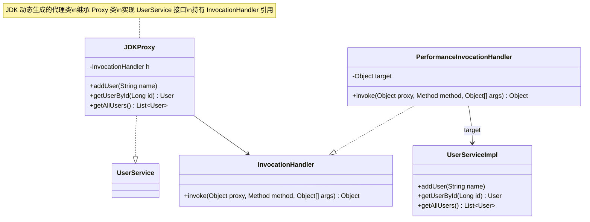

**生成的代理类源码结构（反编译）**：

```java
// 这是 JDK 动态生成的代理类结构（反编译得到）
public final class $Proxy0 extends Proxy implements UserService {
    
    private static Method m1;  // equals 方法
    private static Method m2;  // toString 方法
    private static Method m3;  // addUser 方法
    private static Method m4;  // getUserById 方法
    private static Method m5;  // getAllUsers 方法
    private static Method m0;  // hashCode 方法
    
    private InvocationHandler h;
    
    public $Proxy0(InvocationHandler h) {
        this.h = h;
    }
    
    // 方法调用会转发到 InvocationHandler.invoke()
    public final void addUser(String name) {
        try {
            // 调用InvocationHandler的invoke方法
            this.h.invoke(this, m3, new Object[]{name});
        } catch (RuntimeException | Error e) {
            throw e;
        } catch (Throwable t) {
            throw new UndeclaredThrowableException(t);
        }
    }
    
    public final User getUserById(Long id) {
        try {
            Object result = this.h.invoke(this, m4, new Object[]{id});
            return (User) result;
        } catch (RuntimeException | Error e) {
            throw e;
        } catch (Throwable t) {
            throw new UndeclaredThrowableException(t);
        }
    }
    
    public final List getAllUsers() {
        try {
            Object result = this.h.invoke(this, m5, null);
            return (List) result;
        } catch (RuntimeException | Error e) {
            throw e;
        } catch (Throwable t) {
            throw new UndeclaredThrowableException(t);
        }
    }
    
    // ... 其他方法（equals, toString, hashCode）
}
```

---

## 7.4 CGLIB 动态代理实现

### 7.4.1 MethodInterceptor 接口

CGLIB（Code Generation Library）通过继承方式实现代理，其核心接口是 `MethodInterceptor`。

```java
// CGLIB MethodInterceptor 接口
public interface MethodInterceptor extends Callback {
    
    /**
     * @param obj          代理对象
     * @param method       被调用的方法
     * @param args         方法参数
     * @param methodProxy  方法代理对象（用于调用父类方法）
     * @return 方法执行结果
     * @throws Throwable 允许抛出异常
     */
    Object intercept(Object obj, Method method, Object[] args, 
                     MethodProxy methodProxy) throws Throwable;
}
```

### 7.4.2 Enhancer 类原理

CGLIB 使用 `Enhancer` 类来创建代理对象，其原理是：

1. 生成目标类的子类
2. 在子类中重写所有非 final 方法
3. 在方法中调用 MethodInterceptor 进行拦截

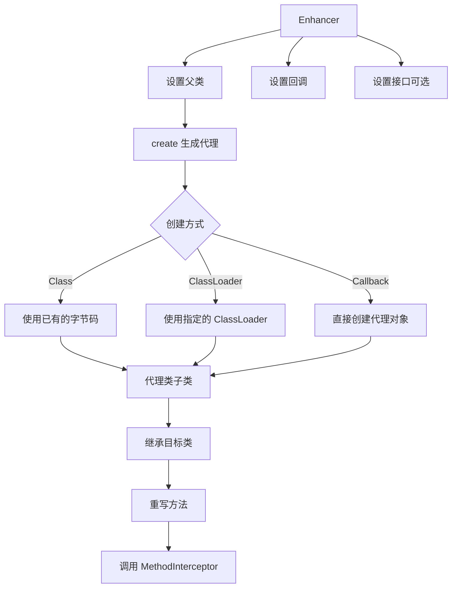

### 7.4.3 完整代码示例

```java
// ==================== CGLIB 动态代理完整实现 ====================

import net.sf.cglib.proxy.Enhancer;
import net.sf.cglib.proxy.MethodInterceptor;
import net.sf.cglib.proxy.MethodProxy;

import java.lang.reflect.Method;
import java.util.Arrays;

// 1. 用户服务实现类（没有实现接口）
class UserServiceImpl {
    
    public void addUser(String name) {
        System.out.println("添加用户：" + name);
        sleep(50);
    }
    
    public User getUserById(Long id) {
        System.out.println("查询用户 ID：" + id);
        sleep(20);
        return new User(id, "用户" + id);
    }
    
    // final 方法不能被代理
    public final String getServiceName() {
        return "UserService";
    }
    
    // private 方法不能被代理
    private void privateMethod() {
        System.out.println("私有方法");
    }
    
    private void sleep(long millis) {
        try {
            Thread.sleep(millis);
        } catch (InterruptedException e) {
            e.printStackTrace();
        }
    }
}

// 2. MethodInterceptor 实现
class CglibProxyInterceptor implements MethodInterceptor {
    
    private Object target;  // 目标对象
    
    public CglibProxyInterceptor(Object target) {
        this.target = target;
    }
    
    @Override
    public Object intercept(Object obj, Method method, Object[] args, 
                           MethodProxy methodProxy) throws Throwable {
        String methodName = method.getName();
        
        // 前置通知
        long startTime = System.currentTimeMillis();
        System.out.println("[CGLIB代理] 开始执行方法：" + methodName);
        System.out.println("[CGLIB代理] 参数：" + Arrays.toString(args));
        
        try {
            // 调用目标对象的方法
            // 方式1：method.invoke(target, args) - 使用反射调用
            // 方式2：methodProxy.invokeSuper(obj, args) - 使用 CGLIB 快速调用
            Object result = methodProxy.invokeSuper(obj, args);
            // 注意：对于目标对象是 target，调用 target 的方法用 methodProxy.invoke(target, args)
            // 这里 obj 是代理对象，调用父类（目标类）的方法用 methodProxy.invokeSuper(obj, args)
            
            // 后置通知
            long endTime = System.currentTimeMillis();
            System.out.println("[CGLIB代理] 方法执行完成：" + methodName);
            System.out.println("[CGLIB代理] 耗时：" + (endTime - startTime) + "ms");
            
            return result;
        } catch (Exception e) {
            // 异常通知
            System.out.println("[CGLIB代理] 方法执行异常：" + methodName);
            throw e;
        }
    }
}

// 3. CGLIB 代理工厂
class CglibProxyFactory {
    
    @SuppressWarnings("unchecked")
    public static <T> T createProxy(T target) {
        // 创建 Enhancer
        Enhancer enhancer = new Enhancer();
        
        // 设置父类（目标类）
        enhancer.setSuperclass(target.getClass());
        
        // 设置回调（MethodInterceptor）
        enhancer.setCallback(new CglibProxyInterceptor(target));
        
        // 设置接口（可选）- 如果目标类实现了接口，也可以设置
        // enhancer.setInterfaces(new Class<?>[]{UserService.class});
        
        // 创建代理对象
        return (T) enhancer.create();
    }
    
    // 带有参数创建代理
    @SuppressWarnings("unchecked")
    public static <T> T createProxy(Class<T> targetClass, Object... constructorArgs) {
        Enhancer enhancer = new Enhancer();
        enhancer.setSuperclass(targetClass);
        enhancer.setCallback(new CglibProxyInterceptor(null));  // 稍后设置 target
        
        // 如果有构造函数参数，需要自定义代理创建逻辑
        // 这里简化处理，假设无参构造函数
        return (T) enhancer.create();
    }
}

// 4. 测试类
public class CglibProxyTest {
    public static void main(String[] args) {
        // 创建目标对象
        UserServiceImpl target = new UserServiceImpl();
        
        // 创建代理对象
        UserServiceImpl proxy = CglibProxyFactory.createProxy(target);
        
        // 调用代理对象的方法
        System.out.println("========== 测试 addUser ==========");
        proxy.addUser("李四");
        
        System.out.println("\n========== 测试 getUserById ==========");
        User user = proxy.getUserById(2L);
        System.out.println("返回结果：" + user);
        
        System.out.println("\n========== 测试 final 方法 ==========");
        // final 方法不能被代理，会直接执行
        String name = proxy.getServiceName();
        System.out.println("返回结果：" + name);
        
        // 打印代理类的类名
        System.out.println("\n========== 代理类信息 ==========");
        System.out.println("代理类名：" + proxy.getClass().getName());
        System.out.println("父类：" + proxy.getClass().getSuperclass().getName());
    }
}
```

### 7.4.4 Spring 如何选择代理方式

Spring AOP 默认的代理策略：

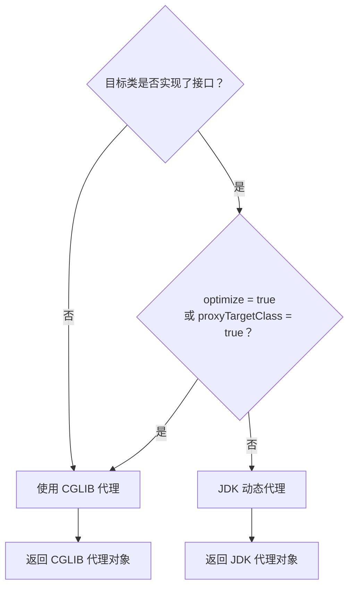

**Spring 选择代理方式的规则**：

| 条件 | 选择的代理方式 |
|-----|---------------|
| 目标类没有实现接口 | CGLIB |
| 目标类实现了接口，且 `proxyTargetClass = false`（默认） | JDK 动态代理 |
| 目标类实现了接口，但 `proxyTargetClass = true` | CGLIB |
| 设置了 `optimize = true` | CGLIB |

**源码位置**：`org.springframework.aop.framework.DefaultAopProxyFactory`

```java
// Spring 源码：DefaultAopProxyFactory.java
public class DefaultAopProxyFactory implements AopProxyFactory, Serializable {
    
    @Override
    public AopProxy createAopProxy(AdvisedSupport config) throws AopConfigException {
        // 如果设置了 proxyTargetClass=true，或者目标类不是接口，或者目标类是接口但不是 Spring 代理接口
        if (config.isOptimize() || config.isProxyTargetClass() || 
            hasNoUserSuppliedProxyInterfaces(config)) {
            
            Class<?> targetClass = config.getTargetClass();
            if (targetClass == null) {
                throw new AopConfigException("...");
            }
            
            // 如果目标类是接口或者是 JDK 代理类，使用 JDK 代理
            if (targetClass.isInterface() || Proxy.isProxyClass(targetClass)) {
                return new JdkDynamicAopProxy(config);
            }
            
            // 否则使用 CGLIB
            return new CglibAopProxy(config);
        } else {
            // 使用 JDK 动态代理
            return new JdkDynamicAopProxy(config);
        }
    }
    
    // 检查是否有用户提供的代理接口
    private boolean hasNoUserSuppliedProxyInterfaces(AdvisedSupport config) {
        Class<?>[] interfaces = config.getProxiedInterfaces();
        return (interfaces.length == 0 || 
                (interfaces.length == 1 && SpringProxy.class.isAssignableFrom(interfaces[0])));
    }
}
```

---

## 7.5 Spring AOP 代理创建流程

### 7.5.1 JdkDynamicAopProxy vs CglibAopProxy

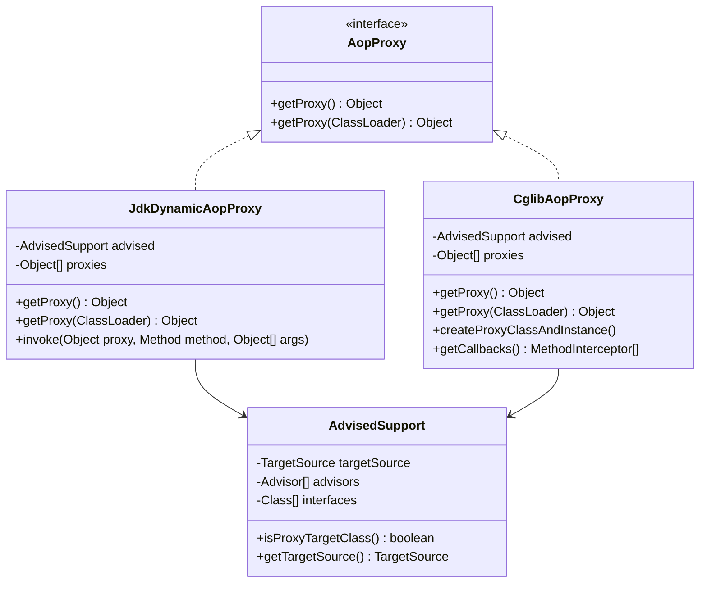

### 7.5.2 proxyFactory.getProxy() 流程图

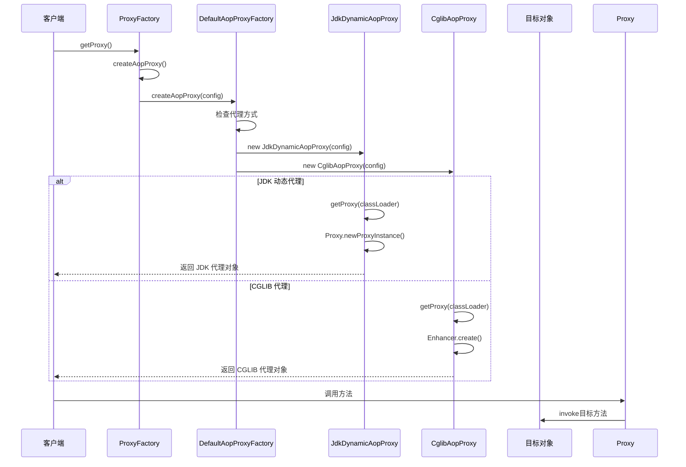

### 7.5.3 AdvisedSupport 的作用

**AdvisedSupport** 是 Spring AOP 的核心配置类，封装了代理所需的所有配置信息。

```java
// AdvisedSupport 核心源码
public class AdvisedSupport extends ProxyConfig implements TargetClassAware {
    
    // 目标源：提供目标对象
    private TargetSource targetSource;
    
    // 通知器数组：包含切点和通知
    private Advisor[] advisors = new Advisor[0];
    
    // 代理的接口列表
    private Class<?>[] interfaces = new Class<?>[0];
    
    // 方法匹配器（用于检测方法是否匹配切点）
    private MethodMatcher methodMatcher;
    
    // 过滤后的通知器（已匹配的方法对应的通知）
    private transient Map<Method, List<Object>> methodCache;
    
    // ... 省略其他方法
}
```

### 7.5.4 TargetSource 的作用

**TargetSource** 用于获取当前被代理的目标对象。

```java
// TargetSource 接口定义
public interface TargetSource extends TargetClassAware {
    
    /**
     * 返回目标类型
     */
    @Override
    Class<?> getTargetClass();
    
    /**
     * 是否是静态目标
     */
    boolean isStatic();
    
    /**
     * 获取目标对象
     */
    Object getTarget() throws Exception;
    
    /**
     * 释放目标对象
     */
    void releaseTarget(Object target) throws Exception;
}
```

**常见的 TargetSource 实现**：

```java
// 1. 静态目标源（最常用）
public class SingletonTargetSource implements TargetSource, Serializable {
    private final Object target;
    
    public SingletonTargetSource(Object target) {
        this.target = target;
    }
    
    @Override
    public Class<?> getTargetClass() {
        return target.getClass();
    }
    
    @Override
    public boolean isStatic() {
        return true;
    }
    
    @Override
    public Object getTarget() {
        return target;
    }
    
    @Override
    public void releaseTarget(Object target) {
        // 空实现
    }
}

// 2.  Prototype 目标源
public class PrototypeTargetSource extends AbstractPrototypeBasedTargetSource {
    
    @Override
    public Object getTarget() {
        return createBean(getBeanFactory(), getBeanName());
    }
}

// 3.  ThreadLocal 目标源
public class ThreadLocalTargetSource implements TargetSource {
    private final ThreadLocal<Object> targetInThread = new ThreadLocal<>();
    // ...
}
```

### 7.5.5 完整的代理创建流程源码分析

```java
// ==================== 完整的代理创建流程 ====================

// 1. 使用 ProxyFactory 创建代理
public class ProxyFactoryDemo {
    public static void main(String[] args) {
        // 创建目标对象
        UserService target = new UserServiceImpl();
        
        // 创建 ProxyFactory
        ProxyFactory proxyFactory = new ProxyFactory(target);
        
        // 设置代理接口
        proxyFactory.setInterfaces(UserService.class);
        
        // 设置代理方式（true 表示使用 CGLIB）
        proxyFactory.setProxyTargetClass(true);
        
        // 添加通知/切面
        proxyFactory.addAdvice(new MethodBeforeAdvice() {
            @Override
            public void before(Method method, Object[] args, Object target) throws Throwable {
                System.out.println("方法执行前：" + method.getName());
            }
        });
        
        proxyFactory.addAdvice(new AfterReturningAdvice() {
            @Override
            public void afterReturning(Object returnValue, Method method, 
                                       Object[] args, Object target) throws Throwable {
                System.out.println("方法返回后：" + method.getName());
            }
        });
        
        // 获取代理对象
        UserService proxy = (UserService) proxyFactory.getProxy();
        
        // 调用代理方法
        proxy.addUser("张三");
    }
}
```

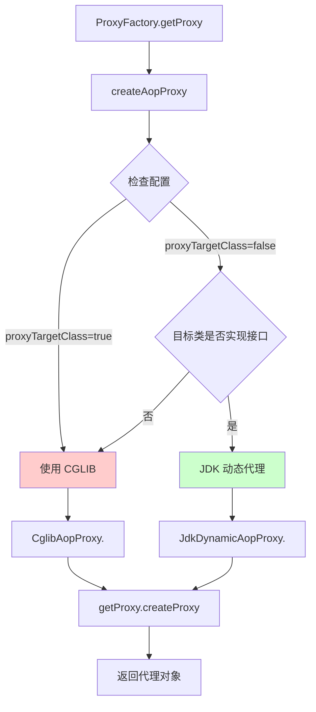

---

## 7.6 拦截器链执行原理

### 7.6.1 ReflectiveMethodInvocation

**ReflectiveMethodInvocation** 是 Spring AOP 中负责执行拦截器链的核心类。

```java
// ReflectiveMethodInvocation 核心源码
public class ReflectiveMethodInvocation implements ProxyMethodInvocation {
    
    // 目标对象
    private final Object target;
    
    // 代理对象
    private final Object proxy;
    
    // 方法
    private final Method method;
    
    // 参数
    private final Object[] arguments;
    
    // 方法所属的类
    private final Class<?> targetClass;
    
    // 拦截器链
    private final List<?> interceptors;
    
    // 当前执行到的拦截器索引
    private int currentInterceptorIndex = -1;
    
    // 执行拦截器链
    public Object proceed() throws Throwable {
        // 如果所有拦截器都执行完了，调用目标方法
        if (this.currentInterceptorIndex == this.interceptors.size() - 1) {
            return invokeJoinpoint();
        }
        
        // 获取下一个拦截器
        Object interceptor = this.interceptors.get(++this.currentInterceptorIndex);
        
        // 调用拦截器
        return ((MethodInterceptor) interceptor).invoke(this);
    }
    
    // 调用目标连接点
    protected Object invokeJoinpoint() throws Throwable {
        return AopUtils.invokeJoinpointUsingReflection(this.target, this.method, this.arguments);
    }
}
```

### 7.6.2 interceptorChain.invoke() 流程

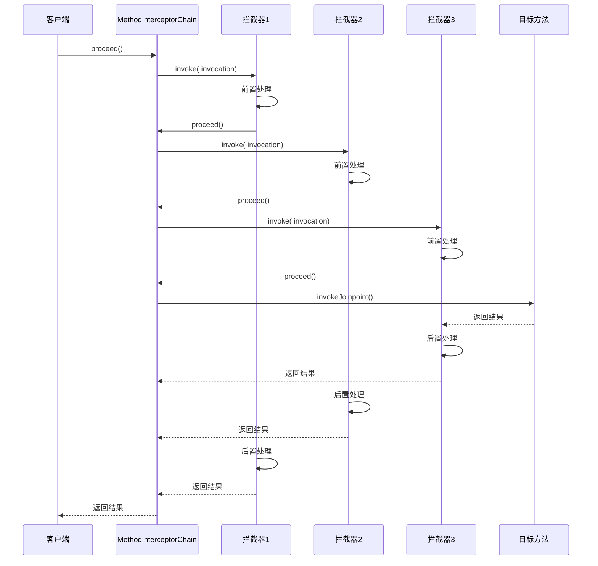

### 7.6.3 ProceedingJoinPoint 的使用

在 `@Around` 通知中，可以使用 `ProceedingJoinPoint` 来控制目标方法的执行。

```java
// ProceedingJoinPoint 使用示例
@Aspect
@Component
public class PerformanceAspect {
    
    @Around("execution(* com.example.service.*.*(..))")
    public Object measureTime(ProceedingJoinPoint pjp) throws Throwable {
        // 获取方法签名
        String methodName = pjp.getSignature().toShortString();
        
        // 获取参数
        Object[] args = pjp.getArgs();
        
        // 获取目标对象
        Object target = pjp.getTarget();
        
        // 前置处理
        long startTime = System.currentTimeMillis();
        System.out.println("开始执行：" + methodName);
        
        try {
            // 执行目标方法（可以多次执行）
            Object result = pjp.proceed();
            
            // 后置处理
            long endTime = System.currentTimeMillis();
            System.out.println(methodName + " 执行完成，耗时：" + (endTime - startTime) + "ms");
            
            return result;
        } catch (Exception e) {
            // 异常处理
            System.out.println(methodName + " 执行异常：" + e.getMessage());
            throw e;
        }
    }
}
```

### 7.6.4 多个 Advisor 的执行顺序

Spring AOP 中多个 Advisor 的执行顺序由以下因素决定：

1. **优先级顺序**：通过 `Order` 接口或 `@Order` 注解指定
2. **Aspect 顺序**：在 `@Aspect` 类上使用 `@Order` 注解
3. **Advisors 顺序**：在 `advisors` 列表中的顺序

```java
// Advisor 排序示例
@Aspect
@Component
@Order(1)  // Order 值越小，优先级越高
public class LoggingAspect {
    @Before("execution(* com.example.service.*.*(..))")
    public void before() {
        System.out.println("日志切面 - before");
    }
}

@Aspect
@Component
@Order(2)
public class PerformanceAspect {
    @Before("execution(* com.example.service.*.*(..))")
    public void before() {
        System.out.println("性能切面 - before");
    }
}
```

**执行顺序结果**：
```
日志切面 - before      // Order(1) 先执行
性能切面 - before       // Order(2) 后执行
目标方法执行...
```

---

## 7.7 【实战】AOP 切面编程实战

### 7.7.1 基于注解的 AOP 配置

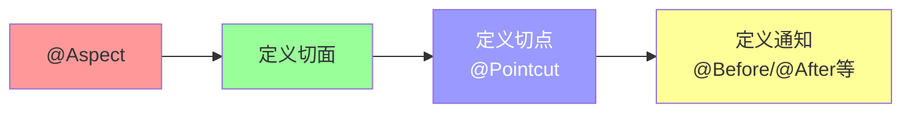

**pom.xml 依赖配置**：

```xml
<?xml version="1.0" encoding="UTF-8"?>
<project xmlns="http://maven.apache.org/POM/4.0.0"
         xmlns:xsi="http://www.w3.org/2001/XMLSchema-instance"
         xsi:schemaLocation="http://maven.apache.org/POM/4.0.0 
         http://maven.apache.org/xsd/maven-4.0.0.xsd">
    <modelVersion>4.0.0</modelVersion>
    
    <groupId>com.example</groupId>
    <artifactId>spring-aop-demo</artifactId>
    <version>1.0-SNAPSHOT</version>
    
    <properties>
        <maven.compiler.source>17</maven.compiler.source>
        <maven.compiler.target>17</maven.compiler.target>
        <spring.version>6.0.11</spring.version>
    </properties>
    
    <dependencies>
        <!-- Spring Context -->
        <dependency>
            <groupId>org.springframework</groupId>
            <artifactId>spring-context</artifactId>
            <version>${spring.version}</version>
        </dependency>
        
        <!-- Spring AOP -->
        <dependency>
            <groupId>org.springframework</groupId>
            <artifactId>spring-aop</artifactId>
            <version>${spring.version}</version>
        </dependency>
        
        <!-- AspectJ -->
        <dependency>
            <groupId>org.aspectj</groupId>
            <artifactId>aspectjweaver</artifactId>
            <version>1.9.20</version>
        </dependency>
        
        <!-- Spring AspectJ -->
        <dependency>
            <groupId>org.springframework</groupId>
            <artifactId>spring-aspects</artifactId>
            <version>${spring.version}</version>
        </dependency>
        
        <!-- JUnit + Spring Test -->
        <dependency>
            <groupId>org.springframework</groupId>
            <artifactId>spring-test</artifactId>
            <version>${spring.version}</version>
            <scope>test</scope>
        </dependency>
        <dependency>
            <groupId>org.junit.jupiter</groupId>
            <artifactId>junit-jupiter</artifactId>
            <version>5.10.0</version>
            <scope>test</scope>
        </dependency>
    </dependencies>
</project>
```

### 7.7.2 完整实战代码

**项目结构**：

```
src/main/java/com/example/aop/
├── aop/
│   ├──anno/          # 注解定义
│   │   └── @MyLog    # 自定义日志注解
│   ├──aspect/        # 切面类
│   │   ├── LoggingAspect
│   │   ├── PerformanceAspect
│   │   └── TransactionAspect
│   ├──entity/        # 实体类
│   │   └── User
│   ├──service/      # 服务接口和实现
│   │   ├── UserService
│   │   └── impl/UserServiceImpl
│   └── SpringAopApplication
```

**1. 实体类**

```java
// com.example.aop.entity.User
package com.example.aop.entity;

public class User {
    private Long id;
    private String name;
    private Integer age;
    
    public User() {}
    
    public User(Long id, String name, Integer age) {
        this.id = id;
        this.name = name;
        this.age = age;
    }
    
    // getters, setters, toString
    public Long getId() { return id; }
    public void setId(Long id) { this.id = id; }
    public String getName() { return name; }
    public void setName(String name) { this.name = name; }
    public Integer getAge() { return age; }
    public void setAge(Integer age) { this.age = age; }
    
    @Override
    public String toString() {
        return "User{id=" + id + ", name='" + name + "', age=" + age + "}";
    }
}
```

**2. 服务接口和实现**

```java
// com.example.aop.service.UserService
package com.example.aop.service;

import com.example.aop.entity.User;
import java.util.List;

public interface UserService {
    void addUser(User user);
    User getUserById(Long id);
    List<User> getAllUsers();
    void deleteUser(Long id);
    void updateUser(User user);
}
```

```java
// com.example.aop.service.impl.UserServiceImpl
package com.example.aop.service.impl;

import com.example.aop.entity.User;
import com.example.aop.service.UserService;
import org.springframework.stereotype.Service;

import java.util.Arrays;
import java.util.List;
import java.util.Map;
import java.util.concurrent.ConcurrentHashMap;
import java.util.concurrent.atomic.AtomicLong;

@Service
public class UserServiceImpl implements UserService {
    
    private final Map<Long, User> userMap = new ConcurrentHashMap<>();
    private final AtomicLong idGenerator = new AtomicLong(1);
    
    public UserServiceImpl() {
        // 初始化测试数据
        userMap.put(1L, new User(1L, "张三", 25));
        userMap.put(2L, new User(2L, "李四", 30));
        userMap.put(3L, new User(3L, "王五", 28));
    }
    
    @Override
    public void addUser(User user) {
        Long id = idGenerator.getAndIncrement();
        user.setId(id);
        userMap.put(id, user);
        System.out.println("添加用户成功：" + user);
    }
    
    @Override
    public User getUserById(Long id) {
        simulateSlowOperation();
        User user = userMap.get(id);
        if (user == null) {
            throw new RuntimeException("用户不存在，ID：" + id);
        }
        return user;
    }
    
    @Override
    public List<User> getAllUsers() {
        simulateSlowOperation();
        return Arrays.asList(userMap.values().toArray(new User[0]));
    }
    
    @Override
    public void deleteUser(Long id) {
        User removed = userMap.remove(id);
        if (removed == null) {
            throw new RuntimeException("用户不存在，无法删除，ID：" + id);
        }
        System.out.println("删除用户成功：" + removed);
    }
    
    @Override
    public void updateUser(User user) {
        if (!userMap.containsKey(user.getId())) {
            throw new RuntimeException("用户不存在，无法更新，ID：" + user.getId());
        }
        userMap.put(user.getId(), user);
        System.out.println("更新用户成功：" + user);
    }
    
    private void simulateSlowOperation() {
        try {
            Thread.sleep(100);
        } catch (InterruptedException e) {
            Thread.currentThread().interrupt();
        }
    }
}
```

**3. 自定义日志注解**

```java
// com.example.aop.anno.MyLog
package com.example.aop.anno;

import java.lang.annotation.*;

@Target(ElementType.METHOD)
@Retention(RetentionPolicy.RUNTIME)
@Documented
public @interface MyLog {
    String value() default "";
}
```

**4. 日志切面**

```java
// com.example.aop.aspect.LoggingAspect
package com.example.aop.aspect;

import com.example.aop.anno.MyLog;
import org.aspectj.lang.JoinPoint;
import org.aspectj.lang.annotation.*;
import org.aspectj.lang.reflect.MethodSignature;
import org.slf4j.Logger;
import org.slf4j.LoggerFactory;
import org.springframework.stereotype.Component;

import java.util.Arrays;

@Aspect
@Component
public class LoggingAspect {
    
    private static final Logger log = LoggerFactory.getLogger(LoggingAspect.class);
    
    // 定义切点：匹配所有使用了 @MyLog 注解的方法
    @Pointcut("@annotation(com.example.aop.anno.MyLog)")
    public void myLogPointcut() {}
    
    // 定义切点：匹配 service 包下所有类的所有方法
    @Pointcut("execution(* com.example.aop.service..*(..))")
    public void servicePointcut() {}
    
    // 组合切点
    @Pointcut("myLogPointcut() || servicePointcut()")
    public void combinedPointcut() {}
    
    /**
     * 前置通知
     */
    @Before("combinedPointcut()")
    public void beforeAdvice(JoinPoint joinPoint) {
        // 获取方法签名
        MethodSignature signature = (MethodSignature) joinPoint.getSignature();
        String className = signature.getDeclaringType().getSimpleName();
        String methodName = signature.getName();
        
        // 获取参数
        Object[] args = joinPoint.getArgs();
        
        log.info("[前置通知] {}.{} 开始执行，参数：{}", className, methodName, Arrays.toString(args));
    }
    
    /**
     * 后置通知（方法执行后，无论是否异常）
     */
    @After("combinedPointcut()")
    public void afterAdvice(JoinPoint joinPoint) {
        MethodSignature signature = (MethodSignature) joinPoint.getSignature();
        String className = signature.getDeclaringType().getSimpleName();
        String methodName = signature.getName();
        
        log.info("[后置通知] {}.{} 执行完成", className, methodName);
    }
    
    /**
     * 返回后通知（方法正常返回后）
     */
    @AfterReturning(pointcut = "combinedPointcut()", returning = "result")
    public void afterReturningAdvice(JoinPoint joinPoint, Object result) {
        MethodSignature signature = (MethodSignature) joinPoint.getSignature();
        String className = signature.getDeclaringType().getSimpleName();
        String methodName = signature.getName();
        
        log.info("[返回通知] {}.{} 返回结果：{}", className, methodName, result);
    }
    
    /**
     * 异常通知（方法抛出异常后）
     */
    @AfterThrowing(pointcut = "combinedPointcut()", throwing = "exception")
    public void afterThrowingAdvice(JoinPoint joinPoint, Throwable exception) {
        MethodSignature signature = (MethodSignature) joinPoint.getSignature();
        String className = signature.getDeclaringType().getSimpleName();
        String methodName = signature.getName();
        
        log.error("[异常通知] {}.{} 抛出异常：{}", className, methodName, exception.getMessage(), exception);
    }
}
```

**5. 性能监控切面**

```java
// com.example.aop.aspect.PerformanceAspect
package com.example.aop.aspect;

import org.aspectj.lang.ProceedingJoinPoint;
import org.aspectj.lang.annotation.Around;
import org.aspectj.lang.annotation.Aspect;
import org.aspectj.lang.annotation.Pointcut;
import org.aspectj.lang.reflect.MethodSignature;
import org.slf4j.Logger;
import org.slf4j.LoggerFactory;
import org.springframework.stereotype.Component;

@Aspect
@Component
public class PerformanceAspect {
    
    private static final Logger log = LoggerFactory.getLogger(PerformanceAspect.class);
    
    // 切点：匹配 service 包下所有类的所有方法
    @Pointcut("execution(* com.example.aop.service..*(..))")
    public void performancePointcut() {}
    
    /**
     * 环绕通知：性能监控
     */
    @Around("performancePointcut()")
    public Object aroundAdvice(ProceedingJoinPoint pjp) throws Throwable {
        // 获取方法信息
        MethodSignature signature = (MethodSignature) pjp.getSignature();
        String className = signature.getDeclaringType().getSimpleName();
        String methodName = signature.getName();
        
        // 记录开始时间
        long startTime = System.currentTimeMillis();
        log.debug("[性能监控] {}.{} 开始执行", className, methodName);
        
        try {
            // 执行目标方法
            Object result = pjp.proceed();
            
            // 计算执行时间
            long endTime = System.currentTimeMillis();
            long duration = endTime - startTime;
            
            // 如果执行时间超过阈值，记录警告
            if (duration > 1000) {
                log.warn("[性能监控] {}.{} 执行时间过长：{}ms", className, methodName, duration);
            } else {
                log.debug("[性能监控] {}.{} 执行完成，耗时：{}ms", className, methodName, duration);
            }
            
            return result;
        } catch (Throwable e) {
            long endTime = System.currentTimeMillis();
            log.error("[性能监控] {}.{} 执行异常，耗时：{}ms，异常：{}", 
                     className, methodName, endTime - startTime, e.getMessage());
            throw e;
        }
    }
}
```

**6. Spring 配置类**

```java
// com.example.aop.SpringAopApplication
package com.example.aop;

import org.springframework.context.annotation.*;
import org.springframework.context.EnableAspectJAutoProxy;

@Configuration
@ComponentScan("com.example.aop")
@EnableAspectJAutoProxy(proxyTargetClass = true)  // 启用 AspectJ 自动代理
public class SpringAopApplication {
    
    public static void main(String[] args) {
        AnnotationConfigApplicationContext context = 
            new AnnotationConfigApplicationContext(SpringAopApplication.class);
        
        UserService userService = context.getBean(UserService.class);
        
        System.out.println("========== 测试 AOP ==========");
        
        // 测试查询
        System.out.println("\n--- 测试 getUserById ---");
        User user = userService.getUserById(1L);
        System.out.println("查询结果：" + user);
        
        // 测试添加
        System.out.println("\n--- 测试 addUser ---");
        userService.addUser(new User(null, "赵六", 22));
        
        // 测试更新
        System.out.println("\n--- 测试 updateUser ---");
        userService.updateUser(new User(1L, "张三（已更新）", 26));
        
        // 测试删除
        System.out.println("\n--- 测试 deleteUser ---");
        userService.deleteUser(2L);
        
        // 测试查询所有
        System.out.println("\n--- 测试 getAllUsers ---");
        userService.getAllUsers().forEach(System.out::println);
        
        // 测试异常
        System.out.println("\n--- 测试异常 ---");
        try {
            userService.getUserById(999L);
        } catch (Exception e) {
            System.out.println("捕获异常：" + e.getMessage());
        }
        
        context.close();
    }
}
```

### 7.7.3 execution 表达式详解

```
execution(modifiers-pattern? return-type-pattern declaring-type-pattern? method-name-pattern(param-pattern) throws-pattern?)
```

**各部分含义**：

| 组成部分 | 含义 | 示例 |
|---------|------|------|
| `modifiers-pattern` | 访问修饰符 | `public`, `private` |
| `return-type-pattern` | 返回类型 | `void`, `*`, `String` |
| `declaring-type-pattern` | 包/类类型 | `com.example.service.*` |
| `method-name-pattern` | 方法名 | `add*`, `*User`, `*` |
| `param-pattern` | 参数模式 | `(..)`, `(*)`, `(String, *)` |
| `throws-pattern` | 异常类型 | `throws Exception` |

**常用表达式示例**：

```java
// 匹配指定包下所有方法
execution(* com.example.service.*.*(..))

// 匹配指定包及其子包下所有方法
execution(* com.example..*.*(..))

// 匹配指定类所有方法
execution(* com.example.service.UserService.*(..))

// 匹配所有以 add 开头的方法
execution(* add*(..))

// 匹配只有一个参数的方法
execution(* *(String))

// 匹配两个参数的方法，第一个参数是 String
execution(* *(String, ..))

// 匹配返回类型为 User 的方法
execution(User com.example.service.*.*(..))

// 匹配 public 方法
execution(public * com.example.service.*.*(..))

// 匹配 private 返回类型为 void 的方法
execution(private void com.example.service.*.*(..))
```

---

## 本章总结

```
flowchart TD
    A[Spring AOP 原理] --> B[核心概念]
    A --> C[代理实现]
    A --> D[代理创建流程]
    A --> E[拦截器链]
    
    B --> B1[Joinpoint 连接点]
    B --> B2[Pointcut 切点]
    B --> B3[Advice 通知]
    B --> B4[Aspect 切面]
    B --> B5[Weaving 织入]
    
    C --> C1[JDK 动态代理]
    C --> C2[CGLIB 代理]
    
    D --> D1[ProxyFactory]
    D --> D2[AdvisedSupport]
    D --> D3[TargetSource]
    
    E --> E1[ReflectiveMethodInvocation]
    E --> E2[MethodInterceptor]
    E --> E3[拦截器链执行]
```

**本章要点**：

1. **AOP 核心概念**：Joinpoint、Pointcut、Advice、Aspect、Weaving 是 AOP 的五大核心概念
2. **静态代理 vs 动态代理**：静态代理类爆炸，动态代理灵活可配置
3. **JDK 动态代理**：基于接口代理，使用 InvocationHandler
4. **CGLIB 代理**：基于继承代理，使用 MethodInterceptor
5. **Spring 代理选择**：默认优先 JDK 代理，配置 proxyTargetClass=true 强制使用 CGLIB
6. **拦截器链**：ReflectiveMethodInvocation 负责按顺序执行所有拦截器

---

**下一章预告**：第8章 Spring 事务管理

在下一章中，我们将学习：
- Spring 事务的 ACID 特性
- PlatformTransactionManager 事务抽象
- 7 种事务传播行为
- @Transactional 注解原理
- 事务失效场景与解决方案
