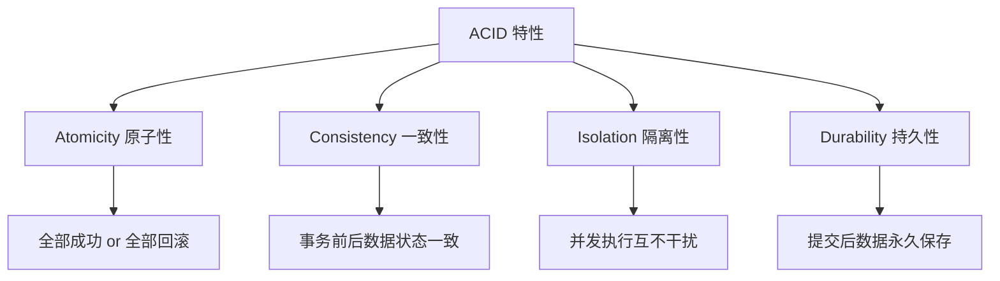
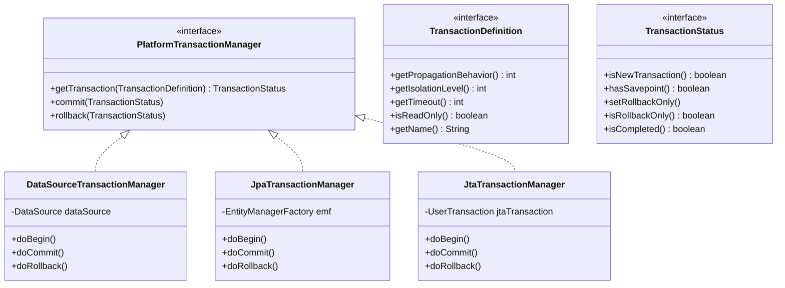
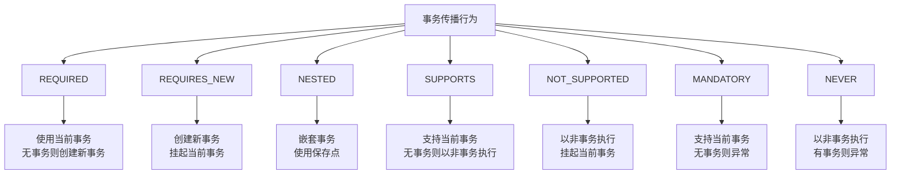
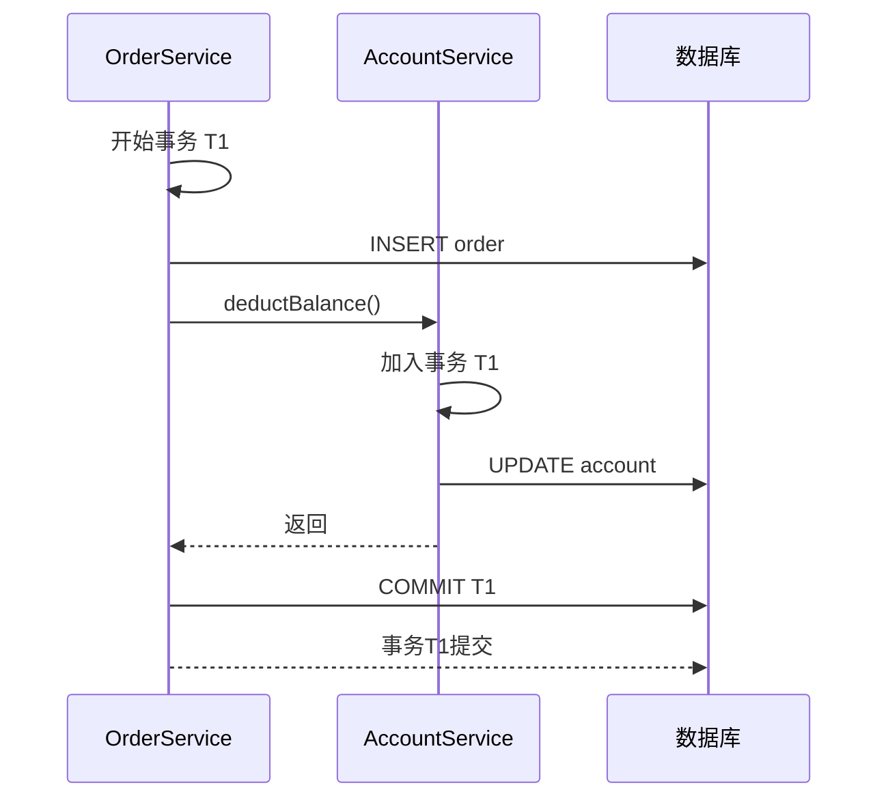
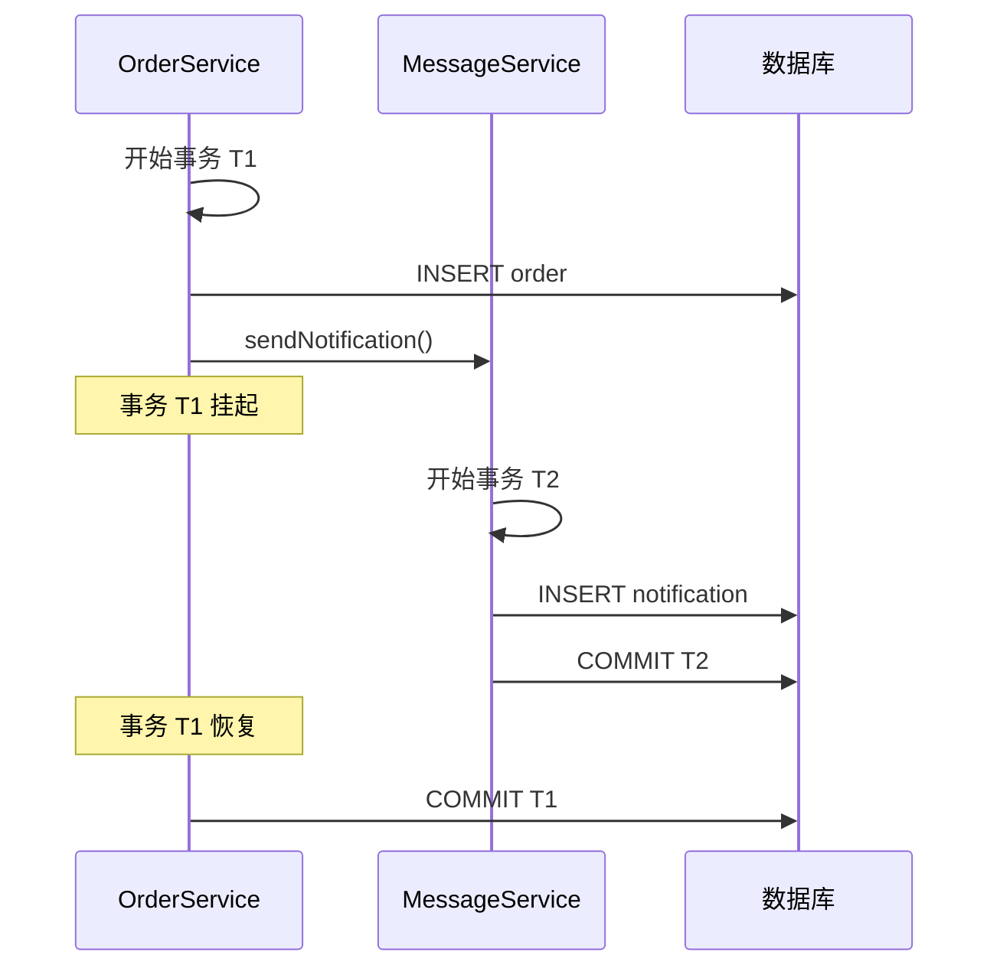
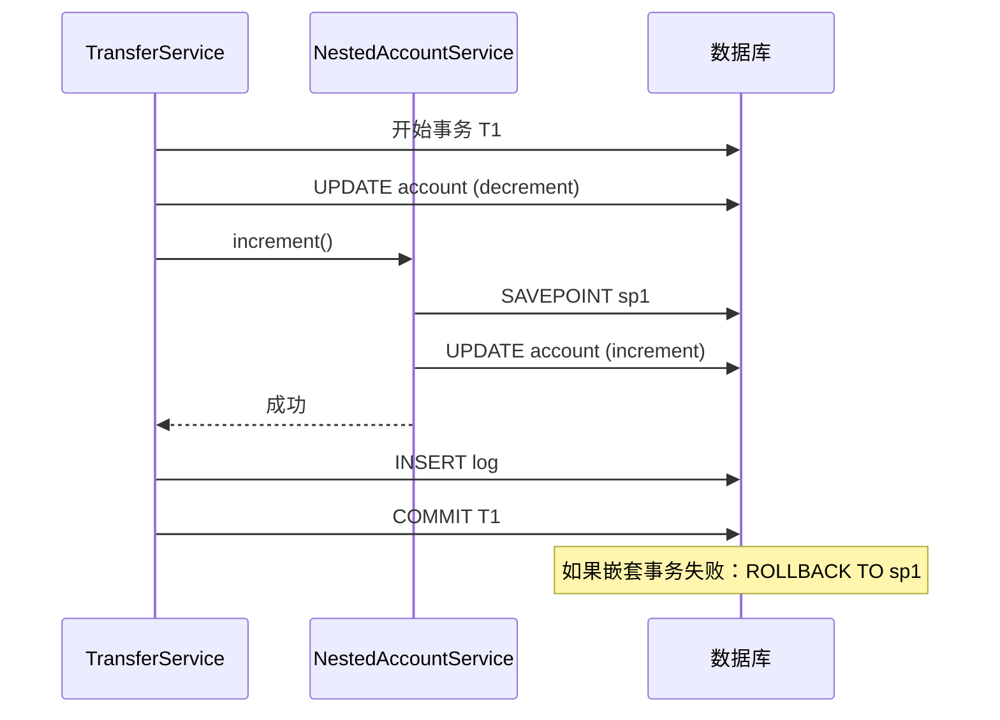
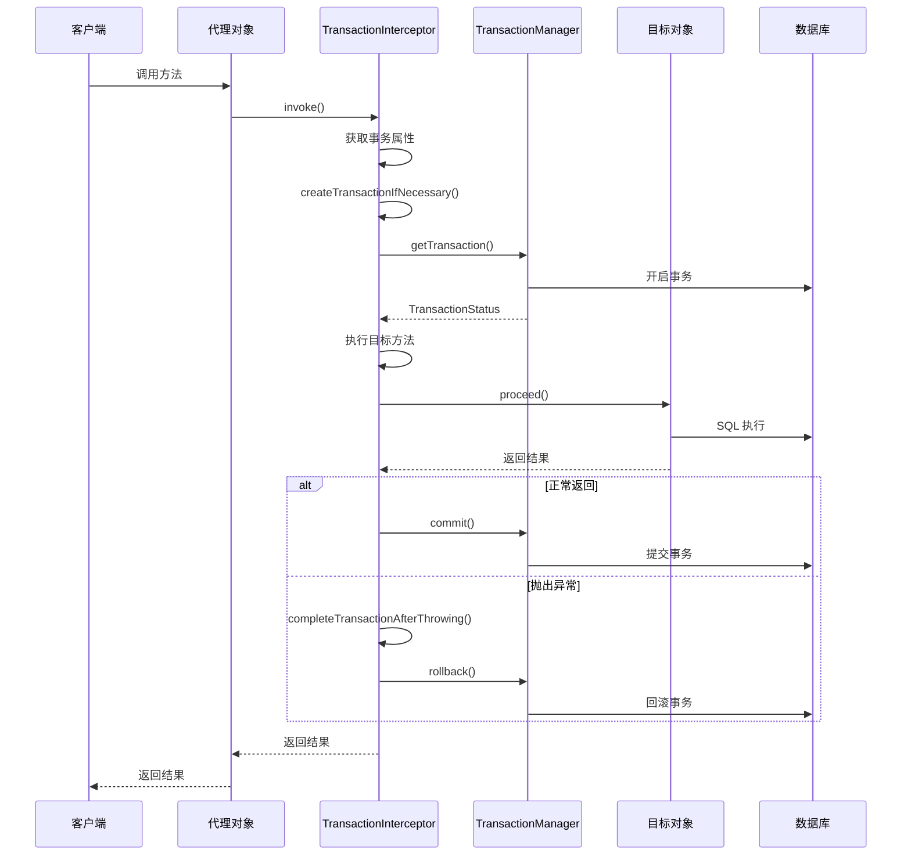
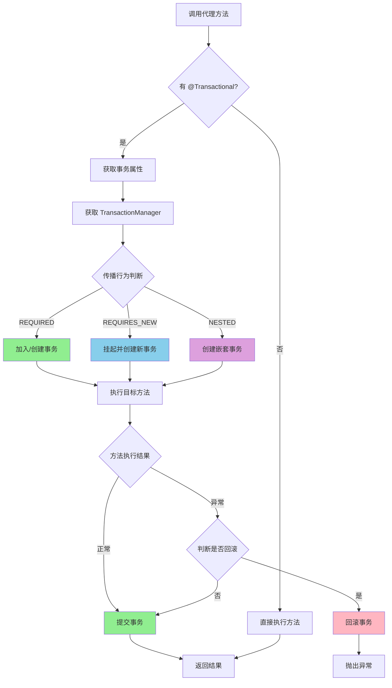
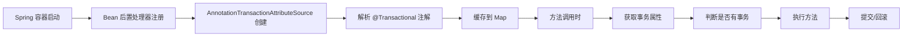
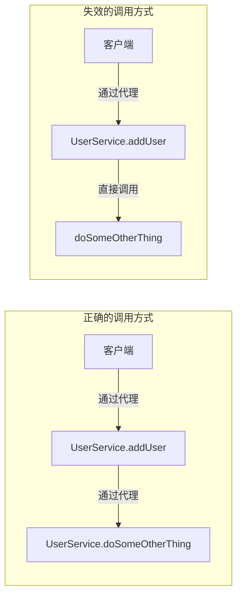

# 第8章 Spring 事务管理

## 章节概述

事务管理是企业级应用开发中不可或缺的一部分，它确保数据的完整性和一致性。Spring 框架提供了强大而灵活的事务管理功能，包括编程式事务和声明式事务两种方式。本章将从理论到实践，全面剖析 Spring 事务管理的实现原理。

```
flowchart LR
    subgraph 事务管理
        PTM[PlatformTransactionManager]
        TD[TransactionDefinition]
        TS[TransactionStatus]
    end
    
    subgraph 传播行为
        REQ[REQUIRED]
        RN[REQUIRES_NEW]
        NST[NESTED]
        SUP[SUPPORTS]
        NS[NOT_SUPPORTED]
        MND[MANDATORY]
        NVR[NEVER]
    end
    
    subgraph 实现方式
        P[编程式事务]
        D[声明式事务<br/>@Transactional]
    end
    
    PTM --> TD
    TD --> TS
    REQ --> P
    RN --> D
```

---

## 8.1 事务的 ACID 特性

### 8.1.1 ACID 特性详解

**ACID** 是事务的四个基本特性，是数据库事务处理的基础：



#### Atomicity（原子性）

**定义**：事务是一个不可分割的工作单位，事务中的操作要么全部成功，要么全部失败回滚。

```java
// 原子性示例
@Service
public class TransferService {
    
    @Autowired
    private AccountDao accountDao;
    
    @Transactional
    public void transfer(Long fromId, Long toId, BigDecimal amount) {
        // 原子性：两个操作要么都成功，要么都失败
        accountDao.decrement(fromId, amount);  // 转出账户减款
        accountDao.increment(toId, amount);     // 转入账户加款
        // 如果第二句SQL失败，第一句也会回滚
    }
}
```

#### Consistency（一致性）

**定义**：事务执行前后，数据库的完整性约束没有被破坏，数据库状态保持一致。

```java
// 一致性示例：转账前后总金额不变
// 转账前：账户A=1000，账户B=1000，总金额=2000
// 转账后：账户A=900，账户B=1100，总金额=2000 ✓

// 一致性规则：
// - 账户余额不能为负数
// - 转账前后总金额必须相等
// - 事务提交后，数据库必须满足所有完整性约束
```

#### Isolation（隔离性）

**定义**：每个事务的执行互不干扰，事务提交前对其他事务不可见。

```java
// 隔离性示例：并发转账不会导致数据错乱
// 事务1：账户A -> 账户B 转账 100
// 事务2：账户A -> 账户C 转账 200
// 两个事务并发执行，账户A的余额应该正确计算
```

#### Durability（持久性）

**定义**：一旦事务提交，其对数据库的修改是永久性的，即使系统崩溃也不会丢失。

```java
// 持久性示例
@Transactional
public void saveUser(User user) {
    userDao.insert(user);
    // 事务提交后，即使数据库崩溃，用户数据也不会丢失
    // 这是由数据库的 redo log / undo log 保证的
}
```

### 8.1.2 ACID 与 Spring 事务的对应关系

| ACID 特性 | Spring 事务实现方式 | 相关组件 |
|----------|-------------------|---------|
| 原子性 | 事务提交/回滚 | PlatformTransactionManager |
| 一致性 | 完整性约束 + 事务规则 | 数据库 + 业务代码 |
| 隔离性 | 隔离级别控制 | TransactionDefinition.isolation |
| 持久性 | 数据库日志机制 | redo log / binary log |

---

## 8.2 Spring 事务抽象

### 8.2.1 PlatformTransactionManager 接口

**PlatformTransactionManager** 是 Spring 事务抽象的核心接口：

```java
// PlatformTransactionManager 接口定义
public interface PlatformTransactionManager {
    
    /**
     * 获取事务状态
     * @param definition 事务定义（传播行为、隔离级别、超时等）
     * @return 事务状态
     * @throws TransactionException 事务异常
     */
    TransactionStatus getTransaction(@Nullable TransactionDefinition definition) 
        throws TransactionException;
    
    /**
     * 提交事务
     * @param status 事务状态
     * @throws TransactionException 事务异常
     */
    void commit(TransactionStatus status) throws TransactionException;
    
    /**
     * 回滚事务
     * @param status 事务状态
     * @throws TransactionException 事务异常
     */
    void rollback(TransactionStatus status) throws TransactionException;
}
```

**Spring 内置的事务管理器实现**：

| 事务管理器 | 适用场景 |
|-----------|---------|
| DataSourceTransactionManager | JDBC/MyBatis |
| JpaTransactionManager | JPA |
| HibernateTransactionManager | Hibernate |
| JtaTransactionManager | 分布式事务 |
| RabbitMQTransactionManager | RabbitMQ |
| KafkaTransactionManager | Kafka |

### 8.2.2 TransactionDefinition 接口

**TransactionDefinition** 定义了事务的各种属性：

```java
// TransactionDefinition 接口定义
public interface TransactionDefinition {
    
    // ==================== 传播行为 ====================
    
    /** 支持当前事务，如果不存在则创建新事务 */
    int PROPAGATION_REQUIRED = 0;
    
    /** 支持当前事务，如果不存在则以非事务方式执行 */
    int PROPAGATION_SUPPORTS = 1;
    
    /** 支持当前事务，如果不存在则抛出异常 */
    int PROPAGATION_MANDATORY = 2;
    
    /** 创建新事务，如果当前存在事务则挂起 */
    int PROPAGATION_REQUIRES_NEW = 3;
    
    /** 以非事务方式执行，如果当前存在事务则挂起 */
    int PROPAGATION_NOT_SUPPORTED = 4;
    
    /** 以非事务方式执行，如果当前存在事务则抛出异常 */
    int PROPAGATION_NEVER = 5;
    
    /** 如果当前存在事务，则在嵌套事务中执行 */
    int PROPAGATION_NESTED = 6;
    
    // ==================== 隔离级别 ====================
    
    /** 使用数据库默认隔离级别 */
    int ISOLATION_DEFAULT = -1;
    
    /** 读未提交（脏读、不可重复读、幻读都可能发生） */
    int ISOLATION_READ_UNCOMMITTED = 1;
    
    /** 读已提交（避免脏读） */
    int ISOLATION_READ_COMMITTED = 2;
    
    /** 可重复读（避免脏读、不可重复读） */
    int ISOLATION_REPEATABLE_READ = 4;
    
    /** 串行化（避免所有并发问题，但性能最低） */
    int ISOLATION_SERIALIZABLE = 8;
    
    // ==================== 默认值 ====================
    
    /** 默认超时时间（使用数据库超时） */
    int TIMEOUT_DEFAULT = -1;
    
    // ==================== 获取属性方法 ====================
    
    /** 获取传播行为 */
    default int getPropagationBehavior() { return PROPAGATION_REQUIRED; }
    
    /** 获取隔离级别 */
    default int getIsolationLevel() { return ISOLATION_DEFAULT; }
    
    /** 获取超时时间（秒） */
    default int getTimeout() { return TIMEOUT_DEFAULT; }
    
    /** 是否只读 */
    default boolean isReadOnly() { return false; }
    
    /** 获取事务名称 */
    @Nullable
    default String getName() { return null; }
}
```

### 8.2.3 TransactionStatus 接口

**TransactionStatus** 描述事务的状态：

```java
// TransactionStatus 接口定义
public interface TransactionStatus extends SavepointManager {
    
    /** 判断事务是否是新事务（首次被管理器创建） */
    boolean isNewTransaction();
    
    /** 判断事务是否包含保存点（嵌套事务） */
    boolean hasSavepoint();
    
    /** 设置事务回滚 */
    void setRollbackOnly();
    
    /** 判断事务是否被标记为回滚 */
    boolean isRollbackOnly();
    
    /** 判断事务是否已完成（已提交或已回滚） */
    boolean isCompleted();
    
    // ==================== SavepointManager 方法 ====================
    
    /** 创建保存点 */
    Object createSavepoint() throws TransactionException;
    
    /** 回滚到保存点 */
    void rollbackToSavepoint(Object savepoint) throws TransactionException;
    
    /** 释放保存点 */
    void releaseSavepoint(Object savepoint) throws TransactionException;
}
```

### 8.2.4 抽象体系图



---

## 8.3 事务传播行为

### 8.3.1 七种传播行为详解



### 8.3.2 场景示例和流程图

#### REQUIRED（默认，最常用）

**规则**：加入当前事务，如果不存在则创建新事务

```java
// 场景：外层方法有事务，内层方法加入外层事务
@Service
public class OrderService {
    
    @Autowired
    private AccountService accountService;
    
    @Transactional
    public void createOrder(Order order) {
        // 1. 保存订单 - 使用 OrderService 的事务
        orderDao.save(order);
        
        // 2. 扣减余额 - 使用 AccountService 的事务
        // 由于 AccountService 方法也是 REQUIRED，会加入 OrderService 的事务
        accountService.deductBalance(order.getUserId(), order.getAmount());
    }
}

@Service
public class AccountService {
    
    @Transactional  // PROPAGATION_REQUIRED（默认）
    public void deductBalance(Long userId, BigDecimal amount) {
        // 参与 OrderService 的事务
        accountDao.decrement(userId, amount);
    }
}
```



#### REQUIRES_NEW

**规则**：总是创建新事务，挂起当前事务

```java
@Service
public class OrderService {
    
    @Transactional
    public void createOrder(Order order) {
        // 保存订单 - 事务 T1
        orderDao.save(order);
        
        // 发送消息 - 创建新事务 T2
        // 无论 T1 成功还是失败，T2 都会提交
        messageService.sendOrderCreatedNotification(order);
    }
}

@Service
public class MessageService {
    
    @Transactional(propagation = Propagation.REQUIRES_NEW)
    public void sendOrderCreatedNotification(Order order) {
        // 独立事务 T2，不受 OrderService 事务影响
        notificationDao.save(new Notification(order));
    }
}
```



#### NESTED（嵌套事务）

**规则**：如果存在当前事务，则在嵌套事务中执行，使用保存点

```java
@Service
public class TransferService {
    
    @Transactional
    public void transfer(Long fromId, Long toId, BigDecimal amount) {
        // 步骤1：扣减转出账户 - 在主事务中
        accountDao.decrement(fromId, amount);
        
        try {
            // 步骤2：增加转入账户 - 在嵌套事务中
            // 即使失败，也只会回滚到保存点，不会影响步骤1
            nestedAccountService.increment(toId, amount);
        } catch (Exception e) {
            // 步骤2失败，可以选择回滚到保存点，继续执行步骤3
            // 或者直接回滚整个事务
        }
        
        // 步骤3：记录日志 - 在主事务中，仍然会执行
        logService.recordTransferLog(fromId, toId, amount);
    }
}

@Service
public class NestedAccountService {
    
    @Transactional(propagation = Propagation.NESTED)
    public void increment(Long userId, BigDecimal amount) {
        // 嵌套事务，使用保存点
        accountDao.increment(userId, amount);
    }
}
```



### 8.3.3 表格对比

| 传播行为 | 当前有事务 | 当前无事务 | 说明 |
|---------|-----------|-----------|------|
| **REQUIRED** | 加入当前事务 | 创建新事务 | 默认值，最常用 |
| **REQUIRES_NEW** | 挂起当前事务，创建新事务 | 创建新事务 | 事务完全独立 |
| **NESTED** | 在嵌套事务中执行（保存点） | 创建新事务 | 部分回滚 |
| **SUPPORTS** | 加入当前事务 | 以非事务执行 | 跟随调用者 |
| **NOT_SUPPORTED** | 挂起当前事务，以非事务执行 | 以非事务执行 | 不使用事务 |
| **MANDATORY** | 加入当前事务 | 抛出异常 | 必须有事务 |
| **NEVER** | 抛出异常 | 以非事务执行 | 必须无事务 |

---

## 8.4 声明式事务实现原理

### 8.4.1 TransactionInterceptor

**TransactionInterceptor** 是声明式事务的核心拦截器：

```java
// TransactionInterceptor 核心源码
public class TransactionInterceptor extends TransactionAspectSupport implements MethodInterceptor {
    
    @Override
    @Nullable
    public Object invoke(MethodInvocation invocation) throws Throwable {
        // 获取目标类
        Class<?> targetClass = (invocation.getThis() != null ? 
                               AopUtils.getTargetClass(invocation.getThis()) : null);
        
        // 调用父类的事务执行方法
        return invokeWithinTransaction(invocation.getMethod(), targetClass, invocation::proceed);
    }
}

// 父类 TransactionAspectSupport 的核心方法
public abstract class TransactionAspectSupport {
    
    protected Object invokeWithinTransaction(Method method, Class<?> targetClass, 
                                            TransactionCallback callback) {
        // 1. 获取事务属性源
        TransactionAttributeSource tas = getTransactionAttributeSource();
        
        // 2. 获取事务属性（包含传播行为、隔离级别等）
        TransactionAttribute txAttr = (tas != null ? 
                                       tas.getTransactionAttribute(method, targetClass) : null);
        
        // 3. 获取事务管理器
        PlatformTransactionManager tm = determineTransactionManager(txAttr);
        
        // 4. 构造事务点（方法名.类名）
        String joinpointIdentification = methodIdentification(method, targetClass, txAttr);
        
        // 5. 如果是声明式事务
        if (txAttr == null || !(tm instanceof CallbackPreferringPlatformTransactionManager)) {
            // 创建或加入事务
            TransactionInfo txInfo = createTransactionIfNecessary(tm, txAttr, joinpointIdentification);
            
            Object result;
            try {
                // 6. 执行目标方法
                result = callback.proceed();
            } catch (Throwable ex) {
                // 7. 异常处理：回滚事务
                completeTransactionAfterThrowing(txInfo, ex);
                throw ex;
            } finally {
                // 8. 清理事务信息
                cleanupTransactionInfo(txInfo);
            }
            
            // 9. 提交事务
            commitTransactionAfterReturning(txInfo);
            return result;
        }
        // ... 编程式事务处理省略
    }
    
    // 异常回滚处理
    protected void completeTransactionAfterThrowing(@Nullable TransactionInfo txInfo, Throwable ex) {
        if (txInfo != null && txInfo.hasTransaction()) {
            // 判断是否需要回滚
            if (txInfo.transactionAttribute.rollbackOn(ex)) {
                try {
                    // 回滚事务
                    txInfo.getTransactionManager().rollback(txInfo.getTransactionStatus());
                } catch (RuntimeException | Error e) {
                    // 回滚失败处理
                    throw e;
                }
            } else {
                // 不回滚，提交事务
                txInfo.getTransactionManager().commit(txInfo.getTransactionStatus());
            }
        }
    }
}
```

### 8.4.2 ProxyFactory 代理创建

声明式事务通过 AOP 代理实现，Spring 自动为 `@Transactional` 注解的方法创建代理：

```java
// 声明式事务代理创建流程

// 1. 自动代理创建者
public class AnnotationTransactionAttributeSource extends AbstractFallbackTransactionAttributeSource 
    implements Serializable {
    
    // 解析 @Transactional 注解
    public AnnotationTransactionAttributeSource() {
        // 使用 SpringTransactionAnnotationParser 解析注解
        this.annotationParsers = new LinkedHashSet<>();
        this.annotationParsers.add(new SpringTransactionAnnotationParser());
    }
}

// 2. Bean 后置处理器自动创建代理
public class AutoProxyRegistrar {
    
    public void registerBeanPostProcessors(BeanDefinitionRegistry registry) {
        // 注册 InfrastructureAdvisorAutoProxyCreator
        // 这个后置处理器会自动为 @Transactional Bean 创建代理
    }
}

// 3. 配置类
@Configuration
@EnableTransactionManagement
public class TxConfig {
    // @EnableTransactionManagement 会注册必要的组件
}
```

### 8.4.3 事务拦截器链



### 8.4.4 流程图



---

## 8.5 @Transactional 注解原理

### 8.5.1 TransactionAttributeSource

**TransactionAttributeSource** 负责解析和缓存事务属性：

```java
// TransactionAttributeSource 接口
public interface TransactionAttributeSource {
    
    /**
     * 获取方法的事务属性
     * @param method 方法
     * @param targetClass 目标类
     * @return 事务属性，如果没有事务属性则返回 null
     */
    @Nullable
    TransactionAttribute getTransactionAttribute(Method method, @Nullable Class<?> targetClass);
}

// SpringTransactionAnnotationParser 解析 @Transactional
public class SpringTransactionAnnotationParser implements TransactionAnnotationParser {
    
    @Override
    @Nullable
    public TransactionAttribute parseTransactionAnnotation(AnnotationAttributes attributes) {
        // 构建规则
        RuleBasedTransactionAttribute attribute = new RuleBasedTransactionAttribute();
        
        // 解析传播行为
        Propagation propagation = attributes.getEnum("propagation");
        attribute.setPropagationBehavior(propagation.value());
        
        // 解析隔离级别
        Isolation isolation = attributes.getEnum("isolation");
        attribute.setIsolationLevel(isolation.value());
        
        // 解析超时时间
        attribute.setTimeout(attributes.getIntValue("timeout"));
        
        // 解析只读
        attribute.setReadOnly(attributes.getBooleanValue("readOnly"));
        
        // 解析回滚异常
        // ...
        
        return attribute;
    }
}
```

### 8.5.2 SpringTransactionAnnotationParser

```java
// @Transactional 注解定义
@Target({ElementType.TYPE, ElementType.METHOD})
@Retention(RetentionPolicy.RUNTIME)
@Documented
public @interface Transactional {
    
    /** 事务管理器名称 */
    @AliasFor("transactionManager")
    String value() default "";
    
    @AliasFor("value")
    String transactionManager() default "";
    
    /** 传播行为 */
    Propagation propagation() default Propagation.REQUIRED;
    
    /** 隔离级别 */
    Isolation isolation() default Isolation.DEFAULT;
    
    /** 超时时间（秒） */
    int timeout() default -1;
    
    /** 是否只读 */
    boolean readOnly() default false;
    
    /** 回滚的异常类型 */
    Class<? extends Throwable>[] rollbackFor() default {};
    
    /** 回滚的异常类名 */
    String[] rollbackForClassName() default {};
    
    /** 不回滚的异常类型 */
    Class<? extends Throwable>[] noRollbackFor() default {};
    
    /** 不回滚的异常类名 */
    String[] noRollbackForClassName() default {};
}
```

### 8.5.3 注解解析时机



**解析时机**：

1. **容器启动阶段**：`InfrastructureAdvisorAutoProxyCreator` 注册
2. **Bean 初始化阶段**：解析 `@Transactional` 注解，缓存事务属性
3. **方法调用阶段**：从缓存获取事务属性，执行事务切面

### 8.5.4 源码分析

```java
// ==================== 完整的事务代理创建流程 ====================

// 1. 启用事务管理
@Configuration
@EnableTransactionManagement
public class TransactionConfig {
    
    @Bean
    public PlatformTransactionManager transactionManager(DataSource dataSource) {
        return new DataSourceTransactionManager(dataSource);
    }
}

// 2. 使用 @Transactional
@Service
public class UserService {
    
    @Transactional(
        propagation = Propagation.REQUIRED,
        isolation = Isolation.READ_COMMITTED,
        timeout = 30,
        readOnly = false,
        rollbackFor = Exception.class
    )
    public void addUser(User user) {
        userDao.insert(user);
    }
}

// 3. Spring 内部处理流程

// AnnotationTransactionAttributeSource 构造方法
public AnnotationTransactionAttributeSource() {
    this.annotationParsers = new LinkedHashSet<>();
    this.annotationParsers.add(new SpringTransactionAnnotationParser());
}

// 获取事务属性
public TransactionAttribute getTransactionAttribute(Method method, Class<?> targetClass) {
    // 先检查缓存
    Object cacheKey = method;
    if (targetClass != null) {
        cacheKey = targetClass;
    }
    
    // 从缓存获取
    TransactionAttribute cached = this.attributeCache.get(cacheKey);
    if (cached != null) {
        return cached;
    }
    
    // 解析注解
    TransactionAttribute attr = computeTransactionAttribute(method, targetClass);
    
    // 缓存结果
    this.attributeCache.put(cacheKey, attr);
    return attr;
}

// 计算事务属性
protected TransactionAttribute computeTransactionAttribute(Method method, Class<?> targetClass) {
    // 非公开方法不处理
    if (!Modifier.isPublic(method.getModifiers())) {
        return null;
    }
    
    // 获取接口上的方法（如果存在）
    Method specificMethod = method;
    if (targetClass != null) {
        specificMethod = ReflectionUtils.findMethod(targetClass, method.getName(), method.getParameterTypes());
        if (specificMethod == null) {
            // 在目标类中找不到方法，可能是因为继承
            return null;
        }
    }
    
    // 解析方法上的 @Transactional
    TransactionAttribute attr = parseTransactionAnnotation(specificMethod);
    if (attr != null) {
        return attr;
    }
    
    // 解析类上的 @Transactional
    if (targetClass != null) {
        attr = parseTransactionAnnotation(targetClass);
    }
    
    return attr;
}
```

---

## 8.6 事务失效场景与解决方案

### 8.6.1 自调用问题（Self-Invocation）

**问题描述**：同一个类中，一个方法调用另一个标注了 `@Transactional` 的方法，导致事务失效。

```java
// 事务失效示例：self-invocation
@Service
public class UserService {
    
    @Transactional
    public void addUser(User user) {
        // 事务生效：这是通过代理对象调用的
        userDao.insert(user);
        
        // 事务失效：这是直接调用，不是通过代理
        doSomeOtherThing(user);
    }
    
    @Transactional
    public void doSomeOtherThing(User user) {
        // 不会开启新事务，也不会加入外层事务
        // 直接被 addUser 调用，绕过了代理
        anotherDao.update(user);
    }
}
```



**解决方案**：

| 方案 | 说明 | 适用场景 |
|------|------|---------|
| 注入自身 | `@Autowired private UserService self;` | 简单场景 |
| AopContext | 启用 `exposeProxy=true`，使用 `AopContext.currentProxy()` | 需要精确控制 |
| TransactionTemplate | 使用编程式事务替代声明式事务 | 复杂场景 |
| 拆分到另一个 Bean | 将需要事务的方法拆分到另一个 Service | 推荐做法 |

```java
// 解决方案1：注入自身
@Service
public class UserService {
    
    @Autowired
    private UserService self;  // 注入自身代理
    
    @Transactional
    public void addUser(User user) {
        userDao.insert(user);
        
        // 通过代理调用，事务生效
        self.doSomeOtherThing(user);
    }
    
    @Transactional
    public void doSomeOtherThing(User user) {
        anotherDao.update(user);
    }
}

// 解决方案2：拆分到另一个 Bean
@Service
public class UserService {
    
    @Autowired
    private UserDao userDao;
    
    @Autowired
    private OtherService otherService;  // 另一个 Bean
    
    @Transactional
    public void addUser(User user) {
        userDao.insert(user);
        // 调用另一个 Bean 的方法，事务生效
        otherService.doSomeOtherThing(user);
    }
}

@Service
public class OtherService {
    
    @Transactional
    public void doSomeOtherThing(User user) {
        // 在另一个 Bean 中，事务正常生效
        anotherDao.update(user);
    }
}
```

### 8.6.2 非 public 方法问题

**问题描述**：`@Transactional` 只能用于 public 方法，非 public 方法上的注解会被忽略。

```java
// 事务失效示例：非 public 方法
@Service
public class UserService {
    
    // private 方法上的 @Transactional 会失效
    @Transactional
    private void addUserPrivate(User user) {
        userDao.insert(user);
    }
    
    // protected 方法上的 @Transactional 也会失效
    @Transactional
    protected void addUserProtected(User user) {
        userDao.insert(user);
    }
    
    // 包级别访问权限的方法也会失效
    @Transactional
    void addUserPackage(User user) {
        userDao.insert(user);
    }
    
    public void addUserPublic(User user) {
        // 正确：public 方法
        addUserPrivate(user);  // 调用会失效
    }
}
```

**解决方案**：将事务注解添加到 public 方法上

### 8.6.3 异常被 catch 吞掉

**问题描述**：方法内部 catch 了异常，没有重新抛出，导致事务管理器认为方法正常执行完成。

```java
// 事务失效示例：异常被吞掉
@Service
public class UserService {
    
    @Transactional
    public void addUser(User user) {
        try {
            userDao.insert(user);
            // 模拟异常
            throw new RuntimeException("模拟业务异常");
        } catch (Exception e) {
            // 吞掉异常，事务不会回滚！
            System.out.println("异常被捕获：" + e.getMessage());
        }
    }
}

// 正确做法
@Service
public class UserServiceCorrect {
    
    @Transactional
    public void addUser(User user) {
        try {
            userDao.insert(user);
            throw new RuntimeException("模拟业务异常");
        } catch (Exception e) {
            // 不要吞掉异常，或者手动回滚
            throw e;  // 重新抛出，让事务管理器感知到
        }
    }
    
    @Transactional
    public void addUserWithManualRollback(User user) {
        try {
            userDao.insert(user);
            throw new RuntimeException("模拟业务异常");
        } catch (Exception e) {
            // 手动标记回滚
            TransactionInterceptor.currentTransactionStatus().setRollbackOnly();
        }
    }
}
```

### 8.6.4 传播行为不当

**问题描述**：内部方法使用了 `PROPAGATION_SUPPORTS` 等不适合的传播行为。

```java
// 事务失效示例：传播行为不当
@Service
public class UserService {
    
    @Transactional(propagation = Propagation.REQUIRES_NEW)
    public void methodA() {
        userDao.insert(new User("A"));
        throw new RuntimeException("methodA exception");
    }
    
    @Transactional(propagation = Propagation.REQUIRES_NEW)
    public void methodB() {
        userDao.insert(new User("B"));
    }
    
    @Transactional(propagation = Propagation.REQUIRES_NEW)
    public void methodC() {
        userDao.insert(new User("C"));
        methodB();  // 内部调用，不会创建新事务
    }
}
```

### 8.6.5 表格整理

| 失效场景 | 原因 | 解决方案 |
|---------|------|---------|
| **Self-Invocation** | 内部方法调用不走代理 | 注入自身或拆分到其他 Bean |
| **非 public 方法** | Spring AOP 只支持 public 方法 | 改为 public 方法 |
| **异常被 catch** | 异常被吞掉，事务管理器不知道 | 不要 catch 或手动回滚 |
| **传播行为不当** | 使用了 NESTED 但不支持 | 选择合适的传播行为 |
| **rollbackFor 配置错误** | 抛出的异常不在 rollbackFor 中 | 配置正确的回滚异常 |
| **方法抛出检查异常** | 默认不回滚检查异常 | 使用 `rollbackFor = Exception.class` |
| **数据库不支持事务** | MySQL MyISAM 引擎不支持 | 使用 InnoDB 引擎 |

---

## 8.7 【实战】Spring 事务实战

### 8.7.1 项目结构

```
src/main/java/com/example/transaction/
├── config/
│   ├── AppConfig
│   └── TransactionConfig
├── entity/
│   ├── User
│   └── Account
├── dao/
│   ├── UserDao
│   └── AccountDao
├── service/
│   ├── UserService
│   ├── AccountService
│   ├── OrderService
│   └── TransferService
└── TransactionApplication
```

### 8.7.2 完整实战代码

**pom.xml 依赖**：

```xml
<dependencies>
    <dependency>
        <groupId>org.springframework</groupId>
        <artifactId>spring-context</artifactId>
        <version>6.0.11</version>
    </dependency>
    
    <dependency>
        <groupId>org.springframework</groupId>
        <artifactId>spring-jdbc</artifactId>
        <version>6.0.11</version>
    </dependency>
    
    <dependency>
        <groupId>com.h2database</groupId>
        <artifactId>h2</artifactId>
        <version>2.2.224</version>
    </dependency>
    
    <dependency>
        <groupId>org.springframework</groupId>
        <artifactId>spring-test</artifactId>
        <version>6.0.11</version>
        <scope>test</scope>
    </dependency>
    
    <dependency>
        <groupId>org.junit.jupiter</groupId>
        <artifactId>junit-jupiter</artifactId>
        <version>5.10.0</version>
        <scope>test</scope>
    </dependency>
</dependencies>
```

**实体类**：

```java
// com.example.transaction.entity.User
package com.example.transaction.entity;

public class User {
    private Long id;
    private String name;
    private Integer age;
    
    public User() {}
    public User(Long id, String name, Integer age) {
        this.id = id;
        this.name = name;
        this.age = age;
    }
    
    // getters, setters
    public Long getId() { return id; }
    public void setId(Long id) { this.id = id; }
    public String getName() { return name; }
    public void setName(String name) { this.name = name; }
    public Integer getAge() { return age; }
    public void setAge(Integer age) { this.age = age; }
    
    @Override
    public String toString() {
        return "User{id=" + id + ", name='" + name + "', age=" + age + "}";
    }
}

// com.example.transaction.entity.Account
package com.example.transaction.entity;

public class Account {
    private Long id;
    private String userId;
    private java.math.BigDecimal balance;
    
    public Account() {}
    public Account(Long id, String userId, java.math.BigDecimal balance) {
        this.id = id;
        this.userId = userId;
        this.balance = balance;
    }
    
    // getters, setters
    public Long getId() { return id; }
    public void setId(Long id) { this.id = id; }
    public String getUserId() { return userId; }
    public void setUserId(String userId) { this.userId = userId; }
    public java.math.BigDecimal getBalance() { return balance; }
    public void setBalance(java.math.BigDecimal balance) { this.balance = balance; }
    
    @Override
    public String toString() {
        return "Account{id=" + id + ", userId='" + userId + "', balance=" + balance + "}";
    }
}
```

**配置类**：

```java
// com.example.transaction.config.AppConfig
package com.example.transaction.config;

import org.springframework.context.annotation.*;
import org.springframework.jdbc.core.JdbcTemplate;
import org.springframework.jdbc.datasource.DataSourceTransactionManager;
import org.springframework.jdbc.datasource.embedded.EmbeddedDatabaseBuilder;
import org.springframework.jdbc.datasource.embedded.H2DatabaseType;
import org.springframework.transaction.PlatformTransactionManager;
import org.springframework.transaction.annotation.EnableTransactionManagement;
import javax.sql.DataSource;

@Configuration
@ComponentScan("com.example.transaction")
@EnableTransactionManagement  // 启用声明式事务
public class AppConfig {
    
    // 数据源：使用 H2 内存数据库
    @Bean
    public DataSource dataSource() {
        return new EmbeddedDatabaseBuilder()
            .setType(H2DatabaseType.H2)
            .setName("testdb")
            .addScript("schema.sql")
            .build();
    }
    
    // JdbcTemplate
    @Bean
    public JdbcTemplate jdbcTemplate(DataSource dataSource) {
        return new JdbcTemplate(dataSource);
    }
    
    // 事务管理器
    @Bean
    public PlatformTransactionManager transactionManager(DataSource dataSource) {
        return new DataSourceTransactionManager(dataSource);
    }
}
```

**schema.sql**：

```sql
-- schema.sql
CREATE TABLE IF NOT EXISTS users (
    id BIGINT AUTO_INCREMENT PRIMARY KEY,
    name VARCHAR(100),
    age INT
);

CREATE TABLE IF NOT EXISTS accounts (
    id BIGINT AUTO_INCREMENT PRIMARY KEY,
    user_id VARCHAR(100),
    balance DECIMAL(10, 2)
);

INSERT INTO users (name, age) VALUES ('张三', 25);
INSERT INTO users (name, age) VALUES ('李四', 30);
INSERT INTO accounts (user_id, balance) VALUES ('1', 1000.00);
INSERT INTO accounts (user_id, balance) VALUES ('2', 1000.00);
```

**DAO 层**：

```java
// com.example.transaction.dao.UserDao
package com.example.transaction.dao;

import com.example.transaction.entity.User;
import org.springframework.jdbc.core.JdbcTemplate;
import org.springframework.jdbc.core.RowMapper;
import org.springframework.stereotype.Repository;

import java.sql.ResultSet;
import java.sql.SQLException;

@Repository
public class UserDao {
    
    private final JdbcTemplate jdbcTemplate;
    
    public UserDao(JdbcTemplate jdbcTemplate) {
        this.jdbcTemplate = jdbcTemplate;
    }
    
    private static final RowMapper<User> USER_ROW_MAPPER = (rs, rowNum) -> {
        User user = new User();
        user.setId(rs.getLong("id"));
        user.setName(rs.getString("name"));
        user.setAge(rs.getInt("age"));
        return user;
    };
    
    public void insert(User user) {
        jdbcTemplate.update("INSERT INTO users(name, age) VALUES(?, ?)",
            user.getName(), user.getAge());
    }
    
    public User findById(Long id) {
        return jdbcTemplate.queryForObject("SELECT * FROM users WHERE id = ?",
            USER_ROW_MAPPER, id);
    }
    
    public java.util.List<User> findAll() {
        return jdbcTemplate.query("SELECT * FROM users", USER_ROW_MAPPER);
    }
    
    public void deleteById(Long id) {
        jdbcTemplate.update("DELETE FROM users WHERE id = ?", id);
    }
}

// com.example.transaction.dao.AccountDao
package com.example.transaction.dao;

import com.example.transaction.entity.Account;
import org.springframework.jdbc.core.JdbcTemplate;
import org.springframework.jdbc.core.RowMapper;
import org.springframework.stereotype.Repository;

import java.math.BigDecimal;
import java.sql.ResultSet;
import java.sql.SQLException;

@Repository
public class AccountDao {
    
    private final JdbcTemplate jdbcTemplate;
    
    public AccountDao(JdbcTemplate jdbcTemplate) {
        this.jdbcTemplate = jdbcTemplate;
    }
    
    private static final RowMapper<Account> ACCOUNT_ROW_MAPPER = (rs, rowNum) -> {
        Account account = new Account();
        account.setId(rs.getLong("id"));
        account.setUserId(rs.getString("user_id"));
        account.setBalance(rs.getBigDecimal("balance"));
        return account;
    };
    
    public Account findByUserId(String userId) {
        return jdbcTemplate.queryForObject(
            "SELECT * FROM accounts WHERE user_id = ?",
            ACCOUNT_ROW_MAPPER, userId);
    }
    
    public void updateBalance(String userId, BigDecimal amount) {
        jdbcTemplate.update(
            "UPDATE accounts SET balance = balance + ? WHERE user_id = ?",
            amount, userId);
    }
    
    public BigDecimal getBalance(String userId) {
        return jdbcTemplate.queryForObject(
            "SELECT balance FROM accounts WHERE user_id = ?",
            BigDecimal.class, userId);
    }
}
```

**Service 层**：

```java
// com.example.transaction.service.UserService
package com.example.transaction.service;

import com.example.transaction.dao.UserDao;
import com.example.transaction.entity.User;
import org.springframework.stereotype.Service;
import org.springframework.transaction.annotation.Transactional;

import java.util.List;

@Service
public class UserService {
    
    private final UserDao userDao;
    
    public UserService(UserDao userDao) {
        this.userDao = userDao;
    }
    
    // 默认事务：REQUIRED
    @Transactional
    public void addUser(User user) {
        userDao.insert(user);
    }
    
    // 只读事务
    @Transactional(readOnly = true)
    public User getUserById(Long id) {
        return userDao.findById(id);
    }
    
    // 只读事务
    @Transactional(readOnly = true)
    public List<User> getAllUsers() {
        return userDao.findAll();
    }
    
    // 默认事务
    @Transactional
    public void deleteUser(Long id) {
        userDao.deleteById(id);
    }
    
    // 事务超时设置为 10 秒
    @Transactional(timeout = 10)
    public void addUserWithTimeout(User user) {
        userDao.insert(user);
    }
    
    // 指定回滚异常
    @Transactional(rollbackFor = Exception.class)
    public void addUserWithRollback(User user) throws Exception {
        userDao.insert(user);
        throw new Exception("业务异常，回滚");
    }
}

// com.example.transaction.service.AccountService
package com.example.transaction.service;

import com.example.transaction.dao.AccountDao;
import com.example.transaction.entity.Account;
import org.springframework.stereotype.Service;
import org.springframework.transaction.annotation.Propagation;
import org.springframework.transaction.annotation.Transactional;

import java.math.BigDecimal;

@Service
public class AccountService {
    
    private final AccountDao accountDao;
    
    public AccountService(AccountDao accountDao) {
        this.accountDao = accountDao;
    }
    
    // 查询账户余额
    @Transactional(readOnly = true)
    public BigDecimal getBalance(String userId) {
        return accountDao.getBalance(userId);
    }
    
    // 存款
    @Transactional
    public void deposit(String userId, BigDecimal amount) {
        accountDao.updateBalance(userId, amount);
    }
    
    // 取款
    @Transactional
    public void withdraw(String userId, BigDecimal amount) {
        BigDecimal balance = accountDao.getBalance(userId);
        if (balance.compareTo(amount) < 0) {
            throw new RuntimeException("余额不足");
        }
        accountDao.updateBalance(userId, amount.negate());
    }
    
    // 嵌套事务：支持当前事务，如果不存在则创建新事务
    @Transactional(propagation = Propagation.REQUIRES_NEW)
    public void logTransaction(String userId, BigDecimal amount, String type) {
        // 记录交易日志到单独的表
        System.out.println("交易日志：" + type + ", userId=" + userId + ", amount=" + amount);
    }
}

// com.example.transaction.service.TransferService
package com.example.transaction.service;

import com.example.transaction.dao.AccountDao;
import org.springframework.beans.factory.annotation.Autowired;
import org.springframework.stereotype.Service;
import org.springframework.transaction.annotation.Transactional;

import java.math.BigDecimal;

@Service
public class TransferService {
    
    @Autowired
    private AccountService accountService;
    
    @Autowired
    private AccountDao accountDao;
    
    /**
     * 转账：使用 REQUIRED 传播行为
     * 扣款和加款在同一个事务中执行
     */
    @Transactional(rollbackFor = Exception.class)
    public void transfer(Long fromUserId, Long toUserId, BigDecimal amount) throws Exception {
        String fromId = String.valueOf(fromUserId);
        String toId = String.valueOf(toUserId);
        
        // 1. 检查余额
        BigDecimal fromBalance = accountDao.getBalance(fromId);
        System.out.println("转出账户余额：" + fromBalance);
        
        if (fromBalance.compareTo(amount) < 0) {
            throw new RuntimeException("余额不足");
        }
        
        // 2. 扣款
        accountDao.updateBalance(fromId, amount.negate());
        System.out.println("扣款完成：" + amount.negate());
        
        // 3. 加款
        accountDao.updateBalance(toId, amount);
        System.out.println("加款完成：" + amount);
        
        // 4. 模拟异常，测试回滚
        if (amount.compareTo(new BigDecimal("500")) > 0) {
            throw new RuntimeException("转账金额过大，模拟异常");
        }
    }
    
    /**
     * 转账：使用 REQUIRES_NEW 传播行为
     * 日志记录在独立的事务中
     */
    @Transactional(rollbackFor = Exception.class)
    public void transferWithLog(Long fromUserId, Long toUserId, BigDecimal amount) throws Exception {
        String fromId = String.valueOf(fromUserId);
        String toId = String.valueOf(toUserId);
        
        // 扣款
        accountDao.updateBalance(fromId, amount.negate());
        
        // 记录日志（REQUIRES_NEW，独立的 transaction）
        accountService.logTransaction(fromId, amount, "转出");
        
        // 加款
        accountDao.updateBalance(toId, amount);
        
        // 记录日志
        accountService.logTransaction(toId, amount, "转入");
    }
}
```

**编程式事务示例**：

```java
// com.example.transaction.service.ProgrammaticTransactionService
package com.example.transaction.service;

import org.springframework.beans.factory.annotation.Autowired;
import org.springframework.stereotype.Service;
import org.springframework.transaction.PlatformTransactionManager;
import org.springframework.transaction.TransactionDefinition;
import org.springframework.transaction.TransactionStatus;
import org.springframework.transaction.support.TransactionTemplate;

import java.math.BigDecimal;

@Service
public class ProgrammaticTransactionService {
    
    // 方式1：使用 TransactionTemplate（推荐）
    private final TransactionTemplate transactionTemplate;
    
    // 方式2：直接使用 PlatformTransactionManager
    private final PlatformTransactionManager transactionManager;
    private final TransactionDefinition transactionDefinition;
    
    @Autowired
    private AccountDao accountDao;
    
    public ProgrammaticTransactionService(
            TransactionTemplate transactionTemplate,
            PlatformTransactionManager transactionManager) {
        this.transactionTemplate = transactionTemplate;
        this.transactionManager = transactionManager;
        this.transactionDefinition = transactionDefinition;
    }
    
    // 使用 TransactionTemplate
    public void transferWithTemplate(Long fromUserId, Long toUserId, BigDecimal amount) {
        transactionTemplate.executeWithoutResult(status -> {
            try {
                String fromId = String.valueOf(fromUserId);
                String toId = String.valueOf(toUserId);
                
                accountDao.updateBalance(fromId, amount.negate());
                accountDao.updateBalance(toId, amount);
                
                if (amount.compareTo(new BigDecimal("500")) > 0) {
                    throw new RuntimeException("转账金额过大");
                }
            } catch (Exception e) {
                // 标记回滚
                status.setRollbackOnly();
                throw e;
            }
        });
    }
    
    // 使用 PlatformTransactionManager
    public void transferWithManager(Long fromUserId, Long toUserId, BigDecimal amount) {
        // 1. 开始事务
        TransactionStatus status = transactionManager.getTransaction(transactionDefinition);
        
        try {
            String fromId = String.valueOf(fromUserId);
            String toId = String.valueOf(toUserId);
            
            accountDao.updateBalance(fromId, amount.negate());
            accountDao.updateBalance(toId, amount);
            
            // 2. 提交事务
            transactionManager.commit(status);
        } catch (Exception e) {
            // 3. 回滚事务
            transactionManager.rollback(status);
            throw e;
        }
    }
}
```

**应用入口**：

```java
// com.example.transaction.TransactionApplication
package com.example.transaction;

import com.example.transaction.config.AppConfig;
import com.example.transaction.entity.Account;
import com.example.transaction.entity.User;
import com.example.transaction.service.*;
import org.springframework.context.annotation.AnnotationConfigApplicationContext;

import java.math.BigDecimal;
import java.util.List;

public class TransactionApplication {
    
    public static void main(String[] args) {
        AnnotationConfigApplicationContext context = 
            new AnnotationConfigApplicationContext(AppConfig.class);
        
        // 获取 Bean
        UserService userService = context.getBean(UserService.class);
        AccountService accountService = context.getBean(AccountService.class);
        TransferService transferService = context.getBean(TransferService.class);
        
        System.out.println("========== 测试1：基本事务 ==========");
        userService.addUser(new User(null, "王五", 35));
        List<User> users = userService.getAllUsers();
        users.forEach(System.out::println);
        
        System.out.println("\n========== 测试2：转账成功 ==========");
        System.out.println("转账前余额：");
        System.out.println("用户1: " + accountService.getBalance("1"));
        System.out.println("用户2: " + accountService.getBalance("2"));
        
        try {
            transferService.transfer(1L, 2L, new BigDecimal("100"));
            System.out.println("转账成功！");
        } catch (Exception e) {
            System.out.println("转账失败：" + e.getMessage());
        }
        
        System.out.println("\n转账后余额：");
        System.out.println("用户1: " + accountService.getBalance("1"));
        System.out.println("用户2: " + accountService.getBalance("2"));
        
        System.out.println("\n========== 测试3：转账回滚 ==========");
        System.out.println("转账前余额：");
        System.out.println("用户1: " + accountService.getBalance("1"));
        System.out.println("用户2: " + accountService.getBalance("2"));
        
        try {
            transferService.transfer(1L, 2L, new BigDecimal("1000"));  // 金额过大，会回滚
            System.out.println("转账成功！");
        } catch (Exception e) {
            System.out.println("转账失败（预期）：" + e.getMessage());
        }
        
        System.out.println("\n转账后余额（应该和转账前一样）：");
        System.out.println("用户1: " + accountService.getBalance("1"));
        System.out.println("用户2: " + accountService.getBalance("2"));
        
        System.out.println("\n========== 测试4：只读事务 ==========");
        long startTime = System.currentTimeMillis();
        for (int i = 0; i < 100; i++) {
            userService.getAllUsers();
        }
        long endTime = System.currentTimeMillis();
        System.out.println("查询100次耗时：" + (endTime - startTime) + "ms");
        
        context.close();
    }
}
```

### 8.7.3 事务隔离级别配置

```java
// 隔离级别配置示例
@Service
public class TransactionIsolationService {
    
    // 使用默认隔离级别（数据库默认）
    @Transactional
    public void methodWithDefaultIsolation() {
        // ...
    }
    
    // 读未提交（可能脏读）
    @Transactional(isolation = Isolation.READ_UNCOMMITTED)
    public void methodWithReadUncommitted() {
        // ...
    }
    
    // 读已提交（避免脏读）
    @Transactional(isolation = Isolation.READ_COMMITTED)
    public void methodWithReadCommitted() {
        // ...
    }
    
    // 可重复读（避免脏读、不可重复读）
    @Transactional(isolation = Isolation.REPEATABLE_READ)
    public void methodWithRepeatableRead() {
        // ...
    }
    
    // 串行化（避免所有并发问题）
    @Transactional(isolation = Isolation.SERIALIZABLE)
    public void methodWithSerializable() {
        // ...
    }
}
```

### 8.7.4 事务超时配置

```java
// 超时配置示例
@Service
public class TransactionTimeoutService {
    
    // 默认超时（使用数据库超时设置）
    @Transactional
    public void methodWithDefaultTimeout() {
        // ...
    }
    
    // 超时时间 5 秒
    @Transactional(timeout = 5)
    public void methodWith5SecondsTimeout() {
        // ...
    }
    
    // 超时时间 30 秒
    @Transactional(timeout = 30)
    public void methodWith30SecondsTimeout() {
        // ...
    }
}
```

---

## 本章总结

```
flowchart TD
    A[Spring 事务管理] --> B[ACID 特性]
    A --> C[事务抽象]
    A --> D[传播行为]
    A --> E[声明式事务原理]
    A --> F[失效场景]
    A --> G[实战应用]
    
    B --> B1[Atomicity 原子性]
    B --> B2[Consistency 一致性]
    B --> B3[Isolation 隔离性]
    B --> B4[Durability 持久性]
    
    C --> C1[PlatformTransactionManager]
    C --> C2[TransactionDefinition]
    C --> C3[TransactionStatus]
    
    D --> D1[REQUIRED]
    D --> D2[REQUIRES_NEW]
    D --> D3[NESTED]
    D --> D4[SUPPORTS/NOT_SUPPORTED/MANDATORY/NEVER]
    
    E --> E1[TransactionInterceptor]
    E --> E2[AnnotationTransactionAttributeSource]
    E --> E3[代理创建流程]
    
    F --> F1[Self-Invocation]
    F --> F2[非 public 方法]
    F --> F3[异常被吞掉]
    F --> F4[传播行为不当]
```

**本章要点**：

1. **ACID 特性**：事务的四个基本特性，Spring 事务管理保证原子性和隔离性
2. **事务抽象**：PlatformTransactionManager、TransactionDefinition、TransactionStatus 三驾马车
3. **传播行为**：7 种传播行为，REQUIRED 最常用，REQUIRES_NEW 创建独立事务，NESTED 使用保存点
4. **声明式事务**：通过 TransactionInterceptor 和 AOP 代理实现
5. **@Transactional 原理**：注解解析、代理创建、方法拦截、异常回滚
6. **事务失效**：Self-Invocation、非 public 方法、异常被吞掉是最常见的失效场景

---

**推荐阅读**：

- Spring Framework 官方文档 - Transaction Management
- `org.springframework.transaction` 包源码
- `org.springframework.jdbc` 包源码
- 《Spring 源码深度解析》第 8 章

---

*最后更新：2026年5月*
