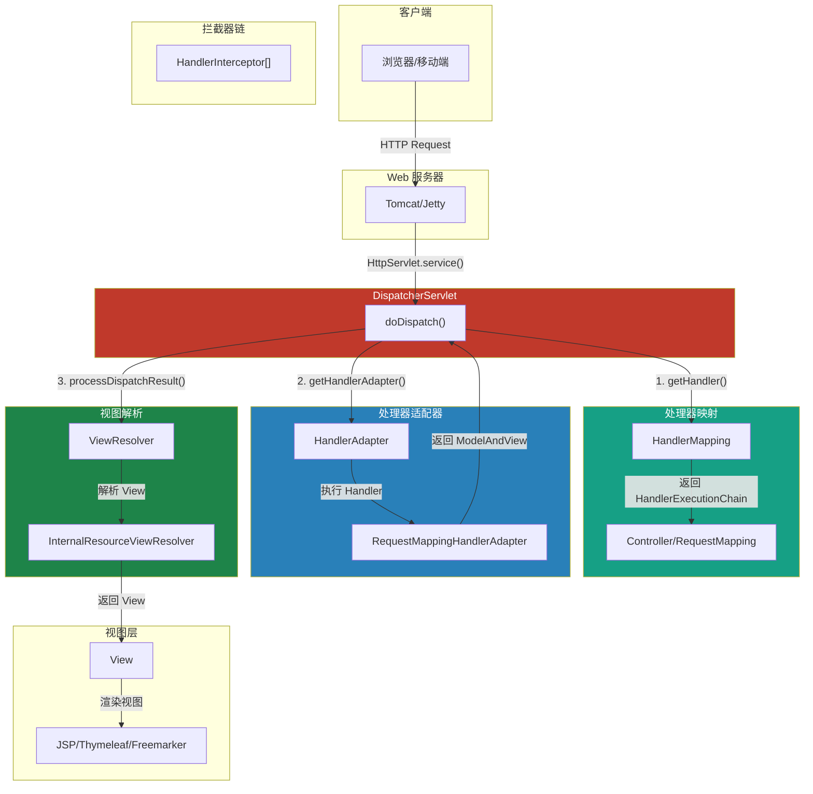
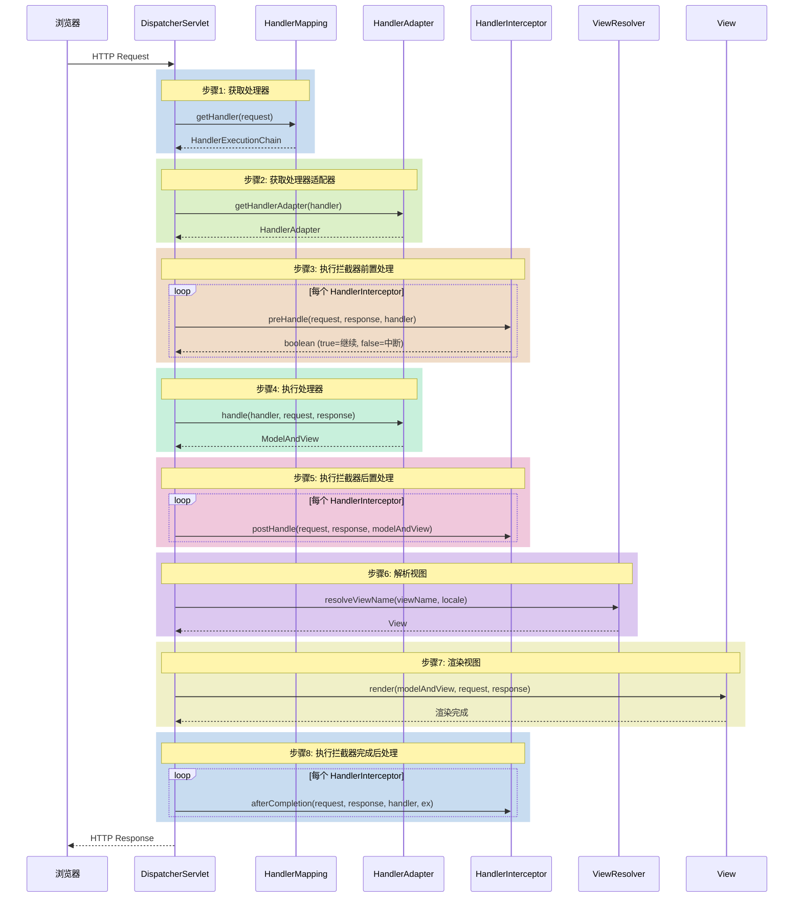
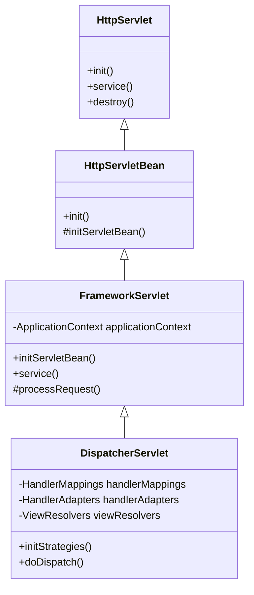
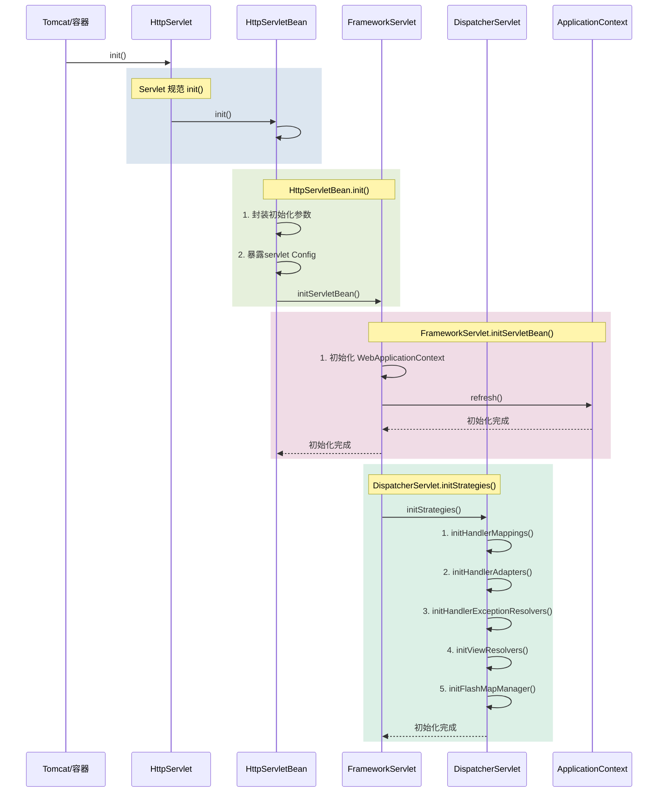
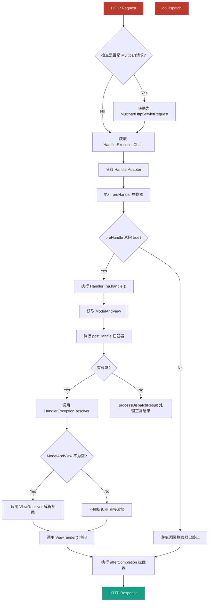
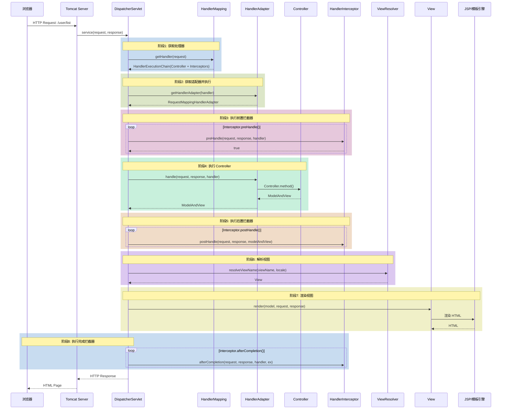
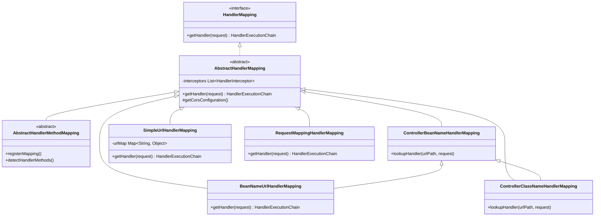
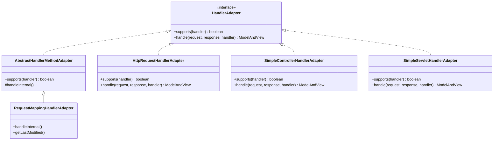
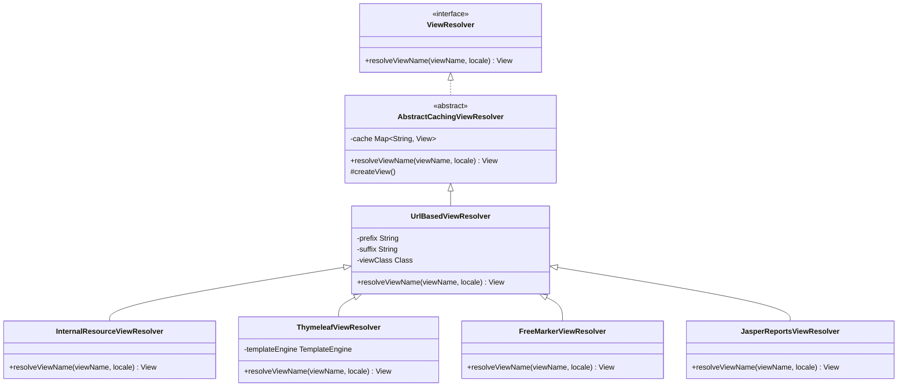
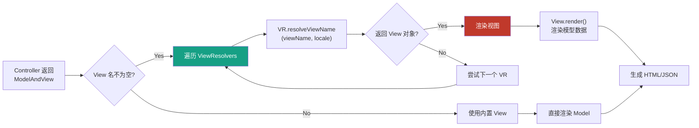

# 第9章 Spring MVC 原理

## 9.1 Spring MVC 工作原理概述

### 9.1.1 整体架构图

Spring MVC 是 Spring 框架提供的用于构建 Web 应用程序的模块，它遵循 MVC（Model-View-Controller）设计模式。Spring MVC 的核心是 `DispatcherServlet`，它作为前端控制器（Front Controller）统一处理所有请求。



### 9.1.2 核心组件详解

| 组件 | 类名 | 职责 |
|------|------|------|
| DispatcherServlet | `org.springframework.web.servlet.DispatcherServlet` | 前端控制器，统一处理所有请求 |
| HandlerMapping | `org.springframework.web.servlet.HandlerMapping` | 根据请求查找对应的 Handler |
| HandlerAdapter | `org.springframework.web.servlet.HandlerAdapter` | 适配不同类型的 Handler 进行执行 |
| HandlerInterceptor | `org.springframework.web.servlet.HandlerInterceptor` | 拦截器链，对请求进行前置/后置处理 |
| ViewResolver | `org.springframework.web.servlet.ViewResolver` | 解析视图名称到具体的 View 对象 |
| View | `org.springframework.web.servlet.View` | 负责渲染 HTML/XML/JSON 等内容 |
| MultipartResolver | `org.springframework.web.multipart.MultipartResolver` | 处理文件上传请求 |
| LocaleResolver | `org.springframework.web.servlet.LocaleResolver` | 国际化解析 |
| ThemeResolver | `org.springframework.web.servlet.ThemeResolver` | 主题解析 |

### 9.1.3 请求处理流程概览



---

## 9.2 DispatcherServlet 初始化

### 9.2.1 初始化继承体系

`DispatcherServlet` 的初始化遵循 Servlet 规范，其继承体系如下：



### 9.2.2 初始化流程时序图



### 9.2.3 源码分析

#### 1. HttpServletBean.init()

**源码位置**：`org.springframework.web.servlet.HttpServletBean`

```java
@Override
public final void init() throws ServletException {
    // 1. 封装<init-param>配置参数到 PropertyValues
    PropertyValues pvs = new HttpServletBean.ServletConfigPropertyValues(
            getServletConfig(), getRequiredPropertyNames());

    // 2. 将 servlet 包装成 BeanWrapper
    BeanWrapper bw = PropertyAccessorFactory.forBeanPropertyAccess(this);
    // 3. 设置 ResourceEditorRegistrar
    ResourceLoader resourceLoader = new ServletContextResourceLoader(getServletContext());
    bw.registerCustomEditor(Resource.class, new ResourceEditor(resourceLoader, getEnvironment()));

    // 4. 让子类覆盖此方法做一些扩展
    initServletBean();
}
```

**分析要点**：
- `HttpServletBean.init()` 是 Spring 做的初始化，而不是 Servlet 容器
- 作用是将 Servlet 的初始化参数封装成 `PropertyValues`
- 为子类的 `initServletBean()` 提供扩展点

#### 2. FrameworkServlet.initServletBean()

**源码位置**：`org.springframework.web.servlet.FrameworkServlet`

```java
@Override
protected final void initServletBean() throws ServletException {
    getServletContext().log("Initializing Spring DispatcherServlet '" + getServletName() + "'");

    long startTime = System.currentTimeMillis();

    try {
        // 1. 初始化 WebApplicationContext
        this.webApplicationContext = initWebApplicationContext();

        // 2. 让子类做扩展
        initFrameworkServlet();
    } catch (ServletException ex) {
        throw ex;
    } catch (RuntimeException ex) {
        throw ex;
    }

    getServletContext().log("Servlet '" + getServletName() +
            "' initialization completed in " + (System.currentTimeMillis() - startTime) + " ms");
}
```

**关键方法 `initWebApplicationContext()` 源码**：

```java
protected WebApplicationContext initWebApplicationContext() {
    // 1. 获取根 ApplicationContext
    WebApplicationContext rootContext =
            WebApplicationContextUtils.getWebApplicationContext(getServletContext());

    WebApplicationContext wac = null;

    // 2. 如果构造时传入了 contextAttribute 参数
    if (this.contextAttribute != null) {
        wac = findNamedContext(rootContext, this.contextAttribute);
    }

    // 3. 如果没有 contextAttribute，则创建一个新的
    if (wac == null) {
        wac = createWebApplicationContext(rootContext);
    }

    // 4. 刷新上下文（触发容器初始化）
    if (!this.refreshEventReceived) {
        synchronized (this.onRefreshMonitor) {
            onRefresh(wac);  // 调用 DispatcherServlet.initStrategies()
        }
    }

    // 5. 存入 ServletContext
    setContextAttribute(wac);

    return wac;
}
```

#### 3. DispatcherServlet.initStrategies()

**源码位置**：`org.springframework.web.servlet.DispatcherServlet`

```java
protected void initStrategies(ApplicationContext context) {
    // 1. 初始化多文件上传解析器
    initMultipartResolver(context);

    // 2. 初始化国际化解析器
    initLocaleResolver(context);

    // 3. 初始化主题解析器
    initThemeResolver(context);

    // 4. 初始化处理器映射器
    initHandlerMappings(context);

    // 5. 初始化处理器适配器
    initHandlerAdapters(context);

    // 6. 初始化处理器异常解析器
    initHandlerExceptionResolvers(context);

    // 7. 初始化视图名称转换器
    initRequestToViewNameTranslator(context);

    // 8. 初始化视图解析器
    initViewResolvers(context);

    // 9. 初始化 FlashMap 管理器
    initFlashMapManager(context);
}
```

**各策略组件初始化详解**：

```java
private void initHandlerMappings(ApplicationContext context) {
    this.handlerMappings = null;

    // 1. 首先从 ApplicationContext 中查找所有 HandlerMapping 类型的 Bean
    if (detectAllHandlerMappings) {
        Map<String, HandlerMapping> matchingBeans =
                BeanFactoryUtils.beansOfTypeIncludingAncestors(context, HandlerMapping.class, true, false);
        if (!matchingBeans.isEmpty()) {
            this.handlerMappings = new ArrayList<>(matchingBeans.values());
        }
    }

    // 2. 如果没找到，则使用默认策略
    if (this.handlerMappings == null) {
        this.handlerMappings = getDefaultStrategies(context, HandlerMapping.class);
    }
}
```

---

## 9.3 请求处理流程

### 9.3.1 doDispatch() 方法流程图

`doDispatch()` 是 Spring MVC 处理请求的核心方法，理解它是掌握 Spring MVC 的关键。



### 9.3.2 详细步骤源码分析

#### 步骤1: HandlerMapping 查找 Handler

**源码位置**：`DispatcherServlet.doDispatch()`

```java
protected void doDispatch(HttpServletRequest request, HttpServletResponse response) throws Exception {
    HttpServletRequest processedRequest = request;

    // 获取处理器执行链 (Handler + 拦截器)
    HandlerExecutionChain mappedHandler = null;

    try {
        ModelAndView mv = null;
        Exception dispatchException = null;

        try {
            // 1. 获取处理器执行链
            mappedHandler = getHandler(processedRequest);
            if (mappedHandler == null) {
                // 如果没有找到 Handler，返回 404
                noHandlerFound(processedRequest, response);
                return;
            }

            // 2. 获取处理器适配器
            HandlerAdapter ha = getHandlerAdapter(mappedHandler.getHandler());

            // ... 后续处理
        }
    }
}
```

**`getHandler()` 方法源码**：

```java
protected HandlerExecutionChain getHandler(HttpServletRequest request) throws Exception {
    if (this.handlerMappings != null) {
        for (HandlerMapping hm : this.handlerMappings) {
            HandlerExecutionChain handler = hm.getHandler(request);
            if (handler != null) {
                return handler;
            }
        }
    }
    return null;
}
```

**关键点分析**：
- 遍历 `handlerMappings` 列表，按顺序查找 Handler
- 找到第一个匹配的 Handler 就返回
- `HandlerMapping` 的查找顺序很重要，可以通过 `@Order` 注解或实现 `Ordered` 接口控制

#### 步骤2: HandlerAdapter 执行 Handler

```java
// DispatcherServlet.doDispatch() 中
// 3. 如果拦截器返回 true，继续执行处理器

// 执行拦截器的 preHandle
if (!mappedHandler.applyPreHandle(processedRequest, response)) {
    return;
}

// 4. 实际执行 Handler，返回 ModelAndView
mv = ha.handle(processedRequest, response, mappedHandler.getHandler());

// 5. 如果视图名称为 null，设置默认值
applyDefaultViewName(request, mv);

// 6. 执行拦截器的 postHandle
mappedHandler.applyPostHandle(processedRequest, response, mv);
```

**`applyPreHandle()` 源码**：

```java
public boolean applyPreHandle(HttpServletRequest request, HttpServletResponse response) throws Exception {
    for (int i = 0; i < this.interceptorList.size(); i++) {
        HandlerInterceptor interceptor = this.interceptorList.get(i);
        if (!interceptor.preHandle(request, response, this.handler)) {
            triggerAfterCompletion(request, response, null);
            return false;
        }
        this.interceptorIndex = i;
    }
    return true;
}
```

**关键点分析**：
- 拦截器的 `preHandle` 方法按顺序执行
-任何一个返回 `false`，后续拦截器和 Handler 都不会执行
- `interceptorIndex` 记录了最后一个成功执行的拦截器索引，用于 `afterCompletion` 回滚

#### 步骤3: ViewResolver 解析 View

**`processDispatchResult()` 方法源码**：

```java
private void processDispatchResult(HttpServletRequest request, HttpServletResponse response,
        HandlerExecutionChain mappedHandler, ModelAndView mv, Exception exception) throws Exception {

    // 1. 判断是否有异常
    boolean errorView = false;

    if (exception != null) {
        if (mv == null || mv.isEmpty()) {
            // 没有 ModelAndView，调用异常处理
            mv = processHandlerException(request, response, mappedHandler.getHandler(), exception);
        }
    }

    // 2. 如果 ModelAndView 不为空，渲染视图
    if (mv != null && !mv.wasCleared()) {
        render(mv, request, response);
    }
}
```

**`render()` 方法源码**：

```java
protected void render(ModelAndView mv, HttpServletRequest request, HttpServletResponse response) throws Exception {
    // 1. 获取 Locale（国际化）
    Locale locale = (mv.getLocale() != null ? mv.getLocale() :
            this.localeResolver.resolveLocale(request));

    // 2. 设置响应字符编码
    response.setCharacterEncoding(this.encodingProperties.getCharset());

    // 3. 获取视图对象
    View view;
    String viewName = mv.getViewName();
    if (viewName != null) {
        // 3.1 通过 ViewResolver 解析视图名
        view = resolveViewName(viewName, mv.getModelInternal(), locale, request);
        if (view == null) {
            throw new ServletException("Could not resolve view with name '" + viewName + "' in servlet with name '" + getServletName() + "'");
        }
    } else {
        // 3.2 直接使用 View 对象
        view = mv.getView();
    }

    // 4. 渲染视图
    view.render(mv.getModelInternal(), request, response);
}
```

**`resolveViewName()` 源码**：

```java
protected View resolveViewName(String viewName, Map<String, ?> model, Locale locale,
        HttpServletRequest request) throws Exception {

    if (this.viewResolvers != null) {
        for (ViewResolver viewResolver : this.viewResolvers) {
            View view = viewResolver.resolveViewName(viewName, locale);
            if (view != null) {
                return view;
            }
        }
    }
    return null;
}
```

### 9.3.3 请求处理完整时序图



---

## 9.4 HandlerMapping 体系

### 9.4.1 HandlerMapping 继承体系图



### 9.4.2 常见 HandlerMapping 实现

#### 1. RequestMappingHandlerMapping

**作用**：处理基于 `@RequestMapping` 注解的控制器方法映射

**配置方式**：

```xml
<!-- Spring MVC 默认配置 -->
<mvc:annotation-driven/>

<!-- 或者手动配置 -->
<bean class="org.springframework.web.servlet.mvc.method.annotation.RequestMappingHandlerMapping"/>
```

**源码位置**：`org.springframework.web.servlet.mvc.method.annotation.RequestMappingHandlerMapping`

#### 2. SimpleUrlHandlerMapping

**作用**：通过配置的方式，将 URL 路径映射到指定的 Handler

**配置示例**：

```xml
<bean class="org.springframework.web.servlet.handler.SimpleUrlHandlerMapping">
    <property name="mappings">
        <props>
            <prop key="/user/list">userController</prop>
            <prop key="/user/*">wildcardController</prop>
            <prop key="/**">defaultController</prop>
        </props>
    </property>
</bean>
```

**或者使用 Ant 风格路径**：

```xml
<bean class="org.springframework.web.servlet.handler.SimpleUrlHandlerMapping">
    <property name="urlMap">
        <map>
            <entry key="/user/list" value-ref="userController"/>
            <entry key="/user/{id}" value-ref="userDetailController"/>
        </map>
    </property>
</bean>
```

#### 3. BeanNameUrlHandlerMapping

**作用**：自动将实现了 Controller 接口的 Bean 中，以 `/` 开头的 Bean 名称作为 URL 路径

**配置示例**：

```xml
<bean class="org.springframework.web.servlet.handler.BeanNameUrlHandlerMapping"/>

<bean name="/hello" class="com.example.HelloController"/>
<bean name="/world" class="com.example.WorldController"/>
```

#### 4. ControllerClassNameHandlerMapping

**作用**：自动将 Controller 类名转换为 URL 路径

**配置示例**：

```xml
<bean class="org.springframework.web.servlet.mvc.support.ControllerClassNameHandlerMapping"/>

<!-- UserController -> /user* -->
<!-- HelloController -> /hello* -->
```

### 9.4.3 HandlerMapping 执行顺序

Spring MVC 会按照以下顺序查找 HandlerMapping：

1. `RequestMappingHandlerMapping`（处理 `@RequestMapping`）
2. `BeanNameUrlHandlerMapping`（处理 Bean 名称以 `/` 开头的）
3. `ControllerClassNameHandlerMapping`（处理类名自动映射）
4. `SimpleUrlHandlerMapping`（处理配置的静态映射）

**控制顺序的方式**：

```xml
<!-- 通过 order 属性控制顺序，值越小越优先 -->
<bean class="org.springframework.web.servlet.handler.BeanNameUrlHandlerMapping">
    <property name="order" value="1"/>
</bean>

<bean class="org.springframework.web.servlet.mvc.method.annotation.RequestMappingHandlerMapping">
    <property name="order" value="0"/>
</bean>
```

---

## 9.5 HandlerAdapter 体系

### 9.5.1 HandlerAdapter 继承体系图



### 9.5.2 常见 HandlerAdapter 实现

#### 1. RequestMappingHandlerAdapter

**作用**：执行标注了 `@RequestMapping` 注解的控制器方法

**源码位置**：`org.springframework.web.servlet.mvc.method.annotation.RequestMappingHandlerAdapter`

**核心方法**：

```java
@Override
protected ModelAndView handleInternal(HttpServletRequest request,
        HttpServletResponse response, HandlerMethod handlerMethod) throws Exception {

    // 1. 检查请求方法是否支持
    checkRequest(request);

    // 2. 执行同步或异步处理
    ModelAndView mav;
    if (this.synchronizeOnSession) {
        HttpSession session = request.getSession(false);
        if (session != null) {
            Object mutex = session.getAttribute(HANDLER_MUTEX_ATTRIBUTE);
            synchronized (mutex) {
                mav = invokeHandlerMethod(request, response, handlerMethod);
            }
        }
    }

    mav = invokeHandlerMethod(request, response, handlerMethod);

    // 3. 返回 ModelAndView
    return mav;
}
```

#### 2. HttpRequestHandlerAdapter

**作用**：执行实现了 `HttpRequestHandler` 接口的处理器

**使用示例**：

```java
public class MyHttpRequestHandler implements HttpRequestHandler {
    @Override
    public void handleRequest(HttpServletRequest request, HttpServletResponse response)
            throws ServletException, IOException {
        response.setContentType("text/plain");
        response.getWriter().write("Hello from HttpRequestHandler");
    }
}
```

```xml
<bean name="/http-handler" class="com.example.MyHttpRequestHandler"/>
```

#### 3. SimpleControllerHandlerAdapter

**作用**：执行实现了 `Controller` 接口的处理器

**使用示例**：

```java
public class MyController implements Controller {
    @Override
    public ModelAndView handleRequest(HttpServletRequest request, HttpServletResponse response)
            throws Exception {
        ModelAndView mav = new ModelAndView("hello");
        mav.addObject("message", "Hello from Controller");
        return mav;
    }
}
```

```xml
<bean name="/controller" class="com.example.MyController"/>
```

### 9.5.3 HandlerAdapter 选择策略

**源码位置**：`DispatcherServlet.getHandlerAdapter()`

```java
protected HandlerAdapter getHandlerAdapter(Object handler) throws ServletException {
    if (this.handlerAdapters != null) {
        for (HandlerAdapter adapter : this.handlerAdapters) {
            if (adapter.supports(handler)) {
                return adapter;
            }
        }
    }
    throw new ServletException("No adapter for handler [" + handler +
            "]: Does your handler implement a supported interface or extension?");
}
```

**`supports()` 方法判断逻辑**：

| Handler 类型 | HandlerAdapter | supports() 判断逻辑 |
|-------------|-----------------|-------------------|
| HandlerMethod | RequestMappingHandlerAdapter | `handler instanceof HandlerMethod` |
| HttpRequestHandler | HttpRequestHandlerAdapter | `handler instanceof HttpRequestHandler` |
| Controller | SimpleControllerHandlerAdapter | `handler instanceof Controller` |
| Servlet | SimpleServletHandlerAdapter | `handler instanceof Servlet` |

---

## 9.6 ViewResolver 视图解析

### 9.6.1 ViewResolver 继承体系图



### 9.6.2 常见 ViewResolver 实现

#### 1. InternalResourceViewResolver

**作用**：解析 JSP 视图，是最常用的 JSP 视图解析器

**配置示例**：

```xml
<bean class="org.springframework.web.servlet.view.InternalResourceViewResolver">
    <!-- 视图前缀 -->
    <property name="prefix" value="/WEB-INF/views/"/>
    <!-- 视图后缀 -->
    <property name="suffix" value=".jsp"/>
    <!-- 优先级 -->
    <property name="order" value="1"/>
</bean>
```

**使用示例**：

```java
@Controller
public class UserController {
    @RequestMapping("/user/list")
    public String list(Model model) {
        model.addAttribute("users", userService.list());
        return "user/list";  // -> /WEB-INF/views/user/list.jsp
    }
}
```

#### 2. ThymeleafViewResolver

**作用**：解析 Thymeleaf 模板

**配置示例**：

```xml
<!-- Thymeleaf 模板引擎配置 -->
<bean id="templateResolver" class="org.thymeleaf.templateresolver.ServletContextTemplateResolver">
    <property name="prefix" value="/WEB-INF/templates/"/>
    <property name="suffix" value=".html"/>
    <property name="templateMode" value="HTML"/>
    <property name="characterEncoding" value="UTF-8"/>
</bean>

<bean id="templateEngine" class="org.thymeleaf.spring5.SpringTemplateEngine">
    <property name="templateResolver" ref="templateResolver"/>
</bean>

<!-- Thymeleaf 视图解析器 -->
<bean class="org.thymeleaf.spring5.view.ThymeleafViewResolver">
    <property name="templateEngine" ref="templateEngine"/>
    <property name="order" value="1"/>
</bean>
```

### 9.6.3 视图解析流程



### 9.6.4 视图渲染流程

**源码位置**：`org.springframework.web.servlet.View`

```java
public interface View {
    // 渲染视图
    void render(@Nullable Map<String, ?> model, HttpServletRequest request,
            HttpServletResponse response) throws Exception;

    // 获取内容类型
    String getContentType();

    @Nullable
    default HttpStatus getStatus();
}
```

**InternalResourceView 渲染 JSP**：

```java
@Override
protected void renderMergedOutputModel(Map<String, Object> model,
        HttpServletRequest request, HttpServletResponse response) throws Exception {

    // 1. 暴露模型到请求域
    exposeModelAsRequestAttributes(model, request);

    // 2. 暴露 FlashMap（用于重定向）
    exposeFlashMap(request);

    // 3. 获取请求分发器
    RequestDispatcher rd = getRequestDispatcher(request, getUrl());
    if (rd == null) {
        throw new ServletException("Could not get RequestDispatcher for [" + getUrl() +
                "]: Check that the file exists and is a correct resource");
    }

    // 4. 转发到 JSP
    rd.forward(request, response);
}
```

---

## 9.7 【实战】Spring MVC 请求处理 Debug 实战

### 9.7.1 环境准备

#### 1. 创建 Spring MVC 项目

**项目结构**：

```
spring-mvc-demo/
├── src/
│   ├── main/
│   │   ├── java/
│   │   │   └── com/example/
│   │   │       ├── DemoApplication.java
│   │   │       ├── controller/
│   │   │       │   └── UserController.java
│   │   │       └── config/
│   │   │           └── WebMvcConfig.java
│   │   ├── resources/
│   │   │   └── application.properties
│   │   └── webapp/
│   │       └── WEB-INF/
│   │           └── views/
│   │               └── user/
│   │                   └── list.jsp
│   └── test/
└── pom.xml
```

**pom.xml 依赖**：

```xml
<?xml version="1.0" encoding="UTF-8"?>
<project xmlns="http://maven.apache.org/POM/4.0.0"
         xmlns:xsi="http://www.w3.org/2001/XMLSchema-instance"
         xsi:schemaLocation="http://maven.apache.org/POM/4.0.0
         http://maven.apache.org/xsd/maven-4.0.0.xsd">
    <modelVersion>4.0.0</modelVersion>

    <groupId>com.example</groupId>
    <artifactId>spring-mvc-demo</artifactId>
    <version>1.0.0</version>
    <packaging>war</packaging>

    <properties>
        <spring.version>6.1.3</spring.version>
    </properties>

    <dependencies>
        <!-- Spring MVC -->
        <dependency>
            <groupId>org.springframework</groupId>
            <artifactId>spring-webmvc</artifactId>
            <version>${spring.version}</version>
        </dependency>

        <!-- Servlet API -->
        <dependency>
            <groupId>jakarta.servlet</groupId>
            <artifactId>jakarta.servlet-api</artifactId>
            <version>6.0.0</version>
            <scope>provided</scope>
        </dependency>

        <!-- JSP -->
        <dependency>
            <groupId>jakarta.servlet.jsp</groupId>
            <artifactId>jakarta.servlet.jsp-api</artifactId>
            <version>3.1.1</version>
            <scope>provided</scope>
        </dependency>

        <!-- JSTL -->
        <dependency>
            <groupId>jakarta.servlet.jsp.jstl</groupId>
            <artifactId>jakarta.servlet.jsp.jstl-api</artifactId>
            <version>2.0.0</version>
        </dependency>
    </dependencies>

    <build>
        <plugins>
            <plugin>
                <groupId>org.apache.maven.plugins</groupId>
                <artifactId>maven-war-plugin</artifactId>
                <version>3.4.0</version>
            </plugin>
            <plugin>
                <groupId>org.apache.tomcat.maven</groupId>
                <artifactId>tomcat10-maven-plugin</artifactId>
                <version>3.0.0</version>
            </plugin>
        </plugins>
    </build>
</project>
```

### 9.7.2 核心代码

#### 1. WebMvcConfig.java

```java
package com.example.config;

import org.springframework.context.annotation.Bean;
import org.springframework.context.annotation.ComponentScan;
import org.springframework.context.annotation.Configuration;
import org.springframework.web.servlet.config.annotation.EnableWebMvc;
import org.springframework.web.servlet.view.InternalResourceViewResolver;

@Configuration
@EnableWebMvc
@ComponentScan(basePackages = "com.example")
public class WebMvcConfig {

    @Bean
    public InternalResourceViewResolver viewResolver() {
        InternalResourceViewResolver resolver = new InternalResourceViewResolver();
        resolver.setPrefix("/WEB-INF/views/");
        resolver.setSuffix(".jsp");
        return resolver;
    }
}
```

#### 2. UserController.java

```java
package com.example.controller;

import org.springframework.stereotype.Controller;
import org.springframework.ui.Model;
import org.springframework.web.bind.annotation.GetMapping;
import org.springframework.web.bind.annotation.RequestMapping;

import java.util.Arrays;
import java.util.List;

@Controller
@RequestMapping("/user")
public class UserController {

    @GetMapping("/list")
    public String list(Model model) {
        List<String> users = Arrays.asList("Alice", "Bob", "Charlie");
        model.addAttribute("users", users);
        return "user/list";
    }

    @GetMapping("/detail")
    public String detail(Model model) {
        model.addAttribute("name", "Demo User");
        return "user/detail";
    }
}
```

#### 3. list.jsp

```jsp
<%@ page contentType="text/html;charset=UTF-8" language="java" %>
<%@ taglib prefix="c" uri="jakarta.tags.core" %>
<html>
<head>
    <title>用户列表</title>
</head>
<body>
    <h1>用户列表</h1>
    <ul>
        <c:forEach var="user" items="${users}">
            <li>${user}</li>
        </c:forEach>
    </ul>
</body>
</html>
```

### 9.7.3 IDEA Debug 断点设置

#### 断点设置位置

**断点1：DispatcherServlet.doDispatch() 入口**

```
位置：org.springframework.web.servlet.DispatcherServlet.doDispatch()
行号：约 575 行
观察：mappedHandler, ha, mv 变量
```

**断点2：HandlerMapping.getHandler() 返回处**

```
位置：org.springframework.web.servlet.DispatcherServlet.getHandler()
行号：约 1155 行
观察：HandlerExecutionChain 对象结构
```

**断点3：HandlerAdapter.handle() 返回处**

```
位置：org.springframework.web.servlet.mvc.method.annotation.RequestMappingHandlerAdapter.handleInternal()
行号：约 260 行
观察：ModelAndView 对象内容
```

**断点4：ViewResolver.resolveViewName() 返回处**

```
位置：org.springframework.web.servlet.view.InternalResourceViewResolver.resolveViewName()
行号：约 100 行
观察：View 对象创建过程
```

#### Debug 观察窗口配置

**1. Variables 窗口添加自定义表达式**：

| 表达式 | 说明 |
|-------|------|
| `mappedHandler.handler` | Handler 详细信息 |
| `mappedHandler.interceptorList` | 拦截器列表 |
| `mv.model` | Model 数据 |
| `mv.viewName` | 视图名称 |

**2. Watch 窗口添加**：

```java
// 观察 Handler 类型
mappedHandler.getHandler().getClass().getName()

// 观察拦截器数量
mappedHandler.getInterceptorIndex()

// 观察视图名称
mv != null ? mv.getViewName() : "null"
```

### 9.7.4 请求处理过程观察

#### 1. 启动项目

```bash
mvn tomcat10:run
```

访问 URL：`http://localhost:8080/spring-mvc-demo/user/list`

#### 2. Debug 观察要点

**Step 1：进入 doDispatch**

```
mappedHandler = null  // 初始为 null
ha = null             // 初始为 null
```

**Step 2：执行 getHandler() 后**

```
mappedHandler = HandlerExecutionChain{
    handler = HandlerMethod{
        bean = UserController@1234
        method = public java.lang.String com.example.controller.UserController.list(org.springframework.ui.Model)
    }
    interceptorList = [ConversionServiceExposingInterceptor, ResourceUrlProviderExposingInterceptor]
    interceptorIndex = -1
}
```

**Step 3：执行 getHandlerAdapter() 后**

```
ha = RequestMappingHandlerAdapter@5678
```

**Step 4：执行拦截器 preHandle 后**

```
mappedHandler.interceptorIndex = 1  // 两个拦截器都执行成功
```

**Step 5：执行 ha.handle() 后**

```
mv = ModelAndView{
    viewName = "user/list"
    model = ModelMap{
        users = [Alice, Bob, Charlie]
    }
    empty = false
}
```

**Step 6：执行 postHandle 后**

```
拦截器 postHandle 被调用
```

**Step 7：render() 执行**

```
view = InternalResourceView{
    url = "/WEB-INF/views/user/list.jsp"
}
```

### 9.7.5 实战练习

#### 练习1：观察拦截器执行顺序

**目标**：理解多个拦截器的执行顺序

**步骤**：
1. 创建两个自定义拦截器 `FirstInterceptor` 和 `SecondInterceptor`
2. 在 `preHandle`、`postHandle`、`afterCompletion` 中添加日志
3. 观察执行顺序

```java
@Component
public class FirstInterceptor implements HandlerInterceptor {

    @Override
    public boolean preHandle(HttpServletRequest request, HttpServletResponse response,
            Object handler) throws Exception {
        System.out.println("FirstInterceptor.preHandle");
        return true;
    }

    @Override
    public void postHandle(HttpServletRequest request, HttpServletResponse response,
            Object handler, ModelAndView modelAndView) throws Exception {
        System.out.println("FirstInterceptor.postHandle");
    }

    @Override
    public void afterCompletion(HttpServletRequest request, HttpServletResponse response,
            Object handler, Exception ex) throws Exception {
        System.out.println("FirstInterceptor.afterCompletion");
    }
}
```

**预期输出顺序**：
```
FirstInterceptor.preHandle
SecondInterceptor.preHandle
Controller.method()
SecondInterceptor.postHandle
FirstInterceptor.postHandle
SecondInterceptor.afterCompletion
FirstInterceptor.afterCompletion
```

#### 练习2：观察 multipart 请求处理

**目标**：理解文件上传请求的处理流程

**步骤**：
1. 添加 `MultipartResolver` 配置
2. 上传文件并观察 `processedRequest` 的变化

```java
@Bean
public CommonsMultipartResolver multipartResolver() {
    CommonsMultipartResolver resolver = new CommonsMultipartResolver();
    resolver.setMaxUploadSize(10485760); // 10MB
    return resolver;
}
```

#### 练习3：观察异常处理流程

**目标**：理解 `HandlerExceptionResolver` 的处理流程

**步骤**：
1. 在 Controller 中抛出异常
2. 观察 `processHandlerException()` 的调用

```java
@GetMapping("/error")
public String error() {
    throw new RuntimeException("测试异常");
}
```

---

## 总结

本章我们深入学习了 Spring MVC 的工作原理，主要包括：

1. **Spring MVC 整体架构**：以 `DispatcherServlet` 为核心的前端控制器模式
2. **DispatcherServlet 初始化**：从 `HttpServletBean` 到 `FrameworkServlet` 再到 `DispatcherServlet` 的初始化流程
3. **请求处理流程**：通过 `doDispatch()` 方法统一处理请求，包括 Handler 查找、适配器执行、视图解析等
4. **HandlerMapping 体系**：了解不同类型的处理器映射器
5. **HandlerAdapter 体系**：理解如何适配不同类型的处理器
6. **ViewResolver 体系**：掌握视图解析的原理

通过 Debug 实战，我们能够直观地观察 Spring MVC 处理请求的完整流程，加深对框架内部原理的理解。
