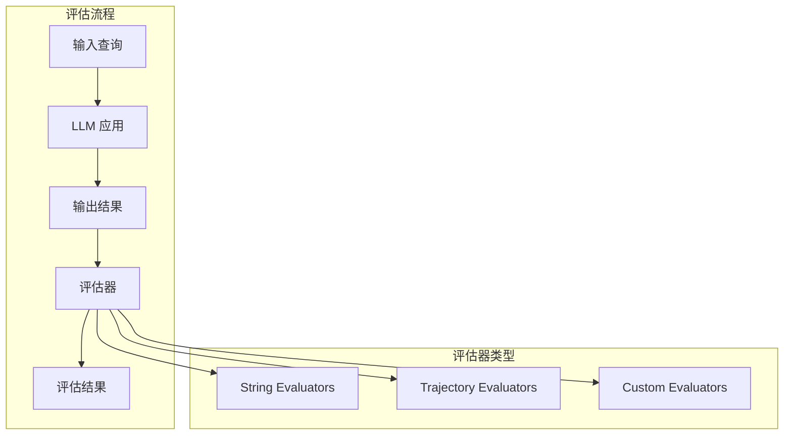
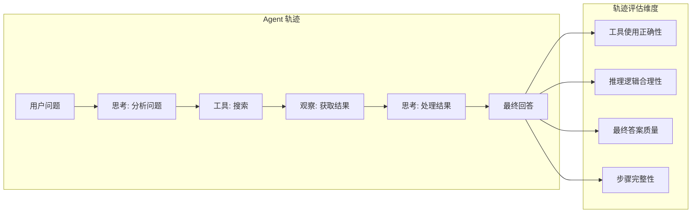
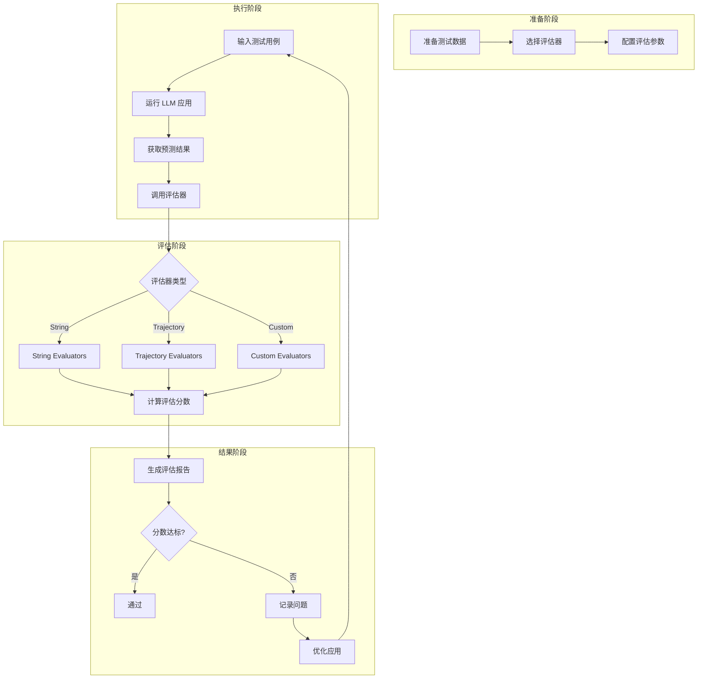
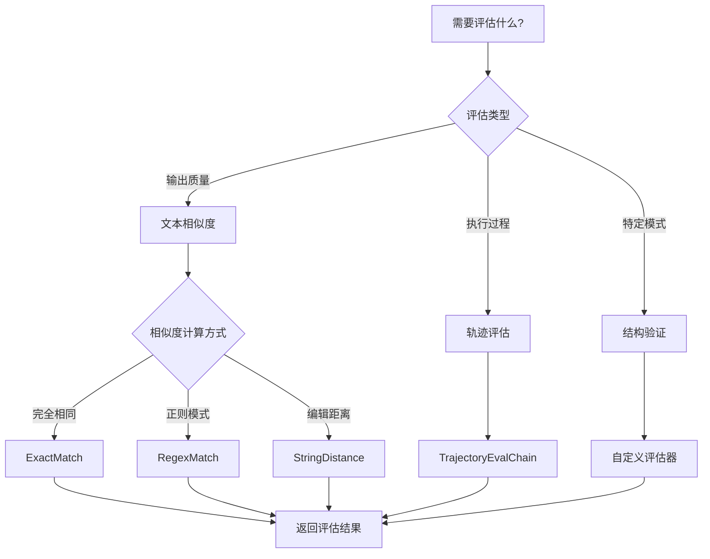

# 第10章：LangChain 评估（Evaluation）

## 10.1 评估的概念与重要性

在 LLM 应用开发中，评估是一个至关重要的环节。评估帮助我们量化应用的质量，发现问题，指导优化方向。

### 什么是评估？

评估是使用特定的指标或标准，对 LLM 应用的输出进行判断的过程。就像考试批改一样，我们需要一个"标准答案"或"评分规则"来衡量输出质量。

### 为什么评估如此重要？

1. **质量保证**：确保应用输出符合预期标准
2. **迭代优化**：通过评估结果指导模型调优
3. **回归测试**：防止新版本引入错误
4. **自动化监控**：持续追踪应用性能

### LangChain 评估框架

LangChain 提供了一套完整的评估工具，帮助开发者：
- 快速评估 Chain 和 Agent 的表现
- 支持多种评估策略
- 允许自定义评估器



## 10.2 使用 LangChain 评估工具

### 安装必要的依赖

```python
# 安装 langchain 和评估相关包
pip install langchain langchain-core langchain-openai langchain-eval
```

### 基本评估流程

LangChain 评估的基本流程如下：

```python
from langchain_openai import ChatOpenAI
from langchain.chains import LLMChain
from langchain.prompts import PromptTemplate
from langchain.evaluation import ExactMatchStringEvaluator

# 1. 创建 LLM 实例
llm = ChatOpenAI(model="gpt-4", temperature=0)

# 2. 创建 Chain
prompt = PromptTemplate(
    input_variables=["question"],
    template="回答这个问题：{question}"
)
chain = LLMChain(llm=llm, prompt=prompt)

# 3. 创建评估器
evaluator = ExactMatchStringEvaluator()

# 4. 执行评估
result = chain.invoke({"question": "什么是人工智能？"})
evaluation = evaluator.evaluate_strings(
    prediction=result["text"],
    reference="人工智能是让机器具有人类智能的技术"
)

print(f"评估结果: {evaluation}")
```

## 10.3 String Evaluators（字符串评估器）

字符串评估器用于比较生成的文本与参考答案之间的相似度或匹配程度。

### 10.3.1 ExactMatch（精确匹配）

ExactMatch 是最简单的评估器，只有当预测结果与参考答案完全一致时，才返回通过。

```python
from langchain.evaluation import ExactMatchStringEvaluator

# 创建精确匹配评估器
evaluator = ExactMatchStringEvaluator()

# 完全匹配 - 通过
result1 = evaluator.evaluate_strings(
    prediction="巴黎是法国的首都",
    reference="巴黎是法国的首都"
)
print(f"完全匹配: {result1}")
# 输出: {'score': 1}

# 部分匹配 - 不通过
result2 = evaluator.evaluate_strings(
    prediction="巴黎是法国的首都",
    reference="法国的首都是巴黎"
)
print(f"语义相同但表述不同: {result2}")
# 输出: {'score': 0}
```

### 10.3.2 RegexMatch（正则匹配）

RegexMatch 使用正则表达式来评估预测结果，允许更灵活的匹配模式。

```python
from langchain.evaluation import RegexMatchStringEvaluator

# 创建正则匹配评估器
# 匹配以特定模式开头的答案
evaluator = RegexMatchStringEvaluator(
    regex_pattern=r"^巴黎.*首都.*$"
)

# 匹配成功
result1 = evaluator.evaluate_strings(
    prediction="巴黎是法国的首都",
    reference="巴黎是法国的首都"
)
print(f"正则匹配成功: {result1}")
# 输出: {'score': 1}

# 匹配失败
result2 = evaluator.evaluate_strings(
    prediction="伦敦是英国的首都",
    reference="巴黎是法国的首都"
)
print(f"正则匹配失败: {result2}")
# 输出: {'score': 0}
```

**实战技巧**：RegexMatch 适合验证结构化输出，如日期、邮箱、URL 等。

```python
# 验证邮箱格式
email_evaluator = RegexMatchStringEvaluator(
    regex_pattern=r"^[\w\.-]+@[\w\.-]+\.\w+$",
    ignore_case=True
)

result = email_evaluator.evaluate_strings(
    prediction="user@example.com",
    reference="test@example.com"  # reference 在这里只是占位
)
print(f"邮箱验证: {result}")
```

### 10.3.3 StringDistance（字符串距离）

StringDistance 通过计算字符串之间的距离来评估相似度。常用的算法包括：

- **Levenshtein 距离**：计算将一个字符串变成另一个字符串所需的最少编辑次数
- **Jaro-Winkler 距离**：考虑字符顺序的相似度算法

```python
from langchain.evaluation import StringDistanceEvaluator
from langchain.evaluation import StringDistance

# 使用 Levenshtein 距离
levenshtein_evaluator = StringDistanceEvaluator(
    distance=StringDistance.LEVENSHTEIN
)

result1 = levenshtein_evaluator.evaluate_strings(
    prediction="hello",
    reference="hallo"
)
print(f"Levenshtein 距离: {result1}")
# 输出类似: {'score': 0.8, 'distance': 1}

# 使用 Jaro-Winkler 距离
jw_evaluator = StringDistanceEvaluator(
    distance=StringDistance.JARO_WINKLER
)

result2 = jw_evaluator.evaluate_strings(
    prediction="hello",
    reference="hallo"
)
print(f"Jaro-Winkler 距离: {result2}")
```

**字符串距离的分数说明**：
- Levenshtein：距离值越小越好，0 表示完全相同
- Jaro-Winkler：相似度值越接近 1 越好，1 表示完全相同

## 10.4 Trajectory Evaluators（轨迹评估器）

轨迹评估器用于评估 Agent 的完整执行轨迹，包括思考过程、工具调用和最终答案。



### 评估 Agent 轨迹

```python
from langchain.evaluation import TrajectoryEvalChain
from langchain.agents import AgentExecutor, create_openai_functions_agent
from langchain.tools import Tool
from langchain_openai import ChatOpenAI

# 定义工具
def search_wikipedia(query: str) -> str:
    """搜索维基百科"""
    return f"关于 '{query}' 的信息：维基百科显示这是..."

tools = [
    Tool(
        name="search_wikipedia",
        func=search_wikipedia,
        description="用于搜索维基百科，输入搜索关键词"
    )
]

# 创建 Agent
llm = ChatOpenAI(model="gpt-4", temperature=0)
agent = create_openai_functions_agent(llm, tools, prompt)
executor = AgentExecutor(agent=agent, tools=tools)

# 创建轨迹评估器
trajectory_evaluator = TrajectoryEvalChain.from_system(
    eval_llm=llm,
    criteria={
        "正确使用工具": "agent 是否正确使用了必要的工具",
        "逻辑推理": "agent 的推理步骤是否合理",
        "最终答案质量": "最终答案是否准确、完整"
    }
)

# 执行评估
trajectory = executor.invoke({"input": "巴黎的首都功能是什么？"})
evaluation = trajectory_evaluator.evaluate_trajectory(
    trajectory=trajectory,
    question="巴黎的首都功能是什么？"
)

print(f"轨迹评估结果: {evaluation}")
```

### Trajectory Evaluator 的评分标准

| 评分项 | 说明 | 分数范围 |
|--------|------|----------|
| 工具选择 | 是否选择了正确的工具 | 0-1 |
| 工具使用 | 工具参数是否正确 | 0-1 |
| 推理过程 | 思考链是否合理 | 0-1 |
| 最终答案 | 答案的准确性和完整性 | 0-1 |

## 10.5 创建自定义评估器

当内置评估器不能满足需求时，我们可以创建自定义评估器。

### 基础自定义评估器

```python
from langchain.evaluation import StringEvaluator

class SentimentStringEvaluator(StringEvaluator):
    """
    自定义情感分析评估器
    检查回答是否包含积极的情感
    """

    def _evaluate_strings(
        self,
        prediction: str,
        reference: str = None,
        **kwargs
    ) -> dict:
        positive_words = ["好", "棒", "优秀", "出色", "喜欢", "赞"]
        negative_words = ["差", "糟糕", "失望", "讨厌", "烂", "垃圾"]

        prediction_lower = prediction  # 简化处理

        positive_count = sum(1 for word in positive_words if word in prediction_lower)
        negative_count = sum(1 for word in negative_words if word in prediction_lower)

        if positive_count > negative_count:
            score = 1
            comment = "积极情感"
        elif negative_count > positive_count:
            score = 0
            comment = "消极情感"
        else:
            score = 0.5
            comment = "中性情感"

        return {"score": score, "comment": comment}

# 使用自定义评估器
sentiment_evaluator = SentimentStringEvaluator()
result = sentiment_evaluator.evaluate_strings(
    prediction="这个产品非常棒，我很喜欢！",
    reference="积极评价"
)
print(f"情感评估结果: {result}")
```

### 带参数的自定义评估器

```python
from langchain.evaluation import StringEvaluator

class SimilarityThresholdEvaluator(StringEvaluator):
    """
    自定义相似度阈值评估器
    只有当相似度超过阈值时才通过
    """

    def __init__(self, threshold: float = 0.8):
        self.threshold = threshold

    def _evaluate_strings(
        self,
        prediction: str,
        reference: str = None,
        **kwargs
    ) -> dict:
        if not reference:
            raise ValueError("reference 参数是必需的")

        # 简单的词集合相似度计算
        pred_words = set(prediction.split())
        ref_words = set(reference.split())

        if not pred_words or not ref_words:
            return {"score": 0, "reasoning": "空字符串"}

        # Jaccard 相似度
        intersection = pred_words & ref_words
        union = pred_words | ref_words
        similarity = len(intersection) / len(union)

        passed = similarity >= self.threshold

        return {
            "score": 1 if passed else 0,
            "reasoning": f"相似度为 {similarity:.2f}，阈值 {self.threshold}，{'通过' if passed else '未通过'}"
        }

# 使用带阈值的评估器
threshold_evaluator = SimilarityThresholdEvaluator(threshold=0.6)
result = threshold_evaluator.evaluate_strings(
    prediction="今天天气很好，适合出门",
    reference="今天天气不错，适合户外活动"
)
print(f"相似度评估: {result}")
```

## 10.6 评估的实际应用场景

### 场景一：问答系统评估

```python
from langchain_openai import ChatOpenAI
from langchain.chains import LLMChain
from langchain.evaluation import ExactMatchStringEvaluator, StringDistanceEvaluator
from langchain.evaluation import StringDistance

# 准备测试数据集
test_cases = [
    {
        "question": "水的沸点是多少？",
        "reference": "水的沸点是100°C（在标准大气压下）"
    },
    {
        "question": "地球的直径是多少？",
        "reference": "地球的直径约为12742公里"
    },
    {
        "question": "太阳系有几颗行星？",
        "reference": "太阳系有8颗行星"
    }
]

# 创建 Chain
llm = ChatOpenAI(model="gpt-4", temperature=0)
prompt = PromptTemplate(
    input_variables=["question"],
    template="用简短准确的方式回答：{question}"
)
chain = LLMChain(llm=llm, prompt=prompt)

# 创建评估器
exact_evaluator = ExactMatchStringEvaluator()
distance_evaluator = StringDistanceEvaluator(distance=StringDistance.LEVENSHTEIN)

# 执行批量评估
print("=" * 50)
print("问答系统评估结果")
print("=" * 50)

for i, case in enumerate(test_cases, 1):
    result = chain.invoke({"question": case["question"]})
    prediction = result["text"]

    exact_eval = exact_evaluator.evaluate_strings(
        prediction=prediction,
        reference=case["reference"]
    )

    distance_eval = distance_evaluator.evaluate_strings(
        prediction=prediction,
        reference=case["reference"]
    )

    print(f"\n测试用例 {i}: {case['question']}")
    print(f"预测答案: {prediction}")
    print(f"参考答案: {case['reference']}")
    print(f"精确匹配: {'通过' if exact_eval['score'] == 1 else '未通过'}")
    print(f"Levenshtein距离: {distance_eval.get('distance', 'N/A')}")
```

### 场景二：RAG 系统评估

```python
from langchain_openai import ChatOpenAI
from langchain.chains import RetrievalQA
from langchain.evaluation import StringDistanceEvaluator
from langchain.evaluation import StringDistance

class RAGEvaluator:
    """RAG 系统评估器"""

    def __init__(self, qa_chain):
        self.qa_chain = qa_chain
        self.evaluator = StringDistanceEvaluator(
            distance=StringDistance.LEVENSHTEIN
        )

    def evaluate(self, test_cases: list) -> dict:
        results = []

        for case in test_cases:
            prediction = self.qa_chain.invoke(case["question"])["answer"]

            eval_result = self.evaluator.evaluate_strings(
                prediction=prediction,
                reference=case["reference"]
            )

            results.append({
                "question": case["question"],
                "prediction": prediction,
                "reference": case["reference"],
                "distance": eval_result.get("distance", 0),
                "score": 1 / (1 + eval_result.get("distance", 0))  # 转换距离为相似度
            })

        avg_score = sum(r["score"] for r in results) / len(results)

        return {
            "individual_results": results,
            "average_score": avg_score
        }

# 使用示例
# rag_chain = RetrievalQA.from_chain_type(llm=ChatOpenAI(), retriever=retriever)
# evaluator = RAGEvaluator(rag_chain)
# results = evaluator.evaluate(test_cases)
```

### 场景三：对话系统评估

```python
from langchain.evaluation import StringEvaluator

class ConversationRelevanceEvaluator(StringEvaluator):
    """
    对话相关性评估器
    评估回复是否与对话历史相关
    """

    def _evaluate_strings(
        self,
        prediction: str,
        reference: str = None,
        **kwargs
    ) -> dict:
        conversation_history = kwargs.get("conversation_history", "")

        # 检查回复是否包含对话历史中的关键信息
        history_keywords = set(conversation_history.split())
        prediction_keywords = set(prediction.split())

        if not history_keywords:
            return {"score": 0.5, "reasoning": "对话历史为空"}

        overlap = history_keywords & prediction_keywords
        relevance = len(overlap) / len(history_keywords)

        if relevance > 0.3:
            score = 1
            reasoning = "回复与对话历史相关"
        else:
            score = 0
            reasoning = "回复与对话历史不相关"

        return {
            "score": score,
            "reasoning": reasoning,
            "relevance_score": relevance
        }

# 使用对话相关性评估器
evaluator = ConversationRelevanceEvaluator()

result = evaluator.evaluate_strings(
    prediction="我同意你的观点，这个方案确实需要调整。",
    reference="好的方案",
    conversation_history="我认为这个方案需要调整一下"
)
print(f"对话相关性评估: {result}")
```

## 10.7 评估流程可视化

### 完整评估流程图



### 评估器选择决策图



## 10.8 最佳实践与注意事项

### 评估最佳实践

1. **选择合适的评估器**
   - 精确匹配适用于结构化输出
   - 字符串距离适用于开放式问答
   - 轨迹评估适用于 Agent 系统

2. **准备高质量的测试数据**
   ```python
   # 好的测试数据示例
   test_cases = [
       {
           "question": "什么是光合作用？",
           "reference": "光合作用是植物利用光能将二氧化碳和水转化为有机物并释放氧气的过程",
           "metadata": {"category": "生物学", "difficulty": "基础"}
       }
   ]
   ```

3. **设置合理的阈值**
   ```python
   # 根据实际需求调整阈值
   evaluator = StringDistanceEvaluator(
       distance=StringDistance.LEVENSHTEIN,
       threshold=0.7  # 70% 相似度
   )
   ```

### 常见问题与解决方案

| 问题 | 原因 | 解决方案 |
|------|------|----------|
| 评估分数过低 | 阈值设置过高 | 降低阈值或优化 prompt |
| 评估结果不稳定 | LLM 输出随机性 | 设置 lower temperature |
| 轨迹评估超时 | Agent 执行时间过长 | 设置 max_iterations |

## 10.9 小结

本章我们学习了 LangChain 评估框架的核心内容：

1. **评估的概念与重要性**：理解了评估在 LLM 应用开发中的关键作用
2. **String Evaluators**：
   - ExactMatch：精确匹配评估
   - RegexMatch：正则表达式匹配
   - StringDistance：字符串距离评估
3. **Trajectory Evaluators**：评估 Agent 的完整执行轨迹
4. **自定义评估器**：创建满足特定需求的评估器
5. **实际应用场景**：问答系统、RAG 系统、对话系统的评估
6. **评估流程可视化**：使用 Mermaid 图表清晰展示评估流程

评估是保证 LLM 应用质量的重要手段，通过合理使用 LangChain 的评估工具，我们可以更有信心地部署和优化我们的应用。

---

> 思考题：
> 1. 在实际项目中，你会如何设计评估指标来衡量一个客服机器人的表现？
> 2. 为什么说 ExactMatch 评估器过于严格？有什么替代方案？
> 3. 如何评估一个 Agent 的工具选择是否正确？
