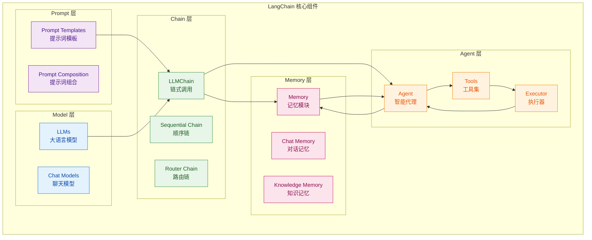

# 第1章 LangChain 简介与发展历程

## 1.1 什么是 LangChain

LangChain 是一个用于构建基于大语言模型（LLM）应用的开源框架。它由 Harrison Chase 于 2022 年 10 月推出，旨在帮助开发者更方便地将大语言模型与外部工具、数据源和计算逻辑结合起来。

LangChain 提供了一套标准化的组件和接口，使得开发者可以：

- **链式调用**：将多个 LLM 调用或工具调用串联成复杂的工作流
- **Prompt 管理**：创建可复用和可配置的提示词模板
- **Agent 开发**：构建能够自主决策和执行动作的智能代理
- **记忆管理**：维护跨对话的上下文状态
- **数据检索**：与外部知识库和文档集成

## 1.2 发展历程

| 时间 | 版本 | 重要更新 |
|------|------|----------|
| 2022年10月 | v0.0.1 | LangChain 正式发布，初始版本支持 LLM 调用和 Prompt 模板 |
| 2023年 | v0.1.0 | 添加 Agent、Chain 和 Memory 模块支持 |
| 2024年 | v0.2.0 | 重新架构，引入 LangGraph，支持更复杂的图执行模式 |
| 2024年中 | v0.3.0 | 更好的 TypeScript 支持，性能优化 |
| 2025年 | v1.0+ | 稳定版发布，企业级功能完善 |

## 1.3 核心概念架构

LangChain 的核心概念可以用以下架构图来表示：



### 1.3.1 Model（模型）

Model 是 LangChain 的核心，负责与各种大语言模型交互：

```python
# LLM 示例：使用文本补全模型
from langchain.llms import OpenAI

llm = OpenAI(model="gpt-3.5-turbo-instruct")
response = llm.invoke("你好，请介绍一下你自己")
print(response)

# Chat Model 示例：使用聊天模型
from langchain.chat_models import ChatOpenAI
from langchain.schema import HumanMessage

chat = ChatOpenAI(model="gpt-4")
messages = [HumanMessage(content="你好，请介绍一下你自己")]
response = chat.invoke(messages)
print(response.content)
```

### 1.3.2 Prompt（提示词）

Prompt Templates 允许创建可复用的提示词结构：

```python
from langchain.prompts import PromptTemplate

# 简单模板示例
simple_template = PromptTemplate.from_template(
    "请把以下文本翻译成{language}：{text}"
)

# 带Few-shot示例的模板
few_shot_template = PromptTemplate.from_template(
    """请判断以下文本的情感是正面还是负面。

示例：
文本："这个产品太棒了，非常喜欢！"
情感：正面

文本："服务态度很差，很失望。"
情感：负面

请判断：
文本：{text}
情感："""
)
```

### 1.3.3 Chain（链）

Chain 将多个组件串联起来，形成完整的工作流：

```python
from langchain.chains import LLMChain
from langchain.prompts import PromptTemplate
from langchain.llms import OpenAI

# 创建链
template = "请用一句话概括这篇文章：{article}"
prompt = PromptTemplate.from_template(template)
llm = OpenAI(model="gpt-3.5-turbo-instruct")

chain = LLMChain(llm=llm, prompt=prompt)

# 执行链
result = chain.invoke({"article": "LangChain是一个用于构建LLM应用的框架..."})
print(result["text"])
```

### 1.3.4 Agent（代理）

Agent 能够根据输入动态决定使用哪些工具：

```python
from langchain.agents import Agent, Tool
from langchain.agents import initialize_agent
from langchain.llms import OpenAI

# 定义工具
def search_wikipedia(query: str) -> str:
    """搜索维基百科"""
    return f"关于'{query}'的信息..."

tools = [
    Tool(
        name="Wikipedia搜索",
        func=search_wikipedia,
        description="当你需要查找百科知识时使用"
    )
]

# 初始化代理
llm = OpenAI(temperature=0)
agent = initialize_agent(
    tools=tools,
    llm=llm,
    agent="zero-shot-react-description",
    verbose=True
)

# 执行
agent.run("查找LangChain的创始人是谁？")
```

### 1.3.5 Memory（记忆）

Memory 用于在对话或处理过程中保持状态：

```python
from langchain.memory import ConversationBufferMemory
from langchain.chains import ConversationChain
from langchain.llms import OpenAI

# 创建带记忆的对话链
memory = ConversationBufferMemory()
chain = ConversationChain(llm=OpenAI(), memory=memory, verbose=True)

# 多轮对话
chain.invoke({"input": "我叫张三"})
chain.invoke({"input": "我叫什么名字？"})  # 能记住"张三"
chain.invoke({"input": "我喜欢吃苹果"})
chain.invoke({"input": "我叫什么名字？我喜欢吃什么？"})  # 能记住两者
```

## 1.4 安装与配置

### 1.4.1 系统要求

- **Python 版本**：3.8 或更高
- **操作系统**：Windows、macOS、Linux 均支持
- **内存**：建议 8GB 以上（运行大型模型时）

### 1.4.2 安装 LangChain

```bash
# 使用 pip 安装 LangChain
pip install langchain

# 安装 LangChain 及常见集成
pip install langchain[all]

# 或者安装特定版本
pip install langchain==0.1.0

# 安装最新的开发版本
pip install langchain --pre
```

### 1.4.3 安装相关的集成包

```bash
# OpenAI 集成
pip install langchain-openai

# Anthropic 集成
pip install langchain-anthropic

# Google 集成
pip install langchain-google-genai

# 向量数据库集成
pip install langchain-chroma
pip install langchain-faiss
```

## 1.5 环境变量配置

### 1.5.1 配置 API Keys

LangChain 需要通过环境变量或配置来访问各大模型提供商的 API：

```bash
# 在终端中设置（临时）
export OPENAI_API_KEY="sk-xxxxx"
export ANTHROPIC_API_KEY="sk-ant-xxxxx"

# 或者使用 Python 的 dotenv
pip install python-dotenv
```

### 1.5.2 使用 .env 文件管理配置

创建 `.env` 文件（注意：不要提交到版本控制）：

```bash
# .env 文件内容
OPENAI_API_KEY=sk-your-key-here
ANTHROPIC_API_KEY=sk-ant-your-key-here
GOOGLE_API_KEY=your-google-key
SERPAPI_API_KEY=your-serpapi-key
```

在代码中加载环境变量：

```python
from dotenv import load_dotenv
import os

# 加载 .env 文件
load_dotenv()

# 获取 API Key
openai_api_key = os.getenv("OPENAI_API_KEY")
print(f"OpenAI API Key 已配置: {openai_api_key[:10]}...")
```

### 1.5.3 LangChain 环境变量配置

```python
import os

# LangChain 相关配置
os.environ["LANGCHAIN_TRACING_V2"] = "true"      # 开启LangSmith追踪
os.environ["LANGCHAIN_ENDPOINT"] = "https://api.smith.langchain.com"
os.environ["LANGCHAIN_API_KEY"] = "your-langsmith-key"
os.environ["LANGCHAIN_PROJECT"] = "my-project"  # 项目名称
```

## 1.6 第一个 Hello World 示例

下面是一个完整可运行的 Hello World 示例，演示了 LangChain 的基本用法：

```python
"""
LangChain Hello World 示例
运行前请确保已设置 OPENAI_API_KEY 环境变量
"""

from dotenv import load_dotenv
import os

# 加载环境变量
load_dotenv()

# ==================== 示例1：最简单的 LLM 调用 ====================
def hello_world_llm():
    """最基础的 LLM 调用"""
    from langchain.llms import OpenAI

    # 创建 LLM 实例
    llm = OpenAI(
        model="gpt-3.5-turbo-instruct",
        temperature=0.7,
        max_tokens=100
    )

    # 调用 LLM
    response = llm.invoke("写一句Hello World的Python代码注释")
    print("=" * 50)
    print("示例1 - 简单 LLM 调用:")
    print("=" * 50)
    print(response)
    print()


# ==================== 示例2：使用提示词模板 ====================
def hello_world_template():
    """使用提示词模板"""
    from langchain.prompts import PromptTemplate
    from langchain.chains import LLMChain
    from langchain.llms import OpenAI

    # 定义模板
    template = """
    请将以下中文文本翻译成 {target_language}：

    原文：{text}

    翻译结果：
    """

    prompt = PromptTemplate(
        input_variables=["target_language", "text"],
        template=template
    )

    # 创建链
    chain = LLMChain(
        llm=OpenAI(model="gpt-3.5-turbo-instruct"),
        prompt=prompt
    )

    # 执行
    result = chain.invoke({
        "target_language": "英文",
        "text": "你好，World！"
    })

    print("=" * 50)
    print("示例2 - 提示词模板:")
    print("=" * 50)
    print(result["text"])
    print()


# ==================== 示例3：带记忆的对话 ====================
def hello_world_memory():
    """带记忆的对话"""
    from langchain.memory import ConversationBufferMemory
    from langchain.chains import ConversationChain
    from langchain.llms import OpenAI

    # 创建记忆
    memory = ConversationBufferMemory()

    # 创建对话链
    conversation = ConversationChain(
        llm=OpenAI(temperature=0),
        memory=memory,
        verbose=False
    )

    print("=" * 50)
    print("示例3 - 带记忆的对话:")
    print("=" * 50)

    # 第一轮对话
    response1 = conversation.invoke({"input": "我叫小明！"})
    print(f"我说：叫小明！")
    print(f"AI说：{response1['response'].strip()}")

    # 第二轮对话（AI能记住名字）
    response2 = conversation.invoke({"input": "我叫什么名字？"})
    print(f"我说：我叫什么名字？")
    print(f"AI说：{response2['response'].strip()}")
    print()


# ==================== 示例4：简单的 Tool Agent ====================
def hello_world_agent():
    """简单的工具代理"""
    from langchain.agents import Agent, Tool
    from langchain.llms import OpenAI
    from langchain.prompts import PromptTemplate

    # 定义一个简单的计算工具
    def calculator(expression: str) -> str:
        """执行数学计算"""
        try:
            result = eval(expression)
            return f"计算结果：{result}"
        except Exception as e:
            return f"计算错误：{str(e)}"

    # 创建工具
    tools = [
        Tool(
            name="计算器",
            func=calculator,
            description="用于数学计算，输入数学表达式如 '2+2' 或 '10*5'"
        )
    ]

    # 创建代理
    agent = Agent(
        llm=OpenAI(temperature=0),
        tools=tools,
        prompt=PromptTemplate.from_template(
            "你是一个数学助手，使用工具来回答问题。\n{input}\n{agent_scratchpad}"
        )
    )

    print("=" * 50)
    print("示例4 - 工具代理:")
    print("=" * 50)

    result = agent.invoke("请帮我计算 (15 + 25) * 2 等于多少？")
    print(result)
    print()


# ==================== 主函数 ====================
if __name__ == "__main__":
    print("\n" + "=" * 50)
    print("LangChain Hello World 示例程序")
    print("=" * 50 + "\n")

    # 检查 API Key
    if not os.getenv("OPENAI_API_KEY"):
        print("⚠️  警告：未设置 OPENAI_API_KEY 环境变量")
        print("请在运行前设置：export OPENAI_API_KEY=your-key")
        print("或者创建 .env 文件添加 OPENAI_API_KEY=your-key")
        print()
        print("运行示例时将跳过需要 API Key 的示例...")
        print()

    # 运行示例
    hello_world_llm()
    hello_world_template()
    hello_world_memory()
    hello_world_agent()

    print("=" * 50)
    print("所有示例执行完成！")
    print("=" * 50)
```

### 运行示例

1. 确保已安装依赖：
```bash
pip install langchain langchain-openai python-dotenv
```

2. 配置环境变量：
```bash
export OPENAI_API_KEY="sk-your-key-here"  # Linux/macOS
set OPENAI_API_KEY="sk-your-key-here"     # Windows
```

3. 运行程序：
```bash
python hello_world.py
```

## 1.7 章节总结

本章我们介绍了 LangChain 的基础知识：

### 核心要点

| 概念 | 作用 | 典型用法 |
|------|------|----------|
| **Model** | 与大语言模型交互 | OpenAI、Anthropic、Google等 |
| **Prompt** | 管理和优化提示词 | 模板化、Few-shot、动态生成 |
| **Chain** | 串联多个组件 | LLMChain、SequentialChain |
| **Agent** | 动态决策执行 | 自主选择工具、ReAct模式 |
| **Memory** | 保持状态和上下文 | 对话记忆、向量存储 |

### 关键术语

- **LLMChain**：最基本的链，将 PromptTemplate 和 LLM 结合起来
- **LangGraph**：用于构建复杂的多步骤工作流
- **Tool**：代理可以调用的外部函数或 API
- **Memory**：在多次交互中保持状态

### 下章预告

在下一章中，我们将深入学习 **Prompt Templates** 的高级用法，包括：

- Few-shot Prompt 的设计模式
- 动态输入变量的处理
- Prompt 的组合与复用
- ChatPromptTemplate 的使用

---

*恭喜你完成了 LangChain 入门教程的第一章！*
