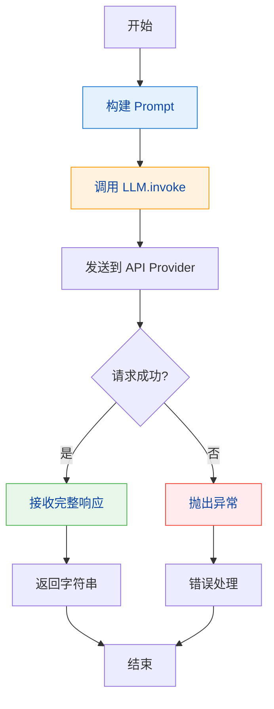
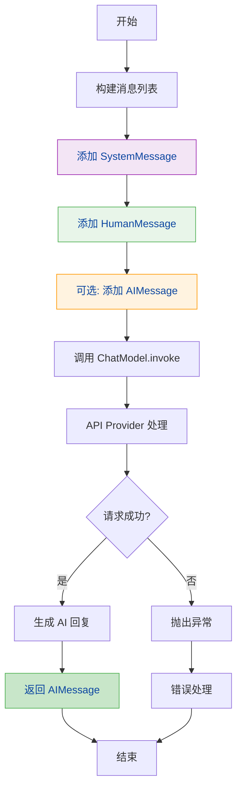
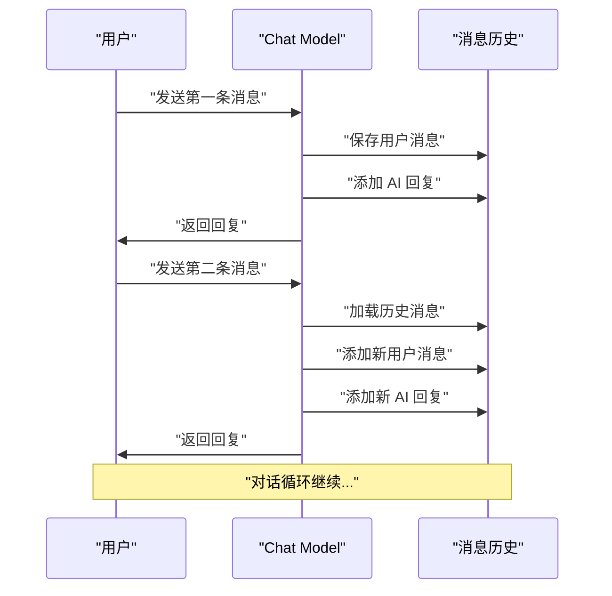
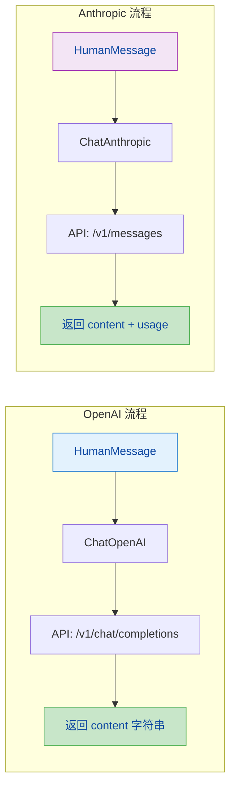
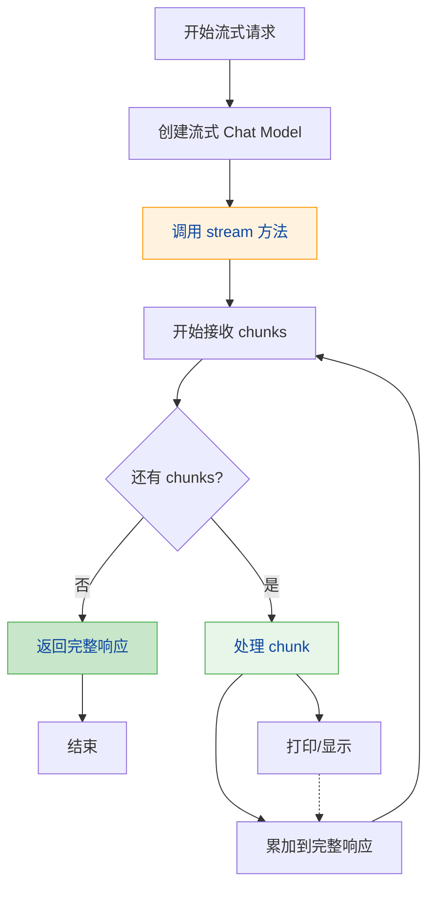
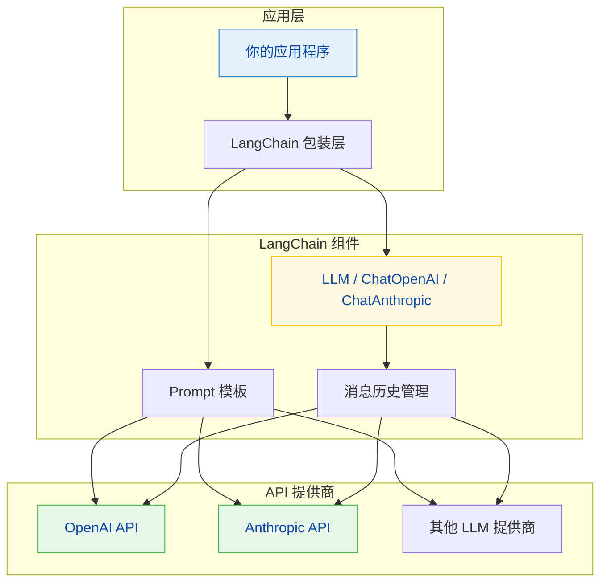

# LangChain 教程 - 第2章：Model 的基本使用

## 目录

1. [LLMs 与 Chat Models 的区别](#1-llms-与-chat-models-的区别)
2. [使用 OpenAI LLM](#2-使用-openai-llm)
3. [使用 ChatOpenAI](#3-使用-chatopenai)
4. [使用 Anthropic 模型](#4-使用-anthropic-模型)
5. [Model 的配置与参数](#5-model-的配置与参数)
6. [流式输出 Streaming](#6-流式输出-streaming)
7. [Model 调用流程图](#7-model-调用流程图)

---

## 1. LLMs 与 Chat Models 的区别

### 什么是 LLM？

**LLM（Large Language Model，大语言模型）** 是传统的文本补全模型，它接收一段文本提示（prompt），然后生成与之相关的延续文本。

```python
# LLM 输入：一段文字
# LLM 输出：这段文字的延续

prompt = "从前有座山，"
response = llm.invoke(prompt)
# 输出："从前有座山，山里有座庙，庙里有个老和尚在讲故事..."
```

### 什么是 Chat Model？

**Chat Model（聊天模型）** 是专门为对话场景优化的模型，它接收一系列消息（Message）作为输入，然后生成一条回复（Message）作为输出。

```python
# Chat Model 输入：一组对话消息
# Chat Model 输出：一条回复消息

messages = [
    HumanMessage(content="你好"),
    AIMessage(content="你好！有什么可以帮助你的吗？"),
    HumanMessage(content="今天天气怎么样？")
]
response = chat.invoke(messages)
# 输出："今天天气晴朗，适合外出。"
```

### 核心区别

| 特性 | LLM | Chat Model |
|------|-----|------------|
| 输入格式 | 字符串（纯文本） | 消息列表（Messages） |
| 输出格式 | 字符串（文本补全） | 消息对象（Message） |
| API 设计 | `/v1/completions` | `/v1/chat/completions` |
| 典型用途 | 文本生成、写作辅助 | 对话、问答、客服 |
| 系统提示 | 内嵌在 prompt 中 | 独立的 `system_message` |

### API 对应关系

```
LLM (Text Completion):
POST /v1/completions
{
  "prompt": "请写一首诗",
  "model": "gpt-3.5-turbo-instruct"
}

Chat Model (Chat Completion):
POST /v1/chat/completions
{
  "messages": [
    {"role": "system", "content": "你是一个诗人"},
    {"role": "user", "content": "请写一首诗"}
  ],
  "model": "gpt-3.5-turbo"
}
```

### 在 LangChain 中的体现

```python
from langchain_openai import OpenAI
from langchain_openai import ChatOpenAI

# LLM - 返回字符串
llm = OpenAI(model="gpt-3.5-turbo-instruct")
result = llm.invoke("天空是什么颜色？")
# 返回: "天空是蓝色的，在晴天时..."

# Chat Model - 返回消息对象
chat = ChatOpenAI(model="gpt-3.5-turbo")
result = chat.invoke([HumanMessage("天空是什么颜色？")])
# 返回: content="天空在大多数情况下是蓝色的..."  (AIMessage 对象)
```

---

## 2. 使用 OpenAI LLM

### 安装依赖

```bash
pip install langchain-openai
```

### 环境配置

```python
import os

# 设置 OpenAI API Key
os.environ["OPENAI_API_KEY"] = "your-api-key-here"
```

### 基本使用

```python
from langchain_openai import OpenAI

# 初始化 LLM
llm = OpenAI(
    model="gpt-3.5-turbo-instruct",  # 指定模型
    temperature=0.7,                   # 控制随机性
    max_tokens=100                      # 最大生成token数
)

# 调用 LLM
prompt = "用一句话介绍 Python 编程语言："
response = llm.invoke(prompt)

print(response)
# 输出: "Python 是一种高级编程语言，以其简洁易读的语法和强大的功能著称。"
```

### 同步调用示例

```python
from langchain_openai import OpenAI

llm = OpenAI(temperature=0.9)

# 单次调用
poem = llm.invoke("写一个关于春天的诗句")
print(poem)

# 批量调用
prompts = [
    "解释什么是函数式编程",
    "什么是装饰器模式？",
    "Python 中的生成器是什么？"
]

for prompt in prompts:
    result = llm.invoke(prompt)
    print(f"问题: {prompt}")
    print(f"回答: {result}\n")
```

---

## 3. 使用 ChatOpenAI

### 基本使用

```python
from langchain_openai import ChatOpenAI
from langchain.schema import HumanMessage, SystemMessage, AIMessage

# 初始化 Chat Model
chat = ChatOpenAI(
    model="gpt-3.5-turbo",
    temperature=0.7,
    max_tokens=1000
)

# 单轮对话
messages = [HumanMessage(content="你好，请介绍一下你自己")]
response = chat.invoke(messages)

print(response.content)
# 输出: "你好！我是 ChatGPT，一个由 OpenAI 开发的大型语言模型..."
```

### 带系统提示的对话

```python
from langchain_openai import ChatOpenAI
from langchain.schema import HumanMessage, SystemMessage

chat = ChatOpenAI(model="gpt-4", temperature=0.8)

# 构建多轮对话
messages = [
    SystemMessage(content="你是一个专业的Python讲师，用简洁易懂的语言解释概念"),
    HumanMessage(content="什么是列表推导式？"),
    AIMessage(content="列表推导式是 Python 中一种简洁创建列表的方式..."),
    HumanMessage(content="能给我一个例子吗？")
]

response = chat.invoke(messages)
print(response.content)
```

### 多轮对话示例

```python
from langchain_openai import ChatOpenAI
from langchain.schema import HumanMessage, AIMessage

def chat_demo():
    chat = ChatOpenAI(model="gpt-3.5-turbo", temperature=0.7)

    # 对话历史
    conversation = [
        HumanMessage(content="我想学习 Python")
    ]

    # 第一轮
    response1 = chat.invoke(conversation)
    print(f"AI: {response1.content}")
    conversation.append(AIMessage(content=response1.content))

    # 第二轮
    conversation.append(HumanMessage(content="从哪里开始？"))
    response2 = chat.invoke(conversation)
    print(f"AI: {response2.content}")

chat_demo()
```

### 生成多个回复

```python
from langchain_openai import ChatOpenAI

chat = ChatOpenAI(temperature=0.9)

# 生成多个不同的回复
messages = [HumanMessage(content="给我5个创意早餐的建议")]

# num_generations 指定生成数量
responses = chat.generate([
    [HumanMessage(content="给我5个创意早餐的建议")],
    [HumanMessage(content="给我5个创意早餐的建议")],
    [HumanMessage(content="给我5个创意早餐的建议")],
])

for i, generation in enumerate(responses.generations):
    print(f"建议 {i+1}: {generation[0].text}\n")
```

---

## 4. 使用 Anthropic 模型

### 安装与配置

```bash
pip install langchain-anthropic
```

```python
import os

# 设置 Anthropic API Key
os.environ["ANTHROPIC_API_KEY"] = "your-api-key-here"
```

### 使用 Claude 模型

```python
from langchain_anthropic import ChatAnthropic
from langchain.schema import HumanMessage

# 初始化 Claude
claude = ChatAnthropic(
    model="claude-3-5-sonnet-20241022",  # Claude 3.5 Sonnet
    temperature=0.7,
    max_tokens=1024
)

# 基本调用
messages = [HumanMessage(content="解释什么是量子计算")]
response = claude.invoke(messages)

print(response.content)
```

### Claude 与 OpenAI 的对比

```python
from langchain_openai import ChatOpenAI
from langchain_anthropic import ChatAnthropic
from langchain.schema import HumanMessage

# 相同点：都支持消息格式
messages = [HumanMessage(content="解释机器学习")]

# OpenAI
openai_chat = ChatOpenAI(model="gpt-3.5-turbo")
openai_response = openai_chat.invoke(messages)

# Anthropic Claude
claude = ChatAnthropic(model="claude-3-5-sonnet-20241022")
claude_response = claude.invoke(messages)

print(f"OpenAI: {openai_response.content}")
print(f"Claude: {claude_response.content}")
```

### Claude 特有的功能

```python
from langchain_anthropic import ChatAnthropic
from langchain.schema import HumanMessage, SystemMessage

claude = ChatAnthropic(
    model="claude-3-5-sonnet-20241022",
    temperature=0.7,
    max_tokens=1024,
    # Anthropic 特有的参数
    top_p=0.9,          # 核采样参数
    top_k=40,           # top-k 采样
)

# 带系统提示的对话
messages = [
    SystemMessage(content="你是一个乐于助人的助手"),
    HumanMessage(content="给我讲个笑话")
]

response = claude.invoke(messages)
print(response.content)
```

---

## 5. Model 的配置与参数

### 常用参数详解

#### temperature（温度）

控制输出的随机性，取值范围 0.0-2.0：

- **0.0-0.3**：确定性输出，更聚焦、更保守
- **0.3-0.7**：平衡模式，既有一定创造性又保持相关性
- **0.7-1.0**：高随机性，输出更具创造性和多样性
- **> 1.0**：极高随机性，输出可能不稳定

```python
from langchain_openai import ChatOpenAI

# 创造性任务：需要高 temperature
creative_chat = ChatOpenAI(temperature=0.9)
creative_response = creative_chat.invoke([
    HumanMessage(content="写一个关于时间的科幻短故事开头")
])

# 确定性任务：需要低 temperature
precise_chat = ChatOpenAI(temperature=0.1)
precise_response = precise_chat.invoke([
    HumanMessage(content="1+1等于几？")
])

print(f"创造性输出: {creative_response.content[:50]}...")
print(f"确定性输出: {precise_response.content}")
```

#### max_tokens（最大令牌数）

限制模型输出的最大长度：

```python
# 限制输出长度
short_chat = ChatOpenAI(max_tokens=10)
short_response = short_chat.invoke([HumanMessage(content="介绍一下Python")])
print(f"短回复: {short_response.content}")

# 允许较长输出
long_chat = ChatOpenAI(max_tokens=2000)
long_response = long_chat.invoke([HumanMessage(content="详细介绍Python的历史")])
print(f"长回复: {long_response.content[:200]}...")
```

#### top_p（核采样）

控制采样的多样性，与 temperature 一起调整：

```python
# 更保守的输出
conservative_chat = ChatOpenAI(temperature=0.7, top_p=0.5)

# 更随机的输出
diverse_chat = ChatOpenAI(temperature=0.7, top_p=1.0)
```

#### model_name / model

指定使用的模型：

```python
# OpenAI 模型
chat_gpt35 = ChatOpenAI(model="gpt-3.5-turbo")
chat_gpt4 = ChatOpenAI(model="gpt-4")
chat_gpt4o = ChatOpenAI(model="gpt-4o")

# Claude 模型
claude_sonnet = ChatAnthropic(model="claude-3-5-sonnet-20241022")
claude_opus = ChatAnthropic(model="claude-3-opus-20240229")
```

### 完整配置示例

```python
from langchain_openai import ChatOpenAI
from langchain.schema import HumanMessage

# 完整的模型配置
chat = ChatOpenAI(
    model="gpt-4o",
    temperature=0.7,           # 控制随机性
    max_tokens=2048,           # 最大输出长度
    top_p=0.9,                 # 核采样
    frequency_penalty=0.0,     # 频率惩罚 (-2.0 到 2.0)
    presence_penalty=0.0,      # 存在惩罚 (-2.0 到 2.0)
    n=1,                       # 生成多少个回复
    stop=None,                 # 停止词
    streaming=False,           # 是否使用流式输出
)

response = chat.invoke([HumanMessage(content="解释什么是区块链")])
print(response.content)
```

### 配置对比表

| 参数 | 类型 | 默认值 | 说明 |
|------|------|--------|------|
| `temperature` | float | 0.7 | 控制随机性 (0.0-2.0) |
| `max_tokens` | int | varies | 最大生成 token 数 |
| `top_p` | float | 1.0 | 核采样参数 (0.0-1.0) |
| `model` | str | gpt-3.5-turbo | 模型名称 |
| `n` | int | 1 | 生成回复数量 |
| `frequency_penalty` | float | 0.0 | 频率惩罚 |
| `presence_penalty` | float | 0.0 | 存在惩罚 |

---

## 6. 流式输出 Streaming

### 什么是流式输出？

流式输出允许模型逐步返回响应，而不需要等待完整生成。这种方式可以：
- 减少感知延迟，提供更好的用户体验
- 支持实时显示生成进度
- 适用于长文本生成场景

### LLM 的流式输出

```python
from langchain_openai import OpenAI

llm = OpenAI(model="gpt-3.5-turbo-instruct", streaming=True)

# 使用 stream() 方法获取流式响应
print("开始生成...")
for chunk in llm.stream("写一首关于秋天的诗"):
    print(chunk, end="", flush=True)
print("\n生成完成")
```

### Chat Model 的流式输出

```python
from langchain_openai import ChatOpenAI
from langchain.schema import HumanMessage

chat = ChatOpenAI(model="gpt-3.5-turbo", streaming=True)

print("AI: ", end="", flush=True)
for chunk in chat.stream([HumanMessage(content="介绍一下Python")]):
    if chunk.content:
        print(chunk.content, end="", flush=True)
print()
```

### 完整流式示例

```python
from langchain_openai import ChatOpenAI
from langchain.schema import HumanMessage

def stream_chat_demo():
    chat = ChatOpenAI(
        model="gpt-4o",
        temperature=0.7,
        streaming=True  # 启用流式输出
    )

    messages = [HumanMessage(content="详细解释什么是机器学习")]

    print("=" * 50)
    print("开始流式输出：")
    print("=" * 50)

    full_response = ""
    for chunk in chat.stream(messages):
        if hasattr(chunk, 'content') and chunk.content:
            print(chunk.content, end="", flush=True)
            full_response += chunk.content

    print("\n" + "=" * 50)
    print(f"生成完成，共 {len(full_response)} 个字符")
    print("=" * 50)

stream_chat_demo()
```

### 流式与同步的对比

```python
from langchain_openai import ChatOpenAI
from langchain.schema import HumanMessage
import time

chat = ChatOpenAI(model="gpt-3.5-turbo")

# 同步方式
print("同步调用：")
start = time.time()
response = chat.invoke([HumanMessage(content="数到10")])
print(f"结果: {response.content}")
print(f"耗时: {time.time() - start:.2f}秒\n")

# 流式方式
print("流式调用：")
start = time.time()
for chunk in chat.stream([HumanMessage(content="数到10")]):
    pass  # 处理每个 chunk
print(f"耗时: {time.time() - start:.2f}秒")
```

---

## 7. Model 调用流程图

### LLM 调用流程



### Chat Model 调用流程



### 多轮对话流程



### OpenAI vs Anthropic 对比



### 流式输出流程



### 完整应用架构图



---

## 完整示例代码

### 示例 1：基础对话机器人

```python
"""
LangChain 对话机器人示例
演示如何使用 ChatOpenAI 创建一个简单的对话机器人
"""

import os
from langchain_openai import ChatOpenAI
from langchain.schema import HumanMessage, SystemMessage

# 设置 API Key
os.environ["OPENAI_API_KEY"] = "your-api-key-here"

def basic_chatbot():
    """基础对话机器人"""
    # 初始化 Chat Model
    chat = ChatOpenAI(
        model="gpt-3.5-turbo",
        temperature=0.7,
        max_tokens=500
    )

    # 设置系统提示
    system_prompt = SystemMessage(
        content="你是一个友好的助手，用简洁有趣的方式回答问题。"
    )

    print("=" * 50)
    print("欢迎使用 LangChain 对话机器人！")
    print("输入 'quit' 退出")
    print("=" * 50)

    # 对话循环
    while True:
        user_input = input("\n你: ")
        if user_input.lower() == 'quit':
            print("再见！")
            break

        # 构建消息
        messages = [system_prompt, HumanMessage(content=user_input)]

        # 获取回复
        response = chat.invoke(messages)
        print(f"AI: {response.content}")

if __name__ == "__main__":
    basic_chatbot()
```

### 示例 2：流式输出诗人

```python
"""
LangChain 流式输出诗人示例
演示如何使用流式输出来实时显示 AI 生成的内容
"""

import os
from langchain_openai import ChatOpenAI
from langchain.schema import HumanMessage

os.environ["OPENAI_API_KEY"] = "your-api-key-here"

def streaming_poet():
    """流式输出诗人"""
    chat = ChatOpenAI(
        model="gpt-4o",
        temperature=0.8,
        streaming=True
    )

    print("=" * 60)
    print("流式诗人启动！主题：季节、自然、情感")
    print("=" * 60)

    topics = ["春天", "星空", "回忆", "梦想"]

    for topic in topics:
        print(f"\n{'='*60}")
        print(f"主题: {topic}")
        print(f"{'='*60}")
        print("AI: ", end="", flush=True)

        messages = [
            HumanMessage(content=f"写一首关于'{topic}'的现代诗，要优美有意境")
        ]

        # 流式输出每个字符
        for chunk in chat.stream(messages):
            if hasattr(chunk, 'content') and chunk.content:
                print(chunk.content, end="", flush=True)

        print("\n")

if __name__ == "__main__":
    streaming_poet()
```

### 示例 3：多模型对比

```python
"""
多模型对比示例
展示 OpenAI 和 Anthropic 模型的不同输出风格
"""

import os
from langchain_openai import ChatOpenAI
from langchain_anthropic import ChatAnthropic
from langchain.schema import HumanMessage

os.environ["OPENAI_API_KEY"] = "your-api-key-here"
os.environ["ANTHROPIC_API_KEY"] = "your-api-key-here"

def compare_models():
    """对比不同模型的输出"""

    # 初始化不同的模型
    gpt35 = ChatOpenAI(model="gpt-3.5-turbo", temperature=0.7)
    gpt4 = ChatOpenAI(model="gpt-4", temperature=0.7)
    claude = ChatAnthropic(model="claude-3-5-sonnet-20241022", temperature=0.7)

    question = "为什么天空是蓝色的？用简单的物理原理解释。"

    models = {
        "GPT-3.5": gpt35,
        "GPT-4": gpt4,
        "Claude-3.5": claude
    }

    print("=" * 70)
    print("模型输出对比")
    print("=" * 70)
    print(f"问题: {question}")
    print("=" * 70)

    for name, model in models.items():
        print(f"\n【{name}】")
        print("-" * 70)
        response = model.invoke([HumanMessage(content=question)])
        print(response.content)
        print()

if __name__ == "__main__":
    compare_models()
```

---

## 总结

本章我们学习了：

1. **LLMs vs Chat Models**：LLM 是文本补全模型，输入输出都是字符串；Chat Model 是对话模型，输入输出是消息列表
2. **OpenAI LLM**：使用 `OpenAI` 类，通过 `/v1/completions` API 生成文本
3. **ChatOpenAI**：使用 `ChatOpenAI` 类，通过 `/v1/chat/completions` API 进行对话
4. **Anthropic 模型**：使用 `ChatAnthropic` 类调用 Claude 模型
5. **配置参数**：`temperature`、`max_tokens`、`top_p` 等参数控制输出特性
6. **流式输出**：通过 `streaming=True` 和 `stream()` 方法实时获取输出
7. **调用流程**：使用 Mermaid 图表清晰展示了各种调用流程

下一章我们将学习 **Prompt 模板（Prompts）**，了解如何构建高效的提示词。

---

**参考资源**：
- [LangChain 官方文档 - Models](https://python.langchain.com/docs/concepts/chat_models/)
- [OpenAI API 文档](https://platform.openai.com/docs/api-reference)
- [Anthropic API 文档](https://docs.anthropic.com/claude/reference)
