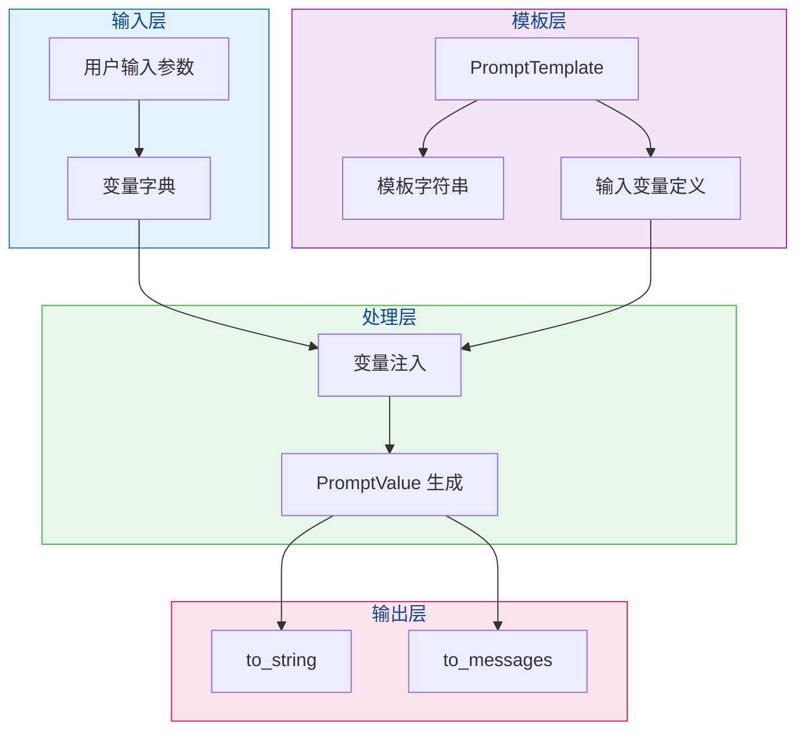
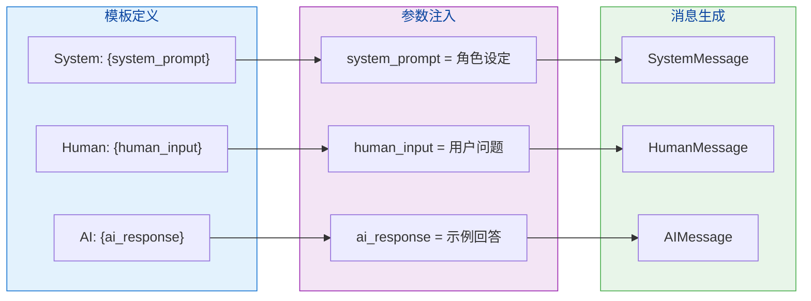
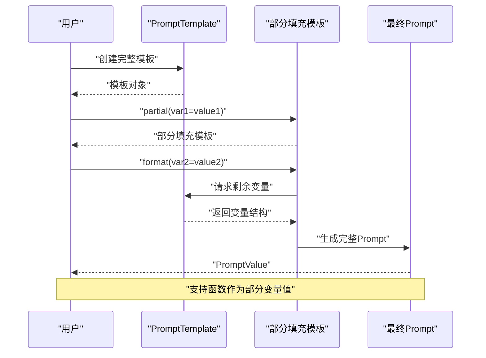
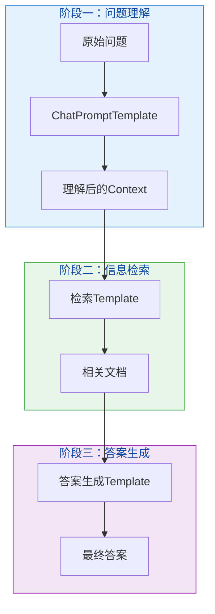

# 第三章：Prompt 模板

## 3.1 Prompt 模板的概念与优势

### 什么是 Prompt 模板？

Prompt 模板是一种预定义的提示词结构，它允许我们使用变量占位符来创建可复用的提示词。通过将动态参数注入到模板中，我们可以生成各种各样但结构一致的提示词。

### 为什么使用 Prompt 模板？

使用 Prompt 模板有以下几个显著优势：

1. **可复用性**：一次定义，多次使用，减少重复编写提示词的工作量。

2. **一致性**：保证相同场景下提示词的结构一致，便于维护和优化。

3. **动态性**：通过参数注入，实现提示词的动态生成。

4. **解耦性**：将提示词内容与业务逻辑分离，提高代码的可维护性。

5. **易于优化**：集中管理提示词，方便测试和迭代优化。

## 3.2 PromptTemplate 的创建与使用

### 基本概念

`PromptTemplate` 是 LangChain 中用于创建文本提示词模板的核心类。它使用双花括号 `{{variable}}` 来定义变量占位符。

### 安装依赖

首先，确保安装了 LangChain 相关依赖：

```python
# 安装 langchain-core
pip install langchain-core

# 如果需要使用 OpenAI 等模型提供方
pip install langchain-openai
```

### 创建简单的 PromptTemplate

```python
from langchain_core.prompts import PromptTemplate

# 方式一：使用字符串直接创建
simple_template = PromptTemplate.from_template(
    "请将以下中文文本翻译成英文：{text}"
)

# 方式二：使用构造函数创建
complex_template = PromptTemplate(
    input_variables=["topic", "style", "word_count"],
    template="请写一篇关于{topic}的{style}风格文章，字数约{word_count}字。"
)

# 查看模板
print(simple_template.template)
# 输出: 请将以下中文文本翻译成英文：{text}
```

### 使用模板生成 Prompt

```python
from langchain_core.prompts import PromptTemplate

# 创建模板
translation_template = PromptTemplate.from_template(
    "请将以下中文文本翻译成英文：{text}"
)

# 方式一：使用 format 方法
prompt = translation_template.format(text="你好，世界！")
print(prompt)
# 输出: 请将以下中文文本翻译成英文：你好，世界！

# 方式二：使用 invoke 方法（推荐）
prompt = translation_template.invoke({"text": "今天天气真好"})
print(prompt)
# 输出: 请将以下中文文本翻译成英文：今天天气真好
```

## 3.3 ChatPromptTemplate（聊天提示模板）

### 聊天消息类型

在聊天场景中，Prompt 通常由多条消息组成，每条消息都有不同的角色：

- **SystemMessage**：系统消息，定义 AI 的角色和行为
- **HumanMessage**：用户消息，来自用户的输入
- **AIMessage**：AI 消息，AI 的回复

### 创建 ChatPromptTemplate

```python
from langchain_core.prompts import ChatPromptTemplate
from langchain_core.messages import SystemMessage, HumanMessage, AIMessage

# 方式一：从字符串模板创建（适用于简单场景）
simple_chat_template = ChatPromptTemplate.from_messages([
    ("system", "你是一个专业的翻译助手。"),
    ("human", "请将以下{source_lang}文本翻译成{target_lang}：{text}")
])

# 使用模板
prompt = simple_chat_template.invoke({
    "source_lang": "中文",
    "target_lang": "英文",
    "text": "人工智能正在改变世界"
})

print(prompt.to_messages())
```

### 完整的聊天模板示例

```python
from langchain_core.prompts import ChatPromptTemplate
from langchain_core.messages import SystemMessage, HumanMessage

# 创建一个客服聊天模板
customer_service_template = ChatPromptTemplate.from_messages([
    ("system", """你是一家电商平台的智能客服助手。
你的职责是：
1. 礼貌、耐心解答客户问题
2. 提供专业的产品咨询
3. 遇到无法解决的问题时，引导客户联系人工客服
请始终保持友好、专业的态度。"""),
    ("human", "用户问题：{customer_question}"),
    ("ai", "好的，我来帮您解答这个问题。")
])

# 生成提示词
prompt = customer_service_template.invoke({
    "customer_question": "我购买的衣服尺码不合适，可以退货吗？"
})

for message in prompt.to_messages():
    print(f"【{message.type}】: {message.content}")
    print("-" * 50)
```

## 3.4 从模板生成 Prompt

### 使用 invoke 方法（推荐）

`invoke` 方法是生成 Prompt 的推荐方式，它支持流式处理和更好的错误处理。

```python
from langchain_core.prompts import PromptTemplate

template = PromptTemplate.from_template(
    "为以下产品写一段营销文案：{product_name}，特点：{features}"
)

# 使用 invoke 方法
result = template.invoke({
    "product_name": "智能手表",
    "features": "心率监测、GPS定位、防水、长续航"
})

print(result)  # 返回的是 PromptValue 对象
print(str(result))  # 转换为字符串
```

### 链式调用生成 Prompt

```python
from langchain_core.prompts import PromptTemplate

# 创建多个模板
summarize_template = PromptTemplate.from_template(
    "请总结以下文章的核心内容（不超过{word_limit}字）：{article}"
)

translate_template = PromptTemplate.from_template(
    "请将以下中文总结翻译成英文：{summary}"
)

# 模拟链式处理
article_text = "人工智能是计算机科学的一个分支，旨在创造能够模拟人类智能的机器..."

# 第一步：总结
summary_prompt = summarize_template.invoke({
    "word_limit": 100,
    "article": article_text
})
print("总结阶段 Prompt:")
print(summary_prompt)

# 第二步：翻译
translation_prompt = translate_template.invoke({
    "summary": "人工智能是计算机科学的一个分支..."
})
print("\n翻译阶段 Prompt:")
print(translation_prompt)
```

## 3.5 动态参数注入

### 在运行时动态修改参数

```python
from langchain_core.prompts import PromptTemplate

def generate_personalized_email(
    customer_name: str,
    product_name: str,
    discount: float
) -> str:
    """生成个性化营销邮件"""

    email_template = PromptTemplate.from_template("""
尊敬的{customer_name}：

您好！我们为您准备了专属优惠！

产品名称：{product_name}
折扣力度：{discount}折
优惠码：{customer_name}2024

点击下方链接立即购买：
{link}

此致
敬礼
""")

    link = f"https://example.com/shop?product={product_name}&code={customer_name}2024"

    prompt = email_template.format(
        customer_name=customer_name,
        product_name=product_name,
        discount=discount,
        link=link
    )

    return prompt

# 使用示例
email = generate_personalized_email(
    customer_name="张三",
    product_name="iPhone 15",
    discount=8.5
)
print(email)
```

### 基于用户输入动态选择模板

```python
from langchain_core.prompts import PromptTemplate

class PromptGenerator:
    """动态 Prompt 生成器"""

    def __init__(self):
        self.templates = {
            "translation": PromptTemplate.from_template(
                "将以下文本从{source}翻译成{target}：{text}"
            ),
            "summarize": PromptTemplate.from_template(
                "请用{style}风格总结以下内容，不超过{length}字：{content}"
            ),
            "question_answer": PromptTemplate.from_template(
                "基于以下上下文回答问题。\n\n上下文：{context}\n\n问题：{question}"
            )
        }

    def generate(self, task_type: str, **kwargs) -> str:
        """根据任务类型生成对应的 Prompt"""
        if task_type not in self.templates:
            raise ValueError(f"不支持的任务类型: {task_type}")

        template = self.templates[task_type]
        return template.format(**kwargs)

# 使用示例
generator = PromptGenerator()

# 翻译任务
print("=== 翻译任务 ===")
print(generator.generate(
    "translation",
    source="中文",
    target="英文",
    text="今天天气真好"
))

# 总结任务
print("\n=== 总结任务 ===")
print(generator.generate(
    "summarize",
    style="简洁",
    length=50,
    content="人工智能技术的发展正在深刻改变各行各业的生产方式和商业模式..."
))

# 问答任务
print("\n=== 问答任务 ===")
print(generator.generate(
    "question_answer",
    context="LangChain 是一个用于构建 LLM 应用的框架。",
    question="LangChain 是什么？"
))
```

## 3.6 部分变量填充

### 概念说明

部分变量填充允许我们先填充模板中的部分变量，剩余变量在后续使用时再填充。这在某些变量值在早期就已知晓的场景下非常有用。

### 基本用法

```python
from langchain_core.prompts import PromptTemplate

# 创建一个有多个变量的模板
full_template = PromptTemplate.from_template(
    "写一首{theme}主题的{format}诗，要求包含以下意象：{imagery}"
)

# 部分填充：先填充 theme 和 format
partial_prompt = full_template.partial(
    theme="自然",
    format="七言绝句"
)

# 后续再填充剩余变量
final_prompt = partial_prompt.format(
    imagery="月亮、柳树、流水"
)

print("部分填充后的模板:")
print(partial_prompt.template)
print("\n最终 Prompt:")
print(final_prompt)
```

### 实际应用场景

```python
from langchain_core.prompts import PromptTemplate
from datetime import datetime

class DocumentProcessor:
    """文档处理 Prompt 生成器"""

    def __init__(self):
        # 基础模板
        self.base_template = PromptTemplate.from_template("""
处理文档任务：

任务类型：{task_type}
文档ID：{document_id}
处理时间：{processing_time}

文档内容：
{content}

输出要求：{requirements}
""")

        # 预先填充不变的变量
        current_time = datetime.now().strftime("%Y-%m-%d %H:%M:%S")
        self.processor = self.base_template.partial(
            processing_time=current_time
        )

    def generate_prompt(self, task_type: str, document_id: str, content: str, requirements: str):
        """生成文档处理 Prompt"""
        return self.processor.format(
            task_type=task_type,
            document_id=document_id,
            content=content,
            requirements=requirements
        )

# 使用示例
processor = DocumentProcessor()
prompt = processor.generate_prompt(
    task_type="文本分类",
    document_id="DOC-2024-001",
    content="这是一段关于科技发展的新闻报道...",
    requirements="输出分类标签和置信度"
)
print(prompt)
```

### 配合函数使用部分变量

```python
from langchain_core.prompts import PromptTemplate
import random

def get_random_greeting():
    """获取随机问候语"""
    greetings = ["你好", "您好", "很高兴见到你", "欢迎"]
    return random.choice(greetings)

def get_current_date():
    """获取当前日期"""
    from datetime import datetime
    return datetime.now().strftime("%Y年%m月%d日")

# 创建模板并使用函数作为默认值
template = PromptTemplate.from_template(
    "{greeting}！今天是{date}。请给我讲一个关于{topic}的故事。"
)

# 部分填充，使用函数
story_template = template.partial(
    greeting=get_random_greeting,
    date=get_current_date
)

# 调用两次，观察随机问候语
print(story_template.format(topic="冒险"))
print()
print(story_template.format(topic="爱情"))
```

## 3.7 Mermaid 图表展示 Prompt 模板工作流程

### Prompt 模板整体架构



### ChatPromptTemplate 消息流程



### 部分变量填充流程



### 多模板链式调用



## 3.8 完整可运行的代码示例

### 示例一：多功能翻译助手

```python
"""
LangChain Prompt 模板实战：多功能翻译助手
"""
from langchain_core.prompts import PromptTemplate, ChatPromptTemplate
from langchain_core.messages import SystemMessage, HumanMessage
from enum import Enum
from typing import Optional


class Language(Enum):
    """支持的语言枚举"""
    CHINESE = "中文"
    ENGLISH = "英文"
    JAPANESE = "日文"
    KOREAN = "韩文"
    FRENCH = "法文"
    GERMAN = "德文"
    SPANISH = "西班牙文"


class TranslationAssistant:
    """多功能翻译助手"""

    # 翻译模板
    translation_template = ChatPromptTemplate.from_messages([
        ("system", """你是一位专业的翻译专家。
擅长领域：{specialty}
翻译风格：{style}"""),
        ("human", "请将以下{source_lang}文本翻译成{target_lang}：\n{text}")
    ])

    # 润色模板
    polish_template = ChatPromptTemplate.from_messages([
        ("system", "你是文本润色专家，负责优化文本使其更加地道、流畅。"),
        ("human", "请将以下文本润色为{style}风格：\n{text}")
    ])

    def translate(
        self,
        text: str,
        source_lang: str,
        target_lang: str,
        specialty: str = "通用",
        style: str = "准确、流畅"
    ) -> str:
        """翻译文本"""
        prompt = self.translation_template.invoke({
            "specialty": specialty,
            "style": style,
            "source_lang": source_lang,
            "target_lang": target_lang,
            "text": text
        })
        return self._format_prompt(prompt)

    def polish(
        self,
        text: str,
        style: str = "正式商务"
    ) -> str:
        """润色文本"""
        prompt = self.polish_template.invoke({
            "style": style,
            "text": text
        })
        return self._format_prompt(prompt)

    def _format_prompt(self, prompt) -> str:
        """格式化 Prompt 输出"""
        messages = prompt.to_messages()
        result = []
        for msg in messages:
            role = {"system": "系统", "human": "用户", "ai": "AI"}.get(msg.type, msg.type)
            result.append(f"【{role}】{msg.content}")
        return "\n\n".join(result)


# 使用示例
if __name__ == "__main__":
    assistant = TranslationAssistant()

    print("=" * 60)
    print("翻译功能测试")
    print("=" * 60)
    print(assistant.translate(
        text="人工智能正在深刻改变我们的生活方式。",
        source_lang="中文",
        target_lang="英文",
        specialty="科技领域",
        style="专业学术"
    ))

    print("\n" + "=" * 60)
    print("润色功能测试")
    print("=" * 60)
    print(assistant.polish(
        text="这个产品非常好用，我非常推荐给大家。",
        style="简洁专业"
    ))
```

### 示例二：智能问答系统

```python
"""
LangChain Prompt 模板实战：智能问答系统
"""
from langchain_core.prompts import PromptTemplate, ChatPromptTemplate
from typing import List, Dict, Optional
import json


class QASystem:
    """智能问答系统"""

    # 上下文问答模板
    context_qa_template = ChatPromptTemplate.from_messages([
        ("system", """你是一个智能问答助手，基于提供的上下文信息回答用户问题。

要求：
1. 只基于上下文信息回答，不要编造信息
2. 如果上下文中没有相关信息，请明确说明
3. 回答要条理清晰，简洁明了
4. 在回答前先理解用户问题的意图"""),
        ("human", "上下文信息：\n{context}\n\n用户问题：{question}")
    ])

    # 摘要生成模板
    summary_template = PromptTemplate.from_template("""
请阅读以下文档内容，然后生成一个简洁的摘要。

文档内容：
{documents}

要求：
1. 摘要不超过{max_words}字
2. 包含文档的核心要点
3. 使用流畅的中文表达

摘要：
""")

    # 多轮对话模板
    conversation_template = ChatPromptTemplate.from_messages([
        ("system", "你是知识库助手，可以根据历史对话和新增上下文回答问题。"),
        ("human", "之前的对话：\n{history}\n\n新增上下文：\n{new_context}\n\n问题：{question}")
    ])

    def answer_with_context(
        self,
        question: str,
        context: str
    ) -> str:
        """基于上下文回答问题"""
        prompt = self.context_qa_template.invoke({
            "context": context,
            "question": question
        })
        return self._messages_to_string(prompt)

    def summarize_documents(
        self,
        documents: List[str],
        max_words: int = 100
    ) -> str:
        """为文档生成摘要"""
        combined_docs = "\n---\n".join(documents)
        prompt = self.summary_template.invoke({
            "documents": combined_docs,
            "max_words": max_words
        })
        return str(prompt)

    def multi_turn_answer(
        self,
        question: str,
        history: str,
        new_context: str
    ) -> str:
        """多轮对话问答"""
        prompt = self.conversation_template.invoke({
            "history": history,
            "new_context": new_context,
            "question": question
        })
        return self._messages_to_string(prompt)

    def _messages_to_string(self, prompt) -> str:
        """将 Prompt 转换为字符串"""
        return "\n".join([
            f"【{msg.type.upper()}】{msg.content}"
            for msg in prompt.to_messages()
        ])


# 使用示例
if __name__ == "__main__":
    qa_system = QASystem()

    print("=" * 60)
    print("基于上下文问答测试")
    print("=" * 60)
    context = """
    LangChain 是一个用于构建 LLM 应用的框架。
    它提供了丰富的组件，包括：
    - Prompt 模板管理
    - 对话历史管理
    - 工具调用
    - RAG 支持
    """
    print(qa_system.answer_with_context(
        question="LangChain 支持哪些功能？",
        context=context
    ))

    print("\n" + "=" * 60)
    print("文档摘要测试")
    print("=" * 60)
    docs = [
        "人工智能是计算机科学的一个分支，致力于研究如何让计算机具有人类智能。",
        "机器学习是人工智能的一个子领域，通过算法让计算机从数据中学习。"
    ]
    print(qa_system.summarize_documents(docs, max_words=50))

    print("\n" + "=" * 60)
    print("多轮对话测试")
    print("=" * 60)
    print(qa_system.multi_turn_answer(
        question="具体如何实现？",
        history="用户：什么是 LangChain？\n助手：LangChain 是一个用于构建 LLM 应用的框架。",
        new_context="LangChain 主要包含 Model I/O、Retrieval、Agents 等核心模块。"
    ))
```

### 示例三：Prompt 模板工具类

```python
"""
LangChain Prompt 模板实战：通用 Prompt 工具类
"""
from langchain_core.prompts import PromptTemplate, ChatPromptTemplate
from typing import Callable, Dict, Any, Optional
from functools import partial


class PromptTemplateUtility:
    """Prompt 模板工具类，提供常用的 Prompt 生成功能"""

    @staticmethod
    def create_basic_template(
        template_string: str,
        **default_kwargs
    ) -> PromptTemplate:
        """创建基础 Prompt 模板

        Args:
            template_string: 模板字符串，使用 {variable} 表示变量
            **default_kwargs: 默认参数

        Returns:
            PromptTemplate 实例
        """
        template = PromptTemplate.from_template(template_string)
        if default_kwargs:
            return template.partial(**default_kwargs)
        return template

    @staticmethod
    def create_chat_template(
        messages: list,
        **default_kwargs
    ) -> ChatPromptTemplate:
        """创建聊天 Prompt 模板

        Args:
            messages: 消息列表，每项为 (role, template_string) 元组
            **default_kwargs: 默认参数

        Returns:
            ChatPromptTemplate 实例
        """
        template = ChatPromptTemplate.from_messages(messages)
        if default_kwargs:
            return template.partial(**default_kwargs)
        return template

    @staticmethod
    def create_with_validation(
        template_string: str,
        required_variables: list
    ) -> PromptTemplate:
        """创建带变量验证的模板

        Args:
            template_string: 模板字符串
            required_variables: 必需变量列表

        Returns:
            PromptTemplate 实例（带验证方法）
        """
        template = PromptTemplate.from_template(template_string)

        def validate_and_format(**kwargs) -> str:
            """验证并格式化"""
            missing = set(required_variables) - set(kwargs.keys())
            if missing:
                raise ValueError(f"缺少必需变量: {missing}")
            return template.format(**kwargs)

        # 替换原生的 format 方法
        template.format = validate_and_format
        return template


# 使用示例
if __name__ == "__main__":
    utility = PromptTemplateUtility()

    # 测试基础模板
    print("=== 基础模板测试 ===")
    basic_tpl = utility.create_basic_template(
        "翻译成{target_lang}：{text}",
        target_lang="英文"
    )
    print(basic_tpl.format(text="你好"))

    # 测试聊天模板
    print("\n=== 聊天模板测试 ===")
    chat_tpl = utility.create_chat_template([
        ("system", "你是一个{role}助手"),
        ("human", "{question}")
    ], role="翻译")
    print(chat_tpl.invoke({
        "question": "如何用英语说'谢谢'？"
    }))

    # 测试带验证的模板
    print("\n=== 验证模板测试 ===")
    validated_tpl = utility.create_with_validation(
        "为{topic}写一个{length}字的摘要：{content}",
        required_variables=["topic", "content"]
    )
    print(validated_tpl.format(
        topic="AI",
        length=100,
        content="人工智能的发展..."
    ))
```

## 3.9 最佳实践与注意事项

### 最佳实践

1. **使用 `invoke` 而非 `format`**：`invoke` 方法是 LangChain 推荐的 API，支持更好的错误处理和流式处理。

2. **合理组织模板结构**：对于复杂场景，使用多个小型模板组合，而不是一个超大的模板。

3. **使用枚举或常量**：对于固定的可选值（如语言类型），使用枚举或常量定义，避免拼写错误。

4. **模板版本管理**：在实际项目中，建议对模板进行版本管理，方便追踪和回滚。

### 常见问题

1. **变量名拼写错误**：确保模板中的变量名与传入字典的键完全一致。

2. **缺少必需变量**：在填充模板前，确保所有必需变量都已提供。

3. **类型不匹配**：某些变量可能需要特定类型（如数字、列表），注意类型转换。

## 3.10 小结

本章介绍了 LangChain 中 Prompt 模板的核心概念和使用方法：

- **PromptTemplate**：用于创建文本提示词模板
- **ChatPromptTemplate**：用于创建聊天场景的多消息模板
- **部分变量填充**：提高模板的灵活性和复用性
- **invoke 方法**：推荐使用的 Prompt 生成方式

掌握这些内容，将为后续学习 LangChain 的链（Chain）和代理（Agent）打下坚实基础。

---

> 思考题：
> 1. 如何设计一个模板，使其能够处理多种不同类型的任务？
> 2. 部分变量填充在什么场景下特别有用？
> 3. 如何实现模板的动态切换和组合？
