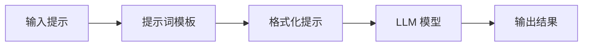
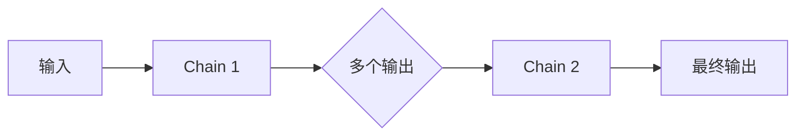
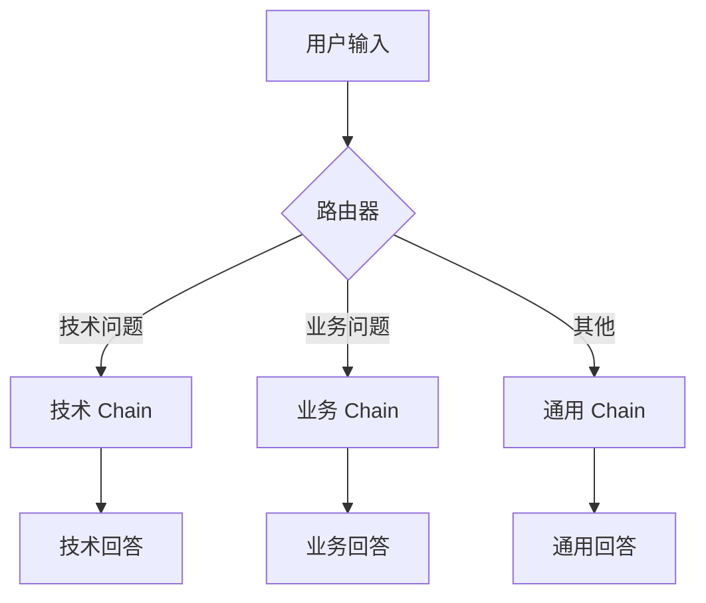
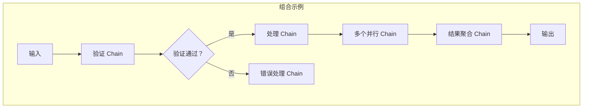
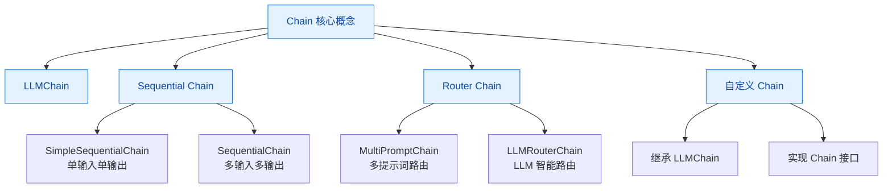
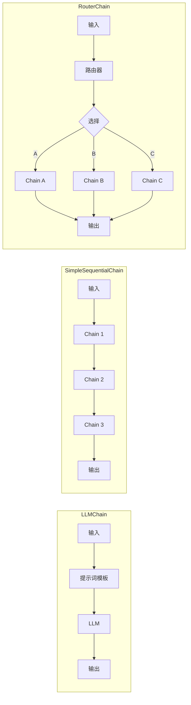

# 第四章：Chain（链）

## 4.1 Chain 的概念与作用

### 什么是 Chain？

Chain（链）是 LangChain 中的核心概念之一。简单来说，**Chain 就是将多个组件串联起来，形成一个有序的工作流程**。每个组件可以是 LLM、提示词模板、其他 Chain、或者各种工具。

### 为什么需要 Chain？

在实际的 AI 应用中，我们很少只需要调用一次 LLM 就完成所有任务。通常需要：

1. **处理复杂任务**：将大任务拆分成小步骤
2. **组合能力**：把 LLM 与工具、数据库、API 结合
3. **保持状态**：在多轮对话中维护上下文
4. **复用逻辑**：创建可重用的处理流程

### Chain 的核心价值

```
┌─────────────────────────────────────────────────────────┐
│                     Chain 的价值                         │
├─────────────────────────────────────────────────────────┤
│  ✓ 模块化：将复杂流程拆分为独立组件                       │
│  ✓ 可复用：一次定义，多次使用                             │
│  ✓ 可调试：每个环节可独立测试                             │
│  ✓ 可组合：灵活组合形成复杂系统                           │
│  ✓ 可追踪：记录每个环节的输入输出                         │
└─────────────────────────────────────────────────────────┘
```

---

## 4.2 LLMChain：最简单的链

### 基本概念

`LLMChain` 是 LangChain 中最基础的 Chain 类型，它将一个**提示词模板**和一个 **LLM 模型**组合起来工作。

### 工作流程



### 代码示例

```python
from langchain_openai import ChatOpenAI
from langchain.prompts import PromptTemplate

# 1. 创建 LLM 实例
llm = ChatOpenAI(
    model="gpt-4o",
    api_key="your-api-key",
    base_url="https://api.openai.com/v1"
)

# 2. 定义提示词模板
template = """请将以下中文文本翻译成英文：

文本：{text}

英文翻译："""

prompt = PromptTemplate(
    input_variables=["text"],
    template=template
)

# 3. 创建 LLMChain
from langchain.chains import LLMChain
chain = LLMChain(llm=llm, prompt=prompt)

# 4. 运行 Chain
result = chain.invoke({"text": "你好，世界！"})
print(result["text"])
# 输出: Hello, world!
```

### LLMChain 的完整参数

```python
from langchain.chains import LLMChain

chain = LLMChain(
    llm=llm,                          # 必需的：LLM 实例
    prompt=prompt,                     # 必需的：提示词模板
    verbose=True,                      # 是否打印详细日志
    output_key="text",                 # 输出结果的 key
    memory=None,                       # 记忆组件（后续章节介绍）
)
```

---

## 4.3 Sequential Chain（顺序链）

顺序链是 **按顺序一个接一个执行** 的 Chain。每个 Chain 的输出会作为下一个 Chain 的输入。

### 4.3.1 SimpleSequentialChain

最简单的顺序链，只有一个输入和一个输出，每一步的输出直接传递给下一步。

```mermaid
%%{
init: {
    theme: 'base',
    themeVariables: {
        primaryColor: '#E3F2FD',
        primaryTextColor: '#0D47A1',
        primaryBorderColor: '#1976D2',
        lineColor: '#424242',
        secondaryColor: '#F3E5F5',
        tertiaryColor: '#E8F5E9',
        backgroundColor: '#FFFFFF',
        mainBkg: '#FAFAFA',
        nodeBorder: '#1976D2',
        clusterBkg: '#FAFAFA',
        clusterBorder: '#90CAF9',
        titleColor: '#0D47A1',
        edgeLabelBackground: '#FFFFFF'
    }
}%%
graph LR
    A["输入"] --> B["Chain 1"]
    B --> C["输出 1"]
    C --> D["Chain 2"]
    D --> E["输出 2"]
    E --> F["Chain 3"]
    F --> G["最终输出"]
```



#### 代码示例

```python
from langchain_openai import ChatOpenAI
from langchain.chains import SimpleSequentialChain, LLMChain
from langchain.prompts import PromptTemplate

llm = ChatOpenAI(model="gpt-4o", api_key="your-api-key")

# Chain 1: 中文翻译成英文
template1 = """将以下中文翻译成英文：
{text}"""
prompt1 = PromptTemplate(input_variables=["text"], template=template1)
chain1 = LLMChain(llm=llm, prompt=prompt1, output_key="english_text")

# Chain 2: 将英文翻译成法文
template2 = """将以下英文翻译成法文：
{english_text}"""
prompt2 = PromptTemplate(input_variables=["english_text"], template=template2)
chain2 = LLMChain(llm=llm, prompt=prompt2, output_key="french_text")

# 创建 SimpleSequentialChain
simple_chain = SimpleSequentialChain(chains=[chain1, chain2], verbose=True)

# 运行
result = simple_chain.invoke("你好，今天天气真好！")
print(result["output"])
# Chain 1: Hello, the weather is really nice today!
# Chain 2: Bonjour, il fait vraiment beau aujourd'hui!
```

### 4.3.2 SequentialChain（多输入/输出）

当需要**多个输入或多个输出**时，使用 `SequentialChain`。



#### 代码示例

```python
from langchain_openai import ChatOpenAI
from langchain.chains import SequentialChain, LLMChain
from langchain.prompts import PromptTemplate

llm = ChatOpenAI(model="gpt-4o", api_key="your-api-key")

# Chain 1: 提取书评信息
template1 = """分析以下书评，提取关键信息：

书评：{review}

请以 JSON 格式输出：
- 评分 (1-5)
- 优点
- 缺点
- 主题"""

prompt1 = PromptTemplate(input_variables=["review"], template=template1)
chain1 = LLMChain(
    llm=llm,
    prompt=prompt1,
    output_key="book_analysis"  # 输出 key
)

# Chain 2: 生成摘要
template2 = """基于以下分析，为这本书生成一个简短摘要：

分析：{book_analysis}

摘要："""

prompt2 = PromptTemplate(input_variables=["book_analysis"], template=template2)
chain2 = LLMChain(
    llm=llm,
    prompt=prompt2,
    output_key="summary"  # 输出 key
)

# Chain 3: 生成推荐理由
template3 = """基于以下分析，生成推荐理由：

摘要：{summary}

推荐理由："""

prompt3 = PromptTemplate(input_variables=["summary"], template=template3)
chain3 = LLMChain(
    llm=llm,
    prompt=prompt3,
    output_key="recommendation"  # 输出 key
)

# 创建 SequentialChain，支持多个输入输出
sequential_chain = SequentialChain(
    chains=[chain1, chain2, chain3],
    input_variables=["review"],       # 输入变量
    output_variables=["book_analysis", "summary", "recommendation"],  # 输出变量
    verbose=True
)

# 运行
result = sequential_chain.invoke({
    "review": "这本书真的很棒！作者用生动的语言讲述了一个人在异乡奋斗的故事。"
               "情节跌宕起伏，人物塑造鲜明。不过后期节奏有点慢。总体来说值得一读。"
})

print("=== 分析 ===")
print(result["book_analysis"])
print("\n=== 摘要 ===")
print(result["summary"])
print("\n=== 推荐理由 ===")
print(result["recommendation"])
```

---

## 4.4 Router Chain（路由链）

路由链可以根据输入**智能地选择**接下来要执行的 Chain。这就像一个智能路由器，根据问题类型将请求分发到不同的处理模块。

### 工作原理



### 代码示例

```python
from langchain_openai import ChatOpenAI
from langchain.chains.router import MultiPromptChain
from langchain.chains.router.llm_router import LLMRouterChain, RouterOutputParser
from langchain.chains import LLMChain
from langchain.prompts import PromptTemplate

llm = ChatOpenAI(model="gpt-4o", api_key="your-api-key")

# 定义不同场景的提示词模板
physics_template = """你是一个物理学家。请回答以下物理问题：

问题：{input}

回答："""

math_template = """你是一个数学家。请回答以下数学问题：

问题：{input}

回答："""

history_template = """你是一个历史学家。请回答以下历史问题：

问题：{input}

回答："""

general_template = """你是一个通用助手。请回答以下问题：

问题：{input}

回答："""

# 创建各个目标 Chain
physics_prompt = PromptTemplate(input_variables=["input"], template=physics_template)
physics_chain = LLMChain(llm=llm, prompt=physics_prompt)

math_prompt = PromptTemplate(input_variables=["input"], template=math_template)
math_chain = LLMChain(llm=llm, prompt=math_prompt)

history_prompt = PromptTemplate(input_variables=["input"], template=history_template)
history_chain = LLMChain(llm=llm, prompt=history_prompt)

general_prompt = PromptTemplate(input_variables=["input"], template=general_template)
general_chain = LLMChain(llm=llm, prompt=general_prompt)

# 定义路由器提示词
router_template = """根据用户的问题，选择最合适的回答者。

问题：{input}

请选择：physics, math, history, 或 general"""

router_prompt = PromptTemplate(
    input_variables=["input"],
    template=router_template,
    output_parser=RouterOutputParser()
)

# 创建路由器 Chain
router_chain = LLMRouterChain.from_llm(llm, router_prompt)

# 创建 MultiPromptChain（多提示词路由链）
chain = MultiPromptChain(
    router_chain=router_chain,
    destination_chains={
        "physics": physics_chain,
        "math": math_chain,
        "history": history_chain,
        "general": general_chain
    },
    default_chain=general_chain,
    verbose=True
)

# 测试路由
print("=== 测试物理问题 ===")
result = chain.invoke({"input": "请解释相对论的基本原理"})
print(result["text"])

print("\n=== 测试数学问题 ===")
result = chain.invoke({"input": "什么是斐波那契数列？"})
print(result["text"])

print("\n=== 测试历史问题 ===")
result = chain.invoke({"input": "秦始皇统一六国是哪一年？"})
print(result["text"])
```

---

## 4.5 Chain 的组合与复用

### 组合模式

在实际应用中，我们经常需要将多个 Chain 组合成更复杂的结构。



### 代码示例：条件组合

```python
from langchain_openai import ChatOpenAI
from langchain.chains import LLMChain
from langchain.prompts import PromptTemplate
from langchain.chains.pipeline import PipelineChain

llm = ChatOpenAI(model="gpt-4o", api_key="your-api-key")

# 验证 Chain
validation_template = """判断以下内容是否适合公开发布。

内容：{content}

如果适合，返回 YES；如果不适合，返回 NO，并说明原因。"""

validation_prompt = PromptTemplate(input_variables=["content"], template=validation_template)
validation_chain = LLMChain(llm=llm, prompt=validation_prompt, output_key="validation_result")

# 处理 Chain
processing_template = """请改进以下内容，使其更加专业：

内容：{content}

改进后的内容："""

processing_prompt = PromptTemplate(input_variables=["content"], template=processing_template)
processing_chain = LLMChain(llm=llm, prompt=processing_prompt)

# 错误处理 Chain
error_template = """以下内容不适合公开发布：

原始内容：{content}

请提供一个友好的建议，告知用户如何修改："""

error_prompt = PromptTemplate(input_variables=["content"], template=error_template)
error_chain = LLMChain(llm=llm, prompt=error_prompt)

# 模拟条件执行
def conditional_chain(content: str):
    # 1. 验证
    validation_result = validation_chain.invoke({"content": content})

    if "YES" in validation_result["validation_result"]:
        # 2. 处理
        return processing_chain.invoke({"content": content})
    else:
        # 3. 错误处理
        return error_chain.invoke({"content": content})

# 测试
print("=== 测试正常内容 ===")
result = conditional_chain("人工智能正在改变我们的生活方式。")
print(result["text"])

print("\n=== 测试敏感内容 ===")
result = conditional_chain("如何使用武器进行攻击")
print(result["text"])
```

### 复用 Chain

```python
# 定义一次，多次使用
translation_chain = LLMChain(
    llm=llm,
    prompt=PromptTemplate(
        input_variables=["text", "target_lang"],
        template="将以下文本翻译成{target_lang}：\n{text}"
    )
)

# 复用：翻译成多种语言
languages = ["英语", "日语", "法语", "德语"]
text = "今天天气真好！"

for lang in languages:
    result = translation_chain.invoke({
        "text": text,
        "target_lang": lang
    })
    print(f"{lang}: {result['text']}")
```

---

## 4.6 自定义 Chain

有时候内置的 Chain 不能完全满足需求，我们可以创建自己的 Chain。

### 继承 LLMChain

```python
from langchain.chains import LLMChain
from langchain.schema import BaseOutputParser
from pydantic import BaseModel, Field

# 1. 定义自定义输出解析器
class EmailOutputParser(BaseOutputParser):
    """解析邮件信息"""

    def parse(self, text: str) -> dict:
        lines = text.strip().split("\n")
        email_info = {}
        for line in lines:
            if ":" in line:
                key, value = line.split(":", 1)
                email_info[key.strip()] = value.strip()
        return email_info

# 2. 创建自定义 Chain
class EmailGeneratorChain(LLMChain):
    """生成格式化邮件的 Chain"""

    def __init__(self, llm, **kwargs):
        prompt = PromptTemplate(
            input_variables=["recipient", "subject", "content"],
            template="""请生成一封邮件，格式如下：

收件人：{recipient}
主题：{subject}
内容：{content}

请直接输出邮件内容，不需要其他说明。"""
        )
        super().__init__(llm=llm, prompt=prompt, **kwargs)

    def generate_email(self, recipient: str, subject: str, content: str) -> str:
        """生成邮件的便捷方法"""
        result = self.invoke({
            "recipient": recipient,
            "subject": subject,
            "content": content
        })
        return result["text"]

# 使用自定义 Chain
llm = ChatOpenAI(model="gpt-4o", api_key="your-api-key")
email_chain = EmailGeneratorChain(llm=llm)

email = email_chain.generate_email(
    recipient="张三",
    subject="会议通知",
    content="请明天下午2点参加项目评审会议。"
)
print(email)
```

### 使用 ChainableMixin

```python
from langchain.chains import Chain
from langchain.schema import BaseOutputParser

class TextProcessorChain(Chain):
    """文本处理 Chain"""

    def __init__(self, processor_fn):
        super().__init__()
        self.processor_fn = processor_fn

    @property
    def input_keys(self):
        return ["text"]

    @property
    def output_keys(self):
        return ["processed_text"]

    def _call(self, inputs):
        text = inputs["text"]
        processed = self.processor_fn(text)
        return {"processed_text": processed}

    def invoke(self, text: str):
        return self._call({"text": text})

# 使用
def clean_text(text: str) -> str:
    """清理文本"""
    import re
    # 去除多余空格
    text = re.sub(r'\s+', ' ', text)
    # 去除特殊字符
    text = re.sub(r'[^\w\s一-鿿]', '', text)
    return text.strip()

chain = TextProcessorChain(processor_fn=clean_text)
result = chain.invoke("这   是一个  测试！！！@#$%")
print(result["processed_text"])
# 输出: 这是一个测试
```

---

## 4.7 Mermaid 图表总结

### Chain 类型总览



### Chain 执行流程对比



---

## 4.8 完整综合示例

下面是一个综合运用多种 Chain 的完整示例：

```python
from langchain_openai import ChatOpenAI
from langchain.chains import LLMChain, SequentialChain, SimpleSequentialChain
from langchain.prompts import PromptTemplate

# 初始化 LLM
llm = ChatOpenAI(model="gpt-4o", api_key="your-api-key")

# ==================== Chain 1: 文章分析 ====================
analysis_template = """分析以下文章，提取关键信息：

标题：{title}
内容：{content}

请提取：
1. 文章主题
2. 主要观点（3点）
3. 文章类型
"""

analysis_prompt = PromptTemplate(
    input_variables=["title", "content"],
    template=analysis_template
)
analysis_chain = LLMChain(
    llm=llm,
    prompt=analysis_prompt,
    output_key="analysis"
)

# ==================== Chain 2: 生成摘要 ====================
summary_template = """基于以下分析，生成一个简洁的摘要：

分析：{analysis}

摘要（不超过100字）："""

summary_prompt = PromptTemplate(
    input_variables=["analysis"],
    template=summary_template
)
summary_chain = LLMChain(
    llm=llm,
    prompt=summary_prompt,
    output_key="summary"
)

# ==================== Chain 3: 生成标签 ====================
tags_template = """基于以下内容，为文章生成合适的标签：

标题：{title}
主题：{analysis}

请生成5个标签，用逗号分隔："""

tags_prompt = PromptTemplate(
    input_variables=["title", "analysis"],
    template=tags_template
)
tags_chain = LLMChain(
    llm=llm,
    prompt=tags_prompt,
    output_key="tags"
)

# ==================== Chain 4: 社交媒体版本 ====================
social_template = """将以下摘要改写成社交媒体帖子：

摘要：{summary}

要求：
- 不超过280字
- 添加相关话题标签
- 吸引人的开头
"""

social_prompt = PromptTemplate(
    input_variables=["summary"],
    template=social_template
)
social_chain = LLMChain(
    llm=llm,
    prompt=social_prompt,
    output_key="social_post"
)

# ==================== 组合所有 Chain ====================
# 第一阶段：分析和摘要
first_stage = SequentialChain(
    chains=[analysis_chain, summary_chain],
    input_variables=["title", "content"],
    output_variables=["analysis", "summary"],
    verbose=True
)

# 第二阶段：生成标签和社交媒体版本
second_stage = SequentialChain(
    chains=[tags_chain, social_chain],
    input_variables=["title", "analysis", "summary"],
    output_variables=["tags", "social_post"],
    verbose=True
)

# 最终组合
def process_article(title: str, content: str) -> dict:
    """处理文章的完整流程"""
    # 第一阶段
    stage1_result = first_stage.invoke({
        "title": title,
        "content": content
    })

    # 第二阶段
    stage2_result = second_stage.invoke({
        "title": title,
        "analysis": stage1_result["analysis"],
        "summary": stage1_result["summary"]
    })

    return {
        "title": title,
        "analysis": stage1_result["analysis"],
        "summary": stage1_result["summary"],
        "tags": stage2_result["tags"],
        "social_post": stage2_result["social_post"]
    }

# ==================== 运行示例 ====================
if __name__ == "__main__":
    article_title = "人工智能在医疗领域的应用"
    article_content = """
    随着人工智能技术的快速发展，医疗领域正在经历革命性的变革。
    AI 辅助诊断系统能够帮助医生更准确地识别早期疾病，提高治愈率。
    手术机器人可以执行精细操作，减少手术风险和恢复时间。
    药物研发周期大幅缩短，为患者带来新的希望。
    然而，我们也需要关注数据隐私和伦理问题，确保技术发展造福人类。
    """

    result = process_article(article_title, article_content)

    print("=" * 60)
    print("文章分析结果")
    print("=" * 60)
    print(f"\n【标题】{result['title']}")
    print(f"\n【分析】{result['analysis']}")
    print(f"\n【摘要】{result['summary']}")
    print(f"\n【标签】{result['tags']}")
    print(f"\n【社交媒体帖子】\n{result['social_post']}")
```

运行结果示例：

```
============================================================
文章分析结果
============================================================

【标题】人工智能在医疗领域的应用

【分析】
1. 文章主题：人工智能技术在医疗领域的应用与影响
2. 主要观点：
   - AI辅助诊断提高疾病识别准确率
   - 手术机器人降低手术风险
   - 药物研发加速
3. 文章类型：科技评论/趋势分析

【摘要】
本文探讨AI在医疗领域的应用，包括辅助诊断、手术机器人和药物研发，
指出技术进步带来的机遇与挑战。

【标签】
人工智能, 医疗科技, AI诊断, 手术机器人, 药物研发

【社交媒体帖子】
???
AI正在彻底改变医疗行业！??
从精准诊断到手术机器人，从药物研发到健康管理，
人工智能正在每一个环节提升医疗服务的质量和效率。
#人工智能 #医疗科技 #AI #未来医疗 #科技创新
```

---

## 本章小结

1. **Chain 是 LangChain 的核心**：将多个组件串联成工作流程
2. **LLMChain 是基础**：最简单的提示词 + LLM 组合
3. **SequentialChain 用于顺序执行**：
   - `SimpleSequentialChain`：单输入单输出
   - `SequentialChain`：多输入多输出
4. **RouterChain 用于智能路由**：根据输入类型选择不同处理路径
5. **Chain 可组合复用**：灵活构建复杂应用
6. **可以自定义 Chain**：继承或实现接口创建专用 Chain

---

> 下一章我们将介绍 **Memory（记忆）**，了解如何让 Chain 保持对话上下文，记住之前的交互历史。
