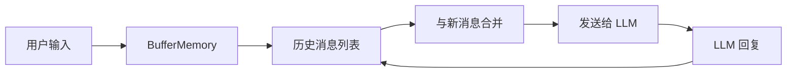
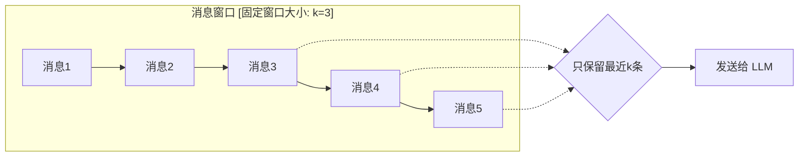
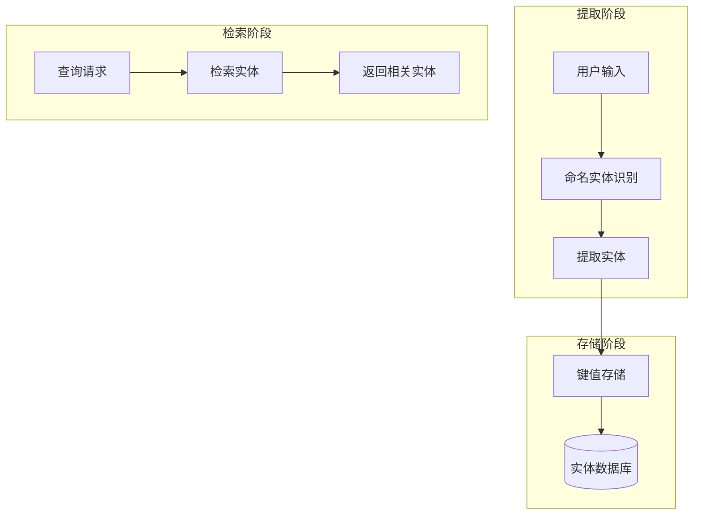
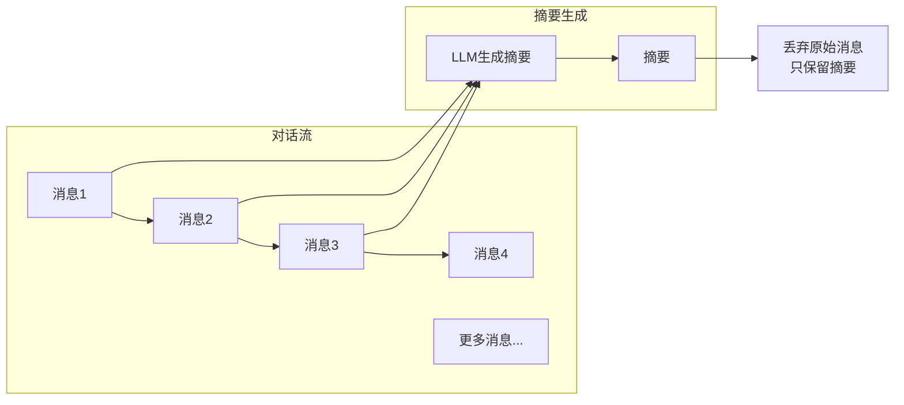
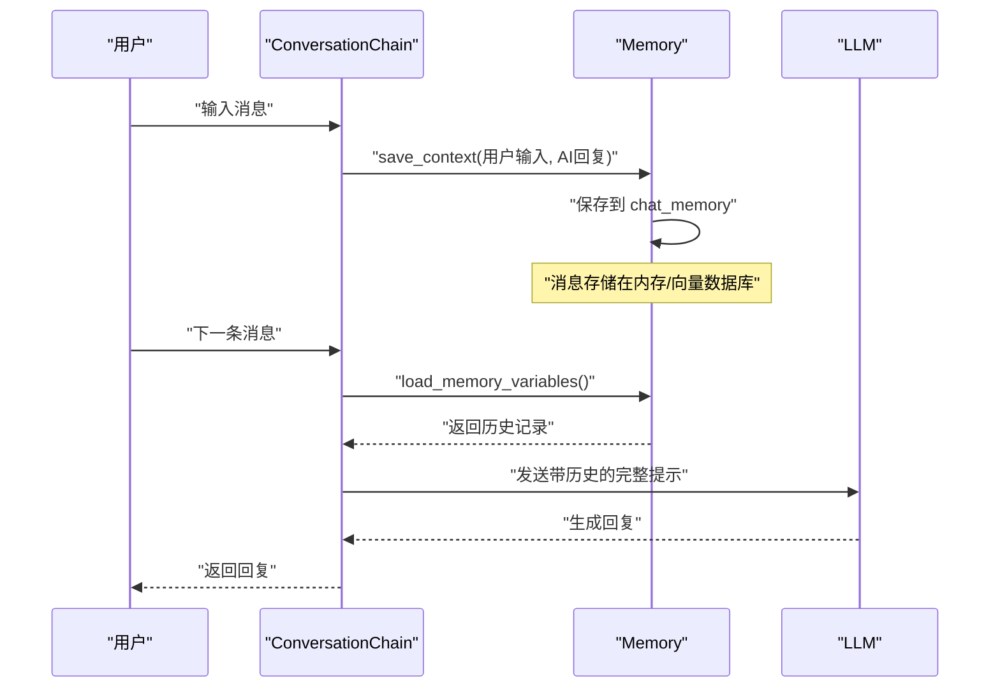
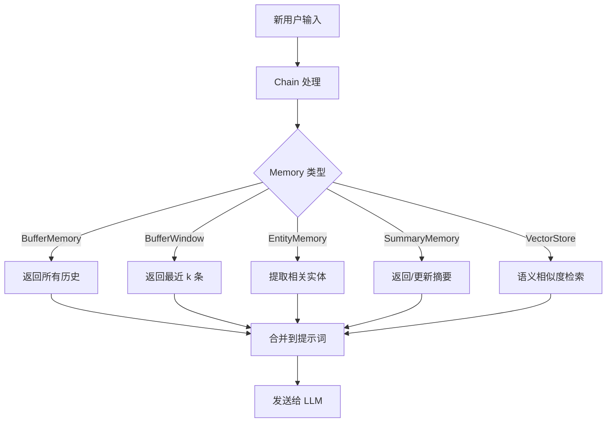

```mermaid
%%{
init: {
    theme: 'base',
    themeVariables: {
        primaryColor: '#E3F2FD',
        primaryTextColor: '#0D47A1',
        primaryBorderColor: '#1976D2',
        lineColor: '#424242',
        secondaryColor: '#F3E5F5',
        tertiaryColor: '#E8F5E9',
        backgroundColor: '#FFFFFF',
        mainBkg: '#FAFAFA',
        nodeBorder: '#1976D2',
        clusterBkg: '#FAFAFA',
        clusterBorder: '#90CAF9',
        titleColor: '#0D47A1',
        edgeLabelBackground: '#FFFFFF'
    }
}%%
graph TB
    subgraph "写入流程"
        MSG["新消息"] --> EMB["向量化"]
        EMB --> VS["向量数据库"]
        VS --> IDX["索引"]
    end
    
    subgraph "检索流程"
        QUERY["查询"] --> Q_EMB["查询向量化"]
        Q_EMB --> SIM["相似度计算"]
        SIM --> TOP_K["Top-K 检索"]
        TOP_K --> RESULT["返回相关记忆"]
    end
```

# 第6章：LangChain Memory（对话记忆）

## 6.1 Memory 的概念与重要性

### 什么是 Memory？

在 LangChain 中，**Memory（记忆）**是用于在对话过程中存储和检索历史消息的组件。它使得 AI 应用能够记住之前的对话内容，从而提供上下文连贯的交互体验。

### 为什么需要 Memory？

没有 Memory 的对话场景：

```
用户: 你好，我叫张三
AI: 你好张三，很高兴认识你！

用户: 我叫什么名字？
AI: 抱歉，我不知道你叫什么名字。（丢失了之前的信息）
```

有 Memory 的对话场景：

```
用户: 你好，我叫张三
AI: 你好张三，很高兴认识你！
  [Memory: {"name": "张三"}]

用户: 我叫什么名字？
AI: 你叫张三。
  [Memory: 检索到 {"name": "张三"}]
```

### Memory 在 AI 应用中的位置

```
┌─────────────────────────────────────────────────────────────┐
│                      用户交互层                               │
├─────────────────────────────────────────────────────────────┤
│                      Conversation                            │
│  ┌─────────────┐  ┌─────────────┐  ┌─────────────────────┐  │
│  │   Memory    │  │    Chain    │  │       Agent         │  │
│  │  (记忆存储)  │◄─┤  (处理逻辑)  │◄─┤   (自主决策执行)    │  │
│  └─────────────┘  └─────────────┘  └─────────────────────┘  │
├─────────────────────────────────────────────────────────────┤
│                      模型层 (LLM)                             │
└─────────────────────────────────────────────────────────────┘
```

---

## 6.2 对话记忆的类型

LangChain 提供了多种 Memory 类型，适用于不同的场景：

| 类型 | 特点 | 适用场景 |
|------|------|----------|
| BufferMemory | 存储所有历史消息 | 短对话、测试环境 |
| BufferWindowMemory | 只保留最近 N 条消息 | 长对话、资源受限环境 |
| EntityMemory | 提取并存储实体信息 | 需要结构化知识的场景 |
| ConversationSummaryMemory | 生成摘要保存 | 超长对话 |
| VectorStore-backed Memory | 向量存储检索 | 语义搜索场景 |

---

## 6.3 BufferMemory（缓冲记忆）

BufferMemory 是最简单的 Memory 类型，它将所有历史对话消息完整存储在内存中。

### 工作原理



### 代码示例

```python
from langchain.memory import ConversationBufferMemory
from langchain.chains import ConversationChain
from langchain_openai import ChatOpenAI

# 初始化 LLM
llm = ChatOpenAI(
    api_key="your-api-key",
    model="gpt-4",
    temperature=0
)

# 创建 BufferMemory
memory = ConversationBufferMemory()

# 创建对话链
conversation = ConversationChain(
    llm=llm,
    memory=memory,
    verbose=True
)

# 第一轮对话
response1 = conversation.invoke({"input": "你好，我叫张三"})
print(response1["response"])
# 输出: 你好张三！很高兴认识你。我可以怎么帮助你？

# 第二轮对话 - Memory 自动记住之前的名字
response2 = conversation.invoke({"input": "我刚才说我叫什么名字？"})
print(response2["response"])
# 输出: 你刚才说你叫张三。

# 查看记忆中的历史消息
print(memory.chat_memory.messages)
# 输出: [HumanMessage(content='你好，我叫张三'), AIMessage(content='你好张三！...'), ...]
```

### 关键方法

```python
# 保存对话
memory.save_context({"input": "用户输入"}, {"output": "AI回复"})

# 清空记忆
memory.clear()

# 加载记忆（用于恢复会话）
memory.load_memory_variables({})
```

---

## 6.4 BufferWindowMemory（窗口缓冲记忆）

BufferWindowMemory 只保留最近 N 轮对话，丢弃更早的消息。这对于长对话场景非常有用，可以控制内存使用。

### 工作原理



### 代码示例

```python
from langchain.memory import ConversationBufferWindowMemory
from langchain.chains import ConversationChain
from langchain_openai import ChatOpenAI

llm = ChatOpenAI(
    api_key="your-api-key",
    model="gpt-4"
)

# 创建窗口记忆，保留最近 3 轮对话
memory = ConversationBufferWindowMemory(k=3)

conversation = ConversationChain(
    llm=llm,
    memory=memory
)

# 进行多轮对话
conversation.invoke({"input": "第一轮对话"})
conversation.invoke({"input": "第二轮对话"})
conversation.invoke({"input": "第三轮对话"})
conversation.invoke({"input": "第四轮对话"})
conversation.invoke({"input": "第五轮对话"})

# 查看记忆中只有最近 3 轮
print(len(memory.chat_memory.messages))
# 输出: 6 (3轮对话 = 3个用户消息 + 3个AI回复)

# 验证：最早的对话已被遗忘
history = memory.load_memory_variables({})
print(history["history"])
# 输出: 只包含第3、4、5轮对话
```

### 使用建议

- `k` 值不宜过大，避免超出 LLM 的上下文窗口
- 也不宜过小，否则会丢失重要上下文
- 建议根据对话平均长度和 LLM 上下文限制来设置

---

## 6.5 EntityMemory（实体记忆）

EntityMemory 能够从对话中提取和存储实体（人物、地点、事物等），以结构化的方式记住关键信息。

### 工作原理



### 代码示例

```python
from langchain.memory import EntityMemory
from langchain.chains import ConversationChain
from langchain_openai import ChatOpenAI

llm = ChatOpenAI(
    api_key="your-api-key",
    model="gpt-4"
)

# 创建 EntityMemory
memory = EntityMemory(
    llm=llm,
    entity_store_session_id="user_123"  # 实体存储的会话ID
)

conversation = ConversationChain(
    llm=llm,
    memory=memory,
    verbose=True
)

# 对话中提及实体
conversation.invoke({"input": "我的名字是李四，我住在上海，我在字节跳动工作。"})
conversation.invoke({"input": "我在找一个能帮我写代码的助手。"})
conversation.invoke({"input": "我叫什么名字？我住在哪里？我在哪家公司工作？"})

# 查看提取的实体
print(memory.entity_store.get("李四"))
# 输出: {'name': '李四', 'type': 'person', 'location': '上海', 'company': '字节跳动'}

print(memory.entity_store.get("字节跳动"))
# 输出: {'name': '字节跳动', 'type': 'company', 'employee': '李四'}
```

### 实体存储结构

```python
# EntityMemory 内部维护的实体存储结构
entity_store = {
    "李四": {
        "name": "李四",
        "type": "person",
        "location": "上海",
        "company": "字节跳动"
    },
    "上海": {
        "name": "上海",
        "type": "location",
        "resident": "李四"
    },
    "字节跳动": {
        "name": "字节跳动",
        "type": "company",
        "employees": ["李四"]
    }
}
```

---

## 6.6 摘要记忆（ConversationSummaryMemory）

对于非常长的对话，BufferMemory 会消耗大量 Token。ConversationSummaryMemory 通过生成对话摘要来解决这个问题。

### 工作原理



### 代码示例

```python
from langchain.memory import ConversationSummaryMemory
from langchain.chains import ConversationChain
from langchain_openai import ChatOpenAI

llm = ChatOpenAI(
    api_key="your-api-key",
    model="gpt-4"
)

# 创建摘要记忆
memory = ConversationSummaryMemory(llm=llm)

conversation = ConversationChain(
    llm=llm,
    memory=memory
)

# 进行多轮对话
for i in range(10):
    conversation.invoke({"input": f"这是第 {i+1} 轮对话的内容，我们讨论了天气、电影和音乐。"})
    print(f"第 {i+1} 轮 - Memory占用: {len(memory.load_memory_variables({})['history'])} 字符")

# 对比 BufferMemory，摘要记忆的占用小得多
print(f"最终摘要:\n{memory.load_memory_variables({})['history']}")
```

### 与 BufferMemory 的对比

| 特性 | BufferMemory | ConversationSummaryMemory |
|------|--------------|---------------------------|
| 存储内容 | 原始消息 | 对话摘要 |
| Token 消耗 | 随对话线性增长 | 增长缓慢 |
| 信息完整性 | 100% 保留 | 可能丢失细节 |
| 响应质量 | 更准确 | 可能丢失细微上下文 |
| 适用场景 | 短对话 | 长对话 |

---

## 6.7 向量记忆（VectorStore-backed Memory）

VectorStore-backed Memory 使用向量数据库存储和检索记忆，支持语义搜索，可以根据语义相关性而非时间顺序来检索记忆。

### 工作原理



### 代码示例

```python
from langchain.memory import VectorStoreRetrieverMemory
from langchain.memory.vectorstore import InMemoryVectorStore
from langchain.chains import ConversationChain
from langchain_openai import ChatOpenAI
from langchain_openai import OpenAIEmbeddings

# 创建向量存储
vectorstore = InMemoryVectorStore(embedding=OpenAIEmbeddings())

# 创建向量记忆
memory = VectorStoreRetrieverMemory(
    vectorstore=vectorstore,
    retriever_kwargs={"k": 3},  # 检索最相关的3条记忆
    memory_key="chat_history",
    input_key="input"
)

llm = ChatOpenAI(
    api_key="your-api-key",
    model="gpt-4"
)

conversation = ConversationChain(
    llm=llm,
    memory=memory,
    verbose=True
)

# 对话 - 每条消息都会被存储
conversation.invoke({"input": "我喜欢吃川菜，特别是麻婆豆腐。"})
conversation.invoke({"input": "我想学习 Python 编程。"})
conversation.invoke({"input": "我应该学习什么编程语言？"})

# 检索时，会返回语义相关的内容
# 即使是"川菜"的问题，也可能触发"麻婆豆腐"的记忆
```

### 使用外部向量存储

```python
from langchain.memory import VectorStoreRetrieverMemory
from langchain_pinecone import PineconeVectorStore
from langchain_openai import OpenAIEmbeddings

# 使用 Pinecone 作为向量存储
vectorstore = PineconeVectorStore(
    index_name="conversation-memory",
    embedding=OpenAIEmbeddings()
)

memory = VectorStoreRetrieverMemory(
    vectorstore=vectorstore,
    retriever_kwargs={"k": 5}
)
```

---

## 6.8 Memory 在 Chain 中的使用

### 基本用法

```python
from langchain.memory import ConversationBufferMemory
from langchain.chains import ConversationChain
from langchain_openai import ChatOpenAI

llm = ChatOpenAI(model="gpt-4", temperature=0)
memory = ConversationBufferMemory()
chain = ConversationChain(llm=llm, memory=memory)

# 简单对话
response = chain.invoke({"input": "什么是 LangChain？"})
print(response["response"])
```

### 自定义 Memory 模板

```python
from langchain.memory import ConversationBufferMemory
from langchain.prompts import PromptTemplate

# 自定义提示词模板
template = """你是一个有帮助的AI助手。以下是对话历史：

{history}

当前问题: {input}

请根据对话历史回答问题："""

prompt = PromptTemplate(
    template=template,
    input_variables=["history", "input"]
)

memory = ConversationBufferMemory(memory_key="history")
chain = ConversationChain(
    llm=llm,
    memory=memory,
    prompt=prompt
)
```

### 多类型 Memory 组合

```python
from langchain.memory import ConversationBufferMemory, CombinedMemory

# 组合多种 Memory
buffer_memory = ConversationBufferMemory(memory_key="chat_history")
summary_memory = ConversationSummaryMemory(llm=llm, memory_key="summary")

# 使用 CombinedMemory
memory = CombinedMemory(
    memories=[buffer_memory, summary_memory]
)

chain = ConversationChain(
    llm=llm,
    memory=memory
)
```

---

## 6.9 Memory 在 Agent 中的使用

### MRKL Agent 中的 Memory

```python
from langchain.agents import AgentType, initialize_agent
from langchain.memory import ConversationBufferMemory
from langchain.tools import Tool
from langchain_openai import ChatOpenAI

llm = ChatOpenAI(model="gpt-4")

# 定义工具
def get_weather(city: str) -> str:
    """获取城市的天气信息"""
    return f"{city}今天晴天，25度。"

tools = [
    Tool(
        name="天气查询",
        func=get_weather,
        description="用于查询城市天气"
    )
]

# 创建带 Memory 的 Agent
memory = ConversationBufferMemory(memory_key="chat_history")

agent = initialize_agent(
    tools=tools,
    llm=llm,
    agent=AgentType.CONVERSATION_REACT_DESCRIPTION,
    memory=memory,
    verbose=True
)

# 对话
agent.invoke("你好！")
agent.invoke("北京今天天气怎么样？")
agent.invoke("我的上一个问题是什么？")
```

### ReAct Agent 中的 Memory

```python
from langchain.agents import AgentType, initialize_agent
from langchain.memory import ConversationBufferWindowMemory

# 限制记忆长度
memory = ConversationBufferWindowMemory(k=5)

agent = initialize_agent(
    tools=tools,
    llm=llm,
    agent=AgentType.REACT_DOCSTORE_AGENT,
    memory=memory
)
```

---

## 6.10 Memory 完整示例：对话助手

### 示例场景

构建一个能够记住用户偏好设置的对话助手。

```python
from langchain.memory import ConversationBufferMemory
from langchain.chains import ConversationChain
from langchain_openai import ChatOpenAI
from langchain.prompts import PromptTemplate

# 初始化
llm = ChatOpenAI(
    api_key="your-api-key",
    model="gpt-4",
    temperature=0.7
)

# 创建 Memory
memory = ConversationBufferMemory(
    memory_key="history",
    return_messages=True
)

# 自定义提示词
template = """你是一个智能助手，名叫小助手。你有以下特点：
1. 友好、耐心
2. 能够记住用户的偏好和重要信息
3. 在回答时会参考对话历史

对话历史：
{history}

用户：{input}
小助手："""

prompt = PromptTemplate(
    template=template,
    input_variables=["history", "input"]
)

# 创建对话链
conversation = ConversationChain(
    llm=llm,
    memory=memory,
    prompt=prompt,
    verbose=True
)

def chat():
    """对话交互函数"""
    print("=" * 50)
    print("智能助手小助手已启动！（输入 'quit' 退出）")
    print("=" * 50)

    while True:
        user_input = input("\n你: ").strip()
        if user_input.lower() == 'quit':
            print("再见！")
            break

        if not user_input:
            continue

        response = conversation.invoke({"input": user_input})
        print(f"\n小助手: {response['response']}")

        # 显示当前记忆状态（可选）
        # print(f"\n[记忆]: {memory.load_memory_variables({})['history']}")

if __name__ == "__main__":
    chat()
```

### 运行示例

```
==================================================
智能助手小助手已启动！（输入 'quit' 退出）
==================================================

你: 你好，我叫张三，我喜欢打篮球。

小助手: 你好张三！很高兴认识你！原来你喜欢打篮球，这是一项很棒的运动。

你: 你还记得我叫什么名字吗？

小助手: 当然记得，你叫张三！

你: 我还喜欢什么运动？

小助手: 你喜欢打篮球！

你: quit
再见！
```

---

## 6.11 Memory 读写流程详解

### 写入流程（Mermaid 图）



### 读取流程（Mermaid 图）



---

## 6.12 本章小结

### 核心要点

1. **Memory 是 LangChain 实现多轮对话的基础组件**，它存储和检索对话历史

2. **选择合适的 Memory 类型**：
   - 短对话：BufferMemory
   - 长对话：BufferWindowMemory 或 ConversationSummaryMemory
   - 结构化信息：EntityMemory
   - 语义搜索：VectorStore-backed Memory

3. **Memory 在 Chain 和 Agent 中的使用方式相同**，都是通过 `memory` 参数注入

4. **注意 Token 消耗**，合理选择 Memory 类型可以有效控制成本

### 进阶主题

- 如何将 Memory 持久化存储？
- 如何实现跨会话的记忆共享？
- 如何结合向量数据库实现语义搜索？
- 如何实现记忆的自动过期和清理？

---

## 6.13 练习题

1. **基础练习**：使用 BufferMemory 实现一个支持 5 轮对话的聊天程序

2. **进阶练习**：使用 ConversationSummaryMemory 实现一个能处理无限长度对话的系统

3. **挑战练习**：结合 VectorStore-backed Memory 和实体提取，实现一个能"记住"用户兴趣爱好的推荐助手

---

> 上一章：[第5章 工具与工具链](./chapter05-tools.md)
> 下一章：[第7章 提示词模板](./chapter07-prompt-template.md)
