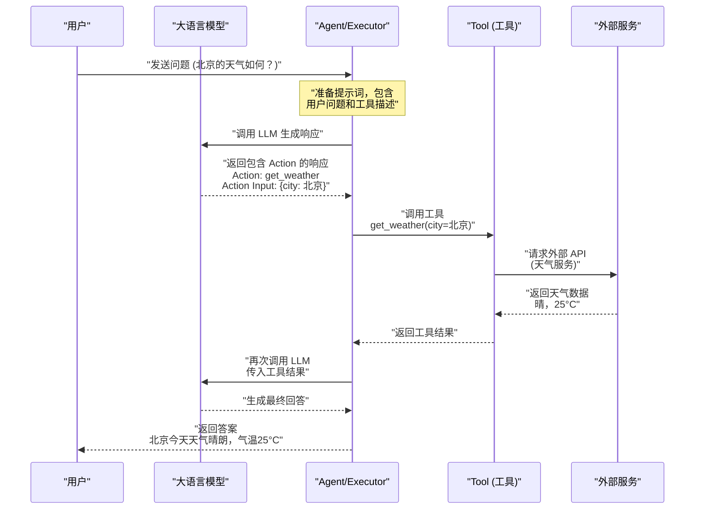
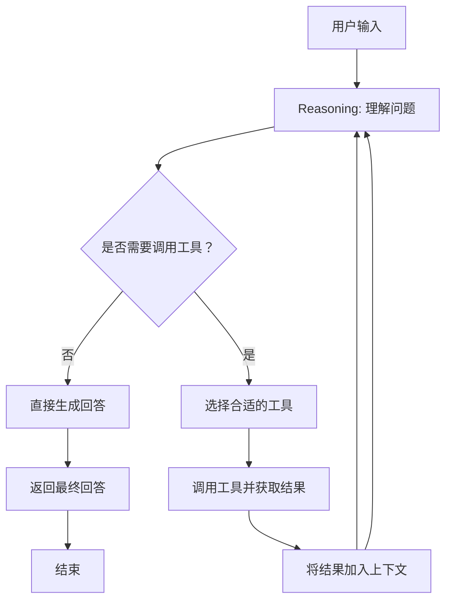
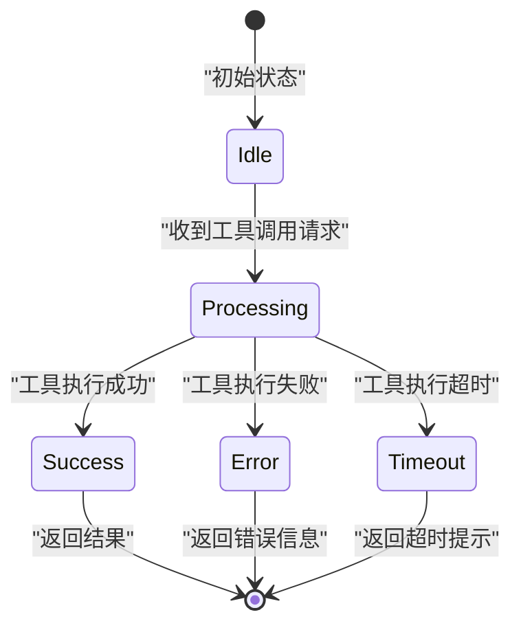

# 第七章：LangChain Tools（工具）

## 7.1 Tool 的概念与作用

### 7.1.1 什么是 Tool

Tool（工具）是 LangChain 框架中用于扩展 LLM 能力的核心组件。在默认情况下，大语言模型只能处理其训练数据中的知识和输入的文本内容。然而，现实世界中的任务往往需要：

- **获取实时信息**：搜索最新新闻、查询天气、获取股价
- **执行具体操作**：发送邮件、操作数据库、调用 API
- **进行复杂计算**：数学运算、数据分析、代码执行
- **访问外部知识库**：查询 Wikipedia、搜索文档、检索数据库

Tool 就是连接 LLM 与外部世界的桥梁，让模型能够「看到」并「操作」真实世界的数据和服务。

### 7.1.2 Tool 的核心作用

```
┌─────────────────────────────────────────────────────────────────┐
│                        User Query                                │
│                    "北京的天气怎么样？"                            │
└─────────────────────────────┬───────────────────────────────────┘
                              │
                              ▼
┌─────────────────────────────────────────────────────────────────┐
│                      Language Model                              │
│  - 理解用户问题                                                  │
│  - 判断是否需要调用工具                                          │
│  - 整合工具返回结果生成回答                                       │
└─────────────────────────────┬───────────────────────────────────┘
                              │
              ┌───────────────┴───────────────┐
              │                               │
              ▼                               ▼
┌─────────────────────────┐     ┌─────────────────────────┐
│     直接回答              │     │    调用 Tool             │
│   (简单知识性问题)         │     │  (需要外部数据)          │
└─────────────────────────┘     └─────────────────────────┘
                                        │
                                        ▼
                            ┌─────────────────────────┐
                            │    Weather API          │
                            │    返回实时天气数据       │
                            └─────────────────────────┘
```

### 7.1.3 Tool 的组成结构

一个标准的 Tool 通常包含以下三个部分：

| 组件 | 说明 | 示例 |
|------|------|------|
| **name** | 工具名称，唯一标识 | `google_search`, `calculator` |
| **description** | 工具描述，告诉 LLM 何时使用 | "用于搜索 Google 获取最新信息" |
| **parameters** | 输入参数规范 | `{"city": {"type": "string"}}` |
| **execute** | 执行逻辑 | 调用 API 并返回结果 |

## 7.2 使用 LangChain 内置 Tools

LangChain 提供了丰富的内置工具，涵盖搜索、计算、知识库查询等多个领域。

### 7.2.1 SerpAPI（Google 搜索）

SerpAPI 是一个付费 API 服务，提供 Google 搜索结果的结构化数据。使用前需要：

1. 注册 SerpAPI 账号获取 API Key：https://serpapi.com
2. 安装依赖包

```python
# 安装依赖
# pip install google-search-results

import os
from langchain_community.tools import SerpAPIWrapper

# 设置 API Key
os.environ["SERPAPI_API_KEY"] = "your_api_key_here"

# 初始化搜索工具
search = SerpAPIWrapper()

# 执行搜索
result = search.run("Python 3.12 新特性")
print(result)
```

### 7.2.2 Wikipedia（维基百科）

Wikipedia 工具可以搜索和获取 Wikipedia 文章内容。

```python
from langchain_community.tools import WikipediaQueryRun
from langchain_community.utilities import WikipediaAPIWrapper

# 初始化 Wikipedia 工具
wikipedia = WikipediaQueryRun(api_wrapper=WikipediaAPIWrapper())

# 搜索 Wikipedia
result = wikipedia.run("LangChain")
print(result)
```

### 7.2.3 Calculator（计算器）

Calculator 工具使用 LLMMathChain 提供数学表达式计算能力。

```python
from langchain_community.tools import Calculator

# 初始化计算器工具
calculator = Calculator()

# 执行数学计算
result = calculator.run("2^10 + sqrt(144)")
print(result)  # 输出: 1024 + 12.0 = 1036.0
```

### 7.2.4 工具组合使用

可以将多个工具组合成一个工具集：

```python
from langchain_core.tools import tool
from langchain_community.tools import WikipediaQueryRun, WikipediaAPIWrapper
from langchain_community.tools import SerpAPIWrapper
from langchain_community.tools import Calculator

# 创建工具列表
tools = [
    WikipediaQueryRun(api_wrapper=WikipediaAPIWrapper()),
    SerpAPIWrapper(),
    Calculator()
]

# 查看可用工具
for t in tools:
    print(f"Tool: {t.name}, Description: {t.description}")
```

## 7.3 创建自定义 Tool

### 7.3.1 使用 @tool 装饰器

LangChain 提供了 `@tool` 装饰器，可以将任意 Python 函数快速转换为 Tool。

```python
from langchain_core.tools import tool

@tool
def get_weather(city: str) -> str:
    """查询指定城市的天气情况

    Args:
        city: 城市名称，例如 "北京"、"Shanghai"

    Returns:
        天气描述字符串
    """
    # 模拟天气查询
    weather_data = {
        "北京": "晴，25°C，PM2.5 指数 45",
        "上海": "多云，28°C，PM2.5 指数 62",
        "广州": "雷阵雨，31°C，PM2.5 指数 35"
    }

    return weather_data.get(city, f"未找到 {city} 的天气数据")

# 查看工具信息
print(f"Tool Name: {get_weather.name}")
print(f"Tool Description: {get_weather.description}")
print(f"Tool Args: {get_weather.args}")

# 调用工具
result = get_weather.invoke({"city": "北京"})
print(result)
```

### 7.3.2 自定义 Tool 类

对于更复杂的需求，可以继承 `BaseTool` 类：

```python
from langchain_core.tools import BaseTool
from typing import Optional, Type
from pydantic import BaseModel, Field

# 定义工具输入模型
class WeatherInput(BaseModel):
    city: str = Field(description="要查询天气的城市名称")

# 定义天气工具类
class WeatherTool(BaseTool):
    name: str = "get_weather"
    description: str = "查询指定城市的当前天气信息"
    args_schema: Type[BaseModel] = WeatherInput

    def _run(self, city: str) -> str:
        """同步执行"""
        weather_data = {
            "北京": "晴，25°C，空气质量良好",
            "上海": "多云，28°C，可能有阵雨",
            "深圳": "晴，32°C，高温预警"
        }
        return weather_data.get(city, f"未找到 {city} 的天气数据")

    async def _arun(self, city: str) -> str:
        """异步执行"""
        return self._run(city)

# 使用工具
weather_tool = WeatherTool()
result = weather_tool.invoke({"city": "深圳"})
print(result)
```

### 7.3.3 完整示例：计算器工具

```python
from langchain_core.tools import tool
import math

@tool
def calculate(expression: str) -> str:
    """执行数学表达式计算

    支持的运算：加(+)、减(-)、乘(*)、除(/)、幂(^)、sqrt

    Args:
        expression: 数学表达式字符串，例如 "2+3*4" 或 "sqrt(16)"

    Returns:
        计算结果字符串

    Examples:
        calculate("2+3") -> "5.0"
        calculate("sqrt(144)") -> "12.0"
    """
    try:
        # 替换 Python 风格语法
        expr = expression.replace("^", "**")

        # 安全评估（仅允许数学运算）
        allowed_names = {
            "abs": abs,
            "round": round,
            "min": min,
            "max": max,
            "sqrt": math.sqrt,
            "pow": pow,
            "sin": math.sin,
            "cos": math.cos,
            "tan": math.tan,
            "log": math.log,
            "pi": math.pi,
            "e": math.e
        }

        # 使用 eval 计算（实际生产环境建议用更安全的方式）
        result = eval(expr, {"__builtins__": {}}, allowed_names)

        return f"计算结果: {expression} = {result}"
    except Exception as e:
        return f"计算错误: {str(e)}"

# 测试
print(calculate.invoke({"expression": "2^10 + sqrt(144)"}))
print(calculate.invoke({"expression": "sin(pi/2)"}))
```

## 7.4 Tool 的调用与返回处理

### 7.4.1 ToolCall 概念

ToolCall 是 LLM 生成的调用请求，包含：
- `name`: 要调用的工具名称
- `arguments`: 工具参数（JSON 格式）

```python
# ToolCall 示例结构
tool_call = {
    "name": "get_weather",
    "arguments": '{"city": "北京"}',
    "id": "call_abc123"
}
```

### 7.4.2 同步调用与异步调用

```python
# 同步调用
result = weather_tool.invoke({"city": "北京"})

# 批量调用
from langchain_core.tools import tool
from typing import List

@tool
def multiply(a: int, b: int) -> int:
    """两个数相乘"""
    return a * b

# 使用 batch_invoke 批量执行
results = multiply.batch([
    {"a": 3, "b": 4},
    {"a": 5, "b": 6},
    {"a": 7, "b": 8}
])
print(results)  # [12, 30, 56]
```

### 7.4.3 错误处理

```python
from langchain_core.tools import tool
from typing import Union

@tool
def safe_divide(a: float, b: float) -> str:
    """安全除法，避免除零错误"""
    try:
        if b == 0:
            return "错误: 除数不能为零"
        result = a / b
        return f"{a} / {b} = {result}"
    except Exception as e:
        return f"计算错误: {str(e)}"

# 正常情况
print(safe_divide.invoke({"a": 10, "b": 2}))

# 错误情况
print(safe_divide.invoke({"a": 10, "b": 0}))
```

## 7.5 Tool 在 Agent 中的使用

### 7.5.1 工具绑定到 Agent

```python
from langchain_openai import ChatOpenAI
from langchain_core.tools import tool
from langchain.agents import AgentExecutor, create_react_agent
from langchain import hub

# 定义工具
@tool
def get_weather(city: str) -> str:
    """查询城市天气"""
    weather_data = {
        "北京": "晴，25°C",
        "上海": "多云，28°C",
        "广州": "雷阵雨，31°C"
    }
    return weather_data.get(city, f"未找到 {city} 的天气数据")

@tool
def calculator(expression: str) -> str:
    """数学计算器"""
    try:
        result = eval(expression)
        return str(result)
    except:
        return "计算错误"

# 初始化工具列表
tools = [get_weather, calculator]

# 初始化 LLM
llm = ChatOpenAI(model="gpt-4", temperature=0)

# 从 Hub 加载提示模板
prompt = hub.pull("hwchase17/react")

# 创建 Agent
agent = create_react_agent(llm, tools, prompt)

# 创建 Agent 执行器
agent_executor = AgentExecutor(
    agent=agent,
    tools=tools,
    verbose=True,
    max_iterations=10
)

# 执行查询
result = agent_executor.invoke({
    "input": "北京现在的天气怎么样？另外帮我计算一下 256 * 128 等于多少？"
})

print(result["output"])
```

### 7.5.2 OpenAI Function Agent

对于支持 function calling 的模型，推荐使用 `create_openai_functions_agent`：

```python
from langchain_openai import ChatOpenAI
from langchain.agents import create_openai_functions_agent, AgentExecutor
from langchain import hub

# 初始化 LLM（需要支持 function calling）
llm = ChatOpenAI(model="gpt-4-turbo", temperature=0)

# 定义工具
@tool
def search_movie(movie_name: str) -> str:
    """搜索电影信息

    Args:
        movie_name: 电影名称
    """
    movies = {
        "流浪地球": "导演：郭帆，上映时间：2019年，票房：46.87亿",
        "你好，李焕英": "导演：贾玲，上映时间：2021年，票房：54.13亿"
    }
    return movies.get(movie_name, f"未找到电影: {movie_name}")

@tool
def get_rating(movie_name: str) -> str:
    """获取电影评分

    Args:
        movie_name: 电影名称
    """
    ratings = {
        "流浪地球": "豆瓣评分 8.5",
        "你好，李焕英": "豆瓣评分 7.9"
    }
    return ratings.get(movie_name, f"未找到电影: {movie_name} 的评分")

tools = [search_movie, get_rating]

# 使用 OpenAI Functions Agent
prompt = hub.pull("hwchase17/openai-functions")
agent = create_openai_functions_agent(llm, tools, prompt)
agent_executor = AgentExecutor(agent=agent, tools=tools, verbose=True)

# 执行查询
result = agent_executor.invoke({
    "input": "帮我查一下《流浪地球》的基本信息以及评分"
})

print(result["output"])
```

## 7.6 Tool 调用流程图

### 7.6.1 Tool 在 Agent 中的完整调用流程



### 7.6.2 ReAct 模式下的 Tool 调用流程



### 7.6.3 Tool 执行状态机



## 7.7 完整可运行的代码示例

### 7.7.1 综合示例：多功能助手 Agent

```python
"""
LangChain Tools 综合示例
创建一个多功能助手，能够回答问题、执行计算、搜索信息
"""

from langchain_core.tools import tool
from langchain_openai import ChatOpenAI
from langchain.agents import create_openai_functions_agent, AgentExecutor
from langchain import hub
from typing import Dict, List

# ============================================
# 第一部分：定义工具
# ============================================

@tool
def calculate(expression: str) -> str:
    """数学计算器

    执行各种数学运算，支持：
    - 基本运算: +, -, *, /
    - 幂运算: ** 或 ^
    - 常用函数: sqrt, sin, cos, log, abs, round

    Args:
        expression: 数学表达式，例如 "2+3*4" 或 "sqrt(144)"

    Returns:
        计算结果的字符串描述
    """
    import math

    try:
        # 替换语法
        expr = expression.replace("^", "**")

        # 定义允许的数学函数
        allowed = {
            "abs": abs, "round": round, "min": min, "max": max,
            "sqrt": math.sqrt, "pow": pow, "sin": math.sin,
            "cos": math.cos, "tan": math.tan, "log": math.log,
            "pi": math.pi, "e": math.e
        }

        result = eval(expr, {"__builtins__": {}}, allowed)
        return f"{expression} = {result}"
    except Exception as e:
        return f"计算错误: {str(e)}"


@tool
def get_weather(city: str) -> str:
    """查询城市天气

    提供指定城市的当前天气信息，包括温度和天气状况。

    Args:
        city: 城市名称，例如 "北京"、"上海"

    Returns:
        天气信息描述
    """
    weather_db: Dict[str, str] = {
        "北京": "晴，25°C，适合出行",
        "上海": "多云，28°C，局部地区有雨",
        "广州": "雷阵雨，31°C，注意防暑",
        "深圳": "晴，32°C，高温预警",
        "成都": "阴，24°C，适宜旅游",
        "杭州": "小雨，26°C，记得带伞"
    }

    return weather_db.get(city, f"未找到城市 {city} 的天气信息")


@tool
def search_knowledge(topic: str) -> str:
    """搜索知识库

    在内置知识库中搜索相关主题的信息。

    Args:
        topic: 要搜索的主题关键词

    Returns:
        相关的知识信息
    """
    knowledge_db: Dict[str, str] = {
        "python": "Python 是一种高级编程语言，由 Guido van Rossum 于 1991 年创建。",
        "langchain": "LangChain 是一个用于构建 LLM 应用的框架，提供了工具、链和代理等功能。",
        "人工智能": "人工智能（AI）是计算机科学的一个分支，致力于创造智能机器。",
        "机器学习": "机器学习是人工智能的一个子领域，专注于构建可以从数据学习的系统。"
    }

    # 简单模糊匹配
    for key, value in knowledge_db.items():
        if key in topic.lower():
            return f"关于 '{topic}': {value}"

    return f"未找到关于 '{topic}' 的相关信息"


# ============================================
# 第二部分：初始化 Agent
# ============================================

# 收集所有工具
tools = [calculate, get_weather, search_knowledge]

# 初始化 LLM（请替换为您自己的 API Key）
import os
os.environ["OPENAI_API_KEY"] = "your-api-key-here"

llm = ChatOpenAI(
    model="gpt-4-turbo",
    temperature=0,
    streaming=True
)

# 使用 OpenAI Functions Agent（推荐）
prompt = hub.pull("hwchase17/openai-functions")
agent = create_openai_functions_agent(llm, tools, prompt)

# 创建执行器
agent_executor = AgentExecutor(
    agent=agent,
    tools=tools,
    verbose=True,  # 打印详细执行过程
    max_iterations=10,
    handle_parsing_errors=True
)


# ============================================
# 第三部分：测试运行
# ============================================

if __name__ == "__main__":
    print("=" * 50)
    print("LangChain 多功能助手 Agent")
    print("=" * 50)

    # 测试问题列表
    test_questions = [
        "北京现在的天气怎么样？",
        "帮我计算一下 sqrt(144) 加上 10 的平方是多少？",
        "给我讲讲 LangChain 是什么？",
        "如果杭州的温度是26度并且下雨，计算一下 100 * 5 是多少？顺便告诉我杭州的天气。"
    ]

    for i, question in enumerate(test_questions, 1):
        print(f"\n{'=' * 50}")
        print(f"问题 {i}: {question}")
        print("=" * 50)

        try:
            result = agent_executor.invoke({"input": question})
            print(f"\n回答: {result['output']}")
        except Exception as e:
            print(f"执行出错: {str(e)}")

    print("\n" + "=" * 50)
    print("测试完成！")
    print("=" * 50)
```

### 7.7.2 输出示例

运行上述代码后，你将看到类似以下输出：

```
==================================================
问题 1: 北京现在的天气怎么样？
==================================================
[chain/start] [1] Entering Chain run 1 input: {'input': '北京现在的天气怎么样？'}
[chain/step] [1] Agent processing...
[tool/start] [1] Entering Tool run 1 tool: 'get_weather' tool input: '{"city": "北京"}'
[tool/end] [1] End Tool run 1 tool: 'get_weather' output: '晴，25°C，适合出行'
[chain/step] [1] Agent processing...
[chain/end] [1] End Chain run 1 output: '北京今天的天气晴朗，气温25°C，非常适合出行。'

回答: 北京今天的天气晴朗，气温25°C，非常适合出行。

==================================================
问题 2: 帮我计算一下 sqrt(144) 加上 10 的平方是多少？
==================================================
[chain/start] [1] Entering Chain run 1 input: {'input': '帮我计算一下 sqrt(144) 加上 10 的平方是多少？'}
[chain/step] [1] Agent processing...
[tool/start] [1] Entering Tool run 1 tool: 'calculate' tool input: '{"expression": "sqrt(144) + 10**2"}'
[tool/end] [1] End Tool run 1 tool: 'calculate' output: 'sqrt(144) + 10**2 = 124.0'
[chain/step] [1] Agent processing...
[chain/end] [1] End Chain run 1 output: 'sqrt(144) 加上 10 的平方等于 124。'

回答: sqrt(144) 加上 10 的平方等于 124。
```

## 7.8 小结

本章介绍了 LangChain 中 Tool（工具）的核心概念和使用方法：

| 知识点 | 内容 |
|--------|------|
| **Tool 概念** | Tool 是扩展 LLM 能力的桥梁，让模型能够获取实时信息、执行计算、操作外部系统 |
| **内置工具** | LangChain 提供了 SerpAPI、Wikipedia、Calculator 等常用工具 |
| **自定义 Tool** | 使用 `@tool` 装饰器或继承 `BaseTool` 类可以快速创建自定义工具 |
| **调用处理** | 支持同步调用、异步调用、批量调用和错误处理 |
| **Agent 集成** | 工具需要绑定到 Agent，由 Agent 的推理引擎决定何时调用 |
| **调用流程** | 用户输入 → LLM 推理 → 工具执行 → 结果整合 → 最终回答 |

### 关键要点

1. **工具描述很重要**：良好的 description 能帮助 LLM 准确判断何时使用该工具
2. **参数定义要清晰**：使用 Pydantic 模型明确定义输入参数
3. **错误处理不可少**：工具应该优雅地处理各种异常情况
4. **安全第一**：避免在工具中使用 eval 等可能带来安全风险的方式

### 延伸学习

- 深入了解 [LCEL (LangChain Expression Language)](https://python.langchain.com/docs/concepts/lcel) 如何链式调用工具
- 学习如何使用 ToolKit 管理多个相关工具
- 探索 Tool Binding 与 Function Calling 的高级用法

---

**下一章预告**：第八章将介绍 **Memory（记忆）** 模块，学习如何让 Agent 记住对话历史，实现多轮对话能力。
