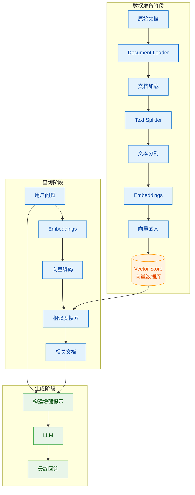
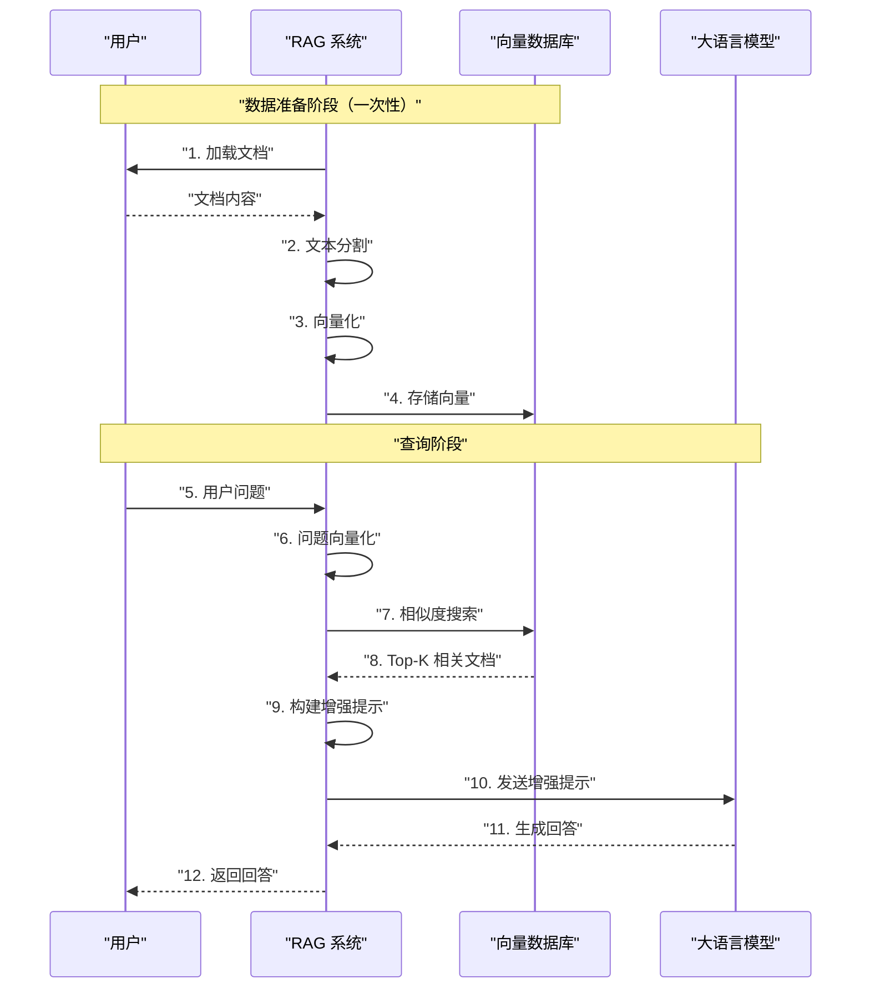

# 第8章：RAG（检索增强生成）

## 8.1 RAG 概念与原理

### 什么是 RAG？

RAG（Retrieval-Augmented Generation，检索增强生成）是一种结合了信息检索与大语言模型生成能力的技术架构。其核心思想是：当 LLM 需要回答问题时，先从外部知识库检索相关文档，然后将检索到的内容与问题一起提供给 LLM，从而生成更准确、更具事实依据的回答。

### 为什么需要 RAG？

1. **解决幻觉问题**：LLM 有时会生成看似合理但实际错误的内容，RAG 通过检索真实文档来约束生成内容
2. **知识时效性**：LLM 的知识有截止日期，RAG 可以接入最新知识库
3. **可解释性**：回答有据可查，可以追溯到具体文档
4. **成本效益**：相比微调大模型，RAG 成本更低、灵活性更高

### RAG 工作原理

```
用户问题 → 检索模块 → 相关文档 → 增强提示 → LLM → 最终回答
              ↓
         向量数据库
         (预先构建)
```

## 8.2 Document Loader（文档加载器）

文档加载器负责将各种格式的文档加载为 LangChain 统一格式。

### 8.2.1 TextLoader

用于加载纯文本文件。

```python
from langchain_community.document_loaders import TextLoader

# 加载单个文本文件
loader = TextLoader("document.txt", encoding="utf-8")
documents = loader.load()

# 加载多个文本文件
from langchain_community.document_loaders import DirectoryLoader

loader = DirectoryLoader(
    "./documents",
    glob="*.txt",
    loader_cls=TextLoader
)
documents = loader.load()
```

### 8.2.2 PDFLoader

用于加载 PDF 文档。

```python
from langchain_community.document_loaders import PyPDFLoader

# 加载单个 PDF
loader = PyPDFLoader("document.pdf")
pages = loader.load()

# 每个元素是一页
for page in pages:
    print(f"Page {page.metadata['page']}: {page.page_content[:100]}...")
```

### 8.2.3 WebBaseLoader

用于从网页加载内容。

```python
from langchain_community.document_loaders import WebBaseLoader

# 加载单个网页
loader = WebBaseLoader("https://example.com/article")
documents = loader.load()

# 批量加载多个网页
from langchain_community.document_loaders import WebBaseLoader

loader = WebBaseLoader([
    "https://example.com/article1",
    "https://example.com/article2"
])
documents = loader.load()
```

## 8.3 Text Splitter（文本分割器）

将长文档分割成小块，以便于检索和避免超过 LLM 的上下文窗口限制。

### 8.3.1 CharacterTextSplitter

按字符数分割文档。

```python
from langchain.text_splitter import CharacterTextSplitter

text_splitter = CharacterTextSplitter(
    separator="\n\n",      # 分隔符
    chunk_size=1000,        # 每个 chunk 的字符数
    chunk_overlap=200,      # 相邻 chunk 之间的重叠字符数
    length_function=len    # 计算长度的函数
)

# 分割文档
chunks = text_splitter.split_documents(documents)

for chunk in chunks:
    print(f"Chunk length: {len(chunk.page_content)}")
```

### 8.3.2 RecursiveCharacterTextSplitter

更智能的分割器，会尝试按段落、句子等递归分割，保持语义完整性。

```python
from langchain.text_splitter import RecursiveCharacterTextSplitter

text_splitter = RecursiveCharacterTextSplitter(
    separators=["\n\n", "\n", "。", "！", "？", " ", ""],  # 按优先级尝试的分隔符
    chunk_size=1000,
    chunk_overlap=200,
    length_function=len
)

chunks = text_splitter.split_documents(documents)

# 查看分割结果
for i, chunk in enumerate(chunks):
    print(f"Chunk {i}: {chunk.page_content[:100]}...")
```

## 8.4 Embeddings（嵌入）

将文本转换为向量，以便于语义搜索。

### 8.4.1 OpenAI Embeddings

使用 OpenAI 的嵌入模型。

```python
from langchain_openai import OpenAIEmbeddings

# 初始化 OpenAI Embeddings
embeddings = OpenAIEmbeddings(
    model="text-embedding-3-small",  # 可选: text-embedding-3-large
    api_key="your-api-key"
)

# 单个文本嵌入
query_embedding = embeddings.embed_query("什么是 RAG？")

# 批量文本嵌入
texts = ["文本1", "文本2", "文本3"]
embeddings_list = embeddings.embed_documents(texts)
```

### 8.4.2 本地 Embeddings

使用开源模型作为嵌入函数，避免 API 调用和费用。

```python
# 使用 HuggingFace 嵌入
from langchain_community.embeddings import HuggingFaceEmbeddings

embeddings = HuggingFaceEmbeddings(
    model_name="sentence-transformers/all-MiniLM-L6-v2",
    model_kwargs={'device': 'cpu'},
    encode_kwargs={'normalize_embeddings': True}
)

# 使用 Ollama 嵌入（本地运行）
from langchain_community.embeddings import OllamaEmbeddings

embeddings = OllamaEmbeddings(
    model="nomic-embed-text",  # 或其他支持的嵌入模型
    base_url="http://localhost:11434"
)
```

## 8.5 Vector Store（向量存储）

用于存储和检索向量。

### 8.5.1 Chroma

轻量级向量数据库，适合本地开发。

```python
# 安装: pip install chromadb

import chromadb
from langchain_community.vectorstores import Chroma
from langchain_openai import OpenAIEmbeddings

# 初始化
embeddings = OpenAIEmbeddings()

# 创建向量数据库
vectorstore = Chroma.from_documents(
    documents=chunks,           # 分割后的文档块
    embedding=embeddings,        # 嵌入函数
    persist_directory="./chroma_db"  # 持久化目录
)

# 保存到磁盘
vectorstore.persist()

# 或者从磁盘加载
vectorstore = Chroma(
    persist_directory="./chroma_db",
    embedding_function=embeddings
)

# 相似性搜索
results = vectorstore.similarity_search(
    query="RAG 的原理是什么？",
    k=3  # 返回前3个最相关的结果
)

for doc in results:
    print(doc.page_content)
```

### 8.5.2 FAISS

Facebook AI 开发的向量检索库，适合大规模数据。

```python
# 安装: pip install faiss-cpu (或 faiss-gpu)

from langchain_community.vectorstores import FAISS
from langchain_openai import OpenAIEmbeddings

# 初始化
embeddings = OpenAIEmbeddings()

# 创建 FAISS 向量数据库
db = FAISS.from_documents(
    documents=chunks,
    embedding=embeddings
)

# 保存到磁盘
db.save_local("faiss_index")

# 从磁盘加载
db = FAISS.load_local("faiss_index", embeddings)

# 相似性搜索
results = db.similarity_search("RAG 的优势有哪些？", k=3)

# 带分数的搜索
results_with_scores = db.similarity_search_with_score("RAG 的优势有哪些？", k=3)
for doc, score in results_with_scores:
    print(f"Score: {score}, Content: {doc.page_content[:100]}...")
```

## 8.6 Retriever 与 RetrievalQA Chain

### 8.6.1 Retriever

Retriever 负责根据查询检索相关文档。

```python
# 从 VectorStore 创建 Retriever
retriever = vectorstore.as_retriever(
    search_type="similarity",      # similarity, mmr, similarity_score_threshold
    search_kwargs={
        "k": 3,                    # 返回文档数量
        "score_threshold": 0.5     # 最小相似度分数（当使用 similarity_score_threshold 时）
    }
)

# 使用 MMR (Maximum Marginal Relevance) 减少相似结果
retriever = vectorstore.as_retriever(
    search_type="mmr",
    search_kwargs={
        "k": 3,
        "fetch_k": 20,             # 初始检索数量
        "lambda_mult": 0.5         # 多样性参数，0=最大多样性，1=最大相关性
    }
)

# 执行检索
results = retriever.get_relevant_documents("RAG 的工作原理是什么？")
```

### 8.6.2 RetrievalQA Chain

将检索和问答串联起来的完整链条。

```python
from langchain_openai import ChatOpenAI
from langchain.chains import RetrievalQA

# 初始化 LLM
llm = ChatOpenAI(
    model="gpt-4o",
    api_key="your-api-key",
    temperature=0
)

# 创建 RetrievalQA Chain
qa_chain = RetrievalQA.from_chain_type(
    llm=llm,
    chain_type="stuff",      # stuff, map_reduce, refine, map_rerank
    retriever=retriever,
    return_source_documents=True  # 返回源文档
)

# 执行问答
result = qa_chain({"query": "RAG 有哪些优势？"})

print("答案:", result["result"])
print("\n来源文档:")
for doc in result["source_documents"]:
    print(f"- {doc.page_content[:100]}...")
```

### 8.6.3 不同的 Chain Type

```python
# stuff: 将所有相关文档拼接到提示中（适合少量文档）
qa_chain = RetrievalQA.from_chain_type(
    llm=llm,
    chain_type="stuff",
    retriever=retriever
)

# map_reduce: 对每个文档分别生成答案，最后综合
qa_chain = RetrievalQA.from_chain_type(
    llm=llm,
    chain_type="map_reduce",
    retriever=retriever
)

# refine: 逐个文档迭代优化答案
qa_chain = RetrievalQA.from_chain_type(
    llm=llm,
    chain_type="refine",
    retriever=retriever
)
```

## 8.7 RAG 工作流程

### 完整 RAG 架构图



### RAG 检索-生成详细流程



## 8.8 完整可运行代码示例

### 示例：基于本地文档的 RAG 问答系统

```python
"""
RAG 完整示例：基于本地文档的问答系统
依赖安装:
    pip install langchain langchain-openai langchain-community
    pip install chromadb faiss-cpu
    pip install python-dotenv
"""

import os
from dotenv import load_dotenv

# 加载环境变量
load_dotenv()

# ============ 第一部分：数据准备 ============

from langchain_community.document_loaders import TextLoader
from langchain.text_splitter import RecursiveCharacterTextSplitter
from langchain_openai import OpenAIEmbeddings
from langchain_community.vectorstores import Chroma

# 1. 加载文档
loader = TextLoader("knowledge.txt", encoding="utf-8")
documents = loader.load()

# 2. 分割文档
text_splitter = RecursiveCharacterTextSplitter(
    chunk_size=500,
    chunk_overlap=50,
    length_function=len
)
chunks = text_splitter.split_documents(documents)

print(f"文档分割完成，共 {len(chunks)} 个 chunk")

# 3. 创建向量数据库
embeddings = OpenAIEmbeddings(model="text-embedding-3-small")

vectorstore = Chroma.from_documents(
    documents=chunks,
    embedding=embeddings,
    persist_directory="./chroma_db"
)

# 4. 创建检索器
retriever = vectorstore.as_retriever(
    search_type="similarity",
    search_kwargs={"k": 3}
)

# ============ 第二部分：问答 ============

from langchain_openai import ChatOpenAI
from langchain.chains import RetrievalQA

# 5. 初始化 LLM
llm = ChatOpenAI(
    model="gpt-4o",
    temperature=0
)

# 6. 创建 QA Chain
qa_chain = RetrievalQA.from_chain_type(
    llm=llm,
    chain_type="stuff",
    retriever=retriever,
    return_source_documents=True
)

# 7. 问答
questions = [
    "总结文档的主要内容",
    "文档中提到的关键概念有哪些？",
    "如何应用文档中的方法？"
]

for question in questions:
    print(f"\n问题: {question}")
    print("-" * 50)

    result = qa_chain({"query": question})

    print(f"答案: {result['result']}")
    print("\n参考来源:")
    for i, doc in enumerate(result["source_documents"], 1):
        print(f"  {i}. {doc.page_content[:100]}...")
```

### 示例：使用 FAISS + 本地 Embeddings

```python
"""
使用 FAISS 和本地 Embeddings 的 RAG 示例
依赖安装:
    pip install sentence-transformers
"""

from langchain_community.document_loaders import WebBaseLoader
from langchain.text_splitter import RecursiveCharacterTextSplitter
from langchain_community.embeddings import HuggingFaceEmbeddings
from langchain_community.vectorstores import FAISS
from langchain_openai import ChatOpenAI
from langchain.chains import RetrievalQA

# 1. 从网页加载文档
loader = WebBaseLoader("https://zh.wikipedia.org/wiki/%E6%A8%A1%E5%9E%8B%E8%AF%86%E5%88%AB")
documents = loader.load()

# 2. 分割文档
text_splitter = RecursiveCharacterTextSplitter(
    chunk_size=1000,
    chunk_overlap=200
)
chunks = text_splitter.split_documents(documents)

# 3. 使用本地 Embeddings
embeddings = HuggingFaceEmbeddings(
    model_name="sentence-transformers/all-MiniLM-L6-v2"
)

# 4. 创建 FAISS 向量数据库
db = FAISS.from_documents(chunks, embeddings)

# 5. 保存索引
db.save_local("faiss_wiki_index")

# 6. 加载已有索引
db = FAISS.load_local("faiss_wiki_index", embeddings)

# 7. 创建检索器
retriever = db.as_retriever(search_kwargs={"k": 3})

# 8. 创建 QA Chain
llm = ChatOpenAI(model="gpt-4o", temperature=0)

qa_chain = RetrievalQA.from_chain_type(
    llm=llm,
    chain_type="stuff",
    retriever=retriever
)

# 9. 问答
result = qa_chain({"query": "什么是模型识别？"})
print(result["result"])
```

## 8.9 最佳实践

### 8.9.1 文档处理建议

1. **选择合适的 chunk_size**：
   - 短回答问题：300-500 字符
   - 复杂分析任务：1000-2000 字符
   - 一般用途：500-1000 字符

2. **设置 chunk_overlap**：
   - 建议为 chunk_size 的 10-20%
   - 过小可能丢失上下文，过大会造成冗余

3. **选择合适的分割器**：
   - `RecursiveCharacterTextSplitter` 适合大多数场景
   - 对于代码，考虑使用 `Language` 特定的分割器

### 8.9.2 检索优化建议

1. **使用 MMR 提升多样性**：当检索结果过于相似时，使用 MMR 增加多样性

2. **调整 k 值**：根据实际场景调整返回文档数量

3. **添加元数据过滤**：在检索时过滤特定来源或时间的文档

### 8.9.3 向量存储选择

| 特性 | Chroma | FAISS |
|------|--------|-------|
| 部署难度 | 简单 | 中等 |
| 数据规模 | 小到中等 | 大规模 |
| 持久化 | 支持 | 支持 |
| 云部署 | 需额外配置 | 支持 |
| 相似度搜索 | 支持 | 支持 |

## 8.10 常见问题

**Q: 检索结果不相关怎么办？**
A: 检查 Embeddings 模型是否适合你的文档类型；尝试不同的 chunk_size；使用更精确的查询语句。

**Q: 如何处理中文文档？**
A: 使用支持中文的 Embeddings 模型，如 `sentence-transformers/paraphrase-multilingual-MiniLM-L12-v2`。

**Q: 如何提升检索速度？**
A: 使用 FAISS 的索引类型（如 IVF）；减少向量维度；使用更高效的 Embeddings 模型。

---

本章介绍了 RAG 的核心组件和工作流程。下一章我们将深入探讨如何在实际项目中优化 RAG 系统的性能。
