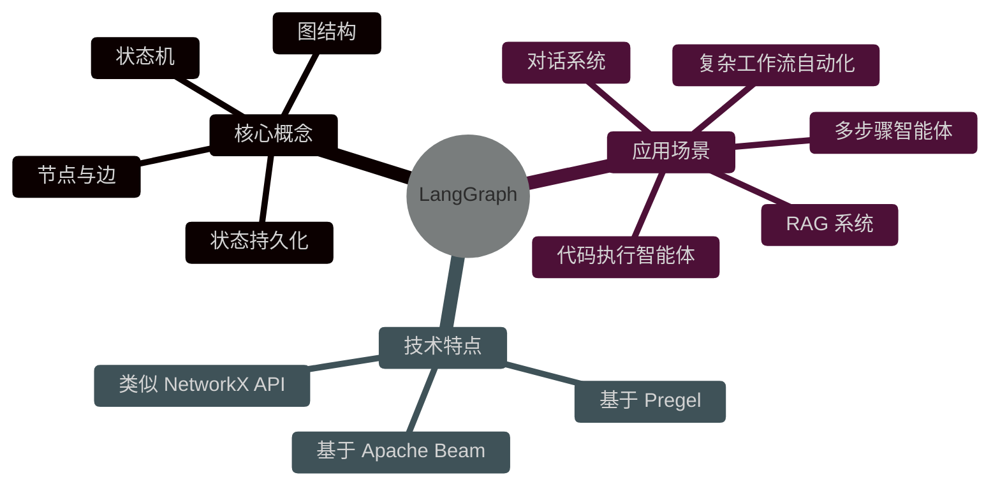
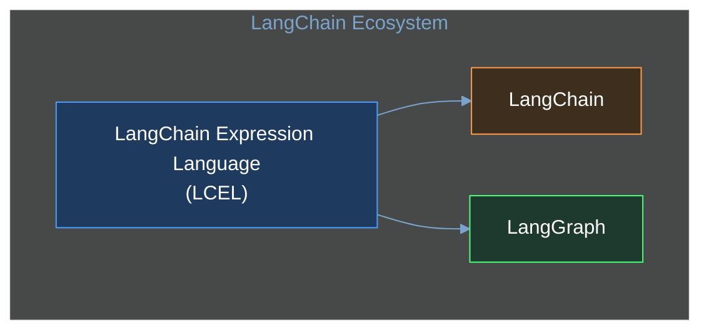
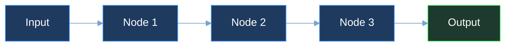
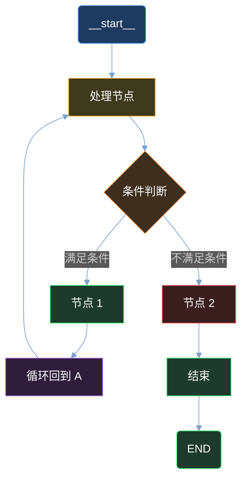
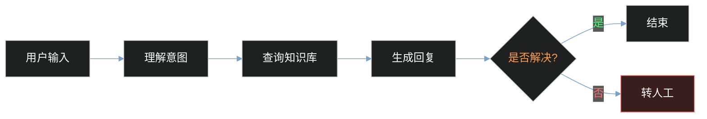
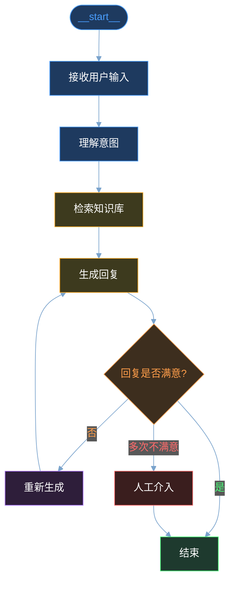
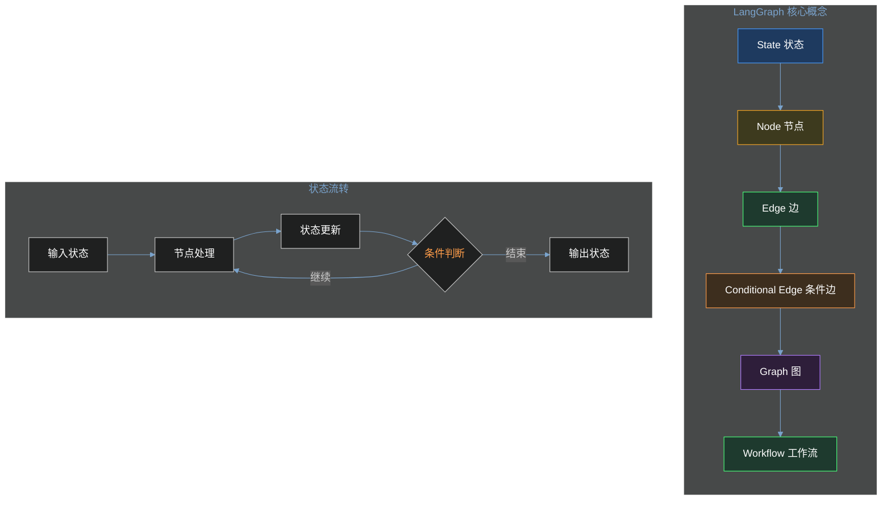

# 第01章：LangGraph 简介与环境搭建

## 1.1 LangGraph 是什么？

LangGraph 是由 LangChain 团队开发的一个**低层次编排框架（Low-level Orchestration Framework）**，用于构建**有状态的多参与者智能体（Stateful Multi-Actor Agents）**。

LangGraph 的核心目标是解决**复杂 AI 工作流**的编排问题，特别是那些需要：

- **持久化执行（Durable Execution）**：智能体能够从失败中恢复，在长时间运行后继续执行
- **人工介入（Human-in-the-Loop）**：在关键节点暂停，等待人工审核或输入
- **综合记忆（Comprehensive Memory）**：短期工作记忆 + 长期持久化记忆
- **图结构编排**：非线性的、条件分支的、可循环的工作流



### 1.1.1 LangGraph 解决的问题

传统 LLM 应用面临的核心挑战：

| 问题 | 描述 | LangGraph 解决方案 |
|------|------|-------------------|
| **状态丢失** | 每次请求独立，LLM 丢失上下文 | 内置状态管理，跨请求保持状态 |
| **线性流程** | Chain 只能顺序执行，无法分支/循环 | 图结构支持条件分支和循环 |
| **执行中断** | 长任务失败后需从头开始 | 支持从断点恢复执行 |
| **复杂编排** | 难以管理多智能体协作 | 原生支持多智能体编排 |
| **缺乏可视化** | 难以理解和调试复杂流程 | 与 LangSmith 集成提供可视化追踪 |

## 1.2 LangGraph vs LangChain vs LCEL

理解三者之间的关系对于选择合适的工具至关重要。

### 1.2.1 层级关系



### 1.2.2 详细对比

| 特性 | LangChain | LCEL | LangGraph |
|------|-----------|------|-----------|
| **抽象层次** | 高层 API | 低层协议 | 低层框架 |
| **流程结构** | Chain（线性） | Chain（线性/管道） | Graph（图结构） |
| **状态管理** | 有限 | 无 | 完整状态机 |
| **条件分支** | 有限支持 | 不支持 | 原生支持 |
| **循环结构** | 不支持 | 不支持 | 原生支持 |
| **人工介入** | 不支持 | 不支持 | 支持 |
| **执行持久化** | 不支持 | 不支持 | 支持 |
| **适用场景** | 简单 LLM 应用 | 快速原型开发 | 复杂智能体系统 |

### 1.2.3 代码对比示例

**LCEL 链（线性执行）**：

```python
# LCEL 只能线性执行
from langchain.prompts import ChatPromptTemplate
from langchain.schema import StrOutputParser
from langchain_openai import ChatOpenAI

prompt = ChatPromptTemplate.from_messages([
    ("system", "你是一个助手"),
    ("human", "{question}")
])

chain = prompt | ChatOpenAI() | StrOutputParser()
result = chain.invoke({"question": "你好"})
```

**LangGraph（图结构执行）**：

```python
# LangGraph 支持条件分支和状态管理
from langgraph.graph import StateGraph, END
from langgraph.graph import MessagesState

def should_continue(state: MessagesState) -> str:
    messages = state["messages"]
    last_message = messages[-1]
    if "结束" in last_message.content:
        return "end"
    return "continue"

def call_model(state: MessagesState):
    response = llm.invoke(state["messages"])
    return {"messages": [response]}

workflow = StateGraph(MessagesState)
workflow.add_node("model", call_model)
workflow.add_edge("__start__", "model")
workflow.add_conditional_edges("model", should_continue)
workflow.add_edge("model", END)

app = workflow.compile()
```

## 1.3 线性链 vs 图结构

这是 LangGraph 与传统 Chain 的本质区别。

### 1.3.1 线性链结构



**特点**：
- 单向流动，无分支
- 每个节点只执行一次
- 适合简单、确定性的任务
- 无法处理需要循环的场景

### 1.3.2 图结构（LangGraph）



**特点**：
- 支持条件分支（if-else）
- 支持循环（while/for）
- 支持并行执行
- 支持人工介入节点
- 状态持久化与恢复

### 1.3.3 实际应用对比

**场景：客服机器人**

**线性链实现**：



问题：无法重新理解意图，无法循环优化回复。

**LangGraph 实现**：



## 1.4 开发环境搭建

### 1.4.1 系统要求

| 要求 | 说明 |
|------|------|
| **Python 版本** | 3.10 或更高 |
| **操作系统** | Windows/macOS/Linux |
| **内存** | 推荐 8GB+ |
| **磁盘空间** | 至少 1GB 可用空间 |

### 1.4.2 创建虚拟环境

**使用 venv**：

```bash
# 创建虚拟环境
python -m venv langgraph-env

# 激活虚拟环境
# Windows
langgraph-env\Scripts\activate

# macOS/Linux
source langgraph-env/bin/activate
```

**使用 conda**：

```bash
# 创建虚拟环境
conda create -n langgraph-env python=3.11

# 激活虚拟环境
conda activate langgraph-env
```

### 1.4.3 安装依赖

```bash
# 基础安装
pip install -U langgraph

# 完整安装（包含常用依赖）
pip install -U langgraph[all]

# 指定版本的稳定安装
pip install langgraph==0.2.56
```

**常用依赖说明**：

| 依赖包 | 用途 |
|--------|------|
| `langgraph` | 核心框架 |
| `langchain-core` | LangChain 核心组件 |
| `langchain-openai` | OpenAI API 集成 |
| `langchain-anthropic` | Anthropic API 集成 |
| `langchain-community` | 社区集成组件 |
| `langsmith` | 可观测性和调试 |

### 1.4.4 验证安装

```python
import langgraph

print(f"LangGraph 版本: {langgraph.__version__}")

# 验证核心组件
from langgraph.graph import StateGraph, END, START
from langgraph.graph import MessagesState
print("核心组件导入成功!")
```

### 1.4.5 环境配置（可选）

创建 `config.py` 配置文件管理环境变量：

```python
# config.py
import os
from dotenv import load_dotenv

# 加载 .env 文件
load_dotenv()

# OpenAI 配置
OPENAI_API_KEY = os.getenv("OPENAI_API_KEY")
OPENAI_MODEL = os.getenv("OPENAI_MODEL", "gpt-4")

# LangSmith 配置（用于调试追踪）
LANGSMITH_API_KEY = os.getenv("LANGSMITH_API_KEY")
LANGSMITH_TRACING = os.getenv("LANGSMITH_TRACING", "false")

# 检查必要配置
def verify_config():
    """验证必要的环境配置"""
    if not OPENAI_API_KEY:
        raise ValueError("请设置 OPENAI_API_KEY 环境变量")
    print("环境配置验证通过!")

if __name__ == "__main__":
    verify_config()
```

## 1.5 第一个 LangGraph 程序

我们将创建一个简单的**对话状态机**，展示 LangGraph 的核心概念。

### 1.5.1 项目结构

```
my_first_langgraph/
├── config.py              # 配置文件
├── requirements.txt       # 依赖列表
└── main.py               # 主程序
```

### 1.5.2 完整代码示例

```python
"""
第一个 LangGraph 程序：简单的对话状态机
演示 LangGraph 的核心概念：节点、边、状态、条件分支
"""

import os
from dotenv import load_dotenv
from langgraph.graph import StateGraph, END, START, MessagesState
from langgraph.graph.message import add_messages
from langchain_openai import ChatOpenAI
from typing import TypedDict, Annotated

# 加载环境变量
load_dotenv()

# ==================== 类型定义 ====================

class AgentState(TypedDict):
    """自定义智能体状态"""
    messages: Annotated[list, add_messages]
    step_count: int
    should_continue: bool


# ==================== LLM 初始化 ====================

def create_llm():
    """创建 LLM 实例"""
    return ChatOpenAI(
        model="gpt-4",
        temperature=0.7,
        api_key=os.getenv("OPENAI_API_KEY")
    )


# ==================== 节点定义 ====================

def process_message(state: AgentState) -> AgentState:
    """
    处理消息的节点
    使用 LLM 生成回复
    """
    llm = create_llm()
    messages = state["messages"]

    # 调用 LLM
    response = llm.invoke(messages)

    # 更新状态
    return {
        "messages": [response],
        "step_count": state["step_count"] + 1,
        "should_continue": True
    }


def should_continue(state: AgentState) -> str:
    """
    条件判断函数
    决定下一步走向
    """
    messages = state["messages"]
    last_message = messages[-1]

    # 检查是否要求结束
    if "结束" in last_message.content or "bye" in last_message.content.lower():
        return "end"

    # 检查对话轮次（最多 5 轮）
    if state["step_count"] >= 5:
        return "end"

    return "continue"


def review_response(state: AgentState) -> AgentState:
    """
    审核节点（人工介入示例）
    在实际应用中，这里可以暂停等待人工审核
    """
    messages = state["messages"]
    last_message = messages[-1]

    # 模拟审核逻辑
    review_comment = f"\n[系统审核]: 回复已通过自动审核"

    # 添加审核备注
    reviewed_message = type(last_message)(
        content=last_message.content + review_comment,
        additional_kwargs=last_message.additional_kwargs
    )

    return {
        "messages": [reviewed_message],
        "step_count": state["step_count"],
        "should_continue": True
    }


# ==================== 图构建 ====================

def create_workflow():
    """
    创建工作流图
    """
    # 创建状态图
    workflow = StateGraph(AgentState)

    # 添加节点
    workflow.add_node("process", process_message)
    workflow.add_node("review", review_response)

    # 设置入口点
    workflow.add_edge(START, "process")

    # 添加条件边
    workflow.add_conditional_edges(
        "process",
        should_continue,
        {
            "continue": "review",
            "end": END
        }
    )

    # review 节点处理完后回到 process
    workflow.add_edge("review", "process")

    return workflow


def create_simple_workflow():
    """
    创建简化版工作流（入门示例）
    """
    # 创建状态图
    workflow = StateGraph(MessagesState)

    # 添加节点
    workflow.add_node("chat", process_message)

    # 设置边
    workflow.add_edge(START, "chat")
    workflow.add_conditional_edges(
        "chat",
        should_continue,
        {
            "continue": "chat",
            "end": END
        }
    )

    return workflow


# ==================== 主程序 ====================

def main():
    """主程序入口"""
    print("=" * 50)
    print("第一个 LangGraph 程序")
    print("=" * 50)

    # 创建 LLM
    llm = create_llm()
    print(f"使用模型: {llm.model_name}")
    print()

    # 创建工作流
    workflow = create_simple_workflow()
    app = workflow.compile()

    print("工作流图创建成功!")
    print("开始对话（输入 '结束' 退出）")
    print("-" * 50)

    # 对话循环
    while True:
        user_input = input("\n你: ")

        if user_input.lower() in ["结束", "bye", "quit", "exit"]:
            print("再见!")
            break

        # 调用工作流
        result = app.invoke({
            "messages": [("human", user_input)],
            "step_count": 0,
            "should_continue": True
        })

        # 输出回复
        last_message = result["messages"][-1]
        print(f"助手: {last_message.content}")

        # 检查是否达到最大轮次
        if result["step_count"] >= 5:
            print("\n已达到最大对话轮次，自动结束。")
            break


if __name__ == "__main__":
    main()
```

### 1.5.3 代码解析

#### 1.5.3.1 状态定义

```python
class AgentState(TypedDict):
    """自定义智能体状态"""
    messages: Annotated[list, add_messages]
    step_count: int
    should_continue: bool
```

- `TypedDict`：定义状态的结构化类型
- `Annotated[list, add_messages]`：带注释的类型，表示消息列表，支持消息合并
- `step_count`：对话轮次计数器
- `should_continue`：控制是否继续执行

#### 1.5.3.2 节点（Node）

```python
def process_message(state: AgentState) -> AgentState:
    """处理消息的节点"""
    llm = create_llm()
    response = llm.invoke(state["messages"])
    return {
        "messages": [response],
        "step_count": state["step_count"] + 1,
        "should_continue": True
    }
```

节点是图中的**处理单元**，接收当前状态，返回更新后的状态。

#### 1.5.3.3 边（Edge）

```python
workflow.add_edge(START, "process")  # 从开始到 process
workflow.add_edge("review", "process")  # 从 review 回到 process
```

边定义了节点之间的**连接关系**。

#### 1.5.3.4 条件边（Conditional Edge）

```python
workflow.add_conditional_edges(
    "process",
    should_continue,
    {
        "continue": "review",
        "end": END
    }
)
```

条件边根据**条件函数**的返回值决定下一步走向哪个节点。

#### 1.5.3.5 工作流编译

```python
workflow = create_simple_workflow()
app = workflow.compile()
```

编译后的 `app` 是一个可调用的对象，可以接收输入状态并执行图。

### 1.5.4 运行程序

```bash
cd my_first_langgraph
pip install -r requirements.txt
python main.py
```

**示例输出**：

```
==================================================
第一个 LangGraph 程序
==================================================
使用模型: gpt-4

工作流图创建成功!
开始对话（输入 '结束' 退出）
--------------------------------------------------

你: 你好
助手: 你好！有什么我可以帮助你的吗？

你: 给我讲个笑话
助手: 当然！为什么程序员总是弄错中秋节和万圣节？

因为 Oct 31 = Dec 25（十月三十一号等于十二月二十五号）

你: 不好笑
助手: 抱歉！让我想想更有趣的...

你: 结束
再见!
```

## 1.6 目录结构建议

对于实际项目，我们推荐以下目录结构：

### 1.6.1 中小型项目

```
langgraph_project/
├── src/
│   └── project_name/
│       ├── __init__.py
│       ├── config.py          # 配置管理
│       ├── state.py           # 状态定义
│       ├── nodes/
│       │   ├── __init__.py
│       │   ├── llm_node.py    # LLM 节点
│       │   └── tool_node.py   # 工具节点
│       ├── graph/
│       │   ├── __init__.py
│       │   └── workflow.py     # 工作流构建
│       └── main.py            # 入口文件
├── tests/
│   ├── __init__.py
│   ├── test_nodes.py
│   └── test_workflow.py
├── config/
│   └── .env.example
├── requirements.txt
├── pyproject.toml
└── README.md
```

### 1.6.2 大型/生产项目

```
langgraph_production/
├── src/
│   └── project_name/
│       ├── __init__.py
│       ├── config.py
│       ├── state/             # 状态相关
│       │   ├── __init__.py
│       │   ├── schemas.py      # Pydantic 模型
│       │   └── reducers.py     # 状态归约函数
│       ├── nodes/              # 节点定义
│       │   ├── __init__.py
│       │   ├── llm.py
│       │   ├── tools.py
│       │   ├── conditions.py   # 条件判断
│       │   └── human.py        # 人工介入
│       ├── graphs/             # 图定义
│       │   ├── __init__.py
│       │   ├── main_graph.py
│       │   └── subgraphs/
│       ├── checkpoints/        # 检查点配置
│       │   └── __init__.py
│       └── middleware/         # 中间件
├── tests/
│   ├── unit/
│   ├── integration/
│   └── e2e/
├── scripts/
│   ├── deploy.sh
│   └── migrate.py
├── config/
│   ├── development.env
│   ├── production.env
│   └── .env.example
├── docker/
│   └── Dockerfile
├── docs/
│   ├── architecture.md
│   └── api_reference.md
├── pyproject.toml
├── poetry.lock
└── README.md
```

### 1.6.3 requirements.txt 示例

```txt
# LangGraph 核心
langgraph>=0.2.0

# LangChain 相关
langchain-core>=0.3.0
langchain-openai>=0.2.0
langchain-community>=0.3.0

# 可观测性
langsmith>=0.1.0

# 环境管理
python-dotenv>=1.0.0

# 开发工具
pydantic>=2.0.0
pytest>=8.0.0
pytest-asyncio>=0.23.0
ruff>=0.4.0
mypy>=1.9.0

# 生产工具
redis>=5.0.0        # 状态存储（可选）
psycopg2-binary>=2.9.0  # PostgreSQL（可选）
```

## 1.7 核心概念总结



### 关键要点

1. **State（状态）**：在整个图执行过程中保持的数据结构
2. **Node（节点）**：执行特定任务的函数，接收状态并返回更新
3. **Edge（边）**：连接节点的路径
4. **Conditional Edge（条件边）**：根据状态动态决定下一个节点
5. **Graph（图）**：节点和边的集合，定义完整的工作流

## 1.8 下一步

在下一章中，我们将深入学习：

- **状态管理**：深入理解状态、归约函数（Reducer）
- **检查点（Checkpoint）**：实现状态持久化与恢复
- **人工介入（Human-in-the-Loop）**：中断与恢复执行
- **子图（Subgraph）**：模块化复杂工作流

---

**参考资源**：

- [LangGraph 官方文档](https://docs.langchain.com/oss/python/langgraph/overview)
- [LangGraph API 参考](https://reference.langchain.com/python/langgraph)
- [LangChain Academy - Intro to LangGraph](https://academy.langchain.com/courses/intro-to-langgraph)
