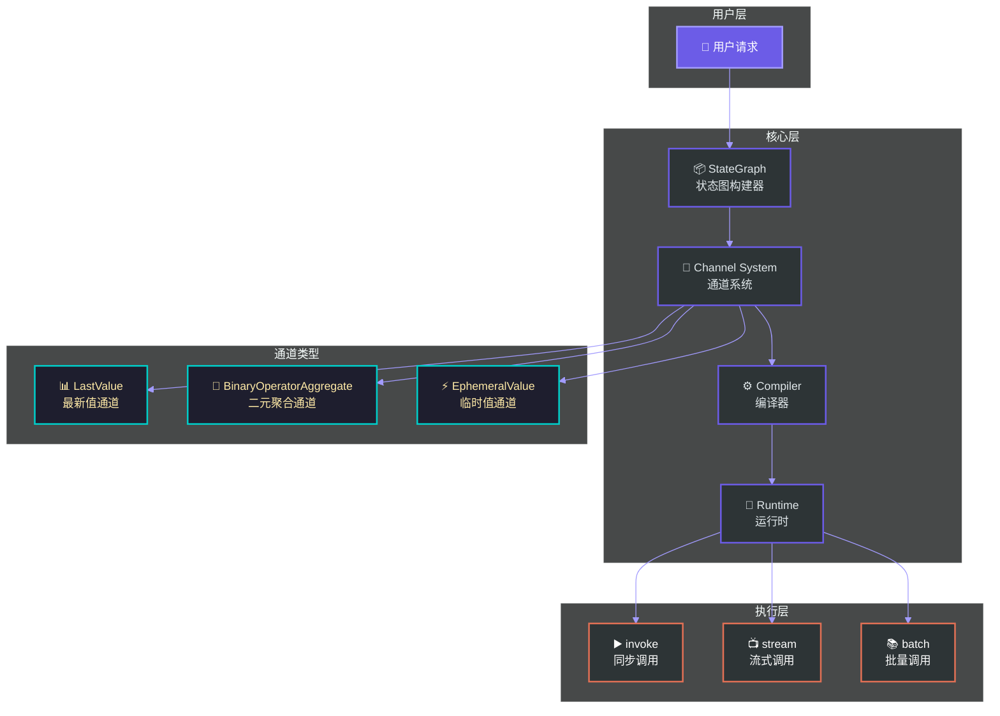
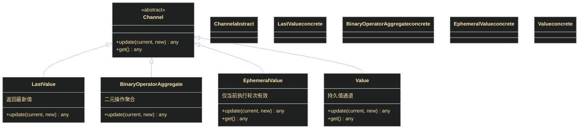
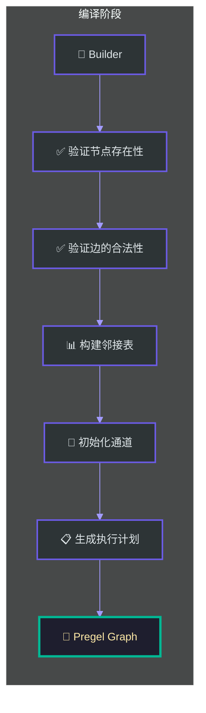
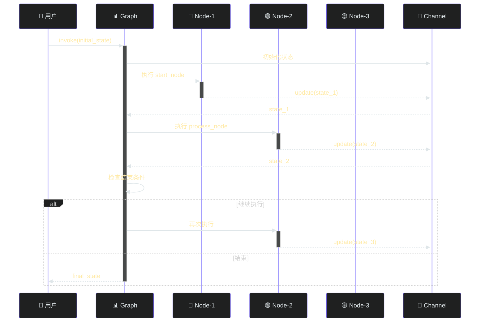
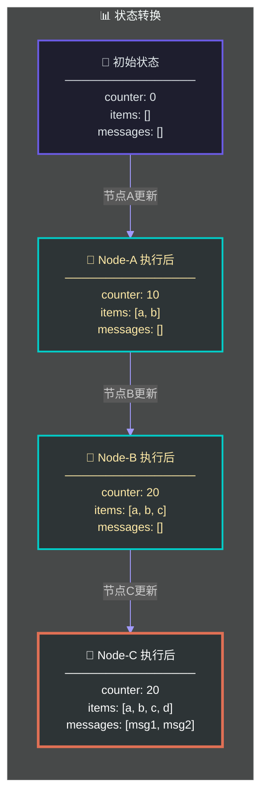
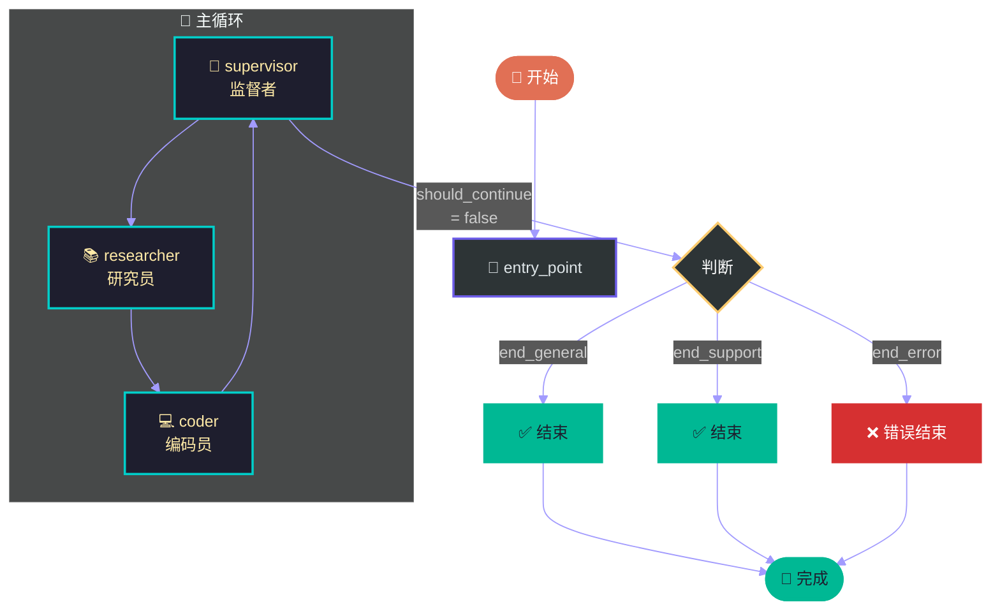
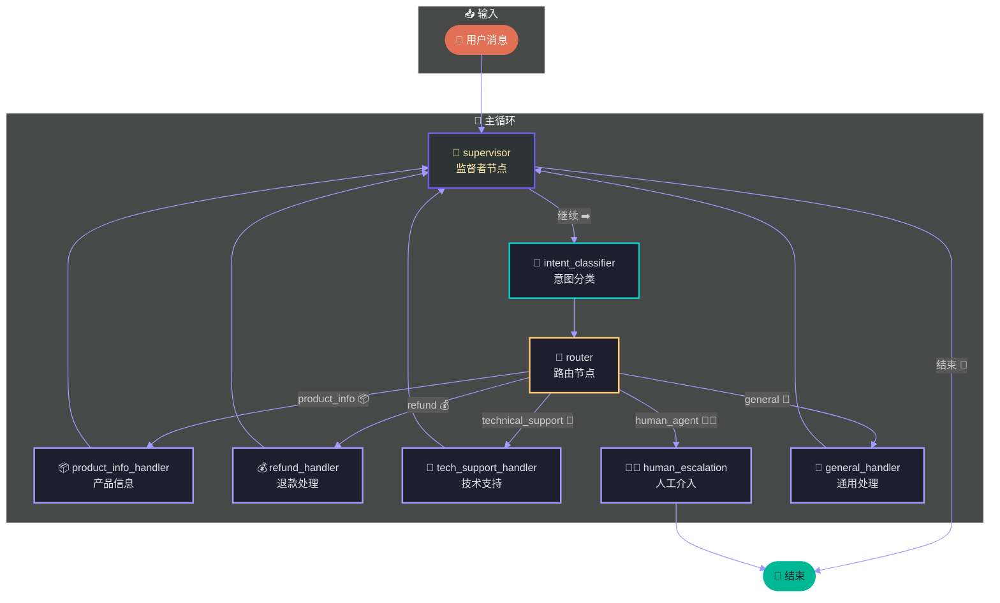
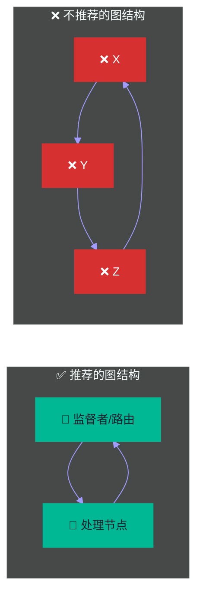

# 第二章：核心概念与架构

## 概述

LangGraph 是 LangChain 生态系统中用于构建**有状态、多角色应用程序**的核心库。与其他基于 DAG（有向无环图）的编排框架不同，LangGraph 采用**循环图**（Cyclic Graph）结构，使其能够处理复杂的多轮对话、工作流循环和递归场景。

本章将深入剖析 LangGraph 的核心概念，帮助你理解其工作原理，从而能够构建复杂的智能应用程序。

---

## 2.1 整体架构概览

在深入细节之前，让我们先了解 LangGraph 的整体架构：



---

## 2.2 StateGraph：核心构建类

### 2.2.1 什么是 StateGraph

`StateGraph` 是 LangGraph 中用于**定义图结构**的核心类。它允许你：

- 定义图中的**节点**（Nodes）
- 定义节点之间的**边**（Edges）
- 定义图的**状态模式**（State Schema）
- 配置**入口点**和**结束条件**

### 2.2.2 基础用法

```python
from langgraph.graph import StateGraph, END
from typing import TypedDict, Annotated
import operator

# 定义状态模式
class AgentState(TypedDict):
    """智能体状态的类型定义"""
    messages: Annotated[list, operator.add]  # 消息列表，使用 add 操作符聚合
    current_node: str                         # 当前执行的节点
    iteration: int                           # 迭代计数

# 创建图构建器
builder = StateGraph(AgentState)

# 添加节点
builder.add_node("supervisor", supervisor_node)
builder.add_node("researcher", researcher_node)
builder.add_node("coder", coder_node)

# 定义边
builder.add_edge("supervisor", "researcher", condition=should Research)
builder.add_edge("researcher", "coder", condition=should_code)
builder.add_edge("coder", "supervisor")

# 设置入口点和结束点
builder.set_entry_point("supervisor")
builder.add_conditional_edges(
    "supervisor",
    should_continue,
    {
        "continue": "researcher",
        "end": END
    }
)

# 编译图
graph = builder.compile()
```

### 2.2.3 状态模式详解

LangGraph 使用 **TypedDict** 来定义状态模式，支持两种特殊类型：

```python
from typing import TypedDict, Annotated, Union
import operator

class MyState(TypedDict):
    # 普通字段 - 会被覆盖
    name: str
    age: int

    # 使用 Annotated 的字段 - 支持聚合操作
    # operator.add: 新值追加到列表末尾
    messages: Annotated[list, operator.add]

    # operator.or_: 使用新值覆盖（取最后一个）
    # 这实际上是 LastValue 通道的等价实现
    context: Annotated[dict, operator.or_]

    # 自定义聚合函数
    scores: Annotated[list, custom_aggregate_function]
```

### 2.2.4 节点定义

节点是图中的**执行单元**，可以是任意 Python 函数：

```python
from langgraph.graph import StateGraph

def supervisor_node(state: AgentState) -> AgentState:
    """
    监督者节点：决定下一步执行什么

    Args:
        state: 当前图状态

    Returns:
        更新后的状态（增量更新）
    """
    messages = state["messages"]
    last_message = messages[-1] if messages else None

    # 决策逻辑
    if should_terminate(last_message):
        return {"current_node": "FINAL"}
    elif needs_research(last_message):
        return {"current_node": "researcher", "iteration": state.get("iteration", 0) + 1}
    elif needs_coding(last_message):
        return {"current_node": "coder", "iteration": state.get("iteration", 0) + 1}
    else:
        return {"current_node": "supervisor"}

# 节点也可以是异步函数
async def async_supervisor_node(state: AgentState) -> AgentState:
    """异步版本的监督者节点"""
    result = await some_async_operation(state)
    return {"result": result}
```

---

## 2.3 Channel 系统原理

Channel 是 LangGraph **状态管理的核心抽象**。每个状态字段都对应一个 Channel，Channel 决定了如何**更新**和**聚合**状态值。

### 2.3.1 Channel 类型概述



### 2.3.2 LastValue 通道

**原理**：始终返回最新写入的值，类似于变量赋值。

```python
# 等价的状态定义
class State(TypedDict):
    name: str  # 默认使用 LastValue 通道

# 内部实现机制
class LastValueChannel:
    """LastValue 通道实现"""

    def __init__(self):
        self.value = None

    def update(self, new_value):
        """新值覆盖旧值"""
        self.value = new_value
        return self.value

    def get(self):
        """获取当前值"""
        return self.value

# 使用示例
channel = LastValueChannel()
channel.update("Alice")  # None -> "Alice"
channel.update("Bob")    # "Alice" -> "Bob"
print(channel.get())     # "Bob"
```

### 2.3.3 BinaryOperatorAggregate 通道

**原理**：使用二元操作符将新值聚合到现有值上。

```python
import operator
from typing import Annotated

class AggregatorState(TypedDict):
    # 使用 operator.add 进行列表聚合
    # 每次更新都会将新列表追加到现有列表
    messages: Annotated[list, operator.add]

    # 使用 operator.and_ 进行交集
    shared_tags: Annotated[set, operator.and_]

    # 使用 operator.concat 进行字符串拼接
    conversation: Annotated[str, operator.concat]

# 内部实现
class BinaryOperatorAggregateChannel:
    """二元聚合通道实现"""

    def __init__(self, operator_func):
        self.operator = operator_func
        self.value = None

    def update(self, new_value):
        if self.value is None:
            self.value = new_value
        else:
            self.value = self.operator(self.value, new_value)
        return self.value

    def get(self):
        return self.value

# 使用示例
channel = BinaryOperatorAggregateChannel(operator.add)
channel.update([1, 2])      # None -> [1, 2]
channel.update([3, 4])      # [1, 2] -> [1, 2, 3, 4]
print(channel.get())        # [1, 2, 3, 4]
```

### 2.3.4 EphemeralValue 通道

**原理**：值仅在**当前执行轮次**内有效，执行完成后被清除。适用于临时状态、缓存等场景。

```python
from langgraph.channels.ephemeral import EphemeralValue

# 内部实现
class EphemeralValueChannel:
    """临时值通道 - 仅当前执行轮次有效"""

    def __init__(self):
        self.value = None

    def update(self, new_value):
        """设置临时值"""
        self.value = new_value

    def get(self):
        """获取临时值"""
        return self.value

    def clear(self):
        """清除临时值 - 每轮执行后自动调用"""
        self.value = None

# 使用场景
class StateWithTemp(TypedDict):
    # 临时计算结果，不保留到下一轮
    temp_result: Annotated[None, EphemeralValue[int]]
    # 持久状态
    final_result: str
```

### 2.3.5 Value 通道

**原理**：简单的持久值存储，支持任意类型的值。

```python
from langgraph.channels import Value

channel = Value(default="initial")
channel.update("new_value")
print(channel.get())  # "new_value"
```

### 2.3.6 Channel 与状态字段的映射

```python
from typing import TypedDict, Annotated
import operator

class ComplexState(TypedDict):
    # 普通字段 -> LastValue[str]
    name: str

    # Annotated 字段 -> 根据第二个参数确定
    # list + operator.add -> BinaryOperatorAggregate
    history: Annotated[list, operator.add]

    # set + operator.or_ -> BinaryOperatorAggregate (union)
    tags: Annotated[set, operator.or_]

    # None + 临时通道 -> EphemeralValue
    cache: Annotated[None, EphemeralValue[int]]

# 编译时的通道映射
"""
name       -> LastValue[str](default=None)
history    -> BinaryOperatorAggregate[list](combine: operator.add)
tags       -> BinaryOperatorAggregate[set](combine: operator.or_)
cache      -> EphemeralValue[int](default=None)
"""
```

---

## 2.4 图的编译过程

### 2.4.1 compile() 方法详解

`compile()` 是将图构建器转换为**可执行图**的关键步骤：

```python
from langgraph.graph import StateGraph, END

# 定义状态和节点
builder = StateGraph(AgentState)
builder.add_node("start", start_node)
builder.add_node("process", process_node)
builder.add_node("end", end_node)

# 设置流向
builder.add_edge("start", "process")
builder.add_conditional_edges(
    "process",
    decide_next,
    {
        "continue": "process",
        "end": END
    }
)
builder.set_entry_point("start")

# 编译 - 返回可执行的 Pregel 实例
graph = builder.compile(
    checkpoint=None,           # 检查点策略
    debug=False,                # 调试模式
    interrupt_before=None,      # 中断点（节点名列表）
    interrupt_after=None,       # 中断后（节点名列表）
)
```

### 2.4.2 编译内部流程



### 2.4.3 中断点配置

中断点允许在特定节点执行**暂停**，常用于**人机协作**场景：

```python
# 配置中断点 - 在执行指定节点之前暂停
graph = builder.compile(
    interrupt_before=["process", "approve"],
)

# 配置中断点 - 在执行指定节点之后暂停
graph = builder.compile(
    interrupt_after=["review"],
)

# 在执行过程中检查是否需要暂停
result = graph.invoke(initial_state)
# 执行在中断点暂停

# 人工审核后恢复执行
approved_state = {"user_approved": True}
result = graph.invoke(approved_state, resume=True)
```

---

## 2.5 图的执行模型

### 2.5.1 invoke：同步执行

`invoke` 是最基本的执行方式，**阻塞式**地执行整个图直到完成：

```python
from langgraph.graph import StateGraph, END

# 定义状态
class ChatState(TypedDict):
    messages: Annotated[list, operator.add]
    intent: str

# 定义节点
def classify_intent(state: ChatState) -> ChatState:
    """意图分类节点"""
    last_msg = state["messages"][-1]["content"]
    intent = detect_intent(last_msg)  # 假设这个函数存在
    return {"intent": intent}

def handle_general(state: ChatState) -> ChatState:
    """通用问答处理"""
    return {"messages": [{"role": "assistant", "content": "这是通用回答"}]}

def handle_support(state: ChatState) -> ChatState:
    """技术支持处理"""
    return {"messages": [{"role": "assistant", "content": "技术支持已启动"}]}

# 构建图
builder = StateGraph(ChatState)
builder.add_node("classify", classify_intent)
builder.add_node("handle_general", handle_general)
builder.add_node("handle_support", handle_support)

builder.set_entry_point("classify")
builder.add_conditional_edges(
    "classify",
    lambda state: state["intent"],
    {
        "general": "handle_general",
        "support": "handle_support",
        "unknown": END
    }
)

graph = builder.compile()

# 执行
result = graph.invoke({
    "messages": [{"role": "user", "content": "如何重置密码？"}],
    "intent": ""
})

print(result)
# {
#     "messages": [
#         {"role": "user", "content": "如何重置密码？"},
#         {"role": "assistant", "content": "技术支持已启动"}
#     ],
#     "intent": "support"
# }
```

### 2.5.2 stream：流式执行

`stream` 返回一个**生成器**，支持**流式输出**：

```python
# 流式执行 - 逐步获取每个节点的输出
for chunk in graph.stream({
    "messages": [{"role": "user", "content": "你好"}]
}):
    node_name = list(chunk.keys())[0]
    node_output = chunk[node_name]
    print(f"Node: {node_name}")
    print(f"Output: {node_output}")
    print("---")

# 输出示例
# Node: classify
# Output: {'intent': 'general'}
# ---
# Node: handle_general
# Output: {'messages': [{'role': 'assistant', 'content': '你好！有什么可以帮助你的？'}]}
# ---
```

### 2.5.3 batch：批量执行

`batch` 用于**并行执行多个输入**：

```python
# 批量执行
inputs = [
    {"messages": [{"role": "user", "content": "你好"}]},
    {"messages": [{"role": "user", "content": "天气如何"}]},
    {"messages": [{"role": "user", "content": "你是谁"}]},
]

# 并行执行
results = graph.batch(inputs)

for i, result in enumerate(results):
    print(f"Request {i}: {result['messages'][-1]['content']}")
```

### 2.5.4 执行流程详解



---

## 2.6 状态流转机制

### 2.6.1 状态更新语义

LangGraph 使用**增量更新**语义：

```python
class State(TypedDict):
    counter: int
    items: Annotated[list, operator.add]

# 假设初始状态
# state = {"counter": 0, "items": []}

# 节点返回
def node_a(state: State) -> State:
    return {
        "counter": 10,           # 覆盖: counter = 10
        "items": ["a", "b"]      # 追加: items = ["a", "b"]
    }

# 节点返回
def node_b(state: State) -> State:
    return {
        "counter": 20,           # 覆盖: counter = 20
        "items": ["c"]           # 追加: items = ["a", "b", "c"]
    }

# 执行 node_a -> node_b 后的最终状态
# {"counter": 20, "items": ["a", "b", "c"]}
```

### 2.6.2 状态流转可视化



### 2.6.3 多轮对话状态管理

```python
from typing import TypedDict, Annotated
import operator

class ConversationState(TypedDict):
    """多轮对话状态"""
    messages: Annotated[list, operator.add]  # 对话历史
    context: dict                             # 共享上下文
    current_node: str                         # 当前节点
    session_id: str                          # 会话ID

def llm_node(state: ConversationState) -> ConversationState:
    """LLM 处理节点"""
    messages = state["messages"]
    context = state["context"]

    # 调用 LLM
    response = llm.invoke(messages)

    return {
        "messages": [{"role": "assistant", "content": response}],
        "current_node": "user_input"
    }

def router_node(state: ConversationState) -> ConversationState:
    """路由节点"""
    last_msg = state["messages"][-1]["content"]

    if "退出" in last_msg or "再见" in last_msg:
        next_node = "__end__"
    elif "查询" in last_msg:
        next_node = "query_node"
    else:
        next_node = "llm_node"

    return {"current_node": next_node}

# 构建图
builder = StateGraph(ConversationState)
builder.add_node("llm", llm_node)
builder.add_node("router", router_node)

builder.set_entry_point("llm")
builder.add_edge("llm", "router")

builder.add_conditional_edges(
    "router",
    lambda state: state["current_node"],
    {
        "llm_node": "llm",
        "query_node": "query_node",
        "__end__": END
    }
)

# 编译并执行
graph = builder.compile()

# 多轮对话
state = {
    "messages": [{"role": "user", "content": "你好，我想查询订单"}],
    "context": {"user_id": "12345"},
    "current_node": "",
    "session_id": "session_001"
}

# 第一轮
result = graph.invoke(state)
print(f"第1轮: {result['messages'][-1]}")

# 第二轮 - 追加用户消息
result["messages"].append({"role": "user", "content": "订单号是 98765"})
result = graph.invoke(result)
print(f"第2轮: {result['messages'][-1]}")

# 第三轮 - 退出
result["messages"].append({"role": "user", "content": "谢谢，再见"})
result = graph.invoke(result)
```

---

## 2.7 入口点与结束点

### 2.7.1 入口点（Entry Point）

入口点是图**首次执行**的节点：

```python
builder = StateGraph(AgentState)

# 方式1：set_entry_point
builder.set_entry_point("supervisor")

# 方式2：在 add_edge 中隐式设置
builder.add_edge(None, "supervisor")  # None 表示入口

# 方式3：多个入口（第一个添加的边确定入口）
builder.add_edge(None, "init")  # 入口
builder.add_edge("init", "process")
```

### 2.7.2 结束点（Finish Point）

结束点定义了图的**终止条件**：

```python
from langgraph.graph import END

# 方式1：使用 END 结束点
builder.add_edge("final_node", END)

# 方式2：条件结束
builder.add_conditional_edges(
    "supervisor",
    decide_to_end,
    {
        "continue": "process",
        "end": END  # 结束执行
    }
)

# 方式3：多个结束条件
builder.add_conditional_edges(
    "router",
    {
        "end_general": END,
        "end_support": END,
        "continue": "process"
    }
)

# 方式4：动态结束判断
def should_end(state: AgentState) -> str:
    if state.get("finished"):
        return END
    return "continue"
```

### 2.7.3 入口点与结束点流程



---

## 2.8 完整架构示例

### 2.8.1 需求描述

构建一个**智能客服系统**，具备以下功能：

1. 用户可以咨询产品信息、退款政策、技术支持
2. 系统自动识别用户意图并路由到对应处理节点
3. 支持多轮对话，能够记忆上下文
4. 在特定节点支持人工介入
5. 完整的对话历史记录

### 2.8.2 完整代码实现

```python
from langgraph.graph import StateGraph, END
from typing import TypedDict, Annotated
import operator
from datetime import datetime

# ============================================
# 1. 定义状态模式
# ============================================

class CustomerSupportState(TypedDict):
    """客服系统状态定义"""

    # 对话历史 - 使用 add 聚合，新消息追加到末尾
    messages: Annotated[list, operator.add]

    # 用户信息 - 持久存储
    user_id: str
    user_name: str

    # 当前意图 - 每次覆盖
    intent: str

    # 共享上下文 - 合并更新
    context: Annotated[dict, operator.merge]

    # 迭代计数
    iteration: int

    # 当前节点
    current_node: str

    # 是否需要人工介入
    requires_human: bool

    # 会话元数据
    session_start: str
    last_updated: str


# ============================================
# 2. 定义节点
# ============================================

def intent_classifier(state: CustomerSupportState) -> CustomerSupportState:
    """
    意图分类节点
    分析用户消息，识别用户意图
    """
    messages = state["messages"]
    last_msg = messages[-1]["content"] if messages else ""

    # 简单的意图识别逻辑
    if any(keyword in last_msg for keyword in ["退款", "退货", "取消"]):
        intent = "refund"
    elif any(keyword in last_msg for keyword in ["产品", "功能", "规格", "价格"]):
        intent = "product_info"
    elif any(keyword in last_msg for keyword in ["故障", "报错", "无法", "问题"]):
        intent = "technical_support"
    elif any(keyword in last_msg for keyword in ["人工", "客服", "人工服务"]):
        intent = "human_agent"
    else:
        intent = "general"

    return {
        "intent": intent,
        "current_node": "router",
        "last_updated": datetime.now().isoformat()
    }


def router_node(state: CustomerSupportState) -> CustomerSupportState:
    """
    路由节点
    根据意图将请求路由到对应处理节点
    """
    intent = state["intent"]

    # 意图到节点的映射
    intent_map = {
        "refund": "refund_handler",
        "product_info": "product_info_handler",
        "technical_support": "tech_support_handler",
        "human_agent": "human_escalation",
        "general": "general_handler"
    }

    next_node = intent_map.get(intent, "general_handler")

    return {"current_node": next_node}


def product_info_handler(state: CustomerSupportState) -> CustomerSupportState:
    """产品信息处理节点"""
    response = "感谢您的咨询。关于产品信息，我可以为您提供详细资料..."

    # 更新上下文
    new_context = {
        "last_intent": "product_info",
        "info_requested_at": datetime.now().isoformat()
    }

    return {
        "messages": [{
            "role": "assistant",
            "content": response,
            "timestamp": datetime.now().isoformat()
        }],
        "context": new_context,
        "current_node": "supervisor"
    }


def refund_handler(state: CustomerSupportState) -> CustomerSupportState:
    """退款处理节点"""
    # 检查是否需要人工审核
    messages = state["messages"]
    last_msg = messages[-1]["content"] if messages else ""

    requires_human = "投诉" in last_msg or "严重" in last_msg

    if requires_human:
        response = "您的退款请求需要人工审核，我将为您转接人工客服..."
    else:
        response = "好的，我来帮您处理退款请求。请问您的订单号是多少？"

    return {
        "messages": [{
            "role": "assistant",
            "content": response,
            "timestamp": datetime.now().isoformat()
        }],
        "requires_human": requires_human,
        "current_node": "supervisor"
    }


def tech_support_handler(state: CustomerSupportState) -> CustomerSupportState:
    """技术支持节点"""
    response = "我来帮您排查技术问题。请问具体的错误信息是什么？"

    return {
        "messages": [{
            "role": "assistant",
            "content": response,
            "timestamp": datetime.now().isoformat()
        }],
        "context": {
            "support_ticket_created": True,
            "ticket_type": "technical"
        },
        "current_node": "supervisor"
    }


def human_escalation(state: CustomerSupportState) -> CustomerSupportState:
    """人工介入节点"""
    response = "正在为您转接人工客服，请稍候..."

    return {
        "messages": [{
            "role": "assistant",
            "content": response,
            "timestamp": datetime.now().isoformat()
        }],
        "requires_human": True,
        "current_node": "END"
    }


def general_handler(state: CustomerSupportState) -> CustomerSupportState:
    """通用处理节点"""
    response = "您好，请问有什么可以帮助您的？"

    return {
        "messages": [{
            "role": "assistant",
            "content": response,
            "timestamp": datetime.now().isoformat()
        }],
        "current_node": "supervisor"
    }


def supervisor_node(state: CustomerSupportState) -> CustomerSupportState:
    """
    监督者节点
    决定是否继续对话或结束
    """
    messages = state["messages"]
    iteration = state.get("iteration", 0)

    # 检查是否需要结束
    last_msg = messages[-1]["content"] if messages else ""
    should_end = any(word in last_msg for word in ["谢谢", "再见", "退出", "结束"])

    # 检查是否达到最大迭代
    if iteration >= 10:
        return {
            "current_node": "__end__",
            "context": {"max_iteration_reached": True}
        }

    if should_end:
        return {
            "current_node": "__end__",
            "messages": [{
                "role": "assistant",
                "content": "感谢您的咨询，再见！",
                "timestamp": datetime.now().isoformat()
            }]
        }

    # 继续对话
    return {
        "iteration": iteration + 1,
        "current_node": "intent_classifier"
    }


# ============================================
# 3. 构建图
# ============================================

def build_customer_support_graph():
    """构建客服系统图"""

    # 创建图构建器
    builder = StateGraph(CustomerSupportState)

    # 添加节点
    builder.add_node("supervisor", supervisor_node)
    builder.add_node("intent_classifier", intent_classifier)
    builder.add_node("router", router_node)
    builder.add_node("product_info_handler", product_info_handler)
    builder.add_node("refund_handler", refund_handler)
    builder.add_node("tech_support_handler", tech_support_handler)
    builder.add_node("human_escalation", human_escalation)
    builder.add_node("general_handler", general_handler)

    # 设置入口点
    builder.set_entry_point("supervisor")

    # 添加条件边（监督者 -> 意图分类器）
    builder.add_conditional_edges(
        "supervisor",
        lambda state: state["current_node"],
        {
            "intent_classifier": "intent_classifier",
            "__end__": END
        }
    )

    # 意图分类器 -> 路由
    builder.add_edge("intent_classifier", "router")

    # 路由 -> 各处理节点
    builder.add_conditional_edges(
        "router",
        lambda state: state["current_node"],
        {
            "product_info_handler": "product_info_handler",
            "refund_handler": "refund_handler",
            "tech_support_handler": "tech_support_handler",
            "human_escalation": "human_escalation",
            "general_handler": "general_handler"
        }
    )

    # 所有处理节点 -> 监督者
    for handler in ["product_info_handler", "refund_handler",
                    "tech_support_handler", "human_escalation",
                    "general_handler"]:
        builder.add_edge(handler, "supervisor")

    # 编译图
    return builder.compile(
        debug=False,
        interrupt_after=["human_escalation"]  # 人工介入前中断
    )


# ============================================
# 4. 执行图
# ============================================

if __name__ == "__main__":
    # 构建图
    graph = build_customer_support_graph()

    # 初始化状态
    initial_state = {
        "messages": [{
            "role": "user",
            "content": "我想了解一下产品的价格"
        }],
        "user_id": "user_12345",
        "user_name": "张三",
        "intent": "",
        "context": {},
        "iteration": 0,
        "current_node": "",
        "requires_human": False,
        "session_start": datetime.now().isoformat(),
        "last_updated": datetime.now().isoformat()
    }

    # 执行
    print("=" * 50)
    print("开始执行客服系统")
    print("=" * 50)

    result = graph.invoke(initial_state)

    print("\n最终状态:")
    print(f"- 当前节点: {result['current_node']}")
    print(f"- 迭代次数: {result['iteration']}")
    print(f"- 消息数量: {len(result['messages'])}")

    print("\n对话历史:")
    for msg in result["messages"]:
        print(f"  [{msg['role']}]: {msg['content']}")
```

### 2.8.3 架构图



### 2.8.4 执行示例

```
==================================================
开始执行客服系统
==================================================

第1轮 - supervisor:
  输入: 用户: 我想了解一下产品的价格
  决策: 继续 -> intent_classifier

第2轮 - intent_classifier:
  分析: 产品信息相关
  输出: intent = "product_info"

第3轮 - router:
  路由: product_info -> product_info_handler

第4轮 - product_info_handler:
  响应: 感谢您的咨询。关于产品信息，我可以为您提供详细资料...

第5轮 - supervisor:
  决策: 继续 -> intent_classifier

[继续多轮对话...]

最终状态:
- 当前节点: __end__
- 迭代次数: 3
- 消息数量: 6

对话历史:
  [user]: 我想了解一下产品的价格
  [assistant]: 感谢您的咨询。关于产品信息，我可以为您提供详细资料...
  [user]: 谢谢，再见
  [assistant]: 感谢您的咨询，再见！
```

---

## 2.9 最佳实践

### 2.9.1 状态设计原则

1. **最小化持久状态**：只保存必要的历史数据
2. **合理使用聚合操作**：
   - `operator.add` 用于消息历史
   - `operator.merge` 用于上下文字典
   - 默认 `LastValue` 用于配置类数据
3. **避免状态膨胀**：定期清理不必要的历史数据

### 2.9.2 节点设计原则

```python
# 好的实践：节点返回增量更新
def good_node(state: State) -> State:
    return {"field": "new_value"}  # 只返回变化的字段

# 不好的实践：返回完整状态
def bad_node(state: State) -> State:
    return state  # 不必要地传递整个状态
```

### 2.9.3 图结构设计



---

## 2.10 本章小结

本章深入剖析了 LangGraph 的核心概念与架构：

| 概念 | 作用 | 关键点 |
|------|------|--------|
| **StateGraph** | 图结构构建器 | 定义节点、边、状态模式 |
| **Channel** | 状态管理单元 | LastValue、BinaryOperatorAggregate、EphemeralValue |
| **compile()** | 图编译 | 验证、初始化、执行计划生成 |
| **invoke/stream** | 执行方式 | 同步、流式、批量 |
| **状态流转** | 数据流控制 | 增量更新语义 |
| **入口/结束点** | 执行边界 | 条件结束、中断点 |

掌握这些核心概念后，你将能够构建复杂的、多轮交互的智能应用程序。在下一章中，我们将学习**LangGraph 的高级特性**，包括并行执行、错误处理、检查point等。

---

## 参考资料

- [LangGraph 官方文档](https://langchain-ai.github.io/langgraph/)
- [LangGraph GitHub 仓库](https://github.com/langchain-ai/langgraph)
- [LangChain 官方文档](https://python.langchain.com/docs/langgraph)
