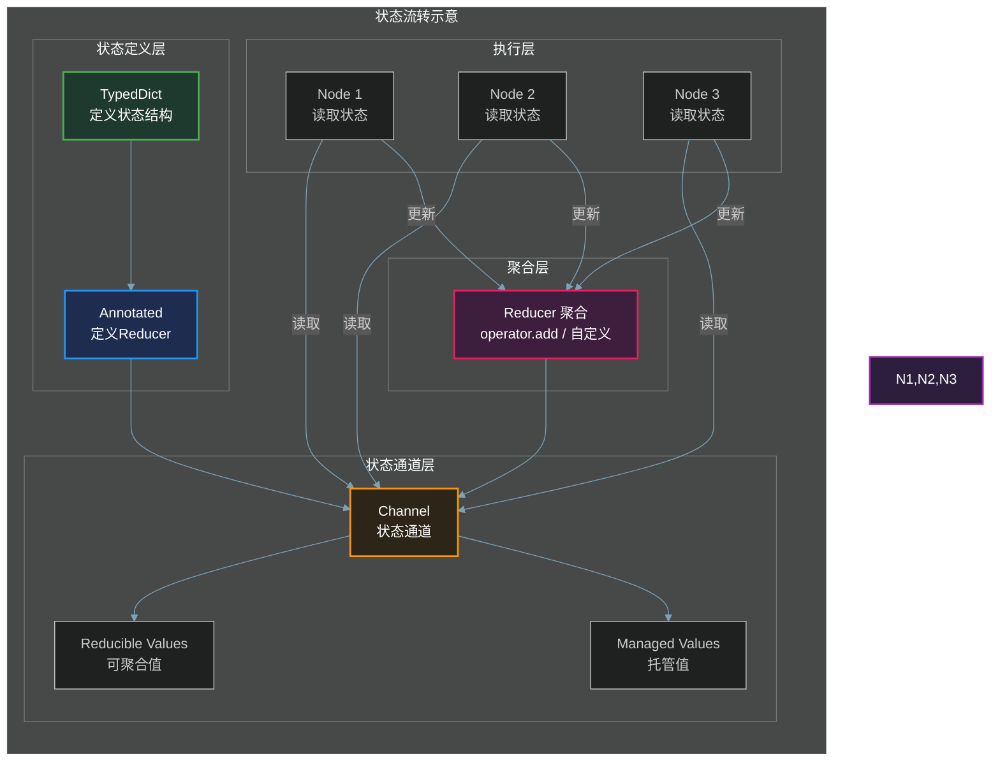
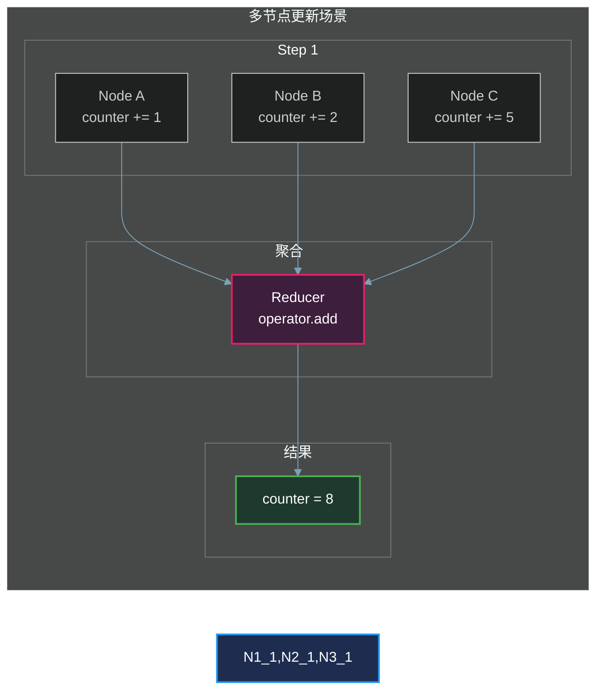
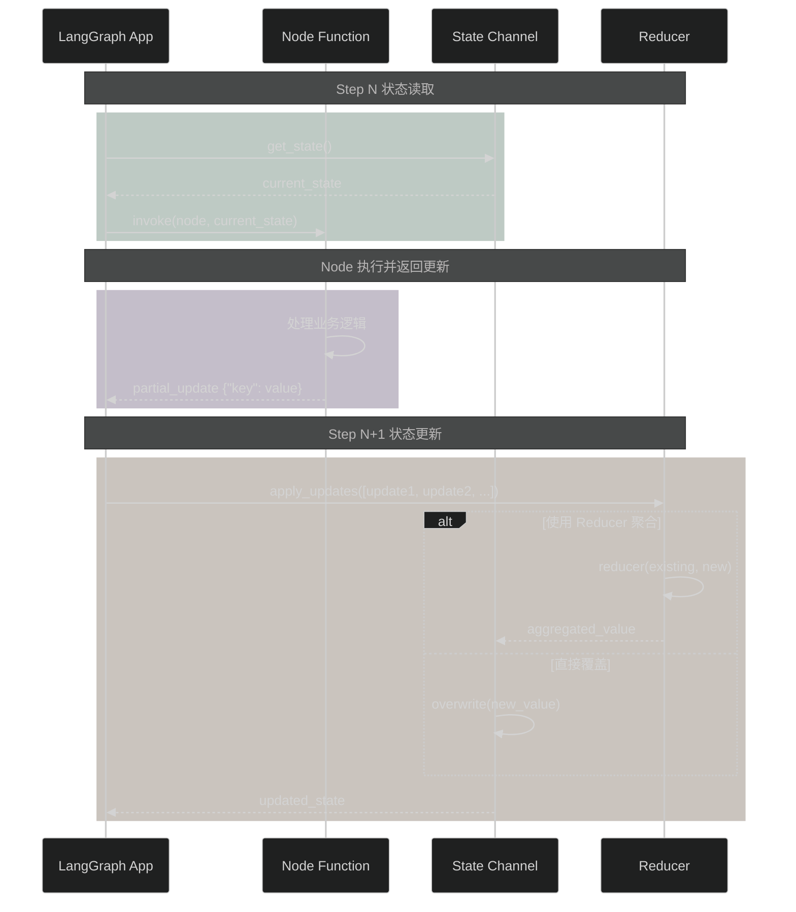
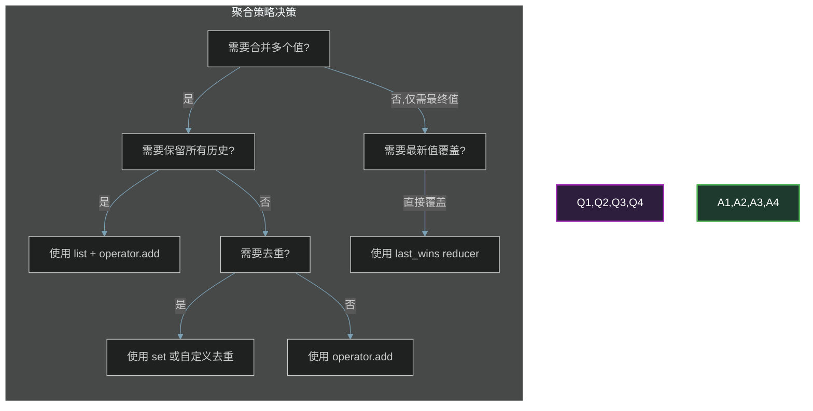
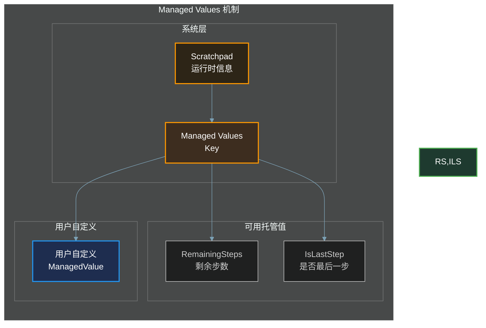
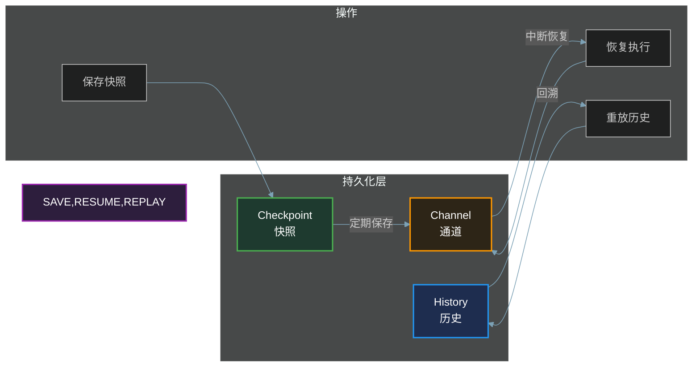
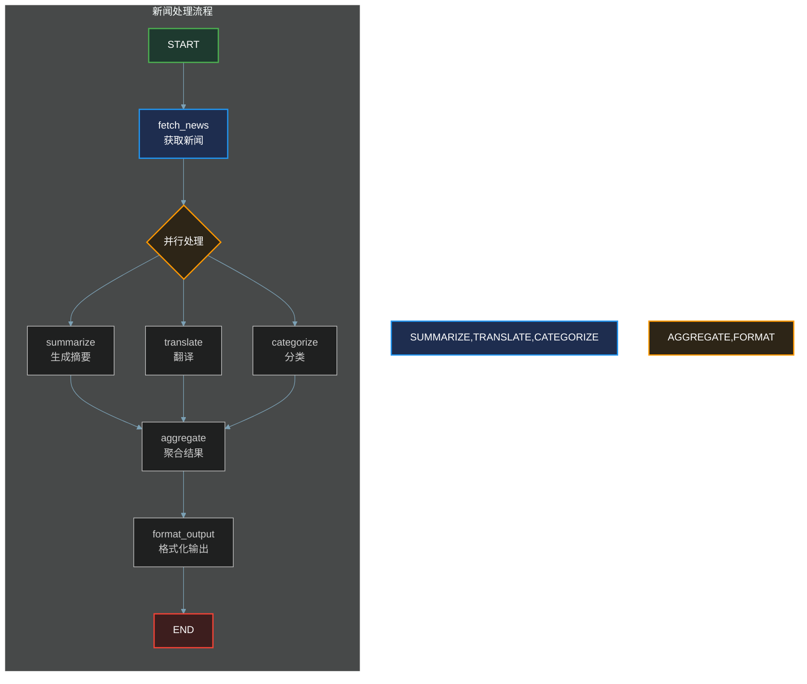
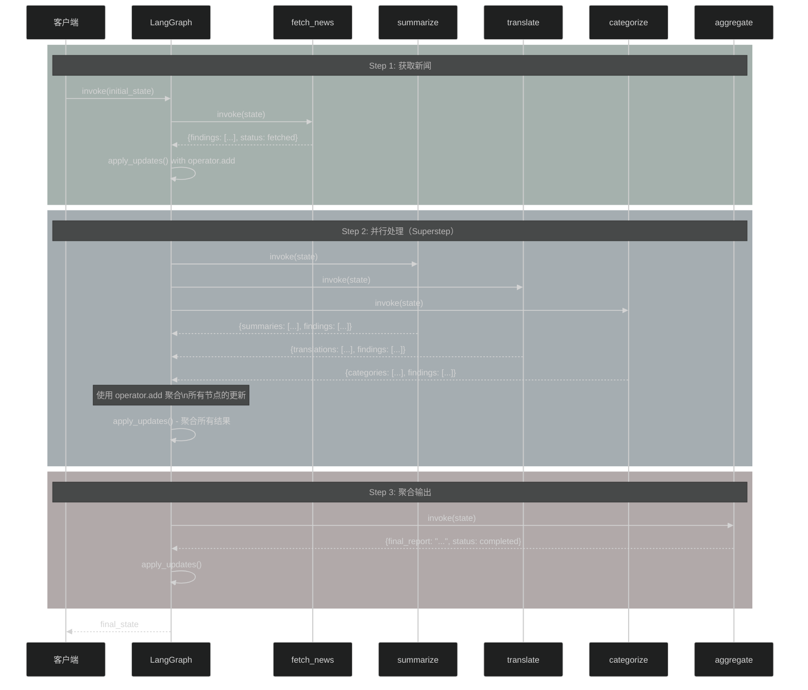
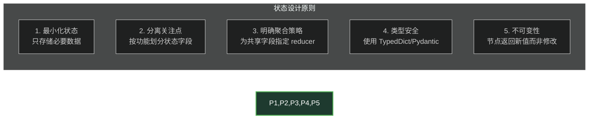

# 第三章：状态管理

## 3.1 概述

在 LangGraph 中，**状态（State）** 是整个图执行的核心数据结构。每个节点（Node）通过读取和写入共享状态来进行通信和协作。状态管理是 LangGraph 最核心的概念之一，它决定了：

- 如何定义状态的结构
- 如何在节点间传递和聚合数据
- 如何处理并发更新
- 如何实现持久化和恢复



## 3.2 TypedDict 定义状态模式

### 3.2.1 基础状态定义

使用 `TypedDict` 是定义 LangGraph 状态的标准方式。它提供了类型提示，使代码更具可读性和可维护性。

```python
from typing import TypedDict
from langgraph.graph import StateGraph, START, END

class State(TypedDict):
    """定义一个简单的状态"""
    user_input: str
    response: str
    turn_count: int

def process_node(state: State) -> dict:
    """处理节点 - 返回部分状态更新"""
    return {
        "response": f"收到: {state['user_input']}",
        "turn_count": state["turn_count"] + 1
    }

builder = StateGraph(State)
builder.add_node("process", process_node)
builder.add_edge(START, "process")
builder.add_edge("process", END)
app = builder.compile()

result = app.invoke({
    "user_input": "你好",
    "response": "",
    "turn_count": 0
})
# result = {"user_input": "你好", "response": "收到: 你好", "turn_count": 1}
```

### 3.2.2 状态类型注解

LangGraph 支持丰富的类型注解：

```python
from typing import TypedDict, Optional, List, Dict, Any
from typing_extensions import NotRequired, Required, Annotated

class ComplexState(TypedDict, total=False):
    """total=False 表示所有字段都是可选的"""
    
    # Required 字段表示必须提供
    required_field: Required[str]
    
    # NotRequired 字段表示可选
    optional_field: NotRequired[int]
    
    # 带默认值的字段
    with_default: str  # 有默认值，可选
    
    # 列表类型
    items: List[str]
    
    # 字典类型
    metadata: Dict[str, Any]
    
    # Annotated 用于添加 reducer 等元数据
    counter: Annotated[int, lambda a, b: a + b]
```

### 3.2.3 Pydantic 模型作为状态

除了 TypedDict，LangGraph 还支持使用 Pydantic 模型定义状态：

```python
from pydantic import BaseModel, Field
from langgraph.graph import StateGraph, START, END

class State(BaseModel):
    """使用 Pydantic 模型定义状态"""
    user_input: str = Field(default="")
    response: str = Field(default="")
    turn_count: int = Field(default=0)

def process_node(state: State) -> dict:
    return {
        "response": f"收到: {state.user_input}",
        "turn_count": state.turn_count + 1
    }

builder = StateGraph(State)
builder.add_node("process", process_node)
builder.add_edge(START, "process")
builder.add_edge("process", END)
app = builder.compile()
```

## 3.3 Annotated 与 Reducer 机制

### 3.3.1 为什么需要 Reducer

当多个节点可能同时更新同一个状态字段时，我们需要一种机制来**聚合**这些更新。这就是 Reducer 的作用。



### 3.3.2 使用 operator.add 作为 Reducer

最常见的 Reducer 是 `operator.add`，用于累加操作：

```python
import operator
from typing import Annotated, TypedDict
from langgraph.graph import StateGraph, START, END

class State(TypedDict):
    """状态定义，使用 Annotated 指定 reducer"""
    messages: Annotated[list, operator.add]  # 列表合并
    counter: Annotated[int, operator.add]    # 整数累加
    score: Annotated[float, operator.add]    # 浮点数累加

def node_a(state: State) -> dict:
    """节点A：添加一条消息，计数器+1"""
    return {
        "messages": ["消息A"],
        "counter": 1,
        "score": 10.5
    }

def node_b(state: State) -> dict:
    """节点B：添加一条消息，计数器+2"""
    return {
        "messages": ["消息B"],
        "counter": 2,
        "score": 20.5
    }

def node_c(state: State) -> dict:
    """节点C：添加一条消息，计数器+5"""
    return {
        "messages": ["消息C"],
        "counter": 5,
        "score": 15.0
    }

builder = StateGraph(State)
builder.add_node("a", node_a)
builder.add_node("b", node_b)
builder.add_node("c", node_c)
builder.add_edge(START, "a")
builder.add_edge("a", "b")
builder.add_edge("b", "c")
builder.add_edge("c", END)
app = builder.compile()

result = app.invoke({
    "messages": [],
    "counter": 0,
    "score": 0.0
})

# result = {
#     "messages": ["消息A", "消息B", "消息C"],
#     "counter": 8,      # 1 + 2 + 5 = 8
#     "score": 46.0      # 10.5 + 20.5 + 15.0 = 46.0
# }
```

### 3.3.3 自定义 Reducer

对于复杂的聚合逻辑，可以定义自定义 Reducer。Reducer 函数的签名必须是 `(Value, Value) -> Value`：

```python
from typing import Annotated, TypedDict

def unique_concat(a: list, b: list) -> list:
    """去重合并列表"""
    return list(set(a + b))

def merge_dicts(a: dict, b: dict) -> dict:
    """合并两个字典，值冲突时取后者"""
    return {**a, **b}

def max_value(a: int, b: int) -> int:
    """取最大值"""
    return max(a, b)

def last_wins(a: str, b: str) -> str:
    """后入为主，后续值覆盖前面的值"""
    return b

class State(TypedDict):
    """使用自定义 Reducer 的状态"""
    unique_items: Annotated[list, unique_concat]
    merged_config: Annotated[dict, merge_dicts]
    max_score: Annotated[int, max_value]
    latest_message: Annotated[str, last_wins]
```

**使用示例**：

```python
def collector_node(state: State) -> dict:
    """收集节点"""
    return {
        "unique_items": ["apple", "banana"],
        "merged_config": {"theme": "dark", "lang": "zh"},
        "max_score": 85,
        "latest_message": "来自 collector"
    }

def updater_node(state: State) -> dict:
    """更新节点"""
    return {
        "unique_items": ["banana", "cherry"],  # banana 重复，会被去重
        "merged_config": {"theme": "light"},   # 覆盖 theme，保留 lang
        "max_score": 92,                        # 更新最大值
        "latest_message": "来自 updater"        # 覆盖之前的消息
    }

# 最终结果：
# unique_items = ["apple", "banana", "cherry"]  # 去重合并
# merged_config = {"theme": "light", "lang": "zh"}  # 合并覆盖
# max_score = 92   # 最大值
# latest_message = "来自 updater"  # 最后更新的值
```

### 3.3.4 Reducer 签名验证

LangGraph 会在构建图时验证 Reducer 签名：

```python
# 正确的 Reducer 签名：两个参数，一个返回值
def correct_reducer(a: int, b: int) -> int:
    return a + b

# 错误的签名示例（会报错）：
def wrong_reducer(a: int, b: int) -> tuple:  # 返回类型不对
    return (a + b,)

def also_wrong(a: int) -> int:  # 参数数量不对
    return a
```

## 3.4 状态读写流程

### 3.4.1 状态读取

每个节点接收当前状态作为输入参数：

```python
def my_node(state: State) -> dict:
    # 读取状态
    current_value = state["some_key"]
    
    # 处理逻辑
    new_value = process(current_value)
    
    # 返回更新（部分状态）
    return {"some_key": new_value}
```

### 3.4.2 状态写入

节点返回的部分状态（Partial）会自动合并到全局状态：

```python
def writer_node(state: State) -> dict:
    """
    返回部分状态更新
    LangGraph 会自动将这些更新合并到全局状态
    """
    return {
        "node_a_results": [1, 2, 3],
        "status": "completed",
        "count": len(state["node_a_results"])  # 可以基于当前状态计算
    }
```

### 3.4.3 状态读写流程图



## 3.5 多个节点更新同一状态的聚合策略

### 3.5.1 并行节点的聚合

当多个节点并行执行并更新同一状态时，LangGraph 会使用 Reducer 聚合所有更新：

```python
import operator
from typing import Annotated, TypedDict
from langgraph.graph import StateGraph, START
from langgraph.types import Command

class State(TypedDict):
    scores: Annotated[list[int], operator.add]
    total: Annotated[int, operator.add]

def node_a(state: State) -> dict:
    return {"scores": [10], "total": 10}

def node_b(state: State) -> dict:
    return {"scores": [20], "total": 20}

def node_c(state: State) -> dict:
    return {"scores": [30], "total": 30}

# 并行执行：a 和 b 在同一 step 执行
builder = StateGraph(State)
builder.add_node("a", node_a)
builder.add_node("b", node_b)
builder.add_node("c", node_c)
builder.add_edge(START, "a")
builder.add_edge("a", "b")
builder.add_edge("b", "c")
builder.add_edge("c", END)
app = builder.compile()

result = app.invoke({
    "scores": [],
    "total": 0
})
# Step 1 (并行): a + b 更新
#   scores = [10, 20]  (两个节点累加)
#   total = 30        (10 + 20)
# Step 2: c 更新
#   scores = [10, 20, 30]
#   total = 60
```

### 3.5.2 同一节点多次写入

一个节点可以在一次执行中多次写入同一通道：

```python
from typing import Annotated, TypedDict
from langgraph.graph import StateGraph, START, END
from langgraph.types import Command

class State(TypedDict):
    # 使用逗号分隔，去重合并
    items: Annotated[list[str], lambda a, b: [*a, *b] if b else a]

def multi_write_node(state: State) -> Command:
    """
    同一节点多次写入
    所有写入都会被收集并聚合
    """
    return Command(
        update=[
            ("items", ["item_1"]),   # 第一次写入
            ("items", ["item_2"]),   # 第二次写入
            ("items", ["item_3"]),   # 第三次写入
        ],
        goto="next_node"
    )

# 执行结果：items = ["item_1", "item_2", "item_3"]
```

### 3.5.3 聚合策略选择



**常见聚合策略对照表**：

| 场景 | Reducer | 示例 |
|------|---------|------|
| 数值累加 | `operator.add` | `Annotated[int, operator.add]` |
| 列表追加 | `operator.add` (列表) | `Annotated[list, operator.add]` |
| 去重合并 | 自定义 set 合并 | `lambda a, b: list(set(a+b))` |
| 最新值覆盖 | `lambda a, b: b` | `Annotated[str, lambda a, b: b]` |
| 字典合并 | 自定义 dict 合并 | `lambda a, b: {**a, **b}` |
| 最大值 | 内置 max | `lambda a, b: max(a, b)` |

## 3.6 Managed Values 外部上下文注入

### 3.6.1 什么是 Managed Values

Managed Values 是一种特殊的**只读**状态，用于向节点注入外部上下文或运行时信息。它们不是由节点写入的，而是由系统自动管理和更新。



### 3.6.2 内置 Managed Values

LangGraph 提供两个内置的 Managed Values：

```python
from langgraph.graph import StateGraph, START, END
from langgraph.managed import RemainingSteps, IsLastStep

class State(TypedDict):
    remaining_steps: RemainingSteps  # 剩余步数
    is_last_step: IsLastStep         # 是否是最后一步
    data: str

def step_node(state: State, runtime: Runtime) -> dict:
    """
    runtime 包含托管值
    注意：Managed Values 在 state 字典中也可以直接访问
    """
    remaining = state["remaining_steps"]  # 从状态读取
    is_last = state["is_last_step"]
    
    return {"data": f"剩余 {remaining} 步, 是否最后一步: {is_last}"}

# 或者通过 runtime.context 访问
def step_node_v2(state: State, runtime: Runtime) -> dict:
    remaining = runtime.context["remaining_steps"]
    return {"data": f"剩余 {remaining} 步"}
```

### 3.6.3 自定义 Managed Values

可以创建自己的 Managed Values 来注入外部上下文：

```python
from typing import Annotated
from langgraph.managed.base import ManagedValue
from langgraph._internal._scratchpad import PregelScratchpad

class UserContext(ManagedValue[dict]):
    """用户上下文托管值示例"""
    
    @staticmethod
    def get(scratchpad: PregelScratchpad) -> dict:
        """
        从运行时获取用户上下文
        这个例子展示如何从配置中获取用户信息
        """
        config = scratchpad.config.get("configurable", {})
        
        return {
            "user_id": config.get("user_id", "anonymous"),
            "session_id": config.get("session_id", "unknown"),
            "preferences": config.get("preferences", {}),
        }


class State(TypedDict):
    """使用自定义托管值的状态"""
    user: Annotated[dict, UserContext]
    messages: list


def greeting_node(state: State) -> dict:
    """使用托管的用户上下文"""
    user_id = state["user"]["user_id"]
    return {"messages": [f"欢迎, {user_id}!"]}


# 使用
builder = StateGraph(State)
builder.add_node("greet", greeting_node)
builder.add_edge(START, "greet")
builder.add_edge("greet", END)
app = builder.compile()

result = app.invoke(
    {"messages": []},
    config={
        "configurable": {
            "user_id": "user_123",
            "session_id": "sess_abc",
            "preferences": {"theme": "dark"}
        }
    }
)
# result["user"] = {"user_id": "user_123", "session_id": "sess_abc", "preferences": {...}}
```

### 3.6.4 Context Schema 外部上下文

除了 Managed Values，还可以使用 `context_schema` 向节点传递外部上下文：

```python
from typing import TypedDict
from langgraph.graph import StateGraph, START, END
from langgraph.runtime import Runtime

class Context(TypedDict):
    """外部上下文 schema"""
    db_conn: object      # 数据库连接
    api_client: object   # API 客户端
    user_id: str         # 用户 ID

class State(TypedDict):
    data: str

def node_with_context(state: State, runtime: Runtime[Context]) -> dict:
    """
    通过 runtime.context 访问外部上下文
    """
    db_conn = runtime.context.get("db_conn")
    user_id = runtime.context.get("user_id")
    
    # 使用外部资源
    data = query_database(db_conn, user_id)
    
    return {"data": data}

builder = StateGraph(State, context_schema=Context)
builder.add_node("process", node_with_context)
builder.add_edge(START, "process")
builder.add_edge("process", END)
app = builder.compile()

# 调用时传入上下文
result = app.invoke(
    {"data": ""},
    context={
        "db_conn": my_db_connection,
        "api_client": my_api_client,
        "user_id": "user_123"
    }
)
```

## 3.7 状态版本控制

### 3.7.1 Checkpoint 机制

LangGraph 通过 Checkpoint 实现状态的持久化和版本控制：

```python
from langgraph.checkpoint.memory import InMemorySaver
from langgraph.graph import StateGraph, START, END

# 创建带 checkpointer 的图
checkpointer = InMemorySaver()

builder = StateGraph(State)
builder.add_node("process", process_node)
builder.add_edge(START, "process")
builder.add_edge("process", END)
app = builder.compile(checkpointer=checkpointer)

# 首次执行
config = {"configurable": {"thread_id": "thread_1"}}
result = app.invoke({"counter": 0}, config)

# 获取当前状态
snapshot = app.get_state(config)
print(snapshot.values)    # 当前状态
print(snapshot.metadata) # 元数据（包含 step, source 等）

# 获取状态历史
history = list(app.get_state_history(config))
for state in history:
    print(f"Step {state.metadata['step']}: {state.values}")
```

### 3.7.2 状态版本管理流程



### 3.7.3 中断与恢复

```python
from langgraph.types import interrupt

def node_that_interrupts(state: State) -> dict:
    """需要人工确认的节点"""
    if not state.get("confirmed"):
        # 中断执行，等待用户确认
        interrupt("需要用户确认操作")
    
    return {"status": "confirmed", "result": "操作完成"}

# 执行并中断
result = app.invoke({"counter": 0, "confirmed": False}, config)
# 返回 None，表示被中断

# 获取中断时的状态
snapshot = app.get_state(config)
print(snapshot.next)  # ("node_that_interrupts",) - 下一个要执行的节点
print(snapshot.tasks) # pending tasks 信息

# 用户确认后更新状态并恢复
app.update_state(config, {"confirmed": True}, as_node="node_that_interrupts")
result = app.invoke(None, config)  # 恢复执行
```

### 3.7.4 时间旅行与状态回溯

```python
# 获取完整状态历史
history = list(app.get_state_history(config))

# 回溯到特定检查点
old_config = history[2].config  # 获取 step 2 的配置
app.update_state(old_config, {"counter": 100})  # 修改历史状态

# 从修改后的状态继续执行
result = app.invoke(None, old_config)
```

## 3.8 工程示例：多节点协作的状态管理

### 3.8.1 场景描述

实现一个**多智能体协作的新闻处理系统**：



### 3.8.2 完整代码实现

```python
import operator
from typing import Annotated, TypedDict, List, Optional
from langgraph.graph import StateGraph, START, END
from langgraph.checkpoint.memory import InMemorySaver
from langgraph.types import Command

# ============ 1. 定义状态 ============

class NewsState(TypedDict):
    """
    新闻处理系统状态
    
    使用 Annotated 定义需要聚合的字段：
    - summaries: 多节点生成的摘要累加
    - translations: 翻译结果累加
    - categories: 分类标签累加
    - all_findings: 所有发现累加
    """
    # 输入
    topic: str
    source_urls: List[str]
    
    # 中间结果（使用 operator.add 聚合）
    summaries: Annotated[List[str], operator.add]
    translations: Annotated[List[dict], operator.add]
    categories: Annotated[List[str], operator.add]
    all_findings: Annotated[List[str], operator.add]
    
    # 最终输出
    final_report: Optional[str]
    processing_status: str


# ============ 2. 定义节点函数 ============

def fetch_news(state: NewsState) -> dict:
    """获取新闻内容"""
    topic = state["topic"]
    # 模拟获取新闻
    news_items = [
        f"关于 {topic} 的新闻文章 1...",
        f"关于 {topic} 的新闻文章 2...",
        f"关于 {topic} 的新闻文章 3...",
    ]
    
    return {
        "all_findings": [f"获取到 {len(news_items)} 篇新闻"],
        "processing_status": "fetched"
    }


def summarize(state: NewsState) -> dict:
    """生成摘要（可并行执行）"""
    topic = state["topic"]
    summaries = [
        f"[摘要] {topic}: 人工智能技术持续发展，带来新的机遇与挑战。",
        f"[摘要] {topic}: 行业专家普遍认为今年将有重大突破。",
        f"[摘要] {topic}: 相关投资持续增长，市场前景看好。",
    ]
    
    return {
        "summaries": summaries,
        "all_findings": [f"生成 {len(summaries)} 条摘要"]
    }


def translate(state: NewsState) -> dict:
    """翻译内容（可并行执行）"""
    summaries = state.get("summaries", [])
    translations = [
        {"lang": "en", "text": f"EN: {s}"} for s in summaries[:2]
    ]
    translations.append({"lang": "ja", "text": "JA: 日本語翻訳"})
    
    return {
        "translations": translations,
        "all_findings": [f"翻译成 {len(translations)} 种语言"]
    }


def categorize(state: NewsState) -> dict:
    """内容分类（可并行执行）"""
    topic = state["topic"]
    categories = ["技术", "商业", "投资", "政策"]
    
    return {
        "categories": categories,
        "all_findings": [f"识别出 {len(categories)} 个类别"]
    }


def aggregate_results(state: NewsState) -> dict:
    """聚合所有处理结果"""
    summaries = state.get("summaries", [])
    translations = state.get("translations", [])
    categories = state.get("categories", [])
    
    # 汇总信息
    report_parts = [
        f"# {state['topic']} 新闻报告\n",
        f"## 摘要 ({len(summaries)} 条)\n",
        *[f"- {s}\n" for s in summaries],
        f"\n## 翻译 ({len(translations)} 种语言)\n",
        *[f"- [{t['lang']}] {t['text']}\n" for t in translations],
        f"\n## 分类标签\n",
        *[f"- #{c} " for c in categories],
    ]
    
    return {
        "final_report": "".join(report_parts),
        "processing_status": "completed",
        "all_findings": ["报告生成完成"]
    }


# ============ 3. 构建图 ============

def create_news_pipeline() -> StateGraph:
    """创建新闻处理流水线"""
    
    builder = StateGraph(NewsState)
    
    # 添加节点
    builder.add_node("fetch_news", fetch_news)
    builder.add_node("summarize", summarize)
    builder.add_node("translate", translate)
    builder.add_node("categorize", categorize)
    builder.add_node("aggregate", aggregate_results)
    
    # 设置边
    builder.add_edge(START, "fetch_news")
    
    # fetch 完成后并行执行三个处理节点
    builder.add_edge("fetch_news", "summarize")
    builder.add_edge("fetch_news", "translate")
    builder.add_edge("fetch_news", "categorize")
    
    # 三个节点都完成后聚合结果
    builder.add_edge("summarize", "aggregate")
    builder.add_edge("translate", "aggregate")
    builder.add_edge("categorize", "aggregate")
    
    builder.add_edge("aggregate", END)
    
    return builder


# ============ 4. 执行示例 ============

def main():
    # 创建带检查点的图
    checkpointer = InMemorySaver()
    builder = create_news_pipeline()
    app = builder.compile(checkpointer=checkpointer)
    
    # 初始状态
    initial_state = {
        "topic": "人工智能",
        "source_urls": ["url1", "url2", "url3"],
        "summaries": [],
        "translations": [],
        "categories": [],
        "all_findings": [],
        "final_report": None,
        "processing_status": "pending"
    }
    
    # 执行
    config = {"configurable": {"thread_id": "news_001"}}
    result = app.invoke(initial_state, config)
    
    # 打印结果
    print("=" * 50)
    print("处理状态:", result["processing_status"])
    print("=" * 50)
    print("\n发现汇总:")
    for finding in result["all_findings"]:
        print(f"  - {finding}")
    print(f"\n生成了 {len(result['summaries'])} 条摘要")
    print(f"翻译成 {len(result['translations'])} 种语言")
    print(f"识别出 {len(result['categories'])} 个类别")
    print("\n" + "=" * 50)
    print("最终报告:")
    print(result["final_report"])
    
    # 获取状态历史
    print("\n" + "=" * 50)
    print("状态历史:")
    history = list(app.get_state_history(config))
    for snapshot in history:
        step = snapshot.metadata.get("step", 0)
        status = snapshot.values.get("processing_status", "unknown")
        print(f"  Step {step}: {status}")


if __name__ == "__main__":
    main()
```

### 3.8.3 执行流程图



### 3.8.4 使用中断实现人工审核

在实际应用中，可能需要在某些步骤后进行人工审核：

```python
from langgraph.types import interrupt
from langgraph.graph import StateGraph, START

def summarize_with_review(state: NewsState) -> dict:
    """生成摘要并等待人工审核"""
    summaries = [
        f"[摘要] {state['topic']}: 人工智能技术持续发展...",
    ]
    
    # 检查是否已审核
    if not state.get("summaries_approved"):
        # 中断等待审核
        interrupt({
            "action": "review_summaries",
            "summaries": summaries,
            "message": "请审核生成的摘要"
        })
    
    return {"summaries": summaries}


def approval_node(state: NewsState) -> dict:
    """人工审核节点"""
    # 这个节点可以通过外部系统调用
    return {"summaries_approved": True}


def main_with_interrupt():
    checkpointer = InMemorySaver()
    builder = StateGraph(NewsState)
    
    builder.add_node("summarize", summarize_with_review)
    builder.add_node("approval", approval_node)
    builder.add_node("translate", translate)
    # ... 其他节点
    
    builder.add_edge(START, "summarize")
    builder.add_edge("summarize", "approval")
    builder.add_edge("approval", "translate")
    # ...
    
    app = builder.compile(checkpointer=checkpointer)
    config = {"configurable": {"thread_id": "review_001"}}
    
    # 执行 - 会在 summarize 处中断
    result = app.invoke(initial_state, config)
    
    # 获取中断信息
    snapshot = app.get_state(config)
    if snapshot.tasks:
        interrupt_data = snapshot.tasks[0].interrupts
        print("中断信息:", interrupt_data)
    
    # 审核后继续
    app.update_state(config, {"summaries_approved": True})
    result = app.invoke(None, config)
```

## 3.9 最佳实践

### 3.9.1 状态设计原则



### 3.9.2 Reducer 选择指南

| 数据类型 | 聚合需求 | 推荐 Reducer |
|---------|---------|-------------|
| `int` | 求和 | `operator.add` |
| `float` | 求和 | `operator.add` |
| `list` | 追加 | `operator.add` |
| `list` | 去重追加 | `lambda a, b: list(set(a+b))` |
| `dict` | 合并 | `lambda a, b: {**a, **b}` |
| `str` | 覆盖 | `lambda a, b: b` |
| 任意 | 取最大 | `lambda a, b: max(a, b)` |

### 3.9.3 性能注意事项

```python
# 推荐：批量更新减少通道操作
def optimized_node(state: State) -> dict:
    """一次性返回所有更新"""
    items = process_batch(state["items"])
    return {
        "results": items,  # 一次更新
        "count": len(items),
        "status": "done"
    }

# 不推荐：多次返回
def unoptimized_node(state: State) -> dict:
    results = []
    for item in state["items"]:
        results.append(process(item))
        # 每次返回都会触发通道更新
    return {"results": results}
```

## 3.10 总结

本章详细介绍了 LangGraph 状态管理的核心概念：

1. **TypedDict 定义状态**：使用类型提示定义清晰的状态结构
2. **Annotated + Reducer**：通过 `Annotated[Type, reducer]` 为字段指定聚合策略
3. **状态读写流程**：节点读取状态、返回部分更新、系统聚合
4. **多节点聚合**：使用 `operator.add` 或自定义 reducer 合并并发更新
5. **Managed Values**：注入外部只读上下文（剩余步数、用户信息等）
6. **版本控制**：通过 Checkpoint 实现持久化、中断恢复、时间旅行

状态管理是 LangGraph 的精髓，掌握这些概念将帮助您构建复杂、可靠的多智能体系统。

---

**下一章预告**：第四章将介绍 **LangGraph 高级特性**，包括子图（Subgraph）、条件分支、命令（Command）等进阶用法。
