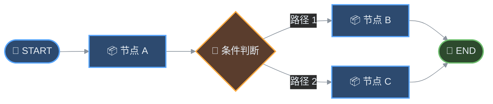
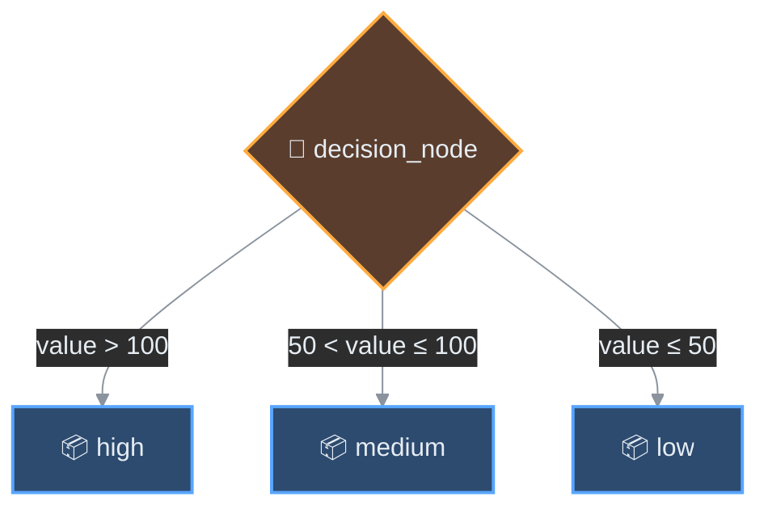
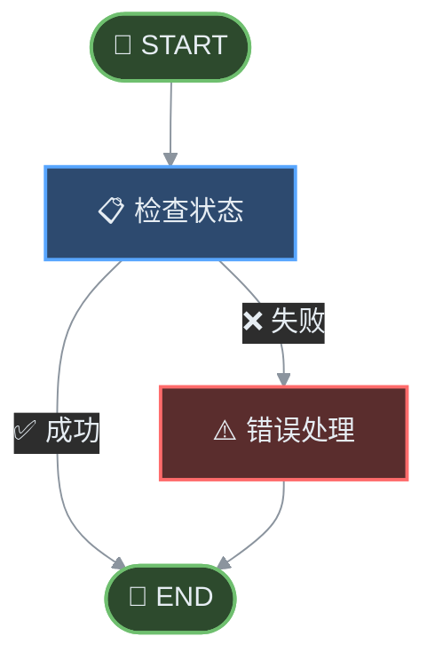
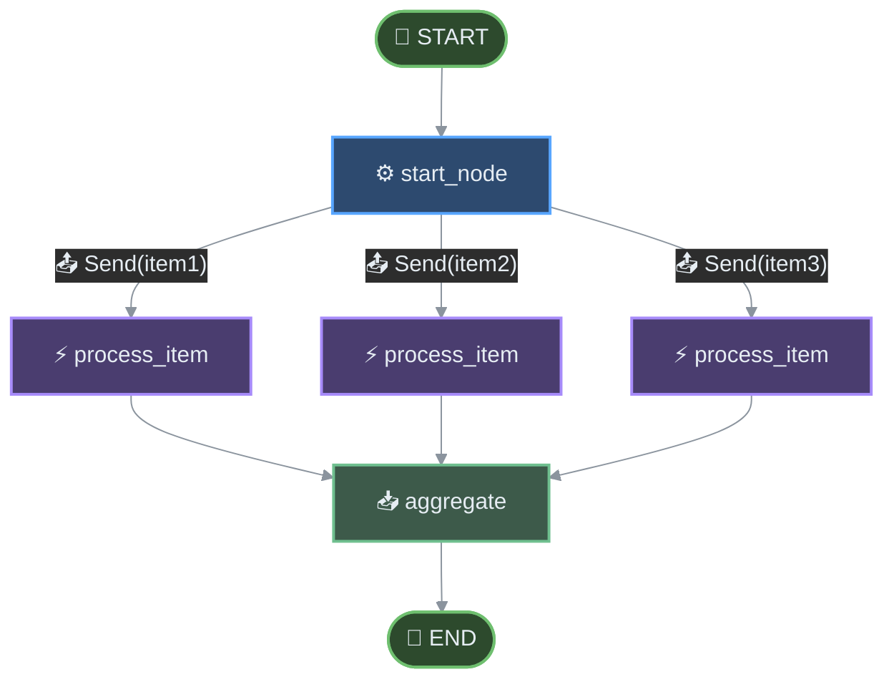
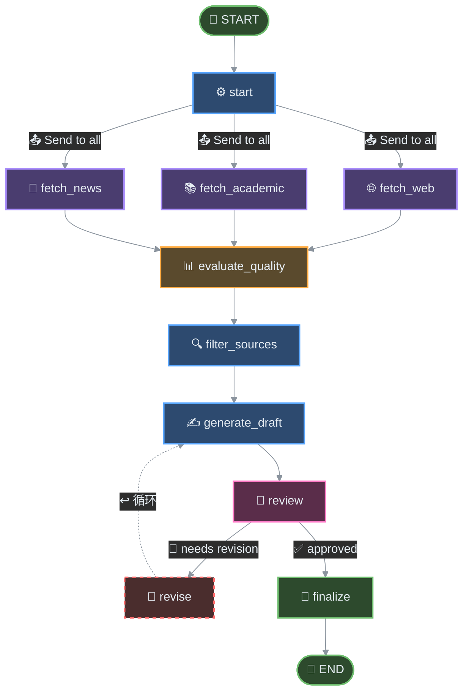

# 第四章：节点与边

> 本章深入探讨 LangGraph 中两个最核心的概念：节点（Node）和边（Edge）。节点代表工作流中的执行单元，边定义了节点之间的流转关系。掌握这两个概念，你将能够构建任意复杂度的有状态工作流。

## 4.1 概念概述

在 LangGraph 中，图（Graph）是工作流的抽象表示：



- **节点（Node）**：执行特定任务的逻辑单元
- **边（Edge）**：控制节点之间数据流向的连接
- **START/END**：特殊的起始和结束标记节点

## 4.2 节点定义

### 4.2.1 节点函数签名

LangGraph 对节点函数有严格的签名要求，这是确保状态正确流转的关键。

```python
from typing import TypedDict, Partial

class AgentState(TypedDict):
    """代理状态的类型定义"""
    messages: list[str]
    current_node: str
    result: str | None

def node_function(state: AgentState) -> Partial[AgentState]:
    """
    节点函数的标准签名

    Args:
        state: 当前图的状态（必须）

    Returns:
        Partial[AgentState]: 部分状态更新（只需要返回需要更新的字段）
    """
    # 业务逻辑
    new_message = f"Processed by node"
    return {"messages": [...state["messages"], new_message]}
```

**关键点说明**：

1. **输入**：节点函数接收完整的 `state` 作为参数
2. **输出**：返回 `Partial[State]`，即只需要返回需要更新的字段
3. **不可变性**：不要直接修改 state，而是返回更新后的值

### 4.2.2 普通函数节点

最常见的节点类型是普通 Python 函数：

```python
from typing import TypedDict, Partial
from langgraph.graph import StateGraph

class State(TypedDict):
    user_input: str
    processed: bool
    result: str

# 定义节点函数
def start_node(state: State) -> Partial[State]:
    """起始节点：处理用户输入"""
    return {
        "processed": True,
        "result": f"Processed: {state['user_input']}"
    }

def process_node(state: State) -> Partial[State]:
    """处理节点：进一步处理数据"""
    return {
        "result": state["result"] + " -> further processed"
    }

def end_node(state: State) -> Partial[State]:
    """结束节点：生成最终结果"""
    return {
        "result": state["result"] + " -> COMPLETED"
    }

# 创建图并添加节点
graph = StateGraph(State)
graph.add_node("start", start_node)
graph.add_node("process", process_node)
graph.add_node("end", end_node)

# 设置边
graph.add_edge("start", "process")
graph.add_edge("process", "end")
graph.set_entry_point("start")
graph.set_finish_point("end")

# 编译图
app = graph.compile()
```

### 4.2.3 Runnable 对象节点

LangGraph 支持 LangChain 的 Runnable 协议，这意味着你可以使用任意实现了 Runnable 接口的组件：

```python
from typing import TypedDict, Partial
from langchain_openai import ChatOpenAI
from langchain.prompts import ChatPromptTemplate
from langchain.graph import StateGraph
from langchain_core.runnables import RunnableLambda

# 使用 ChatOpenAI 作为节点
llm = ChatOpenAI(model="gpt-4")

# 定义状态
class ChatState(TypedDict):
    messages: list
    response: str | None

# 方式一：直接使用 Runnable 对象
graph = StateGraph(ChatState)

# 使用 LLM 作为节点
def create_chat_node(llm):
    def chat_node(state: ChatState) -> Partial[ChatState]:
        response = llm.invoke(state["messages"])
        return {"response": response.content}
    return chat_node

graph.add_node("chat", create_chat_node(llm))

# 方式二：使用 RunnableLambda 包装普通函数
def transform_state(state: ChatState) -> str:
    """状态转换逻辑"""
    return state["messages"][-1].content if state["messages"] else ""

runnable_transform = RunnableLambda(func=transform_state)

# 方式三：使用 LangChain 链式组件
prompt = ChatPromptTemplate.from_messages([
    ("system", "你是一个有帮助的助手"),
    ("human", "{input}")
])
chain = prompt | llm

def create_chain_node(chain):
    def chain_node(state: ChatState) -> Partial[ChatState]:
        # 从状态中提取输入
        input_text = state.get("messages", [])[-1].content if state.get("messages") else ""
        response = chain.invoke({"input": input_text})
        return {"response": response.content}
    return chain_node

graph.add_node("chain", create_chain_node(chain))
```

### 4.2.4 add_node 方法详解

`add_node` 方法有多个可选参数，用于控制节点行为：

```python
from typing import TypedDict, Partial
from langgraph.graph import StateGraph
from langgraph.graph import GraphState
from langgraph.constants import Send
from langgraph.prebuilt import RetryPolicy

class State(TypedDict):
    value: int
    history: list[str]

def process_node(state: State) -> Partial[State]:
    return {"history": [...state["history"], f"processed {state['value']}"]}

# 基础用法
graph = StateGraph(State)
graph.add_node("process", process_node)

# ============================================
# 参数一：retry_policy - 失败重试策略
# ============================================
from langgraph.prebuilt import RetryPolicy
from enum import Enum

# 简单的重试策略：最多重试 3 次
graph.add_node(
    "process_with_retry",
    process_node,
    retry_policy=RetryPolicy(max_attempts=3)
)

# 复杂的重试策略
retry_policy = RetryPolicy(
    max_attempts=5,
    initial_interval=1.0,        # 初始等待时间（秒）
    backoff_multiplier=2.0,      # 退避倍数
    max_interval=60.0,           # 最大等待时间
    jitter=True,                 # 添加随机抖动
    retry_on={
        Exception,                # 只重试特定异常类型
        TimeoutError,
        ConnectionError,
    }
)
graph.add_node("process_with_custom_retry", process_node, retry_policy=retry_policy)

# ============================================
# 参数二：error_handler - 错误处理函数
# ============================================
from typing import TypedDict, Union

class ErrorState(TypedDict):
    error: str | None
    retry_count: int

def error_handler(error: Exception, state: ErrorState) -> Partial[ErrorState]:
    """
    自定义错误处理

    Args:
        error: 捕获的异常
        state: 发生错误时的状态

    Returns:
        Partial[ErrorState]: 更新后的状态
    """
    return {
        "error": str(error),
        "retry_count": state.get("retry_count", 0) + 1
    }

def may_fail_node(state: ErrorState) -> Partial[ErrorState]:
    """可能失败的节点"""
    if state.get("retry_count", 0) < 3:
        raise ValueError("Simulated failure")
    return {"error": None}

graph.add_node(
    "with_error_handler",
    may_fail_node,
    error_handler=error_handler
)

# ============================================
# 参数三：input - 输入字段过滤
# ============================================
class MultiFieldState(TypedDict):
    field_a: str
    field_b: str
    field_c: str

def node_a(state: MultiFieldState) -> Partial[MultiFieldState]:
    return {"field_a": "updated"}

graph.add_node(
    "filtered_node",
    node_a,
    input=GraphState.filter_input(keys=["field_a", "field_b"])  # 只接收部分输入
)

# ============================================
# 参数四：output - 输出字段过滤
# ============================================
graph.add_node(
    "output_filtered_node",
    node_a,
    output=GraphState.filter_output(keys=["field_c"])  # 只输出部分字段
)
```

## 4.3 边的类型与连接

### 4.3.1 普通边（add_edge）

普通边是最简单的边类型，表示固定的节点连接：

```python
from langgraph.graph import StateGraph

graph = StateGraph(State)

# 添加节点
graph.add_node("a", node_a)
graph.add_node("b", node_b)
graph.add_node("c", node_c)

# 普通边：A -> B -> C 顺序执行
graph.add_edge("a", "b")
graph.add_edge("b", "c")
```


### 4.3.2 条件边（add_conditional_edges）

条件边允许根据状态动态选择下一个节点：

```python
from typing import TypedDict, Partial

class ConditionalState(TypedDict):
    value: int
    decision: str | None

def make_decision(state: ConditionalState) -> str:
    """
    决策函数：根据状态返回下一个节点的名称

    Args:
        state: 当前状态

    Returns:
        str: 下一个节点的名称
    """
    if state["value"] > 100:
        return "high"
    elif state["value"] > 50:
        return "medium"
    else:
        return "low"

def high_node(state: ConditionalState) -> Partial[ConditionalState]:
    return {"decision": "处理高值"}

def medium_node(state: ConditionalState) -> Partial[ConditionalState]:
    return {"decision": "处理中值"}

def low_node(state: ConditionalState) -> Partial[ConditionalState]:
    return {"decision": "处理低值"}

graph = StateGraph(ConditionalState)
graph.add_node("high", high_node)
graph.add_node("medium", medium_node)
graph.add_node("low", low_node)

# 方式一：使用函数作为路由
graph.add_conditional_edges(
    "decision_node",      # 源节点
    make_decision,         # 路由函数
    {
        "high": "high",    # 路由值 -> 目标节点
        "medium": "medium",
        "low": "low"
    }
)

# 方式二：使用字典定义所有可能的路由
def route_based_on_value(state: ConditionalState) -> str:
    return "high" if state["value"] > 100 else "medium" if state["value"] > 50 else "low"

graph.add_conditional_edges(
    "decision_node",
    route_based_on_value,
    ["high", "medium", "low"]  # 简写：路由返回值直接是节点名
)
```



### 4.3.3 边的高级用法

#### 使用 Path 对象

```python
from typing import Literal
from langgraph.graph import StateGraph

class PathState(TypedDict):
    path_type: Literal["a", "b", "c"]

def route_path(state: PathState) -> Literal["a", "b", "c"]:
    return state["path_type"]

graph = StateGraph(PathState)
graph.add_node("node_a", lambda s: {"result": "A"})
graph.add_node("node_b", lambda s: {"result": "B"})
graph.add_node("node_c", lambda s: {"result": "C"})

# 使用 Literal 类型约束路由
graph.add_conditional_edges(
    "start",
    route_path,
    ["node_a", "node_b", "node_c"]
)
```

#### 使用 Mapper 函数

```python
from typing import TypedDict, Literal

class RouteState(TypedDict):
    routes: dict[str, bool]

def router(state: RouteState) -> list[str]:
    """返回所有为 True 的路由"""
    return [k for k, v in state["routes"].items() if v]

graph = StateGraph(RouteState)

def create_node(name: str):
    def node(state: RouteState) -> Partial[RouteState]:
        return {"result": f"Executed {name}"}
    return node

for name in ["a", "b", "c"]:
    graph.add_node(name, create_node(name))

# 这会执行所有 routes 中值为 True 的节点
graph.add_conditional_edges("router", router, ["a", "b", "c"])
```

## 4.4 START 与 END 特殊节点

### 4.4.1 START 节点

START 是特殊的入口节点，标识图的起始点：

```python
graph = StateGraph(State)
graph.add_node("first", first_node)
graph.add_node("second", second_node)

# 设置入口点
graph.set_entry_point("first")  # 等同于 add_edge(START, "first")
graph.add_edge("first", "second")
```

### 4.4.2 END 节点

END 是特殊的终止节点，标识图的结束：

```python
graph.add_node("final", final_node)

# 设置终止点
graph.set_finish_point("final")  # 等同于 add_edge("final", END)
```

### 4.4.3 多个终止点

```python
# 可以有多个终止条件
graph.add_conditional_edges(
    "check",
    lambda s: "end_success" if s["success"] else "end_failure",
    {
        "end_success": END,
        "end_failure": "error_handler"
    }
)
```



## 4.5 并行等待机制

LangGraph 支持并行执行多个节点，然后等待它们全部完成后进入下一个节点。

### 4.5.1 基本并行

```python
from typing import TypedDict, Partial
from langgraph.graph import StateGraph

class ParallelState(TypedDict):
    task_results: dict[str, str]

def task_a(state: ParallelState) -> Partial[ParallelState]:
    return {"task_results": {**state["task_results"], "a": "Result A"}}

def task_b(state: ParallelState) -> Partial[ParallelState]:
    return {"task_results": {**state["task_results"], "b": "Result B"}}

def collector(state: ParallelState) -> Partial[ParallelState]:
    results = state["task_results"]
    return {"summary": f"Collected: {results}"}

graph = StateGraph(ParallelState)
graph.add_node("task_a", task_a)
graph.add_node("task_b", task_b)
graph.add_node("collector", collector)

# 入口
graph.set_entry_point("task_a")  # 先执行 task_a

# 并行执行：task_a 完成后，同时执行 task_a 和 task_b
# 使用条件边实现并行分支
def route_after_a(state: ParallelState) -> list[str]:
    return ["task_a", "task_b"]

# 注意：这里演示概念，实际需要用 Send
graph.add_conditional_edges("task_a", route_after_a, ["task_a", "task_b"])

# 等待两个任务都完成后执行 collector
graph.add_edge(["task_a", "task_b"], "collector")
graph.set_finish_point("collector")
```

### 4.5.2 使用 Send 实现真正的并行

```python
from typing import TypedDict, Partial
from langgraph.graph import StateGraph
from langgraph.constants import Send
from typing import Union

class FanOutState(TypedDict):
    items: list[str]
    results: dict[str, str]

def start_node(state: FanOutState) -> list[Send]:
    """将任务分发到多个并行节点"""
    return [
        Send("process_item", {"item": item, "results": {}})
        for item in state["items"]
    ]

def process_item(state: dict) -> Partial[dict]:
    """处理单个项目"""
    item = state["item"]
    return {"results": {item: f"Processed: {item}"}}

def aggregate_results(state: FanOutState) -> Partial[FanOutState]:
    """聚合所有结果"""
    return {"aggregated": f"All done: {state['results']}"}

graph = StateGraph(FanOutState)
graph.add_node("start", start_node)
graph.add_node("process_item", process_item)
graph.add_node("aggregate", aggregate_results)

# 使用 Send 实现并行分发
graph.add_conditional_edges("start", lambda s: s, ["process_item"])
graph.add_edge("process_item", "aggregate")
graph.set_entry_point("start")
graph.set_finish_point("aggregate")
```



### 4.5.3 等待多个来源

```python
# 当多个并行分支需要汇合时使用
graph.add_edge(["branch_a", "branch_b", "branch_c"], "merge_point")
```

这表示必须等待 `branch_a`、`branch_b`、`branch_c` 三个分支都完成后，才执行 `merge_point`。

## 4.6 工程示例：构建内容处理工作流

下面是一个完整的工程示例，展示如何构建一个复杂的内容处理工作流：

```python
"""
LangGraph 工作流示例：多阶段内容处理系统

功能描述：
1. 接收用户输入的主题
2. 并行获取不同来源的信息
3. 对信息进行质量评估和过滤
4. 根据评估结果生成不同风格的内容
5. 汇总输出最终报告
"""

from typing import TypedDict, Partial, Literal
from langgraph.graph import StateGraph
from langgraph.constants import Send
import json

# ============================================
# 1. 定义状态类型
# ============================================

class ContentWorkflowState(TypedDict):
    """内容处理工作流的状态"""
    # 输入
    topic: str

    # 并行获取阶段
    sources: dict[str, str | None]  # source_name -> content

    # 评估阶段
    quality_scores: dict[str, float]  # source_name -> score

    # 过滤后保留的来源
    qualified_sources: list[str]

    # 生成阶段
    draft: str | None

    # 最终输出
    final_report: str | None

    # 元数据
    processing_log: list[str]


# ============================================
# 2. 定义节点函数
# ============================================

def node_start(state: ContentWorkflowState) -> Partial[ContentWorkflowState]:
    """
    起始节点：初始化工作流

    Args:
        state: 初始状态（包含 topic）

    Returns:
        Partial[ContentWorkflowState]: 初始化处理日志
    """
    log = f"Started processing topic: {state['topic']}"
    print(f"[START] {log}")
    return {"processing_log": [log]}


def node_fetch_web(state: ContentWorkflowState) -> Partial[ContentWorkflowState]:
    """获取网络资源"""
    content = f"Web content about {state['topic']}"
    log = f"Fetched from web: {len(content)} chars"
    print(f"[WEB] {log}")
    return {"sources": {"web": content}, "processing_log": [log]}


def node_fetch_academic(state: ContentWorkflowState) -> Partial[ContentWorkflowState]:
    """获取学术资源"""
    content = f"Academic paper about {state['topic']}"
    log = f"Fetched from academic: {len(content)} chars"
    print(f"[ACADEMIC] {log}")
    return {"sources": {"academic": content}, "processing_log": [log]}


def node_fetch_news(state: ContentWorkflowState) -> Partial[ContentWorkflowState]:
    """获取新闻资源"""
    content = f"News articles about {state['topic']}"
    log = f"Fetched from news: {len(content)} chars"
    print(f"[NEWS] {log}")
    return {"sources": {"news": content}, "processing_log": [log]}


def node_evaluate_quality(state: ContentWorkflowState) -> Partial[ContentWorkflowState]:
    """
    评估阶段：根据来源质量分配分数

    Args:
        state: 包含 sources 的状态

    Returns:
        Partial[ContentWorkflowState]: 质量评分
    """
    scores = {}
    for source_name, content in state["sources"].items():
        if content:
            # 模拟质量评估逻辑
            if source_name == "academic":
                scores[source_name] = 0.95
            elif source_name == "web":
                scores[source_name] = 0.75
            elif source_name == "news":
                scores[source_name] = 0.60
            else:
                scores[source_name] = 0.50

    log = f"Quality scores: {scores}"
    print(f"[EVALUATE] {log}")
    return {"quality_scores": scores, "processing_log": [log]}


def node_filter_sources(state: ContentWorkflowState) -> Partial[ContentWorkflowState]:
    """
    过滤阶段：保留质量合格的来源

    Args:
        state: 包含 quality_scores 的状态

    Returns:
        Partial[ContentWorkflowState]: 过滤后的来源列表
    """
    threshold = 0.65
    qualified = [
        name for name, score in state["quality_scores"].items()
        if score >= threshold
    ]

    log = f"Qualified sources (score >= {threshold}): {qualified}"
    print(f"[FILTER] {log}")

    if not qualified:
        return {"qualified_sources": ["web"], "processing_log": [log]}  # 默认保留 web

    return {"qualified_sources": qualified, "processing_log": [log]}


def node_generate_draft(state: ContentWorkflowState) -> Partial[ContentWorkflowState]:
    """
    生成阶段：根据合格来源生成草稿

    Args:
        state: 包含 qualified_sources 和 sources 的状态

    Returns:
        Partial[ContentWorkflowState]: 草稿内容
    """
    qualified = state["qualified_sources"]
    content_parts = []

    for source in qualified:
        if source in state["sources"] and state["sources"][source]:
            content_parts.append(f"From {source}: {state['sources'][source]}")

    draft = "\n\n".join(content_parts)
    log = f"Generated draft with {len(draft)} chars"
    print(f"[DRAFT] {log}")

    return {"draft": draft, "processing_log": [log]}


def node_review(state: ContentWorkflowState) -> Partial[ContentWorkflowState]:
    """
    审核阶段：评估草稿质量

    Returns:
        Partial[ContentWorkflowState]: 包含审核结果
    """
    draft_length = len(state.get("draft", ""))
    needs_revision = draft_length < 100

    log = f"Review: {'needs revision' if needs_revision else 'approved'}"
    print(f"[REVIEW] {log}")

    return {
        "needs_revision": needs_revision,
        "processing_log": [log]
    }


def node_revise(state: ContentWorkflowState) -> Partial[ContentWorkflowState]:
    """
    修订阶段：改进草稿

    Args:
        state: 包含 draft 的状态

    Returns:
        Partial[ContentWorkflowState]: 修订后的草稿
    """
    revised = state["draft"] + "\n\n[Revised version with additional context]"
    log = "Draft revised"
    print(f"[REVISE] {log}")

    return {"draft": revised, "processing_log": [log]}


def node_finalize(state: ContentWorkflowState) -> Partial[ContentWorkflowState]:
    """
    最终阶段：生成最终报告

    Args:
        state: 包含 draft 和 topic 的状态

    Returns:
        Partial[ContentWorkflowState]: 最终报告
    """
    report = f"""# {state['topic']}

## Content Summary

{state['draft']}

## Processing Log

{chr(10).join(f'- {log}' for log in state['processing_log'])}
"""
    log = "Report finalized"
    print(f"[FINALIZE] {log}")

    return {"final_report": report, "processing_log": [log]}


# ============================================
# 3. 路由函数
# ============================================

def route_fetch_sources(state: ContentWorkflowState) -> list[Send]:
    """
    并行分发源获取任务

    Returns:
        list[Send]: 并行执行的任务列表
    """
    return [
        Send("fetch_web", {"topic": state["topic"], "sources": {}, "processing_log": []}),
        Send("fetch_academic", {"topic": state["topic"], "sources": {}, "processing_log": []}),
        Send("fetch_news", {"topic": state["topic"], "sources": {}, "processing_log": []}),
    ]


def route_after_review(state: ContentWorkflowState) -> str:
    """
    审核后路由

    Returns:
        str: 下一个节点
    """
    return "revise" if state.get("needs_revision", False) else "finalize"


# ============================================
# 4. 构建工作流图
# ============================================

def build_content_workflow() -> StateGraph:
    """
    构建内容处理工作流图

    工作流结构：

        START -> start
              -> fetch_web      (并行)
              -> fetch_academic (并行)
              -> fetch_news     (并行)
              -> evaluate_quality
              -> filter_sources
              -> generate_draft
              -> review
              -> revise -> generate_draft (循环)
              -> finalize -> END
    """
    # 创建状态图
    workflow = StateGraph(ContentWorkflowState)

    # ---- 添加节点 ----
    workflow.add_node("start", node_start)
    workflow.add_node("fetch_web", node_fetch_web)
    workflow.add_node("fetch_academic", node_fetch_academic)
    workflow.add_node("fetch_news", node_fetch_news)
    workflow.add_node("evaluate_quality", node_evaluate_quality)
    workflow.add_node("filter_sources", node_filter_sources)
    workflow.add_node("generate_draft", node_generate_draft)
    workflow.add_node("review", node_review)
    workflow.add_node("revise", node_revise)
    workflow.add_node("finalize", node_finalize)

    # ---- 设置入口点 ----
    workflow.set_entry_point("start")

    # ---- 设置边 ----

    # 1. start -> 并行获取 (使用条件边分发)
    workflow.add_conditional_edges(
        "start",
        route_fetch_sources,
        ["fetch_web", "fetch_academic", "fetch_news"]
    )

    # 2. 等待所有获取任务完成后 -> evaluate_quality
    workflow.add_edge(["fetch_web", "fetch_academic", "fetch_news"], "evaluate_quality")

    # 3. 评估 -> 过滤 -> 生成草稿
    workflow.add_edge("evaluate_quality", "filter_sources")
    workflow.add_edge("filter_sources", "generate_draft")

    # 4. 生成草稿 -> 审核
    workflow.add_edge("generate_draft", "review")

    # 5. 审核后决策：修订或完成
    workflow.add_conditional_edges(
        "review",
        route_after_review,
        {
            "revise": "revise",
            "finalize": "finalize"
        }
    )

    # 6. 修订后回到草稿生成（循环）
    workflow.add_edge("revise", "generate_draft")

    # 7. 最终完成
    workflow.set_finish_point("finalize")

    return workflow


# ============================================
# 5. 执行工作流
# ============================================

def main():
    """主函数：演示工作流执行"""
    print("=" * 60)
    print("LangGraph 内容处理工作流演示")
    print("=" * 60)

    # 构建并编译工作流
    workflow = build_content_workflow()
    app = workflow.compile()

    # 初始输入
    initial_state = ContentWorkflowState(
        topic="人工智能在医疗领域的应用",
        sources={},
        quality_scores={},
        qualified_sources=[],
        draft=None,
        final_report=None,
        processing_log=[]
    )

    # 执行工作流
    print("\n开始执行工作流...\n")
    final_state = app.invoke(initial_state)

    # 输出结果
    print("\n" + "=" * 60)
    print("工作流执行完成")
    print("=" * 60)

    print(f"\n处理日志:")
    for log in final_state["processing_log"]:
        print(f"  - {log}")

    print(f"\n最终报告预览 (前500字符):")
    print(final_state["final_report"][:500] if final_state["final_report"] else "N/A")


if __name__ == "__main__":
    main()
```

### 工作流结构图



## 4.7 最佳实践

### 4.7.1 节点设计原则

```python
# 好实践：节点单一职责
def fetch_user_data(state: State) -> Partial[State]:
    """只负责获取数据"""
    data = external_api.get_user(state["user_id"])
    return {"user_data": data}

def validate_user_data(state: State) -> Partial[State]:
    """只负责验证数据"""
    is_valid = validate(state["user_data"])
    return {"is_valid": is_valid}

# 坏实践：节点职责过多
def do_everything(state: State) -> Partial[State]:
    """获取、验证、处理、存储... - 不要这样做"""
    data = external_api.get_user(state["user_id"])
    is_valid = validate(data)
    processed = process(data) if is_valid else None
    storage.save(processed)
    return {"result": processed}
```

### 4.7.2 状态管理原则

```python
# 好实践：明确的状态更新
def good_node(state: State) -> Partial[State]:
    # 只返回需要更新的字段
    return {"new_field": "value", "modified_field": "new_value"}

# 坏实践：返回整个状态
def bad_node(state: State) -> State:
    # 不要这样做，这会导致问题
    state["new_field"] = "value"
    return state
```

### 4.7.3 错误处理原则

```python
from typing import TypedDict, Partial
from langgraph.graph import StateGraph

class ErrorState(TypedDict):
    error: str | None
    retry_count: int

def robust_node(state: ErrorState) -> Partial[ErrorState]:
    """带有重试逻辑的健壮节点"""
    try:
        result = risky_operation()
        return {"result": result, "error": None}
    except TemporaryError as e:
        if state["retry_count"] >= 3:
            return {"error": f"Failed after retries: {e}"}
        raise  # 让 RetryPolicy 处理重试
    except PermanentError as e:
        return {"error": str(e)}  # 不会重试的永久错误

# 配置重试策略
retry_policy = RetryPolicy(
    max_attempts=3,
    retry_on={TemporaryError}
)

graph.add_node("robust", robust_node, retry_policy=retry_policy)
```

## 4.8 小结

本章我们深入学习了 LangGraph 中节点与边的核心概念：

| 概念 | 说明 |
|------|------|
| **节点签名** | `State -> Partial[State]`，接收完整状态，返回部分更新 |
| **add_node** | 支持 retry_policy、error_handler、input、output 等参数 |
| **普通边** | `add_edge(src, dst)`，固定的一对一连接 |
| **条件边** | `add_conditional_edges(src, router, mapping)`，动态路由 |
| **START/END** | 特殊的入口和出口节点 |
| **并行等待** | `add_edge([a, b], c)`，等待多个节点完成后执行 |

掌握这些概念后，你将能够构建任意复杂度的有状态工作流。在下一章中，我们将学习如何添加循环结构和子图，实现更高级的工作流模式。
