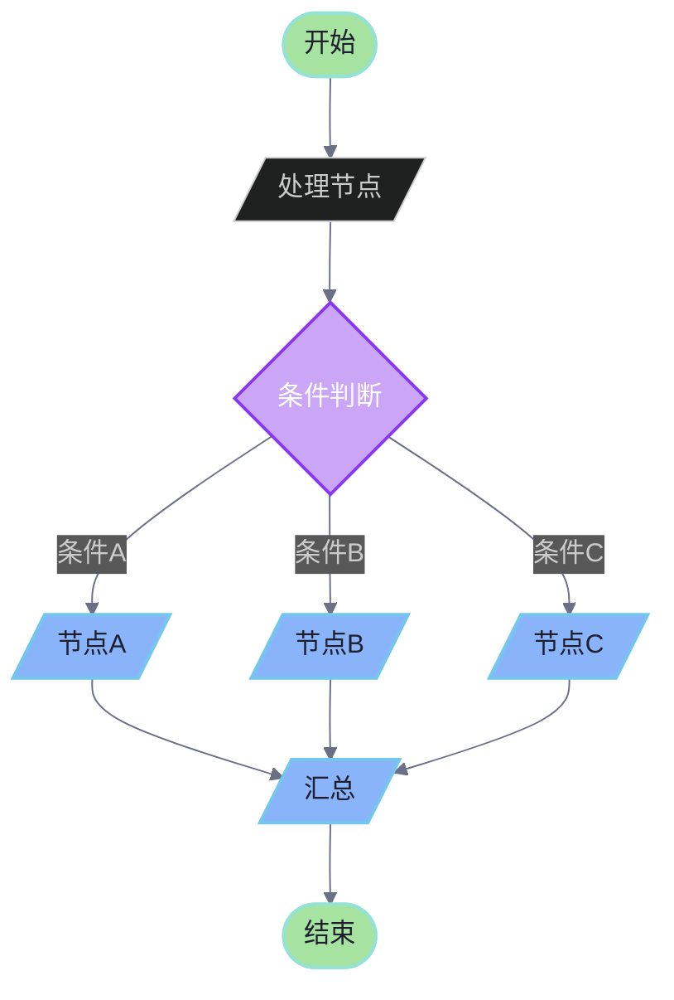
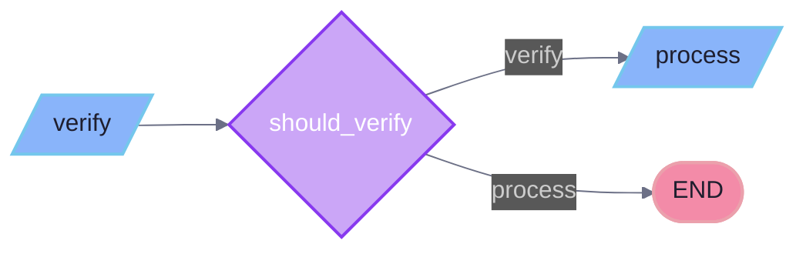
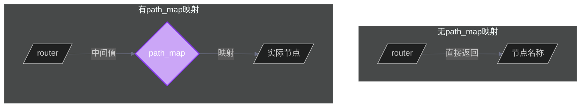
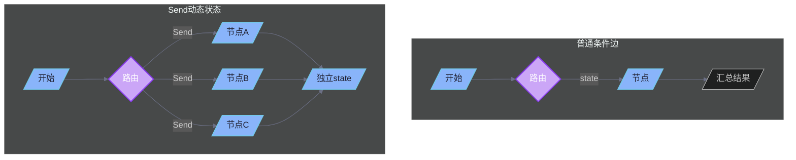
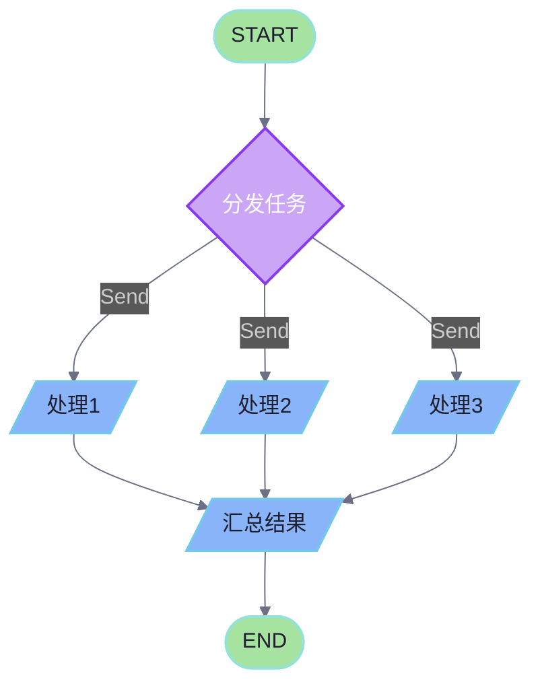
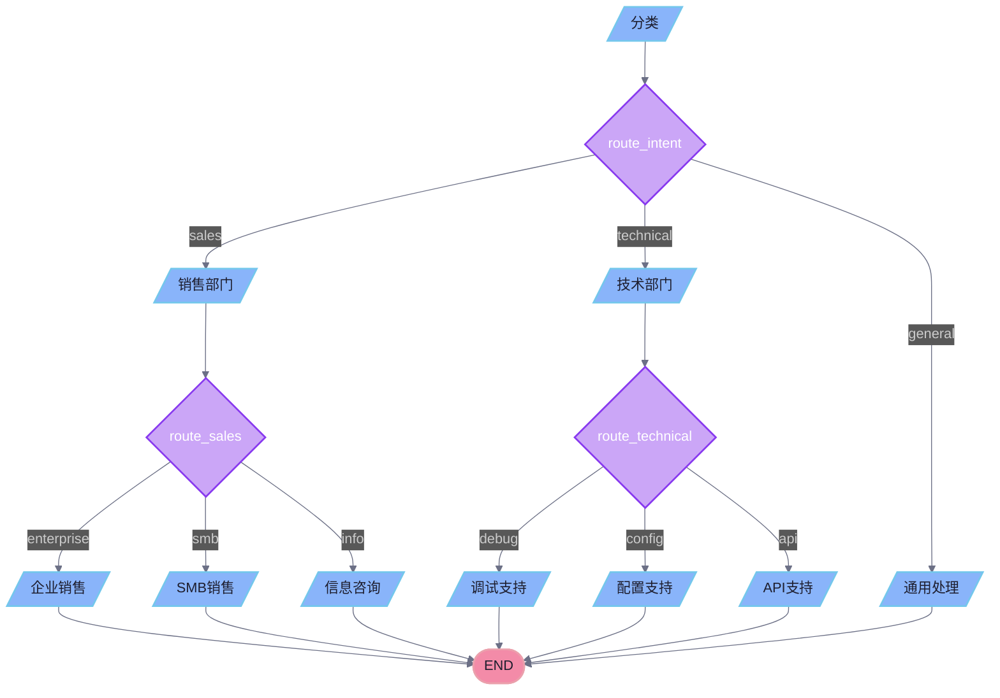
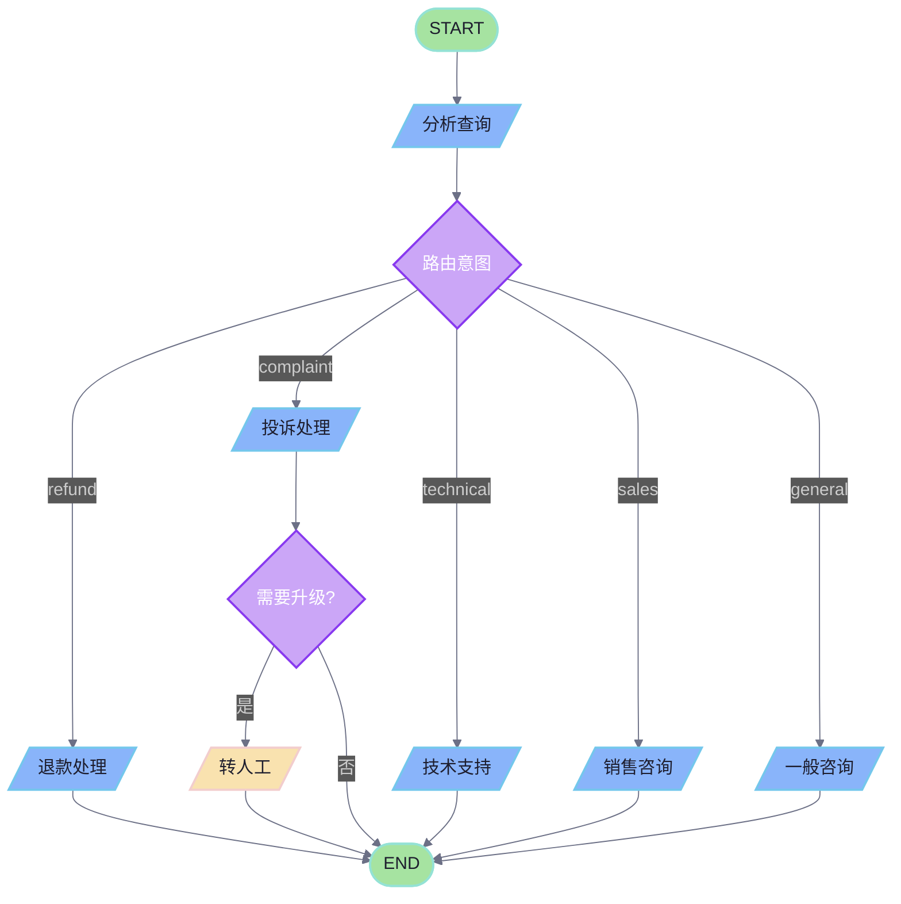

# 第五章：条件路由

## 目录

1. [条件路由概述](#1-条件路由概述)
2. [add_conditional_edges 基础用法](#2-add_conditional_edges-基础用法)
3. [路由函数详解](#3-路由函数详解)
4. [path_map 映射](#4-path_map-映射)
5. [Send 类型：动态状态传递](#5-send-类型动态状态传递)
6. [Map-Reduce 模式](#6-map-reduce-模式)
7. [多条件分支场景](#7-多条件分支场景)
8. [工程示例：智能客服工作流](#8-工程示例智能客服工作流)
9. [最佳实践与常见问题](#9-最佳实践与常见问题)

---

## 1. 条件路由概述

条件路由是 LangGraph 中实现动态工作流的核心机制。它允许图在执行过程中根据当前状态动态决定下一步执行哪个节点，而不是使用固定顺序的边。

### 1.1 为什么需要条件路由

在现实应用中，工作流通常需要根据不同的条件执行不同的分支：

- **审批流程**：根据金额大小走不同的审批路径
- **客服系统**：根据用户意图路由到不同的处理节点
- **数据分析**：根据数据类型选择不同的处理管道
- **LLM Agent**：根据工具调用结果决定是否继续还是结束

### 1.2 条件路由流程图



---

## 2. add_conditional_edges 基础用法

### 2.1 方法签名

```python
def add_conditional_edges(
    self,
    source: str,  # 起始节点名称
    path: Callable[..., Hashable | Sequence[Hashable]],  # 路由函数
    path_map: dict[Hashable, str] | list[str] | None = None,  # 路径映射
) -> Self
```

### 2.2 简单示例：二元分支

```python
from typing import TypedDict, Literal
from langgraph.graph import StateGraph, END

class AgentState(TypedDict):
    needs_verification: bool
    message: str

def should_verify(state: AgentState) -> Literal["verify", "process"]:
    """根据状态决定下一步"""
    if state["needs_verification"]:
        return "verify"
    return "process"

# 创建图
workflow = StateGraph(AgentState)

# 添加节点
workflow.add_node("verify", verify_node)
workflow.add_node("process", process_node)

# 设置入口点
workflow.set_entry_point("verify")

# 添加条件边
workflow.add_conditional_edges(
    source="verify",
    path=should_verify,
    path_map={
        "verify": "process",  # 如果返回"verify"，则跳转到process
        "process": END,        # 如果返回"process"，则结束
    }
)

graph = workflow.compile()
```

### 2.3 流程图表示



---

## 3. 路由函数详解

### 3.1 路由函数签名

路由函数接收状态作为参数，返回一个或多个目标节点的名称：

```python
def router_function(state: State) -> str | list[str]:
    """
    参数: State - 当前图的状态
    返回: str - 单个目标节点名称
         list[str] - 多个目标节点名称（并行执行）
    """
```

### 3.2 返回单个路径

```python
from typing import Literal

class WorkflowState(TypedDict):
    query: str
    category: str | None

def route_query(state: WorkflowState) -> Literal["sports", "news", "weather", "general"]:
    """根据查询内容分类路由"""
    query = state["query"].lower()

    if any(word in query for word in ["football", "basketball", "soccer"]):
        return "sports"
    elif any(word in query for word in ["election", "politics", "government"]):
        return "news"
    elif any(word in query for word in ["temperature", "rain", "forecast"]):
        return "weather"
    return "general"

# 使用
workflow.add_conditional_edges(
    source="analyze",
    path=route_query,
    path_map=["sports", "news", "weather", "general"]
)
```

### 3.3 返回多个路径（并行执行）

当路由函数返回多个节点名称时，这些节点会**并行执行**：

```python
from typing import Literal

class AnalysisState(TypedDict):
    document: str
    aspects: list[str]  # ["summary", "sentiment", "entities", "topics"]

def extract_aspects(state: AnalysisState) -> list[str]:
    """分析文档后，返回需要执行的多个分析维度"""
    # 假设LLM分析后返回多个需要处理的方面
    return ["summary", "sentiment", "entities", "topics"]

workflow.add_conditional_edges(
    source="analyze_document",
    path=extract_aspects,
    path_map=["summary", "sentiment", "entities", "topics"]
)

# 这四个节点会并行执行
workflow.add_node("summary", summary_node)
workflow.add_node("sentiment", sentiment_node)
workflow.add_node("entities", entities_node)
workflow.add_node("topics", topics_node)
```

### 3.4 类型提示的重要性

使用类型提示可以让 LangGraph 正确推断可用的边，从而在可视化时准确显示所有可能的路由路径：

```python
from typing import Literal, Union

# 推荐：明确的字面量类型
def route(state: State) -> Literal["node_a", "node_b", "node_c"]:
    ...

# 可行：返回字符串
def route(state: State) -> str:
    ...

# 不推荐：没有类型提示，LangGraph 无法推断可能的路径
def route(state: State):
    ...
```

---

## 4. path_map 映射

### 4.1 path_map 的作用

`path_map` 提供了路由函数返回值到目标节点名称的映射。这允许：

1. **解耦**：路由逻辑的返回值可以与节点名称不同
2. **灵活性**：同一个返回值可以映射到不同的节点
3. **可读性**：使用有意义的返回值名称

### 4.2 字典形式的 path_map

```python
def classify_intent(state: WorkflowState) -> Literal["urgent", "normal", "feedback"]:
    """将用户意图分类"""
    if state.get("priority") == "high":
        return "urgent"
    elif "feedback" in state.get("query", "").lower():
        return "feedback"
    return "normal"

# 使用字典映射
workflow.add_conditional_edges(
    source="classify",
    path=classify_intent,
    path_map={
        "urgent": "urgent_handler",      # urgent -> urgent_handler
        "normal": "standard_processor",  # normal -> standard_processor
        "feedback": "feedback_collector"  # feedback -> feedback_collector
    }
)
```

### 4.3 列表形式的 path_map

当路由函数直接返回节点名称时，可以使用列表形式：

```python
def route_to_processor(state: WorkflowState) -> Literal["processor_a", "processor_b", "processor_c"]:
    """直接返回处理器名称"""
    processor_type = state.get("processor_type", "a")
    return f"processor_{processor_type}"

# 列表形式：返回值直接作为节点名称
workflow.add_conditional_edges(
    source="route",
    path=route_to_processor,
    path_map=["processor_a", "processor_b", "processor_c"]
)
```

### 4.4 流程图对比



---

## 5. Send 类型：动态状态传递

### 5.1 Send 概述

`Send` 类型是 LangGraph 中实现动态并行执行的核心机制。与普通条件边不同，`Send` 允许：

1. 向同一个节点传递**不同的状态**
2. 在下一轮执行中**动态创建**并行任务
3. 实现 **Map-Reduce** 模式

### 5.2 Send 类签名

```python
from langgraph.types import Send
from typing import TypedDict

class Send:
    """向指定节点发送自定义状态的消息"""

    node: str          # 目标节点名称
    arg: Any           # 要发送的状态/消息
    timeout: float | timedelta | TimeoutPolicy | None  # 可选超时策略

    def __init__(self, node: str, arg: Any, *, timeout: float | None = None):
        ...
```

### 5.3 Send 基本用法

```python
from typing import Annotated
from langgraph.types import Send
from langgraph.graph import END, START
from langgraph.graph import StateGraph
import operator

class OverallState(TypedDict):
    subjects: list[str]
    jokes: Annotated[list[str], operator.add]

def continue_to_jokes(state: OverallState):
    """为每个主题创建一个笑话生成任务"""
    return [Send("generate_joke", {"subject": s}) for s in state["subjects"]]

# 创建图
builder = StateGraph(OverallState)

# 注意：这里添加的是一个可调用对象，而不是普通函数
builder.add_node("generate_joke", lambda state: {
    "jokes": [f"Joke about {state['subject']}"]
})

# 使用 Send 实现动态分支
builder.add_conditional_edges(START, continue_to_jokes)
builder.add_edge("generate_joke", END)

graph = builder.compile()

# 调用
result = graph.invoke({"subjects": ["cats", "dogs"]})
# 结果: {'subjects': ['cats', 'dogs'], 'jokes': ['Joke about cats', 'Joke about dogs']}
```

### 5.4 Send 与普通条件边的区别

| 特性 | 普通 add_conditional_edges | Send |
|------|---------------------------|------|
| 传递状态 | 使用当前图的状态 | 可以传递自定义状态 |
| 并行执行 | 单个节点 | 多个节点并行 |
| 状态隔离 | 共享状态 | 每个 Send 有独立状态 |
| 典型用途 | 路由分支 | Map-Reduce |



---

## 6. Map-Reduce 模式

### 6.1 Map-Reduce 概述

Map-Reduce 是一种经典的分而治之模式：

- **Map 阶段**：将任务分解为多个子任务，并行处理
- **Reduce 阶段**：汇总所有子任务的结果

### 6.2 使用 Send 实现 Map-Reduce

```python
from typing import Annotated, TypedDict
from langgraph.types import Send
from langgraph.graph import END, START
from langgraph.graph import StateGraph
import operator

class DocumentState(TypedDict):
    documents: list[str]
    summaries: Annotated[list[str], operator.add]
    status: str

def distribute_tasks(state: DocumentState):
    """Map阶段：分发文档到摘要节点"""
    return [
        Send("summarize_document", {
            "document": doc,
            " summaries": []  # 为每个文档初始化空列表
        })
        for doc in state["documents"]
    ]

def summarize_document(state: TypedDict):
    """处理单个文档"""
    # 这里可以是复杂的摘要逻辑
    return {"summaries": [f"Summary of: {state['document'][:50]}..."]}

# 创建图
workflow = StateGraph(DocumentState)
workflow.add_node("summarize_document", summarize_document)

# 条件边使用 Send
workflow.add_conditional_edges(START, distribute_tasks)
workflow.add_edge("summarize_document", END)

graph = workflow.compile()

# 执行
result = graph.invoke({
    "documents": ["doc1", "doc2", "doc3"],
    "summaries": [],
    "status": "pending"
})
# summaries 会自动聚合所有文档的摘要
```

### 6.3 完整 Map-Reduce 流程图



### 6.4 带状态的 Map-Reduce

```python
from typing import Annotated, TypedDict
from langgraph.types import Send
from langgraph.graph import END, START
from langgraph.graph import StateGraph
import operator
import asyncio

class AnalysisState(TypedDict):
    items: list[dict]
    analysis_results: Annotated[list[dict], operator.add]
    high_priority_count: Annotated[int, operator.add]

class ItemAnalysisState(TypedDict):
    item: dict
    analysis_results: list[dict]

async def analyze_items(state: AnalysisState):
    """Map阶段：分发分析任务"""
    return [
        Send("analyze_item", {"item": item, "analysis_results": []})
        for item in state["items"]
    ]

async def analyze_item(state: ItemAnalysisState) -> ItemAnalysisState:
    """分析单个项目"""
    item = state["item"]

    # 模拟分析逻辑
    result = {
        "id": item["id"],
        "score": item["value"] * 2,
        "is_high_priority": item["value"] > 100
    }

    updates = {"analysis_results": [result]}
    if result["is_high_priority"]:
        updates["high_priority_count"] = 1

    return updates

# 构建图
workflow = StateGraph(AnalysisState)
workflow.add_node("analyze_item", analyze_item)
workflow.add_conditional_edges(START, analyze_items)
workflow.add_edge("analyze_item", END)

graph = workflow.compile()

# 执行
result = asyncio.run(graph.ainvoke({
    "items": [
        {"id": 1, "value": 50},
        {"id": 2, "value": 150},
        {"id": 3, "value": 80},
    ],
    "analysis_results": [],
    "high_priority_count": 0
}))
```

---

## 7. 多条件分支场景

### 7.1 多级路由

在实际应用中，经常需要多级路由：

```python
from typing import Literal

class SupportState(TypedDict):
    query: str
    intent: str | None
    category: str | None
    handler: str | None

def route_intent(state: SupportState) -> Literal["sales", "technical", "general"]:
    """第一级：路由到部门"""
    query = state["query"].lower()

    if any(word in query for word in ["buy", "price", "purchase", "cost"]):
        return "sales"
    elif any(word in query for word in ["error", "bug", "crash", "install"]):
        return "technical"
    return "general"

def route_sales(state: SupportState) -> Literal["enterprise", "smb", "info"]:
    """第二级：销售部门内部路由"""
    query = state["query"].lower()

    if "enterprise" in query or "corporate" in query:
        return "enterprise"
    elif "small" in query or "startup" in query:
        return "smb"
    return "info"

def route_technical(state: SupportState) -> Literal["debug", "config", "api"]:
    """第二级：技术部门内部路由"""
    query = state["query"].lower()

    if "debug" in query or "error" in query:
        return "debug"
    elif "config" in query or "setup" in query:
        return "config"
    return "api"

# 构建图
workflow = StateGraph(SupportState)

# 添加节点
workflow.add_node("sales", sales_handler)
workflow.add_node("technical", technical_handler)
workflow.add_node("general", general_handler)
workflow.add_node("enterprise", enterprise_handler)
workflow.add_node("smb", smb_handler)
workflow.add_node("info", info_handler)
workflow.add_node("debug", debug_handler)
workflow.add_node("config", config_handler)
workflow.add_node("api", api_handler)

# 第一级路由
workflow.add_conditional_edges(
    source="classify",
    path=route_intent,
    path_map={"sales": "sales", "technical": "technical", "general": "general"}
)

# 销售部门内部路由
workflow.add_conditional_edges(
    source="sales",
    path=route_sales,
    path_map={"enterprise": "enterprise", "smb": "smb", "info": "info"}
)

# 技术部门内部路由
workflow.add_conditional_edges(
    source="technical",
    path=route_technical,
    path_map={"debug": "debug", "config": "config", "api": "api"}
)

# 所有处理器最终汇入结束
workflow.add_edge("enterprise", END)
workflow.add_edge("smb", END)
workflow.add_edge("info", END)
workflow.add_edge("debug", END)
workflow.add_edge("config", END)
workflow.add_edge("api", END)
workflow.add_edge("general", END)
```

### 7.2 多级路由流程图



### 7.3 条件边与普通边的组合

```python
from typing import Literal

class OrderState(TypedDict):
    order_id: str
    amount: float
    status: str
    verified: bool
    payment_confirmed: bool

def check_risk(state: OrderState) -> Literal["approve", "review", "reject"]:
    """风险检查"""
    if state["amount"] < 1000:
        return "approve"
    elif state["amount"] < 10000 and state["verified"]:
        return "review"
    return "reject"

# 构建订单处理图
workflow = StateGraph(OrderState)

workflow.add_node("verify", verify_order)
workflow.add_node("risk_check", check_risk)
workflow.add_node("approve", approve_order)
workflow.add_node("review", manual_review)
workflow.add_node("reject", reject_order)
workflow.add_node("process", process_payment)

# 固定边：验证后进行风险检查
workflow.add_edge("verify", "risk_check")

# 条件边：根据风险级别路由
workflow.add_conditional_edges(
    source="risk_check",
    path=check_risk,
    path_map={
        "approve": "approve",
        "review": "review",
        "reject": "reject"
    }
)

# 固定边：审批后处理支付
workflow.add_edge("approve", "process")
workflow.add_edge("review", "process")

# 所有路径最终结束
workflow.add_edge("process", END)
workflow.add_edge("reject", END)
```

---

## 8. 工程示例：智能客服工作流

### 8.1 需求分析

实现一个智能客服系统，具备以下功能：

1. **意图识别**：识别用户查询的意图（咨询、退款、投诉、技术支持）
2. **智能路由**：根据意图将请求路由到合适的处理节点
3. **多轮对话**：支持需要多轮交互的场景
4. **情感分析**：对负面情感的用户进行特殊处理
5. **并发处理**：同时处理多个关联查询

### 8.2 完整代码实现

```python
from typing import Annotated, Literal, TypedDict
from langgraph.graph import StateGraph, END, START
from langgraph.types import Send
import operator

# ============================================
# 状态定义
# ============================================

class CustomerServiceState(TypedDict):
    """客服系统状态"""
    user_id: str
    query: str
    intent: str | None
    sentiment: str | None
    escalation_needed: bool
    responses: Annotated[list[str], operator.add]
    transfer_to_human: bool

class QueryAnalysisState(TypedDict):
    """查询分析状态"""
    query: str
    intent: str | None
    sentiment: str | None

class HandlerState(TypedDict):
    """处理器状态"""
    query: str
    response: str
    escalation_needed: bool

# ============================================
# 节点函数
# ============================================

def analyze_query(state: CustomerServiceState) -> QueryAnalysisState:
    """分析用户查询，识别意图和情感"""
    query = state["query"].lower()

    # 意图识别
    intent = "general"
    if any(word in query for word in ["refund", "return", "money back"]):
        intent = "refund"
    elif any(word in query for word in ["complaint", "terrible", "awful", "worst"]):
        intent = "complaint"
    elif any(word in query for word in ["how to", "use", "setup", "configure"]):
        intent = "technical"
    elif any(word in query for word in ["price", "cost", "buy", "subscribe"]):
        intent = "sales"

    # 情感分析
    sentiment = "neutral"
    negative_words = ["angry", "frustrated", "disappointed", "terrible", "awful"]
    if any(word in query for word in negative_words):
        sentiment = "negative"
    elif any(word in query for word in ["happy", "great", "excellent", "love"]):
        sentiment = "positive"

    return {
        "query": state["query"],
        "intent": intent,
        "sentiment": sentiment
    }

def handle_refund(state: HandlerState) -> HandlerState:
    """处理退款请求"""
    return {
        "response": "我可以帮助您处理退款。请问您的订单号是多少？",
        "escalation_needed": False
    }

def handle_complaint(state: HandlerState) -> HandlerState:
    """处理投诉"""
    return {
        "response": "非常抱歉给您带来不愉快的体验。我会立即向相关团队报告此事。",
        "escalation_needed": True
    }

def handle_technical(state: HandlerState) -> HandlerState:
    """处理技术支持请求"""
    return {
        "response": "让我来帮您解决这个技术问题。请提供更多详细信息。",
        "escalation_needed": False
    }

def handle_sales(state: HandlerState) -> HandlerState:
    """处理销售咨询"""
    return {
        "response": "感谢您对我们产品的兴趣！请问您在考虑哪个套餐？",
        "escalation_needed": False
    }

def handle_general(state: HandlerState) -> HandlerState:
    """处理一般咨询"""
    return {
        "response": "感谢您的咨询。请问还有什么我可以帮助您的？",
        "escalation_needed": False
    }

# ============================================
# 路由函数
# ============================================

def route_intent(state: QueryAnalysisState) -> str:
    """根据意图路由到对应的处理器"""
    return state["intent"] or "general"

def check_escalation(state: HandlerState) -> Literal["escalate", "end"]:
    """检查是否需要升级"""
    if state["escalation_needed"]:
        return "escalate"
    return "end"

def distribute_queries(state: CustomerServiceState) -> list[Send]:
    """将用户查询分发到多个处理节点（示例：同时查询知识库和历史记录）"""
    return [
        Send("query_knowledge_base", {"query": state["query"]}),
        Send("get_history", {"user_id": state["user_id"]})
    ]

# ============================================
# 图构建
# ============================================

def build_customer_service_graph() -> StateGraph:
    """构建智能客服工作流图"""

    # 创建主图
    workflow = StateGraph(CustomerServiceState)

    # 添加主流程节点
    workflow.add_node("analyze", analyze_query)

    # 添加意图处理器节点
    workflow.add_node("refund", handle_refund)
    workflow.add_node("complaint", handle_complaint)
    workflow.add_node("technical", handle_technical)
    workflow.add_node("sales", handle_sales)
    workflow.add_node("general", handle_general)

    # 添加辅助节点
    workflow.add_node("escalate", lambda s: {"transfer_to_human": True})
    workflow.add_node("query_knowledge_base", lambda s: {"responses": [f"KB: {s['query']}"]})
    workflow.add_node("get_history", lambda s: {"responses": [f"History for {s.get('user_id', 'unknown')}"]})

    # 设置入口点
    workflow.set_entry_point("analyze")

    # 条件边：从分析节点路由到意图处理器
    workflow.add_conditional_edges(
        source="analyze",
        path=route_intent,
        path_map={
            "refund": "refund",
            "complaint": "complaint",
            "technical": "technical",
            "sales": "sales",
            "general": "general"
        }
    )

    # 条件边：检查是否需要升级
    workflow.add_conditional_edges(
        source="complaint",
        path=check_escalation,
        path_map={"escalate": "escalate", "end": END}
    )

    # 普通边：其他处理器直接结束
    workflow.add_edge("refund", END)
    workflow.add_edge("technical", END)
    workflow.add_edge("sales", END)
    workflow.add_edge("general", END)
    workflow.add_edge("escalate", END)

    return workflow

# ============================================
# 执行示例
# ============================================

if __name__ == "__main__":
    # 编译图
    graph = build_customer_service_graph().compile()

    # 测试不同的查询
    test_cases = [
        {"user_id": "user_001", "query": "I want a refund for my order", "escalation_needed": False, "transfer_to_human": False, "responses": []},
        {"user_id": "user_002", "query": "This product is terrible, worst experience ever!", "escalation_needed": False, "transfer_to_human": False, "responses": []},
        {"user_id": "user_003", "query": "How do I configure the settings?", "escalation_needed": False, "transfer_to_human": False, "responses": []},
    ]

    for test in test_cases:
        print(f"\n{'='*50}")
        print(f"Query: {test['query']}")
        print(f"{'='*50}")

        # 手动执行分析部分
        analysis = analyze_query(test)
        print(f"Intent: {analysis['intent']}")
        print(f"Sentiment: {analysis['sentiment']}")

        # 完整执行
        result = graph.invoke(test)
        print(f"Final responses: {result.get('responses', [])}")
```

### 8.3 流程图



### 8.4 运行结果示例

```
==================================================
Query: I want a refund for my order
==================================================
Intent: refund
Sentiment: neutral

==================================================
Query: This product is terrible, worst experience ever!
==================================================
Intent: complaint
Sentiment: negative

==================================================
Query: How do I configure the settings?
==================================================
Intent: technical
Sentiment: neutral
```

---

## 9. 最佳实践与常见问题

### 9.1 最佳实践

#### 9.1.1 明确的类型提示

```python
# 推荐：使用 Literal 类型提示
from typing import Literal

def route(state: State) -> Literal["node_a", "node_b", "node_c"]:
    return state["next"]

# 不推荐：返回任意字符串
def route(state: State) -> str:
    return state["next"]
```

#### 9.1.2 分离路由逻辑

```python
# 推荐：路由函数保持简单
def route(state: WorkflowState) -> Literal["a", "b"]:
    return classify(state["query"])

# 不推荐：在路由函数中执行复杂逻辑
def route(state: WorkflowState) -> Literal["a", "b"]:
    result = complex_classification(state["query"])
    # ... 50 more lines
    return result
```

#### 9.1.3 使用枚举避免硬编码

```python
from enum import Enum

class RouteTarget(Enum):
    PROCESS = "process"
    APPROVE = "approve"
    REJECT = "reject"
    ESCALATE = "escalate"

def route(state: State) -> RouteTarget:
    if state["score"] > 90:
        return RouteTarget.APPROVE
    elif state["score"] > 60:
        return RouteTarget.PROCESS
    elif state["risk"] > 0.8:
        return RouteTarget.ESCALATE
    return RouteTarget.REJECT

workflow.add_conditional_edges(
    source="evaluate",
    path=route,
    path_map={
        RouteTarget.PROCESS: "process_node",
        RouteTarget.APPROVE: "approve_node",
        RouteTarget.REJECT: "reject_node",
        RouteTarget.ESCALATE: "escalate_node"
    }
)
```

### 9.2 常见问题

#### Q1: 路由函数返回的值不在 path_map 中怎么办？

```python
# 路由返回了 "unknown"，但 path_map 中没有这个键
# LangGraph 会抛出 ValueError

# 解决：确保覆盖所有可能的情况
def route(state: State) -> Literal["a", "b", "c"]:
    return state.get("type", "c")  # 提供默认值
```

#### Q2: 如何调试条件边？

```python
# 添加日志
import logging

logging.basicConfig(level=logging.DEBUG)

def route_with_logging(state: State) -> Literal["a", "b"]:
    result = route(state)
    logging.debug(f"Routing decision: {result}, state: {state}")
    return result

workflow.add_conditional_edges("node", route_with_logging, path_map={...})
```

#### Q3: Send 和普通边的性能差异？

```python
# Send 会创建并行任务，有额外的调度开销
# 对于少量任务，普通边可能更快

# 推荐：
# - 大量相似任务（100+）使用 Send
# - 少量任务或复杂依赖使用普通边
```

#### Q4: 如何实现条件循环？

```python
def should_continue(state: State) -> Literal["process", "check"]:
    if state["iterations"] >= state["max_iterations"]:
        return "check"
    if state["condition_met"]:
        return "check"
    return "process"

workflow.add_conditional_edges(
    source="process",
    path=should_continue,
    path_map={"process": "process", "check": "check_condition"}
)

workflow.add_edge("check_condition", "process")  # 循环回去
```

### 9.3 性能优化建议

1. **避免在路由函数中执行重操作**
   - 路由函数应该只做判断，不做复杂计算
   - 将实际处理放在节点中

2. **合理使用并行**
   - Send 适合大量独立任务
   - 少量任务（<10）可能不值得并行开销

3. **状态设计**
   - 使用 `Annotated` 和 `operator.add` 简化聚合逻辑
   - 避免在每次更新时重建大状态

---

## 总结

本章介绍了 LangGraph 中条件路由的核心概念和用法：

| 概念 | 说明 |
|------|------|
| `add_conditional_edges` | 添加条件边，根据路由函数返回值决定下一步 |
| 路由函数签名 | `State -> str \| list[str]` |
| `path_map` | 映射路由返回值到节点名称 |
| `Send` | 动态创建并行任务并传递自定义状态 |
| Map-Reduce | 使用 Send 实现的分而治之模式 |

条件路由是构建复杂智能工作流的基础，掌握这些技巧后，你可以构建出各种动态、灵活的应用场景。
